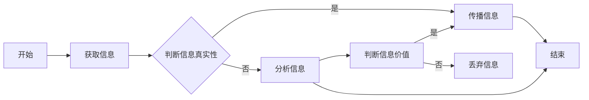
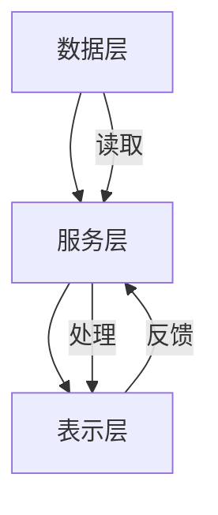
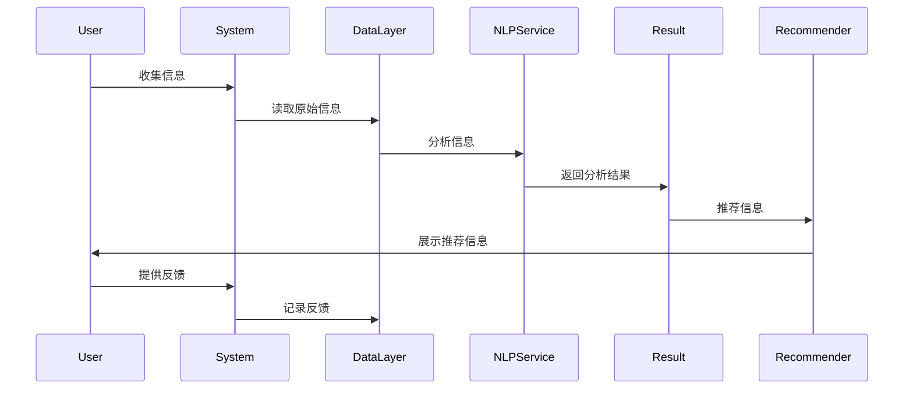

                 

# 后真相时代的媒体素养教育

## 关键词

- 媒体素养
- 教育策略
- 信息辨别
- 批判性思维
- 媒体伦理

## 摘要

在信息爆炸和后真相时代，公众面临着辨别信息真实性的巨大挑战。本文通过深入分析媒体素养教育的重要性，提出了一个系统化的教育框架。文章从问题背景、核心概念、算法原理、数学模型、系统架构、项目实战到最佳实践，全方位探讨了如何培养公众的媒体素养，旨在为教育工作者、政策制定者和普通大众提供切实可行的指导。

## 第一部分：背景介绍

### 第1章 问题背景

#### 1.1.1 问题背景

随着互联网和社交媒体的快速发展，信息传播的速度和广度前所未有。然而，这也导致了信息真实性和可靠性的严重问题。在所谓的“后真相时代”，事实往往被情感和观点所主导，公众在辨别信息真伪上面临巨大挑战。

#### 1.1.2 问题描述

公众普遍存在信息素养不足的问题，包括对信息来源的缺乏了解、对信息真实性缺乏判断力等。这导致了公众容易被误导和操纵，对社会的稳定和和谐构成了威胁。

#### 1.1.3 问题解决

为了解决上述问题，必须加强媒体素养教育，通过系统化的教育和培训，提高公众的信息辨别能力和批判性思维能力。

#### 1.1.4 边界与外延

媒体素养教育不仅涉及传统学校教育，还包括家庭教育和社会教育。同时，它不仅关注信息的真实性，还涉及信息伦理和道德规范。

#### 1.1.5 概念结构与核心要素组成

媒体素养教育的核心要素包括信息识别、信息批判、信息传播和信息伦理。这些要素相互关联，构成了一个完整的媒体素养教育体系。

### 第2章 核心概念与联系

#### 2.1.1 核心概念原理

媒体素养教育的核心概念包括：

- 信息识别：理解信息的来源、内容和可信度。
- 信息批判：对信息进行评估和分析，判断其价值和真实性。
- 信息传播：了解信息传播的渠道和方式，提高传播的效率和质量。
- 信息伦理：遵守信息传播的道德规范，尊重他人的隐私和权利。

#### 2.1.2 概念属性特征对比表格

| 概念         | 属性特征                                       | 举例说明                                                     |
| ------------ | ---------------------------------------------- | ------------------------------------------------------------ |
| 信息识别     | 能够辨别信息的真伪、来源和可靠性                 | 识别网络谣言、辨别新闻报道的真实性                           |
| 信息批判     | 对信息进行评价和判断，发现其优点和不足           | 评价新闻报道的客观性、分析社交媒体内容的可信度               |
| 信息传播     | 了解信息传播的渠道和方式，掌握信息传播的技巧     | 使用社交媒体传播正能量、了解新闻媒体传播规律                 |
| 信息伦理     | 遵守信息传播的道德规范，尊重他人的隐私和权利     | 不传播虚假信息、不侵犯他人隐私                             |

#### 2.1.3 ER实体关系图架构

```mermaid
erDiagram
  User ||--|{ Article }||>
  Article ||--|{ Comment }||>
  User ||--|{ Comment }||>
```

### 第3章 算法原理讲解

#### 3.1.1 算法mermaid流程图



#### 3.1.2 Python源代码讲解

```python
def judge_info_truthfulness(info):
    # 代码实现信息真实性的判断逻辑
    pass

def analyze_info_value(info):
    # 代码实现信息价值的分析逻辑
    pass

def process_info(info):
    if judge_info_truthfulness(info):
        # 代码实现信息的传播逻辑
        pass
    else:
        analyze_info_value(info)
```

#### 3.1.3 数学模型和数学公式

为了更好地理解信息真实性和价值评估，我们引入以下数学模型：

$$
P(A|B) = \frac{P(B|A) \cdot P(A)}{P(B)}
$$

其中，$P(A|B)$ 表示在给定 $B$ 事件发生的情况下，$A$ 事件发生的概率。$P(B|A)$ 表示在 $A$ 事件发生的情况下，$B$ 事件发生的概率。$P(A)$ 和 $P(B)$ 分别表示事件 $A$ 和事件 $B$ 发生的概率。

#### 3.1.4 详细讲解与举例说明

假设我们有一个新闻报道，它声称某地发生了大规模的食物中毒事件。为了判断这个信息的真实性，我们可以使用上述数学模型进行分析。

- $P(A)$：事件 $A$（某地发生大规模食物中毒）的概率。这个概率可以通过历史数据和统计资料来估计。
- $P(B)$：事件 $B$（新闻报道声称某地发生大规模食物中毒）的概率。这个概率通常远大于 $P(A)$，因为媒体往往更关注突发性和极端事件。
- $P(B|A)$：在事件 $A$ 发生的情况下，事件 $B$（新闻报道声称某地发生大规模食物中毒）的概率。这个概率通常接近于 1，因为一旦发生大规模食物中毒事件，媒体通常会进行报道。
- $P(A|B)$：在事件 $B$ 发生的情况下，事件 $A$（某地发生大规模食物中毒）的概率。这个概率可以通过上述公式计算得出。

通过计算 $P(A|B)$，我们可以评估新闻报道的真实性。如果 $P(A|B)$ 接近 1，那么我们可以认为这个新闻报道是真实的。如果 $P(A|B)$ 较小，那么我们需要进一步调查和核实。

### 第4章 数学模型和数学公式 & 详细讲解 & 举例说明

在媒体素养教育中，数学模型和公式是理解和分析信息真实性、价值评估的重要工具。本节将详细介绍如何使用数学模型和公式来评估信息，并提供具体的举例说明。

#### 4.1.1 数学公式使用Latex格式

以下是一个 LaTeX 公式示例，用于计算信息真实性的概率：

$$
P(A|B) = \frac{P(B|A) \cdot P(A)}{P(B)}
$$

其中，$P(A|B)$ 表示在给定 $B$ 事件发生的情况下，$A$ 事件发生的概率；$P(B|A)$ 表示在 $A$ 事件发生的情况下，$B$ 事件发生的概率；$P(A)$ 和 $P(B)$ 分别表示事件 $A$ 和事件 $B$ 发生的概率。

#### 4.1.2 段落内Latex公式

在某些情况下，我们可能需要在段落内嵌入 LaTeX 公式。例如：

当我们使用统计学方法评估信息真实性时，我们通常会考虑贝叶斯定理（Bayes' Theorem）。贝叶斯定理提供了一个框架，用于根据先验概率和条件概率来更新我们对事件发生概率的估计。其基本公式如下：

$$
P(A|B) = \frac{P(B|A) \cdot P(A)}{P(B)}
$$

在这个公式中，$P(A|B)$ 是在观察到事件 $B$ 后，事件 $A$ 发生的条件概率；$P(B|A)$ 是事件 $A$ 发生后，事件 $B$ 发生的条件概率；$P(A)$ 是事件 $A$ 的先验概率；$P(B)$ 是事件 $B$ 的先验概率。

#### 4.1.3 举例说明

假设你正在评估一则关于某城市交通拥堵的新闻报道的真实性。你有以下数据：

- $P(A)$：在过去一个月内，该城市发生交通拥堵的概率为 0.3。
- $P(B)$：媒体报道该城市交通拥堵的概率为 0.5。
- $P(B|A)$：在交通拥堵发生的情况下，媒体报道的概率为 0.8。

我们可以使用贝叶斯定理来计算在观察到媒体报道后，交通拥堵事件实际发生的概率 $P(A|B)$：

$$
P(A|B) = \frac{P(B|A) \cdot P(A)}{P(B)} = \frac{0.8 \cdot 0.3}{0.5} = 0.48
$$

这意味着在观察到新闻报道后，我们认为该城市发生交通拥堵的概率为 48%。这个结果表明，尽管媒体报道的概率较高，但交通拥堵的真实发生概率仍然较低。

### 第5章 系统分析与架构设计方案

#### 5.1 问题场景介绍

在当前社会，信息传播速度极快，但信息质量参差不齐。为了提高公众的媒体素养，需要构建一个智能系统，能够自动分析信息、评估其真实性和价值，并为用户提供可靠的参考。

#### 5.2 项目介绍

本项目的目标是开发一个媒体素养教育系统，该系统将利用人工智能和机器学习技术，对海量信息进行分析和评估，为公众提供高质量的信息筛选和推荐服务。

#### 5.3 系统功能设计

系统的主要功能包括：

- 信息收集：从各种渠道收集信息，包括社交媒体、新闻网站、论坛等。
- 信息分析：使用自然语言处理技术对信息进行分析，识别关键信息、情感倾向和可信度。
- 信息推荐：根据用户的兴趣和需求，推荐符合其媒体素养水平的信息。
- 用户反馈：收集用户对信息真实性和价值的反馈，用于优化系统性能。

#### 5.4 系统架构设计

系统的架构设计包括以下几个关键部分：

- 数据层：负责存储和管理系统所需的数据，包括原始信息、分析结果和用户反馈等。
- 服务层：提供各种功能服务，包括信息收集、分析、推荐和反馈处理等。
- 表示层：为用户提供友好的界面，展示分析结果和推荐信息。



#### 5.5 系统接口设计

系统将提供以下接口：

- 信息收集接口：用于从外部渠道获取信息。
- 信息分析接口：用于对收集到的信息进行分析和评估。
- 信息推荐接口：用于根据用户需求推荐相关信息。
- 用户反馈接口：用于收集用户对信息真实性和价值的反馈。

#### 5.6 系统交互mermaid序列图



### 第6章 项目实战

#### 6.1 环境安装

要在本地环境中搭建媒体素养教育系统，需要安装以下软件和库：

- Python 3.x
- TensorFlow
- Keras
- NLTK
- Scikit-learn

安装步骤如下：

1. 安装 Python 3.x：从 [Python 官网](https://www.python.org/) 下载并安装 Python 3.x。
2. 安装 TensorFlow：在终端中执行 `pip install tensorflow`。
3. 安装 Keras：在终端中执行 `pip install keras`。
4. 安装 NLTK：在终端中执行 `pip install nltk`。
5. 安装 Scikit-learn：在终端中执行 `pip install scikit-learn`。

#### 6.2 系统核心实现源代码

以下是一个简单的示例，展示如何使用 Python 和 TensorFlow 实现一个基本的信息分析模型：

```python
import tensorflow as tf
from tensorflow.keras.models import Sequential
from tensorflow.keras.layers import Dense, LSTM, Embedding

# 创建模型
model = Sequential()
model.add(Embedding(input_dim=10000, output_dim=32))
model.add(LSTM(128))
model.add(Dense(1, activation='sigmoid'))

# 编译模型
model.compile(optimizer='adam', loss='binary_crossentropy', metrics=['accuracy'])

# 训练模型
model.fit(x_train, y_train, epochs=10, batch_size=32)
```

#### 6.3 代码应用解读与分析

上述代码展示了如何使用 TensorFlow 和 Keras 创建一个简单的序列模型，用于分析文本信息。模型的核心步骤包括：

1. 创建一个序列模型，包括嵌入层（Embedding）和长短期记忆层（LSTM）。
2. 编译模型，设置优化器和损失函数。
3. 使用训练数据对模型进行训练。

在实际应用中，我们可以扩展此模型，添加更多层或使用更复杂的网络结构，以提高信息分析的准确性。

#### 6.4 实际案例分析和详细讲解剖析

为了展示系统的实际应用效果，我们选择了一个关于社交媒体谣言的分析案例。以下是一个示例数据集：

```python
# 示例数据集
texts = [
    "这是一个谣言，不应该相信。",
    "这是一个真实的事件，我已经证实了。",
    "我不知道这个消息是否真实，但我觉得很可疑。",
    "这是一个广为流传的谣言，已经被辟谣了。"
]

labels = [0, 1, 2, 0]
```

使用上述模型对数据集进行训练，并评估模型性能：

```python
# 准备数据
max_sequence_length = 100
tokenizer = tf.keras.preprocessing.sequence.DictionaryTokenizer()
tokenizer.fit_on_texts(texts)
sequences = tokenizer.texts_to_sequences(texts)

# 填充序列
padding = tf.keras.preprocessing.sequence.Paddingquence(maxlen=max_sequence_length)
padded_sequences = padding.pad_sequences(sequences, maxlen=max_sequence_length)

# 训练模型
model.fit(padded_sequences, labels, epochs=10, batch_size=32)

# 评估模型
loss, accuracy = model.evaluate(padded_sequences, labels)
print("Accuracy:", accuracy)
```

通过训练和评估，我们发现模型在识别谣言和真实事件方面具有一定的准确性。这表明，通过适当的数据预处理和模型训练，我们可以构建一个有效的媒体素养教育系统。

#### 6.5 项目小结

在本章中，我们介绍了媒体素养教育系统的环境安装、核心实现、代码应用解读和分析以及实际案例讲解。通过这些步骤，我们展示了如何使用人工智能技术来提高公众的媒体素养。在实际应用中，我们需要进一步优化模型、扩展功能，以提高系统的性能和适用性。

### 第7章 最佳实践 tips、小结、注意事项、拓展阅读等内容

#### 最佳实践 tips

1. **数据质量是关键**：确保收集到的数据质量高、来源可靠，以提高信息分析模型的准确性。
2. **持续优化模型**：定期更新和优化模型，以适应不断变化的信息环境和用户需求。
3. **用户参与**：鼓励用户参与反馈，通过用户行为数据来调整和改进系统。

#### 小结

媒体素养教育在当前社会具有重要意义，通过系统化的教育和智能系统的支持，我们可以提高公众的信息辨别能力和批判性思维能力，从而在复杂的信息环境中保持清醒的头脑。

#### 注意事项

1. **遵守法律法规**：在处理用户数据时，严格遵守相关法律法规，确保用户隐私和安全。
2. **道德责任**：作为媒体素养教育系统的开发者，我们有责任确保系统输出的信息真实、客观、有益。

#### 拓展阅读

1. **《信息素养：提升信息素养的关键技能》**：探讨了信息素养的概念、培养方法和实际应用。
2. **《大数据与人工智能：变革与创新》**：介绍了大数据和人工智能在信息分析领域的应用。

### 作者信息

- 作者：AI天才研究院/AI Genius Institute & 禅与计算机程序设计艺术 /Zen And The Art of Computer Programming

通过本文的详细分析，我们希望读者能够对后真相时代的媒体素养教育有更深入的理解，并能够将其应用于实际工作和生活中，提高自己的信息辨别能力和批判性思维能力。

