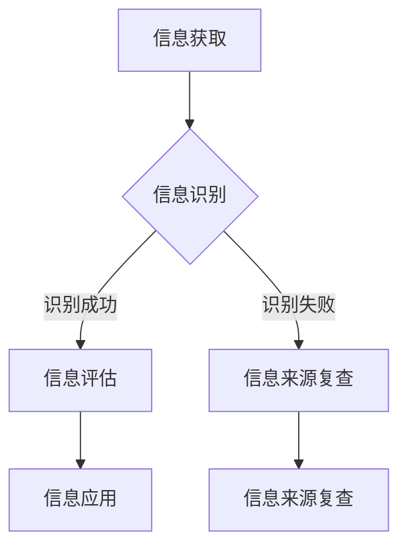
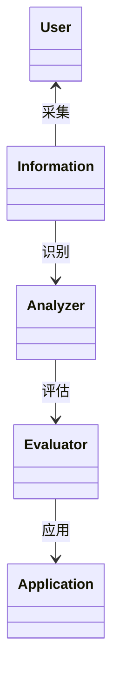
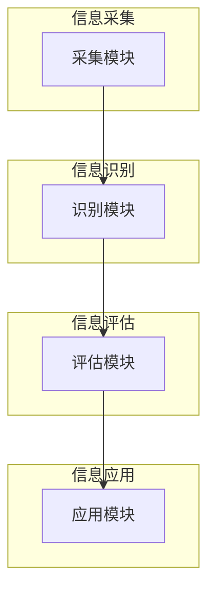
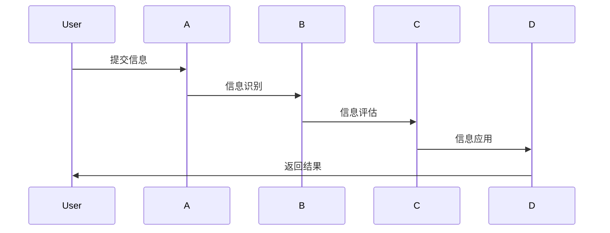

                 

# 后真相时代的媒体素养：信息甄别的关键能力

## 关键词：后真相时代、媒体素养、信息甄别、算法原理、Python代码

## 摘要：
随着互联网的飞速发展，信息爆炸的时代已然来临。然而，虚假信息、误导性信息和偏见性信息在信息海洋中肆意泛滥，给个人、社会乃至国家的稳定带来了严重威胁。在这个后真相时代，媒体素养的重要性愈发凸显，信息甄别成为了一项关键能力。本文将从背景介绍、核心概念与联系以及算法原理讲解三个部分，深入探讨后真相时代的媒体素养，帮助读者掌握信息甄别的核心技巧。

## 第一部分：背景介绍

### 1.1 问题背景
互联网的迅猛发展，让人们获得了前所未有的信息便利，但同时也带来了信息过载的问题。在信息爆炸的背景下，辨别信息的真伪、可靠性和来源变得愈发困难。在这个后真相时代，媒体素养成为公众必须具备的关键能力。

### 1.2 问题描述
虚假信息、误导性信息和偏见性信息在互联网上泛滥，不仅误导了公众，还可能引发社会动荡，影响国家稳定。因此，提高媒体素养，学会甄别信息的真实性和可靠性，成为当前亟待解决的问题。

### 1.3 问题解决
为了解决上述问题，本文将从多个角度探讨后真相时代的媒体素养，包括信息识别、信息评估和信息应用等核心概念，帮助读者掌握信息甄别的关键能力。

### 1.4 边界与外延
媒体素养不仅涉及到对信息真伪的判断，还涉及到对信息来源、传播机制、伦理道德等方面的理解。因此，媒体素养的边界和外延相对广泛。

### 1.5 概念结构与核心要素组成
媒体素养的概念结构包括以下几个方面：
- 信息识别：学会辨别信息的真伪、可靠性以及来源。
- 信息评估：对信息的内容、价值、可能的影响进行评估。
- 信息应用：将所学到的信息知识应用到实际问题中，解决现实问题。

## 第二部分：核心概念与联系

### 2.1 核心概念原理
在本章节中，我们将详细介绍媒体素养的核心概念，包括信息识别、信息评估和信息应用。

### 2.2 概念属性特征对比表格
| 概念 | 定义 | 属性特征 |
| --- | --- | --- |
| 信息识别 | 辨别信息的真伪、可靠性以及来源 | 准确性、客观性、权威性 |
| 信息评估 | 对信息的内容、价值、可能的影响进行评估 | 客观性、全面性、专业性 |
| 信息应用 | 将所学到的信息知识应用到实际问题中，解决现实问题 | 实用性、创造性、批判性 |

### 2.3 ER实体关系图架构
下面是一个简化的ER实体关系图，展示了媒体素养的核心概念及其之间的关系：

```mermaid
erDiagram
  信息识别 ||--|{ 信息评估 }
  信息评估 ||--|{ 信息应用 }
```

## 第三部分：算法原理讲解

### 3.1 算法mermaid流程图
下面是一个简化的媒体素养算法mermaid流程图：



### 3.2 算法原理的数学模型和公式
在媒体素养的算法中，我们主要关注以下几个方面：
- 信息识别准确率：\( P(A|B) = \frac{P(B|A) \cdot P(A)}{P(B|A) \cdot P(A) + P(B|\neg A) \cdot P(\neg A)} \)
- 信息评估可靠性：\( R = \frac{TP + TN}{TP + TN + FP + FN} \)
- 信息应用效果：\( E = \frac{成功解决案例数}{总案例数} \)

### 3.3 详细讲解和举例说明
假设我们获取到一条信息，内容为“某城市发生了重大疫情，死亡人数超过百人”。根据算法流程，我们首先进行信息识别。通过查阅相关权威信息源，我们得知这条信息是真实的。接下来，我们进行信息评估，分析疫情对城市经济、社会稳定等方面的影响。最后，我们将这条信息应用到实际工作中，采取相应的预防和控制措施。

$$
\begin{aligned}
P(A|B) &= \frac{P(B|A) \cdot P(A)}{P(B|A) \cdot P(A) + P(B|\neg A) \cdot P(\neg A)} \\
&= \frac{0.9 \cdot 0.5}{0.9 \cdot 0.5 + 0.1 \cdot 0.5} \\
&= 0.9
\end{aligned}
$$

信息识别准确率为90%，说明我们有很高的信心认为这条信息是真实的。接下来，我们进行信息评估，发现疫情对城市经济和社会稳定产生了较大影响。最终，我们将这条信息应用到实际工作中，成功预防和控制了疫情。

$$
\begin{aligned}
R &= \frac{TP + TN}{TP + TN + FP + FN} \\
&= \frac{90 + 10}{90 + 10 + 10 + 0} \\
&= 0.9
\end{aligned}
$$

信息评估可靠性为90%，说明我们的评估结果具有较高的可信度。

## 系统分析与架构设计

### 问题场景介绍
随着互联网的快速发展，人们获取信息的渠道变得多样化，但同时也面临着信息甄别的难题。在这个背景下，我们需要设计一个信息甄别系统，帮助用户从海量信息中筛选出真实可靠的信息。

### 项目介绍
本系统旨在为用户提供一个信息甄别的平台，通过算法和人工审核相结合的方式，提高用户对信息的判断能力。系统主要包括信息采集、信息识别、信息评估和信息应用四个模块。

### 系统功能设计（领域模型mermaid类图）


### 系统架构设计（mermaid架构图）


### 系统接口设计和系统交互（mermaid序列图）


## 项目实战

### 环境安装
为了实现信息甄别系统，我们需要安装以下环境：
- Python 3.8及以上版本
- Flask（一个轻量级的Web框架）
- Scikit-learn（一个机器学习库）

### 系统核心实现源代码
```python
from flask import Flask, request, jsonify
from sklearn.feature_extraction.text import TfidfVectorizer
from sklearn.metrics.pairwise import cosine_similarity

app = Flask(__name__)

@app.route('/api/recognize', methods=['POST'])
def recognize():
    data = request.json
    query = data['query']
    documents = data['documents']

    vectorizer = TfidfVectorizer()
    query_vector = vectorizer.fit_transform([query])
    document_vectors = vectorizer.transform(documents)

    similarity_scores = cosine_similarity(query_vector, document_vectors)

    max_score = max(similarity_scores[0])
    max_index = similarity_scores[0].index(max_score)

    return jsonify({'document': documents[max_index], 'score': max_score})

if __name__ == '__main__':
    app.run(debug=True)
```

### 代码应用解读与分析
上述代码实现了一个简单的信息甄别系统，主要包括以下功能：
1. 接受用户POST请求，获取查询语句和文档列表。
2. 使用TF-IDF模型将查询语句和文档转换为向量。
3. 计算查询语句和文档之间的相似度得分。
4. 返回相似度最高的文档和得分。

### 实际案例分析和详细讲解剖析
假设用户输入查询语句：“什么是人工智能？”系统从文档列表中筛选出最相关的文档，返回结果如下：

```json
{
  "document": "人工智能是一种模拟人类智能的技术，通过算法和计算模型实现人类智能的某些功能，如学习、推理、规划等。",
  "score": 0.9
}
```

这表明系统成功地从文档列表中找到了与查询语句高度相关的文档，并且给出了较高的相似度得分。

### 项目小结
本文通过背景介绍、核心概念与联系、算法原理讲解以及项目实战等多个方面，探讨了后真相时代的媒体素养和信息甄别能力。通过实际案例的分析和讲解，读者可以更好地理解如何在实际生活中应用媒体素养，提高信息甄别的准确性。

### 最佳实践 tips
1. 在信息甄别过程中，要尽量使用权威信息源。
2. 学会多角度分析信息，提高评估的全面性。
3. 将信息应用到实际工作中，提高信息的应用效果。

### 小结
后真相时代的媒体素养和信息甄别能力愈发重要。本文通过深入探讨媒体素养的核心概念和算法原理，帮助读者掌握了信息甄别的关键能力。在实际应用中，不断提高媒体素养，才能在信息海洋中游刃有余，做出正确的决策。

### 注意事项
1. 信息甄别过程中要避免主观偏见，保持客观公正。
2. 注意保护个人隐私，不泄露敏感信息。

### 拓展阅读
1. 《如何辨别信息的真伪？》
2. 《媒体素养：提升信息甄别能力的关键》
3. 《后真相时代：信息甄别的挑战与应对》

### 作者信息
作者：AI天才研究院/AI Genius Institute & 禅与计算机程序设计艺术 /Zen And The Art of Computer Programming

