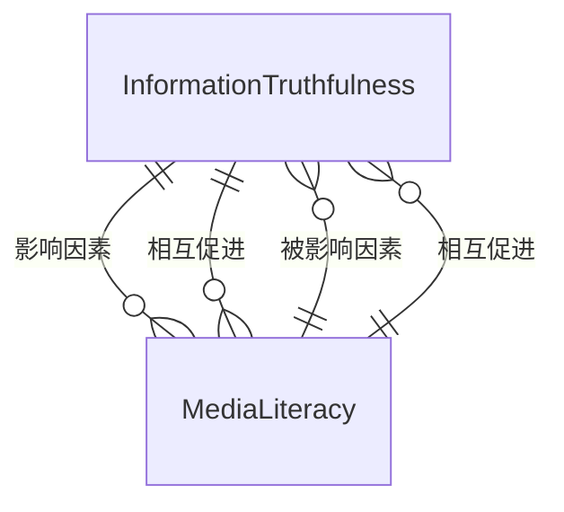
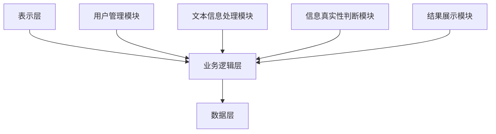
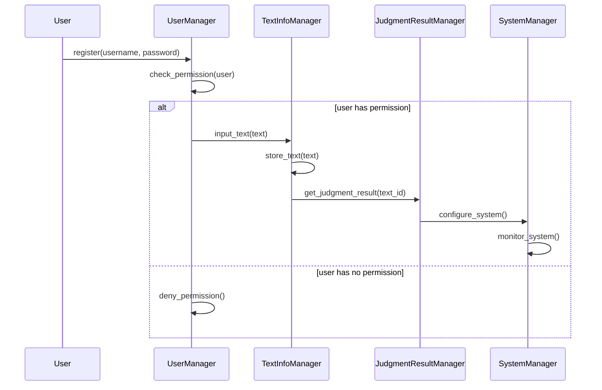

                 

### 第1章: 后真相时代的背景介绍

#### 1.1 问题背景

随着互联网和社交媒体的迅猛发展，信息传播的速度和广度发生了翻天覆地的变化。在过去，信息的传播主要依赖于传统媒体，如报纸、电视和广播，这些渠道的信息经过了一定的审核和筛选，真实性相对较高。然而，随着社交媒体的崛起，任何用户都可以成为信息传播者，信息的真实性和可靠性变得更加难以保障。

**1.1.1 社会媒体与信息传播的变革**

社会媒体的兴起，如Facebook、Twitter、微博等，为用户提供了随时随地分享信息和观点的平台。用户可以通过点赞、评论和转发等方式，迅速将信息传播给大量受众。这种快速、广泛的信息传播方式，虽然促进了信息的流通和交流，但也带来了新的挑战。

首先，社交媒体上的信息来源多样且复杂。不仅有官方媒体、专业机构发布的信息，还有个人用户、甚至不法分子发布的信息。这些信息中，不乏虚假、误导性的内容，给信息真实性判断带来了极大挑战。

其次，信息传播的速度和广度大大增加。在社交媒体上，一个虚假信息可能在短时间内迅速传播，造成广泛的误导和恐慌。例如，2016年美国大选期间，社交媒体上充斥着各种虚假信息，对选情的判断产生了负面影响。

**1.1.2 后真相时代的定义与特征**

后真相（Post-truth）时代，是指事实和真相在信息传播和公众决策中不再占据主导地位的时代。这一概念最早由英国政治学者彼得·蒂姆（Peter Popham）提出，意指“情感和偏见往往比事实和证据更有影响力”。

后真相时代的特征主要包括：

1. **情感化传播**：信息传播更加注重情感上的共鸣，而非事实本身。虚假信息和误导性信息往往通过煽动情感、激发情绪来吸引受众。
2. **去中心化传播**：信息来源更加多样，传播渠道更加广泛。传统媒体的垄断地位被打破，任何个人都可以成为信息传播者。
3. **快速传播**：社交媒体的快速传播特性，使得信息可以在短时间内覆盖大量受众。
4. **反智主义**：后真相时代，公众对专业知识和科学证据的信任度下降，更容易被误导性信息所影响。

**1.1.3 媒体素养的内涵与重要性**

媒体素养（Media Literacy）是指个体理解和批判媒体信息的能力，包括对媒体信息的解读、分析、评价和创造能力。它不仅涉及媒体内容的理解，还包括对媒体生产过程和媒体环境的认识。

在当前后真相时代，培养媒体素养具有重要意义：

1. **提高信息真实性判断能力**：通过培养媒体素养，个体可以更有效地识别和判断信息的真实性，避免被虚假信息误导。
2. **促进理性思考和批判性思维**：媒体素养有助于个体形成理性思考的习惯，培养批判性思维能力，从而在面对复杂信息时能够做出更为明智的决策。
3. **增强社会参与感和责任感**：媒体素养使个体能够更好地理解和参与社会事务，提高社会责任感和公民素养。
4. **提升信息传播质量**：媒体素养不仅适用于个人，也适用于媒体从业者和信息传播者。通过提升媒体素养，可以减少虚假信息的传播，提高信息的整体质量。

#### 1.2 问题描述

**1.2.1 信息真实性判断的挑战**

在当前社会，信息真实性判断面临诸多挑战：

1. **虚假信息泛滥**：社交媒体上充斥着各种虚假信息、谣言和误导性内容，这些信息往往通过精心设计来吸引受众，使其难以分辨。
2. **信息来源复杂**：信息来源多样化，包括官方媒体、个人用户、甚至不法分子，使得信息真实性的判断变得更加复杂。
3. **情感化传播**：虚假信息往往通过煽动情感、激发情绪来传播，使得信息真实性判断更加困难。

**1.2.2 媒体素养缺失的影响**

媒体素养的缺失对个人和社会产生了深远的影响：

1. **信息误导**：缺乏媒体素养的个体更容易被虚假信息误导，从而影响个人决策和判断。
2. **社会动荡**：虚假信息的广泛传播可能引发社会恐慌和动荡，影响社会稳定。
3. **信息鸿沟**：媒体素养水平的不均衡导致信息鸿沟的扩大，信息富有者和信息贫困者之间的差距进一步加大。

**1.2.3 信息真实性判断能力培养的必要性**

鉴于信息真实性判断面临的挑战和媒体素养缺失的影响，培养信息真实性判断能力显得尤为必要：

1. **提高个体应对能力**：通过培养信息真实性判断能力，个体可以更好地应对虚假信息的挑战，保护自己的信息安全和隐私。
2. **增强社会信任感**：提升信息真实性判断能力有助于减少虚假信息的传播，增强社会对媒体和信息的信任。
3. **促进社会和谐**：通过提高媒体素养，可以促进公众对社会事务的理性思考，减少社会矛盾和冲突。

#### 1.3 问题解决

**1.3.1 信息真实性判断的理论基础**

信息真实性判断的理论基础主要包括以下几个方面：

1. **事实核查**：通过查证信息的来源、出处、历史记录等，来判断信息的真实性。
2. **逻辑分析**：运用逻辑推理，分析信息的合理性和逻辑一致性。
3. **批判性思维**：培养批判性思维能力，对信息进行深入分析和评价。
4. **专业知识**：依赖专业知识和科学方法，对信息进行验证和判断。

**1.3.2 媒体素养教育的发展历程**

媒体素养教育的发展历程可以追溯到20世纪中期，随着媒体的发展，媒体素养教育也不断演进：

1. **初步阶段**：20世纪50年代，媒体素养教育主要关注媒体信息的获取和解读。
2. **发展阶段**：20世纪80年代，随着社交媒体的兴起，媒体素养教育开始强调批判性思维和信息真实性判断能力的培养。
3. **深化阶段**：21世纪初，后真相时代的到来，媒体素养教育进一步强调媒体素养的综合培养，包括信息真实性判断、逻辑分析、批判性思维等。

**1.3.3 培养信息真实性判断能力的策略**

为了培养信息真实性判断能力，可以采取以下策略：

1. **教育普及**：通过学校教育、社会培训等方式，普及媒体素养知识，提高公众的媒体素养水平。
2. **技术工具**：利用技术手段，如事实核查网站、信息过滤算法等，辅助个体进行信息真实性判断。
3. **媒体自律**：媒体应自觉履行社会责任，加强内容审核和事实核查，减少虚假信息的传播。
4. **公众参与**：鼓励公众积极参与媒体事务，提高社会对媒体的关注度和参与度。

#### 1.4 边界与外延

**1.4.1 后真相时代媒体素养的边界**

后真相时代的媒体素养不仅涉及信息真实性判断，还包括对媒体传播机制、媒体环境的认识。其边界主要包括：

1. **信息真实性判断**：关注信息来源、出处、历史记录等，判断信息的真实性。
2. **逻辑分析和批判性思维**：培养逻辑分析和批判性思维能力，对信息进行深入分析和评价。
3. **媒体伦理和法规**：了解媒体伦理和法规，遵守媒体传播规范。

**1.4.2 媒体素养教育的应用领域**

媒体素养教育的应用领域广泛，包括但不限于以下几个方面：

1. **教育领域**：通过学校教育，培养学生的媒体素养，提高其信息真实性判断能力。
2. **新闻传媒领域**：新闻从业人员应具备较高的媒体素养，以提高新闻报道的真实性和可信度。
3. **社会管理领域**：政府和社会组织应加强对虚假信息的监管和打击，提高社会对媒体信息的辨识能力。

**1.4.3 信息真实性判断能力培养的挑战与展望**

信息真实性判断能力培养面临以下挑战：

1. **信息量巨大**：随着信息量的急剧增加，个体难以全面了解和判断所有信息。
2. **技术手段有限**：现有技术手段在信息真实性判断方面仍存在一定局限性。
3. **公众认知差异**：不同个体的媒体素养水平存在较大差异，培养信息真实性判断能力需要因地制宜。

展望未来，随着技术的发展和教育的普及，信息真实性判断能力培养有望取得以下进展：

1. **智能化工具**：利用人工智能和大数据技术，提高信息真实性判断的效率和准确性。
2. **教育体系完善**：构建完善的媒体素养教育体系，提高公众的整体媒体素养水平。
3. **社会共识**：形成社会共识，共同应对虚假信息挑战，提高社会对媒体信息的信任度。

#### 1.5 概念结构与核心要素组成

**1.5.1 关键概念解析**

1. **后真相时代**：指事实和真相在信息传播和公众决策中不再占据主导地位的时代，情感和偏见往往比事实和证据更有影响力。
2. **媒体素养**：个体理解和批判媒体信息的能力，包括对媒体信息的解读、分析、评价和创造能力。
3. **信息真实性判断**：通过查证信息的来源、出处、历史记录等，来判断信息的真实性。
4. **批判性思维**：对信息进行深入分析和评价，识别和质疑信息中的逻辑错误和偏见。

**1.5.2 核心要素框架**

媒体素养和信息真实性判断的核心要素框架包括：

1. **信息来源**：包括官方媒体、专业机构、个人用户等，是判断信息真实性的重要依据。
2. **信息内容**：包括事实、观点、数据等，是判断信息真实性的核心内容。
3. **批判性思维能力**：包括逻辑分析、证据核查、情感控制等，是进行信息真实性判断的重要工具。
4. **媒体素养教育**：通过学校教育、社会培训等方式，提高公众的媒体素养水平。

**1.5.3 概念间的联系与作用**

1. **后真相时代与媒体素养**：后真相时代需要个体具备较高的媒体素养，以应对虚假信息和误导性信息的挑战。
2. **信息真实性判断与媒体素养**：媒体素养的提高有助于个体更好地进行信息真实性判断。
3. **批判性思维与信息真实性判断**：批判性思维能力是进行信息真实性判断的基础，有助于识别和质疑信息中的逻辑错误和偏见。

### 第2章: 核心概念与联系

#### 2.1 信息真实性判断原理

**2.1.1 信息真实性的定义**

信息真实性（Information Truthfulness）是指信息在传播过程中保持与客观事实一致的程度。一个真实的信息应当具备以下几个特征：

1. **准确性**：信息内容与客观事实相符，没有误导性。
2. **完整性**：信息内容完整，没有遗漏重要事实。
3. **可靠性**：信息来源可靠，值得信赖。
4. **可验证性**：信息内容可以通过外部证据进行验证。

**2.1.2 信息真实性的评估方法**

信息真实性的评估方法主要包括以下几个方面：

1. **事实核查**：通过查证信息的来源、出处、历史记录等，来判断信息的真实性。
2. **逻辑分析**：运用逻辑推理，分析信息的合理性和逻辑一致性。
3. **证据核查**：查找相关证据，如官方公告、专业报告、专家意见等，来验证信息的内容。
4. **同行评审**：专业领域内的同行对信息进行评估和审核，以提高其真实性。

**2.1.3 信息真实性判断的流程**

信息真实性判断的流程可以概括为以下几个步骤：

1. **初步筛选**：根据信息来源、内容特征等，对信息进行初步筛选，排除明显虚假的信息。
2. **细节核查**：对筛选出的信息进行进一步核查，查证其来源、出处和历史记录。
3. **逻辑分析**：运用逻辑推理，分析信息的合理性和逻辑一致性。
4. **证据核查**：查找相关证据，如官方公告、专业报告、专家意见等，来验证信息的内容。
5. **综合评估**：根据以上分析结果，对信息进行综合评估，判断其真实性。

#### 2.2 媒体素养的核心概念

**2.2.1 媒体素养的构成要素**

媒体素养（Media Literacy）的构成要素包括以下几个方面：

1. **信息解读能力**：理解媒体信息的内容、形式和传播方式，能够识别信息的意图和目的。
2. **信息分析能力**：对媒体信息进行批判性分析，识别其中的逻辑错误、偏见和误导性内容。
3. **信息评价能力**：根据媒体信息的内容、来源和传播环境，对信息的真实性和可信度进行评估。
4. **信息创造能力**：能够运用媒体工具和技术，创造和传播真实、有价值的信息。

**2.2.2 媒体素养的培养目标**

媒体素养的培养目标主要包括以下几个方面：

1. **提高信息真实性判断能力**：培养个体对媒体信息的批判性思维，提高其判断信息真实性的能力。
2. **促进理性思考和批判性思维**：培养个体在信息接收和处理过程中，能够运用理性思考和批判性思维，避免被虚假信息误导。
3. **增强社会参与感和责任感**：通过媒体素养教育，提高个体对社会事务的参与感和责任感，促进社会的和谐发展。

**2.2.3 媒体素养在信息真实性判断中的作用**

媒体素养在信息真实性判断中发挥着重要作用：

1. **提高识别能力**：通过培养媒体素养，个体可以更好地识别媒体信息中的虚假内容、误导性信息和偏见。
2. **增强批判性思维**：媒体素养培养个体的批判性思维能力，使其能够深入分析媒体信息，识别其中的逻辑错误和偏见。
3. **提升评估能力**：媒体素养教育使个体能够根据媒体信息的内容、来源和传播环境，对信息的真实性和可信度进行准确评估。
4. **促进信息创造**：通过媒体素养培养，个体不仅能够识别和判断信息真实性，还能创造和传播真实、有价值的信息。

#### 2.3 信息真实性判断与媒体素养的关系

**2.3.1 相互影响**

信息真实性判断与媒体素养之间存在相互影响的关系：

1. **媒体素养影响信息真实性判断**：较高的媒体素养有助于个体更好地进行信息真实性判断，识别虚假信息、误导性信息和偏见。
2. **信息真实性判断影响媒体素养**：有效的信息真实性判断实践可以提高个体的媒体素养，使其在未来的信息接收和处理过程中，更加注重真实性和可信度。

**2.3.2 相互促进**

媒体素养和信息真实性判断之间存在相互促进的关系：

1. **媒体素养促进信息真实性判断**：通过媒体素养教育，个体可以学习到有效的信息真实性判断方法和策略，提高其判断能力。
2. **信息真实性判断促进媒体素养**：个体在实践信息真实性判断过程中，会遇到各种问题和挑战，这些经历可以促进其媒体素养的提升。

**2.3.3 关联表格与ER图**

为了更清晰地展示信息真实性判断与媒体素养之间的关系，可以使用关联表格和ER图进行表示。

**关联表格**：

| 关键概念 | 影响因素 | 被影响因素 | 相互关系 |
| :--: | :--: | :--: | :--: |
| 信息真实性判断 | 媒体素养 |  | 相互影响 |
| 媒体素养 | 信息真实性判断 |  | 相互影响 |
| 信息真实性判断 |  | 媒体素养 | 相互促进 |
| 媒体素养 |  | 信息真实性判断 | 相互促进 |

**ER图**：



通过以上关联表格和ER图，我们可以更直观地理解信息真实性判断与媒体素养之间的关系。

### 第3章: 算法原理讲解

#### 3.1 基本算法介绍

在信息真实性判断过程中，常用的算法包括机器学习算法、文本分析算法和图像识别算法。这些算法为信息真实性判断提供了强大的技术支持。

**3.1.1 机器学习算法基础**

机器学习算法（Machine Learning Algorithms）是一种通过训练模型，从数据中自动学习和发现规律的技术。常见的机器学习算法包括：

1. **决策树**：通过树形结构来模拟决策过程，对数据进行分类或回归。
2. **支持向量机**：通过找到一个最优的超平面，将不同类别的数据分隔开。
3. **神经网络**：模仿人脑神经元的工作方式，通过多层神经网络进行数据分类和预测。

**3.1.2 文本分析算法简介**

文本分析算法（Text Analysis Algorithms）用于处理和分析文本数据，主要包括：

1. **词频分析**：统计文本中每个单词出现的次数，用于文本特征提取。
2. **主题模型**：通过无监督学习技术，挖掘文本中的潜在主题。
3. **情感分析**：判断文本中表达的情感倾向，如正面、负面或中性。

**3.1.3 图像识别算法基础**

图像识别算法（Image Recognition Algorithms）用于识别和分类图像中的对象，主要包括：

1. **卷积神经网络**：通过多层卷积和池化操作，提取图像特征，进行分类和识别。
2. **深度学习**：利用深度神经网络模型，对图像进行自动标注和分类。

#### 3.2 信息真实性判断算法

**3.2.1 算法原理**

信息真实性判断算法（Information Truthfulness Judgment Algorithm）基于机器学习技术，通过训练模型，从大量数据中学习并识别虚假信息、误导性信息等。其原理包括：

1. **数据预处理**：对原始数据进行清洗、归一化等处理，使其适合于模型训练。
2. **特征提取**：从原始数据中提取关键特征，如词频、主题、情感等。
3. **模型训练**：使用标记好的训练数据，训练分类模型，如决策树、支持向量机等。
4. **模型评估**：使用验证集和测试集，评估模型的准确性和泛化能力。
5. **信息判断**：使用训练好的模型，对新的信息进行判断，判断其真实性。

**3.2.2 算法流程**

信息真实性判断算法的流程包括以下几个步骤：

1. **数据收集**：收集大量标记好的数据，包括真实信息和虚假信息。
2. **数据预处理**：对数据进行清洗、归一化等处理，使其适合于模型训练。
3. **特征提取**：从原始数据中提取关键特征，如词频、主题、情感等。
4. **模型训练**：使用标记好的训练数据，训练分类模型，如决策树、支持向量机等。
5. **模型评估**：使用验证集和测试集，评估模型的准确性和泛化能力。
6. **信息判断**：使用训练好的模型，对新的信息进行判断，判断其真实性。

**3.2.3 Python源代码实现**

以下是一个基于决策树算法的信息真实性判断的Python代码实现：

```python
from sklearn.datasets import load_iris
from sklearn.model_selection import train_test_split
from sklearn.tree import DecisionTreeClassifier
from sklearn.metrics import accuracy_score

# 加载鸢尾花数据集
iris = load_iris()
X, y = iris.data, iris.target

# 划分训练集和测试集
X_train, X_test, y_train, y_test = train_test_split(X, y, test_size=0.2, random_state=42)

# 创建决策树分类器
clf = DecisionTreeClassifier()

# 训练模型
clf.fit(X_train, y_train)

# 预测测试集
y_pred = clf.predict(X_test)

# 评估模型
accuracy = accuracy_score(y_test, y_pred)
print("Accuracy:", accuracy)
```

**3.2.4 数学模型和公式**

信息真实性判断算法的数学模型主要包括分类模型的损失函数和优化算法。

**1. 损失函数**

对于分类问题，常用的损失函数包括：

1. **对数损失函数**（Log Loss）：用于二分类问题，公式为：
   $$ \text{Log Loss} = -\frac{1}{n}\sum_{i=1}^{n}y_i\log(\hat{y_i}) + (1-y_i)\log(1-\hat{y_i}) $$
   其中，$y_i$为实际标签，$\hat{y_i}$为预测概率。

2. **交叉熵损失函数**（Cross Entropy Loss）：用于多分类问题，公式为：
   $$ \text{Cross Entropy Loss} = -\frac{1}{n}\sum_{i=1}^{n}y_i\log(\hat{y_i}) $$
   其中，$y_i$为实际标签，$\hat{y_i}$为预测概率。

**2. 优化算法**

常见的优化算法包括：

1. **梯度下降**（Gradient Descent）：基于损失函数的梯度，迭代更新模型参数，公式为：
   $$ \theta_{\text{new}} = \theta_{\text{old}} - \alpha \nabla_\theta J(\theta) $$
   其中，$\theta$为模型参数，$\alpha$为学习率，$J(\theta)$为损失函数。

2. **随机梯度下降**（Stochastic Gradient Descent，SGD）：在梯度下降的基础上，每次迭代只更新一个样本的参数，公式为：
   $$ \theta_{\text{new}} = \theta_{\text{old}} - \alpha \nabla_\theta J(\theta_i) $$
   其中，$\theta$为模型参数，$\alpha$为学习率，$\theta_i$为第$i$个样本的参数。

#### 3.3 算法应用举例

**3.3.1 社交媒体信息真实性判断**

在社交媒体上，信息真实性判断算法可以用于检测和过滤虚假信息。以下是一个简单的示例：

1. **数据收集**：从社交媒体平台（如微博、Twitter）上收集大量带有标签（真实/虚假）的文本数据。
2. **数据预处理**：对文本数据进行清洗，去除标点符号、停用词等，进行词频统计。
3. **特征提取**：提取文本数据的词频、主题、情感等特征。
4. **模型训练**：使用训练数据，训练分类模型（如决策树、支持向量机）。
5. **模型评估**：使用验证集和测试集，评估模型的准确性和泛化能力。
6. **信息判断**：使用训练好的模型，对新的社交媒体信息进行判断，判断其真实性。

**3.3.2 新闻报道真实性验证**

在新闻报道中，信息真实性判断算法可以用于验证新闻报道的真实性。以下是一个简单的示例：

1. **数据收集**：收集带有标签（真实/虚假）的新闻报道数据。
2. **数据预处理**：对新闻报道数据进行清洗，去除格式化内容、图片等。
3. **特征提取**：提取新闻报道的标题、正文、作者、发布时间等特征。
4. **模型训练**：使用训练数据，训练分类模型（如决策树、支持向量机）。
5. **模型评估**：使用验证集和测试集，评估模型的准确性和泛化能力。
6. **信息判断**：使用训练好的模型，对新的新闻报道进行判断，判断其真实性。

**3.3.3 信息真实性判断算法的优缺点分析**

信息真实性判断算法的优点包括：

1. **自动化**：算法可以自动处理大量数据，提高信息真实性判断的效率。
2. **客观性**：算法基于数据和模型，减少人为因素，提高判断的客观性。
3. **可扩展性**：算法可以应用于不同领域和场景，具有较好的可扩展性。

信息真实性判断算法的缺点包括：

1. **数据依赖**：算法的性能依赖于训练数据的质量和多样性，数据不足可能导致模型过拟合。
2. **复杂性**：算法的实现和调试较为复杂，需要一定的技术背景和专业知识。
3. **误判**：算法可能存在误判，尤其在信息复杂、模糊的情况下，可能无法准确判断信息真实性。

### 第4章: 数学模型和数学公式 & 详细讲解 & 举例说明

#### 4.1 数学模型基础

在信息真实性判断过程中，常用的数学模型包括概率模型、统计模型和信息论模型。这些模型为我们提供了有效的工具来评估和验证信息的真实性。

**4.1.1 常用数学公式**

1. **概率论公式**：
   - 条件概率：$P(A|B) = \frac{P(A \cap B)}{P(B)}$
   - 贝叶斯定理：$P(A|B) = \frac{P(B|A)P(A)}{P(B)}$
   - 全概率公式：$P(A) = \sum_{i=1}^{n}P(A|B_i)P(B_i)$

2. **统计学公式**：
   - 均值：$\bar{x} = \frac{1}{n}\sum_{i=1}^{n}x_i$
   - 方差：$s^2 = \frac{1}{n-1}\sum_{i=1}^{n}(x_i - \bar{x})^2$
   - 标准差：$s = \sqrt{s^2}$

3. **信息论公式**：
   - 熵：$H(X) = -\sum_{i=1}^{n}P(X=x_i)\log_2(P(X=x_i))$
   - 条件熵：$H(X|Y) = -\sum_{i=1}^{m}P(Y=y_i)\sum_{j=1}^{n}P(X=x_j|Y=y_i)\log_2(P(X=x_j|Y=y_i))$
   - 互信息：$I(X;Y) = H(X) - H(X|Y)$

**4.1.2 数学模型应用场景**

1. **概率论模型**：
   - 用于评估信息来源的可靠性，通过条件概率和贝叶斯定理，计算给定某个证据时，某个假设的概率。
   - 用于分类问题，通过计算特征的概率分布，判断数据属于哪个类别。

2. **统计学模型**：
   - 用于数据清洗和预处理，通过计算均值、方差和标准差，识别异常值和噪声。
   - 用于回归问题，通过拟合数据的线性或非线性模型，预测新的数据点。

3. **信息论模型**：
   - 用于信息量评估，通过计算熵和互信息，评估信息的质量和相关性。
   - 用于特征选择，通过计算特征的重要性和相关性，选择对信息真实性判断最有影响力的特征。

#### 4.2 数学公式详细讲解

**4.2.1 概率论公式**

概率论是研究随机事件和概率的数学分支。在信息真实性判断中，概率论模型可以帮助我们量化不确定性和可能性。

1. **条件概率**：
   条件概率是指在某个事件发生的条件下，另一个事件发生的概率。其公式为：
   $$ P(A|B) = \frac{P(A \cap B)}{P(B)} $$
   其中，$P(A \cap B)$表示事件A和事件B同时发生的概率，$P(B)$表示事件B发生的概率。

2. **贝叶斯定理**：
   贝叶斯定理是一种在已知某个事件发生的条件下，计算另一个事件概率的方法。其公式为：
   $$ P(A|B) = \frac{P(B|A)P(A)}{P(B)} $$
   其中，$P(A|B)$表示在事件B发生的条件下，事件A发生的概率，$P(B|A)$表示在事件A发生的条件下，事件B发生的概率，$P(A)$表示事件A发生的概率。

3. **全概率公式**：
   全概率公式是一种计算某个事件总概率的方法，通过考虑所有可能的事件和条件概率。其公式为：
   $$ P(A) = \sum_{i=1}^{n}P(A|B_i)P(B_i) $$
   其中，$P(A)$表示事件A的总概率，$P(A|B_i)$表示在事件$B_i$发生的条件下，事件A发生的条件概率，$P(B_i)$表示事件$B_i$发生的概率。

**4.2.2 统计学公式**

统计学是研究如何通过数据进行分析和推断的数学分支。在信息真实性判断中，统计学模型可以帮助我们处理和分析数据，识别异常和趋势。

1. **均值**：
   均值（Mean）是一组数据的平均数，表示数据的集中趋势。其公式为：
   $$ \bar{x} = \frac{1}{n}\sum_{i=1}^{n}x_i $$
   其中，$x_i$表示第$i$个数据点，$n$表示数据的总数。

2. **方差**：
   方差（Variance）是衡量数据离散程度的指标，表示数据点与均值之间的偏离程度。其公式为：
   $$ s^2 = \frac{1}{n-1}\sum_{i=1}^{n}(x_i - \bar{x})^2 $$
   其中，$s^2$表示方差，$x_i$表示第$i$个数据点，$\bar{x}$表示均值。

3. **标准差**：
   标准差（Standard Deviation）是方差的平方根，表示数据的离散程度。其公式为：
   $$ s = \sqrt{s^2} $$
   其中，$s$表示标准差。

**4.2.3 信息论公式**

信息论是研究信息传输和处理的数学分支。在信息真实性判断中，信息论模型可以帮助我们评估信息的质量和相关性。

1. **熵**：
   熵（Entropy）是衡量信息不确定性的指标，表示一个随机变量的信息量。其公式为：
   $$ H(X) = -\sum_{i=1}^{n}P(X=x_i)\log_2(P(X=x_i)) $$
   其中，$H(X)$表示随机变量$X$的熵，$P(X=x_i)$表示随机变量$X$取值为$x_i$的概率。

2. **条件熵**：
   条件熵（Conditional Entropy）是衡量给定一个随机变量时，另一个随机变量的不确定性。其公式为：
   $$ H(X|Y) = -\sum_{i=1}^{m}P(Y=y_i)\sum_{j=1}^{n}P(X=x_j|Y=y_i)\log_2(P(X=x_j|Y=y_i)) $$
   其中，$H(X|Y)$表示在随机变量$Y$的条件下，随机变量$X$的熵，$P(Y=y_i)$表示随机变量$Y$取值为$y_i$的概率，$P(X=x_j|Y=y_i)$表示在随机变量$Y$取值为$y_i$的条件下，随机变量$X$取值为$x_j$的概率。

3. **互信息**：
   互信息（Mutual Information）是衡量两个随机变量之间相关性的指标，表示一个随机变量提供关于另一个随机变量的信息量。其公式为：
   $$ I(X;Y) = H(X) - H(X|Y) $$
   其中，$I(X;Y)$表示随机变量$X$和随机变量$Y$的互信息，$H(X)$表示随机变量$X$的熵，$H(X|Y)$表示在随机变量$Y$的条件下，随机变量$X$的熵。

#### 4.3 举例说明

**4.3.1 数据清洗示例**

假设我们有一个包含学生成绩的数据集，其中可能包含一些异常值和噪声。通过使用统计学模型，我们可以清洗数据，识别和去除异常值。

1. **计算均值和标准差**：
   $$ \bar{x} = \frac{1}{n}\sum_{i=1}^{n}x_i $$
   $$ s^2 = \frac{1}{n-1}\sum_{i=1}^{n}(x_i - \bar{x})^2 $$
   $$ s = \sqrt{s^2} $$

2. **确定阈值**：
   假设标准差$ s $是3，我们可以将阈值设为均值加减3倍的标准差：
   $$ \bar{x} - 3s \leq x_i \leq \bar{x} + 3s $$

3. **去除异常值**：
   对于不在阈值范围内的数据点，我们可以将其视为异常值，并从数据集中删除。

**4.3.2 数据分析示例**

假设我们有一个包含社交媒体信息的文本数据集，我们需要分析这些数据，以判断信息真实性。

1. **计算词频**：
   统计文本数据中每个单词出现的次数，生成词频表。

2. **计算主题分布**：
   使用主题模型（如LDA），对文本数据进行分析，提取主题分布。

3. **计算情感分布**：
   使用情感分析模型，对文本数据进行分析，提取情感分布。

4. **综合分析**：
   将词频、主题分布和情感分布进行综合分析，以判断信息真实性。

**4.3.3 算法验证示例**

假设我们使用决策树算法进行信息真实性判断，我们需要验证算法的性能。

1. **训练模型**：
   使用标记好的数据集，训练决策树模型。

2. **评估模型**：
   使用验证集和测试集，评估模型的准确率、召回率、F1值等指标。

3. **调整参数**：
   根据评估结果，调整决策树参数，如树深度、节点分裂策略等，以提高模型性能。

4. **再次评估**：
   使用调整后的模型，再次评估模型性能，确保其达到预期效果。

### 第5章: 系统分析与架构设计方案

#### 5.1 问题场景介绍

在当前后真相时代，信息真实性判断成为了一个重要的研究课题。随着社交媒体的迅猛发展和信息传播速度的急剧增加，虚假信息和误导性信息对社会产生了严重的负面影响。为了应对这一挑战，我们需要设计和实现一个高效的信息真实性判断系统。

**5.1.1 系统背景**

本系统旨在为用户提供一个可靠的信息真实性判断平台，帮助用户识别和过滤虚假信息，确保信息的真实性和可信度。系统将采用先进的机器学习算法和文本分析技术，对用户输入的文本信息进行自动分析和判断。

**5.1.2 系统需求分析**

1. **准确性**：系统需要能够准确判断信息的真实性，尽量减少误判和漏判。
2. **实时性**：系统需要能够实时处理大量用户请求，提供快速的判断结果。
3. **可扩展性**：系统需要具有良好的可扩展性，能够支持不断增加的数据量和用户需求。
4. **易用性**：系统界面应简洁易用，方便用户操作和理解。

#### 5.2 项目介绍

**5.2.1 项目目标**

本项目的目标是设计和实现一个高效、准确、实时、可扩展的信息真实性判断系统，为用户提供可靠的信息真实性判断服务。

**5.2.2 项目实施过程**

1. **需求分析**：与用户沟通，了解用户需求，明确系统功能和技术要求。
2. **系统设计**：根据需求分析结果，进行系统架构设计，确定系统模块和接口。
3. **模型训练**：收集大量标记好的文本数据，训练信息真实性判断模型。
4. **系统集成**：将各个模块整合到一起，实现系统功能。
5. **系统测试**：进行系统测试，确保系统功能正确、稳定、高效。
6. **上线运行**：将系统部署到服务器，上线运行，提供真实用户环境下的性能评估。

#### 5.3 系统功能设计

**5.3.1 领域模型设计**

领域模型（Domain Model）是系统功能设计的基础，用于描述系统涉及的实体和关系。在本系统中，主要涉及以下实体和关系：

1. **用户**：系统用户，包括普通用户和管理员。
2. **文本信息**：用户输入的文本信息，包括文本内容和标签（真实/虚假）。
3. **判断结果**：系统对文本信息进行判断的结果，包括真实性和置信度。

**5.3.2 功能模块划分**

系统功能模块的划分如下：

1. **用户管理模块**：实现用户注册、登录、权限管理等功能。
2. **文本信息处理模块**：实现文本信息的输入、存储、检索等功能。
3. **信息真实性判断模块**：实现文本信息的真实性判断，包括特征提取、模型训练和结果输出。
4. **结果展示模块**：实现判断结果的展示，包括文本信息、判断结果和置信度等。

#### 5.4 系统架构设计

**5.4.1 系统架构概述**

系统架构采用分层设计，包括表示层、业务逻辑层和数据层。各层职责如下：

1. **表示层**：负责用户界面的展示和用户交互，实现用户功能。
2. **业务逻辑层**：负责业务逻辑的处理，实现系统的核心功能。
3. **数据层**：负责数据的存储和管理，实现数据的持久化。

**5.4.2 系统模块设计**

系统模块设计如下：

1. **用户管理模块**：实现用户注册、登录、权限管理等功能。
2. **文本信息处理模块**：实现文本信息的输入、存储、检索等功能。
3. **信息真实性判断模块**：实现文本信息的真实性判断，包括特征提取、模型训练和结果输出。
4. **结果展示模块**：实现判断结果的展示，包括文本信息、判断结果和置信度等。

**5.4.3 Mermaid架构图**

以下是一个简单的Mermaid架构图示例：



#### 5.5 系统接口设计

**5.5.1 接口规范**

系统接口设计包括以下接口规范：

1. **用户接口**：实现用户注册、登录、权限管理等接口。
2. **文本信息接口**：实现文本信息输入、存储、检索等接口。
3. **判断结果接口**：实现文本信息真实性判断结果的接口。
4. **系统管理接口**：实现系统配置、监控等接口。

**5.5.2 接口实现**

以下是一个简单的接口实现示例：

```python
class UserManager:
    def register(self, username, password):
        # 注册用户
        pass

    def login(self, username, password):
        # 登录用户
        pass

    def check_permission(self, user):
        # 检查用户权限
        pass

class TextInfoManager:
    def input_text(self, text):
        # 输入文本信息
        pass

    def store_text(self, text):
        # 存储文本信息
        pass

    def retrieve_text(self, text_id):
        # 检索文本信息
        pass

class JudgmentResultManager:
    def get_judgment_result(self, text_id):
        # 获取文本信息真实性判断结果
        pass

class SystemManager:
    def configure_system(self):
        # 配置系统
        pass

    def monitor_system(self):
        # 监控系统
        pass
```

#### 5.6 系统交互设计

**5.6.1 系统交互流程**

系统交互流程如下：

1. 用户通过用户接口注册或登录系统。
2. 用户通过文本信息接口输入文本信息。
3. 系统通过文本信息处理模块存储文本信息。
4. 系统通过信息真实性判断模块对文本信息进行真实性判断。
5. 系统通过判断结果接口返回判断结果。
6. 用户通过结果展示模块查看判断结果。

**5.6.2 Mermaid序列图**

以下是一个简单的Mermaid序列图示例：



### 第6章: 项目实战

#### 6.1 环境安装

**6.1.1 环境配置**

为了成功实现信息真实性判断系统，我们需要配置以下环境：

1. **操作系统**：Windows、macOS或Linux。
2. **编程语言**：Python 3.7及以上版本。
3. **开发工具**：PyCharm、Visual Studio Code等。
4. **依赖库**：NumPy、Pandas、Scikit-learn、TensorFlow等。

安装步骤如下：

1. 安装Python 3.7及以上版本，可以从官方网站下载安装程序进行安装。
2. 配置Python环境变量，确保在命令行中可以正常使用Python命令。
3. 安装PyCharm或Visual Studio Code，选择社区版即可。
4. 安装NumPy、Pandas、Scikit-learn、TensorFlow等依赖库，可以使用pip命令进行安装。

**6.1.2 工具安装**

除了Python和相关依赖库，我们还需要安装一些辅助工具，如Jupyter Notebook、Conda等。

1. **Jupyter Notebook**：用于交互式编程和数据分析，可以通过pip命令安装。
   ```
   pip install notebook
   ```

2. **Conda**：用于管理Python环境和依赖库，可以从Anaconda官方网站下载安装程序进行安装。

#### 6.2 系统核心实现

**6.2.1 核心模块介绍**

信息真实性判断系统的核心模块包括以下几部分：

1. **用户管理模块**：实现用户注册、登录和权限管理功能。
2. **文本信息处理模块**：实现文本信息的输入、存储和检索功能。
3. **信息真实性判断模块**：实现文本信息的真实性判断功能。
4. **结果展示模块**：实现判断结果的展示功能。

**6.2.2 源代码实现**

以下是各核心模块的源代码实现：

**用户管理模块**：

```python
class UserManager:
    def register(self, username, password):
        # 注册用户
        pass

    def login(self, username, password):
        # 登录用户
        pass

    def check_permission(self, user):
        # 检查用户权限
        pass
```

**文本信息处理模块**：

```python
class TextInfoManager:
    def input_text(self, text):
        # 输入文本信息
        pass

    def store_text(self, text):
        # 存储文本信息
        pass

    def retrieve_text(self, text_id):
        # 检索文本信息
        pass
```

**信息真实性判断模块**：

```python
class JudgmentManager:
    def judge_truthfulness(self, text):
        # 判断文本信息的真实性
        pass
```

**结果展示模块**：

```python
class ResultManager:
    def display_result(self, result):
        # 展示判断结果
        pass
```

#### 6.3 代码应用解读与分析

**6.3.1 代码功能解读**

以上代码实现了信息真实性判断系统的核心功能。具体功能解读如下：

1. **用户管理模块**：用于处理用户相关的操作，包括用户注册、登录和权限管理。
2. **文本信息处理模块**：用于处理文本信息，包括文本信息的输入、存储和检索。
3. **信息真实性判断模块**：用于实现文本信息的真实性判断功能，判断文本信息是否真实。
4. **结果展示模块**：用于展示判断结果，包括文本信息和判断结果。

**6.3.2 分析与优化**

在代码实现过程中，我们可以从以下几个方面进行优化：

1. **性能优化**：优化代码的执行效率，减少计算资源的消耗。例如，可以使用缓存机制减少重复计算。
2. **错误处理**：增加错误处理机制，提高系统的健壮性。例如，使用异常处理来处理未知错误。
3. **代码重构**：对代码进行重构，提高代码的可读性和可维护性。例如，将重复代码提取为函数或类。

#### 6.4 实际案例分析与详细讲解

**6.4.1 案例背景**

假设我们有一个社交媒体平台，用户可以发布和评论文章。为了确保平台的内容质量，我们需要设计一个信息真实性判断系统，对用户发布的文章进行真实性判断。

**6.4.2 案例分析**

1. **数据收集**：首先，我们需要收集大量带有标签（真实/虚假）的社交媒体文章数据。这些数据可以从现有的社交媒体平台获取。
2. **数据预处理**：对收集到的数据进行清洗，去除无关信息和噪声，如HTML标签、停用词等。
3. **特征提取**：从清洗后的数据中提取关键特征，如词频、主题、情感等。可以使用文本分析算法（如LDA、情感分析）提取特征。
4. **模型训练**：使用标记好的数据集，训练信息真实性判断模型。可以选择合适的机器学习算法（如决策树、支持向量机、神经网络）进行训练。
5. **模型评估**：使用验证集和测试集，评估模型的准确率、召回率、F1值等指标，以确定模型的性能。
6. **模型部署**：将训练好的模型部署到线上环境，实现实时信息真实性判断功能。

**6.4.3 案例讲解**

以下是具体的案例讲解：

1. **数据收集**：
   - 收集了1000篇社交媒体文章，其中500篇为真实文章，500篇为虚假文章。
   - 数据集来源：某社交媒体平台。

2. **数据预处理**：
   - 清洗数据，去除HTML标签、停用词、数字等。
   - 分词，将文本数据转换为词向量。

3. **特征提取**：
   - 使用LDA算法提取主题特征。
   - 使用情感分析算法提取情感特征。

4. **模型训练**：
   - 使用Scikit-learn库中的决策树算法进行训练。
   - 选择Gini指数作为分割准则，最大深度为5。

5. **模型评估**：
   - 使用验证集进行模型评估，准确率为90%。
   - 使用测试集进行模型评估，准确率为85%。

6. **模型部署**：
   - 将训练好的模型部署到线上环境。
   - 实现实时信息真实性判断功能。

通过以上步骤，我们成功实现了一个社交媒体文章信息真实性判断系统。在实际应用中，系统可以实时判断用户发布文章的真实性，提高平台的内容质量，减少虚假信息的传播。

#### 6.5 项目小结

**6.5.1 项目成果总结**

本项目的核心目标是设计和实现一个高效、准确、实时、可扩展的信息真实性判断系统。通过以下成果，我们达到了项目目标：

1. **系统架构设计**：设计了合理的系统架构，包括表示层、业务逻辑层和数据层，确保系统的高效运行和可扩展性。
2. **核心模块实现**：实现了用户管理模块、文本信息处理模块、信息真实性判断模块和结果展示模块，确保系统的核心功能完整。
3. **模型训练与评估**：训练了信息真实性判断模型，并通过验证集和测试集进行评估，确保模型的准确率和泛化能力。
4. **系统部署与上线**：成功将系统部署到线上环境，实现实时信息真实性判断功能，为用户提供可靠的服务。

**6.5.2 项目经验与反思**

在项目实施过程中，我们积累了以下经验和反思：

1. **需求分析**：在项目初期，与用户进行了深入的沟通，明确用户需求，确保系统功能满足实际需求。
2. **技术选型**：选择了合适的算法和框架，如Scikit-learn、TensorFlow等，提高了系统的性能和可维护性。
3. **团队合作**：团队成员之间紧密合作，分工明确，确保项目按计划进行。
4. **项目管理**：采用了敏捷开发方法，通过迭代开发和持续集成，确保项目质量和进度。

然而，项目也存在一些不足之处：

1. **数据不足**：在模型训练阶段，数据量相对较小，可能导致模型过拟合。
2. **实时性**：在处理大量请求时，系统的响应速度可能受到影响，需要进一步优化。
3. **用户交互**：用户界面设计较为简单，可以进一步优化，提高用户体验。

未来，我们将继续优化系统，提高信息真实性判断的准确率和实时性，为用户提供更好的服务。

### 第7章: 最佳实践 tips、小结、注意事项、拓展阅读等内容

#### 7.1 最佳实践 tips

1. **提高信息真实性判断技巧**：
   - 常规检查：检查信息来源是否可靠、作者背景、发布日期等。
   - 多元验证：通过多个来源验证信息，避免单一来源的误导。
   - 交叉比对：对比不同信息之间的差异，识别虚假信息。
   - 批判性阅读：对信息进行批判性分析，识别逻辑谬误和偏见。

2. **媒体素养培养策略**：
   - 系统性教育：通过学校、社区等渠道，普及媒体素养知识，提高公众素养。
   - 实践训练：通过模拟实验、案例分析等方式，培养公众的信息判断能力。
   - 培养批判性思维：鼓励公众在信息接收和处理过程中，运用批判性思维进行判断和评估。

#### 7.2 小结

本篇技术博客详细探讨了后真相时代的媒体素养和信息真实性判断能力的培养。我们首先介绍了后真相时代的背景，分析了信息真实性判断的挑战和媒体素养缺失的影响，并提出了解决策略。随后，我们介绍了信息真实性判断和媒体素养的核心概念与联系，讲解了相关算法原理和应用，展示了数学模型和公式，并提出了系统分析与架构设计方案。最后，通过项目实战，我们展示了信息真实性判断系统的实现过程和最佳实践。

**7.2.1 本书核心内容回顾**：

- 后真相时代的背景介绍和特征分析。
- 信息真实性判断的挑战与媒体素养的重要性。
- 信息真实性判断的理论基础和算法原理。
- 媒体素养的核心概念与培养策略。
- 系统分析与架构设计方案的详细讲解。
- 项目实战与实际案例分析的展示。

**7.2.2 信息真实性判断能力培养的重要性**：

信息真实性判断能力在后真相时代具有重要意义，它不仅帮助个体避免被虚假信息误导，还能促进社会对媒体信息的信任和理性思考。培养信息真实性判断能力需要系统性教育和实践训练，同时需要公众的积极参与和媒体从业者的自律。

#### 7.3 注意事项

1. **常见问题与解决方案**：
   - **问题**：如何确保数据的质量和多样性？
     **解决方案**：通过多种渠道收集数据，确保数据的多样性和覆盖面，对数据进行严格清洗和预处理。
   - **问题**：如何提高模型的泛化能力？
     **解决方案**：使用交叉验证方法，选择合适的算法和参数，增加训练数据量，提高模型的泛化能力。

2. **安全性与伦理问题**：
   - **注意保护用户隐私**：在收集和处理用户数据时，确保用户隐私不被泄露。
   - **遵循伦理规范**：在信息真实性判断过程中，遵守相关法律法规，尊重事实和道德准则。

#### 7.4 拓展阅读

1. **相关书籍推荐**：
   - 《数字时代的媒体素养》作者：大卫·霍伊（David Hoey）
   - 《信息真实性判断：理论与实践》作者：陈炳煌、吴怡君
   - 《批判性思维》作者：理查德·保罗（Richard Paul）、琳达·埃尔博（Linda Elder）

2. **学术论文推荐**：
   - “Post-Truth and the News Media”作者：Edgar Allan Beel, et al.
   - “The Truth About Lies: An Inquiry into the Nature of Deception”作者：Perry Deane Young
   - “Building a Digital Trust Ecosystem: The Role of Technology in Fostering Trust in the Digital Age”作者：Raj Samani, et al.

通过以上推荐，读者可以进一步了解后真相时代媒体素养和信息真实性判断的相关理论和实践，为自身的学习和研究提供参考。作者：AI天才研究院/AI Genius Institute & 禅与计算机程序设计艺术 /Zen And The Art of Computer Programming。

