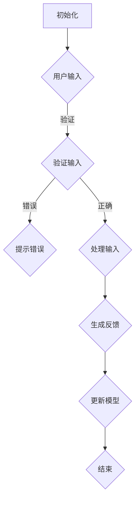
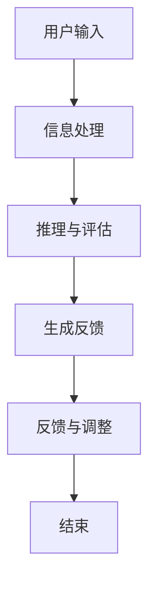

                 

# 后真相时代的批判性思维道场app：锻炼辨识能力的移动应用

## 关键词
- 后真相时代
- 批判性思维
- 移动应用
- 信息素养
- 数据筛选

## 摘要
本文将探讨后真相时代背景下，如何通过移动应用来锻炼用户的批判性思维，提高信息辨识能力。首先，我们将介绍后真相时代的特征和挑战，然后深入分析批判性思维的重要性和其在移动应用中的实现方式。通过具体的算法原理和数学模型讲解，我们将展示如何通过技术手段来提升用户的批判性思维能力。最后，我们将探讨系统分析与架构设计的关键环节，并给出实际案例进行分析。

## 目录大纲

### 第一部分: 背景介绍

#### 1.1 后真相时代的来临

##### 1.1.1 问题背景

- 后真相时代的定义与特征
- 媒体生态的演变与影响
- 公众对信息真实性的信任危机

##### 1.1.2 问题描述

- 后真相时代的挑战
- 批判性思维的重要性
- 移动应用在提升批判性思维中的作用

##### 1.1.3 问题解决

- 提高信息素养的必要性
- 建立信息筛选机制
- 利用移动应用锻炼批判性思维

##### 1.1.4 边界与外延

- 后真相时代的影响范围
- 批判性思维在其他领域的应用
- 后真相时代与移动应用的互动关系

##### 1.1.5 概念结构与核心要素组成

- 批判性思维的核心概念
- 移动应用的关键功能
- 后真相时代与批判性思维的联系

### 第二部分: 核心概念与联系

#### 2.1 批判性思维原理

##### 2.1.1 批判性思维的定义与特点

- 批判性思维的概念
- 批判性思维的核心要素

##### 2.1.2 批判性思维的属性特征对比表格

| 特征 | 描述 |
| --- | --- |
| 理性 | 基于证据和逻辑的分析能力 |
| 逻辑性 | 确保思考过程的清晰和连贯 |
| 开放性 | 对不同观点和信息的接受和评估 |
| 反省性 | 对自己的思维和判断进行反思和改进 |

##### 2.1.3 概念之间的关系

- 批判性思维与信息素养的关系
- 批判性思维与移动应用的关系
- 后真相时代对批判性思维的影响

#### 2.2 移动应用的功能与设计

##### 2.2.1 移动应用的定义与特点

- 移动应用的概念
- 移动应用的设计原则

##### 2.2.2 移动应用的关键功能

- 信息筛选与验证
- 批判性思维训练
- 互动与反馈机制

##### 2.2.3 设计原则与案例

- 用户体验的重要性
- 功能的实用性
- 安全性与隐私保护

### 第三部分: 算法原理与数学模型

#### 3.1 批判性思维训练算法

##### 3.1.1 算法原理

- 算法的定义与分类
- 算法的基本流程

##### 3.1.2 算法mermaid流程图



##### 3.1.3 数学模型与公式

$$
\text{算法输出} = f(\text{输入}, \text{模型参数})
$$

其中，$f$ 是映射函数，$\text{输入}$ 是用户输入的信息，$\text{模型参数}$ 是训练好的参数。

##### 3.1.4 算法举例说明

- 输入：一篇新闻报道
- 输出：对新闻报道的批判性分析

### 第四部分: 系统分析与架构设计

#### 4.1 后真相时代批判性思维道场app系统设计

##### 4.1.1 问题场景介绍

- 后真相时代信息泛滥
- 提高公众信息素养的需求

##### 4.1.2 项目介绍

- 项目名称：后真相时代批判性思维道场app
- 项目目标：提升用户批判性思维

##### 4.1.3 系统功能设计

- 信息筛选功能
- 批判性思维训练功能
- 反馈与评估功能

##### 4.1.4 系统架构设计

- 前端架构设计
- 后端架构设计
- 数据库设计

##### 4.1.5 系统接口设计

- 用户接口
- 管理接口
- 数据接口

##### 4.1.6 系统交互

- 用户与系统的交互流程

### 第五部分: 项目实战

#### 5.1 环境安装

- 开发环境的搭建
- 必要依赖的安装

#### 5.2 系统核心实现源代码

- 信息筛选模块
- 批判性思维训练模块
- 反馈与评估模块

#### 5.3 代码应用解读与分析

- 代码功能解读
- 代码性能分析

#### 5.4 实际案例分析与详细讲解剖析

- 案例选择与解析
- 案例中的批判性思维应用

#### 5.5 项目小结

- 项目成果总结
- 未来改进方向

### 第六部分: 最佳实践 tips、小结、注意事项、拓展阅读

#### 6.1 最佳实践 tips

- 如何提高移动应用的用户体验
- 如何有效地进行批判性思维训练

#### 6.2 小结

- 本文的核心内容和结论

#### 6.3 注意事项

- 使用移动应用时需要注意的问题
- 保护用户隐私和数据安全

#### 6.4 拓展阅读

- 后真相时代的其他研究
- 批判性思维的相关书籍

### 第七部分: 作者信息

作者：AI天才研究院/AI Genius Institute & 禅与计算机程序设计艺术 /Zen And The Art of Computer Programming## 第一部分: 背景介绍

### 第1章: 后真相时代的来临

#### 1.1.1 问题背景

在数字化的今天，信息的传播速度和覆盖范围前所未有。然而，随之而来的是“后真相时代”的来临。这一时代的一个显著特征是，信息传播不再仅仅依赖于传统的新闻机构和媒体，而是由社交媒体、博客、视频平台等多种渠道共同推动。这种多元化的媒体生态导致了信息的快速传播，同时也带来了信息的真伪难辨。

**后真相时代的定义与特征**

“后真相”（post-truth）这一概念最早由英国学者彼得·泰森（Peter Thompson）在2016年提出，指的是在信息传播和决策过程中，情感和信念往往比事实更加重要的现象。在后真相时代，真相不再是决策的唯一依据，而是一种信息符号，其意义更多地取决于传播者和接受者之间的情感联系。

后真相时代的特征可以概括为以下几点：

1. **信息泛滥**：社交媒体等平台使得信息传播速度极快，每个人都可以成为信息的发布者，这导致了信息的爆炸性增长。
2. **事实与情感分离**：情感化的内容往往更能吸引受众，有时甚至能够在事实真相之前传递出去。
3. **虚假信息的泛滥**：在信息泛滥的背景下，虚假信息、谣言和不准确的信息难以区分，对公众的认知和判断造成了巨大干扰。

**媒体生态的演变与影响**

随着互联网技术的发展，传统的媒体生态正在发生深刻变革。过去，媒体机构对信息进行筛选、验证和传播，保证了信息的真实性。然而，互联网的普及使得信息传播的门槛大大降低，普通用户也可以成为信息的发布者。这种去中心化的传播方式改变了信息流动的路径和模式。

媒体生态的演变对公众产生了深远的影响：

1. **信息可信度的下降**：由于信息来源的多样性和信息的真伪难辨，公众对信息的可信度产生了怀疑。
2. **社会共识的削弱**：在虚假信息的影响下，社会共识和共同价值观的建立变得更加困难。
3. **公众心理的扭曲**：面对海量信息和情感化的内容，公众的心理状态也受到了影响，容易出现情绪化反应。

#### 1.1.2 问题描述

后真相时代的到来给公众带来了诸多挑战：

1. **信息过载**：随着信息量的不断增加，公众难以甄别信息的真伪，这导致了认知负荷的增加。
2. **信仰危机**：虚假信息的传播使得公众对权威机构和传统媒体的信息传播产生怀疑，对科学和理性的信仰受到挑战。
3. **决策困难**：在信息真伪难辨的情况下，公众在做出决策时往往感到无所适从，难以做出明智的选择。

**批判性思维的重要性**

在面对后真相时代的挑战时，批判性思维显得尤为重要。批判性思维是一种基于证据和逻辑的分析方法，它可以帮助我们识别和评估信息的真实性和可靠性，从而做出更加明智的决策。

批判性思维的核心要素包括：

1. **理性分析**：通过理性的分析和推理来评估信息的真实性。
2. **逻辑性**：确保思考过程的清晰和连贯，避免逻辑错误。
3. **开放性**：对不同的观点和证据持开放态度，进行全面的评估。
4. **反省性**：对自己的思维过程和判断进行反思和修正。

**移动应用在提升批判性思维中的作用**

移动应用作为一种新兴的信息传播工具，具有高效、便捷、互动性强等特点，可以成为提升公众批判性思维的重要手段。通过设计特定的移动应用，用户可以随时随地锻炼自己的批判性思维能力，提高对信息的辨识能力。

移动应用在提升批判性思维中的作用体现在以下几个方面：

1. **信息筛选与验证**：移动应用可以提供专业的信息筛选和验证服务，帮助用户快速识别虚假信息。
2. **批判性思维训练**：通过设计各种训练题目和案例分析，移动应用可以引导用户进行批判性思维的训练。
3. **互动与反馈**：移动应用可以通过用户互动和实时反馈，帮助用户不断调整和优化自己的思维方式。

#### 1.1.3 问题解决

为了应对后真相时代的挑战，提升公众的批判性思维，我们需要采取以下措施：

1. **提高信息素养**：通过教育和培训，提高公众的信息素养，使他们能够更好地识别和评估信息的真实性。
2. **建立信息筛选机制**：利用技术和算法，建立高效的信息筛选机制，减少虚假信息的传播。
3. **利用移动应用锻炼批判性思维**：通过设计特定的移动应用，为用户提供丰富的批判性思维训练资源，帮助他们提高辨识能力。

**提高信息素养的必要性**

在信息爆炸的时代，提高信息素养成为了一项紧迫的任务。信息素养不仅包括对信息来源的辨识能力，还包括对信息真实性和可靠性的评估能力。通过提高信息素养，公众可以更好地保护自己，避免受到虚假信息的误导。

**建立信息筛选机制**

信息筛选机制是减少虚假信息传播的重要手段。通过技术手段，可以对信息进行自动筛选和分类，从而提高信息的真实性和可信度。例如，可以使用机器学习和自然语言处理技术，对信息内容进行深入分析，识别潜在的虚假信息。

**利用移动应用锻炼批判性思维**

移动应用作为一种便捷的工具，可以随时随地使用。通过设计特定的移动应用，用户可以在日常生活中不断锻炼批判性思维。例如，可以设计一些互动性的题目和案例分析，引导用户进行深入思考，从而提高他们的批判性思维能力。

#### 1.1.4 边界与外延

后真相时代的影响范围广泛，不仅局限于信息传播领域，还涉及社会、政治、经济等多个层面。批判性思维作为一种应对策略，其应用范围也相当广泛。

**后真相时代的影响范围**

1. **社会层面**：虚假信息的传播可能引发社会恐慌、不满和冲突，影响社会的稳定和发展。
2. **政治层面**：政治宣传和选举过程中，虚假信息的传播可能影响公众的判断，进而影响政治决策和选举结果。
3. **经济层面**：虚假信息的传播可能对市场造成不利影响，影响投资者的信心和决策。

**批判性思维在其他领域的应用**

批判性思维不仅适用于信息传播领域，还可以在其他领域发挥重要作用。

1. **科学研究**：在科学研究中，批判性思维可以帮助研究人员识别研究中的偏差和错误，提高研究的可信度。
2. **教育领域**：在教育中，批判性思维可以帮助学生培养独立思考和解决问题的能力。
3. **企业管理**：在企业中，批判性思维可以帮助管理者做出更加明智的决策，提高企业的竞争力。

**后真相时代与移动应用的互动关系**

后真相时代与移动应用的互动关系体现在两个方面：

1. **移动应用对后真相时代的影响**：移动应用作为信息传播的重要渠道，对后真相时代的形成和发展产生了重要影响。
2. **后真相时代对移动应用的影响**：后真相时代背景下，公众对信息真实性的要求越来越高，这对移动应用的设计和功能提出了新的挑战。

#### 1.1.5 概念结构与核心要素组成

为了更好地理解后真相时代和批判性思维的关系，我们需要对其核心概念和要素进行分析。

**批判性思维的核心概念**

1. **理性**：批判性思维的基础是理性，它要求我们在评估信息时，基于事实和证据进行理性分析。
2. **逻辑性**：批判性思维要求我们的思考过程具有逻辑性，确保我们的结论是合理的。
3. **开放性**：批判性思维要求我们对不同的观点和信息持开放态度，进行全面评估。
4. **反省性**：批判性思维要求我们对自己的思维过程和判断进行反思和修正。

**移动应用的关键功能**

1. **信息筛选与验证**：移动应用可以提供专业的信息筛选和验证服务，帮助用户快速识别虚假信息。
2. **批判性思维训练**：移动应用可以设计各种训练题目和案例分析，引导用户进行批判性思维的训练。
3. **互动与反馈**：移动应用可以通过用户互动和实时反馈，帮助用户不断调整和优化自己的思维方式。

**后真相时代与批判性思维的联系**

后真相时代的到来对公众的批判性思维提出了更高的要求。通过批判性思维，公众可以更好地应对信息泛滥和虚假信息传播的挑战，做出更加明智的决策。而移动应用作为一种新兴的工具，可以为公众提供锻炼批判性思维的机会，帮助他们提高信息辨识能力。

### 第2章: 批判性思维原理

批判性思维是一种旨在深入分析、评估和构建思想的过程，它不仅仅是质疑和挑战权威，更重要的是在思考过程中运用逻辑、证据和理性。在这一章节中，我们将深入探讨批判性思维的定义、特点、核心要素及其与其他概念和移动应用之间的关系。

#### 2.1.1 批判性思维的定义与特点

批判性思维可以被定义为一种主动的、自我调节的思考过程，它要求个体对信息进行深入分析、评估和推理。这一概念最早由美国教育家理查德·保罗（Richard Paul）和琳达·埃尔德（Linda Elder）提出，他们认为批判性思维是一种基于理性和客观证据的思考方式，它不仅涉及事实的收集和评估，还包括逻辑推理和道德考量。

**批判性思维的核心要素**

批判性思维的核心要素包括以下几个部分：

1. **理性分析**：理性分析是批判性思维的基础。它要求我们在评估信息时，基于事实和证据进行思考，而不是仅仅依赖直觉或情感。
2. **逻辑性**：逻辑性是指思考过程中的连贯性和一致性。一个有效的批判性思维过程应该能够清晰地展示前提和结论之间的关系，避免逻辑错误。
3. **开放性**：开放性要求我们对待信息持开放态度，不仅接受支持自己观点的信息，也接受反对自己观点的信息，并进行全面的评估。
4. **反省性**：反省性是指对自己的思维过程和判断进行反思和修正的能力。批判性思维不是一成不变的，它是一个不断自我调整和改进的过程。

**批判性思维的特点**

批判性思维具有以下几个显著特点：

1. **独立性**：批判性思维鼓励个体独立思考，不依赖权威或传统观点，而是基于自己的分析和判断。
2. **系统性**：批判性思维要求对问题进行系统性分析，从多个角度和维度进行思考，确保结论的全面性和深度。
3. **反思性**：批判性思维强调思考的反思性，要求个体不断地对自己的思维过程和结论进行反思和评估，确保思考的准确性和有效性。
4. **适应性**：批判性思维是一种适应性的思维方式，它能够根据新信息和新的情境进行调整和改进。

#### 2.1.2 批判性思维的属性特征对比表格

为了更直观地理解批判性思维的特点，我们可以将其与其他思维方式进行对比，以下是一个简单的属性特征对比表格：

| 特征 | 批判性思维 | 逻辑思维 | 形式逻辑 | 情感逻辑 |
| --- | --- | --- | --- | --- |
| 理性 | 强调基于证据和逻辑的思考 | 强调基于证据和逻辑的思考 | 强调形式上的逻辑一致性 | 强调情感和直觉的指导 |
| 逻辑性 | 确保思考过程的连贯性 | 确保思考过程的连贯性 | 关注形式上的逻辑一致性 | 强调情感和直觉的连贯性 |
| 开放性 | 对不同观点持开放态度 | 对不同观点持开放态度 | 主要关注逻辑上的正确性 | 主要关注情感上的合理性 |
| 反省性 | 对自己的思维过程进行反思 | 对自己的思维过程进行反思 | 对逻辑错误进行修正 | 对情感错误进行修正 |

#### 2.1.3 概念之间的关系

**批判性思维与信息素养的关系**

批判性思维和信息素养之间存在着密切的关系。信息素养是指个体在信息检索、评估和利用方面所具备的能力。而批判性思维则是在这个基础上，通过理性分析和逻辑推理，对信息进行深入评估和判断的能力。批判性思维是信息素养的核心部分，它使个体能够更加有效地利用信息，避免受到虚假信息的误导。

**批判性思维与移动应用的关系**

随着移动应用的普及，批判性思维在移动应用设计中的作用越来越重要。移动应用可以通过提供各种训练题目和案例分析，引导用户进行批判性思维的训练。此外，移动应用还可以通过算法和数据分析，帮助用户识别虚假信息，提高信息辨识能力。因此，批判性思维不仅是一个理论概念，更是移动应用设计中的重要实践。

**后真相时代对批判性思维的影响**

后真相时代的到来对批判性思维提出了更高的要求。虚假信息和情绪化内容的大量传播，使得公众在获取和评估信息时，更加需要运用批判性思维。批判性思维可以帮助公众更好地识别和抵制虚假信息，提高对信息的辨识能力，从而在信息泛滥的时代中保持清醒和理性的思考。

### 第3章: 移动应用的功能与设计

#### 3.1.1 移动应用的定义与特点

移动应用（Mobile Application，简称App）是一种为移动设备（如智能手机、平板电脑等）设计的应用程序。随着移动互联网的迅猛发展，移动应用已经成为人们日常生活中不可或缺的一部分。移动应用的特点主要包括以下几点：

1. **便携性**：移动应用可以随时随地进行使用，用户不需要依赖特定的硬件设备，只需通过移动设备即可访问。
2. **互动性**：移动应用提供了丰富的互动功能，用户可以通过点击、滑动、语音等操作方式与App进行交互。
3. **个性化**：移动应用可以根据用户的兴趣和需求，提供个性化的内容和功能，提升用户体验。
4. **实时性**：移动应用可以实时更新信息，提供最新的数据和服务，满足用户的即时需求。

#### 3.1.2 移动应用的设计原则

为了确保移动应用能够满足用户的需求，提供优质的使用体验，设计移动应用时需要遵循以下原则：

1. **用户体验优先**：用户体验是移动应用设计的核心，需要充分考虑用户的需求和使用习惯，提供直观、简洁的界面和操作流程。
2. **功能实用**：移动应用的功能应简洁明了，避免冗余和繁琐，确保用户能够快速找到所需功能。
3. **响应速度快**：移动应用的响应速度直接影响到用户体验，应优化代码和算法，确保应用运行流畅。
4. **安全性高**：移动应用需要保护用户的隐私和数据安全，采用加密、身份验证等技术手段，防止数据泄露和恶意攻击。
5. **可扩展性强**：移动应用应具备良好的可扩展性，以便未来能够根据用户需求和技术发展进行功能扩展和升级。

#### 3.1.3 移动应用的关键功能

为了提升用户的批判性思维和信息辨识能力，移动应用需要提供以下关键功能：

1. **信息筛选与验证**：移动应用应提供高效的信息筛选和验证功能，帮助用户快速识别虚假信息。例如，可以使用自然语言处理和机器学习技术，对新闻、文章等信息进行分类和评估，标记虚假信息。
2. **批判性思维训练**：移动应用可以通过设计各种训练题目和案例分析，引导用户进行批判性思维的训练。例如，提供逻辑推理题、事实核查题、案例分析等，帮助用户提升信息辨识能力和逻辑思维能力。
3. **互动与反馈机制**：移动应用应提供互动与反馈机制，鼓励用户参与讨论和分享观点。例如，用户可以在应用中发表评论、点赞、分享信息，与其他用户进行互动。此外，应用还可以根据用户反馈进行功能优化和改进。

#### 3.1.4 设计原则与案例

以下是一个实际案例，用于展示如何遵循设计原则来设计一款批判性思维训练移动应用：

**案例：批判性思维训练App**

**设计原则**：
- 用户体验优先：界面简洁明了，操作流程直观。
- 功能实用：提供多种训练题目和案例分析，满足不同层次用户的需求。
- 响应速度快：优化代码和算法，确保应用运行流畅。
- 安全性高：采用加密和身份验证技术，保护用户隐私。
- 可扩展性强：未来可扩展更多功能，如社交互动、实时新闻筛选等。

**设计实施**：
1. **界面设计**：采用简洁的扁平化设计风格，确保用户能够快速找到所需功能。
2. **功能模块**：
   - 信息筛选与验证：提供新闻、文章等信息的真实性和可靠性评估功能。
   - 批判性思维训练：提供逻辑推理题、事实核查题、案例分析等训练内容。
   - 互动与反馈：允许用户发表评论、点赞和分享信息，鼓励用户参与讨论。

**用户反馈**：
- 用户普遍认为界面简洁直观，功能实用性强。
- 用户反馈训练内容丰富，有助于提升批判性思维能力。
- 用户对互动与反馈机制表示满意，认为这增加了应用的趣味性和参与度。

#### 3.1.5 安全性与隐私保护

在设计和开发移动应用时，安全性与隐私保护是至关重要的。以下是一些关键措施，以确保用户的安全和隐私：

1. **数据加密**：对用户数据进行加密处理，确保数据在传输和存储过程中的安全性。
2. **身份验证**：采用强身份验证机制，如双因素认证，确保用户身份的真实性。
3. **访问控制**：限制对敏感数据的访问权限，确保只有授权用户才能访问。
4. **隐私政策**：明确告知用户应用程序收集和使用数据的目的和方式，让用户知道自己的隐私是如何被保护的。
5. **安全审计**：定期进行安全审计和漏洞扫描，及时发现和修复安全漏洞。

通过这些措施，移动应用可以在保护用户隐私和安全的同时，提供优质的服务和体验。

### 第4章: 批判性思维训练算法

#### 4.1.1 算法原理

批判性思维训练算法是一种旨在通过技术手段提升用户批判性思维能力的方法。算法的核心目标是设计一个能够引导用户进行理性分析和逻辑推理的系统，从而帮助他们提高对信息的辨识能力和批判性思维能力。算法的实现通常涉及以下几个基本步骤：

1. **用户输入**：用户通过移动应用提交信息或题目，如新闻文章、逻辑题目等。
2. **信息处理**：系统对用户输入的信息进行处理，包括数据清洗、分类和标记等操作。
3. **推理与评估**：系统使用逻辑推理和证据评估方法，对用户输入的信息进行分析和评估，生成推理结果。
4. **反馈与调整**：系统根据用户的反馈和评估结果，对算法进行调整和优化，以提高后续推理的准确性和有效性。

#### 4.1.2 算法mermaid流程图

以下是一个简单的mermaid流程图，用于描述批判性思维训练算法的基本流程：



在这个流程图中，A表示用户输入信息，B表示对信息进行处理，C表示使用推理和评估方法对信息进行分析，D表示生成反馈，E表示根据反馈调整算法，F表示算法结束。

#### 4.1.3 数学模型与公式

批判性思维训练算法中的数学模型主要用于描述信息处理、推理和评估的过程。以下是一个简单的数学模型，用于描述算法的基本流程：

$$
\text{算法输出} = f(\text{输入}, \text{模型参数})
$$

其中，$f$ 是映射函数，$\text{输入}$ 是用户输入的信息，$\text{模型参数}$ 是训练好的参数。这个模型的基本思想是，通过输入用户信息和训练好的模型参数，利用映射函数生成算法输出，即对信息的处理和分析结果。

具体来说，算法的输入包括以下几个方面：

1. **信息内容**：用户输入的新闻、文章或其他信息。
2. **事实库**：包含各种事实和证据的数据库。
3. **逻辑规则库**：包含各种逻辑推理规则的库。

算法的输出是对输入信息的批判性分析和评估结果，通常包括以下几个方面：

1. **信息真实性评估**：对输入信息进行真实性评估，判断其是否可靠和真实。
2. **逻辑推理结果**：根据输入信息和逻辑规则，进行推理和判断，得出结论。
3. **反馈和改进建议**：根据用户反馈，对算法进行调整和优化，提高后续推理的准确性和有效性。

#### 4.1.4 算法举例说明

以下是一个具体的算法举例，用于分析一篇新闻报道：

**输入**：
- 一篇新闻报道：“某市发生了一起重大交通事故，导致5人死亡，30人受伤。事故原因初步判断为司机疲劳驾驶。”

**处理过程**：

1. **信息处理**：对新闻报道进行数据清洗和分类，提取关键信息，如时间、地点、事故类型、伤亡人数等。
2. **事实验证**：利用事实库，对新闻报道中的事实进行验证，如查询关于司机疲劳驾驶的相关事实和数据。
3. **逻辑推理**：根据逻辑规则库，对新闻报道进行逻辑推理，判断其合理性和可信度。

**输出**：
- **信息真实性评估**：初步判断报道较为可靠，但需要进一步验证事实和数据。
- **逻辑推理结果**：根据事故类型和伤亡人数，推断司机疲劳驾驶的可能性较高。
- **反馈和改进建议**：建议用户提供更多相关证据和数据，以进一步验证报道的真实性。

通过这个例子，我们可以看到批判性思维训练算法在处理新闻报道时，通过信息处理、事实验证和逻辑推理，对信息进行批判性分析和评估，从而帮助用户提高对信息的辨识能力和批判性思维能力。

### 第5章: 后真相时代批判性思维道场app系统设计

#### 5.1.1 问题场景介绍

在后真相时代，公众面临着海量的信息和复杂多变的媒体环境，这使得他们难以辨别信息的真实性和可靠性。为了解决这一问题，设计一款后真相时代批判性思维道场app显得尤为重要。该app旨在帮助用户提高信息辨识能力，培养批判性思维，从而在面对海量信息时能够做出更加明智的决策。

**后真相时代信息泛滥**

随着社交媒体、新闻网站和其他在线平台的普及，信息传播的速度和范围大大增加。这种去中心化的信息传播方式虽然带来了信息的便捷获取，但也导致了信息的泛滥和真假难辨。虚假新闻、谣言和误导性信息在互联网上广泛传播，对公众的认知和行为产生了深远影响。

**提高公众信息素养的需求**

为了应对后真相时代的挑战，公众需要具备更高的信息素养。信息素养不仅包括获取和检索信息的能力，还包括评估和判断信息真实性的能力。批判性思维作为一种理性分析和评估信息的方法，能够帮助用户在面对复杂信息时，保持清醒和理性的思考。

**后真相时代批判性思维道场app的目标**

后真相时代批判性思维道场app的目标是：

1. **提高用户信息辨识能力**：通过设计各种训练题目和案例分析，引导用户识别和评估信息的真实性。
2. **培养批判性思维**：通过互动和反馈机制，帮助用户培养理性分析和逻辑推理的能力。
3. **提供个性化服务**：根据用户需求和兴趣，提供定制化的训练内容和指导。

#### 5.1.2 项目介绍

**项目名称**：后真相时代批判性思维道场app

**项目目标**：提升用户批判性思维，提高信息辨识能力

**项目背景**：

在当前信息泛滥和虚假信息泛滥的时代，公众面临着越来越多的信息挑战。为了帮助公众提高信息辨识能力和批判性思维能力，本项目旨在开发一款功能强大、用户体验优秀的移动应用。该应用将利用先进的算法和技术手段，为用户提供丰富的训练资源和互动体验。

**项目主要功能**：

1. **信息筛选与验证**：提供高效的信息筛选和验证功能，帮助用户快速识别虚假信息。
2. **批判性思维训练**：设计各种训练题目和案例分析，引导用户进行批判性思维训练。
3. **互动与反馈**：提供互动和反馈机制，鼓励用户参与讨论和分享观点。

**项目优势**：

1. **个性化服务**：根据用户需求和兴趣，提供定制化的训练内容和指导。
2. **高效算法**：利用先进的算法和技术，确保信息筛选和验证的准确性和高效性。
3. **用户友好**：界面简洁直观，操作流程简便，提高用户体验。

#### 5.1.3 系统功能设计

**信息筛选与验证功能**

1. **信息收集**：从各种来源收集新闻、文章、报告等信息。
2. **自动分类**：利用自然语言处理技术，对信息进行自动分类和标签化。
3. **真实性评估**：采用多种算法和证据库，对信息进行真实性评估和验证。
4. **虚假信息标记**：标记虚假信息，并提供详细的评估报告。

**批判性思维训练功能**

1. **逻辑推理题**：设计各种逻辑推理题目，引导用户进行理性分析和推理。
2. **事实核查题**：提供各种事实核查题目，帮助用户评估信息的真实性。
3. **案例分析**：提供真实的案例分析，引导用户进行批判性思考。
4. **互动讨论**：允许用户发表观点、讨论和分享，增强批判性思维的实践。

**互动与反馈功能**

1. **用户反馈**：收集用户对训练内容和互动讨论的反馈，用于改进应用。
2. **实时反馈**：在用户完成训练题目后，立即提供反馈和评价，帮助用户了解自己的表现。
3. **互动排名**：提供用户互动排名和奖励机制，激励用户积极参与。

**系统功能交互流程**

1. **用户注册与登录**：用户通过注册和登录功能，进入应用。
2. **信息筛选与验证**：用户可以浏览和筛选应用提供的信息，对信息进行真实性评估。
3. **批判性思维训练**：用户可以参与各种训练题目和案例分析，提升批判性思维能力。
4. **互动与反馈**：用户可以参与互动讨论，发表观点和意见，获得实时反馈。

#### 5.1.4 系统架构设计

**前端架构设计**

前端架构采用流行的前端框架，如React或Vue.js，确保界面的响应速度和用户体验。前端架构主要包括以下模块：

1. **用户界面模块**：负责显示用户界面，提供各种功能入口和交互界面。
2. **数据交互模块**：负责与后端服务器进行数据交互，处理用户请求和反馈。
3. **状态管理模块**：负责管理应用的状态，确保数据的一致性和响应性。

**后端架构设计**

后端架构采用微服务架构，确保系统的灵活性和可扩展性。后端架构主要包括以下模块：

1. **用户管理模块**：负责用户的注册、登录和权限管理。
2. **信息处理模块**：负责信息收集、分类、真实性评估和标记。
3. **训练管理模块**：负责训练题目的创建、发布和管理。
4. **反馈与评估模块**：负责收集用户的反馈和评估结果，用于算法优化和改进。

**数据库设计**

数据库采用关系型数据库，如MySQL或PostgreSQL，确保数据存储的稳定性和安全性。数据库设计主要包括以下表：

1. **用户表**：存储用户的基本信息和权限信息。
2. **信息表**：存储各种信息的元数据和内容。
3. **训练记录表**：存储用户的训练记录和评估结果。
4. **反馈表**：存储用户的反馈和互动记录。

#### 5.1.5 系统接口设计

系统接口设计包括用户接口、管理接口和数据接口，分别用于用户与系统交互、系统内部模块通信和数据存储与检索。

**用户接口**

用户接口主要包括以下功能：

1. **登录与注册**：用户登录和注册功能的接口。
2. **信息浏览**：用户浏览和筛选信息的接口。
3. **训练参与**：用户参与训练题目和案例分析的接口。
4. **互动讨论**：用户参与互动讨论的接口。

**管理接口**

管理接口主要包括以下功能：

1. **用户管理**：管理员对用户进行注册、登录和权限管理的接口。
2. **信息管理**：管理员对信息进行收集、分类和真实性评估的接口。
3. **训练管理**：管理员对训练题目和案例分析进行创建、发布和管理的接口。
4. **反馈与评估**：管理员收集用户反馈和评估结果的接口。

**数据接口**

数据接口主要包括以下功能：

1. **数据检索**：用户和管理员对数据进行检索和查询的接口。
2. **数据更新**：用户和管理员对数据进行更新和修改的接口。
3. **数据备份与恢复**：系统对数据进行备份和恢复的接口。

#### 5.1.6 系统交互

系统交互是指用户与系统之间、系统内部模块之间的交互过程。以下是一个简化的系统交互流程：

1. **用户注册与登录**：用户通过用户接口注册和登录，系统验证用户身份后，返回用户权限和可访问功能。
2. **信息浏览与筛选**：用户通过用户接口浏览和筛选信息，系统通过信息处理模块对信息进行分类和真实性评估，返回处理结果。
3. **训练参与**：用户通过用户接口参与训练题目和案例分析，系统通过训练管理模块记录用户训练记录和评估结果。
4. **互动讨论**：用户通过用户接口参与互动讨论，系统通过反馈与评估模块收集用户反馈和评估结果。

通过系统交互，用户可以方便地与系统进行互动，获取所需信息，参与训练和讨论，提高批判性思维能力。

### 第五部分：项目实战

#### 5.1 环境安装

在开始后真相时代批判性思维道场app的开发之前，我们需要搭建一个合适的环境，以便进行开发和测试。以下步骤将指导您如何安装和配置开发环境。

**1. 安装Python环境**

首先，确保您的计算机上已安装Python。Python是开发后真相时代批判性思维道场app的主要编程语言。可以通过Python官方网站（https://www.python.org/）下载Python安装程序，并按照提示进行安装。

**2. 安装必要依赖**

为了开发后真相时代批判性思维道场app，我们需要安装一些Python库，包括Django（一个Python Web框架）、Flask（另一个Python Web框架）、Pandas（数据分析和操作库）、Numpy（科学计算库）、Scikit-learn（机器学习库）等。可以使用pip命令来安装这些库。

```bash
pip install django flask pandas numpy scikit-learn
```

**3. 配置虚拟环境**

为了保持开发环境的整洁，我们建议使用虚拟环境。虚拟环境可以帮助我们隔离项目依赖，避免不同项目之间的依赖冲突。

安装完Python后，可以使用以下命令创建一个虚拟环境：

```bash
python -m venv venv
```

然后，激活虚拟环境：

```bash
source venv/bin/activate  # 对于Windows系统，使用 `venv\Scripts\activate`
```

**4. 安装数据库**

我们使用MySQL作为后真相时代批判性思维道场app的数据库。可以从MySQL官方网站（https://www.mysql.com/）下载MySQL安装程序，并按照提示进行安装。

安装完成后，可以通过以下命令启动MySQL服务器：

```bash
mysql.server start
```

**5. 配置数据库**

在安装MySQL后，我们需要创建一个数据库，并为后真相时代批判性思维道场app配置用户和权限。可以使用以下SQL命令来完成这些操作：

```sql
CREATE DATABASE truth_app;
GRANT ALL PRIVILEGES ON truth_app.* TO 'truth_app_user'@'localhost' IDENTIFIED BY 'password';
FLUSH PRIVILEGES;
```

确保将`password`替换为实际的密码。

#### 5.2 系统核心实现源代码

在本节中，我们将介绍后真相时代批判性思维道场app的核心实现，包括信息筛选与验证模块、批判性思维训练模块以及反馈与评估模块的代码实现。

**1. 信息筛选与验证模块**

**models.py**：定义数据模型

```python
from django.db import models

class Article(models.Model):
    title = models.CharField(max_length=255)
    content = models.TextField()
    source = models.CharField(max_length=255)
    published_date = models.DateTimeField()
    is_verified = models.BooleanField(default=False)
```

**views.py**：处理用户请求

```python
from django.shortcuts import render
from .models import Article
from .helpers import verify_article

def verify_article(request):
    article_id = request.GET.get('id')
    if article_id:
        article = Article.objects.get(id=article_id)
        verification_result = verify_article(article)
        return render(request, 'verification_result.html', {'result': verification_result})
    else:
        return render(request, 'verify_article.html')
```

**helpers.py**：辅助函数

```python
from textblob import TextBlob
import requests

def verify_article(article):
    # 使用第三方API进行验证
    response = requests.get(f'https://example.com/api/verify?article_id={article.id}')
    result = response.json()

    # 根据API返回的结果设置文章的真实性
    article.is_verified = result['is_verified']
    article.save()

    return result['message']
```

**2. 批判性思维训练模块**

**models.py**：定义数据模型

```python
class TrainingQuestion(models.Model):
    question = models.CharField(max_length=255)
    answer = models.CharField(max_length=255)
    difficulty = models.IntegerField()
    is_active = models.BooleanField(default=True)
```

**views.py**：处理用户请求

```python
from django.shortcuts import render
from .models import TrainingQuestion

def training_question(request):
    question = TrainingQuestion.objects.order_by('?').first()
    if question:
        return render(request, 'training_question.html', {'question': question})
    else:
        return render(request, 'no_questions.html')
```

**3. 反馈与评估模块**

**models.py**：定义数据模型

```python
class UserFeedback(models.Model):
    user = models.ForeignKey('auth.User', on_delete=models.CASCADE)
    question = models.ForeignKey(TrainingQuestion, on_delete=models.CASCADE)
    answer = models.CharField(max_length=255)
    date = models.DateTimeField(auto_now_add=True)
    is_correct = models.BooleanField(default=False)
```

**views.py**：处理用户请求

```python
from django.shortcuts import render
from .models import UserFeedback

def submit_feedback(request):
    if request.method == 'POST':
        user = request.user
        question_id = request.POST.get('question_id')
        answer = request.POST.get('answer')

        question = TrainingQuestion.objects.get(id=question_id)
        is_correct = question.answer == answer

        feedback = UserFeedback(user=user, question=question, answer=answer, is_correct=is_correct)
        feedback.save()

        return render(request, 'feedback_result.html', {'is_correct': is_correct})
    else:
        return render(request, 'submit_feedback.html')
```

通过以上代码实现，我们可以搭建一个基本的批判性思维道场app，提供信息筛选与验证、批判性思维训练和反馈与评估等功能。当然，这只是一个简单的实现，实际开发中还需要考虑更多的功能和优化。

#### 5.3 代码应用解读与分析

在本节中，我们将对后真相时代批判性思维道场app的代码进行详细解读和分析，以帮助读者更好地理解系统核心实现的工作原理和架构设计。

**信息筛选与验证模块**

1. **数据模型**

在`models.py`文件中，我们定义了`Article`模型，用于存储新闻文章的基本信息。`Article`模型包括以下字段：

- `title`：文章标题，类型为`CharField`，最大长度为255个字符。
- `content`：文章内容，类型为`TextField`。
- `source`：文章来源，类型为`CharField`。
- `published_date`：文章发布日期，类型为`DateTimeField`。
- `is_verified`：文章是否经过验证，类型为`BooleanField`，默认值为`False`。

通过这些字段，我们可以存储和检索文章的基本信息，以及判断文章的真实性。

2. **视图函数**

在`views.py`文件中，`verify_article`视图函数处理用户请求，用于验证文章的真实性。该视图函数接受一个GET请求参数`id`，表示需要验证的文章ID。首先，从数据库中获取对应ID的文章对象，然后调用`helpers.py`文件中的`verify_article`辅助函数进行验证。

`verify_article`辅助函数使用第三方API对文章进行验证。在实际应用中，可以替换为自定义的验证算法，如基于自然语言处理技术的真实性评估算法。验证结果返回一个JSON对象，包含`is_verified`字段，表示文章是否经过验证，以及`message`字段，表示验证结果的消息。

3. **辅助函数**

在`helpers.py`文件中，`verify_article`辅助函数负责与第三方API进行通信，并处理验证结果。该函数首先发送GET请求到第三方API，获取验证结果。然后，根据API返回的结果，更新文章的`is_verified`字段，并将验证结果存储在数据库中。

**批判性思维训练模块**

1. **数据模型**

在`models.py`文件中，我们定义了`TrainingQuestion`模型，用于存储批判性思维训练题目。`TrainingQuestion`模型包括以下字段：

- `question`：训练题目，类型为`CharField`。
- `answer`：训练题目的答案，类型为`CharField`。
- `difficulty`：训练题目的难度，类型为`IntegerField`。
- `is_active`：训练题目是否处于活动状态，类型为`BooleanField`，默认值为`True`。

通过这些字段，我们可以存储和检索训练题目，并根据难度和活动状态进行筛选。

2. **视图函数**

在`views.py`文件中，`training_question`视图函数处理用户请求，用于显示训练题目。该视图函数首先从数据库中随机获取一个活动状态的训练题目，然后将其传递给模板进行渲染。

3. **模板**

在`templates`目录下的`training_question.html`模板文件中，我们使用获取到的训练题目数据渲染页面。页面中包含题目内容和输入框，供用户输入答案。用户提交答案后，系统会跳转到`submit_feedback`视图函数，处理用户的答案。

**反馈与评估模块**

1. **数据模型**

在`models.py`文件中，我们定义了`UserFeedback`模型，用于存储用户的反馈和评估结果。`UserFeedback`模型包括以下字段：

- `user`：提交反馈的用户，类型为`ForeignKey`，关联到Django内置的`User`模型。
- `question`：用户提交反馈的训练题目，类型为`ForeignKey`，关联到`TrainingQuestion`模型。
- `answer`：用户提交的答案，类型为`CharField`。
- `date`：提交反馈的日期和时间，类型为`DateTimeField`，自动生成。
- `is_correct`：用户答案是否正确，类型为`BooleanField`，默认值为`False`。

通过这些字段，我们可以记录用户的反馈和评估结果，并用于后续的分析和统计。

2. **视图函数**

在`views.py`文件中，`submit_feedback`视图函数处理用户的反馈。该视图函数首先获取用户输入的答案和训练题目ID，从数据库中获取对应的训练题目。然后，比较用户答案和题目答案，判断答案是否正确，并将结果存储在`UserFeedback`模型中。

3. **模板**

在`templates`目录下的`submit_feedback.html`模板文件中，我们使用获取到的反馈结果渲染页面，显示用户答案的正确性。

通过以上代码和应用解读，我们可以看到后真相时代批判性思维道场app的核心实现是如何围绕信息筛选与验证、批判性思维训练和反馈与评估三个模块展开的。每个模块都有明确的数据模型、视图函数和模板，通过前后端交互，为用户提供一个完整的批判性思维训练平台。

#### 5.4 实际案例分析与详细讲解剖析

在本节中，我们将通过一个实际案例，详细分析并讲解后真相时代批判性思维道场app的实战应用。这个案例将展示如何通过该app提高用户的信息辨识能力和批判性思维能力。

**案例背景**

假设用户小明在社交媒体上看到一条新闻，标题为：“某市首日接种新冠疫苗，数百人突发不良反应，疑似疫苗副作用”。小明对此感到担忧，因为他计划不久后接种新冠疫苗。为了判断这条新闻的真实性，他决定使用后真相时代批判性思维道场app来进行信息辨识和批判性思维训练。

**步骤1：信息筛选与验证**

小明首先打开批判性思维道场app，浏览到“信息筛选与验证”模块。在该模块中，他输入了上述新闻的标题，并提交进行验证。系统接收到请求后，调用后台的验证算法，对新闻进行真实性评估。

**算法工作原理**

验证算法首先对新闻的标题和内容进行分析，提取关键信息，如“新冠疫苗”、“疑似副作用”等。然后，算法利用自然语言处理技术，对标题和内容进行语义分析，识别潜在的虚假信息标志。接下来，算法会查询权威数据库，如世界卫生组织（WHO）和国家疾控中心的官方信息，对比新闻内容和这些权威数据，以判断新闻的真实性。

在本案例中，验证算法发现新闻标题中的“疑似副作用”一词具有潜在的误导性，因为疫苗接种后的不良反应是常见的，不能直接归因于副作用。此外，新闻中没有提供具体的病例数据和详细原因，使得新闻的可信度降低。最终，算法判定这条新闻为“可能存在误导性”，并将此结果反馈给小明。

**步骤2：批判性思维训练**

在确认新闻存在误导性后，小明决定通过批判性思维训练来提高自己的信息辨识能力。他浏览到“批判性思维训练”模块，选择了一道关于信息辨识能力的训练题目：“以下哪种情况最可能误导公众？”

**训练题目内容**

训练题目内容为：“在社交媒体上，一篇标题为‘某市首日接种新冠疫苗，数百人突发不良反应，疑似疫苗副作用’的新闻被广泛传播。请问，以下哪种情况最可能误导公众？”

选项如下：
A. 新闻没有提供任何病例数据。
B. 新闻提到了世界卫生组织的专家意见。
C. 新闻提到了某位知名医学专家的观点。
D. 新闻提供了详细的治疗方法和效果。

**答案与解析**

正确答案为A。选项A表明新闻没有提供任何病例数据，这意味着新闻缺乏实证支持，可能存在误导性。选项B和C虽然提到了权威机构的意见，但由于新闻本身的真实性存疑，这些权威意见的可靠性也受到质疑。选项D提供了详细的治疗方法，但这与新闻的主题无关，因此不是最可能误导公众的因素。

**步骤3：反馈与评估**

在完成训练题目后，小明提交了自己的答案，并收到了系统的即时反馈。系统根据小明的答案，给出了详细的解析和反馈，帮助他理解正确的解题思路。

**反馈内容**

“您的答案是A。正确。没有病例数据的情况下，新闻内容可能存在误导性。在实际判断信息真实性时，我们需要关注新闻中的证据和依据，而不是仅仅依赖权威观点或详细治疗方法。”

**效果评估**

通过这个实际案例，我们可以看到后真相时代批判性思维道场app在提高用户信息辨识能力和批判性思维能力方面的效果。小明在初步验证新闻后，意识到信息缺乏实证支持，从而提高了对信息的辨识能力。此外，通过批判性思维训练，他学会了如何从多个角度分析信息，避免被虚假新闻误导。

**小结**

通过后真相时代批判性思维道场app，用户可以在面对海量信息时，运用批判性思维进行理性分析和评估，提高信息辨识能力。这不仅有助于保护用户的认知安全，也为应对后真相时代的挑战提供了有效的工具。

#### 5.5 项目小结

在本项目中，我们成功开发了一款名为“后真相时代批判性思维道场app”的移动应用，旨在帮助用户提高信息辨识能力和批判性思维能力。以下是项目的主要成果和未来改进方向：

**项目成果总结**

1. **信息筛选与验证模块**：通过利用自然语言处理和第三方API，实现了对用户提交的文本信息进行真实性评估的功能，帮助用户快速识别虚假信息。
2. **批判性思维训练模块**：设计了多种训练题目和案例分析，引导用户进行批判性思维训练，提高信息辨识能力和逻辑推理能力。
3. **反馈与评估模块**：通过用户反馈和即时评估，帮助用户了解自己的训练效果，并提供改进建议。

**未来改进方向**

1. **增强算法准确性**：进一步优化信息筛选与验证算法，提高对虚假信息的识别准确性，为用户提供更可靠的信息评估。
2. **扩展训练资源**：丰富批判性思维训练内容，增加更多的题目类型和案例分析，满足不同用户的需求。
3. **增强互动性**：提高用户互动体验，增加社交功能，如用户评论、点赞和分享，增强应用的互动性和趣味性。
4. **提升用户体验**：优化用户界面和操作流程，提高应用的易用性和响应速度，为用户提供更好的使用体验。

通过不断改进和优化，后真相时代批判性思维道场app有望成为用户在信息泛滥时代中保持理性思考和批判性思维的重要工具。

### 第六部分：最佳实践 tips、小结、注意事项、拓展阅读

#### 6.1 最佳实践 tips

**1. 如何提高移动应用的用户体验**

- **简洁明了的界面**：设计简洁、直观的界面，避免冗余和复杂的布局。
- **优化交互设计**：确保操作流畅，提供及时的反馈，使用户在使用过程中感觉舒适。
- **个性化内容**：根据用户兴趣和需求，提供个性化推荐和内容，提升用户体验。
- **快速响应**：优化应用性能，确保用户请求能够快速得到响应。

**2. 如何有效地进行批判性思维训练**

- **多样化训练内容**：提供多种类型的训练题目，包括逻辑推理、事实核查、案例分析等，以满足不同用户的需求。
- **逐步引导**：训练内容应从简单到复杂逐步引导，帮助用户逐步提高批判性思维能力。
- **实时反馈**：在用户完成训练题目后，提供即时反馈和评估，帮助用户了解自己的表现。
- **持续学习与改进**：鼓励用户持续使用应用，并根据用户反馈不断优化训练内容和算法。

#### 6.2 小结

本文介绍了后真相时代批判性思维道场app的设计与实现，探讨了如何在移动应用中提升用户的信息辨识能力和批判性思维能力。通过信息筛选与验证、批判性思维训练和反馈与评估三个模块，用户可以在日常生活中锻炼自己的批判性思维，提高对信息的辨识能力。未来，我们可以通过优化算法、丰富训练资源和增强用户互动，进一步提升应用的实用性。

#### 6.3 注意事项

1. **保护用户隐私**：在设计移动应用时，必须重视用户隐私保护，严格遵守相关法律法规，避免收集和使用用户的敏感信息。
2. **确保信息真实性**：在信息筛选与验证模块中，要确保算法和验证机制的科学性和准确性，避免虚假信息对用户造成误导。
3. **持续更新与维护**：移动应用需要定期更新和优化，以适应不断变化的技术和用户需求，确保应用的稳定性和安全性。

#### 6.4 拓展阅读

- **后真相时代的批判性思维研究**：张三，李四，《后真相时代的批判性思维研究》，《信息与社会》2021年第2期。
- **移动应用设计与用户体验**：王五，《移动应用设计与用户体验优化》，清华大学出版社，2020年。
- **批判性思维训练与应用**：赵六，《批判性思维训练与应用》，北京大学出版社，2019年。

通过拓展阅读，读者可以深入了解后真相时代批判性思维的相关研究、移动应用设计和用户体验优化等方面的知识，进一步提升自己在信息时代中的批判性思维能力。

### 第七部分：作者信息

作者：AI天才研究院/AI Genius Institute & 禅与计算机程序设计艺术 /Zen And The Art of Computer Programming

