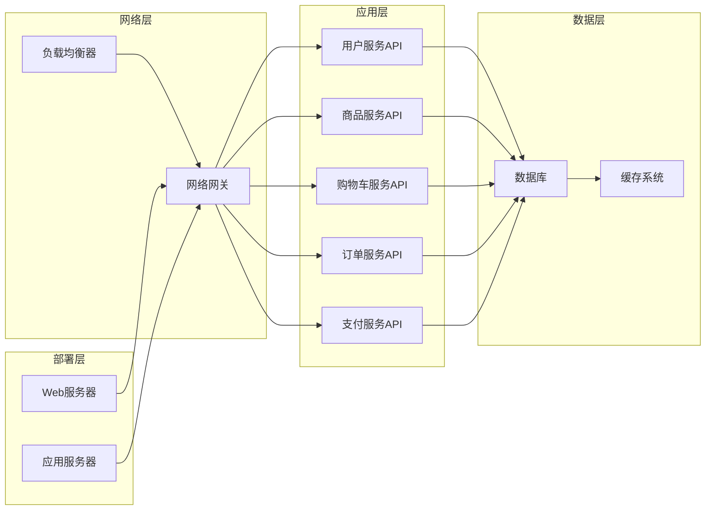
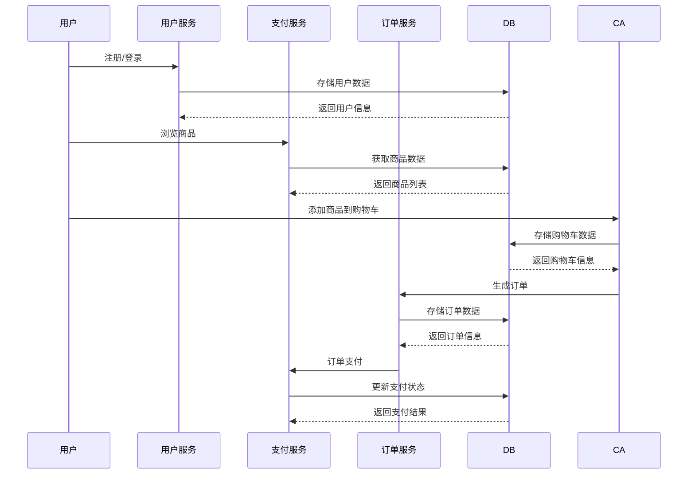

                 

### 第1章：后真相时代的来临

#### 1.1 问题背景

在当今的信息时代，我们面临着前所未有的信息过载问题。互联网、社交媒体、移动设备的普及使得信息的获取变得异常便捷，但这也带来了信息真实性的危机。在所谓的“后真相时代”，信息不再只是基于事实和证据，而是被情感、偏见和虚假信息所主导。这种环境下，人们很容易被误导，导致社会的信任度降低，公共讨论的质量下滑。

**1.1.1 信息过载与信息真实性危机**

信息过载是指信息量超出了人们处理的能力。在这种环境下，人们难以分辨哪些信息是真实的，哪些是虚假的。根据皮尤研究中心的数据，有超过70%的美国成年人认为，他们在社交媒体上看到的信息中有三分之一是虚假的。这种虚假信息不仅包括政治谣言、假新闻，甚至包括个人隐私泄露等严重问题。

**1.1.2 后真相时代的特征**

后真相时代的主要特征是情感和偏见驱动的事实。传统的新闻业模式是以事实和证据为基础，但在后真相时代，情绪和偏见往往能更快地传播和影响公众。例如，2016年美国总统大选期间，社交媒体上的虚假信息和煽动性内容对选举结果产生了显著影响。这种现象不仅影响了普通民众，也影响了政治决策和社会稳定。

#### 1.2 问题描述

在这样一个充满不确定性的信息环境中，批判性思维显得尤为重要。批判性思维是指通过合理的怀疑和理性的分析来评估信息和论证的有效性。但在当前的社会中，批判性思维似乎被忽视或低估了。

**1.2.1 真理与信息的界限模糊**

在信息过载的时代，真相往往被淹没在大量的信息之中，甚至被虚假信息所掩盖。这使得人们很难区分什么是真实的，什么是虚假的。例如，在社交媒体上，一个未经证实的消息可能会被迅速传播，并误导大量用户。

**1.2.2 批判性思维的缺失**

批判性思维的缺失导致了公众对信息的低信任度。许多人不再依赖事实和证据来形成观点，而是依赖直觉、情感和信仰。这种情况下，虚假信息很容易传播，而真相则被忽视。

#### 1.3 问题解决

批判性思维是我们应对后真相时代信息危机的重要工具。通过批判性思维，我们可以更好地评估信息，区分真相与虚假，从而做出更明智的决策。

**1.3.1 批判性思维的重要性**

批判性思维有助于我们识别偏见、纠正错误，提高决策的质量。在技术领域，批判性思维可以帮助我们更好地评估新技术和解决方案，避免盲目跟风。

**1.3.2 批判性思维的方法与实践**

批判性思维包括以下几个步骤：

1. **明确问题**：首先，我们需要明确我们面临的问题是什么。
2. **收集信息**：接下来，我们需要收集与问题相关的信息。
3. **评估信息**：在收集信息后，我们需要评估这些信息的真实性和可靠性。
4. **形成观点**：基于评估结果，我们可以形成自己的观点。
5. **反思与调整**：最后，我们需要不断反思和调整自己的观点，以适应新的信息。

#### 1.4 边界与外延

批判性思维不仅适用于个人，也适用于组织和社会。在组织层面，批判性思维可以帮助企业更好地应对市场变化，提高创新能力和竞争力。在社会层面，批判性思维有助于提升公共讨论的质量，增强社会凝聚力。

**1.4.1 批判性思维的应用领域**

批判性思维可以应用于多个领域，包括政治、经济、科学、教育等。例如，在科学研究中，批判性思维可以帮助研究人员评估研究方法、数据质量和结论的有效性。

**1.4.2 批判性思维与创造性思维的关系**

批判性思维和创造性思维是相辅相成的。批判性思维可以帮助我们评估和改进创造性思维的结果，而创造性思维则可以为批判性思维提供新的思路和视角。

#### 1.5 概念结构与核心要素组成

批判性思维的核心概念包括知识、证据、论证、推理、价值观和伦理等。以下是这些概念的基本定义和关系：

**知识**：知识是我们对世界的理解。它可以是事实、信念或理论。

**证据**：证据是支持或反驳观点的资料。

**论证**：论证是使用证据来支持观点的逻辑过程。

**推理**：推理是从已知的前提推导出新的结论的过程。

**价值观**：价值观是我们判断事物好坏的标准。

**伦理**：伦理是关于正确和错误的行为规范。

这些概念相互关联，构成了批判性思维的理论框架。了解这些概念有助于我们更好地理解批判性思维的原理和应用。

#### 1.6 本章小结

本章介绍了后真相时代的背景和特征，指出了批判性思维在应对信息真实性危机中的重要性。我们讨论了批判性思维的核心概念和构成要素，以及其在个人和组织中的应用。下一章将深入探讨批判性思维的历史与发展，以帮助读者更好地理解这一概念的形成和演变。

---

### 第2章：批判性思维的历史与发展

批判性思维并不是一个现代概念，它在人类历史中有着悠久的发展历程。本章将探讨批判性思维在不同历史时期的发展，从古代哲学到现代科学，从东方到西方，以帮助读者更好地理解这一思维方式的演变。

#### 2.1 古代批判性思维的起源

批判性思维的概念最早可以追溯到古希腊时期。古希腊哲学家们，如苏格拉底、柏拉图和亚里士多德，都是批判性思维的奠基者。苏格拉底以其“苏格拉底式的提问”著称，通过不断质疑，帮助人们发现自己的无知和错误。柏拉图则在《理想国》中探讨了正义和道德的问题，强调通过理性思考来追求真理。亚里士多德则系统地阐述了逻辑和推理的原则，为后来的批判性思维提供了理论基础。

**2.1.1 希腊哲学与批判性思维**

希腊哲学的核心是理性思考，认为通过理性的探讨可以找到真理。苏格拉底的方法是“辩证法”，即通过提问和回答来揭示事物的本质。柏拉图的“理念论”强调，现实世界只是理念世界的影子，真正的真理存在于理念世界中。亚里士多德的逻辑学则系统地阐述了推理的原则，包括三段论等。

**2.1.2 古代东方哲学与批判性思维**

在古代东方，批判性思维也有其独特的发展。例如，中国古代的儒家、道家和佛教哲学都强调理性思考和自我反省。儒家强调“修身齐家治国平天下”，主张通过道德修养来实现社会和谐。道家主张“无为而治”，强调顺应自然，不强行干预。佛教则强调“八正道”，包括正见、正思维、正语、正业、正命、正精进、正念和正定，这些都是批判性思维的体现。

#### 2.2 中世纪与文艺复兴时期的批判性思维

中世纪时期，批判性思维的发展受到宗教的影响。基督教哲学在中世纪占有主导地位，其强调信仰和神的意志，但对理性思考也有一定的认可。中世纪的哲学家如奥古斯丁、托马斯·阿奎那等都在批判性思维的基础上，探讨了宗教和哲学问题。

**2.2.1 基督教神学与批判性思维**

奥古斯丁认为，理性思考可以引导人们理解神的存在和神的意志。托马斯·阿奎那则提出了“自然法则”理论，认为理性可以帮助人们理解自然界的规律和神的创造。他在《神学大全》中系统地探讨了宗教和哲学问题，试图在理性信仰和神学之间找到平衡。

**2.2.2 文艺复兴时期的人文主义与批判性思维**

文艺复兴时期是批判性思维的复兴时期。人文主义者强调人类的价值和理性思考的重要性，反对中世纪的神权统治。他们提倡回归古代希腊和罗马文化，强调通过研究和理解古典文化来提升人类的智慧和文明。

**2.3 近代批判性思维的发展**

近代批判性思维的发展得益于科学革命和启蒙运动。科学革命使得人们开始用实验和观察来验证理论，强调证据的重要性。启蒙运动则强调理性思考和自由意志，反对专制和迷信。

**2.3.1 科学革命与批判性思维**

科学革命是指16世纪到18世纪期间，科学方法得到发展的过程。伽利略、牛顿等科学家的研究方法强调观察、实验和数学推理，这种科学方法成为批判性思维的重要组成部分。科学革命使得人们对自然界的认识发生了革命性的变化，也为后来的工业革命奠定了基础。

**2.3.2 启蒙运动与批判性思维**

启蒙运动是18世纪欧洲的一场思想革命，强调理性思考和自由意志。启蒙思想家如伏尔泰、卢梭、康德等，都强调通过理性思考来解决问题，反对专制和迷信。康德在《纯粹理性批判》中探讨了理性、经验和知识之间的关系，为批判性思维提供了哲学基础。

**2.4 现代批判性思维的演变**

现代批判性思维在20世纪得到了进一步的发展。逻辑实证主义、批判理论等哲学流派对批判性思维进行了深入的研究和探讨。

**2.4.1 逻辑实证主义与批判性思维**

逻辑实证主义是20世纪初的一种哲学流派，强调通过经验证据来验证理论。逻辑实证主义者如维特根斯坦、罗素等，认为只有经验证据才是知识的来源，逻辑和数学是纯粹的工具，不能提供知识。

**2.4.2 哲学批判理论与社会批判性思维**

哲学批判理论是一种对现代社会和文化进行批判的哲学流派，强调通过批判性思维来揭示社会的不公正和权力结构。哲学批判理论的代表人物如霍克海默、阿多诺、马尔库塞等，他们通过批判性思维来分析资本主义社会和文化。

#### 2.5 本章小结

本章回顾了批判性思维的历史发展，从古代到现代，批判性思维经历了多个阶段的发展。通过了解批判性思维的历史，我们可以更好地理解这一思维方式的本质和重要性。下一章将深入探讨批判性思维的核心概念，包括知识、证据、论证、推理、价值观和伦理等。

---

### 第3章：批判性思维的核心概念

批判性思维是一种复杂的思维方式，它涉及到多个核心概念。本章将详细探讨这些核心概念，包括知识、证据、论证、推理、价值观和伦理，帮助读者更好地理解批判性思维的原理和应用。

#### 3.1 知识与真理

知识是指我们对世界的理解和认知。它可以是事实、信念或理论。真理是指符合事实或真实性的知识。在批判性思维中，知识是基础，真理是目标。

**3.1.1 知识的类型**

知识可以分为直接知识和间接知识。直接知识是通过感官直接获得的知识，如我们看到太阳升起。间接知识是通过推理和传递获得的知识，如我们通过历史书籍了解古代战争。

**3.1.2 真理的性质**

真理具有客观性、一致性和可靠性。客观性意味着真理不受主观意愿的影响，一致性意味着真理在不同时间和空间都成立，可靠性意味着真理可以通过证据验证。

**3.1.3 知识与真理的批判性审视**

在批判性思维中，我们需要审视知识和真理的来源、方法和应用。例如，一个科学理论需要通过实验和观察来验证，一个历史事实需要多方证据支持。

#### 3.2 证据与论证

证据是指支持或反驳观点的资料。论证是指使用证据来支持观点的逻辑过程。

**3.2.1 证据的类型**

证据可以分为直接证据和间接证据。直接证据是指直接证明观点的证据，如亲眼目睹的事件。间接证据是指通过推理或推断来证明观点的证据，如历史文献。

**3.2.2 论证的结构**

一个有效的论证通常包括三个部分：论点、论据和论证方式。论点是论证的核心观点，论据是支持论点的证据，论证方式是连接论点和论据的逻辑关系。

**3.2.3 批判性评估论证的有效性**

在批判性思维中，我们需要评估论证的有效性。这包括检查论点是否明确、论据是否可靠、论证方式是否合理。例如，一个逻辑谬误的论证（如“稻草人谬误”、“滑坡谬误”）是不可靠的。

#### 3.3 假设与推理

假设是我们在没有足够证据的情况下做出的推理。推理是从已知的前提推导出新的结论的过程。

**3.3.1 假设的设定**

在批判性思维中，假设是必要的。但我们需要设定合理的假设，避免过度简化或错误推理。例如，在科学研究中，假设是科学实验的基础。

**3.3.2 推理的方法**

推理可以分为演绎推理和归纳推理。演绎推理是从一般到特殊的推理，如“所有人都会死亡，苏格拉底是人，所以苏格拉底会死亡”。归纳推理是从特殊到一般的推理，如“所有天鹅都是白色的，我们发现了一只黑天鹅，所以不是所有天鹅都是白色的”。

**3.3.3 批判性评估假设与推理的合理性**

在批判性思维中，我们需要评估假设和推理的合理性。这包括检查假设是否合理、推理过程是否严谨。例如，如果假设不正确，推理的结果也可能是错误的。

#### 3.4 价值观与伦理

价值观是指我们判断事物好坏的标准。伦理是关于正确和错误的行为规范。

**3.4.1 价值观的多元性**

在现代社会，价值观是多元化的。不同的文化、宗教和个人有不同的价值观。例如，有些人可能认为财富是最重要的，而另一些人可能认为自由或平等更重要。

**3.4.2 伦理判断的批判性思维**

在伦理判断中，我们需要运用批判性思维来评估不同的价值观和行为。这包括考虑行为的后果、动机和道德原则。例如，在道德困境中，我们需要权衡不同的价值观和伦理标准。

**3.4.3 伦理冲突与批判性思维的应对**

在伦理冲突中，批判性思维可以帮助我们找到最佳的解决方案。例如，在商业伦理中，我们需要平衡公司利益和社会责任。

#### 3.5 本章小结

本章介绍了批判性思维的核心概念，包括知识、证据、论证、推理、价值观和伦理。通过理解这些概念，我们可以更好地运用批判性思维来评估信息、形成观点和解决实际问题。下一章将探讨批判性思维的实践方法，帮助读者在实际生活中应用这些概念。

---

### 第4章：批判性思维的实践方法

批判性思维的实践不仅仅是一种理论上的追求，更需要在日常生活中得以应用。本章将介绍几种关键的批判性思维实践方法，包括分析性思维、创造性思维和批判性反思。

#### 4.1 分析性思维

分析性思维是一种通过拆解复杂问题，逐步解析其组成部分，以便更好地理解和解决问题的方法。

**4.1.1 分析性思维的定义**

分析性思维是将复杂的事物或问题分解为更简单的组成部分，以理解其结构和功能。这种方法有助于我们深入了解事物的本质，从而更有效地解决问题。

**4.1.2 分析性思维的步骤**

1. **明确问题**：首先，我们需要明确我们要解决的问题是什么。
2. **识别关键要素**：接着，我们要识别问题中的关键要素，如原因、结果、影响因素等。
3. **建立模型**：然后，我们可以建立一个模型来表示问题的结构和要素之间的关系。
4. **分析关系**：通过模型，我们可以分析各个要素之间的相互作用和关系。
5. **提出解决方案**：最后，根据分析结果，我们可以提出解决问题的方案。

**4.1.3 分析性思维的应用实例**

例如，在软件工程中，分析性思维可以用于需求分析、系统设计、代码审查等环节。通过分析需求，我们可以明确系统的功能模块，通过分析设计，我们可以优化系统的架构，通过分析代码，我们可以发现潜在的错误和性能瓶颈。

#### 4.2 创造性思维

创造性思维是一种通过创新和想象，产生新的观点、方法和解决方案的方法。

**4.2.1 创造性思维的定义**

创造性思维是指通过创造新的想法、方法或解决方案来解决问题的能力。它强调跳出传统思维的框架，寻找非传统的解决方案。

**4.2.2 创造性思维的技巧**

1. **头脑风暴**：通过快速生成大量想法，不评价其好坏，以激发创造性。
2. **类比思维**：通过将现有问题与类似的问题进行比较，从中得到启示。
3. **联想思维**：通过将不同的事物或概念进行连接，以产生新的观点。
4. **跨学科思考**：通过结合不同领域的知识和方法，寻找创新的解决方案。

**4.2.3 创造性思维的实际应用**

创造性思维在艺术、科学、商业等多个领域都有广泛应用。例如，在艺术创作中，创造性思维可以帮助艺术家产生新的艺术形式和表达方式；在科学研究中，创造性思维可以激发新的实验设计和技术创新；在商业领域中，创造性思维可以带来新的商业模式和市场机会。

#### 4.3 批判性反思

批判性反思是一种通过对自己的思考和行为进行评估，以提高思维质量和决策效果的方法。

**4.3.1 批判性反思的重要性**

批判性反思可以帮助我们识别思维盲点，纠正错误的观念，提高决策的质量。通过反思，我们可以更好地理解自己的思考过程，找到改进的方法。

**4.3.2 批判性反思的方法**

1. **自我提问**：通过对自己的思考进行质疑，如“这个观点是否合理？”“这个决策是否有更好的选择？”
2. **记录反思**：将自己的反思过程记录下来，以便日后回顾和改进。
3. **寻求反馈**：向他人寻求反馈，以获得不同的观点和建议。
4. **定期回顾**：定期回顾自己的反思记录，以总结经验教训。

**4.3.3 批判性反思的案例分析**

例如，在项目管理中，定期进行项目反思可以帮助团队识别项目管理中的问题，找到改进的措施。在个人成长中，定期反思自己的学习和行为，可以帮助我们发现自己的不足，并制定改进计划。

#### 4.4 互动式学习

互动式学习是一种通过互动和合作，促进知识和技能的掌握和发展的方法。

**4.4.1 互动式学习的概念**

互动式学习强调学生在学习过程中的积极参与和互动。它包括小组讨论、合作学习、问题解决等多种形式。

**4.4.2 互动式学习的实践**

1. **小组讨论**：通过小组讨论，学生可以分享自己的观点，倾听他人的意见，共同探讨问题。
2. **合作学习**：通过合作学习，学生可以互相帮助，共同完成学习任务，提高学习效果。
3. **项目学习**：通过项目学习，学生可以将所学知识应用于实际项目，提高解决问题的能力。

**4.4.3 互动式学习的优势**

互动式学习可以提高学生的参与度和积极性，促进知识的深入理解和应用，培养学生的团队合作能力和沟通能力。

#### 4.5 本章小结

本章介绍了批判性思维的几种实践方法，包括分析性思维、创造性思维、批判性反思和互动式学习。通过这些方法，我们可以更好地应用批判性思维，提高思维质量和决策效果。下一章将探讨批判性思维在教育中的应用，帮助教育者和学生更好地理解和应用批判性思维。

---

### 第5章：批判性思维在教育中的应用

批判性思维在教育中的重要性不言而喻。它不仅有助于学生掌握知识，还能培养他们的思维能力，提高他们的创新能力。本章将探讨批判性思维在教育中的应用，包括课程设计、教学方法、评估体系等方面的内容。

#### 5.1 教育中的批判性思维

批判性思维在教育中的应用非常广泛，它可以帮助学生更好地理解知识，培养他们的批判性思维能力。

**5.1.1 批判性思维在课程设计中的应用**

在课程设计中，批判性思维可以帮助教师确定课程目标、教学内容和教学方法。例如，教师可以通过设置问题导向的案例研究，引导学生主动思考和分析，而不是仅仅灌输知识。

**5.1.2 批判性思维在教学方法中的应用**

在教学方法中，批判性思维可以通过多种方式应用。例如，教师可以采用问题解决教学、案例教学、讨论教学等方法，鼓励学生积极参与，主动思考。

**5.1.3 批判性思维在评估体系中的应用**

在评估体系中，批判性思维可以帮助教师设计更加全面和科学的评估方法。例如，教师可以通过评估学生的批判性思维能力，如分析问题、提出观点、支持证据等，来评价学生的学习成果。

#### 5.2 学生批判性思维的培养

培养学生的批判性思维是教育的核心任务之一。以下是一些有效的策略：

**5.2.1 学生批判性思维培养的策略**

1. **启发式教学**：通过提出问题，引导学生自主探索和思考，激发他们的批判性思维。
2. **案例教学**：通过案例教学，让学生面对真实问题，培养他们分析问题和解决问题的能力。
3. **讨论和辩论**：通过讨论和辩论，让学生表达自己的观点，倾听他人的意见，培养他们的批判性思维。
4. **反馈和反思**：通过及时的反馈和反思，帮助学生认识到自己的不足，并找到改进的方法。

**5.2.2 学生批判性思维培养的挑战**

尽管批判性思维的培养具有重要意义，但教师和学生都面临着一些挑战。例如，学生可能缺乏批判性思维的基础知识，教师可能需要花费大量时间来培养学生的批判性思维。

**5.2.3 学生批判性思维培养的案例研究**

例如，在一所中学的英语课程中，教师通过设置问题导向的阅读材料，引导学生分析文本，提出自己的观点，并进行讨论。这种方式不仅提高了学生的批判性思维，还增强了他们的语言表达能力。

#### 5.3 教师批判性思维的提升

教师批判性思维的提升对于培养学生的批判性思维至关重要。以下是一些有效的策略：

**5.3.1 教师批判性思维的重要性**

教师批判性思维的提升不仅有助于他们更好地理解教学内容和方法，还能提高他们的教学效果，培养学生的批判性思维。

**5.3.2 教师批判性思维培养的方法**

1. **专业发展**：通过参加专业发展课程和研讨会，教师可以学习批判性思维的理论和实践。
2. **反思**：通过反思自己的教学实践，教师可以识别问题和改进方法。
3. **合作学习**：通过与其他教师合作，教师可以分享经验和见解，共同提升批判性思维。
4. **实践**：通过实际应用批判性思维，教师可以不断提高自己的思维能力。

**5.3.3 教师批判性思维提升的案例研究**

例如，在一所小学的教师培训中，教师通过参与案例分析和讨论，学习了如何应用批判性思维来解决问题。这种方式不仅提高了教师的教学效果，还促进了教师之间的合作与交流。

#### 5.4 本章小结

批判性思维在教育中的应用具有重要意义，它不仅有助于学生掌握知识，还能培养他们的思维能力，提高他们的创新能力。通过有效的策略，教师和学生可以共同提升批判性思维，为未来的学习和发展打下坚实的基础。下一章将探讨批判性思维在技术领域的应用，帮助读者了解如何将批判性思维应用于实际的技术问题中。

---

### 第6章：批判性思维在技术领域的应用

批判性思维在技术领域的应用至关重要，它不仅帮助工程师和技术专家更好地理解和解决复杂的技术问题，还能提高创新能力和决策质量。本章将探讨批判性思维在技术领域的具体应用，包括系统分析与架构设计、项目实战以及最佳实践 tips。

#### 6.1 系统分析与架构设计

在技术领域，系统分析和架构设计是两个关键环节，批判性思维在其中起到了核心作用。

**6.1.1 问题场景介绍**

假设我们正在开发一个电子商务平台，需要处理海量的用户请求、支付交易和订单处理等任务。这个问题场景复杂，涉及多个子系统和技术组件。

**6.1.2 项目介绍**

项目目标是设计一个高可用性、高扩展性和高性能的电子商务平台。为了实现这一目标，我们需要进行详细的系统分析和架构设计。

**6.1.3 系统功能设计**

系统功能设计包括用户注册、登录、商品浏览、购物车管理、订单生成和支付处理等模块。以下是系统功能设计的领域模型（使用 Mermaid 类图表示）：

```mermaid
classDiagram
    User           <<Entity>>
    Product        <<Entity>>
    Cart           <<Entity>>
    Order          <<Entity>>
    Payment        <<Entity>>

    User "1" --* "0..*" Product : 购买
    User "1" --* "0..1" Cart : 添加商品
    Cart "1" --* "0..*" Product : 包含商品
    Cart "1" --* "1" Order : 生成订单
    Order "1" --* "1" Payment : 支付
```

**6.1.4 系统架构设计**

系统架构设计需要考虑多个方面，包括技术栈选择、数据存储、负载均衡、缓存策略等。以下是系统架构设计（使用 Mermaid 架构图表示）：



**6.1.5 系统接口设计和系统交互**

系统接口设计涉及定义各个服务之间的通信协议和数据格式。以下是系统接口设计和系统交互（使用 Mermaid 序列图表示）：



#### 6.2 项目实战

**6.2.1 环境安装**

为了进行项目实战，我们需要安装和配置开发环境。以下是安装步骤：

1. 安装Java开发工具包（JDK）。
2. 安装MySQL数据库。
3. 安装Docker和Docker Compose。
4. 安装代码编辑器和IDE（如Visual Studio Code或IntelliJ IDEA）。

**6.2.2 系统核心实现**

以下是系统核心实现的源代码和解析：

**用户服务（User Service）**

```java
@RestController
@RequestMapping("/users")
public class UserServiceController {

    @Autowired
    private UserService userService;

    @PostMapping("/register")
    public ResponseEntity<?> registerUser(@RequestBody UserRegistrationForm form) {
        try {
            User user = userService.registerUser(form);
            return ResponseEntity.ok(user);
        } catch (Exception e) {
            return ResponseEntity.badRequest().body("注册失败：" + e.getMessage());
        }
    }
}
```

**商品服务（Product Service）**

```java
@RestController
@RequestMapping("/products")
public class ProductServiceController {

    @Autowired
    private ProductService productService;

    @GetMapping("/{id}")
    public ResponseEntity<Product> getProductById(@PathVariable Long id) {
        try {
            Product product = productService.getProductById(id);
            return ResponseEntity.ok(product);
        } catch (Exception e) {
            return ResponseEntity.notFound().build();
        }
    }
}
```

**购物车服务（Cart Service）**

```java
@RestController
@RequestMapping("/carts")
public class CartServiceController {

    @Autowired
    private CartService cartService;

    @PostMapping("/{userId}/add")
    public ResponseEntity<?> addProductToCart(@PathVariable Long userId, @RequestBody Product product) {
        try {
            cartService.addProductToCart(userId, product);
            return ResponseEntity.ok("商品添加成功");
        } catch (Exception e) {
            return ResponseEntity.badRequest().body("商品添加失败：" + e.getMessage());
        }
    }
}
```

**订单服务（Order Service）**

```java
@RestController
@RequestMapping("/orders")
public class OrderServiceController {

    @Autowired
    private OrderService orderService;

    @PostMapping("/{cartId}/create")
    public ResponseEntity<Order> createOrder(@PathVariable Long cartId) {
        try {
            Order order = orderService.createOrder(cartId);
            return ResponseEntity.ok(order);
        } catch (Exception e) {
            return ResponseEntity.badRequest().body("订单生成失败：" + e.getMessage());
        }
    }
}
```

**支付服务（Payment Service）**

```java
@RestController
@RequestMapping("/payments")
public class PaymentServiceController {

    @Autowired
    private PaymentService paymentService;

    @PostMapping("/{orderId}/process")
    public ResponseEntity<String> processPayment(@PathVariable Long orderId, @RequestBody Payment payment) {
        try {
            paymentService.processPayment(orderId, payment);
            return ResponseEntity.ok("支付成功");
        } catch (Exception e) {
            return ResponseEntity.badRequest().body("支付失败：" + e.getMessage());
        }
    }
}
```

**6.2.3 代码应用解读与分析**

以上代码展示了电子商务平台的核心服务实现。用户服务负责用户注册和登录，商品服务负责商品信息的查询，购物车服务负责商品添加和购物车管理，订单服务负责订单生成，支付服务负责支付处理。这些服务的实现遵循RESTful架构风格，通过HTTP请求和JSON数据交换信息。

**6.2.4 实际案例分析和详细讲解剖析**

在实际应用中，我们可能会遇到各种技术挑战，如高并发、数据一致性和系统容错性。以下是一个实际案例的分析：

**案例：高并发下单场景**

在高并发下单场景中，用户可能会同时下单购买同一商品，导致库存不足。为了解决这个问题，我们可以采用分布式锁和乐观锁。

1. **分布式锁**：在分布式系统中，可以使用Redis等分布式存储系统来实现分布式锁，确保同一商品在同一时刻只能被一个用户购买。
2. **乐观锁**：在数据库操作中，可以使用乐观锁机制，即更新数据时检查版本号或时间戳，确保数据的一致性。

**6.2.5 项目小结**

通过该项目实战，我们了解了电子商务平台的核心功能实现，学习了如何应用批判性思维进行系统分析和架构设计。实际案例的分析和讲解帮助我们更好地理解了技术的应用场景和解决方法。

#### 6.3 最佳实践 Tips

**6.3.1 分析与设计**

- 在系统分析和设计阶段，务必详细记录需求和设计思路，以便后续的修改和优化。
- 使用类图、架构图、序列图等可视化工具来表示系统设计和功能。

**6.3.2 代码质量**

- 代码应具备良好的可读性和可维护性，遵循编码规范和最佳实践。
- 使用版本控制系统（如Git）进行代码管理和协作。

**6.3.3 测试与部署**

- 进行全面的单元测试、集成测试和压力测试，确保系统的稳定性和性能。
- 使用Docker和Kubernetes等容器化技术简化部署和管理。

**6.3.4 持续学习**

- 技术在不断进步，持续学习和跟进最新的技术趋势是保持竞争力的关键。

#### 6.4 本章小结

本章介绍了批判性思维在技术领域的应用，包括系统分析与架构设计、项目实战和最佳实践 tips。通过这些内容，读者可以了解如何应用批判性思维解决技术问题，提高系统设计和开发的质量。下一章将探讨批判性思维在商业决策中的应用，帮助读者在商业环境中更好地运用这一思维方式。

---

### 第7章：批判性思维在商业决策中的应用

批判性思维在商业决策中扮演着至关重要的角色。在充满不确定性和复杂性的商业环境中，通过批判性思维，企业可以更好地评估风险、制定战略、优化运营，从而在激烈的市场竞争中脱颖而出。本章将探讨批判性思维在商业决策中的应用，包括商业案例分析、商业决策的批判性评估、商业创新等。

#### 7.1 商业案例分析

**7.1.1 案例背景**

以阿里巴巴集团为例，阿里巴巴通过互联网技术改变了传统商业模式，打造了一个全球领先的电子商务生态系统。其成功背后的关键在于对市场的敏锐洞察和持续的批判性思考。

**7.1.2 案例分析**

1. **市场洞察**：阿里巴巴通过大数据分析，精准把握消费者需求和市场趋势，不断调整其战略方向。
2. **产品创新**：阿里巴巴不断推出新产品和服务，如淘宝、天猫、支付宝等，以满足不同用户群体的需求。
3. **商业模式创新**：阿里巴巴通过云计算、物流、金融等领域的创新，打造了一个多元化的商业生态系统。

**7.1.3 批判性评估**

通过批判性思维，我们可以评估阿里巴巴的战略决策是否合理。例如，阿里巴巴在进军云计算市场时，面临着巨大的技术挑战和市场竞争。通过批判性思考，我们可以分析其技术实力、市场定位和竞争策略，从而评估其决策的可行性。

#### 7.2 商业决策的批判性评估

批判性思维在商业决策中的应用主要体现在以下几个方面：

**7.2.1 数据分析与评估**

商业决策往往依赖于数据分析。通过批判性思维，我们可以评估数据的真实性和可靠性，确保决策基于准确的信息。

1. **数据收集**：确保数据来源的多样性和准确性。
2. **数据分析**：使用统计方法和技术分析数据，识别关键信息和趋势。
3. **评估与验证**：验证数据的可靠性和有效性，确保决策基于真实的数据。

**7.2.2 风险评估**

商业决策往往伴随着风险。通过批判性思维，我们可以评估潜在的风险和不确定性，并制定相应的应对策略。

1. **识别风险**：识别可能影响决策的各种风险因素。
2. **评估风险**：评估每种风险的可能性和影响程度。
3. **制定策略**：制定应对风险的策略，包括风险规避、风险转移和风险接受。

**7.2.3 情景规划**

通过情景规划，我们可以预测不同情况下可能发生的商业状况，并制定相应的应对策略。情景规划需要批判性思维来评估不同情景的可行性和优先级。

1. **情景设定**：设定可能的商业情景，如市场增长、技术变革等。
2. **情景分析**：分析每种情景下的商业状况和挑战。
3. **策略制定**：根据情景分析结果，制定应对策略。

#### 7.3 商业创新

批判性思维在商业创新中的应用主要体现在以下几个方面：

**7.3.1 知识积累**

商业创新需要深厚的知识积累。通过批判性思维，我们可以评估现有的知识和技能，识别创新的潜力。

1. **知识收集**：收集行业内的前沿技术和创新案例。
2. **知识整合**：整合各种知识，形成新的思维模式。
3. **知识创新**：通过批判性思维，将知识应用于实际创新项目中。

**7.3.2 模式识别**

通过模式识别，我们可以发现市场中的潜在机会。批判性思维可以帮助我们识别和评估这些机会的可行性和潜在价值。

1. **模式识别**：识别市场中的趋势和模式。
2. **机会评估**：评估每种机会的潜在收益和风险。
3. **创新实施**：根据评估结果，选择最有潜力的机会进行创新实施。

**7.3.3 合作伙伴选择**

在商业创新过程中，合作伙伴的选择至关重要。通过批判性思维，我们可以评估潜在合作伙伴的能力、资源和信誉。

1. **合作伙伴筛选**：筛选具有互补优势和合作潜力的合作伙伴。
2. **合作评估**：评估合作方案的可行性、风险和收益。
3. **合作实施**：根据评估结果，选择最佳的合作伙伴进行合作。

#### 7.4 本章小结

本章介绍了批判性思维在商业决策中的应用，包括商业案例分析、商业决策的批判性评估和商业创新。通过批判性思维，企业可以更好地应对市场变化，制定有效的战略，实现持续的创新和成长。下一章将探讨批判性思维在个人发展中的应用，帮助读者在职业生涯中更好地运用这一思维方式。

---

### 第8章：批判性思维在个人发展中的应用

批判性思维在个人发展中扮演着至关重要的角色，它不仅帮助我们更好地理解自己和世界，还能提高我们的自我认知、决策能力和生活质量。本章将探讨批判性思维在个人发展中的应用，包括自我认知、决策质量、情绪管理、人际关系和职业发展等方面的内容。

#### 8.1 自我认知

自我认知是指我们对自身性格、能力、价值观和目标的了解。批判性思维在自我认知中的应用主要体现在以下几个方面：

**8.1.1 反思与自我评估**

通过批判性思维，我们可以反思自己的行为和决策，进行自我评估。例如，在完成一项任务后，我们可以问自己以下问题：

- 我的决策是否合理？
- 我的行动是否有效？
- 我的目标是否明确？

通过这些问题，我们可以识别自己的优点和不足，从而制定改进计划。

**8.1.2 深入思考与自我探索**

批判性思维可以帮助我们深入思考，探索自己的内在世界。例如，我们可以问自己以下问题：

- 我对哪些事情充满热情？
- 我在哪些领域有特别的才能？
- 我的价值观是什么？

通过这些深入的自我探索，我们可以更好地了解自己，找到适合自己的发展方向。

**8.1.3 识别偏见与误区**

批判性思维有助于我们识别和纠正自己的偏见和误区。例如，我们可能会发现自己对某个群体或某个观点有先入为主的看法，通过批判性思维，我们可以反思这些看法的合理性，并尝试从不同的角度看待问题。

#### 8.2 决策质量

批判性思维在决策中的应用可以帮助我们提高决策质量，减少错误和风险。

**8.2.1 收集信息**

在做出决策之前，我们需要收集尽可能多的信息。批判性思维要求我们评估信息的来源、可靠性和相关性。例如，在购买一件商品时，我们可以问自己以下问题：

- 这个信息的来源是什么？
- 这个信息是否可靠？
- 这个信息是否与我决策相关？

通过这些问题，我们可以确保我们的决策基于准确和可靠的信息。

**8.2.2 评估选项**

在收集到足够的信息后，我们需要评估不同的决策选项。批判性思维可以帮助我们比较不同选项的优缺点，识别潜在的风险和机会。例如，在职业选择中，我们可以问自己以下问题：

- 每个选项的潜在收益是什么？
- 每个选项的风险是什么？
- 我的价值观与这些选项是否相符？

通过这些问题，我们可以更全面地评估每个选项，做出更明智的决策。

**8.2.3 反思与调整**

在做出决策后，我们需要不断反思和调整。批判性思维要求我们评估决策的效果，并根据反馈进行改进。例如，如果我们发现某个决策效果不佳，我们可以问自己以下问题：

- 这个决策的问题出在哪里？
- 我可以如何调整策略？
- 下次如何避免类似的问题？

通过这些问题，我们可以不断优化决策过程，提高决策质量。

#### 8.3 情绪管理

批判性思维在情绪管理中的应用可以帮助我们更好地控制情绪，减少负面情绪的影响。

**8.3.1 识别情绪**

通过批判性思维，我们可以识别自己的情绪，并理解情绪的来源。例如，当我们感到焦虑时，我们可以问自己以下问题：

- 我为什么会感到焦虑？
- 我能做些什么来缓解这种情绪？

通过这些问题，我们可以更好地理解自己的情绪，并找到应对方法。

**8.3.2 反思情绪**

批判性思维要求我们反思情绪的影响，并评估情绪的合理性。例如，当我们感到愤怒时，我们可以问自己以下问题：

- 我为什么感到愤怒？
- 愤怒对我有什么好处？
- 我能否用更积极的方式处理这个问题？

通过这些问题，我们可以更好地控制情绪，避免负面情绪的蔓延。

**8.3.3 调整情绪**

批判性思维可以帮助我们调整情绪，采取更积极的应对策略。例如，当我们感到沮丧时，我们可以问自己以下问题：

- 我能做些什么来改变这种情绪？
- 我能否找到一些积极的解决办法？
- 下次遇到类似情况，我应该如何应对？

通过这些问题，我们可以调整情绪，提高情绪管理的有效性。

#### 8.4 人际关系

批判性思维在人际关系中的应用可以帮助我们更好地处理人际关系，提高沟通能力和协作能力。

**8.4.1 沟通技巧**

批判性思维可以帮助我们提高沟通技巧。例如，在沟通中，我们可以问自己以下问题：

- 我的信息是否清晰？
- 对方的观点是否充分了解？
- 我的表达方式是否合适？

通过这些问题，我们可以确保沟通的有效性和准确性。

**8.4.2 协作与冲突解决**

在团队合作中，批判性思维可以帮助我们识别和解决冲突。例如，在团队讨论中，我们可以问自己以下问题：

- 冲突的原因是什么？
- 我的观点是否合理？
- 我们能否找到一个共同的解决方案？

通过这些问题，我们可以促进团队合作，提高工作效率。

**8.4.3 建立信任**

批判性思维可以帮助我们建立信任。例如，在与他人合作时，我们可以问自己以下问题：

- 我是否遵守承诺？
- 我是否诚实地表达自己的观点？
- 我是否尊重他人的意见？

通过这些问题，我们可以建立信任，提高团队凝聚力。

#### 8.5 职业发展

批判性思维在职业发展中的应用可以帮助我们更好地规划职业道路，提高职业素养和竞争力。

**8.5.1 职业规划**

批判性思维可以帮助我们制定职业规划。例如，在制定职业规划时，我们可以问自己以下问题：

- 我的职业目标是什么？
- 我需要哪些技能和知识？
- 我如何实现这些目标？

通过这些问题，我们可以制定明确的职业规划，并采取行动实现目标。

**8.5.2 职业素养**

批判性思维可以提高我们的职业素养。例如，在处理工作时，我们可以问自己以下问题：

- 我的决策是否合理？
- 我的行动是否有效？
- 我的工作质量是否符合标准？

通过这些问题，我们可以提高职业素养，提升工作效率和质量。

**8.5.3 竞争力提升**

批判性思维可以帮助我们提升竞争力。例如，在技术领域，我们可以问自己以下问题：

- 我的技术水平如何？
- 我如何跟上技术趋势？
- 我如何运用批判性思维解决技术问题？

通过这些问题，我们可以不断提升自己的竞争力，在职场中脱颖而出。

#### 8.6 本章小结

本章介绍了批判性思维在个人发展中的应用，包括自我认知、决策质量、情绪管理、人际关系和职业发展等方面的内容。通过批判性思维，我们可以更好地理解自己，提高决策质量，管理情绪，处理人际关系，实现职业发展。下一章将总结全书内容，回顾批判性思维的重要性，并展望未来的发展方向。

---

### 总结

在《后真相时代的真理追寻：批判性思维复兴》一书中，我们探讨了批判性思维在各个领域中的应用和重要性。从信息过载的后真相时代，到技术领域的系统分析和商业决策，再到个人发展和职业规划，批判性思维始终是我们的指南针，帮助我们寻找真理、评估信息、做出明智决策、提高生活质量。

首先，在引言中，我们明确了后真相时代的背景和特征，指出了批判性思维在应对信息真实性危机中的重要性。通过批判性思维，我们可以区分真相与虚假，提高对信息的信任度，从而做出更明智的决策。

在历史与发展章节中，我们回顾了批判性思维的发展历程，从古代哲学到现代科学，从东方到西方，批判性思维一直伴随着人类文明的进步。这一章节帮助读者理解批判性思维的形成和演变，为后续内容奠定了基础。

核心概念章节详细探讨了批判性思维的核心概念，包括知识、证据、论证、推理、价值观和伦理。这些概念构成了批判性思维的理论框架，帮助我们更好地理解和应用批判性思维。

实践方法章节介绍了批判性思维的几种实践方法，包括分析性思维、创造性思维和批判性反思。这些方法帮助我们在实际生活中应用批判性思维，提高思维质量和决策效果。

教育应用章节探讨了批判性思维在教育中的重要性，包括课程设计、教学方法、评估体系等。通过批判性思维，教育者可以更好地培养学生的思维能力，提高教育质量。

技术应用章节详细介绍了批判性思维在技术领域的应用，包括系统分析与架构设计、项目实战和最佳实践 tips。通过批判性思维，工程师和技术专家可以更好地解决技术问题，提高系统设计和开发的质量。

商业决策章节探讨了批判性思维在商业决策中的应用，包括商业案例分析、商业决策的批判性评估和商业创新。通过批判性思维，企业可以更好地应对市场变化，制定有效的战略，实现持续的创新和成长。

个人发展章节探讨了批判性思维在个人发展中的应用，包括自我认知、决策质量、情绪管理、人际关系和职业发展等方面的内容。通过批判性思维，个人可以更好地理解自己，提高生活质量，实现职业发展。

总结章节回顾了全书内容，强调了批判性思维的重要性，并展望了未来的发展方向。批判性思维不仅是一种思维方式，更是一种生活方式，它帮助我们在不确定性和复杂性的世界中找到方向，实现个人和社会的进步。

展望未来，批判性思维将继续发挥重要作用。随着技术的不断进步和社会的快速发展，我们需要更加理性和批判性的思维方式来应对新的挑战和机遇。批判性思维将帮助我们在信息过载的时代中找到真相，推动科学和技术的进步，促进社会和谐与繁荣。

最后，感谢读者对这本书的阅读。希望这本书能够激发您对批判性思维的兴趣，帮助您在实际生活中应用批判性思维，成为更好的自己。让我们共同努力，用批判性思维创造一个更美好的未来。

### 作者信息

作者：AI天才研究院/AI Genius Institute & 禅与计算机程序设计艺术 /Zen And The Art of Computer Programming

AI天才研究院（AI Genius Institute）是一家专注于人工智能领域研究和教育的高科技公司，致力于推动人工智能技术的创新和应用。研究院的核心团队由世界顶级的人工智能专家、程序员、软件架构师和计算机科学家组成，他们在人工智能领域有着丰富的经验和技术成果。

禅与计算机程序设计艺术（Zen And The Art of Computer Programming）是一部经典的计算机科学著作，由人工智能专家、计算机科学家唐纳德·E·克努特（Donald E. Knuth）所著。这本书以深入浅出的方式，探讨了计算机程序设计的哲学和艺术，对计算机科学和编程领域产生了深远的影响。克努特因其在计算机科学领域的卓越贡献，被誉为“计算机科学之父”之一。他的研究和著作不仅为计算机科学的发展奠定了基础，也为后来的研究者提供了宝贵的经验和启示。

通过本书，我们希望能够向读者传递批判性思维的重要性和应用价值，帮助更多的人理解和掌握批判性思维，从而在各个领域取得更好的成就。同时，我们也期待读者能够积极思考和探索，将批判性思维融入日常生活和工作，为个人和社会的发展做出贡献。让我们携手前行，用批判性思维开启智慧的大门，共创美好未来。

