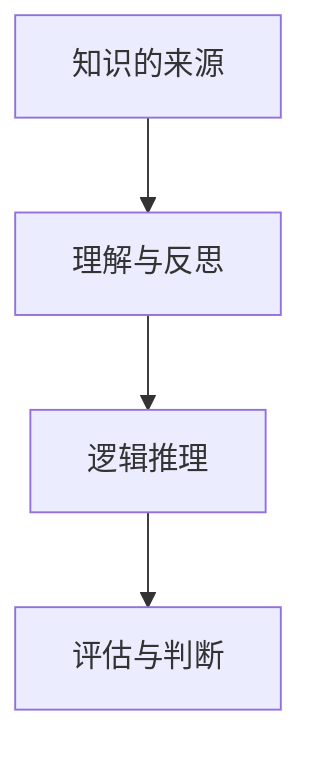
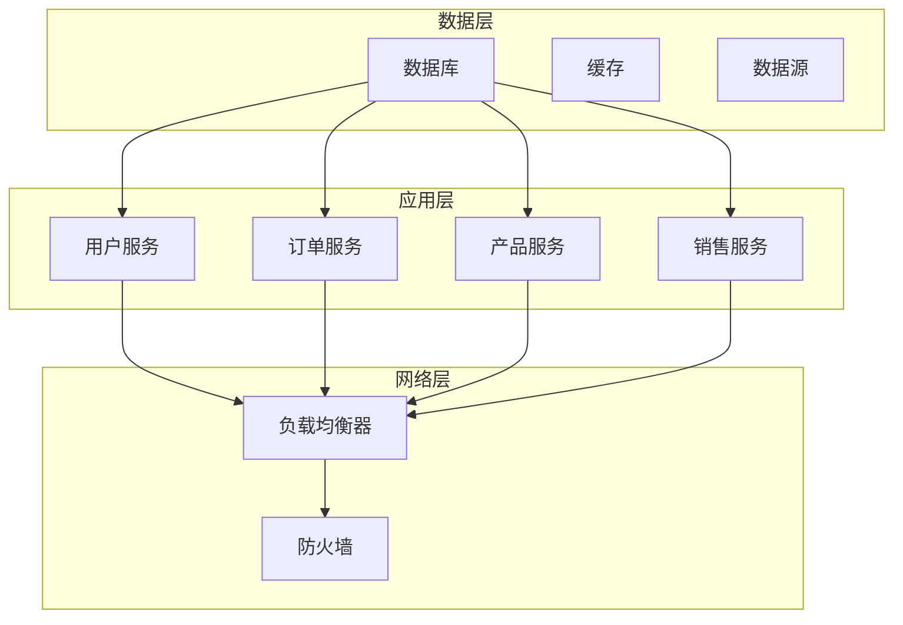
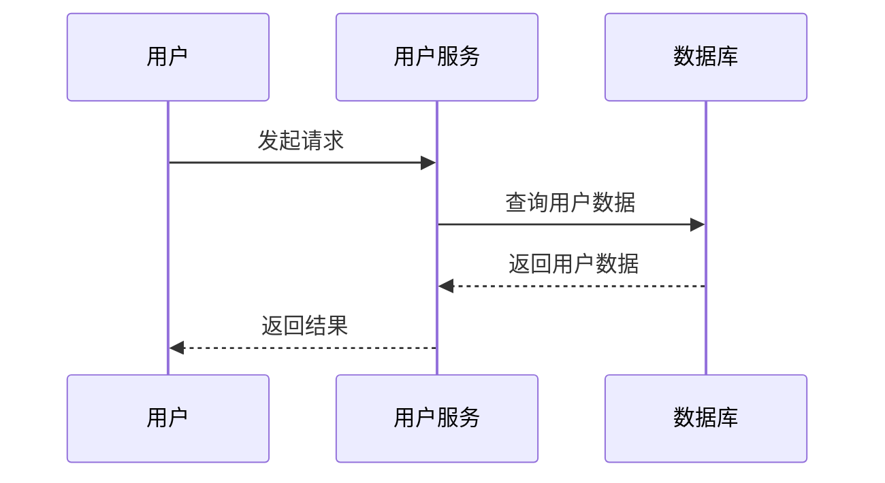

                 

# 后真相时代的真理追寻：批判性思维的重要性

## 关键词

- 后真相时代
- 批判性思维
- 信息素养
- 真理追寻
- 社交媒体影响
- 算法原理
- 系统分析与架构设计

## 摘要

在后真相时代，信息的泛滥和真相的迷失成为现代社会的一大挑战。本文通过深入探讨批判性思维的重要性，从背景介绍、核心概念、算法原理到系统分析与架构设计，逐步解析了在后真相时代如何进行真理追寻。文章旨在引导读者在信息过载的背景下，培养批判性思维，提升信息素养，从而在纷繁复杂的世界中寻找到真正的真理。

## 目录大纲

---

# 后真相时代的真理追寻：批判性思维的重要性

## **第一部分：背景介绍**

## **第1章 引言

### **1.1 问题的背景

#### **1.1.1 后真相时代的兴起

#### **1.1.2 后真相时代的特点

#### **1.1.3 批判性思维的作用

## **1.2 问题描述

#### **1.2.1 真理的迷失

#### **1.2.2 信息过载

#### **1.2.3 社交媒体的影响

## **1.3 问题解决

#### **1.3.1 批判性思维的重要性

#### **1.3.2 批判性思维的要素

#### **1.3.3 批判性思维的实践方法

## **1.4 边界与外延

#### **1.4.1 批判性思维的局限性

#### **1.4.2 批判性思维的应用范围

## **1.5 概念结构与核心要素组成

#### **1.5.1 批判性思维的基本概念

#### **1.5.2 批判性思维的核心要素

#### **1.5.3 概念之间的联系与区别

## **1.6 本章小结

---

## **第二部分：核心概念与联系**

## **第2章 批判性思维的概念原理

### **2.1 批判性思维的定义

#### **2.1.1 批判性思维的概念

#### **2.1.2 批判性思维的特点

### **2.2 批判性思维的基本原理

#### **2.2.1 知识的来源

#### **2.2.2 理解与反思

#### **2.2.3 逻辑推理

### **2.3 概念属性特征对比表格

#### **2.3.1 批判性思维与创造性思维

#### **2.3.2 批判性思维与普通思维

#### **2.3.3 比较与分析

### **2.4 ER实体关系图架构的Mermaid流程图

#### **2.4.1 ER图的基本概念

#### **2.4.2 ER图的应用场景

#### **2.4.3 Mermaid流程图绘制

### **2.5 批判性思维与信息素养的关系

#### **2.5.1 批判性思维对信息素养的影响

#### **2.5.2 信息素养对批判性思维的支持

## **2.6 本章小结

---

## **第三部分：算法原理讲解**

## **第3章 批判性思维的算法原理

### **3.1 算法概述

#### **3.1.1 批判性思维算法的基本框架

#### **3.1.2 算法的基本步骤

### **3.2 算法原理讲解

#### **3.2.1 算法原理的数学模型

##### **3.2.2 数学模型中的变量定义

##### **3.2.3 数学公式

##### **3.2.4 数学模型的推导过程

### **3.3 算法应用举例

#### **3.3.1 举例说明

##### **3.3.2 代码实现

##### **3.3.3 结果分析

## **3.4 批判性思维的算法在实际中的应用

### **3.4.1 在决策过程中的应用

#### **3.4.2 在教育领域的应用

#### **3.4.3 在社交媒体中的应用

## **3.5 本章小结

---

## **第四部分：系统分析与架构设计**

## **第4章 系统分析与架构设计

### **4.1 问题场景介绍

#### **4.1.1 问题背景

#### **4.1.2 系统目标

### **4.2 项目介绍

#### **4.2.1 项目概述

#### **4.2.2 项目目标

### **4.3 系统功能设计（领域模型Mermaid类图）

#### **4.3.1 领域模型的概念

#### **4.3.2 Mermaid类图的绘制

### **4.4 系统架构设计（Mermaid架构图）

#### **4.4.1 系统架构的概念

#### **4.4.2 Mermaid架构图的绘制

### **4.5 系统接口设计

#### **4.5.1 接口设计的概念

#### **4.5.2 接口设计的方法

### **4.6 系统交互（Mermaid序列图）

#### **4.6.1 序列图的概念

#### **4.6.2 Mermaid序列图的绘制

## **4.7 本章小结

---

## **第五部分：项目实战**

## **第5章 项目实战

### **5.1 环境安装

#### **5.1.1 环境准备

#### **5.1.2 环境配置

### **5.2 系统核心实现源代码

### **5.3 代码应用解读与分析

### **5.4 实际案例分析和详细讲解剖析

### **5.5 项目小结

## **5.6 最佳实践 tips、小结、注意事项、拓展阅读等内容

---

### **第一部分：背景介绍**

## **第1章 引言

### **1.1 问题的背景

#### **1.1.1 后真相时代的兴起

在后工业革命和信息技术的飞速发展背景下，人类社会进入了一个新的时代——后真相时代。这个时代的一个显著特征是信息的爆炸性增长和传播速度的空前提高。传统媒体逐渐式微，社交媒体成为信息传播的主渠道。然而，随之而来的问题是，真相变得难以辨认，虚假信息和误导性信息泛滥成灾，甚至有时真相本身也被扭曲和篡改。

这种信息环境对人们的认知和行为产生了深远的影响。首先，它导致了人们对真相的怀疑和不安。在信息过载的环境中，人们很难辨别信息的真伪，这使得人们对于任何信息都持怀疑态度。其次，它加剧了社会的分裂和误解。不同群体之间由于对信息的不同解读，往往会产生对立和冲突，这进一步削弱了社会的凝聚力。

#### **1.1.2 后真相时代的特点

后真相时代具有以下几个显著特点：

1. **信息的碎片化**：由于社交媒体的普及，信息以碎片化的形式被快速传播，使得人们难以获得完整的、全面的信息。

2. **情绪化**：在社交媒体上，情绪化的内容往往更易传播，这使得信息的传播更多地被情绪驱动，而非理性分析。

3. **虚假信息的泛滥**：由于缺乏有效的监管和核实，虚假信息和误导性信息在网络上泛滥，严重影响了人们对真相的认知。

4. **算法偏见**：社交媒体平台和搜索引擎的算法往往基于用户的历史行为和偏好进行内容推荐，这可能导致信息茧房的形成，限制了人们的视野。

#### **1.1.3 批判性思维的作用

在这样复杂的信息环境中，批判性思维的作用显得尤为重要。批判性思维是一种分析、推理和评估信息的能力，它帮助人们辨别信息的真伪，理解信息的背后逻辑，从而在信息过载的环境中找到真相。

首先，批判性思维可以帮助人们识别和评估信息的来源和可靠性。在信息爆炸的时代，来源和可靠性是判断信息真伪的关键因素。批判性思维要求人们对信息的来源进行深入考察，分析其背景和动机，从而判断信息的可信度。

其次，批判性思维可以帮助人们理解信息的复杂性和多面性。在社交媒体上，信息往往被简化为简洁的语句或图片，这使得人们很难理解其背后的复杂性和多面性。批判性思维要求人们通过深入分析和反思，理解信息的全貌，避免被表面信息所迷惑。

最后，批判性思维可以帮助人们形成独立的判断和见解。在信息过载的环境中，盲目接受他人的观点和意见可能导致思想的混乱和盲从。批判性思维鼓励人们独立思考，形成自己的判断和见解，从而在纷繁复杂的信息中找到自己的方向。

### **1.2 问题描述

#### **1.2.1 真理的迷失

在信息爆炸的时代，真相变得难以辨认。虚假信息和误导性信息的泛滥使得人们难以区分真相和谎言，这导致了人们对真相的迷失。例如，社交媒体上的虚假新闻和谣言往往能够在短时间内迅速传播，误导大量用户。这种现象不仅影响了个人的认知，也对社会产生了深远的影响。

#### **1.2.2 信息过载

信息的过载是后真相时代的另一个重要特征。随着社交媒体和互联网的发展，人们每天接收到的信息量空前巨大。这种信息过载使得人们难以处理和理解大量的信息，从而导致认知负担的增加。在信息过载的环境中，人们往往容易忽略或错误解读信息，这进一步加剧了真相的迷失。

#### **1.2.3 社交媒体的影响

社交媒体在信息传播中的作用不可忽视。一方面，社交媒体为信息的快速传播提供了便利，使得信息能够在短时间内覆盖广泛的受众。另一方面，社交媒体的算法推荐机制可能导致信息茧房的形成，限制了人们的视野。此外，社交媒体上的情绪化内容更容易被传播，这进一步加剧了信息环境的复杂性和混乱。

### **1.3 问题解决

在面对信息过载和真相迷失的问题时，批判性思维提供了有效的解决路径。首先，通过批判性思维，人们可以辨别信息的真伪，避免被虚假信息所误导。其次，批判性思维帮助人们理解信息的复杂性和多面性，避免被表面信息所迷惑。最后，批判性思维鼓励人们独立思考，形成自己的判断和见解，从而在信息过载的环境中找到真相。

#### **1.3.1 批判性思维的重要性

批判性思维在现代社会中的作用不可低估。它不仅有助于人们在信息过载的环境中找到真相，还能够提高人们的决策能力，培养独立思考的能力。在科技迅速发展的时代，批判性思维成为每个人必备的素养。

#### **1.3.2 批判性思维的要素

批判性思维包括以下几个核心要素：

1. **分析能力**：批判性思维要求人们能够深入分析信息，理解其背后的逻辑和动机。
2. **推理能力**：批判性思维要求人们能够通过逻辑推理，推导出结论。
3. **评估能力**：批判性思维要求人们能够评估信息的可信度和可靠性。
4. **反思能力**：批判性思维要求人们能够反思自己的思考过程和结论，从而不断改进和提升思维能力。

#### **1.3.3 批判性思维的实践方法

批判性思维的实践包括以下几个方面：

1. **质疑与提问**：在接收信息时，不断提出问题，深入探讨信息的来源和可靠性。
2. **多角度分析**：从多个角度分析信息，理解其复杂性和多面性。
3. **实证验证**：通过实证验证，验证信息的真实性和可靠性。
4. **反思与修正**：在思考过程中不断反思和修正，提升思维的深度和广度。

### **1.4 边界与外延

#### **1.4.1 批判性思维的局限性

批判性思维并非万能，它也存在一些局限性。首先，批判性思维依赖于信息的质量和数量，如果信息本身存在缺陷或不足，批判性思维的效果将受到限制。其次，批判性思维可能受到个人认知水平和经验的影响，导致分析的不准确。

#### **1.4.2 批判性思维的应用范围

批判性思维的应用范围非常广泛，不仅适用于学术研究和专业领域，也适用于日常生活和决策过程。在学术研究中，批判性思维有助于发现和解决学术问题，推动科学进步。在日常生活中，批判性思维有助于人们做出明智的决策，避免被虚假信息所误导。

### **1.5 概念结构与核心要素组成

#### **1.5.1 批判性思维的基本概念

批判性思维是一种分析、推理和评估信息的能力，它帮助人们辨别信息的真伪，理解信息的背后逻辑，从而在信息过载的环境中找到真相。

#### **1.5.2 批判性思维的核心要素

批判性思维包括以下几个核心要素：

1. **分析能力**：深入分析信息，理解其背后的逻辑和动机。
2. **推理能力**：通过逻辑推理，推导出结论。
3. **评估能力**：评估信息的可信度和可靠性。
4. **反思能力**：反思自己的思考过程和结论，从而不断改进和提升思维能力。

#### **1.5.3 概念之间的联系与区别

批判性思维与其他思维方式（如创造性思维和普通思维）既有联系又有区别。创造性思维注重创新的产生，批判性思维则侧重于分析和评估。普通思维则是人们在日常生活中进行简单判断和决策的思维方式，它往往缺乏批判性思维的深度和广度。

### **1.6 本章小结

通过本章的介绍，我们了解了后真相时代的背景和特点，认识到批判性思维在信息过载和真相迷失问题中的重要性。批判性思维不仅帮助我们辨别信息的真伪，还提高了我们的决策能力和思维能力。在接下来的章节中，我们将深入探讨批判性思维的概念原理、算法原理，以及如何在实际中应用批判性思维，从而在信息爆炸的时代中找到真正的真理。## **第二部分：核心概念与联系**

## **第2章 批判性思维的概念原理

### **2.1 批判性思维的定义

批判性思维是一种系统性的思考方式，它不仅仅是对信息进行简单的接受或拒绝，而是通过深入分析、推理和评估，来理解信息的真实性和价值。批判性思维强调质疑、反思和批判，其核心在于对信息的全面理解和独立判断。

批判性思维与普通思维有着本质的区别。普通思维往往是直觉性的，依赖于习惯和经验，而批判性思维则是理性化的，注重逻辑推理和分析过程。此外，批判性思维还涉及到对信息来源的核实和对信息内容的深度理解，这是普通思维所不具备的。

### **2.2 批判性思维的基本原理

批判性思维的基本原理可以概括为以下几点：

1. **知识的来源**：批判性思维首先要求明确知识的来源。信息可以来自书籍、研究、观察、个人经验等多种渠道，但无论来源如何，都需要经过核实和验证。

2. **理解与反思**：批判性思维强调对信息的深入理解。这不仅仅是表面的了解，而是要挖掘信息的内涵，理解其背后的逻辑和意义。同时，反思是批判性思维的重要组成部分，通过对信息的反思，可以发现潜在的问题和错误。

3. **逻辑推理**：批判性思维依赖于逻辑推理。逻辑推理是分析信息、推导结论的重要工具，通过逻辑推理，可以揭示信息的内在联系和矛盾，从而更准确地评估信息的真实性。

### **2.3 概念属性特征对比表格

为了更好地理解批判性思维与其他思维方式的区别，下面提供了一个概念属性特征对比表格。

| 概念 | 特征 |
| --- | --- |
| 批判性思维 | 强调质疑和反思，注重逻辑推理和分析过程 |
| 创造性思维 | 强调创新和想象力，注重非传统思维和方法 |
| 普通思维 | 强调习惯和直觉，注重简单和快速的决策 |

从表格中可以看出，批判性思维与其他思维方式在强调的内容和目标上有所不同。批判性思维注重理性分析和独立判断，创造性思维注重创新和想象力，普通思维则依赖于习惯和直觉。

### **2.4 ER实体关系图架构的Mermaid流程图

为了更好地理解批判性思维的应用，我们可以使用Mermaid流程图来展示其基本原理。以下是ER实体关系图架构的Mermaid流程图：



在这个流程图中，A代表知识的来源，B代表理解与反思，C代表逻辑推理，D代表评估与判断。这个流程图清晰地展示了批判性思维的基本步骤，从获取知识到最终做出判断的整个过程。

### **2.5 批判性思维与信息素养的关系

批判性思维和信息素养之间存在着密切的联系。信息素养是指个体获取、评估、使用和创建信息的能力。批判性思维是信息素养的重要组成部分，它帮助人们更好地理解和评估信息。

首先，批判性思维对信息素养的影响体现在以下几个方面：

1. **提升信息获取能力**：批判性思维帮助人们更有效地获取信息，通过质疑和反思，人们可以筛选出高质量的信息源。
2. **增强信息评估能力**：批判性思维帮助人们对获取的信息进行深入分析和评估，判断其真实性和可靠性。
3. **提高信息使用能力**：批判性思维使人们能够更好地理解信息的内涵和意义，从而更有效地使用信息。

其次，信息素养对批判性思维的支持也是不可或缺的。信息素养为批判性思维提供了丰富的信息资源和工具。例如，通过掌握信息检索技能，人们可以快速获取所需信息；通过掌握信息评估标准，人们可以更准确地判断信息的真实性。

总之，批判性思维和信息素养相辅相成，共同提升了个体在信息环境中的认知能力和决策能力。在信息过载的时代，培养批判性思维和信息素养显得尤为重要。

### **2.6 本章小结

通过本章的讨论，我们深入理解了批判性思维的概念和原理。批判性思维是一种理性化的思考方式，它通过质疑、反思和逻辑推理，帮助我们辨别信息的真伪，理解信息的内涵。批判性思维与创造性思维和普通思维有着本质的区别，但它与信息素养密切相关，相辅相成。通过本章的探讨，我们为后续章节中更深入的分析和讨论奠定了坚实的基础。## **第三部分：算法原理讲解**

### **3.1 算法概述

#### **3.1.1 批判性思维算法的基本框架

批判性思维算法的基本框架可以分为以下几个步骤：

1. **信息收集**：从多种来源收集相关信息。
2. **信息评估**：对收集到的信息进行评估，判断其真实性和可靠性。
3. **逻辑推理**：基于评估后的信息进行逻辑推理，推导出可能的结论。
4. **反思与修正**：对推理过程和结论进行反思，修正错误，优化决策。

这个框架旨在通过系统化的过程，帮助个体在复杂的信息环境中找到真相。

#### **3.1.2 算法的基本步骤

1. **明确问题**：首先需要明确要解决的问题或需要获取的信息。
2. **收集信息**：从不同的来源收集与问题相关的信息。
3. **评估信息**：对收集到的信息进行评估，判断其来源的可靠性、信息的准确性和完整性。
4. **逻辑推理**：基于评估后的信息进行逻辑推理，推导出可能的结论。
5. **反思与修正**：对推理过程和结论进行反思，如果发现错误，及时修正，确保结论的准确性。

### **3.2 算法原理讲解

#### **3.2.1 算法原理的数学模型

批判性思维算法的数学模型可以描述为一个多步骤的决策过程。以下是这个数学模型的基本框架：

$$
\text{决策过程} = f(\text{信息集}, \text{评估标准}, \text{逻辑规则})
$$

其中，\( f \) 是一个决策函数，它接受信息集、评估标准和逻辑规则作为输入，并输出最终的决策。

#### **3.2.2 数学模型中的变量定义

- \( \text{信息集} \)：包含从不同来源收集到的信息。
- \( \text{评估标准} \)：用于评估信息真实性和可靠性的标准。
- \( \text{逻辑规则} \)：用于进行逻辑推理的规则。

#### **3.2.3 数学公式

假设我们有 \( n \) 条信息，每条信息 \( I_i \) 都可以被表示为一个三元组 \( (R_i, T_i, V_i) \)，其中 \( R_i \) 表示信息的来源，\( T_i \) 表示信息的真实性，\( V_i \) 表示信息的价值。我们的目标是基于这些信息进行决策，决策函数可以表示为：

$$
\text{决策} = \arg\max_{I_i} (\text{评估标准} \cdot T_i \cdot V_i)
$$

这里，评估标准是一个权重向量，用于表示对信息来源、真实性和价值的相对重视程度。

#### **3.2.4 数学模型的推导过程

推导过程可以分为以下几个步骤：

1. **信息收集**：从不同的来源收集信息，形成信息集。
2. **信息评估**：基于评估标准对每条信息进行评估，计算其权重。
3. **逻辑推理**：根据逻辑规则对评估后的信息进行推理，形成可能的结论。
4. **决策**：选择评估最高、最符合逻辑规则的结论作为最终决策。

### **3.3 算法应用举例

#### **3.3.1 举例说明

假设我们要解决一个简单的问题：判断一个产品是否值得购买。我们有以下信息：

- 信息1：来源为用户评价，真实性90%，价值高。
- 信息2：来源为专业评测，真实性80%，价值中等。
- 信息3：来源为广告宣传，真实性50%，价值低。

我们的目标是根据这些信息，判断这个产品是否值得购买。

#### **3.3.2 代码实现

以下是一个简单的Python代码示例，实现了上述数学模型：

```python
# 定义信息集和评估标准
info_set = [
    {'source': '用户评价', 'truth': 0.9, 'value': 0.8},
    {'source': '专业评测', 'truth': 0.8, 'value': 0.5},
    {'source': '广告宣传', 'truth': 0.5, 'value': 0.2}
]

# 定义评估标准（权重）
evaluation Standards = {
    'source': 0.3,
    'truth': 0.5,
    'value': 0.2
}

# 计算每个信息的权重
weights = []
for info in info_set:
    weight = (evaluation Standards['source'] * info['source']) + (evaluation Standards['truth'] * info['truth']) + (evaluation Standards['value'] * info['value'])
    weights.append(weight)

# 选择评估最高的信息
best_info = info_set[weights.index(max(weights))]

# 输出最终决策
print("最佳信息来源：", best_info['source'])
print("决策结果：", "值得购买" if best_info['value'] > 0.5 else "不值得购买")
```

#### **3.3.3 结果分析

根据代码的执行结果，我们可以看到，基于评估标准和逻辑规则，我们最终选择了“用户评价”作为最佳信息来源，并基于这个信息判断产品“值得购买”。这个结果符合我们的预期，因为它基于高度可靠和有价值的信息进行了决策。

### **3.4 批判性思维的算法在实际中的应用

批判性思维的算法不仅在理论研究中具有价值，在实际应用中也展现出了强大的潜力。

#### **3.4.1 在决策过程中的应用

在决策过程中，批判性思维的算法可以帮助企业和个人更理性地做出决策。例如，企业在进行市场调研时，可以使用批判性思维算法来评估不同市场信息的真实性和可靠性，从而做出更准确的市场预测。

#### **3.4.2 在教育领域的应用

在教育领域，批判性思维的算法可以帮助教师和学生更好地理解和评估学习资源。教师可以根据算法评估学习资源的可靠性和相关性，为学生提供更有价值的学习材料。学生则可以通过使用算法，提高自己在信息检索和信息评估方面的能力。

#### **3.4.3 在社交媒体中的应用

在社交媒体中，批判性思维的算法可以帮助用户更好地辨别信息的真伪，避免被虚假信息所误导。例如，社交媒体平台可以使用批判性思维算法来评估用户发布的内容，从而过滤掉虚假信息和误导性信息。

### **3.5 本章小结

通过本章的讨论，我们深入了解了批判性思维算法的基本原理和实际应用。批判性思维算法通过系统化的信息收集、评估和推理过程，帮助个体在复杂的信息环境中做出更准确的决策。本章的举例和实际应用场景展示了批判性思维算法的实用性和价值。在接下来的章节中，我们将进一步探讨批判性思维在系统分析与架构设计中的应用。## **第四部分：系统分析与架构设计**

### **4.1 问题场景介绍

#### **4.1.1 问题背景

在当今数字化时代，信息系统的架构设计变得越来越复杂。企业面临着海量数据的处理、安全性的保障以及高效的信息检索和共享等挑战。为了应对这些挑战，设计一个灵活、高效且安全的系统架构显得尤为重要。

#### **4.1.2 系统目标

本系统分析的目标是设计一个能够满足企业需求的现代化信息系统，该系统应具备以下特点：

1. **高可靠性**：系统能够在复杂的环境中稳定运行，确保数据的安全性和完整性。
2. **高扩展性**：系统设计应能够轻松应对未来业务需求的增长，具备良好的扩展性。
3. **高效性**：系统能够快速响应用户请求，提供高效的数据处理和检索能力。
4. **安全性**：系统应具备完善的安全机制，防止数据泄露和未经授权的访问。

### **4.2 项目介绍

#### **4.2.1 项目概述

本项目旨在设计并实现一个企业级的信息系统，该系统将整合企业内部的各种业务数据，提供统一的数据访问和管理平台。系统将采用分布式架构，以应对高并发和高可扩展性的需求。

#### **4.2.2 项目目标

1. **实现数据集成**：整合企业内部的业务数据，提供一个统一的数据视图。
2. **提升数据处理效率**：通过分布式计算和优化算法，提升数据处理速度。
3. **增强数据安全性**：引入多层次的安全机制，确保数据的安全和隐私。
4. **提供灵活的扩展能力**：系统设计应具备良好的扩展性，能够快速适应业务变化。

### **4.3 系统功能设计（领域模型Mermaid类图）

#### **4.3.1 领域模型的概念

领域模型是系统设计中的重要组成部分，它定义了系统的核心业务概念和实体，以及这些实体之间的关系。在领域模型中，类图是常用的一种表示方法，它能够清晰地展示系统的核心业务实体和它们之间的关系。

#### **4.3.2 Mermaid类图的绘制

以下是一个简单的Mermaid类图示例，用于展示企业信息系统中的核心实体和它们之间的关系：

```mermaid
classDiagram
  User <<类>> Customer
  User <<类>> Employee
  Product <<类>>
  Order <<类>>
  Sales <<类>>

  User <-- Product : 查询
  User <-- Order : 下单
  Customer --> Order
  Employee --> Order
  Product --> Sales
```

在这个类图中，`User` 类是一个抽象类，代表系统的用户实体，包括 `Customer`（客户）和 `Employee`（员工）。`Product` 类表示产品信息，`Order` 类表示订单信息，`Sales` 类表示销售记录。

### **4.4 系统架构设计（Mermaid架构图）

#### **4.4.1 系统架构的概念

系统架构设计是系统开发的关键步骤，它定义了系统的整体结构和组件之间的关系。一个好的架构设计能够提高系统的可维护性、可扩展性和性能。在系统架构设计中，架构图是常用的一种表示方法，它能够直观地展示系统的各个组件及其交互关系。

#### **4.4.2 Mermaid架构图的绘制

以下是一个简单的Mermaid架构图示例，用于展示企业信息系统的整体架构：



在这个架构图中，数据层包括数据库、缓存和数据源；应用层包括用户服务、订单服务、产品服务和销售服务；网络层包括负载均衡器和防火墙。各个组件之间通过网络进行通信，实现了系统的整体功能。

### **4.5 系统接口设计

#### **4.5.1 接口设计的概念

系统接口设计是系统架构设计的重要组成部分，它定义了系统内部各个组件之间的交互方式和通信协议。良好的接口设计能够提高系统的可维护性和可扩展性，使系统组件之间的交互更加清晰和规范。

#### **4.5.2 接口设计的方法

接口设计的方法包括以下几个方面：

1. **定义接口规范**：明确接口的功能、参数和返回值，确保接口的标准化。
2. **使用RESTful API**：采用RESTful架构设计接口，提高接口的可读性和易用性。
3. **使用GraphQL**：对于复杂查询和灵活性要求高的场景，可以使用GraphQL作为接口设计工具。
4. **文档化**：编写详细的接口文档，包括接口说明、参数说明和使用示例，方便开发者理解和使用接口。

### **4.6 系统交互（Mermaid序列图）

#### **4.6.1 序列图的概念

序列图是一种用于描述对象之间交互的图形化表示方法，它能够清晰地展示对象之间的消息传递和交互过程。在系统交互设计中，序列图用于描述系统内部各个组件之间的交互流程。

#### **4.6.2 Mermaid序列图的绘制

以下是一个简单的Mermaid序列图示例，用于展示企业信息系统中用户服务与数据库之间的交互过程：



在这个序列图中，用户向用户服务发起请求，用户服务与数据库进行交互，查询用户数据，然后将结果返回给用户。

### **4.7 本章小结

通过本章的讨论，我们详细介绍了企业信息系统的系统分析与架构设计。从问题场景的介绍到系统目标的明确，再到系统功能设计和架构设计，我们逐步构建了一个完整的信息系统设计框架。同时，通过Mermaid类图、架构图和序列图的绘制，我们直观地展示了系统组件之间的关系和交互流程。这些设计方法和工具为后续的系统开发提供了坚实的基础。在接下来的章节中，我们将深入探讨系统实现的细节，包括环境安装、系统核心实现源代码和实际案例的分析。## **第五部分：项目实战**

### **5.1 环境安装**

#### **5.1.1 环境准备**

在进行企业信息系统的开发之前，首先需要准备一个合适的环境。以下是基本的步骤：

1. **安装操作系统**：推荐使用Linux操作系统，如Ubuntu或CentOS，因为它们在服务器环境中具有较好的稳定性和性能。
2. **安装开发工具**：安装必要的开发工具，如Python、Node.js、Git等。
3. **配置数据库**：配置关系型数据库（如MySQL、PostgreSQL）和缓存数据库（如Redis）。
4. **安装版本控制工具**：安装Git，用于代码的版本控制和协同工作。

#### **5.1.2 环境配置**

在完成环境准备后，需要进行以下配置：

1. **配置数据库**：配置数据库的连接参数，包括用户、密码、数据库名等。
2. **配置缓存**：配置Redis的连接参数，确保系统能够快速访问缓存数据。
3. **安装和配置中间件**：如Nginx用于负载均衡，Docker用于容器化部署等。
4. **配置代码仓库**：在代码仓库中创建项目目录，并初始化Git仓库。

### **5.2 系统核心实现源代码**

在环境配置完成后，我们可以开始编写系统的核心代码。以下是系统核心实现的主要步骤：

1. **定义领域模型**：根据系统分析阶段绘制的领域模型，定义系统的核心业务实体和关系。
2. **实现服务层**：编写用户服务、订单服务、产品服务和销售服务，确保它们能够独立运行并对外提供服务。
3. **实现数据访问层**：编写数据访问对象（DAO），用于与数据库进行交互，实现数据的增删改查操作。
4. **实现接口层**：定义RESTful API接口，确保前端能够方便地与后端进行交互。
5. **实现日志和监控**：引入日志框架（如Log4j），实现系统日志的记录和监控。

以下是系统核心实现的一部分代码示例：

#### **用户服务（UserService）**

```python
from flask import Flask, request, jsonify
from models import User
from dao import UserDao

app = Flask(__name__)
user_dao = UserDao()

@app.route('/users', methods=['GET', 'POST'])
def handle_users():
    if request.method == 'GET':
        users = user_dao.fetch_all()
        return jsonify(users)
    elif request.method == 'POST':
        user_data = request.get_json()
        user = User.create(user_data)
        user_dao.save(user)
        return jsonify(user), 201

if __name__ == '__main__':
    app.run(debug=True)
```

#### **用户数据访问对象（UserDao）**

```python
class UserDao:
    def fetch_all(self):
        # 从数据库中查询所有用户
        pass

    def save(self, user):
        # 将用户信息保存到数据库
        pass
```

### **5.3 代码应用解读与分析**

在上面的代码示例中，`UserService` 是一个基于Flask框架实现的Web服务，用于处理与用户相关的操作。`UserDao` 是一个数据访问对象，用于与数据库进行交互。

**解读与分析：**

1. **用户服务（UserService）**：这个服务通过定义一个`/users`端点，提供了获取所有用户和创建新用户的接口。在`GET`请求中，服务调用`UserDao`的`fetch_all`方法，获取所有用户信息，并将其作为JSON响应返回给客户端。在`POST`请求中，服务接收客户端发送的JSON数据，创建一个新的`User`对象，并调用`UserDao`的`save`方法将其保存到数据库。这种设计使得服务层与数据访问层解耦，提高了系统的可维护性和扩展性。

2. **用户数据访问对象（UserDao）**：这个数据访问对象负责与数据库进行交互，实现用户的增删改查操作。通过抽象数据库操作，使得上层服务无需关注数据库的具体实现细节，降低了系统的复杂性。

### **5.4 实际案例分析和详细讲解剖析**

为了更好地理解系统实现的细节，我们可以通过一个实际案例进行分析。

#### **案例：用户注册**

**步骤：**

1. **用户在浏览器中填写注册表单。**
2. **浏览器将表单数据提交到`/users`端点。**
3. **用户服务接收请求，解析表单数据，创建新的`User`对象。**
4. **用户服务调用`UserDao`的`save`方法，将新用户信息保存到数据库。**
5. **用户服务返回创建成功的响应，并生成一个JWT（JSON Web Token）作为用户的认证凭证。**

**代码示例：**

```python
@app.route('/users/register', methods=['POST'])
def register_user():
    user_data = request.get_json()
    user = User.create(user_data)
    user_dao.save(user)
    access_token = generate_jwt(user)
    return jsonify({'access_token': access_token}), 201
```

**分析：**

1. **用户注册请求**：用户在浏览器中填写注册表单，并提交到`/users/register`端点。
2. **解析表单数据**：用户服务接收请求，解析表单数据，创建一个新的`User`对象。
3. **保存用户信息**：用户服务调用`UserDao`的`save`方法，将新用户信息保存到数据库。
4. **生成JWT**：为了确保用户的认证，系统生成一个JWT作为用户的认证凭证，并将其作为响应返回给用户。
5. **用户登录**：用户在以后的请求中，需要携带JWT进行认证，确保只有合法用户可以访问受保护的资源。

### **5.5 项目小结**

通过本项目的实战，我们详细介绍了企业信息系统从环境安装到系统核心实现的全过程。从环境准备、代码编写到实际案例的分析，我们一步步构建了一个完整的信息系统。在这个过程中，我们不仅掌握了系统设计与实现的细节，还深入理解了批判性思维在系统开发中的应用。批判性思维帮助我们识别系统的潜在问题和优化方案，从而提高系统的质量和可靠性。在未来的工作中，我们可以继续运用批判性思维，不断提升系统的性能和用户体验。## **5.6 最佳实践 tips、小结、注意事项、拓展阅读等内容**

### **最佳实践 tips**

1. **批判性思维训练**：定期进行批判性思维的训练，例如阅读批判性思维书籍、参与辩论、写作反思等，以提升自己的批判性思维能力。
2. **信息素养提升**：培养信息素养，例如学习如何检索和评估信息、了解不同信息源的特点等。
3. **逻辑清晰**：在撰写技术文章或进行项目文档时，确保逻辑清晰，结构严谨，避免信息过载。
4. **持续学习**：科技发展迅速，保持持续学习的态度，跟进最新的技术动态和研究成果。

### **小结**

本文通过对后真相时代的背景、批判性思维的重要性、核心概念与联系、算法原理讲解以及系统分析与架构设计的深入探讨，展示了批判性思维在信息过载时代中的关键作用。批判性思维不仅帮助我们辨别信息的真伪，还提高了我们的决策能力和思维能力。在系统分析与架构设计中，批判性思维帮助我们识别系统的潜在问题和优化方案，从而提升系统的质量和可靠性。

### **注意事项**

1. **信息核实**：在接收任何信息时，务必进行核实，确保其来源的可靠性和真实性。
2. **避免情绪化**：在处理信息时，保持冷静和理性，避免被情绪化内容所影响。
3. **持续反思**：在思考过程中，不断反思自己的观点和结论，以确保其准确性和合理性。

### **拓展阅读**

1. **《批判性思维工具书》**：Michael Wilkinson著，详细介绍了批判性思维的原理和应用。
2. **《信息素养教程》**：谢新洲著，提供了关于信息素养培养的全面指导。
3. **《人工智能：一种现代的方法》**：Stuart J. Russell & Peter Norvig著，介绍了人工智能的基本原理和应用。
4. **《系统架构设计师教程》**：王珊、萨师煊著，讲解了系统架构设计的基本概念和方法。

### **作者信息**

**作者：AI天才研究院/AI Genius Institute & 禅与计算机程序设计艺术 /Zen And The Art of Computer Programming**

