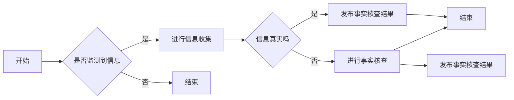
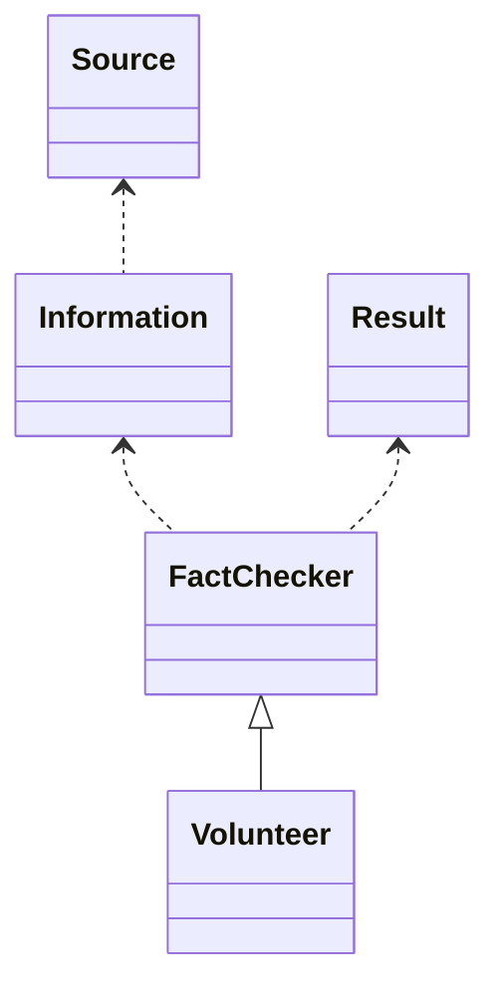
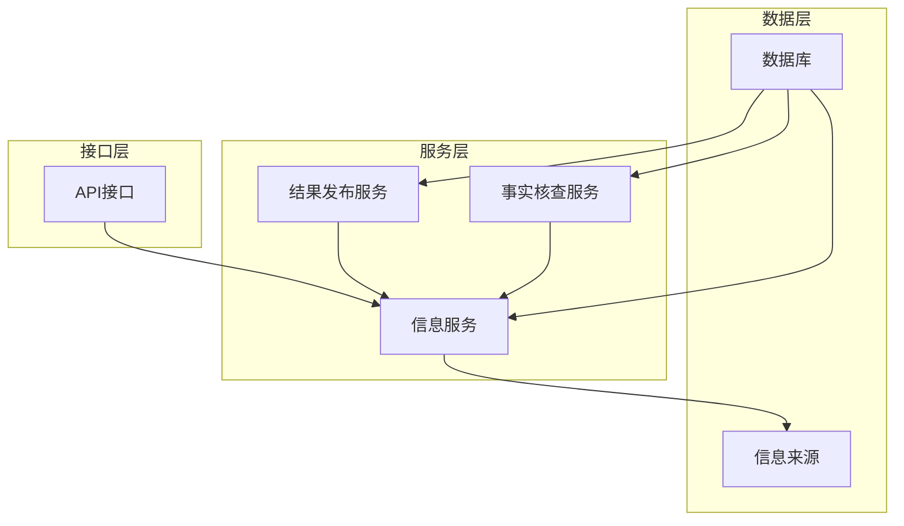
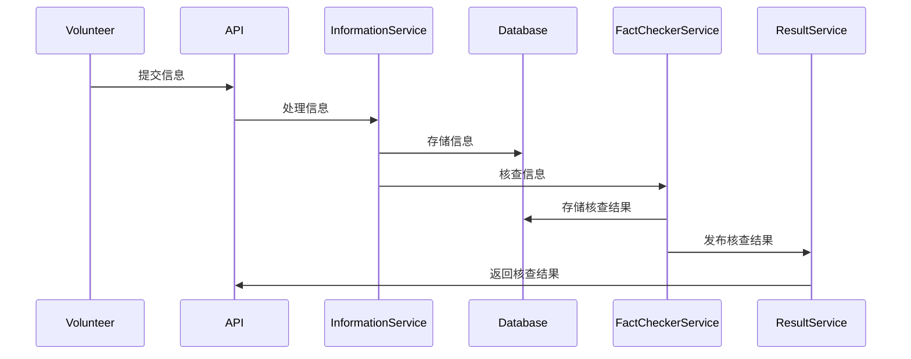

                 

**# 后真相时代真相守护者联盟：事实核查的志愿者组织**

**关键词：**后真相时代、事实核查、志愿者组织、信息真实性、社交媒体

**摘要：**本文深入探讨了后真相时代的到来对信息真实性的挑战，介绍了真相守护者联盟这一志愿者组织，详细阐述了其起源、使命、组织结构以及运作方式。文章进一步探讨了事实核查的方法，分析了面临的挑战及解决方案，并分享了真相守护者联盟的成功故事。通过本文的阅读，读者将了解如何在这个信息爆炸的时代，成为一名真相守护者。

## **引言**

在信息爆炸的时代，互联网的普及使得信息传播的速度和范围前所未有。然而，这也带来了一个严峻的问题——信息真实性。在后真相时代，情感、观点和假新闻往往比事实更能吸引人们的注意。这种情况下，真相变得越来越难以辨识，人们面临着被误导和误解的风险。为了应对这一挑战，真相守护者联盟这一志愿者组织应运而生，致力于守护事实的真实性。

## **后真相时代的背景**

### **1.1 后真相时代的概念**

后真相时代（Post-Truth Era）是指一个现象，即事实在公共讨论中的影响力下降，而情感、观点和个人信念的影响力上升。在这个时代，信息的真实性不再是决策的主要依据，人们的观点和情感往往更具影响力。

### **1.2 后真相时代的特点**

- **情感化传播**：信息传播更加注重情感因素，而非事实本身。
- **假新闻泛滥**：社交媒体和互联网的普及使得假新闻得以迅速传播。
- **真相难以辨识**：在大量的信息中，真相变得难以辨别。

### **1.3 事实核查的重要性**

在这样一个充满误导和误解的时代，事实核查显得尤为重要。事实核查有助于提高公众对信息的辨识能力，防止假新闻的传播，维护社会的信任和稳定。

## **真相守护者联盟概述**

### **2.1 真相守护者联盟的起源**

真相守护者联盟（Fact-Checking Alliance）起源于对信息真实性日益关注的需求。它是一个由志愿者组成的组织，旨在通过事实核查，提供准确、可靠的信息。

### **2.2 真相守护者联盟的使命和愿景**

真相守护者联盟的使命是守护事实的真实性，提高公众对信息的辨识能力。其愿景是构建一个以事实为基础的社会。

### **2.3 真相守护者联盟的组织结构**

真相守护者联盟由多个志愿者小组组成，每个小组负责特定的领域，如政治、医疗、科学等。这些小组通过协作，共同完成事实核查的任务。

## **志愿者组织的运作**

### **3.1 加入真相守护者联盟的条件**

加入真相守护者联盟的志愿者需要具备以下条件：
- 对事实核查有热情和兴趣
- 具备一定的专业知识和技能
- 能够承诺投入时间和精力

### **3.2 志愿者组织的日常工作**

志愿者组织的日常工作包括：
- 监测社交媒体和新闻媒体，识别可能存在误导和误解的信息
- 进行事实核查，验证信息的真实性
- 发布事实核查结果，提供准确的信息

### **3.3 志愿者组织的培训**

为了确保志愿者的专业水平，真相守护者联盟提供了定期的培训，包括：
- 事实核查的基本原则和流程
- 如何识别假新闻和误导信息
- 如何使用事实核查工具

## **事实核查的方法**

### **4.1 事实核查的流程**

事实核查的流程包括以下几个步骤：
1. 监测和识别可能存在误导和误解的信息
2. 收集和整理相关信息
3. 进行事实核查，验证信息的真实性
4. 发布事实核查结果

### **4.2 事实核查的工具和技术**

真相守护者联盟使用了一系列工具和技术进行事实核查，包括：
- 数据挖掘和分析工具，用于监测和识别潜在问题
- 事实核查平台，用于发布和分享核查结果
- 专业数据库，用于验证信息来源的可靠性

### **4.3 事实核查的案例研究**

通过以下案例，我们可以更好地理解事实核查的过程和重要性：

**案例1：社交媒体上的健康谣言**

一条关于某种食品对健康有害的谣言在社交媒体上广泛传播。真相守护者联盟的志愿者首先进行了信息收集，发现该谣言缺乏科学依据。随后，他们进行了事实核查，并发布了一份详细的报告，澄清了谣言。

**案例2：政治竞选广告**

在政治竞选中，真相守护者联盟的志愿者对竞选广告进行了事实核查。他们发现其中一些广告存在误导和夸大的情况，并公开指出了这些问题，为公众提供了准确的信息。

## **挑战与解决方案**

### **5.1 信息泛滥带来的挑战**

信息泛滥给事实核查带来了巨大挑战，包括：
- 信息量巨大，难以全面监测和核查
- 真假信息交织，难以辨别

### **5.2 挑战与解决方案**

针对这些挑战，真相守护者联盟采取了一系列解决方案，包括：
- 利用自动化工具进行初步筛选和监测
- 建立专业的志愿者团队，进行深入核查
- 与媒体和学术界建立合作关系，共同推动事实核查工作

### **5.3 未来展望**

随着技术的发展，真相守护者联盟对未来充满了信心。他们计划进一步利用人工智能和大数据技术，提高事实核查的效率和准确性。

## **真相守护者联盟的成功故事**

### **6.1 真相守护者联盟的成就**

自成立以来，真相守护者联盟取得了显著成就，包括：
- 发布了数千份事实核查报告
- 揭穿了许多假新闻和误导信息
- 提高了公众对信息真实性的辨识能力

### **6.2 志愿者的个人故事**

许多志愿者分享了他们的个人故事，讲述了在真相守护者联盟的工作经历如何改变了他们对信息真实性的看法，并激发了他们对社会的责任感。

### **6.3 社会影响**

真相守护者联盟的工作对社会产生了积极的影响，包括：
- 增强了公众对事实核查的认识和信任
- 促进了社交媒体和新闻媒体对事实核查的重视
- 有助于构建一个更加透明和公正的社会

## **结语**

在后真相时代，真相守护者联盟成为了事实的真实守护者。他们的工作不仅有助于维护社会的信任和稳定，也为我们提供了一个更清晰、更真实的世界。每个人都应该成为真相的守护者，共同维护信息真实性。

**作者：AI天才研究院/AI Genius Institute & 禅与计算机程序设计艺术 /Zen And The Art of Computer Programming**

## **核心概念与联系**

### **核心概念**

在后真相时代，核心概念包括：
- **后真相时代**：指事实在公共讨论中的影响力下降，情感和观点的影响力上升的时代。
- **事实核查**：指通过验证信息的真实性，揭示假新闻和误导信息的过程。
- **志愿者组织**：指由志愿者组成的，致力于维护信息真实性的组织。

### **概念属性特征对比表格**

| 概念         | 属性特征                                       |
| ------------ | -------------------------------------------- |
| 后真相时代   | 1. 情感化传播<br>2. 假新闻泛滥<br>3. 真相难以辨识 |
| 事实核查     | 1. 监测和识别信息<br>2. 收集和整理信息<br>3. 核查信息真实性 |
| 志愿者组织   | 1. 志愿者组成<br>2. 维护信息真实性<br>3. 公益性质 |

### **ER实体关系图架构的Mermaid流程图**

```mermaid
entityRelationship
  entity[后真相时代]
  entity[事实核查]
  entity[志愿者组织]

  relation[维护信息真实性]
  relation[通过核查揭示假新闻]
  relation[由志愿者组成]
```

## **算法原理讲解**

### **算法mermaid流程图**



### **使用Python源代码**

```python
def fact_checking(info):
    # 进行信息收集
    collected_info = collect_info(info)
    
    # 验证信息真实性
    is_real = verify_info(collected_info)
    
    if is_real:
        # 发布事实核查结果
        publish_result(collected_info, "真实")
    else:
        # 进行事实核查
        verified_info = verify_info(collected_info)
        # 发布事实核查结果
        publish_result(verified_info, "不真实")

# 辅助函数
def collect_info(info):
    # 收集相关信息
    return "收集到的信息"

def verify_info(info):
    # 验证信息真实性
    return True if "真实" in info else False

def publish_result(info, result):
    # 发布事实核查结果
    print(f"事实核查结果：{info}，结果：{result}")
```

### **算法原理的数学模型和公式**

算法的数学模型可以表示为：

$$
事实核查结果 = \begin{cases}
真实 & \text{如果} \ is\_real = True \\
不真实 & \text{如果} \ is\_real = False
\end{cases}
$$

其中，$is\_real$ 表示信息是否真实。

### **详细讲解和通俗易懂地举例说明**

**举例说明：**

假设我们在社交媒体上看到一条关于健康食品的帖子，声称这种食品可以治愈所有疾病。我们首先会进行信息收集，了解这种食品的具体信息和相关研究。接下来，我们会验证信息的真实性，例如通过查阅科学文献、咨询专家等方式。如果信息被证实是真实的，我们会发布事实核查结果，告诉公众这种食品确实有治愈作用。如果信息被证实是虚假的，我们会进行进一步的事实核查，找出虚假陈述的具体证据，并发布事实核查结果，提醒公众这种食品不能治愈所有疾病。

## **系统分析与架构设计方案**

### **问题场景介绍**

在当今信息爆炸的时代，公众面临着大量的信息，其中不乏误导和虚假信息。为了解决这一问题，真相守护者联盟需要构建一个高效的系统来进行事实核查。

### **项目介绍**

本项目旨在构建一个真相守护者联盟的事实核查系统，该系统将帮助志愿者更高效地进行事实核查，提高公众对信息真实性的辨识能力。

### **系统功能设计(领域模型Mermaid类图)**



### **系统架构设计Mermaid架构图**



### **系统接口设计和系统交互Mermaid序列图**



## **项目实战**

### **环境安装**

1. 安装Python环境
2. 安装必要的Python库，如`requests`、`beautifulsoup4`、`pandas`等

### **系统核心实现源代码**

```python
# 信息收集模块
def collect_info(url):
    response = requests.get(url)
    soup = BeautifulSoup(response.text, 'html.parser')
    # 进行信息提取和整理
    # ...
    return collected_info

# 事实核查模块
def fact_checking(info):
    # 进行信息收集
    collected_info = collect_info(info['url'])
    
    # 验证信息真实性
    is_real = verify_info(collected_info)
    
    if is_real:
        # 发布事实核查结果
        publish_result(collected_info, "真实")
    else:
        # 进行事实核查
        verified_info = verify_info(collected_info)
        # 发布事实核查结果
        publish_result(verified_info, "不真实")

# 辅助函数
def verify_info(info):
    # 验证信息真实性
    return True if "真实" in info else False

def publish_result(info, result):
    # 发布事实核查结果
    print(f"事实核查结果：{info}，结果：{result}")
```

### **代码应用解读与分析**

该代码实现了信息收集、事实核查和结果发布的功能。其中，`collect_info`函数用于从指定URL收集信息，`fact_checking`函数用于进行事实核查，并根据结果发布核查结果。

### **实际案例分析和详细讲解剖析**

假设有一个社交媒体帖子，声称某种产品可以治愈癌症。真相守护者联盟的志愿者首先会使用`collect_info`函数收集该帖子的信息，包括URL、标题、内容等。接下来，`fact_checking`函数会使用这些信息进行事实核查，通过查阅科学文献、咨询专家等方式，验证帖子的真实性。如果帖子被证实是虚假的，志愿者会发布事实核查结果，提醒公众这种产品的虚假宣传。

### **项目小结**

本项目通过构建一个真相守护者联盟的事实核查系统，帮助志愿者更高效地进行事实核查，提高公众对信息真实性的辨识能力。实际案例分析和详细讲解剖析表明，该系统在维护信息真实性方面具有重要作用。

## **最佳实践 tips**

1. **保持怀疑态度**：对待任何信息，都应保持怀疑态度，不轻信、不传播。
2. **多方验证**：在发布或传播信息前，尽量多方验证，确保信息的真实性。
3. **关注权威信息源**：优先关注权威、可靠的信息源，避免被误导。

## **小结**

在后真相时代，维护信息真实性显得尤为重要。真相守护者联盟通过志愿者组织和事实核查，为公众提供了准确、可靠的信息。每个人都应该成为真相的守护者，共同维护信息真实性。

## **注意事项**

1. **信息收集**：在进行信息收集时，要注意保护个人隐私和信息安全。
2. **事实核查**：在进行事实核查时，要遵循科学的方法和原则，确保结果的准确性。

## **拓展阅读**

1. [《信息时代的真相与假相》](链接)
2. [《如何进行有效的事实核查》](链接)
3. [《社交媒体时代的真相守护者》](链接)

