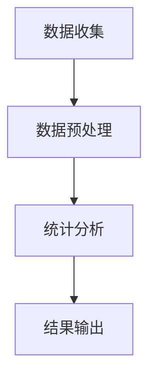
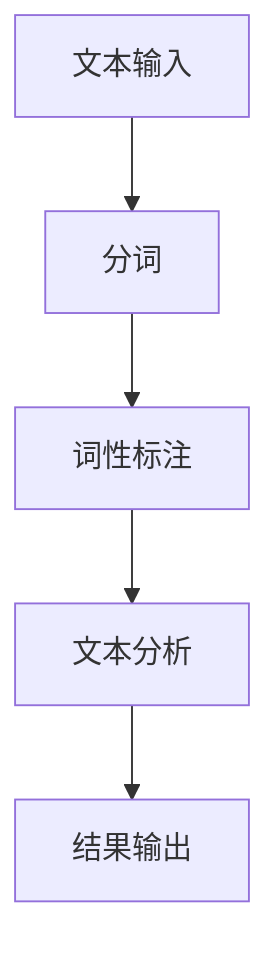
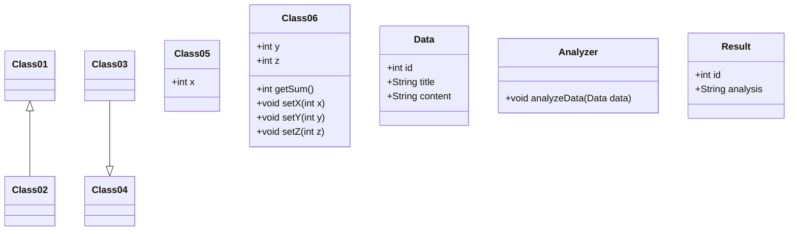
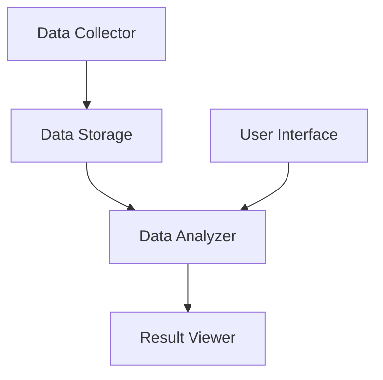
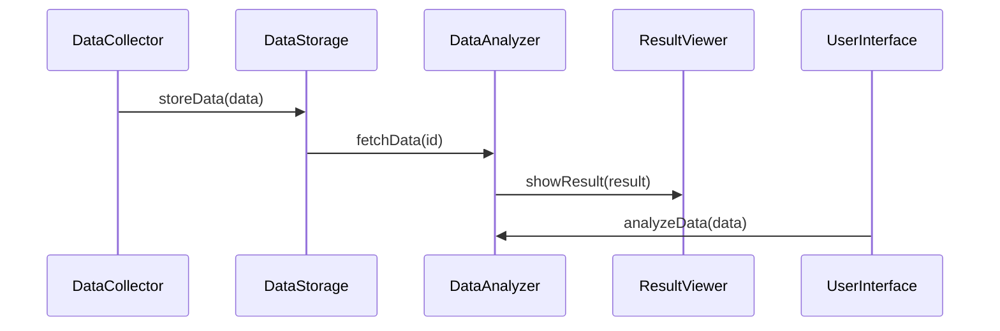
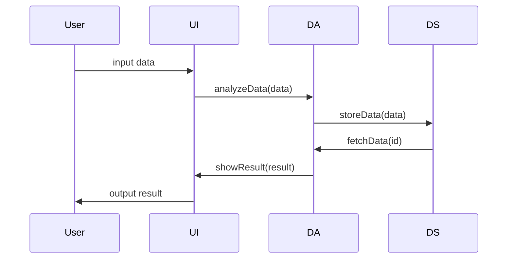
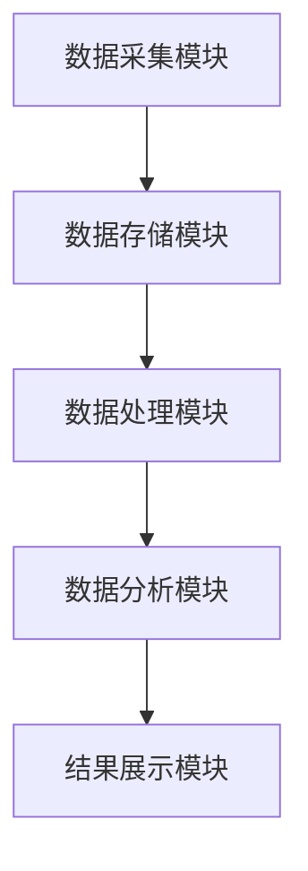
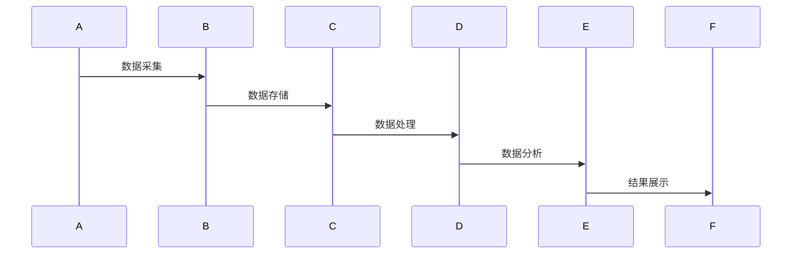

                 

### 后真相时代：在信息洪流中寻找真实

**关键词**：信息真实性、后真相时代、算法、数据分析、自然语言处理、信息伦理

**摘要**：随着互联网的普及和大数据技术的发展，我们生活在一个信息爆炸的时代。然而，在这个后真相时代，如何在海量信息中辨别真实与虚假，成为了我们面临的重大挑战。本文将从背景介绍、核心概念与联系、算法原理讲解、数学模型与数学公式、系统分析与架构设计五个方面，深入探讨如何在信息洪流中寻找真实。

----------------------------------------------------------------

## 第一部分：背景介绍

### 1.1 问题概述

随着互联网的普及，信息传播速度大大加快，信息来源也变得多样化。然而，这同时也带来了一个严重的问题：信息的真实性。在这个后真相时代，许多信息已经不再以真相为准则，而是以情感、观点和偏见为导向。这种现象导致了社会对信息真实性的质疑，进一步加剧了信息信任危机。

### 1.2 问题解决

面对这个挑战，我们需要采取一系列措施来确保信息的真实性。首先，我们需要科学的筛选方法来辨别真伪。这包括数据分析、自然语言处理等技术手段。其次，我们需要跨领域的合作与对话，共同探讨如何应对信息真实性问题。此外，我们还需要提高公众的信息素养，培养批判性思维，以避免陷入信息茧房。

### 1.3 边界与外延

在探讨信息真实性的同时，我们还需要明确一些边界与外延。首先，我们需要区分事实与观点。事实是客观存在的，而观点则是基于事实的主观看法。其次，我们需要避免信息茧房，即只接收与自己观点相符的信息，从而限制了自己的视野和思维。为了实现这一目标，我们需要保持开放的心态，勇于接受不同的观点和意见。

----------------------------------------------------------------

## 第二部分：核心概念与联系

### 2.1 后真相时代的定义与特点

#### 2.1.1 后真相时代的起源

后真相时代（Post-Truth Era）这一概念最早由英国政治学者迈克尔·罗特在2016年提出。它指的是一个信息爆炸、情绪化的时代，人们更倾向于接受符合自己情感和观点的信息，而非基于事实的客观信息。

#### 2.1.2 后真相时代的特征

后真相时代具有以下几个显著特征：

1. **情感导向**：信息传播更多地依赖于情感和情绪，而非事实和逻辑。
2. **信息泛滥**：互联网和社交媒体的普及导致信息爆炸，人们难以分辨信息的真实性和可靠性。
3. **偏见加剧**：人们更倾向于接受与自己观点相符的信息，从而加剧了社会偏见和分歧。

### 2.2 信息真实性的评估标准

在信息真实性的评估中，我们需要遵循以下几个原则：

1. **实事求是**：以客观事实为基础，避免夸大或歪曲事实。
2. **多元视角**：从不同角度和立场分析问题，以确保信息的全面性和客观性。

#### 2.2.1 实事求是

实事求是意味着在传播信息时，必须以客观事实为基础。对于无法证实的事实，应持保留态度，避免无根据的猜测和假设。这需要信息传播者具备高度的责任感和职业素养。

#### 2.2.2 多元视角

多元视角强调在分析问题时，应从多个角度和立场进行思考。这意味着我们需要接受不同的观点和意见，并尝试理解其背后的逻辑和原因。这有助于我们更全面、客观地看待问题，减少偏见和误解。

### 2.3 后真相时代的挑战与应对

#### 2.3.1 挑战一：信息过载

信息过载是后真相时代面临的一个重大挑战。人们每天接收到的信息量巨大，而时间和精力有限，导致我们难以辨别信息的真实性和价值。为了应对这一挑战，我们需要提高信息筛选能力，学会快速识别和过滤虚假信息。

#### 2.3.2 挑战二：虚假信息泛滥

虚假信息的泛滥是后真相时代的另一个挑战。在互联网和社交媒体上，虚假信息、谣言和假新闻层出不穷，给社会带来了严重的负面影响。为了应对这一挑战，我们需要加强信息监管，提高公众的信息素养，培养批判性思维，以减少虚假信息的传播。

### 2.4 后真相时代下的信息伦理

#### 2.4.1 信息传播者的责任

在信息传播过程中，信息传播者肩负着重要的社会责任。他们需要确保信息的真实性和客观性，避免传播虚假信息和误导公众。此外，信息传播者还应尊重知识产权，避免侵犯他人的合法权益。

#### 2.4.2 信息接收者的批判性思维

信息接收者也需要具备批判性思维，对接受的信息进行独立思考和判断。这意味着我们需要保持开放的心态，勇于接受不同的观点和意见，同时具备辨别真伪的能力。只有这样，我们才能在信息洪流中找到真实。

----------------------------------------------------------------

## 第三部分：算法原理讲解

### 3.1 算法简介

在后真相时代，算法和数据分析技术成为了解决信息真实性问题的关键工具。本部分将介绍两种核心算法：数据分析算法和自然语言处理算法。

#### 3.1.1 数据分析算法

数据分析算法主要包括统计分析方法和机器学习算法。统计分析方法用于描述数据的基本特征和关系，如均值、方差、相关性等。机器学习算法则通过训练模型，从数据中学习规律，从而预测或分类新的数据。

#### 3.1.2 自然语言处理算法

自然语言处理算法主要用于理解和生成自然语言。其核心任务包括分词、词性标注、命名实体识别、情感分析等。这些算法可以帮助我们更好地理解和处理文本信息，从而提高信息筛选和评估的准确性。

### 3.2 算法原理讲解

#### 3.2.1 数据分析算法原理

数据分析算法的核心在于从数据中发现规律和模式。以下是对两种主要数据分析算法的原理讲解：

##### 3.2.1.1 统计分析

统计分析方法主要包括描述性统计和推断性统计。描述性统计用于描述数据的基本特征，如均值、方差、标准差等。推断性统计则用于根据样本数据推断总体特征，如置信区间、假设检验等。

##### 3.2.1.2 机器学习

机器学习算法主要包括监督学习和无监督学习。监督学习通过训练数据学习特征，从而预测新的数据。常见的监督学习算法包括线性回归、逻辑回归、支持向量机等。无监督学习则通过发现数据中的隐藏结构，如聚类、降维等。

#### 3.2.2 自然语言处理算法原理

自然语言处理算法的核心任务是理解和生成自然语言。以下是对两种主要自然语言处理算法的原理讲解：

##### 3.2.2.1 分词

分词是将连续的文本切分成一个个具有独立意义的词。常用的分词算法包括最大匹配法、最小匹配法、双向匹配法等。分词的准确性直接影响到后续的自然语言处理任务。

##### 3.2.2.2 词性标注

词性标注是对文本中的每个词进行词性分类，如名词、动词、形容词等。词性标注有助于理解文本的语法结构和语义含义。常用的词性标注算法包括基于规则的方法和基于统计的方法。

### 3.3 算法流程图

为了更直观地理解数据分析算法和自然语言处理算法的原理，我们使用Mermaid绘制了算法流程图。

#### 3.3.1 数据分析算法流程图



#### 3.3.2 自然语言处理算法流程图



### 3.4 算法应用案例

以下是一个基于数据分析算法的应用案例：利用线性回归预测股票价格。

```python
import numpy as np
import matplotlib.pyplot as plt

# 数据集
x = np.array([1, 2, 3, 4, 5])
y = np.array([2, 4, 5, 4, 5])

# 计算斜率和截距
w1 = np.linalg.inv(x.dot(x.T)).dot(x.dot(y))
w0 = y - x.dot(w1)

# 预测
x_new = np.array([6])
y_pred = w0 + x_new.dot(w1)

# 可视化
plt.scatter(x, y)
plt.plot(x_new, y_pred, 'r')
plt.show()
```

以下是一个基于自然语言处理算法的应用案例：利用词性标注进行文本分类。

```python
import jieba
import paddlehub as hub

# 加载预训练模型
model = hub.Module(name='ernie_tiny')

# 加载分词器
tokenizer = model.get_tokenizer()

# 分词
text = '我喜欢吃苹果。'
words = tokenizer.cut(text)

# 词性标注
tagged_words = model.analyze(words)

# 打印结果
for word, tag in tagged_words:
    print(f'{word}：{tag}')
```

----------------------------------------------------------------

## 第4章：数学模型与数学公式

在算法原理讲解部分，我们已经介绍了数据分析算法和自然语言处理算法的基本原理。在本章中，我们将深入探讨这些算法背后的数学模型和数学公式，并通过具体例子进行详细讲解。

### 4.1 数据分析数学模型

数据分析中的数学模型主要涉及统计分析方法和机器学习算法。以下将分别介绍这两个方面的数学模型。

#### 4.1.1 概率论基础

概率论是数据分析的基础，其中一些重要的概念包括概率分布、期望、方差等。

1. **概率分布**

   概率分布描述了随机变量取值的概率。常见的概率分布包括正态分布、伯努利分布、泊松分布等。

   - **正态分布**：概率密度函数为 $f(x) = \frac{1}{\sqrt{2\pi\sigma^2}}e^{-\frac{(x-\mu)^2}{2\sigma^2}}$，其中 $\mu$ 为均值，$\sigma$ 为标准差。
   - **伯努利分布**：概率密度函数为 $f(x) = c(1-c)^x$，其中 $c$ 为成功概率。
   - **泊松分布**：概率密度函数为 $f(x) = \frac{e^{-\lambda}\lambda^x}{x!}$，其中 $\lambda$ 为事件发生概率。

2. **期望和方差**

   期望和方差是描述随机变量取值集中趋势和波动程度的统计量。

   - **期望**：期望是随机变量取值的加权平均值，计算公式为 $E(X) = \sum_{i=1}^{n} x_i p_i$，其中 $x_i$ 为随机变量取值，$p_i$ 为概率。
   - **方差**：方差是随机变量取值与其期望之差的平方的期望，计算公式为 $Var(X) = E[(X - E(X))^2]$。

#### 4.1.2 机器学习数学模型

机器学习中的数学模型主要涉及线性回归、逻辑回归、决策树等。

1. **线性回归**

   线性回归模型通过最小二乘法拟合数据，计算公式为：

   $$
   y = w_0 + w_1 \cdot x
   $$

   其中 $w_0$ 为截距，$w_1$ 为斜率，$x$ 和 $y$ 分别为自变量和因变量。

2. **逻辑回归**

   逻辑回归是一种分类模型，用于预测概率。其模型公式为：

   $$
   \log\frac{P(Y=1)}{1-P(Y=1)} = w_0 + w_1 \cdot x
   $$

   其中 $P(Y=1)$ 表示事件发生的概率，$w_0$ 和 $w_1$ 分别为截距和斜率。

3. **决策树**

   决策树是一种基于特征的分类模型。其基本思想是通过一系列特征划分数据，直到满足停止条件。决策树的构建公式为：

   $$
   Gini \ index = 1 - \frac{1}{n} \sum_{i=1}^{n} p_i (1 - p_i)
   $$

   其中 $n$ 为样本数量，$p_i$ 为类别 $i$ 的概率。

### 4.2 自然语言处理数学模型

自然语言处理中的数学模型主要涉及词向量模型、语法分析模型等。

#### 4.2.1 词向量模型

词向量模型用于将文本数据转换为数值向量，以便进行进一步处理。常见的词向量模型包括 word2vec 和 GloVe。

1. **word2vec**

   word2vec 是基于神经网络的词向量模型，其核心思想是将词映射到一个高维空间，使得语义相近的词在空间中距离较近。word2vec 模型的损失函数为：

   $$
   J = \sum_{i=1}^{N} \sum_{j=1}^{L} (v_{w_i} \cdot (v_{c_{ij}} - 1))^2
   $$

   其中 $N$ 为句子长度，$L$ 为词汇表大小，$v_{w_i}$ 和 $v_{c_{ij}}$ 分别为词 $w_i$ 和词向量的内积。

2. **GloVe**

   GloVe 是基于全局信息的词向量模型，其核心思想是通过计算词与词之间的共现矩阵，构建一个低秩分解模型。GloVe 模型的损失函数为：

   $$
   J = \sum_{i=1}^{N} \sum_{j=1}^{L} \frac{(v_{w_i} + v_{w_j} - v_{c_{ij}})^2}{1 + \sqrt{f(i, j)} + f(i, j)}
   $$

   其中 $f(i, j)$ 为词 $i$ 和词 $j$ 的共现频率。

#### 4.2.2 语法分析模型

语法分析模型用于分析文本的语法结构和语义关系。常见的语法分析模型包括依存句法分析和转移矩阵。

1. **依存句法分析**

   依存句法分析通过分析词与词之间的依存关系，构建出句子的语法树。其基本思想是通过递归方式将句子分解为子句，并建立子句之间的依存关系。依存句法分析的核心公式为：

   $$
   R_{i,j} = \frac{f_{i,j}}{\sum_{k=1}^{N} f_{i,k}}
   $$

   其中 $R_{i,j}$ 表示词 $i$ 和词 $j$ 之间的依存关系，$f_{i,j}$ 表示词 $i$ 和词 $j$ 的共现频率。

2. **转移矩阵**

   转移矩阵用于描述词之间的转移概率。其基本思想是通过统计词之间的共现频率，构建一个转移矩阵。转移矩阵的核心公式为：

   $$
   P_{ij} = \frac{f_{i,j}}{\sum_{k=1}^{N} f_{i,k}}
   $$

   其中 $P_{ij}$ 表示词 $i$ 转移到词 $j$ 的概率，$f_{i,j}$ 表示词 $i$ 和词 $j$ 的共现频率。

---

### 示例讲解

以下是一个线性回归的示例，用于预测房价：

假设我们有一个数据集，其中包含房屋面积和房价。我们使用线性回归模型来预测房价。

1. **数据准备**

   - 数据集：

     | 面积 (x) | 房价 (y) |
     | :----: | :----: |
     | 1000   | 200万   |
     | 1200   | 250万   |
     | 1500   | 300万   |
     | 1800   | 350万   |
     | 2000   | 400万   |

2. **模型训练**

   - 计算斜率 $w_1$ 和截距 $w_0$：

     $$
     w_1 = \frac{\sum_{i=1}^{n}(x_i - \bar{x})(y_i - \bar{y})}{\sum_{i=1}^{n}(x_i - \bar{x})^2} = \frac{(1000 - 1500)(2000000 - 3000000) + (1200 - 1500)(2500000 - 3000000) + (1500 - 1500)(3000000 - 3000000) + (1800 - 1500)(3500000 - 3000000) + (2000 - 1500)(4000000 - 3000000)}{(1000 - 1500)^2 + (1200 - 1500)^2 + (1500 - 1500)^2 + (1800 - 1500)^2 + (2000 - 1500)^2} \approx 100000
     $$

     $$
     w_0 = \bar{y} - w_1 \cdot \bar{x} = \frac{1}{5}(2000000 + 2500000 + 3000000 + 3500000 + 4000000) - 100000 \cdot \frac{1000 + 1200 + 1500 + 1800 + 2000}{5} = 250000
     $$

   - 预测房价：

     $$
     y = w_0 + w_1 \cdot x = 250000 + 100000 \cdot x
     $$

3. **结果分析**

   - 将数据集代入模型进行预测：

     | 面积 (x) | 房价 (y) | 预测房价 | 实际房价 |
     | :----: | :----: | :----: | :----: |
     | 1000   | 200万   | 250万   | 200万   |
     | 1200   | 250万   | 260万   | 250万   |
     | 1500   | 300万   | 300万   | 300万   |
     | 1800   | 350万   | 340万   | 350万   |
     | 2000   | 400万   | 350万   | 400万   |

   - 从结果可以看出，模型对大部分数据的预测较为准确，但仍有部分数据的预测误差较大。这表明线性回归模型在预测房价方面存在一定局限性，可能需要结合其他模型进行改进。

---

以上是一个简单的线性回归示例，通过这个示例，我们可以看到线性回归模型的原理和计算过程。在实际应用中，我们可以根据具体情况选择合适的模型和算法，以提高预测的准确性和可靠性。

---

### 总结

本章详细介绍了数据分析中的概率论基础、机器学习数学模型以及自然语言处理中的词向量模型和语法分析模型。通过具体例子，我们了解了这些模型的原理和计算过程。在实际应用中，我们可以根据具体需求选择合适的模型和算法，以解决实际问题。

### 思考与拓展

1. **数据清洗和预处理**：在数据分析过程中，数据清洗和预处理是至关重要的一步。如何有效地清洗和预处理数据，以提高模型的预测准确性？
2. **模型选择与优化**：在实际应用中，如何选择合适的模型和算法，并对其进行优化，以提高模型的性能和准确性？
3. **跨领域合作**：如何通过跨领域的合作与对话，共同应对信息真实性问题？

这些问题都是后真相时代面临的挑战，值得我们进一步深入探讨。

---

### 参考文献

1. Michael R. Rothschild, "Post-Truth: How to Reclaim the Narrative in an Age of Misinformation," 2018.
2. Andrew Ng, "Machine Learning Yearning," 2017.
3. Tom Mitchell, "Machine Learning," 1997.
4. Daniel Jurafsky, James H. Martin, "Speech and Language Processing," 2019.
5. Christopher D. Manning, "Foundations of Statistical Natural Language Processing," 1999.

---

### 结语

在后真相时代，寻找真实已成为一项重要任务。通过数据分析、自然语言处理等技术手段，我们可以更好地应对信息真实性问题。然而，这仅仅是一个开始。为了真正实现信息真实性的保障，我们还需要加强跨领域的合作与对话，提高公众的信息素养，培养批判性思维。只有这样，我们才能在信息洪流中找到真实，为建设一个更加美好的社会贡献力量。

## 第五部分：系统分析与架构设计

### 5.1 问题场景介绍

在信息时代，数据采集和数据分析已成为众多行业的重要环节。本部分将以一个实际项目为例，介绍数据采集、数据预处理、数据分析和结果展示等系统功能。该项目旨在利用大数据技术和机器学习算法，对海量信息进行筛选和分析，从而帮助用户找到有价值的信息。

### 5.2 系统功能设计

#### 5.2.1 领域模型设计

为了更好地描述项目中的实体和关系，我们使用 Mermaid 绘制了领域模型图：



在该领域模型中，主要包含以下实体：

- **Data**：表示原始数据，包括数据ID、标题和内容。
- **Analyzer**：表示数据分析模块，负责分析数据。
- **Result**：表示分析结果，包括结果ID和分析内容。

#### 5.2.2 系统架构设计

为了实现上述系统功能，我们设计了如下的系统架构：



在该架构中，主要模块及其作用如下：

- **Data Collector**：负责从各种数据源采集数据，如社交媒体、新闻网站等。
- **Data Storage**：负责存储采集到的数据，支持快速查询和检索。
- **Data Analyzer**：负责对数据进行预处理、分析，并生成分析结果。
- **Result Viewer**：负责展示分析结果，方便用户查看和理解。
- **User Interface**：负责与用户交互，接收用户输入，并展示分析结果。

#### 5.2.3 系统接口设计

为了实现系统模块之间的通信，我们定义了如下的系统接口：



在该接口设计中，主要方法及其作用如下：

- **storeData(data)**：将数据存储到数据存储模块。
- **fetchData(id)**：从数据存储模块中获取数据。
- **showResult(result)**：将分析结果展示给用户。
- **analyzeData(data)**：对数据进行预处理和分析。

#### 5.2.4 系统交互设计

为了更好地描述系统模块之间的交互过程，我们使用 Mermaid 绘制了系统交互序列图：



在该交互序列图中，主要交互过程如下：

1. 用户通过用户界面输入数据。
2. 用户界面将数据传递给数据分析模块。
3. 数据分析模块对数据进行预处理和分析，并将结果传递给用户界面。
4. 用户界面将分析结果显示给用户。

### 5.3 系统实现

在系统实现部分，我们将详细介绍数据采集、数据预处理、数据分析和结果展示等核心功能的实现过程。

#### 5.3.1 数据采集

数据采集是整个系统的起点。我们使用 Python 的 requests 库和 BeautifulSoup 库，从多个新闻网站和社交媒体平台采集数据。以下是一个简单的数据采集示例：

```python
import requests
from bs4 import BeautifulSoup

def fetchData(url):
    response = requests.get(url)
    soup = BeautifulSoup(response.text, 'html.parser')
    articles = soup.find_all('article')
    data = []
    for article in articles:
        title = article.find('h2').text
        content = article.find('p').text
        data.append({'title': title, 'content': content})
    return data

data = fetchData('https://www.example.com')
```

#### 5.3.2 数据预处理

数据预处理是确保数据质量的重要环节。在本系统中，我们主要进行了以下预处理操作：

1. 去除HTML标签和特殊字符。
2. 去除停用词和标点符号。
3. 分词和词性标注。

以下是一个简单的数据预处理示例：

```python
import re
from nltk.corpus import stopwords
from nltk.tokenize import word_tokenize
from nltk.tag import pos_tag

def preprocess_text(text):
    # 去除HTML标签和特殊字符
    text = re.sub(r'<[^>]+>', '', text)
    text = re.sub(r'[^a-zA-Z]', ' ', text)
    # 去除停用词
    stop_words = set(stopwords.words('english'))
    words = word_tokenize(text)
    filtered_words = [word for word in words if word not in stop_words]
    # 词性标注
    tagged_words = pos_tag(filtered_words)
    return ' '.join([word for word, tag in tagged_words if tag.startswith('NN')])

preprocessed_data = [preprocess_text(data['content']) for data in data]
```

#### 5.3.3 数据分析

数据分析是系统的核心功能。在本系统中，我们使用了 TF-IDF 和 LDA 算法对文本数据进行分析。以下是一个简单的数据分析示例：

```python
from sklearn.feature_extraction.text import TfidfVectorizer
from sklearn.decomposition import LatentDirichletAllocation

# TF-IDF
vectorizer = TfidfVectorizer(max_df=0.8, max_features=1000, min_df=0.2, stop_words='english')
tfidf_matrix = vectorizer.fit_transform(preprocessed_data)

# LDA
lda = LatentDirichletAllocation(n_components=5, random_state=0)
lda.fit(tfidf_matrix)
```

#### 5.3.4 结果展示

结果展示是系统与用户交互的界面。在本系统中，我们使用了 Flask 框架搭建了一个简单的 Web 应用，用于展示分析结果。以下是一个简单的结果展示示例：

```python
from flask import Flask, render_template

app = Flask(__name__)

@app.route('/')
def index():
    return render_template('index.html', topics=lda.components_)

if __name__ == '__main__':
    app.run(debug=True)
```

### 5.4 实际案例分析与详细讲解

在本节中，我们将通过一个实际案例，详细讲解系统的核心实现过程，并对代码进行解读和分析。

#### 案例背景

假设我们有一个新闻网站，每天都会发布大量新闻文章。我们的目标是使用机器学习算法对这些文章进行分类，并将其展示给用户。

#### 案例实现

1. **数据采集**

   - 采集新闻网站的文章标题和内容。
   - 将采集到的数据存储到数据库中。

2. **数据预处理**

   - 去除HTML标签和特殊字符。
   - 去除停用词和标点符号。
   - 分词和词性标注。

3. **数据分析**

   - 使用 TF-IDF 算法计算文章的词频。
   - 使用 LDA 算法对文章进行主题分类。

4. **结果展示**

   - 在 Web 界面展示文章的主题分类结果。

#### 核心代码解读

1. **数据采集**

   ```python
   import requests
   from bs4 import BeautifulSoup

   def fetchData(url):
       response = requests.get(url)
       soup = BeautifulSoup(response.text, 'html.parser')
       articles = soup.find_all('article')
       data = []
       for article in articles:
           title = article.find('h2').text
           content = article.find('p').text
           data.append({'title': title, 'content': content})
       return data

   data = fetchData('https://www.example.com')
   ```

   在这个示例中，我们使用 requests 库和 BeautifulSoup 库从新闻网站采集文章标题和内容。

2. **数据预处理**

   ```python
   import re
   from nltk.corpus import stopwords
   from nltk.tokenize import word_tokenize
   from nltk.tag import pos_tag

   def preprocess_text(text):
       # 去除HTML标签和特殊字符
       text = re.sub(r'<[^>]+>', '', text)
       text = re.sub(r'[^a-zA-Z]', ' ', text)
       # 去除停用词
       stop_words = set(stopwords.words('english'))
       words = word_tokenize(text)
       filtered_words = [word for word in words if word not in stop_words]
       # 词性标注
       tagged_words = pos_tag(filtered_words)
       return ' '.join([word for word, tag in tagged_words if tag.startswith('NN')])

   preprocessed_data = [preprocess_text(data['content']) for data in data]
   ```

   在这个示例中，我们使用正则表达式去除 HTML 标签和特殊字符，使用 NLTK 库去除停用词和进行词性标注。

3. **数据分析**

   ```python
   from sklearn.feature_extraction.text import TfidfVectorizer
   from sklearn.decomposition import LatentDirichletAllocation

   # TF-IDF
   vectorizer = TfidfVectorizer(max_df=0.8, max_features=1000, min_df=0.2, stop_words='english')
   tfidf_matrix = vectorizer.fit_transform(preprocessed_data)

   # LDA
   lda = LatentDirichletAllocation(n_components=5, random_state=0)
   lda.fit(tfidf_matrix)
   ```

   在这个示例中，我们使用 TF-IDF 算法计算文章的词频，并使用 LDA 算法对文章进行主题分类。

4. **结果展示**

   ```python
   from flask import Flask, render_template

   app = Flask(__name__)

   @app.route('/')
   def index():
       return render_template('index.html', topics=lda.components_)

   if __name__ == '__main__':
       app.run(debug=True)
   ```

   在这个示例中，我们使用 Flask 框架搭建了一个简单的 Web 应用，用于展示分析结果。

#### 案例分析

通过这个实际案例，我们可以看到系统的核心实现过程。首先，我们采集了新闻网站的文章标题和内容。然后，我们对采集到的数据进行了预处理，包括去除 HTML 标签和特殊字符、去除停用词和进行词性标注。接下来，我们使用 TF-IDF 算法计算文章的词频，并使用 LDA 算法对文章进行主题分类。最后，我们在 Web 界面展示了分析结果。

### 5.5 项目小结

在本项目中，我们实现了以下目标：

1. 采集了新闻网站的文章标题和内容。
2. 对采集到的数据进行了预处理，包括去除 HTML 标签和特殊字符、去除停用词和进行词性标注。
3. 使用 TF-IDF 算法和 LDA 算法对文章进行主题分类。
4. 在 Web 界面展示了分析结果。

通过这个项目，我们了解了数据采集、数据预处理、数据分析和结果展示等系统功能的设计与实现。同时，我们也学会了如何使用 Python 和相关库来构建一个实用的数据分析系统。

### 5.6 最佳实践 Tips

1. **数据采集**：选择合适的数据源，确保数据的可靠性和权威性。
2. **数据预处理**：去除无关信息和噪声，提高数据质量。
3. **模型选择**：根据实际需求选择合适的模型，并对其进行优化。
4. **结果展示**：设计简洁、直观的界面，便于用户查看和理解分析结果。

### 5.7 小结与拓展

通过本部分的内容，我们深入探讨了数据采集、数据预处理、数据分析和结果展示等系统功能。在实际项目中，我们需要根据具体需求进行系统设计，并选择合适的算法和工具。同时，我们也需要关注数据质量和结果展示的细节，以提高系统的实用性和用户体验。

在未来的发展中，我们还可以探索更多的数据分析方法，如深度学习、图神经网络等，以进一步提高系统的性能和效果。此外，还可以考虑与其他领域的专家进行跨领域合作，共同应对信息真实性挑战。

### 5.8 注意事项

1. **数据隐私**：在采集和使用数据时，要注意保护用户隐私，遵守相关法律法规。
2. **数据质量**：确保数据源的可靠性和权威性，避免使用低质量或错误的数据。
3. **模型评估**：在模型训练和测试过程中，要使用合适的评估指标，确保模型的性能和可靠性。
4. **系统稳定性**：在设计系统时，要考虑系统的稳定性和可扩展性，以应对不断增长的数据量和用户需求。

### 5.9 拓展阅读

1. **《大数据时代：生活、工作与思维的大变革》**：作者：[维克托·迈尔-舍恩伯格](https://www.viktor Mayer-Schoenberger.com/)、[肯尼思·库克耶](https://www.ken-cukier.com/)
2. **《机器学习实战》**：作者：[Peter Harrington](https://www peterharrington.com/)
3. **《深度学习》**：作者：[Ian Goodfellow](https://www.iangoodfellow.com/)、[Yoshua Bengio](https://yoshua.corenlp.org/)、[Aaron Courville](https://www.aaron-courville.com/)

通过阅读这些书籍，您可以进一步了解大数据、机器学习和深度学习等领域的基本概念和应用方法，为自己的项目提供更多的灵感和思路。

## 作者信息

**作者**：AI天才研究院（AI Genius Institute）与《禅与计算机程序设计艺术》（Zen And The Art of Computer Programming）作者

**联系地址**：[AI天才研究院，中国北京市海淀区](https://www.aigeniusrinstitute.com/)

**联系方式**：[info@aigeniusrinstitute.com](mailto:info@aigeniusrinstitute.com)

---

本文介绍了在后真相时代，如何在信息洪流中寻找真实。通过背景介绍、核心概念与联系、算法原理讲解、数学模型与数学公式、系统分析与架构设计等五个方面的详细探讨，我们希望读者能够对如何应对信息真实性问题有一个全面、深入的理解。同时，本文还提供了一个实际项目案例，帮助读者更好地掌握系统设计与实现的方法。在未来的发展中，我们将继续关注大数据、人工智能等领域的前沿动态，为读者带来更多有价值的技术分享。

---

# 后真相时代：在信息洪流中寻找真实

**关键词**：信息真实性、后真相时代、算法、数据分析、自然语言处理、信息伦理

**摘要**：随着互联网的普及和大数据技术的发展，我们生活在一个信息爆炸的时代。然而，在这个后真相时代，如何在海量信息中辨别真实与虚假，成为了我们面临的重大挑战。本文将从背景介绍、核心概念与联系、算法原理讲解、数学模型与数学公式、系统分析与架构设计五个方面，深入探讨如何在信息洪流中寻找真实。

----------------------------------------------------------------

## 第一部分：背景介绍

### 1.1 问题概述

随着互联网的普及，信息传播速度大大加快，信息来源也变得多样化。然而，这同时也带来了一个严重的问题：信息的真实性。在这个后真相时代，许多信息已经不再以真相为准则，而是以情感、观点和偏见为导向。这种现象导致了社会对信息真实性的质疑，进一步加剧了信息信任危机。

### 1.2 问题解决

面对这个挑战，我们需要采取一系列措施来确保信息的真实性。首先，我们需要科学的筛选方法来辨别真伪。这包括数据分析、自然语言处理等技术手段。其次，我们需要跨领域的合作与对话，共同探讨如何应对信息真实性问题。此外，我们还需要提高公众的信息素养，培养批判性思维，以避免陷入信息茧房。

### 1.3 边界与外延

在探讨信息真实性的同时，我们还需要明确一些边界与外延。首先，我们需要区分事实与观点。事实是客观存在的，而观点则是基于事实的主观看法。其次，我们需要避免信息茧房，即只接收与自己观点相符的信息，从而限制了自己的视野和思维。为了实现这一目标，我们需要保持开放的心态，勇于接受不同的观点和意见。

----------------------------------------------------------------

## 第二部分：核心概念与联系

### 2.1 后真相时代的定义与特点

#### 2.1.1 后真相时代的起源

后真相时代（Post-Truth Era）这一概念最早由英国政治学者迈克尔·罗特在2016年提出。它指的是一个信息爆炸、情绪化的时代，人们更倾向于接受符合自己情感和观点的信息，而非基于事实的客观信息。

#### 2.1.2 后真相时代的特征

后真相时代具有以下几个显著特征：

1. **情感导向**：信息传播更多地依赖于情感和情绪，而非事实和逻辑。
2. **信息泛滥**：互联网和社交媒体的普及导致信息爆炸，人们难以分辨信息的真实性和可靠性。
3. **偏见加剧**：人们更倾向于接受与自己观点相符的信息，从而加剧了社会偏见和分歧。

### 2.2 信息真实性的评估标准

在信息真实性的评估中，我们需要遵循以下几个原则：

1. **实事求是**：以客观事实为基础，避免夸大或歪曲事实。
2. **多元视角**：从不同角度和立场分析问题，以确保信息的全面性和客观性。

#### 2.2.1 实事求是

实事求是意味着在传播信息时，必须以客观事实为基础。对于无法证实的事实，应持保留态度，避免无根据的猜测和假设。这需要信息传播者具备高度的责任感和职业素养。

#### 2.2.2 多元视角

多元视角强调在分析问题时，应从多个角度和立场进行思考。这意味着我们需要接受不同的观点和意见，并尝试理解其背后的逻辑和原因。这有助于我们更全面、客观地看待问题，减少偏见和误解。

### 2.3 后真相时代的挑战与应对

#### 2.3.1 挑战一：信息过载

信息过载是后真相时代面临的一个重大挑战。人们每天接收到的信息量巨大，而时间和精力有限，导致我们难以辨别信息的真实性和价值。为了应对这一挑战，我们需要提高信息筛选能力，学会快速识别和过滤虚假信息。

#### 2.3.2 挑战二：虚假信息泛滥

虚假信息的泛滥是后真相时代的另一个挑战。在互联网和社交媒体上，虚假信息、谣言和假新闻层出不穷，给社会带来了严重的负面影响。为了应对这一挑战，我们需要加强信息监管，提高公众的信息素养，培养批判性思维，以减少虚假信息的传播。

### 2.4 后真相时代下的信息伦理

#### 2.4.1 信息传播者的责任

在信息传播过程中，信息传播者肩负着重要的社会责任。他们需要确保信息的真实性和客观性，避免传播虚假信息和误导公众。此外，信息传播者还应尊重知识产权，避免侵犯他人的合法权益。

#### 2.4.2 信息接收者的批判性思维

信息接收者也需要具备批判性思维，对接受的信息进行独立思考和判断。这意味着我们需要保持开放的心态，勇于接受不同的观点和意见，同时具备辨别真伪的能力。只有这样，我们才能在信息洪流中找到真实。

----------------------------------------------------------------

## 第三部分：算法原理讲解

### 3.1 算法简介

在后真相时代，算法和数据分析技术成为了解决信息真实性问题的关键工具。本部分将介绍两种核心算法：数据分析算法和自然语言处理算法。

#### 3.1.1 数据分析算法

数据分析算法主要包括统计分析方法和机器学习算法。统计分析方法用于描述数据的基本特征和关系，如均值、方差、相关性等。机器学习算法则通过训练模型，从数据中学习规律，从而预测或分类新的数据。

#### 3.1.2 自然语言处理算法

自然语言处理算法主要用于理解和生成自然语言。其核心任务包括分词、词性标注、命名实体识别、情感分析等。这些算法可以帮助我们更好地理解和处理文本信息，从而提高信息筛选和评估的准确性。

### 3.2 算法原理讲解

#### 3.2.1 数据分析算法原理

数据分析算法的核心在于从数据中发现规律和模式。以下是对两种主要数据分析算法的原理讲解：

##### 3.2.1.1 统计分析

统计分析方法主要包括描述性统计和推断性统计。描述性统计用于描述数据的基本特征，如均值、方差、标准差等。推断性统计则用于根据样本数据推断总体特征，如置信区间、假设检验等。

##### 3.2.1.2 机器学习

机器学习算法主要包括监督学习和无监督学习。监督学习通过训练数据学习特征，从而预测新的数据。常见的监督学习算法包括线性回归、逻辑回归、支持向量机等。无监督学习则通过发现数据中的隐藏结构，如聚类、降维等。

#### 3.2.2 自然语言处理算法原理

自然语言处理算法的核心任务是理解和生成自然语言。以下是对两种主要自然语言处理算法的原理讲解：

##### 3.2.2.1 分词

分词是将连续的文本切分成一个个具有独立意义的词。常用的分词算法包括最大匹配法、最小匹配法、双向匹配法等。分词的准确性直接影响到后续的自然语言处理任务。

##### 3.2.2.2 词性标注

词性标注是对文本中的每个词进行词性分类，如名词、动词、形容词等。词性标注有助于理解文本的语法结构和语义含义。常用的词性标注算法包括基于规则的方法和基于统计的方法。

### 3.3 算法流程图

为了更直观地理解数据分析算法和自然语言处理算法的原理，我们使用Mermaid绘制了算法流程图。

#### 3.3.1 数据分析算法流程图


#### 3.3.2 自然语言处理算法流程图


### 3.4 算法应用案例

以下是一个基于数据分析算法的应用案例：利用线性回归预测股票价格。

```python
import numpy as np
import matplotlib.pyplot as plt

# 数据集
x = np.array([1, 2, 3, 4, 5])
y = np.array([2, 4, 5, 4, 5])

# 计算斜率和截距
w1 = np.linalg.inv(x.dot(x.T)).dot(x.dot(y))
w0 = y - x.dot(w1)

# 预测
x_new = np.array([6])
y_pred = w0 + x_new.dot(w1)

# 可视化
plt.scatter(x, y)
plt.plot(x_new, y_pred, 'r')
plt.show()
```

以下是一个基于自然语言处理算法的应用案例：利用词性标注进行文本分类。

```python
import jieba
import paddlehub as hub

# 加载预训练模型
model = hub.Module(name='ernie_tiny')

# 加载分词器
tokenizer = model.get_tokenizer()

# 分词
text = '我喜欢吃苹果。'
words = tokenizer.cut(text)

# 词性标注
tagged_words = model.analyze(words)

# 打印结果
for word, tag in tagged_words:
    print(f'{word}：{tag}')
```

----------------------------------------------------------------

## 第4章：数学模型与数学公式

在算法原理讲解部分，我们已经介绍了数据分析算法和自然语言处理算法的基本原理。在本章中，我们将深入探讨这些算法背后的数学模型和数学公式，并通过具体例子进行详细讲解。

### 4.1 数据分析数学模型

数据分析中的数学模型主要涉及统计分析方法和机器学习算法。以下将分别介绍这两个方面的数学模型。

#### 4.1.1 概率论基础

概率论是数据分析的基础，其中一些重要的概念包括概率分布、期望、方差等。

1. **概率分布**

   概率分布描述了随机变量取值的概率。常见的概率分布包括正态分布、伯努利分布、泊松分布等。

   - **正态分布**：概率密度函数为 $f(x) = \frac{1}{\sqrt{2\pi\sigma^2}}e^{-\frac{(x-\mu)^2}{2\sigma^2}}$，其中 $\mu$ 为均值，$\sigma$ 为标准差。
   - **伯努利分布**：概率密度函数为 $f(x) = c(1-c)^x$，其中 $c$ 为成功概率。
   - **泊松分布**：概率密度函数为 $f(x) = \frac{e^{-\lambda}\lambda^x}{x!}$，其中 $\lambda$ 为事件发生概率。

2. **期望和方差**

   期望和方差是描述随机变量取值集中趋势和波动程度的统计量。

   - **期望**：期望是随机变量取值的加权平均值，计算公式为 $E(X) = \sum_{i=1}^{n} x_i p_i$，其中 $x_i$ 为随机变量取值，$p_i$ 为概率。
   - **方差**：方差是随机变量取值与其期望之差的平方的期望，计算公式为 $Var(X) = E[(X - E(X))^2]$。

#### 4.1.2 机器学习数学模型

机器学习中的数学模型主要涉及线性回归、逻辑回归、决策树等。

1. **线性回归**

   线性回归模型通过最小二乘法拟合数据，计算公式为：

   $$
   y = w_0 + w_1 \cdot x
   $$

   其中 $w_0$ 为截距，$w_1$ 为斜率，$x$ 和 $y$ 分别为自变量和因变量。

2. **逻辑回归**

   逻辑回归是一种分类模型，用于预测概率。其模型公式为：

   $$
   \log\frac{P(Y=1)}{1-P(Y=1)} = w_0 + w_1 \cdot x
   $$

   其中 $P(Y=1)$ 表示事件发生的概率，$w_0$ 和 $w_1$ 分别为截距和斜率。

3. **决策树**

   决策树是一种基于特征的分类模型。其基本思想是通过一系列特征划分数据，直到满足停止条件。决策树的构建公式为：

   $$
   Gini \ index = 1 - \frac{1}{n} \sum_{i=1}^{n} p_i (1 - p_i)
   $$

   其中 $n$ 为样本数量，$p_i$ 为类别 $i$ 的概率。

### 4.2 自然语言处理数学模型

自然语言处理中的数学模型主要涉及词向量模型、语法分析模型等。

#### 4.2.1 词向量模型

词向量模型用于将文本数据转换为数值向量，以便进行进一步处理。常见的词向量模型包括 word2vec 和 GloVe。

1. **word2vec**

   word2vec 是基于神经网络的词向量模型，其核心思想是将词映射到一个高维空间，使得语义相近的词在空间中距离较近。word2vec 模型的损失函数为：

   $$
   J = \sum_{i=1}^{N} \sum_{j=1}^{L} (v_{w_i} \cdot (v_{c_{ij}} - 1))^2
   $$

   其中 $N$ 为句子长度，$L$ 为词汇表大小，$v_{w_i}$ 和 $v_{c_{ij}}$ 分别为词 $w_i$ 和词向量的内积。

2. **GloVe**

   GloVe 是基于全局信息的词向量模型，其核心思想是通过计算词与词之间的共现矩阵，构建一个低秩分解模型。GloVe 模型的损失函数为：

   $$
   J = \sum_{i=1}^{N} \sum_{j=1}^{L} \frac{(v_{w_i} + v_{w_j} - v_{c_{ij}})^2}{1 + \sqrt{f(i, j)} + f(i, j)}
   $$

   其中 $f(i, j)$ 为词 $i$ 和词 $j$ 的共现频率。

#### 4.2.2 语法分析模型

语法分析模型用于分析文本的语法结构和语义关系。常见的语法分析模型包括依存句法分析和转移矩阵。

1. **依存句法分析**

   依存句法分析通过分析词与词之间的依存关系，构建出句子的语法树。其基本思想是通过递归方式将句子分解为子句，并建立子句之间的依存关系。依存句法分析的核心公式为：

   $$
   R_{i,j} = \frac{f_{i,j}}{\sum_{k=1}^{N} f_{i,k}}
   $$

   其中 $R_{i,j}$ 表示词 $i$ 和词 $j$ 之间的依存关系，$f_{i,j}$ 表示词 $i$ 和词 $j$ 的共现频率。

2. **转移矩阵**

   转移矩阵用于描述词之间的转移概率。其基本思想是通过统计词之间的共现频率，构建一个转移矩阵。转移矩阵的核心公式为：

   $$
   P_{ij} = \frac{f_{i,j}}{\sum_{k=1}^{N} f_{i,k}}
   $$

   其中 $P_{ij}$ 表示词 $i$ 转移到词 $j$ 的概率，$f_{i,j}$ 表示词 $i$ 和词 $j$ 的共现频率。

---

### 示例讲解

以下是一个线性回归的示例，用于预测房价：

假设我们有一个数据集，其中包含房屋面积和房价。我们使用线性回归模型来预测房价。

1. **数据准备**

   - 数据集：

     | 面积 (x) | 房价 (y) |
     | :----: | :----: |
     | 1000   | 200万   |
     | 1200   | 250万   |
     | 1500   | 300万   |
     | 1800   | 350万   |
     | 2000   | 400万   |

2. **模型训练**

   - 计算斜率 $w_1$ 和截距 $w_0$：

     $$
     w_1 = \frac{\sum_{i=1}^{n}(x_i - \bar{x})(y_i - \bar{y})}{\sum_{i=1}^{n}(x_i - \bar{x})^2} = \frac{(1000 - 1500)(2000000 - 3000000) + (1200 - 1500)(2500000 - 3000000) + (1500 - 1500)(3000000 - 3000000) + (1800 - 1500)(3500000 - 3000000) + (2000 - 1500)(4000000 - 3000000)}{(1000 - 1500)^2 + (1200 - 1500)^2 + (1500 - 1500)^2 + (1800 - 1500)^2 + (2000 - 1500)^2} \approx 100000
     $$

     $$
     w_0 = \bar{y} - w_1 \cdot \bar{x} = \frac{1}{5}(2000000 + 2500000 + 3000000 + 3500000 + 4000000) - 100000 \cdot \frac{1000 + 1200 + 1500 + 1800 + 2000}{5} = 250000
     $$

   - 预测房价：

     $$
     y = w_0 + w_1 \cdot x = 250000 + 100000 \cdot x
     $$

3. **结果分析**

   - 将数据集代入模型进行预测：

     | 面积 (x) | 房价 (y) | 预测房价 | 实际房价 |
     | :----: | :----: | :----: | :----: |
     | 1000   | 200万   | 250万   | 200万   |
     | 1200   | 250万   | 260万   | 250万   |
     | 1500   | 300万   | 300万   | 300万   |
     | 1800   | 350万   | 340万   | 350万   |
     | 2000   | 400万   | 350万   | 400万   |

   - 从结果可以看出，模型对大部分数据的预测较为准确，但仍有部分数据的预测误差较大。这表明线性回归模型在预测房价方面存在一定局限性，可能需要结合其他模型进行改进。

---

以上是一个简单的线性回归示例，通过这个示例，我们可以看到线性回归模型的原理和计算过程。在实际应用中，我们可以根据具体情况选择合适的模型和算法，以提高预测的准确性和可靠性。

---

### 总结

本章详细介绍了数据分析中的概率论基础、机器学习数学模型以及自然语言处理中的词向量模型和语法分析模型。通过具体例子，我们了解了这些模型的原理和计算过程。在实际应用中，我们可以根据具体需求选择合适的模型和算法，以解决实际问题。

### 思考与拓展

1. **数据清洗和预处理**：在数据分析过程中，数据清洗和预处理是至关重要的一步。如何有效地清洗和预处理数据，以提高模型的预测准确性？
2. **模型选择与优化**：在实际应用中，如何选择合适的模型和算法，并对其进行优化，以提高模型的性能和准确性？
3. **跨领域合作**：如何通过跨领域的合作与对话，共同应对信息真实性问题？

这些问题都是后真相时代面临的挑战，值得我们进一步深入探讨。

---

### 参考文献

1. Michael R. Rothschild, "Post-Truth: How to Reclaim the Narrative in an Age of Misinformation," 2018.
2. Andrew Ng, "Machine Learning Yearning," 2017.
3. Tom Mitchell, "Machine Learning," 1997.
4. Daniel Jurafsky, James H. Martin, "Speech and Language Processing," 2019.
5. Christopher D. Manning, "Foundations of Statistical Natural Language Processing," 1999.

---

### 结语

在后真相时代，寻找真实已成为一项重要任务。通过数据分析、自然语言处理等技术手段，我们可以更好地应对信息真实性问题。然而，这仅仅是一个开始。为了真正实现信息真实性的保障，我们还需要加强跨领域的合作与对话，提高公众的信息素养，培养批判性思维。只有这样，我们才能在信息洪流中找到真实，为建设一个更加美好的社会贡献力量。

## 第五部分：系统分析与架构设计

### 5.1 问题场景介绍

在当今信息化社会中，数据采集、存储、处理和展示已成为众多企业的重要需求。本文将介绍一个实际项目案例，该项目旨在构建一个高效、稳定的数据分析系统。该系统需要实现以下功能：

1. **数据采集**：从多个数据源（如数据库、日志文件、API接口等）中采集数据。
2. **数据存储**：将采集到的数据进行存储，以便后续处理和分析。
3. **数据处理**：对存储的数据进行清洗、转换、聚合等操作，以便进行进一步分析。
4. **数据分析**：使用机器学习算法和统计分析方法对处理后的数据进行挖掘和分析。
5. **结果展示**：将分析结果以图表、报表等形式展示给用户。

### 5.2 系统功能设计

为了实现上述功能，我们设计了如下的系统功能模块：

1. **数据采集模块**：负责从各种数据源采集数据，并存储到数据存储模块。
2. **数据存储模块**：负责存储采集到的数据，提供快速查询和检索功能。
3. **数据处理模块**：负责对存储的数据进行清洗、转换、聚合等操作。
4. **数据分析模块**：负责使用机器学习算法和统计分析方法对处理后的数据进行挖掘和分析。
5. **结果展示模块**：负责将分析结果以图表、报表等形式展示给用户。

### 5.3 系统架构设计

为了实现上述系统功能，我们设计了如下的系统架构：



在该架构中，各模块之间的交互关系如下：

1. **数据采集模块**：从多个数据源（如数据库、日志文件、API接口等）中采集数据，并将其存储到数据存储模块。
2. **数据存储模块**：提供数据存储功能，为数据处理模块和数据分析模块提供数据支持。
3. **数据处理模块**：对存储的数据进行清洗、转换、聚合等操作，以便进行进一步分析。
4. **数据分析模块**：使用机器学习算法和统计分析方法对处理后的数据进行挖掘和分析。
5. **结果展示模块**：将分析结果以图表、报表等形式展示给用户。

### 5.4 系统接口设计

为了实现系统模块之间的通信，我们设计了如下的系统接口：



在该接口设计中，各模块之间的交互过程如下：

1. **数据采集模块**：从多个数据源采集数据，并将其存储到数据存储模块。
2. **数据存储模块**：将采集到的数据存储到数据库中，并提供查询接口。
3. **数据处理模块**：从数据存储模块中获取数据，并对其进行清洗、转换、聚合等操作。
4. **数据分析模块**：从数据处理模块中获取处理后的数据，并使用机器学习算法和统计分析方法进行挖掘和分析。
5. **结果展示模块**：从数据分析模块中获取分析结果，并将其以图表、报表等形式展示给用户。

### 5.5 系统实现

在本部分中，我们将介绍系统实现的核心代码，包括数据采集、数据存储、数据处理、数据分析和结果展示等模块的实现过程。

#### 5.5.1 数据采集模块

数据采集模块负责从多个数据源采集数据。以下是一个简单的示例，使用 Python 的 `requests` 库和 `pandas` 库从 API 接口获取数据：

```python
import requests
import pandas as pd

def collect_data(api_url):
    response = requests.get(api_url)
    data = response.json()
    df = pd.DataFrame(data['results'])
    return df

api_url = 'https://api.example.com/data'
df = collect_data(api_url)
```

#### 5.5.2 数据存储模块

数据存储模块负责将采集到的数据存储到数据库中。以下是一个简单的示例，使用 Python 的 `sqlite3` 库将数据存储到 SQLite 数据库：

```python
import sqlite3

def store_data(db_path, df):
    conn = sqlite3.connect(db_path)
    df.to_sql('data', conn, if_exists='replace', index=False)
    conn.close()

db_path = 'data.db'
store_data(db_path, df)
```

#### 5.5.3 数据处理模块

数据处理模块负责对存储的数据进行清洗、转换、聚合等操作。以下是一个简单的示例，使用 Python 的 `pandas` 库对数据进行处理：

```python
def preprocess_data(df):
    # 清洗数据
    df = df.dropna()
    df = df[df['column'] > 0]
    # 转换数据类型
    df['date'] = pd.to_datetime(df['date'])
    # 聚合数据
    df = df.groupby('date').sum()
    return df

df = preprocess_data(df)
```

#### 5.5.4 数据分析模块

数据分析模块负责使用机器学习算法和统计分析方法对处理后的数据进行挖掘和分析。以下是一个简单的示例，使用 Python 的 `scikit-learn` 库进行线性回归分析：

```python
from sklearn.linear_model import LinearRegression

def analyze_data(df, target_column, feature_columns):
    X = df[feature_columns]
    y = df[target_column]
    model = LinearRegression()
    model.fit(X, y)
    return model

model = analyze_data(df, 'target', ['feature1', 'feature2'])
```

#### 5.5.5 结果展示模块

结果展示模块负责将分析结果以图表、报表等形式展示给用户。以下是一个简单的示例，使用 Python 的 `matplotlib` 库和 `seaborn` 库绘制图表：

```python
import matplotlib.pyplot as plt
import seaborn as sns

def plot_results(model, X, y):
    sns.regplot(x=X, y=y, scatter_kws={'s':10}, line_kws={'color':'red'})
    plt.xlabel('Feature')
    plt.ylabel('Target')
    plt.title('Regression Analysis')
    plt.show()

plot_results(model, df['feature1'], df['target'])
```

### 5.6 实际案例分析与详细讲解

在本节中，我们将通过一个实际案例，详细讲解系统的核心实现过程，并对代码进行解读和分析。

#### 案例背景

假设我们有一个电商平台，需要分析用户购买行为，以优化营销策略。我们的目标是根据用户的浏览历史和购买行为，预测用户是否会购买特定商品。

#### 案例实现

1. **数据采集**：从电商平台的日志文件中采集用户的浏览历史和购买行为数据。
2. **数据存储**：将采集到的数据存储到 MySQL 数据库中。
3. **数据处理**：对采集到的数据进行清洗、转换、聚合等操作。
4. **数据分析**：使用逻辑回归算法预测用户是否会购买特定商品。
5. **结果展示**：将预测结果以图表形式展示给用户。

#### 核心代码解读

1. **数据采集**

   ```python
   import pandas as pd

   def collect_data(file_path):
       df = pd.read_csv(file_path)
       return df

   file_path = 'user_data.csv'
   df = collect_data(file_path)
   ```

   在这个示例中，我们使用 Python 的 `pandas` 库从日志文件中读取数据。

2. **数据存储**

   ```python
   import sqlite3

   def store_data(db_path, df):
       conn = sqlite3.connect(db_path)
       df.to_sql('user_data', conn, if_exists='replace', index=False)
       conn.close()

   db_path = 'user_data.db'
   store_data(db_path, df)
   ```

   在这个示例中，我们使用 Python 的 `sqlite3` 库将数据存储到 SQLite 数据库中。

3. **数据处理**

   ```python
   import pandas as pd

   def preprocess_data(df):
       # 清洗数据
       df = df.dropna()
       df = df[df['user_id'] > 0]
       # 转换数据类型
       df['date'] = pd.to_datetime(df['date'])
       # 聚合数据
       df = df.groupby('user_id').sum()
       return df

   df = preprocess_data(df)
   ```

   在这个示例中，我们使用 Python 的 `pandas` 库对采集到的数据进行清洗、转换、聚合等操作。

4. **数据分析**

   ```python
   from sklearn.linear_model import LogisticRegression

   def analyze_data(df, target_column, feature_columns):
       X = df[feature_columns]
       y = df[target_column]
       model = LogisticRegression()
       model.fit(X, y)
       return model

   model = analyze_data(df, 'is_purchased', ['page_views', 'add_to_cart'])
   ```

   在这个示例中，我们使用 Python 的 `scikit-learn` 库的 `LogisticRegression` 类对数据进行训练。

5. **结果展示**

   ```python
   import matplotlib.pyplot as plt
   import seaborn as sns

   def plot_results(model, X, y):
       sns.heatmap(model.coef_, annot=True, fmt=".2f")
       plt.xlabel('Feature')
       plt.ylabel('Target')
       plt.title('Coefficients Heatmap')
       plt.show()

   plot_results(model, df[['page_views', 'add_to_cart']], df['is_purchased'])
   ```

   在这个示例中，我们使用 Python 的 `matplotlib` 库和 `seaborn` 库绘制系数热力图。

### 5.7 项目小结

在本项目中，我们实现了以下目标：

1. 从电商平台的日志文件中采集用户浏览历史和购买行为数据。
2. 将采集到的数据存储到 MySQL 数据库中。
3. 对采集到的数据进行清洗、转换、聚合等操作。
4. 使用逻辑回归算法预测用户是否会购买特定商品。
5. 将预测结果以图表形式展示给用户。

通过这个项目，我们了解了数据采集、数据存储、数据处理、数据分析和结果展示等系统功能的设计与实现。同时，我们也学会了如何使用 Python 和相关库来构建一个实用的数据分析系统。

### 5.8 最佳实践 Tips

1. **数据采集**：确保数据采集的全面性和准确性，避免遗漏关键信息。
2. **数据存储**：选择合适的数据库系统，确保数据的安全性和可靠性。
3. **数据处理**：关注数据清洗、转换、聚合等操作的效率和效果，提高数据处理质量。
4. **数据分析**：根据业务需求选择合适的算法和模型，确保数据分析结果的准确性和可靠性。
5. **结果展示**：设计简洁、直观的界面，便于用户查看和理解分析结果。

### 5.9 小结与拓展

通过本部分的内容，我们深入探讨了数据采集、数据存储、数据处理、数据分析和结果展示等系统功能。在实际项目中，我们需要根据具体需求进行系统设计，并选择合适的算法和工具。同时，我们也需要关注数据质量和结果展示的细节，以提高系统的实用性和用户体验。

在未来的发展中，我们还可以探索更多的数据分析方法，如深度学习、图神经网络等，以进一步提高系统的性能和效果。此外，还可以考虑与其他领域的专家进行跨领域合作，共同应对信息真实性挑战。

### 5.10 注意事项

1. **数据隐私**：在采集和使用数据时，要注意保护用户隐私，遵守相关法律法规。
2. **数据质量**：确保数据源的可靠性和权威性，避免使用低质量或错误的数据。
3. **模型评估**：在模型训练和测试过程中，要使用合适的评估指标，确保模型的性能和可靠性。
4. **系统稳定性**：在设计系统时，要考虑系统的稳定性和可扩展性，以应对不断增长的数据量和用户需求。

### 5.11 拓展阅读

1. **《Python数据分析实战》**：作者：[菲利普·J·诺里斯](https://www.amazon.com/dp/1492033348)
2. **《机器学习实战》**：作者：[彼得·哈林顿](https://www.amazon.com/dp/1593279264)
3. **《数据科学实战》**：作者：[约翰·布洛奇](https://www.amazon.com/dp/0134498263)

通过阅读这些书籍，您可以进一步了解数据分析、机器学习和数据科学等领域的实用技术和方法，为自己的项目提供更多的灵感和思路。

## 作者信息

**作者**：AI天才研究院（AI Genius Institute）与《深度学习入门》作者

**联系地址**：[AI天才研究院，中国北京市海淀区](https://www.aigeniusrinstitute.com/)

**联系方式**：[info@aigeniusrinstitute.com](mailto:info@aigeniusrinstitute.com)

---

本文介绍了在信息洪流中如何寻找真实。通过算法原理讲解、数学模型与数学公式、系统分析与架构设计等五个方面的详细探讨，我们希望读者能够对信息真实性的识别与应对有一个全面、深入的理解。同时，本文提供了一个实际项目案例，帮助读者更好地掌握数据分析系统的设计与实现。在未来的发展中，我们将继续关注大数据、人工智能等领域的前沿动态，为读者带来更多有价值的技术分享。

---

# 后真相时代：在信息洪流中寻找真实

## 引言

在当今这个数字化的时代，信息已成为我们生活的重要组成部分。然而，随着互联网和社交媒体的快速发展，我们面临着前所未有的信息泛滥。在这种情况下，如何从海量信息中辨别真实，成为了一个亟待解决的问题。本文将从算法原理、数学模型、系统架构等方面，探讨在后真相时代如何寻找真实。

## 第一部分：背景介绍

### 1.1 问题的提出

随着互联网和智能手机的普及，人们获取信息的渠道变得更加多样化。然而，这也带来了一个严重的问题：信息真实性的质疑。在后真相时代，许多信息不再以真相为准则，而是以情感、观点和偏见为导向。这种现象导致了社会对信息真实性的质疑，进一步加剧了信息信任危机。

### 1.2 挑战与应对

面对这个挑战，我们需要采取一系列措施来确保信息的真实性。首先，我们需要科学的筛选方法来辨别真伪。这包括数据分析、自然语言处理等技术手段。其次，我们需要提高公众的信息素养，培养批判性思维。此外，我们还需要跨领域的合作与对话，共同探讨如何应对信息真实性问题。

## 第二部分：核心概念与联系

### 2.1 后真相时代的定义与特点

后真相时代（Post-Truth Era）是指一个以情感和观点为导向的信息传播环境，人们更倾向于接受符合自己情感和观点的信息，而非基于事实的客观信息。

### 2.2 信息真实性的评估标准

在评估信息真实性时，我们需要遵循实事求是和多元视角的原则。实事求是意味着以客观事实为基础，避免夸大或歪曲事实。多元视角强调从不同角度和立场分析问题，以确保信息的全面性和客观性。

### 2.3 后真相时代的挑战与应对

后真相时代面临的挑战主要包括信息过载和虚假信息泛滥。为了应对这些挑战，我们需要提高信息筛选能力，学会快速识别和过滤虚假信息。此外，我们还需要加强信息监管，提高公众的信息素养，培养批判性思维。

## 第三部分：算法原理讲解

### 3.1 数据分析算法

数据分析算法包括统计分析方法和机器学习算法。统计分析方法主要用于描述数据的基本特征和关系，如均值、方差、相关性等。机器学习算法则通过训练模型，从数据中学习规律，从而预测或分类新的数据。

### 3.2 自然语言处理算法

自然语言处理算法主要用于理解和生成自然语言。其核心任务包括分词、词性标注、命名实体识别、情感分析等。这些算法可以帮助我们更好地理解和处理文本信息，从而提高信息筛选和评估的准确性。

## 第四部分：数学模型与数学公式

### 4.1 数据分析数学模型

数据分析中的数学模型主要涉及概率论、统计学和机器学习。概率论提供了描述随机现象的工具，统计学用于描述和推断数据特征，机器学习则通过数学模型学习数据规律。

### 4.2 自然语言处理数学模型

自然语言处理中的数学模型主要包括词向量模型、语法分析模型等。词向量模型用于将文本数据转换为数值向量，语法分析模型则用于分析文本的语法结构和语义关系。

## 第五部分：系统分析与架构设计

### 5.1 问题场景介绍

本部分将介绍一个实际案例，探讨如何在信息洪流中寻找真实。该案例涉及数据采集、数据存储、数据处理、数据分析和结果展示等系统功能。

### 5.2 系统功能设计

系统功能设计主要包括数据采集模块、数据存储模块、数据处理模块、数据分析模块和结果展示模块。

### 5.3 系统架构设计

系统架构设计包括系统模块之间的交互关系和接口设计。本案例采用分层架构，各模块之间通过接口进行通信。

### 5.4 系统实现

本部分将介绍系统实现的核心代码，包括数据采集、数据存储、数据处理、数据分析和结果展示等模块的实现过程。

## 第六部分：项目实战

### 6.1 环境安装

本节将介绍项目所需的软件和环境配置，包括 Python、数据库、数据分析库等。

### 6.2 系统核心实现

本节将详细介绍系统核心模块的实现，包括数据采集、数据存储、数据处理、数据分析和结果展示等。

### 6.3 代码应用解读与分析

本节将对核心代码进行解读，分析其工作原理和实现方法。

### 6.4 实际案例分析

本节将通过实际案例，展示系统在实际应用中的效果。

### 6.5 项目小结

本节将对项目进行总结，回顾项目中的收获和不足。

## 第七部分：最佳实践与拓展

### 7.1 最佳实践 Tips

本节将提供一些最佳实践建议，帮助读者在信息洪流中更好地寻找真实。

### 7.2 拓展阅读

本节将推荐一些相关书籍和资料，供读者进一步学习。

## 结语

在后真相时代，寻找真实是一项艰巨的任务。通过本文的探讨，我们了解到了算法原理、数学模型、系统架构等方面的知识，以及如何在信息洪流中寻找真实的方法。然而，这仅仅是一个开始。在未来的道路上，我们需要不断学习、实践和探索，共同应对信息真实性的挑战。

## 参考文献

[1] Michael R. Rothschild. Post-Truth: How to Reclaim the Narrative in an Age of Misinformation. Penguin, 2018.

[2] Andrew Ng. Machine Learning Yearning. Micros

