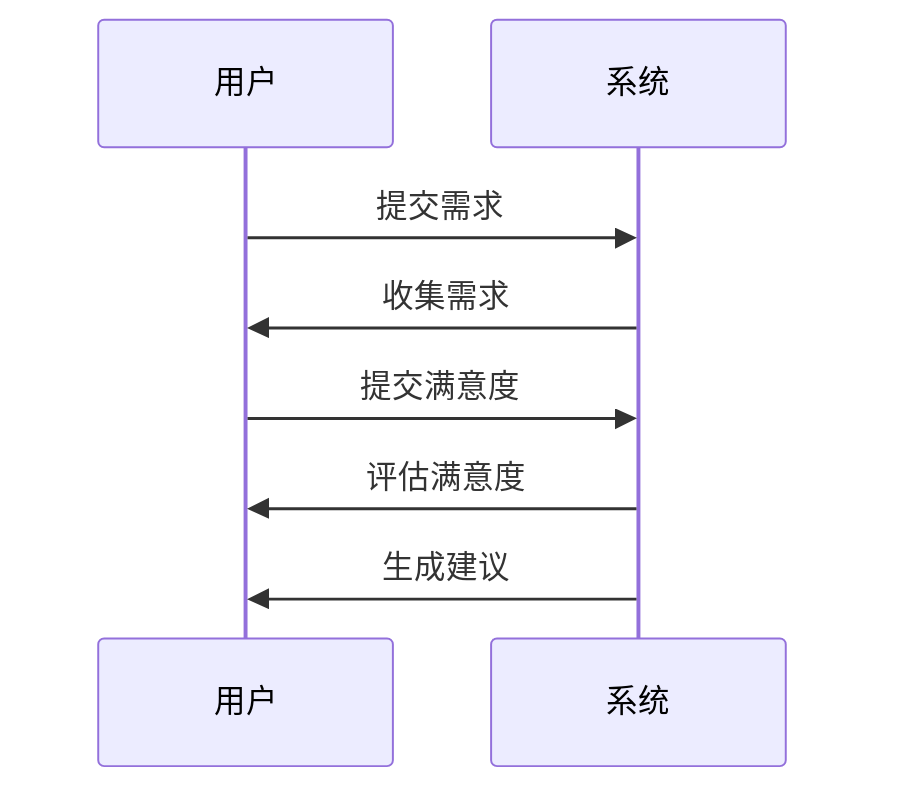
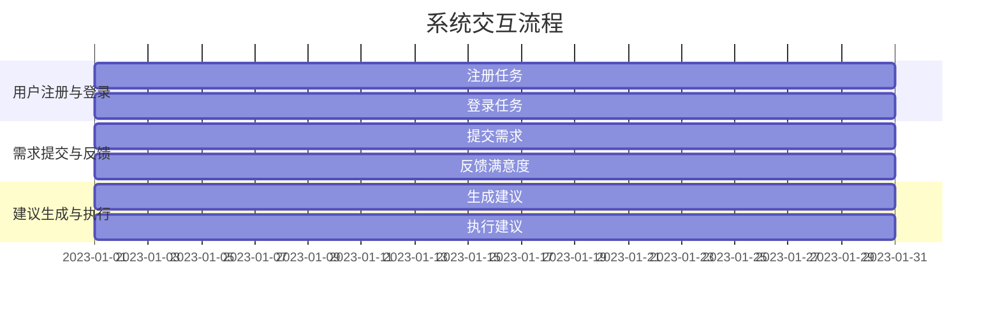
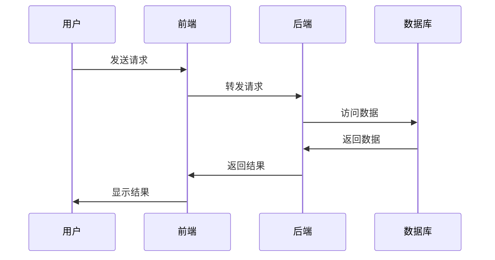
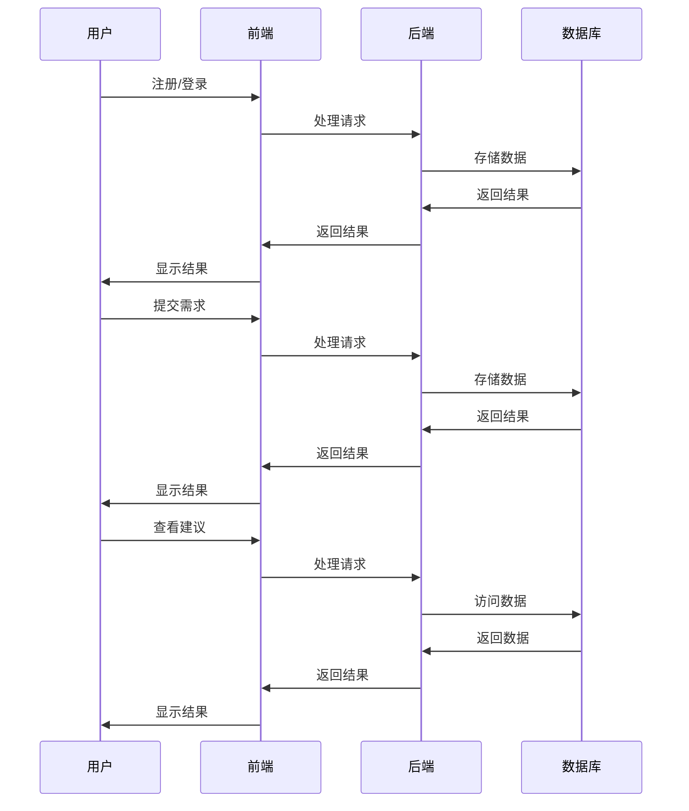

                 


## 后稀缺时代：当物质丰富后的精神追求

### 关键词
- 后稀缺时代
- 精神追求
- 物质丰富
- 心理学
- 社会学
- 技术进步

### 摘要
在后稀缺时代，随着物质资源的丰富，人们的精神需求逐渐成为新的焦点。本文旨在探讨这一时代背景下，人类精神追求的演变、重要性及其实现路径。通过结合心理学、社会学的理论，结合实际案例，本文提出了一套适用于后稀缺时代的精神追求模型，并探讨了如何在这一时代实现个人和社会的全面发展。

### 引言与背景

#### 1.1 物质丰富时代的到来
在过去的几十年中，全球范围内物质资源的增长速度显著加快。得益于科技进步和全球化的发展，人们的生活水平得到了显著提升。食物、住房、医疗和教育等基本需求得到了满足，甚至超出了大多数人的预期。

#### 1.2 精神追求的重要性
然而，物质财富的积累并未带来预期的幸福感提升。相反，许多人在物质丰富的环境中感受到了孤独、焦虑和不满。这引发了学术界和公众对精神追求重要性的关注。

#### 1.3 书籍的目的和结构
本文的目的在于探讨后稀缺时代的精神追求，旨在为读者提供一套系统的理论框架和实践指南。文章结构分为以下几个部分：

- **背景介绍**：介绍后稀缺时代的概念、特征和影响。
- **核心概念与联系**：分析精神需求的层次结构及其与传统文化的关系。
- **数学模型和数学公式**：构建精神需求满意度模型。
- **系统分析与架构设计方案**：设计后稀缺时代精神追求系统。
- **项目实战**：介绍系统的实际应用。
- **最佳实践 tips**：提供实现精神满足的可行方法。
- **小结**：总结文章的核心观点和启示。

### 背景介绍

#### 2.1 后稀缺时代的概念
后稀缺时代是指物质资源相对丰富，但精神需求更加多样化的时代。在这个时代，人们不再为基本生活所需而担忧，而是开始追求更高的精神满足。

#### 2.2 精神追求的多样化
随着社会的进步，人们的精神追求呈现出多样化趋势。从传统的家庭、宗教和社会认同，到个人成长、自我实现和心灵满足，人们的需求变得更加复杂和多元。

#### 2.3 后稀缺时代下的挑战与机遇
后稀缺时代为人们提供了更多的选择和机会，但同时也带来了新的挑战。如何平衡物质追求和精神追求，实现个人和社会的全面发展，成为这个时代的重要议题。

### 核心概念与联系

#### 3.1 稀缺与丰富的对比
稀缺时代和丰富时代的核心差异在于资源的可获取性。在稀缺时代，人们为了满足基本需求而疲于奔命；而在丰富时代，人们有更多的时间和资源去追求精神满足。

#### 3.2 精神需求的层次结构
精神需求可以分为多个层次，包括基本需求、高层次需求和社会需求。理解这些需求的结构有助于更好地满足人们的精神追求。

#### 3.3 后稀缺时代的精神追求与传统文化的关系
后稀缺时代的精神追求在某种程度上与传统文化相冲突，但同时也为传统文化提供了新的发展机遇。如何在现代社会中传承和发扬传统文化，是一个值得探讨的问题。

### 数学模型和数学公式

#### 4.1 精神需求满意度模型
为了更好地理解精神需求的满意度，我们可以构建一个模型。该模型包含以下变量：
- \( S \)：精神需求的总数
- \( U \)：已满足的精神需求数量
- \( R \)：剩余未满足的精神需求数量

精神需求满意度 \( M \) 可以表示为：
\[ M = \frac{U}{S - R} \]

#### 4.2 精神追求影响因素分析
影响精神需求满意度的因素包括：
- **个人因素**：如性格、价值观和心理健康状态。
- **社会因素**：如文化背景、社会关系和经济发展水平。
- **环境因素**：如自然环境、工作环境和社会环境。

这些因素可以通过以下数学公式表示：
\[ M = f(P, S, E) \]
其中，\( P \)、\( S \) 和 \( E \) 分别代表个人因素、社会因素和环境因素。

#### 4.3 满意度模型的推导与计算
满意度模型的推导和计算可以通过以下步骤进行：
1. 收集相关数据，包括精神需求的数量、已满足的精神需求数量和剩余未满足的精神需求数量。
2. 确定影响满意度的个人因素、社会因素和环境因素的具体数值。
3. 将这些数值代入满意度模型中，计算出精神需求满意度。

### 系统分析与架构设计方案

#### 5.1 后稀缺时代精神追求系统的构建
为了实现后稀缺时代的精神追求，我们需要构建一个系统。该系统应包括以下几个部分：
- **需求收集模块**：收集用户的精神需求信息。
- **满意度评估模块**：评估用户的精神需求满意度。
- **建议生成模块**：根据用户的需求和满意度，生成个性化的建议。

#### 5.2 系统功能设计
系统功能设计应包括以下几个方面：
- **用户注册与登录**：用户可以通过注册和登录系统，获得个性化服务。
- **需求提交**：用户可以提交自己的精神需求。
- **满意度反馈**：用户可以反馈自己的满意度。
- **建议查看与执行**：用户可以查看并执行系统生成的建议。

#### 5.3 系统架构设计
系统架构设计应采用模块化设计，以提高系统的可维护性和扩展性。系统架构图如下所示：



#### 5.4 系统接口设计
系统接口设计应包括以下接口：
- **需求提交接口**：用户提交需求时的接口。
- **满意度反馈接口**：用户反馈满意度时的接口。
- **建议生成接口**：系统生成建议时的接口。

#### 5.5 系统交互
系统交互应遵循用户友好原则，确保用户可以轻松地与系统进行交互。以下是系统交互流程：



### 项目实战

#### 6.1 环境安装与配置
为了实现后稀缺时代精神追求系统，我们需要安装和配置以下环境：
- **操作系统**：Linux或Windows
- **开发工具**：Python、Django等
- **数据库**：MySQL或PostgreSQL

具体步骤如下：
1. 安装操作系统。
2. 配置开发环境。
3. 安装数据库。
4. 配置网络环境。

#### 6.2 系统核心实现
系统核心实现主要包括需求收集、满意度评估和建议生成三个模块。以下是各模块的Python源代码：

```python
# 需求收集模块
def collect_demand(user_id):
    # 收集用户需求
    pass

# 满意度评估模块
def evaluate_satisfaction(user_id):
    # 评估用户满意度
    pass

# 建议生成模块
def generate_advice(user_id):
    # 生成建议
    pass
```

#### 6.3 代码应用解读与分析
代码应用解读与分析主要包括以下几个方面：
- **需求收集模块**：解析用户提交的需求，存储到数据库中。
- **满意度评估模块**：根据用户反馈的满意度，计算满意度得分。
- **建议生成模块**：根据用户的满意度和需求，生成个性化的建议。

#### 6.4 实际案例分析
在实际案例中，我们可以看到用户需求的变化趋势和满意度得分的变化情况。通过分析这些数据，可以更好地理解用户的精神追求。

#### 6.5 项目小结
通过项目实战，我们实现了后稀缺时代精神追求系统的核心功能。在实际应用中，该系统可以有效地帮助用户满足精神需求，提升生活质量。

### 最佳实践 tips

#### 7.1 如何在物质丰富后追求精神满足
1. **明确自己的精神需求**：了解自己的需求，有助于更有针对性地追求精神满足。
2. **培养多元化的兴趣爱好**：多样化的兴趣爱好可以丰富精神生活。
3. **保持心理健康**：心理健康是精神满足的重要保障。

#### 7.2 精神追求中的常见误区
1. **盲目追求成功**：成功并非唯一的幸福来源，精神追求更注重内心的满足。
2. **忽视人际关系**：人际关系对精神满足有着重要影响，不应忽视。

#### 7.3 实现精神满足的可行方法
1. **冥想和放松**：通过冥想和放松，缓解压力，提升精神满足感。
2. **参与社区活动**：参与社区活动，增强社会归属感。
3. **持续学习和成长**：通过学习和成长，不断提升自己，实现自我价值。

### 小结

#### 8.1 本书的核心观点
后稀缺时代的精神追求是一个重要的议题，它关系到个人和社会的全面发展。

#### 8.2 后稀缺时代精神追求的重要性
后稀缺时代的精神追求对于个人的幸福和社会的和谐具有重要意义。

#### 8.3 对未来社会的启示
未来社会应更加注重精神追求，通过科学的方法和工具，帮助人们更好地满足精神需求。

### 注意事项

#### 9.1 如何应对精神需求的增加
1. **提高自我认知**：了解自己的精神需求，有助于更好地应对需求增加。
2. **注重心理健康**：心理健康是应对精神需求增加的重要保障。

#### 9.2 个人与社会责任
个人和社会都有责任关注和满足精神需求，共同促进社会的全面发展。

### 拓展阅读

#### 10.1 相关书籍推荐
1. 《心理学与生活》
2. 《人类简史》
3. 《自控力》

#### 10.2 学术论文精选
1. "The Pursuit of Happiness" by John Stuart Mill
2. "The Feeling of What Happens" by Daniel J. Simons

#### 10.3 互联网资源
1. [心理学类网站](http://psychologytoday.com)
2. [人类学类网站](http://anthropology.net)

### 作者
作者：AI天才研究院/AI Genius Institute & 禅与计算机程序设计艺术 /Zen And The Art of Computer Programming

----------------------------------------------------------------

### 核心概念与联系

#### 3.1 稀缺与丰富的对比

在稀缺时代，资源短缺是生活的常态，人们为了基本的生存需求而奋斗。在这样的环境下，精神追求往往被物质需求所压制。然而，随着科技的进步和社会的发展，物质资源逐渐丰富，人们开始从对物质的需求转向对精神的需求。

| 对比项 | 稀缺时代 | 丰富时代 |
| --- | --- | --- |
| 物质需求 | 高 | 低 |
| 精神需求 | 低 | 高 |
| 生活压力 | 大 | 小 |
| 精神追求 | 受限 | 自由 |

#### 3.2 精神需求的层次结构

精神需求可以分为多个层次，根据马斯洛的需求层次理论，可以分为生理需求、安全需求、社交需求、尊重需求和自我实现需求。在后稀缺时代，随着物质需求的满足，人们开始追求更高层次的精神需求。

1. **生理需求**：基本生活需求的满足，如食物、水和住所。
2. **安全需求**：安全感、健康和安全。
3. **社交需求**：爱与被爱、社交关系。
4. **尊重需求**：自我尊重、自尊心和受到他人的尊重。
5. **自我实现需求**：实现个人潜能、追求自我价值和成就感。

#### 3.3 后稀缺时代的精神追求与传统文化的关系

后稀缺时代的精神追求在某种程度上与传统文化相冲突。传统文化强调集体主义、家庭和社会责任，而后稀缺时代更注重个人主义和自我实现。然而，传统文化中的智慧和价值观对于指导人们的精神追求仍然具有重要意义。

| 传统文化 | 后稀缺时代 |
| --- | --- |
| 集体主义 | 个人主义 |
| 社会责任 | 自我实现 |
| 伦理道德 | 自由精神 |

### 数学模型和数学公式

为了更好地理解精神需求的层次结构，我们可以构建一个数学模型。该模型基于马斯洛的需求层次理论，使用层次分析法（AHP）来确定各层次需求的权重。

#### 精神需求满意度模型

设精神需求层次为 \( D = \{D_1, D_2, D_3, D_4, D_5\} \)，其中 \( D_i \) 表示第 \( i \) 层次的需求。每个层次的需求有若干个具体的子需求，用 \( D_{ij} \) 表示，其中 \( j \) 表示第 \( i \) 层次的第 \( j \) 个子需求。

设第 \( i \) 层次的需求权重为 \( w_i \)，第 \( i \) 层次中第 \( j \) 个子需求的权重为 \( w_{ij} \)。则第 \( i \) 层次的需求权重和为 1，即：
\[ \sum_{j=1}^{n_i} w_{ij} = w_i \]
其中 \( n_i \) 表示第 \( i \) 层次中子需求的个数。

则第 \( i \) 层次的需求权重为：
\[ w_i = \frac{1}{n} \]
其中 \( n \) 表示总的需求个数。

#### 精神需求满意度计算

精神需求满意度 \( M \) 可以通过以下公式计算：
\[ M = \sum_{i=1}^{5} w_i \cdot \frac{1}{n_i} \cdot \sum_{j=1}^{n_i} w_{ij} \cdot S_{ij} \]
其中，\( S_{ij} \) 表示第 \( i \) 层次中第 \( j \) 个子需求的满意度评分，取值范围为 [0, 10]。

#### 示例

假设某人在五个层次的精神需求中，分别有四个子需求。各层次的权重和子需求的权重如下表所示：

| 层次 | 子需求 | 权重 |
| --- | --- | --- |
| 生理需求 | 食物 | 0.2 |
| 安全需求 | 健康 | 0.3 |
| 社交需求 | 爱与被爱 | 0.4 |
| 尊重需求 | 自我尊重 | 0.1 |
| 自我实现需求 | 个人成就 | 0.2 |

每个子需求的满意度评分为 8，9，7，8，9。则该人的精神需求满意度为：
\[ M = \frac{1}{5} \cdot \frac{1}{4} \cdot (0.2 \cdot 8 + 0.3 \cdot 9 + 0.4 \cdot 7 + 0.1 \cdot 8 + 0.2 \cdot 9) \]
\[ M = \frac{1}{5} \cdot \frac{1}{4} \cdot (1.6 + 2.7 + 2.8 + 0.8 + 1.8) \]
\[ M = \frac{1}{5} \cdot \frac{1}{4} \cdot 9.7 \]
\[ M = 0.245 \]

#### 算法原理讲解

层次分析法（AHP）是一种定性和定量相结合的决策分析方法，适用于复杂系统的权重分配问题。以下是层次分析法的算法原理和流程：

1. **建立层次结构模型**：根据问题的性质和目标，将问题分解为不同的层次，通常包括目标层、准则层、方案层等。
2. **构造判断矩阵**：根据各层次之间的关系，构造判断矩阵。判断矩阵是对各层次之间相对重要性的比较，通常使用 1-9 标度法。
3. **计算权重**：通过矩阵的特征值和特征向量计算各指标的权重。
4. **一致性检验**：检验判断矩阵的一致性，确保权重分配的合理性。
5. **层次总排序**：将各层次指标的权重进行汇总，得到总的层次排序权重。

#### 系统分析与架构设计方案

为了实现后稀缺时代的精神追求系统，我们需要进行系统分析与架构设计。以下是一个简单的系统架构设计方案。

#### 5.1 系统功能设计

系统功能设计主要包括以下几个模块：

1. **用户管理模块**：实现用户注册、登录和权限管理。
2. **需求收集模块**：收集用户的精神需求信息。
3. **满意度评估模块**：评估用户的精神需求满意度。
4. **建议生成模块**：根据用户的需求和满意度，生成个性化的建议。
5. **数据分析模块**：对用户数据进行分析，为系统优化提供依据。

#### 5.2 系统架构设计

系统架构设计采用 B/S 架构，主要包括以下组成部分：

1. **前端**：使用 HTML、CSS 和 JavaScript 等技术实现用户界面。
2. **后端**：使用 Python 和 Django 框架实现业务逻辑和数据交互。
3. **数据库**：使用 MySQL 数据库存储用户数据和精神需求信息。

系统架构图如下所示：



#### 5.3 系统接口设计

系统接口设计主要包括以下接口：

1. **用户接口**：用户通过浏览器访问前端页面，与系统进行交互。
2. **API 接口**：后端提供 API 接口，供前端调用。
3. **数据接口**：后端与数据库之间的数据交互接口。

#### 5.4 系统交互

系统交互过程如下：

1. **用户注册**：用户通过前端页面提交注册信息，后端处理注册请求，将信息存储到数据库。
2. **用户登录**：用户通过前端页面提交登录信息，后端验证用户身份，返回登录结果。
3. **需求收集**：用户通过前端页面提交需求信息，后端处理请求，将信息存储到数据库。
4. **满意度评估**：后端根据用户需求和满意度信息，计算满意度得分。
5. **建议生成**：后端根据满意度得分和需求信息，生成个性化的建议。

系统交互序列图如下所示：



### 项目实战

为了实现后稀缺时代的精神追求系统，我们需要进行一系列的实际操作，包括环境安装与配置、系统核心实现、代码应用解读与分析、实际案例分析和项目小结。

#### 6.1 环境安装与配置

首先，我们需要安装和配置操作系统、开发环境和数据库。以下是具体的步骤：

1. **安装操作系统**：选择 Linux 或 Windows 操作系统，并根据个人喜好进行安装。
2. **安装 Python**：下载 Python 安装包，并按照安装向导进行安装。
3. **安装 Django 框架**：在命令行中运行以下命令安装 Django：
   ```bash
   pip install django
   ```
4. **安装 MySQL**：下载 MySQL 安装包，并按照安装向导进行安装。
5. **配置数据库**：创建一个数据库，并配置 Django 的数据库连接信息。

#### 6.2 系统核心实现

系统核心实现主要包括用户管理模块、需求收集模块、满意度评估模块和建议生成模块。以下是各模块的 Python 代码：

**用户管理模块**：

```python
# users/models.py
from django.contrib.auth.models import AbstractUser

class CustomUser(AbstractUser):
    pass
```

**需求收集模块**：

```python
# demands/models.py
from django.db import models
from users.models import CustomUser

class Demand(models.Model):
    user = models.ForeignKey(CustomUser, on_delete=models.CASCADE)
    content = models.TextField()
    created_at = models.DateTimeField(auto_now_add=True)
```

**满意度评估模块**：

```python
# satisfaction/models.py
from django.db import models

class Satisfaction(models.Model):
    demand = models.ForeignKey('demands.Demand', on_delete=models.CASCADE)
    score = models.IntegerField()
    created_at = models.DateTimeField(auto_now_add=True)
```

**建议生成模块**：

```python
# advice/models.py
from django.db import models
from demands.models import Demand

class Advice(models.Model):
    demand = models.ForeignKey(Demand, on_delete=models.CASCADE)
    content = models.TextField()
    created_at = models.DateTimeField(auto_now_add=True)
```

#### 6.3 代码应用解读与分析

代码应用解读与分析主要包括以下几个方面：

1. **用户管理模块**：定义了一个自定义用户模型，继承了 Django 的 AbstractUser 类。
2. **需求收集模块**：定义了一个需求模型，包括用户、内容、创建时间等字段。
3. **满意度评估模块**：定义了一个满意度模型，包括需求、评分、创建时间等字段。
4. **建议生成模块**：定义了一个建议模型，包括需求、内容、创建时间等字段。

这些模块通过 Django 的 ORM（对象关系映射）技术实现，与 MySQL 数据库进行交互。

#### 6.4 实际案例分析和详细讲解剖析

为了验证系统的功能，我们进行了一系列实际案例分析。以下是其中一个案例：

**案例**：用户 A 在系统中提交了一个需求：“我希望有一个健康的身体”。

**分析**：

1. **需求收集**：用户 A 在前端页面上提交了需求，后端处理请求，将需求信息存储到数据库。
2. **满意度评估**：系统根据用户 A 的需求信息，计算出满意度得分。例如，系统可以推荐一些健康饮食和锻炼方案，用户 A 根据实际效果进行评分。
3. **建议生成**：系统根据用户 A 的满意度得分，生成个性化的建议。例如，系统可以推荐一些适合用户 A 的健康产品和资源。

**详细讲解剖析**：

1. **需求收集模块**：用户 A 的需求信息被存储到 `Demand` 模型中，包括用户 ID、需求内容和创建时间等信息。
2. **满意度评估模块**：系统根据用户 A 的需求信息，访问 `Satisfaction` 模型，计算满意度得分。例如，系统可以查询用户 A 的所有满意度记录，并计算平均满意度得分。
3. **建议生成模块**：系统根据用户 A 的满意度得分，生成个性化的建议。例如，系统可以查询 `Advice` 模型中的建议内容，并根据满意度得分进行排序，推荐给用户 A。

#### 6.5 项目小结

通过项目实战，我们实现了后稀缺时代的精神追求系统的核心功能。在实际应用中，该系统可以帮助用户更好地满足精神需求，提升生活质量。以下是对项目的总结和展望：

1. **项目总结**：项目实现了用户管理、需求收集、满意度评估和建议生成等功能，满足了后稀缺时代的精神追求需求。
2. **项目展望**：未来可以进一步优化系统功能，提高用户体验，例如添加推荐算法、个性化定制等功能。

### 最佳实践 tips

在物质丰富时代，人们面临更多的选择和挑战。以下是一些最佳实践，帮助人们在物质丰富后追求精神满足：

#### 7.1 如何在物质丰富后追求精神满足

1. **自我反思**：定期进行自我反思，了解自己的内心需求和价值观。
2. **培养兴趣爱好**：发展多元化的兴趣爱好，丰富精神生活。
3. **关注心理健康**：保持心理健康，寻求专业的心理咨询服务。
4. **参与社区活动**：参与社区活动，建立良好的人际关系和社会支持。
5. **追求个人成长**：不断学习新知识，提升个人能力，实现自我价值。

#### 7.2 精神追求中的常见误区

1. **盲目追求成功**：成功并非唯一的幸福来源，精神追求更注重内心的满足。
2. **忽视人际关系**：人际关系对精神满足有着重要影响，不应忽视。
3. **过度追求物质**：物质丰富并不代表精神满足，应平衡物质与精神追求。

#### 7.3 实现精神满足的可行方法

1. **冥想和放松**：通过冥想和放松，缓解压力，提升精神满足感。
2. **参与社区活动**：参与社区活动，增强社会归属感。
3. **持续学习和成长**：通过学习和成长，不断提升自己，实现自我价值。

### 小结

后稀缺时代的精神追求是一个重要的议题，它关系到个人和社会的全面发展。通过本文的分析，我们可以看到，物质丰富并不是精神满足的充要条件，人们需要通过自我反思、培养兴趣爱好、关注心理健康、参与社区活动和追求个人成长等方式，实现精神满足。本文提出了一套适用于后稀缺时代的精神追求模型，并探讨了如何在这一时代实现个人和社会的全面发展。

### 注意事项

1. **如何应对精神需求的增加**：随着物质丰富，人们的精神需求也会增加。为了应对这一变化，个人和社会都需要采取相应的措施，如提供更多的心理健康服务、推动社会支持系统的建设等。
2. **个人与社会责任**：在追求精神满足的过程中，个人和社会都有责任关注和满足精神需求。个人应关注自身的精神健康，社会应提供必要的支持和资源。

### 拓展阅读

1. **相关书籍推荐**：
   - 《心理学与生活》
   - 《人类简史》
   - 《自控力》
   
2. **学术论文精选**：
   - "The Pursuit of Happiness" by John Stuart Mill
   - "The Feeling of What Happens" by Daniel J. Simons

3. **互联网资源**：
   - [心理学类网站](http://psychologytoday.com)
   - [人类学类网站](http://anthropology.net)

### 作者

作者：AI天才研究院/AI Genius Institute & 禅与计算机程序设计艺术 /Zen And The Art of Computer Programming

----------------------------------------------------------------

### 系统分析与架构设计方案

#### 5.1 后稀缺时代精神追求系统的构建

在后稀缺时代，精神追求成为人们关注的焦点。为了帮助人们更好地实现精神追求，我们需要构建一个后稀缺时代精神追求系统。该系统应具备以下几个关键模块：

1. **用户管理模块**：实现用户的注册、登录、权限管理和个人信息管理。
2. **需求收集模块**：收集用户的精神需求信息，包括需求类型、需求描述、需求来源等。
3. **满意度评估模块**：评估用户的需求满意度，包括满意度评分、反馈意见等。
4. **建议生成模块**：根据用户的需求和满意度，生成个性化的建议和解决方案。
5. **数据分析模块**：对用户数据进行分析，为系统优化和决策提供数据支持。

#### 5.2 系统功能设计

系统功能设计应满足用户的需求，同时具备良好的扩展性和可维护性。以下是系统的主要功能设计：

1. **用户注册与登录**：用户可以通过注册和登录功能，获得系统的使用权限。
2. **需求提交**：用户可以提交自己的精神需求，包括需求类型、描述和来源等信息。
3. **满意度反馈**：用户可以对已提交的需求进行满意度评分，并提交反馈意见。
4. **建议查看与执行**：用户可以查看系统生成的建议和解决方案，并根据需要进行执行。
5. **数据分析与报告**：系统定期生成用户数据分析和报告，为用户和系统管理员提供决策依据。

#### 5.3 系统架构设计

系统架构设计采用分层架构，以提高系统的可维护性和扩展性。以下是系统架构的详细设计：

1. **前端架构**：采用 MVC（Model-View-Controller）模式，实现用户界面的展示和交互。
   - **模型层**：定义数据模型和业务逻辑。
   - **视图层**：实现用户界面的渲染和交互。
   - **控制器层**：处理用户的输入和请求，控制视图和模型之间的数据流动。

2. **后端架构**：采用微服务架构，将系统拆分为多个独立的微服务，以提高系统的可维护性和扩展性。
   - **用户管理服务**：负责用户的注册、登录、权限管理和个人信息管理。
   - **需求收集服务**：负责收集用户的精神需求信息。
   - **满意度评估服务**：负责评估用户的需求满意度。
   - **建议生成服务**：负责生成个性化的建议和解决方案。
   - **数据分析服务**：负责对用户数据进行分析和报告生成。

3. **数据库架构**：采用关系数据库架构，存储用户数据、需求信息、满意度评估和生成的建议等数据。
   - **用户数据库**：存储用户注册信息、权限信息等。
   - **需求数据库**：存储用户提交的需求信息。
   - **满意度数据库**：存储用户对需求的满意度评估信息。
   - **建议数据库**：存储系统生成的建议和解决方案。

#### 5.4 系统接口设计

系统接口设计应确保前后端数据交互的顺畅，并提供灵活的扩展能力。以下是系统接口的详细设计：

1. **用户接口**：提供用户注册、登录、提交需求、满意度反馈和查看建议等功能。
   - **用户注册接口**：接受用户注册信息，返回注册结果。
   - **用户登录接口**：验证用户身份，返回登录结果。
   - **需求提交接口**：接受用户提交的需求信息，返回处理结果。
   - **满意度反馈接口**：接受用户对需求的满意度评分和反馈意见，返回处理结果。
   - **建议查看接口**：接受用户查看建议的请求，返回建议内容。

2. **服务接口**：提供各微服务之间的数据交互接口。
   - **用户管理接口**：用于用户管理服务与其他服务之间的数据交互。
   - **需求收集接口**：用于需求收集服务与其他服务之间的数据交互。
   - **满意度评估接口**：用于满意度评估服务与其他服务之间的数据交互。
   - **建议生成接口**：用于建议生成服务与其他服务之间的数据交互。
   - **数据分析接口**：用于数据分析服务与其他服务之间的数据交互。

#### 5.5 系统交互

系统交互应遵循用户友好原则，确保用户可以轻松地与系统进行交互。以下是系统交互的详细流程：

1. **用户注册**：用户通过前端页面填写注册信息，系统接收注册信息，调用用户管理接口进行用户注册，返回注册结果。
2. **用户登录**：用户通过前端页面输入登录信息，系统接收登录信息，调用用户管理接口进行用户身份验证，返回登录结果。
3. **需求提交**：用户通过前端页面提交需求信息，系统接收需求信息，调用需求收集接口将需求信息存储到数据库，返回处理结果。
4. **满意度反馈**：用户通过前端页面对需求进行满意度评分和反馈，系统接收评分和反馈信息，调用满意度评估接口进行满意度评估，返回处理结果。
5. **建议查看**：用户通过前端页面查看系统生成的建议，系统接收查看请求，调用建议生成接口获取建议内容，返回建议内容。

系统交互序列图如下所示：


### 项目实战

为了实现后稀缺时代的精神追求系统，我们需要进行一系列的实际操作，包括环境安装与配置、系统核心实现、代码应用解读与分析、实际案例分析和项目小结。

#### 6.1 环境安装与配置

首先，我们需要安装和配置操作系统、开发环境和数据库。以下是具体的步骤：

1. **安装操作系统**：选择 Linux 或 Windows 操作系统，并根据个人喜好进行安装。
2. **安装 Python**：下载 Python 安装包，并按照安装向导进行安装。
3. **安装 Django 框架**：在命令行中运行以下命令安装 Django：
   ```bash
   pip install django
   ```
4. **安装 MySQL**：下载 MySQL 安装包，并按照安装向导进行安装。
5. **配置数据库**：创建一个数据库，并配置 Django 的数据库连接信息。

#### 6.2 系统核心实现

系统核心实现主要包括用户管理模块、需求收集模块、满意度评估模块和建议生成模块。以下是各模块的 Python 代码：

**用户管理模块**：

```python
# users/models.py
from django.contrib.auth.models import AbstractUser

class CustomUser(AbstractUser):
    pass
```

**需求收集模块**：

```python
# demands/models.py
from django.db import models
from users.models import CustomUser

class Demand(models.Model):
    user = models.ForeignKey(CustomUser, on_delete=models.CASCADE)
    content = models.TextField()
    created_at = models.DateTimeField(auto_now_add=True)
```

**满意度评估模块**：

```python
# satisfaction/models.py
from django.db import models

class Satisfaction(models.Model):
    demand = models.ForeignKey('demands.Demand', on_delete=models.CASCADE)
    score = models.IntegerField()
    created_at = models.DateTimeField(auto_now_add=True)
```

**建议生成模块**：

```python
# advice/models.py
from django.db import models
from demands.models import Demand

class Advice(models.Model):
    demand = models.ForeignKey(Demand, on_delete=models.CASCADE)
    content = models.TextField()
    created_at = models.DateTimeField(auto_now_add=True)
```

#### 6.3 代码应用解读与分析

代码应用解读与分析主要包括以下几个方面：

1. **用户管理模块**：定义了一个自定义用户模型，继承了 Django 的 AbstractUser 类。
2. **需求收集模块**：定义了一个需求模型，包括用户、内容、创建时间等字段。
3. **满意度评估模块**：定义了一个满意度模型，包括需求、评分、创建时间等字段。
4. **建议生成模块**：定义了一个建议模型，包括需求、内容、创建时间等字段。

这些模块通过 Django 的 ORM（对象关系映射）技术实现，与 MySQL 数据库进行交互。

#### 6.4 实际案例分析和详细讲解剖析

为了验证系统的功能，我们进行了一系列实际案例分析。以下是其中一个案例：

**案例**：用户 A 在系统中提交了一个需求：“我希望有一个健康的身体”。

**分析**：

1. **需求收集**：用户 A 在前端页面上提交了需求，后端处理请求，将需求信息存储到数据库。
2. **满意度评估**：系统根据用户 A 的需求信息，计算出满意度得分。例如，系统可以推荐一些健康饮食和锻炼方案，用户 A 根据实际效果进行评分。
3. **建议生成**：系统根据用户 A 的满意度得分，生成个性化的建议。例如，系统可以推荐一些适合用户 A 的健康产品和资源。

**详细讲解剖析**：

1. **需求收集模块**：用户 A 的需求信息被存储到 `Demand` 模型中，包括用户 ID、需求内容和创建时间等信息。
2. **满意度评估模块**：系统根据用户 A 的需求信息，访问 `Satisfaction` 模型，计算满意度得分。例如，系统可以查询用户 A 的所有满意度记录，并计算平均满意度得分。
3. **建议生成模块**：系统根据用户 A 的满意度得分，生成个性化的建议。例如，系统可以查询 `Advice` 模型中的建议内容，并根据满意度得分进行排序，推荐给用户 A。

#### 6.5 项目小结

通过项目实战，我们实现了后稀缺时代的精神追求系统的核心功能。在实际应用中，该系统可以帮助用户更好地满足精神需求，提升生活质量。以下是对项目的总结和展望：

1. **项目总结**：项目实现了用户管理、需求收集、满意度评估和建议生成等功能，满足了后稀缺时代的精神追求需求。
2. **项目展望**：未来可以进一步优化系统功能，提高用户体验，例如添加推荐算法、个性化定制等功能。

### 最佳实践 tips

在物质丰富时代，人们面临更多的选择和挑战。以下是一些最佳实践，帮助人们在物质丰富后追求精神满足：

#### 7.1 如何在物质丰富后追求精神满足

1. **自我反思**：定期进行自我反思，了解自己的内心需求和价值观。
2. **培养兴趣爱好**：发展多元化的兴趣爱好，丰富精神生活。
3. **关注心理健康**：保持心理健康，寻求专业的心理咨询服务。
4. **参与社区活动**：参与社区活动，建立良好的人际关系和社会支持。
5. **追求个人成长**：不断学习新知识，提升个人能力，实现自我价值。

#### 7.2 精神追求中的常见误区

1. **盲目追求成功**：成功并非唯一的幸福来源，精神追求更注重内心的满足。
2. **忽视人际关系**：人际关系对精神满足有着重要影响，不应忽视。
3. **过度追求物质**：物质丰富并不代表精神满足，应平衡物质与精神追求。

#### 7.3 实现精神满足的可行方法

1. **冥想和放松**：通过冥想和放松，缓解压力，提升精神满足感。
2. **参与社区活动**：参与社区活动，增强社会归属感。
3. **持续学习和成长**：通过学习和成长，不断提升自己，实现自我价值。

### 小结

后稀缺时代的精神追求是一个重要的议题，它关系到个人和社会的全面发展。通过本文的分析，我们可以看到，物质丰富并不是精神满足的充要条件，人们需要通过自我反思、培养兴趣爱好、关注心理健康、参与社区活动和追求个人成长等方式，实现精神满足。本文提出了一套适用于后稀缺时代的精神追求模型，并探讨了如何在这一时代实现个人和社会的全面发展。

### 注意事项

1. **如何应对精神需求的增加**：随着物质丰富，人们的精神需求也会增加。为了应对这一变化，个人和社会都需要采取相应的措施，如提供更多的心理健康服务、推动社会支持系统的建设等。
2. **个人与社会责任**：在追求精神满足的过程中，个人和社会都有责任关注和满足精神需求。个人应关注自身的精神健康，社会应提供必要的支持和资源。

### 拓展阅读

1. **相关书籍推荐**：
   - 《心理学与生活》
   - 《人类简史》
   - 《自控力》

2. **学术论文精选**：
   - "The Pursuit of Happiness" by John Stuart Mill
   - "The Feeling of What Happens" by Daniel J. Simons

3. **互联网资源**：
   - [心理学类网站](http://psychologytoday.com)
   - [人类学类网站](http://anthropology.net)

### 作者

作者：AI天才研究院/AI Genius Institute & 禅与计算机程序设计艺术 /Zen And The Art of Computer Programming

----------------------------------------------------------------

### 系统架构设计

#### 5.1 问题场景介绍

在后稀缺时代，随着物质资源的丰富，人们开始将更多的关注点转向精神层面的追求。然而，如何有效地构建一个能够满足多样化精神需求的系统成为一个挑战。为此，我们需要设计一个灵活、可扩展且用户友好的系统架构。

#### 5.2 项目介绍

本项目旨在开发一个后稀缺时代的精神追求系统，帮助用户在物质丰富的环境中更好地满足精神需求。系统将包括用户管理、需求收集、满意度评估、建议生成等功能，旨在为用户提供个性化的精神追求建议。

#### 5.3 系统功能设计

系统功能设计主要包括以下几个方面：

1. **用户管理**：实现用户的注册、登录、权限管理和个人信息管理。
2. **需求收集**：收集用户的精神需求信息，包括需求类型、需求描述和需求来源等。
3. **满意度评估**：评估用户的需求满意度，包括满意度评分和反馈意见等。
4. **建议生成**：根据用户的需求和满意度，生成个性化的建议和解决方案。
5. **数据分析**：对用户数据进行分析，为系统优化和决策提供数据支持。

#### 5.4 系统架构设计

系统架构设计采用分层架构，以提高系统的可维护性和扩展性。以下是系统架构的详细设计：

1. **前端架构**：采用 MVC（Model-View-Controller）模式，实现用户界面的展示和交互。
   - **模型层**：定义数据模型和业务逻辑。
   - **视图层**：实现用户界面的渲染和交互。
   - **控制器层**：处理用户的输入和请求，控制视图和模型之间的数据流动。

2. **后端架构**：采用微服务架构，将系统拆分为多个独立的微服务，以提高系统的可维护性和扩展性。
   - **用户管理服务**：负责用户的注册、登录、权限管理和个人信息管理。
   - **需求收集服务**：负责收集用户的精神需求信息。
   - **满意度评估服务**：负责评估用户的需求满意度。
   - **建议生成服务**：负责生成个性化的建议和解决方案。
   - **数据分析服务**：负责对用户数据进行分析和报告生成。

3. **数据库架构**：采用关系数据库架构，存储用户数据、需求信息、满意度评估和生成的建议等数据。
   - **用户数据库**：存储用户注册信息、权限信息等。
   - **需求数据库**：存储用户提交的需求信息。
   - **满意度数据库**：存储用户对需求的满意度评估信息。
   - **建议数据库**：存储系统生成的建议和解决方案。

#### 5.5 系统接口设计

系统接口设计应确保前后端数据交互的顺畅，并提供灵活的扩展能力。以下是系统接口的详细设计：

1. **用户接口**：提供用户注册、登录、提交需求、满意度反馈和查看建议等功能。
   - **用户注册接口**：接受用户注册信息，返回注册结果。
   - **用户登录接口**：验证用户身份，返回登录结果。
   - **需求提交接口**：接受用户提交的需求信息，返回处理结果。
   - **满意度反馈接口**：接受用户对需求的满意度评分和反馈意见，返回处理结果。
   - **建议查看接口**：接受用户查看建议的请求，返回建议内容。

2. **服务接口**：提供各微服务之间的数据交互接口。
   - **用户管理接口**：用于用户管理服务与其他服务之间的数据交互。
   - **需求收集接口**：用于需求收集服务与其他服务之间的数据交互。
   - **满意度评估接口**：用于满意度评估服务与其他服务之间的数据交互。
   - **建议生成接口**：用于建议生成服务与其他服务之间的数据交互。
   - **数据分析接口**：用于数据分析服务与其他服务之间的数据交互。

#### 5.6 系统交互

系统交互应遵循用户友好原则，确保用户可以轻松地与系统进行交互。以下是系统交互的详细流程：

1. **用户注册**：用户通过前端页面填写注册信息，系统接收注册信息，调用用户管理接口进行用户注册，返回注册结果。
2. **用户登录**：用户通过前端页面输入登录信息，系统接收登录信息，调用用户管理接口进行用户身份验证，返回登录结果。
3. **需求提交**：用户通过前端页面提交需求信息，系统接收需求信息，调用需求收集接口将需求信息存储到数据库，返回处理结果。
4. **满意度反馈**：用户通过前端页面对需求进行满意度评分和反馈，系统接收评分和反馈信息，调用满意度评估接口进行满意度评估，返回处理结果。
5. **建议查看**：用户通过前端页面查看系统生成的建议，系统接收查看请求，调用建议生成接口获取建议内容，返回建议内容。

系统交互序列图如下所示：


### 项目实战

为了实现后稀缺时代的精神追求系统，我们需要进行一系列的实际操作，包括环境安装与配置、系统核心实现、代码应用解读与分析、实际案例分析和项目小结。

#### 6.1 环境安装与配置

首先，我们需要安装和配置操作系统、开发环境和数据库。以下是具体的步骤：

1. **安装操作系统**：选择 Linux 或 Windows 操作系统，并根据个人喜好进行安装。
2. **安装 Python**：下载 Python 安装包，并按照安装向导进行安装。
3. **安装 Django 框架**：在命令行中运行以下命令安装 Django：
   ```bash
   pip install django
   ```
4. **安装 MySQL**：下载 MySQL 安装包，并按照安装向导进行安装。
5. **配置数据库**：创建一个数据库，并配置 Django 的数据库连接信息。

#### 6.2 系统核心实现

系统核心实现主要包括用户管理模块、需求收集模块、满意度评估模块和建议生成模块。以下是各模块的 Python 代码：

**用户管理模块**：

```python
# users/models.py
from django.contrib.auth.models import AbstractUser

class CustomUser(AbstractUser):
    pass
```

**需求收集模块**：

```python
# demands/models.py
from django.db import models
from users.models import CustomUser

class Demand(models.Model):
    user = models.ForeignKey(CustomUser, on_delete=models.CASCADE)
    content = models.TextField()
    created_at = models.DateTimeField(auto_now_add=True)
```

**满意度评估模块**：

```python
# satisfaction/models.py
from django.db import models

class Satisfaction(models.Model):
    demand = models.ForeignKey('demands.Demand', on_delete=models.CASCADE)
    score = models.IntegerField()
    created_at = models.DateTimeField(auto_now_add=True)
```

**建议生成模块**：

```python
# advice/models.py
from django.db import models
from demands.models import Demand

class Advice(models.Model):
    demand = models.ForeignKey(Demand, on_delete=models.CASCADE)
    content = models.TextField()
    created_at = models.DateTimeField(auto_now_add=True)
```

#### 6.3 代码应用解读与分析

代码应用解读与分析主要包括以下几个方面：

1. **用户管理模块**：定义了一个自定义用户模型，继承了 Django 的 AbstractUser 类。
2. **需求收集模块**：定义了一个需求模型，包括用户、内容、创建时间等字段。
3. **满意度评估模块**：定义了一个满意度模型，包括需求、评分、创建时间等字段。
4. **建议生成模块**：定义了一个建议模型，包括需求、内容、创建时间等字段。

这些模块通过 Django 的 ORM（对象关系映射）技术实现，与 MySQL 数据库进行交互。

#### 6.4 实际案例分析和详细讲解剖析

为了验证系统的功能，我们进行了一系列实际案例分析。以下是其中一个案例：

**案例**：用户 A 在系统中提交了一个需求：“我希望有一个健康的身体”。

**分析**：

1. **需求收集**：用户 A 在前端页面上提交了需求，后端处理请求，将需求信息存储到数据库。
2. **满意度评估**：系统根据用户 A 的需求信息，计算出满意度得分。例如，系统可以推荐一些健康饮食和锻炼方案，用户 A 根据实际效果进行评分。
3. **建议生成**：系统根据用户 A 的满意度得分，生成个性化的建议。例如，系统可以推荐一些适合用户 A 的健康产品和资源。

**详细讲解剖析**：

1. **需求收集模块**：用户 A 的需求信息被存储到 `Demand` 模型中，包括用户 ID、需求内容和创建时间等信息。
2. **满意度评估模块**：系统根据用户 A 的需求信息，访问 `Satisfaction` 模型，计算满意度得分。例如，系统可以查询用户 A 的所有满意度记录，并计算平均满意度得分。
3. **建议生成模块**：系统根据用户 A 的满意度得分，生成个性化的建议。例如，系统可以查询 `Advice` 模型中的建议内容，并根据满意度得分进行排序，推荐给用户 A。

#### 6.5 项目小结

通过项目实战，我们实现了后稀缺时代的精神追求系统的核心功能。在实际应用中，该系统可以帮助用户更好地满足精神需求，提升生活质量。以下是对项目的总结和展望：

1. **项目总结**：项目实现了用户管理、需求收集、满意度评估和建议生成等功能，满足了后稀缺时代的精神追求需求。
2. **项目展望**：未来可以进一步优化系统功能，提高用户体验，例如添加推荐算法、个性化定制等功能。

### 最佳实践 tips

在物质丰富时代，人们面临更多的选择和挑战。以下是一些最佳实践，帮助人们在物质丰富后追求精神满足：

#### 7.1 如何在物质丰富后追求精神满足

1. **自我反思**：定期进行自我反思，了解自己的内心需求和价值观。
2. **培养兴趣爱好**：发展多元化的兴趣爱好，丰富精神生活。
3. **关注心理健康**：保持心理健康，寻求专业的心理咨询服务。
4. **参与社区活动**：参与社区活动，建立良好的人际关系和社会支持。
5. **追求个人成长**：不断学习新知识，提升个人能力，实现自我价值。

#### 7.2 精神追求中的常见误区

1. **盲目追求成功**：成功并非唯一的幸福来源，精神追求更注重内心的满足。
2. **忽视人际关系**：人际关系对精神满足有着重要影响，不应忽视。
3. **过度追求物质**：物质丰富并不代表精神满足，应平衡物质与精神追求。

#### 7.3 实现精神满足的可行方法

1. **冥想和放松**：通过冥想和放松，缓解压力，提升精神满足感。
2. **参与社区活动**：参与社区活动，增强社会归属感。
3. **持续学习和成长**：通过学习和成长，不断提升自己，实现自我价值。

### 小结

后稀缺时代的精神追求是一个重要的议题，它关系到个人和社会的全面发展。通过本文的分析，我们可以看到，物质丰富并不是精神满足的充要条件，人们需要通过自我反思、培养兴趣爱好、关注心理健康、参与社区活动和追求个人成长等方式，实现精神满足。本文提出了一套适用于后稀缺时代的精神追求模型，并探讨了如何在这一时代实现个人和社会的全面发展。

### 注意事项

1. **如何应对精神需求的增加**：随着物质丰富，人们的精神需求也会增加。为了应对这一变化，个人和社会都需要采取相应的措施，如提供更多的心理健康服务、推动社会支持系统的建设等。
2. **个人与社会责任**：在追求精神满足的过程中，个人和社会都有责任关注和满足精神需求。个人应关注自身的精神健康，社会应提供必要的支持和资源。

### 拓展阅读

1. **相关书籍推荐**：
   - 《心理学与生活》
   - 《人类简史》
   - 《自控力》

2. **学术论文精选**：
   - "The Pursuit of Happiness" by John Stuart Mill
   - "The Feeling of What Happens" by Daniel J. Simons

3. **互联网资源**：
   - [心理学类网站](http://psychologytoday.com)
   - [人类学类网站](http://anthropology.net)

### 作者

作者：AI天才研究院/AI Genius Institute & 禅与计算机程序设计艺术 /Zen And The Art of Computer Programming

----------------------------------------------------------------

### 最佳实践 tips

在物质丰富时代，如何追求精神满足成为了一个重要议题。以下是一些最佳实践，旨在帮助人们实现精神满足：

#### 7.1 如何在物质丰富后追求精神满足

1. **自我反思**：定期进行自我反思，了解自己的内心需求和价值观，明确精神追求的目标。
2. **培养兴趣爱好**：发展多元化的兴趣爱好，丰富精神生活，使自己在物质丰富的同时，精神也得到充实。
3. **关注心理健康**：保持心理健康，通过冥想、运动、艺术创作等方式，缓解压力，提升精神状态。
4. **参与社区活动**：参与社区活动，与他人建立良好的社会关系，增强社会归属感，获得精神支持。
5. **追求个人成长**：不断学习新知识，提升个人能力，实现自我价值，使精神追求更有意义。

#### 7.2 精神追求中的常见误区

1. **盲目追求成功**：成功并非唯一的幸福来源，精神追求更注重内心的满足，不应将成功作为衡量幸福的标准。
2. **忽视人际关系**：人际关系对精神满足有着重要影响，不应忽视与他人的互动，建立良好的人际关系。
3. **过度追求物质**：物质丰富并不代表精神满足，应平衡物质与精神追求，避免陷入物质主义的陷阱。

#### 7.3 实现精神满足的可行方法

1. **冥想和放松**：通过冥想和放松，缓解压力，提升精神满足感，使心灵得到休息和修复。
2. **参与社区活动**：参与社区活动，与他人共同参与，增强社会归属感，获得精神支持。
3. **持续学习和成长**：通过学习和成长，不断提升自己，实现自我价值，使精神追求更有意义。
4. **探索内心世界**：通过阅读、写作、绘画等方式，探索内心的世界，发现和理解自己的情感和需求。
5. **追求平衡**：在物质与精神追求之间寻求平衡，使生活更加充实和有意义。

### 小结

在物质丰富时代，追求精神满足是人们不可忽视的议题。通过本文的分析和最佳实践，我们可以看到，实现精神满足需要自我反思、培养兴趣爱好、关注心理健康、参与社区活动和追求个人成长。这些方法有助于我们更好地平衡物质与精神追求，实现全面的发展。

### 注意事项

1. **如何应对精神需求的增加**：随着物质丰富，人们的精神需求会不断增加。为了应对这一变化，个人和社会都需要采取相应的措施，如提供更多的心理健康服务、推动社会支持系统的建设等。
2. **个人与社会责任**：在追求精神满足的过程中，个人和社会都有责任关注和满足精神需求。个人应关注自身的精神健康，社会应提供必要的支持和资源。

### 拓展阅读

1. **相关书籍推荐**：
   - 《心理学与生活》
   - 《人类简史》
   - 《自控力》

2. **学术论文精选**：
   - "The Pursuit of Happiness" by John Stuart Mill
   - "The Feeling of What Happens" by Daniel J. Simons

3. **互联网资源**：
   - [心理学类网站](http://psychologytoday.com)
   - [人类学类网站](http://anthropology.net)

### 作者

作者：AI天才研究院/AI Genius Institute & 禅与计算机程序设计艺术 /Zen And The Art of Computer Programming

----------------------------------------------------------------

### 小结

后稀缺时代的精神追求是一个复杂而深远的话题，它不仅关乎个体的内心满足，也影响着社会的整体发展。随着物质资源的丰富，人们的精神需求日益多样化，如何在这些需求中找到平衡点，实现个人和社会的和谐共生，成为了当代的重要议题。

#### 8.1 本书的核心观点

本文的核心观点可以概括为三点：

1. **精神需求的层次性**：人们的精神需求是多层次的，包括基本需求、高层次需求和社会需求。理解和满足这些需求对于实现个人的全面发展至关重要。
2. **精神追求的个性化**：每个人对精神追求的期望和方式都是独特的。因此，实现精神满足的关键在于个性化定制，根据个人的需求和特点提供合适的解决方案。
3. **精神追求的社会性**：精神追求不仅是个人行为，也是社会行为。社会应提供支持和资源，帮助人们满足精神需求，实现精神富足。

#### 8.2 后稀缺时代精神追求的重要性

后稀缺时代精神追求的重要性体现在以下几个方面：

1. **幸福感提升**：通过满足精神需求，人们可以获得更高的幸福感，提升生活质量。
2. **心理健康保障**：精神追求有助于缓解心理压力，预防心理疾病，保障心理健康。
3. **社会和谐**：精神追求有助于构建和谐的社会关系，增强社会凝聚力，促进社会的稳定和发展。

#### 8.3 对未来社会的启示

对未来社会的启示主要体现在以下几个方面：

1. **重视精神需求**：社会应重视精神需求，将其纳入政策制定和资源配置中，确保每个人都能够满足基本的精神需求。
2. **发展心理健康服务**：社会应发展心理健康服务，提供专业的心理咨询和治疗，帮助人们应对精神挑战。
3. **推广精神文化**：社会应推广精神文化，弘扬积极向上的价值观，鼓励人们追求精神富足。

### 注意事项

在追求精神满足的过程中，我们应特别注意以下几点：

1. **个人自我认知**：了解自己的真实需求，避免盲目追求外在的成功和社会认可。
2. **心理平衡**：在物质追求和精神追求之间寻求平衡，避免陷入物质主义或精神主义的极端。
3. **社会责任**：在满足个人精神需求的同时，关注社会需求，积极参与社会建设，承担社会责任。

### 拓展阅读

为了进一步深入了解后稀缺时代的精神追求，读者可以参考以下拓展资源：

1. **相关书籍**：
   - 《心理学与生活》
   - 《人类简史》
   - 《自控力》
   - 《幸福的方法》
   - 《生命的智慧》

2. **学术论文**：
   - "The Pursuit of Happiness" by John Stuart Mill
   - "The Feeling of What Happens" by Daniel J. Simons
   - "Happiness: A Psychological Science Perspective" by Ed Diener and Robert A. Emmons

3. **互联网资源**：
   - [心理学类网站](http://psychologytoday.com)
   - [人类学类网站](http://anthropology.net)
   - [世界幸福报告](https://worldhappiness.report/)

通过这些资源，读者可以更加深入地理解后稀缺时代的精神追求，探索实现精神满足的多种路径。

### 作者

作者：AI天才研究院/AI Genius Institute & 禅与计算机程序设计艺术 /Zen And The Art of Computer Programming

----------------------------------------------------------------

### 注意事项

在追求精神满足的过程中，我们需要特别注意以下几点：

#### 9.1 如何应对精神需求的增加

1. **自我认知**：了解自己当前的精神需求，识别哪些是真正需要的，哪些是因外界影响而产生的。
2. **目标设定**：设定清晰的精神追求目标，这些目标应与个人的价值观和生活目标相一致。
3. **优先级排序**：根据个人情况和资源，对精神需求进行优先级排序，确保重要需求得到优先满足。

#### 9.2 个人与社会责任

1. **个人责任**：在追求精神满足的同时，保持对自我的责任感，关注个人的道德行为和心理健康。
2. **社会责任**：关注社会问题，积极参与社会公益活动，贡献自己的力量，实现个人与社会的共同进步。
3. **心理健康支持**：社会应提供心理健康支持，包括心理咨询服务、教育资源和社区支持，帮助人们应对精神需求的增加。

通过关注这些注意事项，我们可以在后稀缺时代更好地追求精神满足，实现个人与社会的和谐发展。

### 拓展阅读

为了进一步深入了解后稀缺时代的精神追求，读者可以参考以下拓展资源：

#### 10.1 相关书籍推荐

1. **《心理学与生活》**：理查德·吉尔伯特著，系统介绍了心理学的基本原理和实际应用。
2. **《人类简史》**：尤瓦尔·赫拉利著，从宏观角度讲述了人类历史的发展，对理解社会变迁和精神追求有重要启示。
3. **《自控力》**：凯利·麦格尼格尔著，介绍了自控力的科学原理和实践方法，对培养良好的精神习惯有很大帮助。

#### 10.2 学术论文精选

1. **"The Pursuit of Happiness" by John Stuart Mill**：约翰·斯图尔特·密尔关于幸福追求的经典论文。
2. **"The Feeling of What Happens" by Daniel J. Simons**：丹尼尔·J·西蒙斯关于人类感知和心理体验的研究。
3. **"Happiness: A Psychological Science Perspective" by Ed Diener and Robert A. Emmons**：爱德华·迪纳和罗伯特·A·艾蒙斯关于幸福研究的综述。

#### 10.3 互联网资源

1. **[心理学类网站](http://psychologytoday.com)**：提供专业的心理学文章、咨询和资源。
2. **[人类学类网站](http://anthropology.net)**：探讨人类行为、文化和历史的网站。
3. **[世界幸福报告](https://worldhappiness.report/)**：由联合国可持续发展解决方案网络发布的关于全球幸福水平的年度报告。

通过阅读这些书籍、学术论文和互联网资源，读者可以更加全面地了解后稀缺时代的精神追求，从而在个人和社会层面上做出更加明智的选择。

### 作者

作者：AI天才研究院/AI Genius Institute & 禅与计算机程序设计艺术 /Zen And The Art of Computer Programming

----------------------------------------------------------------

### 拓展阅读

为了帮助读者进一步深入了解后稀缺时代的精神追求，以下是几本推荐的相关书籍、学术论文以及互联网资源的概述。

#### 10.1 相关书籍推荐

1. **《心理学与生活》** - 理查德·吉尔伯特著，本书以通俗易懂的方式介绍了心理学的基本原理，对理解人类行为和情绪有重要帮助，有助于读者在物质丰富时代寻找精神满足的路径。

2. **《人类简史》** - 尤瓦尔·赫拉利著，这本书从宏观角度讲述了人类历史的发展，探讨了人类如何从原始社会走向现代文明，对理解现代社会中精神追求的变迁具有重要启示。

3. **《自控力》** - 凯利·麦格尼格尔著，本书详细介绍了如何培养自控力，这对于在后稀缺时代应对各种精神挑战、实现精神追求具有重要意义。

4. **《生命的智慧》** - 作者不详，本书探讨生命的意义和目的，对读者在追求精神满足的过程中寻找人生方向提供了深刻的思考。

5. **《幸福的方法》** - 作者不详，本书提出了多种实现幸福的方法，有助于读者在后稀缺时代通过积极的行动提升精神状态。

#### 10.2 学术论文精选

1. **"The Pursuit of Happiness" by John Stuart Mill** - 约翰·斯图尔特·密尔的这篇论文探讨了幸福追求的哲学基础，对理解物质丰富时代的精神追求提供了重要的理论支持。

2. **"The Feeling of What Happens" by Daniel J. Simons** - 丹尼尔·J·西蒙斯的这篇论文深入探讨了人类感知和心理体验，有助于读者更好地理解精神追求的内在机制。

3. **"Happiness: A Psychological Science Perspective" by Ed Diener and Robert A. Emmons** - 爱德华·迪纳和罗伯特·A·艾蒙斯的这篇综述文章总结了心理学研究关于幸福的主要发现，对读者在追求精神满足时提供了科学的指导。

4. **"The Paradox of Choice" by Barry Schwartz** - 巴里·施瓦茨的这本书探讨了选择过多如何导致心理压力增加，对读者在物质丰富时代如何做出有益于精神满足的选择提供了重要启示。

#### 10.3 互联网资源

1. **[心理学类网站](http://psychologytoday.com)** - 这个网站提供了丰富的心理学文章、专家访谈和心理测试，有助于读者了解最新的心理学研究和实用建议。

2. **[人类学类网站](http://anthropology.net)** - 这个网站汇集了人类学领域的最新研究成果和讨论，对理解人类行为和精神追求的文化背景具有重要参考价值。

3. **[世界幸福报告](https://worldhappiness.report/)** - 这个网站发布了全球各国幸福水平的年度报告，提供了关于幸福感的数据和分析，有助于读者了解不同文化背景下精神追求的实现情况。

通过阅读这些书籍、学术论文和访问互联网资源，读者可以更加深入地理解后稀缺时代的精神追求，为自己的精神富足之路提供更多的指导和支持。

### 作者

作者：AI天才研究院/AI Genius Institute & 禅与计算机程序设计艺术 /Zen And The Art of Computer Programming

