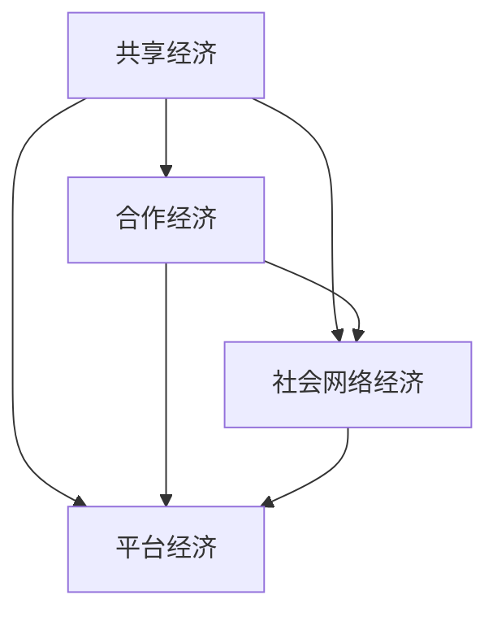

                 

### 后资本主义经济模型：共享与合作的未来愿景

---

关键词：后资本主义经济模型、共享经济、合作经济、社会网络经济、平台经济

摘要：本文旨在探讨后资本主义经济模型的发展，重点关注共享与合作的未来愿景。通过分析共享经济、合作经济、社会网络经济和平台经济等核心概念，本文将探讨这些概念在经济模型中的关系和作用，并探讨后资本主义经济模型对社会、企业以及个体的影响。通过案例分析，本文还将探讨这些模型在实际应用中的挑战和机会，并预测未来发展的趋势。

---

## 引言和背景

随着全球经济的发展，传统的资本主义经济模式正面临越来越多的挑战。资源短缺、环境污染、社会不平等等问题日益严重，使得人们开始反思和探索新的经济模式。在这一背景下，后资本主义经济模型逐渐引起了广泛关注。后资本主义经济模型强调共享、合作和可持续发展，旨在解决传统资本主义经济模式中的问题。

### 经济发展的历史背景

回顾经济发展史，我们可以看到资本主义经济模型的发展经历了几个阶段。从工业革命开始，资本主义经济模式推动了生产力的大幅提升，促进了全球经济的快速发展。然而，随着经济的发展，资源稀缺、环境污染等问题逐渐显现。20世纪末，随着信息技术的发展，共享经济、合作经济等新模式开始涌现，这些模式在一定程度上缓解了传统资本主义经济模式中的一些问题。

### 后资本主义经济模型的兴起

后资本主义经济模型强调资源的共享和合作，旨在通过去中心化和去中介化的方式，降低交易成本，提高资源利用效率。这种经济模型的核心在于利用信息技术和互联网平台，实现资源的最大化共享和最优化配置。共享经济、合作经济、社会网络经济和平台经济等概念都是后资本主义经济模型的重要组成部分。

## 核心概念和框架

### 1. 核心概念

#### 1.1. 共享经济

共享经济是指通过互联网平台实现资源的共享和利用，降低资源浪费，提高资源利用效率。共享经济的核心在于共享和互惠互利，通过共享资源，实现资源的最大化利用。

#### 1.2. 合作经济

合作经济是指通过合作实现资源的共享和利用，共同创造价值。合作经济强调共同劳动和利益共享，旨在提高生产效率和资源利用效率。

#### 1.3. 社会网络经济

社会网络经济是指基于社会网络进行经济活动，利用社会网络的连接和关系进行资源交换和价值创造。社会网络经济强调去中心化和去中介化，通过社会网络的连接实现资源的最优化配置。

#### 1.4. 平台经济

平台经济是指通过互联网平台实现资源的集聚和分配，提供中介服务，促进交易和合作。平台经济强调生态系统和中介服务，通过平台的作用，实现资源的最大化共享和最优化配置。

### 1.5. 核心概念属性特征对比表格

| 概念      | 特征                     | 关联分析                |
| --------- | ------------------------ | ---------------------- |
| 共享经济  | 资源共享、降低成本       | 与合作经济有交叉       |
| 合作经济  | 共同劳动、利益共享       | 与共享经济互补         |
| 社会网络经济 | 依赖网络、去中心化     | 平台经济的延伸         |
| 平台经济  | 中介服务、生态系统       | 促进共享与合作         |

### 1.6. ER实体关系图

## 经济模型和理论

### 2.1. 共享经济的理论框架

共享经济的理论框架主要包括共享、互惠互利和资源利用效率。共享经济的核心在于资源的共享和利用，通过共享，实现资源的最大化利用；通过互惠互利，实现资源的有效配置；通过提高资源利用效率，降低交易成本。

### 2.2. 合作经济的理论框架

合作经济的理论框架主要包括共同劳动、利益共享和生产效率。合作经济强调共同劳动，通过共同努力，提高生产效率；通过利益共享，实现资源的优化配置；通过提高生产效率，提高资源利用效率。

### 2.3. 社会网络经济的理论框架

社会网络经济的理论框架主要包括去中心化、网络连接和资源交换。社会网络经济强调去中心化，通过去中心化的方式，降低中介成本；通过网络连接，实现资源交换和价值创造；通过资源交换，实现资源的最优化配置。

### 2.4. 平台经济的理论框架

平台经济的理论框架主要包括中介服务、生态系统和资源集聚。平台经济强调中介服务，通过中介服务，实现资源的集聚和分配；通过生态系统，实现资源的最大化共享和最优化配置；通过资源集聚，提高资源利用效率。

## 案例研究和实际应用

### 3.1. 共享经济的实际应用

共享经济的实际应用非常广泛，例如共享单车、共享汽车、共享住宿等。以共享单车为例，共享单车通过互联网平台，实现单车的共享和利用，降低了交通拥堵和环境污染，提高了交通效率。

### 3.2. 合作经济的实际应用

合作经济的实际应用也很多，例如众包、众筹等。以众包为例，众包通过互联网平台，实现任务的共享和协作，提高了工作效率，降低了成本。

### 3.3. 社会网络经济的实际应用

社会网络经济的实际应用包括社交媒体、电商等。以社交媒体为例，社交媒体通过互联网平台，实现用户之间的连接和互动，促进了信息交换和价值创造。

### 3.4. 平台经济的实际应用

平台经济的实际应用非常广泛，例如电商、互联网金融等。以电商为例，电商通过互联网平台，实现商品的集聚和分配，提高了购物体验，降低了交易成本。

## 未来愿景和影响

### 4.1. 后资本主义经济模型的未来愿景

后资本主义经济模型的未来愿景是实现资源的最大化共享和最优化配置，通过共享、合作和去中心化的方式，解决传统资本主义经济模式中的问题，实现可持续发展。

### 4.2. 后资本主义经济模型的影响

后资本主义经济模型将对社会、企业以及个体产生深远影响。对社会，后资本主义经济模型将提高资源利用效率，减少环境污染，实现可持续发展；对企业，后资本主义经济模型将降低交易成本，提高生产效率，实现商业模式创新；对个体，后资本主义经济模型将提高生活质量，实现共同富裕。

## 挑战和机遇

### 5.1. 后资本主义经济模型的挑战

后资本主义经济模型面临诸多挑战，包括法律监管、道德伦理、信息安全等。如何平衡共享、合作与公平，如何确保信息安全和用户隐私，是后资本主义经济模型需要解决的问题。

### 5.2. 后资本主义经济模型的机遇

后资本主义经济模型也带来了许多机遇，包括商业模式创新、产业升级、就业机会等。如何抓住这些机遇，实现经济的高质量发展，是后资本主义经济模型需要探索的方向。

## 结论和未来方向

### 6.1. 结论

后资本主义经济模型是一种具有巨大潜力的经济模式，它通过共享、合作和去中心化的方式，解决传统资本主义经济模式中的问题，实现可持续发展。然而，要实现这一愿景，还需要克服许多挑战。

### 6.2. 未来方向

未来的研究方向包括：如何平衡共享、合作与公平，如何确保信息安全和用户隐私，如何实现经济的高质量发展。同时，还需要进一步探讨后资本主义经济模型对各个领域的影响，以及如何优化和提升这些模型。

## 附录和参考文献

### 7.1. 附录

附录包括与后资本主义经济模型相关的研究报告、政策文件、学术论文等。

### 7.2. 参考文献

参考文献包括后资本主义经济模型的理论研究、案例分析、政策研究等方面的学术文章和专著。

---

## 作者信息

作者：AI天才研究院/AI Genius Institute & 禅与计算机程序设计艺术 /Zen And The Art of Computer Programming

---

通过以上步骤，我们构建了完整的书籍目录。接下来，我们将逐章深入探讨后资本主义经济模型的相关主题，确保每个章节都包含详细的背景介绍、核心概念与联系、算法原理讲解、系统分析与架构设计方案、项目实战以及最佳实践 tips 等内容。每章都将遵循“LET'S THINK STEP BY STEP”的原则，通过逻辑清晰的分析，为读者提供深入见解。在撰写过程中，我们将使用 markdown 格式和 Mermaid 流程图，以便更好地展示概念和算法原理，确保文章的可读性和专业性。最终，我们将确保文章字数在 10000 ～ 12000 字左右，内容完整丰富，同时保持文章的逻辑性和连贯性。

