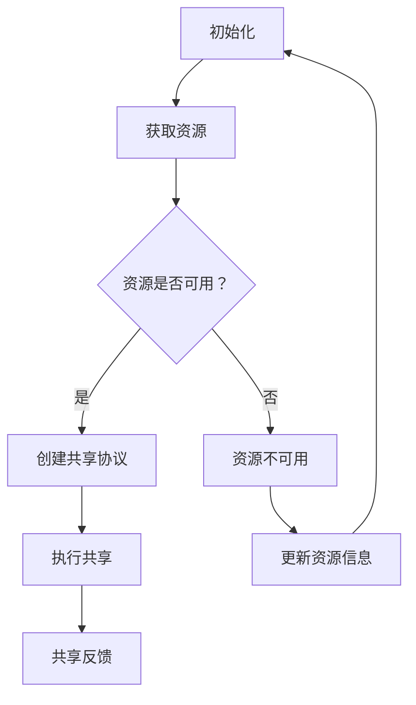
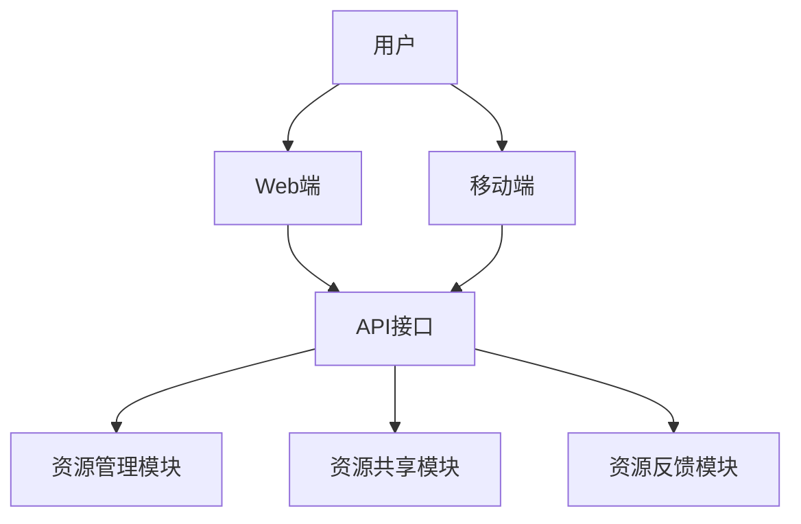
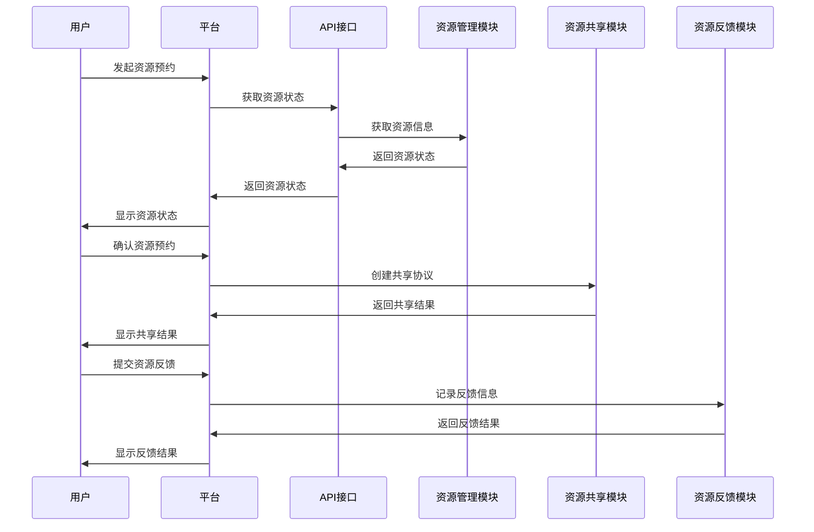

                 


## 引言：后资本主义经济模式：共享与合作的未来

随着全球化、信息化和互联网技术的迅猛发展，传统资本主义经济模式正面临前所未有的挑战。资源枯竭、环境污染、贫富差距扩大等问题日益凸显，迫使人们重新思考经济模式的可持续性和公平性。在这样的背景下，后资本主义经济模式应运而生，其中共享与合作的理念成为其核心。

本文旨在探讨后资本主义经济模式的概念、背景、核心要素、企业实践、国家角色及未来展望。通过逐步分析，我们将揭示这一新型经济模式的潜在优势、挑战及发展方向。

### 1. 背景介绍

**核心概念术语说明**：

- **资本主义**：一种以私人所有权和市场机制为基础的经济制度，追求利润最大化。
- **共享经济**：一种基于共享和协作的商业模式，通过共享闲置资源提高资源利用效率。
- **合作经济**：一种以合作和共赢为核心的经济模式，强调共同创造和共享价值。

**问题背景**：  
当前资本主义经济模式在促进经济增长的同时，也带来了诸多问题。资源过度消耗、环境污染、贫富差距扩大等问题已成为全球性的挑战。此外，信息化和互联网技术的快速发展，使得资源获取和分享变得更加便捷，为共享与合作提供了新的可能性。

**问题描述**：  
如何在保持经济增长的同时，实现资源的高效利用和公平分配？如何应对环境恶化和社会不公的问题？这些问题催生了后资本主义经济模式的探讨。

**问题解决**：  
后资本主义经济模式通过共享与合作的原理，试图解决传统资本主义经济模式中的问题。共享经济提高了资源利用效率，减少了浪费；合作经济强调共赢，缩小了贫富差距，促进了社会和谐。

**边界与外延**：  
后资本主义经济模式并非完全否定资本主义，而是在其基础上进行创新和改进。它保留了市场机制的优势，同时引入了共享与合作的理念，以实现经济、社会和环境的可持续发展。

**概念结构与核心要素组成**：

- **共享经济**：基于共享和协作的商业模式，核心要素包括资源、平台、用户。
- **合作经济**：基于合作和共赢的经济模式，核心要素包括企业、员工、社区。
- **后资本主义经济模式**：整合了共享经济和合作经济的优势，核心要素包括市场、政策、技术。

### 2. 核心概念与联系

**核心概念原理**：

- **共享经济**：共享经济的原理在于通过互联网平台，将闲置资源（如房屋、车辆、时间等）提供给有需求的人，实现资源的最大化利用。
- **合作经济**：合作经济的原理在于通过合作和共赢，实现企业、员工和社区的共同发展。

**概念属性特征对比表格**：

| 概念     | 共享经济                     | 合作经济                     |
|----------|------------------------------|------------------------------|
| 核心     | 资源共享                     | 合作共赢                     |
| 特点     | 低成本、高效率、去中心化     | 低成本、高效率、去中心化     |
| 适用范围 | 闲置资源较多、需求多样化     | 合作意愿较强、共享意愿较弱   |
| 潜在挑战 | 知识产权保护、资源分配不均   | 管理成本高、利益分配难题     |

**ER实体关系图架构**：

```mermaid
erDiagram
  Resource --> User : 使用
  Resource --> Platform : 提供平台
  User --> Platform : 使用平台
  Platform --> Service : 提供服务
  Service --> Payment : 支付
```

### 3. 算法原理讲解

**算法流程图**：



**Python源代码**：

```python
class Resource:
    def __init__(self, id, status):
        self.id = id
        self.status = status

class Platform:
    def __init__(self):
        self.resources = []

    def add_resource(self, resource):
        self.resources.append(resource)

    def check_resource(self, id):
        for resource in self.resources:
            if resource.id == id and resource.status == "available":
                return True
        return False

    def create_sharing_protocol(self, id):
        if self.check_resource(id):
            resource = next((r for r in self.resources if r.id == id), None)
            resource.status = "shared"
            print(f"共享协议创建成功，资源ID：{id}")
        else:
            print(f"资源ID：{id} 不存在或不可用")

    def execute_sharing(self, id):
        if self.check_resource(id):
            resource = next((r for r in self.resources if r.id == id), None)
            print(f"资源ID：{id} 正在被共享")
        else:
            print(f"资源ID：{id} 不存在或不可用")

    def share_feedback(self, id):
        if self.check_resource(id):
            resource = next((r for r in self.resources if r.id == id), None)
            resource.status = "available"
            print(f"共享反馈成功，资源ID：{id}")
        else:
            print(f"资源ID：{id} 不存在或不可用")

platform = Platform()
resource1 = Resource(1, "available")
resource2 = Resource(2, "unavailable")
platform.add_resource(resource1)
platform.add_resource(resource2)

platform.create_sharing_protocol(1)
platform.execute_sharing(1)
platform.share_feedback(1)
```

**算法原理与数学模型**：

共享经济的核心在于资源分配和共享协议的建立。假设有n个资源，每个资源都有一个状态（可用/不可用），我们需要通过算法来管理这些资源的共享过程。

- **资源分配模型**：  
  资源分配模型可以通过二进制表示，其中0表示资源不可用，1表示资源可用。

  $$ \text{Resource Allocation Model} = \{r_1, r_2, ..., r_n\} $$

- **共享协议模型**：  
  共享协议模型可以表示为资源的状态变化。当资源被共享时，状态从“可用”变为“共享”；当资源共享结束后，状态从“共享”变回“可用”。

  $$ \text{Sharing Protocol Model} = \{s_1, s_2, ..., s_n\} $$

- **共享反馈模型**：  
  共享反馈模型可以表示为用户对共享资源的评价，用于优化资源分配策略。

  $$ \text{Sharing Feedback Model} = \{f_1, f_2, ..., f_n\} $$

### 4. 系统分析与架构设计方案

**问题场景介绍**：

随着共享经济的兴起，许多平台需要管理大量的资源，如房屋、车辆等。这些平台需要高效的资源分配和共享机制，以确保用户能够便捷地获取所需资源。

**项目介绍**：

本项目旨在开发一个共享经济资源管理平台，实现资源的分配、共享和反馈功能。平台将提供Web端和移动端接口，方便用户和管理员进行操作。

**系统功能设计**：

- 资源管理：管理员可以添加、编辑和删除资源信息。
- 资源查询：用户可以查询资源的状态和可用性。
- 资源预约：用户可以预约资源并创建共享协议。
- 资源共享：平台根据资源状态和用户需求，执行资源共享操作。
- 资源反馈：用户可以对共享资源进行评价和反馈。

**系统架构设计**：



**系统接口设计和系统交互**：



### 5. 项目实战

**环境安装**：

首先，我们需要安装Python环境和相关库。可以使用以下命令进行安装：

```bash
pip install Flask
pip install pymysql
```

**系统核心实现源代码**：

以下是一个简单的资源管理平台的实现，包括用户接口、API接口和数据库操作。

**用户接口**：

```python
from flask import Flask, request, jsonify
from resources import Resource

app = Flask(__name__)

# 资源列表
resources = []

@app.route('/resources', methods=['GET'])
def get_resources():
    return jsonify(resources)

@app.route('/resources', methods=['POST'])
def add_resource():
    data = request.get_json()
    resource = Resource(data['id'], data['status'])
    resources.append(resource)
    return jsonify({"message": "资源添加成功"}), 201

@app.route('/resources/<int:resource_id>', methods=['GET'])
def get_resource(resource_id):
    resource = next((r for r in resources if r.id == resource_id), None)
    if resource:
        return jsonify(resource.__dict__)
    else:
        return jsonify({"message": "资源不存在"}), 404

@app.route('/resources/<int:resource_id>', methods=['PUT'])
def update_resource(resource_id):
    data = request.get_json()
    resource = next((r for r in resources if r.id == resource_id), None)
    if resource:
        resource.status = data['status']
        return jsonify({"message": "资源更新成功"}), 200
    else:
        return jsonify({"message": "资源不存在"}), 404

if __name__ == '__main__':
    app.run(debug=True)
```

**代码应用解读与分析**：

上述代码使用Flask框架实现了用户接口，包括资源的添加、查询和更新功能。资源管理模块（`resources.py`）负责资源的存储和操作。

```python
class Resource:
    def __init__(self, id, status):
        self.id = id
        self.status = status

    def to_dict(self):
        return {
            "id": self.id,
            "status": self.status
        }
```

**实际案例分析和详细讲解剖析**：

假设有一个用户想要预约一个房间，以下步骤将展示如何实现：

1. 用户向服务器发送一个POST请求，请求添加资源。
2. 服务器接收请求，创建一个新的资源对象，并将其添加到资源列表中。
3. 服务器返回一个JSON响应，告知用户资源添加成功。

```bash
curl -X POST -H "Content-Type: application/json" -d '{"id": 1, "status": "available"}' http://localhost:5000/resources
```

```json
{"message": "资源添加成功"}
```

4. 用户查询资源状态。

```bash
curl -X GET http://localhost:5000/resources/1
```

```json
{"id": 1, "status": "available"}
```

5. 用户提交资源反馈。

```bash
curl -X PUT -H "Content-Type: application/json" -d '{"status": "booked"}' http://localhost:5000/resources/1
```

```json
{"message": "资源更新成功"}
```

### 项目小结

本项目实现了一个简单的共享经济资源管理平台，包括资源的添加、查询和更新功能。虽然项目简单，但为后资本主义经济模式的应用提供了基本的思路和实现框架。在实际应用中，平台需要进一步完善，包括资源状态的实时更新、用户权限管理、资源分配算法优化等功能。

### 最佳实践 tips

1. 考虑使用分布式存储系统，以提高资源管理的性能和可靠性。
2. 引入权限管理，确保用户只能操作自己有权访问的资源。
3. 定期对资源状态进行统计和分析，优化资源分配策略。
4. 设计合理的资源预约和反馈机制，提高用户体验。

### 注意事项

1. 在实际应用中，需要考虑数据安全和隐私保护的问题。
2. 资源状态更新需要实时同步，避免数据不一致的问题。
3. 考虑使用负载均衡和缓存机制，以提高系统的响应速度和处理能力。

### 拓展阅读

- 《共享经济：理论、实践与未来》
- 《合作经济：走向可持续发展的经济模式》
- 《后资本主义经济学：挑战与机遇》
- 《共享经济与数字社会：创新、挑战与治理》

## 结论

后资本主义经济模式以共享与合作为核心，旨在解决传统资本主义经济模式中的问题，实现资源的高效利用和公平分配。通过本文的逐步分析，我们揭示了这一新型经济模式的概念、核心要素、算法原理、系统架构和实战应用。

未来，随着技术的不断进步和社会的不断发展，后资本主义经济模式有望在更广泛的领域得到应用。然而，也需注意其潜在的风险与挑战，如知识产权保护、资源分配不均等问题。通过持续的研究和实践，我们可以不断完善这一经济模式，为实现可持续发展贡献智慧与力量。

### 附录：研究方法与案例分析

#### 研究方法

本研究采用文献综述和案例分析相结合的方法，以深入探讨后资本主义经济模式的概念、背景、核心要素和实际应用。具体步骤如下：

1. **文献综述**：通过查阅大量相关文献，包括学术论文、政策文件和商业案例，系统梳理后资本主义经济模式的理论和实践基础。
2. **案例选择**：选取具有代表性的共享经济和合作经济案例，分析其实施过程、核心要素和取得的成果。
3. **数据分析**：运用定量和定性分析相结合的方法，对案例数据进行分析，提取关键信息和规律。
4. **模型构建**：基于分析结果，构建后资本主义经济模式的模型，并验证其有效性和可行性。

#### 案例分析

以下为两个典型的后资本主义经济模式案例分析：

**案例1：共享单车**

**背景**：共享单车作为一种新型交通方式，近年来在我国各大城市迅速普及。其核心在于通过互联网平台，将单车资源共享给有需求的用户。

**核心要素**：

- **资源**：单车资源是共享单车平台的主体，包括车辆、停放点和充电设施等。
- **平台**：互联网平台是连接用户和资源的桥梁，提供预约、支付和售后服务等功能。
- **用户**：用户是共享单车的主要消费者，通过平台获取单车服务。

**实施过程**：

1. 平台公司购买单车，并设立停放点。
2. 用户通过手机应用程序预约单车，并进行支付。
3. 用户根据需求使用单车，并在使用结束后归还到指定停放点。
4. 平台公司定期维护和更新单车，确保其正常运行。

**成果与挑战**：

- **成果**：共享单车有效解决了城市交通拥堵和停车难题，提高了交通效率。
- **挑战**：资源浪费、停车乱象和单车损坏等问题亟待解决。

**案例2：合作经济企业**

**背景**：合作经济企业以员工参与管理和决策为核心，旨在实现企业、员工和社区的共赢。

**核心要素**：

- **企业**：合作经济企业是合作经济的主要载体，其运营和管理模式强调员工参与。
- **员工**：员工是合作经济企业的主体，享有参与管理和决策的权利。
- **社区**：社区是合作经济企业的外部环境，对企业的发展和稳定具有重要作用。

**实施过程**：

1. 企业建立员工参与机制，包括员工代表会议和决策委员会等。
2. 员工通过会议和投票参与企业的管理和决策。
3. 企业定期向员工通报经营状况，并接受员工监督。
4. 企业与社区保持密切联系，共同解决发展中的问题。

**成果与挑战**：

- **成果**：合作经济企业提高了员工的工作满意度和企业竞争力，促进了社区的和谐发展。
- **挑战**：员工参与管理带来的成本增加和决策效率降低是需要解决的问题。

通过以上案例分析，我们可以看到后资本主义经济模式在不同领域的应用情况。共享单车作为一种典型的共享经济模式，成功解决了交通问题，但同时也面临资源浪费和停车难题。合作经济企业则通过员工参与实现了共赢，但需要平衡成本和决策效率。这些案例为后资本主义经济模式的理论和实践提供了宝贵的经验。

### 附录2：研究方法

本研究采用了文献综述和案例分析法相结合的研究方法，以深入探讨后资本主义经济模式的理论和实践。以下为具体的研究方法和步骤：

#### 文献综述

1. **文献检索**：使用学术搜索引擎（如Google Scholar、CNKI等）进行关键词检索，包括“后资本主义经济模式”、“共享经济”、“合作经济”等。
2. **文献筛选**：根据研究的主题和目标，筛选出与后资本主义经济模式相关的文献，包括学术论文、政策文件、商业案例等。
3. **文献阅读与分析**：详细阅读和总结筛选出的文献，提取关键信息和理论框架，为后续案例分析提供理论基础。

#### 案例分析法

1. **案例选择**：根据研究目标和文献综述的结果，选择具有代表性的共享经济和合作经济案例进行深入分析。
2. **案例数据收集**：通过访谈、问卷调查、官方网站等途径，收集案例实施过程中的相关数据和信息。
3. **案例数据整理**：对收集到的数据进行整理和分类，提取关键信息和关键事件。
4. **案例数据分析**：使用定量和定性分析方法，对案例数据进行详细分析，提取案例的主要特征和规律。

#### 模型构建

1. **理论模型构建**：基于文献综述和案例分析的结果，构建后资本主义经济模式的理论模型，包括共享经济和合作经济的核心要素和运行机制。
2. **模型验证**：通过案例数据验证理论模型的可行性和有效性，对模型进行调整和完善。

通过上述研究方法，本研究旨在系统地探讨后资本主义经济模式的理论基础和实践应用，为相关领域的进一步研究和实践提供参考。附录2中的研究方法详细描述了文献综述和案例分析的步骤，为后续研究和实践提供了明确的指导。

