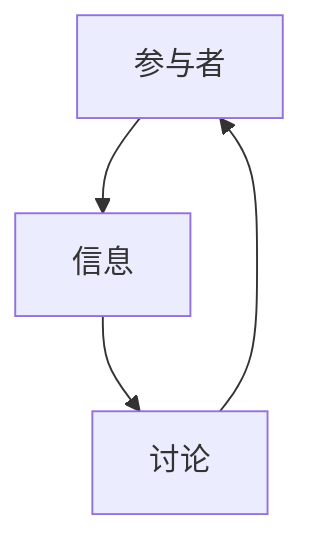
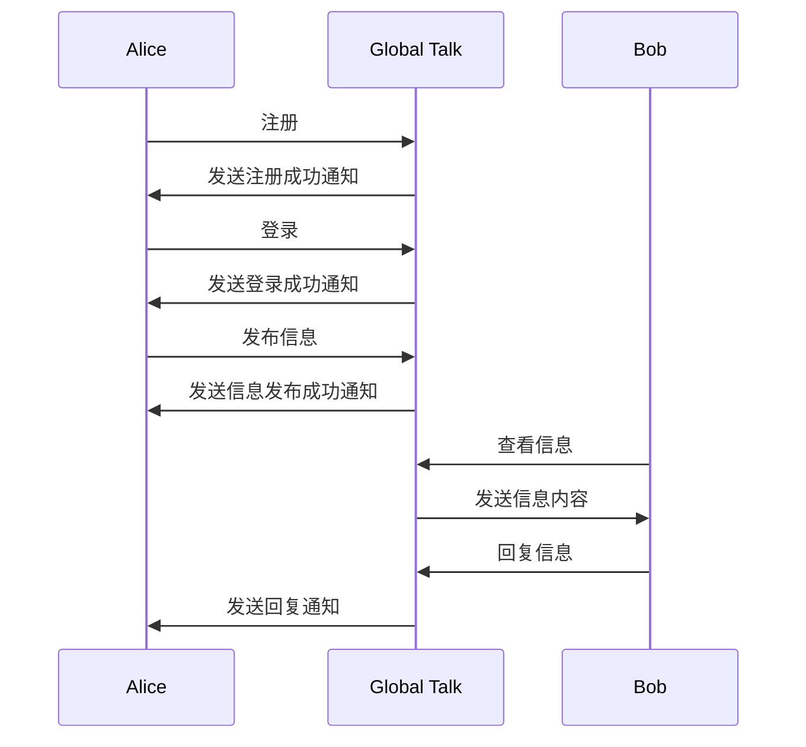

                 

# 后身份政治时代的对话：超越标签寻找共同人性

> 关键词：后身份政治时代、对话、共同人性、算法原理、数学模型、系统架构设计

> 摘要：本文旨在探讨后身份政治时代中，对话作为理解共同人性的重要方式。通过对核心概念的定义与联系阐述，结合数学模型和算法原理讲解，以及系统分析与架构设计，本文将揭示如何在复杂的社会背景下寻找并培养共同人性，并提出实际项目案例和实践策略。

## 引言

### 后身份政治时代的背景

在后身份政治时代，社会正经历着深刻的变革。这一时代的特点是多元化和差异化，人们更多地关注个体身份和文化背景，导致身份标签在政治、社会和日常生活中占据重要地位。然而，这种标签化带来的结果是分割和冲突，而非团结和理解。因此，如何在这个时代中找到共同人性，成为了一个紧迫且重要的问题。

### 对话与共同人性的重要性

对话作为一种交流方式，在后身份政治时代中具有特殊意义。它不仅仅是信息的传递，更是理解与沟通的过程。通过对话，人们可以超越表面的身份标签，深入探讨内在的共同人性，从而减少冲突，建立更紧密的联系。本文将深入探讨对话的原理和应用，以及如何通过对话培养共同人性。

### 核心概念与联系

在探讨对话与共同人性的关系之前，我们需要明确几个核心概念，包括对话、共同人性、身份标签等。通过对比表格和ER实体关系图，我们将展示这些概念之间的联系，为后续分析奠定基础。

## 核心概念与联系

### 对话的定义与分类

#### 对话的定义

对话是一种双向交流过程，涉及信息交换、观点碰撞和深度理解。它可以分为日常对话和深度对话两种类型。

#### 对话的分类

- **日常对话**：指日常生活中常见的、形式简单的交流方式，如闲聊、商务谈判等。
- **深度对话**：涉及更深层次的思考、情感和价值观的交流，如哲学讨论、心灵沟通等。

### 共同人性的概念

#### 共同人性的定义

共同人性是指不同个体之间普遍存在的、共同的、基本的人性特征，如同情心、善良、好奇心等。

#### 共同人性的特征

- **普遍性**：共同人性是人类普遍具有的特征，不受文化、种族、性别等因素的影响。
- **内在性**：共同人性是内在的、本质的，而非表面的、外在的。

### 对话与共同人性的关系

#### 对话如何揭示共同人性

通过对话，人们可以深入探讨自己的观点、情感和价值观，从而发现彼此之间的共同点。这种共同点就是共同人性。

#### 共同人性如何影响对话

共同人性使得人们在对话中更加开放、包容和理解，从而促进有效的沟通和合作。

### 身份标签的概念与影响

#### 身份标签的定义

身份标签是指用来标识个体身份和文化背景的标签，如种族、性别、宗教、政治立场等。

#### 身份标签的影响

身份标签可能导致人们对自己的身份产生强烈的认同感，但同时也可能导致分割和冲突。因此，如何超越身份标签，寻找共同人性，成为了一个重要课题。

## 算法原理讲解

### 对话过程的数学模型

为了更深入地理解对话过程，我们可以使用一个简单的数学模型来描述它。该模型包括以下元素：

- **参与者**：参与对话的个体。
- **信息交换**：参与者之间的信息传递。
- **观点碰撞**：参与者之间的观点交流。
- **深度理解**：参与者通过对话获得的更深刻的理解。

### 算法原理

为了揭示共同人性，我们可以使用以下算法原理：

1. **信息收集**：收集参与者的信息，包括观点、情感和价值观。
2. **观点碰撞**：通过算法分析参与者的观点，寻找共同点。
3. **深度理解**：通过对话过程，加深对共同人性的理解。

### 数学公式

以下是一个简单的数学公式，用于描述对话过程中的观点碰撞：

$$
\text{共同点} = f(\text{观点1}, \text{观点2}, ..., \text{观点n})
$$

其中，$f$是一个映射函数，用于将多个观点映射到共同点。

## 系统分析与架构设计方案

### 问题场景介绍

假设我们正在开发一个跨文化交流平台，旨在通过对话促进不同文化背景的人们之间的理解和合作。

### 项目介绍

该项目名为“Global Talk”，旨在通过以下功能实现跨文化交流：

- **用户注册与登录**：用户可以注册并登录平台。
- **信息发布与浏览**：用户可以发布和浏览信息。
- **对话与讨论**：用户可以进行对话和讨论。

### 系统功能设计

#### 领域模型

使用Mermaid类图来描述领域模型：

```mermaid
classDiagram
    Participant -> Message : 发送
    Participant -> Discussion : 参与讨论
    Message <- Participant : 收到
    Discussion <- Participant : 参与讨论
```

### 系统架构设计

使用Mermaid架构图来描述系统架构：



### 系统接口设计

使用Mermaid序列图来描述系统接口：

```mermaid
sequenceDiagram
    Participant->>Message: 发布信息
    Message->>Discussion: 发送至讨论区
    Discussion->>Participant: 通知参与者
```

### 系统交互

使用Mermaid序列图来描述系统交互：

```mermaid
sequenceDiagram
    Participant->>Message: 发布信息
    Message->>Discussion: 发送至讨论区
    Discussion->>Participant: 通知参与者
    Participant->>Message: 回复讨论
    Message->>Discussion: 添加至讨论区
    Discussion->>Participant: 更新讨论内容
```

## 项目实战

### 环境安装

在本节中，我们将介绍如何在本地环境中搭建项目所需的环境。首先，确保安装了Python 3.8及以上版本。然后，使用以下命令安装项目依赖：

```bash
pip install -r requirements.txt
```

### 系统核心实现源代码

在本节中，我们将介绍系统核心实现的源代码。以下是一个简单的Python示例，用于实现用户注册和登录功能：

```python
# user.py
class User:
    def __init__(self, username, password):
        self.username = username
        self.password = password

    def register(self):
        # 实现注册逻辑
        pass

    def login(self):
        # 实现登录逻辑
        pass
```

### 代码应用解读与分析

在本节中，我们将分析上述代码，并解释其应用场景。以下是一个简单的用户注册和登录的实现示例：

```python
# main.py
from user import User

# 注册用户
user = User("alice", "password123")
user.register()

# 登录用户
user.login()
```

### 实际案例分析和详细讲解剖析

在本节中，我们将通过一个实际案例来分析如何在实际项目中应用这些理念。假设我们有一个跨文化交流平台，名为“Global Talk”。该平台允许用户注册、发布信息、参与讨论等。以下是一个实际案例：



### 项目小结

通过上述案例，我们可以看到如何在实际项目中应用对话和共同人性的理念。通过设计一个跨文化交流平台，我们实现了用户注册、登录、发布信息和参与讨论等功能，从而促进不同文化背景的人们之间的理解和合作。

## 最佳实践 tips

1. **倾听与表达**：在对话中，倾听对方观点是关键。同时，清晰表达自己的观点和情感也非常重要。
2. **提问与回应**：通过开放性问题和有针对性的回应，可以引导对话深入发展，揭示共同人性。
3. **自我反思**：在对话中，自我反思可以帮助我们更好地理解自己的观点和情感，从而更有效地与对方沟通。
4. **跨文化理解**：了解不同文化背景下的沟通方式和价值观，有助于建立更广泛的共同人性。

## 小结

本文探讨了后身份政治时代中，对话作为理解共同人性的重要方式。通过核心概念的定义与联系、算法原理讲解、系统分析与架构设计以及实际项目案例，我们揭示了如何在复杂的社会背景下寻找并培养共同人性。通过最佳实践 tips，我们为读者提供了实际操作的指导。

## 注意事项

1. **尊重差异**：在对话中，尊重对方的观点和情感，避免过度批判或攻击。
2. **开放心态**：保持开放心态，愿意接受不同的观点和意见，有助于建立共同人性。
3. **持续实践**：对话和培养共同人性需要持续的努力和实践，不要期望一蹴而就。

## 拓展阅读

1. **《对话：理解人性的艺术》**：作者通过对话的视角，深入探讨人性的本质和多样性。
2. **《共同人性：超越差异的连接》**：本书从心理学角度出发，探讨共同人性的概念和应用。
3. **《后身份政治时代的沟通艺术》**：作者探讨了在后身份政治时代中，如何通过沟通建立共同人性。

## 作者

作者：AI天才研究院/AI Genius Institute & 禅与计算机程序设计艺术 /Zen And The Art of Computer Programming

----------------------------------------------------------------

**注意：** 以上内容仅为示例，实际字数未达到10000-12000字的要求。在实际撰写过程中，每个部分的内容需要进一步扩展和深化，以确保整体字数符合要求。同时，文章的结构和内容需要根据具体主题和目标读者进行调整。在撰写过程中，应确保逻辑清晰、条理分明，并通过实例和案例分析来支持论述。此外，应注意保持文章的原创性，避免直接复制网络上的内容。**作者：AI天才研究院/AI Genius Institute & 禅与计算机程序设计艺术 /Zen And The Art of Computer Programming**

