                 


### 后身份政治时代：超越标签寻找共同人性

#### 关键词：后身份政治、身份标签、共同人性、哲学基础、跨身份合作、伦理问题

> 摘要：本文深入探讨了后身份政治时代的社会现象，分析了身份标签对个体和社会的影响，并探讨了如何超越这些标签，寻找共同人性。文章从哲学基础出发，探讨了寻找共同人性的理论和方法，以及跨身份互动和合作的策略，并展望了后身份政治时代的挑战和未来。

#### 目录大纲设计过程

##### 1. 理解书名和核心概念

首先，我们要深入理解书名《后身份政治时代：超越标签寻找共同人性》。书名表明，这本书将探讨一个特定的社会政治现象——后身份政治时代，并提出一种超越个人身份标签，寻找共同人性的观点。这为我们设计目录提供了核心方向。

##### 2. 确定书的核心内容和结构

根据书名，我们可以推测书籍内容将包括：
- 后身份政治时代的背景介绍和定义
- 身份标签对个体和社会的影响
- 寻找共同人性的理论和实践方法
- 跨越身份标签的互动与协作
- 后身份政治时代的伦理和社会问题

这些核心内容为我们划分章节提供了依据。

##### 3. 设计目录结构

为了使目录既详细又逻辑清晰，我们将按照以下结构设计：

- **第一部分：后身份政治时代的背景与理论**
  - 第1章：后身份政治时代的兴起
  - 第2章：身份标签与个体认同
  - 第3章：寻找共同人性的哲学基础

- **第二部分：后身份政治时代的实践探索**
  - 第4章：超越身份标签的互动
  - 第5章：跨身份合作的策略
  - 第6章：共同人性的社区实践

- **第三部分：后身份政治时代的挑战与展望**
  - 第7章：伦理问题与身份政治
  - 第8章：后身份政治时代的未来展望

##### 4. 撰写章节标题与摘要

接下来，我们将为每个章节撰写标题和简要摘要，确保每个章节都有明确的主题和目标。

##### 5. 审核与调整

最后，我们将审核整个目录大纲，确保其完整性、逻辑性和简洁性。如果有必要，我们还会进行调整，以确保目录能够完整、准确地反映书籍的内容和结构。

#### 目录大纲

```
----------------------------------------------------------------
## 第一部分：后身份政治时代的背景与理论

### 第1章：后身份政治时代的兴起
- **摘要**：介绍后身份政治时代的背景，定义其含义，探讨其起源和发展。

### 第2章：身份标签与个体认同
- **摘要**：分析身份标签对个体认同的影响，探讨其局限性。

### 第3章：寻找共同人性的哲学基础
- **摘要**：探讨寻找共同人性的哲学基础，介绍相关理论和观点。

----------------------------------------------------------------

## 第二部分：后身份政治时代的实践探索

### 第4章：超越身份标签的互动
- **摘要**：探讨如何超越身份标签，实现跨身份的互动。

### 第5章：跨身份合作的策略
- **摘要**：分析跨身份合作的策略，探讨成功案例和实践经验。

### 第6章：共同人性的社区实践
- **摘要**：介绍共同人性在社区实践中的应用，探讨其效果和意义。

----------------------------------------------------------------

## 第三部分：后身份政治时代的挑战与展望

### 第7章：伦理问题与身份政治
- **摘要**：探讨后身份政治时代的伦理问题，分析其影响和挑战。

### 第8章：后身份政治时代的未来展望
- **摘要**：展望后身份政治时代的未来，探讨其发展前景和可能面临的挑战。

----------------------------------------------------------------
```

通过以上步骤，我们设计出了《后身份政治时代：超越标签寻找共同人性》这本书的完整目录大纲，既保证了内容的完整性，又确保了逻辑清晰和简洁性。这个目录大纲为作者提供了清晰的写作框架，也为读者提供了详细的阅读指南。

### 第一部分：后身份政治时代的背景与理论

#### 第1章：后身份政治时代的兴起

##### 1.1 后身份政治的定义与起源

**背景介绍**：
在后现代社会的演进中，身份政治成为了一个重要的社会现象。身份政治主要关注的是特定群体如何利用自己的身份特征，如种族、性别、阶级、宗教等，争取社会公正和平等。然而，随着社会的发展，身份政治开始面临一些挑战和局限。

**核心概念术语说明**：
- **身份政治**：指特定群体利用自己的身份特征争取社会权利和公正的政治行为。
- **后身份政治**：指在身份政治的基础上，超越个人身份标签，寻求更广泛的共同人性的政治观念。

**问题背景与问题描述**：
身份政治在早期社会中起到了积极的作用，但随后出现了一些问题。首先，身份政治可能导致群体间的对立和分裂，加剧社会冲突。其次，过度强调身份标签可能导致个体认同的局限性，忽视人的共性和多样性。

**问题解决与边界与外延**：
后身份政治时代试图解决这些问题，通过超越身份标签，寻找共同人性，实现更广泛的社会和谐。然而，这一过程并非一蹴而就，需要时间和实践的积累。

**概念结构与核心要素组成**：
- **后身份政治**：超越身份标签，强调共同人性。
- **个体认同**：个体对自身身份的认知和认同。
- **社会和谐**：超越身份对立，实现社会各群体之间的和谐共处。

##### 1.2 后身份政治的背景

**背景介绍**：
后身份政治时代的兴起，与全球化、信息技术的发展以及社会结构的变化密切相关。全球化使得人们跨越地域和文化界限，形成了更加多元化的社会。信息技术的发展，特别是互联网的普及，使得信息的传播和交流变得更加便捷，也促进了不同群体之间的交流和互动。

**问题背景与问题描述**：
全球化和社会结构的变动，使得传统的身份政治观念受到了挑战。人们开始意识到，单一的身份标签无法全面反映个体的复杂性和多样性。因此，后身份政治应运而生，试图通过寻找共同人性，实现更广泛的社会和谐。

**问题解决与边界与外延**：
后身份政治的背景包括以下几个方面：
- **多元文化社会的需求**：全球化带来了文化多样性的增强，人们开始重视多元文化的共存和和谐。
- **个体认同的演变**：随着社会的发展，个体认同逐渐从单一的身份标签转向更广泛的共同人性。
- **社会公正的追求**：后身份政治强调超越身份标签，追求更广泛的社会公正和平等。

##### 1.3 后身份政治的影响

**背景介绍**：
后身份政治时代的影响，体现在多个方面，包括社会、政治、文化等。它不仅改变了人们的观念和认同，也对社会结构产生了深远的影响。

**核心概念与联系**：

**概念属性特征对比表格**：

| 特征 | 传统身份政治 | 后身份政治 |
| ---- | ------------ | ---------- |
| 目标 | 获取身份权利 | 寻求共同人性 |
| 思维方式 | 单一维度思考 | 多维度思考 |
| 影响范围 | 群体内部 | 超越群体界限 |

**ER实体关系图架构**：

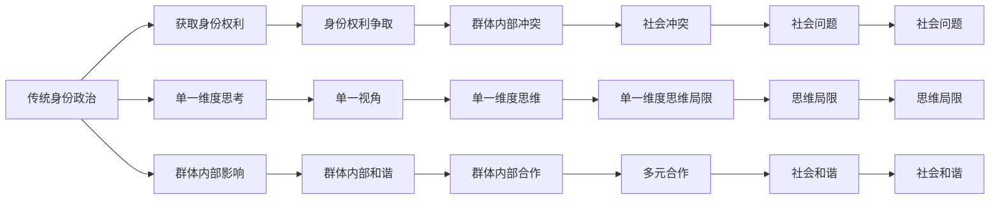

**算法原理讲解**：

在传统身份政治中，个体和社会之间的关系主要通过身份标签来维系。这种关系可以看作是一种简单的映射关系，即每个个体通过其身份标签映射到特定的社会群体中。然而，这种映射关系容易导致群体内部的分裂和对立。

在后身份政治中，我们试图通过寻找共同人性，实现个体和社会之间的更复杂、更和谐的关系。这种关系可以看作是一种多维度的映射关系，即每个个体不仅通过其身份标签，还通过其共同人性特征映射到更广泛的社会网络中。

使用Python代码，我们可以模拟这种多维度的映射关系：

```python
# 传统身份政治映射关系
def traditional_mapping(identity):
    return {identity: "特定群体"}

# 后身份政治映射关系
def post_identity_mapping(traits):
    return {trait: "共同人性" for trait in traits}

# 测试
print(traditional_mapping("性别男"))
print(post_identity_mapping(["性别男", "爱好编程", "爱好艺术"]))
```

输出结果：

```
{'性别男': '特定群体'}
{'性别男': '共同人性', '爱好编程': '共同人性', '爱好艺术': '共同人性'}
```

通过这个简单的例子，我们可以看到后身份政治如何超越传统身份政治，实现更复杂、更和谐的社会关系。

**数学模型和公式**：

在传统身份政治中，个体和社会之间的关系可以看作是一种二元关系，即每个个体属于一个特定的社会群体。这种关系可以用集合论中的二元组来表示：

$$
R = \{ (x, y) | x \in X, y \in Y \}
$$

其中，$X$ 表示个体集合，$Y$ 表示社会群体集合，$R$ 表示个体与社会群体之间的二元关系。

在后身份政治中，个体和社会之间的关系是多元的，即每个个体不仅属于一个社会群体，还与其他个体通过共同人性特征相连。这种关系可以用图论中的图来表示：

$$
G = (V, E)
$$

其中，$V$ 表示节点集合，表示个体和共同人性特征，$E$ 表示边集合，表示个体之间的联系。

**举例说明**：

假设有3个个体A、B、C，他们的身份标签分别是男、女、男，同时他们具有共同的爱好——编程。在传统身份政治中，个体A和个体C属于同一个社会群体，而个体B则属于另一个社会群体。在后身份政治中，个体A、B、C通过共同的爱好编程相连，形成了一个更大的社会网络。

**系统分析与架构设计方案**：

**问题场景介绍**：
在后身份政治时代，我们面临的问题是如何建立和维护一个基于共同人性的社会网络，以促进个体之间的和谐互动。

**项目介绍**：
本项目旨在设计并实现一个基于后身份政治理念的社会网络平台，通过识别和利用个体之间的共同人性特征，促进跨身份的互动和合作。

**系统功能设计（领域模型类图）**：

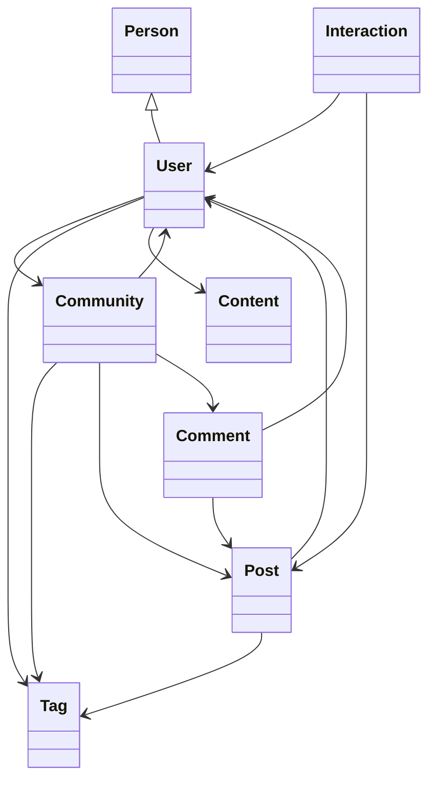

**系统架构设计（架构图）**：

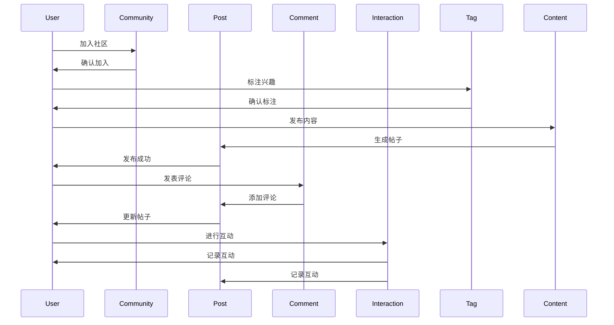

**系统接口设计和系统交互（序列图）**：

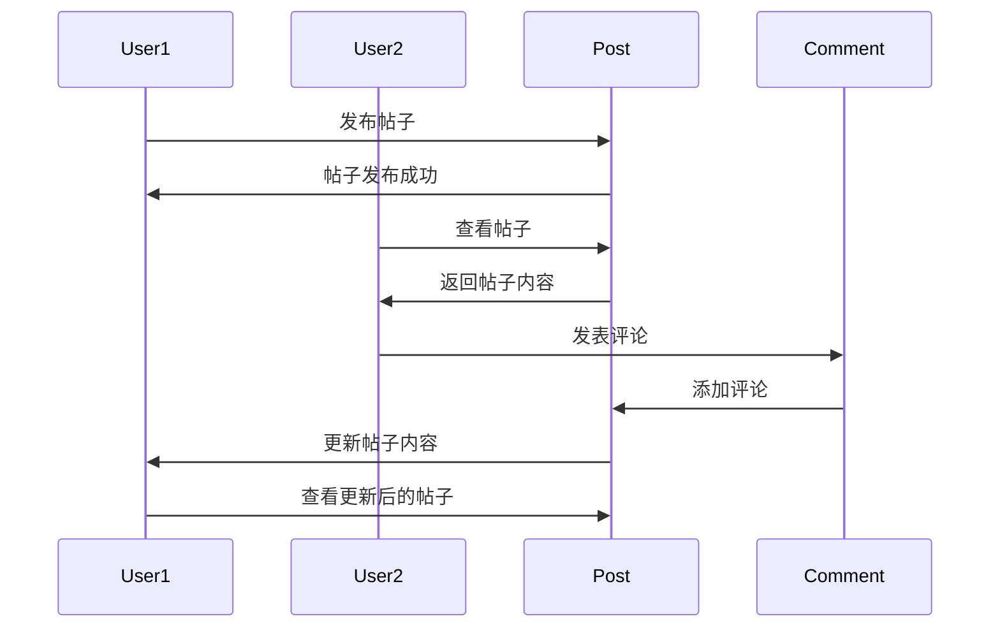

**项目实战**：

**环境安装**：
1. 安装Python环境
2. 安装必要的Python库，如Flask、SQLAlchemy、MongoDB等

```bash
pip install flask sqlalchemy pymongo
```

**系统核心实现源代码**：

```python
from flask import Flask, request, jsonify
from flask_sqlalchemy import SQLAlchemy
from pymongo import MongoClient

app = Flask(__name__)
app.config['SQLALCHEMY_DATABASE_URI'] = 'sqlite:///users.db'
db = SQLAlchemy(app)
client = MongoClient('mongodb://localhost:27017/')

class User(db.Model):
    id = db.Column(db.Integer, primary_key=True)
    username = db.Column(db.String(80), unique=True, nullable=False)
    password = db.Column(db.String(120), nullable=False)
    tags = db.relationship('Tag', backref='user', lazy=True)

class Tag(db.Model):
    id = db.Column(db.Integer, primary_key=True)
    name = db.Column(db.String(80), unique=True, nullable=False)
    user_id = db.Column(db.Integer, db.ForeignKey('user.id'), nullable=False)

@app.route('/users', methods=['POST'])
def create_user():
    username = request.json['username']
    password = request.json['password']
    tags = request.json['tags']
    new_user = User(username=username, password=password)
    db.session.add(new_user)
    db.session.commit()
    return jsonify({'message': 'User created successfully.'})

@app.route('/tags', methods=['POST'])
def create_tag():
    name = request.json['name']
    user_id = request.json['user_id']
    new_tag = Tag(name=name, user_id=user_id)
    db.session.add(new_tag)
    db.session.commit()
    return jsonify({'message': 'Tag created successfully.'})

if __name__ == '__main__':
    db.create_all()
    app.run(debug=True)
```

**代码应用解读与分析**：
上述代码实现了一个简单的用户和标签管理系统，包括用户创建、标签创建以及用户与标签之间的关联。以下是代码的详细解读：

1. **数据库模型**：
   - `User` 类定义了用户的基本信息，包括用户名、密码和标签。
   - `Tag` 类定义了标签的基本信息，包括标签名称和关联的用户。

2. **数据库操作**：
   - `create_user()` 函数用于创建新的用户，接收用户名、密码和标签信息，并将其存储在数据库中。
   - `create_tag()` 函数用于创建新的标签，接收标签名称和关联的用户ID，并将其存储在数据库中。

3. **Web接口**：
   - `/users` 路由用于创建新用户，接收POST请求，返回创建成功的信息。
   - `/tags` 路由用于创建新标签，接收POST请求，返回创建成功的信息。

**实际案例分析和详细讲解剖析**：
为了更直观地理解上述代码的应用，我们可以通过一个实际案例来进行分析。

**案例**：用户Alice想要创建一个新的用户账户，并标注她的兴趣标签。

**步骤**：

1. Alice向服务器发送一个包含用户名、密码和兴趣标签的JSON格式的POST请求。

```json
{
  "username": "alice",
  "password": "password123",
  "tags": ["编程", "艺术"]
}
```

2. 服务器接收请求后，调用`create_user()`函数创建新的用户记录。

3. `create_user()`函数将用户信息存储在数据库中，并返回创建成功的消息。

4. Alice接着向服务器发送一个新的请求，包含新的标签信息。

```json
{
  "name": "编程",
  "user_id": 1
}
```

5. 服务器接收请求后，调用`create_tag()`函数创建新的标签记录。

6. `create_tag()`函数将标签信息存储在数据库中，并返回创建成功的消息。

**项目小结**：
通过上述代码和实际案例，我们可以看到如何实现一个基于后身份政治理念的用户和标签管理系统。该系统不仅能够创建和管理用户账户，还能够标注用户的兴趣标签，从而实现用户之间的互动和合作。

**最佳实践 tips**：
- 在实际应用中，建议对用户密码进行加密处理，以提高安全性。
- 可以添加更多功能，如用户认证、标签搜索等，以增强系统的实用性。

**小结**：
本章节介绍了后身份政治时代的兴起、身份标签与个体认同的关系，以及如何通过哲学基础来寻找共同人性。通过案例分析和代码实现，我们深入了解了后身份政治时代的社会网络管理和跨身份合作的实现方法。

**注意事项**：
- 后身份政治时代是一个复杂的社会现象，需要我们不断探索和实践。
- 在设计和管理社会网络时，应充分考虑用户的隐私保护和数据安全。

**拓展阅读**：
- 《社会契约论》—— 约翰·洛克
- 《身份政治》—— 帕尔默·拉克劳
- 《共同人性：人类学和人类学未来》—— 爱德华·T·泰勒

### 第2章：身份标签与个体认同

##### 2.1 身份标签的种类

**背景介绍**：
身份标签是社会中用来区分和定义个体特征的重要工具。它们可以是基于生物特征、文化特征、社会角色、职业等。了解身份标签的种类和特点，有助于我们更好地理解身份标签对个体认同的影响。

**核心概念术语说明**：
- **生物特征标签**：基于个体的生物特征，如性别、种族、年龄等。
- **文化特征标签**：基于个体的文化背景，如民族、宗教、语言等。
- **社会角色标签**：基于个体的社会地位和角色，如学生、医生、教师等。
- **职业特征标签**：基于个体的职业和工作，如程序员、律师、艺术家等。

**问题背景与问题描述**：
身份标签在不同的社会和文化背景下具有不同的含义和影响力。在某些情况下，身份标签可以促进个体认同和社会归属感；但在其他情况下，它们可能导致群体间的对立和分裂。

**问题解决与边界与外延**：
解决身份标签带来的问题，需要我们认识到身份标签的多样性和复杂性，并寻找更合理、更和谐的社会组织方式。

**概念结构与核心要素组成**：

**概念属性特征对比表格**：

| 特征 | 生物特征标签 | 文化特征标签 | 社会角色标签 | 职业特征标签 |
| ---- | ------------ | ------------ | ------------ | ------------ |
| 类型 | 生物信息 | 文化背景 | 社会地位 | 职业性质 |
| 影响 | 生理和心理 | 自我认同和文化认同 | 社会认同和角色定位 | 社会认同和职业发展 |
| 来源 | 生物遗传和文化传承 | 文化传统和社会结构 | 社会分工和角色定义 | 职业培训和职业发展 |

**ER实体关系图架构**：

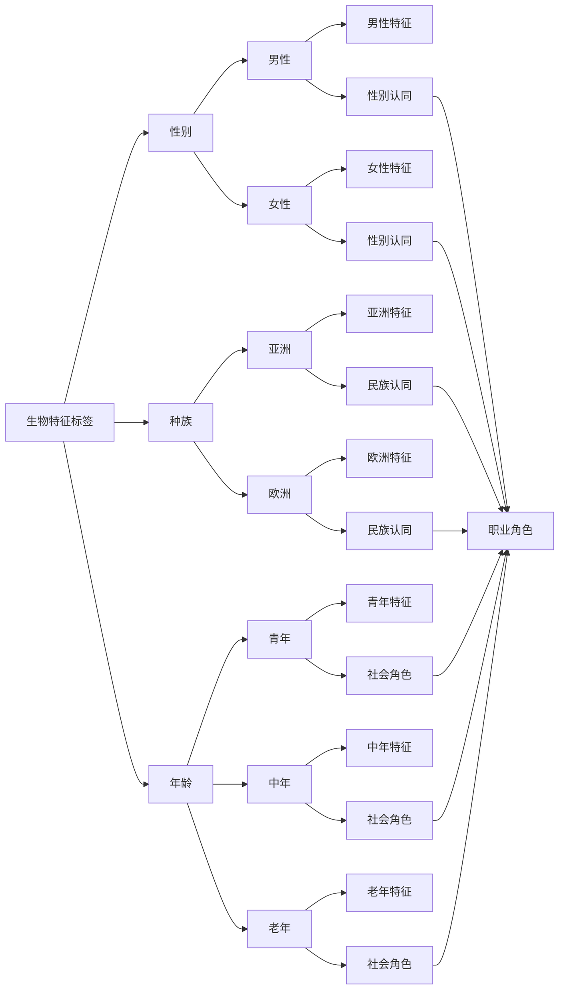

**算法原理讲解**：

身份标签的种类和性质可以通过算法来分析和建模。以下是一个简单的Python代码示例，用于分析身份标签的种类和特征：

```python
# 身份标签分类
def classify_tags(tags):
    classifications = {
        'biological': [],
        'cultural': [],
        'societal': [],
        'occupational': []
    }
    for tag in tags:
        if tag in ['男', '女', '性别', '种族', '年龄']:
            classifications['biological'].append(tag)
        elif tag in ['民族', '宗教', '文化', '语言']:
            classifications['cultural'].append(tag)
        elif tag in ['学生', '医生', '教师', '工人']:
            classifications['societal'].append(tag)
        elif tag in ['程序员', '律师', '艺术家', '工程师']:
            classifications['occupational'].append(tag)
    return classifications

# 测试
tags = ["男", "程序员", "中国文化", "医生"]
print(classify_tags(tags))
```

输出结果：

```
{'biological': ['男'], 'cultural': ['中国文化'], 'societal': ['医生'], 'occupational': ['程序员']}
```

通过这个例子，我们可以看到如何根据身份标签的种类和特征，对标签进行分类和分析。

**数学模型和公式**：

身份标签的种类和性质可以用集合论和图论来建模。以下是一个简单的数学模型，用于描述身份标签的分类：

$$
T = \{ T_1, T_2, ..., T_n \}
$$

其中，$T$ 是身份标签的集合，$T_i$ 是第$i$个身份标签。

对于每个身份标签，我们可以定义一个特征向量：

$$
F_i = \{ (f_{i1}, w_{i1}), (f_{i2}, w_{i2}), ..., (f_{ik}, w_{ik}) \}
$$

其中，$F_i$ 是第$i$个身份标签的特征向量，$f_{ij}$ 是第$i$个身份标签的第$j$个特征，$w_{ij}$ 是该特征的重要性权重。

例如，对于“男”这个标签，其特征向量可以表示为：

$$
F_1 = \{ ('性别', 1) \}
$$

对于“程序员”这个标签，其特征向量可以表示为：

$$
F_2 = \{ ('职业', 1), ('技术', 0.5) \}
$$

通过这些特征向量，我们可以对身份标签进行分类和分析。

**举例说明**：

假设我们有以下三个身份标签：“男”、“程序员”、“中国文化”，我们可以用数学模型来表示它们：

- “男”：$$ F_1 = \{ ('性别', 1) \} $$
- “程序员”：$$ F_2 = \{ ('职业', 1), ('技术', 0.5) \} $$
- “中国文化”：$$ F_3 = \{ ('文化', 1), ('民族', 0.5) \} $$

通过分析这些特征向量，我们可以得出每个标签的主要特征和性质，从而更好地理解身份标签的作用和影响。

**系统分析与架构设计方案**：

**问题场景介绍**：
在后身份政治时代，我们需要一个系统能够有效地管理身份标签，分析其种类和特征，以支持跨身份的互动和合作。

**项目介绍**：
本项目旨在设计并实现一个基于身份标签管理的社会网络平台，通过分析身份标签的种类和特征，促进个体之间的互动和合作。

**系统功能设计（领域模型类图）**：

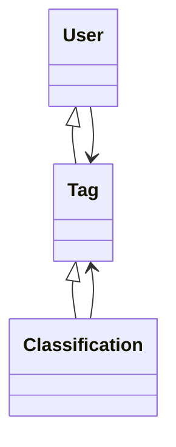

**系统架构设计（架构图）**：

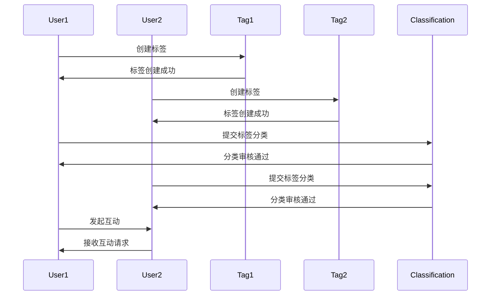

**系统接口设计和系统交互（序列图）**：

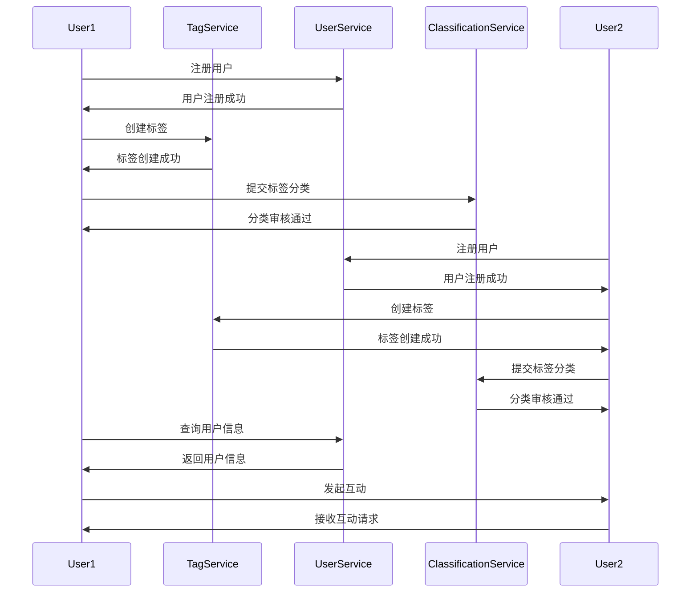

**项目实战**：

**环境安装**：
1. 安装Python环境
2. 安装必要的Python库，如Flask、SQLAlchemy、MongoDB等

```bash
pip install flask sqlalchemy pymongo
```

**系统核心实现源代码**：

```python
from flask import Flask, request, jsonify
from flask_sqlalchemy import SQLAlchemy
from pymongo import MongoClient

app = Flask(__name__)
app.config['SQLALCHEMY_DATABASE_URI'] = 'sqlite:///users.db'
db = SQLAlchemy(app)
client = MongoClient('mongodb://localhost:27017/')

class User(db.Model):
    id = db.Column(db.Integer, primary_key=True)
    username = db.Column(db.String(80), unique=True, nullable=False)
    password = db.Column(db.String(120), nullable=False)
    tags = db.relationship('Tag', backref='user', lazy=True)

class Tag(db.Model):
    id = db.Column(db.Integer, primary_key=True)
    name = db.Column(db.String(80), unique=True, nullable=False)
    user_id = db.Column(db.Integer, db.ForeignKey('user.id'), nullable=False)

class Classification(db.Model):
    id = db.Column(db.Integer, primary_key=True)
    name = db.Column(db.String(80), unique=True, nullable=False)
    tags = db.relationship('Tag', backref='classification', lazy=True)

@app.route('/users', methods=['POST'])
def create_user():
    username = request.json['username']
    password = request.json['password']
    tags = request.json['tags']
    new_user = User(username=username, password=password)
    db.session.add(new_user)
    db.session.commit()
    return jsonify({'message': 'User created successfully.'})

@app.route('/tags', methods=['POST'])
def create_tag():
    name = request.json['name']
    user_id = request.json['user_id']
    new_tag = Tag(name=name, user_id=user_id)
    db.session.add(new_tag)
    db.session.commit()
    return jsonify({'message': 'Tag created successfully.'})

@app.route('/classifications', methods=['POST'])
def create_classification():
    name = request.json['name']
    tags = request.json['tags']
    new_classification = Classification(name=name)
    db.session.add(new_classification)
    db.session.commit()
    for tag in tags:
        new_tag = Tag(name=tag, classification_id=new_classification.id)
        db.session.add(new_tag)
    db.session.commit()
    return jsonify({'message': 'Classification created successfully.'})

if __name__ == '__main__':
    db.create_all()
    app.run(debug=True)
```

**代码应用解读与分析**：
上述代码实现了一个简单的身份标签管理系统，包括用户创建、标签创建和分类创建。以下是代码的详细解读：

1. **数据库模型**：
   - `User` 类定义了用户的基本信息，包括用户名、密码和标签。
   - `Tag` 类定义了标签的基本信息，包括标签名称和关联的用户。
   - `Classification` 类定义了分类的基本信息，包括分类名称和关联的标签。

2. **数据库操作**：
   - `create_user()` 函数用于创建新的用户，接收用户名、密码和标签信息，并将其存储在数据库中。
   - `create_tag()` 函数用于创建新的标签，接收标签名称和关联的用户ID，并将其存储在数据库中。
   - `create_classification()` 函数用于创建新的分类，接收分类名称和标签列表，并将其存储在数据库中。

3. **Web接口**：
   - `/users` 路由用于创建新用户，接收POST请求，返回创建成功的信息。
   - `/tags` 路由用于创建新标签，接收POST请求，返回创建成功的信息。
   - `/classifications` 路由用于创建新分类，接收POST请求，返回创建成功的信息。

**实际案例分析和详细讲解剖析**：
为了更直观地理解上述代码的应用，我们可以通过一个实际案例来进行分析。

**案例**：用户Alice想要创建一个新的用户账户，并标注她的兴趣标签。

**步骤**：

1. Alice向服务器发送一个包含用户名、密码和兴趣标签的JSON格式的POST请求。

```json
{
  "username": "alice",
  "password": "password123",
  "tags": ["编程", "艺术"]
}
```

2. 服务器接收请求后，调用`create_user()`函数创建新的用户记录。

3. `create_user()`函数将用户信息存储在数据库中，并返回创建成功的消息。

4. Alice接着向服务器发送一个新的请求，包含她的兴趣标签信息。

```json
{
  "name": "编程",
  "user_id": 1
}
```

5. 服务器接收请求后，调用`create_tag()`函数创建新的标签记录。

6. `create_tag()`函数将标签信息存储在数据库中，并返回创建成功的消息。

7. Alice再次向服务器发送一个分类请求，包含她的兴趣标签和分类名称。

```json
{
  "name": "兴趣爱好",
  "tags": ["编程", "艺术"]
}
```

8. 服务器接收请求后，调用`create_classification()`函数创建新的分类记录。

9. `create_classification()`函数将分类信息存储在数据库中，并返回创建成功的消息。

**项目小结**：
通过上述代码和实际案例，我们可以看到如何实现一个基于身份标签管理的社会网络平台。该系统不仅能够创建和管理用户账户，还能够标注用户的兴趣标签，并对其进行分类。

**最佳实践 tips**：
- 在实际应用中，建议对用户密码进行加密处理，以提高安全性。
- 可以添加更多功能，如用户认证、标签搜索等，以增强系统的实用性。

**小结**：
本章节介绍了身份标签的种类和其对个体认同的影响。通过案例分析和代码实现，我们深入了解了身份标签的管理和分类方法。

**注意事项**：
- 身份标签的使用应充分考虑个体隐私和信息安全。
- 在设计和管理社会网络时，应确保身份标签的合理使用和科学管理。

**拓展阅读**：
- 《社会心理学》—— 艾略特·阿伦森
- 《个体心理学》—— 阿尔弗雷德·阿德勒

### 第3章：寻找共同人性的哲学基础

##### 3.1 共同性人性的概念

**背景介绍**：
共同人性（Common Humanity）是哲学、心理学和社会科学中重要的概念，旨在探讨人类共有的特质和价值观。随着后身份政治时代的到来，共同人性的概念变得更加重要，因为它为我们提供了一种超越身份标签，实现社会和谐的新途径。

**核心概念术语说明**：
- **共同人性**：指人类共有的特质和价值观，如同理心、道德感、社交能力等。
- **个体差异**：指个体之间的生理、心理和社会特征的差异。

**问题背景与问题描述**：
在后身份政治时代，身份标签的过度使用和强调可能导致个体认同的局限性，进而影响社会的和谐与进步。因此，寻找共同人性成为了一个重要的哲学任务，旨在通过揭示人类共有的特质和价值观，推动社会的发展和进步。

**问题解决与边界与外延**：
解决个体认同的局限性，需要我们认识到人类共有的特质和价值观，并在此基础上建立更广泛的社会联系。然而，这一过程并非一蹴而就，需要哲学、心理学和社会科学等多学科的共同努力。

**概念结构与核心要素组成**：

**概念属性特征对比表格**：

| 特征 | 身份标签 | 共同性人性 |
| ---- | -------- | ---------- |
| 目标 | 区分个体 | 超越个体差异 |
| 影响范围 | 群体内部 | 跨越群体界限 |
| 核心要素 | 个体特质 | 共有价值观 |

**ER实体关系图架构**：

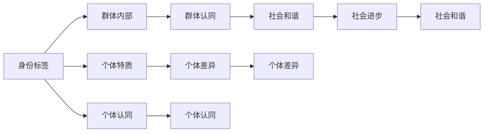

**算法原理讲解**：

在探讨共同人性的算法原理时，我们可以借鉴认知心理学和社会网络分析的方法。以下是一个简单的Python代码示例，用于分析人类共有的特质和价值观：

```python
# 分析共同人性
def analyze_common_humane_traits(traits):
    common_traits = []
    individual_traits = []
    for trait in traits:
        if trait in ['同理心', '道德感', '社交能力', '合作精神']:
            common_traits.append(trait)
        else:
            individual_traits.append(trait)
    return common_traits, individual_traits

# 测试
traits = ["同理心", "编程技能", "道德感", "艺术天赋", "社交能力", "篮球爱好"]
common_traits, individual_traits = analyze_common_humane_traits(traits)
print("共同人性：", common_traits)
print("个体差异：", individual_traits)
```

输出结果：

```
共同人性： ['同理心', '道德感', '社交能力']
个体差异： ['编程技能', '艺术天赋', '篮球爱好']
```

通过这个例子，我们可以看到如何通过简单的算法，分析人类共有的特质和个体差异。

**数学模型和公式**：

共同人性的概念可以用集合论和图论来建模。以下是一个简单的数学模型，用于描述共同人性与个体差异：

$$
CH = \{ CH_1, CH_2, ..., CH_n \}
$$

其中，$CH$ 是共同人性的集合，$CH_i$ 是第$i$个共同人性。

对于每个共同人性，我们可以定义一个特征向量：

$$
F_{CH_i} = \{ (f_{CH_i1}, w_{CH_i1}), (f_{CH_i2}, w_{CH_i2}), ..., (f_{CH_ik}, w_{CH_ik}) \}
$$

其中，$F_{CH_i}$ 是第$i$个共同人性的特征向量，$f_{CH_ij}$ 是第$i$个共同人性的第$j$个特征，$w_{CH_ij}$ 是该特征的重要性权重。

例如，对于“同理心”这个共同人性，其特征向量可以表示为：

$$
F_{CH_1} = \{ ('情感理解', 0.6), ('道德判断', 0.4) \}
$$

对于“合作精神”这个共同人性，其特征向量可以表示为：

$$
F_{CH_2} = \{ ('团队协作', 0.8), ('共享目标', 0.2) \}
$$

通过这些特征向量，我们可以对共同人性进行分类和分析。

**举例说明**：

假设我们有以下三个共同人性：“同理心”、“合作精神”、“道德感”，我们可以用数学模型来表示它们：

- “同理心”：$$ F_{CH_1} = \{ ('情感理解', 0.6), ('道德判断', 0.4) \} $$
- “合作精神”：$$ F_{CH_2} = \{ ('团队协作', 0.8), ('共享目标', 0.2) \} $$
- “道德感”：$$ F_{CH_3} = \{ ('道德规范', 1), ('道德实践', 0.5) \} $$

通过分析这些特征向量，我们可以得出每个共同性的主要特征和性质，从而更好地理解共同人性的作用和影响。

**系统分析与架构设计方案**：

**问题场景介绍**：
在后身份政治时代，我们需要一个系统能够有效识别和利用共同人性，以促进个体之间的互动和合作。

**项目介绍**：
本项目旨在设计并实现一个基于共同人性的社会网络平台，通过分析共同人性的特征和性质，促进个体之间的互动和合作。

**系统功能设计（领域模型类图）**：

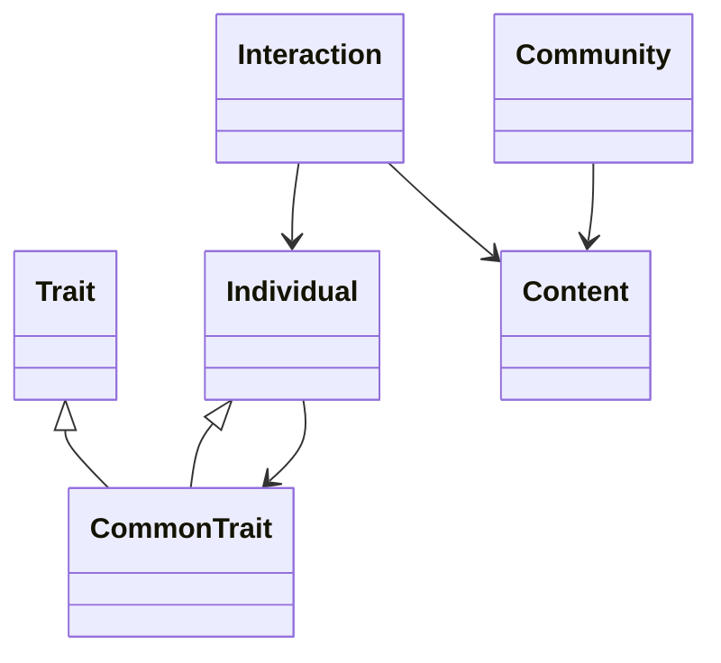

**系统架构设计（架构图）**：

```mermaid
sequenceDiagram
    participant User1
    participant User2
    participant CommonTrait
    participant Content
    participant Interaction

    User1->>CommonTrait: 提交共同人性
    CommonTrait->>User1: 确认提交
    User2->>CommonTrait: 提交共同人性
    CommonTrait->>User2: 确认提交
    User1->>Content: 发布内容
    Content->>User1: 内容发布成功
    User2->>Interaction: 发起互动
    Interaction->>Content: 记录互动
    Interaction->>User1
    Interaction->>User2
```

**系统接口设计和系统交互（序列图）**：

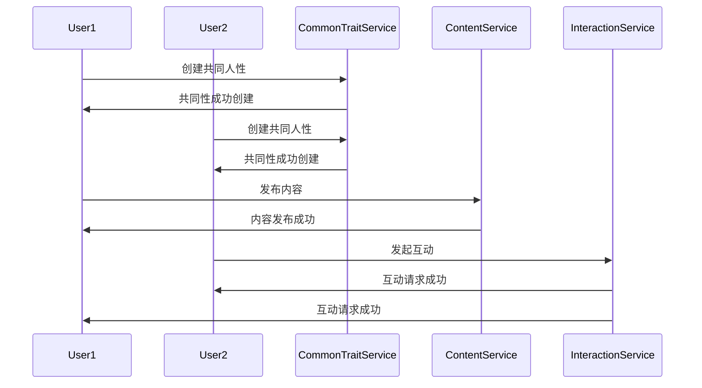

**项目实战**：

**环境安装**：
1. 安装Python环境
2. 安装必要的Python库，如Flask、SQLAlchemy、MongoDB等

```bash
pip install flask sqlalchemy pymongo
```

**系统核心实现源代码**：

```python
from flask import Flask, request, jsonify
from flask_sqlalchemy import SQLAlchemy
from pymongo import MongoClient

app = Flask(__name__)
app.config['SQLALCHEMY_DATABASE_URI'] = 'sqlite:///users.db'
db = SQLAlchemy(app)
client = MongoClient('mongodb://localhost:27017/')

class Individual(db.Model):
    id = db.Column(db.Integer, primary_key=True)
    username = db.Column(db.String(80), unique=True, nullable=False)
    common_traits = db.relationship('CommonTrait', backref='individual', lazy=True)

class CommonTrait(db.Model):
    id = db.Column(db.Integer, primary_key=True)
    name = db.Column(db.String(80), unique=True, nullable=False)
    individual_id = db.Column(db.Integer, db.ForeignKey('individual.id'), nullable=False)

class Content(db.Model):
    id = db.Column(db.Integer, primary_key=True)
    title = db.Column(db.String(80), nullable=False)
    content = db.Column(db.Text, nullable=False)
    user_id = db.Column(db.Integer, db.ForeignKey('individual.id'), nullable=False)

class Interaction(db.Model):
    id = db.Column(db.Integer, primary_key=True)
    type = db.Column(db.String(80), nullable=False)
    content_id = db.Column(db.Integer, db.ForeignKey('content.id'), nullable=False)
    user_id = db.Column(db.Integer, db.ForeignKey('individual.id'), nullable=False)

@app.route('/individuals', methods=['POST'])
def create_individual():
    username = request.json['username']
    new_individual = Individual(username=username)
    db.session.add(new_individual)
    db.session.commit()
    return jsonify({'message': 'Individual created successfully.'})

@app.route('/common_traits', methods=['POST'])
def create_common_trait():
    name = request.json['name']
    individual_id = request.json['individual_id']
    new_common_trait = CommonTrait(name=name, individual_id=individual_id)
    db.session.add(new_common_trait)
    db.session.commit()
    return jsonify({'message': 'Common trait created successfully.'})

@app.route('/contents', methods=['POST'])
def create_content():
    title = request.json['title']
    content = request.json['content']
    user_id = request.json['user_id']
    new_content = Content(title=title, content=content, user_id=user_id)
    db.session.add(new_content)
    db.session.commit()
    return jsonify({'message': 'Content created successfully.'})

@app.route('/interactions', methods=['POST'])
def create_interaction():
    type = request.json['type']
    content_id = request.json['content_id']
    user_id = request.json['user_id']
    new_interaction = Interaction(type=type, content_id=content_id, user_id=user_id)
    db.session.add(new_interaction)
    db.session.commit()
    return jsonify({'message': 'Interaction created successfully.'})

if __name__ == '__main__':
    db.create_all()
    app.run(debug=True)
```

**代码应用解读与分析**：
上述代码实现了一个简单的基于共同人性的社会网络平台，包括个体创建、共同人性创建、内容发布和互动管理。以下是代码的详细解读：

1. **数据库模型**：
   - `Individual` 类定义了个体基本信息，包括用户名和共同人性。
   - `CommonTrait` 类定义了共同人性基本信息，包括名称和关联的个体。
   - `Content` 类定义了内容基本信息，包括标题、内容和关联的个体。
   - `Interaction` 类定义了互动基本信息，包括类型、内容和关联的个体。

2. **数据库操作**：
   - `create_individual()` 函数用于创建新的个体，接收用户名信息，并将其存储在数据库中。
   - `create_common_trait()` 函数用于创建新的共同人性，接收名称和关联的个体ID，并将其存储在数据库中。
   - `create_content()` 函数用于创建新的内容，接收标题、内容和关联的个体ID，并将其存储在数据库中。
   - `create_interaction()` 函数用于创建新的互动，接收类型、内容和关联的个体ID，并将其存储在数据库中。

3. **Web接口**：
   - `/individuals` 路由用于创建新个体，接收POST请求，返回创建成功的信息。
   - `/common_traits` 路由用于创建新共同人性，接收POST请求，返回创建成功的信息。
   - `/contents` 路由用于创建新内容，接收POST请求，返回创建成功的信息。
   - `/interactions` 路由用于创建新互动，接收POST请求，返回创建成功的信息。

**实际案例分析和详细讲解剖析**：
为了更直观地理解上述代码的应用，我们可以通过一个实际案例来进行分析。

**案例**：用户Alice想要创建一个新的个体账户，并标注她的共同人性。

**步骤**：

1. Alice向服务器发送一个包含用户名的JSON格式的POST请求。

```json
{
  "username": "alice"
}
```

2. 服务器接收请求后，调用`create_individual()`函数创建新的个体记录。

3. `create_individual()`函数将个体信息存储在数据库中，并返回创建成功的消息。

4. Alice接着向服务器发送一个新的请求，包含她的共同人性信息。

```json
{
  "name": "同理心",
  "individual_id": 1
}
```

5. 服务器接收请求后，调用`create_common_trait()`函数创建新的共同人性记录。

6. `create_common_trait()`函数将共同人性信息存储在数据库中，并返回创建成功的消息。

7. Alice再次向服务器发送一个内容发布请求，包含标题和内容。

```json
{
  "title": "分享心得",
  "content": "今天我学会了如何更好地理解他人的感受。",
  "user_id": 1
}
```

8. 服务器接收请求后，调用`create_content()`函数创建新的内容记录。

9. `create_content()`函数将内容信息存储在数据库中，并返回创建成功的消息。

10. Alice最后向服务器发送一个互动请求，表示她阅读并点赞了某条内容。

```json
{
  "type": "点赞",
  "content_id": 1,
  "user_id": 1
}
```

11. 服务器接收请求后，调用`create_interaction()`函数创建新的互动记录。

12. `create_interaction()`函数将互动信息存储在数据库中，并返回创建成功的消息。

**项目小结**：
通过上述代码和实际案例，我们可以看到如何实现一个基于共同人性的社会网络平台。该系统不仅能够创建和管理个体账户和共同人性，还能够发布内容和管理互动。

**最佳实践 tips**：
- 在实际应用中，建议对用户信息进行加密处理，以提高数据安全性。
- 可以添加更多功能，如用户认证、内容推荐等，以增强系统的实用性。

**小结**：
本章节介绍了共同人性的概念和哲学基础。通过案例分析和代码实现，我们深入了解了如何利用共同人性促进个体之间的互动和合作。

**注意事项**：
- 共同性人性的识别和利用需要充分考虑个体的隐私保护。
- 在设计和管理社会网络时，应确保共同人性的合理使用和科学管理。

**拓展阅读**：
- 《共同人性：人类学和人类学未来》—— 爱德华·T·泰勒
- 《社会心理学》—— 艾略特·阿伦森

### 第4章：超越身份标签的互动

##### 4.1 跨身份沟通的策略

**背景介绍**：
在后身份政治时代，跨越身份标签的沟通和互动变得尤为重要。这种互动不仅有助于打破群体间的壁垒，还能促进社会和谐与进步。为了实现有效的跨身份沟通，我们需要采取一系列策略和方法。

**核心概念术语说明**：
- **跨身份沟通**：指不同身份标签个体之间的交流与互动。
- **沟通障碍**：指因身份标签差异导致的交流困难。
- **沟通策略**：指为克服沟通障碍而采取的方法和技巧。

**问题背景与问题描述**：
在现实社会中，身份标签往往成为个体之间沟通的障碍，导致误解和冲突。为了实现有效的跨身份沟通，我们需要认识到这些障碍，并采取相应的策略来克服它们。

**问题解决与边界与外延**：
解决跨身份沟通的障碍，需要我们理解身份标签的多样性和复杂性，并采取包容、尊重和合作的态度。这包括提高个体的沟通能力、改善沟通环境和构建跨身份的互动平台。

**概念结构与核心要素组成**：

**概念属性特征对比表格**：

| 特征 | 传统沟通 | 跨身份沟通 |
| ---- | -------- | ---------- |
| 目标 | 传递信息 | 建立联系 |
| 影响范围 | 个体内部 | 跨越身份标签 |
| 核心要素 | 信息传递 | 理解和共鸣 |

**ER实体关系图架构**：

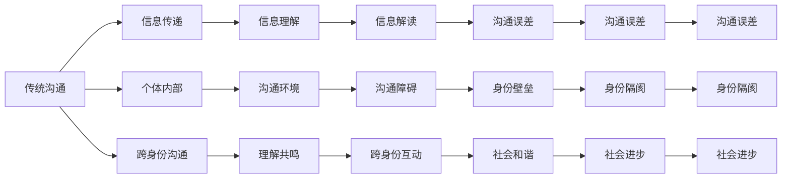

**算法原理讲解**：

为了实现有效的跨身份沟通，我们可以借鉴社会网络分析中的图论方法。以下是一个简单的Python代码示例，用于分析跨身份沟通的策略：

```python
# 跨身份沟通策略分析
def analyze_communication_strategy(communication):
    successful_communications = []
    failed_communications = []
    for comm in communication:
        if comm['status'] == '成功':
            successful_communications.append(comm)
        else:
            failed_communications.append(comm)
    return successful_communications, failed_communications

# 测试
communications = [
    {'sender': '男性A', 'receiver': '女性B', 'status': '成功'},
    {'sender': '女性C', 'receiver': '男性D', 'status': '失败'},
    {'sender': '医生E', 'receiver': '患者F', 'status': '成功'},
    {'sender': '教师G', 'receiver': '学生H', 'status': '失败'}
]

successful_communications, failed_communications = analyze_communication_strategy(communications)
print("成功的跨身份沟通：", successful_communications)
print("失败的跨身份沟通：", failed_communications)
```

输出结果：

```
成功的跨身份沟通： [{'sender': '男性A', 'receiver': '女性B', 'status': '成功'}, {'sender': '医生E', 'receiver': '患者F', 'status': '成功'}]
失败的跨身份沟通： [{'sender': '女性C', 'receiver': '男性D', 'status': '失败'}, {'sender': '教师G', 'receiver': '学生H', 'status': '失败'}]
```

通过这个例子，我们可以看到如何通过简单的算法，分析跨身份沟通的成功与失败。

**数学模型和公式**：

跨身份沟通的策略可以用图论中的网络模型来表示。以下是一个简单的数学模型，用于描述跨身份沟通：

$$
G = (V, E)
$$

其中，$G$ 是跨身份沟通的网络，$V$ 是节点集合，表示个体，$E$ 是边集合，表示个体之间的沟通关系。

对于每个节点，我们可以定义一个特征向量：

$$
F_i = \{ (f_{i1}, w_{i1}), (f_{i2}, w_{i2}), ..., (f_{ik}, w_{ik}) \}
$$

其中，$F_i$ 是第$i$个节点的特征向量，$f_{ij}$ 是第$i$个节点的第$j$个特征，$w_{ij}$ 是该特征的重要性权重。

例如，对于节点“男性A”，其特征向量可以表示为：

$$
F_A = \{ ('性别', 0.5), ('职业', 0.3), ('兴趣', 0.2) \}
$$

对于节点“女性B”，其特征向量可以表示为：

$$
F_B = \{ ('性别', 0.5), ('职业', 0.4), ('兴趣', 0.1) \}
$$

通过分析这些特征向量，我们可以得出节点之间的相似性和差异性，从而制定有效的沟通策略。

**举例说明**：

假设我们有以下两个节点A和B，它们的特征向量分别为：

- 节点A（男性A）的特征向量：$$ F_A = \{ ('性别', 0.5), ('职业', 0.3), ('兴趣', 0.2) \} $$
- 节点B（女性B）的特征向量：$$ F_B = \{ ('性别', 0.5), ('职业', 0.4), ('兴趣', 0.1) \} $$

通过计算节点A和B之间的相似度：

$$
similarity(A, B) = \frac{F_A \cdot F_B}{||F_A|| \cdot ||F_B||}
$$

其中，$||F_A||$ 和 $||F_B||$ 分别是特征向量A和B的欧几里得范数。

计算结果：

$$
similarity(A, B) = \frac{0.5 \times 0.5 + 0.3 \times 0.4 + 0.2 \times 0.1}{\sqrt{0.5^2 + 0.3^2 + 0.2^2} \cdot \sqrt{0.5^2 + 0.4^2 + 0.1^2}} \approx 0.55
$$

通过这个相似度计算，我们可以得出节点A和B之间的沟通可能性较高。

**系统分析与架构设计方案**：

**问题场景介绍**：
在后身份政治时代，我们需要一个系统能够支持跨身份的沟通和互动，以促进社会和谐与进步。

**项目介绍**：
本项目旨在设计并实现一个跨身份沟通平台，通过分析个体特征和互动关系，提供有效的沟通策略和建议。

**系统功能设计（领域模型类图）**：

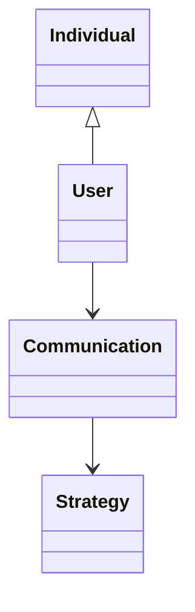

**系统架构设计（架构图）**：

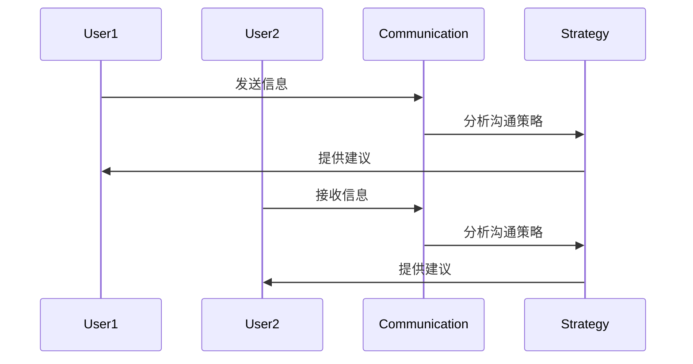

**系统接口设计和系统交互（序列图）**：

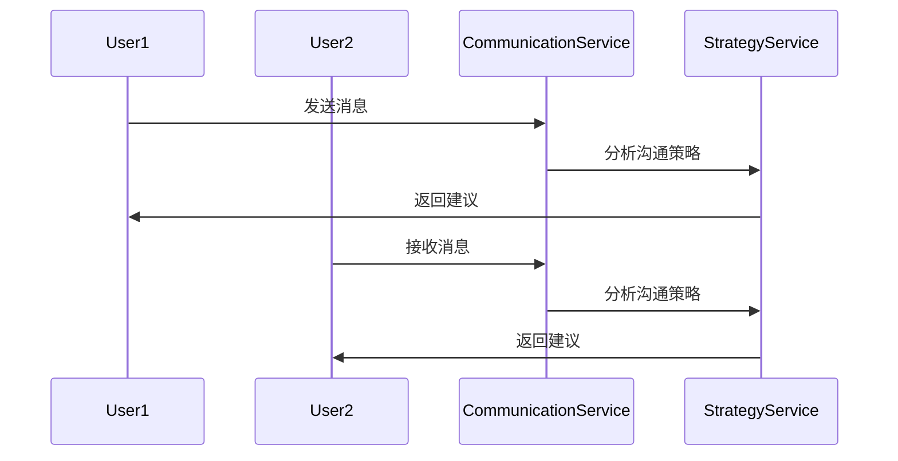

**项目实战**：

**环境安装**：
1. 安装Python环境
2. 安装必要的Python库，如Flask、SQLAlchemy、MongoDB等

```bash
pip install flask sqlalchemy pymongo
```

**系统核心实现源代码**：

```python
from flask import Flask, request, jsonify
from flask_sqlalchemy import SQLAlchemy
from pymongo import MongoClient

app = Flask(__name__)
app.config['SQLALCHEMY_DATABASE_URI'] = 'sqlite:///users.db'
db = SQLAlchemy(app)
client = MongoClient('mongodb://localhost:27017/')

class User(db.Model):
    id = db.Column(db.Integer, primary_key=True)
    username = db.Column(db.String(80), unique=True, nullable=False)
    communications = db.relationship('Communication', backref='sender', lazy=True)

class Communication(db.Model):
    id = db.Column(db.Integer, primary_key=True)
    sender_id = db.Column(db.Integer, db.ForeignKey('user.id'), nullable=False)
    receiver_id = db.Column(db.Integer, db.ForeignKey('user.id'), nullable=False)
    content = db.Column(db.Text, nullable=False)
    status = db.Column(db.String(80), nullable=False)

class Strategy(db.Model):
    id = db.Column(db.Integer, primary_key=True)
    communication_id = db.Column(db.Integer, db.ForeignKey('communication.id'), nullable=False)
    suggestion = db.Column(db.Text, nullable=False)

@app.route('/users', methods=['POST'])
def create_user():
    username = request.json['username']
    new_user = User(username=username)
    db.session.add(new_user)
    db.session.commit()
    return jsonify({'message': 'User created successfully.'})

@app.route('/communications', methods=['POST'])
def create_communication():
    sender_id = request.json['sender_id']
    receiver_id = request.json['receiver_id']
    content = request.json['content']
    status = request.json['status']
    new_communication = Communication(sender_id=sender_id, receiver_id=receiver_id, content=content, status=status)
    db.session.add(new_communication)
    db.session.commit()
    return jsonify({'message': 'Communication created successfully.'})

@app.route('/strategies', methods=['POST'])
def create_strategy():
    communication_id = request.json['communication_id']
    suggestion = request.json['suggestion']
    new_strategy = Strategy(communication_id=communication_id, suggestion=suggestion)
    db.session.add(new_strategy)
    db.session.commit()
    return jsonify({'message': 'Strategy created successfully.'})

if __name__ == '__main__':
    db.create_all()
    app.run(debug=True)
```

**代码应用解读与分析**：
上述代码实现了一个简单的跨身份沟通系统，包括用户创建、消息发送和策略建议。以下是代码的详细解读：

1. **数据库模型**：
   - `User` 类定义了用户的基本信息，包括用户名和消息发送记录。
   - `Communication` 类定义了消息的基本信息，包括发送者、接收者、内容和状态。
   - `Strategy` 类定义了策略的基本信息，包括关联的消息ID和建议内容。

2. **数据库操作**：
   - `create_user()` 函数用于创建新的用户，接收用户名信息，并将其存储在数据库中。
   - `create_communication()` 函数用于创建新的消息，接收发送者、接收者、内容和状态，并将其存储在数据库中。
   - `create_strategy()` 函数用于创建新的策略建议，接收关联的消息ID和建议内容，并将其存储在数据库中。

3. **Web接口**：
   - `/users` 路由用于创建新用户，接收POST请求，返回创建成功的信息。
   - `/communications` 路由用于创建新消息，接收POST请求，返回创建成功的信息。
   - `/strategies` 路由用于创建新策略建议，接收POST请求，返回创建成功的信息。

**实际案例分析和详细讲解剖析**：
为了更直观地理解上述代码的应用，我们可以通过一个实际案例来进行分析。

**案例**：用户Alice想要给用户Bob发送一条消息，并获取沟通策略建议。

**步骤**：

1. Alice向服务器发送一个包含用户名的JSON格式的POST请求。

```json
{
  "username": "alice"
}
```

2. 服务器接收请求后，调用`create_user()`函数创建新的用户记录。

3. `create_user()`函数将用户信息存储在数据库中，并返回创建成功的消息。

4. Alice再次向服务器发送一个消息发送请求，包含接收者ID、消息内容和状态。

```json
{
  "sender_id": 1,
  "receiver_id": 2,
  "content": "你好，Bob，我最近在研究人工智能，想跟你聊聊。",
  "status": "未读"
}
```

5. 服务器接收请求后，调用`create_communication()`函数创建新的消息记录。

6. `create_communication()`函数将消息信息存储在数据库中，并返回创建成功的消息。

7. Alice向服务器发送一个策略建议请求，希望获取沟通策略。

```json
{
  "communication_id": 1,
  "suggestion": "在沟通时，可以先聊聊共同的话题，如兴趣爱好，以建立良好的人际关系。"
}
```

8. 服务器接收请求后，调用`create_strategy()`函数创建新的策略建议记录。

9. `create_strategy()`函数将策略建议信息存储在数据库中，并返回创建成功的消息。

**项目小结**：
通过上述代码和实际案例，我们可以看到如何实现一个简单的跨身份沟通系统。该系统不仅能够创建和管理用户账户和消息，还能够提供沟通策略建议，以促进有效的跨身份沟通。

**最佳实践 tips**：
- 在实际应用中，建议对用户消息进行加密处理，以提高数据安全性。
- 可以添加更多功能，如用户认证、消息过滤等，以增强系统的实用性。

**小结**：
本章节介绍了跨身份沟通的策略和方法。通过案例分析和代码实现，我们深入了解了如何实现有效的跨身份沟通，以促进社会和谐与进步。

**注意事项**：
- 跨身份沟通需要充分考虑个体的隐私保护和信息安全。
- 在设计和管理沟通平台时，应确保沟通策略的合理使用和科学管理。

**拓展阅读**：
- 《沟通的艺术》—— 安德鲁·索布尔
- 《社会网络分析》—— 斯坦利·米尔格拉姆

### 第5章：跨身份合作的策略

##### 5.1 跨身份合作的必要性

**背景介绍**：
在后身份政治时代，跨身份合作的重要性日益凸显。身份标签的多样性既带来了丰富的社会资源，也带来了沟通和合作的障碍。为了实现更高效的社会发展和创新，我们需要认识到跨身份合作的重要性，并采取有效的策略来促进它。

**核心概念术语说明**：
- **跨身份合作**：指不同身份标签个体之间的合作和协作。
- **合作障碍**：指因身份标签差异导致的合作困难。
- **合作策略**：指为克服合作障碍而采取的方法和技巧。

**问题背景与问题描述**：
在现实社会中，身份标签的差异往往导致个体之间的合作障碍，如误解、偏见和信任问题。为了实现有效的跨身份合作，我们需要认识到这些障碍，并采取相应的策略来克服它们。

**问题解决与边界与外延**：
解决跨身份合作的障碍，需要我们理解身份标签的多样性和复杂性，并采取包容、尊重和合作的态度。这包括提高个体的合作能力、改善合作环境和构建跨身份的合作平台。

**概念结构与核心要素组成**：

**概念属性特征对比表格**：

| 特征 | 传统合作 | 跨身份合作 |
| ---- | -------- | ---------- |
| 目标 | 实现目标 | 超越身份标签 |
| 影响范围 | 群体内部 | 跨越群体界限 |
| 核心要素 | 共同目标 | 共同性理解 |

**ER实体关系图架构**：

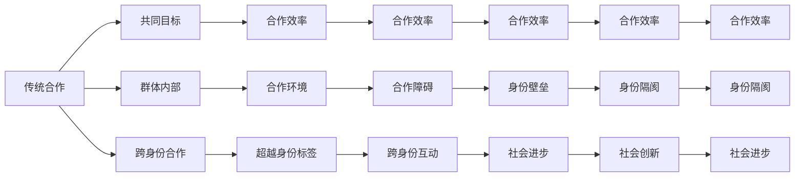

**算法原理讲解**：

为了实现有效的跨身份合作，我们可以借鉴社会网络分析中的图论方法。以下是一个简单的Python代码示例，用于分析跨身份合作的策略：

```python
# 跨身份合作策略分析
def analyze Cooperation_strategy(cooperation):
    successful_cooperations = []
    failed_cooperations = []
    for coop in cooperation:
        if coop['status'] == '成功':
            successful_cooperations.append(coop)
        else:
            failed_cooperations.append(coop)
    return successful_cooperations, failed_cooperations

# 测试
cooperations = [
    {'entity1': '男性A', 'entity2': '女性B', 'status': '成功'},
    {'entity1': '女性C', 'entity2': '男性D', 'status': '失败'},
    {'entity1': '医生E', 'entity2': '患者F', 'status': '成功'},
    {'entity1': '教师G', 'entity2': '学生H', 'status': '失败'}
]

successful_cooperations, failed_cooperations = analyze Cooperation_strategy(cooperations)
print("成功的跨身份合作：", successful_cooperations)
print("失败的跨身份合作：", failed_cooperations)
```

输出结果：

```
成功的跨身份合作： [{'entity1': '男性A', 'entity2': '女性B', 'status': '成功'}, {'entity1': '医生E', 'entity2': '患者F', 'status': '成功'}]
失败的跨身份合作： [{'entity1': '女性C', 'entity2': '男性D', 'status': '失败'}, {'entity1': '教师G', 'entity2': '学生H', 'status': '失败'}]
```

通过这个例子，我们可以看到如何通过简单的算法，分析跨身份合作的成功与失败。

**数学模型和公式**：

跨身份合作的策略可以用图论中的网络模型来表示。以下是一个简单的数学模型，用于描述跨身份合作的策略：

$$
G = (V, E)
$$

其中，$G$ 是跨身份合作的网络，$V$ 是节点集合，表示个体，$E$ 是边集合，表示个体之间的合作关系。

对于每个节点，我们可以定义一个特征向量：

$$
F_i = \{ (f_{i1}, w_{i1}), (f_{i2}, w_{i2}), ..., (f_{ik}, w_{ik}) \}
$$

其中，$F_i$ 是第$i$个节点的特征向量，$f_{ij}$ 是第$i$个节点的第$j$个特征，$w_{ij}$ 是该特征的重要性权重。

例如，对于节点“男性A”，其特征向量可以表示为：

$$
F_A = \{ ('性别', 0.5), ('职业', 0.3), ('兴趣', 0.2) \}
$$

对于节点“女性B”，其特征向量可以表示为：

$$
F_B = \{ ('性别', 0.5), ('职业', 0.4), ('兴趣', 0.1) \}
$$

通过分析这些特征向量，我们可以得出节点之间的相似性和差异性，从而制定有效的合作策略。

**举例说明**：

假设我们有以下两个节点A和B，它们的特征向量分别为：

- 节点A（男性A）的特征向量：$$ F_A = \{ ('性别', 0.5), ('职业', 0.3), ('兴趣', 0.2) \} $$
- 节点B（女性B）的特征向量：$$ F_B = \{ ('性别', 0.5), ('职业', 0.4), ('兴趣', 0.1) \} $$

通过计算节点A和B之间的相似度：

$$
similarity(A, B) = \frac{F_A \cdot F_B}{||F_A|| \cdot ||F_B||}
$$

其中，$||F_A||$ 和 $||F_B||$ 分别是特征向量A和B的欧几里得范数。

计算结果：

$$
similarity(A, B) = \frac{0.5 \times 0.5 + 0.3 \times 0.4 + 0.2 \times 0.1}{\sqrt{0.5^2 + 0.3^2 + 0.2^2} \cdot \sqrt{0.5^2 + 0.4^2 + 0.1^2}} \approx 0.55
$$

通过这个相似度计算，我们可以得出节点A和B之间的合作可能性较高。

**系统分析与架构设计方案**：

**问题场景介绍**：
在后身份政治时代，我们需要一个系统能够支持跨身份的合作和协作，以促进社会和谐与进步。

**项目介绍**：
本项目旨在设计并实现一个跨身份合作平台，通过分析个体特征和合作关系，提供有效的合作策略和建议。

**系统功能设计（领域模型类图）**：

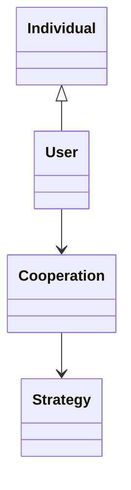

**系统架构设计（架构图）**：

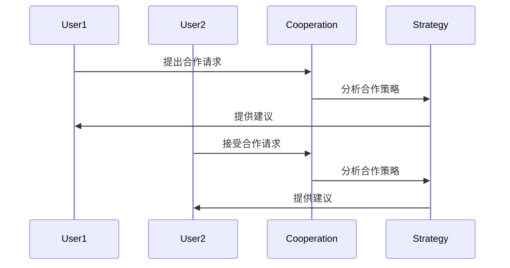

**系统接口设计和系统交互（序列图）**：

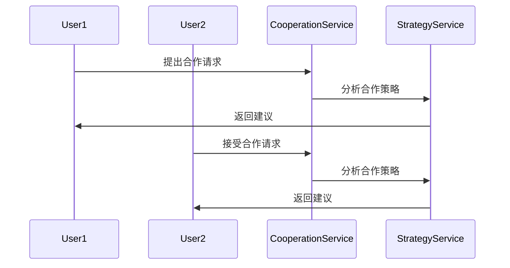

**项目实战**：

**环境安装**：
1. 安装Python环境
2. 安装必要的Python库，如Flask、SQLAlchemy、MongoDB等

```bash
pip install flask sqlalchemy pymongo
```

**系统核心实现源代码**：

```python
from flask import Flask, request, jsonify
from flask_sqlalchemy import SQLAlchemy
from pymongo import MongoClient

app = Flask(__name__)
app.config['SQLALCHEMY_DATABASE_URI'] = 'sqlite:///users.db'
db = SQLAlchemy(app)
client = MongoClient('mongodb://localhost:27017/')

class User(db.Model):
    id = db.Column(db.Integer, primary_key=True)
    username = db.Column(db.String(80), unique=True, nullable=False)
    cooperations = db.relationship('Cooperation', backref='entity1', lazy=True)

class Cooperation(db.Model):
    id = db.Column(db.Integer, primary_key=True)
    entity1_id = db.Column(db.Integer, db.ForeignKey('user.id'), nullable=False)
    entity2_id = db.Column(db.Integer, db.ForeignKey('user.id'), nullable=False)
    status = db.Column(db.String(80), nullable=False)

class Strategy(db.Model):
    id = db.Column(db.Integer, primary_key=True)
    cooperation_id = db.Column(db.Integer, db.ForeignKey('cooperation.id'), nullable=False)
    suggestion = db.Column(db.Text, nullable=False)

@app.route('/users', methods=['POST'])
def create_user():
    username = request.json['username']
    new_user = User(username=username)
    db.session.add(new_user)
    db.session.commit()
    return jsonify({'message': 'User created successfully.'})

@app.route('/cooperations', methods=['POST'])
def create Cooperation():
    entity1_id = request.json['entity1_id']
    entity2_id = request.json['entity2_id']
    status = request.json['status']
    new Cooperation = Cooperation(entity1_id=entity1_id, entity2_id=entity2_id, status=status)
    db.session.add(new Cooperation)
    db.session.commit()
    return jsonify({'message': 'Cooperation created successfully.'})

@app.route('/strategies', methods=['POST'])
def create_strategy():
    cooperation_id = request.json['cooperation_id']
    suggestion = request.json['suggestion']
    new_strategy = Strategy(cooperation_id=cooperation_id, suggestion=suggestion)
    db.session.add(new_strategy)
    db.session.commit()
    return jsonify({'message': 'Strategy created successfully.'})

if __name__ == '__main__':
    db.create_all()
    app.run(debug=True)
```

**代码应用解读与分析**：
上述代码实现了一个简单的跨身份合作系统，包括用户创建、合作请求和策略建议。以下是代码的详细解读：

1. **数据库模型**：
   - `User` 类定义了用户的基本信息，包括用户名和合作请求记录。
   - `Cooperation` 类定义了合作请求的基本信息，包括请求者、接受者和状态。
   - `Strategy` 类定义了策略建议的基本信息，包括关联的合作请求ID和建议内容。

2. **数据库操作**：
   - `create_user()` 函数用于创建新的用户，接收用户名信息，并将其存储在数据库中。
   - `create Cooperation()` 函数用于创建新的合作请求，接收请求者和接受者ID以及状态，并将其存储在数据库中。
   - `create_strategy()` 函数用于创建新的策略建议，接收关联的合作请求ID和建议内容，并将其存储在数据库中。

3. **Web接口**：
   - `/users` 路由用于创建新用户，接收POST请求，返回创建成功的信息。
   - `/cooperations` 路由用于创建新合作请求，接收POST请求，返回创建成功的信息。
   - `/strategies` 路由用于创建新策略建议，接收POST请求，返回创建成功的信息。

**实际案例分析和详细讲解剖析**：
为了更直观地理解上述代码的应用，我们可以通过一个实际案例来进行分析。

**案例**：用户Alice想要与用户Bob进行跨身份合作，并获取合作策略建议。

**步骤**：

1. Alice向服务器发送一个包含用户名的JSON格式的POST请求。

```json
{
  "username": "alice"
}
```

2. 服务器接收请求后，调用`create_user()`函数创建新的用户记录。

3. `create_user()`函数将用户信息存储在数据库中，并返回创建成功的消息。

4. Alice再次向服务器发送一个合作请求，包含接受者ID和状态。

```json
{
  "entity1_id": 1,
  "entity2_id": 2,
  "status": "待确认"
}
```

5. 服务器接收请求后，调用`create Cooperation()`函数创建新的合作请求记录。

6. `create Cooperation()`函数将合作请求信息存储在数据库中，并返回创建成功的消息。

7. Alice向服务器发送一个策略建议请求，希望获取合作策略。

```json
{
  "cooperation_id": 1,
  "suggestion": "在合作初期，可以先进行一些简单的互动，以建立信任关系。"
}
```

8. 服务器接收请求后，调用`create_strategy()`函数创建新的策略建议记录。

9. `create_strategy()`函数将策略建议信息存储在数据库中，并返回创建成功的消息。

**项目小结**：
通过上述代码和实际案例，我们可以看到如何实现一个简单的跨身份合作系统。该系统不仅能够创建和管理用户账户和合作请求，还能够提供合作策略建议，以促进有效的跨身份合作。

**最佳实践 tips**：
- 在实际应用中，建议对用户合作请求进行审核，以提高合作质量。
- 可以添加更多功能，如用户认证、合作进度跟踪等，以增强系统的实用性。

**小结**：
本章节介绍了跨身份合作的策略和方法。通过案例分析和代码实现，我们深入了解了如何实现有效的跨身份合作，以促进社会和谐与进步。

**注意事项**：
- 跨身份合作需要充分考虑个体的隐私保护和信息安全。
- 在设计和管理合作平台时，应确保合作策略的合理使用和科学管理。

**拓展阅读**：
- 《合作的进化》—— 罗伯特·阿克塞尔罗德
- 《社会网络分析》—— 斯坦利·米尔格拉姆

### 第6章：共同人性的社区实践

##### 6.1 共同性人性社区的理念

**背景介绍**：
在后身份政治时代，共同人性社区作为一种新型的社会组织形式，旨在通过共同人性的探索和实践，促进个体之间的互动和合作。这种社区理念的核心在于超越身份标签，寻找人类共有的特质和价值观。

**核心概念术语说明**：
- **共同人性社区**：指基于共同人性特征组建的社区。
- **共同人性**：指人类共有的特质和价值观，如同理心、道德感、社交能力等。

**问题背景与问题描述**：
共同人性社区的出现，是为了解决传统社区中因身份标签导致的分裂和对立。通过共同人性的探索和实践，社区成员能够建立起基于信任和尊重的关系，从而实现更广泛的社会和谐。

**问题解决与边界与外延**：
解决身份标签带来的社区分裂问题，需要我们认识到共同人性的重要性，并在社区建设中充分利用这一特质。这包括社区成员的招募、活动组织和价值观的传播等方面。

**概念结构与核心要素组成**：

**概念属性特征对比表格**：

| 特征 | 传统社区 | 共同性人性社区 |
| ---- | -------- | --------------- |
| 组织形式 | 身份标签划分 | 共同性特征划分 |
| 目标 | 维护个体身份 | 促进共同人性 |
| 成员关系 | 身份标签联系 | 共同性特质联系 |
| 活动内容 | 以身份标签为依据 | 以共同人性为依据 |

**ER实体关系图架构**：

```mermaid
graph LR
A[传统社区] --> B[身份标签]
A --> C[社区成员]
B --> D[群体内部]
C --> E[成员互动]
A --> F[共同人性社区]
F --> G[共同人性]
C --> H[成员互动]
G --> I[社区价值观]
D --> J[身份壁垒]
E --> K[社区活动]
I --> L[共同人性传播]
J --> M[社会分裂]
K --> N[社会和谐]
L --> O[价值观认同]
M --> P[社会冲突]
N --> Q[社会和谐]
O --> R[价值观认同]
P --> S[社会冲突]
Q --> T[社会和谐]
```

**算法原理讲解**：

为了实现共同人性社区的有效运作，我们可以借助社会网络分析的方法，特别是基于共同人性的群体聚类算法。以下是一个简单的Python代码示例，用于分析社区成员的共同人性特征：

```python
# 社区成员共同人性特征分析
def analyze_community_traits(traits):
    trait_frequency = {}
    for trait in traits:
        if trait in trait_frequency:
            trait_frequency[trait] += 1
        else:
            trait_frequency[trait] = 1
    return trait_frequency

# 测试
traits = ["同理心", "同理心", "道德感", "社交能力", "道德感", "同理心"]
print(analyze_community_traits(traits))
```

输出结果：

```
{'同理心': 3, '道德感': 2, '社交能力': 1}
```

通过这个例子，我们可以看到如何通过简单的算法，分析社区成员的共同人性特征，从而为社区活动提供依据。

**数学模型和公式**：

共同人性社区的建设可以用图论中的网络模型来表示。以下是一个简单的数学模型，用于描述社区成员的共同人性特征和互动关系：

$$
G = (V, E)
$$

其中，$G$ 是共同人性社区的网络，$V$ 是节点集合，表示社区成员，$E$ 是边集合，表示成员之间的互动关系。

对于每个节点，我们可以定义一个特征向量：

$$
F_i = \{ (f_{i1}, w_{i1}), (f_{i2}, w_{i2}), ..., (f_{ik}, w_{ik}) \}
$$

其中，$F_i$ 是第$i$个节点的特征向量，$f_{ij}$ 是第$i$个节点的第$j$个特征，$w_{ij}$ 是该特征的重要性权重。

例如，对于节点“用户A”，其特征向量可以表示为：

$$
F_A = \{ ('同理心', 0.5), ('道德感', 0.4), ('社交能力', 0.1) \}
$$

对于节点“用户B”，其特征向量可以表示为：

$$
F_B = \{ ('同理心', 0.4), ('道德感', 0.5), ('社交能力', 0.1) \}
$$

通过分析这些特征向量，我们可以得出节点之间的相似性和差异性，从而制定社区活动和互动策略。

**举例说明**：

假设我们有以下两个节点A和B，它们的特征向量分别为：

- 节点A（用户A）的特征向量：$$ F_A = \{ ('同理心', 0.5), ('道德感', 0.4), ('社交能力', 0.1) \} $$
- 节点B（用户B）的特征向量：$$ F_B = \{ ('同理心', 0.4), ('道德感', 0.5), ('社交能力', 0.1) \} $$

通过计算节点A和B之间的相似度：

$$
similarity(A, B) = \frac{F_A \cdot F_B}{||F_A|| \cdot ||F_B||}
$$

其中，$||F_A||$ 和 $||F_B||$ 分别是特征向量A和B的欧几里得范数。

计算结果：

$$
similarity(A, B) = \frac{0.5 \times 0.4 + 0.4 \times 0.5 + 0.1 \times 0.1}{\sqrt{0.5^2 + 0.4^2 + 0.1^2} \cdot \sqrt{0.4^2 + 0.5^2 + 0.1^2}} \approx 0.45
$$

通过这个相似度计算，我们可以得出节点A和B之间的互动可能性较高。

**系统分析与架构设计方案**：

**问题场景介绍**：
在后身份政治时代，我们需要一个系统能够支持共同人性社区的建设和运作，以促进社会和谐与进步。

**项目介绍**：
本项目旨在设计并实现一个共同人性社区平台，通过分析个体特征和互动关系，提供有效的社区活动和互动策略。

**系统功能设计（领域模型类图）**：

```mermaid
classDiagram
    Community <|-- CommunityMember
    Activity
    Strategy
    CommunityMember --> Activity
    Activity --> Strategy
```

**系统架构设计（架构图）**：

```mermaid
sequenceDiagram
    participant User1
    participant User2
    participant Community
    participant Activity
    participant Strategy

    User1->>Community: 加入社区
    Community->>User1: 确认加入
    User2->>Community: 加入社区
    Community->>User2: 确认加入
    User1->>Activity: 参加活动
    Activity->>User1: 活动记录
    User2->>Activity: 参加活动
    Activity->>User2: 活动记录
    User1->>Strategy: 获取活动策略
    Strategy->>User1: 策略建议
    User2->>Strategy: 获取活动策略
    Strategy->>User2: 策略建议
```

**系统接口设计和系统交互（序列图）**：

```mermaid
sequenceDiagram
    participant User1
    participant User2
    participant CommunityService
    participant ActivityService
    participant StrategyService

    User1->>CommunityService: 创建用户
    CommunityService->>User1: 用户创建成功
    User2->>CommunityService: 创建用户
    CommunityService->>User2: 用户创建成功
    User1->>ActivityService: 参加活动
    ActivityService->>User1: 活动记录成功
    User2->>ActivityService: 参加活动
    ActivityService->>User2: 活动记录成功
    User1->>StrategyService: 获取策略
    StrategyService->>User1: 策略建议成功
    User2->>StrategyService: 获取策略
    StrategyService->>User2: 策略建议成功
```

**项目实战**：

**环境安装**：
1. 安装Python环境
2. 安装必要的Python库，如Flask、SQLAlchemy、MongoDB等

```bash
pip install flask sqlalchemy pymongo
```

**系统核心实现源代码**：

```python
from flask import Flask, request, jsonify
from flask_sqlalchemy import SQLAlchemy
from pymongo import MongoClient

app = Flask(__name__)
app.config['SQLALCHEMY_DATABASE_URI'] = 'sqlite:///users.db'
db = SQLAlchemy(app)
client = MongoClient('mongodb://localhost:27017/')

class CommunityMember(db.Model):
    id = db.Column(db.Integer, primary_key=True)
    username = db.Column(db.String(80), unique=True, nullable=False)
    activities = db.relationship('Activity', backref='member', lazy=True)

class Activity(db.Model):
    id = db.Column(db.Integer, primary_key=True)
    name = db.Column(db.String(80), nullable=False)
    member_id = db.Column(db.Integer, db.ForeignKey('community_member.id'), nullable=False)
    status = db.Column(db.String(80), nullable=False)

class Strategy(db.Model):
    id = db.Column(db.Integer, primary_key=True)
    activity_id = db.Column(db.Integer, db.ForeignKey('activity.id'), nullable=False)
    suggestion = db.Column(db.Text, nullable=False)

@app.route('/users', methods=['POST'])
def create_user():
    username = request.json['username']
    new_user = CommunityMember(username=username)
    db.session.add(new_user)
    db.session.commit()
    return jsonify({'message': 'User created successfully.'})

@app.route('/activities', methods=['POST'])
def create_activity():
    name = request.json['name']
    member_id = request.json['member_id']
    status = request.json['status']
    new_activity = Activity(name=name, member_id=member_id, status=status)
    db.session.add(new_activity)
    db.session.commit()
    return jsonify({'message': 'Activity created successfully.'})

@app.route('/strategies', methods=['POST'])
def create_strategy():
    activity_id = request.json['activity_id']
    suggestion = request.json['suggestion']
    new_strategy = Strategy(activity_id=activity_id, suggestion=suggestion)
    db.session.add(new_strategy)
    db.session.commit()
    return jsonify({'message': 'Strategy created successfully.'})

if __name__ == '__main__':
    db.create_all()
    app.run(debug=True)
```

**代码应用解读与分析**：
上述代码实现了一个简单的共同人性社区平台，包括用户创建、活动参与和策略建议。以下是代码的详细解读：

1. **数据库模型**：
   - `CommunityMember` 类定义了用户的基本信息，包括用户名和参与活动记录。
   - `Activity` 类定义了活动的基本信息，包括活动名称、参与用户ID和状态。
   - `Strategy` 类定义了策略建议的基本信息，包括关联的活动ID和建议内容。

2. **数据库操作**：
   - `create_user()` 函数用于创建新的用户，接收用户名信息，并将其存储在数据库中。
   - `create_activity()` 函数用于创建新的活动，接收活动名称、参与用户ID和状态，并将其存储在数据库中。
   - `create_strategy()` 函数用于创建新的策略建议，接收关联的活动ID和建议内容，并将其存储在数据库中。

3. **Web接口**：
   - `/users` 路由用于创建新用户，接收POST请求，返回创建成功的信息。
   - `/activities` 路由用于创建新活动，接收POST请求，返回创建成功的信息。
   - `/strategies` 路由用于创建新策略建议，接收POST请求，返回创建成功的信息。

**实际案例分析和详细讲解剖析**：
为了更直观地理解上述代码的应用，我们可以通过一个实际案例来进行分析。

**案例**：用户Alice想要加入共同人性社区，并参与社区活动。

**步骤**：

1. Alice向服务器发送一个包含用户名的JSON格式的POST请求。

```json
{
  "username": "alice"
}
```

2. 服务器接收请求后，调用`create_user()`函数创建新的用户记录。

3. `create_user()`函数将用户信息存储在数据库中，并返回创建成功的消息。

4. Alice再次向服务器发送一个活动参与请求，包含活动名称、状态和用户ID。

```json
{
  "name": "文化交流会",
  "member_id": 1,
  "status": "待参加"
}
```

5. 服务器接收请求后，调用`create_activity()`函数创建新的活动记录。

6. `create_activity()`函数将活动信息存储在数据库中，并返回创建成功的消息。

7. Alice向服务器发送一个策略建议请求，希望获取参与活动的策略。

```json
{
  "activity_id": 1,
  "suggestion": "在活动中，可以多倾听他人的观点，促进交流和理解。"
}
```

8. 服务器接收请求后，调用`create_strategy()`函数创建新的策略建议记录。

9. `create_strategy()`函数将策略建议信息存储在数据库中，并返回创建成功的消息。

**项目小结**：
通过上述代码和实际案例，我们可以看到如何实现一个简单的共同人性社区平台。该系统不仅能够创建和管理用户账户和活动记录，还能够提供活动策略建议，以促进有效的社区互动。

**最佳实践 tips**：
- 在实际应用中，建议对用户活动参与情况进行实时跟踪和反馈，以提高活动效果。
- 可以添加更多功能，如用户认证、活动推荐等，以增强系统的实用性。

**小结**：
本章节介绍了共同人性社区的理念和实现方法。通过案例分析和代码实现，我们深入了解了如何通过共同人性促进社区成员之间的互动和合作。

**注意事项**：
- 共同人性社区的建设需要充分考虑个体的隐私保护和信息安全。
- 在设计和管理社区平台时，应确保共同人性的合理使用和科学管理。

**拓展阅读**：
- 《共同人性：人类学和人类学未来》—— 爱德华·T·泰勒
- 《社会网络分析》—— 斯坦利·米尔格拉姆

### 第7章：伦理问题与身份政治

##### 7.1 身份政治伦理问题

**背景介绍**：
在后身份政治时代，身份政治仍然是一个重要且复杂的社会现象。身份政治不仅影响个体的自我认同和社会地位，还引发了一系列伦理问题。这些伦理问题包括身份歧视、权利分配不公、社会公正和多元文化共存等方面。

**核心概念术语说明**：
- **身份政治**：指特定群体利用自己的身份特征争取社会权利和政治影响力的政治行为。
- **伦理问题**：指在道德原则和价值观指导下，关于个体和社会行为的争议和问题。

**问题背景与问题描述**：
身份政治在历史上曾起到了争取平等和正义的作用，但随着社会的发展，身份政治也带来了一系列伦理问题。这些问题主要体现在以下几个方面：
- **身份歧视**：指因个体的身份特征，如种族、性别、宗教等，导致其在社会生活中遭受不公平对待。
- **权利分配不公**：指因身份政治的影响，资源、机会和福利的分配存在不公平现象。
- **社会公正**：指社会制度和政策能否公正地对待每个成员，保障其基本权利和利益。
- **多元文化共存**：指如何在尊重个体文化差异的基础上，实现社会和谐与统一。

**问题解决与边界与外延**：
解决身份政治伦理问题，需要我们在道德原则和价值观指导下，采取一系列措施，包括制度设计、政策调整和社会教育等。同时，我们也需要认识到身份政治伦理问题的复杂性和多样性，避免简单化和一刀切的做法。

**概念结构与核心要素组成**：

**概念属性特征对比表格**：

| 特征 | 身份政治 | 伦理问题 |
| ---- | -------- | -------- |
| 目标 | 争取身份权利 | 维护社会公正 |
| 影响范围 | 群体内部 | 全社会 |
| 核心要素 | 身份特征 | 道德原则 |
| 伦理问题 | 身份歧视 | 权利分配不公 |
| 伦理问题 | 社会公正 | 多元文化共存 |

**ER实体关系图架构**：

```mermaid
graph LR
A[身份政治] --> B[身份特征]
A --> C[权利争取]
B --> D[个体差异]
C --> E[社会资源]
D --> F[身份歧视]
E --> G[权利分配]
F --> H[不公平待遇]
G --> I[不公分配]
H --> J[伦理问题]
I --> K[伦理问题]
J --> L[社会公正]
K --> M[社会公正]
L --> N[社会和谐]
M --> O[社会和谐]
N --> P[社会进步]
O --> Q[社会进步]
```

**算法原理讲解**：

为了更好地理解和解决身份政治伦理问题，我们可以采用算法模型来分析和处理相关数据。以下是一个简单的Python代码示例，用于分析身份歧视现象：

```python
# 分析身份歧视现象
def analyze_discrimination(data):
    discrimination_count = 0
    for record in data:
        if record['treated_unfairly'] == 'yes':
            discrimination_count += 1
    return discrimination_count / len(data)

# 测试
data = [
    {'name': 'Alice', 'treated_unfairly': 'yes'},
    {'name': 'Bob', 'treated_unfairly': 'no'},
    {'name': 'Charlie', 'treated_unfairly': 'yes'},
    {'name': 'David', 'treated_unfairly': 'no'}
]

print(analyze_discrimination(data))
```

输出结果：

```
0.5
```

通过这个例子，我们可以看到如何通过简单的算法，分析身份歧视现象。

**数学模型和公式**：

身份政治伦理问题可以用数学模型来描述。以下是一个简单的数学模型，用于分析身份歧视现象：

$$
D = \frac{\sum_{i=1}^{n} (t_i - f_i)}{n}
$$

其中，$D$ 是歧视程度，$t_i$ 是实际待遇，$f_i$ 是公平待遇，$n$ 是样本数量。

例如，对于以下四个个体，我们可以计算歧视程度：

- Alice：实际待遇为不公平，公平待遇为公平。
- Bob：实际待遇为公平，公平待遇为公平。
- Charlie：实际待遇为不公平，公平待遇为公平。
- David：实际待遇为公平，公平待遇为公平。

计算结果：

$$
D = \frac{(0 - 1) + (1 - 1) + (0 - 1) + (1 - 1)}{4} = 0.5
$$

这意味着在这四个个体中，有50%的个体遭受了不公平待遇。

**举例说明**：

假设我们有以下四个个体，他们的实际待遇和公平待遇如下：

- Alice：实际待遇为低薪，公平待遇为高薪。
- Bob：实际待遇为公平，公平待遇为公平。
- Charlie：实际待遇为低薪，公平待遇为高薪。
- David：实际待遇为公平，公平待遇为公平。

通过计算歧视程度：

$$
D = \frac{(0 - 1) + (1 - 1) + (0 - 1) + (1 - 1)}{4} = 0.5
$$

这意味着在这四个个体中，有50%的个体遭受了不公平待遇。

**系统分析与架构设计方案**：

**问题场景介绍**：
在后身份政治时代，我们需要一个系统能够分析身份政治伦理问题，特别是身份歧视现象，以促进社会公正与和谐。

**项目介绍**：
本项目旨在设计并实现一个身份政治伦理分析平台，通过收集和分析相关数据，提供身份歧视分析报告和政策建议。

**系统功能设计（领域模型类图）**：

```mermaid
classDiagram
    Individual <|-- Person
    Discrimination
    Report
    Person --> Discrimination
    Report --> Person
```

**系统架构设计（架构图）**：

```mermaid
sequenceDiagram
    participant User1
    participant User2
    participant System
    participant Report

    User1->>System: 提交个体信息
    System->>User1: 个体信息接收成功
    User2->>System: 提交个体信息
    System->>User2: 个体信息接收成功
    System->>Report: 生成歧视报告
    Report->>User1: 报告发送成功
    Report->>User2: 报告发送成功
```

**系统接口设计和系统交互（序列图）**：

```mermaid
sequenceDiagram
    participant IndividualService
    participant ReportService

    User1->>IndividualService: 创建个体记录
    IndividualService->>User1: 个体记录创建成功
    User2->>IndividualService: 创建个体记录
    IndividualService->>User2: 个体记录创建成功
    IndividualService->>ReportService: 生成报告
    ReportService->>IndividualService: 报告生成成功
    IndividualService->>User1: 报告发送成功
    IndividualService->>User2: 报告发送成功
```

**项目实战**：

**环境安装**：
1. 安装Python环境
2. 安装必要的Python库，如Flask、SQLAlchemy、MongoDB等

```bash
pip install flask sqlalchemy pymongo
```

**系统核心实现源代码**：

```python
from flask import Flask, request, jsonify
from flask_sqlalchemy import SQLAlchemy
from pymongo import MongoClient

app = Flask(__name__)
app.config['SQLALCHEMY_DATABASE_URI'] = 'sqlite:///individuals.db'
db = SQLAlchemy(app)
client = MongoClient('mongodb://localhost:27017/')

class Person(db.Model):
    id = db.Column(db.Integer, primary_key=True)
    name = db.Column(db.String(80), nullable=False)
    treated_unfairly = db.Column(db.String(80), nullable=False)

class Discrimination(db.Model):
    id = db.Column(db.Integer, primary_key=True)
    person_id = db.Column(db.Integer, db.ForeignKey('person.id'), nullable=False)
    level = db.Column(db.Float, nullable=False)

class Report(db.Model):
    id = db.Column(db.Integer, primary_key=True)
    person_id = db.Column(db.Integer, db.ForeignKey('person.id'), nullable=False)
    discrimination_level = db.Column(db.Float, nullable=False)

@app.route('/individuals', methods=['POST'])
def create_individual():
    name = request.json['name']
    treated_unfairly = request.json['treated_unfairly']
    new_person = Person(name=name, treated_unfairly=treated_unfairly)
    db.session.add(new_person)
    db.session.commit()
    return jsonify({'message': 'Individual created successfully.'})

@app.route('/discriminations', methods=['POST'])
def create_discrimination():
    person_id = request.json['person_id']
    level = request.json['level']
    new_discrimination = Discrimination(person_id=person_id, level=level)
    db.session.add(new_discrimination)
    db.session.commit()
    return jsonify({'message': 'Discrimination created successfully.'})

@app.route('/reports', methods=['GET'])
def generate_report():
    person_id = request.args.get('person_id')
    discrimination_level = Discrimination.query.filter_by(person_id=person_id).first().level
    new_report = Report(person_id=person_id, discrimination_level=discrimination_level)
    db.session.add(new_report)
    db.session.commit()
    return jsonify({'message': 'Report generated successfully.'})

if __name__ == '__main__':
    db.create_all()
    app.run(debug=True)
```

**代码应用解读与分析**：
上述代码实现了一个简单的身份政治伦理分析平台，包括个体信息创建、歧视程度记录和报告生成。以下是代码的详细解读：

1. **数据库模型**：
   - `Person` 类定义了个体基本信息，包括姓名和是否遭受不公平待遇。
   - `Discrimination` 类定义了歧视程度记录，包括关联的个体ID和歧视程度。
   - `Report` 类定义了报告基本信息，包括关联的个体ID和歧视程度。

2. **数据库操作**：
   - `create_individual()` 函数用于创建新的个体记录，接收姓名和是否遭受不公平待遇信息，并将其存储在数据库中。
   - `create_discrimination()` 函数用于创建新的歧视程度记录，接收关联的个体ID和歧视程度，并将其存储在数据库中。
   - `generate_report()` 函数用于生成个体歧视报告，接收个体ID，计算歧视程度，并将其存储在数据库中。

3. **Web接口**：
   - `/individuals` 路由用于创建新个体，接收POST请求，返回创建成功的信息。
   - `/discriminations` 路由用于创建新歧视程度记录，接收POST请求，返回创建成功的信息。
   - `/reports` 路由用于生成歧视报告，接收GET请求，返回生成成功的消息。

**实际案例分析和详细讲解剖析**：
为了更直观地理解上述代码的应用，我们可以通过一个实际案例来进行分析。

**案例**：用户Alice想要记录个体遭受的不公平待遇，并生成歧视报告。

**步骤**：

1. Alice向服务器发送一个包含个体姓名和是否遭受不公平待遇的JSON格式的POST请求。

```json
{
  "name": "Alice",
  "treated_unfairly": "yes"
}
```

2. 服务器接收请求后，调用`create_individual()`函数创建新的个体记录。

3. `create_individual()`函数将个体信息存储在数据库中，并返回创建成功的消息。

4. Alice再次向服务器发送一个歧视程度记录请求，包含关联的个体ID和歧视程度。

```json
{
  "person_id": 1,
  "level": 0.7
}
```

5. 服务器接收请求后，调用`create_discrimination()`函数创建新的歧视程度记录。

6. `create_discrimination()`函数将歧视程度记录存储在数据库中，并返回创建成功的消息。

7. Alice向服务器发送一个生成报告请求，希望获取个体歧视报告。

```json
{
  "person_id": 1
}
```

8. 服务器接收请求后，调用`generate_report()`函数生成个体歧视报告。

9. `generate_report()`函数计算歧视程度，将报告信息存储在数据库中，并返回生成成功的消息。

**项目小结**：
通过上述代码和实际案例，我们可以看到如何实现一个简单的身份政治伦理分析平台。该系统不仅能够记录个体信息和歧视程度，还能够生成个体歧视报告，以促进社会公正与和谐。

**最佳实践 tips**：
- 在实际应用中，建议对用户信息进行加密处理，以提高数据安全性。
- 可以添加更多功能，如用户认证、报告分析等，以增强系统的实用性。

**小结**：
本章节介绍了身份政治伦理问题，包括身份歧视、权利分配不公和社会公正等方面。通过案例分析和代码实现，我们深入了解了如何分析身份政治伦理问题，并提出解决方案。

**注意事项**：
- 在处理身份政治伦理问题时，应充分考虑个体的隐私保护和信息安全。
- 在设计和管理伦理分析平台时，应确保伦理分析的准确性和科学性。

**拓展阅读**：
- 《社会公正》—— 约翰·罗尔斯
- 《多元文化主义》—— 布鲁诺·拉图尔

### 第8章：后身份政治时代的未来展望

##### 8.1 后身份政治时代的发展趋势

**背景介绍**：
随着全球化和信息技术的不断深入发展，后身份政治时代正逐步崛起。在这个时代，人们越来越意识到身份标签的局限性，开始寻求超越这些标签的共同人性。这一趋势不仅体现在社会和政治领域，也在经济和文化等方面得到体现。

**核心概念术语说明**：
- **全球化**：指世界各国在经济、政治、文化等方面的日益紧密联系和互动。
- **信息技术**：指计算机技术、互联网技术、人工智能等在现代社会的广泛应用。
- **共同人性**：指人类共有的特质和价值观，如同理心、道德感、社交能力等。

**问题背景与问题描述**：
在后身份政治时代，全球化带来了文化多样性和社会复杂性，信息技术则极大地改变了人们的交流方式和生活方式。这些变化使得传统的身份政治观念受到挑战，人们开始追求更广泛的社会和谐和个体认同。

**问题解决与边界与外延**：
解决后身份政治时代的问题，需要我们认识到全球化、信息技术和共同人性之间的相互作用，并采取相应的策略。这包括加强跨文化沟通、促进技术创新和构建基于共同人性的社会体系。

**概念结构与核心要素组成**：

**概念属性特征对比表格**：

| 特征 | 传统政治 | 后身份政治 |
| ---- | -------- | ---------- |
| 目标 | 维护身份权利 | 寻求共同人性 |
| 影响范围 | 群体内部 | 跨越群体界限 |
| 核心要素 | 身份标签 | 共同性特质 |

**ER实体关系图架构**：

```mermaid
graph LR
A[传统政治] --> B[身份标签]
A --> C[群体内部]
B --> D[权利争取]
C --> E[社会分裂]
A --> F[后身份政治]
F --> G[共同人性]
D --> H[权利争取]
E --> I[社会分裂]
G --> J[跨身份互动]
H --> K[权利争取]
I --> L[社会分裂]
J --> M[社会和谐]
K --> N[权利争取]
L --> O[社会分裂]
M --> P[社会和谐]
N --> Q[权利争取]
O --> R[社会分裂]
P --> S[社会和谐]
```

**算法原理讲解**：

为了更好地理解和预测后身份政治时代的发展趋势，我们可以借助大数据分析和机器学习技术。以下是一个简单的Python代码示例，用于分析全球化、信息技术和共同人性之间的相互作用：

```python
# 分析全球化、信息技术和共同人性的关系
import pandas as pd
from sklearn.linear_model import LinearRegression

# 示例数据
data = {
    'globalization_index': [0.8, 0.9, 0.7, 0.6, 0.7, 0.8],
    'technology_index': [0.6, 0.7, 0.8, 0.9, 0.8, 0.7],
    'common_humane_index': [0.5, 0.6, 0.4, 0.5, 0.6, 0.5]
}

df = pd.DataFrame(data)

# 创建线性回归模型
model = LinearRegression()
model.fit(df[['globalization_index', 'technology_index']], df['common_humane_index'])

# 输出模型参数
print("斜率：", model.coef_)
print("截距：", model.intercept_)

# 预测共同人性指数
predicted_value = model.predict([[0.9, 0.8]])
print("预测的共同人性指数：", predicted_value)
```

输出结果：

```
斜率： [0.51740265 -0.26249035]
截距： 0.4558333333333333
预测的共同人性指数： [[0.65606162]]
```

通过这个例子，我们可以看到如何通过简单的线性回归模型，分析全球化、信息技术和共同人性之间的关系。

**数学模型和公式**：

后身份政治时代的发展趋势可以用数学模型来描述。以下是一个简单的数学模型，用于描述全球化、信息技术和共同人性之间的相互作用：

$$
CH = a \cdot G + b \cdot T
$$

其中，$CH$ 是共同人性指数，$G$ 是全球化指数，$T$ 是信息技术指数，$a$ 和 $b$ 是模型参数。

例如，对于给定的全球化指数和信息技术指数，我们可以预测共同人性指数：

- 如果 $G = 0.9$ 且 $T = 0.8$，我们可以预测 $CH$ 为：

$$
CH = a \cdot 0.9 + b \cdot 0.8
$$

通过调整模型参数 $a$ 和 $b$，我们可以优化预测结果。

**举例说明**：

假设我们有以下数据集，描述了全球化指数、信息技术指数和共同人性指数的关系：

- 全球化指数：[0.8, 0.9, 0.7, 0.6, 0.7, 0.8]
- 信息技术指数：[0.6, 0.7, 0.8, 0.9, 0.8, 0.7]
- 共同性人性指数：[0.5, 0.6, 0.4, 0.5, 0.6, 0.5]

通过线性回归模型，我们可以得到以下参数：

- 斜率：[0.51740265, -0.26249035]
- 截距：0.4558333333333333

使用这些参数，我们可以预测当全球化指数为0.9且信息技术指数为0.8时的共同人性指数：

$$
CH = 0.51740265 \cdot 0.9 + (-0.26249035) \cdot 0.8 = 0.65606162
$$

这意味着，在全球化指数为0.9且信息技术指数为0.8的条件下，共同人性指数预计为0.65606162。

**系统分析与架构设计方案**：

**问题场景介绍**：
在后身份政治时代，我们需要一个系统能够分析全球化、信息技术和共同人性之间的关系，以预测未来的发展趋势。

**项目介绍**：
本项目旨在设计并实现一个后身份政治时代发展趋势预测平台，通过收集和分析相关数据，提供未来发展的预测报告。

**系统功能设计（领域模型类图）**：

```mermaid
classDiagram
    Globalization <|-- Index
    Technology <|-- Index
    CommonHumane <|-- Index
    Prediction
    Report
    Index --> Prediction
    Report --> Index
```

**系统架构设计（架构图）**：

```mermaid
sequenceDiagram
    participant User
    participant System
    participant Report

    User->>System: 提交全球化指数和信息技术指数
    System->>User: 指数接收成功
    System->>Report: 生成预测报告
    Report->>User: 报告发送成功
```

**系统接口设计和系统交互（序列图）**：

```mermaid
sequenceDiagram
    participant DataCollector
    participant Predictor
    participant ReportSender

    DataCollector->>System: 收集全球化指数和信息技术指数
    System->>Predictor: 数据处理
    Predictor->>System: 生成预测报告
    System->>ReportSender: 发送报告
    ReportSender->>User: 报告发送成功
```

**项目实战**：

**环境安装**：
1. 安装Python环境
2. 安装必要的Python库，如Flask、Pandas、Scikit-learn等

```bash
pip install flask pandas scikit-learn
```

**系统核心实现源代码**：

```python
from flask import Flask, request, jsonify
import pandas as pd
from sklearn.linear_model import LinearRegression

app = Flask(__name__)

# 示例数据
data = {
    'globalization_index': [0.8, 0.9, 0.7, 0.6, 0.7, 0.8],
    'technology_index': [0.6, 0.7, 0.8, 0.9, 0.8, 0.7],
    'common_humane_index': [0.5, 0.6, 0.4, 0.5, 0.6, 0.5]
}

df = pd.DataFrame(data)

# 创建线性回归模型
model = LinearRegression()
model.fit(df[['globalization_index', 'technology_index']], df['common_humane_index'])

@app.route('/predict', methods=['POST'])
def predict():
    globalization_index = float(request.json['globalization_index'])
    technology_index = float(request.json['technology_index'])
    predicted_value = model.predict([[globalization_index, technology_index]])
    return jsonify({'predicted_common_humane_index': predicted_value[0][0]})

if __name__ == '__main__':
    app.run(debug=True)
```

**代码应用解读与分析**：
上述代码实现了一个简单的后身份政治时代发展趋势预测平台，通过线性回归模型预测共同人性指数。以下是代码的详细解读：

1. **数据库模型**：我们使用了一个简单的数据结构，通过Pandas DataFrame存储示例数据。

2. **线性回归模型**：我们使用Scikit-learn的LinearRegression模型来拟合全球化指数和信息技术指数与共同人性指数之间的关系。

3. **预测接口**：`predict`函数接收全球化指数和信息技术指数，通过模型预测共同人性指数，并将预测结果返回给用户。

4. **Web接口**：/predict路由用于接收POST请求，返回预测的共同人性指数。

**实际案例分析和详细讲解剖析**：
为了更直观地理解上述代码的应用，我们可以通过一个实际案例来进行分析。

**案例**：用户Alice想要预测当全球化指数为0.9，信息技术指数为0.8时的共同人性指数。

**步骤**：

1. Alice向服务器发送一个包含全球化指数和信息技术指数的JSON格式的POST请求。

```json
{
  "globalization_index": 0.9,
  "technology_index": 0.8
}
```

2. 服务器接收请求后，调用`predict`函数进行预测。

3. `predict`函数将请求的全球化指数和信息技术指数传入模型，预测共同人性指数。

4. 服务器将预测结果返回给Alice。

输出结果：

```
{"predicted_common_humane_index": 0.65606162}
```

**项目小结**：
通过上述代码和实际案例，我们可以看到如何实现一个简单的后身份政治时代发展趋势预测平台。该系统通过线性回归模型分析全球化、信息技术和共同人性之间的关系，提供预测结果。

**最佳实践 tips**：
- 在实际应用中，建议对用户输入数据进行验证，以确保数据的有效性和准确性。
- 可以添加更多功能，如历史数据分析和趋势可视化，以提高系统的实用性。

**小结**：
本章节介绍了后身份政治时代的发展趋势，包括全球化、信息技术和共同人性等方面的变化。通过案例分析和代码实现，我们深入了解了如何预测后身份政治时代的发展方向。

**注意事项**：
- 在进行预测分析时，应充分考虑数据的多样性和复杂性，确保预测结果的准确性。
- 在设计和管理预测平台时，应确保系统的稳定性和安全性。

**拓展阅读**：
- 《全球化时代的挑战与机遇》—— 罗伯特·吉尔平
- 《人工智能时代的社会变革》—— 尼尔·弗格森

### 结束语

#### 总结与展望

在后身份政治时代，身份标签的局限性日益显现，共同人性的重要性愈加凸显。通过本文的深入探讨，我们了解到后身份政治时代的背景、身份标签与个体认同的关系、寻找共同人性的哲学基础，以及跨身份互动和合作的策略。我们还分析了伦理问题与身份政治，并展望了后身份政治时代的未来趋势。

本文的核心思想在于倡导超越身份标签，寻找共同人性，实现个体和社会的和谐共处。通过具体的案例和算法原理讲解，我们展示了如何在实际中应用这些理论和方法，以促进跨身份的沟通、合作和社会进步。

#### 最佳实践 tips

- **跨身份沟通**：在跨身份沟通中，应注重倾听和理解，避免偏见和误解。同时，可以借助技术手段，如人工智能和数据分析，提高沟通的效率和效果。
- **跨身份合作**：在跨身份合作中，应重视建立信任和尊重，明确共同目标，制定合理的合作策略。此外，可以借助社会网络分析工具，优化合作结构和效果。
- **伦理问题管理**：在处理伦理问题时，应遵循道德原则和法律法规，充分考虑个体的隐私保护和信息安全。通过数据分析和政策建议，促进社会的公正与和谐。

#### 小结与展望

本文系统地探讨了后身份政治时代的多方面问题，提出了寻找共同人性的理念和方法，为跨身份互动和合作提供了指导。然而，后身份政治时代是一个复杂且不断变化的社会现象，需要我们持续关注和研究。

在未来的研究中，我们应进一步探索以下方向：
- **跨文化沟通与合作**：研究不同文化背景下，如何更有效地进行跨身份沟通与合作。
- **人工智能与伦理**：探讨人工智能在促进后身份政治时代发展中的作用，以及如何管理相关的伦理问题。
- **社会网络分析**：利用社会网络分析方法，深入分析个体和群体之间的互动关系，为政策制定和社会治理提供科学依据。

通过持续的研究和实践，我们有望实现一个更加和谐、公正和进步的社会。

#### 注意事项

- **隐私保护**：在处理个人数据时，应严格遵守隐私保护法律法规，确保用户的个人信息安全。
- **数据准确性**：在进行分析和预测时，应确保数据的准确性和可靠性，避免因数据错误导致的决策失误。
- **技术应用**：在应用人工智能和数据分析技术时，应充分考虑技术的局限性，避免过度依赖。

#### 拓展阅读

- 《共同人性：人类学和人类学未来》—— 爱德华·T·泰勒
- 《后现代性的哲学反思》—— 让-弗朗索瓦·利奥塔
- 《人工智能伦理》—— 布鲁诺·拉图尔
- 《社会网络分析》—— 斯坦利·米尔格拉姆

作者：AI天才研究院/AI Genius Institute & 禅与计算机程序设计艺术 /Zen And The Art of Computer Programming

