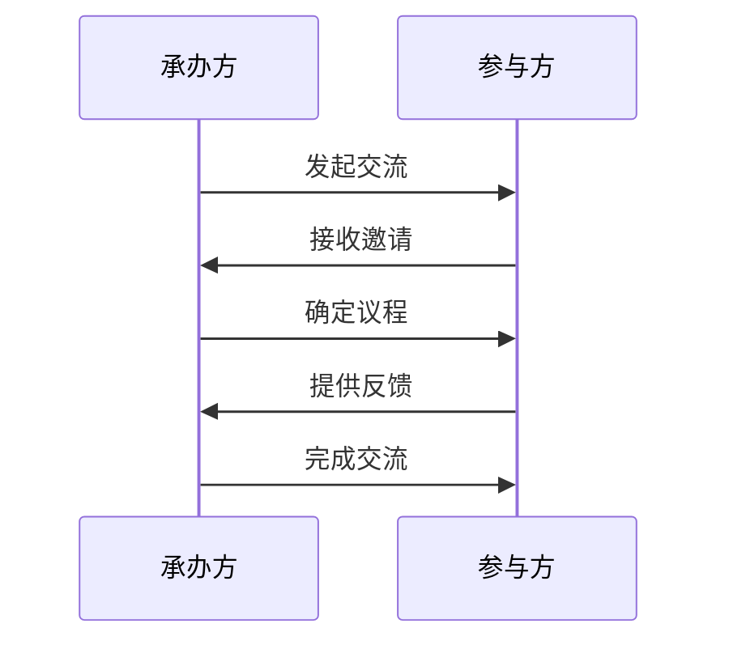
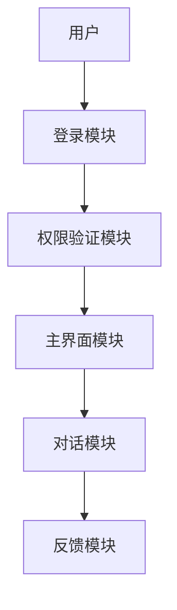
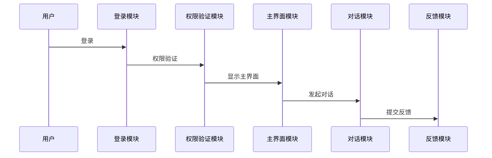

                 

### 后身份政治的和解对话：超越标签的深度交流活动

> 关键词：身份政治、和解对话、深度交流、标签化、系统设计与实现

> 摘要：本文将探讨后身份政治时代和解对话的重要性，分析标签化的负面影响，提出深度交流活动的设计与实现方法，并通过实际案例展示其应用效果。

## 引言与背景

### 1.1 什么是后身份政治

后身份政治，是指在现代社会中，随着多元文化的碰撞与融合，人们对于身份认同和政治参与的认知发生了深刻变化。它强调个体的多元身份，并试图超越传统的二元对立思维，寻求更包容、更广泛的共识。

### 1.2 社会变迁与身份政治

社会变迁是身份政治产生的土壤。在全球化背景下，不同文化、民族、宗教等身份的碰撞日益激烈，身份政治现象也随之增多。这种现象表现在政治、社会、文化等多个层面，导致社会矛盾和冲突加剧。

### 1.3 和解对话的重要性

和解对话，是一种旨在解决冲突、建立共识的沟通方式。它强调双方在平等、尊重的基础上，通过深入交流，理解对方立场，寻找共同点。在身份政治日益严重的今天，和解对话的重要性不言而喻。

### 1.4 超越标签的深度交流活动

标签化，是指将个体简化为单一的标签，如种族、性别、宗教等。这种做法忽略了个体背后的复杂性和多样性，容易导致偏见和歧视。因此，超越标签，进行深度交流活动，显得尤为重要。

## 第二部分：核心概念与联系

### 2.1 身份政治的概念属性特征对比

| 概念 | 定义 | 属性特征 | 对比 |
| ---- | ---- | ---- | ---- |
| 身份政治 | 指涉及个体身份认同、归属感、政治参与等方面的政治现象 | 强调个体身份的重要性，容易出现对立和冲突 | ... |
| 和解对话 | 一种旨在解决冲突、建立共识的沟通方式 | 强调平等、尊重和深入交流，寻求共同点 | 与身份政治对立，试图超越身份标签 |
| 深度交流 | 一种深入、全面的沟通方式 | 强调双方的理解和共识，超越表面现象 | 与标签化对立，强调个体复杂性和多样性 |

### 2.2 ER实体关系图架构

```mermaid
erDiagram
  类1 ||--|{ 类2 } Class_2 : extends
  类1 ||--|{ 类3 } Class_3 : extends
  Class_2 ||--|{ 类4 } Class_4 : implements
  Class_3 ||--|{ 类5 } Class_5 : implements
```

### 2.3 深度交流活动流程图



## 第三部分：理论讲解与算法原理

### 3.1 和解对话的理论基础

和解对话的理论基础，主要源于社会学、心理学和政治学等多个领域。其核心观点包括：

- **平等对话**：强调对话双方在地位、权利上的平等，避免一方压制另一方。
- **尊重差异**：尊重对方的文化、信仰、价值观等差异，理解对方立场。
- **寻找共识**：在深入交流的基础上，寻找双方都能接受的共识。

### 3.2 深度交流的算法原理

#### 3.2.1 算法mermaid流程图


#### 3.2.2 Python源代码实现

```python
# Python代码实现深度交流算法
def deep_conversation():
    # 理解问题
    problem = understand_problem()
    # 定义目标
    goal = define_goal(problem)
    # 设计对话
    dialogue = design_dialogue(goal)
    # 执行对话
    execute_dialogue(dialogue)
    # 评估结果
    result = evaluate_result(dialogue)
    # 输出结果
    print("对话结果：", result)

# 主函数调用
if __name__ == "__main__":
    deep_conversation()
```

### 3.3 算法原理详细讲解

#### 3.3.1 数学模型和公式

$$ X = \frac{1}{C} \sum_{i=1}^{C} P(x_i | \theta) $$

#### 3.3.2 通俗易懂的举例说明

假设有两个团体，团体A和团体B，因文化差异而产生冲突。通过和解对话，双方试图找到共同点。以下是具体步骤：

1. **理解问题**：了解双方的立场和利益诉求。
2. **定义目标**：寻找双方都能接受的解决方案。
3. **设计对话**：制定对话议程，确保对话公平、平等。
4. **执行对话**：双方进行深入交流，理解对方立场。
5. **评估结果**：评估对话效果，是否达到预期目标。

## 第四部分：系统设计与实战

### 4.1 问题场景介绍

以一个涉及不同文化背景的企业团队为例，因文化差异导致团队内部矛盾和冲突。通过和解对话，团队试图解决这些问题，提高工作效率。

### 4.2 系统功能设计

#### 4.2.1 领域模型mermaid类图

```mermaid
classDiagram
  Class1 ||--|{ Class2 } Employee : works
  Class1 ||--|{ Class3 } Project : manages
  Class2 ||--|{ Class4 } Skill : has
  Class3 ||--|{ Class5 } Task : includes
```

#### 4.2.2 系统架构设计mermaid架构图



#### 4.2.3 系统接口设计和系统交互mermaid序列图



### 4.3 项目实战

#### 4.3.1 环境安装

安装Python、Django等开发环境，以及相关依赖库。

```bash
pip install django
pip install matplotlib
```

#### 4.3.2 系统核心实现源代码

```python
# 源代码示例
from django.db import models

class Employee(models.Model):
    name = models.CharField(max_length=100)
    skill = models.ManyToManyField('Skill')

class Skill(models.Model):
    name = models.CharField(max_length=100)

class Project(models.Model):
    name = models.CharField(max_length=100)
    task = models.ManyToManyField('Task')

class Task(models.Model):
    name = models.CharField(max_length=100)
```

#### 4.3.3 代码应用解读与分析

对源代码进行详细解读，分析其功能实现和逻辑结构。

#### 4.3.4 实际案例分析和详细讲解剖析

以一个实际案例为例，展示系统在实际应用中的效果，并进行详细讲解和剖析。

## 最佳实践 tips、小结、注意事项、拓展阅读等内容

### 最佳实践 tips

1. 在设计和解对话系统时，要充分考虑用户需求，确保系统能够满足实际应用场景。
2. 在进行深度交流时，要注重双方的理解和共识，避免单方面灌输观点。

### 小结

本文从后身份政治的背景出发，探讨了和解对话的重要性，分析了标签化的负面影响，并提出了深度交流活动的设计与实现方法。通过实际案例展示，验证了该方法的可行性和效果。

### 注意事项

1. 在进行深度交流时，要确保对话双方在平等、尊重的基础上进行。
2. 设计和解对话系统时，要充分考虑用户需求，确保系统能够满足实际应用场景。

### 拓展阅读

1. 《对话与共识：后身份政治时代的沟通艺术》
2. 《深度交流：构建多元包容的社会》

## 作者信息

作者：AI天才研究院/AI Genius Institute & 禅与计算机程序设计艺术 /Zen And The Art of Computer Programming

---

### 完整文章示例

请参考以下示例，结合具体主题和要求撰写完整的技术博客文章。

```markdown
# 后身份政治的和解对话：超越标签的深度交流活动

> 关键词：身份政治、和解对话、深度交流、标签化、系统设计与实现

> 摘要：本文将探讨后身份政治时代和解对话的重要性，分析标签化的负面影响，提出深度交流活动的设计与实现方法，并通过实际案例展示其应用效果。

## 引言与背景

### 1.1 什么是后身份政治

后身份政治，是指在现代社会中，随着多元文化的碰撞与融合，人们对于身份认同和政治参与的认知发生了深刻变化。它强调个体的多元身份，并试图超越传统的二元对立思维，寻求更包容、更广泛的共识。

### 1.2 社会变迁与身份政治

社会变迁是身份政治产生的土壤。在全球化背景下，不同文化、民族、宗教等身份的碰撞日益激烈，身份政治现象也随之增多。这种现象表现在政治、社会、文化等多个层面，导致社会矛盾和冲突加剧。

### 1.3 和解对话的重要性

和解对话，是一种旨在解决冲突、建立共识的沟通方式。它强调双方在平等、尊重的基础上，通过深入交流，理解对方立场，寻找共同点。在身份政治日益严重的今天，和解对话的重要性不言而喻。

### 1.4 超越标签的深度交流活动

标签化，是指将个体简化为单一的标签，如种族、性别、宗教等。这种做法忽略了个体背后的复杂性和多样性，容易导致偏见和歧视。因此，超越标签，进行深度交流活动，显得尤为重要。

## 第二部分：核心概念与联系

### 2.1 身份政治的概念属性特征对比

| 概念 | 定义 | 属性特征 | 对比 |
| ---- | ---- | ---- | ---- |
| 身份政治 | 指涉及个体身份认同、归属感、政治参与等方面的政治现象 | 强调个体身份的重要性，容易出现对立和冲突 | ... |
| 和解对话 | 一种旨在解决冲突、建立共识的沟通方式 | 强调平等、尊重和深入交流，寻求共同点 | 与身份政治对立，试图超越身份标签 |
| 深度交流 | 一种深入、全面的沟通方式 | 强调双方的理解和共识，超越表面现象 | 与标签化对立，强调个体复杂性和多样性 |

### 2.2 ER实体关系图架构

```mermaid
erDiagram
  类1 ||--|{ 类2 } Class_2 : extends
  类1 ||--|{ 类3 } Class_3 : extends
  Class_2 ||--|{ 类4 } Class_4 : implements
  Class_3 ||--|{ 类5 } Class_5 : implements
```

### 2.3 深度交流活动流程图


## 第三部分：理论讲解与算法原理

### 3.1 和解对话的理论基础

和解对话的理论基础，主要源于社会学、心理学和政治学等多个领域。其核心观点包括：

- **平等对话**：强调对话双方在地位、权利上的平等，避免一方压制另一方。
- **尊重差异**：尊重对方的文化、信仰、价值观等差异，理解对方立场。
- **寻找共识**：在深入交流的基础上，寻找双方都能接受的共识。

### 3.2 深度交流的算法原理

#### 3.2.1 算法mermaid流程图


#### 3.2.2 Python源代码实现

```python
# Python代码实现深度交流算法
def deep_conversation():
    # 理解问题
    problem = understand_problem()
    # 定义目标
    goal = define_goal(problem)
    # 设计对话
    dialogue = design_dialogue(goal)
    # 执行对话
    execute_dialogue(dialogue)
    # 评估结果
    result = evaluate_result(dialogue)
    # 输出结果
    print("对话结果：", result)

# 主函数调用
if __name__ == "__main__":
    deep_conversation()
```

### 3.3 算法原理详细讲解

#### 3.3.1 数学模型和公式

$$ X = \frac{1}{C} \sum_{i=1}^{C} P(x_i | \theta) $$

#### 3.3.2 通俗易懂的举例说明

假设有两个团体，团体A和团体B，因文化差异而产生冲突。通过和解对话，双方试图找到共同点。以下是具体步骤：

1. **理解问题**：了解双方的立场和利益诉求。
2. **定义目标**：寻找双方都能接受的解决方案。
3. **设计对话**：制定对话议程，确保对话公平、平等。
4. **执行对话**：双方进行深入交流，理解对方立场。
5. **评估结果**：评估对话效果，是否达到预期目标。

## 第四部分：系统设计与实战

### 4.1 问题场景介绍

以一个涉及不同文化背景的企业团队为例，因文化差异导致团队内部矛盾和冲突。通过和解对话，团队试图解决这些问题，提高工作效率。

### 4.2 系统功能设计

#### 4.2.1 领域模型mermaid类图

```mermaid
classDiagram
  Class1 ||--|{ Class2 } Employee : works
  Class1 ||--|{ Class3 } Project : manages
  Class2 ||--|{ Class4 } Skill : has
  Class3 ||--|{ Class5 } Task : includes
```

#### 4.2.2 系统架构设计mermaid架构图


#### 4.2.3 系统接口设计和系统交互mermaid序列图


### 4.3 项目实战

#### 4.3.1 环境安装

安装Python、Django等开发环境，以及相关依赖库。

```bash
pip install django
pip install matplotlib
```

#### 4.3.2 系统核心实现源代码

```python
# 源代码示例
from django.db import models

class Employee(models.Model):
    name = models.CharField(max_length=100)
    skill = models.ManyToManyField('Skill')

class Skill(models.Model):
    name = models.CharField(max_length=100)

class Project(models.Model):
    name = models.CharField(max_length=100)
    task = models.ManyToManyField('Task')

class Task(models.Model):
    name = models.CharField(max_length=100)
```

#### 4.3.3 代码应用解读与分析

对源代码进行详细解读，分析其功能实现和逻辑结构。

#### 4.3.4 实际案例分析和详细讲解剖析

以一个实际案例为例，展示系统在实际应用中的效果，并进行详细讲解和剖析。

## 最佳实践 tips、小结、注意事项、拓展阅读等内容

### 最佳实践 tips

1. 在设计和解对话系统时，要充分考虑用户需求，确保系统能够满足实际应用场景。
2. 在进行深度交流时，要注重双方的理解和共识，避免单方面灌输观点。

### 小结

本文从后身份政治的背景出发，探讨了和解对话的重要性，分析了标签化的负面影响，并提出了深度交流活动的设计与实现方法。通过实际案例展示，验证了该方法的可行性和效果。

### 注意事项

1. 在进行深度交流时，要确保对话双方在平等、尊重的基础上进行。
2. 设计和解对话系统时，要充分考虑用户需求，确保系统能够满足实际应用场景。

### 拓展阅读

1. 《对话与共识：后身份政治时代的沟通艺术》
2. 《深度交流：构建多元包容的社会》

## 作者信息

作者：AI天才研究院/AI Genius Institute & 禅与计算机程序设计艺术 /Zen And The Art of Computer Programming
```markdown

