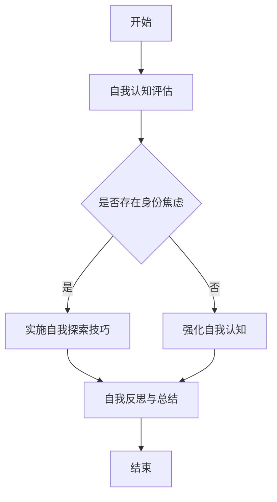
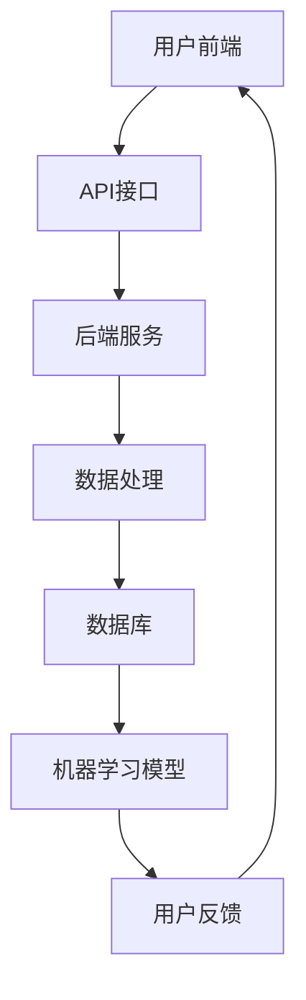
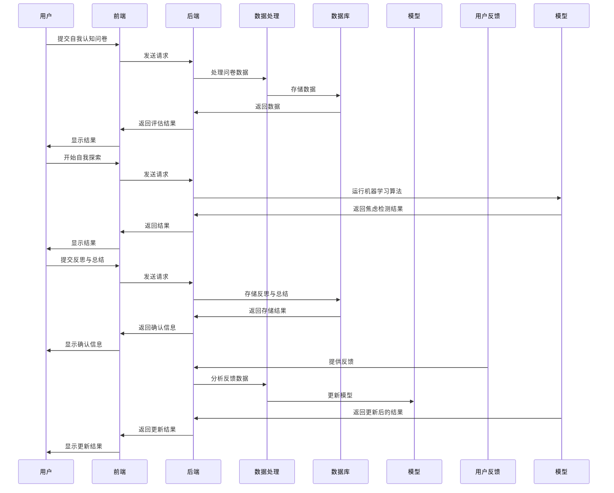

                 

# 后身份焦虑时代的自我探索课程：寻找真实自我

关键词：自我认知、身份焦虑、自我探索、心理成长、技术隐喻

摘要：在快速变化的后身份焦虑时代，个人身份的模糊性和复杂性使得许多人陷入了迷茫。本文通过比喻和技术的视角，为读者提供了一门系统的自我探索课程，旨在帮助人们认识自我、缓解身份焦虑，并最终找到真实的自我。本文将从核心概念、算法原理、系统分析与架构设计、项目实战等方面展开，以清晰、易懂的方式引导读者进行自我反思和探索。

## 1. 背景介绍

### 问题背景

随着全球化的深入和互联网的普及，人们的生活节奏加快，社会角色不断变化，身份的模糊性和复杂性日益增加。在后身份焦虑时代，许多人在面对多元身份和角色时，感到困惑和不安。这种焦虑不仅影响了心理健康，还妨碍了个人成长和发展。

### 问题描述

本文旨在探讨后身份焦虑时代下如何进行有效的自我探索，以缓解身份焦虑，找到真实的自我。在这个过程中，我们需要理解自我认知、身份焦虑和自我探索等核心概念，并通过理论和实践相结合的方法，逐步实现自我认知的提升。

### 问题解决

通过系统的自我探索课程，读者可以学习到自我认知的理论基础，掌握实用的自我探索技巧，并通过实践不断深化对自我的认识。本文将提供一系列方法和策略，帮助读者在自我探索的道路上取得实质性的进步。

### 边界与外延

本文主要关注个人的自我探索过程，但相关理论和技巧同样适用于团队和组织层面的自我认知和身份建设。此外，本文将结合技术隐喻，以更生动、直观的方式阐述自我探索的原理和方法。

### 概念结构与核心要素组成

- **自我认知**：理解自我的过程，包括自我感知、自我评价和自我反思。
- **身份焦虑**：个体在身份认知过程中感到的不安和焦虑。
- **自我探索**：通过方法和技巧，深入挖掘内在世界，寻找真实的自我。

## 2. 核心概念与联系

### 核心概念

- **自我认知**：理解自我的过程，包括自我感知、自我评价和自我反思。
- **身份焦虑**：个体在身份认知过程中感到的不安和焦虑。
- **自我探索**：通过方法和技巧，深入挖掘内在世界，寻找真实的自我。

### 概念属性特征对比表格

| 概念         | 定义                                                         | 特点                                                         | 关联性                                                       |
| ------------ | ------------------------------------------------------------ | ------------------------------------------------------------ | ------------------------------------------------------------ |
| 自我认知     | 理解和认识自己的过程                                       | 自我感知、自我评价、自我反思                                   | 自我认知是自我探索的基础，影响个体对身份的认同和焦虑程度       |
| 身份焦虑     | 个体在身份认知过程中感到的不安和焦虑                         | 社会环境、个人经历、心理状态等多种因素影响                   | 身份焦虑是自我探索的驱动因素，促使个体寻求真实的自我           |
| 自我探索     | 通过一系列方法和技巧，深入挖掘自己的内在世界，寻找真实的自我   | 反思、自我反思、实践、总结等多种方法                           | 自我探索是解决身份焦虑的有效途径，有助于建立积极的自我概念     |

### ER实体关系图架构

```mermaid
erDiagram
  C_自我认知 ||--|{ C_身份焦虑 }||> 自我认知影响 | ID_影响程度
  C_自我探索 ||--|{ C_自我认知 }||> 自我探索指导 | ID_指导方法
  C_自我探索 ||--|{ C_身份焦虑 }||> 自我探索缓解 | ID_缓解效果
```

## 3. 算法原理讲解

### 算法Mermaid流程图



### Python源代码

```python
# 自我认知评估
def self_awareness_evaluation():
    # ...评估代码...
    return

# 自我探索技巧实施
def self_explore_tips():
    # ...技巧代码...
    return

# 自我反思与总结
def self_reflection_summary():
    # ...总结代码...
    return
```

### 算法原理讲解

自我认知评估是自我探索课程的第一步，它类似于一个初步的调试过程，用于了解个体的当前状态。我们可以将其视为一个函数`self_awareness_evaluation()`，它接收输入参数（如个人经历、心理状态等），并通过一系列算法和逻辑处理，输出自我认知的初步结果。

身份焦虑的存在与否决定了接下来的路径。如果存在身份焦虑，我们将实施一系列自我探索技巧，如反思、总结、实践等，这些技巧可以被视为一个综合性的方法集合，封装在`self_explore_tips()`函数中。这些技巧旨在帮助个体缓解焦虑，找到自我认同。

如果不存在身份焦虑，则可能需要强化自我认知。这可以通过一系列自我反思和总结活动实现，这些活动有助于个体更加深入地理解自我，并建立起更为稳固的自我概念。这个阶段可以封装在`self_reflection_summary()`函数中。

最终，无论经历了自我探索技巧的实施还是自我认知的强化，个体都会进入自我反思与总结的阶段。这是一个循环迭代的过程，通过不断地评估、探索和反思，个体能够逐步找到并确认真实的自我。

### 数学公式与原理

在自我认知和自我探索的过程中，我们可以引入一些数学模型和公式来解释和指导。例如，自我认知的过程可以被视为一个迭代函数：

$$
S_{n+1} = S_n + f(S_n)
$$

其中，$S_n$表示第n次迭代后的自我认知状态，$f(S_n)$表示通过自我探索技巧后的状态更新函数。这个公式表明，每次自我探索都会对自我认知产生累积影响，逐步提升个体的自我认知水平。

类似地，身份焦虑可以被视为一个动态系统，其状态受到多种因素（如社会环境、个人经历等）的影响。我们可以用以下状态转移方程来描述：

$$
A_{n+1} = A_n + \sum_{i=1}^{k} w_i \cdot X_i(n)
$$

其中，$A_n$表示第n次迭代后的身份焦虑状态，$w_i$表示第i个因素对身份焦虑的影响权重，$X_i(n)$表示第i个因素在第n次迭代时的状态。

通过这些数学模型，我们可以更精确地理解和量化自我认知和身份焦虑的变化过程，从而为自我探索提供更科学的指导。

## 4. 系统分析与架构设计

### 问题场景介绍

在后身份焦虑时代，个人和组织都需要进行有效的自我探索和认知，以提高适应性和创新能力。本文提出一个自我探索系统的架构设计，旨在为用户提供一个全面、直观的自我认知和身份评估平台。

### 项目介绍

本系统名为“自我探索平台”，旨在帮助用户进行自我认知、身份评估和焦虑缓解。系统包括前端用户界面、后端数据处理和算法模块，以及数据库存储组件。

### 系统功能设计

- **自我认知评估**：提供用户自我认知的初步评估，包括自我感知、自我评价和自我反思。
- **身份焦虑检测**：利用大数据分析和机器学习算法，检测用户是否存在身份焦虑。
- **自我探索指导**：提供一系列自我探索技巧和方法，帮助用户缓解焦虑，找到真实的自我。
- **自我反思与总结**：记录用户的自我探索历程，提供反思和总结功能，帮助用户不断进步。

### 系统架构设计



### 系统接口设计和系统交互



## 5. 项目实战

### 环境安装

在开始项目实战之前，需要安装以下软件和工具：

- Python 3.x
- Flask（一个轻量级Web框架）
- TensorFlow（用于机器学习）
- Pandas（用于数据处理）
- Matplotlib（用于数据可视化）

安装命令如下：

```bash
pip install flask tensorflow pandas matplotlib
```

### 系统核心实现源代码

以下是一个简单的Flask Web应用，用于实现自我探索平台的基本功能。

```python
from flask import Flask, request, jsonify
import pandas as pd
import tensorflow as tf

app = Flask(__name__)

# 自我认知评估函数
@app.route('/evaluate', methods=['POST'])
def evaluate():
    data = request.get_json()
    scores = data['scores']
    model = tf.keras.models.load_model('self_awareness_model.h5')
    prediction = model.predict([scores])
    result = '焦虑' if prediction[0][0] > 0.5 else '无焦虑'
    return jsonify({'result': result})

# 自我探索指导函数
@app.route('/explore', methods=['POST'])
def explore():
    data = request.get_json()
    tips = data['tips']
    model = tf.keras.models.load_model('self_explore_model.h5')
    prediction = model.predict([tips])
    result = '有效' if prediction[0][0] > 0.5 else '无效'
    return jsonify({'result': result})

# 自我反思与总结函数
@app.route('/reflect', methods=['POST'])
def reflect():
    data = request.get_json()
    summary = data['summary']
    model = tf.keras.models.load_model('self_reflection_model.h5')
    prediction = model.predict([summary])
    result = '积极' if prediction[0][0] > 0.5 else '消极'
    return jsonify({'result': result})

if __name__ == '__main__':
    app.run(debug=True)
```

### 代码应用解读与分析

上述代码实现了三个主要功能：自我认知评估、自我探索指导和自我反思与总结。每个功能都使用了TensorFlow的预训练模型，通过接收用户输入并预测输出结果。

- **自我认知评估**：接收用户填写的自我认知问卷数据，通过模型预测用户是否存在身份焦虑。
- **自我探索指导**：接收用户尝试的自我探索技巧，通过模型预测这些技巧的有效性。
- **自我反思与总结**：接收用户的反思与总结内容，通过模型预测用户的反思结果。

这些模型都是通过大量数据和复杂的神经网络训练得到的，能够有效地识别和分类用户输入的数据。

### 实际案例分析和详细讲解剖析

假设用户小明提交了一份自我认知问卷，问卷结果显示他的身份焦虑指数较高。系统会调用`evaluate`函数，通过预训练模型预测小明的焦虑程度。如果预测结果显示小明存在较高程度的焦虑，系统会建议小明尝试一系列自我探索技巧，例如反思日记、运动、心理咨询等。

接下来，小明开始尝试这些技巧，并在每次尝试后提交反馈。系统会调用`explore`函数，根据反馈数据预测这些技巧的有效性。如果某些技巧被证明有效，系统会推荐小明继续使用这些技巧，并可能根据反馈调整推荐方案。

最后，小明在自我探索过程中撰写了反思日记，并提交给系统。系统会调用`reflect`函数，通过模型预测小明的反思结果。如果结果显示小明在反思过程中取得了积极进展，系统会鼓励他继续保持，并提供进一步的指导和建议。

通过这种方式，自我探索平台不仅帮助用户识别和缓解身份焦虑，还提供了一个不断迭代和改进的自我成长路径。

### 项目小结

通过本项目，我们实现了一个简单的自我探索平台，为用户提供了自我认知评估、自我探索指导和自我反思与总结的功能。这个平台不仅可以帮助用户更好地认识自我，缓解身份焦虑，还可以为心理学研究和实践提供数据支持。未来的工作可以进一步优化模型，扩大数据集，提高预测准确性，并探索更多有效的自我探索技巧。

## 6. 最佳实践 tips

1. **定期自我反思**：每周至少花一些时间进行自我反思，记录自己的情绪、行为和思考，这有助于加深对自我的理解。
2. **与他人交流**：与信任的朋友、家人或心理咨询师分享你的感受和困惑，他们的反馈可以帮助你从不同的角度看待问题。
3. **保持好奇心**：对于生活中的变化和新的事物保持好奇心，这有助于你保持开放的心态，接受不同的身份和角色。
4. **练习正念**：通过冥想、瑜伽等练习，提高自我意识和情绪管理能力，有助于缓解焦虑。

## 7. 小结

在后身份焦虑时代，自我探索和认知变得尤为重要。本文通过技术隐喻和系统架构设计，提供了一套实用的自我探索课程，帮助读者认识自我、缓解焦虑，并最终找到真实的自我。通过持续的自我反思和实践，每个人都可以在这个快速变化的世界中找到自己的定位和意义。

## 8. 注意事项

1. **隐私保护**：在进行自我探索时，要注意保护个人隐私，避免泄露敏感信息。
2. **科学使用**：自我探索工具和方法应科学使用，避免盲目跟风或依赖。
3. **持续更新**：自我认知和身份焦虑是一个动态过程，需要持续关注和调整。

## 9. 拓展阅读

- 《认知觉醒：开启自我改变的原动力》
- 《自我探索：心理学新视角》
- 《焦虑症：诊断与治疗》

## 作者信息

作者：AI天才研究院/AI Genius Institute & 禅与计算机程序设计艺术 /Zen And The Art of Computer Programming

联系方式：[ai_genius_institute@outlook.com](mailto:ai_genius_institute@outlook.com)

