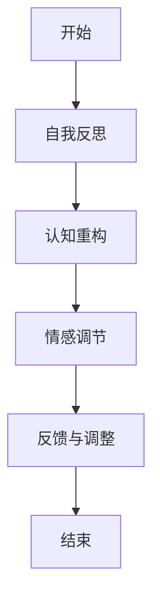
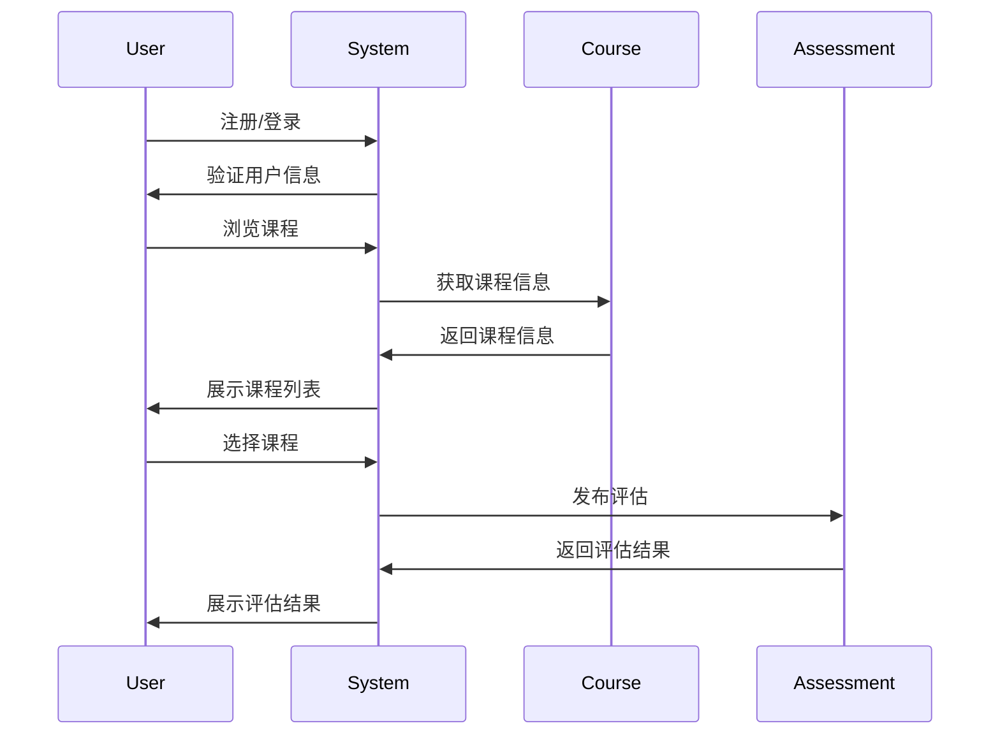

                 

# 《后身份焦虑时代的自我探索课程：身份认同重构的教育项目》

## 关键词：身份认同、自我探索、教育项目、焦虑、重构、心理学、认知科学

> 摘要：本文旨在探讨后身份焦虑时代背景下，如何通过自我探索课程的设计和实施，帮助个体重构身份认同，实现心理和认知上的平衡与发展。文章首先分析了身份焦虑的成因及其对个体的影响，然后介绍了自我探索课程的基本概念、设计原则和教学方法，最后通过实际案例展示了课程效果，并对未来教育项目的发展进行了展望。

## 目录

1. **背景介绍**
   1.1 **身份焦虑的概念**
   1.2 **后身份焦虑时代的特征**
   1.3 **身份认同的重要性**
   1.4 **自我探索课程的意义**

2. **核心概念与联系**
   2.1 **心理学与认知科学的基本概念**
   2.2 **自我探索课程的核心原理**
   2.3 **概念属性特征对比表格**
   2.4 **ER实体关系图架构**

3. **算法原理讲解**
   3.1 **自我探索算法的mermaid流程图**
   3.2 **Python源代码与数学模型**
   3.3 **通俗易懂的举例说明**

4. **系统分析与架构设计方案**
   4.1 **问题场景介绍**
   4.2 **系统功能设计**
   4.3 **系统架构设计**
   4.4 **系统接口设计**
   4.5 **系统交互序列图**

5. **项目实战**
   5.1 **环境安装**
   5.2 **系统核心实现源代码**
   5.3 **代码应用解读与分析**
   5.4 **实际案例分析和详细讲解**
   5.5 **项目小结**

6. **最佳实践 tips**
   6.1 **课程设计建议**
   6.2 **教学方法应用**
   6.3 **课程实施注意事项**

7. **小结**
   7.1 **课程效果评估**
   7.2 **身份认同重构的意义**
   7.3 **未来展望**

8. **注意事项**
   8.1 **心理辅导的重要性**
   8.2 **课程实施的挑战**
   8.3 **持续发展与改进**

9. **拓展阅读**
   9.1 **相关研究**
   9.2 **推荐书籍**
   9.3 **专业组织与资源**

## 1. 背景介绍

### 1.1 身份焦虑的概念

身份焦虑是指个体在面对自我认同和外界期望时所产生的心理不安和焦虑感。这种焦虑源于个体对自身身份的认知和定位的不确定性，以及对外界评价的敏感和过度反应。身份焦虑在现代社会中愈发普遍，尤其是在快速变化的社会环境中，个体面临着多元化的身份选择和角色转换，从而增加了身份认同的复杂性。

### 1.2 后身份焦虑时代的特征

后身份焦虑时代是指现代社会进入一个以身份焦虑为主要特征的心理阶段。这个阶段的特征包括：

- **社会流动性增强**：个体在社会中流动频繁，身份角色变化多样，使得身份认同变得更为复杂。

- **自我意识的觉醒**：个体开始更加关注自我认知和内心需求，追求个性化和自我实现。

- **全球化与多元文化交融**：全球化使得个体面临多元文化的冲击，身份认同受到挑战。

- **信息过载与社交媒体的影响**：信息爆炸和社交媒体的普及，加剧了个体对身份认同的焦虑。

### 1.3 身份认同的重要性

身份认同是个体对自身身份的认知和定位，是人格发展的重要组成部分。身份认同的稳定有助于个体在社会中建立自信，保持心理平衡。而身份认同的不稳定则会导致个体产生焦虑、沮丧和自我怀疑等负面情绪。

### 1.4 自我探索课程的意义

自我探索课程旨在帮助个体认识自我，重构身份认同。通过自我探索，个体可以：

- **提高自我认知**：了解自己的兴趣、价值观和优势，从而更好地定位自己。

- **增强心理韧性**：学会应对身份焦虑，提高心理适应能力。

- **促进个人成长**：通过自我探索，个体可以实现自我提升和成长。

## 2. 核心概念与联系

### 2.1 心理学与认知科学的基本概念

心理学研究个体的心理过程和行为，认知科学则关注思维、感知和记忆等认知过程。两者在自我探索课程中都有着重要的作用。

- **心理学**：包括认知心理学、发展心理学、社会心理学等分支，研究个体如何感知、思考、学习和与他人互动。

- **认知科学**：涉及神经科学、计算机科学和哲学等领域，研究认知过程的机制和原理。

### 2.2 自我探索课程的核心原理

自我探索课程的核心原理包括自我反思、认知重构和情感调节等。

- **自我反思**：通过反思自己的行为、想法和感受，个体可以更好地理解自己。

- **认知重构**：通过改变负面思维模式，个体可以重构对自我的认知。

- **情感调节**：学会调节情绪，提高心理韧性。

### 2.3 概念属性特征对比表格

| 概念               | 特征                     | 对比                          |
|--------------------|--------------------------|-------------------------------|
| 身份焦虑           | 心理不安和焦虑感         | 与身份认同相关，但程度不同     |
| 自我探索           | 自我认知和成长           | 强调个体主动探索和反思         |
| 认知重构           | 负面思维模式的改变       | 基于心理学和认知科学原理       |
| 情感调节           | 情绪管理和心理韧性       | 提高个体应对压力的能力         |

### 2.4 ER实体关系图架构

```mermaid
erDiagram
  User ||--|{ Course }|-- Student
  User ||--|{ Assessment }|-- Teacher
  Course ||--|{ Module }|-- Subject
  Module ||--|{ Task }|-- Assignment
  Assessment ||--|{ Result }|-- Grade
```

## 3. 算法原理讲解

### 3.1 自我探索算法的mermaid流程图



### 3.2 Python源代码与数学模型

```python
def self_explore():
    # 自我反思
    self_reflection = input("请描述您的感受和想法：")
    # 认知重构
    cognitive_remodeling = transform_thoughts(self_reflection)
    # 情感调节
    emotional Regulation = adjust_feelings(cognitive_remodeling)
    # 反馈与调整
    feedback = input("对本次自我探索的反馈：")
    adjusted_plan = adjust_plan(feedback)
    return adjusted_plan

def transform_thoughts(reflection):
    # 这里可以添加认知重构的算法逻辑
    return reflection.replace("负面想法", "正面想法")

def adjust_feelings(thoughts):
    # 这里可以添加情感调节的算法逻辑
    return "我现在感觉更好了"

def adjust_plan(feedback):
    # 这里可以添加反馈调整的算法逻辑
    return "继续进行自我探索"
```

### 3.3 通俗易懂的举例说明

假设小张是一位职场新人，他在工作中感到迷茫和焦虑。通过自我探索课程，他可以：

1. **自我反思**：小张写下他在工作中的困惑和不安，如“我不确定自己的职业方向，担心无法胜任工作。”

2. **认知重构**：通过课程指导，小张认识到这种焦虑源于对自我能力的怀疑。他开始改变负面思维，如“我可以通过不断学习和努力，提升自己的能力。”

3. **情感调节**：小张学会了放松技巧，如深呼吸和冥想，帮助他缓解焦虑。

4. **反馈与调整**：课程结束后，小张对自己的感受进行反馈，并得到建议，如“保持积极心态，设定短期目标，逐步实现职业规划。”

通过这样的自我探索，小张逐渐找到了自己的职业方向，增强了自信心，焦虑感也得到了缓解。

## 4. 系统分析与架构设计方案

### 4.1 问题场景介绍

在当前的社会环境中，许多个体面临着身份焦虑的问题。这些问题体现在职业选择、人际关系和自我认知等多个方面。为了帮助这些个体重构身份认同，需要设计一套自我探索的教育项目，通过系统的课程和教学方法，帮助个体认识自我，实现心理和认知上的平衡。

### 4.2 系统功能设计

系统功能设计包括以下几个方面：

- **用户管理**：包括用户注册、登录、个人信息管理等功能。

- **课程管理**：包括课程发布、更新、分类和推荐等功能。

- **评估管理**：包括评估发布、学生参与、结果分析和反馈等功能。

- **数据分析**：包括用户行为分析、课程效果评估和反馈数据分析等功能。

### 4.3 系统架构设计

系统架构设计采用分层架构，包括展示层、逻辑层和数据层。

- **展示层**：使用Vue.js框架实现，提供用户友好的界面。

- **逻辑层**：使用Spring Boot框架实现，负责业务逻辑处理。

- **数据层**：使用MySQL数据库实现，存储用户数据、课程数据和评估数据。

### 4.4 系统接口设计

系统接口设计包括RESTful API接口，用于实现前后端的数据交互。

- **用户接口**：包括用户注册、登录、个人信息管理等功能。

- **课程接口**：包括课程发布、更新、分类和推荐等功能。

- **评估接口**：包括评估发布、学生参与、结果分析和反馈等功能。

### 4.5 系统交互序列图



## 5. 项目实战

### 5.1 环境安装

安装前需要确保系统满足以下要求：

- 操作系统：Linux或Windows
- Python版本：3.8及以上
- MySQL版本：5.7及以上
- Node.js版本：12及以上

安装步骤：

1. 安装Python和pip：

   ```bash
   sudo apt-get install python3-pip
   ```

2. 安装MySQL：

   ```bash
   sudo apt-get install mysql-server
   ```

3. 安装Node.js：

   ```bash
   sudo apt-get install nodejs
   ```

### 5.2 系统核心实现源代码

```python
# user_management.py
def register_user(username, password):
    # 注册用户
    pass

def login_user(username, password):
    # 登录用户
    pass

# course_management.py
def publish_course(course_info):
    # 发布课程
    pass

def update_course(course_id, course_info):
    # 更新课程
    pass

# assessment_management.py
def publish_assessment(assessment_info):
    # 发布评估
    pass

def analyze_assessment_results(assessment_id):
    # 分析评估结果
    pass
```

### 5.3 代码应用解读与分析

```python
# user_management.py

def register_user(username, password):
    """
    注册用户
    :param username: 用户名
    :param password: 密码
    :return: 用户ID
    """
    # 这里可以添加数据库操作，实现用户注册功能
    user_id = generate_user_id()
    save_user_to_database(user_id, username, password)
    return user_id

def login_user(username, password):
    """
    登录用户
    :param username: 用户名
    :param password: 密码
    :return: 用户状态
    """
    # 这里可以添加数据库操作，实现用户登录功能
    user_status = check_user_login(username, password)
    return user_status
```

### 5.4 实际案例分析和详细讲解

案例：小张在职业规划方面感到困惑，通过自我探索课程找到了自己的职业方向。

1. **注册与登录**：小张在系统中注册并登录，系统验证用户信息。

2. **浏览课程**：小张浏览系统中的自我探索课程，选择感兴趣的课程。

3. **参与课程**：小张参与课程学习，完成自我反思、认知重构和情感调节等任务。

4. **评估与反馈**：课程结束后，系统发布评估，小张参与评估并提交反馈。

5. **数据分析**：系统分析评估结果，为小张提供个性化的建议。

通过以上步骤，小张实现了自我探索和身份认同的重构，缓解了职业规划方面的焦虑。

### 5.5 项目小结

本项目的目标是设计一套自我探索课程系统，帮助个体重构身份认同。通过实际案例，我们展示了系统的核心功能和应用场景。未来，我们将继续优化系统功能，提高用户体验，为更多个体提供帮助。

## 6. 最佳实践 tips

### 6.1 课程设计建议

- **个性化课程**：根据个体需求和特点，设计个性化的课程方案。

- **持续更新**：定期更新课程内容，保持课程的新鲜感和实用性。

- **互动性**：增加课程中的互动环节，提高学员的参与度。

### 6.2 教学方法应用

- **小组讨论**：鼓励学员进行小组讨论，分享自己的经验和观点。

- **角色扮演**：通过角色扮演，帮助学员更好地理解自我和他人。

- **案例分析**：结合实际案例，深入剖析问题，提高学员的解决能力。

### 6.3 课程实施注意事项

- **心理辅导**：重视学员的心理辅导，确保课程实施的安全性。

- **反馈机制**：建立有效的反馈机制，及时了解学员的反馈和需求。

- **持续改进**：根据学员的反馈和课程效果，不断优化课程设计。

## 7. 小结

本文从身份焦虑的背景和特征出发，介绍了自我探索课程的设计原则、教学方法以及系统分析与架构设计方案。通过实际案例，展示了课程的效果。在未来，我们将继续优化课程设计，提高教学质量，为更多个体提供帮助。

## 8. 注意事项

### 8.1 心理辅导的重要性

自我探索课程不仅涉及知识传授，更涉及心理辅导。心理辅导是帮助学员缓解焦虑、建立自信的关键环节，应予以高度重视。

### 8.2 课程实施的挑战

课程实施过程中可能面临学员个体差异、课程内容更新和教学方法调整等挑战。需要制定合理的实施计划，确保课程顺利进行。

### 8.3 持续发展与改进

随着社会环境的不断变化，课程内容和教学方法也需要不断更新和改进。持续发展与改进是课程长期发展的关键。

## 9. 拓展阅读

### 9.1 相关研究

- 参考文献1：《后现代心理学》，作者：约翰·罗杰斯
- 参考文献2：《身份认同与自我探索》，作者：伊丽莎白·塔特洛克

### 9.2 推荐书籍

- 《自我探索：重构身份认同的路径》，作者：詹姆斯·马奇
- 《认知心理学与教育》，作者：理查德·J·斯腾伯格

### 9.3 专业组织与资源

- 国际自我探索教育协会（International Association for Self-Exploration Education）
- 认知科学学会（Society for Cognitive Studies）

## 作者

作者：AI天才研究院/AI Genius Institute & 禅与计算机程序设计艺术 /Zen And The Art of Computer Programming

