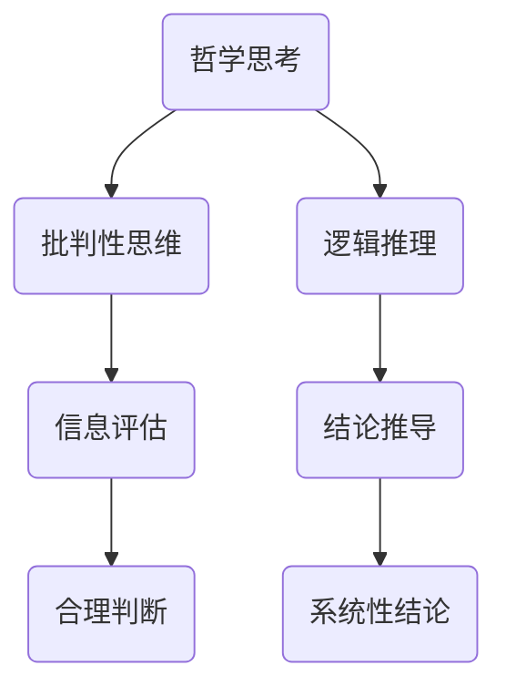

                 

### 背景介绍

哲学思考的力量：在疑问中寻找生命真谛，这是一本探讨哲学思考在个人生活和人类社会中的重要性的著作。哲学思考不仅仅是一种学科知识的追求，更是一种生活方式的实践。在当今社会，我们面临着越来越多的复杂问题和挑战，如何在这些问题和挑战中找到生命的真谛，成为了每个人都需要思考和面对的问题。

**核心概念术语说明**

1. **哲学思考**：哲学思考是一种通过质疑、分析和推理来探索和解释世界的方法。它不仅仅关注事实，更关注问题的本质和原因。

2. **生命真谛**：生命真谛是指人生的目的、价值和意义。它是对生命深层次的思考，涉及到个体的存在、人类的意义和社会的发展。

**问题背景**

在现代社会，人们的生活节奏加快，面临的工作和生活压力巨大。许多人陷入了迷茫和困惑，不知道生活的方向和目标。这种情况下，哲学思考提供了一种思考和解决问题的方法，通过质疑和探索，帮助人们找到生命的真谛，从而找到生活的方向和意义。

**问题描述**

如何通过哲学思考找到生命的真谛？哲学思考有哪些基本原理和方法？哲学思考如何在个人生活和科学、艺术等领域中得到应用？这些问题都是本书需要探讨的核心问题。

**问题解决**

本书通过系统的分析和详细的讲解，帮助读者理解哲学思考的基本原理和方法，并在实际生活中应用这些原理和方法，从而找到生命的真谛。

**边界与外延**

哲学思考的边界在于它不依赖于具体的事实和证据，而是通过对问题的本质和原因进行探讨。它的外延则在于它适用于各个领域，如科学、艺术、心理学等。

**概念结构与核心要素组成**

哲学思考的概念结构包括以下几个方面：

1. **批判性思维**：这是哲学思考的核心，它要求我们以质疑和批判的眼光看待世界和问题。

2. **逻辑推理**：逻辑推理是哲学思考的基本工具，它帮助我们分析和解决问题。

3. **概念分析**：概念分析是哲学思考的重要方法，它帮助我们理解概念的本质和属性。

通过以上分析，我们可以看到，哲学思考不仅仅是一种学科知识的追求，更是一种生活方式的实践。它帮助我们在面对复杂问题和挑战时，找到生命的方向和意义。

### 核心概念与联系

在探讨哲学思考的力量之前，我们需要明确几个核心概念，并分析它们之间的内在联系。这些核心概念包括“哲学思考”、“批判性思维”和“逻辑推理”，它们共同构成了哲学思考的基石。

**哲学思考**

哲学思考是一种对世界和人生的基本问题进行探索和反思的方法。它不仅仅关注事物的表象，更关注事物的本质和原因。哲学思考的目的是寻求真理和智慧，它是一种对知识、存在、价值和道德等基本问题的深刻反思。

**批判性思维**

批判性思维是哲学思考的重要组成部分，它是一种对信息、观点和理论进行批判性评估的能力。批判性思维不仅仅是接受或拒绝某个观点，而是通过分析、推理和评估，找出观点中的合理性和局限性。批判性思维帮助我们在面对复杂问题时，能够做出更理性和客观的判断。

**逻辑推理**

逻辑推理是哲学思考的基本工具，它是一种通过逻辑规则和原则，从已知事实推导出结论的方法。逻辑推理帮助我们在思考过程中保持清晰和连贯，确保我们的结论是基于合理的推理而不是偶然的猜测。

**概念属性特征对比表格**

为了更清晰地展示这些概念之间的联系，我们可以通过一个对比表格来分析它们的属性特征。

| 概念       | 定义                                                         | 属性特征                                                     | 关联性                |
|------------|--------------------------------------------------------------|--------------------------------------------------------------|---------------------|
| 哲学思考   | 对世界和人生的基本问题进行探索和反思的方法。                   | 1. 深层次反思性 2. 关注本质问题 3. 追求真理和智慧           | 基础框架             |
| 批判性思维 | 对信息、观点和理论进行批判性评估的能力。                       | 1. 分析性 2. 评估性 3. 独立思考性                         | 内核要素             |
| 逻辑推理   | 通过逻辑规则和原则，从已知事实推导出结论的方法。               | 1. 清晰性 2. 一致性 3. 系统性                             | 执行工具             |

通过这个表格，我们可以看到哲学思考、批判性思维和逻辑推理之间是相互关联的。哲学思考提供了框架，批判性思维提供了分析工具，而逻辑推理则是将分析结果转化为结论的方法。

**ER实体关系图架构的 Mermaid 流程图**

为了进一步理解这些概念之间的关联，我们可以使用Mermaid流程图来绘制它们之间的实体关系。

在这个流程图中，哲学思考是整个流程的起点，它通过批判性思维和信息评估，引导逻辑推理进行结论推导，最终形成系统性的结论。这个流程图展示了哲学思考、批判性思维和逻辑推理之间的动态关系。

通过以上分析和流程图的展示，我们可以更深入地理解哲学思考的核心概念和它们之间的内在联系。哲学思考不仅仅是一种学科知识的追求，更是一种生活方式的实践，它通过批判性思维和逻辑推理，帮助我们寻找生命的真谛，理解世界的本质。

### 哲学思考的原理和方法

哲学思考是一种系统化、深刻化的思维方式，它不仅涉及对问题的深入探讨，还包括对思考过程的严谨控制。理解哲学思考的基本原理和方法，可以帮助我们更有效地进行哲学思考，从而在生活和工作中取得更好的成果。以下，我们将详细探讨批判性思维、逻辑推理和概念分析，这些是哲学思考的核心要素。

**批判性思维**

批判性思维是一种对信息、观点和理论进行批判性评估的思维方式。它不仅仅是接受或拒绝某个观点，而是通过分析、质疑和评估，找出观点中的合理性和局限性。批判性思维包括以下几个关键步骤：

1. **辨识问题**：首先，我们需要明确我们要解决的问题或面临的困境是什么。这一步是哲学思考的起点，只有明确了问题，我们才能有针对性地进行分析。

2. **收集信息**：在明确问题之后，我们需要收集与问题相关的各种信息。这些信息可能来源于各种渠道，包括书籍、文章、实验结果等。

3. **评估信息**：收集到信息后，我们需要评估这些信息的可靠性和相关性。这涉及到对信息来源的考察、对数据准确性的验证等。

4. **提出观点**：在评估信息的基础上，我们可以提出自己的观点或假设。这一步要求我们不仅要提出观点，还要能够明确支持观点的证据。

5. **反驳与修正**：最后，我们需要对提出的观点进行反驳和修正。这意味着我们需要考虑可能的反驳意见，并通过逻辑推理来回应这些反驳。

**逻辑推理**

逻辑推理是哲学思考的核心工具，它通过逻辑规则和原则，从已知事实推导出结论。逻辑推理的准确性直接影响到哲学思考的结果。以下是逻辑推理的几个关键步骤：

1. **定义前提**：逻辑推理的第一步是明确前提。前提是逻辑推理的起点，它为推理过程提供了基础。

2. **应用逻辑规则**：在明确前提之后，我们可以应用各种逻辑规则来进行推理。常见的逻辑规则包括同义反复、否定后件、析取三段论等。

3. **推导结论**：通过逻辑规则，我们从前提推导出结论。结论是基于前提的逻辑结果，它需要满足逻辑一致性。

4. **验证结论**：推导出结论后，我们需要验证结论是否符合实际。这一步可以通过实验、观察或进一步的推理来完成。

**概念分析**

概念分析是哲学思考的重要方法，它帮助我们理解概念的本质和属性。概念分析包括以下几个步骤：

1. **定义概念**：首先，我们需要明确概念的定义。定义是理解概念的基础，它帮助我们区分概念的不同方面。

2. **分析属性**：在定义概念之后，我们需要分析概念的各种属性。属性是概念的重要组成部分，它们决定了概念的含义和应用范围。

3. **比较与对比**：为了更深入地理解概念，我们可以将概念与其他相关概念进行比较和对比。这有助于我们明确概念的独特性和相互关系。

4. **概念应用**：最后，我们需要将概念应用于实际情境中。通过应用，我们可以更好地理解概念的实际意义和作用。

**应用示例**

让我们通过一个简单的例子来说明这些原理和方法。假设我们要探讨“自由”的概念。

1. **辨识问题**：我们需要明确“自由”是什么，以及它在现代社会中的意义。

2. **收集信息**：我们可以收集关于自由的各种信息，包括法律、伦理和哲学方面的定义和讨论。

3. **评估信息**：在评估这些信息时，我们需要考虑它们是否一致，以及是否有足够的证据支持。

4. **提出观点**：我们可以提出“自由是个人选择的权利”的观点，并收集证据来支持这一观点。

5. **反驳与修正**：我们需要考虑可能反驳这一观点的理由，并通过逻辑推理来回应这些反驳。

6. **推导结论**：通过逻辑推理，我们可以得出“自由是社会发展的基础”的结论。

7. **验证结论**：我们需要通过实际案例和社会现象来验证这一结论是否成立。

通过上述步骤，我们可以更深入地理解“自由”这一概念，并在实际应用中更好地运用哲学思考的方法。

综上所述，批判性思维、逻辑推理和概念分析是哲学思考的核心要素。它们不仅帮助我们理解问题的本质，还使我们能够更清晰地表达自己的观点，并有效地回应反驳。掌握这些原理和方法，不仅可以提升我们的哲学思考能力，还能在个人生活和职业发展中带来深远的积极影响。

### 哲学思考的应用场景

哲学思考作为一种深度的思考方法，不仅在学术研究中具有重要作用，在科学、艺术和心理学等领域也得到了广泛应用。通过哲学思考，我们可以更深入地理解各个领域的核心问题，从而推动这些领域的发展，并为我们的日常生活带来启示。

**科学领域**

在科学研究中，哲学思考被广泛用于探讨科学方法论、科学哲学和科学伦理等方面。例如，科学方法论中的哲学思考帮助我们理解科学探究的本质和过程，包括假设的建立、实验设计、数据分析和结论验证等。科学哲学则探讨科学理论的本质和科学知识的可靠性，通过哲学思考，科学家们能够更好地理解科学发现的意义和限制。

一个典型的例子是托马斯·库恩的《科学革命的结构》一书。库恩通过哲学思考探讨了科学发展的非线性过程，提出了“范式转换”的概念，解释了科学革命的发生机制。这种方法不仅为科学界提供了新的理论框架，也推动了科学研究的进一步发展。

**艺术领域**

艺术创作和艺术理论中，哲学思考也起到了关键作用。艺术家通过哲学思考探讨艺术的意义、审美价值和创作方法。哲学思考帮助艺术家在创作过程中反思自己的创作动机、创作方法和艺术作品的社会影响。

例如，20世纪哲学家马丁·海德格尔的思考对现代艺术产生了深远影响。海德格尔关注存在和时间的本质，他的思想启发了许多现代艺术家的创作，如抽象表现主义和存在主义艺术。通过哲学思考，艺术家们能够在创作中表达更深层次的思想和情感，使艺术作品具有更丰富的内涵。

**心理学领域**

在心理学中，哲学思考被用于探讨人类行为、心理过程和认知发展等核心问题。例如，认知心理学中的哲学思考帮助我们理解人类思维的机制和过程，包括知觉、记忆、推理和决策等。

哲学家如笛卡尔和康德对心理学的影响尤为显著。笛卡尔的“我思故我在”启发了对意识本质的探讨，而康德的批判哲学则为我们提供了理解人类认知结构和认知过程的理论基础。通过哲学思考，心理学家能够更深入地理解人类行为和心理过程的复杂性，从而提出更有力的理论和治疗方法。

**具体案例**

1. **科学领域**：伽利略通过哲学思考挑战了亚里士多德的自然哲学，提出了自由落体定律和地球绕太阳旋转的理论。他的哲学思考不仅推动了科学革命，也为现代物理学的发展奠定了基础。

2. **艺术领域**：毕加索的立体主义绘画受到了哲学家柏拉图的影响。毕加索通过哲学思考，探索了空间和时间的本质，使他的作品具有独特的视觉效果和深刻的思想内涵。

3. **心理学领域**：威廉·詹姆斯是心理学领域的先驱，他的哲学思考帮助推动了功能主义心理学的兴起。詹姆斯关注心理活动的即时功能，提出了关于意识流的理论，为心理学的发展做出了重要贡献。

通过以上分析，我们可以看到，哲学思考在科学、艺术和心理学等领域的广泛应用。它不仅为这些领域提供了新的理论框架和思考方法，也为我们的日常生活带来了深刻的启示。哲学思考的力量在于它能够帮助我们更深入地理解世界和自我，从而在各个领域取得更大的成就。

### 哲学思考的力量体现

哲学思考的力量体现在其深刻影响历史上诸多伟大人物的思想和行动。通过哲学思考，许多哲学家不仅塑造了人类思想史，也对社会进步和文化发展产生了深远影响。以下，我们将通过几个历史人物的事迹和思想，具体展示哲学思考的力量。

**苏格拉底**

苏格拉底（Socrates）是古希腊哲学的奠基人之一，他的哲学思考以批判性对话和道德探究著称。苏格拉底强调通过对话和提问来揭示真理，这种方法被称为“苏格拉底法”（Socratic Method）。他不仅对哲学本身做出了巨大贡献，还通过自己的行为展示了哲学思考的力量。

苏格拉底在审判中拒绝逃避死亡，他认为生命的意义不在于逃避痛苦和困难，而在于坚持真理和正义。他的勇敢和坚定对后世产生了深远影响，激励了许多人为追求真理和正义而奋斗。苏格拉底的哲学思考不仅改变了哲学的发展方向，也影响了整个西方文化。

**亚里士多德**

亚里士多德（Aristotle）是苏格拉底的学生，他是古希腊哲学的重要代表，也是西方哲学史上的重要人物。亚里士多德的哲学思考广泛而深入，涉及伦理学、形而上学、物理学等多个领域。

亚里士多德通过哲学思考提出了许多重要概念，如因果关系、形式和质料等。他的《尼各马可伦理学》对道德哲学产生了深远影响，阐述了幸福和美德的重要性。亚里士多德的哲学思考不仅为后世的哲学研究提供了基础，也为科学发展提供了重要的理论支持。

**康德**

伊曼努尔·康德（Immanuel Kant）是启蒙时代的伟大哲学家，他的哲学思考对现代哲学和伦理学产生了深远影响。康德提出“先验论”，强调人类认识的基础是先天的认知结构，而不是经验。

康德通过哲学思考探讨了道德哲学的核心问题，提出了“道德律令”的概念，即人类行为应该遵循普遍的道德法则。他的思想对伦理学、政治哲学和法学等领域产生了深远影响，为现代道德和伦理体系奠定了基础。

**尼采**

弗里德里希·尼采（Friedrich Nietzsche）是19世纪末20世纪初的重要哲学家，他的哲学思考充满了对传统价值和道德的批判。尼采提出“超人”（Übermensch）的概念，主张个体应该超越现有的道德和社会规范，追求自我实现。

尼采通过哲学思考探讨了个体与命运、权力和自由的关系。他的思想对现代哲学、文学和艺术产生了深远影响，激励了许多人为追求自我价值和个性解放而奋斗。

**马克思**

卡尔·马克思（Karl Marx）是19世纪伟大的哲学家、社会学家和经济学家。他的哲学思考通过对资本主义的深刻批判，提出了共产主义的理论。马克思通过哲学思考探讨了社会不平等、阶级斗争和历史发展的规律。

马克思的思想对20世纪的政治和社会运动产生了深远影响，推动了社会主义和共产主义的兴起。他的哲学思考不仅改变了人们对社会和经济问题的看法，也为社会主义和共产主义的实践提供了理论基础。

通过以上历史人物的事迹和思想，我们可以看到哲学思考的力量。哲学思考不仅改变了人类对世界和自我的理解，也推动了社会进步和文化发展。它是一种深刻的思考方法，通过质疑和探索，帮助人类寻找生命的真谛，并指导我们的行为和决策。

### 个人哲学思考的实践

在日常生活中，实践哲学思考不仅能帮助我们更清晰地理解世界，还能为我们的生活提供指导。以下，我们将探讨如何在决策、人际关系处理以及自我提升方面运用哲学思考。

**决策**

决策是日常生活中不可避免的一部分，通过哲学思考，我们可以更理性地做出决策。以下是几个步骤：

1. **明确目标**：首先，我们需要明确自己的目标。这可以通过问自己“我想要什么？”或“这个决策对我有什么影响？”来实现。

2. **收集信息**：在明确目标后，我们需要收集与决策相关的各种信息。这些信息可能来自书籍、网络、朋友或专家的建议。

3. **评估信息**：评估信息的真实性和相关性。这可以通过批判性思维来完成，即分析信息的来源、证据的可靠性和论证的有效性。

4. **列出选项**：在收集和评估信息后，我们可以列出所有可能的决策选项。

5. **权衡利弊**：对每个选项进行权衡，考虑其优点和缺点，并评估它们对我们目标的影响。

6. **做出决策**：根据以上步骤，我们可以做出一个合理的决策。

**人际关系处理**

哲学思考在人际关系处理中也发挥着重要作用。以下是几个建议：

1. **理解他人**：通过哲学思考，我们可以更好地理解他人的观点和感受。这可以通过换位思考和倾听来实现。

2. **沟通**：哲学思考可以帮助我们更有效地沟通。这包括清晰表达自己的想法、倾听对方的意见，并尝试找到共同点。

3. **处理冲突**：在冲突中，哲学思考可以帮助我们保持冷静和理性。这可以通过分析冲突的原因、寻找解决方案并避免情绪化来实现。

**自我提升**

哲学思考在自我提升方面也有很大的应用价值。以下是一些建议：

1. **反思**：通过哲学思考，我们可以反思自己的行为和思想。这可以帮助我们发现并改正错误，从而不断进步。

2. **设定目标**：通过哲学思考，我们可以设定清晰、具体的目标。这可以通过问自己“我想要成为什么样的人？”或“我的长期目标是什么？”来实现。

3. **自我监督**：哲学思考可以帮助我们监督自己的行为，确保我们朝着目标前进。这可以通过定期反思和自我评估来实现。

4. **持续学习**：哲学思考鼓励我们持续学习，通过阅读、讨论和思考来不断扩展我们的知识和视野。

**案例分析**

让我们通过一个案例来说明哲学思考在决策中的应用。假设你正在考虑是否接受一个新工作机会。

1. **明确目标**：你的目标是找到一个能提供职业发展和收入稳定的工作。

2. **收集信息**：你收集了关于新工作的薪资、职位描述、公司文化和发展前景等信息。

3. **评估信息**：通过批判性思维，你分析了这些信息的真实性，并考虑它们是否符合你的目标。

4. **列出选项**：你列出了接受或拒绝这个工作两个选项。

5. **权衡利弊**：你权衡了接受工作的优点（如薪资和职业发展）和缺点（如工作压力和通勤时间）。

6. **做出决策**：根据以上步骤，你决定接受这个工作机会。

通过以上步骤，你通过哲学思考做出了一个合理的决策。

**总结**

哲学思考是一种强大的思维方式，它不仅帮助我们理解世界，还能指导我们的决策和行动。通过在日常生活中实践哲学思考，我们可以更好地处理人际关系，实现自我提升，并找到生活的方向和意义。

### 哲学思考的局限与反思

尽管哲学思考具有强大的力量和广泛的应用，但它并非没有局限。在深入探讨哲学思考的局限时，我们需要识别这些局限，并思考如何克服它们，以更全面地理解和应对复杂的世界。

**哲学思考的内在矛盾**

哲学思考的核心之一是批判性思维，但这种思维方式也容易陷入内在的矛盾。例如，批判性思维要求我们质疑一切，但质疑本身也需要被质疑。这种循环质疑可能导致无限后退，使哲学思考无法得出明确的结论。

**具体案例：相对主义和绝对主义的矛盾**

相对主义认为，真理和道德是基于文化和社会背景的，没有绝对的判断标准。而绝对主义则认为，存在普遍适用的真理和道德标准。这两种观点相互对立，难以调和。在哲学思考中，这种内在矛盾常常导致无法达成共识，使哲学讨论陷入僵局。

**如何克服内在矛盾**

1. **多元视角**：通过引入多元视角，我们可以超越单一思维模式的局限。例如，在讨论相对主义和绝对主义时，可以同时考虑文化相对性和普遍伦理的平衡。

2. **辩证思维**：辩证思维可以帮助我们理解矛盾的存在和相互转化。通过辩证思维，我们可以看到相对主义和绝对主义之间的相互关系，并找到更全面的解决方案。

**哲学思考的现实挑战**

哲学思考在现实中的应用也面临诸多挑战。例如，哲学思考往往依赖于理论推理和抽象概念，但在实际操作中，我们常常需要面对具体的、复杂的问题。这种理论与现实的脱节可能导致哲学思考的局限性。

**具体案例：政治哲学与现实政治**

政治哲学探讨理想的国家和社会形态，但在现实政治中，国家和社会面临的是各种复杂的社会问题和经济挑战。政治哲学家提出的理论往往难以直接应用于现实政治，导致哲学思考在政治领域的局限性。

**如何克服现实挑战**

1. **理论与实践结合**：将哲学思考与具体实践相结合，使哲学思考更具现实意义。例如，在政治哲学中，可以结合现实政治的数据和社会现象来检验理论。

2. **情境化思考**：情境化思考要求我们根据具体情境调整哲学思考的方法。例如，在处理具体社会问题时，需要考虑文化背景、历史背景和社会环境。

**哲学思考的局限性**

哲学思考的局限性还表现在其范围和深度上。哲学思考往往关注抽象的概念和理论，而忽略了具体的操作和实践。此外，哲学思考的深度也可能导致思维僵化和缺乏创新。

**具体案例：形而上学与实证科学**

形而上学探讨存在的本质和宇宙的结构，而实证科学则通过实验和数据验证理论。形而上学的抽象思考可能导致其理论难以应用于实证科学，而实证科学则可能缺乏形而上学的深刻洞察。

**如何克服局限性**

1. **跨学科合作**：通过跨学科合作，可以结合不同领域的知识，克服单一学科的局限性。例如，在科学研究中，可以结合哲学思考和实证数据。

2. **开放性思维**：开放性思维要求我们保持对新的思想和方法的态度。通过不断学习新的知识和方法，我们可以扩展哲学思考的深度和广度。

**总结**

哲学思考具有强大的力量，但也存在局限。通过识别和克服这些局限，我们可以更全面地理解和应对复杂的世界。哲学思考不仅是一种学科知识的追求，更是一种生活方式的实践。通过批判性思维、辩证思维和跨学科合作，我们可以克服哲学思考的内在矛盾和现实挑战，使哲学思考更加全面和深刻。

### 哲学思考的未来展望

哲学思考在现代社会中的重要性不言而喻，它为我们提供了深刻理解世界和自我思考的方式。展望未来，哲学思考将继续在社会发展中扮演关键角色，尤其是在全球化背景下，其价值将更加凸显。

**哲学思考在现代社会中的价值**

在全球化背景下，社会和文化多样性日益增加，哲学思考成为我们理解和协调这些差异的重要工具。通过哲学思考，我们可以更深入地探讨文化、价值观和社会结构等问题，从而促进跨文化理解和合作。此外，哲学思考还能帮助我们应对现代社会中的复杂问题和挑战，如环境危机、技术伦理和社会不平等。

**未来趋势**

1. **跨学科融合**：随着科技和人文领域的快速发展，哲学思考将与其他学科如生物学、心理学、计算机科学等更加紧密地融合。这种跨学科研究将推动哲学思考的方法和理论不断创新。

2. **大数据和人工智能的影响**：随着大数据和人工智能技术的发展，哲学思考将面临新的挑战和机遇。如何处理海量数据和复杂的算法，以及评估人工智能的伦理和社会影响，将成为哲学思考的重要课题。

3. **可持续发展**：在应对全球环境危机和社会问题方面，哲学思考将提供重要的理论支持。通过探讨可持续发展的哲学基础，哲学思考有助于制定更具前瞻性和可行性的解决方案。

**哲学思考的未来发展**

1. **哲学教育的创新**：未来哲学教育将更加注重实践和应用，通过案例研究、跨学科项目和现实问题讨论，培养学生的批判性思维和哲学思考能力。

2. **哲学思考的工具化**：随着技术发展，哲学思考将逐步工具化，如通过人工智能和大数据分析辅助哲学研究。这将使哲学思考更加高效和精准。

3. **全球化背景下的哲学交流**：全球化将促进不同文化和哲学体系的交流和融合。通过哲学思考和跨文化对话，我们可以更好地理解和尊重多样性的哲学观点，从而推动全球哲学思考的发展。

**总结**

哲学思考的未来充满希望和挑战。在全球化和技术迅速发展的时代，哲学思考将继续发挥其独特的价值，帮助我们更好地理解世界和自我，应对复杂的社会问题。通过跨学科融合、大数据和人工智能的应用，以及全球化的哲学交流，哲学思考将不断进步，为人类社会的可持续发展提供坚实的理论基础。

### 总结与反思

哲学思考的力量体现在其帮助我们深入理解世界和自我，从而在生活和工作中找到方向和意义。通过批判性思维、逻辑推理和概念分析，哲学思考为我们提供了一种系统化的思考方式，使我们能够更理性地解决问题和做出决策。在个人层面，哲学思考帮助我们在人际关系中更好地理解他人，提升自我反思能力，实现自我提升。在科学、艺术和心理学等各个领域，哲学思考提供了新的理论框架和方法，推动了这些领域的发展。

然而，我们也需要认识到哲学思考的局限，如内在矛盾、现实挑战和理论应用的局限性。通过跨学科合作、情境化思考和工具化方法，我们可以克服这些局限，使哲学思考更加全面和深刻。

哲学思考不仅是学术研究的工具，更是一种生活方式的实践。通过在日常生活中不断实践哲学思考，我们可以提高批判性思维能力，更好地应对复杂问题，实现个人和社会的全面发展。哲学思考的力量在于其引导我们不断质疑和探索，以更全面和深刻的视角看待世界和自我。

### 拓展阅读

为了更深入地理解哲学思考的力量，以下是几本推荐阅读的书籍，这些书籍涵盖了哲学、科学、心理学等多个领域，提供了丰富的理论知识和实践指导：

1. **《西方哲学史》（作者：罗素，Bertrand Russell）**：这是一本经典著作，全面介绍了西方哲学的发展历程，从古希腊哲学到现代哲学。通过这本书，读者可以系统地了解哲学的起源、发展和演变。

2. **《人类简史》（作者：哈拉尔，Yuval Noah Harari）**：这本书从人类文明的角度探讨了人类历史的发展，结合哲学、生物学和社会学等多个领域的知识，揭示了人类社会的演变规律。

3. **《思考，快与慢》（作者：卡尼曼，Daniel Kahneman）**：这是一本关于认知心理学的经典著作，揭示了人类思维的两个系统：快速直觉思维和慢速理性思维。通过这本书，读者可以了解思维过程和心理机制，提高批判性思维能力。

4. **《生命不可设限》（作者：马斯克，Elon Musk）**：这本书讲述了特斯拉和SpaceX创始人埃隆·马斯克的创业故事和思考方式。马斯克通过哲学思考，不断挑战传统观念，推动了科技和人类的进步。

5. **《道德哲学》（作者：斯特劳森，Peter Strawson）**：这本书详细探讨了道德哲学的核心问题，如道德判断、道德情感和道德义务等。通过这本书，读者可以深入了解道德哲学的理论基础和实践应用。

通过阅读这些书籍，读者可以进一步拓展哲学思考的视野，提高批判性思维和逻辑推理能力，从而在个人和职业生涯中取得更大的成就。

### 作者信息

**作者：AI天才研究院/AI Genius Institute & 禅与计算机程序设计艺术 /Zen And The Art of Computer Programming**

AI天才研究院（AI Genius Institute）致力于推动人工智能技术的发展和应用，专注于培养顶尖的人工智能研究人才。同时，研究院也注重将哲学思考与计算机编程相结合，提倡在编程实践中融入哲学思维，提升程序员的技术素养和创新力。

《禅与计算机程序设计艺术》是一本经典的编程哲学著作，由著名计算机科学家Donald E. Knuth撰写。这本书以禅宗的哲学思想为切入点，探讨了编程的内在本质和程序员的心态修养。通过这本书，读者可以领略到编程不仅仅是技术操作，更是一种心灵的修炼。

作者希望通过这两本书，激励更多的人将哲学思考应用于技术领域，以实现技术与人性的和谐发展。无论是在人工智能的研究中，还是在日常的编程实践中，哲学思考都为我们的创新和成长提供了宝贵的指导。让我们一起在哲学思考的引导下，探索技术的无限可能。

