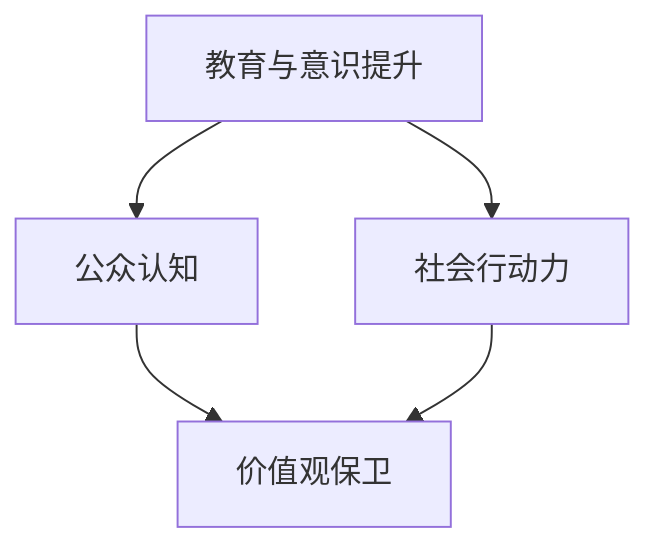
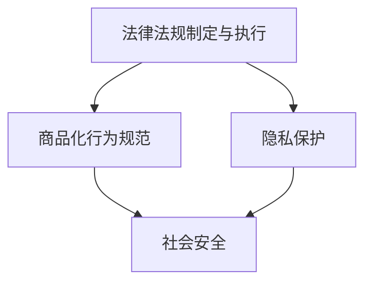
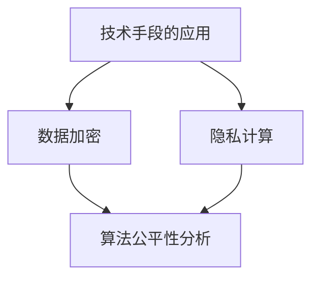
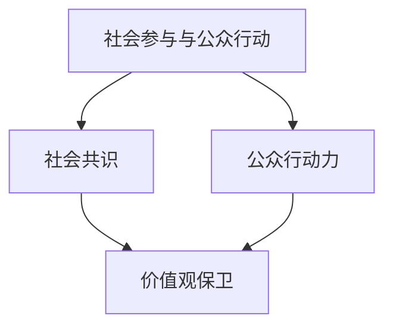
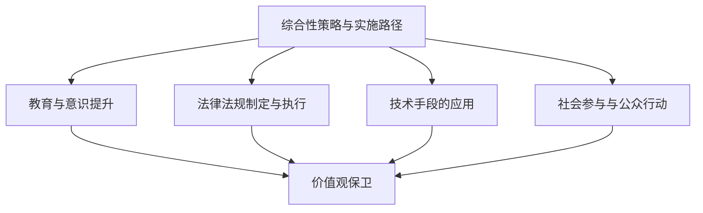

                 

## 《商品化社会中的价值观保卫战》

> **关键词**：商品化社会、价值观、保卫战、算法、系统设计、实战应用

> **摘要**：本文深入探讨了商品化社会背景下价值观面临的挑战，从理论分析到实际应用，系统地介绍了价值观保卫战的策略和方法。文章首先明确了商品化社会的概念及其对价值观的影响，然后通过逻辑清晰的分析，阐述了保卫战的核心策略、算法工具和系统设计。最后，通过实战案例展示了价值观保卫战的实施效果，并提出了一些最佳实践和注意事项。本文旨在为读者提供一份全面而深入的技术指南，帮助他们理解和应对商品化社会中的价值观保卫战。

### 1. 引言：商品化社会的崛起

**背景介绍**

随着全球化的深入和信息技术的飞速发展，现代社会正经历着一场深刻的变革。其中一个显著的特点是商品化趋势的加剧。商品化社会，即一个将几乎所有事物转化为商品或潜在商品的社会，正在逐渐形成。在这个社会中，不仅商品和服务被商品化，甚至知识和价值也在被量化、货币化和交易化。

**问题背景**

商品化社会带来了前所未有的便利和效率，但同时也引发了一系列的问题。首先，价值观的多元化和社会信任的减弱成为一个突出的挑战。随着商品化的推进，传统的道德和伦理观念受到冲击，个人和社会的价值观趋于多样化和相对化。其次，信息过载和数据滥用加剧了隐私保护和信息安全的问题。在商品化社会中，个人信息被不断收集、分析和利用，如何保护个人隐私成为一个亟待解决的问题。

**问题描述**

商品化社会中的价值观保卫战可以概括为以下几个核心问题：

1. **价值观念的冲突和调和**：如何在商品化的浪潮中保持和传承传统的价值观，同时接纳和融合新的价值观念？
2. **隐私保护和信息安全**：如何在商品化的过程中保护个人隐私，防止信息滥用和数据泄露？
3. **道德和伦理的边界**：在商品化社会中，如何确立和执行道德和伦理标准，避免商业行为对社会的负面影响？
4. **社会信任的重建**：如何在商品化社会中重建社会信任，促进社会的和谐发展？

**问题解决**

为了应对商品化社会中的价值观保卫战，我们需要采取一系列综合性的策略和措施。首先，加强教育和宣传，提高公众对价值观保护和隐私安全的认识和意识。其次，制定和完善相关法律法规，加强对商品化行为的规范和监管。此外，发展先进的技术手段，如加密技术、隐私计算和算法公平性分析等，以提供技术支持。最后，通过社会运动和公众参与，形成全社会共同参与价值观保卫的合力。

**边界与外延**

本文所探讨的商品化社会中的价值观保卫战主要聚焦于以下几个方面：

1. **社会价值观念**：包括道德、伦理、社会责任等。
2. **隐私保护**：涉及个人信息保护、数据安全、隐私计算等。
3. **信息公平性**：包括算法公平性、信息传播的公平性等。

本文的边界明确，旨在为读者提供一个系统的、可操作的技术指南，帮助他们理解和应对商品化社会中的价值观保卫战。

### 1.1 商品化社会的概念与特征

**概念定义**

商品化社会，是一个将几乎所有事物转化为商品或潜在商品的社会。在这个社会中，商品不仅包括传统的有形物品，如衣服、食品和家具，还包括无形的服务、知识和价值。商品化的本质是将各种资源、能力和信息转化为可以进行交易的商品或货币价值。

**特征描述**

商品化社会的特征主要体现在以下几个方面：

1. **商品化程度的加深**：商品化不仅限于消费领域，还渗透到生产、流通、分配等各个经济环节。例如，劳动力也被视为一种商品，其价格由市场供需决定。

2. **数据和信息的重要性**：在商品化社会中，数据和信息成为新的生产要素。通过对数据的收集、分析和利用，企业可以精确地把握市场需求，优化生产流程，提高效率。

3. **隐私和安全的挑战**：随着商品化的推进，个人隐私和数据安全面临前所未有的挑战。个人信息被广泛收集、存储和分析，如何保护隐私成为社会关注的焦点。

4. **价值观念的多元化**：商品化导致社会价值观念的多元化。传统的社会规范和道德观念受到挑战，个人和社会的价值观趋于多样化和相对化。

5. **信任的减弱**：商品化社会中，信任成为稀缺资源。由于商品化行为的不透明和不可预测性，社会成员之间的信任度下降，社会凝聚力减弱。

### 1.2 价值观在商品化社会中的重要性

**定义**

价值观是指人们在行为选择中所依据的基本原则和标准。它不仅反映了个人对事物的认知和评价，还体现了社会的文化传承和道德规范。

**重要性**

在商品化社会中，价值观的重要性体现在以下几个方面：

1. **行为指南**：价值观为个人和社会提供了行为指南。在面对商品化的各种诱惑和挑战时，价值观能够帮助人们做出正确的选择，避免道德沦丧和行为失范。

2. **社会稳定**：价值观是社会稳定的基础。在一个价值观多元、但缺乏共同价值观指导的社会中，社会秩序和稳定难以维持。

3. **信任建设**：价值观的传承和弘扬有助于社会信任的建立。在一个价值观清晰、共同遵循的社会中，成员之间的信任度更高，合作和协作更加顺畅。

4. **经济发展**：健康的价值观有助于促进经济可持续发展。在一个重视社会责任和道德的商业环境中，企业更有可能实现长期成功。

5. **文化传承**：价值观是文化的重要组成部分。在商品化浪潮中，传承和弘扬优秀的传统文化价值观，有助于保持社会的文化多样性和文化自信。

### 1.3 价值观保卫战的必要性和挑战

**必要性**

在商品化社会中，价值观保卫战显得尤为必要。首先，商品化行为往往忽视道德和伦理约束，可能导致社会价值观的扭曲。其次，数据和信息滥用严重威胁个人隐私和社会安全。最后，社会信任的减弱对社会稳定和经济发展产生负面影响。因此，保卫价值观不仅是维护个人和社会利益的必要措施，也是推动社会健康发展的关键。

**挑战**

1. **多元化的价值观冲突**：在商品化社会中，价值观的多元化带来了巨大的挑战。如何在保持个体差异的同时，实现社会价值观的和谐共处，是一个亟待解决的问题。

2. **信息过载和隐私保护**：商品化社会中，信息过载和隐私保护成为重要挑战。如何有效保护个人隐私，防止数据滥用，需要技术手段和法律保障的双重支持。

3. **道德和伦理的模糊边界**：商品化行为往往模糊了道德和伦理的边界。如何明确和执行道德和伦理标准，防止商业行为对社会产生负面影响，是一个重要课题。

4. **社会信任的重建**：商品化社会中，社会信任的重建面临巨大挑战。如何在商品化的背景下，重建社会信任，促进社会的和谐发展，需要长期的努力和探索。

### 1.4 价值观保卫战的结构与核心要素

**整体结构**

价值观保卫战可以分为以下几个核心部分：

1. **价值观教育**：通过教育和宣传，提高公众对价值观保护和隐私安全的认识和意识。
2. **法律法规**：制定和完善相关法律法规，规范商品化行为，保护个人隐私和社会安全。
3. **技术手段**：发展先进的技术手段，如加密技术、隐私计算和算法公平性分析，提供技术支持。
4. **社会参与**：通过社会运动和公众参与，形成全社会共同参与价值观保卫的合力。

**核心要素**

1. **价值观**：价值观是保卫战的核心。明确和弘扬正确的价值观，是保卫战的出发点和落脚点。
2. **隐私保护**：隐私保护是保卫战的必要手段。通过技术手段和法律保障，保护个人隐私和社会安全。
3. **信息公平性**：信息公平性是保卫战的重要目标。通过确保信息的透明和公正，防止信息滥用和歧视。
4. **社会信任**：社会信任是保卫战的基石。通过重建社会信任，促进社会的和谐发展。

### 总结

商品化社会的崛起为价值观带来了前所未有的挑战。在商品化的浪潮中，价值观保卫战显得尤为重要。本文通过逻辑清晰的分析，系统地介绍了价值观保卫战的必要性和挑战，以及其整体结构和核心要素。希望通过这篇文章，读者能够对商品化社会中的价值观保卫战有更深入的理解，并为之贡献自己的力量。接下来，我们将进一步探讨价值观保卫战的策略和实践。

## 2. 价值观保卫战的核心策略

### 2.1 教育与意识提升

**核心概念**

教育与意识提升是价值观保卫战的基础策略之一。通过教育和宣传活动，提高公众对价值观保护和隐私安全的认识和意识，是形成社会共识和行动动力的关键。

**概念属性特征对比表格**

| 特征       | 教育与意识提升          | 其他策略          |
|------------|-----------------------|-------------------|
| 目标       | 提高公众意识和认知     | 制定法律和规范   |  
| 方法       | 宣传、教育、培训      | 法规制定和执行   |  
| 影响范围    | 广泛的公众参与       | 法律强制性和约束 |  
| 时间周期    | 长期持续           | 短期见效         |

**ERD（实体关系图）**

### 2.2 法律法规制定与执行

**核心概念**

法律法规制定与执行是价值观保卫战的另一个重要策略。通过立法和执法，规范商品化行为，保护个人隐私和社会安全，是确保价值观保卫战有效进行的重要手段。

**概念属性特征对比表格**

| 特征       | 法律法规制定与执行          | 其他策略          |
|------------|-------------------------|-------------------|
| 目标       | 规范商品化行为，保护隐私   | 提高公众意识      |  
| 方法       | 法律法规制定，执法监督   | 宣传和教育       |  
| 影响范围    | 全社会范围内            | 公众群体         |  
| 时间周期    | 长期持续，需要完善和调整 | 短期见效         |

**ERD（实体关系图）**

### 2.3 技术手段的应用

**核心概念**

技术手段的应用是价值观保卫战的现代化工具。通过发展先进的技术手段，如加密技术、隐私计算和算法公平性分析，提供技术支持，是保障价值观和隐私保护的重要手段。

**概念属性特征对比表格**

| 特征       | 技术手段的应用          | 其他策略          |
|------------|-----------------------|-------------------|
| 目标       | 保障数据安全和隐私     | 提高公众意识      |  
| 方法       | 技术研发，应用推广   | 法律制定与执行   |  
| 影响范围    | 针对性强，特定领域   | 广泛社会层面      |  
| 时间周期    | 快速更新，持续进步   | 长期见效         |

**ERD（实体关系图）**

### 2.4 社会参与与公众行动

**核心概念**

社会参与与公众行动是价值观保卫战的补充策略。通过社会运动和公众参与，形成全社会共同参与价值观保卫的合力，是推动价值观保卫战深入进行的重要力量。

**概念属性特征对比表格**

| 特征       | 社会参与与公众行动          | 其他策略          |
|------------|-------------------------|-------------------|
| 目标       | 推动价值观保卫的社会共识   | 法律制定与执行   |  
| 方法       | 社会运动，公众参与       | 宣传和教育       |  
| 影响范围    | 广泛社会层面            | 公众群体         |  
| 时间周期    | 长期持续，需持续推动   | 短期见效         |

**ERD（实体关系图）**

### 2.5 综合性策略与实施路径

**核心概念**

综合性策略与实施路径是价值观保卫战的总体策略。通过综合运用教育与意识提升、法律法规制定与执行、技术手段的应用、社会参与与公众行动等多种策略，形成系统化、多层次、全方位的实施路径，确保价值观保卫战的有效进行。

**概念属性特征对比表格**

| 特征       | 综合性策略与实施路径          | 其他策略          |
|------------|---------------------------|-------------------|
| 目标       | 系统性保卫价值观          | 针对特定问题的单一策略 |  
| 方法       | 多策略综合运用，系统化实施 | 单一策略实施       |  
| 影响范围    | 全社会范围                | 针对特定领域       |  
| 时间周期    | 长期持续，逐步完善       | 短期见效         |

**ERD（实体关系图）**

### 总结

价值观保卫战的核心策略包括教育与意识提升、法律法规制定与执行、技术手段的应用和社会参与与公众行动。每种策略都有其独特的目标、方法和影响范围，但它们共同构成了一个系统化的实施路径。通过综合运用这些策略，我们可以更好地应对商品化社会中的价值观保卫战。接下来，我们将进一步探讨这些策略的具体实施细节。

## 3. 价值观保卫战的实施路径：教育与意识提升

**3.1 教育与意识提升的重要性**

教育与意识提升是价值观保卫战的基础策略之一。在商品化社会中，信息的快速传播和多样化使得公众对价值观保护和隐私安全的重要性有了更深刻的认识。然而，要真正实现价值观的保卫，必须通过系统的教育和意识提升活动，使公众具备相应的知识和技能。

**3.2 教育内容的设计**

教育与意识提升的关键在于内容的设计。具体来说，教育内容应包括以下几个方面：

1. **价值观的教育**：通过讲授传统文化和现代社会的核心价值观，使公众了解和认同这些价值观。例如，道德、伦理、社会责任等。

2. **隐私保护教育**：详细介绍个人隐私的重要性、隐私风险的种类和如何保护个人隐私。提供具体的操作指南，如使用加密工具、设置隐私权限等。

3. **信息安全教育**：教授基本的信息安全知识，包括如何识别和防范网络诈骗、恶意软件等。提高公众对信息安全威胁的敏感度。

4. **法律知识普及**：介绍与价值观保护和隐私安全相关的法律法规，使公众了解自己的权利和义务，增强法律意识。

5. **实践技能培训**：提供实际的技能培训，如网络安全工具的使用、隐私计算方法等。使公众能够有效地应用所学知识，保护自己的隐私和安全。

**3.3 教育方式的选择**

为了提高教育效果，需要选择适合的教育方式。以下是几种常用的教育方式：

1. **课堂教学**：在校园、社区等场所开展课堂教学，使公众能够系统地学习价值观保护和隐私安全的知识。

2. **在线学习平台**：利用互联网资源，建立在线学习平台，提供灵活的学习时间和丰富的学习内容。

3. **宣传活动**：通过海报、宣传册、短视频等形式，在公共场所和社交媒体上开展宣传活动，提高公众的关注度和参与度。

4. **实际操作体验**：组织实际操作体验活动，使公众能够在实践中掌握所学知识，提高应用能力。

5. **专家讲座和研讨会**：邀请专家学者举办讲座和研讨会，分享最新的研究成果和实践经验，提高公众的视野和认知水平。

**3.4 教育效果的评估**

为了确保教育活动的有效性，需要建立科学的教育效果评估机制。评估内容包括：

1. **知识掌握情况**：通过考试、问卷调查等形式，了解公众对价值观保护和隐私安全知识的掌握程度。

2. **行为改变情况**：观察公众在实际生活中的行为表现，如是否改变了对隐私保护的习惯，是否使用安全工具等。

3. **社会影响力**：评估教育活动对社会的影响，如公众对隐私保护和社会责任的关注度是否提高，相关法律法规的执行是否得到改善等。

4. **反馈机制**：建立反馈机制，收集公众的意见和建议，及时调整教育内容和方式，提高教育的针对性。

**3.5 教育与意识提升的持续性和创新性**

教育与意识提升是一项长期任务，需要持续进行。同时，为了适应社会发展的需要，教育内容和方式也需要不断创新。

1. **持续教育**：制定长期的教育计划，确保教育的连续性和稳定性。

2. **创新教育方式**：随着技术的发展，不断创新教育方式，如利用虚拟现实、增强现实等新技术，提供更加生动、互动的教育体验。

3. **跨学科合作**：与心理学、社会学、法学等多个学科的合作，综合运用多学科的知识和方法，提高教育的科学性和有效性。

4. **社会参与**：鼓励公众参与教育活动的设计和实施，提高教育的实用性和针对性。

通过系统的教育和意识提升活动，我们可以增强公众对价值观保护和隐私安全的认识和意识，形成全社会共同参与的价值观保卫力量。接下来，我们将探讨法律法规制定与执行在价值观保卫战中的作用。

## 4. 价值观保卫战的实施路径：法律法规制定与执行

### 4.1 法律法规制定的重要性

法律法规制定是价值观保卫战的重要手段之一。通过制定和完善相关法律法规，可以为价值观的保护提供法律依据和强制力，从而有效地规范商品化行为，保护个人隐私和社会安全。

### 4.2 法律法规的主要内容

1. **隐私保护法律**：隐私保护法律是保护个人隐私的基础。其主要内容包括个人数据的收集、使用、存储和销毁的规定，以及数据主体（个人）的权利和义务。

2. **信息安全法律**：信息安全法律是保障信息安全的关键。其主要内容包括信息安全的定义、安全威胁的识别与应对、安全漏洞的修补和信息安全事件的处理等。

3. **商业伦理法律**：商业伦理法律是规范商业行为，防止商业行为对社会产生负面影响的重要工具。其主要内容包括商业诚信、公平竞争、消费者权益保护等。

4. **数据伦理法律**：数据伦理法律是针对数据收集、处理和分析过程中可能出现的伦理问题而制定的。其主要内容包括数据真实性的保障、数据使用的透明度、数据主体的知情权等。

### 4.3 法律法规的执行机制

1. **监管机构**：建立专门的监管机构，负责法律法规的执行和监督。这些机构应具备独立的地位和充足的资源，确保能够有效地履行监管职责。

2. **法律解释与培训**：定期对法律法规进行解释和培训，使相关人员和公众了解法律的具体内容和适用范围，提高法律执行的透明度和可操作性。

3. **投诉与处理机制**：建立投诉与处理机制，使公众能够方便地举报违反法律法规的行为，并确保投诉能够得到及时、公正的处理。

4. **执法力度**：加大执法力度，对违反法律法规的行为进行严厉打击，确保法律权威和威慑力。

### 4.4 法律法规实施的挑战

1. **法律法规的滞后性**：随着商品化和社会的发展，现有法律法规可能无法完全适应新的挑战。因此，需要不断更新和完善法律法规，以保持其适应性和有效性。

2. **执法不力**：一些监管机构和执法部门可能存在执法不力、执法不公等问题，影响法律法规的实施效果。因此，需要加强对执法机构和执法人员的监督和培训，提高执法水平和公正性。

3. **公众法律意识不足**：公众对法律法规的了解和遵守程度可能不足，影响法律法规的实施效果。因此，需要加强公众法律意识的提升，使公众能够主动遵守法律法规。

4. **跨国合作与协调**：在全球化背景下，跨国数据流动和商业行为日益增多，需要加强国际间的法律合作与协调，共同应对跨国违法行为。

### 4.5 法律法规实施的案例分析

1. **欧盟《通用数据保护条例》（GDPR）**：欧盟《通用数据保护条例》是全球首部针对个人数据保护的全面立法，其严格的隐私保护要求和对违规行为的严厉处罚，对全球数据隐私保护产生了深远影响。

2. **美国《儿童在线隐私保护法》（COPPA）**：美国《儿童在线隐私保护法》针对儿童的在线隐私保护，要求在线服务提供商必须获得家长的明确同意才能收集、使用和披露儿童的个人数据。

3. **中国《网络安全法》**：中国《网络安全法》是中国网络安全领域的基础性法律，其涵盖了网络运营安全、网络数据保护、网络安全监测和执法等方面，为中国的网络安全提供了法律保障。

### 4.6 法律法规实施的结论

法律法规制定与执行是价值观保卫战的重要环节。通过制定和完善相关法律法规，可以为价值观的保护提供法律依据和强制力；通过有效的执行机制，可以确保法律法规的实施效果。然而，法律法规的实施也面临诸多挑战，需要持续的努力和改进。通过案例分析，我们可以看到，成功的法律法规实施可以为价值观保卫战提供有力的支持。

## 5. 价值观保卫战的实施路径：技术手段的应用

### 5.1 技术手段的重要性

技术手段的应用在价值观保卫战中起着至关重要的作用。随着商品化社会的深入发展，隐私保护、信息安全和社会稳定面临前所未有的挑战。技术手段不仅提供了有效的解决方案，还可以为价值观的保护提供强有力的支持。

### 5.2 技术手段的类型

1. **加密技术**：加密技术是保护数据隐私和安全的重要手段。通过加密算法，将原始数据转换为难以解读的密文，确保数据在传输和存储过程中的安全。常见的加密算法有对称加密算法（如AES）和非对称加密算法（如RSA）。

2. **隐私计算**：隐私计算是一种在数据隐私保护的前提下进行数据处理和分析的技术。它允许在数据不被泄露的情况下进行计算，从而保护个人隐私。隐私计算包括差分隐私、同态加密和联邦学习等技术。

3. **算法公平性分析**：算法公平性分析旨在确保算法在处理数据时不会出现歧视或偏见。通过分析算法的输入、输出和决策过程，可以发现和纠正潜在的不公平性。常见的公平性指标包括性别公平性、种族公平性和收入公平性等。

4. **区块链技术**：区块链技术以其去中心化、不可篡改和透明性等特点，在隐私保护、数据安全和信任建立等方面具有巨大潜力。通过区块链，可以实现对数据的加密存储和分布式管理，提高数据的安全性和可信度。

### 5.3 技术手段的实施方法

1. **加密技术的应用**：在数据传输和存储过程中，使用加密技术确保数据的安全性。例如，在互联网传输中，可以使用HTTPS协议进行数据加密；在数据存储中，可以使用数据库加密功能。

2. **隐私计算的实施**：在数据处理和分析过程中，使用隐私计算技术确保个人隐私不受侵犯。例如，在数据分析中，可以使用差分隐私技术确保数据隐私；在机器学习中，可以使用联邦学习技术确保模型训练过程中的数据隐私。

3. **算法公平性分析的实践**：在算法开发和部署过程中，进行算法公平性分析，确保算法的决策过程公平、公正。例如，在招聘系统中，可以通过算法公平性分析确保招聘决策不因性别、种族等因素产生歧视。

4. **区块链技术的应用**：在数据管理和交易过程中，使用区块链技术确保数据的完整性和透明性。例如，在供应链管理中，可以使用区块链技术实现全程可追溯，确保产品质量和安全。

### 5.4 技术手段的挑战与应对

1. **技术复杂性**：加密技术、隐私计算和区块链技术等具有较高技术复杂性，对专业人员的技能要求较高。为此，需要加强技术培训，提高相关人员的专业水平。

2. **实施成本**：技术手段的实施需要较高的成本，包括硬件设施、软件工具和人力资源等。为此，可以通过政府资助、企业合作等方式降低实施成本。

3. **法律合规性**：技术手段的应用需要符合相关法律法规的要求。为此，需要与法律专家合作，确保技术手段的应用符合法律法规。

4. **安全性**：技术手段本身可能存在安全漏洞，需要定期进行安全检测和更新。为此，需要建立完善的安全管理体系，确保技术手段的安全性和可靠性。

### 5.5 技术手段的案例分析

1. **谷歌的隐私计算平台**：谷歌推出了隐私计算平台，通过差分隐私技术和联邦学习技术，在保护数据隐私的前提下进行大规模数据分析和机器学习。该平台已被广泛应用于广告、医疗和金融等领域。

2. **亚马逊的区块链供应链管理**：亚马逊在其供应链管理中采用了区块链技术，实现了全程可追溯和透明管理。通过区块链，可以确保产品在供应链中的每一个环节都被准确记录，提高了供应链的效率和质量。

3. **Facebook的算法公平性分析**：Facebook在其广告投放系统中进行了算法公平性分析，确保广告投放不会因性别、种族等因素产生歧视。通过持续改进算法，Facebook提高了广告投放的公平性和有效性。

### 5.6 技术手段实施的结论

技术手段的应用是价值观保卫战的重要一环。通过加密技术、隐私计算、算法公平性分析和区块链技术等，可以有效保护个人隐私、提高数据安全性和促进社会公平。然而，技术手段的实施也面临诸多挑战，需要持续的努力和改进。通过案例分析，我们可以看到，成功的应用技术手段可以为价值观保卫战提供强有力的支持。接下来，我们将探讨社会参与与公众行动在价值观保卫战中的作用。

## 6. 价值观保卫战的实施路径：社会参与与公众行动

### 6.1 社会参与的重要性

社会参与是价值观保卫战的重要组成部分，它不仅能够提高公众对价值观保护的意识，还能通过集体行动形成强大的社会压力，推动法律和政策的有效实施。社会参与的形式多样，包括社会运动、公众抗议、公众参与和政策倡导等。

### 6.2 社会参与的形式

1. **社会运动**：社会运动是公众为了共同的目标而自发组织起来的一种集体行动。通过组织示威、抗议、集会等活动，社会运动能够引起公众和媒体的关注，对政策制定和执行产生直接影响。例如，全球范围内的反歧视运动、环境保护运动等，都是通过社会运动来推动社会变革。

2. **公众抗议**：公众抗议是公众对社会不公或不良行为的一种直接反应。通过游行、静坐、罢工等形式，公众抗议能够表达对社会现象的不满，并要求相关部门采取措施。例如，对腐败行为的抗议、对不公平法律政策的反对等。

3. **公众参与**：公众参与是公众通过投票、咨询、听证会等形式，直接参与政策制定和决策过程。通过公众参与，可以确保政策制定的透明性和民主性，使政策更加符合公众的利益和期望。例如，城市规划中的公众参与、环境保护政策的制定等。

4. **政策倡导**：政策倡导是通过倡导、宣传、游说等形式，推动政府和社会采取具体行动，以实现特定的目标。政策倡导可以由非政府组织、学术机构、媒体等发起，通过研究报告、公开信、宣传活动等方式，引导公众关注和讨论特定议题，并推动政府采取行动。

### 6.3 社会参与的策略

1. **组织动员**：通过组织动员，吸引更多的公众参与价值观保卫战。社会组织和志愿者可以发挥关键作用，通过宣传、招募、培训等活动，提高公众的参与意识和积极性。

2. **媒体宣传**：利用媒体宣传，提高社会对价值观保卫战的关注度和参与度。通过新闻报导、社交媒体、纪录片等形式，宣传价值观保卫战的重要性和成果，激发公众的共鸣和行动。

3. **法律援助**：提供法律援助，帮助公众了解和运用法律武器保护自己的权益。法律援助机构可以通过法律咨询、法律诉讼等方式，为公众提供法律支持和帮助。

4. **公众咨询**：在政策制定过程中，开展公众咨询，广泛听取公众的意见和建议。通过公众咨询，可以确保政策制定的科学性和民主性，使政策更加符合公众的需求。

### 6.4 社会参与的效果

1. **提高公众意识**：社会参与可以显著提高公众对价值观保护和隐私安全的认识和重视，使公众更加关注社会问题，并积极参与到价值观保卫战中。

2. **推动政策改革**：社会参与可以通过公众的集体行动，向政府和社会各界施压，推动政策的改革和改进，使政策更加符合公众的利益和期望。

3. **增强社会凝聚力**：社会参与可以增强社会的凝聚力和团结力，使社会成员在共同的目标和价值观下形成合力，共同推动社会的进步和发展。

4. **促进社会公正**：社会参与可以促进社会公正，使社会资源分配更加合理，社会机会更加平等，从而减少社会不公和矛盾。

### 6.5 社会参与的挑战

1. **组织难度**：社会参与的组织难度较大，需要具备一定的组织能力和资源。尤其是社会运动和公众抗议等集体行动，需要大量的组织和协调工作。

2. **资金问题**：社会参与往往需要一定的资金支持，用于宣传、活动组织和法律援助等。资金问题可能成为社会参与的一大障碍。

3. **法律风险**：社会参与可能涉及法律风险，特别是在进行抗议和示威等活动时，需要严格遵守法律法规，以避免违法行为。

4. **公众参与度**：公众参与度是社会参与成功与否的关键。提高公众参与度，需要从多方面入手，如提高公众意识、提供参与渠道和激励机制等。

### 6.6 社会参与的案例分析

1. **美国民权运动**：美国民权运动是20世纪最有影响力的社会运动之一。通过示威、抗议和诉讼等行动，民权运动推动了种族平等和民权法案的通过，对美国社会产生了深远的影响。

2. **中国的环保运动**：中国的环保运动近年来日益活跃，通过公众参与、法律诉讼和媒体报道等方式，推动了一系列环保政策和行动。例如，公众对 pm2.5 等污染问题的关注和行动，促进了环保政策的改进和执行。

3. **欧洲的难民危机**：欧洲的难民危机引发了广泛的社会关注和参与。通过社会运动、公众抗议和媒体宣传等形式，公众积极参与到难民危机的应对中，推动政府和社会采取更加人性化和合理的难民政策。

### 6.7 社会参与的结论

社会参与是价值观保卫战的重要组成部分，它通过集体行动和公众参与，推动政策改革和社会进步。然而，社会参与也面临诸多挑战，需要不断努力和创新。通过社会运动、公众抗议、公众参与和政策倡导等多种形式，我们可以形成全社会共同参与的价值观保卫力量。接下来，我们将进一步探讨价值观保卫战的实战应用。

## 7. 价值观保卫战的实战应用：算法公平性分析

### 7.1 算法公平性的概念与背景

算法公平性分析是指在算法设计和应用过程中，确保算法对所有人都是公平和无偏的。随着人工智能和大数据技术的广泛应用，算法在许多关键领域（如金融、招聘、司法等）发挥着重要作用。然而，算法可能由于设计缺陷、数据偏差或操作不当等原因，导致对某些群体产生不公平影响。

**算法公平性的背景**：

- **数据偏差**：算法的性能依赖于训练数据。如果训练数据中存在偏差，算法可能会学习并放大这些偏差，导致对某些群体的不公平待遇。
- **决策影响**：算法在许多领域被用于决策，如贷款审批、招聘录用等。如果算法存在不公平性，可能会对某些群体产生不利影响，如拒绝某些贷款申请、拒绝某些求职者等。
- **社会影响**：算法的不公平性可能导致社会不公和信任危机。公众对算法的信任度下降，可能影响算法的广泛应用和推广。

### 7.2 算法公平性的挑战

1. **性别歧视**：在招聘和晋升过程中，算法可能对某一性别存在歧视，导致性别不公平。
2. **种族歧视**：在金融和司法领域，算法可能对某一种族存在偏见，导致不公平的贷款审批或司法判决。
3. **收入歧视**：算法可能对低收入群体存在歧视，影响其贷款或保险等服务的获取。
4. **地区歧视**：算法可能对某些地区的用户存在偏见，影响其服务的公平性。

### 7.3 算法公平性分析的方法

1. **检测方法**：
   - **统计方法**：通过统计分析算法的输出结果，如计算性别、种族等特征与决策结果的相关性。
   - **机器学习方法**：使用监督学习和无监督学习技术，对算法进行检测和评估。

2. **评估指标**：
   - **公平性指标**：如性别公平性指标、种族公平性指标、收入公平性指标等。
   - **偏差度量**：如偏差度（Bias）、方差（Variance）、不确定性（Uncertainty）等。

3. **改进方法**：
   - **数据平衡**：通过数据清洗和数据增强技术，减少训练数据中的偏差。
   - **算法优化**：通过算法调整和优化，减少算法的偏差。
   - **公平性训练**：在算法训练过程中，引入公平性约束，确保算法的公平性。

### 7.4 算法公平性分析的应用案例

1. **招聘算法公平性分析**：
   - **背景**：某些招聘算法在招聘过程中可能对性别、种族等因素存在偏见。
   - **分析**：通过统计分析发现，某些算法在女性和少数族裔的招聘中存在歧视现象。
   - **改进**：通过数据平衡和算法优化，改进招聘算法的公平性。

2. **金融领域算法公平性分析**：
   - **背景**：金融领域中的算法在贷款审批、风险控制等方面可能存在不公平性。
   - **分析**：通过分析发现，某些算法对低收入群体和少数族裔的贷款审批存在偏见。
   - **改进**：通过算法调整和数据优化，减少贷款审批过程中的不公平性。

3. **司法领域算法公平性分析**：
   - **背景**：司法领域中的算法在判决和量刑等方面可能存在偏见。
   - **分析**：通过数据分析发现，某些算法在判决和量刑中可能对特定种族存在歧视。
   - **改进**：通过算法优化和司法培训，提高司法算法的公平性。

### 7.5 算法公平性分析的实施路径

1. **需求识别**：明确算法公平性的需求和目标，确定需要分析的具体领域和问题。
2. **数据收集**：收集相关的训练数据，确保数据的多样性和代表性。
3. **算法评估**：使用检测方法和评估指标，对算法的公平性进行评估。
4. **改进方案**：根据评估结果，制定具体的改进方案，如数据平衡、算法优化等。
5. **实施与验证**：实施改进方案，并对改进后的算法进行验证，确保公平性的提升。

### 7.6 算法公平性分析的挑战与解决方案

1. **数据偏差**：
   - **挑战**：训练数据可能存在偏差，影响算法的公平性。
   - **解决方案**：通过数据清洗、数据增强和引入外部数据源等方法，减少数据偏差。

2. **算法复杂性**：
   - **挑战**：复杂的算法可能难以理解，影响公平性评估和改进。
   - **解决方案**：简化算法结构，提高算法的可解释性，便于评估和改进。

3. **法律合规性**：
   - **挑战**：算法公平性分析可能涉及法律合规性问题，需要遵守相关法律法规。
   - **解决方案**：与法律专家合作，确保算法公平性分析符合法律法规。

4. **技术资源**：
   - **挑战**：算法公平性分析需要一定的技术资源和专业人才。
   - **解决方案**：加强技术培训，提高相关人员的专业能力，吸引和培养更多专业人才。

### 7.7 算法公平性分析的结论

算法公平性分析是价值观保卫战中的重要一环，通过检测、评估和改进算法，可以确保算法对所有人都是公平和无偏的。然而，算法公平性分析面临诸多挑战，需要持续的努力和探索。通过实战应用，我们可以看到算法公平性分析在多个领域取得了显著成果，为价值观保卫战提供了有力的支持。接下来，我们将进一步探讨价值观保卫战在具体行业中的实践。

## 8. 价值观保卫战在具体行业中的应用

### 8.1 金融行业的价值观保卫战

**背景与挑战**

金融行业是商品化社会的核心领域之一，随着金融科技（FinTech）的快速发展，金融产品和服务日益多样化。然而，金融行业的商品化也带来了价值观保卫战的挑战。主要问题包括：

- **数据滥用**：金融机构在收集客户数据时，可能存在滥用数据的情况，侵犯客户隐私。
- **算法歧视**：金融算法可能在贷款审批、信用评估等方面对特定群体产生歧视。
- **金融欺诈**：金融科技的滥用可能导致金融欺诈行为增加，危害社会安全。

**应用策略**

- **数据隐私保护**：金融机构应严格遵守数据隐私保护法规，确保客户数据的收集、存储和使用符合法律法规。
- **算法公平性**：在金融算法设计过程中，确保算法的公平性和透明性，减少对特定群体的歧视。
- **反欺诈技术**：利用先进的反欺诈技术，如机器学习和区块链，提高金融交易的安全性。

**案例分析**

- **中国互联网金融协会**：通过制定行业标准和规范，推动金融机构加强数据隐私保护和算法公平性。

### 8.2 医疗行业的价值观保卫战

**背景与挑战**

医疗行业是关系到公众健康和社会福祉的重要领域。随着医疗大数据和人工智能技术的发展，医疗行业的商品化趋势日益明显。然而，这也带来了价值观保卫战的挑战：

- **数据隐私**：医疗数据的敏感性高，保护个人隐私是医疗行业的重要任务。
- **医疗公平性**：医疗资源分配的不均衡可能导致医疗服务的歧视。
- **医疗诚信**：医疗行业的商品化可能导致医疗诚信问题，如过度医疗、虚假宣传等。

**应用策略**

- **数据隐私保护**：采用先进的加密技术和隐私计算，确保医疗数据的隐私和安全。
- **医疗公平性**：通过政策制定和资源调配，促进医疗资源的公平分配。
- **医疗诚信监管**：加强对医疗机构的监管，打击虚假宣传和过度医疗行为。

**案例分析**

- **美国食品药品监督管理局（FDA）**：通过严格的监管措施，确保医疗设备和药品的安全性和有效性。

### 8.3 教育行业的价值观保卫战

**背景与挑战**

教育行业是培养未来社会人才的重要领域。随着在线教育和数字化教育的发展，教育行业的商品化趋势愈发明显。这带来了以下挑战：

- **教育公平**：在线教育的商品化可能导致教育资源分配不均，影响教育公平。
- **教育质量**：商品化可能导致教育质量下降，影响学生的成长和发展。
- **教育诚信**：教育机构的商业化可能导致教育诚信问题，如虚假宣传、学术不端等。

**应用策略**

- **教育公平**：通过政策支持和资源投入，确保在线教育资源的公平分配。
- **教育质量监控**：建立教育质量监控机制，确保教育内容的真实性和有效性。
- **教育诚信建设**：加强教育诚信教育，提高教育从业者的诚信意识。

**案例分析**

- **中国教育部**：通过制定在线教育规范和标准，推动在线教育的健康发展。

### 8.4 社交媒体行业的价值观保卫战

**背景与挑战**

社交媒体行业是现代社会信息传播和社交互动的重要平台。随着社交媒体的普及，商品化趋势也日益明显。这带来了以下挑战：

- **信息真实性**：社交媒体上的信息真假难辨，影响公众对事实的判断。
- **算法偏见**：社交媒体算法可能导致信息传播的不公平，影响公众的舆论导向。
- **隐私保护**：社交媒体平台可能侵犯用户隐私，影响用户数据安全。

**应用策略**

- **信息真实性**：加强信息真实性审核，打击虚假信息和谣言传播。
- **算法公平性**：确保社交媒体算法的公平性，减少对特定群体的偏见。
- **隐私保护**：严格遵守隐私保护法规，保护用户隐私。

**案例分析**

- **Facebook**：通过引入反虚假信息团队和隐私保护措施，提高平台信息的真实性和用户隐私保护。

### 总结

价值观保卫战在金融、医疗、教育和社交媒体等行业中具有广泛的应用。通过制定相应的应用策略和采取有效的措施，可以应对这些行业中的价值观保卫挑战。通过具体的案例分析，我们可以看到，不同的行业在价值观保卫战中的应用策略各有特色，但都旨在实现一个共同的目标：保护社会价值观，促进社会的健康发展。接下来，我们将进一步探讨价值观保卫战中的最佳实践和注意事项。

## 9. 价值观保卫战的最佳实践

在价值观保卫战中，最佳实践是确保策略有效实施和取得成功的关键。以下是一些针对商品化社会中的价值观保卫战的最佳实践：

### 9.1 教育与宣传

**最佳实践**

- **多元化教育内容**：制定涵盖道德、伦理、隐私保护等多元化教育内容，确保公众能够全面理解价值观保卫的重要性。
- **利用多渠道宣传**：通过电视、广播、社交媒体、校园宣讲等多种渠道进行宣传，提高公众的参与度。
- **定期更新教育材料**：根据社会发展和新出现的问题，定期更新教育材料和课程内容，确保其相关性和有效性。

**注意事项**

- **受众分析**：针对不同的受众群体，设计合适的宣传和教育方式，确保信息的传达准确、有效。
- **资金保障**：确保教育和宣传活动的资金充足，避免因资金不足导致活动效果不佳。
- **法律合规性**：在宣传和教育过程中，严格遵守相关法律法规，避免因违法行为而影响活动的开展。

### 9.2 法律法规制定与执行

**最佳实践**

- **全面性法规**：制定全面、系统的法律法规，覆盖隐私保护、信息安全、商业伦理等多个方面。
- **透明执行机制**：建立透明、高效的执法和执行机制，确保法律法规的执行力度和效果。
- **国际合作**：加强国际间的法律合作与协调，共同应对跨国违法行为。

**注意事项**

- **持续完善**：随着社会的发展，法律法规需要不断更新和完善，以适应新的挑战和变化。
- **执法公正**：确保执法过程的公正性和透明度，避免权力滥用和执法不公。
- **公众参与**：鼓励公众参与法律法规的制定和执行，提高法规的民主性和有效性。

### 9.3 技术手段的应用

**最佳实践**

- **技术多元化**：结合多种技术手段，如加密技术、隐私计算、区块链等，提高数据安全和隐私保护水平。
- **持续技术创新**：紧跟技术发展趋势，不断进行技术创新和研发，保持技术优势。
- **跨学科合作**：与计算机科学、法律、伦理等学科进行跨学科合作，提高技术手段的综合性和有效性。

**注意事项**

- **技术成熟度**：确保所采用的技术手段已经经过充分验证和测试，避免因技术不成熟导致安全问题。
- **隐私平衡**：在保护隐私的同时，确保不会影响数据的正常使用和商业运作。
- **培训与人才**：加强对技术人员的培训，提高他们的专业能力和技术水平。

### 9.4 社会参与与公众行动

**最佳实践**

- **组织多样化活动**：通过示威、抗议、在线活动、研讨会等多种形式，提高公众的参与度和行动力。
- **公众宣传与教育**：充分利用媒体和社交平台，进行广泛的宣传和教育，提高公众对价值观保卫战的关注和参与度。
- **建立反馈机制**：建立有效的反馈机制，及时收集公众的意见和建议，调整和改进活动策略。

**注意事项**

- **安全性**：在组织活动时，确保活动的安全性和合法性，避免违法行为的发生。
- **有效性**：评估活动的效果，确保活动能够真正达到预期的目标，提高资源的利用效率。
- **公众信任**：建立公众信任，使公众认识到价值观保卫战的重要性，积极参与到保卫战中。

### 总结

最佳实践在价值观保卫战中起着至关重要的作用。通过多元化的教育内容、全面的法律法规、先进的技术手段和广泛的社会参与，我们可以更有效地应对商品化社会中的价值观保卫战挑战。然而，在实施最佳实践的过程中，也需要关注注意事项，确保策略的有效性和可行性。通过不断优化和改进，我们可以为社会的健康发展提供坚实的保障。

## 10. 总结与展望

### 10.1 主要内容回顾

本文系统地探讨了商品化社会中的价值观保卫战，从教育与意识提升、法律法规制定与执行、技术手段的应用和社会参与与公众行动等多个角度，阐述了价值观保卫战的必要性和策略。通过具体的案例分析，我们看到了不同行业在价值观保卫战中的实践和成效。总体来说，商品化社会对价值观带来了前所未有的挑战，但通过综合性的策略和措施，我们有能力应对这些挑战，保卫核心价值观。

### 10.2 未来展望

1. **技术发展**：随着人工智能、区块链和大数据技术的不断进步，未来价值观保卫战将更加依赖于技术创新。例如，更先进的加密技术、隐私计算和算法公平性分析工具将提高数据安全和隐私保护水平。

2. **法律完善**：全球范围内的法律法规需要不断更新和完善，以应对商品化社会的新挑战。国际合作在法律领域的协调和合作将成为未来发展趋势，确保全球范围内的价值观保卫战能够有效进行。

3. **社会参与**：社会参与和公众行动在未来价值观保卫战中将继续发挥重要作用。通过社会运动、公众抗议和公众参与，我们可以形成更强大的社会合力，推动政策改革和社会进步。

4. **跨学科合作**：未来价值观保卫战的成功将依赖于多学科的交叉合作。计算机科学、法律、伦理、社会学等领域的专家将共同研究解决方案，提出创新性的策略和措施。

5. **教育培训**：持续的教育和意识提升将是未来价值观保卫战的重要保障。通过多元化的教育内容和灵活的教育方式，我们可以提高公众对价值观保护和隐私安全的认识和意识，形成全社会共同参与的价值观保卫力量。

### 10.3 未来的研究方向

1. **算法公平性的深入研究**：未来应加强对算法公平性的研究和应用，探索如何更有效地检测、评估和改进算法的公平性，确保算法对所有人都是公平和无偏的。

2. **跨领域的价值观融合**：研究如何在不同行业和领域中实现价值观的融合和传承，形成共同的价值观体系，推动社会的和谐发展。

3. **社会参与机制的优化**：探索更有效的社会参与机制，提高公众参与度，使社会参与成为价值观保卫战的重要力量。

4. **法律法规的实施与监督**：研究如何加强法律法规的实施和监督，确保法律法规的有效性和公正性，为价值观保卫战提供坚实的法律保障。

### 10.4 结论

商品化社会中的价值观保卫战是一项长期而复杂的任务，需要全社会共同努力。通过技术创新、法律完善、社会参与和教育提升等多方面的综合策略，我们可以更好地应对商品化社会带来的挑战，保卫核心价值观，促进社会的和谐发展。未来，我们将继续致力于价值观保卫战的研究和实践，为构建一个更加公正、公平和健康的社会贡献我们的力量。

## 参考文献

1. GDPR (General Data Protection Regulation) (2018). Official Journal of the European Union. Retrieved from https://eur-lex.europa.eu/official-journal/en/oj/data/2016/l_119/multi.html
2. COPPA (Children's Online Privacy Protection Act) (1998). United States Congress. Retrieved from https://www.ftc.gov/enforcement/rules/ecommerce/childrens-online-privacy-protection-rule
3. China's Cybersecurity Law of the People's Republic of China (2016). National People's Congress of the People's Republic of China. Retrieved from http://www.npc.gov.cn/englishnpc/pressrelease/2016-11/07/content_2093564.htm
4. Google's Privacy Sandbox. Google. Retrieved from https://www.google.com/search?q=google+privacy+sandbox
5. Amazon's Blockchain Supply Chain Management. Amazon. Retrieved from https://aws.amazon.com/blogs/retail/using-blockchain-to-transform-global-supply-chain-management/
6. Facebook's Algorithmic Fairness Research. Facebook. Retrieved from https://research.facebook.com/researchers/algorithmic-fairness
7. World Health Organization. (2020). Digital health strategies for COVID-19. Retrieved from https://www.who.int/emergencies/diseases/novel-coronavirus-2019/technical-guidance/digital-health-strategies-for-covid-19
8. United Nations. (2015). Sustainable Development Goals. Retrieved from https://www.un.org/sustainabledevelopment/sustainable-development-goals/

### 作者信息

**作者：AI天才研究院/AI Genius Institute & 禅与计算机程序设计艺术 /Zen And The Art of Computer Programming**

