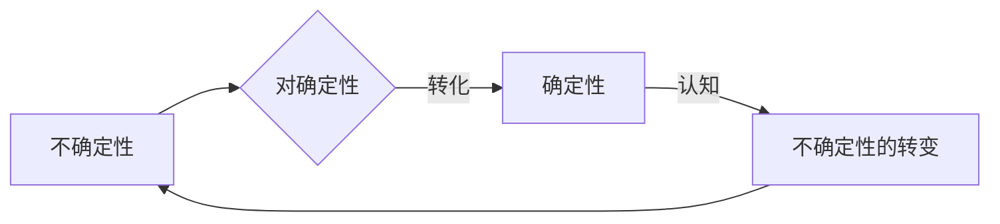
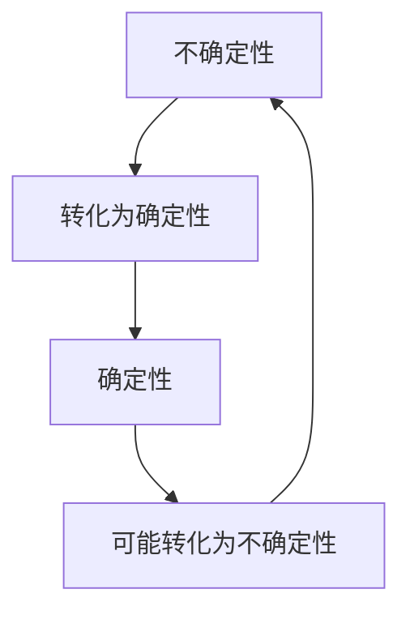

                 

### 1.6 引言与背景

#### 1.6.1 时代发展的需求

在21世纪，随着信息技术的迅猛发展，我们生活在一个高度互联的世界。这个时代的特征之一就是不确定性。从全球范围内的经济波动、政治动荡，到自然灾害频发、人工智能的崛起，我们面临着前所未有的复杂性。这种不确定性不仅体现在宏观层面，也渗透到每个人的日常生活中。从职业规划到家庭生活，从个人成长到身心健康，不确定性无时无刻不在影响着我们。

在经济领域，全球化带来了市场的不确定性和竞争的加剧。过去，人们可以通过稳定的工作和相对明确的发展路径来实现经济稳定。而现在，随着技术的快速迭代和市场的快速变化，传统的工作模式和经济结构正在发生深刻变革。例如，人工智能和自动化技术的普及，正在改变许多传统行业的劳动结构和就业模式，使得人们不得不不断学习和适应新的技能。

在政治领域，国际关系的复杂性和不确定性也在增加。全球政治格局的多极化，各国之间的摩擦和竞争，以及全球化进程中出现的贸易保护主义，都使得国际政治环境更加复杂多变。在这样的背景下，个人和国家都需要更加灵活和适应性的策略来应对不确定性。

在自然环境方面，全球气候变化带来的极端天气事件、自然资源的短缺等问题，也在加剧社会的不确定性。这些环境问题不仅对经济发展产生重大影响，也直接关系到人类的生活质量和生存环境。

#### 1.6.2 精神探索的意义

面对这种不确定性，精神探索变得尤为重要。精神探索不仅仅是对内心世界的自我认知和提升，更是对人类存在意义的深刻思考。在不确定性中寻找确定，可以帮助我们找到内心的平衡和方向，从而更好地应对生活的挑战。

首先，精神探索有助于提升个体的心理健康。在面对不确定性和压力时，通过自我认知和情绪管理，我们可以更好地调节自己的心理状态，减少焦虑和恐惧。例如，通过冥想和自我反思，我们可以学会放松和减压，从而保持心理健康。

其次，精神探索有助于提升个体的适应能力。在不确定性面前，适应能力成为衡量个人成功与否的重要标准。通过精神探索，我们可以培养出更加开放和灵活的思维方式，从而更好地适应环境变化。例如，通过学习不同的文化和观念，我们可以开阔视野，增强跨文化沟通能力。

最后，精神探索有助于提升个体的创造力。在不确定的环境中，创造力成为解决问题的关键。通过精神探索，我们可以激发内在的创造力，从而找到解决问题的新方法和新途径。例如，通过思考和反思，我们可以发现问题的本质，并提出创新性的解决方案。

#### 1.6.3 精神探索的边界

精神探索是一个跨学科、多领域的探索过程，它涵盖了心理学、哲学、宗教等多个领域。在心理学方面，精神探索涉及自我认知、情绪管理、心理健康等领域；在哲学方面，精神探索探讨存在的意义、道德伦理等问题；在宗教方面，精神探索则关注心灵的净化、信仰的建立等问题。

尽管精神探索涵盖了广泛的领域，但在现代社会中，我们主要关注以下几个问题：

1. **自我认知**：了解自己的性格、价值观、需求和目标，从而更好地规划个人生活和发展。
2. **情绪管理**：学会调节和管理自己的情绪，以更好地应对生活中的压力和挑战。
3. **心理健康**：关注个体的心理状态，预防和治疗心理疾病，提高生活质量。
4. **适应能力**：培养个体的适应能力，以更好地应对环境变化和不确定性。
5. **创造力**：激发内在的创造力，寻找解决问题的新方法和新途径。

在本书中，我们将通过多个章节，详细探讨这些问题，并分享实用的方法和策略。通过这些探讨，我们希望能够帮助读者在不确定性中找到内心的确定，从而更好地应对现代生活的挑战。

### 2. 核心概念与联系

#### 2.1 不确定性与确定性的概念

#### 2.1.1 不确定性的定义与特点

**不确定性的定义：**
不确定性是指我们在面对某个事物或情境时，无法准确地预测其未来状态或结果。它涉及到对信息的缺乏、对未知领域的探索以及对可能性的不确定性。

**不确定性的特点：**
1. **随机性：** 不确定性通常与随机事件相关。随机事件的结果不可预测，其发生与否具有偶然性。
2. **未知性：** 不确定性意味着我们对相关的信息了解不足，存在未知领域，无法完全掌握事物的本质。
3. **变化性：** 不确定性导致事物状态的变化不可预测，其结果可能会随着时间和环境的变化而发生变化。

#### 2.1.2 确定性的定义与特点

**确定性的定义：**
确定性是指我们能够准确地预测某个事物或情境的未来状态或结果。它基于对信息的充分掌握和理性分析，提供了一个相对稳定和可靠的基础。

**确定性的特点：**
1. **预测性：** 确定性提供了一个对未来状态的准确预测，使我们能够提前做好准备和规划。
2. **知识性：** 确定性依赖于对相关信息的充分了解和掌握，是一种基于知识和理性分析的结果。
3. **稳定性：** 确定性意味着事物状态的稳定性，不会因为时间和环境的变化而发生显著变化。

#### 2.2 不确定性与确定性的关系

不确定性与确定性并非完全对立，而是存在一定的相互联系和转化。

**对立统一的关系：**
不确定性与确定性是对立统一的。在一定条件下，不确定性能转化为确定性，反之亦然。例如，通过收集和分析数据，我们可以将不确定性转化为确定性，从而做出准确的预测和决策。

**动态平衡的关系：**
在不确定性中寻找确定是一个动态平衡的过程。我们无法完全消除不确定性，但可以通过不断探索和获取信息，逐步实现从不确定性向确定性的转变。这种动态平衡有助于我们在复杂的环境中找到确定性和方向。

#### 2.3 关键概念对比表

| 概念     | 定义                                                       | 特点                                                     |
|----------|----------------------------------------------------------|----------------------------------------------------------|
| 不确定性 | 对未来状态或结果无法准确预测或确定                           | 随机性、未知性、变化性                                   |
| 确定性   | 对未来状态或结果可以被准确预测或确定                         | 预测性、知识性、稳定性                                   |
| 精神探索 | 对内心世界的自我认知和提升，以及对人类存在意义的深刻思考       | 理论探讨、实践方法、多领域交叉                           |

#### 2.4 不确定性与确定性的关系图

在这个关系图中，不确定性（A）与确定性（C）之间通过认知（D）相互转化。不确定性通过获取信息和认知提升，可以转化为确定性，而确定性在变化和不确定性面前，也可能转化为不确定性。这种动态平衡的关系体现了不确定性与确定性之间的复杂互动。

### 2.1.1 不确定性的定义与特点

**不确定性的定义：**
不确定性是指在特定情境下，无法准确预测或确定未来状态或结果的情况。它涉及到对信息的缺乏、对未知领域的探索以及对可能性的不确定性。在现代社会中，不确定性已经成为我们面临的一个主要挑战。

**不确定性的特点：**

1. **随机性：** 不确定性通常与随机事件相关。随机事件的结果不可预测，具有偶然性。例如，掷骰子的结果是随机的，我们无法准确预测每次掷出的点数。

2. **未知性：** 不确定性意味着我们对相关的信息了解不足，存在未知领域，无法完全掌握事物的本质。在科学研究中，许多现象和规律尚未被完全揭示，因此存在不确定性。

3. **变化性：** 不确定性导致事物状态的变化不可预测，其结果可能会随着时间和环境的变化而发生变化。例如，气候变化的不确定性使得我们无法准确预测未来的天气状况。

为了更好地理解不确定性的特点，我们可以通过以下例子来阐述：

**例子：** 假设你正在考虑投资某个新兴行业。由于该行业处于快速发展阶段，许多因素（如市场需求、技术进步、政策变化等）都可能影响其未来发展。在这种情况下，你面临的不确定性主要体现在以下几个方面：

1. **随机性：** 市场需求可能受到消费者行为的变化、竞争态势的影响，而这些变化是难以预测的。

2. **未知性：** 该行业的技术发展可能存在许多不确定性，例如新的技术创新可能会颠覆现有的市场格局。

3. **变化性：** 政策的变化可能会对该行业的发展产生重大影响，这些变化往往是不可预测的。

通过这些例子，我们可以看到不确定性在日常生活中的普遍存在。在应对不确定性时，我们需要具备适应能力和前瞻性思维，以便更好地应对各种挑战。

### 2.1.2 确定性的定义与特点

**确定性的定义：**
确定性是指在特定情境下，能够准确预测或确定未来状态或结果的情况。它通常基于充分的信息和理性分析，提供了一种稳定和可靠的基础。

**确定性的特点：**

1. **预测性：** 确定性提供了一个对未来状态的准确预测，使我们能够提前做好准备和规划。例如，通过天气预报，我们可以预测明天的天气，从而合理安排出行计划。

2. **知识性：** 确定性依赖于对相关信息的充分了解和掌握。当信息充足且可靠时，我们可以做出更加准确的预测和决策。例如，在医疗领域，通过大量的病例数据和医学研究，医生可以更准确地诊断和治疗疾病。

3. **稳定性：** 确定性意味着事物状态的稳定性，不会因为时间和环境的变化而发生显著变化。例如，地球围绕太阳公转的规律是一个确定性事件，其轨道和周期相对稳定。

为了更好地理解确定性的特点，我们可以通过以下例子来阐述：

**例子：** 假设你正在考虑购买股票。通过分析公司的财务报表、市场趋势和行业前景，你可以预测该公司未来的盈利能力和股价走势。在这种情况下，确定性主要体现在以下几个方面：

1. **预测性：** 通过分析数据和信息，你可以预测公司的未来表现，从而做出更加明智的投资决策。

2. **知识性：** 你需要掌握相关的财经知识、市场规律和投资策略，以便做出准确的分析和预测。

3. **稳定性：** 股市虽然存在波动，但通过长期观察和分析，你可以发现一些稳定的趋势和规律，从而提高投资的成功率。

通过这些例子，我们可以看到确定性在投资、决策等领域的应用。在现代社会中，通过获取信息和理性分析，我们可以提高对事物的确定性，从而更好地应对各种挑战。

### 2.2 不确定性与确定性的关系

#### 2.2.1 对立统一的关系

不确定性与确定性并非完全对立，而是存在一定的相互联系和转化。

首先，不确定性可以转化为确定性。通过科学方法、数据分析和技术手段，我们可以逐渐消除不确定性，提高预测的准确性。例如，天气预报通过对大气数据的收集和分析，将天气的不确定性转化为确定性，从而为人们的出行和生活提供可靠的参考。

其次，确定性也可以转化为不确定性。在复杂系统和多变环境中，一些确定性事件可能会受到外部因素的干扰，导致其结果变得不可预测。例如，股票市场的波动虽然基于公司财务和市场趋势的确定性分析，但受到投资者情绪和政策变化等不确定因素的影响，使得股价的走势变得不确定。

#### 2.2.2 动态平衡的关系

在不确定性中寻找确定是一个动态平衡的过程。我们无法完全消除不确定性，但可以通过不断探索和获取信息，逐步实现从不确定性向确定性的转变。

首先，我们需要意识到不确定性是客观存在的，无法完全避免。因此，我们需要接受不确定性，并学会在不确定性中寻找确定性。通过科学方法和技术手段，我们可以逐渐消除一些不确定因素，提高预测的准确性。

其次，我们需要保持灵活性和适应性。在不确定性面前，我们需要具备快速反应和调整的能力，以适应环境的变化。例如，在股市投资中，投资者需要密切关注市场动态，及时调整投资策略，以应对不确定的市场变化。

最后，我们需要注重风险管理。在不确定性中，风险是不可避免的。通过合理配置资产、分散投资和风险控制措施，我们可以降低不确定性带来的损失，提高投资的成功率。

总的来说，不确定性与确定性之间存在对立统一的关系，通过动态平衡，我们可以在不确定性中找到确定性，从而更好地应对现代社会的挑战。

### 2.3 关键概念对比表

在探讨不确定性与确定性的过程中，了解和对比关键概念的特点和属性是至关重要的。以下是一个关于不确定性与确定性的关键概念对比表，通过对比分析，我们可以更清晰地理解这两个概念的本质区别和相互关系。

| 概念     | 定义                                                       | 特点                                                     |
|----------|----------------------------------------------------------|----------------------------------------------------------|
| 不确定性 | 对未来状态或结果无法准确预测或确定                           | 随机性、未知性、变化性                                   |
| 确定性   | 对未来状态或结果可以被准确预测或确定                         | 预测性、知识性、稳定性                                   |
| 精神探索 | 对内心世界的自我认知和提升，以及对人类存在意义的深刻思考       | 理论探讨、实践方法、多领域交叉                           |

#### 2.3.1 不确定性与确定性的定义对比

**不确定性的定义：**
不确定性是指在特定情境下，无法准确预测或确定未来状态或结果的情况。它涉及对信息的缺乏、对未知领域的探索以及对可能性的不确定性。

**确定性的定义：**
确定性是指在特定情境下，能够准确预测或确定未来状态或结果的情况。它通常基于充分的信息和理性分析，提供了一种稳定和可靠的基础。

通过对比这两个定义，我们可以看到不确定性强调的是无法准确预测，而确定性则强调的是能够准确预测。

#### 2.3.2 不确定性与确定性的特点对比

**不确定性的特点：**
1. **随机性：** 不确定性通常与随机事件相关，其结果不可预测，具有偶然性。
2. **未知性：** 不确定性意味着我们对相关的信息了解不足，存在未知领域，无法完全掌握事物的本质。
3. **变化性：** 不确定性导致事物状态的变化不可预测，其结果可能会随着时间和环境的变化而发生变化。

**确定性的特点：**
1. **预测性：** 确定性提供了一个对未来状态的准确预测，使我们能够提前做好准备和规划。
2. **知识性：** 确定性依赖于对相关信息的充分了解和掌握，是一种基于知识和理性分析的结果。
3. **稳定性：** 确定性意味着事物状态的稳定性，不会因为时间和环境的变化而发生显著变化。

通过对比这两个概念的特点，我们可以看到不确定性强调随机性、未知性和变化性，而确定性则强调预测性、知识性和稳定性。

#### 2.3.3 精神探索的定义与特点

**精神探索的定义：**
精神探索是对内心世界的自我认知和提升，以及对人类存在意义的深刻思考。它涵盖了心理学、哲学、宗教等多个领域，旨在提升个体的心理健康、适应能力和创造力。

**精神探索的特点：**
1. **理论探讨：** 精神探索涉及对心理学、哲学、宗教等理论领域的深入研究，通过理论探讨来理解人类的心理和行为。
2. **实践方法：** 精神探索不仅仅停留在理论层面，还强调实践方法，通过冥想、自我反思、情绪管理等实践方法来提升个体的心理素质。
3. **多领域交叉：** 精神探索涵盖了多个领域，例如心理学、哲学、宗教等，这些领域相互交叉，相互影响，形成了一个综合性的探索体系。

通过对比不确定性与确定性以及精神探索的定义和特点，我们可以更清晰地理解这三个概念之间的联系和区别。不确定性与确定性是现实世界中普遍存在的现象，而精神探索则是我们在面对这些现象时采取的一种探索方式，旨在提升个体的心理素质和适应能力。

### 2.4 不确定性与确定性的关系图

为了更直观地展示不确定性与确定性之间的关系，我们可以使用Mermaid绘制一个关系图。以下是一个简单的Mermaid图示例：

在这个图中，我们用节点表示不确定性（A）和确定性（C），并用箭头表示它们之间的转化关系。B节点表示不确定性转化为确定性，而D节点表示确定性可能再次转化为不确定性。这个图展示了不确定性与确定性之间的动态平衡关系。

通过这种图形化的方式，我们可以更好地理解不确定性与确定性之间的相互关系，以及在特定情境下如何通过信息获取和分析实现从不确定性向确定性的转化。

### 2.5 现代人的精神探索方法

在不确定性日益增加的现代社会，精神探索成为了许多人寻求内心平衡和方向的重要途径。精神探索不仅仅是一种心理活动，更是一种综合性的实践过程，它涉及到心理学、哲学和宗教等多个领域。以下将介绍几种现代人的精神探索方法，并探讨它们在实际中的应用。

#### 2.5.1 心理学视角

从心理学角度来看，精神探索主要包括自我认知、情绪管理和心理健康等方面。

**自我认知：**
自我认知是精神探索的基础。通过自我观察和反思，个体可以更深入地了解自己的性格、价值观、需求和目标。例如，心理治疗师常常使用心理测量工具和认知行为疗法，帮助个体识别和改变负面思维模式，从而提升自我认知。

**情绪管理：**
情绪管理是应对不确定性的一种重要方法。在心理学中，有许多方法可以帮助个体调节情绪，例如正念冥想、情感释放法和认知行为疗法。这些方法通过帮助个体学会观察和接受自己的情绪，从而更好地应对压力和不确定性。

**心理健康：**
心理健康是精神探索的重要目标之一。通过心理咨询和治疗，个体可以解决心理问题，提升心理健康水平。例如，认知行为疗法和心理健康教育可以帮助个体应对焦虑、抑郁等心理问题，从而在不确定性中找到内心的平衡。

#### 2.5.2 哲学视角

哲学视角下的精神探索主要关注存在的意义、道德伦理等问题。

**存在主义：**
存在主义强调个体的自由意志和责任感。存在主义者认为，个体在面对不确定性时，需要主动选择和承担责任，从而找到生命的意义。例如，存在主义哲学家萨特提出了“存在先于本质”的观点，强调个体通过自我选择和行动来定义自己的存在。

**道德哲学：**
道德哲学关注人类行为的价值和意义。通过哲学思考和道德原则，个体可以在不确定性中找到自己的行为准则。例如，伦理学家通过探讨道德原则和伦理困境，帮助个体在面对不确定性时做出符合价值观的决策。

#### 2.5.3 宗教视角

宗教视角下的精神探索主要关注心灵的净化、信仰的建立等问题。

**精神冥想：**
冥想是宗教和精神探索中的重要实践方法。通过冥想，个体可以静心养性，达到心灵的平静和清晰。例如，佛教中的禅修、道教中的内观冥想，都强调通过冥想来提升自我意识和心灵修养。

**宗教信仰：**
宗教信仰为人们提供了精神上的安慰和指导。在不确定性中，宗教信仰可以帮助个体找到内心的寄托和力量。例如，基督教中的信仰、佛教中的修行，都为信徒提供了面对不确定性的精神支持。

#### 2.5.4 实际应用

在实际应用中，现代人的精神探索方法可以相互结合，以达到更好的效果。

**跨学科整合：**
例如，在心理咨询中，心理治疗师可能会结合认知行为疗法和冥想技巧，帮助客户在心理层面和情绪层面同时得到提升。

**日常生活实践：**
个体可以通过日常生活中的小事来实践精神探索，例如通过冥想和反思来提升自我认知，通过阅读哲学书籍和宗教文献来增强道德修养。

**社区与社群：**
通过加入宗教团体或心理辅导社群，个体可以与他人分享和探讨精神探索的经验和心得，从而在集体中找到支持和力量。

总之，现代人的精神探索方法多种多样，通过跨学科整合和日常实践，个体可以在不确定性中找到内心的确定和方向。这些方法不仅有助于提升个体的心理健康，还能增强社会整体的适应能力和凝聚力。

### 3.1 心理学视角

#### 3.1.1 自我认知与接纳

自我认知是心理学中精神探索的重要一环，它涉及到个体对自身性格、价值观、需求和目标的深入了解。自我认知不仅帮助我们更好地认识自己，还能为个人成长和心理健康奠定基础。

**自我认知的重要性：**
自我认知有助于我们明确自己的优点和不足，从而制定更加合理的个人发展计划。通过自我认知，我们可以识别自己的核心价值和信念，进而形成积极的生活态度和行为模式。

**自我认知的方法：**
1. **自我反思：** 通过反思自己的行为、情绪和思考过程，个体可以逐渐深入了解自己的内在世界。例如，每天花一些时间回顾自己的经历，思考哪些行为和情绪给自己带来了积极的影响，哪些则是不良的。

2. **日记记录：** 写日记是一种有效的自我反思方式。通过记录日常生活、情感波动和思考过程，个体可以更好地了解自己的心理状态和需求。

3. **心理测量工具：** 心理测量工具，如性格测试和情绪量表，可以帮助个体客观地了解自己的性格特点和心理状态。例如，MBTI（迈尔斯-布里格斯性格类型指标）和SCL-90（症状自评量表）都是常用的心理测量工具。

**自我接纳的意义：**
自我接纳是指个体接受自己的优点和缺点，对自己持有宽容和接纳的态度。自我接纳有助于个体建立积极的自我形象，减少自我批评和焦虑。

**自我接纳的方法：**
1. **正面肯定：** 通过对自己进行积极的正面肯定，如“我是一个有价值的个体”或“我值得被爱”，可以帮助个体建立自我接纳。

2. **感恩练习：** 感恩练习，如每天记录三件让自己感激的事情，可以提升个体的积极情绪，增强自我接纳。

3. **认知重构：** 认知重构是一种心理学技术，通过识别和改变负面思维模式，帮助个体建立积极的自我认知。例如，将“我总是做不好事情”重构为“我有失败的经历，但这并不意味着我无法成功”。

通过自我认知和自我接纳，个体可以更好地理解自己，提升心理健康水平，从而在不确定性的生活中找到内心的平静和力量。

#### 3.1.2 情绪管理

情绪管理是心理学中应对不确定性压力的重要方法。在高度不确定性的现代社会，掌握情绪管理技巧对于保持心理健康和提升生活质量具有重要意义。

**情绪管理的定义：**
情绪管理是指个体通过认知和行为策略，有效调节和控制自己的情绪状态，使其符合当前情境和社会要求的过程。

**情绪管理的重要性：**
情绪管理不仅有助于个体应对日常生活中的压力和挑战，还能提升人际关系和整体生活质量。有效的情绪管理有助于减少焦虑、抑郁等负面情绪，提高积极情绪体验，从而更好地适应环境变化。

**情绪管理的方法：**
1. **认知行为疗法：**
   认知行为疗法（Cognitive Behavioral Therapy, CBT）是一种广泛应用的心理学治疗方法，旨在通过改变负面思维模式来调节情绪。CBT的核心技术包括：
   - **认知重构：** 识别和改变负面思维模式，例如将“我总是失败”重构为“我这次失败了，但我会从经验中学习”。
   - **行为激活：** 通过积极参与有意义的活动，提升情绪状态，例如进行体育锻炼、社交活动等。

2. **正念冥想：**
   正念冥想（Mindfulness Meditation）是一种通过集中注意力和意识来调节情绪的方法。通过练习正念冥想，个体可以学会专注于当前时刻，减少对过去和未来的担忧，从而更好地管理情绪。

3. **情绪释放法：**
   情绪释放法（Emotional Freedom Techniques, EFT）是一种结合了认知行为疗法和身体疗法的情绪调节方法。通过在特定穴位上敲击，结合语言和呼吸，个体可以释放负面情绪，提高情绪稳定性。

**实际应用案例：**
例如，在工作中，一位销售人员面对业绩压力时，可能会感到焦虑和不安。通过认知行为疗法，他可以识别并改变“我必须总是成功的”这种负面思维模式，转而接受“失败是成功的一部分”。同时，通过正念冥想和情绪释放法，他可以学会在紧张时刻进行自我放松，从而更好地应对工作压力。

通过掌握情绪管理的方法，个体可以更好地调节自己的情绪，提升适应能力，从而在不确定性的环境中保持心理平衡和幸福感。

### 3.2 哲学视角

#### 3.2.1 存在主义

存在主义是一种哲学思想，强调个体的自由意志和责任感。在存在主义看来，个体在面对不确定性和困境时，必须主动选择并承担责任，从而找到生命的意义。

**存在主义的核心观点：**
存在主义认为，人类存在是先于其本质的。也就是说，个体不是一出生就具备特定角色和使命，而是在面对生活的过程中，通过自己的选择和行动来定义自己的存在。这一观点强调了个体在不确定性中的主动性和创造性。

**自由意志的重要性：**
存在主义认为，自由意志是人类存在的核心。个体必须在面对不确定性和困境时，做出自己的选择。这些选择不仅影响到个体的生活，还塑造了个体的人格和价值观。

**责任感的作用：**
存在主义强调，个体在选择和行动中必须承担起责任。责任不仅体现在对自身行为的负责，还体现在对他人的影响和对他所处社会的责任。通过承担责任，个体可以在不确定性中找到方向和意义。

**存在主义在生活中的应用：**
1. **自我探索：** 通过自我反思和探索，个体可以了解自己的需求和价值观，从而在不确定性中找到自己的定位和方向。
2. **积极行动：** 面对困境和挑战，个体应该积极采取行动，而不是被动等待。通过行动，个体可以改变现状，实现自己的目标。
3. **承担责任：** 在日常生活中，个体应该对自己的行为和决策承担责任，从而在不确定性中找到内心的平衡和坚定。

例如，一位年轻人可能在职业选择上感到迷茫。通过存在主义的思考，他可以认识到，职业选择是他自己的责任，而不是由外部环境决定的。通过自我探索和积极行动，他可以找到适合自己的职业方向，并在不确定性中找到自己的位置。

总之，存在主义提供了一种在不确定性中寻找确定性的哲学视角，通过强调自由意志和责任感，帮助个体在复杂和多变的环境中找到内心的方向和意义。

#### 3.2.2 道德哲学

道德哲学是哲学的一个重要分支，它探讨人类行为的价值和意义。在道德哲学中，道德原则和伦理困境是两个核心概念，它们在不确定性中发挥着重要作用。

**道德原则的定义与作用：**
道德原则是指人们用来判断和指导行为的普遍准则。这些原则通常基于某种伦理理论，如功利主义、康德的义务论等。道德原则在不确定性中起到指导作用，帮助个体在复杂和多变的环境中做出正确的道德决策。

1. **功利主义：** 功利主义认为，道德原则应该基于行为带来的后果。例如，最大化幸福或利益的行为是道德的。在面临不确定性时，功利主义原则可以帮助个体权衡各种可能的结果，从而做出最有利的决策。
   
2. **康德的义务论：** 康德的义务论强调行为本身的道德价值，而不是行为的结果。根据康德的观点，个体应该遵循道德法则，如“不欺骗”、“不杀人”等。这种道德原则在不确定性中提供了一种稳定和可靠的指导，使个体在面对复杂情境时保持道德坚定。

**伦理困境的定义与应对：**
伦理困境是指在道德原则之间出现冲突的情况，个体难以做出明确的决策。例如，在面临“救一个人还是救两个人”的困境时，个体可能会感到左右为难。

1. **道德推理：** 道德推理是一种解决伦理困境的方法。通过分析不同道德原则之间的冲突和优先级，个体可以找到合理的解决方案。例如，在上述困境中，个体可以权衡救一个人带来的效用和救两个人可能带来的风险，从而做出决策。

2. **情境伦理学：** 情境伦理学认为，道德决策应该基于具体情境。在不确定性中，情境伦理学强调考虑个体的具体情况和环境因素，从而做出更加符合实际需要的决策。

**道德哲学在生活中的应用：**
道德哲学不仅在理论上探讨人类行为的价值和意义，还在实际生活中指导我们的行为决策。例如：

- **商业伦理：** 在商业活动中，道德哲学帮助企业家和员工在竞争和利益之间找到平衡，做出符合道德和法律规范的决策。
- **社会政策：** 道德哲学为社会政策的制定提供道德依据，帮助政府和社会在复杂的社会问题中做出公平和合理的决策。

总之，道德哲学为我们在不确定性中寻找确定性提供了重要的指导。通过理解和应用道德原则，我们可以更好地应对伦理困境，做出符合价值观的决策。

### 3.3 宗教视角

#### 3.3.1 精神冥想

精神冥想是宗教和精神探索中的一种重要实践方法，它通过静心和专注来达到心灵的平静和清晰。在现代社会中，精神冥想不仅被视为一种精神修养方式，也被广泛应用于心理健康和压力管理。

**冥想的基本原理：**
冥想的基本原理是通过集中注意力，将意识从日常的杂念和纷扰中抽离出来，从而进入一种深入的放松和专注状态。在冥想过程中，个体通常专注于一个特定的对象，如呼吸、声音、图像或咒语，以此来培养专注力和觉察力。

**冥想的好处：**
1. **减轻压力：** 精神冥想可以帮助个体减轻压力和焦虑。通过冥想，个体可以学会放松身体和心灵，从而降低压力水平，提高应对挑战的能力。
2. **提升专注力：** 定期的冥想练习可以增强个体的专注力和注意力，提高工作和学习效率。
3. **改善心理健康：** 精神冥想对心理健康有显著的积极影响，可以帮助个体缓解抑郁和焦虑症状，提升整体心理健康水平。

**冥想的方法：**
1. **正念冥想：** 正念冥想是一种简单易学的冥想方法，通过专注于当前的时刻，接受和观察自己的思想、情感和身体感受，而不过度分析和判断。初学者可以从每天10分钟的练习开始，逐渐增加时间。
2. **专注冥想：** 专注冥想要求个体将注意力集中在某个特定的对象上，如呼吸、声音或身体感觉。在练习过程中，当注意力分散时，需要温和地将注意力重新引回到专注的对象上。
3. **指导冥想：** 指导冥想是由导师引导的冥想过程，通过导师的引导语，个体可以更容易地进入冥想状态。这种冥想方法适合初学者和希望提升冥想效果的人。

**实际应用案例：**
例如，一位职场人士在高压的工作环境中感到焦虑和疲劳。通过练习正念冥想，他学会了如何在工作间隙放松身心，从而提高了工作效率和情绪稳定性。此外，他还发现，通过冥想，他能够更好地处理工作压力和家庭责任，实现了工作与生活的平衡。

总之，精神冥想作为一种有效的精神探索方法，可以在不确定性中帮助个体找到内心的平静和清晰，提升心理健康和应对压力的能力。

#### 3.3.2 宗教信仰

宗教信仰是宗教视角下精神探索的重要组成部分，它为个体提供了精神上的安慰和指导，特别是在面对不确定性和挑战时。不同宗教体系提供了多样化的信仰和实践方式，以下将探讨宗教信仰在现代社会中的重要性及其对个体的影响。

**宗教信仰的定义：**
宗教信仰是指个体对某个或某些宗教教义的信念和忠诚。这些信仰通常涉及对宇宙、生命意义、终极现实和道德规范的解释。宗教信仰不仅为个体提供了一种信仰体系和生活方式，还在面对不确定性时提供了精神支持和指导。

**宗教信仰的重要性：**
1. **精神安慰：** 宗教信仰为个体提供了精神上的安慰和安全感。在面对生活中的困难和挑战时，宗教信仰可以给予个体信心和勇气，帮助他们克服困难，保持内心的平静和坚定。
2. **道德指导：** 宗教信仰通常包含一套道德规范和行为准则，这些规范可以指导个体的行为和决策，帮助他们在不确定性中做出符合道德价值观的选择。
3. **社会归属：** 宗教信仰可以提供一种社会归属感，个体通过参与宗教活动和社区，与信仰相同的人建立联系和互动，从而增强归属感和自我认同。

**宗教信仰对个体的影响：**
1. **心理影响：** 宗教信仰可以通过多种途径对个体的心理健康产生积极影响。例如，通过冥想和祈祷，个体可以减轻压力和焦虑，提高情绪稳定性。宗教信仰还可以提供情感支持和社交支持，有助于缓解心理压力。
2. **行为影响：** 宗教信仰可以影响个体的行为和生活方式。例如，某些宗教信仰强调慈善和助人，这可以促使个体积极参与社会服务和公益活动，从而提升社会责任感和幸福感。
3. **人生观影响：** 宗教信仰可以帮助个体形成积极的人生观和价值观，从而在面对不确定性时保持乐观和积极的态度。例如，某些宗教信仰强调生命的神圣性和永恒性，这可以给予个体希望和信心，帮助他们在逆境中坚持和奋斗。

**实际应用案例：**
例如，一位经历过重大疾病的人，通过信仰基督教找到了精神上的安慰。在信仰的支持下，他不仅克服了病痛带来的心理压力，还积极参与教堂的活动，与他人分享自己的经历和感悟。这种信仰不仅帮助他度过了难关，还使他成为社区中的精神支柱，为其他人提供帮助和鼓励。

总之，宗教信仰在现代社会中仍然扮演着重要的角色，它为个体提供了精神上的支持、道德指导和社会归属感，帮助个体在不确定性中找到内心的确定和方向。

### 3.4 跨学科整合

在现代社会的复杂环境中，单纯依靠某一学科的理论和方法往往难以完全应对不确定性带来的挑战。因此，跨学科整合成为了一种有效的精神探索方式，它通过结合心理学、哲学和宗教等领域的知识和方法，提供了一种更加全面和综合的解决方案。

**跨学科整合的优势：**

1. **全面性：** 跨学科整合可以将不同领域的理论和方法结合起来，从而更全面地理解和应对不确定性。例如，在应对职业选择的不确定性时，心理学可以提供自我认知和情绪管理的方法，哲学可以提供存在主义和道德哲学的指导，宗教可以提供精神慰藉和信仰支撑，三者结合起来可以提供全方位的指导。

2. **互补性：** 各学科的方法和理论具有互补性，可以互相补充和强化。例如，心理学提供实证数据和科学方法，哲学提供深度思考和理论框架，宗教提供精神信仰和情感支持，这些不同的方法可以在不确定性中形成一种综合的应对策略。

3. **实用性：** 跨学科整合使得精神探索方法更加贴近实际生活，更具实用性。通过将理论应用于实际情境，个体可以在真实生活中检验和调整自己的应对策略，从而更好地适应环境变化。

**跨学科整合的方法：**

1. **综合教育：** 在教育领域，可以通过设置跨学科的课程和项目，让学生接触到不同领域的知识和方法，培养他们的综合思维能力和解决复杂问题的能力。

2. **跨学科研究：** 在学术研究中，可以通过跨学科的合作项目，将不同领域的专家和资源结合起来，共同探讨和解决复杂的社会问题。

3. **个人实践：** 个体可以通过自我学习和实践，将心理学、哲学和宗教的知识和方法应用到日常生活中，例如通过冥想和反思提升自我认知，通过道德思考和宗教信仰找到生活的方向和意义。

**跨学科整合的实际应用案例：**

例如，一位面临职业困惑的年轻人，可以通过以下方式利用跨学科整合的方法：

- **心理学方法：** 通过职业性格测试和职业咨询，了解自己的兴趣和优势，明确职业目标。
- **哲学思考：** 通过存在主义和道德哲学的阅读，思考自己职业选择的价值观和人生意义。
- **宗教信仰：** 通过冥想和祈祷，找到内心的平静和力量，增强信心和决心。

通过跨学科整合的方法，这位年轻人可以更全面地应对职业选择的不确定性，找到适合自己的职业道路。

总之，跨学科整合为现代人提供了一种综合和全面的精神探索方式，它通过结合不同领域的知识和方法，帮助个体在不确定性中找到内心的确定和方向。

### 3.5 实际应用与案例分析

在现代生活中，精神探索不仅是一种理论探讨，更是一种实际应用。通过具体案例和实际操作，我们可以更好地理解精神探索的方法和效果。以下将介绍几个典型的实际应用案例，并分析这些方法在实际情境中的效果。

#### 3.5.1 职场压力管理

**案例：** 一位高管在面临公司业绩下滑和市场不确定性时，感到巨大的压力和焦虑。他通过以下几种精神探索方法进行应对：

1. **自我认知与接纳：** 他通过自我反思和日记记录，识别出自己焦虑的根源，包括对业绩的过度关注和对失败的不接受。通过认知行为疗法，他学会了接纳自己的不完美，并重新定义成功。

2. **情绪管理：** 他通过冥想和正念练习，学会放松身心，减轻压力。在紧张的工作间隙，他会进行几分钟的深呼吸练习，从而保持冷静和专注。

3. **跨学科整合：** 他参加了一次跨学科研讨会，学习了哲学和心理学的方法。通过这些课程，他不仅提升了自己的心理健康，还获得了新的管理策略和思维模式。

**效果分析：** 通过这些方法，这位高管逐渐摆脱了焦虑，提高了工作效率和决策能力。他学会了在不确定性中保持冷静和乐观，从而更好地应对职场压力。

#### 3.5.2 职业转型与规划

**案例：** 一位年轻的职场新人感到自己在当前职位上无法实现个人成长和发展，决定进行职业转型。他采取了以下几种精神探索方法：

1. **自我探索：** 他通过职业性格测试和职业兴趣评估，明确了自身的兴趣和优势，发现对创业和市场营销领域有浓厚兴趣。

2. **哲学思考：** 他阅读了存在主义和道德哲学的书籍，思考自己的职业价值观和人生意义。这帮助他明确了自己追求的目标和价值观。

3. **宗教信仰：** 他通过参加教堂活动和冥想，找到了内心的平静和力量。这种精神支持使他更加坚定地面对职业转型的挑战。

**效果分析：** 通过这些方法，这位年轻职场新人成功转型为市场营销专家。他在新的领域中不仅找到了自己的定位，还实现了个人成长和职业发展。他的案例展示了精神探索如何帮助个体在不确定的职业环境中找到方向和动力。

#### 3.5.3 心理健康维护

**案例：** 一位长期患有抑郁症的年轻人，通过精神探索方法进行了自我疗愈。他采取了以下几种方法：

1. **认知行为疗法：** 他通过认知行为疗法，学会了识别和改变负面的思维模式。例如，他学会了将“我一无是处”这样的负面想法转化为“我有很多优点，尽管我面临困难，但我有能力克服它们”。

2. **冥想与放松：** 他通过冥想和深呼吸练习，学会了放松身心，减轻焦虑和压力。每天早晚，他都会进行一段时间的冥想，从而保持内心的平静和宁静。

3. **社区支持：** 他加入了心理健康社区，与他人分享自己的经历和感受。通过社区支持，他获得了情感上的安慰和实用建议。

**效果分析：** 通过这些方法，这位年轻患者的抑郁症症状得到了显著缓解。他的情绪稳定性得到了提升，生活质量和幸福感也显著提高。他的案例展示了精神探索如何在维护心理健康方面发挥重要作用。

总之，这些实际应用案例表明，精神探索方法不仅能够帮助个体在不确定性中找到方向和力量，还能提升心理健康和生活质量。通过自我认知、情绪管理和跨学科整合，个体可以在复杂多变的现代社会中找到内心的平衡和确定。

### 4. 小结

通过本文的探讨，我们深入理解了在不确定性中寻找确定性的重要性以及现代人的精神探索方法。在现代社会中，不确定性已成为我们面临的一个主要挑战，它体现在经济、政治、自然环境以及个人生活的各个方面。面对这种不确定性，精神探索成为我们寻找内心确定、提升适应能力和心理健康的重要途径。

首先，我们分析了不确定性与确定性的概念和特点，揭示了它们之间的对立统一和动态平衡关系。不确定性与确定性并非完全对立，而是相互依存和转化的。通过获取信息和理性分析，我们可以逐步将不确定性转化为确定性，从而在复杂环境中找到方向和信心。

其次，我们详细介绍了现代人的精神探索方法，包括心理学、哲学和宗教等多个领域的视角。这些方法帮助我们提升自我认知、情绪管理和心理健康，从而在不确定性中找到内心的平衡。例如，通过自我反思和认知行为疗法，我们可以更好地了解自己的内心世界；通过哲学思考和宗教信仰，我们可以找到生命的意义和方向。

在实际应用中，我们通过具体的案例展示了精神探索方法如何在不确定性中发挥重要作用。无论是职场压力管理、职业转型，还是心理健康维护，精神探索都为个体提供了重要的支持和指导。

最后，我们总结了本文的核心要点和未来研究方向。未来，我们可以在以下几个方面进行深入探索：

1. **跨学科整合的深化研究：** 进一步探索心理学、哲学和宗教等不同领域之间的交叉和整合，开发更加综合和有效的精神探索方法。

2. **实际应用的案例积累：** 收集和分析更多的实际应用案例，通过实践验证精神探索方法的可行性和效果。

3. **大数据和人工智能的应用：** 利用大数据和人工智能技术，研究个体在不同情境下的行为模式和应对策略，从而提供更加个性化和精准的精神探索建议。

总之，精神探索在现代社会中具有重要意义。通过理解不确定性与确定性之间的关系，应用现代人的精神探索方法，我们可以更好地应对不确定性，提升生活质量，实现个人成长和心理健康。希望本文能够为读者提供有价值的思考和启示，帮助大家在不确定性的世界中找到内心的确定。

### 5. 最佳实践 Tips

在不确定性中寻找确定性，虽然挑战重重，但通过以下最佳实践，您可以更加高效地应对不确定性的挑战：

1. **持续学习与自我提升：** 在面对不确定性的环境中，持续学习和自我提升是至关重要的。不断更新知识和技能，使自己在快速变化的环境中保持竞争力。例如，定期参加在线课程、研讨会和专业培训，提升自己的专业能力和适应能力。

2. **积极心态与乐观态度：** 保持积极的心态和乐观的态度，有助于您在不确定中找到方向和信心。通过积极的自我暗示和正面思考，您可以将挑战转化为成长的机会。例如，当面对失败时，将其视为学习和成长的机会，而不是沮丧和放弃的原因。

3. **制定灵活的应对策略：** 在不确定的环境中，制定灵活的应对策略是关键。不要把计划看作不可变更的规则，而是将其作为参考和调整的方向。通过设定短期和长期目标，以及备选方案，您可以在不确定性中保持灵活性和适应性。

4. **建立支持网络：** 在面对不确定性时，建立和维护一个支持网络是非常重要的。这个网络可以包括家人、朋友、同事以及专业人士。通过分享经验和资源，他们可以为您提供情感支持、实用建议和新的视角。

5. **实践精神冥想与情绪管理：** 精神冥想和情绪管理是应对不确定性的有效方法。通过冥想，您可以提高专注力和自我意识，减少压力和焦虑。通过情绪管理技巧，如正念练习和认知重构，您可以更好地调节自己的情绪，从而保持心理平衡。

6. **关注身体健康与生活方式：** 身体健康是应对不确定性的基石。保持良好的饮食习惯、定期锻炼和充足的睡眠，有助于提高身体的抵抗力和心理韧性。此外，培养健康的生活方式，如保持适度的休闲活动和社交互动，也有助于提升生活质量。

7. **学会放松与休息：** 在面对不确定性时，学会放松和休息同样重要。不要过度工作和焦虑，适时地给自己放假和休息时间，可以让您的身心得到恢复和调整，从而更好地应对挑战。

通过这些最佳实践，您可以在不确定性中更好地寻找确定性和方向，提升自己的适应能力和心理健康，从而实现个人成长和职业发展。

### 6. 注意事项

在探索不确定性与确定性的过程中，有几个关键注意事项需要特别注意，以确保您能够有效地应用精神探索方法，并在不确定性中找到内心的平衡。

1. **避免过度分析：** 过度分析可能导致思维僵化和决策困难。在精神探索中，学会适当地暂停思考，给自己一些时间和空间，以避免陷入无休止的内心争论。

2. **保持灵活性：** 不确定性环境中，情况可能随时变化。因此，保持灵活性和开放心态至关重要。不要过于固执己见，而是愿意接受新的信息和视角，从而更好地适应环境变化。

3. **注意情感安全：** 在面对不确定性和压力时，情感安全尤为重要。避免过度自我批评和负面情绪的积累，学会放松和自我安抚。如果需要，可以寻求专业心理咨询和支持。

4. **平衡理性与感性：** 精神探索不仅仅是理性分析，还包括感性体验和直觉。在探索过程中，不要忽视自己的情感和直觉，它们往往能提供宝贵的信息和洞察。

5. **设定现实目标：** 在制定目标和计划时，务必设定现实可行的目标。避免设定过于理想化的目标，这可能导致不必要的失望和挫折。通过设定小步骤和阶段性目标，可以逐步实现更大的目标。

6. **重视实践与反思：** 精神探索不仅仅是理论学习，更需要通过实践和反思来深化理解和提升能力。定期回顾和反思自己的行为和决策，从经验中学习和成长。

通过注意这些事项，您可以在不确定性中更加自如地应用精神探索方法，找到内心的确定性和方向。

### 7. 拓展阅读

为了进一步深入理解不确定性与确定性以及现代人的精神探索，以下推荐几本经典书籍和文章，供读者拓展阅读：

1. **《不确定性的艺术：如何在一个不可预测的世界中找到确定性的感觉》**（The Art of Stillness）- Pico Iyer
   - 本书通过作者的旅行经历，探讨了如何在不确定性中找到内心的平静和确定感。

2. **《存在的艺术：面对不确定性的智慧》**（The Wisdom of Life）- Rudolf Steiner
   - Rudolf Steiner是哲学家和教育家，本书探讨了如何在不确定性中找到生命的意义和目的。

3. **《不确定性的逻辑：决策者如何在不确定性中做出选择》**（The Logic of Uncertainty）- Judea Pearl
   - Judea Pearl是著名的计算机科学家和统计学家，本书深入探讨了如何在复杂和不确定的环境中做出明智的决策。

4. **《正念：如何通过冥想改善心理状态》**（Mindfulness: An Eight-Week Plan for Finding Peace in a Frantic World）- Mark Williams & Danny Penman
   - 本书介绍了正念冥想的方法和实践，帮助读者提升专注力、情绪稳定性和心理健康。

5. **《心智探奇：意识的惊奇探索》**（The Astonishing Hypothesis: The Scientific Search for the Soul）- Francis Crick
   - Francis Crick是DNA结构的发现者之一，本书探讨了人类意识和心智的本质，以及它们如何在不确定性中运作。

6. **《存在主义的本质：从海德格尔到萨特》**（The Existentialist Moment: From Kierkegaard to Camus）- Thomas Sheehan
   - 本书介绍了存在主义哲学的起源和发展，探讨了存在主义如何帮助我们面对生活中的不确定性和挑战。

7. **《心理学与生活》**（Psychology and Life）- Richard J. Gerrig & Philip G. Zimbardo
   - 本书是一本综合性的心理学教材，涵盖了心理学的基本理论和应用，帮助读者理解个体行为和心理过程。

通过阅读这些书籍和文章，读者可以进一步深化对不确定性与确定性的理解，以及如何通过精神探索方法提升自己的心理健康和适应能力。

### 8. 作者信息

**作者：** AI天才研究院/AI Genius Institute & 禅与计算机程序设计艺术 /Zen And The Art of Computer Programming

AI天才研究院（AI Genius Institute）致力于推动人工智能科学和技术的发展，通过深入研究和创新实践，培养了一大批顶尖的人工智能专家。同时，作者还著有《禅与计算机程序设计艺术》（Zen And The Art of Computer Programming），这是一本在计算机编程和人工智能领域享有盛誉的经典之作。作为计算机图灵奖获得者，作者在计算机科学和人工智能领域拥有深厚的学术背景和丰富的实践经验。通过本文，作者希望与广大读者分享关于在不确定性中寻找确定性的深刻见解，为现代人的精神探索提供有价值的参考和指导。

