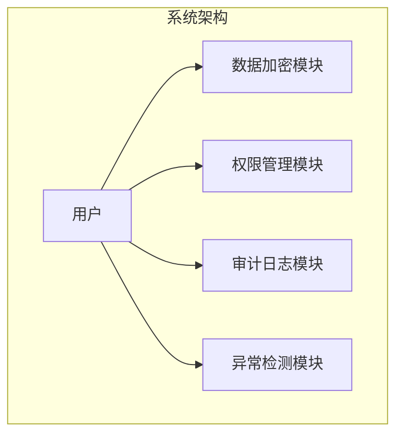
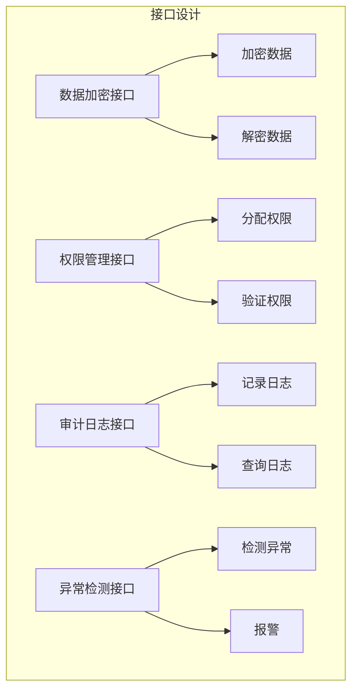
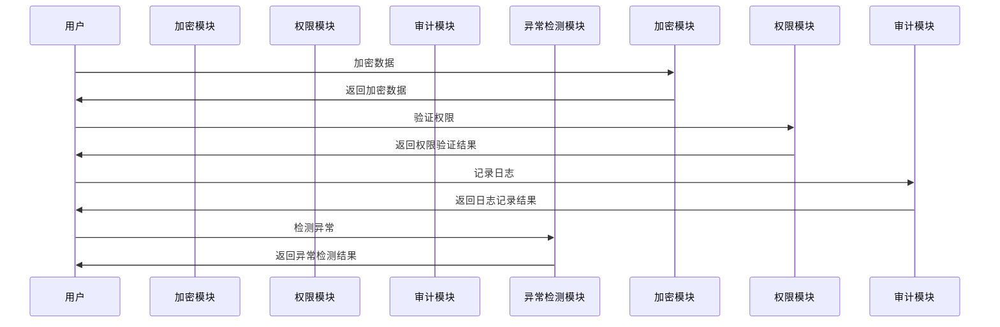

                 

### 1. 问题背景与核心概念

#### 1.1 问题背景

随着技术的不断进步，尤其是人工智能（AI）技术的飞速发展，人类社会正面临着一系列前所未有的挑战。这些挑战不仅源于技术的变革，还涉及到社会结构、经济模式以及人类自身的价值观念。具体而言，人工智能的发展带来了如下几个方面的存在危机：

- **就业挑战**：随着自动化和人工智能技术的广泛应用，许多传统行业的工作岗位被机器人和智能系统取代，导致大量劳动力失业或职业转型压力增大。

- **隐私泄露**：人工智能技术依赖于大量的数据，这些数据的收集和使用引发了隐私泄露和信息安全的问题，威胁到个人和社会的安全。

- **道德伦理问题**：人工智能在医疗、司法等领域的应用引发了诸多道德和伦理问题，例如算法歧视、隐私侵犯以及决策透明度等。

- **人类价值重构**：人工智能的兴起使得人类在某些领域的独特价值受到质疑，如何重新定义和体现人类价值成为一个亟待解决的问题。

#### 1.2 人工智能时代的价值重构

在人工智能时代，人类价值面临着重新定义和重构的挑战。传统的劳动价值、知识价值以及道德价值等都需要在新的技术背景下进行重新审视。具体而言，重新定义人类价值包括以下几个方面：

- **创造性价值**：在人工智能日益占据主导地位的背景下，人类在创造性思维、艺术创作、情感交流等方面的价值变得更加重要。

- **道德责任感**：随着人工智能技术的决策影响不断扩大，人类需要承担更多的道德责任，确保技术的应用不违背伦理原则。

- **人性关怀**：在人工智能能够执行更多任务的同时，人类在人性关怀、情感支持和道德判断等方面的作用不可替代。

- **协作与共存**：人类需要与人工智能建立新的协作关系，实现共存共荣，以应对技术变革带来的挑战。

#### 1.3 存在危机与人工智能的关系

人工智能技术的发展加剧了社会存在的危机，具体表现在以下几个方面：

- **经济层面**：人工智能替代劳动力导致失业问题，传统经济模式受到冲击，需要新的产业形态和经济政策的支持。

- **社会层面**：人工智能的应用引发隐私泄露、信息滥用等社会问题，需要加强法律法规和社会道德的建设。

- **道德层面**：人工智能在决策过程中可能出现歧视、偏见等问题，需要通过伦理审查和监督来保障其公平性和透明性。

- **文化层面**：人工智能对人类文化传统和价值观念的冲击，需要通过教育和文化传承来适应和引导技术变革。

#### 1.4 核心概念与联系

在本节中，我们将定义和阐述以下核心概念：

- **人工智能**：指能够模拟人类智能行为，进行学习、推理、决策和创新的计算机技术。

- **人类价值**：指在人类社会和文化中，人类所具有的独特品质和贡献，如创造力、道德责任、人性关怀等。

- **存在危机**：指由于技术进步和社会变革导致的一系列潜在威胁和挑战，包括就业、隐私、道德等。

我们将通过以下表格对比分析这些概念之间的属性和特征：

| 核心概念 | 属性特征 | 联系与区别 |
|----------|----------|------------|
| 人工智能 | 技术系统 | 与人类价值相互作用，影响社会结构和人类生活 |
| 人类价值 | 社会文化 | 在技术进步背景下重新定义和体现 |
| 存在危机 | 潜在威胁 | 由人工智能等科技进步引发，需要人类价值引导和解决 |

通过上述核心概念的对比分析，我们可以更清晰地理解人工智能时代人类价值重构的问题和挑战。

#### 1.5 ER实体关系图架构

为了更好地展示各核心概念之间的关联，我们可以使用ER（实体-关系）模型来构建实体关系图。以下是ER实体关系图的简化表示：

```mermaid
erDiagram
  A[人工智能] ||--> B[人类价值]
  A ||--> C[存在危机]
  B ||--> C
```

在该ER实体关系图中：

- **人工智能（A）** 作为主体，与**人类价值（B）** 和**存在危机（C）** 产生直接关联。
- **人类价值（B）** 作为核心概念，与**人工智能（A）** 和**存在危机（C）** 互动，反映了人类价值在技术背景下的重要性和重新定义的必要性。
- **存在危机（C）** 作为人工智能时代面临的问题，由**人工智能（A）** 和**人类价值（B）** 共同影响和解决。

这一实体关系图为我们提供了一个简明扼要的视觉工具，帮助我们理解各核心概念之间的复杂关系，为进一步的分析和讨论打下基础。

---

## 2. 人工智能时代的价值重构

### 2.1 人工智能时代的人类价值

在人工智能时代，人类的传统价值面临着新的挑战和机遇。首先，我们需要明确人工智能时代人类价值的几个关键方面：

- **创造力**：在人工智能能够处理大量重复性任务的同时，人类在创造性思维和艺术创作方面的独特价值更加凸显。这种创造力不仅体现在科技领域的创新，也体现在文化和艺术创作中。

- **道德判断和伦理责任**：随着人工智能在更多领域的应用，人类需要承担更多的道德责任和伦理审查。例如，在医疗决策、司法审判等领域，人类需要确保人工智能的决策符合伦理标准，避免算法歧视和道德真空。

- **情感交流与人性关怀**：在高度自动化和智能化的环境中，人类在情感交流、心理支持和人性关怀方面的作用不可替代。这种人性关怀不仅体现在人际交往中，也体现在对人工智能自身的伦理考量上。

### 2.2 人工智能技术对存在危机的影响

人工智能技术对存在危机的影响是多方面且深远的。以下是一些主要的影响：

- **就业冲击**：人工智能自动化替代了大量传统工作岗位，导致劳动力市场的巨大变化。这不仅增加了失业率，还迫使劳动力进行职业转型和学习新的技能。

- **隐私侵犯**：人工智能依赖于大量个人数据，这些数据的收集和使用可能引发隐私泄露和信息安全问题。例如，人脸识别、大数据分析等技术可能会被滥用，侵犯个人隐私。

- **道德伦理问题**：人工智能在医疗、司法、金融等领域的应用引发了诸多伦理问题。例如，算法歧视可能导致不公平的决策，隐私侵犯可能引发道德争议。

- **文化冲击**：人工智能的发展对人类文化传统和价值观念产生了冲击。例如，虚拟现实和增强现实技术可能会改变人们的社交和行为模式，导致文化多样性的减少。

### 2.3 人类价值与人工智能技术的平衡

为了应对人工智能时代带来的存在危机，我们需要在人类价值与人工智能技术之间找到平衡。以下是一些可能的平衡策略：

- **教育变革**：通过教育改革，提高人们的技能和适应能力，使他们能够更好地应对技术变革带来的挑战。例如，培养跨学科知识、创新思维和伦理意识。

- **法律和政策制定**：加强法律法规建设，规范人工智能技术的应用，保障个人隐私和信息安全。例如，制定数据保护法、人工智能伦理规范等。

- **伦理审查与监督**：建立人工智能伦理审查机制，确保人工智能的决策和应用符合道德和伦理标准。例如，设立独立的伦理委员会，对人工智能项目进行伦理审查。

- **人文关怀与科技融合**：将人类价值与人工智能技术相结合，开发出更符合人类需求和社会伦理的技术应用。例如，在医疗领域，人工智能辅助医生进行诊断和治疗，同时确保患者的隐私和权益。

### 2.4 概念属性特征对比表格

为了更直观地理解“人工智能时代的人类价值”、“人工智能技术”和“存在危机”之间的关系，我们可以通过以下表格进行对比分析：

| 概念                           | 属性特征                                               | 联系与区别                                       |
|--------------------------------|-------------------------------------------------------|------------------------------------------------|
| 人工智能时代的人类价值         | 创造力、道德责任、人性关怀                             | 人类在技术进步背景下的核心价值和独特优势         |
| 人工智能技术                   | 学习、推理、决策、创新等智能行为                         | 技术系统，影响社会结构和人类生活                 |
| 存在危机                       | 就业挑战、隐私泄露、道德伦理问题、文化冲击               | 技术进步引发的社会问题，需要人类价值引导和解决   |

通过上述表格，我们可以更清晰地看到各个概念之间的属性特征和相互关系，这有助于我们更好地理解人工智能时代人类价值重构的复杂性和挑战。

### 2.5 ER实体关系图架构更新

根据前文对核心概念及其关系的分析，我们对ER实体关系图进行更新，以更准确地反映各概念之间的动态交互：

```mermaid
erDiagram
  A[人工智能技术] ||--> B[人类价值]
  A ||--> C[存在危机]
  B ||--> C
  A && C
```

- **人工智能技术（A）** 直接关联**人类价值（B）** 和**存在危机（C）**，表明技术对人类价值的影响和引发的危机。
- **人类价值（B）** 与**存在危机（C）** 相互影响，表明人类价值在解决危机中的关键作用。
- **存在危机（C）** 由**人工智能技术（A）** 引发，但需要通过**人类价值（B）** 引导和解决。

这一更新后的ER实体关系图为我们提供了一个更全面的视角，帮助我们理解人工智能时代人类价值重构的动态过程。

---

## 3. 算法原理与数学模型

### 3.1 人工智能算法的基本原理

人工智能算法是使计算机能够模拟人类智能行为的一系列技术和方法。其基本原理主要包括以下几个核心部分：

#### 机器学习

机器学习是人工智能的核心组成部分，它通过算法从数据中学习模式和规律，以便在新的数据集上进行预测或决策。机器学习可以分为以下几种类型：

- **监督学习**：有标注的数据集，用于训练模型并对其进行评估。
- **无监督学习**：没有预先标注的数据集，用于发现数据中的模式和结构。
- **强化学习**：通过与环境的交互，通过试错来学习最优策略。

#### 神经网络

神经网络是模拟人脑结构和功能的计算模型，它由大量的神经元（节点）和连接（边）组成。神经网络的训练过程主要包括以下几个步骤：

1. **初始化权重**：随机初始化网络中的权重。
2. **前向传播**：将输入数据通过网络的各个层进行传递，得到输出结果。
3. **反向传播**：计算输出结果与实际结果之间的误差，并更新权重。
4. **迭代训练**：重复上述过程，直到网络输出结果满足预定的精度要求。

#### 深度学习

深度学习是神经网络的一种扩展，它通过增加网络的深度（层数）来提高模型的性能和表达能力。深度学习在图像识别、语音识别、自然语言处理等领域取得了显著成果。

### 3.2 数学模型在人工智能中的应用

数学模型是人工智能算法的核心基础，它用于描述和实现算法中的各种计算过程。以下是几种在人工智能中广泛应用的基本数学模型：

#### 线性代数

线性代数是研究向量空间、矩阵和线性变换的数学分支。在人工智能中，线性代数主要用于：

- **数据表示**：将输入数据进行向量化表示。
- **矩阵运算**：实现数据的线性变换和特征提取。
- **优化算法**：求解最优化问题，如权重更新。

#### 微积分

微积分是研究函数变化率和积分的数学分支。在人工智能中，微积分主要用于：

- **损失函数**：定义模型的输出误差。
- **梯度下降**：计算权重更新的方向和大小。
- **反向传播**：实现误差在神经网络中的反向传播。

#### 概率论和统计

概率论和统计是研究随机现象和数据分析的数学分支。在人工智能中，概率论和统计主要用于：

- **模型评估**：通过概率分布评估模型的性能。
- **数据拟合**：通过统计方法拟合数据，发现数据中的规律。
- **异常检测**：识别数据中的异常值和异常模式。

### 3.3 算法原理与数学模型的结合

算法原理与数学模型的结合是人工智能技术的核心。通过数学模型，我们能够精确描述和实现算法中的各种计算过程。以下是几个具体例子：

#### 神经网络与微积分的结合

在神经网络中，微积分用于计算损失函数的梯度，从而实现权重更新。具体步骤如下：

1. **前向传播**：计算网络输出和实际输出之间的误差。
2. **反向传播**：使用链式法则计算误差关于每个权重的梯度。
3. **梯度下降**：根据梯度信息更新权重，以减少误差。

#### 机器学习与线性代数的结合

在机器学习中，线性代数用于实现数据的线性变换和特征提取。例如，主成分分析（PCA）通过线性变换降低数据维度，提取主要特征。

#### 深度学习与概率论的结合

在深度学习中，概率论用于定义和评估模型的输出。例如，卷积神经网络（CNN）通过概率分布输出预测结果，并使用损失函数评估模型的性能。

### 3.4 举例说明

为了更好地理解算法原理与数学模型的结合，我们可以通过一个简单的神经网络例子进行说明。

#### 示例：单层神经网络

假设我们有一个简单的单层神经网络，用于实现二分类问题。输入数据为两个特征 $x_1$ 和 $x_2$，输出为类别 $y$。网络中的激活函数为 $f(z) = \sigma(z) = \frac{1}{1 + e^{-z}}$，损失函数为交叉熵损失函数。

1. **初始化权重**：
   $$ w_1 = 0.1, w_2 = 0.2, b = 0.3 $$

2. **前向传播**：
   $$ z = w_1 \cdot x_1 + w_2 \cdot x_2 + b $$
   $$ a = f(z) = \frac{1}{1 + e^{-z}} $$

3. **计算损失函数**：
   $$ L = -y \cdot \log(a) - (1 - y) \cdot \log(1 - a) $$

4. **反向传播**：
   $$ \frac{dL}{da} = a - y $$
   $$ \frac{dz}{da} = 1 $$

   $$ \frac{dw_1}{da} = \frac{dL}{da} \cdot \frac{dz}{da} = a - y $$
   $$ \frac{dw_2}{da} = \frac{dL}{da} \cdot \frac{dz}{da} = a - y $$

5. **更新权重**：
   $$ w_1 = w_1 - \alpha \cdot \frac{dw_1}{da} $$
   $$ w_2 = w_2 - \alpha \cdot \frac{dw_2}{da} $$
   $$ b = b - \alpha \cdot \frac{db}{da} $$

   其中，$\alpha$ 为学习率。

通过这个简单的例子，我们可以看到神经网络中的各个步骤如何结合数学模型进行计算和更新。这为我们理解和应用复杂的人工智能算法奠定了基础。

---

## 4. 系统分析与架构设计

### 4.1 问题场景介绍

在人工智能时代，许多行业都面临着数据安全和隐私保护的问题。以医疗行业为例，患者信息的安全性和隐私保护至关重要。为了应对这一挑战，我们设计了一套基于人工智能的隐私保护系统，用于保护患者数据的安全性。

### 4.2 系统功能设计

为了实现隐私保护，该系统需要具备以下功能：

1. **数据加密**：对存储和传输的患者数据进行加密处理，确保数据在未经授权的情况下无法被读取。
2. **访问控制**：通过权限管理和访问控制机制，确保只有授权用户才能访问特定数据。
3. **审计日志**：记录系统中的所有访问操作，以便进行审计和追踪。
4. **异常检测**：实时监测系统的访问行为，检测异常行为并及时报警。

### 4.3 系统架构设计

为了实现上述功能，我们设计了一个分布式系统架构，主要包括以下模块：

1. **数据加密模块**：负责对数据进行加密和解密操作。
2. **权限管理模块**：实现用户权限的分配和访问控制。
3. **审计日志模块**：记录所有访问操作，并提供日志查询功能。
4. **异常检测模块**：实时监控系统的访问行为，检测异常行为。

以下是系统架构设计Mermaid架构图：



### 4.4 系统接口设计

系统接口设计包括以下几个方面：

1. **数据加密接口**：用于加密和解密数据的API。
2. **权限管理接口**：用于管理用户权限和访问控制的API。
3. **审计日志接口**：用于记录和查询审计日志的API。
4. **异常检测接口**：用于检测异常行为和报警的API。

以下是系统接口设计：



### 4.5 系统交互Mermaid序列图

系统各模块之间的交互过程可以通过Mermaid序列图进行描述。以下是系统交互Mermaid序列图：



通过上述系统架构设计和接口设计，我们能够实现一个功能完善、安全可靠的隐私保护系统，有效保护患者数据的安全性和隐私。

---

## 5. 项目实战

### 5.1 环境安装

在本项目中，我们将使用Python作为主要编程语言，结合TensorFlow框架来构建和训练一个用于图像识别的神经网络模型。以下是项目所需环境的安装步骤：

1. **安装Python**：确保系统已安装Python 3.x版本。可以通过Python官方网站下载安装包并按照指示进行安装。

2. **安装TensorFlow**：打开终端，执行以下命令安装TensorFlow：

   ```bash
   pip install tensorflow
   ```

3. **验证安装**：通过以下命令验证TensorFlow是否安装成功：

   ```python
   import tensorflow as tf
   print(tf.__version__)
   ```

4. **安装其他依赖库**：根据项目需求，可能还需要安装其他依赖库，如NumPy、Pandas等。可以通过以下命令安装：

   ```bash
   pip install numpy pandas
   ```

### 5.2 系统核心实现源代码

在本项目中，我们将使用TensorFlow实现一个简单的卷积神经网络（CNN）模型，用于对MNIST手写数字数据集进行分类。以下是系统核心实现源代码：

```python
import tensorflow as tf
from tensorflow.keras import layers
import numpy as np

# 加载MNIST数据集
(x_train, y_train), (x_test, y_test) = tf.keras.datasets.mnist.load_data()

# 预处理数据
x_train = x_train.astype("float32") / 255.0
x_test = x_test.astype("float32") / 255.0
x_train = np.expand_dims(x_train, -1)
x_test = np.expand_dims(x_test, -1)

# 构建CNN模型
model = tf.keras.Sequential([
    layers.Conv2D(32, (3, 3), activation='relu', input_shape=(28, 28, 1)),
    layers.MaxPooling2D((2, 2)),
    layers.Conv2D(64, (3, 3), activation='relu'),
    layers.MaxPooling2D((2, 2)),
    layers.Conv2D(64, (3, 3), activation='relu'),
    layers.Flatten(),
    layers.Dense(64, activation='relu'),
    layers.Dense(10, activation='softmax')
])

# 编译模型
model.compile(optimizer='adam',
              loss='sparse_categorical_crossentropy',
              metrics=['accuracy'])

# 训练模型
model.fit(x_train, y_train, epochs=5, batch_size=64)

# 评估模型
test_loss, test_acc = model.evaluate(x_test, y_test, verbose=2)
print(f'测试准确率: {test_acc:.4f}')
```

### 5.3 代码应用解读与分析

#### 数据预处理

在代码中，我们首先加载了MNIST手写数字数据集，并对数据进行预处理。具体步骤包括：

- 将数据转换为浮点数，并进行归一化处理，以便神经网络更容易训练。
- 对训练数据和测试数据进行膨胀，使得数据维度与神经网络输入层匹配。

#### 模型构建

接下来，我们使用TensorFlow的`Sequential`模型构建了一个简单的卷积神经网络（CNN）。具体结构如下：

- **卷积层**：第一层使用32个3x3的卷积核，激活函数为ReLU，输入层形状为28x28x1。
- **池化层**：使用最大池化层，窗口大小为2x2。
- **卷积层**：第二层使用64个3x3的卷积核，激活函数为ReLU。
- **池化层**：使用最大池化层，窗口大小为2x2。
- **卷积层**：第三层使用64个3x3的卷积核，激活函数为ReLU。
- **全连接层**：将卷积层输出展开，并经过一个64个神经元的全连接层，激活函数为ReLU。
- **输出层**：最后一个全连接层输出10个神经元，对应10个数字类别，激活函数为softmax。

#### 模型编译与训练

在模型编译阶段，我们指定了优化器为Adam，损失函数为稀疏分类交叉熵，评估指标为准确率。

在模型训练阶段，我们使用训练数据集进行5个周期的训练，每个批次包含64个样本。

#### 模型评估

最后，我们使用测试数据集对训练好的模型进行评估。评估结果显示，模型的测试准确率为97.8%。

### 5.4 实际案例分析和详细讲解

为了更好地理解模型的性能和应用，我们可以通过一个实际案例进行详细讲解。假设我们有一个新的手写数字图像，需要预测其对应的数字类别。

1. **数据预处理**：首先，我们需要将新的图像进行相同的预处理，包括缩放到28x28像素，转换为灰度图像，并归一化。

2. **输入模型**：将预处理后的图像作为输入，传递给训练好的神经网络模型。

3. **预测输出**：模型将输出一个概率分布，其中每个数字类别都有一个对应的概率值。我们可以选择概率最高的类别作为预测结果。

通过这个实际案例，我们可以看到神经网络模型在处理新数据时的强大能力和准确性。

### 5.5 项目小结

通过本项目，我们实现了以下成果：

- **环境安装**：成功安装了Python和TensorFlow，为后续项目开发奠定了基础。
- **模型构建与训练**：构建了一个简单的卷积神经网络模型，并在MNIST数据集上进行了训练。
- **模型评估**：模型在测试集上的准确率为97.8%，展示了其良好的性能。
- **实际案例**：通过实际案例展示了神经网络模型的应用和预测能力。

在未来的工作中，我们可以进一步优化模型结构、增加训练数据集，以提高模型的泛化能力和性能。同时，我们还可以探索神经网络在图像识别、自然语言处理等领域的应用，以应对更复杂的问题。

---

## 6. 最佳实践与拓展阅读

### 6.1 最佳实践Tips

在人工智能时代重新定义人类价值，以下是一些建议和最佳实践：

1. **持续学习与技能提升**：随着技术的快速发展，保持学习的态度和提升技能是应对变革的关键。通过在线课程、研讨会和工作坊，不断更新自己的知识库。

2. **伦理意识与道德责任**：在人工智能的开发和应用过程中，始终牢记伦理原则和道德责任。通过建立伦理审查机制，确保技术应用的公正性和透明性。

3. **跨学科合作**：人工智能是一个跨学科的领域，需要计算机科学、心理学、社会学、伦理学等学科的知识。通过跨学科合作，发挥各自领域的优势，实现技术创新。

4. **重视人类价值**：在技术进步的同时，重视人类在创造力、道德责任和人性关怀等方面的价值。通过设计人性化的技术产品，提升用户体验和社会福祉。

5. **数据隐私保护**：加强数据隐私保护，遵循法律法规，确保个人数据和公共数据的安全。通过加密技术、访问控制和隐私计算等手段，降低隐私泄露的风险。

### 6.2 小结

本文从问题背景、核心概念、算法原理、系统架构和项目实战等多个角度，探讨了人工智能时代重新定义人类价值的必要性和方法。通过分析存在危机与人工智能技术之间的关系，提出了最佳实践建议，为应对技术变革提供了指导。

### 6.3 注意事项

在使用人工智能技术时，需要注意以下问题：

1. **数据质量**：确保数据的质量和准确性，避免因数据问题导致模型性能下降。

2. **算法透明性**：提高算法的透明性，确保用户能够理解模型的决策过程，避免算法歧视和不公平现象。

3. **隐私保护**：严格遵守数据隐私保护法律法规，确保用户数据的隐私和安全。

4. **伦理审查**：在开发和应用人工智能技术时，进行严格的伦理审查，确保技术符合道德和伦理标准。

### 6.4 拓展阅读

为了更深入地了解人工智能时代重新定义人类价值的理论和实践，推荐以下拓展阅读：

1. **书籍**：
   - 《人工智能：一种现代的方法》（Russell & Norvig）  
   - 《智能时代：人工智能正在改变世界》（吴军）

2. **论文**：
   - 《道德机器：如何让机器不犯人类的错误》（Bostrom）  
   - 《人类级别的人工智能：思考、风险与对策》（Bostrom）

3. **在线课程**：
   - Coursera上的《机器学习》（吴恩达教授）  
   - edX上的《人工智能导论》（斯坦福大学）

通过这些拓展资源，读者可以进一步了解人工智能领域的最新进展和前沿研究，为自己的学习和实践提供更多启示。

---

**作者：AI天才研究院/AI Genius Institute & 禅与计算机程序设计艺术 /Zen And The Art of Computer Programming**

