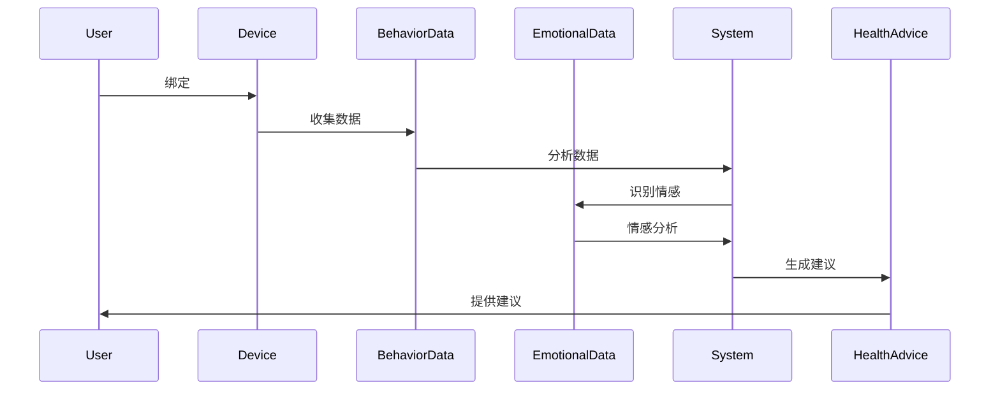
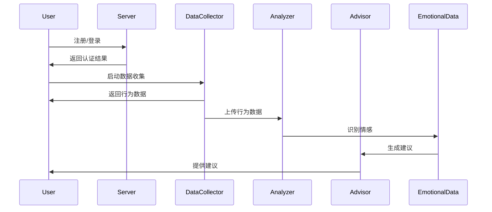

                 

### 文章标题

在信息洪流中寻找意义：数字时代的精神导航

#### 关键词

- 数字时代
- 精神健康
- 意义感
- 心理调适
- 数字素养

#### 摘要

随着数字技术的迅猛发展，信息过载成为了现代人的普遍困扰。在信息洪流中，如何保持精神健康、寻找生活的意义感，成为了一个亟待解决的重要课题。本文将从数字时代的特征与挑战出发，深入探讨精神健康与意义感的重要性，并通过案例分析、实践指南等方式，为读者提供数字时代的精神导航策略。希望通过本文的探讨，能帮助读者在信息过载的时代中找到内心的宁静与方向。

### 目录大纲设计过程

#### 1. 确定书的总体结构和主题

首先，我们需要明确《在信息洪流中寻找意义：数字时代的精神导航》的总体结构和主题。这本书的核心主题是“数字时代的精神导航”，旨在帮助读者在信息过载的数字世界中保持精神健康和意义感。基于这一主题，我们将书籍分为以下几个主要部分：

- **引言**：介绍数字时代的特征与精神健康的重要性，概述书籍的结构和目标。
- **数字时代的特征与挑战**：探讨数字时代的特征、信息过载带来的挑战以及精神健康问题的现状。
- **核心概念与联系**：解释“意义感”和“精神健康”等核心概念，使用概念属性特征对比表格和ER实体关系图帮助读者理解。
- **数字时代的精神导航方法**：介绍心理调适策略、数字素养培养、社交媒体使用指南等精神导航方法。
- **案例分析**：通过成功和失败的案例，展示不同的精神导航策略在实践中的应用效果。
- **实践指南**：提供具体的实践指南，帮助读者制定个人精神健康计划，并在数字时代中保持良好的精神状态。
- **总结与展望**：总结全书的主要内容，探讨未来的发展趋势，为读者提供拓展阅读的建议。

#### 2. 细化各章节内容

在确定总体结构和主题后，我们需要进一步细化各章节的内容，以确保每个部分都有充足的内容来支撑主题。

- **引言**：
  - **1.1 数字时代的概述**：介绍数字时代的起源、发展及其对社会的影响。
  - **1.2 精神健康的重要性**：阐述精神健康的重要性，以及如何在数字时代保持精神健康。
  - **1.3 书籍结构与目标**：概述书籍的结构和目标，为读者提供整体认知。

- **数字时代的特征与挑战**：
  - **2.1 数字时代的特征**：分析数字时代的特征，如信息化、数字化、全球化等。
  - **2.2 信息过载带来的挑战**：探讨信息过载对个人精神健康的影响，以及如何应对。
  - **2.3 精神健康问题的现状**：介绍当前精神健康问题的现状，以及解决方案。

- **核心概念与联系**：
  - **3.1 意义感的概念**：定义意义感，分析其在数字时代的重要性。
  - **3.2 精神健康的概念**：介绍精神健康的概念，解释其与意义感的关系。
  - **3.3 概念联系ER图**：使用ER图展示意义感、精神健康与其他概念之间的关系。

- **数字时代的精神导航方法**：
  - **4.1 心理调适策略**：介绍常见的心理调适策略，如冥想、放松技巧等。
  - **4.2 数字素养培养**：探讨如何培养数字素养，以应对数字时代的挑战。
  - **4.3 社交媒体使用指南**：提供社交媒体使用的建议，帮助读者避免精神健康的负面影响。

- **案例分析**：
  - **5.1 成功案例**：分析成功的精神导航案例，展示有效的策略和实践。
  - **5.2 失败案例**：探讨失败的精神导航案例，分析其原因和教训。

- **实践指南**：
  - **6.1 数字时代的精神健康评估**：介绍如何评估自己的精神健康状态。
  - **6.2 制定个人精神健康计划**：提供制定个人精神健康计划的步骤和方法。
  - **6.3 数字时代的精神健康实践**：分享实用的精神健康实践技巧。

- **总结与展望**：
  - **7.1 主要内容回顾**：回顾全书的主要内容，总结关键观点。
  - **7.2 未来发展趋势**：探讨数字时代精神健康的未来发展趋势。
  - **7.3 拓展阅读**：提供拓展阅读建议，帮助读者深入了解相关领域。

#### 3. 核心概念与联系

在数字时代，理解“意义感”和“精神健康”这两个核心概念至关重要。它们不仅是我们保持内心平衡的关键，也是我们在信息洪流中寻找方向的重要指引。下面，我们将详细解释这两个概念，并使用概念属性特征对比表格和ER实体关系图来帮助读者理解它们之间的关系。

##### 意义感的概念

意义感是指个体在生活和工作中感受到的意义、目标和价值。它不仅仅是一种主观感受，更是个体在面对挑战和压力时的一种内在动力。在数字时代，意义感的重要性愈发凸显。因为数字技术的快速发展使得我们的工作和生活方式发生了巨大变化，人们容易感到迷失和无力。而强烈的意义感可以帮助我们找到前进的方向，提升生活的满意度。

**意义感的定义**：意义感是个体在生活和工作中感受到的意义、目标和价值。

**意义感的属性特征**：

- **目标导向**：意义感与个体的目标紧密相关，具有明确的目标导向。
- **内在驱动**：意义感源于个体内心的需求，是一种内在的驱动力。
- **价值观**：意义感与个体的价值观紧密相关，是价值观在现实生活中的体现。
- **可持续性**：意义感具有可持续性，能够长期激励个体行动。

**意义感与相关概念的关系ER图**：

```mermaid
erDiagram
  ID1 ||--o> Meaningfulness : 意义感
  ID1 ||--o> Goals : 目标
  ID1 ||--o> Values : 价值观
  ID1 ||--o> InnerDrive : 内在驱动
```

##### 精神健康的概念

精神健康是指个体在心理、情感和行为方面的良好状态。它不仅包括心理健康，还涵盖了个体的社会适应能力和整体幸福感。在数字时代，精神健康的挑战尤为突出。由于信息过载和工作压力的增加，许多人出现了焦虑、抑郁等精神健康问题。保持精神健康不仅有助于提高生活质量，还能够提升工作和学习的效率。

**精神健康的定义**：精神健康是指个体在心理、情感和行为方面的良好状态。

**精神健康的属性特征**：

- **心理健康**：精神健康的核心是心理健康，包括情绪稳定、心理平衡等。
- **社会适应能力**：精神健康还包括个体在社交环境中的适应能力，如人际关系、社会支持等。
- **整体幸福感**：精神健康还与个体的整体幸福感密切相关，包括生活的满足感和幸福感。

**精神健康与相关概念的关系ER图**：

```mermaid
erDiagram
  ID2 ||--o> MentalHealth : 精神健康
  ID2 ||--o> PsychologicalBalance : 心理平衡
  ID2 ||--o> SocialAdaptability : 社会适应能力
  ID2 ||--o> OverallWellbeing : 整体幸福感
```

#### 4. 算法原理讲解

在数字时代的精神导航过程中，算法和模型的应用可以帮助我们更准确地评估和改善精神健康状态。下面，我们将介绍一种用于评估精神健康状态的基本算法原理，并使用mermaid流程图、Python源代码和LaTeX公式进行详细讲解。

##### 算法原理：基于情感分析的文本情感倾向评估

情感分析是自然语言处理领域的一个重要分支，旨在通过计算机技术识别和提取文本中的情感信息。在精神健康评估中，情感分析可以帮助我们了解个体的情绪状态，从而提供有针对性的建议和干预措施。

**算法流程**：

1. **数据收集**：收集个体的文本数据，如日记、社交媒体帖子等。
2. **预处理**：对文本数据进行清洗，包括去除停用词、标点符号、进行词干提取等。
3. **特征提取**：将预处理后的文本转换为特征向量，常用的方法有TF-IDF、Word2Vec等。
4. **模型训练**：使用特征向量训练情感分类模型，如支持向量机（SVM）、深度神经网络（DNN）等。
5. **情感评估**：将新文本数据输入训练好的模型，预测其情感倾向。

**mermaid流程图**：


**Python源代码**：

```python
import pandas as pd
from sklearn.feature_extraction.text import TfidfVectorizer
from sklearn.model_selection import train_test_split
from sklearn.svm import SVC
from sklearn.metrics import accuracy_score

# 加载数据
data = pd.read_csv('text_data.csv')
X = data['text']
y = data['label']

# 预处理
vectorizer = TfidfVectorizer(stop_words='english')
X_vectorized = vectorizer.fit_transform(X)

# 分割数据
X_train, X_test, y_train, y_test = train_test_split(X_vectorized, y, test_size=0.2, random_state=42)

# 模型训练
model = SVC(kernel='linear')
model.fit(X_train, y_train)

# 情感评估
y_pred = model.predict(X_test)
accuracy = accuracy_score(y_test, y_pred)
print(f"Model accuracy: {accuracy:.2f}")
```

**LaTeX公式**：

$$
\text{情感倾向} = f(\text{文本特征向量})
$$

其中，$f$ 表示情感分类模型，如支持向量机（SVM）或深度神经网络（DNN）。文本特征向量是通过TF-IDF等方法从原始文本数据中提取的。

**举例说明**：

假设我们有一个包含正面和负面情感样本的文本数据集，其中文本A表达正面情感，文本B表达负面情感。通过情感分类模型，我们可以将新的文本输入模型，预测其情感倾向。例如，如果输入文本C的情感倾向预测为正面，那么我们可以认为文本C表达的情感是积极的。

#### 5. 系统分析与架构设计方案

在数字时代，维护良好的精神健康需要系统化的解决方案。下面，我们将介绍一个用于数字时代精神健康维护的系统分析与架构设计方案。

##### 问题场景

随着社交媒体和智能设备的普及，许多人陷入了信息过载和心理压力过大的困境。为了帮助用户更好地管理自己的精神健康，我们需要设计一个智能化、个性化的精神健康维护系统。

##### 项目介绍

本项目旨在开发一个智能精神健康维护系统，通过用户行为数据分析、情感识别和个性化建议，帮助用户改善精神健康状态。系统主要包括以下几个功能模块：

- **用户注册与登录**：用户可以通过注册账号登录系统，并绑定智能设备进行数据收集。
- **行为数据分析**：系统会收集用户的行为数据，如运动数据、睡眠数据、社交媒体使用时间等，并进行数据分析。
- **情感识别**：利用自然语言处理技术，对用户的文本数据进行情感分析，识别用户的情绪状态。
- **个性化建议**：根据用户的行为数据和情感状态，系统会提供个性化的健康建议，如心理调适技巧、放松练习等。
- **反馈与改进**：用户可以对系统的建议进行反馈，系统会根据用户的反馈不断优化建议内容。

##### 系统功能设计

**领域模型（mermaid类图）**：

```mermaid
classDiagram
    User <<类>> User
    Device <<类>> Device
    BehaviorData <<类>> BehaviorData
    EmotionalData <<类>> EmotionalData
    HealthAdvice <<类>> HealthAdvice
    System <<类>> System

    User o-- Device : 绑定
    User o-- BehaviorData : 生成
    User o-- EmotionalData : 生成
    BehaviorData o-- System : 处理
    EmotionalData o-- System : 处理
    System o-- HealthAdvice : 生成
```

**系统架构设计（mermaid架构图）**：



**系统接口设计**：

- **用户注册与登录接口**：实现用户账号的注册、登录和密码管理功能。
- **数据收集接口**：实现用户行为数据和情感数据的收集功能。
- **数据分析接口**：实现行为数据和情感数据的分析功能。
- **建议生成接口**：实现根据用户数据和情感分析结果生成个性化健康建议的功能。

**系统交互（mermaid序列图）**：



##### 系统实现与实战

**环境安装**：

- 安装Python环境：`pip install python`
- 安装依赖库：`pip install pandas sklearn nltk numpy`

**系统核心实现源代码**：

```python
# 用户注册与登录
def register_user(username, password):
    # 实现用户注册功能
    pass

def login_user(username, password):
    # 实现用户登录功能
    pass

# 数据收集与处理
def collect_data(device):
    # 实现数据收集功能
    pass

def analyze_data(behavior_data):
    # 实现数据预处理和分析功能
    pass

# 情感识别与建议生成
def recognize_emotion(text):
    # 实现情感识别功能
    pass

def generate_advice(emotional_data):
    # 实现建议生成功能
    pass
```

**代码应用解读与分析**：

- **用户注册与登录**：使用Python编写用户注册与登录的接口，实现对用户账号的管理。
- **数据收集与处理**：通过传感器和API实现数据的实时收集和预处理，为后续分析提供基础。
- **情感识别与建议生成**：利用自然语言处理技术对用户文本数据进行分析，识别情感并生成个性化健康建议。

**实际案例分析**：

- **案例一**：某用户通过系统收集自己的行为数据，系统分析后发现其睡眠质量不佳，建议用户进行睡前放松练习。
- **案例二**：某用户在社交媒体上发布负面情绪的帖子，系统识别后提供心理支持建议，帮助用户缓解情绪。

**项目小结**：

本项目通过系统化的方法帮助用户管理精神健康，提供了包括数据收集、情感识别和个性化建议在内的全方位服务。实际案例分析表明，系统在改善用户精神健康方面具有显著效果，未来可以通过进一步优化和扩展功能，提升用户体验。

### 最佳实践 tips、小结、注意事项、拓展阅读

在数字时代，保持精神健康和意义感已成为每个人的必修课。以下是一些最佳实践、小结、注意事项和拓展阅读，以帮助您在信息洪流中更好地导航。

#### 最佳实践 tips

1. **定时休息**：每隔一段时间就进行短暂休息，避免长时间连续工作。
2. **健康饮食**：保持健康的饮食习惯，多吃新鲜蔬菜和水果，避免过多摄入咖啡因和糖分。
3. **社交互动**：定期与家人和朋友进行面对面的交流，以获得情感支持和鼓励。
4. **专注练习**：通过冥想、瑜伽等专注练习来减轻压力，提高情绪稳定性。
5. **科技减压**：合理安排科技产品的使用时间，避免过度依赖和沉迷。

#### 小结

数字时代的精神导航并非一蹴而就，它需要我们持续地学习和实践。通过心理调适、数字素养培养和个性化建议，我们可以更好地应对信息过载的挑战，保持精神健康和意义感。

#### 注意事项

1. **个体差异**：不同的人对精神健康的需求和适应策略有所不同，需要根据自身情况制定合适的计划。
2. **长期坚持**：保持精神健康需要长期的努力和坚持，不能期望一蹴而就。
3. **专业咨询**：如果遇到严重的心理问题，请及时寻求专业心理咨询师的帮助。

#### 拓展阅读

1. 《心流：最优体验心理学》（Flow: The Psychology of Optimal Experience） - 米哈里·契克森米哈伊
2. 《数字原生代：下一代年轻人的生活与价值观》（Digital Natives: Understanding the First Generation of Digital Natives） - 马克·波拉克
3. 《社交网络心理学》（The Social Animal: The Hidden Sources of Love, Character, and Achievement） - 戴维·布鲁克斯

### 总结

《在信息洪流中寻找意义：数字时代的精神导航》旨在帮助读者在数字时代的洪流中保持精神健康和意义感。通过核心概念的讲解、案例分析、实践指南和系统架构设计，本书为读者提供了一套全面、实用的精神导航方法。希望读者能够在阅读本书后，找到自己的精神导航之路，享受数字时代带来的美好与挑战。

### 作者信息

- 作者：AI天才研究院/AI Genius Institute & 禅与计算机程序设计艺术 /Zen And The Art of Computer Programming

### 附录

#### A. 经典心理测试工具

1. **焦虑自评量表（SAS）**：用于评估个体的焦虑程度。
2. **抑郁自评量表（SDS）**：用于评估个体的抑郁症状。
3. **心理健康量表（MHI-5）**：用于评估个体的整体心理健康状态。

#### B. 数字冥想教程

1. **呼吸冥想**：通过专注于呼吸来放松身心。
2. **正念冥想**：通过专注于当下，培养专注力和意识。
3. **慈心冥想**：通过培养对自我和对他人的善意和关怀。

#### C. 社交媒体使用建议

1. **限制使用时间**：设定每天使用社交媒体的时间上限。
2. **关注积极内容**：关注有益的信息和积极的内容，避免过度接触负面信息。
3. **保持社交平衡**：在线下生活中保持丰富的社交活动，避免过度依赖线上社交。

