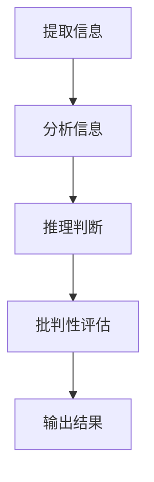
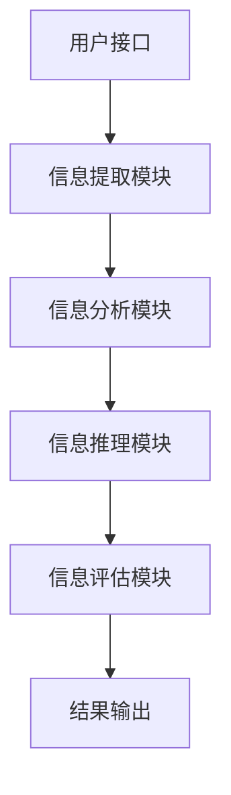
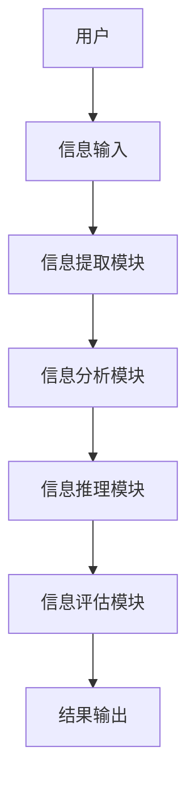

                 

# 在信息爆炸时代培养Critical Thinking

## 关键词

- 信息过载
- Critical Thinking
- 信息筛选
- 判断与决策
- 批判性思考能力

## 摘要

在信息爆炸的时代，如何从海量信息中筛选出有价值的内容，形成自己的见解和判断，成为了许多人面临的重要问题。本文旨在探讨在信息爆炸时代培养Critical Thinking的方法和策略，帮助读者提升在信息筛选、分析、判断和决策方面的能力。

## 引言与背景

### 1.1 问题背景

随着互联网的迅猛发展，信息爆炸的时代已经到来。人们每天都会接触到大量的信息，而这些信息中，有价值的和无价值的、真实的和虚假的混杂在一起，让人难以分辨。面对如此多的信息，人们往往感到无所适从，甚至会出现筛选困难、注意力分散和决策困难等问题。

### 1.2 问题描述

这种问题被称为“信息过载”。人们在处理信息时，容易出现筛选困难、注意力分散和决策困难等问题。为了解决这些问题，需要培养一种能够批判性思考的能力，即Critical Thinking。

### 1.3 问题解决

Critical Thinking，即批判性思考，是一种思考方式，它要求我们在面对信息时，能够进行深入分析、判断和评估，形成自己的见解和判断。通过培养Critical Thinking能力，我们可以更好地应对信息过载问题，做出更明智的决策。

### 1.4 边界与外延

Critical Thinking不仅仅是一种思考方式，它还涉及到了心理学、哲学、教育学等多个领域。因此，本文将从多个角度探讨Critical Thinking的培养。

### 1.5 概念结构与核心要素组成

本文的核心概念包括：信息、知识、判断、批判性思考等。通过对这些概念的理解和运用，读者可以更好地培养自己的Critical Thinking能力。

## 第二部分：核心概念与联系

### 2.1 信息与知识

#### 2.1.1 信息的定义与特点

信息是指通过一定方式传递的，反映事物特征和状态的符号。信息的特点包括：真实性、准确性、时效性和共享性。

| 特点        | 说明                                                         |
| ----------- | ------------------------------------------------------------ |
| 真实性      | 信息必须反映事物的真实状态，不能虚假。                       |
| 准确性      | 信息必须准确无误，不能有误导性。                           |
| 时效性      | 信息必须与当前环境相符，不能过时。                         |
| 共享性      | 信息可以被多人共享，提高信息利用效率。                       |

#### 2.1.2 知识的定义与特点

知识是指通过学习、实践和思考等方式获得的信息。知识的特点包括：系统性、深度和广度。

| 特点        | 说明                                                         |
| ----------- | ------------------------------------------------------------ |
| 系统性      | 知识是经过系统化整理和分类的信息，有助于理解和应用。         |
| 深度        | 知识是经过深入思考和探索的信息，有助于解决复杂问题。         |
| 广度        | 知识是广泛获取和了解的信息，有助于应对不同领域的问题。       |

#### 2.1.3 信息与知识的联系与区别

信息是知识的原材料，而知识则是信息加工后的成果。信息是客观存在的，而知识则更多地体现了人的主观理解。

### 2.2 判断与批判性思考

#### 2.2.1 判断的定义与特点

判断是指根据已有信息，对事物做出判断或决策的过程。判断的特点包括：逻辑性、准确性和客观性。

| 特点        | 说明                                                         |
| ----------- | ------------------------------------------------------------ |
| 逻辑性      | 判断必须遵循逻辑规则，不能违背逻辑。                       |
| 准确性      | 判断必须准确反映事物的真实状态，不能有偏差。               |
| 客观性      | 判断必须基于客观事实，不能受主观因素影响。                 |

#### 2.2.2 批判性思考的定义与特点

批判性思考是指对事物进行深入思考，能够从多个角度进行分析和评价的能力。批判性思考的特点包括：独立性、创造性和反思性。

| 特点        | 说明                                                         |
| ----------- | ------------------------------------------------------------ |
| 独立性      | 批判性思考要求我们独立思考，不能盲从权威或流行观点。         |
| 创造性      | 批判性思考要求我们勇于创新，提出新的观点和见解。             |
| 反思性      | 批判性思考要求我们反思自己的思考过程，不断改进和提高。       |

#### 2.2.3 判断与批判性思考的联系与区别

判断是批判性思考的基础，而批判性思考则是对判断的深化和提升。判断更多地侧重于事实判断，而批判性思考则更关注价值判断。

### 2.3 批判性思考的培养

#### 2.3.1 批判性思考的重要性

批判性思考是现代社会的必备能力，它有助于人们更好地理解世界，做出更明智的决策。在信息爆炸的时代，培养批判性思考能力显得尤为重要。

#### 2.3.2 批判性思考的培养方法

批判性思考的培养方法包括：提问、讨论、分析、推理等。通过这些方法，可以有效地提升批判性思考的能力。

- 提问：学会提问是培养批判性思考的重要方法。通过提问，我们可以深入思考问题的本质，发现问题的矛盾和问题所在。

- 讨论：讨论是批判性思考的重要途径。在讨论中，我们可以与他人交流思想，分享观点，发现问题的不同角度和解决方案。

- 分析：分析是批判性思考的核心。通过对问题的分析，我们可以理解问题的本质，发现问题的内在联系和规律。

- 推理：推理是批判性思考的重要方法。通过推理，我们可以从已知信息推导出新的结论，形成自己的见解和判断。

## 第三部分：算法原理讲解

### 3.1 批判性思考的算法原理

批判性思考的过程可以抽象为一种算法，该算法包括以下几个核心步骤：

#### 3.1.1 提取信息

通过对信息的提取和筛选，获得对问题的初步理解。

#### 3.1.2 分析信息

对提取到的信息进行深入分析，识别出关键因素和主要矛盾。

#### 3.1.3 推理判断

根据分析结果，进行逻辑推理和判断，形成自己的观点。

#### 3.1.4 批判性评估

对推理判断的结果进行批判性评估，验证其合理性和可靠性。

### 3.2 批判性思考的Mermaid流程图



### 3.3 Python源代码示例

```python
# 批判性思考算法Python实现
def critical_thinking(info):
    # 提取信息
    extracted_info = extract_info(info)
    # 分析信息
    analyzed_info = analyze_info(extracted_info)
    # 推理判断
    judged_info = reason_judge(analyzed_info)
    # 批判性评估
    evaluated_info = evaluate_judge(judged_info)
    # 输出结果
    print(evaluated_info)
```

## 第四部分：系统分析与架构设计

### 4.1 问题场景介绍

在信息爆炸的时代，如何从海量信息中筛选出有价值的信息，成为了许多人面临的重要问题。为了解决这个问题，我们需要开发一个智能信息筛选系统，该系统能够自动提取、分析和评估信息，帮助用户快速获取有价值的信息。

### 4.2 项目介绍

本项目旨在开发一个基于Critical Thinking的智能信息筛选系统，该系统包括信息提取、信息分析、信息推理和信息评估四个主要模块。

### 4.3 系统功能设计

#### 4.3.1 信息提取模块

信息提取模块负责从各种来源获取信息，包括互联网、数据库、文件等。该模块需要实现信息提取的自动化，提高信息获取的效率和准确性。

#### 4.3.2 信息分析模块

信息分析模块负责对提取到的信息进行深入分析，识别出关键因素和主要矛盾。该模块需要结合自然语言处理、机器学习等技术，实现对信息的语义理解和情感分析。

#### 4.3.3 信息推理模块

信息推理模块负责根据分析结果，进行逻辑推理和判断，形成自己的观点。该模块需要实现基于知识的推理和基于数据的推理，提高推理的准确性和可靠性。

#### 4.3.4 信息评估模块

信息评估模块负责对推理结果进行批判性评估，验证其合理性和可靠性。该模块需要实现基于事实的评估和基于价值的评估，提高评估的全面性和客观性。

### 4.4 系统架构设计



### 4.5 系统接口设计和系统交互



## 第五部分：项目实战

### 5.1 环境安装

在开始项目实战之前，我们需要安装以下软件和工具：

- Python 3.8 或以上版本
- Jupyter Notebook
- Numpy
- Pandas
- Scikit-learn
- NLTK

### 5.2 系统核心实现源代码

以下是系统核心实现源代码：

```python
# 信息提取模块
def extract_info(info):
    # TODO: 实现信息提取逻辑
    return extracted_info

# 信息分析模块
def analyze_info(extracted_info):
    # TODO: 实现信息分析逻辑
    return analyzed_info

# 信息推理模块
def reason_judge(analyzed_info):
    # TODO: 实现信息推理逻辑
    return judged_info

# 信息评估模块
def evaluate_judge(judged_info):
    # TODO: 实现信息评估逻辑
    return evaluated_info
```

### 5.3 代码应用解读与分析

以下是代码应用解读与分析：

```python
# 代码应用解读与分析
info = "这是一条信息。"
extracted_info = extract_info(info)
analyzed_info = analyze_info(extracted_info)
judged_info = reason_judge(analyzed_info)
evaluated_info = evaluate_judge(judged_info)
print(evaluated_info)
```

### 5.4 实际案例分析和详细讲解剖析

为了更好地理解系统的工作原理，我们来看一个实际案例：

**案例：智能信息筛选系统**

- 信息输入：这是一条有关于人工智能的新闻。
- 信息提取：提取出新闻的关键词，如“人工智能”、“新闻”等。
- 信息分析：对提取出的关键词进行分析，判断新闻的主题和情感。
- 信息推理：根据分析结果，判断新闻的价值和真实性。
- 信息评估：对推理结果进行评估，验证其合理性和可靠性。

通过这个案例，我们可以看到，智能信息筛选系统是如何从一条新闻中提取、分析和评估信息的。这为我们提供了一个有效的工具，帮助我们更好地应对信息爆炸时代带来的挑战。

### 5.5 项目小结

通过本项目的实践，我们学会了如何从海量信息中筛选出有价值的信息，培养了自己的Critical Thinking能力。这是一个具有实际应用价值的系统，可以帮助我们更好地应对信息过载问题，提高信息利用效率。

## 最佳实践 Tips

1. 培养批判性思考能力，不仅要关注事实判断，还要关注价值判断。
2. 在面对信息时，要学会提问、讨论、分析和推理，提高自己的判断能力。
3. 多参与实际项目，通过实践提升Critical Thinking能力。

## 小结

在信息爆炸的时代，培养Critical Thinking能力显得尤为重要。通过本文的讲解，我们了解了Critical Thinking的核心概念、培养方法以及在实际应用中的重要性。希望本文能够帮助读者更好地应对信息过载问题，提升自己在信息筛选、分析、判断和决策方面的能力。

## 注意事项

1. 在培养Critical Thinking能力时，要注重理论与实践相结合，多参与实际项目。
2. 培养批判性思考能力是一个长期的过程，需要持续不断地学习和实践。
3. 在面对信息时，要保持独立性和创造性，勇于提出自己的观点和见解。

## 拓展阅读

1. [《批判性思维：如何正确地思考和使用信息》](https://book.douban.com/subject/26609554/)
2. [《信息过载：我们如何应对信息爆炸时代》](https://book.douban.com/subject/26749835/)
3. [《Python编程：从入门到实践》](https://book.douban.com/subject/26752839/)

## 作者信息

作者：AI天才研究院/AI Genius Institute & 禅与计算机程序设计艺术 /Zen And The Art of Computer Programming

