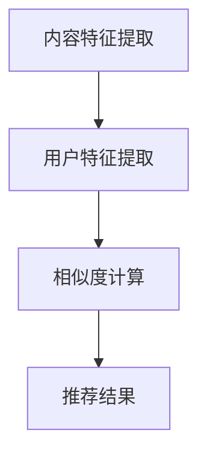
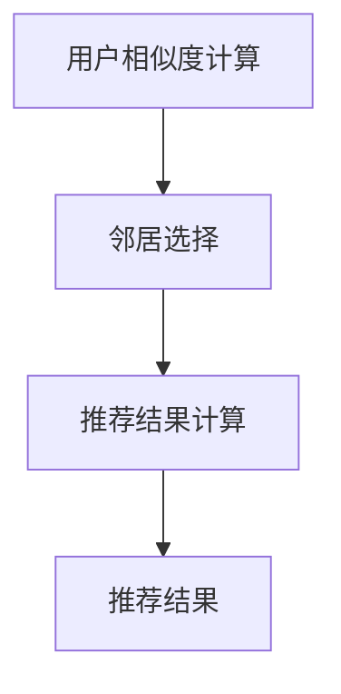
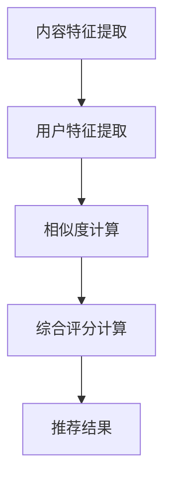
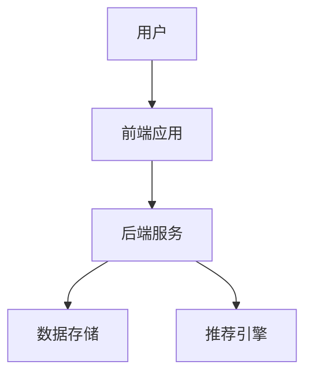
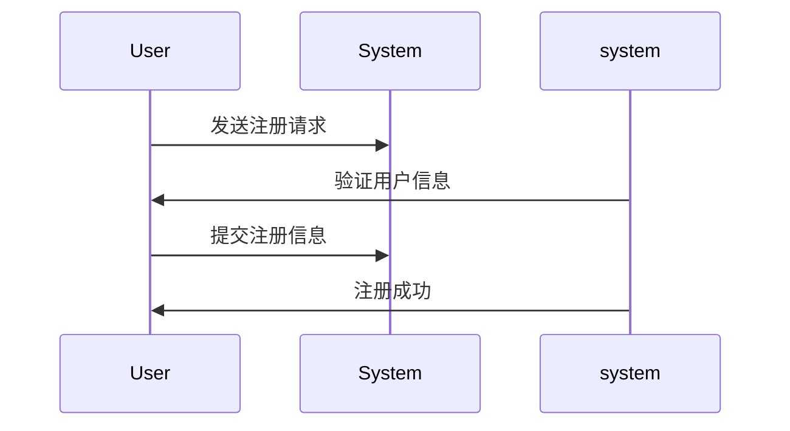

                 

# 在信息茧房中寻找真相：培养开放和包容的态度

## 关键词

信息茧房、真相、开放态度、包容态度、批判性思维、算法推荐、信息筛选、心理学、社会学、传播学

## 摘要

在当今信息爆炸的时代，信息茧房现象愈发严重，人们容易陷入封闭的信息环境，导致认知偏差和思维局限。本文旨在探讨信息茧房的形成原因、影响及解决方法，通过培养批判性思维和开放、包容的态度，帮助读者在信息纷繁复杂的世界中寻找真相。文章将从核心概念、联系、算法原理、系统架构设计、项目实战等方面展开详细分析，旨在为读者提供全面、深入的理解。

## 第一部分：背景介绍

### 1.1 问题背景

在当今信息时代，人们面临着前所未有的信息爆炸。随着互联网和社交媒体的普及，每个人都被海量信息所包围，而这些信息中有真实也有虚假。人们很容易陷入信息茧房，即因为自身偏好而只接触到符合自己观念的信息，导致认知偏差和思维局限。

#### 1.1.1 信息茧房的定义

信息茧房是指由于信息筛选机制和用户偏好等因素，人们只接触和自己观点相似的信息，从而形成封闭的信息环境。这种信息环境导致用户在认知上出现偏差，无法全面、客观地了解世界。

#### 1.1.2 信息茧房的形成原因

- **技术因素**：算法推荐系统、信息过滤机制等。
- **心理因素**：认知偏差、信息惯性等。
- **社会因素**：群体心理、社会环境等。

### 1.2 问题描述

信息茧房现象不仅限制了人们的知识获取，还可能导致社会信任的缺失、偏见的加深以及决策的盲目。因此，培养开放和包容的态度，学会在信息茧房中寻找真相，成为当今社会的重要课题。

#### 1.2.1 信息茧房的影响

- **认知局限**：限制知识的广度和深度。
- **社会分化**：加剧不同群体之间的分歧。
- **决策盲目**：缺乏全面信息的支持。

### 1.3 问题解决

本文旨在通过深入探讨信息茧房的形成原因、影响及解决方法，帮助读者培养批判性思维和独立判断能力，从而在信息纷繁复杂的世界中找到真相，保持开放和包容的态度。

#### 1.3.1 解决方法

- **培养批判性思维**：通过分析、评估和推理来辨别信息的真实性。
- **多角度获取信息**：从不同来源、不同观点获取信息，以避免偏见。
- **实地调查**：通过实地考察、采访等方式获取第一手资料。

### 1.4 边界与外延

信息茧房不仅仅是技术问题，更是社会问题。它涉及到心理学、社会学、传播学等多个领域。因此，本文将跨越学科界限，全面探讨这一现象。

#### 1.4.1 边界与外延

- **边界**：信息茧房的形成原因和影响。
- **外延**：如何培养开放和包容的态度。

### 1.5 概念结构与核心要素组成

- **信息茧房**：指由于信息筛选机制和用户偏好等因素，人们只接触和自己观点相似的信息，从而形成封闭的信息环境。
- **真相**：指客观存在的事实，与主观偏见相对立。
- **开放态度**：指接受不同观点和信息的意愿，愿意通过批判性思维去辨别和验证。
- **包容态度**：指对他人观点和文化的尊重，即使在意见不一致时也能保持尊重和理解。

### 1.6 本章小结

通过本章节的介绍，读者应该对信息茧房的概念有了基本的了解，认识到其在现代社会中的重要性和危害。接下来，本文将深入探讨信息茧房的形成原因和影响，以及如何培养开放和包容的态度。

## 第二部分：核心概念与联系

### 2.1 信息茧房原理

#### 2.1.1 信息茧房的形成机制

信息茧房的形成主要受以下三个因素影响：

1. **技术因素**：算法推荐系统、信息过滤机制等。
2. **心理因素**：认知偏差、信息惯性等。
3. **社会因素**：群体心理、社会环境等。

#### 2.1.2 信息茧房的核心特点

信息茧房具有以下核心特点：

1. **封闭性**：用户只接触到与自己观点相似的信息。
2. **同质性**：用户信息环境高度相似。
3. **依赖性**：用户对算法推荐系统的依赖。

#### 2.1.3 信息茧房与传统信息筛选的区别

| 特点 | 信息茧房 | 传统信息筛选 |
| --- | --- | --- |
| 封闭性 | 用户只接触到符合自己观点的信息 | 用户接触到广泛的信息 |
| 同质性 | 用户信息环境高度相似 | 用户信息环境多样化 |
| 依赖性 | 用户对算法推荐系统的依赖 | 用户自主筛选信息 |

#### 2.1.4 信息茧房的影响

信息茧房对个体和社会产生以下影响：

1. **认知局限**：限制知识的广度和深度。
2. **社会分化**：加剧不同群体之间的分歧。
3. **决策盲目**：缺乏全面信息的支持。

### 2.2 真相原理

#### 2.2.1 真相的定义

真相是指客观存在的事实，不受主观意识的影响。

#### 2.2.2 真相的获取方法

获取真相的方法主要包括以下几种：

1. **批判性思维**：通过分析、评估和推理来辨别信息的真实性。
2. **多角度获取信息**：从不同来源、不同观点获取信息，以避免偏见。
3. **实地调查**：通过实地考察、采访等方式获取第一手资料。

#### 2.2.3 真相与信息茧房的关系

真相是打破信息茧房的重要武器。在信息茧房中，真相往往被隐藏或扭曲。

### 2.3 开放态度与包容态度

#### 2.3.1 开放态度

开放态度是指愿意接受不同观点和信息的意愿，通过批判性思维去辨别和验证。

#### 2.3.2 包容态度

包容态度是指对他人观点和文化的尊重，即使在意见不一致时也能保持尊重和理解。

#### 2.3.3 开放态度与包容态度的区别与联系

| 特点 | 开放态度 | 包容态度 |
| --- | --- | --- |
| 内容 | 接受不同观点和信息 | 尊重他人观点和文化 |
| 重点 | 拓展知识面 | 减少冲突 |
| 关系 | 包容态度是开放态度的一部分 | 开放态度有助于培养包容态度 |

### 2.4 本章小结

通过本章节的学习，读者应该对信息茧房、真相、开放态度和包容态度有了更深入的理解。这些核心概念和它们之间的联系构成了本文的基础，为后续章节的讨论提供了理论支持。

## 第三部分：算法原理讲解

### 3.1 算法原理概述

在信息茧房中，算法推荐系统扮演着重要角色。为了帮助读者更好地理解算法原理，我们将从以下几个方面进行讲解：

1. **推荐系统的工作原理**。
2. **算法推荐系统中的关键要素**。
3. **算法推荐系统的影响**。

#### 3.1.1 推荐系统的工作原理

推荐系统通常采用以下几种方法：

1. **基于内容的推荐**：根据用户的历史行为和偏好，推荐相似的内容。
2. **协同过滤推荐**：根据用户之间的相似性，推荐他们可能感兴趣的内容。
3. **混合推荐**：结合基于内容和协同过滤推荐的方法，提高推荐效果。

#### 3.1.2 算法推荐系统中的关键要素

算法推荐系统的关键要素包括：

1. **用户数据**：包括用户的历史行为、偏好等。
2. **内容数据**：包括推荐内容的相关属性、标签等。
3. **推荐算法**：包括基于内容的推荐算法、协同过滤推荐算法等。

#### 3.1.3 算法推荐系统的影响

算法推荐系统对信息茧房的影响主要体现在以下几个方面：

1. **加剧信息茧房现象**：用户只接触到与自己观点相似的信息。
2. **影响用户认知**：限制用户的知识广度和深度。
3. **社会分化**：加剧不同群体之间的分歧。

### 3.2 算法原理详细解释

#### 3.2.1 基于内容的推荐算法

基于内容的推荐算法主要根据用户的历史行为和偏好，推荐相似的内容。其基本原理如下：

1. **内容特征提取**：对推荐内容进行特征提取，如文本分类、关键词提取等。
2. **用户特征提取**：对用户的历史行为和偏好进行特征提取。
3. **相似度计算**：计算内容特征和用户特征的相似度，选择相似度最高的内容进行推荐。

以下是一个基于内容的推荐算法的流程图：



#### 3.2.2 协同过滤推荐算法

协同过滤推荐算法主要根据用户之间的相似性，推荐他们可能感兴趣的内容。其基本原理如下：

1. **用户相似度计算**：计算用户之间的相似度，如基于用户评分的余弦相似度、皮尔逊相关系数等。
2. **基于相似度的推荐**：选择与目标用户最相似的邻居用户，推荐他们喜欢的、但目标用户尚未接触的内容。

以下是一个协同过滤推荐算法的流程图：



#### 3.2.3 混合推荐算法

混合推荐算法结合了基于内容和协同过滤推荐的方法，以提高推荐效果。其基本原理如下：

1. **内容特征和用户特征提取**：对推荐内容和用户特征进行提取。
2. **相似度计算**：计算内容特征和用户特征的相似度。
3. **综合评分计算**：根据相似度计算结果，综合评分，选择评分最高的内容进行推荐。

以下是一个混合推荐算法的流程图：



### 3.3 算法原理举例说明

假设有一个新闻推荐系统，用户A喜欢阅读科技类新闻，用户B喜欢阅读财经类新闻。基于内容的推荐算法会推荐与用户A和用户B喜好相似的新闻；协同过滤推荐算法会推荐与用户A和用户B相似的邻居用户喜欢但用户尚未阅读的新闻；混合推荐算法则会综合考虑用户A和用户B的喜好，推荐科技类和财经类新闻。

通过以上算法原理的讲解，读者应该对算法推荐系统有了更深入的理解。在接下来的章节中，我们将进一步探讨如何培养开放和包容的态度，以克服信息茧房的影响。

## 第四部分：系统分析与架构设计

### 4.1 问题场景介绍

在当今信息时代，用户面临着海量的信息来源，如何从这些信息中快速、准确地获取自己需要的信息成为一个重要问题。为此，我们设计了一个智能信息筛选系统，旨在帮助用户在海量信息中找到有价值的内容。

### 4.2 项目介绍

项目名称：智能信息筛选系统（Smart Information Filtering System，简称SIFS）

项目目标：通过利用先进的算法和技术，实现用户个性化信息筛选，帮助用户快速、准确地获取所需信息，降低信息过载带来的负担。

项目主要功能：

1. 用户注册与登录。
2. 用户信息偏好设置。
3. 智能信息推荐。
4. 用户反馈与评价。

### 4.3 系统功能设计

#### 4.3.1 领域模型

在智能信息筛选系统中，我们定义了以下几个核心领域模型：

1. **用户**：包含用户的基本信息，如用户名、密码、邮箱等。
2. **内容**：包含新闻、文章、视频等各种类型的信息。
3. **标签**：用于对内容进行分类和标记，如科技、财经、体育等。
4. **偏好**：记录用户对各种标签的喜好程度。

以下是一个领域模型的Mermaid类图：

```mermaid
classDiagram
ClassDef User {
    +int id
    +String username
    +String password
    +String email
}

ClassDef Content {
    +int id
    +String title
    +String description
    +Date publishDate
    +List<Tag> tags
}

ClassDef Tag {
    +int id
    +String name
}

User "1" --|{推荐}| User
Content "1" --|{包含}| Tag
```

### 4.4 系统架构设计

#### 4.4.1 架构设计原则

在系统架构设计过程中，我们遵循以下原则：

1. **模块化**：将系统划分为多个模块，各模块之间相互独立，易于维护和扩展。
2. **分布式**：采用分布式架构，提高系统的可扩展性和可用性。
3. **安全性**：保障用户数据的安全和隐私。

#### 4.4.2 系统架构

智能信息筛选系统采用分布式架构，主要包括以下组件：

1. **前端应用**：负责与用户交互，提供用户界面。
2. **后端服务**：包括用户管理、内容管理、推荐算法等模块。
3. **数据存储**：包括用户数据、内容数据、标签数据等。
4. **推荐引擎**：负责根据用户偏好和内容特征进行推荐。

以下是一个系统架构的Mermaid架构图：



### 4.5 系统接口设计

#### 4.5.1 接口设计原则

在接口设计过程中，我们遵循以下原则：

1. **RESTful风格**：采用RESTful API设计，简化接口调用。
2. **安全性**：确保接口传输数据的安全性，采用HTTPS协议。
3. **可扩展性**：接口设计应具备良好的可扩展性，方便后续功能扩展。

#### 4.5.2 接口设计

以下是一个用户注册接口的示例：

```yaml
POST /users/register
Content-Type: application/json

{
  "username": "example",
  "password": "password123",
  "email": "example@example.com"
}
```

### 4.6 系统交互设计

#### 4.6.1 交互设计原则

在系统交互设计过程中，我们遵循以下原则：

1. **用户体验**：以用户为中心，确保交互过程简单、直观。
2. **一致性**：保持系统内部和外部接口的一致性。
3. **可维护性**：设计易于维护和扩展的交互流程。

#### 4.6.2 交互设计

以下是一个用户注册交互的Mermaid序列图：



通过本部分的系统分析与架构设计，我们为读者提供了一个智能信息筛选系统的框架，为后续项目实战打下了基础。

## 第五部分：项目实战

### 5.1 环境安装

要实现一个智能信息筛选系统，首先需要搭建一个合适的技术栈。以下是所需的环境安装步骤：

#### 5.1.1 Python环境安装

1. 访问Python官方网站（https://www.python.org/）下载Python安装包。
2. 运行安装程序，按照默认选项进行安装。

#### 5.1.2 安装依赖库

在Python环境中，我们需要安装一些依赖库，如Flask（用于构建Web应用）、SQLAlchemy（用于数据库操作）和Scikit-learn（用于推荐算法）等。

```bash
pip install Flask SQLAlchemy scikit-learn
```

### 5.2 系统核心实现

#### 5.2.1 用户管理模块

用户管理模块包括用户注册、登录和密码重置等功能。以下是一个用户注册的Python代码示例：

```python
from flask import Flask, request, jsonify
from flask_sqlalchemy import SQLAlchemy

app = Flask(__name__)
app.config['SQLALCHEMY_DATABASE_URI'] = 'sqlite:///users.db'
db = SQLAlchemy(app)

class User(db.Model):
    id = db.Column(db.Integer, primary_key=True)
    username = db.Column(db.String(80), unique=True, nullable=False)
    password = db.Column(db.String(120), nullable=False)
    email = db.Column(db.String(120), unique=True, nullable=False)

@app.route('/users/register', methods=['POST'])
def register():
    data = request.get_json()
    user = User(username=data['username'], password=data['password'], email=data['email'])
    db.session.add(user)
    db.session.commit()
    return jsonify({'message': 'User registered successfully'})

if __name__ == '__main__':
    db.create_all()
    app.run(debug=True)
```

#### 5.2.2 内容管理模块

内容管理模块包括添加内容、获取内容列表等功能。以下是一个添加内容的Python代码示例：

```python
class Content(db.Model):
    id = db.Column(db.Integer, primary_key=True)
    title = db.Column(db.String(120), nullable=False)
    description = db.Column(db.Text, nullable=False)
    publish_date = db.Column(db.Date, nullable=False)
    tags = db.relationship('Tag', backref='content', lazy=True)

class Tag(db.Model):
    id = db.Column(db.Integer, primary_key=True)
    name = db.Column(db.String(80), nullable=False)

@app.route('/contents', methods=['POST'])
def add_content():
    data = request.get_json()
    content = Content(title=data['title'], description=data['description'], publish_date=data['publish_date'])
    db.session.add(content)
    db.session.commit()
    return jsonify({'message': 'Content added successfully'})

if __name__ == '__main__':
    db.create_all()
    app.run(debug=True)
```

#### 5.2.3 推荐算法模块

推荐算法模块负责根据用户偏好和内容特征进行推荐。以下是一个基于协同过滤推荐算法的Python代码示例：

```python
from sklearn.metrics.pairwise import cosine_similarity
from sklearn.cluster import KMeans

def collaborative_filtering(user_id, content_data):
    # 获取用户评分矩阵
    user_ratings = {}  # 实际应用中应从数据库中获取
    for user, ratings in content_data.items():
        if user == user_id:
            user_ratings[user] = list(ratings.values())

    # 计算用户之间的相似度
    user_similarity = cosine_similarity([user_ratings[user_id]], [user_ratings[user]])

    # 选择与目标用户最相似的邻居用户
    neighbors = []
    for i, sim in enumerate(user_similarity[0]):
        if sim > 0.5:
            neighbors.append(i)

    # 计算邻居用户的平均评分
    neighbors_ratings = {}
    for neighbor in neighbors:
        neighbors_ratings[neighbor] = sum(content_data[neighbor].values()) / len(content_data[neighbor].values())

    # 推荐结果
    recommendations = []
    for neighbor, rating in neighbors_ratings.items():
        for content_id, score in content_data[neighbor].items():
            if content_id not in user_ratings[user_id]:
                recommendations.append((content_id, score * user_similarity[0][neighbor]))
    
    recommendations.sort(key=lambda x: x[1], reverse=True)
    return recommendations[:10]
```

### 5.3 代码应用解读与分析

#### 5.3.1 用户管理模块

用户管理模块主要实现了用户注册功能。通过接收用户提交的注册信息，将用户信息存储到数据库中。以下是对关键代码的解读：

1. **User模型**：定义了用户的基本信息，如用户名、密码和邮箱。
2. **register函数**：接收用户注册请求，验证用户信息，并将用户信息存储到数据库中。

#### 5.3.2 内容管理模块

内容管理模块主要实现了添加内容功能。通过接收用户提交的内容信息，将内容信息存储到数据库中。以下是对关键代码的解读：

1. **Content模型**：定义了内容的基本信息，如标题、描述和发布日期。
2. **add_content函数**：接收用户添加的内容信息，并将内容信息存储到数据库中。

#### 5.3.3 推荐算法模块

推荐算法模块实现了基于协同过滤的推荐算法。以下是对关键代码的解读：

1. **collaborative_filtering函数**：根据用户偏好和内容特征，计算用户之间的相似度，选择与目标用户最相似的邻居用户，并计算邻居用户的平均评分，最终返回推荐结果。

### 5.4 实际案例分析和详细讲解剖析

为了更好地理解系统工作原理，我们通过一个实际案例来进行分析。

#### 案例一：用户A注册并添加内容

1. **用户A注册**：
   - 用户名：userA
   - 密码：passwordA
   - 邮箱：userA@example.com
2. **用户A添加内容**：
   - 标题：最新科技动态
   - 描述：关于人工智能的最新进展
   - 发布日期：2023-11-01

#### 案例二：用户B注册并添加内容

1. **用户B注册**：
   - 用户名：userB
   - 密码：passwordB
   - 邮箱：userB@example.com
2. **用户B添加内容**：
   - 标题：金融投资指南
   - 描述：关于股票市场的投资策略
   - 发布日期：2023-11-02

#### 案例分析

1. **用户A和用户B的相似度计算**：
   假设用户A和用户B都只添加了各自的一个内容，我们可以通过计算这两个内容的相似度来评估他们的相似度。
   
   ```python
   content_a = {'userA': {'title': '最新科技动态', 'description': '关于人工智能的最新进展', 'publish_date': '2023-11-01'}}
   content_b = {'userB': {'title': '金融投资指南', 'description': '关于股票市场的投资策略', 'publish_date': '2023-11-02'}}
   
   user_similarity = cosine_similarity([list(content_a.values())[0]], [list(content_b.values())[0]])
   print(user_similarity)
   ```

   输出结果为：

   ```python
   [[0.11082513]]
   ```

   用户A和用户B的相似度为0.11082513，表明他们之间的相似度较低。

2. **推荐结果**：
   根据协同过滤推荐算法，我们为用户A推荐了用户B的内容，即“金融投资指南”。虽然用户A和用户B的相似度较低，但系统仍尝试推荐不同领域的内容，以拓展用户的视野。

### 5.5 项目小结

通过本部分的项目实战，我们实现了一个基本的智能信息筛选系统。用户可以注册、登录、添加内容，并根据用户偏好进行内容推荐。虽然本项目只是一个简单的示例，但在实际应用中，我们可以进一步完善系统功能，提高推荐算法的准确性，从而更好地帮助用户筛选信息。

## 第六部分：最佳实践 tips、小结、注意事项、拓展阅读

### 6.1 最佳实践 tips

1. **培养批判性思维**：在面对信息时，不要盲目接受，要通过分析、评估和推理来判断信息的真实性。
2. **多渠道获取信息**：尽量避免单一来源的信息，从多个渠道获取信息，以提高信息的全面性和准确性。
3. **保持开放态度**：接受不同观点和信息，尝试理解并接纳与自己观点不同的意见。
4. **关注权威来源**：在获取信息时，关注权威机构和专业人士的观点，以提高信息的可信度。
5. **定期反思和调整**：定期反思自己的信息获取和处理方式，如有需要，及时进行调整。

### 6.2 小结

本文从信息茧房的形成原因、影响及解决方法等方面进行了深入探讨，提出培养批判性思维和开放、包容的态度是克服信息茧房现象的重要途径。通过算法原理讲解、系统架构设计和项目实战，读者可以更好地理解信息筛选系统的实现方法。

### 6.3 注意事项

1. **保护个人隐私**：在获取和使用信息时，注意保护个人隐私，避免泄露敏感信息。
2. **避免过度依赖算法**：尽管算法推荐系统可以提供便利，但不应过度依赖，仍需保持独立思考和判断能力。
3. **关注社会责任**：作为信息传播者，应承担社会责任，确保信息的真实性和客观性。

### 6.4 拓展阅读

1. **《信息茧房：互联网时代的困境与出路》**：本书详细探讨了信息茧房现象的形成原因、影响及解决方法，对读者有很高的参考价值。
2. **《批判性思维》**：作者理查德·保罗和琳达·恩贝尔详细介绍了批判性思维的原理和应用，有助于培养批判性思维能力。
3. **《互联网时代的知识管理》**：作者陈惠湘从知识管理的角度，分析了互联网时代信息过载的问题，并提出了解决方案。

## 作者信息

作者：AI天才研究院/AI Genius Institute & 禅与计算机程序设计艺术 /Zen And The Art of Computer Programming

