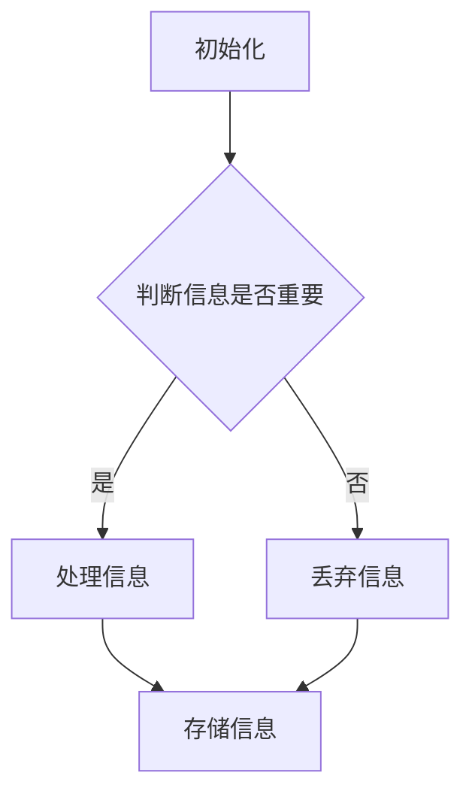

                 

# 在信息过载时代培养独立思考能力

## 关键词
- 信息过载
- 独立思考能力
- 批判性思维
- 创造性思维
- 情绪管理
- 信息筛选

## 摘要
在当今信息爆炸的时代，个体面临着前所未有的信息过载挑战。海量信息的涌入不仅影响了我们的日常决策，更对独立思考能力提出了严峻考验。本文将深入探讨信息过载的背景与影响，详细分析独立思考能力的核心概念与作用，并提供系统性的培养方法，包括提高信息处理能力、培养批判性思维和创造性思维，以及情绪管理等方面的实践指导。通过案例分析与实践，我们将找到在信息过载中保持独立思考的有效策略，为个体在复杂信息环境中提供清晰的思维路径。

## 目录大纲

----------------------------------------------------------------

### 第一部分: 信息过载时代的背景与挑战

#### 第1章: 信息过载时代的背景

##### 1.1 信息爆炸与过载现象
##### 1.2 信息过载对个体思考能力的影响
##### 1.3 信息筛选的重要性

#### 第2章: 独立思考能力的重要性

##### 2.1 独立思考能力概述
##### 2.2 独立思考能力的作用
##### 2.3 培养独立思考能力的必要性

----------------------------------------------------------------

### 第二部分: 独立思考能力的培养方法

#### 第3章: 提高信息处理能力的策略

##### 3.1 有效信息筛选方法
##### 3.2 信息整理与归类
##### 3.3 信息批判性思维

#### 第4章: 培养批判性思维的方法

##### 4.1 批判性思维概述
##### 4.2 提问技巧
##### 4.3 证据评估与逻辑分析

#### 第5章: 培养创造性思维

##### 5.1 创造性思维概述
##### 5.2 思维模式拓展
##### 5.3 创造性思维的实践

#### 第6章: 情绪管理与独立思考

##### 6.1 情绪对思考能力的影响
##### 6.2 情绪管理与自我调节
##### 6.3 情绪管理与独立思考的融合

----------------------------------------------------------------

### 第三部分: 案例分析与实践指导

#### 第7章: 真实案例解析

##### 7.1 案例一：如何在信息过载中保持独立思考
##### 7.2 案例二：批判性思维在现实生活中的应用
##### 7.3 案例三：创造性思维在创新项目中的应用

#### 第8章: 实践指导与技巧

##### 8.1 培养独立思考能力的日常实践
##### 8.2 独立思考能力的自我评估
##### 8.3 独立思考能力的持续提升

#### 第9章: 总结与展望

##### 9.1 独立思考能力的重要性回顾
##### 9.2 培养独立思考能力的意义
##### 9.3 对未来的展望与挑战

----------------------------------------------------------------

## 核心概念与联系

### 信息过载
#### 定义
信息过载是指在信息爆炸的时代，个体难以有效处理和利用海量信息的现象。
#### 特点
- 信息量大
- 来源多样
- 更新迅速
#### 关联
信息过载会削弱个体的思考深度和批判性。

### 独立思考能力
#### 定义
独立思考能力是指个体在面对信息时，能够自主判断、分析、综合，形成自己观点的能力。
#### 特点
- 客观性
- 批判性
- 创造性
#### 关联
独立思考能力是应对信息过载的重要手段，有助于个体在复杂信息中保持清晰的思维。

### 批判性思维
#### 定义
批判性思维是一种对信息进行深入分析、评估和批判的思维方式。
#### 特点
- 质疑性
- 逻辑性
- 独立性
#### 关联
批判性思维是培养独立思考能力的关键，有助于个体从信息中挖掘出真相。

### 创造性思维
#### 定义
创造性思维是一种产生新想法、新方法和新解决方案的思维方式。
#### 特点
- 开放性
- 灵活性
- 创新性
#### 关联
创造性思维能够激发个体的创新能力，帮助其在信息过载中找到新的应对策略。

## 算法原理讲解

### 信息筛选算法

#### Mermaid 流程图


#### Python 源代码
```python
def filter_information(information, importance_threshold):
    processed_info = []
    for info in information:
        if is_important(info, importance_threshold):
            processed_info.append(info)
    return processed_info
```

#### 算法原理
信息筛选算法的核心目标是减少信息过载，通过设定重要性阈值，筛选出对个体最有价值的部分信息。算法采用了一种简单的条件判断流程，通过判断信息的价值，决定是否进行进一步处理或丢弃。该算法通过数学模型和流程图的方式，清晰地展示了其工作原理和步骤。

#### 数学模型
设 \( I \) 为信息集合，\( T \) 为重要性阈值，\( P \) 为经过筛选后的信息集合。

筛选公式：
\[ P = \{i \in I | i \geq T \} \]

#### 举例说明
假设我们有以下信息列表：
\[ I = [\{信息1, 信息2, 信息3, 信息4, 信息5\}] \]
设定重要性阈值 \( T = 3 \)，则筛选后的信息集合 \( P \) 为：
\[ P = [\{信息3, 信息4, 信息5\}] \]

通过这一算法，我们可以有效地过滤掉不重要的信息，将注意力集中在重要的信息上，从而提高信息处理的效率和思考的深度。

## 第一部分: 信息过载时代的背景与挑战

### 第1章: 信息过载时代的背景

#### 1.1 信息爆炸与过载现象

在数字化的浪潮中，信息的生成和传播速度远超以往。根据国际数据公司（IDC）的统计数据，截至2021年，全球产生的数据量已经达到44ZB（Zettabytes），并且预计这个数字将以每年23%的速度增长。这种信息爆炸的现象给人们带来了前所未有的便利，同时也带来了巨大的挑战。信息过载，即个体在处理信息时感受到的压力和困难，成为了现代社会中的一个显著问题。

信息过载的现象主要表现在以下几个方面：

1. **信息量大**：互联网、社交媒体、移动设备等工具使得信息的传播变得更加迅速和广泛，每个人每天都会接收到大量的信息。
2. **来源多样**：信息的来源多样化，包括新闻、社交媒体、电子邮件、广告、推送通知等，人们需要在众多的信息源中筛选和判断哪些信息对自己重要。
3. **更新迅速**：信息更新的速度非常快，许多信息在短时间内就可能变得过时或不相关。

这些特点共同导致了信息过载现象，使得个体在处理信息时面临以下问题：

- **注意力分散**：个体需要在海量的信息中分配注意力，导致注意力分散，难以集中处理重要信息。
- **时间压力**：处理大量信息需要时间，而人们往往没有足够的时间去仔细阅读和分析每一条信息。
- **决策困难**：在信息过载的情况下，个体难以做出基于充分信息的决策，容易受到误导或做出错误的决策。

#### 1.2 信息过载对个体思考能力的影响

信息过载对个体的思考能力产生了深远的影响，主要体现在以下几个方面：

1. **思考深度受限**：信息过载使得个体难以深入思考问题，因为大量的信息干扰了思考的连贯性。
2. **批判性思维减弱**：在处理海量信息时，个体容易受到信息的支配，而不是对信息进行批判性分析。
3. **创造性思维受限**：信息过载使得个体在创新思维方面受限，因为大脑需要在处理大量已有信息的同时寻找新的思路。
4. **情绪波动**：信息过载还会引起个体的情绪波动，例如焦虑、压力和疲劳等，这些情绪会进一步影响思考能力。

#### 1.3 信息筛选的重要性

在信息过载的时代，如何有效地筛选信息成为了保持独立思考能力的关键。有效的信息筛选可以帮助个体：

1. **聚焦关键信息**：通过筛选，个体可以集中精力处理那些最重要、最相关的信息，从而提高决策质量和效率。
2. **减少认知负担**：减少不必要的信息干扰，降低大脑的认知负担，有利于保持清晰的思考。
3. **提升批判性思维**：筛选出的信息更加精炼，有助于个体进行深入的批判性分析。
4. **增强创造性思维**：专注于重要信息，为个体提供了更多的时间和空间进行创新性思考。

有效的信息筛选需要以下几个策略：

- **设定重要性阈值**：根据个人的需求，设定信息的重要性的标准，筛选出符合标准的信息。
- **利用技术工具**：使用搜索引擎、新闻订阅服务、过滤工具等辅助筛选信息。
- **培养信息素养**：提高识别信息真伪和价值的能力，增强筛选的准确性和有效性。

通过有效的信息筛选策略，个体可以在信息过载的环境中保持清晰的思考，为独立思考能力的培养提供坚实的基础。

### 第2章: 独立思考能力的重要性

#### 2.1 独立思考能力概述

独立思考能力是指个体在面对信息时，能够自主判断、分析、综合，形成自己观点的能力。它不仅是一种认知能力，更是一种心理品质，涉及到个体在面对复杂信息和挑战时的自主性和创造性。

独立思考能力的核心特征包括：

- **客观性**：独立思考能力能够基于事实和数据，避免受主观情感和偏见的影响。
- **批判性**：独立思考能力对信息进行批判性分析，不轻易接受表面信息，而是深入挖掘背后的逻辑和真相。
- **创造性**：独立思考能力能够产生新的想法和解决方案，不拘泥于传统的思维模式。

#### 2.2 独立思考能力的作用

独立思考能力在个体的生活和学习中发挥着重要作用：

1. **提高决策质量**：独立思考能力使个体能够基于充分的信息和分析做出更明智的决策，减少错误和失误。
2. **增强问题解决能力**：独立思考能力帮助个体在面对复杂问题时，能够从不同角度分析和寻找解决方案。
3. **提升创新能力**：独立思考能力激发个体的创造力，使其能够产生新颖的观点和创新的思路。
4. **培养批判性思维**：独立思考能力是批判性思维的基础，通过培养独立思考能力，个体能够更有效地评估和批判信息。

#### 2.3 培养独立思考能力的必要性

在信息过载的时代，培养独立思考能力显得尤为重要：

1. **应对信息泛滥**：独立思考能力使个体能够从海量信息中筛选出真正有价值的信息，避免被无效信息干扰。
2. **提高适应能力**：独立思考能力使个体能够灵活应对不断变化的环境和挑战，适应复杂多变的社会。
3. **增强竞争力**：在竞争激烈的社会中，独立思考能力是个人能力和素质的重要体现，有助于提升个体的竞争力。
4. **促进全面发展**：独立思考能力不仅有助于个体的职业发展，还能促进其个人成长和全面发展。

培养独立思考能力需要从多个方面入手，包括提高信息处理能力、培养批判性思维、激发创造性思维等。通过系统的培养和实践，个体可以在信息过载的时代中保持清晰的思维，发挥独立思考能力的重要作用。

### 提高信息处理能力的策略

在信息过载的时代，提高信息处理能力是培养独立思考能力的关键步骤。有效的信息处理不仅能减少认知负担，还能帮助个体更高效地筛选和分析信息，从而提升思考深度和质量。以下是一些具体策略：

#### 3.1 有效信息筛选方法

1. **设定重要性阈值**：根据个人需求和目标，设定信息的重要性的标准。例如，对于工作相关的信息，可以设定与工作目标直接相关的信息为高优先级。
2. **使用技术工具**：利用各种技术工具，如搜索引擎的高级搜索功能、新闻订阅服务、信息过滤工具等，可以自动化筛选出符合设定标准的、有价值的信息。
3. **培养信息素养**：提高识别信息真伪和价值的能力，增强筛选的准确性和有效性。例如，学会评估信息来源的可靠性和信息内容的专业性。

#### 3.2 信息整理与归类

1. **分类存储**：将收集到的信息按照主题、类型、来源等标准进行分类存储，便于后续查找和使用。例如，可以使用笔记软件、云存储服务或知识管理工具进行分类。
2. **标签管理**：为信息添加标签，便于根据标签快速查找和检索。标签可以是关键词、主题、项目名称等，有助于提高信息的可检索性。
3. **定期整理**：定期对信息进行整理和归档，避免信息的堆积和混淆。例如，每周或每月进行一次信息整理，删除无用的信息，更新和补充有价值的信息。

#### 3.3 信息批判性思维

1. **质疑性分析**：对待接收到的信息，首先要进行质疑性分析，不轻易接受表面信息。例如，问自己：这个信息的来源是什么？信息是否经过验证？信息背后的逻辑是否合理？
2. **交叉验证**：对于重要的信息，通过多个来源进行交叉验证，确保信息的准确性和可靠性。例如，查阅不同的新闻报道、学术研究或专家意见，以获得全面的视角。
3. **逻辑性判断**：对信息进行逻辑性判断，分析信息的内在逻辑和论据是否一致，是否存在逻辑谬误。例如，使用逻辑图或思维导图工具帮助分析信息的逻辑结构。

#### 案例分析

**案例一：职场信息处理**

李明是一位职场新人，每天都会接收到大量的工作邮件和通知。为了提高信息处理能力，他采取了以下策略：

1. **设定重要性阈值**：将工作邮件分为“紧急且重要”、“紧急但不重要”、“不紧急但重要”和“不紧急且不重要”四个类别，重点处理紧急且重要的邮件。
2. **使用邮件过滤器**：利用邮件客户端的过滤器功能，自动筛选和分类邮件，将重要的邮件标记为“高优先级”。
3. **定期整理**：每周对收件箱进行一次彻底整理，删除无用的邮件，更新和补充重要的邮件。

通过这些策略，李明有效地提高了信息处理效率，减少了邮件堆积带来的压力，从而有更多时间和精力专注于重要任务。

**案例二：学习资料管理**

张华是一名大学生，为了准备考试，他需要处理大量的学习资料。他采取了以下策略：

1. **分类存储**：将学习资料分为“核心重点”、“补充资料”、“历年真题”等类别，并在云存储服务中建立文件夹进行分类存储。
2. **标签管理**：为每个文件添加标签，如“数学”、“物理”、“英语”等，便于快速查找和复习。
3. **定期整理**：每月对学习资料进行一次整理，删除过时的资料，补充最新的学习资源。

通过这些策略，张华有效地提高了学习效率，确保自己始终掌握最重要的学习资料。

通过上述案例分析，我们可以看到，提高信息处理能力不仅需要策略，更需要实践和坚持。只有通过不断地练习和调整，才能在信息过载的环境中保持高效的思考和行动。

### 培养批判性思维的方法

批判性思维是独立思考能力的重要组成部分，它使个体能够对信息进行深入分析、评估和批判，从而在复杂的信息环境中做出合理的决策。以下是培养批判性思维的几种方法：

#### 4.1 批判性思维概述

批判性思维是一种积极的思考方式，它不仅仅是质疑信息，而是通过逻辑分析和评估，对信息进行全面的思考和判断。批判性思维的特点包括：

- **质疑性**：对待信息持怀疑态度，不断提问，寻找信息背后的逻辑和动机。
- **逻辑性**：遵循逻辑规则，确保思考过程的一致性和连贯性。
- **独立性**：不依赖他人的观点，基于自己的分析做出判断。

批判性思维不仅有助于识别信息的真伪，还能提升决策的质量和创新能力。

#### 4.2 提问技巧

提问是批判性思维的重要工具，以下是一些有效的提问技巧：

1. **“5W1H”提问法**：针对信息的内容，使用“谁（Who）、什么（What）、哪里（Where）、当何时（When）、为什么（Why）、怎么做（How）”这六个基本问题，全面了解信息的背景、目的和细节。
2. **“如果...会怎样？”提问法**：通过假设不同的情境，分析信息在不同情况下的影响和后果，从而更全面地评估信息的价值。
3. **“为什么会这样？”提问法**：对于信息中的现象或结论，深入探讨其背后的原因和逻辑，避免表面化的理解。

通过提问，个体能够更深入地思考问题，挖掘信息的深层含义。

#### 4.3 证据评估与逻辑分析

批判性思维不仅要求提出问题，还要求对证据进行评估和逻辑分析，以下是几个关键步骤：

1. **收集证据**：获取与信息相关的所有证据，包括事实、数据、案例等，确保评估有充分的依据。
2. **评估证据**：对收集到的证据进行评估，判断其可靠性、相关性和重要性。例如，检查证据的来源是否可靠，数据是否准确，案例是否具有代表性。
3. **逻辑分析**：运用逻辑规则，对证据进行逻辑分析，确保结论的一致性和合理性。例如，检查论据是否支持结论，是否存在逻辑谬误。

通过证据评估和逻辑分析，个体能够更准确地评估信息的真实性和价值，避免被误导。

#### 实践案例

**案例一：分析新闻报导**

假设某新闻报道了一则关于某公司财务舞弊的新闻。为了批判性地分析这则新闻，可以采取以下步骤：

1. **提问**：谁是新闻的来源？新闻是否经过了核实？报道中提到的财务舞弊是否有具体的证据？
2. **收集证据**：查阅其他媒体报道、监管机构的调查报告、公司的财务报表等，获取更多相关信息。
3. **评估证据**：评估证据的可靠性，判断新闻的准确性。
4. **逻辑分析**：分析新闻报道中的逻辑结构，判断是否存在逻辑谬误。

通过这样的批判性分析，个体可以更全面地了解新闻事件的真相，避免被片面或误导的信息所影响。

**案例二：评估投资项目**

在评估一个投资项目时，可以采取以下批判性思维步骤：

1. **提问**：项目的投资目标是什么？项目的预期回报如何？项目的风险有哪些？
2. **收集证据**：查阅项目的商业计划书、财务分析报告、市场调研报告等，获取相关信息。
3. **评估证据**：评估商业计划的可行性、市场前景和财务分析的准确性。
4. **逻辑分析**：分析项目的盈利模式、风险控制和投资回报的逻辑性。

通过这样的批判性分析，投资者可以更理性地做出投资决策，避免盲目跟风或错误的投资。

通过上述方法，个体可以有效地培养批判性思维，提高信息处理能力和独立思考能力，从而在信息过载的时代中保持清晰的思维和合理的决策。

### 培养创造性思维

创造性思维是独立思考能力的重要组成部分，它使个体能够在面对复杂问题时提出新颖的解决方案。在信息过载的时代，培养创造性思维尤为重要，它不仅有助于个体在信息泛滥中找到新的应对策略，还能激发创新和突破。以下是培养创造性思维的几个方法：

#### 5.1 创造性思维概述

创造性思维是一种产生新想法、新方法和新解决方案的思维方式。它不同于传统的逻辑思维，更注重思维的开放性、灵活性和创新性。创造性思维的特点包括：

- **开放性**：不受传统思维模式的限制，敢于尝试新的想法和角度。
- **灵活性**：能够在不同情境下灵活运用不同的思维策略。
- **创新性**：能够产生独特的、有价值的想法和解决方案。

#### 5.2 思维模式拓展

拓展思维模式是培养创造性思维的关键步骤。以下是一些有效的思维模式拓展方法：

1. **多角度思考**：从多个不同的角度审视问题，避免单一思维定势。例如，在解决一个产品设计问题时，可以同时考虑用户需求、技术可行性和市场趋势。
2. **思维导图**：使用思维导图工具，将思维过程可视化，有助于发现新的联系和灵感。例如，绘制思维导图时，可以从中心问题出发，逐步展开到不同的子问题和解决方案。
3. **头脑风暴**：通过集体头脑风暴，集思广益，激发创意的产生。例如，在团队项目中，可以定期举行头脑风暴会议，鼓励成员提出各种可能的解决方案。

#### 5.3 创造性思维的实践

1. **原型设计**：通过快速原型设计，将创意转化为具体可操作的形式。例如，在开发一个新功能时，可以先制作一个低保真的原型，通过用户反馈进一步优化。
2. **跨界合作**：与其他领域或行业的专家合作，借助不同的视角和经验，激发创新思维。例如，设计师可以与工程师、市场营销专家合作，共同开发新产品。
3. **持续学习**：不断学习新知识、新技能，保持思维的活跃性和开放性。例如，通过参加培训课程、阅读相关书籍和论文，更新自己的知识库。

#### 案例分析

**案例一：新产品开发**

某公司希望开发一款新型智能家居设备。为了培养创造性思维，他们采取了以下步骤：

1. **多角度思考**：从用户需求、技术可行性和市场趋势等多个角度审视产品概念，确保创意的可行性。
2. **思维导图**：使用思维导图工具，列出与智能家居相关的各种功能、技术和应用场景，从而发现新的创意。
3. **头脑风暴**：组织团队头脑风暴会议，鼓励成员提出各种可能的创意和解决方案。

通过这些方法，团队最终开发出了一系列具有创新性的智能家居产品，受到了市场的欢迎。

**案例二：解决教育问题**

某教育机构希望解决学生缺乏学习动力的问题。为了培养创造性思维，他们采取了以下步骤：

1. **原型设计**：设计了一个互动式的在线学习平台，通过游戏化元素和个性化学习路径，提高学生的学习兴趣。
2. **跨界合作**：与游戏开发公司合作，引入游戏设计理念，使学习过程更具趣味性和挑战性。
3. **持续学习**：定期组织教师培训，学习新的教学方法和工具，以保持教学创新。

通过这些实践，该教育机构显著提升了学生的学习动力和成绩。

通过上述方法，个体可以在信息过载的时代中培养出创造性思维，从而在解决问题和创造新价值的过程中脱颖而出。

### 情绪管理与独立思考

情绪管理与独立思考能力的培养息息相关。在信息过载的时代，情绪波动如焦虑、压力和疲劳常常影响我们的思考质量。有效的情绪管理不仅有助于我们保持清晰的思维，还能提升独立思考能力。以下将探讨情绪对思考能力的影响、情绪管理的策略以及如何将情绪管理融入独立思考的过程中。

#### 6.1 情绪对思考能力的影响

情绪对思考能力有着显著的影响，具体表现为：

1. **注意力分散**：当个体处于焦虑或紧张的情绪状态时，注意力容易分散，难以集中处理重要信息。例如，当一个人担心工作表现时，可能会分心于其他无关的事物，从而降低工作效率。

2. **批判性思维减弱**：情绪波动会影响个体对信息的批判性分析能力。在愤怒或沮丧的情绪下，个体可能更容易接受表面的信息，而不进行深入的分析和评估。

3. **创造性思维受限**：情绪不稳定会限制个体的创造性思维。在情绪低落或压力过大的情况下，个体可能难以产生新颖的想法或解决方案。

4. **决策困难**：情绪影响个体的决策过程。在情绪化的状态下，个体可能做出冲动或短视的决策，而不是基于充分分析和评估的理性决策。

#### 6.2 情绪管理的策略

有效的情绪管理策略可以帮助个体控制情绪，从而提升思考能力。以下是一些具体策略：

1. **认知行为疗法**：通过认知行为疗法，个体可以识别和改变负面思维模式。例如，当感到焦虑时，可以通过认知重构技术来重新评估引起焦虑的情况，并找到更合理的应对方式。

2. **正念冥想**：正念冥想是一种通过专注当下、观察呼吸和身体感觉来缓解压力和焦虑的方法。通过定期练习正念冥想，个体可以培养情绪调节的能力，提高注意力集中力。

3. **运动锻炼**：适量的运动可以帮助释放压力，提升情绪。例如，跑步、瑜伽或其他有氧运动可以促进内啡肽的分泌，产生愉悦感，缓解焦虑和抑郁。

4. **时间管理**：合理的时间管理可以帮助个体减少压力和焦虑。例如，通过设定明确的时间目标和优先级，避免因时间紧迫而导致的情绪波动。

5. **社交支持**：与家人、朋友或同事分享情绪，寻求支持和理解，有助于缓解压力和情绪波动。社交支持不仅能提供情感上的安慰，还能提供解决问题的建议和视角。

#### 6.3 情绪管理与独立思考的融合

将情绪管理融入独立思考的过程中，可以帮助个体在情绪波动时保持清晰的思维，以下是几个建议：

1. **情绪检测**：在开始独立思考前，先检测自己的情绪状态。例如，可以通过深呼吸或自我反思来评估自己的情绪水平，确保处于较为平静的状态。

2. **情绪调节**：如果发现自己处于情绪波动的状态，可以采取一些情绪调节策略，如正念冥想、深呼吸或短暂的运动，以缓解情绪。

3. **情绪记录**：记录情绪波动的情况和原因，有助于个体识别触发情绪的常见情境和因素。通过记录和反思，可以更好地应对和处理情绪问题。

4. **情绪视角**：在面对复杂问题和挑战时，尝试从不同的情绪视角思考。例如，在紧张的情况下，可以尝试换一种更积极的思维方式，从而提升思考的灵活性和创造性。

5. **情绪隔离**：在需要集中精力独立思考时，可以尝试隔离情绪干扰。例如，通过设定专注时段、关闭社交媒体或通知，避免情绪波动对思考过程的影响。

通过情绪管理与独立思考的融合，个体可以在信息过载的环境中保持清晰的思维，提升独立思考的能力，从而更好地应对复杂的问题和挑战。

### 第三部分: 案例分析与实践指导

#### 第7章: 真实案例解析

在信息过载的时代，保持独立思考不仅是一种能力，更是一种挑战。以下将分析三个真实案例，探讨在信息过载中如何保持独立思考，批判性思维在现实生活中的应用，以及创造性思维在创新项目中的应用。

#### 7.1 案例一：如何在信息过载中保持独立思考

**背景**：李华是一名数据分析师，每天都要处理大量的数据报告和市场分析信息。随着公司业务的发展，信息的来源和数量日益增加，导致李华感到压力巨大，难以保持独立思考。

**问题**：如何从海量的信息中筛选出有价值的内容，并保持清晰的思考过程？

**解决方案**：

1. **设定目标**：李华首先明确了自己的分析目标，即找出对公司决策最有影响力的市场趋势。这样，他在处理信息时有了明确的方向。

2. **信息筛选**：李华使用了信息筛选算法，设定了重要性阈值，自动过滤掉不相关的信息。具体算法如下：
   ```python
   def filter_information(information, importance_threshold):
       processed_info = []
       for info in information:
           if is_important(info, importance_threshold):
               processed_info.append(info)
       return processed_info
   ```

3. **批判性分析**：对筛选出的信息，李华运用批判性思维进行分析。他通过提问技巧，如“5W1H”法，质疑信息的来源和准确性，确保信息的可靠性。

4. **定期整理**：李华每周对信息进行一次整理和归档，删除无用的信息，更新和补充最新的报告。

**效果**：通过这些策略，李华能够更高效地处理海量信息，减少了因信息过载带来的压力，保持了独立思考的能力，最终提升了数据分析的准确性和决策质量。

#### 7.2 案例二：批判性思维在现实生活中的应用

**背景**：王明是一位创业者，经常需要参加各种商业会议和研讨会。然而，他发现自己容易被他人的观点和意见所影响，难以保持独立的决策。

**问题**：如何在各种观点和意见中保持独立思考，做出合理的商业决策？

**解决方案**：

1. **提问技巧**：王明学会了使用“如果...会怎样？”提问法，帮助自己从不同角度审视问题和解决方案。例如，他会在会议上提问：“如果我们采纳这个策略，可能会遇到哪些挑战？”

2. **证据评估**：王明重视证据评估，他会查阅相关的市场研究报告、财务分析数据等，确保决策有充分的依据。

3. **逻辑分析**：在分析问题或方案时，王明注重逻辑分析，确保论据和结论之间的一致性和合理性。例如，他会绘制逻辑图，检查是否存在逻辑谬误。

**效果**：通过批判性思维的应用，王明能够在会议中保持独立思考，避免被他人的观点所左右，从而做出了更合理和明智的商业决策。

#### 7.3 案例三：创造性思维在创新项目中的应用

**背景**：张丽是一家科技公司的产品经理，负责开发一款智能家居设备。为了在竞争激烈的市场中脱颖而出，她需要运用创造性思维，提出新颖的产品解决方案。

**问题**：如何在创新项目中激发创造性思维，设计出具有市场竞争力的产品？

**解决方案**：

1. **跨界合作**：张丽与设计师、工程师和市场专家进行了跨界合作，借助不同领域的经验和视角，激发创新思维。

2. **头脑风暴**：张丽组织了多次头脑风暴会议，鼓励团队成员提出各种创意和想法。例如，他们讨论了如何在智能家居设备中融入个性化服务和互动体验。

3. **原型设计**：张丽通过快速原型设计，将创意转化为具体的产品方案。她使用低保真的原型进行用户测试，收集反馈，不断优化设计。

**效果**：通过创造性思维的运用，张丽团队开发出了一款具有创新性的智能家居设备，产品一经上市，就获得了市场的高度认可，为公司带来了显著的商业成功。

通过这三个案例，我们可以看到，在信息过载的时代，保持独立思考、批判性思维和创造性思维都是至关重要的。通过有效的信息筛选、批判性分析和创造性实践，个体可以在复杂的信息环境中保持清晰的思维，做出合理的决策，实现创新和突破。

### 第8章: 实践指导与技巧

在信息过载的时代，培养独立思考能力不仅需要理论上的理解，更需要实际的日常实践和技巧。以下将提供一些具体的日常实践指导，帮助读者培养和提升独立思考能力。

#### 8.1 培养独立思考能力的日常实践

1. **定期自我反思**：每天或每周花时间反思自己的思考过程和决策，问自己：“我是如何得出这个结论的？这个结论是否合理？”通过自我反思，可以逐步培养批判性思维。

2. **多读书、多思考**：阅读是培养独立思考能力的重要途径。选择不同类型的书籍，包括小说、历史、哲学等，可以拓宽思维，增加知识储备。在阅读过程中，尝试提出问题，分析作者的观点和论证过程。

3. **日常生活中的思考**：在日常生活中，对遇到的问题和现象进行深入思考。例如，在购物时，思考为什么某种商品价格便宜或昂贵，其背后的原因是什么？通过日常生活中的思考，可以培养分析问题的能力。

4. **写作练习**：写作是表达思考的重要方式。通过写作，可以清晰地整理自己的思路，并锻炼逻辑思维。可以尝试写日记、博客或参与讨论论坛，与其他人分享自己的观点。

#### 8.2 独立思考能力的自我评估

为了了解自己的独立思考能力，可以采取以下自我评估方法：

1. **日记评估**：每天记录自己的思考过程和决策，并反思这些决策的合理性和效果。通过日记，可以逐渐了解自己在哪些方面有优势，哪些方面需要改进。

2. **他人反馈**：寻求家人、朋友或同事对自己的思考和决策进行反馈。通过他人的视角，可以发现自己可能忽视的问题，从而进一步提升独立思考能力。

3. **在线测试**：可以使用一些在线思维测试工具，如批判性思维测试、逻辑推理测试等，了解自己的思维能力和弱点。

#### 8.3 独立思考能力的持续提升

独立思考能力不是一蹴而就的，需要通过持续的努力和实践来不断提升。以下是一些建议：

1. **持续学习**：不断学习新的知识和技能，扩展自己的知识面和思维深度。可以通过参加培训课程、在线学习平台或自学，保持学习的热情。

2. **实践应用**：将学到的知识和思维方法应用到实际工作和生活中。例如，在项目中运用批判性思维方法，分析问题和解决方案，提升实际操作能力。

3. **培养好奇心**：保持好奇心，对未知的事物和领域保持探索的兴趣。好奇心是激发创造性思维的重要动力。

4. **定期回顾**：定期回顾自己的思考和决策过程，总结经验教训，不断完善和优化自己的思维方法。

通过日常实践、自我评估和持续学习，个体可以逐步提升独立思考能力，在信息过载的时代中保持清晰的思维，做出合理的决策，实现个人和职业的发展。

### 第9章: 总结与展望

#### 9.1 独立思考能力的重要性回顾

在信息过载的时代，独立思考能力显得尤为重要。它不仅帮助我们筛选和处理海量信息，还能提升我们的批判性思维和创造性思维，使我们能够在复杂的环境中做出合理的决策。以下是独立思考能力的一些关键点：

- **筛选信息**：通过设定重要性阈值，使用技术工具和批判性思维，个体能够有效筛选出有价值的信息。
- **批判性思维**：运用质疑性分析和逻辑性判断，个体能够深入挖掘信息的真相和逻辑，避免被误导。
- **创造性思维**：通过多角度思考和原型设计，个体能够提出新颖的解决方案，推动创新和进步。

#### 9.2 培养独立思考能力的意义

培养独立思考能力具有深远的意义：

1. **提高决策质量**：通过独立思考，个体能够基于充分的信息和分析做出更明智的决策，减少错误和失误。
2. **增强适应能力**：独立思考能力使个体能够灵活应对变化，适应复杂多变的社会环境。
3. **提升创新能力**：独立思考能力激发个体的创造力，使其能够产生新颖的观点和创新的思路。
4. **促进全面发展**：独立思考能力不仅有助于职业发展，还能促进个体的个人成长和全面发展。

#### 9.3 对未来的展望与挑战

在未来，随着信息技术的不断发展，信息过载现象将会更加严重。因此，培养独立思考能力不仅是一个紧迫的任务，也是一个长期的挑战。以下是一些建议和展望：

1. **持续学习**：随着知识的更新速度加快，个体需要不断学习新知识和技能，保持思维的活力。
2. **技术创新**：科技企业和社会应该开发更多智能工具和平台，帮助个体更有效地处理信息，减轻信息过载的压力。
3. **教育改革**：教育系统应更加重视批判性思维和创造性思维的培养，将其纳入课程体系和评估标准。
4. **心理支持**：社会各界应提供更多的心理支持和咨询服务，帮助个体在情绪波动时保持清晰的思维。

通过持续的努力和不断的实践，个体和社会可以共同应对信息过载的挑战，培养出强大的独立思考能力，为未来的发展奠定坚实的基础。

### 作者信息

作者：AI天才研究院/AI Genius Institute & 禅与计算机程序设计艺术 /Zen And The Art of Computer Programming

AI天才研究院（AI Genius Institute）致力于推动人工智能技术的创新和发展，研究如何将人工智能应用于解决现实世界的复杂问题。同时，作者还在《禅与计算机程序设计艺术》（Zen And The Art of Computer Programming）一书中，深入探讨了计算机编程和思维方式的哲学思考，为读者提供了独特的视角和深刻的洞察。通过这两本书，作者希望激发读者在技术领域的独立思考，培养出卓越的创新能力。

