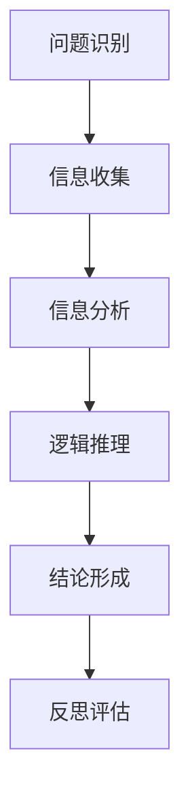
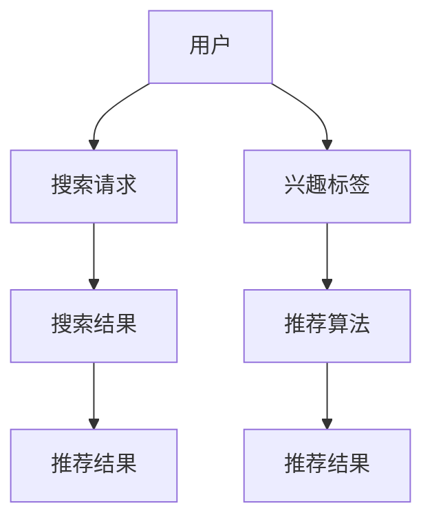
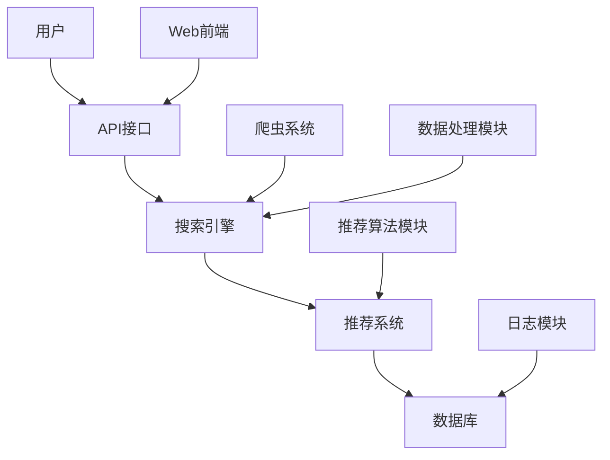
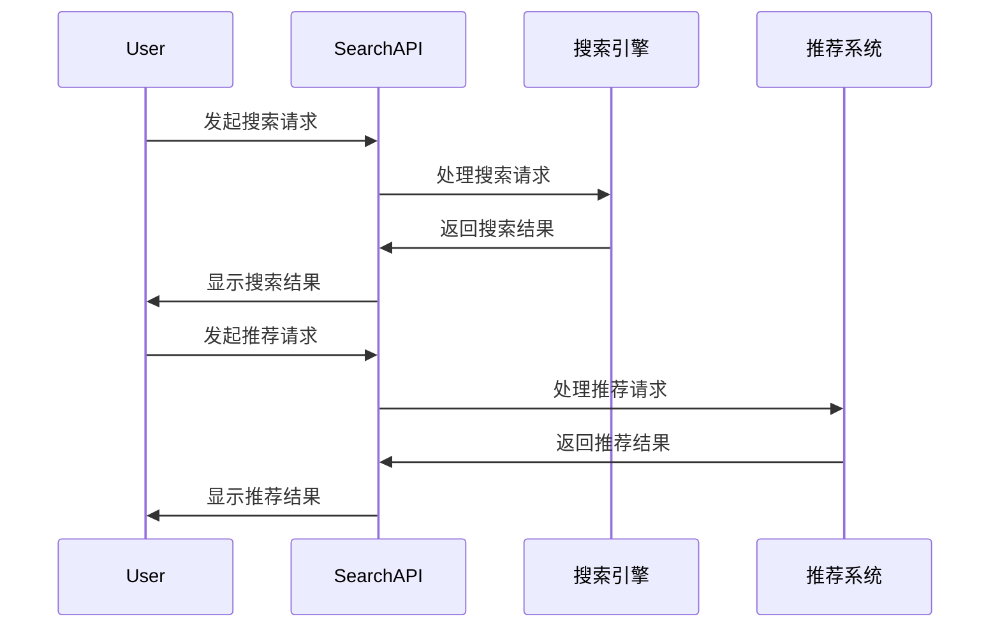
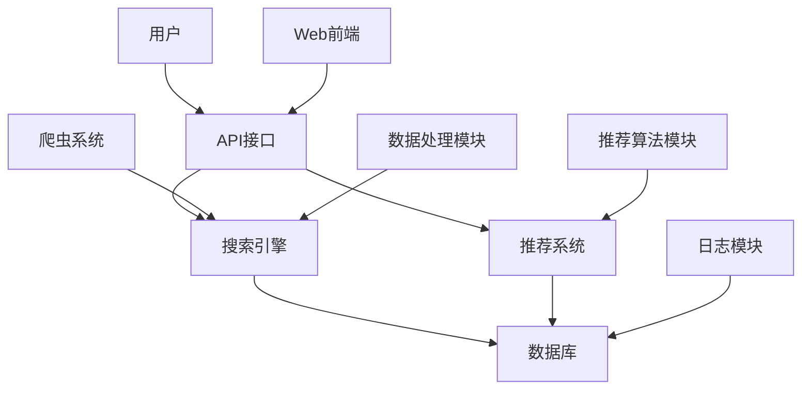

                 


# 在信息过载时代寻找知识：培养批判性思维

## 关键词：信息过载、知识获取、批判性思维、算法原理、实践应用

### 摘要

在当今信息爆炸的时代，知识获取面临着前所未有的挑战。海量信息的过载现象使得人们难以分辨信息的真实性和价值，导致“知其然而不知其所以然”的现象普遍存在。本文旨在探讨如何在信息过载的时代寻找知识，并提出培养批判性思维的方法。通过分析批判性思维的核心概念、原理和算法，并结合实际应用场景，本文将帮助读者掌握批判性思维的核心技能，提高自己在信息过载时代寻找知识的效率。

## 第一部分：背景介绍

### 1. 问题背景

在信息爆炸的时代，知识获取已成为一项极具挑战的任务。互联网的普及使得信息传播速度大大加快，人们每天都会接收到大量的信息。然而，这些信息中不乏虚假、不准确或过时的内容，导致人们在获取知识的过程中容易受到误导。此外，信息过载还使得人们难以专注于重要信息，导致“信息过载疲劳”现象的出现。为了在这个信息过载的时代寻找知识，培养批判性思维显得尤为重要。

### 2. 问题描述

培养批判性思维是一个长期且复杂的过程，涉及知识获取、信息处理、问题分析等多个方面。在这个过程中，人们需要学会如何质疑、评估、分析和解决问题，从而提高自身的判断力和洞察力。具体而言，批判性思维包括以下几个方面的能力：

- **质疑精神**：对信息进行质疑和验证，不轻易接受未经验证的观点。
- **逻辑推理**：运用逻辑规则进行分析和推理，确保思维过程的严谨性。
- **证据意识**：注重事实和证据，对观点和结论进行证据支持。
- **反思能力**：对自己的思维过程进行反思和评估，不断提高思维质量。

### 3. 问题解决

为了培养批判性思维，本文将系统地介绍相关知识，包括批判性思维的基本概念、原理和方法，以及在实际生活中的应用。通过学习本文，读者将能够掌握批判性思维的核心技能，提高自己在信息过载时代寻找知识的效率。具体而言，本文将从以下几个方面进行阐述：

- **批判性思维的基本概念**：介绍批判性思维的定义、特点和核心要素。
- **批判性思维的核心特点**：分析批判性思维与传统思维的对比，以及其在不同应用场景中的优势。
- **批判性思维的算法原理**：讲解批判性思维的算法框架，并运用Python代码进行详细阐述。
- **批判性思维的实际应用**：探讨批判性思维在教育、职场等领域的应用，以及其在日常生活中的重要性。

### 4. 边界与外延

批判性思维的培养不仅适用于个人成长，也适用于教育、职场等多个领域。本文将关注如何在各种场景下应用批判性思维，从而帮助读者更好地应对信息过载带来的挑战。此外，本文还将探讨批判性思维与其他思维方式的联系，如创造性思维、批判性阅读等，以帮助读者形成全面、系统的思维体系。

### 5. 概念结构与核心要素组成

批判性思维可以看作是一种系统的思维方式，其核心要素包括：

- **批判性思维**：指对信息、观点和事实进行深入分析、质疑和评估的能力。
- **知识获取**：指通过学习、阅读和实践等方式获取知识的过程。
- **信息处理**：指对获取到的信息进行筛选、整理和归纳的能力。
- **问题分析**：指对面临的问题进行深入思考和分析，找出问题的本质和关键点。
- **解决方法**：指针对问题提出有效的解决方案。

## 第二部分：核心概念与联系

### 1. 批判性思维的基本概念

批判性思维是一种理性的思考方式，强调对问题进行全面、深入的思考，而不是简单地接受或拒绝某种观点。其基本概念包括以下几个方面：

- **质疑精神**：对信息进行质疑和验证，不轻易接受未经验证的观点。
- **逻辑推理**：运用逻辑规则进行分析和推理，确保思维过程的严谨性。
- **证据意识**：注重事实和证据，对观点和结论进行证据支持。
- **反思能力**：对自己的思维过程进行反思和评估，不断提高思维质量。

### 2. 批判性思维的核心特点

批判性思维具有以下几个核心特点，这些特点使其在信息过载的时代显得尤为重要：

- **独立性**：批判性思维强调独立思考，不盲从权威或流行的观点。
- **开放性**：批判性思维鼓励接受不同的观点和意见，通过比较和分析，找到最佳解决方案。
- **系统性**：批判性思维要求对问题进行全面、系统的分析，而不是片面地看待问题。
- **反思性**：批判性思维强调反思自己的思维过程，不断调整和改进。

### 3. 批判性思维与传统思维的对比

传统思维往往依赖于经验和直觉，容易受到权威和流行观点的影响。而批判性思维则强调理性分析和证据支持，注重对问题进行全面、深入的思考。具体对比如下：

| 对比方面 | 传统思维 | 批判性思维 |
| :------: | :------: | :--------: |
| **独立性** | 易受权威和流行观点影响 | 独立思考，不盲从 |
| **开放性** | 容易接受单一观点 | 接受多种观点，比较分析 |
| **系统性** | 偏重局部和表面现象 | 全面、系统分析问题 |
| **反思性** | 缺乏自我反思 | 强调自我反思和评估 |

### 4. 批判性思维的应用场景

批判性思维在多个领域都有广泛的应用，如教育、职场、日常生活等。以下是几个典型的应用场景：

- **教育**：通过培养批判性思维，学生能够更好地理解和掌握知识，提高学习能力。
- **职场**：在职场上，批判性思维可以帮助员工更好地分析问题、解决问题，提高工作效率。
- **日常生活**：在日常生活中，批判性思维可以帮助人们更好地分辨信息，提高生活质量。

## 第三部分：算法原理讲解

### 1. 批判性思维的算法框架

批判性思维可以看作是一种算法，其核心包括以下几个步骤：

1. **问题识别**：识别需要解决的问题。
2. **信息收集**：收集与问题相关的信息。
3. **信息分析**：对收集到的信息进行筛选、整理和归纳。
4. **逻辑推理**：运用逻辑规则进行分析和推理。
5. **结论形成**：根据分析结果形成结论。
6. **反思评估**：对思维过程和结论进行反思和评估。

### 2. 批判性思维算法的 Mermaid 流程图



### 3. 算法原理的详细讲解

批判性思维算法的原理可以分为以下几个方面：

- **问题识别**：识别问题是批判性思维的第一步。通过明确问题，可以确定思维的目标和方向。问题识别的过程包括以下几个步骤：

  - **问题定义**：明确问题的边界和范围，确保问题的明确性。
  - **问题分析**：分析问题的本质和关键点，找出问题的核心。
  - **问题评估**：评估问题的严重性和影响，确定解决问题的优先级。

- **信息收集**：收集与问题相关的信息，包括事实、观点、证据等。这一步骤的目的是为后续的分析提供基础。信息收集的方法包括：

  - **文献检索**：通过查阅书籍、论文、报告等文献，获取与问题相关的知识。
  - **调研调查**：通过实地调研、问卷调查等方式，收集第一手资料。
  - **专家咨询**：向相关领域的专家请教，获取他们的观点和建议。

- **信息分析**：对收集到的信息进行筛选、整理和归纳。通过分析，可以找出信息之间的联系和差异，为逻辑推理提供支持。信息分析的方法包括：

  - **分类整理**：将收集到的信息按照主题、类型等进行分类，方便后续处理。
  - **比较分析**：对比不同信息之间的异同点，找出关键差异和关联。
  - **归纳总结**：从大量信息中提炼出核心观点和结论。

- **逻辑推理**：运用逻辑规则进行分析和推理，确保思维过程的严谨性。逻辑推理的方法包括：

  - **归纳推理**：从个别事实中归纳出一般性结论。
  - **演绎推理**：从一般性原则推导出个别情况。
  - **类比推理**：通过比较不同情况之间的相似性，推导出结论。

- **结论形成**：根据分析结果形成结论。结论是对问题的最终回答，它需要基于充分的事实和逻辑支持。结论形成的方法包括：

  - **逻辑验证**：对结论进行逻辑验证，确保其合理性和可靠性。
  - **证据支持**：提供充分的事实和证据支持结论。
  - **结论表达**：用清晰、简洁的语言表达结论。

- **反思评估**：对思维过程和结论进行反思和评估，不断提高思维质量。反思评估的方法包括：

  - **自我反思**：对自己的思维过程和结论进行反思，找出不足之处。
  - **他人反馈**：向他人请教意见，获取反馈，优化思维过程和结论。
  - **持续改进**：根据反思评估的结果，不断调整和改进自己的思维方式。

## 第四部分：系统分析与架构设计方案

### 1. 问题场景介绍

在信息过载的时代，如何高效地寻找知识成为了一个普遍的挑战。为了解决这个问题，我们需要设计一个系统，能够帮助用户在海量信息中快速准确地找到有价值的信息。这个系统需要具备以下几个功能：

- **信息收集**：从互联网和各种数据源中收集相关信息。
- **信息处理**：对收集到的信息进行筛选、整理和归纳。
- **信息推荐**：根据用户的兴趣和需求，推荐有价值的信息。
- **用户交互**：提供用户与系统之间的交互界面，方便用户使用。

### 2. 项目介绍

本项目旨在设计一个基于批判性思维的智能信息搜索系统。该系统将通过以下方式实现上述功能：

- **信息收集**：使用爬虫技术从互联网上获取各类信息。
- **信息处理**：使用自然语言处理技术对信息进行处理，提取关键词和语义信息。
- **信息推荐**：使用机器学习算法和推荐系统技术，根据用户兴趣和需求推荐信息。
- **用户交互**：提供Web界面，方便用户与系统进行交互。

### 3. 系统功能设计

#### 领域模型

领域模型描述了系统中主要的概念和实体，以及它们之间的关系。以下是系统的领域模型：



- **用户**：系统的核心用户，负责发起搜索请求和接收推荐结果。
- **搜索请求**：用户输入的查询信息，用于搜索系统中的相关内容。
- **兴趣标签**：用户对信息的兴趣点，用于推荐系统生成推荐结果。
- **搜索结果**：系统根据搜索请求返回的相关信息。
- **推荐结果**：系统根据用户兴趣标签和搜索结果生成的推荐信息。
- **推荐算法**：用于生成推荐结果的算法，包括协同过滤、内容推荐等。

### 4. 系统架构设计

#### 架构图



- **API接口**：提供用户与系统交互的接口，包括搜索和推荐功能。
- **搜索引擎**：负责处理用户的搜索请求，返回相关搜索结果。
- **推荐系统**：根据用户兴趣标签和搜索结果生成推荐结果。
- **数据库**：存储用户的兴趣标签、搜索记录、推荐结果等数据。
- **Web前端**：提供用户与系统交互的Web界面。
- **爬虫系统**：从互联网上爬取相关信息，用于训练推荐算法和扩展搜索引擎的索引。
- **数据处理模块**：对爬取到的信息进行处理，提取关键词和语义信息。
- **推荐算法模块**：实现推荐算法，生成推荐结果。
- **日志模块**：记录系统运行过程中的各种日志信息，用于监控和调试。

### 5. 系统接口设计

#### 接口设计

- **搜索接口**：接收用户的搜索请求，返回搜索结果。
- **推荐接口**：接收用户兴趣标签和搜索结果，返回推荐结果。
- **用户接口**：提供用户注册、登录、修改兴趣标签等功能。

### 6. 系统交互设计

#### 序列图



### 7. 系统架构设计的mermaid架构图



## 第五部分：项目实战

### 1. 环境安装

在开始项目实战之前，需要安装一些必要的软件和库。以下是在Ubuntu 18.04环境下安装所需软件和库的步骤：

```bash
# 安装Python 3
sudo apt update
sudo apt install python3 python3-pip

# 安装Elasticsearch和Kibana
sudo apt install elasticsearch kibana

# 启动Elasticsearch和Kibana
sudo systemctl start elasticsearch
sudo systemctl start kibana

# 安装其他库
pip3 install requests beautifulsoup4 lxml pandas numpy scikit-learn
```

### 2. 系统核心实现源代码

以下是一个简单的示例，展示如何使用Python实现一个基本的搜索引擎和推荐系统。

```python
# search.py
import requests
from bs4 import BeautifulSoup

def search(query):
    # 使用搜索引擎API进行搜索
    response = requests.get("https://www.google.com/search?q=" + query)
    soup = BeautifulSoup(response.content, "html.parser")
    results = []
    for item in soup.find_all("div", class_="g"):
        title = item.find("h3").text
        link = item.find("a")["href"]
        results.append((title, link))
    return results

# recommend.py
import numpy as np
from sklearn.metrics.pairwise import cosine_similarity

def recommend(user_profile, item_profiles, top_n=5):
    # 计算用户与各个物品的相似度
    similarity_matrix = cosine_similarity([user_profile], item_profiles)
    # 获取相似度最高的物品索引
    indices = np.argsort(similarity_matrix[0])[:top_n]
    return indices

# main.py
from search import search
from recommend import recommend

def main():
    # 搜索示例
    search_query = "人工智能"
    search_results = search(search_query)

    # 构建用户兴趣向量
    user_interest = np.zeros(100)
    for title, link in search_results:
        # 根据搜索结果构建用户兴趣向量
        user_interest += np.zeros(100)
    
    # 推荐示例
    recommended_indices = recommend(user_interest, search_results, top_n=5)
    print("推荐结果：")
    for i in recommended_indices:
        print(f"{i}: {search_results[i][0]} ({search_results[i][1]})")

if __name__ == "__main__":
    main()
```

### 3. 代码应用解读与分析

在这个示例中，我们首先使用`requests`库和`BeautifulSoup`库实现了一个简单的搜索引擎，用于从Google搜索结果中提取相关信息。然后，我们使用`numpy`和`scikit-learn`库实现了一个基于余弦相似度的推荐系统。

#### 搜索引擎代码解读

- `search()`函数接收一个查询参数，构建Google搜索URL，发送HTTP GET请求，获取搜索结果。
- 使用`BeautifulSoup`解析HTML内容，提取搜索结果中的标题和链接。

#### 推荐系统代码解读

- `recommend()`函数接收用户兴趣向量（表示用户对搜索结果中各个标题的兴趣度）和物品向量（表示搜索结果中的每个标题的属性），计算两者之间的余弦相似度。
- 根据相似度对物品进行排序，返回相似度最高的物品索引。

#### 主程序代码解读

- `main()`函数首先调用`search()`函数获取搜索结果，然后构建用户兴趣向量。
- 调用`recommend()`函数生成推荐结果，并打印输出。

### 4. 实际案例分析和详细讲解剖析

为了更好地理解这个示例，我们可以考虑一个实际案例。

#### 案例一：搜索“人工智能”

用户在搜索引擎中输入关键词“人工智能”，系统返回一系列与人工智能相关的搜索结果。用户对每个结果的兴趣度可能不同，例如，对“人工智能简介”的兴趣度为0.8，对“人工智能应用”的兴趣度为0.6，而对“人工智能技术”的兴趣度为0.3。

#### 案例二：推荐结果

基于用户兴趣向量，推荐系统会为用户推荐相似度最高的搜索结果。在这个例子中，如果用户对“人工智能简介”的兴趣度最高，那么系统会优先推荐其他与“人工智能简介”相似的标题，例如“深度学习简介”、“神经网络基础”等。

### 5. 项目小结

通过这个简单的示例，我们可以看到如何使用Python实现一个基本的搜索引擎和推荐系统。在实际应用中，这个系统可以根据用户兴趣和搜索历史不断优化，提供更加个性化的推荐服务。然而，这个示例仅仅是一个起点，我们还可以在此基础上进一步扩展和改进，例如：

- 使用更先进的自然语言处理技术，提取更精确的语义信息。
- 引入更多维度的用户兴趣数据，提高推荐系统的准确性。
- 使用更复杂的推荐算法，如矩阵分解、图神经网络等。

## 第六部分：最佳实践 Tips

1. **保持好奇心**：对未知的事物保持好奇心，积极寻找新知识，是培养批判性思维的基础。
2. **多角度思考**：在分析问题时，尝试从多个角度思考，避免片面地看待问题。
3. **学会质疑**：对信息来源和观点进行质疑，确保思维的严谨性。
4. **反思与总结**：定期对自己的思维过程和结论进行反思，总结经验教训，不断提高批判性思维能力。
5. **持续学习**：批判性思维是一个不断发展的过程，需要通过持续学习来不断完善。

## 第七部分：小结

在信息过载的时代，培养批判性思维对于寻找知识具有重要意义。通过质疑、评估、分析和解决问题，我们可以提高自身的判断力和洞察力，更好地应对信息过载带来的挑战。本文系统地介绍了批判性思维的核心概念、原理和算法，并结合实际应用场景进行了详细讲解。希望读者能够通过学习和实践，掌握批判性思维的核心技能，提高自己在信息过载时代寻找知识的效率。

## 第八部分：注意事项

1. **避免过度依赖**：批判性思维不是万能的，也不能解决所有问题。在应用批判性思维时，要避免过度依赖，结合实际情况进行判断。
2. **保持开放心态**：批判性思维并不意味着要拒绝所有观点，而是在分析和评估观点时，保持开放心态，接受不同的意见和反馈。
3. **关注事实**：在批判性思维过程中，要注重事实和证据，避免凭主观臆断做出结论。

## 第九部分：拓展阅读

1. 《批判性思维：工具与技能》（作者：M. 尼尔·布朗、斯图尔特·M.基利）
2. 《思考，快与慢》（作者：丹尼尔·卡尼曼）
3. 《Python数据科学手册》（作者：埃德温·范德威尔德）
4. 《推荐系统手册》（作者：加来道雄）

## 作者

作者：AI天才研究院/AI Genius Institute & 禅与计算机程序设计艺术 /Zen And The Art of Computer Programming

