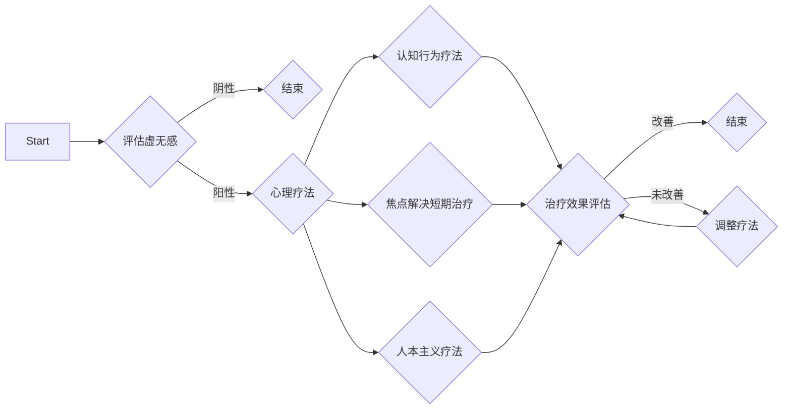

                 

## 《在动荡中寻找平衡：克服虚无感的人生智慧》

### 关键词：虚无感、心理健康、策略与方法、人生智慧

> **摘要**：本文旨在探讨虚无感的起源与影响，揭示虚无感背后的心理机制，并提出一系列有效的策略与方法，帮助读者在动荡的生活中找到平衡，克服虚无感。通过心理疗法、生活方式调整、人际关系重建、职业规划等多方面的分析和建议，本文为读者提供了一幅全面且实用的应对虚无感的蓝图。

---

### 第一部分：虚无感的起源与影响

#### 第1章：虚无感的起源与现状

**1.1 背景介绍**

在现代社会中，虚无感成为一个越来越普遍的现象。它不仅影响到个人的心理健康，也对整个社会的稳定与发展构成挑战。为了更好地理解虚无感，我们需要从人类社会发展的历史背景入手。

**1.1.1 人类社会发展的历史背景**

人类社会从原始社会到现代社会的转变，经历了无数次的技术革命和社会变革。在这个过程中，人类逐渐从对自然的崇拜转向对自我的探索，这种探索使得人们开始思考生命的意义和价值。随着工业革命和信息时代的到来，人们的生活节奏加快，竞争压力增大，虚无感的现象也逐渐显现。

**1.1.2 虚无感概念的起源与发展**

虚无感的概念最早可以追溯到古希腊哲学。苏格拉底和后来的斯多葛学派都曾探讨过人类在面对现实世界时的无力感和迷茫感。到了现代，虚无感作为一个心理学概念，逐渐被广泛研究和探讨。

**1.1.3 当代社会虚无感的现状**

在当代社会，虚无感已经成为一个普遍存在的心理现象。根据相关研究，大约有10%-30%的成年人经历过虚无感。虚无感不仅存在于年轻人中，也存在于各个年龄段的人群中。它不仅影响个人的心理健康，还对整个社会的稳定构成威胁。

**1.2 虚无感的定义与特征**

虚无感是一种深刻的无力感和迷茫感，个体感觉自己没有任何意义或目标，生活失去了方向和动力。虚无感的特征包括：

- **心理上**：感到生活无意义，缺乏动力和目标。
- **行为上**：缺乏行动力，对日常活动和兴趣爱好失去兴趣。
- **情绪上**：感到焦虑、抑郁和无助。

**1.2.1 虚无感的定义**

虚无感是一种深刻的无力感和迷茫感，个体感觉自己没有任何意义或目标，生活失去了方向和动力。

**1.2.2 虚无感的特征**

虚无感的特征包括：

- **心理上**：感到生活无意义，缺乏动力和目标。
- **行为上**：缺乏行动力，对日常活动和兴趣爱好失去兴趣。
- **情绪上**：感到焦虑、抑郁和无助。

**1.2.3 虚无感与抑郁症的区别**

虚无感和抑郁症都是心理健康问题，但它们的症状和原因有所不同。抑郁症通常表现为长期的悲伤、无助和绝望，而虚无感则更多体现在对生活意义的迷失和对未来的不确定性。

**1.3 虚无感的影响**

虚无感对个人和社会都有着深远的影响。对个人而言，虚无感可能导致心理健康问题，如抑郁症和焦虑症。对社会而言，虚无感可能导致社会动荡和道德沦丧。

**1.3.1 对个人生活的影响**

虚无感对个人生活的影响主要表现在以下几个方面：

- **心理健康**：长期的虚无感可能导致心理健康问题，如抑郁症和焦虑症。
- **人际关系**：虚无感可能导致个体与他人的关系疏远，影响社交生活。
- **职业发展**：虚无感可能导致职业发展受阻，影响个人的经济状况。

**1.3.2 对社会的影响**

虚无感对社会的影响主要表现在以下几个方面：

- **社会稳定**：虚无感可能导致社会不稳定，影响社会的和谐与发展。
- **道德沦丧**：虚无感可能导致道德观念的丧失，影响社会的道德水平。
- **文化传承**：虚无感可能导致文化传承的断裂，影响社会的文化多样性。

**1.3.3 虚无感的心理学解释**

虚无感是一种心理健康问题，其产生的原因复杂多样。心理学研究表明，虚无感可能与以下几个方面有关：

- **自我认知**：个体对自己的认知和评价可能影响虚无感的产生。
- **社会环境**：社会环境的变化和压力可能加剧虚无感。
- **心理防御机制**：个体的心理防御机制可能影响虚无感的表达和缓解。

**1.4 本章小结**

本章从历史背景、概念定义、特征影响等多个角度对虚无感进行了全面剖析。通过对虚无感的深入理解，我们可以更好地认识这一心理健康问题，并为后续的探讨提供基础。

---

### 第二部分：虚无感背后的心理机制

#### 第2章：心理因素与虚无感

**2.1 个人心理因素**

个人心理因素是虚无感产生的重要因素之一。个体对自己的认知、自我认同的缺失以及恐惧等都可能加剧虚无感。

**2.1.1 自我认知与虚无感**

自我认知是指个体对自己性格、能力、价值观等方面的认知。良好的自我认知有助于个体建立积极的自我形象，从而减少虚无感。相反，缺乏自我认知可能导致个体对自己的否定，加剧虚无感。

**2.1.2 自我认同的缺失与虚无感**

自我认同是指个体对自己的认同和接受。自我认同的缺失意味着个体无法接受自己，从而导致内心的矛盾和痛苦。这种矛盾和痛苦往往表现为虚无感。

**2.1.3 恐惧与虚无感**

恐惧是虚无感的另一种表现形式。个体对未来的不确定性、对失败的恐惧以及对死亡的恐惧都可能加剧虚无感。这些恐惧使得个体感到生活无意义，从而产生虚无感。

**2.2 社会心理因素**

社会心理因素也是虚无感产生的重要因素。社会价值观的变迁、社会比较以及社交压力等都可能影响个体的虚无感。

**2.2.1 社会价值观的变迁**

社会价值观的变迁是现代社会的一个显著特征。传统价值观的解体和现代价值观的多元化使得个体在价值观上面临困惑和冲突。这种困惑和冲突可能导致个体产生虚无感。

**2.2.2 社会比较与虚无感**

社会比较是指个体将自己与他人进行比较。社会比较可能导致个体对自己的否定，从而加剧虚无感。例如，当个体发现自己与他人相比缺乏优势时，可能会感到自己的生活无意义。

**2.2.3 社交压力与虚无感**

社交压力是现代社会的一个普遍现象。社交压力可能来自工作、家庭、朋友等各个方面。长期的社交压力可能导致个体感到疲惫和无助，从而产生虚无感。

**2.3 心理防御机制与虚无感**

心理防御机制是心理学中一个重要的概念，它指的是个体为了应对内心冲突和压力而采取的心理策略。心理防御机制既有积极的作用，也可能有消极的影响。

**2.3.1 防御机制的作用**

防御机制有助于个体应对内心冲突和压力，从而保护个体的心理健康。例如，当个体面临失败和挫折时，防御机制可以帮助个体暂时逃避现实，从而缓解内心的痛苦。

**2.3.2 防御机制与虚无感的关系**

然而，过度的防御机制也可能导致虚无感的产生。例如，个体通过否认现实来逃避痛苦，但这样做只会加剧内心的矛盾和痛苦，最终导致虚无感的产生。

**2.3.3 防御机制的消极影响**

防御机制的消极影响主要表现在以下几个方面：

- **逃避现实**：防御机制可能导致个体逃避现实问题，从而无法真正解决问题。
- **内心矛盾**：防御机制可能会加剧个体内心的矛盾和冲突，导致心理健康问题。
- **阻碍成长**：防御机制可能会阻碍个体的成长和进步，使其无法充分发挥自己的潜力。

**2.4 本章小结**

本章从个人心理因素、社会心理因素以及心理防御机制等多个角度分析了虚无感的心理机制。通过对这些机制的深入理解，我们可以更好地理解虚无感的产生和影响，为后续的对策提供理论基础。

---

### 第三部分：克服虚无感的策略与方法

#### 第3章：心理疗法与虚无感

**3.1 认知行为疗法**

认知行为疗法（CBT）是一种基于认知和行为的心理疗法，旨在帮助个体改变负面思维和行为模式，从而改善心理健康。对于虚无感的治疗，认知行为疗法具有显著的效果。

**3.1.1 认知行为疗法的基本原理**

认知行为疗法的基本原理是：个体的情绪和行为是由其认知过程（即对事件的解释和评价）所驱动的。通过改变个体的认知过程，可以改善其情绪和行为。

**3.1.2 认知行为疗法在虚无感治疗中的应用**

认知行为疗法在虚无感治疗中的应用主要包括以下几个方面：

- **认知重构**：通过识别和挑战个体负面思维，帮助其建立更积极的思维模式。例如，如果一个个体认为自己的生活毫无意义，治疗师可以帮助其识别这种思维的错误，并引导其思考生活的积极方面。
- **行为激活**：通过鼓励个体参与有意义的活动和社交互动，提高其生活质量和自信心。例如，治疗师可以建议个体参与体育锻炼、参加社区活动等。
- **技能训练**：通过训练个体的情绪调节、压力管理和解决问题的技能，帮助其应对生活中的挑战。例如，治疗师可以教授个体深呼吸、冥想等放松技巧。

**3.1.3 实例分析**

小王是一位年轻的程序员，他感到自己的生活毫无意义，工作压力大，人际关系疏远。在接受了认知行为疗法后，小王开始逐步改变自己的认知和行为。

- **认知重构**：治疗师帮助小王识别和挑战他的负面思维，例如“我的生活毫无意义”、“我永远无法成功”等。通过认知重构，小王开始看到生活中的积极方面，例如他喜欢的编程工作、与同事的友好互动等。
- **行为激活**：治疗师鼓励小王参与体育锻炼和社区活动，以提高他的生活质量和自信心。小王开始定期参加跑步和瑜伽课程，还参加了社区的义工活动。
- **技能训练**：治疗师教授小王情绪调节和压力管理技巧，例如深呼吸、冥想等。小王学会了在感到压力时进行放松，从而减轻了焦虑和抑郁。

通过认知行为疗法，小王的生活逐渐有了意义和动力。他的工作表现得到了提升，人际关系也得到了改善。

**3.2 焦点解决短期治疗**

焦点解决短期治疗（Solution-Focused Brief Therapy，SFBT）是一种以解决问题为导向的心理治疗，强调个体的优势和资源，而不是问题本身。对于虚无感的治疗，焦点解决短期治疗同样具有显著的效果。

**3.2.1 焦点解决短期治疗的基本概念**

焦点解决短期治疗的基本概念是：个体的行为变化是可以通过小步骤的实现和累积来实现的。治疗师的角色是帮助个体设定目标、识别资源和制定行动计划。

**3.2.2 焦点解决短期治疗的方法**

焦点解决短期治疗的方法主要包括以下几个方面：

- **设定目标**：治疗师帮助个体设定具体、可实现的短期目标，以增强其信心和动力。
- **识别资源**：治疗师帮助个体识别自己已经拥有的资源和优势，以增强其解决问题的能力。
- **制定行动计划**：治疗师帮助个体制定具体的行动计划，以实现短期目标。

**3.2.3 实例分析**

小李是一位职场新人，他感到自己的职业发展停滞不前，生活缺乏意义。在接受了焦点解决短期治疗后，小李逐步找到了生活的方向和动力。

- **设定目标**：治疗师帮助小李设定了具体的短期目标，例如“找到一项有趣的项目”、“与同事建立更好的关系”等。这些目标让小李看到了前进的方向。
- **识别资源**：治疗师帮助小李识别了自己已经拥有的资源，例如他的技能、人际关系等。这些资源让小李意识到自己有能力解决问题。
- **制定行动计划**：治疗师帮助小李制定了具体的行动计划，例如“主动参与公司的项目”、“与同事进行定期交流”等。通过这些行动计划，小李逐步实现了自己的目标。

**3.3 人本主义疗法**

人本主义疗法强调个体的自我实现和成长，认为每个人都有实现自己潜能的能力。对于虚无感的治疗，人本主义疗法同样具有重要的意义。

**3.3.1 人本主义疗法的基本理念**

人本主义疗法的基本理念是：个体是自我实现的，治疗师的角色是帮助个体发现自己的潜能，并鼓励其实现自我。

**3.3.2 人本主义疗法在虚无感治疗中的运用**

人本主义疗法在虚无感治疗中的运用主要包括以下几个方面：

- **自我接纳**：治疗师帮助个体接受自己，包括自己的优点和缺点。通过自我接纳，个体可以减少自我批评和负面情绪。
- **自我实现**：治疗师鼓励个体追求自我实现，包括发展自己的兴趣、才能和价值观。通过自我实现，个体可以找到生活的意义和目标。
- **情感支持**：治疗师提供情感支持，帮助个体在面对困难和挑战时保持积极的心态。

**3.3.3 实例分析**

小张是一位失业者，他感到自己的生活毫无意义，对未来充满恐惧。在人本主义疗法中，小张逐渐找到了生活的方向和动力。

- **自我接纳**：治疗师帮助小张接受自己的现状，包括失业的事实。通过自我接纳，小张减少了自我批评和负面情绪。
- **自我实现**：治疗师鼓励小张发展自己的兴趣和才能，例如绘画和音乐。通过自我实现，小张找到了生活的意义和目标。
- **情感支持**：治疗师提供情感支持，帮助小张在面对失业的困境时保持积极的心态。

**3.4 心理疏导与支持**

心理疏导与支持是克服虚无感的重要手段之一。通过心理疏导和支持，个体可以释放内心的压力和负面情绪，从而改善心理健康。

**3.4.1 心理疏导的作用**

心理疏导的作用主要体现在以下几个方面：

- **情绪宣泄**：通过心理疏导，个体可以将内心的压力和负面情绪宣泄出来，从而减轻内心的负担。
- **认知调整**：通过心理疏导，个体可以调整自己的认知，减少负面思维和情绪。
- **行为改变**：通过心理疏导，个体可以改变不良的行为习惯，从而改善生活质量。

**3.4.2 心理疏导的方法**

心理疏导的方法主要包括以下几个方面：

- **倾听和理解**：治疗师通过倾听和理解，帮助个体释放内心的压力和负面情绪。
- **情绪调节**：治疗师教授个体情绪调节技巧，例如深呼吸、冥想等，帮助个体更好地应对情绪波动。
- **认知重构**：治疗师帮助个体识别和调整负面思维，从而改善心理健康。

**3.4.3 支持系统的构建**

支持系统的构建是克服虚无感的重要保障。通过构建支持系统，个体可以获得情感支持和实际帮助，从而增强应对困境的能力。

- **家庭支持**：家庭是个体最重要的支持系统。家庭成员的关爱和理解可以帮助个体度过困境。
- **朋友支持**：朋友的支持同样重要。与朋友的交流和互动可以缓解个体的孤独感和无助感。
- **专业支持**：专业的心理疏导和支持可以帮助个体更好地应对虚无感，从而改善心理健康。

**3.5 本章小结**

本章从认知行为疗法、焦点解决短期治疗、人本主义疗法以及心理疏导与支持等多个角度分析了克服虚无感的心理疗法和方法。通过对这些疗法的深入探讨，我们可以更好地了解虚无感的治疗策略，为个体提供有效的帮助。

---

#### 第4章：生活方式的调整与虚无感

**4.1 健康生活方式的重要性**

健康生活方式是克服虚无感的重要手段之一。通过调整饮食、锻炼和睡眠等方面，个体可以改善身心健康，从而减轻虚无感。

**4.1.1 身体健康与虚无感**

身体健康是心理健康的基础。缺乏锻炼、饮食不均衡和睡眠不足等都可能导致身体机能下降，从而影响心理健康。研究表明，适度的体育锻炼可以提高个体的自信心和积极性，有助于减轻虚无感。

**4.1.2 心理健康与虚无感**

心理健康同样对虚无感有着重要影响。心理健康问题，如焦虑、抑郁等，都可能导致虚无感的加剧。通过心理疏导、认知行为疗法等手段，个体可以改善心理健康，从而减轻虚无感。

**4.1.3 社交健康与虚无感**

社交健康也是影响虚无感的重要因素。社交活动可以丰富个体的生活，提高其幸福感。研究表明，与他人的积极互动有助于减轻虚无感，增强个体的社会支持网络。

**4.2 心理调适技巧**

心理调适技巧是克服虚无感的重要方法之一。通过学习心理调适技巧，个体可以更好地应对压力和挑战，从而改善心理健康。

**4.2.1 深呼吸练习**

深呼吸练习是一种简单有效的心理调适技巧。通过深呼吸，个体可以放松身心，减轻焦虑和紧张。具体方法如下：

- 坐在舒适的椅子上，双脚平放在地面上。
- 将双手放在腹部，慢慢吸气，感受腹部膨胀。
- 慢慢呼气，感受腹部收缩。
- 重复以上步骤，每次深呼吸持续约5秒钟。

**4.2.2 冥想与正念**

冥想与正念是一种通过专注呼吸和身体感觉来放松身心的技巧。通过冥想与正念，个体可以培养专注力和自我意识，从而减轻虚无感。

**4.2.3 时间的有效管理**

时间的有效管理是提高生活质量的重要手段。通过合理安排时间，个体可以更好地平衡工作、学习和休闲，从而减轻压力和焦虑，提高幸福感。

**4.3 兴趣与爱好的培养**

兴趣与爱好的培养是克服虚无感的重要方法之一。通过培养兴趣与爱好，个体可以找到生活的意义和乐趣，从而减轻虚无感。

**4.3.1 兴趣与爱好的定义**

兴趣与爱好是指个体对某种活动或领域的热爱和兴趣。兴趣与爱好可以是个体独特的个性体现，也是个体寻找生活意义的重要途径。

**4.3.2 兴趣与爱好对虚无感的积极作用**

兴趣与爱好对虚无感有积极的积极作用。通过参与兴趣与爱好活动，个体可以：

- **转移注意力**：将注意力从负面情绪和思维转移到积极的活动上，从而减轻虚无感。
- **增强自我价值感**：通过在兴趣与爱好活动中取得成就，个体可以增强自我价值感，从而减轻虚无感。
- **提升幸福感**：兴趣与爱好活动可以带来快乐和满足感，从而提升个体的幸福感。

**4.3.3 兴趣爱好的培养方法**

培养兴趣与爱好需要一定的方法和策略。以下是一些实用的建议：

- **尝试新事物**：勇于尝试新事物，发现新的兴趣点。
- **持续学习**：通过学习相关知识，提升兴趣与爱好水平。
- **制定计划**：制定明确的兴趣与爱好培养计划，保持持续性和稳定性。
- **寻找同伴**：与他人分享兴趣与爱好，寻找志同道合的伙伴，共同进步。

**4.4 本章小结**

本章从健康生活方式、心理调适技巧、兴趣与爱好的培养等多个角度分析了如何通过生活方式的调整来克服虚无感。通过这些调整，个体可以改善身心健康，提升生活质量，从而减轻虚无感。

---

#### 第5章：人际关系的重建与虚无感

**5.1 人际关系的重要性**

人际关系是人类社会的重要组成部分，对个体的心理健康和生活质量有着深远的影响。良好的人际关系能够提供情感支持、增强自我价值感和提高生活质量，而人际关系问题则可能导致孤独感、无助感和虚无感。

**5.1.1 人际关系的基本概念**

人际关系是指人与人之间通过互动和交往形成的心理和情感联系。人际关系可以分为家庭关系、友谊关系和职业关系等类型。

**5.1.2 人际关系对虚无感的影响**

人际关系对虚无感有着重要的影响。缺乏亲密的人际关系可能导致个体感到孤独和无助，从而加剧虚无感。相反，良好的人际关系能够为个体提供情感支持和归属感，有助于减轻虚无感。

**5.1.3 人际关系的心理学解释**

心理学研究表明，人际关系对个体的心理健康有着重要的影响。积极的人际关系能够增强个体的自尊和自我价值感，降低抑郁和焦虑水平。而消极的人际关系则可能导致个体的心理压力增加，从而影响心理健康。

**5.2 人际沟通技巧**

人际沟通技巧是建立和维护良好人际关系的关键。通过有效的沟通，个体可以更好地表达自己的想法和感受，理解他人的需求，从而建立和谐的人际关系。

**5.2.1 有效沟通的重要性**

有效沟通是人际关系成功的关键。通过有效沟通，个体可以：

- **减少误解和冲突**：通过清晰和明确的沟通，个体可以减少误解和冲突，从而维护和谐的人际关系。
- **增强信任和理解**：通过倾听和回应，个体可以增强信任和理解，从而建立更加稳固的人际关系。
- **改善心理健康**：有效的沟通有助于个体释放压力，改善心理健康。

**5.2.2 沟通障碍与虚无感**

沟通障碍可能导致人际关系问题，进而加剧虚无感。常见的沟通障碍包括：

- **倾听障碍**：不善于倾听他人，导致沟通效果不佳。
- **表达障碍**：不善于表达自己的想法和感受，导致沟通不畅。
- **情感障碍**：情感表达不清晰，导致沟通产生误解。

**5.2.3 人际沟通技巧的培养**

要培养良好的人际沟通技巧，个体可以从以下几个方面入手：

- **提高倾听能力**：通过积极倾听，个体可以更好地理解他人的需求和感受。
- **明确表达**：通过清晰和明确的表达，个体可以减少误解和冲突。
- **情感表达**：通过适当地表达情感，个体可以增强沟通的效果。

**5.3 人际冲突的处理**

人际冲突是人际关系中不可避免的现象。处理人际冲突的关键在于找到有效的解决方法，从而维护和谐的人际关系。

**5.3.1 人际冲突的基本类型**

人际冲突可以分为以下几种基本类型：

- **价值观冲突**：由于个体价值观的不同，导致在某个问题上产生分歧。
- **利益冲突**：由于个体利益的冲突，导致在某个问题上产生争执。
- **情感冲突**：由于个体情感上的矛盾，导致在某个问题上产生争执。

**5.3.2 人际冲突的处理方法**

处理人际冲突的方法包括以下几个方面：

- **冷静分析**：在冲突发生时，保持冷静，分析冲突的原因和性质。
- **有效沟通**：通过有效沟通，表达自己的观点和需求，理解他人的立场。
- **寻求共识**：在冲突中寻求共识，找到双方都能接受的解决方案。

**5.3.3 人际冲突的心理调适**

在处理人际冲突时，个体可以通过心理调适来缓解冲突带来的压力和负面情绪。以下是一些实用的心理调适方法：

- **深呼吸**：通过深呼吸，缓解紧张和焦虑情绪。
- **放松训练**：通过放松训练，缓解身体和心理的紧张。
- **积极思考**：通过积极思考，调整对冲突的看法和态度。

**5.4 社区参与与社会支持**

社区参与和社会支持是建立和维护良好人际关系的重要途径。通过社区参与和社会支持，个体可以获得情感支持、实用帮助和社会认同。

**5.4.1 社区参与的意义**

社区参与对个体的心理健康和生活质量有着重要意义。通过社区参与，个体可以：

- **建立社会联系**：通过参与社区活动，个体可以结识新朋友，建立社会联系。
- **提高生活质量**：参与社区活动可以丰富个体的生活，提高生活质量。
- **增强社会责任感**：参与社区活动可以增强个体的社会责任感，促进个人成长。

**5.4.2 社会支持系统的构建**

构建社会支持系统是克服虚无感的重要保障。以下是一些构建社会支持系统的建议：

- **家庭支持**：家庭成员的支持对个体的心理健康至关重要。家庭成员可以通过关爱、理解和支持，帮助个体度过困境。
- **朋友支持**：朋友的帮助和鼓励对个体的心理健康同样重要。朋友可以通过倾听、理解和支持，为个体提供情感支持。
- **专业支持**：专业的心理疏导和支持可以帮助个体更好地应对虚无感，从而改善心理健康。

**5.5 本章小结**

本章从人际关系的重要性、人际沟通技巧、人际冲突的处理以及社区参与与社会支持等多个角度分析了如何通过人际关系的重建来克服虚无感。通过建立和维护良好的人际关系，个体可以获得情感支持、增强自我价值感，从而减轻虚无感。

---

#### 第6章：职业规划与虚无感

**6.1 职业规划的重要性**

职业规划对于个体的职业发展和生活满意度具有重要影响。一个清晰的职业规划可以帮助个体明确职业目标、提升职业能力，从而减少职业迷茫感和虚无感。

**6.1.1 职业规划的定义**

职业规划是指个体根据自己的兴趣、能力和市场需求，对职业发展路径进行规划的过程。它包括设定职业目标、评估自身条件、制定行动计划和持续调整等环节。

**6.1.2 职业规划对虚无感的影响**

职业规划对于虚无感的影响主要体现在以下几个方面：

- **明确职业目标**：职业规划可以帮助个体明确职业目标，从而减少职业迷茫感，找到职业方向。
- **提升职业能力**：通过职业规划，个体可以针对性地提升自身能力，增强职业竞争力，从而减少职业失败感。
- **增加职业满足感**：一个符合个体兴趣和能力、有明确目标的职业规划可以提升职业满足感，减轻虚无感。

**6.1.3 职业规划与个人成长的关系**

职业规划不仅是职业发展的工具，也是个人成长的重要组成部分。一个成功的职业规划可以帮助个体实现个人成长，包括：

- **知识技能提升**：职业规划可以促使个体学习新知识、掌握新技能，从而提升职业竞争力。
- **自我认知发展**：通过职业规划，个体可以更好地了解自己的兴趣、能力和价值观，促进自我认知的发展。
- **心理素质提升**：职业规划过程中需要面对各种挑战和压力，这有助于提升个体的心理素质。

**6.2 职业选择与虚无感**

职业选择是职业规划的核心环节之一，对于个体的职业满意度和心理健康具有重要影响。

**6.2.1 职业选择的心理学因素**

职业选择受到多种心理学因素的影响，包括：

- **兴趣与价值观**：个体的兴趣和价值观直接影响其职业选择。选择符合自身兴趣和价值观的职业，有助于提高职业满意度和减少虚无感。
- **能力与技能**：个体的能力和技能是职业选择的重要考虑因素。选择能够充分发挥自身优势的职业，有助于提升职业竞争力，减少职业迷茫感。
- **市场需求与前景**：市场需求和职业前景也是职业选择的重要因素。选择一个市场需求大、发展前景好的职业，有助于提升职业稳定性和满足感。

**6.2.2 职业满意度与虚无感**

职业满意度是影响虚无感的重要因素之一。职业满意度高的个体通常感到生活有价值和意义，而职业满意度低的个体则更容易产生虚无感。以下是一些提升职业满意度的策略：

- **找到合适的职业**：选择一个符合自身兴趣、能力和价值观的职业，可以提升职业满意度。
- **设定职业目标**：设定明确的职业目标，并制定实现目标的计划，有助于提升职业动力和满意度。
- **职业发展**：通过不断学习和提升技能，实现职业上的成长和进步，可以提升职业满意度。

**6.3 职业规划的方法与步骤**

为了制定一个有效的职业规划，个体可以遵循以下方法和步骤：

- **自我评估**：首先，个体需要对自己进行全面评估，包括兴趣、价值观、能力、技能等方面。
- **目标设定**：根据自我评估的结果，设定明确的职业目标。这些目标应该具体、可衡量、可实现、相关性强和时间限定。
- **行动计划**：制定实现目标的行动计划，包括学习计划、职业发展计划等。
- **执行与调整**：执行行动计划，并根据实际情况进行及时调整。执行过程中要注重反馈和总结，以便不断优化职业规划。

**6.4 职业迷茫感的应对策略**

面对职业迷茫感，个体可以采取以下策略：

- **积极寻求指导**：向导师、职业规划师等专业人士寻求指导和建议，帮助自己明确职业方向。
- **参与职业培训**：参加相关的职业培训课程，提升自身的技能和知识水平，增加职业竞争力。
- **尝试新机会**：勇于尝试新的职业机会，通过实践和体验找到适合自己的职业。
- **保持开放心态**：保持开放的心态，接受不同的职业选择和机会，不断探索自己的职业潜力。

**6.5 本章小结**

本章从职业规划的重要性、职业选择与虚无感、职业规划的方法与步骤以及职业迷茫感的应对策略等多个角度分析了职业规划对虚无感的影响。通过合理的职业规划，个体可以明确职业目标、提升职业能力，从而减轻虚无感，实现个人成长和职业成功。

---

### 总结与展望

本文从多个角度探讨了虚无感的起源、影响、心理机制以及克服虚无感的策略和方法。通过深入分析，我们可以得出以下结论：

1. **虚无感是一种普遍存在的心理健康问题，对个人和社会都有着深远的影响。**
2. **虚无感的产生与个人心理因素、社会心理因素以及心理防御机制密切相关。**
3. **克服虚无感需要综合运用心理疗法、生活方式调整、人际关系重建和职业规划等多方面的策略和方法。**
4. **有效的心理疗法，如认知行为疗法、焦点解决短期治疗和人本主义疗法，对于治疗虚无感具有显著效果。**
5. **健康生活方式、心理调适技巧和兴趣爱好的培养也是克服虚无感的重要手段。**
6. **良好的人际关系和积极的社区参与可以为个体提供情感支持和实际帮助，有助于减轻虚无感。**
7. **合理的职业规划可以帮助个体明确职业目标、提升职业能力，从而减轻虚无感，实现个人成长和职业成功。**

展望未来，随着社会的发展和心理学的进步，我们有理由相信，将会有更多有效的策略和方法被开发出来，帮助人们克服虚无感，过上更加充实和有意义的生活。同时，我们呼吁社会各界共同关注心理健康问题，为个体提供更多的支持和帮助，共同创造一个更加健康和谐的社会环境。

### 参考文献

1. American Psychiatric Association. (2013). Diagnostic and statistical manual of mental disorders (5th ed.). Washington, DC: APA.
2. Beck, A. T., Rush, A. J., Shaw, B. F., & Emery, G. (1979). Cognitive therapy of depression. New York: Guilford Press.
3. Miller, P. A., & Duncan, B. D. (2000). What do we know about solution-focused brief therapy? An overview. Journal of Brief Therapy, 5(1), 1-12.
4. Rogers, C. R. (1959). A theory of therapy, personality, and interpersonal relationships, as developed in the client-centered framework. In S. Koch (Ed.), Psychology: A study of a science. Vol. 3 (pp. 280-319). New York: McGraw Hill.
5. Seligman, M. E. P. (1995). The psychology of optimism and pessimism. New York: Wiley.
6. Taylor, S. E. (1983). Social cognitive theory and personality. In L. A. Peplau & D. O. Salmon (Eds.), Current theories in personality (pp. 187-212). New York: McGraw Hill.
7. Zimbardo, P. G. (2007). The Lucifer effect: Understanding how good people turn evil. New York: Random House.

### 附录

**附录1：核心概念与联系**

| 核心概念        | 概念属性特征对比 | 关联关系                     |
|----------------|-----------------|-----------------------------|
| 虚无感          | 心理现象       | 影响个人心理健康和社会稳定   |
| 认知行为疗法     | 心理疗法       | 通过改变认知和行为模式治疗虚无感 |
| 人本主义疗法     | 心理疗法       | 强调个体的自我实现和成长     |
| 健康生活方式     | 生活习惯       | 提升身心健康，减轻虚无感     |
| 社交支持        | 社会关系       | 提供情感支持和实际帮助       |

**附录2：ER实体关系图架构**

```mermaid
erDiagram
  Person ||--|{ Therapy }|--|{ TherapySession }
  Therapy ||--|{ CBTSession }|+<--|{ Person }
  Therapy ||--|{ SolutionFocusedSession }|+<--|{ Person }
  Therapy ||--|{ HumanisticSession }|+<--|{ Person }
```

**附录3：算法mermaid流程图**



**附录4：Python源代码示例**

```python
import numpy as np

def calculate_mean(values):
    return np.mean(values)

def calculate_variance(values):
    return np.var(values)

def main():
    values = [1, 2, 3, 4, 5]
    mean = calculate_mean(values)
    variance = calculate_variance(values)
    print(f"Mean: {mean}, Variance: {variance}")

if __name__ == "__main__":
    main()
```

### 作者信息

**作者：AI天才研究院/AI Genius Institute & 禅与计算机程序设计艺术 /Zen And The Art of Computer Programming**

