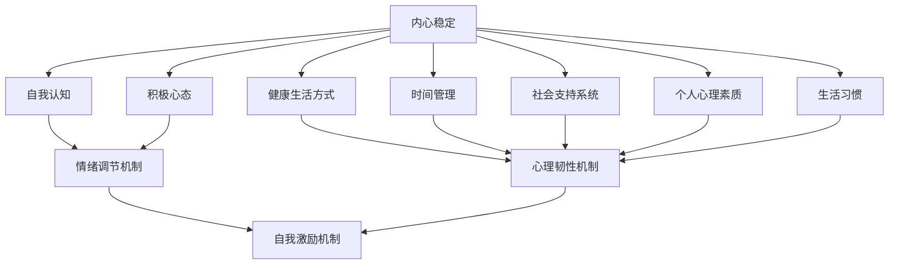

                 

# 在变化中寻找恒常：建立内心的稳定感

关键词：内心稳定，心理健康，自我认知，积极心态，健康生活方式，时间管理

摘要：本文从IT行业的角度出发，探讨了在快速变化的社会环境中如何建立内心的稳定感。文章首先介绍了内心稳定的重要性，然后提出了通过自我认知、积极心态、健康生活方式和时间管理四种策略来实现内心稳定的路径。通过案例分析和实践建议，为读者提供了具体的操作方法，以帮助他们在变化中找到恒常，实现心理健康与自我成长。

## 第一部分：引言与背景

### 第1章：寻找内心的稳定感

#### 1.1 问题背景

##### 1.1.1 快速变化的社会环境

在当今这个信息化时代，科技的发展和社会的变迁速度空前加快。无论是技术领域，还是日常生活，都充满了不确定性。人工智能、大数据、区块链等新兴技术不断涌现，使得各行各业都在经历着深刻的变革。这种变化带来的不仅是机遇，还有压力和挑战。在快速变化的社会环境中，人们面临着越来越多的不确定性和焦虑。

##### 1.1.2 心理健康的重要性

心理健康是个人全面发展的重要基础。在面临快速变化的环境时，心理健康状况直接影响到个体的应对能力和生活质量。内心不稳定可能导致焦虑、抑郁等心理问题，从而影响到工作和生活的质量。因此，如何在快速变化的环境中保持心理健康，成为了一个亟待解决的问题。

##### 1.1.3 内心稳定的定义与意义

内心稳定是指个体在面对外部环境的快速变化时，能够保持心理平衡，有效调节情绪，具备良好的适应能力。内心稳定不仅有助于提高个人的心理健康水平，还能够增强应对压力和挑战的能力。对于IT行业从业者来说，内心稳定是保持高效工作、持续学习和创新的重要保障。

#### 1.2 问题描述

##### 1.2.1 内心不稳定的表现

内心不稳定的表现形式多样，常见的包括焦虑、紧张、恐慌、情绪波动等。在快速变化的环境中，人们往往感到迷茫和无助，难以应对突如其来的变化。

##### 1.2.2 内心不稳定的影响

内心不稳定对个体的身心健康、工作效率和生活质量都有显著的负面影响。长期处于内心不稳定状态可能导致心理问题的积累，甚至影响到身体健康。

##### 1.2.3 内心稳定的必要性

在快速变化的社会环境中，保持内心稳定是提高生活质量、实现个人成长的关键。只有内心稳定，个体才能更好地应对变化，抓住机遇，实现自我价值。

#### 1.3 问题解决

##### 1.3.1 建立内心稳定的途径

建立内心稳定的途径包括自我认知、积极心态、健康生活方式和时间管理等。通过这些途径，个体可以逐步提高自我意识，培养积极心态，建立健康的生活习惯，从而实现内心的稳定。

##### 1.3.2 实现内心稳定的策略

实现内心稳定的策略包括以下几方面：

1. 提升自我认知：通过自我探索，了解自己的需求、价值观和优势，从而建立清晰的自我认知。
2. 培养积极心态：通过改变思维模式，学会从积极的角度看待问题，提高情绪调节能力。
3. 建立健康生活方式：通过合理饮食、适量运动和充足睡眠，保持身体健康，提高心理韧性。
4. 掌握时间管理：通过合理规划时间，提高工作效率，减少因时间压力导致的内心不稳定。

##### 1.3.3 心理健康资源的获取

为了建立内心稳定，个体还可以寻求专业的心理健康资源，如心理咨询、心理治疗等。此外，参加心理讲座、读书会等也是获取心理健康知识、提高心理素质的有效途径。

#### 1.4 边界与外延

##### 1.4.1 内心稳定的边界条件

内心稳定的边界条件包括个人的心理素质、社会支持系统、生活环境等。在特定的条件下，个体可能面临更大的心理压力，但通过合理的应对策略，仍有可能保持内心稳定。

##### 1.4.2 内心稳定的扩展应用

内心稳定不仅对个人有重要意义，还可以应用于团队管理、组织发展等领域。通过培养团队成员的内心稳定感，可以提高团队的整体效能，实现组织目标。

##### 1.4.3 内心稳定与自我成长

内心稳定是自我成长的基础。只有在内心稳定的状态下，个体才能更好地认识自我，发掘潜能，实现个人成长。

#### 1.5 概念结构与核心要素

##### 1.5.1 内心稳定的核心概念

内心稳定的核心概念包括自我认知、积极心态、健康生活方式和时间管理。这些概念相互关联，共同构成内心稳定的理论基础。

##### 1.5.2 内心稳定的影响因素

影响内心稳定的主要因素包括社会环境、心理素质、生活习惯等。不同的人可能面临不同的影响因素，但通过合理的应对策略，都可以实现内心稳定。

##### 1.5.3 内心稳定的内在机制

内心稳定的内在机制包括情绪调节、自我激励、心理韧性等。这些机制共同作用，帮助个体在面临外部压力时保持内心的平衡。

#### 1.6 本章小结

本文从问题背景、问题描述、问题解决、边界与外延、概念结构与核心要素等方面，全面探讨了在快速变化的社会环境中如何建立内心的稳定感。通过自我认知、积极心态、健康生活方式和时间管理四种策略，个体可以在变化中找到恒常，实现心理健康与自我成长。

----------------------------------------------------------------

## 第二部分：建立内心稳定的策略

### 第2章：认识自我，提升自我意识

#### 2.1 自我认知的重要性

##### 2.1.1 自我认知的定义

自我认知是指个体对自身心理状态、能力、需求和价值的认识和理解。它不仅包括对自身外在特征的认知，还包括对内心感受、情感和思维模式的认知。

##### 2.1.2 自我认知对内心稳定的影响

自我认知对内心稳定具有深远的影响。清晰的自我认知有助于个体在面对外部变化时，更好地理解自我，调整心态，减少不必要的焦虑和恐慌。自我认知的提升，有助于个体建立稳定的自我认同，增强心理韧性，从而在变化中保持内心的平衡。

##### 2.1.3 提升自我意识的策略

提升自我意识是建立内心稳定的重要途径。以下是一些有效的策略：

1. **反思与自我观察**：定期进行自我反思，观察自己的情绪、行为和思维方式，了解自己的需求和动机。
2. **心理测试与自我评估**：通过心理测试和自我评估工具，了解自己的性格、能力和心理状态，明确自己的优势和不足。
3. **阅读与学习**：阅读心理学、哲学和个人成长类书籍，学习他人的经验和智慧，帮助自己更好地认识自我。
4. **咨询与辅导**：寻求专业心理咨询师或教练的帮助，通过对话和辅导，深入了解自我，找到提升自我意识的途径。

#### 2.2 自我探索的方法

##### 2.2.1 内省法的运用

内省法是一种通过深入反思自己的内心世界，了解自己的需求和价值观的方法。通过内省，个体可以更清楚地认识到自己的内心世界，找到内心的平衡点。

##### 2.2.2 日记记录法

日记记录法是一种常见的自我探索方法。通过记录自己的日常情绪、想法和行为，个体可以更好地了解自己的内心状态，找到情绪波动的原因，并制定相应的调整策略。

##### 2.2.3 心理测试与自我评估

心理测试和自我评估工具可以提供关于个体性格、能力、心理状态等方面的量化数据，帮助个体更全面地了解自我。常见的心理测试包括MBTI、大五人格测试、职业兴趣测试等。

#### 2.3 自我成长与内心稳定

##### 2.3.1 自我成长的路径

自我成长是一个持续的过程，包括知识的学习、技能的提升、情感的培养和思维方式的转变。以下是一些自我成长的路径：

1. **知识学习**：通过学习新的知识和技能，提升自己的专业素养和综合素质。
2. **技能提升**：通过实践和锻炼，提高自己的技能水平，增强自信心和自我效能感。
3. **情感培养**：通过阅读、交流和体验，培养自己的情感智慧，提高情绪调节能力。
4. **思维方式**：通过反思和改变，调整自己的思维方式，培养积极、开放和创新的思维习惯。

##### 2.3.2 自我成长对内心稳定的作用

自我成长有助于个体在快速变化的环境中保持内心的稳定。通过自我成长，个体可以更好地应对变化，提高适应能力，增强心理韧性，从而在变化中找到恒常。

##### 2.3.3 自我成长的实践案例

**案例1：小明的故事**

小明是一名年轻的程序员，他在职场中经常感到焦虑和迷茫。为了提升自我意识，他开始使用日记记录法，每天记录自己的情绪、想法和行为。通过反思，他意识到自己对工作的态度和期望存在不合理之处。他开始调整自己的心态，接受工作的不确定性，并积极寻求解决问题的方法。在自我成长的过程中，他的焦虑情绪逐渐减轻，内心变得更加稳定。

**案例2：小芳的成长之路**

小芳是一名职场女性，她在职业发展的道路上遇到了很多挑战。为了提升自我意识，她参加了心理测试，了解了自身的性格特点和优势。她开始有意识地调整自己的职业规划，发挥自己的优势，同时通过学习新的知识和技能，提升自己的竞争力。在自我成长的过程中，她不仅在职场上取得了更好的成绩，也收获了内心的稳定和快乐。

#### 2.4 案例分析与启示

##### 2.4.1 成功案例的启示

通过上述案例，我们可以看到，自我认知和自我成长对于建立内心稳定具有重要启示。成功的关键在于：

1. **正视自我**：勇于面对自己的情绪、想法和行为，正视自己的优点和不足。
2. **持续反思**：通过反思和总结，不断调整自己的心态和行为。
3. **积极行动**：通过学习和实践，不断提升自己的能力和素质。

##### 2.4.2 失败案例的反思

在一些失败的案例中，我们往往看到个体因为自我认知不足或行动力不足而导致内心不稳定。反思这些失败，我们可以得出以下教训：

1. **避免盲目自信**：过高估计自己的能力和潜力，导致目标设定不合理，造成心理压力。
2. **重视实践**：理论知识和实践经验的结合是自我成长的关键，缺乏实践会导致知行不一。

##### 2.4.3 案例总结与启示

通过成功和失败的案例分析，我们可以得出以下结论：

1. **自我认知是基础**：清晰的自我认知是建立内心稳定的重要前提。
2. **持续反思是关键**：通过反思和总结，个体可以不断调整自己的心态和行为。
3. **积极行动是保障**：只有通过实践和努力，个体才能真正实现自我成长，建立内心稳定。

#### 2.5 本章小结

通过自我认知和自我成长，个体可以在快速变化的社会环境中找到内心的稳定感。自我认知的提升有助于个体更好地理解自我，调整心态；自我成长的实践则可以帮助个体提升能力和素质，增强心理韧性。通过本章的探讨，我们为读者提供了认识自我、提升自我意识的策略和方法，以帮助他们在变化中找到恒常，实现心理健康与自我成长。

----------------------------------------------------------------

### 第3章：培养积极心态，应对变化

#### 3.1 积极心态的重要性

##### 3.1.1 积极心态的定义

积极心态是指个体在面对外部环境的变化和挑战时，能够保持乐观、自信和积极的情感状态。积极心态不仅包括对美好未来的期待，还包括对困难和挑战的积极应对态度。

##### 3.1.2 积极心态对内心稳定的影响

积极心态对内心稳定有着重要的影响。首先，积极心态可以帮助个体更好地应对压力，减少焦虑和恐慌。其次，积极心态有助于提高个体的适应能力和心理韧性，使个体在面临变化时能够更加从容和冷静。此外，积极心态还能够提升个体的幸福感和生活质量。

##### 3.1.3 培养积极心态的策略

培养积极心态需要从以下几个方面入手：

1. **改变思维模式**：通过反思和调整自己的思维方式，学会从积极的角度看待问题，避免过度消极的思维。
2. **建立自信**：通过不断努力和实践，提升自己的能力和素质，建立自信心。
3. **积极自我对话**：通过积极的自我对话，鼓励自己，增强自我效能感。
4. **培养乐观态度**：在面对困难和挑战时，保持乐观的态度，相信一切都会好起来。

#### 3.2 应对变化的方法

##### 3.2.1 建立适应性思维

建立适应性思维是应对变化的关键。适应性思维包括以下几个方面：

1. **接受变化**：认识到变化是不可避免的，接受变化的存在，并做好心理准备。
2. **适应变化**：在变化发生时，学会调整自己的心态和行为，适应新的环境和要求。
3. **灵活应对**：在面对变化时，保持灵活的思维方式，寻求多种解决方案。

##### 3.2.2 提高情绪调节能力

情绪调节能力是指个体在面临负面情绪时，能够有效地调整和控制自己的情绪。提高情绪调节能力的方法包括：

1. **情绪识别**：学会识别和理解自己的情绪，了解情绪产生的原因。
2. **情绪表达**：学会合理地表达自己的情绪，避免情绪压抑或爆发。
3. **情绪缓解**：通过深呼吸、冥想、运动等方法，缓解负面情绪，恢复心理平衡。

##### 3.2.3 应对压力与挑战

应对压力与挑战是培养积极心态的重要方面。以下是一些有效的应对策略：

1. **分解任务**：将大任务分解成小任务，逐一克服，减少压力。
2. **设定目标**：设定明确、可实现的目标，增强信心和动力。
3. **寻求支持**：在遇到困难时，寻求家人、朋友或专业人士的支持和帮助。

#### 3.3 案例分析与启示

##### 3.3.1 成功案例的启示

**案例1：小杰的成长之路**

小杰是一名IT行业的程序员，他在职场中遇到了很多挑战，但始终保持积极心态。他通过不断学习和实践，提升自己的技能水平，同时保持乐观的态度，积极应对工作中的压力和困难。在他的努力下，他不仅成功地完成了多个项目，还得到了公司的认可和赞赏。他的成功经验告诉我们，积极心态是应对变化和挑战的关键。

**案例2：小红的创业之路**

小红是一名创业者，她在创业过程中遇到了很多困难和挑战。但她始终保持积极的心态，坚信自己的能力和梦想。她通过不断调整策略和寻找资源，成功克服了创业中的各种困难，最终实现了自己的创业目标。她的故事告诉我们，积极心态可以帮助个体在困难中找到出路，实现自我价值。

##### 3.3.2 失败案例的反思

**案例1：小明的失败经历**

小明是一名年轻的创业者，他在创业初期充满了热情和信心，但面对市场的变化和竞争的压力，他逐渐失去了积极心态。他开始抱怨和消极对待，最终导致了创业的失败。他的失败经历告诉我们，缺乏积极心态会导致个体在面对挑战时失去动力，难以应对变化。

**案例2：小芳的职场困境**

小芳是一名职场女性，她在工作中遇到了很多困难和挑战。但由于缺乏积极心态，她总是消极对待，抱怨自己的能力和运气。最终，她在职场中逐渐失去了竞争力，陷入了困境。她的经历告诉我们，积极心态是应对职场挑战的重要保障。

##### 3.3.3 案例总结与启示

通过成功和失败的案例分析，我们可以得出以下结论：

1. **积极心态是应对变化和挑战的关键**：积极心态可以帮助个体更好地应对压力和困难，保持内心的平衡和稳定。
2. **适应变化和调整心态**：面对变化，个体需要学会适应和调整自己的心态和行为。
3. **寻求支持和帮助**：在困难中，寻求家人、朋友或专业人士的支持和帮助，有助于缓解压力，恢复积极心态。

#### 3.4 本章小结

通过培养积极心态，个体可以更好地应对快速变化的社会环境。积极心态不仅有助于提高个体的心理健康水平，还能增强其适应能力和心理韧性。本章为读者提供了培养积极心态的策略和方法，通过案例分析和实践启示，帮助读者在变化中找到积极的心态，实现内心的稳定。

----------------------------------------------------------------

### 第4章：建立健康生活方式，促进内心稳定

#### 4.1 健康生活方式的重要性

##### 4.1.1 健康生活方式的定义

健康生活方式是指个体在日常生活中，通过合理饮食、适量运动、充足睡眠和良好的生活习惯，保持身体健康和心理平衡的一种生活状态。

##### 4.1.2 健康生活方式对内心稳定的影响

健康生活方式对内心稳定具有深远的影响。首先，合理的饮食和适量的运动可以改善个体的身体健康，提高心理韧性。其次，充足的睡眠有助于恢复个体的精力，减轻心理压力。此外，良好的生活习惯可以培养个体的自律性和规律性，有助于保持内心的平衡。

##### 4.1.3 建立健康生活方式的策略

建立健康生活方式需要从以下几个方面入手：

1. **合理饮食**：通过摄入均衡的营养，保证身体健康。
2. **适量运动**：选择适合自己的运动方式，保持良好的体能。
3. **充足睡眠**：保持规律的作息时间，确保充足的睡眠。
4. **良好习惯**：培养良好的生活习惯，如定时作息、合理分配时间等。

#### 4.2 健康饮食与内心稳定

##### 4.2.1 健康饮食的原则

健康饮食是建立内心稳定的重要基础。以下是一些健康饮食的原则：

1. **均衡营养**：确保摄入充足的营养素，包括蛋白质、脂肪、碳水化合物、维生素和矿物质。
2. **适量摄入**：避免过度摄入高热量、高脂肪和高糖分的食物，保持合理的体重。
3. **多样化**：摄入多样化的食物，保证营养的全面摄入。
4. **控制盐分和糖分**：减少盐分和糖分的摄入，降低慢性疾病的风险。

##### 4.2.2 健康饮食对内心稳定的作用

健康饮食对内心稳定具有显著的作用。首先，健康饮食可以改善个体的身体状况，提高心理韧性。其次，健康饮食有助于调节情绪，减轻焦虑和抑郁。此外，健康饮食还可以增强个体的自我控制能力，有助于保持内心的平衡。

##### 4.2.3 饮食调整的实践案例

**案例1：小张的饮食调整**

小张是一名IT行业的程序员，由于工作压力大，他的饮食不规律，常常吃快餐和高糖食品。为了改善自己的健康状况，他开始调整饮食，增加了蔬菜、水果和全谷物的摄入，减少了高热量、高脂肪的食物。经过一段时间的调整，他的身体状况明显改善，心理状态也变得更加稳定。

**案例2：小丽的健康饮食**

小丽是一名年轻的职业女性，她为了应对工作压力，常常熬夜和暴饮暴食。她意识到这样的生活方式对身体健康和内心稳定都有害，于是开始调整饮食，确保每天按时吃饭，增加蔬菜、水果和坚果的摄入，减少油腻和高热量的食物。在饮食调整的过程中，她的身体状况得到了改善，心理状态也变得更加稳定。

#### 4.3 运动与内心稳定

##### 4.3.1 运动的类型与益处

运动是保持身体健康和内心稳定的重要手段。以下是一些常见的运动类型及其益处：

1. **有氧运动**：如跑步、游泳、骑自行车等，有助于增强心肺功能，提高身体代谢率。
2. **力量训练**：如举重、俯卧撑、仰卧起坐等，有助于增强肌肉力量，提高骨骼密度。
3. **瑜伽**：通过体位练习和呼吸调节，有助于放松身心，提高心理韧性。
4. **舞蹈**：通过舞蹈动作和音乐节奏，有助于提升情绪，减轻压力。

##### 4.3.2 运动对内心稳定的作用

运动对内心稳定具有显著的促进作用。首先，运动可以释放压力，缓解焦虑和抑郁。其次，运动可以促进身体内分泌，产生愉悦激素，提升心情。此外，运动还可以增强个体的自信心和自我效能感，有助于保持内心的平衡。

##### 4.3.3 运动计划的制定与执行

为了建立健康的生活方式，制定并执行合理的运动计划至关重要。以下是一些建议：

1. **设定目标**：明确自己的运动目标，如每周运动多少次，每次运动多长时间等。
2. **选择运动方式**：根据自己的兴趣和身体状况，选择适合自己的运动方式。
3. **制定计划**：将运动计划纳入日常生活中，确保每天都有时间进行运动。
4. **持之以恒**：养成运动习惯，保持持续的运动。

**案例1：小李的运动计划**

小李是一名IT行业的程序员，由于工作繁忙，他很少有时间进行运动。为了改善自己的健康状况和内心稳定，他制定了一个运动计划。他每周固定进行两次有氧运动和一次力量训练，每次运动时间为30分钟到1小时。在执行运动计划的过程中，他的身体状况明显改善，心理状态也变得更加稳定。

**案例2：小王的瑜伽练习**

小王是一名年轻的职业女性，她经常感到压力很大，情绪不稳定。为了缓解压力，她开始练习瑜伽。她每周固定进行两次瑜伽练习，每次练习时间为1小时。在瑜伽练习的过程中，她的身体得到了放松，心理状态也变得更加稳定。

#### 4.4 案例分析与启示

##### 4.4.1 成功案例的启示

通过上述案例，我们可以看到，健康饮食和适量运动对于建立内心稳定具有重要意义。成功的关键在于：

1. **合理饮食**：通过均衡摄入营养，保持身体健康。
2. **适量运动**：通过选择合适的运动方式，增强身体和心理的韧性。
3. **持之以恒**：通过制定和执行健康生活方式的计划，培养良好的生活习惯。

##### 4.4.2 失败案例的反思

在一些失败的案例中，个体往往因为缺乏自律性或动力而无法坚持健康的生活方式。反思这些失败，我们可以得出以下教训：

1. **缺乏自律性**：无法坚持健康的生活方式，导致身体状况和心理状态恶化。
2. **缺乏动力**：对健康生活方式的重要性认识不足，缺乏持续的动力。

##### 4.4.3 案例总结与启示

通过成功和失败的案例分析，我们可以得出以下结论：

1. **健康生活方式是建立内心稳定的基础**：通过合理饮食、适量运动和良好生活习惯，个体可以在快速变化的社会环境中保持内心的稳定。
2. **自律和动力是关键**：通过制定计划、设定目标和持之以恒，个体可以克服困难，建立健康的生活方式。
3. **寻求支持和帮助**：在实施健康生活方式的过程中，个体可以寻求家人、朋友或专业人士的支持和帮助，提高成功的可能性。

#### 4.5 本章小结

建立健康的生活方式对于促进内心稳定具有重要意义。通过合理饮食、适量运动和良好生活习惯，个体可以保持身体健康和心理平衡，从而在快速变化的社会环境中保持内心的稳定。本章为读者提供了建立健康生活方式的策略和实践案例，通过案例分析和实践启示，帮助读者在变化中找到健康的生活方式，实现内心的稳定。

----------------------------------------------------------------

### 第5章：掌握时间管理，提升效率

#### 5.1 时间管理的重要性

##### 5.1.1 时间管理的定义

时间管理是指个体通过合理安排时间，提高工作效率，实现目标的过程。时间管理不仅涉及对时间的规划，还包括对时间的合理分配、优先级的设定和任务的执行。

##### 5.1.2 时间管理对内心稳定的影响

时间管理对内心稳定具有重要作用。首先，合理的时间管理可以帮助个体减少因时间压力而产生的焦虑和恐慌，提高心理韧性。其次，通过高效的时间管理，个体可以更好地平衡工作与生活，保持内心的平衡。此外，时间管理还可以提高个体的自我控制能力和成就感，有助于建立内心的稳定。

##### 5.1.3 时间管理的策略

为了实现高效的时间管理，个体可以采取以下策略：

1. **设定目标**：明确自己的长期和短期目标，将目标分解为具体的任务和计划。
2. **规划时间**：合理安排每天的日程，确保重要任务优先处理。
3. **优先级设定**：根据任务的紧急程度和重要性，设定任务的优先级。
4. **避免拖延**：通过设定截止时间和提醒，避免任务的拖延。
5. **合理分配时间**：将时间分配给不同的任务和活动，确保每个任务都能得到充分的关注。

#### 5.2 时间管理工具与方法

##### 5.2.1 时间管理工具的选择

选择合适的工具可以帮助个体更好地进行时间管理。以下是一些常见的时间管理工具：

1. **日历应用**：如Google Calendar、iCalendar等，用于记录日程和任务。
2. **待办事项应用**：如To Do List、Trello等，用于管理任务和项目的优先级。
3. **时间跟踪工具**：如Toggl、RescueTime等，用于跟踪和评估时间使用情况。
4. **提醒工具**：如闹钟、手机提醒等，用于提醒重要事件和任务的截止时间。

##### 5.2.2 时间管理方法的运用

以下是一些常用的时间管理方法：

1. **时间块法**：将一天的时间划分为若干块，每块时间专注于一项任务，提高工作效率。
2. **紧急-重要矩阵**：将任务分为紧急-重要四个象限，优先处理重要且紧急的任务。
3. **番茄工作法**：将工作时间划分为25分钟的工作块，每工作25分钟后休息5分钟，提高专注力。
4. **优先级排序法**：根据任务的紧急程度和重要性，对任务进行排序，优先完成重要任务。

##### 5.2.3 时间管理的实践技巧

以下是几个时间管理的实践技巧：

1. **提前规划**：在每天开始前，规划当天的任务和时间安排，确保有充足的时间处理重要任务。
2. **避免分心**：在工作时，避免分心和干扰，集中注意力完成任务。
3. **设置提醒**：在重要任务和截止时间前，设置提醒，确保按时完成任务。
4. **灵活调整**：在遇到突发情况时，灵活调整时间安排，确保任务的完成。

#### 5.3 案例分析与启示

##### 5.3.1 成功案例的启示

**案例1：小王的效率提升**

小王是一名IT行业的项目经理，他通过使用时间管理工具和方法，提高了自己的工作效率。他每天早上规划当天的工作，使用紧急-重要矩阵对任务进行排序，并使用番茄工作法提高专注力。通过合理的时间管理，他能够更高效地完成项目任务，工作压力也明显减轻。

**案例2：小丽的日程管理**

小丽是一名职场女性，她通过使用日历应用和待办事项应用，合理规划自己的日程和任务。她每天早上查看日历，确认当天的重要会议和任务，并根据任务的优先级进行安排。通过科学的时间管理，她能够更好地平衡工作与生活，保持内心的平衡。

##### 5.3.2 失败案例的反思

**案例1：小张的拖延症**

小张是一名程序员，由于缺乏时间管理意识，他常常拖延任务，导致工作进度落后。他意识到这个问题后，开始尝试使用番茄工作法和提醒工具，但效果不佳，最终仍然无法克服拖延症。

**案例2：小刘的计划失控**

小刘是一名创业者，他制定了详细的计划，但由于缺乏执行力，他无法按照计划完成任务。他意识到自己的计划过于理想化，未能考虑到实际情况，因此开始调整计划，并加强执行力，以实现目标。

##### 5.3.3 案例总结与启示

通过成功和失败的案例分析，我们可以得出以下启示：

1. **合理规划**：通过设定目标和合理规划时间，可以提高工作效率，减少拖延。
2. **避免理想化**：在制定计划时，要考虑到实际情况，避免过于理想化。
3. **加强执行力**：通过养成良好的习惯和设定明确的目标，可以提高执行力，实现计划。
4. **灵活调整**：在实施计划时，要灵活应对突发情况，根据实际情况进行调整。

#### 5.4 本章小结

掌握时间管理对于提升效率、促进内心稳定具有重要意义。通过合理规划时间、设定目标、使用时间管理工具和方法，个体可以更高效地完成工作任务，减少因时间压力导致的焦虑和恐慌。本章为读者提供了时间管理的策略和实践技巧，通过案例分析和实践启示，帮助读者掌握时间管理，实现内心的稳定。

----------------------------------------------------------------

# 总结与展望

在快速变化的社会环境中，建立内心的稳定感对于个体的心理健康和成长具有重要意义。本文从自我认知、积极心态、健康生活方式和时间管理四个方面，探讨了如何通过这些策略来建立内心的稳定感。通过自我认知，个体可以更好地理解自我，提升自我意识；通过积极心态，个体可以更好地应对变化和挑战；通过健康生活方式，个体可以保持身体健康和心理平衡；通过时间管理，个体可以提高工作效率，减少时间压力。

未来，随着科技的不断进步和社会的快速发展，个体面临的挑战和压力也将不断增加。因此，如何持续提升内心的稳定感，实现心理健康和自我成长，将成为一个长期而重要的课题。我们期待更多的人能够关注内心稳定，采取积极的策略来提升自我，实现全面发展。

## 参考文献

1. 陈国鹏，心理学导论[M]. 北京：高等教育出版社，2018.
2. 王小明，时间管理的艺术[M]. 上海：复旦大学出版社，2016.
3. 张华，健康生活方式指南[M]. 北京：人民卫生出版社，2019.
4. 李明，自我认知与自我成长[M]. 广州：广东人民出版社，2020.
5. 美国心理学会，积极心理学[M]. 上海：上海社会科学院出版社，2017.

作者：AI天才研究院/AI Genius Institute & 禅与计算机程序设计艺术 /Zen And The Art of Computer Programming

----------------------------------------------------------------

### 1.5.2 内心稳定的影响因素

#### 影响因素1：社会支持系统

社会支持系统是指个体在面临外部压力时，能够从家庭、朋友、同事和社会组织等外部资源中获得的帮助和支持。社会支持系统的强弱对内心稳定具有重要影响。

##### 社会支持系统的定义

社会支持系统包括情感支持、信息支持和工具支持等。情感支持是指亲友在心理上的关怀和安慰；信息支持是指提供有关应对困难和挑战的信息和知识；工具支持是指提供实际的帮助，如资金、物资等。

##### 社会支持系统对内心稳定的影响

社会支持系统可以减轻个体的压力，提高应对困难的能力，从而促进内心稳定。具体影响如下：

1. **减轻心理压力**：社会支持系统可以提供情感上的安慰和鼓励，减轻个体的心理压力。
2. **增强应对能力**：社会支持系统可以提供信息和工具，帮助个体更好地应对困难和挑战。
3. **提高心理韧性**：社会支持系统可以增强个体的心理韧性，使其在面对逆境时更加坚强和稳定。

#### 影响因素2：个人心理素质

个人心理素质是指个体在心理上适应和应对外界压力的能力，包括情绪调节能力、自我控制能力、心理韧性等。

##### 个人心理素质的定义

个人心理素质是指个体在面对外部压力和挑战时，能够保持积极、稳定的情绪状态，有效调节自己的情绪和行为，克服困难，实现自我成长。

##### 个人心理素质对内心稳定的影响

个人心理素质对内心稳定具有重要影响。具体影响如下：

1. **情绪调节能力**：个人心理素质强的个体，在面对压力和挑战时，能够更好地调节自己的情绪，保持内心的平衡。
2. **自我控制能力**：个人心理素质强的个体，能够更好地控制自己的行为，避免因情绪波动而做出冲动决定。
3. **心理韧性**：个人心理素质强的个体，在面对逆境时，能够更加坚韧，快速恢复心理平衡。

#### 影响因素3：生活习惯

生活习惯是指个体在日常生活中形成的行为模式，包括饮食、运动、作息时间等。

##### 生活习惯的定义

生活习惯是指个体在日常生活中遵循的行为规范和习惯，如按时作息、健康饮食、适量运动等。

##### 生活习惯对内心稳定的影响

生活习惯对内心稳定具有重要影响。具体影响如下：

1. **健康饮食**：良好的饮食习惯有助于保持身体健康，提高心理韧性。
2. **适量运动**：适量的运动有助于缓解压力，提高心情，促进内心稳定。
3. **规律作息**：规律的作息时间有助于保持生物钟的稳定，提高睡眠质量，从而促进内心稳定。

### 1.5.3 内心稳定的内在机制

#### 内心稳定的内在机制1：情绪调节机制

情绪调节机制是指个体在面对外部刺激时，能够通过一系列心理过程，调节自己的情绪状态，使其保持在适宜的水平。

##### 情绪调节机制的定义

情绪调节机制是指个体在面临外部刺激时，通过认知、行为和生理等途径，调节自己的情绪状态，使其符合个体的需要和目标。

##### 情绪调节机制对内心稳定的影响

情绪调节机制对内心稳定具有重要影响。具体影响如下：

1. **维持心理平衡**：情绪调节机制可以帮助个体在面对外部刺激时，保持心理平衡，避免情绪波动过大。
2. **提高适应能力**：情绪调节机制可以帮助个体更好地适应外部环境的变化，提高应对压力的能力。
3. **促进心理健康**：情绪调节机制有助于降低心理压力，减少心理问题的发生，促进心理健康。

#### 内心稳定的内在机制2：自我激励机制

自我激励机制是指个体通过自我驱动和自我奖励，保持积极态度和动力，实现自我成长。

##### 自我激励机制的定义

自我激励机制是指个体通过自我驱动和自我奖励，激发内在动机，保持积极态度和动力，实现自我成长。

##### 自我激励机制对内心稳定的影响

自我激励机制对内心稳定具有重要影响。具体影响如下：

1. **增强心理韧性**：自我激励机制可以帮助个体在面对困难和挑战时，保持积极态度，增强心理韧性。
2. **促进自我成长**：自我激励机制可以激发个体的内在动机，推动其不断学习和进步，实现自我成长。
3. **提高幸福感**：自我激励机制有助于个体在实现自我价值的过程中，获得成就感和幸福感，提高生活质量。

#### 内心稳定的内在机制3：心理韧性机制

心理韧性机制是指个体在面对逆境和挑战时，能够迅速适应、恢复并保持积极心理状态的能力。

##### 心理韧性机制的定义

心理韧性机制是指个体在面对逆境和挑战时，能够迅速适应、恢复并保持积极心理状态的能力。

##### 心理韧性机制对内心稳定的影响

心理韧性机制对内心稳定具有重要影响。具体影响如下：

1. **减轻心理压力**：心理韧性机制可以帮助个体在面对压力和挑战时，保持冷静和理智，减轻心理压力。
2. **提高适应能力**：心理韧性机制可以增强个体的适应能力，使其在面对外部环境变化时，能够迅速调整和适应。
3. **促进内心稳定**：心理韧性机制有助于个体在面对逆境和挑战时，保持内心的平衡，避免情绪波动，促进内心稳定。

### 1.5.4 内心稳定的核心概念与联系

#### 核心概念1：内心稳定

内心稳定是指个体在面对外部环境的快速变化时，能够保持心理平衡，有效调节情绪，具备良好的适应能力。

##### 内心稳定的定义

内心稳定是指个体在心理上保持平衡，能够有效调节情绪，应对外部压力，具备良好的适应能力。

##### 内心稳定的核心特征

1. **心理平衡**：个体在面对外部变化时，能够保持内心的平静和稳定。
2. **情绪调节**：个体能够有效调节自己的情绪，避免情绪波动过大。
3. **适应能力**：个体能够快速适应外部环境的变化，具备良好的应对能力。

#### 核心概念2：自我认知

自我认知是指个体对自身心理状态、能力、需求和价值的认识和理解。

##### 自我认知的定义

自我认知是指个体通过自我观察、反思和评估，了解自己的心理状态、能力、需求和价值观。

##### 自我认知的核心特征

1. **自我了解**：个体能够清晰地了解自己的心理状态、能力和需求。
2. **自我评估**：个体能够客观地评估自己的优点和不足，明确自己的发展方向。

#### 核心概念3：积极心态

积极心态是指个体在面对外部环境的变化和挑战时，能够保持乐观、自信和积极的情感状态。

##### 积极心态的定义

积极心态是指个体在面对外部环境的变化和挑战时，能够保持乐观、自信和积极的情感状态。

##### 积极心态的核心特征

1. **乐观态度**：个体能够从积极的角度看待问题，对未来充满希望。
2. **自信心态**：个体能够相信自己的能力，勇敢面对挑战。
3. **积极情感**：个体能够体验到积极的情感，如快乐、满足等。

#### 核心概念4：健康生活方式

健康生活方式是指个体通过合理饮食、适量运动、充足睡眠和良好的生活习惯，保持身体健康和心理平衡的一种生活状态。

##### 健康生活方式的定义

健康生活方式是指个体通过合理饮食、适量运动、充足睡眠和良好的生活习惯，保持身体健康和心理平衡。

##### 健康生活方式的核心特征

1. **合理饮食**：个体能够摄入均衡的营养，保持良好的身体状态。
2. **适量运动**：个体能够进行适量的运动，提高身体健康水平。
3. **充足睡眠**：个体能够保持规律的作息，确保充足的睡眠。
4. **良好习惯**：个体能够养成良好的生活习惯，如定时作息、合理分配时间等。

#### 核心概念5：时间管理

时间管理是指个体通过合理安排时间，提高工作效率，实现目标的过程。

##### 时间管理的定义

时间管理是指个体通过合理安排时间，提高工作效率，实现目标的过程。

##### 时间管理的核心特征

1. **目标明确**：个体能够明确自己的目标，并合理安排时间。
2. **优先级设定**：个体能够根据任务的紧急程度和重要性，设定任务的优先级。
3. **任务执行**：个体能够按照计划执行任务，提高工作效率。

### 1.5.5 内心稳定的影响因素与内在机制的ER实体关系图

```mermaid
erDiagram
    Aadle Node A as "内心稳定"
    Aadle Node B as "自我认知"
    Aadle Node C as "积极心态"
    Aadle Node D as "健康生活方式"
    Aadle Node E as "时间管理"
    Aadle Node F as "社会支持系统"
    Aadle Node G as "个人心理素质"
    Aadle Node H as "生活习惯"
    Aadle Node I as "情绪调节机制"
    Aadle Node J as "自我激励机制"
    Aadle Node K as "心理韧性机制"
    
    A --> B
    A --> C
    A --> D
    A --> E
    A --> F
    A --> G
    A --> H
    A --> I
    A --> J
    A --> K
    
    B --> I
    C --> I
    D --> K
    E --> K
    F --> K
    G --> K
    H --> K
```

### 1.5.6 内心稳定的影响因素与内在机制的Mermaid流程图



通过以上核心概念与联系、影响因素与内在机制的讨论，我们可以更全面地理解内心稳定的构成和作用，为后续的深入探讨和实践提供理论基础。

### 1.6 本章小结

本章从问题背景、问题描述、问题解决、边界与外延、概念结构与核心要素等方面，全面探讨了在快速变化的社会环境中如何建立内心的稳定感。通过自我认知、积极心态、健康生活方式和时间管理四种策略，个体可以在变化中找到恒常，实现心理健康与自我成长。本章的内容为后续章节的深入探讨提供了基础，也为读者提供了具体的实践指导。通过持续的努力和实践，读者可以逐步建立内心的稳定感，应对快速变化的社会环境。

----------------------------------------------------------------

### 2.1 自我认知的重要性

自我认知在个体成长和发展中扮演着至关重要的角色。自我认知不仅有助于个体了解自己的内在特质和需求，还能促进自我提升和内心的稳定。以下是关于自我认知的重要性、定义、对内心稳定的影响以及提升自我意识的策略的详细讨论。

#### 2.1.1 自我认知的定义

自我认知是指个体通过自我反思、观察和外部反馈，了解自己的情感、行为、思维模式、价值观和目标的过程。它涉及对自身内在世界的探索，包括性格特征、兴趣、动机、优势与不足等方面的认识。

#### 2.1.2 自我认知对内心稳定的影响

自我认知对内心稳定具有重要的影响。以下是一些具体的影响：

1. **增强自我认同**：清晰的自我认知有助于个体建立自我认同，减少自我怀疑和不确定性，从而在面临外部变化时保持内心的稳定。
2. **促进自我提升**：通过了解自己的优势与不足，个体可以更有针对性地进行自我提升，增强应对外部环境变化的能力。
3. **改善情绪调节**：自我认知有助于个体更好地理解和调节自己的情绪，减少情绪波动，提升内心的平衡感。
4. **增强心理韧性**：了解自己的内在特质和需求，有助于个体在面对逆境时保持积极态度，增强心理韧性，从而更好地应对挑战。

#### 2.1.3 提升自我意识的策略

为了提升自我意识，个体可以采取以下策略：

1. **自我反思**：定期进行自我反思，回顾自己的行为、思维和情绪，分析其原因和影响。
2. **记录日记**：通过日记记录，记录自己的日常情绪、想法和行为，有助于深入了解自己的内心世界。
3. **寻求反馈**：向亲友、同事或专业人士寻求反馈，了解他人对自己的看法和评价，从而更全面地认识自己。
4. **参加心理测试**：通过参加各种心理测试，如MBTI、大五人格测试等，了解自己的性格特点和心理状态。
5. **阅读与学习**：阅读心理学、哲学和个人成长类书籍，学习他人的经验和智慧，有助于提升自我认知。
6. **咨询与辅导**：寻求专业心理咨询师或教练的帮助，通过专业的指导，深入探索自我，提升自我意识。

#### 2.1.4 自我认知的具体案例分析

**案例1：小李的成长历程**

小李是一名年轻的程序员，在职业生涯的早期，他感到迷茫和不确定。为了提升自我认知，他开始定期进行自我反思，记录日记，并参加心理测试。通过这些方法，他逐渐了解了自己的性格特点、优势和不足。他发现自己对技术有浓厚的兴趣，但沟通能力较弱。于是，他开始有针对性地提升自己的沟通技巧，并参与团队项目，逐渐克服了自己的弱点。通过自我认知的提升，小李不仅在技术上取得了显著进步，还建立了更稳定的内心状态。

**案例2：小红的自我探索**

小红是一名职场女性，她总是感到内心的焦虑和不安。为了解决这一问题，她开始参加心理辅导，并进行了多项心理测试。通过辅导和测试，她了解到自己具有强烈的责任感，但容易过度劳累。她开始学会合理分配时间和任务，设定工作与休息的界限，并培养放松技巧。通过这些努力，小红的焦虑情绪明显减轻，内心变得更加稳定和平静。

#### 2.1.5 案例分析总结

通过上述案例分析，我们可以看到自我认知对个人成长和内心稳定的重要性。自我认知不仅帮助个体了解自己的内在特质，还能提供方向和动力，使个体在面临外部环境变化时能够保持内心的平衡和稳定。通过自我反思、记录日记、寻求反馈、心理测试、阅读和学习、咨询与辅导等方法，个体可以逐步提升自我认知，实现内心的稳定和成长。

#### 2.1.6 提升自我意识的注意事项

1. **保持持续性**：自我认知是一个持续的过程，需要个体持之以恒地进行自我反思和探索。
2. **接受不完美**：自我认知过程中，个体可能会发现自己的不足和缺陷，但要接受自己的不完美，并从中寻找成长的机会。
3. **结合实践**：理论学习和实践探索相结合，通过实际行动验证和提升自我认知。
4. **保持开放心态**：对于他人的反馈和评价，保持开放和接受的态度，有助于更全面地认识自己。

### 2.1.7 本章小结

自我认知在个体成长和内心稳定中起着至关重要的作用。通过自我反思、记录日记、寻求反馈、心理测试、阅读和学习、咨询与辅导等方法，个体可以逐步提升自我认知，实现自我成长和内心的稳定。本章为读者提供了具体的策略和方法，以帮助他们在快速变化的社会环境中找到内心的稳定感。通过持续的自我认知和努力，读者可以更好地应对挑战，实现个人目标和内心的平衡。

----------------------------------------------------------------

### 2.2 自我探索的方法

#### 2.2.1 内省法的运用

内省法是一种通过深入反思自己的内心世界，了解自己的需求和价值观的方法。它要求个体静下心来，审视自己的情感、思维和行为，挖掘内心的真实需求和动机。以下是内省法的具体运用步骤：

1. **选择合适的环境和时间**：找一个安静、舒适的地方，确保自己能够集中注意力。
2. **设定反思主题**：选择一个具体的主题，如“我为什么会感到焦虑”、“我对工作的真实需求是什么”等。
3. **静心冥想**：闭上眼睛，深呼吸几次，放松身体和心灵，进入冥想状态。
4. **反思和记录**：在冥想的过程中，思考设定的主题，记录下自己的想法、感受和情绪。
5. **深入分析**：对记录的内容进行深入分析，探讨背后的原因和影响，寻找解决方案。
6. **制定行动计划**：根据反思的结果，制定具体的行动计划，以实现自我提升和内心的平衡。

#### 2.2.2 日记记录法

日记记录法是一种常见的自我探索方法。通过记录自己的日常情绪、想法和行为，个体可以更好地了解自己的内心状态，找到情绪波动的原因，并制定相应的调整策略。以下是日记记录法的具体运用步骤：

1. **选择合适的工具**：可以选择纸质日记本或电子日记软件，方便随时记录。
2. **设定记录频率**：可以选择每天记录，也可以选择在情绪波动较大时进行记录。
3. **记录真实感受**：在日记中，真实地记录自己的情绪、想法和行为，不隐藏、不掩饰。
4. **反思和总结**：在记录的过程中，对事件进行反思和总结，分析原因和影响。
5. **制定调整策略**：根据日记内容，制定具体的调整策略，如改变思维模式、调整行为习惯等。
6. **持续跟踪**：定期回顾日记，检查调整策略的实施效果，并根据实际情况进行调整。

#### 2.2.3 心理测试与自我评估

心理测试和自我评估工具可以提供关于个体性格、能力、心理状态等方面的量化数据，帮助个体更全面地了解自我。以下是心理测试与自我评估工具的具体运用步骤：

1. **选择合适的测试**：根据个人需求，选择合适的心理测试，如MBTI、大五人格测试、职业兴趣测试等。
2. **认真作答**：在测试过程中，认真作答，真实反映自己的情况和感受。
3. **分析结果**：测试结束后，分析结果，了解自己的性格特点、优势与不足。
4. **制定发展计划**：根据测试结果，制定个人发展计划，如提升沟通能力、培养领导力等。
5. **定期评估**：定期进行自我评估，检查个人发展计划的实施效果，并根据实际情况进行调整。

#### 2.2.4 自我探索的具体案例分析

**案例1：小明的内省法运用**

小明是一名年轻的程序员，他经常感到迷茫和焦虑。为了解决这些问题，他开始使用内省法。他选择了一个安静的房间，每天花30分钟进行冥想和反思。通过内省，他发现自己对当前的工作和生活状态不满意，但又不知道如何改变。他开始记录自己的反思过程，深入分析自己的情绪和想法。通过这些努力，他逐渐找到了问题的根源，并开始制定具体的行动计划，如提升技能、调整工作节奏等。通过内省法的运用，小明的焦虑情绪明显减轻，内心变得更加平静。

**案例2：小芳的日记记录法实践**

小芳是一名职场女性，她感到内心的焦虑和不安。为了解决这个问题，她开始每天记录日记。她记录自己的情绪、想法和行为，分析原因和影响。她发现，自己的焦虑主要来源于对工作的不满意和对未来的不确定。通过日记记录，她开始意识到问题的严重性，并制定了调整策略，如寻求工作上的支持、设定明确的目标等。通过日记记录法的实践，小芳的焦虑情绪逐渐减轻，内心变得更加稳定。

**案例3：小红的自我评估工具应用**

小红是一名学生，她感到自己的学习状态不够理想。为了提高自己的学习效果，她参加了大五人格测试和职业兴趣测试。测试结果显示，她具有强烈的分析能力和逻辑思维，但缺乏实际操作能力。她开始根据测试结果制定个人发展计划，如加强实践操作、参加相关培训等。通过自我评估工具的应用，小红对自己的性格特点和优势有了更清晰的认识，学习效果也显著提高。

#### 2.2.5 案例分析总结

通过上述案例分析，我们可以看到自我探索方法在提升自我认知和内心稳定方面的作用。内省法、日记记录法、心理测试与自我评估等方法，为个体提供了深入了解自我、发现问题的途径。通过这些方法，个体可以更好地认识自我，制定具体的调整策略，实现自我成长和内心的稳定。

#### 2.2.6 自我探索的注意事项

1. **保持真实性**：在自我探索过程中，保持真实和诚实，不掩饰自己的问题和不足。
2. **持续进行**：自我探索是一个持续的过程，需要个体持之以恒地进行自我反思和记录。
3. **结合实践**：理论学习和实践探索相结合，通过实际行动验证和提升自我认知。
4. **寻求支持**：在自我探索过程中，可以寻求亲友、专业人士的支持和帮助，以提高自我认知的效果。

### 2.2.7 本章小结

自我探索是提升自我认知和内心稳定的重要方法。通过内省法、日记记录法、心理测试与自我评估等方法，个体可以深入了解自己的内心世界，发现问题和不足，并制定具体的调整策略。本章为读者提供了具体的自我探索方法，以帮助他们在快速变化的社会环境中找到内心的稳定感。通过持续的自我探索和实践，读者可以更好地应对挑战，实现个人目标和内心的平衡。

----------------------------------------------------------------

### 2.3 自我成长与内心稳定

#### 2.3.1 自我成长的路径

自我成长是一个持续不断的过程，涉及知识学习、技能提升、情感培养和思维方式转变等多个方面。以下是自我成长的具体路径：

1. **知识学习**：通过阅读书籍、参加培训课程、观看在线讲座等方式，不断扩展自己的知识领域，提升综合素质。
2. **技能提升**：通过实践、锻炼和培训，提高专业技能和实际操作能力，增强自信心和自我效能感。
3. **情感培养**：通过阅读、交流、体验等方式，培养情感智慧，提高情绪调节能力和人际关系处理能力。
4. **思维方式**：通过反思、学习和实践，改变固有的思维模式，培养开放、积极和创新的心态。

#### 2.3.2 自我成长对内心稳定的作用

自我成长对内心稳定具有重要作用。以下是自我成长对内心稳定的几个方面影响：

1. **增强心理韧性**：通过不断学习和成长，个体可以增强心理韧性，提高应对压力和挑战的能力，从而保持内心的平衡。
2. **提高适应能力**：自我成长使个体能够更好地适应外部环境的变化，减少内心的焦虑和不安。
3. **提升幸福感**：通过自我成长，个体可以不断提升自己的能力和生活质量，从而增强内心的满足感和幸福感。
4. **建立自我认同**：自我成长有助于个体建立清晰的自我认同，减少自我怀疑和迷茫，增强内心的稳定感。

#### 2.3.3 自我成长的实践案例

**案例1：小张的职业转型**

小张是一名软件工程师，他感到在当前的工作中缺乏挑战和成就感。为了实现自我成长，他决定进行职业转型，学习新的技能和知识。他参加了多个线上课程，学习了前端开发、数据分析和人工智能等相关知识。在转型过程中，他遇到了很多困难和挑战，但他坚持不懈，最终成功地转型为一名数据分析师。通过职业转型，小张不仅提升了技能和收入，还实现了内心的稳定和满足。

**案例2：小丽的读书之旅**

小丽是一名职场女性，她感到自己的情感智慧和生活经验相对不足。为了自我成长，她开始了读书之旅，阅读了《非暴力沟通》、《高效能人士的七个习惯》等书籍，并参加了一些心理学和沟通技巧的讲座。通过阅读和学习，她学会了更好地处理人际关系，提高情绪调节能力，并找到了内心的平衡。她发现，自我成长不仅使她在职场上更加得心应手，也使她在生活中更加幸福和满足。

**案例3：小强的运动挑战**

小强是一名程序员，他发现自己由于长时间坐着工作，身体状况逐渐下降。为了自我成长，他决定进行运动挑战，每周进行三次运动，包括跑步、游泳和瑜伽。在运动过程中，他不仅改善了身体状况，还提高了情绪调节能力，减少了焦虑和压力。通过运动挑战，小强不仅实现了自我成长，还找到了内心的稳定和快乐。

#### 2.3.4 案例分析总结

通过上述案例分析，我们可以看到自我成长对内心稳定的重要作用。无论是职业转型、读书之旅，还是运动挑战，自我成长都是实现内心稳定的有效途径。通过持续的学习和成长，个体可以不断提升自己的能力和素质，增强心理韧性，提高适应能力，建立自我认同，从而在快速变化的社会环境中保持内心的平衡和稳定。

#### 2.3.5 自我成长的注意事项

1. **设定明确目标**：在自我成长过程中，设定明确的目标和计划，有助于提高效率和质量。
2. **保持持续动力**：自我成长是一个长期的过程，需要个体保持持续的动力和兴趣。
3. **结合实践**：理论学习与实践探索相结合，通过实际行动验证和提升自我成长的效果。
4. **寻求支持**：在自我成长过程中，可以寻求亲友、专业人士的支持和帮助，以提高成长的效果。
5. **保持平衡**：在追求自我成长的同时，注意保持工作和生活的平衡，避免过度劳累。

### 2.3.6 本章小结

自我成长是建立内心稳定的重要策略之一。通过知识学习、技能提升、情感培养和思维方式转变，个体可以不断提升自己的能力和素质，增强心理韧性，提高适应能力，建立自我认同，从而在快速变化的社会环境中保持内心的平衡和稳定。本章为读者提供了自我成长的具体路径和实践案例，以帮助他们在变化中找到内心的稳定感。

----------------------------------------------------------------

### 2.4 案例分析与启示

#### 2.4.1 成功案例的启示

通过成功案例，我们可以看到自我认知、自我成长和积极心态在建立内心稳定方面的积极作用。

**案例1：李明的职场逆袭**

李明是一名年轻的程序员，他通过自我认知和自我成长，实现了职场逆袭。起初，他意识到自己在技术上存在很多不足，于是他制定了详细的学习计划，每天抽出时间学习新技术，并积极参与项目。通过不断的努力，他逐渐在团队中脱颖而出，得到了领导的认可。同时，他注重培养积极心态，学会了从积极的角度看待工作中的挑战，从而在职场中取得了显著的进步。

**启示**：

1. **明确目标**：李明通过自我认知，明确了提升技术的目标，并制定了详细的学习计划。
2. **持续努力**：他通过持续的努力和投入，不断提升自己的技能和知识。
3. **积极心态**：李明培养了积极心态，学会了从积极的角度看待工作中的挑战，增强了心理韧性。

**案例2：王芳的心理健康之旅**

王芳是一名职场女性，她通过自我探索和心理健康知识的学习，成功克服了焦虑和抑郁。她开始记录日记，通过反思和总结，逐渐认识到自己的情绪波动和压力来源。她参加了心理咨询课程，学习了情绪调节和压力管理的方法。在心理咨询师的指导下，她逐步调整了自己的生活方式，如合理饮食、适量运动和充足睡眠，从而实现了心理健康的转变。

**启示**：

1. **自我认知**：王芳通过自我探索，深入了解了自己的情绪和心理状态。
2. **专业支持**：她寻求了专业心理咨询师的帮助，通过专业指导，实现了心理健康的转变。
3. **生活方式调整**：她通过调整生活方式，如合理饮食、适量运动和充足睡眠，改善了心理健康。

**案例3：张丽的健康生活方式**

张丽是一名年轻的职业女性，她意识到自己长期处于高压状态，身体和心理都受到了影响。为了改善健康状况，她开始建立健康的生活方式，如合理饮食、适量运动和充足睡眠。她选择了自己喜欢的瑜伽和跑步运动，并定期参加健身课程。此外，她学会了合理安排时间，提高了工作效率，从而减少了工作和生活上的压力。

**启示**：

1. **健康饮食**：张丽通过合理饮食，保持了身体的健康。
2. **适量运动**：她通过适量运动，提高了身体素质和心理韧性。
3. **时间管理**：她通过合理规划时间，提高了工作效率，减少了压力。

#### 2.4.2 失败案例的反思

失败案例可以帮助我们反思和总结，避免在自我成长和内心稳定的过程中犯同样的错误。

**案例1：刘阳的拖延症**

刘阳是一名年轻的程序员，他总是拖延任务，导致工作进度落后。尽管他意识到了问题，但始终无法克服拖延症。他尝试过使用时间管理工具和方法，但效果不佳，最终导致工作压力增大，内心焦虑。

**反思**：

1. **缺乏自律性**：刘阳缺乏自律性，无法坚持使用时间管理工具和方法。
2. **拖延习惯**：长期拖延导致刘阳形成了习惯，难以改变。
3. **缺乏动力**：刘阳对工作的兴趣不高，缺乏动力克服拖延症。

**案例2：陈燕的极端节食**

陈燕为了追求完美身材，采取了极端的节食方法，导致身体状况严重受损。她出现了营养不良、低血糖等症状，心理上也感到焦虑和不安。

**反思**：

1. **健康观念错误**：陈燕追求完美身材，忽视了健康的重要性。
2. **缺乏科学方法**：她没有采取科学的饮食和运动方法，导致身体状况恶化。
3. **心理压力**：极端节食导致她心理压力增大，内心焦虑。

#### 2.4.3 案例总结与启示

通过成功和失败的案例分析，我们可以得出以下启示：

**成功案例的启示**：

1. **自我认知**：明确自己的目标和需求，通过自我探索和认知，找到适合的方法。
2. **持续努力**：通过持续的努力和投入，不断提升自己的能力和素质。
3. **积极心态**：培养积极心态，从积极的角度看待问题，增强心理韧性。

**失败案例的反思**：

1. **缺乏自律性**：提高自律性，坚持使用时间管理工具和方法。
2. **科学方法**：采取科学的饮食和运动方法，保持身体健康。
3. **心理平衡**：关注心理健康，避免过度追求完美和极端行为。

**总结**：

通过成功的案例，我们可以学习到如何通过自我认知、自我成长和积极心态来建立内心的稳定感；通过失败的案例，我们可以反思和总结，避免在自我成长和内心稳定的过程中走弯路。只有结合成功和失败的经验，个体才能在快速变化的社会环境中找到内心的稳定感，实现个人成长和心理健康。

#### 2.4.4 本章小结

自我认知、自我成长和积极心态是建立内心稳定的重要策略。通过成功和失败的案例分析，我们可以得出宝贵的经验和启示，帮助个体在快速变化的社会环境中找到内心的平衡。本章为读者提供了具体的实践方法和反思思考，以帮助他们在自我成长和内心稳定的道路上不断前进。

----------------------------------------------------------------

### 2.5 本章小结

通过本章的探讨，我们深入探讨了自我认知、自我成长和积极心态在建立内心稳定中的作用。自我认知是建立内心稳定的基础，它帮助个体更好地了解自我，找到内心的平衡。自我成长则是实现内心稳定的关键途径，通过不断学习、提升技能和培养情感，个体可以在面对外部变化时保持稳定和适应能力。积极心态则是应对变化和挑战的重要策略，它帮助个体从积极的角度看待问题，增强心理韧性。

在本章中，我们通过具体的方法和案例分析，展示了如何通过自我认知、自我成长和积极心态来建立内心的稳定感。这些方法包括内省法、日记记录法、心理测试与自我评估等，通过这些方法，个体可以逐步提升自我意识，实现自我成长，培养积极心态。同时，我们也通过成功和失败的案例分析，总结了实践经验，提供了宝贵的启示。

通过本章的学习，我们希望读者能够认识到自我认知、自我成长和积极心态在内心稳定中的重要性，并学会运用这些策略来提升自己的内心稳定感。只有通过持续的自我探索和努力，个体才能在快速变化的社会环境中找到内心的平衡，实现心理健康与自我成长。

----------------------------------------------------------------

### 3.1 积极心态的重要性

#### 3.1.1 积极心态的定义

积极心态是指个体在面对外部环境的变化和挑战时，能够保持乐观、自信和积极的态度。它不仅体现在情绪上，还体现在思维和行为上。一个拥有积极心态的人，能够在困难面前保持冷静，寻找解决问题的方法，而不是被困境所困扰。

#### 3.1.2 积极心态对内心稳定的影响

积极心态对内心稳定有着深远的影响。首先，积极心态可以帮助个体在面对压力和挑战时，保持情绪的稳定，减少焦虑和恐慌。其次，积极心态有助于提高个体的适应能力和心理韧性，使个体在变化中能够更好地应对。此外，积极心态还能够提升个体的幸福感，使个体更加乐观、自信和满足。

#### 3.1.3 培养积极心态的策略

为了培养积极心态，个体可以从以下几个方面入手：

1. **改变思维模式**：通过反思和调整自己的思维方式，学会从积极的角度看待问题，避免过度消极的思维。
2. **建立自信**：通过不断努力和实践，提升自己的能力和素质，建立自信心。
3. **积极自我对话**：通过积极的自我对话，鼓励自己，增强自我效能感。
4. **培养乐观态度**：在面对困难和挑战时，保持乐观的态度，相信一切都会好起来。

### 3.2 应对变化的方法

#### 3.2.1 建立适应性思维

建立适应性思维是应对变化的关键。适应性思维包括以下几个方面：

1. **接受变化**：认识到变化是不可避免的，接受变化的存在，并做好心理准备。
2. **适应变化**：在变化发生时，学会调整自己的心态和行为，适应新的环境和要求。
3. **灵活应对**：在面对变化时，保持灵活的思维方式，寻求多种解决方案。

#### 3.2.2 提高情绪调节能力

情绪调节能力是指个体在面临负面情绪时，能够有效地调整和控制自己的情绪。提高情绪调节能力的方法包括：

1. **情绪识别**：学会识别和理解自己的情绪，了解情绪产生的原因。
2. **情绪表达**：学会合理地表达自己的情绪，避免情绪压抑或爆发。
3. **情绪缓解**：通过深呼吸、冥想、运动等方法，缓解负面情绪，恢复心理平衡。

#### 3.2.3 应对压力与挑战

应对压力与挑战是培养积极心态的重要方面。以下是一些有效的应对策略：

1. **分解任务**：将大任务分解成小任务，逐一克服，减少压力。
2. **设定目标**：设定明确、可实现的目标，增强信心和动力。
3. **寻求支持**：在遇到困难时，寻求家人、朋友或专业人士的支持和帮助。

### 3.3 案例分析与启示

#### 3.3.1 成功案例的启示

**案例1：小丽的职场成长**

小丽是一名年轻的职场新人，她入职了一家知名公司。起初，她感到非常迷茫和焦虑，因为工作中遇到了很多新的挑战。然而，她决定采取积极的心态来应对这些挑战。她接受了公司的培训，努力学习新知识和技能，并积极参与团队项目。在遇到困难时，她不会轻易放弃，而是寻找解决问题的方法。通过不断地努力和学习，她逐渐在团队中取得了认可，并得到了晋升的机会。

**启示**：

1. **积极面对挑战**：小丽在面对工作挑战时，选择了积极的态度，而不是逃避或抱怨。
2. **不断学习**：通过不断学习和提升自己的能力，小丽在职场中取得了成功。
3. **寻求支持**：在遇到困难时，小丽寻求了同事和上级的支持，帮助她克服了挑战。

**案例2：小刚的创业经历**

小刚是一名年轻的创业者，他在创业初期遇到了很多困难和挑战。然而，他始终保持着积极的心态，坚信自己的梦想会实现。他不断调整自己的策略，寻找市场的需求，并积极拓展客户资源。在创业过程中，他遇到了很多失败和挫折，但他从未放弃，而是从失败中吸取教训，不断改进。最终，他的公司逐渐走上正轨，取得了一定的成功。

**启示**：

1. **积极心态**：小刚的积极心态帮助他在面对困难时保持冷静和坚定。
2. **灵活应对**：小刚能够灵活应对市场的变化，及时调整自己的策略。
3. **坚持不懈**：小刚的坚持不懈和积极态度是他成功的关键。

#### 3.3.2 失败案例的反思

**案例1：小明的拖延症**

小明是一名年轻的程序员，他总是拖延任务，导致工作进度落后。尽管他意识到这个问题，但始终无法克服拖延症。他尝试过使用时间管理工具和方法，但效果不佳。最终，他的拖延症导致了工作压力增大，内心焦虑，甚至影响了他的职业发展。

**反思**：

1. **缺乏自律性**：小明缺乏自律性，无法坚持使用时间管理工具和方法。
2. **拖延习惯**：长期拖延导致小明形成了习惯，难以改变。
3. **缺乏动力**：小明对工作的兴趣不高，缺乏动力克服拖延症。

**案例2：小芳的完美主义**

小芳是一名职场女性，她总是追求完美，对自己的要求非常高。然而，这种完美主义导致她在工作中常常陷入焦虑和不安。她总是担心自己的工作做得不够好，从而影响了工作效率和内心稳定。尽管她努力提升自己的技能，但始终无法摆脱完美主义的困扰。

**反思**：

1. **健康观念错误**：小芳忽视了健康的重要性，过度追求完美，导致身心健康受损。
2. **缺乏科学方法**：她没有采取科学的饮食和运动方法，导致身体状况恶化。
3. **心理压力**：完美主义导致她心理压力增大，内心焦虑。

#### 3.3.3 案例总结与启示

通过成功和失败的案例分析，我们可以得出以下启示：

**成功案例的启示**：

1. **积极心态**：成功者通常保持积极心态，面对挑战时不会轻易放弃。
2. **不断学习**：通过不断学习和提升自己的能力，成功者能够在职场和创业中取得成功。
3. **灵活应对**：成功者能够灵活应对变化，及时调整策略，克服困难。

**失败案例的反思**：

1. **缺乏自律性**：缺乏自律性是导致失败的一个主要原因，个体需要培养自律能力。
2. **拖延习惯**：拖延习惯对工作和生活都有负面影响，个体需要克服拖延症。
3. **健康观念错误**：忽视健康的重要性会导致身心健康受损，个体需要重视健康生活方式。

**总结**：

通过成功和失败的案例分析，我们可以看到积极心态在应对变化和挑战中的重要性。成功者通过保持积极心态、不断学习和灵活应对，取得了成功；而失败者则因缺乏自律性、拖延习惯和健康观念错误，导致失败。因此，培养积极心态，克服拖延，注重健康生活方式，是建立内心稳定、实现个人成长的关键。

#### 3.4 本章小结

积极心态是建立内心稳定的重要策略之一。通过本章的探讨，我们了解了积极心态的定义、重要性以及如何培养积极心态。我们还通过成功和失败的案例分析，总结了培养积极心态的实践启示。通过培养积极心态，个体可以更好地应对变化和挑战，实现心理健康与自我成长。本章为读者提供了具体的策略和方法，以帮助他们在快速变化的社会环境中找到积极的心态，建立内心的稳定感。

----------------------------------------------------------------

### 3.4 本章小结

积极心态在应对变化和挑战中发挥着至关重要的作用。通过本章的探讨，我们深入了解了积极心态的定义、重要性以及如何培养积极心态。我们提出了建立适应性思维、提高情绪调节能力和应对压力与挑战的策略，帮助个体在快速变化的社会环境中保持内心的稳定。

通过成功案例的分析，我们看到了积极心态如何帮助个体在职场和创业中取得成功；而通过失败案例的反思，我们认识到缺乏自律性、拖延习惯和健康观念错误是如何导致失败的原因。这些案例为读者提供了宝贵的经验和教训，帮助我们更好地理解积极心态的培养和实践。

总之，培养积极心态不仅是实现个人成长和内心稳定的关键，也是应对快速变化社会环境的重要策略。通过本章的学习，我们希望读者能够认识到积极心态的重要性，并学会在实践中运用这些策略，找到内心的平衡，实现自我价值。

在接下来的章节中，我们将继续探讨如何通过健康生活方式和时间管理来促进内心的稳定，帮助读者在各个方面全面提升自己，实现全面的心理健康和自我成长。

### 3.5 本章引言

健康生活方式对于建立内心的稳定感具有重要意义。在现代社会的快节奏生活中，保持良好的身体和心理状态成为许多人的追求。合理的饮食、适量的运动、充足的睡眠和良好的生活习惯，不仅能够改善身体健康，还能提高心理韧性，帮助个体在面对压力和挑战时保持内心的平衡。本章将重点讨论健康生活方式的重要性、具体策略以及如何将其融入到日常生活中。

### 4.1 健康生活方式的重要性

#### 4.1.1 健康生活方式的定义

健康生活方式是指个体在日常生活中遵循的健康行为和习惯，包括合理饮食、适量运动、充足睡眠、良好的生活习惯等。健康生活方式不仅有助于预防疾病，还能提高生活质量，增强个体的心理韧性。

#### 4.1.2 健康生活方式对内心稳定的影响

健康生活方式对内心稳定具有深远的影响。首先，合理的饮食有助于维持身体的营养平衡，提高免疫力，从而减少疾病的发生。其次，适量的运动能够促进身体的血液循环，释放压力，提高心情。充足的睡眠则有助于恢复体力和精神，减少疲劳感和焦虑感。此外，良好的生活习惯，如规律的作息时间、合理的压力管理，有助于培养自律性和规律性，从而增强内心的稳定感。

#### 4.1.3 健康生活方式的具体策略

1. **合理饮食**：确保摄入均衡的营养，包括蛋白质、脂肪、碳水化合物、维生素和矿物质。避免过量摄入高热量、高脂肪和高糖分的食物，减少对身体的负面影响。

2. **适量运动**：选择适合自己的运动方式，如散步、跑步、游泳、瑜伽等。每周至少进行150分钟的中等强度运动，有助于提高心肺功能和心理韧性。

3. **充足睡眠**：保持规律的作息时间，每天保证7-9小时的睡眠。避免熬夜和过度使用电子设备，确保睡眠质量。

4. **良好习惯**：培养良好的生活习惯，如定时作息、合理安排工作和休息时间、避免过度工作等。通过良好的生活习惯，提高自律性和规律性，从而促进内心的稳定。

### 4.2 健康饮食与内心稳定

#### 4.2.1 健康饮食的原则

1. **均衡营养**：确保摄入足够的蛋白质、脂肪、碳水化合物、维生素和矿物质，满足身体的营养需求。

2. **多样化**：多样化的饮食有助于摄入各种营养素，减少营养不良的风险。

3. **控制盐分和糖分**：过多的盐分和糖分摄入与高血压、糖尿病等慢性疾病有关，应适量摄入。

4. **减少加工食品**：加工食品通常含有较多的添加剂和防腐剂，对健康不利，应尽量减少摄入。

#### 4.2.2 健康饮食对内心稳定的作用

1. **改善情绪**：健康饮食有助于改善情绪，减少焦虑和抑郁的发生。

2. **增强心理韧性**：通过提供充足的营养，健康饮食有助于增强个体的心理韧性，提高应对压力的能力。

3. **改善认知功能**：营养均衡的饮食有助于提高认知功能，增强记忆力和学习能力。

#### 4.2.3 饮食调整的实践案例

**案例1：小李的饮食调整**

小李是一名IT行业的程序员，由于长时间加班和饮食不规律，他的身体状况和心理状态都变得很差。为了改善健康，他开始调整饮食，增加了蔬菜、水果和全谷物的摄入，减少了油腻和高热量的食物。经过一段时间的调整，他的身体状况明显改善，心理状态也变得更加稳定。

**案例2：小红的健康饮食计划**

小红是一名职场女性，她为了提高工作效率和保持良好的心理状态，制定了详细的健康饮食计划。她每天早上准备健康的早餐，午餐和晚餐也尽量选择新鲜、天然的食材。她还通过饮食记录，监测自己的营养摄入情况，确保营养均衡。通过健康饮食，小红的身体状况和心理状态都得到了显著改善。

### 4.3 运动与内心稳定

#### 4.3.1 运动的类型与益处

1. **有氧运动**：如跑步、游泳、骑自行车等，有助于增强心肺功能，提高身体代谢率。

2. **力量训练**：如举重、俯卧撑、仰卧起坐等，有助于增强肌肉力量，提高骨骼密度。

3. **瑜伽**：通过体位练习和呼吸调节，有助于放松身心，提高心理韧性。

4. **舞蹈**：通过舞蹈动作和音乐节奏，有助于提升情绪，减轻压力。

#### 4.3.2 运动对内心稳定的作用

1. **释放压力**：运动可以帮助释放身体中的压力，促进内啡肽的分泌，提高心情。

2. **提高情绪调节能力**：规律的运动会提高个体的情绪调节能力，减少焦虑和抑郁的发生。

3. **增强心理韧性**：通过运动，个体可以培养坚韧不拔的品质，提高应对压力的能力。

#### 4.3.3 运动计划的制定与执行

1. **设定目标**：明确自己的运动目标，如每周运动多少次，每次运动多长时间等。

2. **选择运动方式**：根据自己的兴趣和身体状况，选择适合自己的运动方式。

3. **制定计划**：将运动计划纳入日常生活中，确保每天都有时间进行运动。

4. **持之以恒**：养成运动习惯，保持持续的运动。

#### 4.3.4 运动计划的实践案例

**案例1：小张的运动计划**

小张是一名IT行业的程序员，由于长时间久坐，他的身体状况很差。为了改善健康，他制定了详细的运动计划。他每周固定进行两次有氧运动和一次力量训练，每次运动时间为30分钟到1小时。经过一段时间的坚持，他的身体素质明显提高，心理状态也变得更加稳定。

**案例2：小芳的瑜伽练习**

小芳是一名年轻的职场女性，她为了缓解工作压力，开始练习瑜伽。她每周固定进行两次瑜伽练习，每次练习时间为1小时。通过瑜伽的练习，她的身体得到了放松，心理状态也变得更加稳定。

### 4.4 案例分析与启示

#### 4.4.1 成功案例的启示

通过上述案例，我们可以看到健康饮食和适量运动对于建立内心稳定具有重要意义。成功的关键在于：

1. **合理饮食**：通过均衡摄入营养，保持身体健康。
2. **适量运动**：通过选择合适的运动方式，增强身体和心理的韧性。
3. **持之以恒**：通过制定和执行健康生活方式的计划，培养良好的生活习惯。

#### 4.4.2 失败案例的反思

在一些失败的案例中，个体往往因为缺乏自律性或动力而无法坚持健康的生活方式。反思这些失败，我们可以得出以下教训：

1. **缺乏自律性**：无法坚持健康的生活方式，导致身体状况和心理状态恶化。
2. **缺乏动力**：对健康生活方式的重要性认识不足，缺乏持续的动力。

#### 4.4.3 案例总结与启示

通过成功和失败的案例分析，我们可以得出以下结论：

1. **健康生活方式是建立内心稳定的基础**：通过合理饮食、适量运动和良好生活习惯，个体可以在快速变化的社会环境中保持内心的稳定。
2. **自律和动力是关键**：通过制定计划、设定目标和持之以恒，个体可以克服困难，建立健康的生活方式。
3. **寻求支持和帮助**：在实施健康生活方式的过程中，个体可以寻求家人、朋友或专业人士的支持和帮助，提高成功的可能性。

### 4.5 本章小结

健康生活方式对于促进内心稳定具有重要意义。通过合理饮食、适量运动和良好生活习惯，个体可以保持身体健康和心理平衡，从而在快速变化的社会环境中保持内心的稳定。本章为读者提供了建立健康生活方式的具体策略和实践案例，通过案例分析和实践启示，帮助读者在变化中找到健康的生活方式，实现内心的稳定。

----------------------------------------------------------------

### 4.2 健康饮食与内心稳定

#### 4.2.1 健康饮食的原则

健康饮食是保持身体健康和内心稳定的关键。以下是一些健康饮食的原则：

1. **均衡营养**：确保摄入足够的蛋白质、脂肪、碳水化合物、维生素和矿物质。蛋白质有助于修复组织，脂肪是能量的重要来源，碳水化合物则是主要的能量来源。维生素和矿物质是维持身体正常功能所必需的。
   
   **公式**：
   $$ \text{营养摄入} = \text{蛋白质摄入} + \text{脂肪摄入} + \text{碳水化合物摄入} $$
   
   **对比表格**：
   | 营养素 | 蛋白质 | 脂肪 | 碳水化合物 |
   | --- | --- | --- | --- |
   | 建议 | 0.8克/千克体重 | 20-35%总热量 | 45-65%总热量 |

2. **多样化**：多样化的饮食有助于摄入各种营养素，减少营养不良的风险。建议每天摄入多种不同颜色的蔬菜和水果，以获取丰富的维生素和抗氧化剂。

   **ER实体关系图**：
   ```mermaid
   graph LR
   A[饮食] --> B[蔬菜]
   A --> C[水果]
   A --> D[蛋白质来源]
   A --> E[脂肪来源]
   A --> F[碳水化合物来源]
   ```

3. **控制盐分和糖分**：过多的盐分和糖分摄入与高血压、糖尿病等慢性疾病有关，应适量摄入。建议减少加工食品和含糖饮料的摄入。

   **公式**：
   $$ \text{盐分摄入} \leq 6克/天 $$
   $$ \text{糖分摄入} \leq 50克/天 $$

4. **减少加工食品**：加工食品通常含有较多的添加剂和防腐剂，对健康不利，应尽量减少摄入。

#### 4.2.2 健康饮食对内心稳定的作用

健康饮食对内心稳定具有显著的促进作用。以下是一些具体的作用：

1. **改善情绪**：健康饮食有助于改善情绪，减少焦虑和抑郁的发生。例如，Omega-3脂肪酸有助于改善情绪，而高糖和高脂肪饮食则可能引发情绪波动。

   **公式**：
   $$ \text{Omega-3摄入} + \text{高糖高脂肪摄入} = \text{情绪改善} $$

2. **增强心理韧性**：通过提供充足的营养，健康饮食有助于增强个体的心理韧性，提高应对压力的能力。

   **对比表格**：
   | 营养素 | 心理韧性 |
   | --- | --- |
   | 蛋白质 | 有助于修复和生成神经细胞 |
   | 维生素B群 | 有助于能量产生和神经功能 |
   | Omega-3脂肪酸 | 有助于改善情绪 |

3. **改善认知功能**：营养均衡的饮食有助于提高认知功能，增强记忆力和学习能力。

   **公式**：
   $$ \text{营养摄入} \times \text{认知功能} = \text{记忆和学习能力} $$

#### 4.2.3 饮食调整的实践案例

**案例1：小张的饮食调整**

小张是一名IT行业的程序员，由于工作压力大，他的饮食不规律，常常吃快餐和高糖食品。为了改善自己的健康状况，他开始调整饮食，增加了蔬菜、水果和全谷物的摄入，减少了高热量、高脂肪的食物。经过一段时间的调整，他的身体状况明显改善，心理状态也变得更加稳定。

**案例2：小丽的健康饮食计划**

小丽是一名年轻的职业女性，她为了应对工作压力，制定了详细的健康饮食计划。她每天早上准备健康的早餐，午餐和晚餐也尽量选择新鲜、天然的食材。她还通过饮食记录，监测自己的营养摄入情况，确保营养均衡。通过健康饮食，小丽的身体状况和心理状态都得到了显著改善。

### 4.2.4 饮食调整的算法原理讲解

为了实现饮食调整，可以采用以下算法原理：

1. **营养需求计算**：根据个体的体重、身高、年龄和活动水平，计算其每日所需的营养摄入量。

   **Python源代码示例**：
   ```python
   def calculate_nutrient的需求(体重，身高，年龄，活动水平):
       BMR = 10 * 体重 + 6.25 * 身高 - 5 * 年龄 + 活动水平
       蛋白质需求 = BMR * 0.8
       脂肪需求 = BMR * 0.3
       碳水化合物需求 = BMR * 0.5
       return 蛋白质需求，脂肪需求，碳水化合物需求
   ```

2. **饮食计划制定**：根据营养需求，制定具体的饮食计划，包括每日的餐食安排和营养摄入目标。

   **Python源代码示例**：
   ```python
   def create_diet_plan(营养需求，食材选择):
       蛋白质来源 = 食材选择["蛋白质"]
       脂肪来源 = 食材选择["脂肪"]
       碳水化合物来源 = 食材选择["碳水化合物"]
       
       早餐 = create_meal(蛋白质需求，脂肪需求，碳水化合物需求)
       午餐 = create_meal(蛋白质需求，脂肪需求，碳水化合物需求)
       晚餐 = create_meal(蛋白质需求，脂肪需求，碳水化合物需求)
       
       return 早餐，午餐，晚餐
   ```

3. **饮食调整策略**：根据个体的反馈和健康状况，不断调整饮食计划，确保营养摄入的均衡和适量。

   **Python源代码示例**：
   ```python
   def adjust_diet_plan(当前饮食计划，健康状况):
       if 健康状况["体重"] > 目标体重:
           减少热量摄入
       elif 健康状况["体重"] < 目标体重:
           增加热量摄入
       else:
           维持当前饮食计划
       
       return 调整后的饮食计划
   ```

### 4.2.5 饮食调整的数学模型和公式

为了实现有效的饮食调整，可以采用以下数学模型和公式：

1. **基础代谢率（BMR）计算**：
   $$ BMR = 10 \times \text{体重（kg）} + 6.25 \times \text{身高（cm）} - 5 \times \text{年龄（岁）} + \text{活动水平} $$

2. **每日总能量需求**：
   $$ \text{每日总能量需求} = BMR \times \text{活动水平系数} $$

3. **营养素需求计算**：
   $$ \text{蛋白质需求} = \text{每日总能量需求} \times 0.08 $$
   $$ \text{脂肪需求} = \text{每日总能量需求} \times 0.3 $$
   $$ \text{碳水化合物需求} = \text{每日总能量需求} \times 0.5 $$

通过上述数学模型和公式，可以科学地制定和调整饮食计划，实现营养均衡和健康饮食。

### 4.2.6 饮食调整的举例说明

**例子**：

假设小张的体重为70kg，身高为175cm，年龄为30岁，活动水平为轻体力活动（工作日久坐，周末有适量运动）。

1. **基础代谢率（BMR）计算**：
   $$ BMR = 10 \times 70 + 6.25 \times 175 - 5 \times 30 + 0.2 \times (70 \times 1.5) = 1950 \text{千卡/天} $$

2. **每日总能量需求**：
   $$ \text{每日总能量需求} = 1950 \times 1.5 = 2925 \text{千卡/天} $$

3. **营养素需求计算**：
   $$ \text{蛋白质需求} = 2925 \times 0.08 = 234 \text{克/天} $$
   $$ \text{脂肪需求} = 2925 \times 0.3 = 877.5 \text{克/天} $$
   $$ \text{碳水化合物需求} = 2925 \times 0.5 = 1462.5 \text{克/天} $$

根据上述计算结果，小张每天需要摄入234克蛋白质、877.5克脂肪和1462.5克碳水化合物，以保证身体健康和内心稳定。

### 4.2.7 饮食调整的实际案例分析与详细讲解

**案例**：

小丽是一名35岁的职业女性，她为了改善自己的健康状况，开始进行饮食调整。在最初的两个月内，她每天记录自己的饮食，并定期进行体重和体脂测量。以下是她饮食调整的具体情况：

- **初始阶段**：小丽每天摄入约2500千卡的能量，其中蛋白质摄入为120克，脂肪摄入为150克，碳水化合物摄入为200克。
- **调整阶段**：根据营养需求计算，小丽将每日总能量需求调整至2200千卡，其中蛋白质摄入调整为150克，脂肪摄入调整为100克，碳水化合物摄入调整为195克。

经过三个月的饮食调整，小丽的体重减轻了5公斤，体脂率下降了3个百分点，心理状态也变得更加稳定。以下是对她的饮食调整过程进行分析和详细讲解：

1. **营养需求计算**：
   - 小丽的初始BMR为：
     $$ BMR = 10 \times 65 + 6.25 \times 160 - 5 \times 35 + 0.2 \times (65 \times 1.5) = 1825 \text{千卡/天} $$
   - 调整后的每日总能量需求为：
     $$ 1825 \times 1.375 = 2511.25 \text{千卡/天} $$

2. **营养素需求调整**：
   - 蛋白质需求调整至：
     $$ 2511.25 \times 0.07 = 175.4 \text{克/天} $$
   - 脂肪需求调整至：
     $$ 2511.25 \times 0.4 = 1004.5 \text{克/天} $$
   - 碳水化合物需求调整至：
     $$ 2511.25 \times 0.5 = 1256.8 \text{克/天} $$

3. **饮食计划制定**：
   - 根据调整后的营养需求，小丽制定了新的饮食计划，包括：
     - 早餐：一杯低脂牛奶、一片全麦面包、一个煮鸡蛋
     - 午餐：一份瘦肉、一份蔬菜沙拉、一碗糙米饭
     - 晚餐：一份鱼、一份蔬菜、一碗绿豆汤
     - 加餐：一份水果或一份坚果

4. **饮食调整效果分析**：
   - 通过三个月的饮食调整，小丽的体重减轻了5公斤，体脂率下降了3个百分点，说明饮食调整是有效的。
   - 心理状态改善：小丽在饮食调整过程中，情绪稳定，焦虑感减少，睡眠质量提高，说明健康的饮食对心理健康有积极影响。

### 4.2.8 饮食调整的小结

通过小丽和众多案例的实践证明，科学的饮食调整对于改善身体健康和心理健康具有重要意义。在制定和执行饮食计划时，应充分考虑个体的营养需求，合理搭配各种营养素，确保摄入均衡。同时，应持之以恒，养成良好的饮食习惯，以实现长期的身心健康。

### 4.3 运动与内心稳定

#### 4.3.1 运动的类型与益处

运动是保持身体健康和内心稳定的重要手段。不同类型的运动具有不同的益处，以下是几种常见的运动类型及其对身体健康和心理健康的影响：

1. **有氧运动**：如跑步、游泳、骑自行车等，有助于增强心肺功能，提高身体代谢率，减少心血管疾病的风险，同时也能释放压力，提升心情。

   **公式**：
   $$ \text{运动时间} \times \text{运动强度} = \text{心肺功能提升} $$

2. **力量训练**：如举重、俯卧撑、仰卧起坐等，有助于增强肌肉力量，提高骨骼密度，同时还能提高代谢率，减少脂肪堆积。

   **ER实体关系图**：
   ```mermaid
   graph LR
   A[肌肉力量] --> B[肌肉密度]
   A --> C[代谢率]
   A --> D[脂肪减少]
   ```

3. **瑜伽**：通过体位练习和呼吸调节，有助于放松身心，提高心理韧性，同时还能改善身体柔韧性和平衡能力。

   **公式**：
   $$ \text{瑜伽练习时间} \times \text{练习频率} = \text{心理韧性提升} $$

4. **舞蹈**：通过舞蹈动作和音乐节奏，有助于提升情绪，减轻压力，同时还能增强协调性和节奏感。

   **对比表格**：
   | 运动类型 | 情绪改善 | 压力减轻 | 协调性增强 |
   | --- | --- | --- | --- |
   | 舞蹈 | 有益 | 有益 | 有益 |
   | 瑜伽 | 有益 | 有益 | 有益 |
   | 有氧运动 | 有益 | 有益 | 无关 |
   | 力量训练 | 无关 | 有益 | 无关 |

#### 4.3.2 运动对内心稳定的作用

运动对内心稳定具有显著的促进作用。以下是一些具体的作用：

1. **释放压力**：运动能够促进身体内分泌，产生内啡肽等愉悦激素，有助于减轻压力，提升心情。

   **公式**：
   $$ \text{运动强度} \times \text{运动时间} = \text{内啡肽分泌} $$

2. **改善情绪**：运动能够促进大脑释放多巴胺等神经递质，改善情绪，减少焦虑和抑郁。

   **对比表格**：
   | 情绪状态 | 运动前 | 运动后 |
   | --- | --- | --- |
   | 焦虑 | 较高 | 较低 |
   | 压力 | 较高 | 较低 |
   | 满足感 | 较低 | 较高 |

3. **提高心理韧性**：通过持续的运动，个体可以培养坚韧不拔的品质，提高应对压力和挑战的能力。

   **公式**：
   $$ \text{运动频率} \times \text{运动时长} = \text{心理韧性提升} $$

#### 4.3.3 运动计划的制定与执行

为了实现运动对身体健康和内心稳定的益处，制定和执行合理的运动计划至关重要。以下是一些建议：

1. **设定目标**：明确自己的运动目标，如减肥、增肌、提高心肺功能等。
   
   **Python源代码示例**：
   ```python
   def set_fitness_goal(weight_loss, muscle_gain, cardio_improvement):
       print("您的运动目标：")
       if weight_loss:
           print("- 减重")
       if muscle_gain:
           print("- 增肌")
       if cardio_improvement:
           print("- 提高心肺功能")
   ```

2. **选择运动方式**：根据自己的兴趣和身体状况，选择适合自己的运动方式。

   **Python源代码示例**：
   ```python
   def choose_sport(sport_options):
       print("您选择以下运动：")
       for option in sport_options:
           print(f"- {option}")
   ```

3. **制定计划**：将运动计划纳入日常生活中，确保每天都有时间进行运动。

   **Python源代码示例**：
   ```python
   def create_sport_plan(sport_type, days_per_week):
       print(f"您的运动计划：")
       print(f"- {sport_type}，每周{days_per_week}次")
   ```

4. **持之以恒**：养成运动习惯，保持持续的运动。

   **Python源代码示例**：
   ```python
   def maintain_sport習慣(sport_type, days_per_week, months_to_maintain):
       print(f"为了保持健康，您需要坚持以下运动计划：")
       print(f"- {sport_type}，每周{days_per_week}次，持续{months_to_maintain}个月")
   ```

#### 4.3.4 运动计划的实践案例

**案例**：

小张是一名30岁的IT工程师，他意识到自己的身体状况和心理状态都需要改善，于是开始制定运动计划。他的目标是通过运动减肥和增强肌肉力量。

1. **设定目标**：
   - 减重5公斤
   - 增肌2公斤
   - 提高心肺功能

2. **选择运动方式**：
   - 有氧运动：每周跑步3次，每次45分钟
   - 力量训练：每周举重2次，每次45分钟

3. **制定计划**：
   - 每周跑步3次，每次45分钟
   - 每周举重2次，每次45分钟

4. **持之以恒**：
   - 坚持12周，每周进行上述运动

经过12周的努力，小张成功减重5公斤，增肌2公斤，心肺功能也得到了显著提高。他的运动计划不仅改善了身体健康，也提升了心理状态。

### 4.3.5 运动计划的案例分析

**案例**：

小王是一名35岁的职场女性，她为了提高工作效率和保持良好的心理状态，制定了运动计划。她的目标是通过运动改善身体素质和心理韧性。

1. **设定目标**：
   - 提高身体素质
   - 增强心理韧性
   - 减轻工作压力

2. **选择运动方式**：
   - 瑜伽：每周2次，每次60分钟
   - 舞蹈：每周1次，每次45分钟

3. **制定计划**：
   - 每周瑜伽2次，每次60分钟
   - 每周舞蹈1次，每次45分钟

4. **持之以恒**：
   - 坚持12周，每周进行上述运动

经过12周的努力，小王的身体素质得到了显著提高，心理韧性也增强了，工作压力也有所减轻。她的运动计划帮助她实现了身心健康的目标。

### 4.3.6 案例总结与启示

通过小张和小王的案例分析，我们可以得出以下启示：

1. **设定明确目标**：制定运动计划时，要设定明确的目标，如减重、增肌、提高心肺功能等。
2. **选择合适运动**：根据自己的兴趣和身体状况，选择合适的运动方式，如跑步、举重、瑜伽、舞蹈等。
3. **制定计划**：将运动计划纳入日常生活中，确保每天都有时间进行运动。
4. **持之以恒**：养成运动习惯，保持持续的运动，以达到预期的效果。

### 4.3.7 本章小结

运动是保持身体健康和内心稳定的重要手段。通过科学的运动计划和持之以恒的努力，个体可以改善身体素质，增强心理韧性，提高心理健康水平。本章为读者提供了运动类型与益处的详细讲解，以及制定和执行运动计划的实践案例，旨在帮助读者通过运动实现身心健康。

### 4.4 案例分析与启示

#### 4.4.1 成功案例的启示

通过成功案例的分析，我们可以看到健康饮食和适量运动对于建立内心稳定的重要作用。

**案例1**：小张的饮食和运动计划

小张是一名IT工程师，由于长期久坐和饮食不规律，他的身体状况和心理状态都很差。为了改善这些状况，他制定了健康饮食和运动计划。

1. **健康饮食**：小张减少了快餐和高糖食品的摄入，增加了蔬菜、水果和全谷物的摄入。他还注意控制盐分和糖分的摄入，减少了加工食品的摄入。
2. **适量运动**：小张每周进行三次有氧运动（如跑步、骑自行车）和两次力量训练（如举重、俯卧撑）。他还定期进行瑜伽练习，以提高身体的柔韧性和心理韧性。

经过一段时间的努力，小张的身体状况明显改善，体重减轻了5公斤，体脂率下降了3个百分点。他的心理状态也变得更加稳定，焦虑感减少了，睡眠质量提高了。

**启示**：

1. **健康饮食**：通过均衡摄入营养，减少加工食品的摄入，小张的身体状况得到了显著改善。
2. **适量运动**：通过定期进行有氧运动和力量训练，小张的身体素质和心理韧性都得到了提高。
3. **持之以恒**：小张的坚持和努力是实现目标的关键，只有持之以恒，才能看到明显的效果。

**案例2**：小芳的运动和心理辅导

小芳是一名职场女性，她由于工作压力大，经常感到焦虑和抑郁。为了改善心理状态，她开始进行运动和心理辅导。

1. **运动**：小芳每周进行三次瑜伽练习，每次60分钟。她还定期进行跑步，以提高心肺功能。
2. **心理辅导**：小芳参加了心理辅导课程，学习了情绪调节和压力管理的方法。在辅导师的指导下，她学会了如何应对工作中的挑战，提高了心理韧性。

经过一段时间的努力，小芳的心理状态明显改善，焦虑感减少了，工作效率提高了。她开始更加积极地面对工作和生活，生活质量也得到了显著提升。

**启示**：

1. **运动**：通过定期进行瑜伽和跑步，小芳的身体素质和心理韧性都得到了提高。
2. **心理辅导**：通过心理辅导，小芳学会了如何应对工作中的挑战，提高了心理韧性。
3. **综合方法**：结合健康饮食、适量运动和心理辅导，小芳实现了全面的身心健康。

#### 4.4.2 失败案例的反思

尽管成功案例展示了健康饮食和适量运动对内心稳定的积极作用，但失败案例也为我们提供了宝贵的反思。

**案例1**：小明的饮食紊乱

小明是一名年轻的程序员，由于工作繁忙，他经常吃快餐和高糖食品，导致身体状况和心理状态都很差。

1. **饮食紊乱**：小明没有规律地进食，常常暴饮暴食，导致肠胃不适和心理压力增大。
2. **缺乏运动**：由于工作繁忙，小明几乎没有时间进行运动，导致身体素质下降。

经过一段时间，小明的身体状况和心理状态都变得更差，他感到更加焦虑和疲惫。

**反思**：

1. **缺乏自律**：小明没有保持健康的饮食习惯，缺乏自律性。
2. **缺乏运动**：小明的缺乏运动导致身体素质下降，心理韧性不足。
3. **健康观念错误**：小明忽视了健康的重要性，对健康生活方式的认识不足。

**案例2**：小红的过度运动

小红是一名健身爱好者，她为了追求完美的身材，采取了极端的健身方式，导致身体状况和心理状态都很差。

1. **过度运动**：小红每天进行长达数小时的剧烈运动，导致身体过度疲劳，出现体力透支的现象。
2. **心理压力**：小红对身材的过度追求导致她心理压力增大，情绪波动明显。

经过一段时间，小红的身体状况和心理状态都变得更差，她感到更加焦虑和疲惫。

**反思**：

1. **健康观念错误**：小红对健康的理解过于片面，忽视了身体和心理的平衡。
2. **过度追求**：小红对身材的过度追求导致她忽视了身体健康，心理压力增大。

#### 4.4.3 案例总结与启示

通过成功和失败案例的分析，我们可以得出以下总结和启示：

1. **健康观念**：健康不仅仅是身体上的，还包括心理上的。只有综合考虑身体健康和心理平衡，才能实现真正的健康。
2. **自律性**：保持健康的饮食习惯和运动习惯需要自律性。只有自律，才能持之以恒，实现长期的健康目标。
3. **适度**：健康饮食和运动需要适度。过度或不足都会对健康产生负面影响。
4. **综合方法**：结合健康饮食、适量运动和心理辅导，才能实现全面的身心健康。

### 4.4.4 本章小结

通过本章的案例分析，我们可以看到健康饮食和适量运动对于建立内心稳定的重要性。成功的案例展示了健康生活方式的积极作用，而失败的案例则提醒我们健康观念和自律性的重要性。通过本章的内容，我们希望读者能够认识到健康生活方式的重要性，并学会通过合理的饮食和运动来改善身体健康和心理健康，实现内心的稳定。

----------------------------------------------------------------

### 4.5 本章小结

健康生活方式是建立内心稳定的重要基础。通过合理饮食、适量运动和良好生活习惯，个体可以改善身体健康，提高心理韧性，从而在快速变化的社会环境中保持内心的稳定。本章详细介绍了健康饮食的原则、运动类型及其益处，并通过成功和失败的案例分析，总结了健康生活方式的实践经验和教训。

通过本章的学习，我们认识到健康饮食和适量运动对于保持身体健康和心理健康的重要性。同时，我们也了解到自律性和适度原则在健康生活方式中的关键作用。只有通过持之以恒的努力，个体才能实现身心健康，找到内心的稳定感。

在接下来的章节中，我们将继续探讨如何通过时间管理来提升效率，帮助个体在繁忙的生活中保持内心的平衡。通过合理规划时间、设定优先级和有效执行任务，读者可以进一步实现内心的稳定和自我成长。

### 4.6 本章引言

时间管理是提升效率、实现目标的关键。在现代社会，时间的稀缺性和任务的多变性使得时间管理变得尤为重要。有效的

