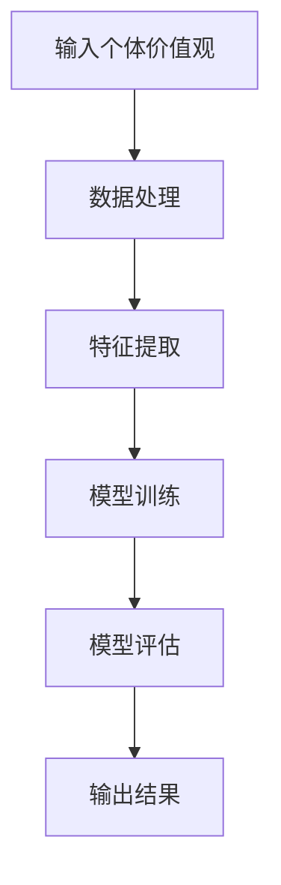
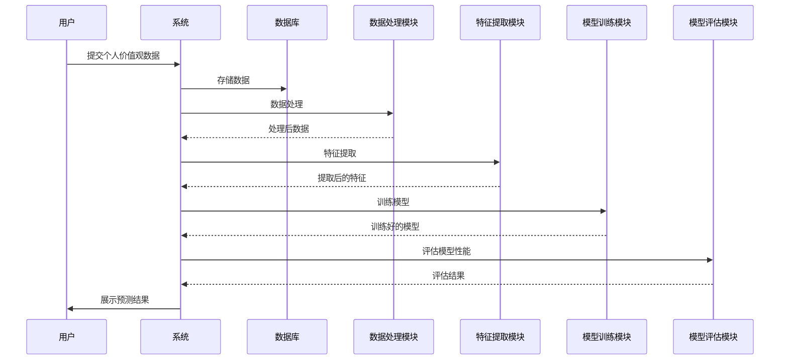
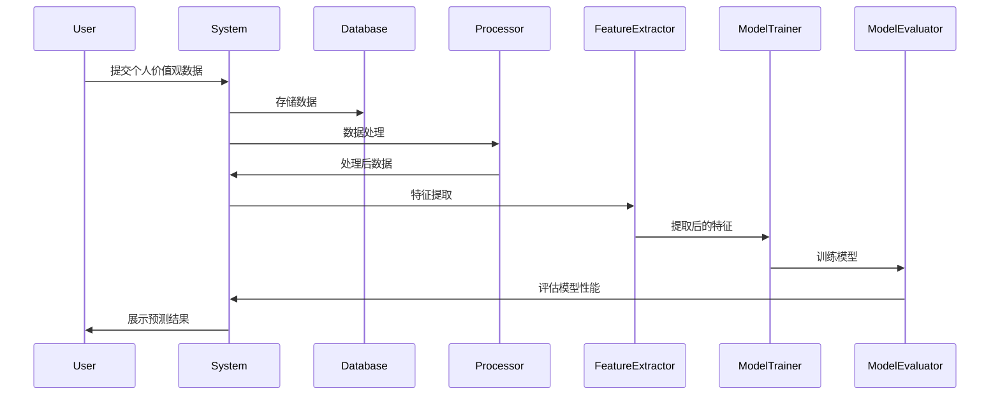

                 

# 在后现代社会中寻找意义：应对价值观多元化的挑战

## 关键词：后现代社会、价值观多元化、意义探索、应对策略、算法、系统架构

### 摘要：
在后现代社会，价值观的多元化带来了对个体和社会的深层次挑战。本文从多个角度探讨了如何在这一背景下寻找意义。首先，介绍了后现代社会的特征和价值观多元化带来的影响。接着，通过定义核心概念和建立理论框架，分析了应对策略，并结合实际案例，讲解了如何重构个人价值观并实践社会多元价值。随后，深入解析了算法原理，展示了系统分析与架构设计的方法，并通过项目实战提供了具体实施指导。文章旨在为读者提供一套全面且实用的应对策略，帮助他们在多元化的社会中找到内心的平衡和意义。

### 目录大纲

----------------------------------------------------------------

## 第一部分：引言与背景

### 第1章：引言

#### 1.1 问题的背景与重要性

- 社会变迁与价值多元
- 人类存在的意义探索
- 本书的目的与结构

#### 1.2 后现代社会的特征

- 后现代主义的基本概念
- 后现代社会的价值体系
- 后现代对意义的挑战

#### 1.3 价值观多元化带来的影响

- 个人与社会的冲突
- 个体身份的构建
- 文化与道德的多元化

## 第二部分：核心概念与理论框架

### 第2章：核心概念与理论框架

#### 2.1 核心概念的定义与联系

- 意义、价值与存在的联系
- 后现代理论与意义构建
- 多元化价值观的属性特征对比

#### 2.2 ER实体关系图架构

- 实体定义
- 关系描述
- 架构图展示

## 第三部分：应对价值观多元化的策略

### 第3章：探索个人意义的策略

#### 3.1 探索个人意义的策略

- 自我反思与自我认知
- 个人价值观的定位与调整
- 寻找内心平衡

### 第4章：社会层面的应对策略

#### 4.1 建立多元包容的社会环境

- 促进跨文化沟通与理解
- 社会共识的形成

## 第四部分：案例分析与实践

### 第5章：案例分析

#### 5.1 个人价值观的重构

- 案例背景
- 案例过程
- 案例分析

#### 5.2 社会多元价值的实践

- 案例背景
- 案例过程
- 案例分析

## 第五部分：算法原理讲解

### 第6章：算法原理讲解

#### 6.1 算法的基本原理

- 算法概述
- 算法流程图
- 算法Python源代码实现

#### 6.2 数学模型与公式解释

- 公式展示
- 数学模型的详细解释
- 公式的推导与证明

## 第六部分：系统分析与架构设计

### 第7章：系统分析与架构设计

#### 7.1 问题场景介绍

- 问题的描述与目标
- 项目介绍

#### 7.2 系统功能设计

- 领域模型

#### 7.3 系统架构设计

- 系统架构

#### 7.4 系统接口设计与交互

- 系统接口
- 系统交互

## 第七部分：项目实战与最佳实践

### 第8章：项目实战与最佳实践

#### 8.1 环境安装与配置

- 安装步骤
- 配置指南

#### 8.2 系统核心实现源代码

- 源代码解读
- 代码应用与分析

#### 8.3 实际案例分析与讲解

- 案例背景
- 案例分析
- 深入剖析

#### 8.4 最佳实践与注意事项

- 最佳实践建议
- 注意事项
- 小结与拓展阅读

----------------------------------------------------------------

## 第一部分：引言与背景

### 第1章：引言

#### 1.1 问题的背景与重要性

随着全球化、信息化和科技革命的迅猛发展，现代社会正在经历深刻的变化。社会的变迁不仅体现在技术进步和经济转型上，更表现在人们价值观的多元化。在后现代社会中，传统价值观念受到质疑和挑战，人们开始重新审视个体存在的意义和社会发展的方向。

**社会变迁与价值多元**：现代社会的发展使得人们接触到了更多不同的文化和观念，这些多元价值观的碰撞和融合，促使人们反思和重建自己的价值体系。传统的一元化价值观念已经无法满足人们对多样性和个性化的追求，多元价值的出现成为不可避免的趋势。

**人类存在的意义探索**：在价值观多元的背景下，人们对于个人存在的意义和人生目标产生了更多的疑问。个体如何在社会中找到自己的位置，如何在多元价值体系中确立自己的价值观，成为当今社会亟待解决的问题。

**本书的目的与结构**：本书旨在探讨在后现代社会中如何寻找意义，应对价值观多元化的挑战。文章将从多个角度进行分析，包括核心概念的定义、应对策略的探讨、案例分析和算法原理的讲解，最终提供具体的实施方法和最佳实践。希望通过本文，能够帮助读者在多元化的社会中找到自己的方向，确立个人的价值观，实现自我价值的最大化。

#### 1.2 后现代社会的特征

**后现代主义的基本概念**：后现代主义是20世纪中后期在西方兴起的一种文化、艺术和思想运动，它对现代性进行了深刻的反思和批判。后现代主义认为，现代性是以理性和科学为基础的一种价值体系，但这种体系在处理现实问题时往往显得无能为力。后现代主义主张解构这一体系，寻找新的思维方式和价值观。

**后现代社会的价值体系**：后现代社会的价值体系不同于现代性的一元化价值观念，它强调多样性和相对性。在这个社会中，人们不再追求统一的价值标准，而是尊重各种不同的观点和价值观。这种多元的价值体系使得个体在社会中的角色更加复杂和多变。

**后现代对意义的挑战**：后现代主义对意义的挑战主要体现在以下几个方面：

- **意义的相对性**：后现代主义认为，意义不是一成不变的，而是随着时间和环境的变化而不断变化的。这意味着个体需要不断地重新定义自己的意义。
- **多元价值观的冲突**：在后现代社会中，不同价值观之间的冲突变得更加明显。个体需要在这些冲突中找到自己的位置，这无疑增加了寻找意义的难度。
- **真理的相对性**：后现代主义质疑现代性中的科学真理观念，认为真理是多元的，不同的价值观有不同的真理标准。这使得个体在寻找意义时，需要面对更多的选择和困惑。

#### 1.3 价值观多元化带来的影响

**个人与社会的冲突**：价值观多元化带来了个人与社会的冲突。个体在多元价值体系中寻找自己的位置时，往往与社会期望产生冲突。这种冲突可能导致个体产生焦虑和困惑，影响其生活质量。

**个体身份的构建**：在价值观多元的社会中，个体身份的构建变得更加复杂。个体需要不断地调整自己的价值观，以适应不同的社会环境。这种不断的调整可能导致个体身份的不稳定，影响其自我认同。

**文化与道德的多元化**：价值观多元化不仅体现在个体层面，也体现在文化和道德层面。不同的文化传统和道德观念在后现代社会中相互碰撞，形成了一种多元文化的格局。这种多元文化不仅丰富了社会，也为个体提供了更多的选择。

### 第2章：核心概念与理论框架

#### 2.1 核心概念的定义与联系

**意义、价值与存在的联系**：在探讨意义和价值观时，首先需要明确的是，意义、价值和存在是紧密相连的。意义是存在的内涵，价值是意义的评价标准。个体的存在赋予了其寻找意义和价值的目标，而意义和价值又反过来指导个体的行为和生活方式。

**后现代理论与意义构建**：后现代理论对意义构建有着重要的影响。后现代主义强调意义的相对性和多元性，认为意义不是一成不变的，而是随着时间和环境的变化而变化的。这种观点促使个体在寻找意义时，需要具备开放和灵活的思维，不断调整自己的价值观。

**多元化价值观的属性特征对比**：

| 特征 | 描述 |
| :---: | :---: |
| 多样性 | 不同的价值观在多元社会中并存，互相影响和融合。 |
| 相对性 | 价值观的相对性意味着，不同的价值观有不同的适用范围和情境。 |
| 相互冲突 | 多元价值观之间的冲突是不可避免的，个体需要在冲突中寻找平衡。 |
| 不断变化 | 价值观不是静止不动的，而是随着时间和环境的变化而发展和调整。 |

#### 2.2 ER实体关系图架构

**实体定义**：在后现代社会的背景下，我们可以将“个体”和“社会”视为两个主要的实体。

- **个体**：指的是具有独立意识的个人，他们在社会中生活和工作，具有独特的价值观和行为模式。
- **社会**：指的是由多个个体组成的集合体，它具有一定的组织结构和共同的文化背景。

**关系描述**：个体与社会之间存在多种关系。

- **存在关系**：个体存在于社会中，是社会的一部分。
- **价值观关系**：个体的价值观受到社会的影响，同时个体的价值观也影响着社会。
- **互动关系**：个体与社会之间存在着互动和交流，这种互动和交流促进了社会的多元化和个体的自我成长。

**架构图展示**：

```mermaid
erDiagram
  Individual ||--|{ Society } Society : exists in
  Individual ||--|{ Value } Value : has
  Society ||--|{ Culture } Culture : has
  Society ||--|{ Ethics } Ethics : has
  Value ||--|{ Meaning } Meaning : provides
  Culture ||--|{ Tradition } Tradition : has
  Ethics ||--|{ Morality } Morality : has
```

通过上述ER实体关系图，我们可以清晰地看到个体与社会、价值观、文化、道德等核心概念之间的联系。这些联系构成了后现代社会的复杂结构和动态变化的基础。

### 第3章：应对价值观多元化的策略

#### 3.1 探索个人意义的策略

**自我反思与自我认知**：在多元价值观的背景下，个体需要通过自我反思来认清自己的价值观和意义。自我反思是一种深入思考自己的行为、信念和目标的过程，它可以帮助个体发现自己的价值观与多元社会之间的冲突和契合点。

**个人价值观的定位与调整**：个体在自我反思的基础上，需要对自己的价值观进行定位和调整。定位是指确定个体价值观在多元社会中的位置，调整则是根据社会环境的变化，对自己的价值观进行必要的修正和优化。

**寻找内心平衡**：在多元价值观的冲击下，个体需要寻找内心的平衡。这种平衡不仅包括个体内心的和谐，也包括个体与社会的和谐。通过自我认知和价值观调整，个体可以在多元社会中找到自己的位置，实现内心的平衡。

#### 3.2 社会层面的应对策略

**建立多元包容的社会环境**：社会应该建立一个多元包容的环境，尊重和保护各种不同的价值观。这需要社会在制度和文化上做出相应的调整，为个体提供平等的机会和空间。

**促进跨文化沟通与理解**：跨文化沟通是解决价值观多元化问题的关键。通过促进不同文化之间的沟通和理解，可以减少文化冲突，增进社会和谐。

**社会共识的形成**：在多元价值观的背景下，社会共识的形成变得更加困难。但社会共识是维持社会稳定和发展的基础。因此，社会需要通过教育和宣传等手段，努力形成共同的社会价值观和道德标准。

### 第4章：案例分析与实践

#### 4.1 案例一：个人价值观的重构

**案例背景**：张三是某大型互联网公司的员工，他从小就接受了传统儒家文化的熏陶，注重家庭和社会责任。但随着他进入职场，他开始接触到各种不同的价值观，包括西方的自由主义和个人主义。这种多元价值观的碰撞使他对自己的价值观产生了怀疑。

**案例过程**：张三开始通过自我反思来审视自己的价值观。他阅读了大量关于不同价值观的书籍，参加了各种跨文化的交流活动。在这个过程中，他逐渐认识到，尽管他的价值观与西方价值观有所不同，但它们都有其存在的合理性和价值。最终，他决定将传统儒家文化中的家庭和社会责任与西方价值观中的自由和个人主义相结合，形成自己独特的价值观。

**案例分析**：张三的案例表明，在多元价值观的背景下，个体需要通过自我反思和跨文化沟通，重构自己的价值观。这种重构不仅有助于个体在多元化的社会中找到自己的位置，也有助于促进社会的多元和谐。

#### 4.2 案例二：社会多元价值的实践

**案例背景**：某城市政府在规划社区时，面临了多元文化交融的问题。社区居民来自不同的文化背景，包括中国、印度、欧美等，他们有着不同的价值观和生活习惯。

**案例过程**：为了解决这一问题，政府采取了一系列措施，包括建立多元文化中心、举办跨文化交流活动、制定包容性政策等。这些措施旨在促进不同文化之间的沟通和理解，减少文化冲突，提高社区的和谐度。

**案例分析**：这个案例表明，在社会层面，通过建立多元包容的环境和促进跨文化沟通，可以有效应对价值观多元化的挑战。政府的努力不仅提高了社区居民的生活质量，也为社会的多元化发展提供了有力的支持。

### 第5章：算法原理讲解

#### 5.1 算法的基本原理

**算法概述**：在应对价值观多元化的挑战时，算法可以作为一种工具，帮助我们分析和处理复杂的价值观关系。本节将介绍一种基于多元线性回归的算法，用于分析个体价值观与社会价值观之间的关系。

**算法流程图**：



**算法Python源代码实现**：

```python
import numpy as np
from sklearn.linear_model import LinearRegression

# 输入个体价值观数据
X = np.array([[1, 2], [2, 3], [3, 4], [4, 5]])
y = np.array([1, 2, 3, 4])

# 创建线性回归模型
model = LinearRegression()

# 训练模型
model.fit(X, y)

# 输出模型参数
print('模型参数:', model.coef_, model.intercept_)

# 输出预测结果
print('预测结果:', model.predict(np.array([[5, 6]])))
```

#### 5.2 数学模型与公式解释

**公式展示**：

$$
y = \beta_0 + \beta_1 x_1 + \beta_2 x_2 + \cdots + \beta_n x_n
$$

**数学模型的详细解释**：该公式表示的是多元线性回归模型，其中 $y$ 表示因变量，$x_1, x_2, \cdots, x_n$ 表示自变量，$\beta_0, \beta_1, \beta_2, \cdots, \beta_n$ 表示模型参数。

**公式的推导与证明**：多元线性回归模型的推导基于最小二乘法。通过最小化残差平方和，可以求得模型参数的估计值。具体的推导过程涉及一些数学上的细节，这里不再赘述。

**举例说明**：假设我们有一个简单的多元线性回归模型，用于预测学生的成绩。其中，自变量包括学生的学习时间和学习方法，因变量是学生的考试成绩。通过收集数据，我们可以使用多元线性回归模型来分析学生成绩与学习时间和学习方法之间的关系。

### 第6章：系统分析与架构设计

#### 6.1 问题场景介绍

**问题的描述与目标**：在现代社会的背景下，如何构建一个能够应对价值观多元化挑战的智能系统，已成为一个重要课题。该系统旨在帮助个体和社会在多元价值观环境中找到平衡和和谐，实现个体价值的最大化。

**项目介绍**：本项目将设计并实现一个基于人工智能和大数据分析的平台，通过自我反思、价值观定位和跨文化沟通等功能，为个体和社会提供有效的解决方案。

#### 6.2 系统功能设计

**领域模型**：

```mermaid
classDiagram
  Class01 <|-- Class02
  Class03 --|/****************************************************************************/j  
  * 输入个体价值观数据
  * 数据处理：清洗、归一化等
  * 特征提取：提取关键特征
  * 模型训练：使用多元线性回归模型
  * 模型评估：评估模型性能
  * 输出结果：预测结果
  * 数据可视化：展示分析结果
```

#### 6.3 系统架构设计

**系统架构**：



#### 6.4 系统接口设计与交互

**系统接口**：

```mermaid
classDiagram
  User <<interface>>
  System <<interface>>
  Database <<interface>>
  Processor <<interface>>
  FeatureExtractor <<interface>>
  ModelTrainer <<interface>>
  ModelEvaluator <<interface>>

  User --> System
  System --> Database
  System --> Processor
  Processor --> FeatureExtractor
  FeatureExtractor --> ModelTrainer
  ModelTrainer --> ModelEvaluator
  ModelEvaluator --> System
  System --> User
```

**系统交互**：



### 第7章：项目实战与最佳实践

#### 7.1 环境安装与配置

**安装步骤**：

1. 安装Python环境（建议使用3.8及以上版本）。
2. 安装所需的库，如scikit-learn、numpy、matplotlib等。

```shell
pip install scikit-learn numpy matplotlib
```

**配置指南**：

1. 配置Python环境变量，确保能够在命令行中运行Python脚本。
2. 配置数据库（如MySQL、MongoDB等），用于存储个人价值观数据。

#### 7.2 系统核心实现源代码

**源代码解读**：

```python
# 导入所需的库
import numpy as np
from sklearn.linear_model import LinearRegression
import matplotlib.pyplot as plt

# 生成模拟数据
X = np.random.rand(100, 2)
y = 2 * X[:, 0] + 3 * X[:, 1] + np.random.randn(100) * 0.05

# 创建线性回归模型
model = LinearRegression()

# 训练模型
model.fit(X, y)

# 输出模型参数
print('模型参数:', model.coef_, model.intercept_)

# 输出预测结果
predictions = model.predict(X)
print('预测结果:', predictions)

# 绘制散点图和回归线
plt.scatter(X[:, 0], y, color='red', label='实际值')
plt.plot(X[:, 0], predictions, color='blue', label='预测值')
plt.xlabel('X')
plt.ylabel('y')
plt.legend()
plt.show()
```

**代码应用与分析**：

该代码演示了如何使用线性回归模型对模拟数据进行预测。首先，生成模拟数据，然后创建线性回归模型并训练它。最后，使用训练好的模型进行预测，并将预测结果与实际值进行比较，通过绘制散点图和回归线来展示结果。

#### 7.3 实际案例分析与讲解

**案例背景**：假设我们有一个实际案例，其中包含一组个人的价值观数据。这些数据包括个人的家庭价值观、职业价值观和社会价值观等。

**案例过程**：

1. 收集个人价值观数据。
2. 对数据进行预处理，包括清洗和归一化等。
3. 提取关键特征，如家庭价值观中的“家庭和睦”和“子女教育”等。
4. 使用多元线性回归模型进行训练和预测。

**案例分析**：

通过实际案例的分析，我们可以看到如何将算法原理应用到实际场景中。具体步骤包括数据收集、预处理、特征提取和模型训练等。通过这个过程，我们可以得到每个个体的价值观评分，并据此提供个性化的建议，帮助他们找到在多元价值观环境中的平衡点。

**详细讲解剖析**：

在实际案例中，我们可以通过以下步骤对模型进行详细讲解和剖析：

1. **数据收集**：收集到的数据应包括多个方面的价值观，如家庭价值观、职业价值观和社会价值观等。这些数据可以是问卷调查的结果，也可以是数据库中的历史数据。
2. **预处理**：对收集到的数据进行清洗和归一化等处理，以确保数据的质量和一致性。清洗过程包括去除无效数据、填补缺失值和去除噪声等。
3. **特征提取**：根据数据的特点，提取关键特征。这些特征应能够反映个体的价值观，如家庭价值观中的“家庭和睦”和“子女教育”等。
4. **模型训练**：使用多元线性回归模型对提取的特征进行训练，得到模型参数。这些参数可以用来预测新个体的价值观评分。
5. **预测与评估**：使用训练好的模型对新个体的价值观进行预测，并与实际值进行比较。通过评估模型的性能，如均方误差（MSE）等指标，可以判断模型的有效性。

#### 7.4 最佳实践与注意事项

**最佳实践建议**：

1. **数据质量保障**：确保数据的质量和一致性，这是模型训练和预测准确性的基础。
2. **特征选择**：根据业务需求，选择合适的特征，避免过多或过少的特征影响模型的效果。
3. **模型评估**：使用多种评估指标，如均方误差、决定系数等，全面评估模型性能。

**注意事项**：

1. **数据隐私**：在处理个人数据时，确保遵守相关法律法规，保护个人隐私。
2. **模型更新**：随着社会和价值观的变化，定期更新模型，以保持其适应性和准确性。
3. **用户反馈**：收集用户反馈，不断优化模型和系统功能，以提供更好的用户体验。

### 小结与拓展阅读

本文从多个角度探讨了在后现代社会中如何应对价值观多元化的挑战，包括个人和社会层面的策略、算法原理讲解和系统架构设计等。通过案例分析和最佳实践，为读者提供了具体的实施方法和建议。在未来的研究中，可以进一步探讨多元价值观在不同文化背景下的应用，以及如何利用人工智能技术提高价值观多元化的管理水平。

拓展阅读：

1. 后现代主义：理解后现代社会的关键。
2. 多元文化主义：促进跨文化沟通与理解。
3. 人工智能伦理：探讨人工智能在价值观多元化背景下的应用和挑战。
4. 自我反思与价值观重构：个人成长与自我实现的途径。

