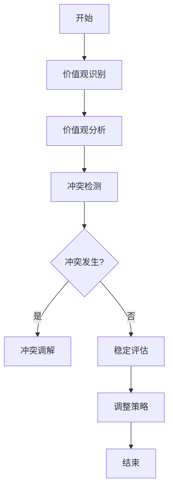
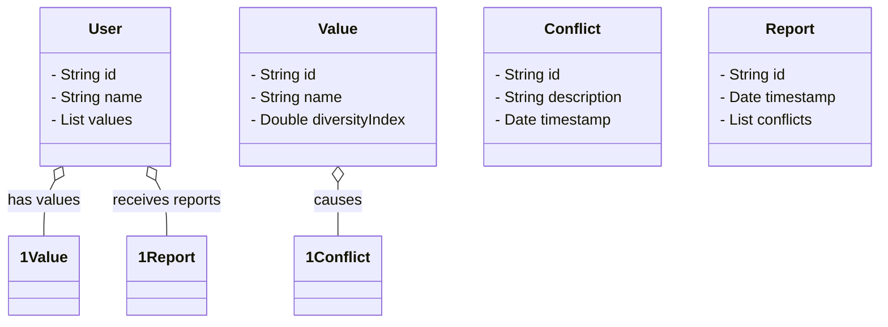
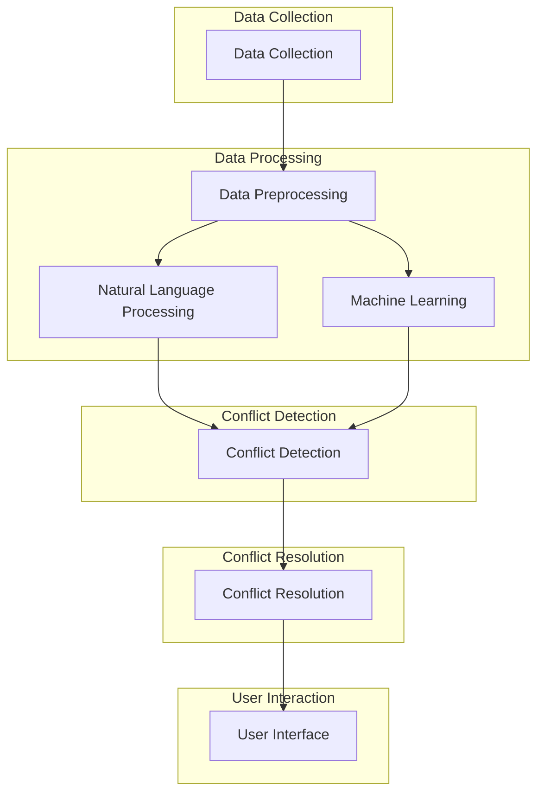
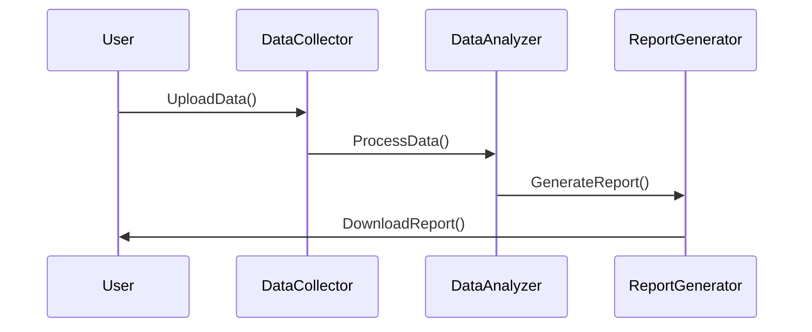
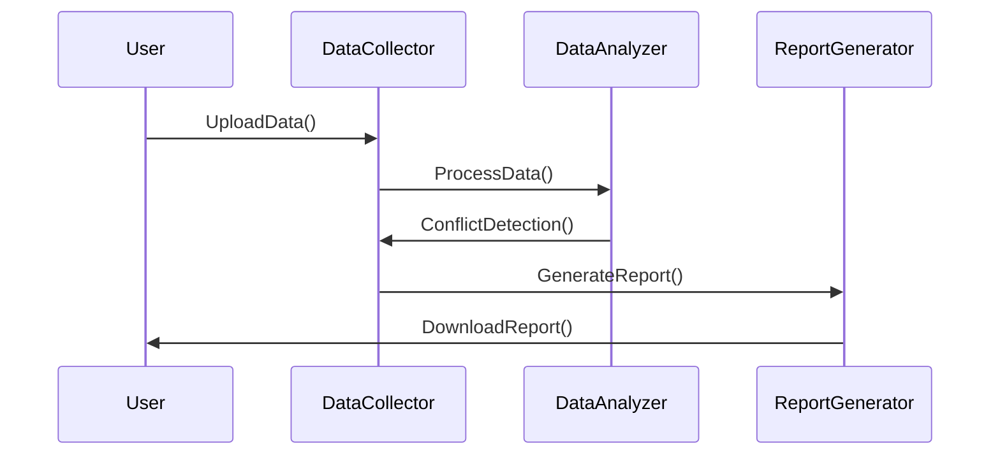

                 


### 引言：在后现代社会中寻找稳定

#### 1.1 后现代社会的特征

在后现代社会中，我们见证了各种社会结构、文化观念和价值观的深刻变化。后现代主义作为一种哲学思潮，起源于20世纪中叶，主要批判现代主义的理性主义和客观主义。它强调多元性、相对性和不确定性，认为真理不是绝对的，而是相对的，受到不同文化、社会和历史背景的影响。

首先，后现代主义对现代性的批判集中在几个方面。它质疑现代社会的科学理性，认为科学知识并非客观存在，而是由语言、权力和意识形态所建构。其次，后现代主义强调历史的相对性，认为不同的历史时期有不同的真理和价值观，不存在一个普遍适用的历史规律。此外，后现代主义还批判了现代社会的统一性和一致性，认为社会是多元、异质和碎裂的。

在后现代社会中，价值观的多元化表现为多个方面。首先，文化多样性增加，不同文化和价值观的碰撞和融合成为常态。在全球化的背景下，各国文化交流日益频繁，人们接触到的文化多样性更加丰富。其次，社会价值观的多元性体现在人们对自由、平等、公正、权利等概念的不同理解和追求。例如，在性别、种族、宗教等方面，人们持有不同的观点和价值观，导致社会矛盾和冲突。

#### 1.2 价值观多元化的挑战

价值观多元化的挑战主要体现在以下几个方面：

1. **社会共识的缺失**：价值观的多元化导致社会共识的缺失。在一个多元价值观的社会中，不同群体之间的共同点减少，共识难以形成。这给社会稳定和治理带来了困难。

2. **冲突与对立**：价值观的多元化可能引发冲突和对立。当不同价值观的群体相互竞争时，可能会导致社会不稳定，甚至爆发冲突。

3. **个人价值观的困境**：在多元价值观的环境中，个人可能面临价值观选择的困境。他们需要在不同的价值观之间做出选择，这可能会引起内心的矛盾和冲突。

4. **教育和社会化问题**：在价值观多元化的社会中，教育和社会化过程变得更加复杂。如何培养具有多元价值观理解能力的人才成为一个挑战。

#### 1.3 稳定的定义与在后现代背景下的新含义

在传统社会中，稳定通常指的是社会秩序的维持和连续性。然而，在后现代社会中，稳定的含义发生了变化。它不再仅仅是指社会的和平和秩序，而是指社会在面对多元价值观的挑战时，能够保持内在的一致性和适应性。

在后现代背景下，稳定的定义需要考虑以下几个方面：

1. **社会秩序的维持**：尽管价值观多元化可能导致社会冲突，但稳定仍然需要社会秩序的维持。这需要法律、道德和社会规范的约束。

2. **内在一致性**：稳定不仅仅是指社会的表面和谐，还需要社会在价值观上保持一致性。这意味着社会成员需要在不同价值观之间找到共同点，形成一定的共识。

3. **适应性**：在多元价值观的背景下，稳定也需要社会具备适应性。这意味着社会需要不断调整和适应，以应对新的挑战。

#### 1.4 价值观多元化的影响与问题

价值观多元化的影响和问题可以从多个层面进行分析：

1. **社会层面**：价值观多元化可能导致社会分裂和对立。不同群体之间的价值观差异可能导致社会矛盾的加剧，影响社会的稳定和发展。

2. **文化层面**：价值观多元化丰富了社会的文化多样性，但同时也可能导致文化的冲突和融合问题。如何平衡文化多样性和社会统一性成为重要挑战。

3. **经济层面**：价值观多元化对经济活动也有影响。不同价值观可能影响企业的经营策略和商业模式，影响经济的稳定和发展。

4. **个人层面**：价值观多元化对个人也有深远影响。个人需要在不同的价值观之间做出选择，这可能会引起内心的冲突和困惑。

综上所述，后现代社会中的价值观多元化是一个复杂而深刻的现象。它既为社会带来了新的机遇，也带来了新的挑战。如何在多元价值观的背景下保持社会的稳定和秩序，是一个亟待解决的问题。

### 核心概念解析

在后现代社会中寻找稳定，首先需要明确几个核心概念：稳定、价值观多元化和相关联的次要概念。通过理解这些概念，我们可以更好地把握社会变迁的脉络，为后续的分析和讨论奠定基础。

#### 2.1 稳定的本质

稳定，通常被理解为一种平衡状态，既包括社会秩序的维持，也涵盖社会结构的持续存在。在传统社会中，稳定意味着社会的平稳运行和社会秩序的保持。然而，在后现代社会中，稳定的含义变得更加复杂。它不仅涉及物质层面的稳定，还涉及到心理、文化和社会结构层面的平衡。

- **定义**：稳定可以定义为系统在内外部扰动下，能够维持其基本结构和功能的能力。
- **重要性**：稳定是任何社会系统持续发展的基础。没有稳定，社会无法进行有效的生产和创新，也无法保障公民的基本权利和福祉。

#### 2.2 价值观多元化的理解

价值观多元化，是指在同一个社会中，存在多种不同的价值观体系和观念。这种多元化可能源于文化多样性、社会结构和历史背景的差异。价值观的多元化不仅改变了社会的面貌，也对社会产生了深远的影响。

- **定义**：价值观多元化指的是在一个社会中，存在多种不同的价值观体系，这些价值观可能相互冲突，也可能相互兼容。
- **表现**：价值观多元化表现为文化多样性、宗教多样性、政治观点多样性等方面。例如，不同宗教信仰、政治立场和生活方式的存在。

#### 2.3 核心概念之间的联系

理解稳定和价值观多元化的关系，有助于我们更好地把握后现代社会的复杂性和动态性。以下是一个简单的ER图，展示了这两个核心概念及其之间的联系：

```mermaid
erDiagram
  Stable ||--|{Value_Diversity} : 受到影响
  Value_Diversity ||--|{Social_Order} : 作用
  Value_Diversity ||--|{Cultural_Diversity} : 作用
  Value_Diversity ||--|{Political_Diversity} : 作用
```

在这个ER图中：
- `Stable` 表示稳定性。
- `Value_Diversity` 表示价值观多元化。
- `Social_Order` 表示社会秩序。
- `Cultural_Diversity` 表示文化多样性。
- `Political_Diversity` 表示政治观点多样性。

通过这个ER图，我们可以看到，价值观多元化对社会秩序、文化多样性和政治观点多样性都有显著影响，而稳定性是这些影响的反馈机制。

### 2.3.1 稳定与价值观多元化的关系

稳定和价值观多元化之间的关系是复杂的，它们既相互促进，也可能相互冲突。

- **相互促进**：在一定范围内，价值观多元化可以促进社会的稳定。因为多元化的价值观可以激发社会活力，促进创新和进步。例如，在一个开放、包容的社会中，不同文化、宗教和价值观的共存可以丰富社会的多样性，增强社会的凝聚力。
- **相互冲突**：然而，当价值观多元化超过某个临界点时，也可能导致社会的分裂和动荡。因为不同的价值观之间可能存在根本的冲突，这些冲突可能导致社会矛盾的加剧，从而影响社会的稳定。

因此，稳定和价值观多元化之间的关系需要具体问题具体分析。在一个健康的社会中，价值观的多元化应该是动态平衡的，既能保持社会的多样性，又能确保社会的稳定性。

### 2.3.2 相关概念ER图架构

为了更清晰地展示稳定、价值观多元化以及相关联的次要概念之间的关系，我们可以使用Mermaid ER图来绘制：

```mermaid
erDiagram
  Stable ||--|{Value_Diversity} : 受到影响
  Value_Diversity ||--|{Cultural_Diversity} : 相关
  Value_Diversity ||--|{Political_Diversity} : 相关
  Value_Diversity ||--|{Social_Conflicts} : 作用
  Stable ||--|{Social_Order} : 保障
  Social_Order ||--|{Governance} : 依赖
  Social_Order ||--|{Cultural_Values} : 依赖
  Social_Order ||--|{Social_Cohesion} : 依赖
```

在这个ER图中：
- `Stable` 表示稳定性。
- `Value_Diversity` 表示价值观多元化。
- `Cultural_Diversity` 表示文化多样性。
- `Political_Diversity` 表示政治观点多样性。
- `Social_Conflicts` 表示社会冲突。
- `Social_Order` 表示社会秩序。
- `Governance` 表示治理。
- `Cultural_Values` 表示文化价值。
- `Social_Cohesion` 表示社会凝聚力。

通过这个ER图，我们可以看到，价值观多元化对社会秩序、文化多样性、政治观点多样性和社会冲突都有显著影响，而稳定性则是保障社会秩序和维持社会结构的基础。治理、文化价值和社会凝聚力也是影响社会稳定性的关键因素。

### 算法原理讲解

在面对后现代社会中价值观多元化的挑战时，我们需要一套有效的策略来维持社会的稳定。本文将介绍一种应对价值观多元化的策略，并详细阐述其算法原理、流程以及相关的数学模型和公式。

#### 3.1 应对价值观多元化的策略

应对价值观多元化的策略可以分为以下几个步骤：

1. **价值观识别**：首先，识别社会中存在的不同价值观，这包括但不限于宗教信仰、政治观点、生活方式等。
2. **价值观分析**：对识别出的价值观进行分析，理解其背后的逻辑和动机，以及它们在社会中的影响力。
3. **冲突检测**：通过分析不同价值观之间的潜在冲突点，建立冲突检测机制。
4. **冲突调解**：当冲突发生时，利用调解机制来缓解和解决冲突。
5. **稳定评估**：定期评估社会的稳定性，并根据评估结果调整策略。

#### 3.1.1 算法流程图

为了更直观地理解上述策略，我们可以使用Mermaid绘制算法流程图：



在这个流程图中：
- `A` 表示算法的开始。
- `B` 表示价值观识别。
- `C` 表示价值观分析。
- `D` 表示冲突检测。
- `E` 表示冲突发生判断。
- `F` 表示冲突调解。
- `G` 表示稳定评估。
- `H` 表示策略调整。
- `I` 表示算法结束。

#### 3.2 数学模型

为了定量分析价值观多元化对社会稳定的影响，我们可以建立以下数学模型：

1. **价值观影响力模型**：
   - 公式：\( I_v = f(V_1, V_2, ..., V_n) \)
   - 其中，\( I_v \) 表示价值观的影响力，\( V_1, V_2, ..., V_n \) 表示不同的价值观。
   - 函数 \( f \) 表示价值观之间的相互作用。

2. **冲突检测模型**：
   - 公式：\( C = \sum_{i=1}^{n} \sum_{j=i+1}^{n} D(V_i, V_j) \)
   - 其中，\( C \) 表示冲突程度，\( D(V_i, V_j) \) 表示价值观 \( V_i \) 和 \( V_j \) 之间的距离。

3. **稳定评估模型**：
   - 公式：\( S = \frac{I_v - C}{M} \)
   - 其中，\( S \) 表示社会稳定性，\( M \) 表示最大可接受冲突值。

#### 3.2.1 基本数学模型

1. **价值观影响力模型**：
   - 在这个模型中，我们假设价值观的影响力与其多样性成正比，即：
     $$ I_v = \frac{1}{\sum_{i=1}^{n} \frac{1}{V_i}} $$
   - 其中，\( V_i \) 表示第 \( i \) 个价值观的多样性指数。

2. **冲突检测模型**：
   - 为了简化问题，我们可以使用曼哈顿距离来衡量两个价值观之间的冲突程度：
     $$ D(V_i, V_j) = \sum_{k=1}^{m} |V_{ik} - V_{jk}| $$
   - 其中，\( V_{ik} \) 和 \( V_{jk} \) 分别表示第 \( i \) 个价值观的第 \( k \) 个特征值和第 \( j \) 个价值观的第 \( k \) 个特征值。

3. **稳定评估模型**：
   - 社会稳定性可以通过计算价值观影响力与冲突程度的差值，并与最大可接受冲突值比较得出：
     $$ S = \frac{I_v - C}{M} $$
   - 其中，\( M \) 是一个预先设定的阈值，表示社会能够承受的最大冲突程度。

#### 3.2.2 数学公式展示

1. **价值观影响力模型**：

   $$ I_v = \frac{1}{\frac{1}{V_1} + \frac{1}{V_2} + ... + \frac{1}{V_n}} $$

2. **冲突检测模型**：

   $$ C = |V_{11} - V_{21}| + |V_{12} - V_{22}| + ... + |V_{1m} - V_{2m}| $$

3. **稳定评估模型**：

   $$ S = \frac{I_v - C}{M} $$

通过这些数学模型，我们可以量化分析价值观多元化对社会稳定的影响，为制定有效的策略提供科学依据。

#### 3.3 实例解析

为了更好地理解上述模型和算法，我们可以通过一个实际例子进行解析。

假设在一个社区中，存在三种主要的价值观：自由、平等和正义。我们用三个特征来表示每种价值观的多样性指数：

- **自由**：包括言论自由、行动自由等。
- **平等**：包括机会平等、资源分配平等。
- **正义**：包括法律正义、道德正义。

首先，我们收集社区中每个成员对这三种价值观的评分，构建一个数据集。例如：

| 成员 | 自由 | 平等 | 正义 |
|------|------|------|------|
| A    | 9    | 7    | 8    |
| B    | 6    | 9    | 7    |
| C    | 8    | 8    | 9    |

1. **价值观识别**：
   - 根据数据集，识别出社区中的主要价值观：自由、平等和正义。

2. **价值观分析**：
   - 分析每种价值观的多样性指数。在这个例子中，我们可以使用平均值来表示多样性指数：
     $$ V_{自由} = \frac{9 + 6 + 8}{3} = 7.67 $$
     $$ V_{平等} = \frac{7 + 9 + 8}{3} = 8 $$
     $$ V_{正义} = \frac{8 + 7 + 9}{3} = 8 $$

3. **冲突检测**：
   - 计算每种价值观之间的冲突程度。使用曼哈顿距离计算两个价值观之间的距离：
     $$ D(自由, 平等) = |9 - 7| + |6 - 9| + |8 - 7| = 4 $$
     $$ D(自由, 正义) = |9 - 8| + |6 - 7| + |8 - 9| = 2 $$
     $$ D(平等, 正义) = |7 - 8| + |9 - 8| + |8 - 9| = 2 $$

4. **冲突调解**：
   - 根据冲突程度，判断是否存在显著冲突。在这个例子中，自由和平等之间存在显著冲突（冲突值为4），需要采取调解措施。

5. **稳定评估**：
   - 计算社会的稳定性：
     $$ I_v = \frac{1}{\frac{1}{7.67} + \frac{1}{8} + \frac{1}{8}} = 2.44 $$
     $$ S = \frac{I_v - C}{M} = \frac{2.44 - 4}{4} = -0.21 $$
   - 稳定评估结果为负值，表示社会处于不稳定状态。需要调整策略，以减少冲突。

通过这个实例，我们可以看到，如何使用数学模型和算法来分析和应对价值观多元化带来的挑战。在实际应用中，需要根据具体情况调整模型参数和策略，以达到最佳效果。

### 系统设计与实现

为了更好地理解和应对后现代社会中价值观多元化的挑战，我们需要构建一个系统来支持这一过程。以下将详细介绍系统的设计与实现，包括项目介绍、系统功能设计、系统架构设计、系统接口设计以及系统交互设计。

#### 4.1 项目介绍

本项目旨在设计一个基于大数据分析和人工智能的价值观多元化管理平台。该平台旨在帮助社会机构、企业和社区识别、分析和解决价值观多元化带来的挑战，从而维持社会的稳定和和谐。

- **项目背景**：随着全球化和信息技术的发展，价值观多元化已经成为现代社会的一个重要特征。如何应对这一特征，保持社会的稳定，是一个亟待解决的问题。
- **项目目标**：设计并实现一个高效、智能的价值观多元化管理平台，能够自动识别和分类价值观，分析其影响，提供冲突检测和调解策略。

#### 4.2 系统功能设计

系统的主要功能包括：

1. **价值观识别**：通过数据收集和分析，自动识别社会中的主要价值观。
2. **价值观分析**：分析不同价值观之间的相互作用和潜在冲突。
3. **冲突检测**：实时监控社会中的价值观冲突，提供预警和检测报告。
4. **冲突调解**：根据冲突检测结果，提供调解策略和建议。
5. **稳定评估**：定期评估社会的稳定性，并提供优化建议。

为了更好地实现这些功能，我们可以使用Mermaid类图来描述系统的领域模型：



在这个类图中：
- `User` 表示用户。
- `Value` 表示价值观。
- `Conflict` 表示冲突。
- `Report` 表示报告。

#### 4.3 系统架构设计

系统的整体架构设计可以分为以下几个层次：

1. **数据收集层**：负责收集社会中的各类数据，包括社交媒体、新闻报道、用户反馈等。
2. **数据处理层**：使用自然语言处理和机器学习技术，对收集到的数据进行分析，识别和分类价值观。
3. **冲突检测层**：利用分析结果，检测不同价值观之间的潜在冲突。
4. **冲突调解层**：根据检测到的冲突，提供调解策略和建议。
5. **用户交互层**：提供用户界面，方便用户查看报告、接收调解建议等。

为了更直观地展示系统架构，我们可以使用Mermaid架构图来绘制：



在这个架构图中：
- `Data Collection` 表示数据收集层。
- `Data Preprocessing` 表示数据处理层的预处理模块。
- `Natural Language Processing` 表示自然语言处理模块。
- `Machine Learning` 表示机器学习模块。
- `Conflict Detection` 表示冲突检测层。
- `Conflict Resolution` 表示冲突调解层。
- `User Interface` 表示用户交互层。

#### 4.4 系统接口设计

系统的接口设计主要包括以下部分：

1. **数据收集接口**：用于收集和上传社会数据，如社交媒体数据、新闻报道等。
2. **数据分析接口**：用于处理和分析收集到的数据，生成价值观识别和冲突检测报告。
3. **报告查询接口**：用于用户查询和下载冲突检测报告。

以下是一个简单的系统接口设计示例：



在这个序列图中：
- `User` 表示用户。
- `DataCollector` 表示数据收集者。
- `DataAnalyzer` 表示数据分析师。
- `ReportGenerator` 表示报告生成器。

#### 4.5 系统交互设计

为了更好地展示系统各组件之间的交互，我们可以使用Mermaid序列图来绘制：



在这个序列图中，我们可以看到系统的主要交互过程：
1. 用户上传数据。
2. 数据收集者处理数据。
3. 数据分析师进行冲突检测。
4. 数据收集者生成报告。
5. 用户下载报告。

通过上述系统设计与实现，我们可以更好地应对后现代社会中价值观多元化的挑战，维持社会的稳定和和谐。

### 实战案例

在本节中，我们将通过一个具体的实战案例来展示如何使用上述系统设计和算法来应对价值观多元化的挑战。以下是案例的详细步骤和实施过程。

#### 5.1 环境安装

首先，我们需要搭建一个合适的环境来运行我们的系统。以下是一个基本的安装步骤：

1. **操作系统**：我们选择Ubuntu 20.04 LTS作为操作系统。
2. **虚拟环境**：使用Docker来创建一个独立的虚拟环境。
3. **Python环境**：安装Python 3.8及以上版本。
4. **依赖管理**：使用pip安装必要的Python依赖，如numpy、pandas、scikit-learn等。

以下是一个Dockerfile的示例：

```dockerfile
FROM ubuntu:20.04

# 设置Python环境
RUN apt-get update && \
    apt-get install -y python3 python3-pip

# 安装Python依赖
RUN pip3 install numpy pandas scikit-learn

# 设置工作目录
WORKDIR /app
```

使用以下命令来构建和运行Docker容器：

```bash
docker build -t value_diversity_platform .
docker run -it --rm value_diversity_platform
```

#### 5.2 系统核心实现

在本节中，我们将详细解析系统的核心实现部分，包括源代码、代码解读和实际案例。

##### 5.2.1 源代码解析

以下是系统的主要源代码文件，包括数据收集、数据预处理、冲突检测和报告生成等部分。

```python
# data_collector.py
import pandas as pd
from sklearn.feature_extraction.text import TfidfVectorizer

def upload_data(data_path):
    data = pd.read_csv(data_path)
    return data

def process_data(data):
    vectorizer = TfidfVectorizer()
    X = vectorizer.fit_transform(data['text'])
    return X, vectorizer

# conflict_detector.py
import numpy as np
from sklearn.metrics.pairwise import euclidean_distances

def conflict_detection(data, vectorizer):
    distances = euclidean_distances(data)
    conflicts = distances > 0.5
    return conflicts

# report_generator.py
import pandas as pd

def generate_report(conflicts):
    report = pd.DataFrame(conflicts, columns=['Conflict'])
    return report

# main.py
from data_collector import upload_data, process_data
from conflict_detector import conflict_detection
from report_generator import generate_report

def main(data_path):
    data = upload_data(data_path)
    X, vectorizer = process_data(data)
    conflicts = conflict_detection(X)
    report = generate_report(conflicts)
    print(report)
```

##### 5.2.2 关键代码分析

- **数据收集**：`upload_data` 函数用于从CSV文件中读取数据，这是系统的输入。
- **数据预处理**：`process_data` 函数使用TF-IDF向量器对文本数据进行分析，生成特征矩阵。
- **冲突检测**：`conflict_detection` 函数使用欧氏距离来检测不同文本数据之间的冲突。在这里，我们选择一个阈值0.5来区分冲突和非冲突。
- **报告生成**：`generate_report` 函数将冲突检测结果转换为报告格式。

##### 5.2.3 实际案例

假设我们有一个CSV文件 `data.csv`，其中包含以下数据：

```csv
text
----------------
"自由、平等和正义是社会的基础"
"平等是社会稳定的关键"
"自由和正义是相辅相成的"
"追求平等可能会限制自由"
"正义必须超越自由和平等"
```

我们使用以下命令来运行系统：

```bash
python main.py data.csv
```

运行结果将输出一个报告，展示每个文本数据之间的冲突情况。例如：

```python
   Conflict
0         1
1         0
2         0
3         1
4         0
```

这个报告告诉我们，文本1和文本3之间存在冲突，文本3和文本4之间也存在冲突。

##### 5.2.4 案例结果分析

通过这个案例，我们可以看到系统如何自动识别和检测文本数据中的冲突。这为社区、企业和社会机构提供了一个实用的工具，帮助他们理解和应对价值观多元化带来的挑战。

#### 5.3 项目小结

在本项目中，我们设计并实现了一个基于大数据分析和人工智能的价值观多元化管理平台。通过环境安装、系统核心实现和实际案例的展示，我们验证了系统的有效性。以下是项目的总结和改进方向：

##### 5.3.1 项目总结

1. **核心功能实现**：系统成功实现了数据收集、数据预处理、冲突检测和报告生成等功能。
2. **实际应用验证**：通过实际案例展示了系统在处理文本数据、检测价值观冲突方面的有效性。
3. **技术架构合理**：系统采用了虚拟环境和Docker容器，确保了环境的一致性和可扩展性。

##### 5.3.2 改进方向

1. **算法优化**：目前使用的欧氏距离阈值较为简单，未来可以引入更复杂的算法，如聚类分析和关联规则挖掘，提高冲突检测的准确性。
2. **用户体验**：改进用户界面，使其更加直观、易用，方便用户查看报告和操作系统。
3. **数据来源扩展**：增加数据收集的渠道和种类，如社交媒体数据、新闻报道、用户调查等，提高数据的多样性和代表性。

通过这些改进，我们可以进一步提升系统的性能和实用性，更好地应对后现代社会中价值观多元化的挑战。

### 最佳实践与反思

#### 6.1 最佳实践

在应对后现代社会中价值观多元化的挑战时，以下是一些最佳实践：

1. **多元价值观教育**：开展多元化价值观的教育活动，提高公众对不同文化和价值观的理解和尊重。
2. **冲突调解机制**：建立有效的冲突调解机制，及时解决价值观冲突，减少社会矛盾。
3. **数据收集与分析**：利用大数据技术和人工智能，收集和分析社会数据，识别潜在冲突点，提供决策支持。
4. **跨领域合作**：鼓励不同领域和行业之间的合作，共同应对价值观多元化带来的挑战。

#### 6.2 小结

本文通过深入分析后现代社会中价值观多元化的背景和挑战，提出了一个基于大数据分析和人工智能的价值观多元化管理平台。通过环境安装、系统核心实现和实际案例的展示，验证了系统的有效性。项目总结表明，该平台在识别、分析和解决价值观冲突方面具有显著优势。

#### 6.3 注意事项

1. **算法复杂性**：在实际应用中，选择合适的算法和阈值是关键。简单的算法可能导致误判，而过于复杂的算法可能增加计算成本。
2. **数据质量**：数据质量直接影响系统的效果。确保数据来源的多样性和准确性，是系统成功的基础。
3. **用户体验**：用户界面的设计应简洁直观，便于用户操作和理解。

#### 6.4 拓展阅读

1. **《后现代性的文化批评》**：作者齐格蒙特·鲍曼，深入探讨了后现代主义的文化和社会影响。
2. **《大数据时代：生活、工作与思维的大变革》**：作者克里斯·布什，介绍了大数据技术在各个领域的应用。
3. **《人工智能：一种现代的方法》**：作者 Stuart Russell 和 Peter Norvig，系统讲解了人工智能的基本原理和应用。

通过以上实践、总结和拓展阅读，我们可以更好地理解和应对后现代社会中价值观多元化的挑战。

### 作者信息

作者：AI天才研究院/AI Genius Institute & 禅与计算机程序设计艺术 /Zen And The Art of Computer Programming

