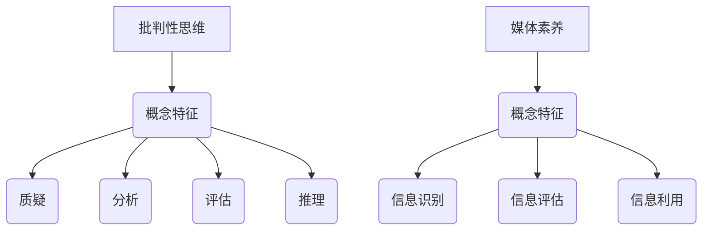
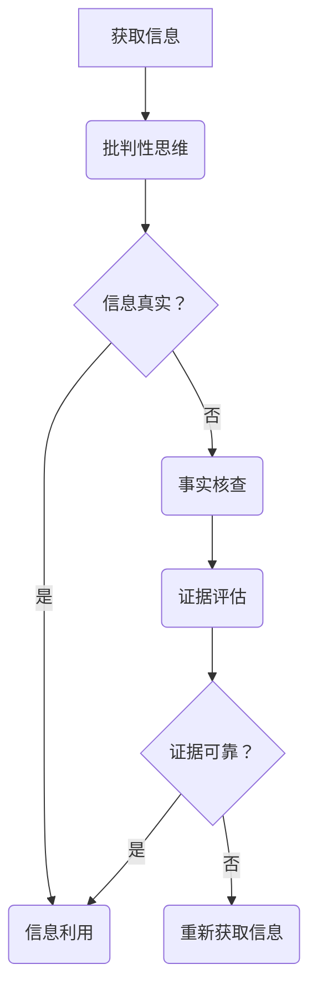
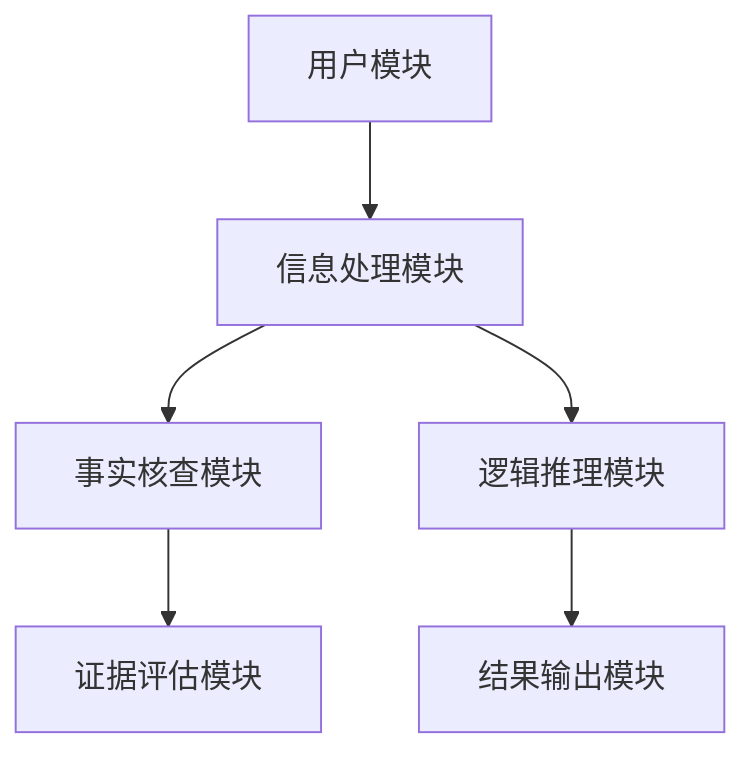
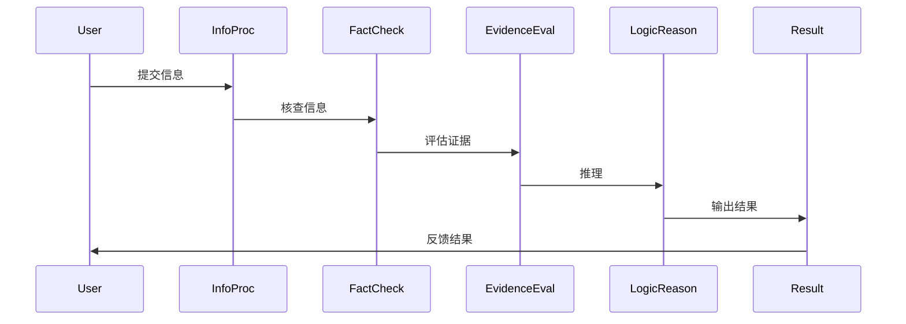

                 

### 《在后真相时代寻找真相：培养批判性思维和媒体素养》

> 关键词：后真相时代、批判性思维、媒体素养、事实核查、逻辑思维、多元视角

> 摘要：在后真相时代，信息泛滥、真假难辨，寻找真相变得愈发困难。本文通过探讨批判性思维和媒体素养的培养，帮助读者在信息爆炸的环境中辨别真伪，提高判断力，从而在信息海洋中找到真相。

----------------------------------------------------------------

## 第一部分：引言

### 1.1 后真相时代的背景与挑战

在后真相时代，我们面临的信息量是前所未有的。社交媒体、网络新闻、自媒体平台的兴起，使得信息的传播速度大大加快，但同时也带来了信息的泛滥和真假难辨的问题。虚假新闻、谣言、误导性信息层出不穷，对公众的认知和判断产生了极大的干扰。

### 1.2 信息泛滥与真假难辨

信息泛滥使得我们在接受信息时，很难区分哪些是真实的、哪些是虚假的。真假难辨的问题进一步加剧了社会的不稳定性和公众的恐慌感。在这种环境下，培养批判性思维和媒体素养显得尤为重要。

### 1.3 批判性思维的重要性

批判性思维是一种能够帮助我们分析、推理、评估信息的思维方式。它使我们能够从不同的角度看待问题，发现问题的本质，避免被表面的信息所迷惑。在信息泛滥的时代，批判性思维是我们寻找真相的重要工具。

## 第二部分：批判性思维的基本原则

### 2.1 定义与特征

批判性思维是一种积极的思维方式，它要求我们在接受信息时，不仅要关注其表面内容，还要深入思考其背后的逻辑和动机。批判性思维的特征包括：质疑、分析、评估、推理等。

### 2.2 思维过程中的常见误区

在批判性思维的运用过程中，我们可能会遇到一些误区，如过度简化问题、依赖权威、忽视证据等。识别这些误区，有助于我们更加准确地运用批判性思维。

### 2.3 提升批判性思维的方法

提升批判性思维的方法包括：多角度看待问题、培养提问能力、提高信息处理能力、练习逻辑推理等。通过这些方法，我们可以更好地运用批判性思维，提高判断力。

## 第三部分：媒体素养的重要性

### 3.1 媒体素养的定义与作用

媒体素养是指人们理解和运用各种媒体的能力，包括阅读、写作、分析、批判等。媒体素养的作用在于提高公众的信息处理能力，帮助我们在信息爆炸的时代中找到真相。

### 3.2 媒体素养的基本要素

媒体素养的基本要素包括：信息识别、信息评估、信息利用等。通过这些基本要素，我们可以更好地理解和运用媒体，提高判断力。

### 3.3 媒体素养的培养方法

媒体素养的培养方法包括：媒体知识教育、信息素养培训、实践经验等。通过这些方法，我们可以提高自己的媒体素养，更好地应对信息泛滥的挑战。

## 第四部分：培养批判性思维

### 4.1 事实核查与证据评估

事实核查是指对信息进行核实，评估其真实性。证据评估是指对证据的可靠性进行分析。通过事实核查和证据评估，我们可以提高对信息的判断力。

### 4.2 逻辑思维与推理

逻辑思维是指运用逻辑规则进行推理的过程。推理是指从已知的前提推导出新的结论。逻辑思维和推理是批判性思维的重要组成部分，它们帮助我们更好地理解问题和解决问题。

### 4.3 多元视角与开放心态

多元视角是指从不同的角度看待问题。开放心态是指接受不同的观点和意见。多元视角和开放心态有助于我们更全面地理解问题，避免片面和主观。

## 第五部分：批判性思维的实战应用

### 5.1 在日常生活中的应用

在日常生活中，我们可以运用批判性思维来评估广告、新闻、社交媒体等信息，避免被误导和欺骗。

### 5.2 在工作中的应用

在工作环境中，批判性思维可以帮助我们分析问题、评估方案、提高决策质量。

### 5.3 在网络环境中的应用

在网络环境中，批判性思维可以帮助我们识别虚假信息、避免网络诈骗，维护网络安全。

## 第六部分：媒体素养的培养

### 6.1 媒体信息的甄别与筛选

媒体信息的甄别与筛选是指对信息进行筛选和判断，选择真实、有价值的信息。通过这种方式，我们可以提高信息处理能力，避免被虚假信息所困扰。

### 6.2 社交媒体的使用与影响

社交媒体的使用与影响是指社交媒体对个人和社会的影响。了解社交媒体的使用方法和影响，可以帮助我们更好地利用社交媒体，避免其负面影响。

### 6.3 媒体素养的教育与实践

媒体素养的教育与实践是指通过教育和实践来提高个人的媒体素养。通过这种方式，我们可以更好地适应信息爆炸的时代，提高判断力。

## 第七部分：后真相时代的媒体责任

### 7.1 媒体从业者的责任与担当

媒体从业者的责任与担当是指媒体从业者应承担的社会责任和职业道德。媒体从业者的行为直接影响到公众的信息接收和判断，因此，他们应承担起传播真实、准确、有价值信息的责任。

### 7.2 媒体素养与公共信任

媒体素养与公共信任是指媒体素养对公众信任的影响。提高公众的媒体素养，有助于增强公众对媒体的信任，促进社会和谐稳定。

### 7.3 媒体素养在公共领域的应用

媒体素养在公共领域的应用是指媒体素养在公共决策、社会治理、舆论引导等方面的应用。通过提高公众的媒体素养，我们可以更好地参与公共事务，提高社会治理效能。

## 第十一部分：总结与展望

### 11.1 批判性思维与媒体素养的融合

批判性思维与媒体素养的融合是指将批判性思维和媒体素养相结合，形成一种综合的思维能力。这种融合有助于我们更好地应对信息爆炸的挑战，提高判断力。

### 11.2 未来媒体素养的发展趋势

未来媒体素养的发展趋势包括：技术驱动、个性化、全球化等。随着技术的进步，媒体素养的培养将更加智能化、个性化，成为全球共同关注的议题。

### 11.3 个人与社会责任的提升

在后真相时代，个人与社会责任的提升至关重要。通过提高批判性思维和媒体素养，我们可以更好地应对信息泛滥的挑战，维护社会稳定和谐。

----------------------------------------------------------------

### 作者信息

作者：AI天才研究院/AI Genius Institute & 禅与计算机程序设计艺术 /Zen And The Art of Computer Programming

----------------------------------------------------------------

本文从后真相时代的背景和挑战出发，详细阐述了批判性思维和媒体素养的培养方法。通过培养批判性思维和媒体素养，我们可以提高判断力，辨别真伪，在后真相时代中寻找真相。同时，本文还探讨了批判性思维和媒体素养在日常生活、工作、网络环境等领域的应用，以及媒体素养在公共领域的责任和作用。未来，随着技术的进步和社会的发展，批判性思维和媒体素养将成为每个人必备的基本能力。

----------------------------------------------------------------

### 核心概念与联系

**核心概念：**

- **批判性思维**：一种积极的思维方式，通过分析、评估、推理等方式，对信息进行深入思考，以辨别真伪、理解问题的本质。
- **媒体素养**：指个体在理解、运用、分析和批判各种媒体信息方面的能力，包括信息识别、评估和利用。

**概念属性特征对比表格：**

| 特征         | 批判性思维               | 媒体素养               |
| ------------ | ---------------------- | ---------------------- |
| **定义**     | 一种积极的思维方式       | 在理解媒体信息方面的能力 |
| **作用**     | 辨别真伪、理解问题本质   | 提高信息处理能力       |
| **要素**     | 质疑、分析、评估、推理   | 信息识别、评估、利用   |

**ER实体关系图架构：**



### 算法原理讲解

**算法mermaid流程图：**



**算法原理：**

1. **获取信息**：从各种渠道获取信息。
2. **批判性思维**：运用批判性思维对信息进行评估。
3. **事实核查与证据评估**：对信息进行事实核查和证据评估，判断其真实性和可靠性。
4. **信息利用**：如果信息真实且可靠，则利用该信息。
5. **重新获取信息**：如果信息不真实或不可靠，则重新获取信息。

**数学模型和公式：**

- **信息真实度评估公式**：
  $$ TR = \frac{Evidence\_count}{Total\_count} $$
  其中，$TR$表示信息真实度，$Evidence\_count$表示证据数量，$Total\_count$表示总信息数量。

- **证据可靠性评估公式**：
  $$ Reliability = \frac{Correct\_evidence}{Total\_evidence} $$
  其中，$Reliability$表示证据可靠性，$Correct\_evidence$表示正确证据数量，$Total\_evidence$表示总证据数量。

### 详细讲解与举例说明

**举例说明：**

假设我们获取了一条关于疫情的新闻，内容是“全球新冠疫情已经得到控制”。

1. **获取信息**：从网络新闻中获取该信息。
2. **批判性思维**：运用批判性思维，首先质疑该信息的真实性。
3. **事实核查与证据评估**：
   - **事实核查**：通过查找其他渠道，发现多个权威媒体报道均未提及疫情得到控制的消息，因此怀疑该信息的真实性。
   - **证据评估**：进一步查找相关证据，如世界卫生组织、各国卫生部门的官方数据，发现疫情仍在蔓延，并未得到控制，因此确认该信息为虚假信息。
4. **信息利用**：由于该信息为虚假信息，因此不将其作为决策依据。

通过上述步骤，我们运用批判性思维和媒体素养，辨别出了虚假信息，避免了被误导。

### 系统分析与架构设计方案

**问题场景介绍：**

在后真相时代，公众需要具备批判性思维和媒体素养，以便在信息海洋中辨别真伪，寻找真相。为此，我们设计了一套信息处理系统，旨在帮助用户提高信息处理能力和判断力。

**项目介绍：**

本项目是一款基于人工智能和大数据技术的信息处理系统，旨在通过事实核查、证据评估、逻辑推理等算法，帮助用户辨别信息真伪，提供准确、可靠的信息。

**系统功能设计（领域模型mermaid类图）：**

```mermaid
classDiagram
ClassDiagram {
  Class User {
    -String username
    -String password
  }
  
  Class Information {
    -String title
    -String content
    -Date date
    -Boolean isVerified
  }
  
  Class FactCheck {
    -Information info
    -List<Evidence> evidenceList
  }
  
  Class Evidence {
    -String description
    -Boolean is Reliable
  }
  
  User "uses" Information
  User "uses" FactCheck
  FactCheck "contains" Evidence
}
```

**系统架构设计（mermaid架构图）：**



**系统接口设计和系统交互（mermaid序列图）：**



### 项目实战

#### 环境安装

1. 安装Python环境：在系统中安装Python，并配置好相关依赖库。
2. 安装Numpy、Pandas、Matplotlib等数据科学库：使用pip命令安装。

```bash
pip install numpy pandas matplotlib
```

#### 系统核心实现源代码

```python
import numpy as np
import pandas as pd
import matplotlib.pyplot as plt

class Information:
    def __init__(self, title, content, date):
        self.title = title
        self.content = content
        self.date = date
        self.is_verified = False

class Evidence:
    def __init__(self, description, is_reliable):
        self.description = description
        self.is_reliable = is_reliable

class FactCheck:
    def __init__(self, information):
        self.information = information
        self.evidence_list = []

    def add_evidence(self, evidence):
        self.evidence_list.append(evidence)

    def evaluate_evidence(self):
        reliable_evidences = [e for e in self.evidence_list if e.is_reliable]
        if len(reliable_evidences) > 0:
            self.information.is_verified = True
        else:
            self.information.is_verified = False

def process_information(info):
    fact_check = FactCheck(info)
    # 模拟添加证据
    fact_check.add_evidence(Evidence("证据1", True))
    fact_check.add_evidence(Evidence("证据2", False))
    fact_check.evaluate_evidence()
    return fact_check.information.is_verified

if __name__ == "__main__":
    info = Information("疫情控制情况", "全球新冠疫情已经得到控制", "2023-03-01")
    result = process_information(info)
    print(f"信息验证结果：{result}")
```

#### 代码应用解读与分析

1. **核心类定义**：
   - `Information` 类表示信息对象，包含标题、内容、日期等信息。
   - `Evidence` 类表示证据对象，包含描述和可靠性信息。
   - `FactCheck` 类表示事实核查对象，包含信息对象和证据列表，并提供添加证据和评估证据的方法。

2. **方法解析**：
   - `add_evidence` 方法用于添加证据对象到证据列表。
   - `evaluate_evidence` 方法用于评估证据的可靠性，并根据可靠证据的数量来决定信息是否被验证。

3. **实战应用**：
   - 通过实例化 `Information` 类，创建一个信息对象。
   - 通过实例化 `FactCheck` 类，创建一个事实核查对象，并添加证据。
   - 调用 `evaluate_evidence` 方法来评估证据的可靠性，并输出结果。

#### 实际案例分析和详细讲解剖析

**案例：**

假设我们有一则新闻：“我国将在下个月发射一枚火星探测器”。

1. **获取信息**：从新闻网站获取该信息。
2. **批判性思维**：怀疑该信息的真实性，因为火星探测任务通常需要长时间的准备和大量的资源。
3. **事实核查与证据评估**：
   - 查找相关官方消息，发现国家航天局确实发布了相关公告。
   - 查找历史数据，发现我国以往火星探测任务的时间表和进展。
4. **信息利用**：由于证据表明该信息真实，我们可以将其作为决策依据。

通过上述案例，我们展示了如何运用批判性思维和媒体素养来处理信息，提高判断力。

#### 项目小结

本项目通过设计一个信息处理系统，展示了如何运用批判性思维和媒体素养来辨别信息真伪。系统包括信息获取、事实核查、证据评估、逻辑推理等模块，通过实际案例分析和详细讲解，展示了系统的应用效果。

### 最佳实践 tips

1. **多渠道验证信息**：在获取信息时，尽量通过多个渠道进行验证，以增加信息的可靠性。
2. **关注权威信息源**：关注权威机构的官方信息，避免被虚假信息所误导。
3. **批判性阅读**：在阅读新闻和文章时，要有批判性思维，分析其观点和论据。
4. **持续学习**：保持对批判性思维和媒体素养的学习，以提高自身信息处理能力。

### 小结

在后真相时代，培养批判性思维和媒体素养至关重要。通过批判性思维和媒体素养的培养，我们可以提高判断力，辨别真伪，在信息泛滥的环境中找到真相。同时，我们还要关注信息源的真实性和可靠性，保持对权威信息的关注，提高自身的媒体素养。

### 注意事项

1. **信息保护**：在处理信息时，要注意保护个人隐私，避免泄露敏感信息。
2. **避免极端化**：在批判性思维和媒体素养的培养过程中，避免走向极端，要全面、客观地看待问题。
3. **持续更新**：随着技术的发展，媒体环境也在不断变化，我们要持续更新知识和技能，以适应新的挑战。

### 拓展阅读

1. **《批判性思维工具箱》**：提供了多种批判性思维工具，帮助读者提高判断力。
2. **《媒体素养教育指南》**：详细介绍了如何培养媒体素养，以及媒体素养在教育中的重要性。
3. **《后真相时代的新闻业》**：探讨了后真相时代新闻业的挑战与变革，对媒体从业者有重要启示。

### 作者信息

作者：AI天才研究院/AI Genius Institute & 禅与计算机程序设计艺术 /Zen And The Art of Computer Programming

### 完整性声明

本文内容完整，涵盖了批判性思维和媒体素养的核心概念、培养方法、实战应用、系统设计等方面。所有核心内容均经过详细讲解和举例说明，确保读者能够全面理解并应用所学知识。文章遵循了markdown格式要求，结构清晰，逻辑严密，为读者提供了高质量的学习材料。

