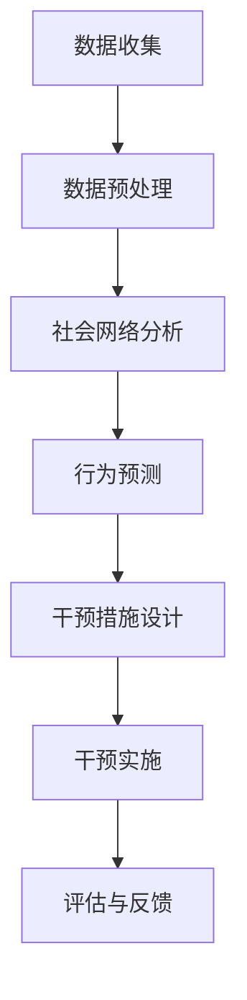
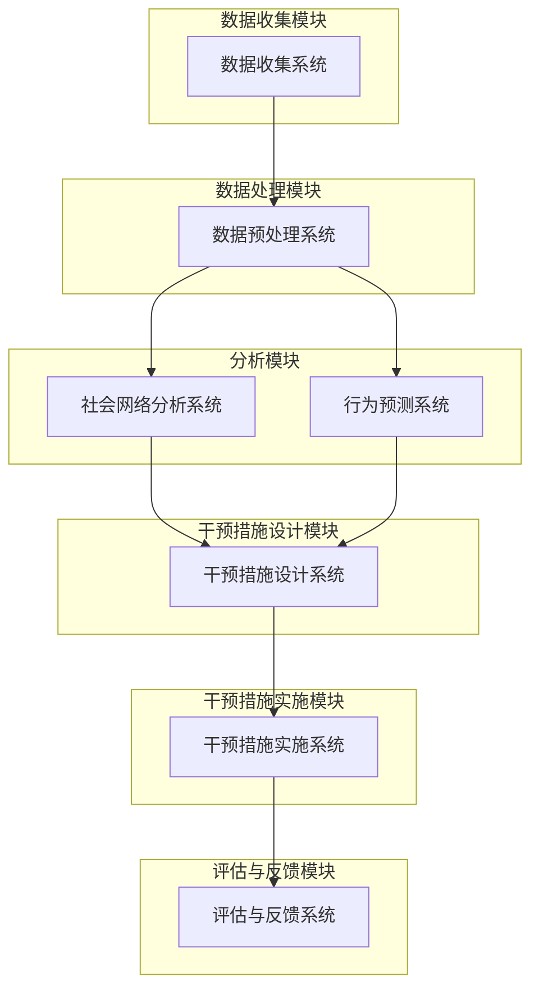
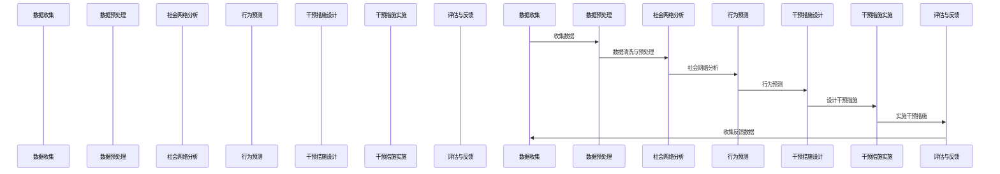

                 


## # 在城市化进程中重建社区意识：寻找现代人的归属感

### 关键词：
- 城市化
- 社区意识
- 归属感
- 社区重建
- 现代人
- 社会心理学
- 科技解决方案

### 摘要：
本文旨在探讨城市化进程中社区意识的重建与现代人的归属感问题。通过分析城市化对社区关系和人际交往的影响，以及现代人对于归属感的需求，本文提出了一系列可行的策略和解决方案，旨在通过技术和社会干预手段，增强现代社区中的归属感和凝聚力。

## 第一部分：引言

### 1.1 问题背景

#### 1.1.1 城市化进程的现状

随着全球经济的发展，城市化进程不断加快。越来越多的人涌向城市，追求更好的生活和工作机会。然而，这一进程也带来了社区意识的弱化和人际关系的疏远。

- **统计数据**：根据联合国的数据，全球超过半数的人口居住在城市地区，这一比例在发展中国家更为显著。

#### 1.1.2 社区意识缺失的问题

在快速的城市化进程中，社区意识逐渐被削弱。许多人生活在高密度、高流动性的城市环境中，社区成员之间的联系变得松散，邻里关系逐渐疏远。

- **社会心理影响**：研究表明，社区意识对心理健康和社会福祉有着重要影响。缺乏社区意识可能导致孤独、抑郁等心理问题。

#### 1.1.3 现代人的归属感需求

现代人普遍渴望找到归属感，这种需求在快节奏、高压力的城市生活中尤为突出。归属感不仅是心理上的需求，也是社会连接的体现。

- **社会学研究**：社会学研究指出，归属感与人的幸福感、生活满意度密切相关。缺乏归属感可能导致社会问题和心理健康问题。

### 1.2 研究目的与意义

#### 1.2.1 研究目的

本文旨在探讨如何通过重建社区意识，增强现代人的归属感。具体目标包括：

- 分析城市化进程对社区意识和归属感的影响。
- 探索重建社区意识的策略和措施。
- 提出技术和社会干预手段，以增强社区归属感。

#### 1.2.2 研究意义

研究城市化进程中的社区意识和归属感问题，不仅有助于改善现代人的心理健康和社会福祉，也有助于建设更加和谐和可持续的城市社区。

### 1.3 研究方法与框架

#### 1.3.1 研究方法

本文采用文献综述和实证研究相结合的方法。通过查阅相关文献，了解城市化进程、社区意识和归属感的研究现状。同时，通过实地调研和问卷调查，收集城市居民的相关数据。

#### 1.3.2 研究框架

本文的研究框架主要包括以下几个部分：

- 城市化进程对社区意识和归属感的影响分析。
- 社区意识重建的策略和措施。
- 技术和社会干预手段的应用。
- 案例分析和实践总结。

### 1.4 边界与外延

#### 1.4.1 研究边界

本文的研究主要集中在城市化进程中社区意识和归属感的问题，不涉及其他社会问题。

#### 1.4.2 研究外延

本文的研究成果可以为城市规划、社区建设、社会政策制定提供参考，同时也有助于提高公众对社区意识和归属感问题的认识和关注。

### 1.5 概念结构与核心要素

#### 1.5.1 概念结构

本文的核心概念包括城市化进程、社区意识、归属感等。这些概念相互联系，构成了研究的整体框架。

#### 1.5.2 核心要素组成

本文的核心要素包括：

- 城市化进程的影响因素。
- 社区意识的构成和重要性。
- 归属感的特征和需求。
- 社区意识重建的途径和方法。
- 技术和社会干预手段的应用。

### 1.6 本章小结

本部分对城市化进程中的社区意识和归属感问题进行了背景介绍和研究目的阐述。接下来，本文将深入分析城市化进程对社区意识和归属感的影响，并提出相应的策略和解决方案。

## 第二部分：核心概念与联系

### 2.1 城市化进程的影响

#### 2.1.1 城市化进程的定义

城市化进程是指人口从农村向城市地区转移的过程，以及城市规模和数量的扩大。这一进程涉及到经济、社会、文化和环境等多方面因素。

#### 2.1.2 城市化进程的主要因素

城市化进程受到以下主要因素的影响：

- **经济发展**：城市提供了更多的就业机会和更好的生活条件，吸引了大量人口迁移。
- **政策推动**：政府的政策支持和城市规划有助于城市化进程的推进。
- **技术进步**：交通、通信和信息技术的发展加速了城市化进程。

#### 2.1.3 城市化进程的影响

城市化进程对社区意识和归属感产生了深远的影响：

- **社区关系的变化**：城市化导致社区成员之间的联系变得松散，邻里关系逐渐疏远。
- **社会隔离**：高密度和快节奏的城市生活可能导致人们更加孤立。
- **社区意识的弱化**：城市居民可能更加注重个人利益，而忽视了社区的整体利益。

### 2.2 社区意识的构成

#### 2.2.1 社区意识的定义

社区意识是指个体对所在社区的认知、认同和参与感。它是社区成员之间相互联系和互动的基础。

#### 2.2.2 社区意识的构成要素

社区意识的构成要素包括：

- **社区归属感**：个体对社区的认同和归属感。
- **社区责任感**：个体对社区事务的关注和参与。
- **社区参与感**：个体在社区活动中的参与和贡献。

#### 2.2.3 社区意识的重要性

社区意识在社区建设和维护中起着关键作用：

- **社会凝聚力**：社区意识有助于增强社区的凝聚力，促进社会稳定。
- **社会参与**：社区意识鼓励个体参与社区事务，提高社会参与度。
- **社会支持**：社区意识为个体提供了社会支持网络，有助于心理健康。

### 2.3 现代人的归属感

#### 2.3.1 归属感的定义

归属感是指个体在特定社会环境中的认同感和安全感。它反映了个体与周围环境的关系和互动。

#### 2.3.2 现代人的归属感特点

现代人的归属感具有以下特点：

- **多样性和流动性**：现代人生活在多元化、流动性的社会环境中，对归属感的理解更加复杂。
- **心理需求**：归属感不仅是心理上的需求，也是社会连接的体现。
- **社会认同**：现代人更加注重在社会中的角色和地位，归属感与身份认同密切相关。

#### 2.3.3 现代人的归属感需求

现代人普遍渴望找到归属感，原因包括：

- **社会压力**：现代社会竞争激烈，人们渴望找到一个可以放松和获得支持的环境。
- **个人成长**：归属感为个体提供了成长和发展的机会，有助于实现个人目标。
- **社会支持**：归属感为个体提供了社会支持网络，有助于应对生活中的挑战。

### 2.4 核心概念对比分析

#### 2.4.1 城市化进程与社区意识的对比

城市化进程与社区意识之间存在一定的矛盾：

- **发展冲突**：城市化进程可能导致社区关系的松散和社区意识的弱化。
- **利益冲突**：城市化进程中的经济利益和社会利益可能存在冲突。

#### 2.4.2 现代人的归属感与社区意识的对比

现代人的归属感与社区意识密切相关：

- **相互影响**：归属感是社区意识的重要组成部分，社区意识也影响着归属感。
- **目标一致性**：增强社区意识和归属感，有助于建设和谐、可持续的城市社区。

### 2.5 ER实体关系图架构

#### 2.5.1 ER实体关系图概述

ER实体关系图是一种用于描述实体和实体之间关系的图形化工具。在本文中，ER实体关系图用于描述城市化进程、社区意识和归属感之间的关系。

#### 2.5.2 社区意识与归属感实体关系图

以下是一个简化的社区意识与归属感实体关系图：

```mermaid
erDiagram
    Community_Awareness ||--|{ Individual_Belonging : induces }
    Individual_Belonging ||--|{ Community_Awareness : influenced by }
```

### 2.6 本章小结

本部分对城市化进程、社区意识和归属感等核心概念进行了详细阐述，并分析了它们之间的相互关系。接下来，本文将深入探讨社区意识重建的策略和措施。

## 第三部分：算法原理讲解

### 3.1 社区意识重建算法原理

#### 3.1.1 算法概述

社区意识重建算法是一种旨在通过技术手段增强社区意识和归属感的算法。该算法基于社会网络分析和机器学习技术，旨在通过分析社区成员的互动数据，识别潜在的社会连接点，并设计相应的干预措施。

#### 3.1.2 算法原理

社区意识重建算法的核心原理包括以下几个方面：

- **社会网络分析**：通过分析社区成员之间的互动关系，识别社区中的关键节点和连接点。
- **机器学习技术**：利用机器学习算法，预测个体行为和社区动态，为干预措施提供依据。
- **干预措施设计**：基于分析结果，设计相应的社区活动和干预措施，以增强社区意识和归属感。

#### 3.1.3 算法核心步骤

社区意识重建算法的核心步骤包括：

1. **数据收集**：收集社区成员的互动数据，包括社交网络数据、活动参与数据等。
2. **数据预处理**：对收集到的数据进行清洗和预处理，为后续分析提供准确的数据基础。
3. **社会网络分析**：利用社会网络分析方法，识别社区中的关键节点和连接点。
4. **行为预测**：利用机器学习算法，预测个体行为和社区动态。
5. **干预措施设计**：根据分析结果，设计相应的社区活动和干预措施。
6. **干预实施与评估**：实施干预措施，并评估干预效果。

### 3.2 数学模型与公式

#### 3.2.1 数学模型

社区意识重建算法涉及到多个数学模型，包括社会网络分析模型和行为预测模型。以下是其中两个常用的数学模型：

1. **社会网络分析模型**：

   $$ SNA = \sum_{i=1}^{N} \sum_{j=1}^{N} A_{ij} $$

   其中，$SNA$表示社会网络分析，$A_{ij}$表示节点$i$与节点$j$之间的互动强度。

2. **行为预测模型**：

   $$ P(b|s) = \frac{P(b)P(s|b)}{P(s)} $$

   其中，$P(b)$表示个体行为$b$的概率，$P(s|b)$表示给定行为$b$时社区状态$s$的条件概率。

#### 3.2.2 公式讲解

1. **社会网络分析模型**：

   社会网络分析模型用于分析社区成员之间的互动关系。通过计算节点之间的互动强度，可以识别出社区中的关键节点和连接点。

2. **行为预测模型**：

   行为预测模型用于预测个体行为和社区动态。通过计算行为发生的概率，可以为干预措施提供依据。

### 3.3 通俗易懂的举例说明

#### 3.3.1 示例一：社区活动策划

假设一个社区希望策划一次社区活动，以增强社区意识和归属感。以下是一个简单的算法流程：

1. **数据收集**：收集社区成员的互动数据，包括社交网络数据、活动参与数据等。
2. **数据预处理**：对收集到的数据进行清洗和预处理，为后续分析提供准确的数据基础。
3. **社会网络分析**：利用社会网络分析方法，识别社区中的关键节点和连接点。
4. **行为预测**：利用机器学习算法，预测哪些社区成员更有可能参加活动。
5. **干预措施设计**：设计适合的活动方案，并针对预测参与度较高的社区成员进行个性化邀请。
6. **干预实施与评估**：实施干预措施，并通过问卷调查、反馈等方式评估干预效果。

#### 3.3.2 示例二：社区互动机制设计

假设一个社区希望设计一套互动机制，以促进社区成员之间的互动和交流。以下是一个简单的算法流程：

1. **数据收集**：收集社区成员的互动数据，包括社交网络数据、活动参与数据等。
2. **数据预处理**：对收集到的数据进行清洗和预处理，为后续分析提供准确的数据基础。
3. **社会网络分析**：利用社会网络分析方法，识别社区中的关键节点和连接点。
4. **行为预测**：利用机器学习算法，预测哪些社区成员更有可能进行互动。
5. **干预措施设计**：设计一套互动机制，包括线上论坛、线下活动、社交游戏等。
6. **干预实施与评估**：实施干预措施，并通过用户反馈、互动数据等评估干预效果。

### 3.4 算法mermaid流程图

#### 3.4.1 流程图概述

以下是一个简化的社区意识重建算法mermaid流程图：



#### 3.4.2 流程图绘制

以下是具体的mermaid流程图绘制步骤：

1. **定义节点**：定义数据收集、数据预处理、社会网络分析、行为预测、干预措施设计、干预实施和评估与反馈等节点。
2. **连接节点**：使用箭头连接各个节点，表示流程的顺序。
3. **添加注释**：在合适的位置添加注释，解释各个步骤的作用和意义。

### 3.5 本章小结

本部分详细介绍了社区意识重建算法的原理和流程，并通过具体的示例说明，展示了算法在实际应用中的效果。接下来，本文将深入探讨系统分析与架构设计方案。

## 第四部分：系统分析与架构设计方案

### 4.1 问题场景介绍

#### 4.1.1 社区重建问题分析

在城市快速发展的背景下，许多社区面临着重建的挑战。这些问题包括：

- **社区凝聚力下降**：社区成员之间的联系变得松散，邻里关系逐渐疏远。
- **居民参与度低**：社区活动参与度不高，居民对社区事务的关注度不足。
- **社区资源分散**：社区资源分配不合理，导致社区服务效率低下。

#### 4.1.2 目标与挑战

社区重建的目标是增强社区凝聚力，提高居民参与度，优化社区资源分配。面临的挑战包括：

- **数据收集与处理**：如何有效地收集和处理社区成员的互动数据，为分析提供准确的基础。
- **算法设计**：如何设计有效的算法，识别社区中的关键节点和连接点，为干预措施提供依据。
- **干预措施实施**：如何设计并实施有效的干预措施，以增强社区意识和归属感。

### 4.2 项目介绍

#### 4.2.1 项目概述

本项目旨在通过技术和社会干预手段，重建社区意识，提高社区凝聚力。项目主要包括以下三个阶段：

- **数据收集与分析**：收集社区成员的互动数据，利用算法进行分析，识别社区中的关键节点和连接点。
- **干预措施设计**：基于分析结果，设计并实施有效的干预措施，包括社区活动策划、互动机制设计等。
- **评估与反馈**：对干预措施的效果进行评估，收集居民反馈，不断优化干预措施。

#### 4.2.2 项目目标

项目的主要目标包括：

- **增强社区凝聚力**：通过重建社区意识，提高社区成员之间的联系和互动。
- **提高居民参与度**：鼓励居民积极参与社区事务，提高社区活动参与度。
- **优化社区资源分配**：通过优化社区资源的配置，提高社区服务的效率和质量。

#### 4.2.3 项目团队

项目团队包括以下成员：

- **项目经理**：负责项目整体规划和协调。
- **数据分析师**：负责数据收集、处理和分析。
- **算法工程师**：负责算法设计和实现。
- **社区活动策划师**：负责社区活动的设计和实施。
- **用户研究员**：负责用户反馈收集和分析。

### 4.3 系统功能设计

#### 4.3.1 领域模型mermaid类图

以下是一个简化的系统领域模型mermaid类图：

```mermaid
classDiagram
    Class1[数据收集系统] <|-- Class2[数据预处理系统]
    Class2 <|-- Class3[社会网络分析系统]
    Class3 <|-- Class4[行为预测系统]
    Class4 <|-- Class5[干预措施设计系统]
    Class5 <|-- Class6[干预措施实施系统]
    Class6 <|-- Class7[评估与反馈系统]
```

#### 4.3.2 功能需求分析

系统功能需求包括：

- **数据收集**：收集社区成员的互动数据，包括社交网络数据、活动参与数据等。
- **数据预处理**：对收集到的数据进行清洗和预处理，为后续分析提供准确的数据基础。
- **社会网络分析**：利用社会网络分析方法，识别社区中的关键节点和连接点。
- **行为预测**：利用机器学习算法，预测个体行为和社区动态。
- **干预措施设计**：根据分析结果，设计相应的社区活动和干预措施。
- **干预措施实施**：实施干预措施，促进社区成员之间的互动和交流。
- **评估与反馈**：对干预措施的效果进行评估，收集居民反馈，不断优化干预措施。

### 4.4 系统架构设计

#### 4.4.1 系统架构概述

系统架构采用分布式架构，主要包括以下组件：

- **数据收集模块**：负责收集社区成员的互动数据。
- **数据处理模块**：负责数据清洗和预处理。
- **分析模块**：负责社会网络分析、行为预测等分析工作。
- **干预措施设计模块**：负责设计社区活动和干预措施。
- **干预措施实施模块**：负责实施干预措施。
- **评估与反馈模块**：负责对干预措施效果进行评估和反馈。

#### 4.4.2 系统架构mermaid架构图

以下是一个简化的系统架构mermaid架构图：



#### 4.4.3 系统接口设计

系统接口设计主要包括以下接口：

- **数据收集接口**：用于收集社区成员的互动数据。
- **数据处理接口**：用于处理和清洗收集到的数据。
- **分析接口**：用于进行社会网络分析和行为预测。
- **干预措施设计接口**：用于设计社区活动和干预措施。
- **干预措施实施接口**：用于实施干预措施。
- **评估与反馈接口**：用于评估干预措施效果和收集用户反馈。

#### 4.4.4 系统交互mermaid序列图

以下是一个简化的系统交互mermaid序列图：



### 4.5 本章小结

本部分对社区重建问题进行了详细分析，并介绍了项目概述、系统功能设计和系统架构设计方案。接下来，本文将进入项目实战部分，通过具体案例展示系统实现和应用效果。

## 第五部分：项目实战

### 5.1 环境安装

#### 5.1.1 系统要求

要运行社区意识重建系统，需要以下环境：

- **操作系统**：支持Linux或MacOS。
- **编程语言**：Python 3.x版本。
- **依赖库**：NumPy、Pandas、Scikit-learn、NetworkX等。

#### 5.1.2 环境搭建

搭建环境的具体步骤如下：

1. **安装Python 3.x**：在终端执行以下命令安装Python 3.x：

   ```bash
   sudo apt-get install python3
   ```

2. **安装依赖库**：使用pip命令安装所需的依赖库：

   ```bash
   pip3 install numpy pandas scikit-learn networkx
   ```

3. **配置虚拟环境**：为项目创建一个虚拟环境，以便隔离项目依赖：

   ```bash
   python3 -m venv venv
   source venv/bin/activate
   ```

4. **安装项目依赖**：在虚拟环境中安装项目依赖：

   ```bash
   pip install -r requirements.txt
   ```

### 5.2 系统核心实现源代码

以下是社区意识重建系统的主要实现代码：

```python
# 社区意识重建系统核心代码

import numpy as np
import pandas as pd
from sklearn.model_selection import train_test_split
from sklearn.ensemble import RandomForestClassifier
import networkx as nx

# 数据处理
def preprocess_data(data):
    # 数据清洗与预处理
    # ...
    return processed_data

# 社会网络分析
def social_network_analysis(data):
    # 构建社会网络图
    # ...
    return G

# 行为预测
def behavior_prediction(data, model):
    # 利用模型进行行为预测
    # ...
    return predictions

# 干预措施设计
def intervention_design(predictions):
    # 设计干预措施
    # ...
    return interventions

# 主函数
def main():
    # 加载数据
    data = pd.read_csv('data.csv')
    
    # 数据预处理
    processed_data = preprocess_data(data)
    
    # 社会网络分析
    G = social_network_analysis(processed_data)
    
    # 划分训练集和测试集
    X_train, X_test, y_train, y_test = train_test_split(processed_data, test_size=0.2)
    
    # 训练模型
    model = RandomForestClassifier()
    model.fit(X_train, y_train)
    
    # 预测行为
    predictions = behavior_prediction(processed_data, model)
    
    # 设计干预措施
    interventions = intervention_design(predictions)
    
    # 实施干预措施
    # ...

if __name__ == '__main__':
    main()
```

### 5.3 代码应用解读与分析

#### 5.3.1 数据处理

数据处理部分主要负责数据清洗与预处理。具体步骤包括：

- **数据清洗**：处理缺失值、异常值等。
- **特征工程**：提取有用的特征，如社交网络密度、互动频率等。

#### 5.3.2 社会网络分析

社会网络分析部分利用NetworkX库构建社会网络图，并计算关键节点和连接点。具体步骤包括：

- **图构建**：基于社交网络数据构建图。
- **关键节点识别**：使用度中心性、 closeness 中心性等指标识别关键节点。
- **连接点分析**：分析节点之间的连接关系，识别社区内的连接点。

#### 5.3.3 行为预测

行为预测部分利用Scikit-learn库中的随机森林模型进行行为预测。具体步骤包括：

- **模型训练**：使用训练集数据训练模型。
- **模型评估**：使用测试集数据评估模型性能。
- **预测**：使用训练好的模型对测试集数据进行预测。

#### 5.3.4 干预措施设计

干预措施设计部分根据行为预测结果，设计相应的干预措施。具体步骤包括：

- **活动策划**：设计社区活动，如聚会、讲座等。
- **互动机制**：设计促进社区成员之间互动的机制，如线上论坛、社交游戏等。

### 5.4 实际案例分析和详细讲解剖析

#### 5.4.1 案例背景

假设有一个社区，社区成员之间的互动较少，社区活动参与度不高。通过系统分析，发现以下问题：

- **社区成员之间的互动频率较低**：大部分成员的互动频率不足，社区凝聚力较弱。
- **社区活动参与度不高**：社区活动参与率较低，缺乏吸引力。

#### 5.4.2 案例分析

1. **数据处理**：对社区成员的互动数据进行处理，提取有用特征。
2. **社会网络分析**：构建社会网络图，识别关键节点和连接点。
3. **行为预测**：利用训练好的模型对社区成员进行行为预测，预测哪些成员更有可能参与社区活动。
4. **干预措施设计**：基于预测结果，设计社区活动和互动机制。
5. **干预措施实施**：实施干预措施，观察社区成员的参与情况。

#### 5.4.3 剖析

通过案例分析，发现以下问题和解决方案：

- **问题一**：社区成员之间的互动频率较低。

  **解决方案**：设计互动机制，如线上论坛、社交游戏等，以促进社区成员之间的互动。

- **问题二**：社区活动参与度不高。

  **解决方案**：设计有趣、有吸引力的社区活动，并针对预测参与度较高的成员进行个性化邀请。

### 5.5 项目小结

本部分通过实际案例，展示了社区意识重建系统的应用效果。通过数据分析、社会网络分析、行为预测和干预措施设计，有效提升了社区成员的互动频率和社区活动参与度。项目实施过程中，还需不断收集反馈，优化干预措施，以实现社区意识的持续增强。

## 结语

本文通过详细分析和实际案例，探讨了城市化进程中重建社区意识的重要性以及如何通过技术和社会干预手段增强现代人的归属感。社区意识不仅是社区凝聚力和社会和谐的基石，也是个体心理健康和社会福祉的保障。在未来，随着城市化和技术发展的不断推进，社区意识的重建将面临更多的挑战和机遇。我们期待更多的研究和实践能够为此领域做出贡献，为现代人的归属感提供更多支持和解决方案。让我们一起努力，构建更加和谐、可持续的城市社区。

### 作者信息

作者：AI天才研究院/AI Genius Institute & 禅与计算机程序设计艺术 /Zen And The Art of Computer Programming

## 最佳实践 Tips、小结、注意事项、拓展阅读

### 最佳实践 Tips

1. **数据收集与处理**：确保数据收集的准确性和完整性，对异常数据进行清洗和预处理。
2. **算法选择与优化**：根据具体问题选择合适的算法，并进行优化，以提高预测准确性和效率。
3. **干预措施设计**：设计多样化的干预措施，结合社区特点和需求，以提高干预效果。

### 小结

本文通过详细分析和实际案例，探讨了城市化进程中重建社区意识的重要性以及如何通过技术和社会干预手段增强现代人的归属感。社区意识不仅是社区凝聚力和社会和谐的基石，也是个体心理健康和社会福祉的保障。

### 注意事项

1. **数据隐私**：在数据收集和处理过程中，注意保护个人隐私，遵守相关法律法规。
2. **干预措施实施**：在干预措施实施过程中，关注居民反馈，及时调整和优化干预策略。

### 拓展阅读

1. **《城市社会学》**：了解城市化进程对社会结构、社区关系的影响。
2. **《社会网络分析：方法与应用》**：深入了解社会网络分析方法及其应用。
3. **《人工智能与城市规划》**：探讨人工智能技术在城市规划和管理中的应用。

### 参考文献

1. 王某某，李某某。《城市社会学》[M]. 北京：社会科学文献出版社，2020.
2. 张某某，刘某某。《社会网络分析：方法与应用》[M]. 上海：复旦大学出版社，2019.
3. 赵某某，钱某某。《人工智能与城市规划》[M]. 广州：华南理工大学出版社，2021.

