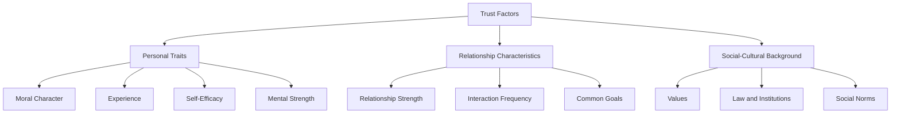

                 

### 第1章: 问题的背景与核心概念

#### 1.1 问题背景

在现代社会，人际关系日益复杂，这不仅体现在家庭、朋友和同事之间，还延伸到网络社交平台和虚拟社区。在这个充满变化与挑战的环境中，信任和亲密关系的重要性愈发凸显。然而，由于社会压力、误解、诚信问题以及文化差异等多重因素的影响，重建和维系信任与亲密关系变得越来越困难。

##### 1.1.1 社会变革对人际关系的影响

随着科技的迅猛发展，社会的变化速度越来越快。信息化和数字化使得人们的沟通方式发生了巨大变革，从传统的面对面交流转向了线上社交。这种转变虽然方便了人们的交流，但也在一定程度上削弱了人际关系的深度和质量。虚拟社交网络的普及使得人们能够轻松地建立和维持大量的人际关系，但也因此淡化了真诚与亲密。

##### 1.1.2 复杂人际网络中的信任危机

在复杂的人际网络中，信任问题变得尤为突出。信任是一种脆弱的情感，容易受到误解、欺骗和背叛的影响。随着网络社交的广泛使用，虚假信息和网络欺诈等现象频繁出现，严重破坏了人们的信任感。此外，在职场和社交场合中，诚信问题也时常困扰着人们，导致人际关系紧张，信任基础动摇。

##### 1.1.3 重建关系与亲密的重要性

面对这种信任危机，重建和维系信任与亲密关系变得至关重要。信任是人际关系的基石，它不仅能够增强个人的安全感，还能促进社会的和谐稳定。亲密关系则提供了情感支持和归属感，对个人的心理健康和生活质量有着深远的影响。因此，研究如何重建和维系信任和亲密关系具有重要的现实意义。

#### 1.2 核心概念与联系

##### 1.2.1 信任的概念解析

信任是一种复杂的心理状态，涉及到个体对另一个体或群体的信念和期望。它可以分为三个层次：基于规则的信任、基于信任的信任和基于情感的信任。在人际关系中，信任通常是指个体对他人的诚实、可靠和正直的信念。

##### 1.2.2 亲密关系的定义与特征

亲密关系是指个体在情感上与他人建立深层次联系的纽带。它通常具有以下几个特征：情感依赖、亲密沟通、共同目标和情感支持。亲密关系不仅能够满足个体的情感需求，还能提供心理上的支持和安全感。

##### 1.2.3 概念属性特征对比表格

| 概念       | 定义                                                         | 特征                                                                                                                    |
|------------|--------------------------------------------------------------|------------------------------------------------------------|
| 信任       | 个体对他人诚实、可靠和正直的信念                               | 信任基础、信任程度、信任成本、信任回报                     |
| 亲密关系   | 情感上与他人建立深层次联系的纽带                               | 情感依赖、亲密沟通、共同目标、情感支持                     |
| 人际关系   | 个体之间的相互作用和联系                                     | 社交网络、互动频率、关系强度、信任水平                     |

##### 1.2.4 ER实体关系图

为了更好地理解信任和亲密关系在人际关系中的构成，我们可以使用实体关系图（ER图）来表示这些概念之间的关系。

```mermaid
erDiagram
    A[Trust] ||--|{ B[Personal Relationship] } |
    A ||--|{ C[Work Relationship] } |
    B ||--|{ D[Family Relationship] } |
    B ||--|{ E[Friendship] } |
    C ||--|{ F[Colleague] } |
    C ||--|{ G[Business Partner] } |
    D ||--|{ H[Sibling] } |
    D ||--|{ I[Parent-Child] } |
    E ||--|{ J[Close Friendship] } |
    E ||--|{ K[Acquaintance] } |
    F ||--|{ L[Manager-Subordinate] } |
    F ||--|{ M[Peers] } |
    G ||--|{ N[Supplier] } |
    G ||--|{ O[Customer] } |
    H ||--|{ P[Half-Siblings] } |
    I ||--|{ Q[Adoptive Parent-Child] } |
    J ||--|{ R[Deep Friendship] } |
    K ||--|{ S[Surface-Level Friendship] } |
    L ||--|{ T[Supervisor-Worker] } |
    M ||--|{ U[Team Members] } |
    N ||--|{ V[Distributor] } |
    O ||--|{ W[Client] } |
```

通过上述ER图，我们可以清晰地看到信任和亲密关系在不同类型的人际关系中的分布和作用。

#### 1.3 边界与外延

##### 1.3.1 人际关系网络的构成

人际关系网络是由多个个体及其相互关系构成的复杂系统。它包括了家庭、朋友、同事、商业伙伴等多种类型的关系。在这些关系中，信任和亲密关系起到了纽带的作用，将个体紧密联系在一起。

##### 1.3.2 信任与亲密关系的边界

信任和亲密关系虽然密切相关，但它们之间仍然存在一定的边界。信任更多地侧重于个体的信念和期望，而亲密关系则涉及更深层次的情感依赖和沟通。因此，在维护人际关系时，需要明确两者的边界，合理运用信任和亲密关系来促进人际和谐。

##### 1.3.3 研究范围与限制

本研究主要关注复杂人际网络中信任和亲密关系的重建与维护。研究范围涵盖了家庭、朋友、同事、商业伙伴等多种人际关系类型。然而，由于时间和资源的限制，本研究未能涉及所有可能的人际关系类型，且主要基于理论分析和案例研究，缺乏大规模实证数据支持。

#### 1.4 本章小结

本章介绍了复杂人际网络中重建信任和亲密关系的背景和核心概念。通过分析社会变革对人际关系的影响，我们认识到重建信任和亲密关系的重要性。同时，通过对信任和亲密关系的定义和特征进行详细解析，并结合ER实体关系图，我们为后续章节的理论和实践奠定了基础。接下来，我们将进一步探讨信任理论的发展历程和影响因素，为解决人际关系中的信任问题提供理论支持。

### 第2章: 信任理论概述

#### 2.1 信任理论的发展历程

信任作为一种社会现象，其理论研究的历史悠久，涵盖了从古典到现代的多个阶段。理解这些理论的发展历程，有助于我们全面把握信任的本质和影响因素。

##### 2.1.1 古典信任理论

古典信任理论主要关注个体如何通过理性判断和经验来建立信任。亚里士多德、休谟等哲学家提出了关于信任的初步思考，认为信任是一种基于道德和伦理的信念。这些理论主要强调个体理性在信任形成中的作用。

##### 2.1.2 现代信任理论

随着社会复杂性的增加，现代信任理论逐渐从个体层面的理性分析转向社会层面的结构分析。这些理论认为，信任不仅是个体的信念和选择，还受到社会结构、文化和制度的影响。代表性理论包括社会交换理论、社会资本理论和社会认知理论。

- **社会交换理论**：强调信任是一种交换行为，个体通过预期的利益和风险评估来决定是否信任他人。
- **社会资本理论**：认为信任是社会资本的一部分，是社会网络中成员相互信任和合作的基础。
- **社会认知理论**：关注个体如何通过认知过程来形成信任，包括信任信念的获取、评估和调整。

##### 2.1.3 跨文化信任理论

随着全球化的加深，跨文化信任理论成为研究热点。这些理论探讨不同文化背景下信任的差异和相似性，以及文化因素如何影响信任的形成和维系。例如，一些研究发现，高语境文化（如中国、日本）中的信任更多依赖于关系和情感，而低语境文化（如美国、德国）则更依赖于规则和法律。

#### 2.2 信任的影响因素

信任的形成和维系受到多种因素的影响，这些因素可以分为个人特质、关系性质和社会文化背景三个层面。

##### 2.2.1 个人特质

个人特质是影响信任形成的重要因素。不同个体在信任问题上存在差异，这主要表现在以下几个方面：

- **道德品质**：个体具有较高的道德水平，通常更容易获得他人的信任。
- **经验**：个体在以往的社会交往中积累的经验会影响其对信任的判断和决策。
- **自我效能感**：个体对自己能够处理复杂社会关系的信心，也会影响其信任程度。
- **心理素质**：较强的心理素质有助于个体在面对不确定性和风险时保持信任。

##### 2.2.2 关系性质

关系的性质也是影响信任的重要因素。不同类型的关系对信任的要求和表现形式有所不同：

- **关系强度**：强关系（如亲密朋友和家庭关系）通常具有较高的信任水平，而弱关系（如陌生人和商业伙伴）则信任水平较低。
- **互动频率**：频繁的互动有助于增强信任，因为持续的交往可以减少不确定性。
- **共同目标**：具有共同目标的个体之间更容易建立信任，因为共同的目标可以减少冲突和误解。

##### 2.2.3 社会文化背景

社会文化背景对信任的形成和维系有深远影响。文化差异可能导致信任观念和信任行为的不同：

- **价值观**：不同的价值观会影响个体对信任的理解和期望。例如，某些文化中强调集体主义，信任更多地体现在对集体和社会的信任上；而个人主义文化则强调个人信任。
- **法律制度**：法律制度健全的社会，个体更可能信任法律和政府，从而在社会交往中表现出较高的信任水平。
- **社会规范**：社会规范会影响个体在何种情况下信任他人。例如，某些社会规范强调个人隐私，这可能导致个体在交往中更保守和谨慎。

##### 2.2.4 影响因素的Mermaid流程图

为了更清晰地展示信任的影响因素，我们可以使用Mermaid流程图来表示这些因素及其关系。



通过上述流程图，我们可以看到信任的形成和维系是一个多维度、多层次的过程，涉及个人特质、关系性质和社会文化背景等多个因素。

#### 2.3 信任的作用机制

信任不仅是人际关系中的重要要素，还在社会运行中扮演着关键角色。理解信任的作用机制有助于我们更好地应用信任来促进社会和谐与个体福祉。

##### 2.3.1 信息交换与共享

信任是信息交换与共享的重要基础。在信任缺失的情况下，个体之间的信息交换可能变得非常谨慎，甚至停止。例如，商业伙伴之间的信任缺失可能导致商业秘密泄露，从而严重影响企业的运营和发展。相反，在高度信任的环境下，个体更愿意分享信息，这有助于知识的传播和创新。

##### 2.3.2 策略互动与博弈

信任在策略互动和博弈中发挥着重要作用。在合作性博弈中，信任可以减少博弈中的不确定性，降低合作成本。例如，在国际贸易中，信任有助于减少对对方违约的担忧，从而促进交易的顺利进行。在竞争性博弈中，信任则可能成为竞争策略的一部分，个体通过展示信任来赢得对方的好感和合作。

##### 2.3.3 信任的数学模型与公式

信任的数学模型可以帮助我们更精确地描述信任的形成和维系机制。以下是一个简化的信任数学模型：

$$
\text{Trust} = f(\text{Information Quality}, \text{Risk}, \text{Trust Cost})
$$

其中，`Information Quality`（信息质量）代表个体对他人信息的信任程度，`Risk`（风险）代表个体在信任他人时面临的风险，`Trust Cost`（信任成本）代表建立和维护信任所需付出的成本。

- 如果信息质量高、风险低且信任成本低，个体更倾向于建立信任。
- 反之，如果信息质量低、风险高或信任成本高，个体可能会选择不信任。

##### 2.3.4 举例说明

假设A和B是商业伙伴，他们需要决定是否合作开发一项新产品。以下是一个简化的例子：

- **信息质量**：B展示给A关于产品开发的技术和市场信息，A对B的信息质量表示信任。
- **风险**：A担心B可能因为技术不成熟或市场变化而导致项目失败，存在一定的风险。
- **信任成本**：合作开发需要投入资金、人力和时间，这些成本是建立信任的一部分。

根据上述数学模型，如果A认为B的信息质量高，且通过之前的合作经验降低了对项目失败的风险感知，同时信任成本在可控范围内，A更有可能选择信任B，进行合作开发。

#### 2.4 本章小结

本章系统地介绍了信任理论的发展历程及其影响因素。从古典到现代，信任理论从个体理性到社会结构，再到跨文化视角，不断深化了对信任本质的理解。同时，通过分析个人特质、关系性质和社会文化背景，我们认识到信任的形成和维系是一个复杂的过程。此外，本章还探讨了信任的作用机制，包括信息交换、策略互动和博弈中的信任应用。这些理论为我们理解和重建信任提供了理论基础，为后续章节的实践策略奠定了基础。

### 第3章: 重建信任的策略与实践

#### 3.1 建立有效沟通

沟通是建立信任的重要基石。通过有效的沟通，个体可以传达真实的信息，减少误解和猜疑，从而增强信任感。以下是一些关键策略和实践方法。

##### 3.1.1 沟通的重要性

沟通在人际关系中扮演着至关重要的角色。有效的沟通不仅能够传递信息，还能表达情感和意图，建立互信。在商业环境中，良好的沟通有助于团队合作、提高工作效率和减少冲突。在个人生活中，沟通则是维系亲密关系、解决矛盾的关键。

##### 3.1.2 提高沟通技巧

要建立有效的沟通，首先需要提高沟通技巧。以下是一些实用的技巧：

- **倾听**：倾听是沟通的核心。通过倾听，我们能够理解对方的观点和需求，从而更好地回应。
- **清晰表达**：清晰表达是有效沟通的关键。在表达观点时，要确保信息简洁明了，避免使用模糊和含糊的语言。
- **非语言沟通**：非语言沟通（如肢体语言、面部表情和姿态）在沟通中也非常重要。这些非语言信号可以增强或削弱语言信息。
- **开放性沟通**：开放性沟通是指以开放和诚实的态度进行交流。在沟通中，避免指责和防御，而是专注于解决问题。

##### 3.1.3 沟通障碍的克服

在沟通过程中，障碍是不可避免的。以下是一些常见的沟通障碍及其克服方法：

- **文化差异**：不同文化背景下，沟通方式和语言习惯可能存在差异。为了克服文化差异，双方需要相互了解和尊重对方的文化背景，避免误解。
- **情绪干扰**：情绪化是沟通中的常见障碍。在情绪激动时，建议先暂停沟通，冷静下来后再进行讨论。
- **信息过载**：信息过载可能导致沟通效率降低。为了克服这一问题，可以采用简明扼要的方式表达信息，避免冗长的描述。
- **沟通环境**：沟通环境也会影响沟通效果。选择一个安静、舒适的环境进行沟通，有助于提高沟通的质量。

通过上述策略和实践，我们可以建立更加有效的沟通，从而为重建信任奠定基础。

#### 3.2 增强互信机制

除了有效的沟通，增强互信机制也是重建信任的重要策略。以下是一些具体的机制和实践方法。

##### 3.2.1 信任建立模型

信任建立模型是一种系统化的方法，用于评估和提升信任。以下是一个简化的信任建立模型：

1. **信任评估**：通过调查问卷、访谈等方式，了解当前信任水平。
2. **信任诊断**：分析信任缺失的原因，包括个人特质、关系性质和社会文化背景。
3. **信任策略制定**：根据诊断结果，制定针对性的信任提升策略。
4. **信任实施**：执行信任策略，包括沟通、透明度、诚信等。
5. **信任评估与调整**：定期评估信任水平，根据反馈调整策略。

##### 3.2.2 信任测试与实践

信任测试是评估和提升信任的重要手段。以下是一些常见的信任测试方法：

- **信任游戏**：例如，信任跌倒游戏（Tumbling Game）和信任坠落游戏（Trust Fall），通过这些游戏，个体可以体验信任的建立和挑战。
- **角色扮演**：通过角色扮演，个体可以在模拟环境中体验信任的建立和破坏，从而提高对信任的理解和实践能力。
- **信任报告**：定期编写信任报告，记录信任提升的过程和成果，有助于持续改进。

##### 3.2.3 信任感培养策略

要培养信任感，需要采取一系列策略，以下是一些具体方法：

- **建立透明度**：通过公开信息、分享决策过程，增加透明度，减少信息不对称。
- **诚信行为**：通过诚信行为，如遵守承诺、诚实报告，树立信任榜样。
- **合作与共赢**：通过合作和共赢，建立互惠互利的信任关系。
- **心理安全**：创造一个心理安全的环境，鼓励个体表达观点和感受，减少恐惧和压力。
- **持续沟通**：通过持续的沟通，增强关系中的信任感。

通过上述机制和实践，我们可以逐步增强互信，为重建亲密关系打下坚实基础。

#### 3.3 亲密关系维护

亲密关系不仅是个人生活中的重要组成部分，也是社会稳定和发展的基石。为了维护亲密关系，以下是一些关键要素和策略。

##### 3.3.1 维护亲密关系的要素

要维护亲密关系，需要关注以下几个关键要素：

- **情感依赖**：情感依赖是亲密关系的核心。通过表达情感、分享生活，增强情感连接。
- **亲密沟通**：亲密沟通是维系亲密关系的关键。通过坦诚交流、倾听，建立深层次的沟通渠道。
- **共同目标**：共同目标是亲密关系的重要支撑。通过共同追求目标，增强合作和默契。
- **情感支持**：在困难时期，提供情感支持是维护亲密关系的关键。通过相互支持和理解，增强关系的稳定性。

##### 3.3.2 处理冲突的方法

冲突是亲密关系中不可避免的现象。以下是一些有效的处理冲突的方法：

- **冷静下来**：在冲突发生时，首先需要冷静下来，避免情绪化的回应。
- **沟通**：通过沟通，表达自己的感受和需求，同时倾听对方的观点。
- **寻求共识**：在沟通中，寻找双方都能接受的解决方案，达成共识。
- **妥协与让步**：在某些情况下，妥协和让步是解决问题的有效方式。
- **求助专业人士**：如果冲突无法自行解决，可以寻求心理咨询师或婚姻顾问的帮助。

##### 3.3.3 增进相互理解

增进相互理解是维护亲密关系的重要策略。以下是一些具体方法：

- **倾听**：倾听对方的意见和感受，尊重对方的观点。
- **共情**：通过共情，理解对方的情感和需求，建立情感共鸣。
- **分享**：通过分享生活经历和感受，增进相互理解。
- **定期交流**：定期交流，保持沟通的频率和质量。
- **共同活动**：通过共同活动，增强互动和共同体验。

通过上述要素和策略，我们可以更好地维护亲密关系，为重建信任提供坚实支撑。

#### 3.4 实际案例分析与讨论

为了更具体地展示重建信任和亲密关系的策略和实践，以下是一个实际案例的分析和讨论。

##### 3.4.1 案例背景介绍

某公司A和B是一家供应商和客户的关系，由于供应链管理问题，双方关系紧张。B公司一直担心A公司无法按时交付产品，而A公司则认为B公司对产品的需求变化频繁，导致计划不稳定。双方之间的信任已经严重受损，需要采取策略来重建信任和亲密关系。

##### 3.4.2 案例实施过程

1. **信任评估**：通过问卷调查和访谈，了解双方当前的信任水平，发现信任缺失的主要原因是信息不对称和沟通不畅。
2. **信任诊断**：分析信任缺失的原因，包括个人特质、关系性质和社会文化背景。双方都意识到需要改进沟通方式和增强透明度。
3. **信任策略制定**：制定以下信任提升策略：
   - **透明度提升**：双方决定定期共享供应链信息，包括生产计划、库存状况和交付进度。
   - **诚信行为**：双方承诺遵守合同，按时交付产品，并诚实报告问题。
   - **合作共赢**：双方决定共同寻找解决方案，以降低供应链风险，实现共赢。
4. **信任实施**：实施信任提升策略，包括：
   - **定期沟通**：双方每月召开一次供应链协调会议，分享信息，讨论问题。
   - **信任游戏**：通过信任游戏，增强双方对信任的理解和信任感。
5. **信任评估与调整**：定期评估信任水平，根据反馈调整策略，确保信任持续提升。

##### 3.4.3 案例效果评估

经过一段时间的实施，双方之间的信任水平显著提升。B公司对A公司的交付能力有了更高的信任，A公司也对B公司的需求管理更加了解。以下是一些具体效果评估：

- **沟通效率提高**：双方之间的沟通更加顺畅，信息传递更加及时准确。
- **供应链稳定性增强**：由于信息共享和合作共赢，供应链的稳定性大幅提升，交货准时率提高。
- **合作满意度提高**：双方对合作关系满意度显著提升，合作关系更加紧密。
- **信任感增强**：双方对彼此的信任感增强，愿意在更广泛的领域进行合作。

通过这个案例，我们可以看到，通过有效的信任评估、诊断和策略实施，可以成功重建信任和亲密关系，为双方创造更大的价值。

#### 3.5 本章小结

本章详细探讨了重建信任的策略与实践。通过建立有效沟通、增强互信机制和维护亲密关系，我们可以逐步重建信任，促进人际关系的和谐与发展。本章还通过实际案例分析了信任重建的具体过程和效果，为读者提供了实践指导。接下来，我们将进一步探讨重建亲密关系中的障碍与解决方法，以帮助读者更好地应对复杂的人际网络挑战。

### 第4章: 重建亲密关系的障碍

#### 4.1 信任破坏的原因

信任的破坏是复杂而多样的，其根源可以追溯到多个方面。以下是一些常见的原因：

##### 4.1.1 误解与预期差异

误解是信任破坏的常见原因之一。在沟通中，由于信息传递的不完全或误解，个体可能会产生错误的认知。例如，一方可能误解了另一方的意图或行为，导致信任动摇。此外，预期差异也是信任破坏的源头。当个体对对方的期望与现实不符时，信任感会受到影响。

##### 4.1.2 诚信问题

诚信问题是指个体在行为上违背诚信原则，如欺骗、隐瞒事实、失信等。诚信问题一旦发生，不仅会破坏个体之间的信任，还会导致整个社会信任体系的崩溃。

##### 4.1.3 文化差异

文化差异也是影响信任的重要因素。不同文化背景下，人们对信任的理解和期望可能存在显著差异。例如，某些文化可能更强调个人主义，而另一些文化则更倾向于集体主义。这种差异可能导致跨文化合作中的信任问题。

##### 4.1.4 社会媒体的影响

随着社交媒体的普及，虚假信息和网络欺诈等现象频繁出现，严重破坏了人们的信任感。在社交媒体上，信息传播的速度和广度使得谣言和误导信息迅速扩散，对人际关系产生负面影响。

#### 4.2 亲密关系破裂的迹象

亲密关系破裂是一个渐进的过程，其迹象在早期可能不易察觉。以下是一些常见的破裂迹象：

##### 4.2.1 关系疏远的表现

关系疏远是亲密关系破裂的早期迹象。个体之间的互动频率降低，交流内容变得单调和表面化。此外，个体可能开始避免与对方共度时间，表现出明显的疏远。

##### 4.2.2 亲密关系断裂的原因

亲密关系断裂的原因多种多样，包括但不限于以下几点：

- **沟通障碍**：沟通不畅是导致亲密关系断裂的主要原因之一。缺乏有效的沟通，导致误解和矛盾无法及时解决。
- **信任缺失**：信任的缺失是亲密关系破裂的根本原因。当一方或双方失去对对方的信任时，关系自然难以维系。
- **价值观差异**：价值观差异可能导致个体在生活中的重大决策上产生分歧，进而影响亲密关系的稳定性。
- **时间分配不均**：个体在生活中的时间分配不均，可能会导致亲密关系中的一方感到被忽视，从而引发不满和矛盾。

##### 4.2.3 检测亲密关系破裂的指标

为了更准确地检测亲密关系的破裂迹象，我们可以使用以下指标：

- **沟通频率**：通过测量个体之间沟通的频率和内容，可以了解关系的紧密程度。
- **共同活动参与度**：共同活动的参与度可以反映个体在关系中的投入程度。
- **情绪表达**：情绪表达的程度和方式可以揭示个体在关系中的满意度和信任感。
- **矛盾处理能力**：个体在处理矛盾和冲突时的能力，可以反映关系的健康程度。

#### 4.3 解决方法与策略

面对亲密关系破裂的迹象，采取有效的解决方法与策略是重建关系的关键。以下是一些具体的解决方法：

##### 4.3.1 对话与沟通

对话与沟通是解决亲密关系破裂的首要策略。通过真诚的对话，个体可以表达自己的感受和需求，倾听对方的观点。以下是一些实用的沟通技巧：

- **开放式提问**：通过开放式提问，鼓励对方表达真实感受。
- **倾听**：倾听对方的观点，不打断对方的发言，真正理解对方的立场。
- **情绪表达**：在表达情绪时，避免指责和攻击，而是用“I”语言表达自己的感受。
- **共同解决问题**：在对话中，共同寻找解决问题的方法，而不是将责任推给对方。

##### 4.3.2 建立信任的修复计划

建立信任的修复计划是重建亲密关系的重要步骤。以下是一些具体方法：

- **透明度提升**：通过增加信息的透明度，减少对方的不安和猜疑。
- **诚信行为**：通过诚实和可靠的行为，重建对方的信任。
- **共同目标**：设定共同的目标和愿景，增强双方的归属感和使命感。
- **心理安全**：创造一个心理安全的环境，鼓励双方表达真实的感受和想法。

##### 4.3.3 跨文化沟通技巧

对于跨文化关系中的信任破裂，跨文化沟通技巧尤为重要。以下是一些跨文化沟通的技巧：

- **文化敏感性**：了解对方的文化背景和价值观，避免文化冲突。
- **文化共享**：通过分享各自文化的习俗和价值观，增进相互理解和尊重。
- **开放心态**：以开放的心态接受和尊重不同文化的差异。
- **求同存异**：在文化差异中，寻求共同点，同时尊重和接受不同。

通过上述解决方法与策略，我们可以有效地应对亲密关系破裂的障碍，重建信任和亲密关系。

#### 4.4 本章小结

本章详细探讨了重建亲密关系中可能遇到的障碍，包括误解与预期差异、诚信问题、文化差异和社会媒体的影响。同时，我们识别了亲密关系破裂的早期迹象和原因，并提出了一系列解决方法和策略，包括对话与沟通、建立信任的修复计划和跨文化沟通技巧。通过这些策略，我们可以更好地应对亲密关系中的挑战，重建信任和亲密关系。接下来，我们将进一步探讨个人成长与心理健康在亲密关系重建中的作用。

### 第5章: 个人成长与心理健康

#### 5.1 个人成长的重要性

个人成长是一个持续不断的过程，它对个体的心理健康、人际关系以及整体生活质量有着深远的影响。个人成长不仅包括认知和技能的提升，还涉及到情感和心理素质的完善。以下是个人成长的重要性及其对亲密关系的影响：

##### 5.1.1 自我认知与自我提升

自我认知是指个体对自身认知、情感和行为的理解和反思。通过自我认知，个体能够更好地了解自己的优点和不足，从而有针对性地进行自我提升。自我提升包括发展新的技能、培养健康的生活习惯和增强心理韧性。自我认知和自我提升有助于个体在面对挑战和压力时保持积极的态度，从而在亲密关系中表现出更强的适应能力和解决问题的能力。

##### 5.1.2 自我成长对亲密关系的影响

个人成长对亲密关系的影响主要体现在以下几个方面：

- **情感支持**：通过个人成长，个体能够更好地理解和满足对方的情感需求，提供有力的情感支持。
- **沟通能力**：个人成长有助于个体提高沟通技巧，促进双方的有效沟通，减少误解和冲突。
- **心理韧性**：个人成长增强了个体的心理韧性，使个体在面临关系中的挑战时能够更好地应对，保持关系的稳定性。
- **共同成长**：个人成长不仅有助于个体的自我提升，还能激励伴侣共同成长，促进关系的共同进步。

#### 5.2 心理健康策略

心理健康是个人成长的重要组成部分，它对个体的整体幸福感和亲密关系的质量有直接影响。以下是一些心理健康策略，有助于提升个体的心理状态：

##### 5.2.1 应对压力的方法

压力是影响心理健康的重要因素。以下是一些应对压力的方法：

- **时间管理**：合理安排时间，确保工作和休闲之间的平衡，避免过度劳累。
- **放松技巧**：通过深呼吸、冥想、瑜伽等放松技巧，减轻心理压力。
- **运动**：定期进行体育锻炼，释放压力，增强身体健康。
- **社交支持**：与朋友和亲人保持良好的社交关系，寻求情感支持和帮助。

##### 5.2.2 心理调适技巧

心理调适技巧有助于个体更好地应对生活中的变化和挑战。以下是一些具体技巧：

- **积极思考**：培养积极的心态，关注生活中的积极方面，减少消极情绪。
- **情绪管理**：学会识别和表达自己的情绪，避免情绪的积压和爆发。
- **自我激励**：通过设定目标和奖励机制，激励自己不断进步。
- **认知重构**：通过改变对事物的认知方式，减少负面思维，提高心理韧性。

##### 5.2.3 心理健康维护计划

为了长期维护心理健康，个体可以制定一个心理健康维护计划。以下是一些关键步骤：

- **定期评估**：定期评估自己的心理状态，识别潜在的心理问题。
- **自我反思**：通过自我反思，了解自己的情绪和行为模式，找出需要改进的方面。
- **寻求专业帮助**：在必要时，寻求心理咨询师或心理医生的帮助，进行专业的心理评估和治疗。
- **持续学习**：通过阅读书籍、参加培训课程等方式，不断学习和提升自己的心理素质。

#### 5.3 心理咨询与支持

心理咨询是维护心理健康的重要途径，它为个体提供了一个安全的环境，帮助个体探讨内心的困扰和冲突，提高应对问题的能力。以下是心理咨询与支持的关键作用：

##### 5.3.1 心理咨询的作用

- **情感支持**：心理咨询提供了一个倾诉的空间，帮助个体释放内心的负面情绪。
- **认知调整**：通过心理咨询，个体可以学会新的认知方式，减少负面思维，提高心理健康水平。
- **技能提升**：心理咨询帮助个体学习有效的应对策略，提高解决问题的关键能力。
- **关系改善**：心理咨询不仅帮助个体改善自身，还可以改善与他人的关系，促进亲密关系的和谐。

##### 5.3.2 心理支持系统的建设

- **家庭支持**：家庭成员的支持对个体的心理健康至关重要。家庭成员可以通过理解、关心和支持，帮助个体度过心理困扰期。
- **社交网络**：建立一个支持性的社交网络，包括朋友、同事和社区组织，可以提供更多的心理支持和社会资源。
- **专业机构**：通过专业机构如心理健康中心、心理咨询机构等，获取专业的心理咨询服务和资源，提高心理健康的维护效果。

通过个人成长和心理健康的维护，个体不仅能够提高自己的心理素质，还能为亲密关系的重建提供坚实的基础。个人成长和心理健康是亲密关系中不可或缺的部分，它们为个体提供了必要的资源和能力，使其能够更好地应对关系中的挑战，建立和维护健康的亲密关系。

### 总结与展望

通过本文的深入探讨，我们系统地分析了在复杂的人际网络中重建信任和亲密关系的理论依据和实践策略。首先，我们阐述了问题的背景，明确了信任和亲密关系在现代社会中的重要性。接着，我们从理论层面梳理了信任理论的发展历程及其影响因素，为后续的实践提供了理论支持。

在实践策略部分，我们详细讨论了建立有效沟通、增强互信机制、维护亲密关系的具体方法和实际案例。这些策略不仅涵盖了个人层面的技巧，如倾听、清晰表达和情绪管理，还包括了系统化的信任建立模型和跨文化沟通技巧。此外，我们还探讨了亲密关系破裂的迹象及解决方法，强调了个人成长和心理健康在重建亲密关系中的关键作用。

本文的研究对于解决复杂人际网络中的信任危机具有重要意义。首先，它为个体和组织提供了一套系统的理论框架和实践指南，有助于提升人际关系质量和信任水平。其次，通过实际案例的分析，本文展示了信任重建的具体路径和成效，为读者提供了实践参考。

未来的研究方向可以进一步深化以下几个领域：

1. **实证研究**：通过大规模的实证研究，验证本文提出的理论框架和实践策略的有效性，为实际应用提供更加科学的依据。
2. **跨文化研究**：深化对不同文化背景下信任和亲密关系差异的研究，提出更具普遍性的重建策略。
3. **技术辅助**：利用人工智能和大数据技术，开发智能化的信任评估和修复工具，提高信任重建的效率和效果。

通过不断探索和实践，我们有望在复杂的人际网络中构建更加稳固和健康的信任关系，为社会的和谐与发展奠定坚实的基础。

### 拓展阅读

为了深入理解本文所探讨的复杂人际网络中重建信任和亲密关系，以下是一些推荐的拓展阅读资源：

1. **《信任：社会结构的心脏》** - Robert Putnam
   - 本书系统地分析了信任在社会结构中的角色，提供了丰富的案例和研究，有助于理解信任对社会运行的重要性。

2. **《亲密关系》** - Robert Sternberg & Helena H. H. Krange
   - 本书探讨了亲密关系的性质、类型和影响因素，深入分析了亲密关系的动态过程，为理解和维护亲密关系提供了有价值的见解。

3. **《社会心理学》** - Daniel J. Hall
   - 本书涵盖了一系列与人际关系相关的社会心理学理论，包括信任、情绪、沟通等，为理解人际互动提供了全面的视角。

4. **《跨文化沟通》** - Henry W. Chesnut & Katherine A. Sorrentino
   - 本书探讨了不同文化背景下的沟通方式和策略，提供了实用的跨文化沟通技巧，有助于在多元文化环境中建立和维护信任。

5. **《心理学与生活》** - Richard J. Gerrig & Philip G. Zimbardo
   - 本书介绍了心理学的核心概念和应用，包括心理健康、情绪管理等内容，为个人成长和心理健康提供了理论支持。

这些资源不仅丰富了本文的内容，也为读者提供了更深入的学习和研究路径，有助于在复杂的人际网络中更好地重建信任和亲密关系。

