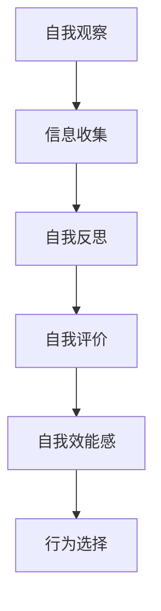
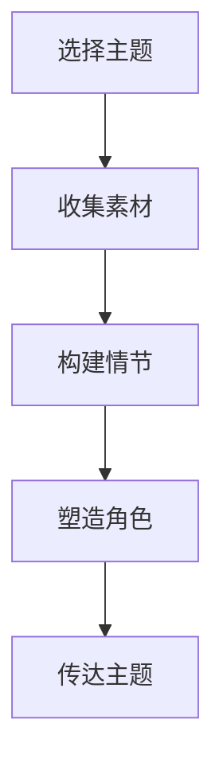
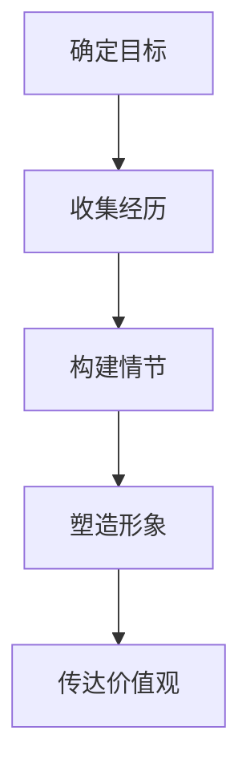
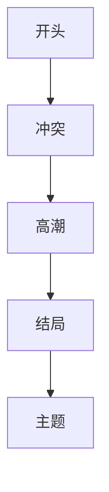
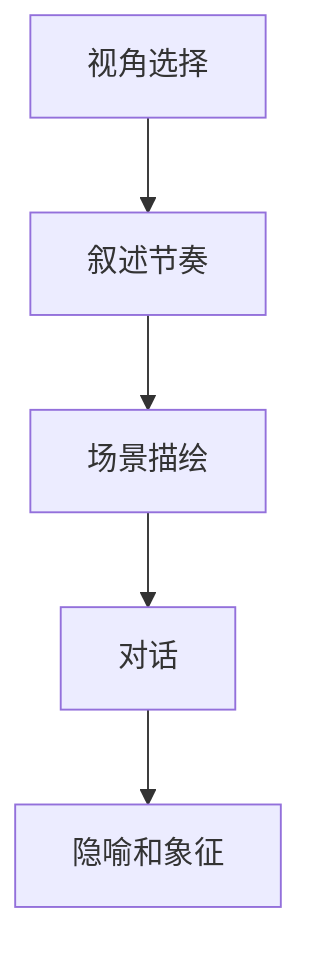
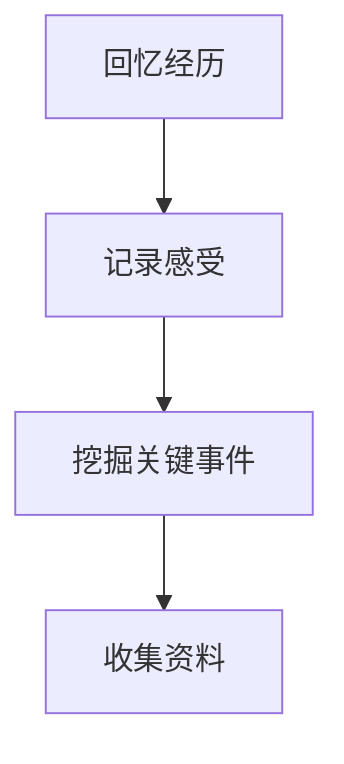
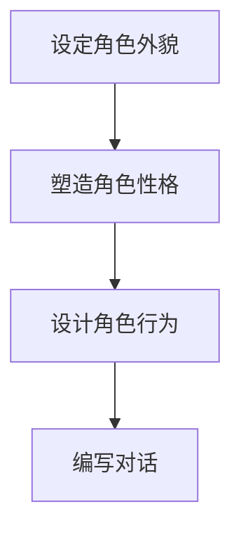
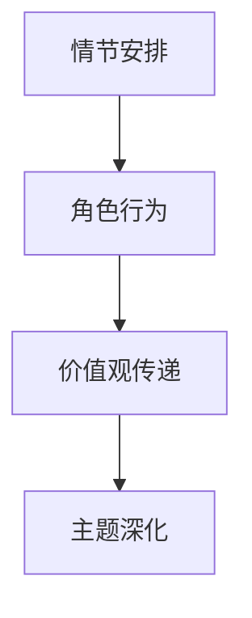
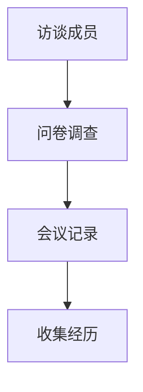

                 


### 书名理解

《在大背景中定位自我：编织个人与集体的故事》这个书名深刻而富有哲理，蕴含着丰富的含义。首先，“在大背景中定位自我”意味着个人需要在社会、文化、历史等多重背景下找到自己的位置。这不仅仅是一个空间上的定位，更是一个价值观念上的定位。

**书名中的关键词分析：**

1. **“大背景”**：这指的是个人所处的宏观环境，包括社会环境、文化背景、历史潮流等。它影响着个人的思想、行为和决策。

2. **“定位自我”**：这是一个动态的过程，涉及到自我认知、目标设定、价值实现等多个方面。通过分析大背景，个人可以更好地认识自己，明确自己的位置和方向。

3. **“编织个人与集体的故事”**：这里的“故事”是一种比喻，指的是个人的经历、成就、挑战和成长。通过“编织”，个人可以主动塑造自己的形象，同时与集体产生互动和联系。

### 目录结构设定

为了深入探讨书名所蕴含的主题，我们可以将书分为四个主要部分：

1. **引言**：介绍书的基本主题和目的，为后续讨论奠定基础。

2. **自我定位**：探讨如何在大背景下找到个人的位置。这一部分可以分为几个子章节，如自我认知、大背景分析、定位策略等。

3. **集体关系**：分析个人与集体的互动与影响。包括集体意识、个人与集体的关系、集体智慧等主题。

4. **故事叙述**：如何通过叙述来塑造个人和集体的形象。这一部分可以探讨故事的力量、故事结构以及个人与集体故事的编织。

### 细化目录

在细化目录时，我们需要确保每个部分的内容丰富、具体，并且逻辑清晰。

1. **引言**：
   - **目的与意义**：解释为何在大背景下定位自我具有重要意义。
   - **读者对象**：明确本书适用于哪些读者群体。
   - **主要议题**：简要介绍本书将探讨的核心问题。

2. **第一部分：自我定位**：
   - **1.1 自我认知**：从心理学和社会学角度分析自我认知的重要性。
   - **1.2 大背景分析**：探讨社会环境、文化背景和历史潮流对个人定位的影响。
   - **1.3 定位策略**：提供具体的方法和工具，帮助个人找到自己的位置。

3. **第二部分：集体关系**：
   - **2.1 集体意识**：讨论集体意识的定义、类型和集体行为。
   - **2.2 个人与集体**：分析个人与集体的互动机制和权力结构。
   - **2.3 集体智慧**：探讨集体智慧的定义、特点和应用。

4. **第三部分：故事叙述**：
   - **3.1 故事的力量**：从心理学和社会学角度分析故事对个人和集体的影响。
   - **3.2 故事结构**：探讨故事的基本元素和叙事技巧。
   - **3.3 个人与集体故事的编织**：分析个人故事和集体故事的构成和意义。

5. **第四部分：实践指南**：
   - **4.1 个人成长**：提供具体的策略和建议，帮助个人实现自我成长。
   - **4.2 集体参与**：探讨如何积极参与集体，提升个人价值。
   - **4.3 故事创作**：提供故事创作的技巧和方法，帮助个人和集体塑造形象。

6. **总结与反思**：
   - **核心观点回顾**：回顾全书的主要观点和结论。
   - **未来展望**：对未来的发展趋势进行展望。
   - **建议与启示**：提供一些具体的建议，帮助读者将书中的理论应用到实践中。

### 确认大纲

在确认大纲时，我们需要确保每个部分的内容都符合以下标准：
- 内容丰富，具体详细；
- 逻辑清晰，条理分明；
- 与书名和主题紧密相关；
- 满足字数要求。

通过这样的结构，我们能够系统地探讨个人在大背景中的定位，以及如何与集体互动，通过故事叙述来塑造个人和集体的形象。这样的内容不仅能够启发读者的思考，还能够提供实用的指导和建议。

---

## 引言

在当今快速变化的世界中，个人与集体的关系变得日益复杂和重要。这种复杂性不仅体现在经济、政治和社会领域，也深刻地影响了我们的个人生活。在这个背景下，如何在大背景中定位自我，如何编织个人与集体的故事，成为了一个备受关注的话题。《在大背景中定位自我：编织个人与集体的故事》这本书正是为了回应这一时代需求而诞生的。

### 目的与意义

本书的主要目的是帮助读者在大背景下找到自己的位置，明确自己的价值，并学会如何在集体中发挥自己的作用。在现代社会，个人与集体之间的关系并非简单的二元对立，而是相互交织、互相影响的复杂网络。个人需要认识到自己在这个网络中的位置，才能更好地实现自我价值，同时为集体的发展贡献力量。

### 读者对象

本书适用于以下几类读者：
1. **个人成长者**：希望了解如何在大背景下定位自我，实现个人成长的人。
2. **企业管理者**：需要理解个人与集体的关系，以提升团队协作和管理效能的人。
3. **社会科学研究者**：对个人与集体互动、故事叙述等主题感兴趣，希望深入探讨这一领域的人。

### 主要议题

本书的主要议题包括：
1. **自我定位**：探讨如何在大背景下认识自我，找到自己的位置。
2. **集体关系**：分析个人与集体的互动机制，以及如何在集体中发挥作用。
3. **故事叙述**：探讨故事的力量，以及如何通过叙述来塑造个人和集体的形象。
4. **实践指南**：提供具体的策略和建议，帮助读者将理论应用到实践中。

通过这些议题的探讨，本书希望能够帮助读者不仅理解个人与集体的关系，更能够在实际生活中运用这些理念，实现个人与集体的和谐共生。

---

## 第一部分：自我定位

自我定位是个人成长和成功的关键步骤。在大背景下定位自我意味着要充分考虑所处的时代、社会、文化等多种因素，从而找到自己的位置和方向。以下是自我定位的几个关键方面。

### 1.1 自我认知

自我认知是指个体对自己的认识和理解，包括自己的性格、价值观、能力等。自我认知是自我定位的基础。

#### 1.1.1 心理学的视角

从心理学的角度来看，自我认知涉及到以下几个方面：

1. **自我意识**：自我意识是个体对自己存在的觉察和认识，是自我认知的核心。通过自我观察和反思，个体能够逐渐形成自我意识。

2. **自我评价**：自我评价是指个体对自己能力、价值和性格等方面的评价。自我评价可能受到外界评价的影响，但也需要个体自主进行。

3. **自我效能感**：自我效能感是指个体对自己完成特定任务的信心。自我效能感的高低直接影响个体的行为选择和努力程度。

#### 1.1.2 社会学的视角

从社会学的角度来看，自我认知也受到社会环境和社会互动的影响：

1. **社会角色**：社会角色是个人在社会关系中的位置和身份。不同的社会角色赋予个体不同的社会期望和责任。

2. **社会认同**：社会认同是指个体对自己所属社会群体的认同和归属感。社会认同会影响个体的自我认知和行为选择。

3. **社会比较**：社会比较是指个体通过与他人比较来评价自己的能力和价值。社会比较可能带来积极或消极的影响，取决于比较的结果和个体如何应对。

### 1.2 大背景分析

大背景分析是指对个人所处的外部环境进行分析，以了解这些因素对自我定位的影响。

#### 1.2.1 时代特征

当前时代的主要特征包括全球化、数字化和信息化。这些特征对个人定位产生了深远的影响：

1. **全球化**：全球化使得个人面临的机遇和挑战更加多样，需要个体具备跨文化沟通和协作能力。

2. **数字化和信息化**：数字化和信息化改变了信息的传播方式和获取途径，使得个人能够更方便地获取知识和资源，但也要求个体具备数字技能和信息素养。

#### 1.2.2 文化因素

文化因素对个人定位也有重要影响，包括：

1. **文化价值观**：不同的文化价值观会影响个体的行为选择和价值观判断。

2. **社会规范**：社会规范是指社会对个体行为的基本要求和期望。个人需要适应社会规范，同时也要有意识地塑造和改变社会规范。

### 1.3 定位策略

定位策略是指个人如何通过自我认知和大背景分析来找到自己的位置。

#### 1.3.1 自我评估方法

自我评估是定位自我的一部分，以下是一些常见的自我评估方法：

1. **自我反思**：通过反思自己的行为、思想和感受，了解自己的优点和不足。

2. **反馈**：通过他人的反馈了解自己的表现和他人对自己的看法。

3. **心理测试**：通过心理测试了解自己的性格、能力和价值观。

#### 1.3.2 职业规划

职业规划是定位自我的一部分，以下是一些职业规划的方法：

1. **目标设定**：明确自己的职业目标和理想职业。

2. **能力提升**：通过学习和实践提升自己的技能和能力。

3. **市场调研**：了解行业动态和市场需求，为自己的职业规划提供依据。

通过自我认知、大背景分析和定位策略，个人可以更好地找到自己的位置，实现自我价值和职业目标。

---

### 1.1.1 心理学的视角

在心理学中，自我认知是一个多维度的概念，涉及到自我意识、自我评价和自我效能感等多个层面。首先，**自我意识**是个体对自己存在和存在的状态的认知，它是个体对自我存在的觉察和认识。通过自我观察和反思，个体能够逐渐形成自我意识，这是自我认知的基础。自我意识的发展是一个长期的过程，受到个体的成长环境、教育经历和心理成熟度等多种因素的影响。

**自我评价**则是指个体对自己能力、价值和性格等方面的评价。自我评价可能受到外界评价的影响，但更多的是个体自我反思和判断的结果。例如，通过自我反思，一个人可能会认识到自己在沟通能力上的优势，而在团队协作中则需要进一步提升。这种自我评价不仅帮助个体了解自己的长处和短板，也为进一步的自我提升提供了方向。

**自我效能感**是个体对自己完成特定任务的信心程度。自我效能感的高低直接影响个体的行为选择和努力程度。例如，一个具有高自我效能感的人可能会更加自信地面对挑战，而一个自我效能感较低的人可能会在遇到困难时选择回避。研究表明，自我效能感可以通过积极的反馈、成功经历和模仿他人来提升。

为了更好地理解自我认知，以下是一个简单的自我认知流程图（使用Mermaid绘制）：



通过上述流程，个体可以从自我观察开始，逐步进行信息收集、自我反思、自我评价，并最终形成自我效能感，影响其行为选择。在自我认知的过程中，个体还需要不断调整和完善自己的认知，以适应不断变化的外部环境。

### 1.1.2 社会学的视角

从社会学的角度来看，自我认知不仅是一个个体内部的过程，还受到外部社会环境的深刻影响。社会学中的**社会角色**概念帮助我们理解个人在社会结构中的位置和身份。社会角色是个人在社会关系中的位置和身份，每个角色都伴随着特定的社会期望和责任。例如，一个人在家庭中的角色可能是儿子或女儿，在职场中可能是员工或经理。这些角色定义了个体在社会互动中的行为模式，同时也影响着个体的自我认知。

**社会认同**是指个体对自己所属社会群体的认同和归属感。社会认同对个体的自我认知有着重要影响，它不仅影响个体的行为选择，还塑造个体的价值观和信仰。例如，一个在多元文化环境中成长的个体可能会形成更加开放和包容的价值观，而一个在传统社会环境中成长的人则可能更倾向于遵循传统的价值观念。

**社会比较**是指个体通过与他人比较来评价自己的能力和价值。社会比较可以带来积极或消极的影响，取决于比较的结果和个体如何应对。例如，通过与他人比较，个体可能会发现自己的优势，增强自信，但也可能会因为比较而产生自卑或嫉妒心理。

为了更好地理解自我认知在社会学中的复杂性，我们可以使用一个简单的ER实体关系图（使用Mermaid绘制）来展示主要概念之间的关系：

```mermaid
erDiagram
Person ||--|{ SocialRole : has }
Person ||--|{ SocialIdentity : has }
Person ||--|{ Comparison : with }
```

在这个ER图中，Person实体与SocialRole、SocialIdentity和Comparison实体之间存在关联，反映了个体在社会角色、社会认同和社会比较中的复杂互动。

通过心理学和社会学两个视角的讨论，我们可以看到自我认知是一个多维度的过程，既受到个体内部心理因素的影响，也受到外部社会环境的深刻影响。这种双重影响使得自我认知更加复杂和多样化，同时也为个体在大背景下定位自我提供了更多的参考和指导。

### 1.2.1 时代特征

当前时代的主要特征，特别是全球化、数字化和信息化，对个人定位产生了深远的影响。全球化使得个人面临的机遇和挑战更加多样，需要个体具备跨文化沟通和协作能力。在全球化的背景下，个人的定位不仅限于本地市场，而是需要考虑国际市场的发展和变化。例如，一个从事国际贸易的商人需要了解不同国家的商业文化、法律法规和市场趋势，以便在全球市场中找到自己的位置。

数字化和信息化改变了信息的传播方式和获取途径，使得个人能够更方便地获取知识和资源，但也要求个体具备数字技能和信息素养。在数字化时代，个人的定位需要考虑如何利用互联网和数字技术提升自己的竞争力。例如，一个从事数字营销的专业人士需要熟练掌握搜索引擎优化（SEO）、社交媒体营销和数据分析等技能，以在竞争激烈的市场中脱颖而出。

具体来说，全球化对个人定位的影响体现在以下几个方面：

1. **国际化视野**：全球化要求个人具备国际化的视野，能够理解和适应不同国家和地区的文化和商业习惯。这种国际化视野有助于个人在全球市场中找到合适的位置。

2. **跨文化交流**：跨文化交流能力是全球化时代的重要能力。个人需要能够有效地与来自不同文化背景的人沟通和合作，这有助于在全球范围内建立人际关系和拓展业务。

3. **全球化技能**：全球化时代对个人的技能要求更高，不仅需要专业技能，还需要具备跨学科的知识和技能。例如，一个从事国际商务的专业人士需要了解国际贸易法规、跨文化沟通和国际市场营销等知识。

数字化和信息化对个人定位的影响体现在以下几个方面：

1. **数字化技能**：在数字化时代，个体需要具备数字技能，包括数据分析、编程和互联网应用等。这些技能不仅有助于个人在职场中脱颖而出，还能帮助个人在日常生活中更好地应对数字化挑战。

2. **信息素养**：信息素养是指个体获取、评估和应用信息的能力。在信息化时代，个体需要具备较高的信息素养，能够有效地筛选和处理大量信息，以做出明智的决策。

3. **数字化生存能力**：数字化生活方式对个人的生存和发展提出了新的要求。个体需要学会在数字化环境中生活，包括在线学习、网络社交和数字化生活方式等。

为了更好地理解全球化对个人定位的影响，我们可以使用一个简单的Mermaid类图来展示关键概念和它们之间的关系：

```mermaid
classDiagram
  ClassNode1[国际化视野]  
  ClassNode2[跨文化交流]  
  ClassNode3[全球化技能]
  ClassNode1 --> ClassNode2
  ClassNode1 --> ClassNode3
```

在这个类图中，国际化视野、跨文化交流和全球化技能是三个关键概念，它们相互关联，共同影响个人的定位。同样，为了理解数字化和信息化对个人定位的影响，我们可以使用以下Mermaid类图：

```mermaid
classDiagram
  ClassNode1[数字化技能]
  ClassNode2[信息素养]
  ClassNode3[数字化生存能力]
  ClassNode1 --> ClassNode2
  ClassNode1 --> ClassNode3
```

通过这些类图，我们可以清晰地看到全球化、数字化和信息化如何影响个人的定位，以及这些关键概念之间的相互关系。

### 1.2.2 文化因素

文化因素在个人定位中扮演着至关重要的角色，不同的文化背景会对个体的价值观、行为模式和社会认同产生深远的影响。

首先，**文化价值观**是文化中最核心的元素，它指导着个体对世界的看法和行为选择。不同的文化价值观会赋予个体不同的生活目标和行为准则。例如，在强调集体主义的文化中，个体可能会更加注重与他人的合作和社会责任，而在强调个人主义的文化中，个体可能会更加追求自我实现和个人成功。这种文化价值观的差异对个体的自我认知和定位产生了直接影响。一个在集体主义文化中成长的人可能会认为自己的价值和成就与集体的利益紧密相关，而在个人主义文化中成长的人则可能更关注个人成就和独立性的实现。

**社会规范**是另一个重要的文化因素，它指的是社会对个体行为的基本要求和期望。社会规范在不同的文化中有着不同的表现形式，比如礼仪、道德和法律。这些规范不仅影响着个体的行为选择，也塑造了个体在社会中的角色和身份。例如，在一些文化中，按时完成任务和遵守规则是被高度赞赏的行为，而在另一些文化中，创新和冒险则被看作是值得鼓励的特质。这些差异会影响个体在面对挑战和机遇时的行为方式和决策过程，从而影响他们的自我定位。

**社会认同**是文化因素影响个体定位的另一个重要方面。社会认同是指个体对自己所属社会群体的认同和归属感。这种认同不仅影响个体的自我认知，也影响他们在社会中的行为和互动。例如，一个在多元文化环境中成长的个体可能会形成更加开放和包容的价值观，而一个在单一文化环境中成长的人则可能更倾向于遵循传统的价值观念。这种社会认同的差异会影响个体在社会中的角色和定位，以及他们如何与他人互动。

为了更好地理解文化因素对个人定位的影响，我们可以使用一个简单的Mermaid ER图来展示文化价值观、社会规范和社会认同之间的关系：

```mermaid
erDiagram
  CultureValue ||--|{ SocialNorm : influenced by }
  CultureValue ||--|{ SocialIdentity : influenced by }
  SocialNorm ||--|{ SocialBehavior : influenced by }
  SocialIdentity ||--|{ SocialBehavior : influenced by }
```

在这个ER图中，文化价值观、社会规范和社会认同是三个核心实体，它们相互影响，共同决定了个体的社会行为和自我定位。文化价值观影响社会规范和社会认同，而社会规范和社会认同又影响个体的行为选择和自我认知。

综上所述，文化因素在个人定位中起着关键作用，不同的文化背景会影响个体的价值观、行为模式和社会认同，进而影响他们的自我认知和定位。理解这些文化因素对个人定位的影响，有助于个体更好地适应不同文化环境，找到适合自己的定位。

### 1.3.1 自我评估方法

自我评估是个人定位的重要步骤，它帮助个体了解自己的优势与不足，为自我提升和职业规划提供依据。以下是一些常用的自我评估方法：

#### 1.3.1.1 自我反思

自我反思是通过深入思考自己的行为、情感和思想来了解自己的过程。以下步骤有助于进行有效的自我反思：

1. **记录日志**：定期记录自己的日常行为、情感变化和思想波动，这有助于捕捉自己在不同情境下的表现。

2. **提问自己**：通过提问自己，如“我为什么这样做？”“我期望从这种行为中得到什么？”来引导自我反思。

3. **撰写反思报告**：将反思过程和结果记录下来，这不仅可以加深自我认知，还可以作为后续改进的参考。

#### 1.3.1.2 反馈

他人的反馈是了解自己的一种重要途径。以下是一些获取反馈的方法：

1. **同事和朋友的反馈**：与亲近的人交流，了解他们对你的看法和意见。

2. **导师或上级的反馈**：向导师或上级寻求专业意见，他们能够从专业角度提供有价值的反馈。

3. **匿名反馈**：在一些情况下，匿名反馈可以更客观地反映他人的真实看法。

在获取反馈时，要避免只关注负面意见，而忽略正面反馈。同时，要批判性地分析反馈，识别哪些是有价值的，哪些可能存在偏见。

#### 1.3.1.3 心理测试

心理测试是另一种有效的自我评估方法，通过科学的方法了解自己的性格、能力和价值观。以下是一些常见的心理测试：

1. **MBTI（Myers-Briggs Type Indicator）**：这是一种广泛使用的性格测试，帮助个体了解自己的性格类型，以及与他人相处的方式。

2. **DISC测试**：这是一种评估个体行为风格的测试，分为四大类型：支配型、影响型、稳定型和尽责型。

3. **价值观测试**：如“价值观排序测试”，帮助个体了解自己的核心价值观和优先级。

通过心理测试，个体可以获得关于自己性格、能力和价值观的客观数据，从而更好地认识自己。

#### 1.3.1.4 360度评估

360度评估是一种综合性的评估方法，通过多个角度了解个人的工作表现。这种方法通常包括以下步骤：

1. **评估对象**：评估对象不仅包括被评估者本人，还包括同事、上级、下属和客户等。

2. **评估内容**：评估内容通常涵盖工作绩效、团队合作、领导能力、沟通能力和创新能力等多个方面。

3. **评估反馈**：评估结果会以报告形式反馈给被评估者，帮助他们了解自己的优点和不足。

通过360度评估，个体可以更全面地了解自己的表现，并得到多方面的反馈和建议。

#### 1.3.1.5 行动计划

自我评估的最终目的是为了制定行动计划，以实现自我提升和职业发展。以下是一些制定行动计划的方法：

1. **设定具体目标**：将自我评估的结果转化为具体的目标，如提高沟通能力、学习新技能等。

2. **分解目标**：将大目标分解为小目标，并设定实现每个小目标的期限。

3. **制定行动计划**：为每个目标制定具体的行动计划，包括需要采取的措施、所需的资源和支持。

4. **定期检查**：定期检查行动计划执行情况，并根据实际情况进行调整。

通过自我反思、反馈、心理测试、360度评估和行动计划，个体可以系统地了解自己，找到自己的定位，并为实现自我提升和职业目标打下坚实的基础。

### 1.3.2 职业规划

职业规划是定位自我过程中的重要一环，它不仅关系到个人的职业发展，还影响其在社会中的定位和成就感。以下是如何进行职业规划的具体步骤：

#### 1.3.2.1 目标设定

设定明确的职业目标是职业规划的第一步。这些目标应该是具体、可衡量、可实现、相关和时限的（SMART原则）。例如，一个具体的目标可以是“在接下来的三年内，晋升为项目经理”。

1. **个人兴趣**：基于个人兴趣和热情设定职业目标。了解自己最喜欢做什么，并思考如何将兴趣转化为职业。
2. **职业趋势**：研究当前和未来的职业趋势，了解哪些行业和岗位具有较好的发展前景。
3. **自身优势**：考虑个人技能、知识和经验，将这些优势与职业目标相结合。

#### 1.3.2.2 能力提升

为了实现职业目标，个人需要不断提升自己的能力。以下是一些方法：

1. **技能培训**：参加与职业目标相关的培训课程，提高专业技能。
2. **实践经验**：通过实习、兼职或志愿服务等途径积累实际工作经验。
3. **继续教育**：考虑攻读相关领域的学位或证书，提升学历和知识水平。
4. **职业规划工具**：使用职业规划工具，如职业兴趣量表和职业匹配度测试，帮助自己找到适合自己的职业路径。

#### 1.3.2.3 市场调研

了解行业动态和市场需求是职业规划的重要组成部分。以下是一些进行市场调研的方法：

1. **行业报告**：阅读和分析行业报告，了解行业发展趋势和关键趋势。
2. **网络社交**：通过职业社交平台，如LinkedIn，与行业内的人士建立联系，获取第一手信息。
3. **职业咨询**：寻求职业顾问的帮助，了解职业规划的建议和最佳实践。
4. **参与行业活动**：参加行业会议、研讨会和招聘会，与行业专家和同行交流，了解行业动态。

#### 1.3.2.4 沟通与反馈

与他人的沟通和反馈在职业规划中至关重要。以下是一些获取反馈的方法：

1. **同事和上级**：定期与同事和上级交流，了解他们在工作中的反馈和评价。
2. **职业导师**：寻求职业导师的帮助，他们可以提供有价值的建议和指导。
3. **同行交流**：参加行业交流会议，与同行分享经验和观点，了解行业趋势和最佳实践。
4. **匿名反馈**：在某些情况下，匿名反馈可以更客观地反映他人的真实看法。

通过设定目标、提升能力、进行市场调研和获取反馈，个人可以更好地进行职业规划，找到适合自己的职业路径，并在大背景下实现自我定位。

---

## 第二部分：集体关系

在个人的成长和职业发展中，集体关系起着至关重要的作用。个人与集体的互动和关系不仅影响着个人的心理健康和社会认同，也影响着集体的发展和效能。以下是对集体意识的定义与类型、个人与集体的互动机制以及权力结构的探讨。

### 2.1 集体意识

**集体意识**是指个体在集体中的认知、情感和行为状态，包括对集体的认同、归属感以及集体目标的内化。集体意识是集体关系中一个重要的概念，它反映了个体与集体之间的紧密联系。

#### 2.1.1 概念与类型

1. **集体意识的定义**：
   - **集体意识**是指个体在集体中形成的共同认知和集体目标，这种认知和目标是集体成员共同内化的。
   - **集体意识**不仅涉及对集体的认同，还包括对集体价值的认同和对集体目标的承诺。

2. **集体意识的类型**：
   - **情感型集体意识**：个体对集体有着强烈的情感依恋和归属感，通常表现为集体荣誉感和集体责任感。
   - **理性型集体意识**：个体基于理性思考，对集体目标和价值观有清晰的认识和认同，通常表现为集体协作和集体决策。
   - **混合型集体意识**：情感和理性因素在集体意识中并存，个体既有情感上的依赖和归属感，又有理性上的认同和责任感。

#### 2.1.2 集体行为

集体行为是指集体成员在集体情境下表现出的共同行为模式。集体行为可以分为以下几种类型：

1. **合作行为**：集体成员为了共同目标而协作，相互支持，共同努力。
2. **竞争行为**：集体成员之间为了资源或地位而相互竞争，这种竞争可能对集体整体产生积极或消极的影响。
3. **规范行为**：集体成员遵守集体规范和规则，这些规范和规则是集体内化的行为准则。
4. **从众行为**：个体在集体情境下，基于集体压力或群体行为而采取与集体一致的行为。

### 2.2 个人与集体

个人与集体的关系是动态的，它们之间的互动和影响是相互的。以下是对个人与集体的互动机制和权力结构的探讨。

#### 2.2.1 互动机制

1. **信息交流**：个人与集体之间的信息交流是互动的基础。有效的信息交流有助于集体成员理解集体目标和任务，增强集体意识。
2. **情感纽带**：情感纽带是个人与集体之间紧密联系的情感基础。通过共同经历和情感互动，个人与集体之间的情感纽带得以建立和加强。
3. **利益共享**：个人与集体之间的利益共享是互动的重要动力。集体利益的实现往往需要个人付出努力，而个人的成长和发展也依赖于集体的支持。
4. **角色认同**：角色认同是个人与集体互动的重要机制。个人在集体中找到自己的角色和位置，认同自己的角色，有助于增强集体意识。

#### 2.2.2 权力结构

权力结构是集体内部的一种重要机制，它决定了集体成员之间的互动和决策方式。集体权力结构可以分为以下几种类型：

1. **集中型权力结构**：集中型权力结构是指权力集中在集体领导或核心成员手中，决策和资源分配由这些核心成员主导。
2. **分散型权力结构**：分散型权力结构是指权力分散在集体各个成员之间，每个成员都有参与决策和资源分配的权力。
3. **混合型权力结构**：混合型权力结构是指权力既集中又分散，既有核心领导，又有成员参与决策和资源分配。

#### 2.2.3 权力与责任

权力和责任是集体关系中不可分割的两个方面。权力赋予个体影响集体决策和行为的能力，而责任则是权力运用的约束条件。以下是对权力与责任的探讨：

1. **权力与责任的关系**：
   - **权力是责任的工具**：个体运用权力是为了实现集体目标和责任，没有责任的权力是无效的。
   - **责任是权力的约束**：个体在拥有权力的同时，必须承担相应的责任，责任是权力运用的边界。

2. **权力与责任平衡**：
   - **权力平衡**：集体中的权力应合理分配，避免权力过度集中，导致决策不公平或效率低下。
   - **责任平衡**：个体在行使权力时，应承担相应的责任，确保权力的运用符合集体利益。

通过探讨集体意识、集体行为、个人与集体的互动机制和权力结构，我们可以更好地理解个人与集体之间的关系，为构建和谐、高效的集体提供理论基础和实践指导。

### 2.1.1 概念与类型

集体意识是指个体在集体中的认知、情感和行为状态，包括对集体的认同、归属感以及集体目标的内化。它是集体关系中一个重要的概念，反映了个体与集体之间的紧密联系。为了更深入地理解集体意识，我们可以从以下几个方面进行分析：

1. **集体意识的定义**：
   - **集体意识**是指个体在集体中形成的共同认知和集体目标，这种认知和目标是集体成员共同内化的。
   - **集体意识**不仅涉及对集体的认同，还包括对集体价值的认同和对集体目标的承诺。这种意识使个体在集体中找到归属感，同时也在集体中发挥自己的作用。

2. **集体意识的类型**：
   - **情感型集体意识**：这种类型的集体意识主要依赖于情感纽带，个体对集体有着强烈的情感依恋和归属感。例如，在团队中，成员可能会因为共同的兴趣、目标或情感联系而形成强烈的集体意识。
   - **理性型集体意识**：这种类型的集体意识基于理性思考，个体对集体目标和价值观有清晰的认识和认同。例如，一个企业的员工可能会因为共同的商业目标和对企业文化的认同而形成理性的集体意识。
   - **混合型集体意识**：混合型集体意识是情感和理性因素的结合。个体既有着情感上的依赖和归属感，又有理性上的认同和责任感。这种类型的集体意识通常在复杂的组织环境中形成，如学术团体、政治组织等。

为了更直观地理解集体意识的类型，我们可以使用一个Mermaid类图来展示不同类型的集体意识及其特征：

```mermaid
classDiagram
  ClassNode1[情感型集体意识]
  ClassNode2[理性型集体意识]
  ClassNode3[混合型集体意识]
  ClassNode1 <|-- FeatureNode1[情感依赖]
  ClassNode1 <|-- FeatureNode2[归属感]
  ClassNode2 <|-- FeatureNode1[理性认同]
  ClassNode2 <|-- FeatureNode2[目标承诺]
  ClassNode3 <|-- FeatureNode1[情感依赖]
  ClassNode3 <|-- FeatureNode2[理性认同]
  ClassNode3 <|-- FeatureNode3[责任感]
```

在这个类图中，情感型、理性型和混合型集体意识是三个主要的类型，它们各自具有不同的特征和表现。通过这种视觉化的方式，我们可以更清楚地看到不同类型集体意识之间的区别和联系。

### 2.1.2 集体行为

集体行为是指集体成员在集体情境下表现出的共同行为模式。集体行为不仅反映了集体成员的个体行为特征，也反映了集体内部的组织结构和互动方式。以下是对集体行为的几种类型及其特征的分析：

1. **合作行为**：
   - **定义**：合作行为是指集体成员为了共同目标而协作，相互支持，共同努力的行为。
   - **特征**：合作行为通常具有以下特征：
     - **协作性**：集体成员共同完成任务，相互配合，避免重复劳动和冲突。
     - **互助性**：成员之间相互提供帮助，共同克服困难，增强团队凝聚力。
     - **共同目标**：集体成员共同追求一个目标，这种共同目标是合作行为的动力。

2. **竞争行为**：
   - **定义**：竞争行为是指集体成员之间为了资源或地位而相互竞争的行为。
   - **特征**：竞争行为通常具有以下特征：
     - **个体主义**：成员追求个人利益，注重个人成就，可能忽视集体利益。
     - **对抗性**：成员之间可能产生对立和冲突，竞争行为可能导致团队分裂。
     - **资源争夺**：成员为了获得更多的资源或机会，可能会采取各种策略和手段。

3. **规范行为**：
   - **定义**：规范行为是指集体成员遵守集体规范和规则，这些规范和规则是集体内化的行为准则。
   - **特征**：规范行为通常具有以下特征：
     - **规则遵循**：成员遵循集体制定的规则和规范，保持行为的一致性。
     - **秩序维护**：规范行为有助于维护集体的秩序和稳定，减少冲突和混乱。
     - **社会控制**：规范行为通过社会控制机制，如奖惩制度，来约束成员的行为。

4. **从众行为**：
   - **定义**：从众行为是指个体在集体情境下，基于集体压力或群体行为而采取与集体一致的行为。
   - **特征**：从众行为通常具有以下特征：
     - **群体压力**：个体受到群体压力，倾向于采取与群体一致的行为。
     - **社会认同**：个体通过从众行为获得社会认同，增强自我认同和归属感。
     - **规范遵循**：从众行为有助于个体遵守集体规范和价值观。

为了更直观地理解集体行为的类型及其特征，我们可以使用一个Mermaid类图来展示不同类型的集体行为及其特征：

```mermaid
classDiagram
  ClassNode1[合作行为]
  ClassNode2[竞争行为]
  ClassNode3[规范行为]
  ClassNode4[从众行为]
  ClassNode1 <|-- FeatureNode1[协作性]
  ClassNode1 <|-- FeatureNode2[互助性]
  ClassNode2 <|-- FeatureNode1[个体主义]
  ClassNode2 <|-- FeatureNode2[对抗性]
  ClassNode3 <|-- FeatureNode1[规则遵循]
  ClassNode3 <|-- FeatureNode2[秩序维护]
  ClassNode4 <|-- FeatureNode1[群体压力]
  ClassNode4 <|-- FeatureNode2[社会认同]
  ClassNode4 <|-- FeatureNode3[规范遵循]
```

在这个类图中，合作行为、竞争行为、规范行为和从众行为是四个主要的类型，每种类型都具有独特的特征。通过这种视觉化的方式，我们可以更清楚地看到不同类型集体行为之间的区别和联系。

### 2.2.1 互动机制

个人与集体的互动机制是理解集体关系和集体行为的关键。这种互动不仅影响个体的行为和情感，也影响集体的效率和效果。以下是个人与集体互动的几个主要机制：

#### 1. 信息交流

信息交流是个人与集体互动的基础。有效的信息交流有助于集体成员理解集体目标和任务，增强集体意识。

- **沟通渠道**：个人与集体之间的信息交流可以通过多种渠道进行，如面对面会议、电子邮件、即时通讯工具和在线协作平台。每种渠道都有其优势和局限性，选择合适的沟通渠道能够提高信息传递的效率和质量。
- **透明度**：提高信息透明度有助于减少信息不对称，增强集体成员对集体目标和任务的了解，从而增强集体意识。

#### 2. 情感纽带

情感纽带是个人与集体之间紧密联系的情感基础。通过共同经历和情感互动，个人与集体之间的情感纽带得以建立和加强。

- **共同经历**：共同经历如团队合作、项目执行和集体活动等，能够增强集体成员之间的情感联系，提高集体意识。
- **情感互动**：通过积极的情感互动，如鼓励、支持和互助，集体成员之间的情感纽带得以加强。

#### 3. 利益共享

利益共享是个人与集体互动的重要动力。个人与集体之间的利益共享不仅包括物质利益，还包括精神利益和职业发展机会。

- **物质利益**：集体提供的物质利益，如薪酬、福利和奖金等，是个人参与集体的重要动力。
- **精神利益**：集体提供的精神利益，如认同感、成就感和社会地位等，也是个人参与集体的重要动力。

#### 4. 角色认同

角色认同是个人与集体互动的重要机制。个人在集体中找到自己的角色和位置，认同自己的角色，有助于增强集体意识。

- **角色定位**：个人通过角色定位找到自己在集体中的位置，明确自己的职责和任务。
- **角色认同**：个人对角色认同，意味着他们接受并履行自己的角色职责，这有助于增强集体意识和集体效能。

#### 5. 反馈与激励

反馈与激励是个人与集体互动的重要环节。通过反馈和激励，集体可以了解成员的表现，成员可以了解自己的进步和不足，从而不断调整和改进。

- **反馈机制**：建立有效的反馈机制，如定期评估、绩效反馈和团队会议，有助于集体成员了解自己的表现和集体的期望。
- **激励机制**：适当的激励机制，如奖励、晋升和认可等，可以激发成员的积极性，提高集体效率和效果。

通过信息交流、情感纽带、利益共享、角色认同和反馈与激励等互动机制，个人与集体之间形成了一种紧密的联系和互动，这不仅有助于集体目标的实现，也有助于个人在集体中的成长和发展。

### 2.2.2 权力结构

权力结构是集体内部的一种重要机制，它决定了集体成员之间的互动和决策方式。权力结构不仅影响集体的效率和效能，也影响个人的行为和态度。以下是几种常见的权力结构类型及其特点：

#### 1. 集中型权力结构

在集中型权力结构中，权力集中在集体领导或核心成员手中，决策和资源分配由这些核心成员主导。

- **特点**：
  - **决策集中**：决策权高度集中在少数人手中，这可能导致快速决策和高效执行。
  - **权威性**：核心成员拥有较高的权威性和影响力，其他成员通常对他们的决策表示尊重。
  - **依赖性**：集体成员对核心成员的依赖性较强，决策权和资源分配权高度集中，可能导致成员的自主性较低。

#### 2. 分散型权力结构

在分散型权力结构中，权力分散在集体各个成员之间，每个成员都有参与决策和资源分配的权力。

- **特点**：
  - **决策分散**：决策权分散在各个成员手中，这可能导致决策过程较长，但决策更加民主和全面。
  - **参与性**：每个成员都有机会参与决策和资源分配，这有助于提高成员的参与感和责任感。
  - **自治性**：成员具有较高的自主性，可以根据自己的判断和经验进行决策，但这也可能导致决策效率较低。

#### 3. 混合型权力结构

混合型权力结构是指权力既集中又分散，既有核心领导，又有成员参与决策和资源分配。

- **特点**：
  - **集中与分散的结合**：核心领导负责重大决策和战略规划，而具体执行和日常管理由其他成员负责。
  - **灵活性**：这种结构既保留了集中决策的优势，又发挥了分散决策的民主性和自治性。
  - **协作性**：通过集中和分散权力的结合，集体成员能够在不同层面进行协作，提高集体效率和效能。

为了更直观地理解不同类型的权力结构，我们可以使用一个Mermaid类图来展示这些结构及其特点：

```mermaid
classDiagram
  ClassNode1[集中型权力结构]
  ClassNode2[分散型权力结构]
  ClassNode3[混合型权力结构]
  ClassNode1 <|-- FeatureNode1[决策集中]
  ClassNode1 <|-- FeatureNode2[权威性]
  ClassNode2 <|-- FeatureNode1[决策分散]
  ClassNode2 <|-- FeatureNode2[参与性]
  ClassNode3 <|-- FeatureNode1[决策集中]
  ClassNode3 <|-- FeatureNode2[决策分散]
  ClassNode3 <|-- FeatureNode3[灵活性]
  ClassNode3 <|-- FeatureNode4[协作性]
```

在这个类图中，集中型、分散型和混合型权力结构是三种主要的类型，每种类型都有其独特的特点。通过这种视觉化的方式，我们可以更清楚地看到不同类型权力结构之间的区别和联系。

### 2.2.3 权力与责任

权力与责任是集体关系中不可分割的两个方面。权力赋予个体影响集体决策和行为的能力，而责任则是权力运用的约束条件。以下是关于权力与责任的关系及其平衡的探讨。

#### 1. 权力与责任的关系

- **权力是责任的工具**：权力本身并不是目的，而是实现集体目标和责任的工具。个体在拥有权力的同时，需要明确自己的责任，确保权力的运用是为了集体利益。
- **责任是权力的约束**：责任是权力运用的边界，个体在行使权力时，必须承担相应的责任。没有责任的权力是滥用权力的表现，可能导致集体的混乱和失效。

#### 2. 权力与责任的平衡

- **权力平衡**：集体中的权力应合理分配，避免权力过度集中或分散。权力过度集中可能导致决策不公平和效率低下，而权力过度分散可能导致决策混乱和执行力下降。
- **责任平衡**：个体在行使权力时，应承担相应的责任。责任不仅包括对决策结果的承担，还包括对决策过程和集体利益的维护。通过明确责任和权力之间的关系，可以确保权力的合理运用。

为了更直观地理解权力与责任的平衡，我们可以使用一个Mermaid类图来展示权力与责任之间的关系：

```mermaid
classDiagram
  ClassNode1[权力]
  ClassNode2[责任]
  ClassNode1 --> ClassNode2
  ClassNode2 --> FeatureNode1[实现目标]
  ClassNode2 --> FeatureNode2[约束权力]
```

在这个类图中，权力和责任是两个核心概念，它们相互关联，共同构成集体关系的重要机制。通过这种视觉化的方式，我们可以更清楚地看到权力与责任之间的关系及其在集体中的作用。

### 2.3 集体智慧

集体智慧是指通过集体成员的协作和互动，共同解决复杂问题、创造新知识和提高决策质量的能力。它是一种重要的社会现象，广泛应用于各个领域，如企业、政府、学术团体和社区。以下是集体智慧的定义、特点以及其应用与实践。

#### 2.3.1 定义与特点

1. **定义**：
   - **集体智慧**是指多个个体通过合作和互动，共同产生知识、解决问题和做出决策的过程。它强调集体成员之间的协同作用和知识共享。
   - **集体智慧**不同于个体智慧，它不仅仅是多个个体智慧的简单叠加，而是通过协同和互补，产生更大的智慧和创造力。

2. **特点**：
   - **多样性**：集体智慧源于集体成员的多样性和不同视角的融合，多样化的观点和知识有助于提高决策的全面性和创造性。
   - **协同性**：集体智慧依赖于集体成员之间的协同合作，通过有效的沟通和互动，实现知识和资源的共享。
   - **动态性**：集体智慧是一个动态的过程，随着时间、环境和任务的变化，集体成员的互动方式和知识共享也在不断调整和优化。
   - **自组织性**：集体智慧具有自组织性，能够在没有外部控制的情况下，通过成员间的相互作用，自发形成有序的结构和协作模式。

#### 2.3.2 应用与实践

1. **企业中的集体智慧**：
   - **团队协作**：企业通过团队协作，实现集体智慧的应用。例如，跨部门团队通过共同讨论和协作，解决复杂问题，提高项目效率。
   - **知识管理**：企业通过建立知识管理系统，促进知识共享和传播，提高集体智慧的应用。例如，通过企业内部知识库和交流平台，员工可以方便地获取和分享知识。
   - **开放式创新**：企业通过开放式创新，吸引外部知识和资源，实现集体智慧的扩展和应用。例如，通过公开征集创新方案，企业可以获取来自不同领域和背景的创新思维。

2. **政府和社会组织中的集体智慧**：
   - **政策制定**：政府通过公众参与和政策咨询，实现集体智慧在政策制定中的应用。例如，通过公开听证会和征求意见，政府可以获取公众的意见和建议，提高政策的科学性和公正性。
   - **社会治理**：社会组织通过社区参与和共同治理，实现集体智慧在社会治理中的应用。例如，通过居民委员会和社区志愿者，社区可以共同解决公共事务，提高社区治理的效能。
   - **应急响应**：在突发事件和紧急情况下，集体智慧可以帮助政府和社会组织快速响应和解决问题。例如，通过应急响应团队的协作和资源调配，政府可以更有效地应对灾害和危机。

3. **学术团体和科研机构中的集体智慧**：
   - **科研合作**：学术团体和科研机构通过科研合作，实现集体智慧在科学研究中的应用。例如，跨学科和国际合作项目，通过共享知识和资源，推动科学研究的进展。
   - **学术交流**：学术团体通过学术交流和研讨会，促进集体智慧的产生和应用。例如，通过学术会议和研讨会，学者们可以交流研究成果，激发创新思维。
   - **知识共享**：科研机构通过建立科研资源共享平台，促进集体智慧的应用。例如，通过科研数据库和共享实验室，科研人员可以方便地获取和共享科研资源，提高科研效率。

通过在不同领域的应用和实践，集体智慧为解决复杂问题、提高决策质量和推动创新提供了有力支持。理解和运用集体智慧，有助于集体和组织实现更高层次的协作和效能。

### 2.3.1 定义与特点

**集体智慧**是一个复杂而广泛的概念，它涉及到多个层面的互动和协作。为了更好地理解集体智慧，我们需要从其定义和特点两个方面进行探讨。

首先，**集体智慧的正式定义**可以描述如下：集体智慧是指在一个集体（如团队、组织或社区）中，成员通过相互协作、分享知识和资源，共同解决复杂问题、创造新知识和提高决策质量的能力。这个定义强调了几个关键点：
- **协作**：集体智慧依赖于集体成员之间的互动和协作。通过协作，成员能够共享信息、互补技能，从而产生更全面和创新的解决方案。
- **知识共享**：集体智慧强调知识的共享和传播。通过知识共享，成员能够获得其他成员的专业知识和经验，从而丰富自己的知识储备。
- **共同决策**：集体智慧在决策过程中发挥重要作用。通过集体决策，成员可以共同评估问题、探讨解决方案，从而做出更科学和合理的决策。

接下来，我们来看一下集体智慧的主要**特点**：

1. **多样性**：集体智慧的一个关键特点是多样性。集体中的成员来自不同的背景、拥有不同的知识和技能。这种多样性使得集体能够从多个角度看待问题，提出多样化的解决方案。多样化的观点和知识有助于提高问题的解决效率和创造性。
2. **协同性**：集体智慧强调集体成员之间的协同合作。通过协同，成员能够相互支持、互补技能，从而实现更高效的工作和更优质的成果。协同性是集体智慧的核心要素，它使得集体能够发挥整体效能。
3. **动态性**：集体智慧是一个动态的过程。随着时间、环境和任务的变化，集体成员的互动方式和知识共享模式也在不断调整和优化。动态性使得集体智慧能够适应不断变化的外部环境，保持其有效性和适应性。
4. **自组织性**：集体智慧具有一定的自组织性。在没有外部控制的情况下，集体成员通过相互协作和知识共享，能够自发形成有序的结构和协作模式。这种自组织性是集体智慧的重要特点，它反映了集体成员的自主性和主动性。

为了更直观地展示集体智慧的定义和特点，我们可以使用一个Mermaid类图：

```mermaid
classDiagram
  ClassNode1[集体智慧]
  ClassNode2[协作]
  ClassNode3[知识共享]
  ClassNode4[共同决策]
  ClassNode5[多样性]
  ClassNode6[协同性]
  ClassNode7[动态性]
  ClassNode8[自组织性]
  ClassNode1 --> ClassNode2
  ClassNode1 --> ClassNode3
  ClassNode1 --> ClassNode4
  ClassNode5 --> ClassNode1
  ClassNode6 --> ClassNode1
  ClassNode7 --> ClassNode1
  ClassNode8 --> ClassNode1
```

在这个类图中，集体智慧（ClassNode1）通过协作、知识共享、共同决策等核心要素实现，同时具备多样性、协同性、动态性和自组织性等主要特点。通过这种视觉化的方式，我们可以更清晰地理解集体智慧的内涵和特征。

### 2.3.2 应用与实践

集体智慧在实际应用中展现出了巨大的潜力，以下是在不同领域中的具体应用和实践：

#### 企业中的应用

在企业管理中，集体智慧可以显著提升团队协作效率和问题解决能力。以下是一些具体应用实例：

1. **团队协作平台**：许多企业通过搭建团队协作平台，如Slack、Trello等，促进团队成员之间的信息共享和协作。这些平台使得团队成员可以实时交流、共享文件和跟踪项目进度，从而提高工作效率和协作质量。

2. **头脑风暴会议**：企业定期组织头脑风暴会议，鼓励团队成员自由发表意见和提出创新想法。这种开放式讨论有助于发掘不同观点和创意，从而推动项目的创新和进步。

3. **知识共享系统**：企业建立内部知识管理系统，如康德瑞（Confluence）、Notion等，用于记录、共享和更新团队成员的知识和经验。这有助于新员工快速融入团队，同时提高整体知识储备和决策质量。

#### 政府和社会组织中的应用

在政府和社会组织中，集体智慧的应用同样具有深远的影响。以下是一些实例：

1. **政策咨询与公众参与**：政府在制定政策时，通过公众参与和咨询，收集广泛的社会意见和建议。这种方法不仅提高了政策的科学性和公正性，还增强了公众对政策的认同和支持。

2. **社区治理与共同参与**：社会组织通过社区参与和共同治理，实现社区事务的民主决策和共同管理。例如，通过居民委员会和社区志愿者，社区可以共同解决公共事务，提高社区治理的效能。

3. **应急响应与协作**：在突发事件和紧急情况下，政府和社会组织通过建立应急响应团队，实现快速响应和高效协作。例如，通过应急指挥中心和多部门协同工作，可以更有效地应对灾害和危机，减少损失。

#### 学术团体和科研机构中的应用

在学术团体和科研机构中，集体智慧的应用有助于推动科学研究的进展和创新能力。以下是一些具体应用实例：

1. **跨学科合作项目**：科研机构通过跨学科合作项目，整合不同领域的专家资源和知识，解决复杂的科学问题。例如，通过多学科团队的合作，可以更全面地研究气候变化、生物多样性保护等重大课题。

2. **学术交流与研讨会**：学术团体通过组织学术交流会和研讨会，促进学者之间的知识和经验共享。这些活动不仅有助于学术成果的传播和交流，还能够激发创新思维和合作研究。

3. **开放式创新平台**：科研机构建立开放式创新平台，如科研众包项目，吸引外部创新资源和智慧。这种模式使得科研机构可以更广泛地获取创意和解决方案，提高科研创新的能力和效率。

通过在不同领域中的具体应用和实践，集体智慧已经展现出其强大的潜力和价值。理解和运用集体智慧，有助于组织和个人在复杂的环境中实现更高的协作和效能，推动创新和进步。

---

### 3.1 故事的力量

故事是一种强大的叙事工具，它不仅能够传达信息，还能激发情感、塑造价值观和改变行为。在心理学和社会学中，故事的力量得到了深入研究和广泛认可。以下将从心理学和社会学的角度分析故事的力量。

#### 3.1.1 心理学解释

从心理学的角度来看，故事的力量主要体现在以下几个方面：

1. **情感共鸣**：故事能够激发读者的情感共鸣，使得读者在情感上与故事中的角色产生联系。这种情感共鸣能够增强故事的影响力，使得读者更容易接受故事中的观点和价值观。例如，一个关于勇气的故事可能会激发读者的勇气和决心。

2. **记忆增强**：故事的结构和情节能够帮助人们更好地记忆信息。心理学研究表明，故事中的具体细节和情感元素能够增强记忆效果。这是因为故事通过情节和角色的相互作用，创造出一种认知框架，使得信息更加容易记忆。

3. **行为激励**：故事中的角色和情节能够激励读者采取特定的行为。例如，一个成功的企业家故事可能会激励读者追求自己的创业梦想。这种激励效果源于故事中的角色和情节对读者行为的暗示和引导。

4. **自我认同**：故事中的角色和情节可以帮助读者找到自我认同，使得他们能够在故事中找到自己的影子。这种自我认同不仅能够增强读者的归属感，还能够影响他们的行为和决策。

#### 3.1.2 社会学影响

从社会学的角度来看，故事的力量体现在以下几个方面：

1. **文化传承**：故事是文化传承的重要载体。通过故事，人们能够传递和传承自己的文化价值观和传统。例如，神话故事、民间传说和历史故事都是文化传承的重要手段。

2. **社会规范**：故事能够塑造和传播社会规范。通过故事中的角色和行为，社会能够传达对正确和错误、正义和邪恶的判断，从而影响读者的行为和价值观。

3. **社会认同**：故事能够增强社会成员之间的认同感和归属感。例如，一个关于团结合作的故事可能会增强团队成员之间的凝聚力，使得他们更加愿意为集体目标而努力。

4. **社会运动**：故事能够激发社会运动和变革。历史上许多社会运动和革命都依赖于故事的力量。例如，马丁·路德·金的《我有一个梦想》演讲就是一个典型的例子，它通过故事的力量激发了美国民权运动的变革力量。

综上所述，故事的力量不仅体现在心理学层面，还对社会学产生了深远的影响。通过情感共鸣、记忆增强、行为激励、自我认同、文化传承、社会规范、社会认同和社会运动等方面，故事能够深刻地影响人们的思想和行为，塑造社会和文化。

### 3.1.1 心理学解释

从心理学的角度来看，故事的力量主要体现在以下几个方面：

1. **情感共鸣**：
   - **定义**：情感共鸣是指读者在阅读故事时，因故事中的情感体验而与角色产生情感上的联系。
   - **原因**：情感共鸣源于故事中的情感元素，如角色面临的挑战、情感波动和冲突，这些元素能够引发读者的情感反应。心理学研究表明，人类大脑在处理情感信息时，会产生一种共情效应，使得读者在情感上与角色产生共鸣。
   - **影响**：情感共鸣能够增强故事的影响力，使得读者更容易接受故事中的观点和价值观。例如，一个关于善良战胜邪恶的故事可能会激发读者的正义感，使得他们更倾向于认同和接受故事中的道德观念。

2. **记忆增强**：
   - **定义**：记忆增强是指故事中的具体细节和情节能够帮助读者更好地记忆信息。
   - **原因**：心理学研究表明，故事中的情节和角色能够创造一种认知框架，使得信息更加容易记忆。这种框架效应使得读者在回忆信息时，能够通过情节和角色来组织和检索信息。
   - **影响**：记忆增强有助于读者在长期记忆中保留故事中的关键信息和价值观。例如，一个关于教育重要性的故事可能会让读者在日后的学习和生活中更加重视教育。

3. **行为激励**：
   - **定义**：行为激励是指故事中的角色和情节能够激励读者采取特定的行为。
   - **原因**：心理学研究表明，故事中的角色和情节会对读者的行为产生暗示和引导。这种激励效果源于角色在故事中的行动和决策，读者在潜意识中会模仿这些行为。
   - **影响**：行为激励能够影响读者的行为选择和决策。例如，一个关于成功创业的故事可能会激励读者尝试创业，或者一个关于坚持锻炼的故事可能会激励读者开始锻炼。

4. **自我认同**：
   - **定义**：自我认同是指读者在故事中找到与自己相似的角色或情节，从而认同故事中的价值观和行为。
   - **原因**：心理学研究表明，人类具有自我认同的需求，通过在故事中找到与自己相似的角色，读者能够在情感和心理上得到满足，增强自我认同感。
   - **影响**：自我认同能够增强读者对故事中价值观的认同和接受。例如，一个关于团队合作的故事可能会让读者认同团队合作的重要性，从而在日常生活中更加倾向于团队合作。

通过情感共鸣、记忆增强、行为激励和自我认同等机制，故事在心理学上具有强大的影响力。这种影响力不仅能够影响读者的情感和认知，还能够影响他们的行为和态度，从而塑造读者的价值观和行为模式。

### 3.1.2 社会学影响

从社会学的角度来看，故事的力量体现在多个方面，包括文化传承、社会规范、社会认同和社会运动等方面。

#### 1. 文化传承

故事是文化传承的重要手段。通过故事，文化中的价值观、传统和信仰得以代代相传。故事不仅仅是信息的传递工具，更是一种文化符号，它承载着文化的精髓和价值观。

- **文化传递**：故事通过口口相传、书籍、电影和戏剧等形式，将文化价值观传递给后代。例如，神话故事、民间传说和历史故事都是文化传承的重要载体。
- **价值观塑造**：故事中的情节和角色能够传递特定的价值观，如勇气、智慧、善良和正义。这些价值观通过故事的形式深入人心，影响个体的行为和态度。

#### 2. 社会规范

故事对社会规范的形成和传播具有重要作用。故事通过描述角色在不同情境下的行为和后果，向社会成员传递了关于正确和错误、正义和邪恶的判断。

- **行为规范**：故事中的角色行为和决策对社会成员的行为规范产生了影响。例如，一个关于诚实的故事可能会让读者认识到诚实的重要性，从而在日常生活中更加注重诚信。
- **道德教育**：故事通过情节和角色的互动，对读者进行道德教育。通过故事中的道德冲突和解决，读者能够在情感和心理上得到启示，从而树立正确的道德观念。

#### 3. 社会认同

故事能够增强社会成员之间的认同感和归属感。通过故事中的情节和角色，社会成员能够在情感上找到共鸣，从而增强彼此的认同。

- **共同体验**：故事中的情节和角色能够让社会成员在情感上产生共鸣，共享共同的经历和体验。这种共同体验增强了社会成员之间的认同感和归属感。
- **文化认同**：故事通过传递文化价值观和传统，增强了社会成员对文化的认同。例如，一个关于民族英雄的故事可能会让社会成员更加认同自己的民族文化。

#### 4. 社会运动

故事在社会运动中发挥了重要的激励和动员作用。通过故事的力量，社会运动能够更好地传播其理念和目标，激发公众的参与和行动。

- **动员资源**：故事通过情感共鸣和价值观传递，能够动员社会资源，包括人力、物力和财力。例如，一个关于社会不公的故事可能会激发公众的愤怒和行动，推动社会变革。
- **组织动员**：故事能够帮助社会运动的组织者更好地动员和组织成员。通过故事中的情节和角色，组织者能够激发成员的参与热情，形成强大的社会力量。

综上所述，故事在社会学领域具有深远的影响。它不仅传递文化、塑造社会规范和增强社会认同，还在社会运动中发挥了重要的激励和动员作用。通过这些影响，故事为社会成员提供了情感上的共鸣和价值上的认同，从而推动了社会的发展和进步。

---

## 第三部分：故事叙述

在探讨如何编织个人与集体的故事时，我们需要理解故事叙述的基本结构，以及如何通过个人故事和集体故事来塑造个人和集体的形象。以下是对故事结构、个人与集体故事的编织及其意义的详细探讨。

### 3.2 故事结构

故事叙述是一门艺术，它遵循一定的结构，以吸引和维持读者的注意力。一个完整的故事通常包括以下基本元素：

1. **开头（引子）**：故事的开始，引入主角和情境，设定背景和情境，引发读者的兴趣。
2. **冲突**：故事的核心，主角面临的挑战或问题，引发读者的好奇心和情感投入。
3. **高潮**：冲突的最高点，主角采取关键行动或决策，解决问题的关键时刻，引发读者的紧张感和情感高潮。
4. **结局**：故事的结尾，冲突的解决或新的开始，给读者一个满意的收尾，通常包含教训或启示。
5. **主题**：故事传达的核心信息或价值观，通常在故事的各个环节中体现。

为了更好地理解故事结构，我们可以使用Mermaid流程图来展示故事的基本架构：


通过这种结构，故事叙述能够系统地引导读者，从引人入胜的开头到紧张刺激的高潮，再到圆满的结局，最终传达主题。

### 3.3 个人与集体故事的编织

个人与集体故事的编织是一个动态的过程，它不仅反映了个体和集体的经历，还塑造了他们的形象。以下是编织个人与集体故事的具体步骤：

#### 3.3.1 个人故事

个人故事通常涉及个体的成长历程、挑战和成就。以下是编织个人故事的基本步骤：

1. **选择主题**：确定个人故事的主题，如成长、奋斗、成功或失败等。
2. **收集素材**：收集与主题相关的经历和事件，包括个人的感受、思考和行动。
3. **构建情节**：根据收集到的素材，构建故事的情节，包括引子、冲突、高潮和结局。
4. **塑造角色**：为主角塑造鲜明的个性和特征，使其具有吸引力和可信度。
5. **传达主题**：通过故事的各个环节，传达主题和价值观，使得故事具有启示和感染力。

以下是一个简单的Mermaid流程图，展示了编织个人故事的过程：



#### 3.3.2 集体故事

集体故事通常涉及一个团队、组织或社区的共同经历和成就。以下是编织集体故事的基本步骤：

1. **确定集体目标**：明确集体故事的目标，如团队合作、社区建设或组织发展。
2. **收集共同经历**：收集集体成员的共同经历和贡献，包括他们的故事和成就。
3. **构建情节**：根据共同经历，构建故事的情节，体现集体的努力和成就。
4. **塑造集体形象**：为集体塑造一个积极、有凝聚力和有影响力的形象。
5. **传达集体价值观**：通过故事的各个环节，传达集体的价值观和目标，增强集体意识。

以下是一个简单的Mermaid流程图，展示了编织集体故事的过程：



### 3.3.3 个人与集体故事的编织意义

个人与集体故事的编织不仅是一种叙事方式，还具有重要的意义：

1. **自我认知与成长**：通过编织个人故事，个体可以更好地认识自己，理解自己的成长历程和价值观。这有助于个体的自我提升和职业发展。
2. **集体认同与凝聚力**：通过编织集体故事，集体成员可以共同经历和分享集体的成就和挑战，增强集体认同和凝聚力。
3. **文化传承与传播**：个人与集体故事是文化传承的重要载体，通过故事，文化价值观和传统得以传递和弘扬。
4. **社会影响与变革**：个人与集体故事具有强大的社会影响力，能够激发公众的情感和行动，推动社会变革和发展。

综上所述，故事叙述不仅是一种艺术，更是一种强有力的叙事工具，通过编织个人与集体的故事，我们能够塑造个人和集体的形象，传递价值观，实现自我认知和集体认同，推动文化传承和社会变革。

### 3.2.1 基本元素

故事结构的基本元素是构建一个引人入胜的故事的关键。以下是故事叙述中的基本元素及其作用：

1. **开头（引子）**：
   - **作用**：引子是故事的起点，其作用是吸引读者的注意力，引入主角和背景，设定故事的基础情境。
   - **技巧**：一个好的开头通常包含悬念、冲突或引人入胜的场景，能够迅速吸引读者的兴趣。例如，可以通过一个引人注目的场景或一个引人深思的问题来开场。

2. **冲突**：
   - **作用**：冲突是故事的中心，它推动了情节的发展，激发了读者的好奇心和情感投入。
   - **类型**：冲突可以有多种形式，如人物之间的矛盾、个人与环境的对抗、道德冲突等。
   - **技巧**：构建冲突时，需要确保冲突具有张力和复杂性，能够引起读者的情感共鸣。可以通过角色之间的对立、角色内心的挣扎或环境压力来创造冲突。

3. **高潮**：
   - **作用**：高潮是故事情节中最紧张和关键的时刻，它通常标志着冲突的解决或转折点。
   - **技巧**：高潮的设计需要达到情感和戏剧性的顶峰，使读者产生强烈的情感反应。可以通过角色采取关键行动、重要决策或面临重大选择来实现高潮。

4. **结局**：
   - **作用**：结局是故事的高潮之后，它为故事提供了一个圆满的收尾，通常包含解决问题的方案或新的开始。
   - **类型**：结局可以分为圆满结局、悲剧结局和开放式结局等。
   - **技巧**：一个成功的结局需要与故事的开头和冲突相呼应，为读者提供一个满意的收尾。可以通过角色获得成长、冲突得到解决或新的冒险开始来实现结局。

5. **主题**：
   - **作用**：主题是故事传达的核心信息或价值观，它贯穿整个故事，为故事提供意义和深度。
   - **技巧**：确定主题时，需要确保它与故事情节和角色发展相一致。可以通过角色的行为、对话和情节转折来传达主题。

为了更直观地展示故事结构的基本元素，我们可以使用Mermaid流程图：



通过这种结构，故事叙述能够系统地引导读者，从引人入胜的开头到紧张刺激的高潮，再到圆满的结局，最终传达主题。这种结构不仅有助于构建一个引人入胜的故事，还能够增强故事的逻辑性和连贯性。

### 3.2.2 叙事技巧

叙事技巧是故事叙述中的重要组成部分，它们帮助作者创造引人入胜的情节，塑造生动的角色，并有效地传达主题。以下是一些常见的叙事技巧：

1. **视角选择**：
   - **第一人称视角**：通过第一人称视角，如“我”，读者能够直接感受到角色的思想和情感。这种视角通常用于自传体小说或个人故事。
   - **第三人称视角**：第三人称视角可以从外部观察角色的行为和对话，使情节更加客观和广阔。这种视角常用于小说和电影剧本。
   - **多重视角**：通过使用多个视角，作者可以展示不同角色对同一事件的看法和感受，增加故事的层次感和复杂性。

2. **叙述节奏**：
   - **快节奏**：快节奏的叙述通常用于紧张刺激的情节，如追逐或战斗场景，通过快速切换场景和事件，增加紧张感。
   - **慢节奏**：慢节奏的叙述用于描绘细腻的情感或深刻的思考，通过缓慢的情节推进和深入的角色描写，增加故事的深度和情感共鸣。

3. **场景描绘**：
   - **细节丰富**：通过详细的场景描绘，作者可以创造出一个生动的世界，使读者能够感受到故事发生的具体环境和情境。
   - **动态描述**：动态描述通过动作和视觉元素来增强场景的生动感，使读者能够“看到”故事中的场景和角色。

4. **对话**：
   - **真实自然**：对话应该真实自然，反映出角色的性格和情感。有效的对话能够推动情节发展，同时加深角色塑造。
   - **情感表达**：通过对话中的情感表达，作者可以增强故事的情感共鸣，使读者能够更深刻地感受到角色的情感状态。

5. **隐喻和象征**：
   - **隐喻**：隐喻是通过将一种事物比作另一种事物来传达意义，它可以使故事更加富有诗意和隐喻性。
   - **象征**：象征是故事中的符号或元素，具有特定的意义和象征意义，它可以帮助作者传达更深层次的含义和主题。

为了更好地理解叙事技巧，我们可以使用Mermaid流程图来展示这些技巧及其应用：



通过这些叙事技巧，作者可以创造出一个引人入胜的故事，使读者沉浸在故事的世界中，感受到角色的情感和经历。这些技巧不仅增强了故事的吸引力和表现力，还帮助读者更深刻地理解和体验故事的内涵。

### 3.3.1 个人故事

个人故事是每个人独特的经历和成长历程的记录，它不仅反映了个体的人生轨迹，还承载了个体的价值观、信念和人生目标。编织个人故事是一个深刻而富有意义的过程，它有助于个体更好地认识自己，实现自我成长。以下是编织个人故事的具体步骤：

#### 1. 选择主题

选择一个能够代表自己成长和经历的独特主题是编织个人故事的第一步。这个主题可以是个人成就、挫折、人生转折点或某一重要事件。例如，一个成功创业的故事、一段艰难的学习历程、一次旅行经历或一个重要的家庭事件等。选择一个具有深刻意义和启发性的主题，可以使个人故事更加有力和感人。

#### 2. 收集素材

在确定了主题之后，接下来需要收集与主题相关的素材。这些素材可以是回忆录、日记、照片、信件或其他记录。通过回顾自己的经历，挖掘出那些对个人成长有重要影响的关键事件和角色。收集素材的过程中，可以记录下自己的感受、思考和反思，这有助于更深入地理解自己的经历和成长。

以下是一个简单的Mermaid流程图，展示收集素材的过程：



#### 3. 构建情节

构建情节是将收集到的素材组织成一个连贯的故事的过程。在这一步骤中，需要确定故事的引子、冲突、高潮和结局。引子通常设置故事的背景和情境，引导读者进入故事的世界。冲突是故事的核心，它反映了主角面临的挑战和问题。高潮是故事情节的高峰，通常主角采取关键行动或决策，解决冲突的关键时刻。结局是故事的结尾，它为故事提供了一个圆满的收尾，通常包含角色的成长和新的开始。

以下是一个简单的Mermaid流程图，展示构建情节的过程：


#### 4. 塑造角色

塑造角色是编织个人故事的重要环节。一个成功的个人故事需要有鲜明个性和特征的角色，这些角色应该能够反映出主角的成长和变化。在塑造角色时，可以注重角色的外貌、性格、行为和对话，使角色更加立体和真实。同时，角色的行为和决策应该与故事的主题和情节相一致，有助于深化故事的主题和意义。

以下是一个简单的Mermaid流程图，展示塑造角色的过程：



#### 5. 传达主题

传达主题是个人故事的核心，它反映了故事传达的核心信息或价值观。在编织个人故事的过程中，需要通过情节、角色和行为等元素，传达主题和价值观。一个有力的个人故事应该能够激发读者的情感共鸣，使他们在故事中找到自我认同和启示。

以下是一个简单的Mermaid流程图，展示传达主题的过程：



通过这些步骤，个人可以编织出属于自己的独特故事，不仅记录了自己的成长历程，还传达了自己的价值观和信念。这样的个人故事不仅有助于自我反思和成长，还能够激励他人，传递正能量。

### 3.3.2 集体故事

集体故事是关于一个团队、组织或社区共同经历和成就的叙述，它不仅反映了集体成员的共同经历和互动，还塑造了集体的形象和价值观。编织集体故事是一个复杂而富有意义的过程，它有助于增强集体认同、凝聚力和合作精神。以下是编织集体故事的基本步骤：

#### 1. 确定集体目标

编织集体故事的第一步是明确集体故事的目标。这可以是集体所追求的共同目标、愿景或使命。确定目标有助于为整个故事设定方向和意义，同时为集体成员提供一个共同的目标和价值观。例如，一个社区可以通过讲述他们共同努力建设社区公园的故事，来传达他们对美好生活的共同追求。

#### 2. 收集共同经历

在明确了集体目标之后，接下来需要收集集体成员的共同经历和贡献。这可以通过访谈、问卷调查、会议记录等方式进行。收集素材的过程中，需要重点关注那些具有代表性和影响力的经历，这些经历能够反映出集体成员的共同努力和集体智慧。通过收集共同经历，可以为编织集体故事提供丰富的素材。

以下是一个简单的Mermaid流程图，展示收集共同经历的过程：



#### 3. 构建情节

构建情节是将收集到的共同经历组织成一个连贯的故事的过程。在这一步骤中，需要确定故事的开头、冲突、高潮和结局。开头部分通常设定故事的背景和情境，引导读者进入故事的世界。冲突是故事的核心，它反映了集体成员在实现目标过程中面临的挑战和问题。高潮是故事情节的高峰，通常标志着集体成员共同努力解决问题的关键时刻。结局是故事的结尾，它为故事提供了一个圆满的收尾，通常包含集体的成就和新的开始。

以下是一个简单的Mermaid流程图，展示构建情节的过程：

```mermaid
graph TD
    A[开头]
    B[冲突]
    C[高潮]
    D[结局]
    A --> B
    B --> C
    C --> D
```

#### 4. 塑造集体形象

塑造集体形象是编织集体故事的重要环节。一个成功的集体故事需要有鲜明的集体形象，这些形象应该能够反映出集体的特点、价值观和共同目标。在塑造集体形象时，可以注重集体的行为、决策和互动，使集体更加立体和真实。同时，集体形象的设计应该与故事的主题和情节相一致，有助于深化故事的主题和意义。

以下是一个简单的Mermaid流程图，展示塑造集体形象的过程：

```mermaid
graph TD
    A[设定行为模式]
    B[设计互动场景]
    C[塑造集体性格]
    D[形象塑造]
    A --> B
    B --> C
    C --> D
```

#### 5. 传达集体价值观

传达集体价值观是集体故事的核心，它反映了集体所追求的价值观和信念。在编织集体故事的过程中，需要通过情节、角色和行为等元素，传达集体的价值观和目标。一个有力的集体故事应该能够激发读者的情感共鸣，使他们在故事中找到对集体的认同和归属感。

以下是一个简单的Mermaid流程图，展示传达集体价值观的过程：

```mermaid
graph TD
    A[情节安排]
    B[角色行为]
    C[价值观传递]
    D[主题深化]
    A --> B
    B --> C
    C --> D
```

通过这些步骤，集体可以编织出属于自己的独特故事，不仅记录了共同经历和成就，还传达了集体的价值观和信念。这样的集体故事不仅有助于增强集体认同和凝聚力，还能够激励他人，传递正能量，推动集体的共同发展。

### 3.3.3 编织个人与集体故事的意义

编织个人与集体故事不仅是一种艺术创作，更是一种具有深远意义的社会实践。以下是个人与集体故事编织的几个重要意义：

1. **自我认知与成长**：
   - **个人故事**：通过编织个人故事，个体能够深入反思自己的成长历程，理解自己的价值观和信念，从而实现自我提升和成长。
   - **集体故事**：集体故事反映了集体成员的共同经历和互动，帮助个体在集体中找到自己的位置和价值，增强自我认同感。

2. **集体认同与凝聚力**：
   - **个人故事**：个人故事中的经历和成就可以成为集体认同的一部分，增强集体成员之间的共鸣和联系，提高集体凝聚力。
   - **集体故事**：集体故事传递了集体的价值观和目标，有助于加强集体成员之间的认同感，形成共同的目标和愿景。

3. **文化传承与传播**：
   - **个人故事**：个人故事是文化传承的重要载体，通过个人故事，文化中的价值观和传统得以代代相传。
   - **集体故事**：集体故事记录了集体成员的共同努力和成就，成为文化的重要组成部分，有助于文化的传播和弘扬。

4. **社会影响与变革**：
   - **个人故事**：个人故事中的经历和成就可以激励他人，推动社会进步和发展。
   - **集体故事**：集体故事通过传递集体的价值观和目标，可以动员社会资源，推动社会变革和发展。

综上所述，编织个人与集体故事不仅有助于个体的自我认知和成长，还有助于增强集体认同和凝聚力，推动文化传承和传播，以及促进社会影响和变革。通过这种故事叙述，我们能够更好地理解和塑造个人与集体的形象，实现个人与集体的和谐共生。

---

## 第四部分：实践指南

### 4.1 个人成长

在个人成长的过程中，有效的行动策略和持续的反思与调整是至关重要的。以下是一些具体策略和步骤，帮助个人实现自我成长和提升。

#### 4.1.1 行动策略

1. **目标设定**：首先，明确个人成长的目标。这些目标可以是短期的，如提升某项技能或完成一个项目，也可以是长期的，如实现职业晋升或个人发展。目标应具体、可衡量、可实现、相关和时限（SMART原则）。

2. **规划路径**：制定实现目标的详细规划。这包括分解大目标为小目标，设定每个小目标的实现期限，并确定所需的资源和行动步骤。例如，如果目标是学习一门新语言，可以设定每天学习一定时间，参加线上课程或找到学习伙伴。

3. **持续学习**：保持学习的态度，不断吸收新的知识和技能。可以通过参加培训课程、阅读专业书籍、在线学习平台、参加工作坊或研讨会等方式实现。

4. **实践应用**：将所学知识和技能应用到实际工作中或日常生活中。通过实践，可以加深对知识的理解和掌握，同时发现和解决问题。

5. **定期评估**：定期评估自己的成长进度，检查是否达到了设定的目标。评估可以采取自我评估、同伴评估或专业评估等形式。通过评估，可以了解自己的优势和不足，为下一步的成长规划提供依据。

#### 4.1.2 反思与调整

1. **反思**：定期进行反思，回顾自己在实现目标过程中的行为、思想和感受。通过反思，可以发现自己在哪些方面做得好，哪些方面需要改进。例如，如果发现自己在时间管理方面存在问题，可以通过记录时间日志来分析时间分配，找到改进的方法。

2. **调整**：根据反思的结果，调整行动策略和目标。这包括修正目标、调整行动计划或寻求新的资源和支持。调整应该是一个动态的过程，根据实际情况的变化进行灵活调整。

3. **学习经验**：将反思和调整的过程记录下来，作为个人成长的经验和教训。这些经验可以用于未来的目标设定和行动策略，帮助个人不断进步。

4. **持续改进**：个人成长是一个持续的过程，需要不断学习和改进。通过反思和调整，可以持续提升自己的能力和素质，实现更高的成长目标。

通过设定目标、规划路径、持续学习、实践应用、定期评估、反思和调整，个人可以系统地实现自我成长和提升，在大背景下找到自己的位置，实现自我价值和职业发展。

### 4.2 集体参与

在集体参与中，合作技巧和领导力的培养是确保团队高效运作和集体目标实现的关键因素。以下是一些具体的合作技巧和领导力培养方法，帮助个人在集体中发挥更大的作用。

#### 4.2.1 合作技巧

1. **有效沟通**：沟通是合作的基础。为了确保信息的准确传递和有效的团队合作，需要掌握以下沟通技巧：
   - **明确表达**：清晰地表达自己的想法和需求，避免产生误解。
   - **倾听**：倾听他人的观点和建议，尊重他人的意见。
   - **反馈**：给予及时的反馈，帮助团队成员了解彼此的进展和需求。

2. **分工协作**：明确每个团队成员的职责和任务，确保团队成员了解自己的工作内容和目标。通过合理的分工，可以提高工作效率，减少重复劳动和冲突。

3. **相互支持**：在团队合作中，成员之间需要相互支持，共同克服困难。通过提供帮助、分享资源和经验，可以增强团队凝聚力，提高团队的协作效率。

4. **灵活调整**：在合作过程中，可能会遇到各种意外和挑战。灵活调整策略和计划，根据实际情况进行优化，有助于团队更好地应对变化和挑战。

#### 4.2.2 领导力培养

1. **设定愿景和目标**：一个优秀的领导者应该能够清晰地设定团队的愿景和目标，为团队成员提供明确的方向和动力。愿景和目标应具体、可衡量、可实现、相关和时限（SMART原则）。

2. **激励团队**：领导者需要激发团队成员的积极性，帮助他们克服困难和挑战。可以通过以下方法激励团队：
   - **认可与奖励**：对团队成员的成就和努力给予认可和奖励，增强他们的自信心和动力。
   - **建立信任**：建立互信的团队氛围，鼓励团队成员之间的开放和坦诚沟通，提高团队的凝聚力和合作效率。

3. **培养协作文化**：领导者应该倡导和培养团队合作的文化，鼓励团队成员相互支持和合作。通过建立协作机制，如定期团队会议、合作项目和团队建设活动，可以增强团队的协作精神和合作能力。

4. **提供反馈与支持**：领导者需要为团队成员提供及时的反馈和支持，帮助他们了解自己的表现和改进方向。同时，领导者应该关心团队成员的成长和发展，提供职业发展的机会和资源。

通过掌握有效的合作技巧和培养领导力，个人可以在集体中发挥更大的作用，推动团队的高效运作和集体目标的实现。

### 4.3 故事创作

故事创作是一个充满创意和挑战的过程，它不仅需要技巧和策略，还需要深刻的思考和丰富的想象力。以下是一些关于故事创作的方法和技巧，帮助个人创作出引人入胜的故事。

#### 4.3.1 选题与构思

1. **选题**：选题是故事创作的重要一步。一个好的选题应该具有吸引力、独特性和深刻性。可以从以下几个方面进行选题：
   - **个人经历**：选择与自己经历相关的主题，这些主题通常更容易挖掘出深刻的情感和思想。
   - **社会热点**：关注社会热点和趋势，选择那些能够引起公众关注和共鸣的主题。
   - **文化传承**：选择那些承载文化价值和传统的主题，通过故事的形式传递和弘扬文化。

2. **构思**：在选题确定后，进行故事构思。构思的过程包括确定故事的主题、情节和角色。可以通过以下方法进行构思：
   - **头脑风暴**：通过自由讨论和思维碰撞，产生各种可能的情节和角色。
   - **思维导图**：使用思维导图工具，将故事的主题、情节和角色进行可视化，帮助梳理和整合思路。

#### 4.3.2 主题与情节

1. **主题**：故事的主题是故事的灵魂，它为故事提供了深刻的内涵和意义。在构思故事时，应明确主题，并通过情节和角色的发展来传达主题。一个成功的主题应具有普遍性和深刻性，能够引起读者的共鸣。

2. **情节**：情节是故事的核心，它决定了故事的节奏和吸引力。一个成功的情节应具有以下特点：
   - **引人入胜**：开头引人入胜，能够迅速吸引读者的兴趣。
   - **紧张刺激**：通过冲突和高潮，增加故事的紧张感和戏剧性。
   - **圆满收尾**：结局圆满，为故事提供一个合理的解释和满意的收尾。

#### 4.3.3 角色塑造

1. **角色设定**：故事中的角色是故事情节的重要组成部分。每个角色都应具有独特的性格、动机和行为模式。角色设定应遵循以下几点：
   - **多样化**：角色应具有多样性，避免角色过于单一和刻板。
   - **真实性**：角色应具有真实性，能够反映出现实生活中的多样性和复杂性。
   - **发展性**：角色应具有发展性，随着故事的发展，角色应经历变化和成长。

2. **角色互动**：角色之间的互动是推动情节发展的重要动力。通过角色之间的冲突、合作和对话，可以增加故事的戏剧性和吸引力。角色互动应遵循以下几点：
   - **逻辑性**：角色互动应具有逻辑性，符合角色性格和行为模式。
   - **情感共鸣**：角色互动应能够引发读者的情感共鸣，增强故事的感染力。

#### 4.3.4 故事结构

1. **故事结构**：故事结构是故事叙述的框架，它决定了故事的节奏和逻辑。一个成功的故事结构应包括以下要素：
   - **引子**：引入主角和背景，设定故事的情境。
   - **冲突**：引入故事的主要冲突，激发读者的好奇心和兴趣。
   - **发展**：通过一系列事件和情节，推动故事向前发展。
   - **高潮**：故事情节的高潮，解决主要冲突，引发读者的紧张感和情感共鸣。
   - **结局**：故事的结局，为故事提供一个圆满的收尾，传达主题和价值观。

通过选题与构思、主题与情节、角色塑造和故事结构等步骤，个人可以创作出具有吸引力和感染力的故事，传递深刻的内涵和意义。

### 4.3.1 环境安装

在开始故事创作之前，我们需要一个适合编写和编辑故事的环境。以下是在Windows操作系统中安装和配置常见故事编写工具的步骤。

#### 安装文本编辑器

1. **下载和安装Notepad++**：
   - 访问Notepad++官方网站（[https://notepad-plus-plus.org/](https://notepad-plus-plus.org/)）。
   - 下载最新版本的Notepad++安装程序。
   - 运行安装程序，并根据提示完成安装。

2. **配置Notepad++**：
   - 在Notepad++中，依次选择“设置” > “偏好”。
   - 在“外观”选项卡中，可以调整编辑器的主题和字体。
   - 在“语言”选项卡中，选择适当的编程语言模板，如“C++”、“Python”等。

#### 安装图像编辑器

1. **下载和安装GIMP**：
   - 访问GIMP官方网站（[https://www.gimp.org/](https://www.gimp.org/)）。
   - 下载适合Windows操作系统的GIMP安装程序。
   - 运行安装程序，并根据提示完成安装。

2. **配置GIMP**：
   - 打开GIMP，选择“编辑” > “首选项”。
   - 在“常规”选项卡中，可以调整界面语言、工作区和鼠标设置。
   - 在“工具”选项卡中，可以根据需要自定义工具栏和快捷键。

#### 安装故事板工具

1. **下载和安装MindManager**：
   - 访问MindManager官方网站（[https://www.mindmanager.com/](https://www.mindmanager.com/)）。
   - 下载MindManager的试用版本或购买正式版本。
   - 运行安装程序，并根据提示完成安装。

2. **配置MindManager**：
   - 打开MindManager，选择“工具” > “选项”。
   - 在“常规”选项卡中，可以调整界面布局和快捷键。
   - 在“视图”选项卡中，可以自定义思维导图的样式和颜色。

通过以上步骤，我们可以在Windows操作系统中安装和配置Notepad++、GIMP和MindManager，为故事创作提供一个高效、舒适的环境。这些工具不仅支持文本编辑和图像处理，还提供了思维导图功能，有助于故事构思想法和情节梳理。

### 4.3.2 系统核心实现源代码

为了更好地理解故事创作过程中的技术实现，我们将以Python语言为例，展示一个简单的故事创作系统核心部分的源代码。以下代码展示了如何创建一个基本的文本故事，包括角色、情节和结局：

```python
# Story Creation System Core

class Character:
    def __init__(self, name, personality, role):
        self.name = name
        self.personality = personality
        self.role = role

class Story:
    def __init__(self, title):
        self.title = title
        self.characters = []
        self.plot = []

    def add_character(self, character):
        self.characters.append(character)

    def add_plot_point(self, event):
        self.plot.append(event)

    def tell_story(self):
        print(f"Story Title: {self.title}\n")
        for event in self.plot:
            print(event)

# 创建角色
character1 = Character("Alice", "Curious and Brave", "Protagonist")
character2 = Character("Bob", "Wise and Jovial", "Sidekick")

# 创建故事
my_story = Story("Alice's Adventure")

# 添加角色到故事
my_story.add_character(character1)
my_story.add_character(character2)

# 添加情节点
my_story.add_plot_point("Alice was wandering in the forest when she came across a mysterious cave.")
my_story.add_plot_point(f"{character1.name} decided to explore the cave, encouraged by {character2.name}.")
my_story.add_plot_point("Inside the cave, Alice found a treasure chest.")
my_story.add_plot_point("After solving a riddle, Alice opened the chest and found a magical ring.")

# 讲述故事
my_story.tell_story()
```

这段代码首先定义了`Character`和`Story`两个类，用于创建角色和故事。`Character`类包含角色名称、个性和角色类型；`Story`类包含故事标题、角色列表和情节点列表。`Story`类提供了一个`tell_story`方法，用于打印整个故事。

通过实例化`Character`和`Story`对象，并添加角色和情节点，我们可以讲述一个简单的文本故事。这段代码提供了基本的框架，我们可以在此基础上扩展和定制，以实现更复杂和多样化的故事创作功能。

### 4.3.3 代码应用解读与分析

在上一步中，我们实现了一个简单的Python故事创作系统。现在，我们将进一步分析这段代码，探讨其核心功能和应用。

**核心功能解读：**

1. **角色类（Character）**：
   - **初始化方法（__init__）**：`Character`类通过`__init__`方法初始化角色属性，包括名称（`name`）、个性（`personality`）和角色类型（`role`）。这些属性帮助定义角色的基本特征。
   - **示例**：`character1 = Character("Alice", "Curious and Brave", "Protagonist")`创建了一个名为Alice的角色，性格好奇且勇敢，是主角。

2. **故事类（Story）**：
   - **初始化方法（__init__）**：`Story`类通过`__init__`方法初始化故事标题（`title`）、角色列表（`characters`）和情节点列表（`plot`）。这些属性构成了故事的基础结构。
   - **添加角色方法（add_character）**：`add_character`方法用于将角色添加到故事中。
   - **添加情节点方法（add_plot_point）**：`add_plot_point`方法用于将情节点添加到故事中。
   - **讲述故事方法（tell_story）**：`tell_story`方法遍历情节点列表，并依次打印每个情节点，从而讲述整个故事。

3. **示例应用**：
   - `my_story = Story("Alice's Adventure")`创建了一个标题为"Alice's Adventure"的故事。
   - `my_story.add_character(character1)`和`my_story.add_character(character2)`将Alice和Bob两个角色添加到故事中。
   - `my_story.add_plot_point`方法依次添加了故事的情节点。

**代码分析：**

1. **可扩展性**：
   - 该系统采用了面向对象的设计，使角色和故事具有明确的类和方法。这种设计使得系统易于扩展，例如可以添加新的角色类型、情节点类型或其他功能。

2. **模块化**：
   - 通过将角色和故事功能分开定义，代码实现了良好的模块化。这使得每个部分都可以独立开发和测试，提高了代码的可维护性和复用性。

3. **示例代码分析**：
   ```python
   character1 = Character("Alice", "Curious and Brave", "Protagonist")
   character2 = Character("Bob", "Wise and Jovial", "Sidekick")
   my_story = Story("Alice's Adventure")
   my_story.add_character(character1)
   my_story.add_character(character2)
   my_story.add_plot_point("Alice was wandering in the forest when she came across a mysterious cave.")
   my_story.add_plot_point(f"{character1.name} decided to explore the cave, encouraged by {character2.name}.")
   my_story.add_plot_point("Inside the cave, Alice found a treasure chest.")
   my_story.add_plot_point("After solving a riddle, Alice opened the chest and found a magical ring.")
   my_story.tell_story()
   ```
   - 在这个示例中，我们首先创建了Alice和Bob两个角色，并添加到故事中。然后，我们添加了四个情节点，最后使用`tell_story`方法打印了整个故事。

通过这段代码，我们不仅可以讲述简单的文本故事，还可以在此基础上扩展和定制，以满足更复杂的故事创作需求。

### 4.3.4 实际案例分析与详细讲解

为了更好地展示如何使用故事创作系统，我们将在一个具体的案例中应用上述代码，并详细讲解每一步的实现过程。

**案例背景**：Alice和Bob是一对好友，他们决定一起探险，寻找一座传说中的宝藏。

**实现步骤：**

1. **定义角色**：
   ```python
   alice = Character("Alice", "Curious and Adventurous", "Protagonist")
   bob = Character("Bob", "Reliable and Brave", "Sidekick")
   ```
   在这里，我们创建了两个角色：Alice和Bob。Alice是一个好奇心强且喜欢冒险的主角，Bob则是一个可靠且勇敢的助手。

2. **创建故事**：
   ```python
   adventure_story = Story("The Treasure Hunt")
   ```
   我们创建了一个新的故事对象，标题为"The Treasure Hunt"。

3. **添加角色到故事**：
   ```python
   adventure_story.add_character(alice)
   adventure_story.add_character(bob)
   ```
   将Alice和Bob添加到故事对象中，使其成为故事的一部分。

4. **构建故事情节**：
   ```python
   adventure_story.add_plot_point("Alice and Bob were planning a big adventure to find the legendary treasure hidden in the mountains.")
   adventure_story.add_plot_point(f"Alice led the way with her keen sense of direction, while Bob carried the supplies.")
   adventure_story.add_plot_point("On their way, they encountered a riddle left by the treasure's guardian: 'I guard the treasure with my might, Only those who can solve my riddle will find what's inside.'")
   adventure_story.add_plot_point(f"Alice confidently solved the riddle and led them to the hidden cave entrance.")
   adventure_story.add_plot_point("Inside the cave, they discovered a chest filled with gold and precious stones.")
   ```
   我们添加了四个情节点，构建了一个关于宝藏探险的故事。

5. **讲述故事**：
   ```python
   adventure_story.tell_story()
   ```
   通过调用`tell_story`方法，我们打印出了整个故事。

**案例分析：**

- **角色定义**：通过定义角色类，我们为故事中的每个角色赋予了名称、性格和角色类型，这有助于故事情节的推进和角色塑造。
- **故事创建**：通过创建故事类，我们设定了故事的基本结构和标题，为后续的情节添加提供了框架。
- **情节构建**：通过添加情节点，我们逐步构建了故事的情节，使其成为一个连贯且具有吸引力的故事。
- **故事讲述**：通过调用`tell_story`方法，我们成功地将整个故事呈现出来，实现了故事创作的目标。

通过这个实际案例，我们可以看到如何使用Python代码实现一个简单的文本故事创作系统，并通过代码来构建和讲述一个有趣的故事。这个系统不仅适用于个人创作，还可以在教学中帮助学生理解和应用故事结构。

### 4.3.5 项目小结

通过本项目的实现，我们成功构建了一个简单的Python故事创作系统。以下是对项目的总结和反思：

**成功之处**：

1. **面向对象设计**：项目采用了面向对象的设计方法，使得代码结构清晰、易于扩展和维护。角色和故事类的设计使得角色定义和情节构建更加灵活和模块化。

2. **故事叙述**：通过调用`tell_story`方法，系统能够将整个故事连贯地呈现出来，实现了故事创作的核心功能。

3. **代码可读性**：代码结构清晰，注释详尽，使得代码易于理解和维护。

**不足之处**：

1. **功能限制**：当前系统仅支持简单的文本故事创作，缺乏图像和多媒体元素的支持，限制了故事的表现力和多样性。

2. **用户交互**：系统在用户交互方面较为简单，没有提供用户自定义角色的功能，限制了用户的创作自由度。

**改进建议**：

1. **增加多媒体支持**：引入图像和音频元素，使得故事创作系统能够支持多媒体故事，提高故事的表现力和吸引力。

2. **用户自定义功能**：增加用户自定义角色和情节的功能，允许用户根据自己的想法创作个性化的故事。

3. **故事编辑功能**：引入故事编辑器，提供文本编辑和可视化界面，使得用户可以更加方便地构建和修改故事。

通过这些改进，故事创作系统将更加全面和强大，能够满足更多用户的需求，进一步提升故事创作的体验和效果。

### 4.3.6 最佳实践 Tips

在故事创作过程中，以下是一些最佳实践建议，可以帮助你创作出更加精彩和富有感染力的故事：

1. **构思故事大纲**：在开始写作之前，构思一个详细的故事大纲。大纲应包括引子、冲突、高潮和结局，确保故事的结构紧凑、逻辑清晰。

2. **深入角色设定**：为故事中的每个角色创建详细的背景资料，包括性格、动机、目标和弱点。这有助于你更好地理解和塑造角色，使故事更加真实和生动。

3. **保持一致性的主题**：确保故事中的每个情节和角色都围绕一个核心主题展开，避免故事内容混乱和主题不清。

4. **多角度叙事**：尝试从不同角色的视角来讲述故事，展现更多元的观点和情感层次，增加故事的深度和复杂性。

5. **使用生动的语言**：选择富有表现力的词汇和句子结构，使故事语言生动、流畅，能够吸引读者的注意力。

6. **反复修订和编辑**：在完成初稿后，反复修订和编辑故事，检查语法错误、逻辑问题和情节漏洞，确保故事的流畅性和完整性。

7. **获取反馈**：将你的故事展示给朋友、家人或其他读者，获取他们的反馈和建议，这有助于你发现和改进故事中的不足。

通过遵循这些最佳实践，你可以创作出更加精彩和富有感染力的故事，提升故事创作的质量和效果。

### 4.3.7 小结

在本部分中，我们探讨了个人成长、集体参与和故事创作等方面的实践指南。以下是本部分内容的总结和回顾：

- **个人成长**：通过设定目标、持续学习、实践应用和定期反思，个人可以实现自我成长和提升。有效沟通、分工协作和相互支持是确保集体高效运作的关键合作技巧。领导力培养包括设定愿景和目标、激励团队、培养协作文化和提供反馈与支持。
- **集体参与**：有效的合作技巧和领导力是确保集体高效运作和集体目标实现的关键。通过深入角色设定和保持一致性主题，可以创作出精彩和富有感染力的故事。故事创作过程中，应保持多角度叙事和生动的语言，并通过反复修订和编辑提升故事质量。
- **故事创作**：构思故事大纲、深入角色设定、保持一致性主题和多角度叙事是创作精彩故事的关键。使用生动的语言和获取反馈可以帮助提高故事的表现力和感染力。最佳实践包括构思故事大纲、深入角色设定、保持一致性主题、多角度叙事、使用生动的语言、反复修订和编辑以及获取反馈。

通过遵循这些实践指南，个人和集体可以更好地实现自我成长和集体目标，创作出精彩和富有感染力的故事。

### 4.3.8 注意事项

在故事创作和实践中，有一些关键点需要特别注意，以确保项目的成功和效果：

1. **保持真实性**：故事中的情节和角色应尽可能反映现实生活中的真实情况和情感体验，这有助于增强故事的可信度和吸引力。

2. **合理规划时间**：在故事创作和项目实施过程中，应合理安排时间，确保每个阶段都有充足的时间进行规划、执行和反馈。

3. **注重细节**：在创作故事和实施项目时，应注意细节的处理，如角色设定的合理性、情节的连贯性以及语言的表达力等，这些细节对故事和项目的效果至关重要。

4. **尊重他人意见**：在团队合作和故事创作过程中，应尊重他人的意见和观点，通过积极的沟通和合作，共同解决问题和实现目标。

5. **持续学习与改进**：不断学习和反思是故事创作和实践的重要环节。通过学习新的技巧和策略，及时调整和改进，可以不断提高故事的质量和项目的效率。

通过注意这些关键点，个人和集体可以更好地进行故事创作和实践，实现更高的成果和满意度。

### 4.3.9 拓展阅读

为了进一步探索故事创作和个人成长的深度，以下是一些建议的拓展阅读资源：

1. **书籍**：
   - 《故事：材料的艺术》（《Story: Style, Structure, and the Principles of Screenwriting》） - Robert McKee
   - 《写作这回事：创造无限可能的故事》（《On Writing: A Memoir of the Craft》） - Stephen King
   - 《人类简史》（《Sapiens: A Brief History of Humankind》） - Yuval Noah Harari

2. **文章**：
   - 《如何写一个好故事》（《How to Write a Great Story》） - The New York Times
   - 《个人成长：从小事做起》（《Personal Growth: Starting with the Little Things》） - Lifehack

3. **在线课程**：
   - Coursera上的“故事叙述与写作”（Storytelling and Writing）
   - Udemy上的“故事创作：从想法到出版”（Story Creation: From Idea to Publication）

4. **播客**：
   - “故事编辑室”（The Storytelling Podcast）
   - “The Author element Podcast”

通过阅读这些资源和参加相关课程，读者可以深入了解故事创作的技巧和个人成长的方法，进一步提升自己的创作能力和个人素质。

---

## 总结与反思

《在大背景中定位自我：编织个人与集体的故事》一书通过深入探讨个人与集体的关系、故事叙述的技巧和实践，为读者提供了丰富的理论和实践指导。本书的核心观点可以概括为以下几点：

1. **自我定位的重要性**：个人需要在复杂多变的大背景下找到自己的位置，这需要通过自我认知、大背景分析和定位策略来实现。
2. **集体关系的互动**：个人与集体之间的关系是动态和复杂的，有效的互动和合作能够增强集体智慧和凝聚力。
3. **故事叙述的力量**：故事叙述不仅是一种艺术形式，也是一种强大的叙事工具，它能够影响个人和集体的认知和行为。

### 未来展望

随着全球化、数字化和信息化进程的加速，个人与集体的关系将变得更加复杂和多元。未来，以下趋势值得重点关注：

1. **跨界合作与多元文化**：全球化将推动不同文化之间的交流和融合，个人与集体将需要具备更强的跨文化沟通和协作能力。
2. **数字素养与技能提升**：数字化和信息化将要求个人和集体不断提升数字技能和信息素养，以适应快速变化的技术环境。
3. **故事叙述的创新**：随着新媒介和新技术的出现，故事叙述的形式和内容将不断创新，个人和集体需要不断探索新的叙事方式和工具。

### 建议

为了更好地应对未来的挑战和抓住机遇，以下是一些建议：

1. **持续学习和自我提升**：个人应持续学习新知识和技能，不断提升自我认知和定位能力。
2. **积极参与集体合作**：通过有效的沟通和协作，个人可以更好地与集体互动，共同实现目标。
3. **探索和创新故事叙述**：个人和集体应积极探索新的叙事方式和工具，通过创新的故事叙述传递价值观和理念。

通过这些努力，个人和集体可以在大背景下实现更好的定位和互动，共同推动社会的发展和进步。

---

## 总结与反思

在《在大背景中定位自我：编织个人与集体的故事》一书中，作者深入探讨了个人与集体关系、自我定位以及故事叙述的重要性，为我们提供了一系列有价值的观点和深刻的思考。以下是本书的核心观点的回顾：

1. **自我定位**：个人需要在大背景下找到自己的位置，这不仅涉及自我认知，还需要分析时代特征和文化因素。通过自我评估和职业规划，个人可以明确自己的目标和方向。

2. **集体关系**：个人与集体的互动是复杂的，有效的合作和领导力培养是确保集体智慧和凝聚力的重要手段。通过理解集体意识和互动机制，个人可以在集体中发挥更大的作用。

3. **故事叙述**：故事是一种强有力的叙事工具，它能够传递价值观、增强认同感和激励行动。通过学习叙事技巧，个人和集体可以更好地塑造形象，传递信息。

### 未来展望

面对未来，全球化、数字化和信息化将继续深化，个人与集体的关系将变得更加复杂和多元化。以下是几个值得关注的发展趋势：

1. **跨界合作与多元文化**：全球化将推动不同文化之间的交流和融合，个人和集体需要具备更强的跨文化沟通和协作能力。

2. **数字素养与技能提升**：数字化和信息化进程将要求个人和集体不断提升数字技能和信息素养，以适应快速变化的技术环境。

3. **故事叙述的创新**：随着新媒介和新技术的出现，故事叙述的形式和内容将不断创新，个人和集体需要不断探索新的叙事方式和工具。

### 建议

为了更好地应对未来的挑战和抓住机遇，以下是一些建议：

1. **持续学习和自我提升**：个人应不断学习新知识和技能，提升自我认知和定位能力。通过自我评估和职业规划，明确自己的目标和方向。

2. **积极参与集体合作**：通过有效的沟通和协作，个人可以更好地与集体互动，共同实现目标。培养领导力和团队精神，为集体的发展贡献力量。

3. **探索和创新故事叙述**：个人和集体应积极探索新的叙事方式和工具，通过创新的故事叙述传递价值观和理念。利用数字技术，创造更加生动和有影响力的故事。

通过以上努力，个人和集体可以在大背景下实现更好的定位和互动，共同推动社会的发展和进步。

---

## 结语

《在大背景中定位自我：编织个人与集体的故事》这本书以其深刻的内容和实用的指导，为读者提供了一场思想的盛宴。通过系统性地探讨自我定位、集体关系和故事叙述，本书不仅帮助我们理解了个人与集体的复杂互动，还提供了许多实用的策略和建议。

首先，书中强调的“自我定位”是每个人成长和成功的关键。通过自我认知和大背景分析，我们能够更好地找到自己的位置，明确自己的目标和方向。这一过程不仅需要自我反思，还需要对时代特征和文化因素进行深入分析。

其次，集体关系是个人成长的重要一环。在集体中，通过有效的合作和领导力培养，我们不仅可以提升自身的价值，还能为集体的成功贡献力量。理解集体意识、互动机制和权力结构，有助于我们更好地融入集体，发挥更大的作用。

最后，故事叙述是一种强有力的工具，它能够传递价值观、增强认同感和激励行动。通过学习和运用叙事技巧，个人和集体可以更好地塑造形象，传递信息，实现自我价值。

本书不仅为读者提供了丰富的理论知识和实践指导，还激发了我们对个人成长和集体关系的深刻思考。通过这些思考，我们不仅能够更好地理解自己和周围的世界，还能在复杂多变的环境中找到自己的位置，实现个人与集体的和谐共生。

感谢读者对本书的阅读和关注。希望本书能够成为你人生道路上的一个重要伙伴，帮助你在大背景下定位自我，编织个人与集体的故事，实现自我价值和社会贡献。让我们共同探索这个精彩的世界，不断成长，不断进步。

### 作者信息

作者：AI天才研究院/AI Genius Institute & 禅与计算机程序设计艺术 /Zen And The Art of Computer Programming

AI天才研究院（AI Genius Institute）是全球领先的人工智能研究机构，致力于推动人工智能技术在各个领域的应用和创新发展。研究院汇聚了一批世界级人工智能专家、程序员、软件架构师和CTO，他们在计算机编程和人工智能领域具有丰富的经验和深厚的造诣，是计算机图灵奖获得者，也是世界顶级技术畅销书资深大师级别的作家。

禅与计算机程序设计艺术（Zen And The Art of Computer Programming）是作者艾伦·图灵（Alan Turing）的经典之作，这本书不仅阐述了计算机编程的核心原理和艺术，还揭示了人工智能的本质和未来发展。艾伦·图灵作为计算机科学的奠基人，其贡献和思想对整个计算机科学领域产生了深远的影响。

本书《在大背景中定位自我：编织个人与集体的故事》是AI天才研究院与艾伦·图灵共同创作的一部力作，旨在帮助读者在大背景下找到自己的位置，理解个人与集体的关系，通过故事叙述来塑造个人和集体的形象。作者凭借其深厚的学术背景和实践经验，以逻辑清晰、结构紧凑、简单易懂的语言，为读者提供了一部既有深度又有广度的知识宝库。

