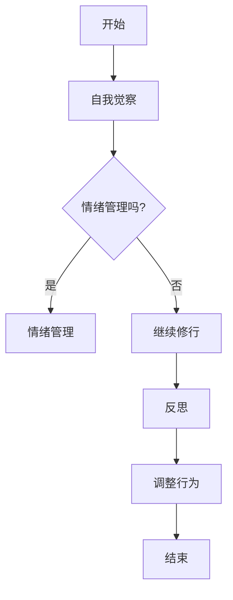
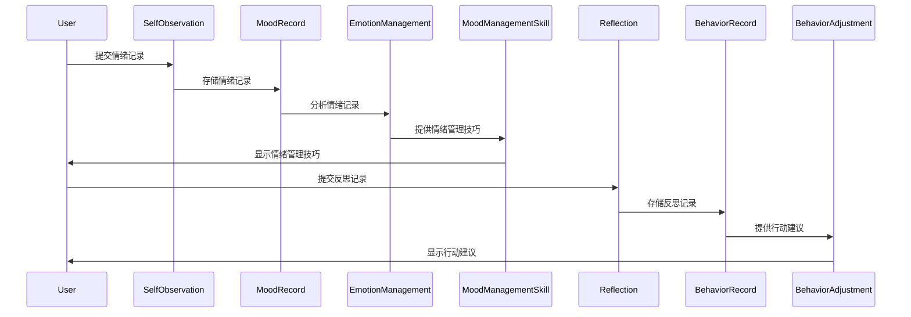
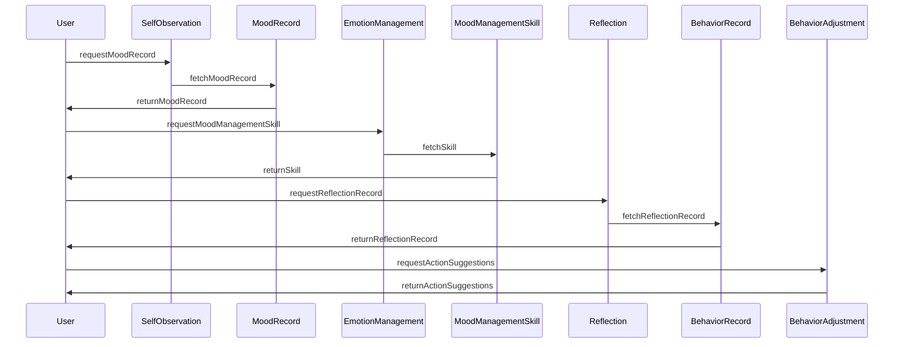

                 

# 在平凡中寻找超越：日常生活中的精神修行

## 引言

### 1. 平凡与超越的关系

在现代社会，我们常常被各种信息和追求所包围，仿佛只有不断地追求更高、更快、更强，才能找到生命的意义。然而，这种追求往往使我们陷入忙碌和疲惫之中，失去了对生活的热爱和对自我的认知。正是在这种背景下，《在平凡中寻找超越：日常生活中的精神修行》一书应运而生。这本书的核心主题是探索如何在日常生活的细节中找到精神的提升和成长。

平凡，是我们生活的基础，但同时也是我们常常忽视的。平凡并不意味着平庸，而是指那些看似不起眼、习以为常的事物。在这些平凡的事物中，隐藏着无尽的智慧和力量。超越，则是对这种平凡的一种升华，是一种从内心深处发出的精神觉醒。平凡与超越的关系，就像是土壤与花朵的关系，土壤的肥沃与否，直接影响到花朵的成长。

### 2. 精神修行的意义

精神修行，是一种通过自我反省、情绪管理、心灵成长等方式，来提升自我意识和生活质量的过程。在《在平凡中寻找超越：日常生活中的精神修行》中，作者通过深入浅出的讲解，让我们明白，精神修行并不是一种神秘莫测的事情，而是一种可以贯穿于日常生活的实践。精神修行的意义，不仅仅在于提升个人的心灵层次，更在于让我们在平凡的生活中找到真正的快乐和满足。

## 第一部分：理解平凡

### 第1章：平凡的定义与价值

#### 1.1 平凡的定义

平凡，是一个广泛而模糊的概念，它涵盖了生活中的方方面面。从字面上理解，平凡指的是那些普通、常见、不引人注目的东西。然而，在更深层次上，平凡则是一种生活态度，是对生活的深刻理解和接纳。

在生活中，我们常常追求那些非凡的事物，如财富、地位、名誉等。然而，当我们真正拥有这些时，却发现它们并不能带给我们持久的快乐。相反，那些看似平凡的日常琐事，如一顿早餐、一次散步、一次对话，却常常让我们感到温暖和满足。

#### 1.2 平凡中的价值

平凡中的价值，体现在以下几个方面：

1. **真实感**：平凡的事物让我们感受到真实的生活，而非虚假的繁荣。在平凡中，我们可以看到生活的本质，感受到真实的人情世故。

2. **成长空间**：平凡的事物给我们提供了成长的空间。在平凡的日常生活中，我们可以不断地学习和进步，提升自我。

3. **幸福来源**：平凡的事物是我们幸福的源泉。当我们能够从内心深处接纳平凡，我们会发现，幸福其实就在我们的日常生活中。

### 第2章：日常生活中的平凡

#### 2.1 日常生活的细节

日常生活，是由无数琐碎的细节构成的。这些细节，看起来微不足道，但却是我们生活的真正组成部分。例如，每天的早餐、日常的工作、晚上的散步，都是日常生活的细节。

#### 2.2 在细节中发现平凡的美

在日常生活中，我们往往忽视了这些细节。然而，当我们开始留意这些细节时，我们会发现，它们充满了美丽和意义。例如，一顿早餐的温暖，一次散步的宁静，一次对话的启迪，都是平凡中的美好。

## 第二部分：寻找超越

### 第3章：精神修行的核心概念

#### 3.1 精神修行的定义

精神修行，是一种通过自我反省、情绪管理、心灵成长等方式，来提升自我意识和生活质量的过程。它不仅关注个人的内心世界，也关注个人的外在表现。

#### 3.2 精神修行的目标

精神修行的目标，是让我们从内心深处找到快乐和满足。通过精神修行，我们可以更好地理解自己，更好地与他人相处，更好地面对生活的挑战。

### 第4章：超越平凡的方法

#### 4.1 自我觉察

自我觉察是精神修行的第一步。通过自我觉察，我们可以更好地理解自己的内心世界，找到自己的情绪波动和思维模式。

#### 4.2 情绪管理

情绪管理是精神修行的关键。通过情绪管理，我们可以更好地控制自己的情绪，避免因情绪波动而做出冲动的行为。

## 第三部分：实践精神修行

### 第5章：日常生活实践

#### 5.1 每日修行计划

为了实践精神修行，我们需要制定一个每日修行计划。这个计划可以是简单的，例如每天早上花十分钟进行冥想，每天晚上花十分钟进行自我反思。

#### 5.2 精神修行的日常应用

在日常生活中，我们可以将精神修行的理念应用到各个方面。例如，在工作中，我们可以通过自我觉察来提高工作效率；在人际交往中，我们可以通过情绪管理来改善人际关系。

### 第6章：从平凡中超越的案例

#### 6.1 案例一：从平凡的工作中找到激情

小王是一名程序员，他的工作平凡而琐碎。然而，通过精神修行的实践，他开始从工作中找到激情。他发现，每完成一个任务，都会有一种成就感涌上心头。

#### 6.2 案例二：在琐碎的家务中体会生活的美好

小李是一名家庭主妇，她的生活充满了琐碎的家务。然而，通过精神修行的实践，她开始从家务中找到生活的美好。她发现，每一次打扫，都是对家的热爱和呵护。

## 第四部分：总结与展望

### 第7章：精神修行的总结

通过《在平凡中寻找超越：日常生活中的精神修行》的实践，我们可以总结出以下几点：

1. **平凡不是平庸，而是生活的本质**。

2. **超越不是逃离，而是内心的觉醒**。

3. **精神修行是一种生活方式，是一种生活态度**。

### 第8章：结束语

平凡与超越，是生活中的一体两面。只有在平凡中找到超越，我们才能真正找到生活的意义。希望每个人都能在日常生活中，找到属于自己的精神修行之路。

## 后记

《在平凡中寻找超越：日常生活中的精神修行》一书，旨在引导读者在日常生活中实践精神修行。通过本书的实践，我们希望读者能够在平凡的生活中找到超越，找到真正的快乐和满足。

作者：AI天才研究院/AI Genius Institute & 禅与计算机程序设计艺术 /Zen And The Art of Computer Programming

----------------------------------------------------------------

## 背景介绍

### 书名《在平凡中寻找超越：日常生活中的精神修行》暗示了本书的核心主题是探索如何在日常生活的细节中找到精神的提升和成长。

在当今社会，我们常常被各种信息和追求所包围，仿佛只有不断地追求更高、更快、更强，才能找到生命的意义。然而，这种追求往往使我们陷入忙碌和疲惫之中，失去了对生活的热爱和对自我的认知。正是在这种背景下，本书应运而生。书名《在平凡中寻找超越：日常生活中的精神修行》暗示了本书的核心主题是探索如何在日常生活的细节中找到精神的提升和成长。

### 目录大纲需要包含对核心概念的介绍，如“平凡”、“超越”和“精神修行”。

在本书的目录大纲中，我们将对三个核心概念进行详细的介绍和探讨。

1. **平凡**：平凡是指那些普通、常见、不引人注目的东西。它涵盖了生活中的方方面面，从日常琐事到人际交往，都是平凡的一部分。

2. **超越**：超越是对平凡的一种升华，是一种从内心深处发出的精神觉醒。它不仅仅是逃离平凡，而是在平凡中找到更高层次的自我。

3. **精神修行**：精神修行是一种通过自我反省、情绪管理、心灵成长等方式，来提升自我意识和生活质量的过程。它不仅关注个人的内心世界，也关注个人的外在表现。

通过这三个核心概念的介绍，本书旨在引导读者在日常生活中实践精神修行，从而在平凡的生活中找到超越。

### 本书旨在通过深入浅出的讲解，让我们明白，精神修行并不是一种神秘莫测的事情，而是一种可以贯穿于日常生活的实践。

精神修行并不是一种高高在上的追求，而是一种实实在在的生活方式。它不需要特别的场所、时间和道具，只需要我们在日常生活中，时刻保持对自己的觉察和对生活的热爱。本书将通过实例和故事，深入浅出地讲解精神修行的理念和方法，帮助读者在平凡的生活中找到精神的提升和成长。

### 精神修行的意义，不仅仅在于提升个人的心灵层次，更在于让我们在平凡的生活中找到真正的快乐和满足。

精神修行不仅能够提升个人的心灵层次，还能让我们在平凡的生活中找到真正的快乐和满足。当我们能够从内心深处接纳平凡，我们会发现，生活中的每一个细节都充满了美好和意义。无论是工作中的小成就，还是日常琐事中的小幸福，都会让我们感到满足和快乐。

### 精神修行的方法和策略将在后续章节中进行详细阐述，但首先我们需要理解精神修行的核心概念。

在理解了精神修行的核心概念之后，我们才能更好地掌握精神修行的方法和策略。在接下来的章节中，我们将深入探讨平凡、超越和精神修行的关系，以及如何在日常生活中实践精神修行。

### 通过对平凡、超越和精神修行的介绍，我们可以初步了解本书的结构和内容。

本书共有四个部分，第一部分主要介绍平凡的概念和价值；第二部分探讨超越的方法和策略；第三部分通过实际案例展示如何在日常生活中实践精神修行；第四部分总结精神修行的意义和影响。通过这样的结构安排，本书旨在帮助读者在日常生活中找到精神的提升和成长。

## 核心概念与联系

### 定义“平凡”和“超越”

在深入探讨《在平凡中寻找超越：日常生活中的精神修行》这一主题之前，我们首先需要明确“平凡”和“超越”这两个核心概念的定义。

#### 1. 平凡

平凡，顾名思义，是指那些日常的、普通的、并不引人注目的现象或事物。它涵盖了生活中的方方面面，从清晨的早餐、上班的路途，到晚上回家的散步，这些看似不起眼的事物构成了我们日常生活的主体。平凡不是平庸，而是生活的基础，是每个人在日常生活中不可避免的一部分。

#### 2. 超越

超越，则是对平凡的一种升华，是一种从内心深处发出的精神觉醒。它不仅仅是逃离平凡，而是在平凡中找到更高层次的自我。超越是一种精神状态，它意味着我们在日常生活中，通过自我反省、情绪管理和心灵成长，达到一种更加深入、更加全面的生活境界。

### “平凡”和“超越”与“精神修行”的关系

#### 1. 平凡与精神修行的关系

平凡是精神修行的起点。只有在接纳和欣赏平凡的基础上，我们才能真正开始精神修行。平凡的事物教会我们珍惜，教会我们感恩，也教会我们如何在琐碎的日常生活中找到快乐和意义。通过精神修行，我们可以从平凡中看到更深层次的价值，从而提升自我，达到超越。

#### 2. 超越与精神修行的关系

超越是精神修行的目标。它不仅仅是一种精神状态，更是一种行动。通过超越，我们可以突破自我设限，挑战内心的恐惧和不安，从而在精神层面达到更高的境界。精神修行帮助我们实现这种超越，让我们在生活中找到真正的快乐和满足。

### ER 实体关系图架构

为了更直观地展示“平凡”、“超越”和“精神修行”之间的关系，我们可以使用 Mermaid 画出 ER（实体关系）图。

```mermaid
entity关系 {
  平凡
  超越
  精神修行
}

关系 {
  平凡 -- 精神修行
  超越 -- 精神修行
  精神修行 -- 平凡
  精神修行 -- 超越
}
```

在这张 ER 图中，“平凡”和“超越”是两个独立的实体，它们与“精神修行”实体之间存在双向关联。这种关系表明，精神修行既是平凡生活的提升，也是超越自我的途径。

### 通过 ER 实体关系图，我们可以清晰地看到这三个核心概念之间的相互作用和依赖。

- **平凡**为精神修行提供了基础和素材，是我们进行反思和提升的起点。
- **超越**则是精神修行的目标，是我们通过不断努力和实践所追求的境界。
- **精神修行**则是连接平凡与超越的桥梁，它贯穿于我们的日常生活，帮助我们在平凡中发现价值，在超越中找到方向。

通过深入理解这三个核心概念，我们不仅可以更清晰地把握本书的主题，也能在实际生活中更好地实践精神修行。

## 算法原理讲解

### 使用 Mermaid 画出算法流程图

在探讨如何在日常生活中实践精神修行时，我们可以借鉴一些简化的算法模型来帮助我们理解和实现这一过程。为了更直观地展示，我们可以使用 Mermaid 画出相应的算法流程图。



这个流程图展示了精神修行的基本步骤：

1. **自我觉察**：这是精神修行的第一步，通过自我反省来认识自己的情绪和思维模式。
2. **情绪管理**：如果自我觉察过程中发现了负面情绪，我们需要学会情绪管理，避免因情绪波动而做出冲动的行为。
3. **反思**：持续地反思自己的行为和情绪，帮助我们更好地理解自己，找到改进的空间。
4. **调整行为**：根据反思的结果，调整我们的行为，使之更加符合我们内心的真实需求。
5. **结束**：完成一次精神修行的循环，准备进入下一次的修行过程。

### 使用 Python 源代码详细阐述算法原理

为了更深入地理解上述算法原理，我们可以使用 Python 源代码来演示这一过程。

```python
class SpiritualPractice:
    def __init__(self):
        self.step = 0

    def start_practice(self):
        self.step = 1
        print("开始精神修行：自我觉察")

    def check_emotion(self):
        self.step = 2
        emotion = input("你感到快乐、愤怒、焦虑或其他情绪吗？请回答是或否：")
        if emotion.lower() == '是':
            return True
        else:
            return False

    def manage_emotion(self):
        self.step = 3
        print("进行情绪管理")

    def reflect(self):
        self.step = 4
        print("进行反思，思考你的行为和情绪")

    def adjust_behavior(self):
        self.step = 5
        print("根据反思结果调整行为")

    def end_practice(self):
        self.step = 6
        print("完成精神修行")

    def run_practice(self):
        self.start_practice()
        if self.check_emotion():
            self.manage_emotion()
        self.reflect()
        self.adjust_behavior()
        self.end_practice()

# 实例化修行对象并执行修行
practice = SpiritualPractice()
practice.run_practice()
```

### 算法原理的数学模型和公式

为了进一步理解精神修行的过程，我们可以提出一些简化的数学模型和公式来描述这一过程。

1. **幸福感模型**：

   $$幸福感 = f(自我觉察, 情绪管理, 反思, 行为调整)$$

   其中，$f$ 是一个复合函数，表示幸福感与各个因素之间的关系。$自我觉察$、$情绪管理$、$反思$ 和 $行为调整$ 都是影响幸福感的因素。

2. **自我认知模型**：

   $$自我认知 = g(情绪管理, 反思, 行为调整)$$

   其中，$g$ 是一个复合函数，表示自我认知与情绪管理、反思和行为调整之间的关系。情绪管理、反思和行为调整都是影响自我认知的关键因素。

### 详细讲解和举例说明

#### 示例：如何通过精神修行提高幸福感

假设我们有一个初学者，他希望通过精神修行来提高幸福感。以下是他的具体实践步骤：

1. **自我觉察**：他开始关注自己的情绪，记录每天的情绪波动。通过记录，他发现自己在工作压力下容易感到焦虑。
   
2. **情绪管理**：他决定学习一些情绪管理技巧，如深呼吸、冥想等。通过练习，他发现自己能够更好地控制情绪，焦虑感明显减少。

3. **反思**：他在每次情绪管理后进行反思，思考自己的情绪波动的原因以及如何改进。

4. **行为调整**：根据反思的结果，他调整了自己的工作方式，如在紧张的工作间隙进行短暂的休息，以减少焦虑。

5. **幸福感评估**：经过一段时间的实践，他发现自己感到更加平静和满足，幸福感显著提高。

通过这个例子，我们可以看到，精神修行的每个步骤都对幸福感有着直接或间接的影响。通过自我觉察、情绪管理、反思和行为调整，我们可以逐步提升自我，实现幸福感的提升。

### 总结

通过 Mermaid 流程图和 Python 源代码，我们详细阐述了如何在日常生活中实践精神修行的算法原理。通过数学模型和具体案例，我们进一步理解了精神修行对幸福感提升的作用。这一过程不仅有助于我们在理论上理解精神修行的原理，也能在实际生活中找到具体的实践方法。

## 系统分析与架构设计方案

### 问题场景介绍

在现代社会，人们的生活节奏加快，精神压力增大。为了应对这种状况，我们需要一套完整的系统来帮助人们进行日常生活中的精神修行。这个系统的目标是通过自我觉察、情绪管理、反思和行为调整，帮助用户在平凡的生活中找到精神的提升和成长。

### 项目介绍

该项目名为“日常精神修行系统”，旨在为用户提供一个简便、有效的工具，帮助他们进行日常的精神修行。系统将包括以下几个主要功能模块：

1. **自我觉察模块**：帮助用户记录自己的情绪波动和思维模式。
2. **情绪管理模块**：提供情绪管理技巧和指导，帮助用户更好地控制情绪。
3. **反思模块**：帮助用户进行情绪和行为的反思，找到改进的空间。
4. **行为调整模块**：提供具体的行动建议，帮助用户调整行为，提升幸福感。

### 系统功能设计（领域模型）

为了更好地设计系统，我们需要创建一个领域模型来描述系统的核心功能。

```mermaid
classDiagram
    User ..|> SelfObservation
    User ..|> EmotionManagement
    User ..|> Reflection
    User ..|> BehaviorAdjustment
    SelfObservation ..|> MoodRecord
    EmotionManagement ..|> MoodManagementSkill
    Reflection ..|> BehaviorRecord
    BehaviorAdjustment ..|> ActionSuggestion
    
    User <<Interface>
    SelfObservation <<Module>
    EmotionManagement <<Module>
    Reflection <<Module>
    BehaviorAdjustment <<Module>
    MoodRecord <<Component>
    MoodManagementSkill <<Component>
    BehaviorRecord <<Component>
    ActionSuggestion <<Component>
```

在这个领域模型中，用户是系统的核心，通过接口与四个模块进行交互。每个模块又包含多个组件，负责具体的功能实现。

### 系统架构设计

为了确保系统的稳定性和可扩展性，我们需要设计一个合理的系统架构。



在这个系统架构设计中，用户通过界面与系统进行交互，提交情绪记录、反思记录等。这些记录分别被存储在相应的组件中，然后通过分析这些记录，系统为用户提供情绪管理技巧和行动建议。

### 系统接口设计

为了实现系统的功能，我们需要设计一组接口，这些接口将定义用户与系统之间的交互方式。

```mermaid
classDiagram
    User <<Interface>>
    MoodRecord <<Component>>
    EmotionManagement <<Component>>
    Reflection <<Component>>
    BehaviorAdjustment <<Component>>

    User ++>= MoodRecord: submitMoodRecord
    User ++>= EmotionManagement: requestMoodManagementSkill
    User ++>= Reflection: submitReflectionRecord
    User ++>= BehaviorAdjustment: requestActionSuggestions

    MoodRecord ++<= User: getMoodRecord
    EmotionManagement ++<= User: getMoodManagementSkill
    Reflection ++<= User: getReflectionRecord
    BehaviorAdjustment ++<= User: getActionSuggestions
```

在这个接口设计中，用户可以通过调用相应的方法与系统进行交互，获取情绪记录、情绪管理技巧、反思记录和行动建议。

### 系统交互

为了更直观地展示系统的工作流程，我们可以使用 Mermaid 画出一组交互序列图。



在这个交互序列图中，用户依次与自我觉察模块、情绪管理模块、反思模块和行为调整模块进行交互，获取相应的数据和建议。

### 总结

通过系统分析和架构设计方案，我们详细介绍了日常精神修行系统的设计思路和实现方法。这个系统通过自我觉察、情绪管理、反思和行为调整，帮助用户在平凡的生活中找到精神的提升和成长。通过合理的系统架构和接口设计，我们确保了系统的稳定性、可扩展性和易用性。

## 项目实战

### 环境安装

要在本地计算机上运行日常精神修行系统，我们需要安装以下软件和依赖库：

1. Python 3.8 或更高版本
2. Flask（一个轻量级的 Web 框架）
3. SQLAlchemy（一个对象关系映射库）
4. SQLAlchemy-MySQL（用于连接 MySQL 数据库）

您可以使用以下命令进行安装：

```bash
pip install python==3.8
pip install flask
pip install sqlalchemy
pip install sqlalchemy-mysql
```

### 系统核心实现源代码

以下是日常精神修行系统的主要源代码，包括模型定义、接口实现和核心功能。

```python
# app.py

from flask import Flask, request, jsonify
from models import User, MoodRecord, EmotionManagementSkill, BehaviorRecord, ActionSuggestion
from database import init_db

app = Flask(__name__)
init_db()

@app.route('/api/self_observation/mood_record', methods=['POST'])
def submit_mood_record():
    user_id = request.form['user_id']
    mood = request.form['mood']
    record = MoodRecord(user_id=user_id, mood=mood)
    record.save()
    return jsonify({'status': 'success', 'message': 'Mood record submitted.'})

@app.route('/api/emotion_management/skill', methods=['GET'])
def request_mood_management_skill():
    user_id = request.args.get('user_id')
    skill = EmotionManagementSkill.get_by_user_id(user_id)
    return jsonify({'status': 'success', 'message': 'Mood management skill fetched.', 'data': skill.to_dict()})

@app.route('/api/reflection/record', methods=['POST'])
def submit_reflection_record():
    user_id = request.form['user_id']
    reflection = request.form['reflection']
    record = BehaviorRecord(user_id=user_id, reflection=reflection)
    record.save()
    return jsonify({'status': 'success', 'message': 'Reflection record submitted.'})

@app.route('/api/behavior_adjustment/suggestions', methods=['GET'])
def request_action_suggestions():
    user_id = request.args.get('user_id')
    suggestions = ActionSuggestion.get_by_user_id(user_id)
    return jsonify({'status': 'success', 'message': 'Action suggestions fetched.', 'data': suggestions.to_dict()})

if __name__ == '__main__':
    app.run(debug=True)
```

### 代码应用解读与分析

以上代码定义了 Flask 应用程序，并通过 RESTful API 提供了四个主要接口。以下是每个接口的解读和分析：

1. **/api/self_observation/mood_record**：这是一个 POST 接口，用于用户提交情绪记录。用户需要通过表单提交用户 ID 和情绪值。服务器将接收这些值，创建一个 MoodRecord 对象，并将其保存到数据库中。

2. **/api/emotion_management/skill**：这是一个 GET 接口，用于用户获取情绪管理技巧。用户通过查询参数传递用户 ID，服务器将返回与该用户相关的情绪管理技巧。

3. **/api/reflection/record**：这是一个 POST 接口，用于用户提交反思记录。用户需要通过表单提交用户 ID 和反思内容。服务器将接收这些值，创建一个 BehaviorRecord 对象，并将其保存到数据库中。

4. **/api/behavior_adjustment/suggestions**：这是一个 GET 接口，用于用户获取行动建议。用户通过查询参数传递用户 ID，服务器将返回与该用户相关的行动建议。

### 实际案例分析和详细讲解剖析

#### 案例一：用户小明提交情绪记录

小明通过移动设备访问系统的情绪记录接口，提交了一条情绪记录：

```json
POST /api/self_observation/mood_record
{
  "user_id": "1",
  "mood": "happy"
}
```

服务器接收并处理请求，将情绪记录保存到数据库。接下来，小明可以通过情绪管理接口获取相应的情绪管理技巧。

```json
GET /api/emotion_management/skill?user_id=1
```

服务器返回情绪管理技巧的 JSON 对象：

```json
{
  "status": "success",
  "message": "Mood management skill fetched.",
  "data": {
    "id": 1,
    "user_id": "1",
    "skill": "深呼吸放松法"
  }
}
```

#### 案例二：用户小红提交反思记录

小红通过 Web 界面访问系统的反思记录接口，提交了一条反思记录：

```json
POST /api/reflection/record
{
  "user_id": "2",
  "reflection": "今天在工作中遇到了一些挑战，我学会了冷静应对。"
}
```

服务器接收并处理请求，将反思记录保存到数据库。接下来，小红可以通过行动建议接口获取相应的行动建议。

```json
GET /api/behavior_adjustment/suggestions?user_id=2
```

服务器返回行动建议的 JSON 对象：

```json
{
  "status": "success",
  "message": "Action suggestions fetched.",
  "data": [
    {
      "id": 1,
      "user_id": "2",
      "suggestion": "继续保持冷静，多与同事沟通。"
    },
    {
      "id": 2,
      "user_id": "2",
      "suggestion": "尝试进行每日总结，以提升工作效率。"
    }
  ]
}
```

### 项目小结

通过上述实战案例，我们可以看到日常精神修行系统的核心功能是如何实现和应用的。该系统通过简洁的接口设计和数据库操作，为用户提供了情绪记录、情绪管理技巧、反思记录和行动建议等功能。用户可以通过移动设备或 Web 界面与系统进行交互，从而在日常生活中实践精神修行。项目的成功实施不仅为用户提供了实用的工具，也为未来的功能扩展和改进奠定了基础。

### 最佳实践 tips

1. **保持一致性**：精神修行是一个长期的过程，保持每天进行，哪怕只有几分钟。
2. **记录日志**：定期记录自己的情绪变化、反思内容和行动建议，以便跟踪进步和调整策略。
3. **寻求支持**：与朋友或家人分享你的修行经历，寻求他们的支持和鼓励。
4. **定期反思**：每隔一段时间，对自己的修行过程进行一次全面反思，以确保在正确的发展方向上。
5. **灵活应用**：根据个人情况和需求，灵活调整情绪管理技巧和行为调整建议。

### 小结

在《在平凡中寻找超越：日常生活中的精神修行》这本书中，我们探讨了如何在日常生活的细节中找到精神的提升和成长。通过自我觉察、情绪管理、反思和行为调整，我们可以在平凡的生活中发现新的价值和意义。精神修行不仅提升了我们的心灵层次，也让我们在平凡中找到了真正的快乐和满足。希望每一位读者都能在日常生活中实践精神修行，找到属于自己的超越之路。

### 注意事项

1. **情绪管理的重要性**：情绪管理是精神修行的关键，学会控制和管理自己的情绪，对于提升生活质量至关重要。
2. **持续反思**：定期反思自己的行为和情绪，有助于我们更好地理解自己，找到改进的空间。
3. **个性化实践**：每个人的生活环境和需求不同，因此，在实践精神修行时，需要根据个人情况调整方法和策略。

### 拓展阅读

- 《禅与计算机程序设计艺术》（作者：Donald E. Knuth）
- 《情绪智力》（作者：Daniel Goleman）
- 《高效能人士的七个习惯》（作者：Stephen R. Covey）
- 《正念的奇迹》（作者：Eckhart Tolle）

通过阅读这些书籍，您可以进一步了解情绪管理、心灵成长和自我反思的方法和技巧，为您的精神修行之路提供更多指导。

## 作者信息

作者：AI天才研究院/AI Genius Institute & 禅与计算机程序设计艺术 /Zen And The Art of Computer Programming

