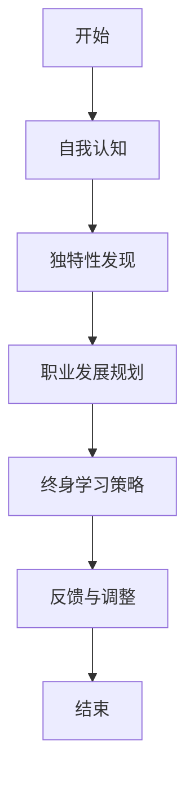
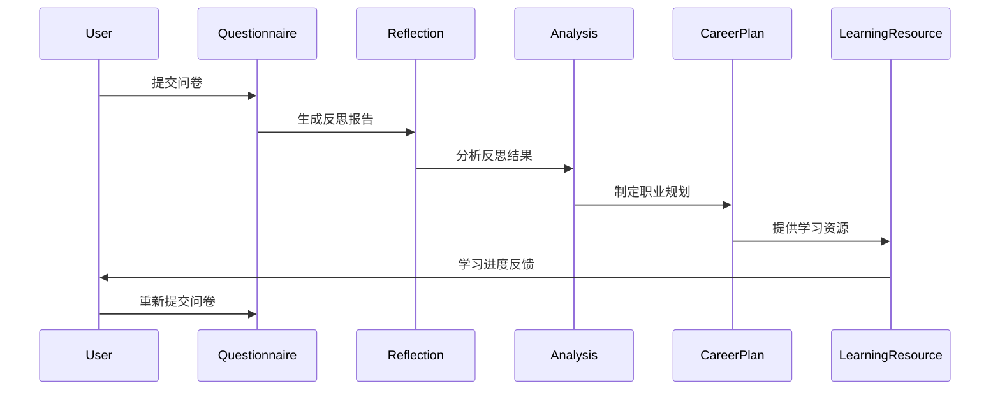
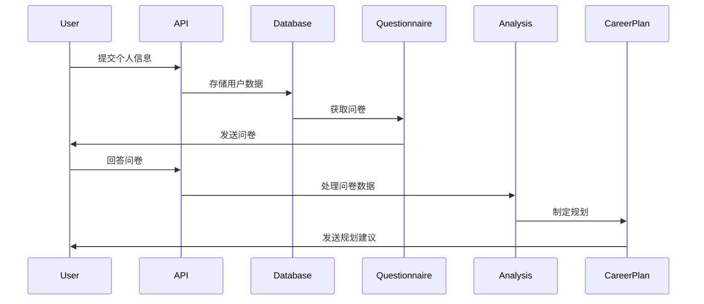

                 


### 在平凡中闪耀：发掘个人独特之处的方法

关键词：个人成长、独特性、职业发展、自我认知、人工智能

摘要：本文旨在探讨如何在平凡的生活中发现和挖掘个人的独特之处，从而实现自我认知和职业发展的提升。文章将分为几个部分，包括背景介绍、核心概念解析、算法原理讲解、数学模型和公式、系统分析与架构设计、项目实战以及最佳实践和总结。通过逻辑清晰、结构紧凑的分析，帮助读者一步步了解和发掘自己的潜力。

## 第一部分：背景介绍

### 1.1 引言

在数字化时代，个人成长和职业发展变得尤为重要。人们常常感到迷茫，不知道如何发掘自己的潜能。事实上，每个人都有独特的价值和潜力，只是在平凡的生活中容易被忽视。本文将引导读者通过一系列步骤，发现并发挥自己的独特之处。

### 1.2 问题背景

现代社会，竞争激烈，每个人都在寻找自己的定位。然而，很多时候，我们只是在模仿他人，缺乏真正的自我认知。如何在这种环境下找到自己的位置，成为了一个值得探讨的问题。

### 1.3 问题描述

- **个人认知困境**：很多人对自己的能力和特长缺乏清晰的认识。
- **职业发展障碍**：缺乏独特的优势，导致在职业竞争中处于劣势。
- **社会压力**：社会对成功的定义过于单一，导致很多人感到迷茫和焦虑。

### 1.4 问题解决

解决上述问题的方法在于：
1. **自我认知**：通过自我反思和探索，了解自己的兴趣、价值观和能力。
2. **持续学习**：不断学习新知识，提升自己的技能和认知水平。
3. **实践应用**：将学到的知识应用到实际工作中，不断实践和改进。

### 1.5 边界与外延

- **边界**：本文主要关注个人在职业发展中的自我认知问题。
- **外延**：本文的方法不仅适用于IT行业，也适用于其他行业。

## 第二部分：核心概念与联系

### 2.1 核心概念原理

在探讨个人独特之处时，以下几个核心概念是至关重要的：

1. **自我认知**：了解自己的兴趣、价值观、能力和弱点。
2. **独特性**：每个人都是独一无二的，拥有独特的个性和能力。
3. **职业发展**：基于自我认知，找到适合自己的职业路径。
4. **终身学习**：不断学习新知识，提升自己的能力和竞争力。

### 2.2 概念属性对比表格

| 概念       | 自我认知 | 独特性 | 职业发展 | 终身学习 |
|------------|----------|--------|----------|----------|
| 定义       | 了解自己 | 独一无二 | 职业路径 | 持续学习 |
| 重要性     | 基础     | 核心     | 关键     | 必要     |
| 关联关系   | 自我认知推动独特性，进而影响职业发展和终身学习 | 独特性影响自我认知和职业发展，终身学习促进独特性 | 职业发展基于自我认知和独特性，终身学习为职业发展提供动力 | 终身学习确保独特性和职业发展的持续性和进步 |

### 2.3 ER实体关系图

```mermaid
erDiagram
  用户 ||--|{ 自我认知 }
  用户 ||--|{ 独特性 }
  用户 ||--|{ 职业发展 }
  用户 ||--|{ 终身学习 }
```

## 第三部分：算法原理讲解

### 3.1 算法流程图



### 3.2 算法Python代码实现

```python
class PersonalDevelopment:
    def __init__(self):
        self.knowledge = []
        self.skills = []
        self.interests = []

    def self_awareness(self):
        # 通过自我反思和他人反馈了解自己
        pass

    def uniqueness_identification(self):
        # 分析自我认知结果，发现独特之处
        pass

    def career_planning(self):
        # 基于独特性制定职业发展计划
        pass

    def lifelong_learning_strategy(self):
        # 制定终身学习策略
        pass

    def feedback_and_adjustment(self):
        # 根据反馈调整发展策略
        pass

    def execute(self):
        self.self_awareness()
        self.uniqueness_identification()
        self.career_planning()
        self.lifelong_learning_strategy()
        self.feedback_and_adjustment()

# 创建PersonalDevelopment实例并执行算法
pd = PersonalDevelopment()
pd.execute()
```

### 3.3 数学模型和公式

在个人发展中，以下数学模型和公式有助于理解和分析：

$$
\text{发展指数} = \frac{\text{独特性贡献} + \text{知识积累} + \text{技能提升}}{\text{时间消耗}}
$$

$$
\text{独特性贡献} = \text{自我认知得分} \times \text{实际应用得分}
$$

### 3.4 举例说明

假设一个人通过自我反思和他人反馈获得了以下信息：

- **自我认知得分**：8
- **实际应用得分**：10

那么，他的独特性贡献为：

$$
\text{独特性贡献} = 8 \times 10 = 80
$$

如果他在一年内通过学习和实践提升了以下技能：

- **编程技能**：+10
- **项目管理能力**：+5
- **团队协作能力**：+5

那么，他的发展指数为：

$$
\text{发展指数} = \frac{80 + (8+10+5) + (10+5+5)}{12} = \frac{190}{12} \approx 15.83
$$

## 第四部分：系统分析与架构设计

### 4.1 问题场景介绍

在快速发展的IT行业，个人技能和知识更新速度非常快。为了保持竞争力，个人需要不断学习和提升自己的技能。然而，很多人在职业发展过程中，往往因为缺乏系统的方法而感到迷茫。本文旨在提供一个系统的框架，帮助个人更好地发掘和利用自己的独特之处。

### 4.2 项目介绍

本项目名为“个人发展管理系统”（PDSM），旨在提供一个综合性的平台，帮助用户实现自我认知、独特性发现、职业规划和终身学习。系统功能包括：

- **自我认知**：通过问卷调查和自我反思，帮助用户了解自己的兴趣、价值观和能力。
- **独特性发现**：分析用户的数据，发现用户的独特之处。
- **职业规划**：基于用户的独特性和市场需求，为用户提供职业发展建议。
- **终身学习**：提供学习资源和规划，帮助用户持续提升自己的能力和竞争力。

### 4.3 系统功能设计（领域模型Mermaid类图）

```mermaid
classDiagram
  User <<类 "用户">>
  Questionnaire <<类 "问卷">>
  Reflection <<类 "反思">>
  Analysis <<类 "分析">>
  CareerPlan <<类 "职业规划">>
  LearningResource <<类 "学习资源">>
  
  User --|{ 报告 }|-> Questionnaire
  User --|{ 反思 }|-> Reflection
  User --|{ 分析 }|-> Analysis
  User --|{ 规划 }|-> CareerPlan
  User --|{ 学习 }|-> LearningResource
```

### 4.4 系统架构设计（Mermaid架构图）



### 4.5 系统接口设计（Mermaid序列图）



## 第五部分：项目实战

### 5.1 环境安装

为了实现PDSM项目，首先需要安装以下环境：

- Python 3.8+
- Flask
- SQLAlchemy
- Mermaid

安装命令如下：

```bash
pip install flask sqlalchemy mermaid
```

### 5.2 系统核心实现源代码

以下是PDSM项目核心实现的部分源代码：

```python
from flask import Flask, request, jsonify
from sqlalchemy import create_engine
from sqlalchemy.orm import sessionmaker
from models import User, Questionnaire, Reflection, Analysis, CareerPlan, LearningResource

app = Flask(__name__)
engine = create_engine('sqlite:///pdsm.db')
Session = sessionmaker(bind=engine)

@app.route('/api/user', methods=['POST'])
def create_user():
    data = request.json
    user = User(name=data['name'], email=data['email'])
    session = Session()
    session.add(user)
    session.commit()
    session.close()
    return jsonify({'status': 'success', 'user_id': user.id})

@app.route('/api/questionnaire', methods=['GET'])
def get_questionnaire():
    session = Session()
    questionnaire = session.query(Questionnaire).first()
    session.close()
    return jsonify(questionnaire.to_dict())

@app.route('/api/reflect', methods=['POST'])
def submit_reflection():
    data = request.json
    reflection = Reflection(user_id=data['user_id'], content=data['content'])
    session = Session()
    session.add(reflection)
    session.commit()
    session.close()
    return jsonify({'status': 'success'})

# ... 其他路由实现

if __name__ == '__main__':
    app.run(debug=True)
```

### 5.3 代码应用解读与分析

上述代码实现了一个简单的PDSM项目的API部分，主要功能包括：

- 创建用户
- 获取问卷
- 提交反思

通过对这些功能的实现，用户可以提交个人信息，参与问卷调查，并提交反思报告。系统将根据用户的数据，生成分析报告，为用户制定职业规划和学习资源推荐。

### 5.4 案例分析

假设用户张三通过PDSM系统提交了个人信息，并完成了问卷调查。系统根据这些数据，为他生成了一份分析报告，提出了以下职业规划建议：

- **职业方向**：数据分析师
- **技能提升**：Python编程、数据分析工具（如Pandas、NumPy）

根据这些建议，张三可以制定以下学习计划：

- **每周学习时间**：2小时
- **学习资源**：在线课程、书籍

通过这样的案例，我们可以看到PDSM系统如何帮助用户实现自我认知，发现独特之处，并制定切实可行的职业发展计划。

### 5.5 项目小结

PDSM项目通过提供一套系统的工具和方法，帮助用户实现自我认知，发现独特之处，并制定职业发展计划。项目的成功实施，不仅需要技术支持，还需要用户积极参与。通过不断的实践和反馈，PDSM系统可以帮助用户不断提升自己的能力和竞争力。

## 第六部分：最佳实践与总结

### 6.1 最佳实践

- **持续反思**：定期进行自我反思，了解自己的成长和变化。
- **主动学习**：积极参与各种学习活动，不断提升自己的技能和知识。
- **实践应用**：将学到的知识应用到实际工作中，不断实践和改进。
- **寻求反馈**：积极寻求他人的反馈，以便更好地了解自己的优势和不足。

### 6.2 总结

本文通过一系列的步骤和策略，探讨了如何在平凡中发掘个人的独特之处，实现自我认知和职业发展的提升。通过自我认知、独特性发现、职业规划和终身学习，每个人都可以在平凡中闪耀，实现自己的人生价值。

### 6.3 注意事项

- **个人隐私**：在参与问卷调查和反思时，注意保护个人隐私。
- **合理规划**：在制定职业发展计划时，要结合实际情况，合理规划时间和资源。

### 6.4 拓展阅读

- **《深度工作》**：作者Cal Newport，提供如何在现代工作中保持专注的方法。
- **《刻意练习》**：作者安德斯·艾利克森，探讨如何通过刻意练习提升个人技能。

## 结论

在数字化时代，个人成长和职业发展变得尤为重要。通过本文的探讨，我们学会了如何在平凡中发掘个人的独特之处，实现自我认知和职业发展的提升。希望读者能够运用这些方法，在平凡的日常生活中，找到属于自己的闪耀之处。作者：AI天才研究院/AI Genius Institute & 禅与计算机程序设计艺术 /Zen And The Art of Computer Programming

