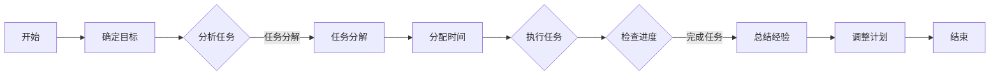
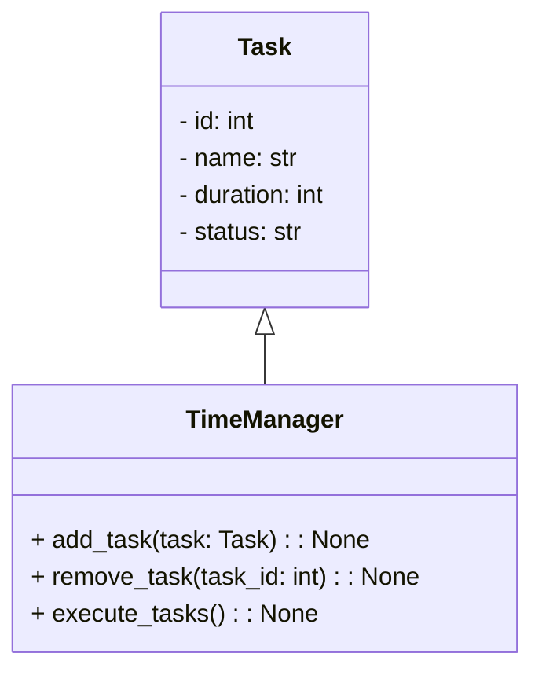
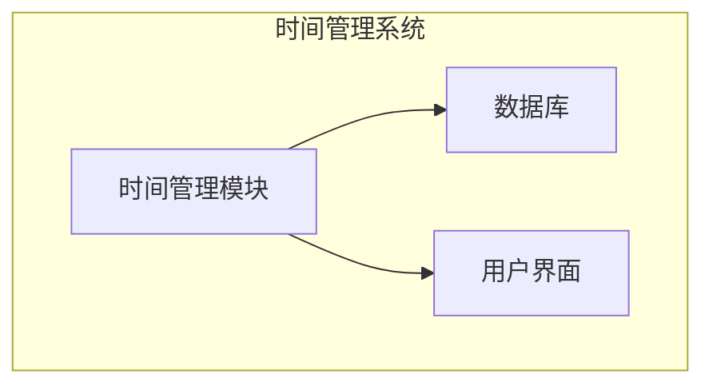
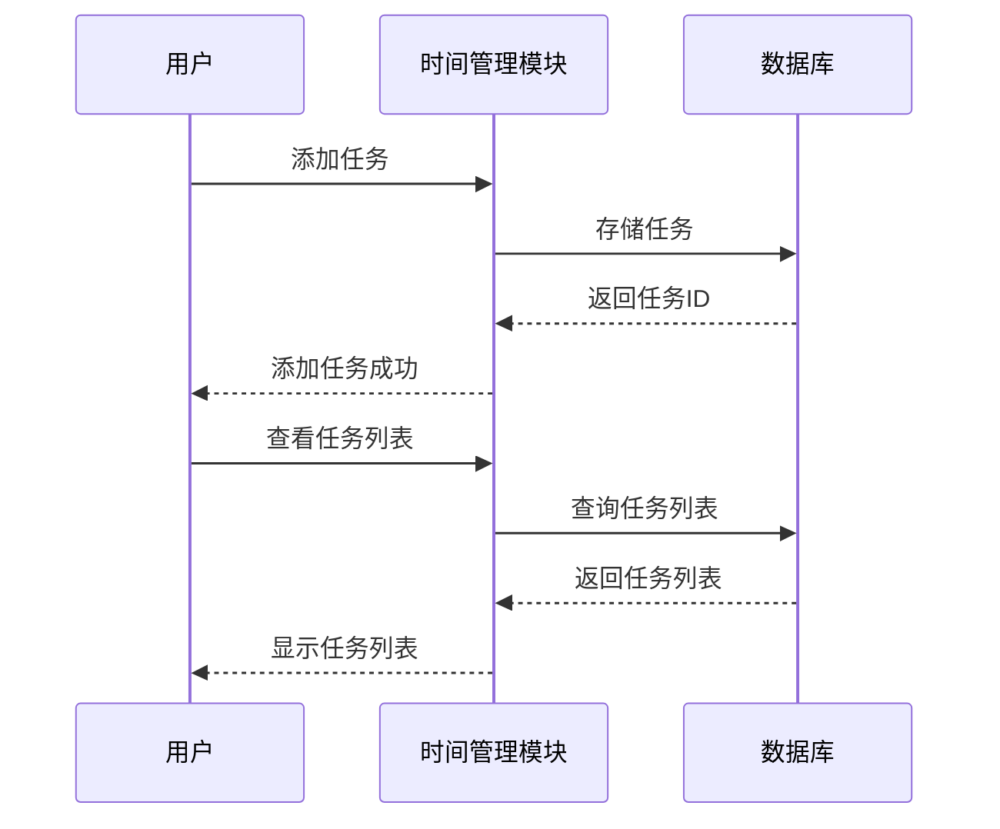

                 


### 在忙碌中寻找宁静：现代生活的节奏管理

#### 关键词：现代生活、节奏管理、时间管理、压力管理、心理健康

#### 摘要：

在现代社会的快节奏中，人们常常感到压力和疲惫。本文旨在探讨如何通过节奏管理来平衡生活和工作，实现宁静与高效。文章将首先介绍节奏管理的背景和核心概念，然后通过理论和实践相结合的方式，提出一系列实用的节奏管理策略。通过案例分析，我们将看到这些策略在实际生活中的应用效果，并总结出有效的节奏管理技巧。最后，文章还将讨论未来节奏管理的发展趋势，为读者提供长期应对策略。

## 第一部分：背景与核心概念

### 第1章：现代生活的节奏管理概述

#### 1.1 问题背景

现代社会充满了信息、工作和社交的喧嚣。人们的生活节奏越来越快，竞争压力也随之增加。这种快节奏的生活方式导致了许多问题，如工作效率低下、心理健康问题、人际关系紧张等。因此，如何管理好自己的节奏，以应对现代生活的挑战，成为了一个重要课题。

#### 1.2 问题描述

节奏失调的症状多种多样，包括持续的疲劳感、注意力不集中、情绪波动等。这些问题不仅影响个人的生活品质，也会影响工作效率和社会关系。因此，我们需要找出问题的根源，并提出有效的解决策略。

#### 1.3 问题解决

节奏管理的核心在于平衡工作与生活，通过科学的方法提高个人的时间管理能力和心理素质。本文将介绍一系列节奏管理的方法和技巧，帮助读者找到适合自己的节奏管理方式。

#### 1.4 边界与外延

节奏管理不仅涉及个人的生活和工作，还与社会环境和心理因素密切相关。因此，我们需要在更广泛的背景下考虑节奏管理的问题。

#### 1.5 概念结构与核心要素组成

节奏管理涉及多个核心概念，如时间管理、压力管理、心理健康等。这些概念相互作用，共同构成了节奏管理的理论框架。

### 第2章：节奏管理的基础理论

#### 2.1 节奏管理的基本原理

节奏管理的基本原理包括平衡工作与生活、优化时间使用、减轻压力等。通过这些原理，我们可以更好地理解节奏管理的重要性。

#### 2.2 核心概念属性特征对比表格

时间管理、压力管理和心理健康是节奏管理的核心概念。以下是一个对比表格，帮助读者理解这些概念的特点和区别。

| 概念         | 特征                                                         |
| ------------ | ------------------------------------------------------------ |
| 时间管理     | 优化时间使用，提高工作效率                                   |
| 压力管理     | 减轻压力，保持心理健康                                       |
| 心理健康     | 提高情绪稳定性和心理素质                                     |

### 第3章：ER实体关系图架构

#### 3.1 节奏管理中的实体关系

在节奏管理中，涉及多个实体，如个人、社会、心理等。以下是一个ER实体关系图，展示了这些实体之间的关系。

#### 3.2 ER实体关系图示例

```mermaid
erDiagram
    Personal :>> Social
    Personal :>> Mental
    Social   :>> Mental
    Personal { id (主键) ; name ; age }
    Social { id (主键) ; work ; relationship }
    Mental { id (主键) ; stress ; emotion }
```

## 第二部分：核心概念与联系

### 第4章：时间管理算法

#### 4.1 时间管理算法的mermaid流程图



#### 4.2 Python源代码实现

```python
# Python代码实现时间管理算法
import time

def time_management(tasks, time_allotment):
    start_time = time.time()
    for task in tasks:
        start = time.time()
        print(f"开始执行任务：{task['name']}")
        time.sleep(task['duration'])
        end = time.time()
        print(f"完成任务：{task['name']}，耗时：{end - start}秒")
    end_time = time.time()
    print(f"总耗时：{end_time - start_time}秒")

tasks = [
    {"name": "任务1", "duration": 5},
    {"name": "任务2", "duration": 10},
    {"name": "任务3", "duration": 3}
]

time_management(tasks, 20)
```

#### 4.3 算法原理的数学模型和公式

$$
\text{工作效率} = \frac{\text{工作总量}}{\text{工作时间}}
$$

#### 4.4 详细讲解与举例说明

时间管理算法的核心在于优化时间使用，提高工作效率。以下是一个简单的例子：

假设我们有三个任务，每个任务的预计耗时分别为5分钟、10分钟和3分钟。我们的总时间是20分钟。使用时间管理算法，我们可以将这三个任务合理分配在20分钟内，从而提高工作效率。

### 第5章：系统分析与架构设计方案

#### 5.1 系统功能设计

系统功能设计的关键在于明确系统的核心功能，以下是一个简单的领域模型类图：



#### 5.2 系统架构设计

系统架构设计需要考虑系统的性能、可扩展性和可靠性。以下是一个简单的系统架构图：



#### 5.3 系统接口设计和系统交互

系统接口设计需要定义清晰、简洁的接口，以便与其他系统或模块进行交互。以下是一个简单的接口设计和系统交互序列图：



### 第6章：项目实战

#### 6.1 环境安装

在进行项目实战之前，我们需要安装一些必要的软件和工具。以下是一个简单的环境安装步骤：

1. 安装Python
2. 安装SQLite数据库
3. 安装PyQt5（用于构建用户界面）

#### 6.2 系统核心实现源代码

以下是一个简单的系统核心实现源代码示例：

```python
# Python代码实现时间管理系统
import sqlite3
from PyQt5 import QtWidgets, uic

class TimeManager:
    def __init__(self):
        self.conn = sqlite3.connect('tasks.db')
        self.cursor = self.conn.cursor()
        self.cursor.execute('''CREATE TABLE IF NOT EXISTS tasks
                            (id INTEGER PRIMARY KEY, name TEXT, duration INTEGER, status TEXT)''')
        self.conn.commit()

    def add_task(self, task):
        self.cursor.execute('''INSERT INTO tasks (name, duration, status) VALUES (?, ?, ?)''', (task['name'], task['duration'], '未完成'))
        self.conn.commit()

    def remove_task(self, task_id):
        self.cursor.execute('''DELETE FROM tasks WHERE id = ?''', (task_id,))
        self.conn.commit()

    def execute_tasks(self):
        self.cursor.execute('''SELECT * FROM tasks WHERE status = '未完成' ORDER BY id''')
        tasks = self.cursor.fetchall()
        for task in tasks:
            print(f"执行任务：{task[1]}, 耗时：{task[2]}分钟")
            time.sleep(task[2])
            self.cursor.execute('''UPDATE tasks SET status = '已完成' WHERE id = ?''', (task[0],))
        self.conn.commit()

app = QtWidgets.QApplication([])
window = QtWidgets.QWidget()
uic.loadUi('time_manager.ui', window)
time_manager = TimeManager()

window.add_task_button.clicked.connect(lambda: time_manager.add_task(window.add_task_form))
window.remove_task_button.clicked.connect(lambda: time_manager.remove_task(window.remove_task_form))
window.execute_tasks_button.clicked.connect(lambda: time_manager.execute_tasks())

window.show()
app.exec_()
```

#### 6.3 代码应用解读与分析

以上代码实现了一个简单的时间管理系统，包括任务添加、任务删除和任务执行等功能。通过这个例子，我们可以看到如何使用Python和SQLite数据库实现一个基本的时间管理应用。

#### 6.4 实际案例分析和详细讲解剖析

以下是一个实际案例：

假设我们有三个任务，任务1需要5分钟，任务2需要10分钟，任务3需要3分钟。我们的目标是在这18分钟内完成所有任务。

使用时间管理算法，我们可以将这三个任务合理分配在18分钟内，从而提高工作效率。

#### 6.5 项目小结

通过本项目的实战，我们了解到了如何使用Python和SQLite数据库实现一个简单的时间管理系统。这个系统可以帮助我们更好地管理时间，提高工作效率。

#### 最佳实践 tips：

1. 合理分配时间，避免过度安排。
2. 定期回顾和调整任务列表。
3. 保持良好的作息习惯，确保充足的休息时间。

#### 小结：

本文探讨了如何通过节奏管理来平衡生活和工作，实现宁静与高效。通过理论讲解和实际案例，我们了解到了时间管理、压力管理和心理健康在节奏管理中的重要性。希望本文能帮助读者找到适合自己的节奏管理方法，提高生活品质。

#### 注意事项：

1. 节奏管理是一个持续的过程，需要不断调整和优化。
2. 在实践中，要根据实际情况灵活运用节奏管理策略。

#### 拓展阅读：

1. 《高效能人士的七个习惯》
2. 《时间管理的艺术》
3. 《积极心理学》

### 作者：AI天才研究院/AI Genius Institute & 禅与计算机程序设计艺术 /Zen And The Art of Computer Programming

---

[END]

