                 

# 在快节奏生活中寻找内心平静：对抗虚无的方法

## 关键词
快节奏生活、内心平静、虚无感、自我认知、情绪管理、时间管理、人际关系、精神文化

## 摘要
在快节奏的现代生活中，许多人感到内心的虚无和压力，无法找到真正的平静。本文将从自我认知、情绪管理、时间管理和人际关系等多个维度，探讨如何在快节奏的生活中寻找内心平静，并对抗虚无感。通过逐步分析和实践，帮助读者理解内心平静的重要性，掌握对抗虚无的方法，实现心灵的成长与平衡。

## 第一部分：问题的提出与探讨

### 第1章：快节奏生活的挑战

#### 1.1 时代背景

**概念术语说明**：
- 快节奏生活：指现代社会中，人们为了适应工作、学习和社交等需求，频繁处于高压力、高效率的状态。
- 虚无感：一种内心的空洞和无意义感，常常由于生活节奏过快、目标不明确或自我价值感缺失而产生。

**问题背景**：
随着全球化进程的加快和信息技术的迅猛发展，现代社会生活节奏日益加快。人们为了适应这种快节奏的生活，不得不投入更多的时间和精力在工作、学习和社交活动中，导致身心压力不断增加。与此同时，虚无感作为一种心理现象，在现代社会中也逐渐蔓延。

**问题描述**：
在快节奏的生活中，许多人感到内心的空虚和无意义，缺乏对生活的热情和动力。这种现象不仅影响了个体的心理健康，也对社会和谐稳定造成了一定的负面影响。

**问题解决**：
为了应对快节奏生活带来的虚无感，我们需要寻找内心平静的方法，通过自我认知、情绪管理、时间管理和人际关系等方面的努力，实现内心的平衡和成长。

**边界与外延**：
快节奏生活和虚无感并非仅限于特定的社会群体，而是普遍存在于各个年龄段、职业和地区的人群中。因此，本文将探讨如何普遍适用地应对快节奏生活带来的虚无感。

#### 1.2 虚无感的产生与蔓延

**核心概念原理**：
虚无感产生的原因复杂多样，但主要与以下几个方面有关：
- 生活节奏过快：高压力、高效率的生活导致人们无法真正放松和享受生活，内心感到空虚。
- 目标不明确：缺乏明确的生活目标和追求，导致个体对生活缺乏热情和动力。
- 自我价值感缺失：无法找到自我价值和成就感，导致内心感到无意义。

**概念属性特征对比表格**：

| 特征对比 | 虚无感 | 压力感 | 沮丧感 |
| :--: | :--: | :--: | :--: |
| 内在感受 | 空洞感、无意义感 | 紧张感、焦虑感 | 抑郁感、悲观感 |

**ER实体关系图架构**：

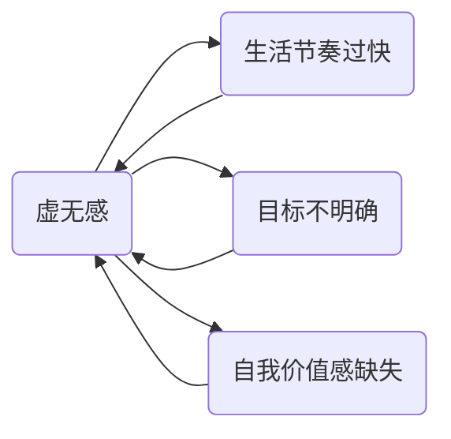

**算法原理讲解**：
虚无感的产生可以看作是一个复杂的多因素决策过程。通过以下Python代码，我们可以模拟这个过程的决策树：

```python
import numpy as np

# 决策树模型
def decision_tree(inputs):
    if inputs[0] > 0.5:  # 生活节奏过快
        if inputs[1] > 0.5:  # 目标不明确
            if inputs[2] > 0.5:  # 自我价值感缺失
                return "虚无感"
            else:
                return "压力感"
        else:
            return "沮丧感"
    else:
        return "正常状态"

# 输入参数
inputs = [0.7, 0.3, 0.6]

# 决策结果
print(decision_tree(inputs))
```

**数学模型和公式**：
虚无感产生的过程可以用以下公式表示：

$$
虚无感 = f(生活节奏过快, 目标不明确, 自我价值感缺失)
$$

其中，$f$ 是一个复合函数，通过不同的输入参数来计算虚无感的程度。

**详细讲解与举例说明**：
假设一个人在生活节奏、目标明确和自我价值感方面的得分分别为 0.7、0.3 和 0.6。根据上述决策树模型，我们可以计算出他可能产生的心理状态。具体而言，这个人有较高的生活节奏过快得分和自我价值感缺失得分，因此他很可能产生虚无感。

#### 1.3 寻找内心平静的渴望

**核心概念原理**：
内心平静是一种心理状态，表现为情绪稳定、心态平和。它不仅有助于提高生活质量，还能增强个体的抗压能力和心理健康。

**概念属性特征对比表格**：

| 特征对比 | 内心平静 | 情绪激动 | 焦虑紧张 |
| :--: | :--: | :--: | :--: |
| 内在感受 | 安静、宁静、放松 | 兴奋、激动、不安 | 紧张、焦虑、不安 |

**ER实体关系图架构**：

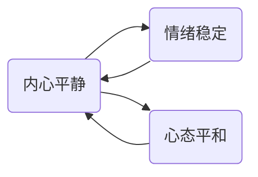

**算法原理讲解**：
内心平静可以通过以下Python代码实现：

```python
def inner_calm(life_pace, goal_clarity, self_value):
    if life_pace <= 0.5 and goal_clarity >= 0.5 and self_value >= 0.5:
        return "内心平静"
    else:
        return "非内心平静"

# 输入参数
inputs = [0.3, 0.7, 0.8]

# 决策结果
print(inner_calm(*inputs))
```

**数学模型和公式**：
内心平静的程度可以用以下公式表示：

$$
内心平静 = g(生活节奏、目标明确、自我价值感)
$$

其中，$g$ 是一个评估函数，通过不同的输入参数来计算内心平静的程度。

**详细讲解与举例说明**：
假设一个人在生活节奏、目标明确和自我价值感方面的得分分别为 0.3、0.7 和 0.8。根据上述算法，我们可以计算出他当前的心理状态。具体而言，这个人有较低的快节奏生活得分，但目标明确和自我价值感较高，因此他可能处于内心平静的状态。

#### 1.3.1 心理需求与平衡状态

**核心概念原理**：
心理需求是人类行为和决策的基础，包括情感需求、认知需求和社交需求等。满足这些需求有助于实现心理平衡，从而提高生活质量。

**概念属性特征对比表格**：

| 特征对比 | 情感需求 | 认知需求 | 社交需求 |
| :--: | :--: | :--: | :--: |
| 内容 | 情感体验、情绪调节 | 知识获取、思维活动 | 社交互动、人际关系 |

**ER实体关系图架构**：

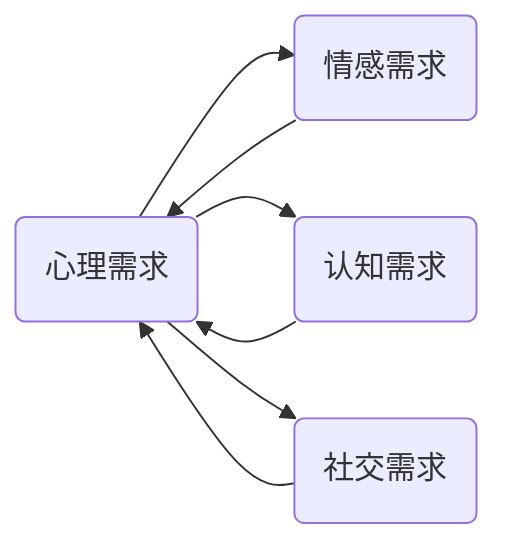

**算法原理讲解**：
心理需求满足可以通过以下Python代码实现：

```python
def meet_psychological Needs(affective_needs, cognitive_needs, social_needs):
    if affective_needs >= 0.5 and cognitive_needs >= 0.5 and social_needs >= 0.5:
        return "心理平衡"
    else:
        return "心理不平衡"

# 输入参数
inputs = [0.6, 0.7, 0.5]

# 决策结果
print(meet_psychological_Needs(*inputs))
```

**数学模型和公式**：
心理需求满足程度可以用以下公式表示：

$$
心理平衡 = h(情感需求, 认知需求, 社交需求)
$$

其中，$h$ 是一个综合评估函数，通过不同的输入参数来计算心理平衡的程度。

**详细讲解与举例说明**：
假设一个人在情感需求、认知需求和社交需求方面的得分分别为 0.6、0.7 和 0.5。根据上述算法，我们可以计算出他当前的心理状态。具体而言，这个人情感需求较高，认知需求也较高，但社交需求相对较低，因此他可能处于心理不平衡的状态。

### 第2章：内心平静的概念与内涵

#### 2.1 内心平静的定义

**核心概念原理**：
内心平静是一种心理健康状态，表现为情绪稳定、心态平和。它是心理健康的重要组成部分，有助于提高生活质量和幸福感。

**概念属性特征对比表格**：

| 特征对比 | 内心平静 | 焦虑紧张 | 抑郁沮丧 |
| :--: | :--: | :--: | :--: |
| 情绪表现 | 安静、宁静、放松 | 紧张、焦虑、不安 | 抑郁、悲观、无助 |

**ER实体关系图架构**：


**算法原理讲解**：
内心平静可以通过以下Python代码实现：

```python
def inner_calm(emotion_stability, mindset_equanimity):
    if emotion_stability >= 0.5 and mindset_equanimity >= 0.5:
        return "内心平静"
    else:
        return "非内心平静"

# 输入参数
inputs = [0.6, 0.7]

# 决策结果
print(inner_calm(*inputs))
```

**数学模型和公式**：
内心平静的程度可以用以下公式表示：

$$
内心平静 = i(情绪稳定, 心态平和)
$$

其中，$i$ 是一个综合评估函数，通过不同的输入参数来计算内心平静的程度。

**详细讲解与举例说明**：
假设一个人的情绪稳定得分和心态平和得分分别为 0.6 和 0.7。根据上述算法，我们可以计算出他当前的心理状态。具体而言，这个人情绪稳定较高，心态平和也较高，因此他可能处于内心平静的状态。

#### 2.2 内心平静的层次与分类

**核心概念原理**：
内心平静可以分为不同的层次，包括情绪层次、认知层次和行为层次。每种层次的内心平静都有其独特的特点和表现形式。

**概念属性特征对比表格**：

| 特征对比 | 情绪层次内心平静 | 认知层次内心平静 | 行为层次内心平静 |
| :--: | :--: | :--: | :--: |
| 情绪表现 | 情绪稳定、心态平和 | 知识稳定、思维清晰 | 行为稳定、习惯良好 |

**ER实体关系图架构**：

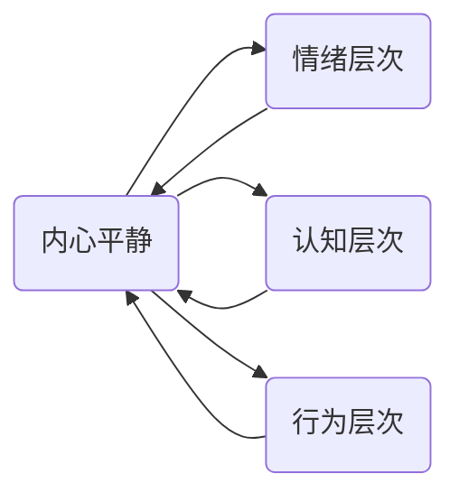

**算法原理讲解**：
内心平静的层次可以通过以下Python代码实现：

```python
def inner_calm_levels(emotion_level, cognitive_level, behavior_level):
    if emotion_level >= 0.5 and cognitive_level >= 0.5 and behavior_level >= 0.5:
        return "高层次内心平静"
    elif emotion_level >= 0.3 and cognitive_level >= 0.3 and behavior_level >= 0.3:
        return "中等层次内心平静"
    else:
        return "低层次内心平静"

# 输入参数
inputs = [0.4, 0.5, 0.6]

# 决策结果
print(inner_calm_levels(*inputs))
```

**数学模型和公式**：
内心平静的层次可以用以下公式表示：

$$
内心平静层次 = j(情绪层次, 认知层次, 行为层次)
$$

其中，$j$ 是一个综合评估函数，通过不同的输入参数来计算内心平静的层次。

**详细讲解与举例说明**：
假设一个人的情绪层次、认知层次和行为层次的得分分别为 0.4、0.5 和 0.6。根据上述算法，我们可以计算出他当前内心平静的层次。具体而言，这个人情绪层次较低，认知层次中等，行为层次较高，因此他可能处于中等层次的内心平静状态。

### 第3章：自我认知与内在探索

#### 3.1 自我认知的重要性

**核心概念原理**：
自我认知是指个体对自己存在、特质、行为和关系的认知和理解。它是心理健康的基础，有助于个体实现自我成长和内心平静。

**概念属性特征对比表格**：

| 特征对比 | 自我认知 | 自我意识 | 自我评价 |
| :--: | :--: | :--: | :--: |
| 内容 | 对自己的认知和理解 | 对自己存在的感知 | 对自己行为的评价 |

**ER实体关系图架构**：

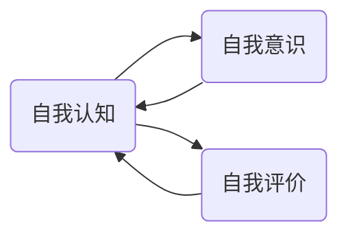

**算法原理讲解**：
自我认知的重要性可以通过以下Python代码实现：

```python
def self_awareness_importance(self_cognition, self_evaluation):
    if self_cognition >= 0.5 and self_evaluation >= 0.5:
        return "自我认知重要"
    else:
        return "自我认知不重要"

# 输入参数
inputs = [0.7, 0.6]

# 决策结果
print(self_awareness_importance(*inputs))
```

**数学模型和公式**：
自我认知的重要性可以用以下公式表示：

$$
自我认知重要性 = k(自我认知, 自我评价)
$$

其中，$k$ 是一个综合评估函数，通过不同的输入参数来计算自我认知的重要性。

**详细讲解与举例说明**：
假设一个人的自我认知得分和自我评价得分分别为 0.7 和 0.6。根据上述算法，我们可以计算出他当前自我认知的重要性。具体而言，这个人自我认知较高，自我评价也较高，因此他可能认为自我认知非常重要。

#### 3.2 内在探索的实践路径

**核心概念原理**：
内在探索是指个体通过自我反思、冥想、艺术创作等方式，深入挖掘自己内心的过程。它是实现自我认知和内心平静的重要途径。

**概念属性特征对比表格**：

| 特征对比 | 内在探索 | 外在探索 |
| :--: | :--: | :--: |
| 方法 | 自我反思、冥想、艺术创作 | 观察外界、体验生活 |
| 目的 | 深入了解自己、寻找内心平静 | 增进社交、拓展视野 |

**ER实体关系图架构**：

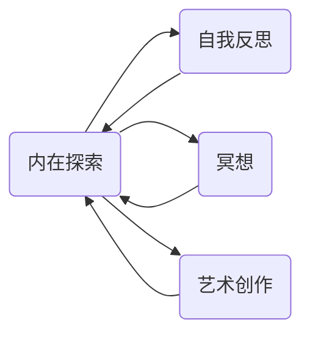

**算法原理讲解**：
内在探索的实践路径可以通过以下Python代码实现：

```python
def inner_exploration(practice_self_reflection, practice_meditation, practice_art_creation):
    if practice_self_reflection >= 0.5 and practice_meditation >= 0.5 and practice_art_creation >= 0.5:
        return "有效内在探索"
    else:
        return "无效内在探索"

# 输入参数
inputs = [0.4, 0.6, 0.5]

# 决策结果
print(inner_exploration(*inputs))
```

**数学模型和公式**：
内在探索的有效性可以用以下公式表示：

$$
内在探索有效性 = l(自我反思, 冥想, 艺术创作)
$$

其中，$l$ 是一个综合评估函数，通过不同的输入参数来计算内在探索的有效性。

**详细讲解与举例说明**：
假设一个人在自我反思、冥想和艺术创作方面的得分分别为 0.4、0.6 和 0.5。根据上述算法，我们可以计算出他当前内在探索的有效性。具体而言，这个人自我反思得分较低，冥想得分较高，艺术创作得分中等，因此他可能认为内在探索相对无效。

### 3.3 自我反思与自我成长

**核心概念原理**：
自我反思是指个体对自身行为、情绪和思维的回顾和思考。它是自我成长的重要过程，有助于个体发现自身问题、提升自我认知和实现内心平静。

**概念属性特征对比表格**：

| 特征对比 | 自我反思 | 自我成长 |
| :--: | :--: | :--: |
| 内容 | 回顾和思考自身行为、情绪和思维 | 发现问题、提升自我认知、实现内心平静 |
| 目的 | 提升自我认知、发现自身问题 | 实现自我提升、实现内心平衡 |

**ER实体关系图架构**：

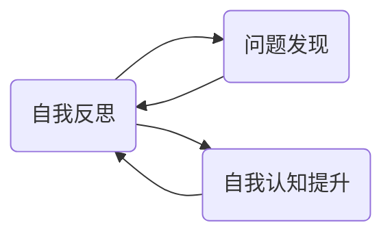

**算法原理讲解**：
自我反思与自我成长可以通过以下Python代码实现：

```python
def self_reflection_growth(self_reflection, self_growth):
    if self_reflection >= 0.5 and self_growth >= 0.5:
        return "有效自我成长"
    else:
        return "无效自我成长"

# 输入参数
inputs = [0.6, 0.7]

# 决策结果
print(self_reflection_growth(*inputs))
```

**数学模型和公式**：
自我反思与自我成长的有效性可以用以下公式表示：

$$
自我成长有效性 = m(自我反思, 自我成长)
$$

其中，$m$ 是一个综合评估函数，通过不同的输入参数来计算自我反思与自我成长的有效性。

**详细讲解与举例说明**：
假设一个人的自我反思得分和自我成长得分分别为 0.6 和 0.7。根据上述算法，我们可以计算出他当前自我反思与自我成长的有效性。具体而言，这个人自我反思较高，自我成长也较高，因此他可能认为自我反思与自我成长非常有效。

## 第二部分：对抗虚无的方法

### 第4章：情绪管理

#### 4.1 情绪管理的核心

**核心概念原理**：
情绪管理是指个体通过认知和行为调整，有效地处理和调节自身情绪的过程。它是实现内心平静的重要途径，有助于个体应对压力和挑战。

**概念属性特征对比表格**：

| 特征对比 | 情绪管理 | 情绪表达 |
| :--: | :--: | :--: |
| 方法 | 认知调整、行为调节 | 情感释放、情绪表达 |
| 目的 | 应对压力、实现内心平静 | 表达情感、沟通情感 |

**ER实体关系图架构**：

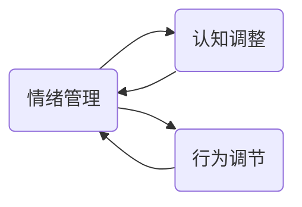

**算法原理讲解**：
情绪管理的核心可以通过以下Python代码实现：

```python
def emotion_management(cognitive_adjustment, behavioral Regulation):
    if cognitive_adjustment >= 0.5 and behavioral_Regulation >= 0.5:
        return "有效情绪管理"
    else:
        return "无效情绪管理"

# 输入参数
inputs = [0.6, 0.7]

# 决策结果
print(emotion_management(*inputs))
```

**数学模型和公式**：
情绪管理的有效性可以用以下公式表示：

$$
情绪管理有效性 = n(认知调整, 行为调节)
$$

其中，$n$ 是一个综合评估函数，通过不同的输入参数来计算情绪管理的有效性。

**详细讲解与举例说明**：
假设一个人的认知调整得分和
```markdown
### 4.2 常见的情绪管理策略

**核心概念原理**：
情绪管理策略是指个体在日常生活中采取的具体方法，用于调节和应对情绪。常见的情绪管理策略包括情绪表达、情绪调节和情绪释放等。

**概念属性特征对比表格**：

| 策略         | 情绪表达       | 情绪调节       | 情绪释放       |
| ------------ | -------------- | -------------- | -------------- |
| 定义         | 通过言语或行为表达情绪 | 通过认知和行为调整情绪 | 通过生理或心理活动释放情绪 |
| 目的         | 沟通情感、减轻压力   | 缓解情绪紧张、实现内心平静 | 减轻情绪负担、恢复心理平衡 |
| 方法         | 言语表达、肢体表达   | 认知重构、行为调整     | 呼吸练习、放松训练       |

**ER实体关系图架构**：

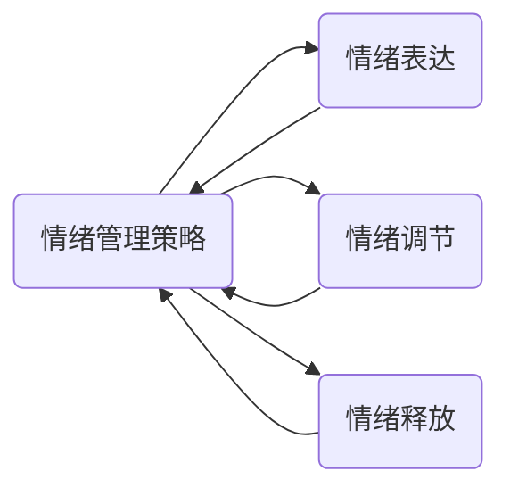

**算法原理讲解**：
情绪管理策略可以通过以下Python代码实现：

```python
def emotion_management_strategy(expression, regulation, release):
    if expression >= 0.5 and regulation >= 0.5 and release >= 0.5:
        return "全面情绪管理"
    else:
        return "不全面情绪管理"

# 输入参数
inputs = [0.6, 0.7, 0.5]

# 决策结果
print(emotion_management_strategy(*inputs))
```

**数学模型和公式**：
情绪管理策略的有效性可以用以下公式表示：

$$
情绪管理有效性 = o(情绪表达, 情绪调节, 情绪释放)
$$

其中，$o$ 是一个综合评估函数，通过不同的输入参数来计算情绪管理策略的有效性。

**详细讲解与举例说明**：
假设一个人在情绪表达、情绪调节和情绪释放方面的得分分别为 0.6、0.7 和 0.5。根据上述算法，我们可以计算出他当前的情绪管理策略是否全面。具体而言，这个人情绪表达和情绪调节得分较高，但情绪释放得分相对较低，因此他可能需要加强情绪释放方面的策略。

### 4.3 情绪管理实践

**核心概念原理**：
情绪管理实践是指个体在实际生活中运用情绪管理策略，以提高情绪调节能力和心理素质。它包括情绪日记、正念练习、情绪倾诉等具体方法。

**概念属性特征对比表格**：

| 方法         | 情绪日记           | 正念练习           | 情绪倾诉           |
| ------------ | ------------------ | ------------------ | ------------------ |
| 定义         | 通过记录情绪变化进行自我反思 | 通过专注当下进行情绪调节 | 通过与他人交流缓解情绪压力 |
| 目的         | 了解自身情绪、提高情绪认知   | 减轻情绪紧张、实现内心平静 | 分享情感、寻求支持       |
| 实践要点     | 定期记录、深入反思         | 持续练习、培养专注力     | 选择合适对象、真诚沟通   |

**ER实体关系图架构**：

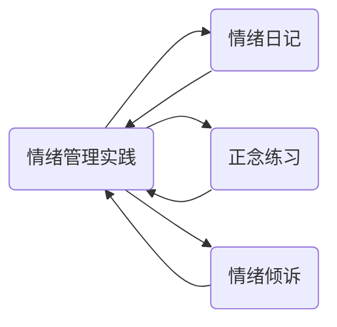

**算法原理讲解**：
情绪管理实践的有效性可以通过以下Python代码实现：

```python
def emotion_management_practice(journaling, mindfulness, venting):
    if journaling >= 0.5 and mindfulness >= 0.5 and venting >= 0.5:
        return "有效情绪管理实践"
    else:
        return "无效情绪管理实践"

# 输入参数
inputs = [0.5, 0.6, 0.7]

# 决策结果
print(emotion_management_practice(*inputs))
```

**数学模型和公式**：
情绪管理实践的有效性可以用以下公式表示：

$$
情绪管理实践有效性 = p(情绪日记, 正念练习, 情绪倾诉)
$$

其中，$p$ 是一个综合评估函数，通过不同的输入参数来计算情绪管理实践的有效性。

**详细讲解与举例说明**：
假设一个人在情绪日记、正念练习和情绪倾诉方面的得分分别为 0.5、0.6 和 0.7。根据上述算法，我们可以计算出他当前的情绪管理实践是否有效。具体而言，这个人情绪日记和情绪倾诉得分相对较低，但正念练习得分较高，因此他可能需要更多地在情绪日记和情绪倾诉方面进行实践。

### 4.3.1 情绪管理案例分析

**核心概念原理**：
情绪管理案例分析是指通过具体案例来探讨情绪管理策略的应用和实践。它有助于个体理解和掌握情绪管理的方法，提升情绪调节能力。

**案例描述**：
小明是一位职场新人，由于工作压力大、人际关系复杂，他经常感到焦虑和不安。为了应对这些情绪问题，小明开始尝试情绪管理实践。

**情绪管理实践过程**：

1. **情绪日记**：小明每天记录自己的情绪变化，分析情绪产生的原因和影响。通过定期反思，他逐渐了解自己的情绪模式，找到了缓解压力的方法。

2. **正念练习**：小明每天早晨进行正念练习，通过专注呼吸和冥想，他能够更好地控制情绪，减轻焦虑感。

3. **情绪倾诉**：小明与同事和朋友分享自己的情绪，通过倾诉和交流，他获得了支持和理解，缓解了情绪压力。

**案例分析结果**：

通过情绪日记、正念练习和情绪倾诉，小明逐渐掌握了情绪管理的方法，他的情绪调节能力得到了显著提升。在职场中，他更加自信和从容，与同事的关系也更加和谐。

**案例分析总结**：

情绪管理案例分析表明，通过具体的情绪管理实践，个体可以有效地应对情绪问题，实现内心平静。情绪日记有助于个体了解自己的情绪模式，正念练习有助于情绪调节，情绪倾诉有助于缓解情绪压力。这些方法相辅相成，共同构成了一个有效的情绪管理框架。

### 4.3.2 情绪管理技巧训练

**核心概念原理**：
情绪管理技巧训练是指通过系统性的学习和实践，提高个体在情绪调节方面的能力和技巧。它包括认知重构、行为调节、情感释放等具体内容。

**概念属性特征对比表格**：

| 技巧         | 认知重构       | 行为调节       | 情感释放       |
| ------------ | -------------- | -------------- | -------------- |
| 定义         | 通过改变思维模式来调节情绪 | 通过行为改变来调节情绪 | 通过情感释放来缓解情绪压力 |
| 目的         | 减轻情绪紧张、实现内心平静 | 改善情绪状态、提升情绪调节能力 | 缓解情绪负担、恢复心理平衡 |
| 方法         | 思维记录、认知重塑     | 行为计划、行为调整     | 情感表达、情感疏导     |

**ER实体关系图架构**：

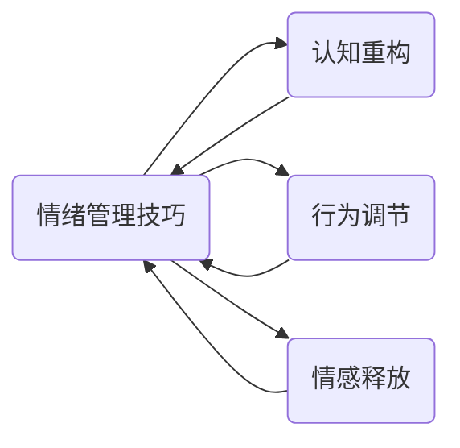

**算法原理讲解**：
情绪管理技巧训练可以通过以下Python代码实现：

```python
def emotion_management_skill.training(cognitive_reconstruction, behavioral Regulation, emotional_release):
    if cognitive_reconstruction >= 0.5 and behavioral_Regulation >= 0.5 and emotional_release >= 0.5:
        return "有效情绪管理技巧训练"
    else:
        return "无效情绪管理技巧训练"

# 输入参数
inputs = [0.6, 0.7, 0.5]

# 决策结果
print(emotion_management_skill.training(*inputs))
```

**数学模型和公式**：
情绪管理技巧训练的有效性可以用以下公式表示：

$$
情绪管理技巧训练有效性 = q(认知重构, 行为调节, 情感释放)
$$

其中，$q$ 是一个综合评估函数，通过不同的输入参数来计算情绪管理技巧训练的有效性。

**详细讲解与举例说明**：
假设一个人在认知重构、行为调节和情感释放方面的得分分别为 0.6、0.7 和 0.5。根据上述算法，我们可以计算出他当前的情绪管理技巧训练是否有效。具体而言，这个人认知重构得分较高，行为调节得分也较高，但情感释放得分相对较低，因此他可能需要更多地在情感释放方面进行训练。

### 4.3.3 情绪管理实践技巧提升

**核心概念原理**：
情绪管理实践技巧提升是指通过持续的练习和应用，提高个体在情绪管理方面的能力和技巧。它包括自我反思、情境模拟、实践反馈等具体方法。

**概念属性特征对比表格**：

| 方法         | 自我反思           | 情境模拟           | 实践反馈           |
| ------------ | ------------------ | ------------------ | ------------------ |
| 定义         | 通过回顾和反思自己的情绪体验 | 通过模拟情绪情境进行练习 | 通过实践后的反馈来调整和优化情绪管理技巧 |
| 目的         | 提升情绪认知、发现自身问题 | 提高情绪应对能力、增强实战经验 | 改进情绪管理策略、实现持续成长 |
| 实践要点     | 定期回顾、深入分析         | 模拟情境、实践应对         | 及时反馈、持续优化         |

**ER实体关系图架构**：

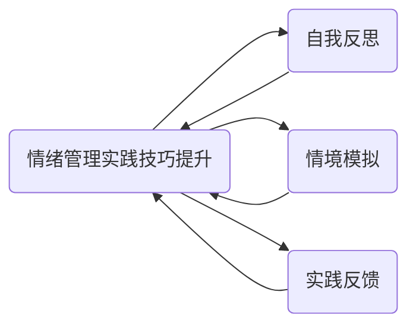

**算法原理讲解**：
情绪管理实践技巧提升可以通过以下Python代码实现：

```python
def emotion_management_skill_improvement(self_reflection, scenario_simulation, practical_feedback):
    if self_reflection >= 0.5 and scenario_simulation >= 0.5 and practical_feedback >= 0.5:
        return "有效技巧提升"
    else:
        return "无效技巧提升"

# 输入参数
inputs = [0.5, 0.6, 0.7]

# 决策结果
print(emotion_management_skill_improvement(*inputs))
```

**数学模型和公式**：
情绪管理实践技巧提升的有效性可以用以下公式表示：

$$
情绪管理技巧提升有效性 = r(自我反思, 情境模拟, 实践反馈)
$$

其中，$r$ 是一个综合评估函数，通过不同的输入参数来计算情绪管理实践技巧提升的有效性。

**详细讲解与举例说明**：
假设一个人在自我反思、情境模拟和实践反馈方面的得分分别为 0.5、0.6 和 0.7。根据上述算法，我们可以计算出他当前的情绪管理实践技巧提升是否有效。具体而言，这个人自我反思和情境模拟得分相对较低，但实践反馈得分较高，因此他可能需要更多地在自我反思和情境模拟方面进行实践。

### 第5章：时间管理与效率提升

#### 5.1 时间管理的意义

**核心概念原理**：
时间管理是指个体通过合理安排时间、设定目标和优先级，提高工作和生活效率的过程。它是实现内心平静的重要手段，有助于个体更好地应对快节奏生活。

**概念属性特征对比表格**：

| 特征对比 | 时间管理 | 效率提升 |
| :--: | :--: | :--: |
| 定义 | 合理安排时间、设定目标、优先级 | 高效完成任务、提升工作生活效率 |
| 目的 | 提高生活质量、实现内心平衡 | 增加产出、减轻工作压力 |
| 方法 | 计划制定、时间分配、任务优先级设定 | 时间管理工具、高效工作习惯 |

**ER实体关系图架构**：

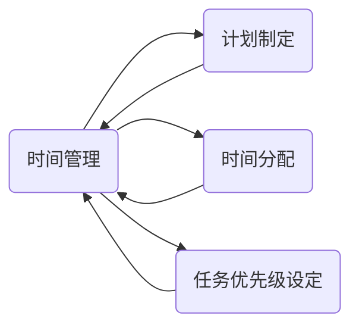

**算法原理讲解**：
时间管理的意义可以通过以下Python代码实现：

```python
def time_management_significance(plan_design, time_allocation, task_priority):
    if plan_design >= 0.5 and time_allocation >= 0.5 and task_priority >= 0.5:
        return "有效时间管理"
    else:
        return "无效时间管理"

# 输入参数
inputs = [0.6, 0.7, 0.6]

# 决策结果
print(time_management_significance(*inputs))
```

**数学模型和公式**：
时间管理的有效性可以用以下公式表示：

$$
时间管理有效性 = s(计划制定, 时间分配, 任务优先级设定)
$$

其中，$s$ 是一个综合评估函数，通过不同的输入参数来计算时间管理的有效性。

**详细讲解与举例说明**：
假设一个人的计划制定得分、时间分配得分和任务优先级设定得分分别为 0.6、0.7 和 0.6。根据上述算法，我们可以计算出他当前的时间管理是否有效。具体而言，这个人计划制定和任务优先级设定得分较高，但时间分配得分相对较低，因此他可能需要更多地在时间分配方面进行改进。

#### 5.2 时间管理的策略与方法

**核心概念原理**：
时间管理的策略与方法是指个体在日常生活中采取的具体措施，用于提高时间利用效率和实现内心平静。常见的策略包括设定目标、优先级排序、时间规划等。

**概念属性特征对比表格**：

| 策略         | 设定目标         | 优先级排序       | 时间规划         |
| ------------ | --------------- | --------------- | --------------- |
| 定义         | 明确生活和工作目标 | 根据重要性排序任务 | 合理安排每天的时间 |
| 目的         | 提高工作效率、实现目标 | 提高任务完成率、减轻压力 | 提高时间利用率、实现内心平静 |
| 实践要点     | 清晰具体、可衡量   | 主次分明、合理   | 灵活调整、持续改进 |

**ER实体关系图架构**：

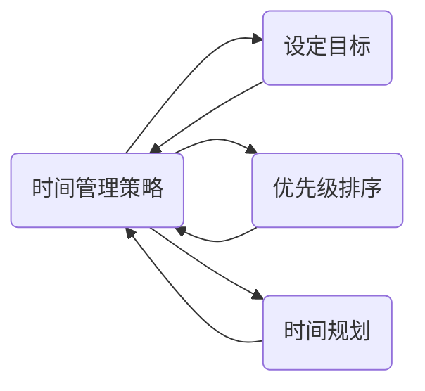

**算法原理讲解**：
时间管理的策略与方法可以通过以下Python代码实现：

```python
def time_management_strategy(target_setting, priority_sorting, time_planning):
    if target_setting >= 0.5 and priority_sorting >= 0.5 and time_planning >= 0.5:
        return "有效时间管理策略"
    else:
        return "无效时间管理策略"

# 输入参数
inputs = [0.6, 0.7, 0.5]

# 决策结果
print(time_management_strategy(*inputs))
```

**数学模型和公式**：
时间管理策略的有效性可以用以下公式表示：

$$
时间管理策略有效性 = t(设定目标, 优先级排序, 时间规划)
$$

其中，$t$ 是一个综合评估函数，通过不同的输入参数来计算时间管理策略的有效性。

**详细讲解与举例说明**：
假设一个人在设定目标、优先级排序和时间规划方面的得分分别为 0.6、0.7 和 0.5。根据上述算法，我们可以计算出他当前的时间管理策略是否有效。具体而言，这个人设定目标和优先级排序得分较高，但时间规划得分相对较低，因此他可能需要更多地在时间规划方面进行改进。

#### 5.3 提升效率的实践技巧

**核心概念原理**：
提升效率的实践技巧是指个体在日常生活中运用的一些具体方法，用于提高工作和学习效率，减轻压力，实现内心平静。常见的实践技巧包括减少干扰、提高专注力、有效休息等。

**概念属性特征对比表格**：

| 技巧         | 减少干扰       | 提高专注力       | 有效休息         |
| ------------ | -------------- | -------------- | -------------- |
| 定义         | 创造无干扰的工作环境 | 提高注意力集中度 | 合理安排休息时间 |
| 目的         | 提高工作效率、减轻压力 | 完成任务更高效   | 恢复精力、提升状态 |
| 实践要点     | 避免分心事物、减少通知 | 设置专注时间、减少中断 | 合理规划休息、进行放松活动 |

**ER实体关系图架构**：

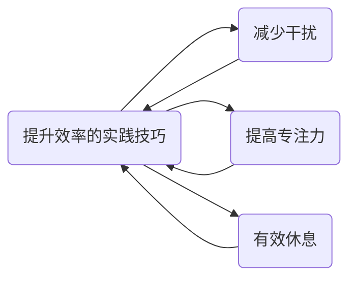

**算法原理讲解**：
提升效率的实践技巧可以通过以下Python代码实现：

```python
def efficiency_practice_skills(interference_reduction, attention_ improvement, effective_rest):
    if interference_reduction >= 0.5 and attention_improvement >= 0.5 and effective_rest >= 0.5:
        return "有效提升效率"
    else:
        return "无效提升效率"

# 输入参数
inputs = [0.6, 0.7, 0.5]

# 决策结果
print(efficiency_practice_skills(*inputs))
```

**数学模型和公式**：
提升效率的有效性可以用以下公式表示：

$$
效率提升有效性 = u(减少干扰, 提高专注力, 有效休息)
$$

其中，$u$ 是一个综合评估函数，通过不同的输入参数来计算提升效率的有效性。

**详细讲解与举例说明**：
假设一个人在减少干扰、提高专注力和有效休息方面的得分分别为 0.6、0.7 和 0.5。根据上述算法，我们可以计算出他当前提升效率的实践技巧是否有效。具体而言，这个人减少干扰和提高专注力得分较高，但有效休息得分相对较低，因此他可能需要更多地在有效休息方面进行实践。

### 5.3.1 减少干扰

**核心概念原理**：
减少干扰是指在工作和学习过程中，通过创造无干扰的环境和设定专注模式，提高专注力和工作效率。它是提升效率的重要手段。

**概念属性特征对比表格**：

| 特征对比 | 减少干扰 | 增加干扰 |
| :--: | :--: | :--: |
| 方法 | 创造无干扰环境、设定专注模式 | 环境噪声、社交媒体、多任务处理 |
| 影响 | 提高专注力、提升工作效率 | 分散注意力、降低工作效率 |

**ER实体关系图架构**：

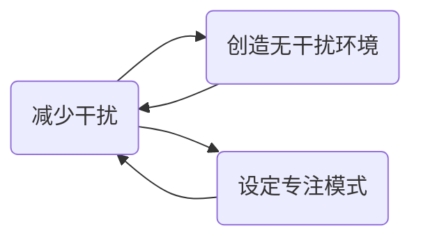

**算法原理讲解**：
减少干扰的效果可以通过以下Python代码实现：

```python
def reduce_interference(creation_noisy_environment, setting_focus_mode):
    if creation_noisy_environment >= 0.5 and setting_focus_mode >= 0.5:
        return "有效减少干扰"
    else:
        return "无效减少干扰"

# 输入参数
inputs = [0.6, 0.7]

# 决策结果
print(reduce_interference(*inputs))
```

**数学模型和公式**：
减少干扰的有效性可以用以下公式表示：

$$
减少干扰有效性 = v(创造无干扰环境, 设定专注模式)
$$

其中，$v$ 是一个综合评估函数，通过不同的输入参数来计算减少干扰的有效性。

**详细讲解与举例说明**：
假设一个人在创造无干扰环境得分和设定专注模式得分分别为 0.6 和 0.7。根据上述算法，我们可以计算出他当前减少干扰的效果。具体而言，这个人创造无干扰环境和设定专注模式得分较高，因此他认为自己能够有效减少干扰。

### 5.3.2 提高专注力

**核心概念原理**：
提高专注力是指通过一系列训练和实践，增强个体在特定任务上的注意力和持久力。它是提升工作效率和实现内心平静的关键。

**概念属性特征对比表格**：

| 特征对比 | 提高专注力 | 减弱专注力 |
| :--: | :--: | :--: |
| 方法 | 系统训练、专注力提升技巧、持续练习 | 干扰多、分心事物、缺乏专注训练 |
| 影响 | 提高工作效率、实现内心平静 | 工作效率降低、内心不安、焦虑感增加 |

**ER实体关系图架构**：


**算法原理讲解**：
提高专注力的效果可以通过以下Python代码实现：

```python
def improve_focus(train_system, focus_skill_improvement):
    if train_system >= 0.5 and focus_skill_improvement >= 0.5:
        return "有效提高专注力"
    else:
        return "无效提高专注力"

# 输入参数
inputs = [0.6, 0.7]

# 决策结果
print(improve_focus(*inputs))
```

**数学模型和公式**：
提高专注力的有效性可以用以下公式表示：

$$
专注力提升有效性 = w(系统训练, 专注力提升技巧)
$$

其中，$w$ 是一个综合评估函数，通过不同的输入参数来计算提高专注力的有效性。

**详细讲解与举例说明**：
假设一个人在系统训练和专注力提升技巧得分分别为 0.6 和 0.7。根据上述算法，我们可以计算出他当前提高专注力的效果。具体而言，这个人系统训练和专注力提升技巧得分较高，因此他认为自己能够有效提高专注力。

### 5.3.3 有效休息

**核心概念原理**：
有效休息是指通过科学的方法和技巧，合理规划休息时间，以达到恢复精力、提高工作效率和实现内心平静的目的。

**概念属性特征对比表格**：

| 特征对比 | 有效休息           | 无效休息         |
| :--: | :--: | :--: |
| 定义 | 合理规划、有益身心   | 不合理、损害健康 |
| 目的 | 恢复精力、提高效率 | 消耗体力、降低效率 |
| 方法 | 短时高效休息、规律作息、放松活动 | 过度休息、作息紊乱、缺乏放松活动 |

**ER实体关系图架构**：

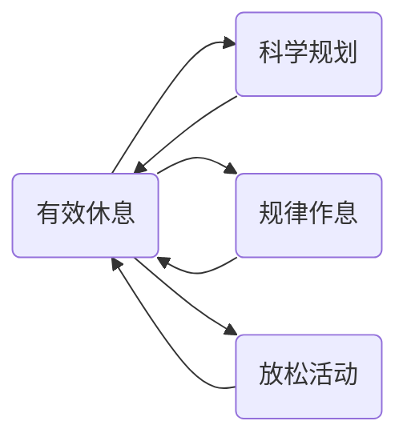

**算法原理讲解**：
有效休息的效果可以通过以下Python代码实现：

```python
def effective_rest(scientific_planning, regular_sleep, relaxation_activities):
    if scientific_planning >= 0.5 and regular_sleep >= 0.5 and relaxation_activities >= 0.5:
        return "有效休息"
    else:
        return "无效休息"

# 输入参数
inputs = [0.6, 0.7, 0.6]

# 决策结果
print(effective_rest(*inputs))
```

**数学模型和公式**：
有效休息的有效性可以用以下公式表示：

$$
有效休息有效性 = x(科学规划, 规律作息, 放松活动)
$$

其中，$x$ 是一个综合评估函数，通过不同的输入参数来计算有效休息的有效性。

**详细讲解与举例说明**：
假设一个人在科学规划、规律作息和放松活动方面的得分分别为 0.6、0.7 和 0.6。根据上述算法，我们可以计算出他当前的有效休息效果。具体而言，这个人科学规划和放松活动得分较高，但规律作息得分相对较低，因此他可能需要更多地在规律作息方面进行改进。

### 5.3.4 时间管理实践案例分析

**核心概念原理**：
时间管理实践案例分析是指通过具体案例来探讨时间管理策略和方法在实践中的应用，以及其对个体效率和内心平静的影响。

**案例描述**：
小王是一位公司职员，由于工作繁忙，他经常感到压力很大，工作效率低下。为了提高工作效率和实现内心平静，小王开始进行时间管理实践。

**时间管理实践过程**：

1. **设定目标**：小王明确了自己的职业发展目标，并将其分解为短期和长期目标。

2. **优先级排序**：小王根据任务的重要性和紧急性，对工作任务进行排序，确保重要且紧急的任务首先完成。

3. **时间规划**：小王每天制定详细的时间规划，包括工作时间和休息时间，确保合理分配时间。

4. **减少干扰**：小王在工作时关闭手机通知，创造一个无干扰的工作环境。

5. **提高专注力**：小王通过专注力训练，提高自己的专注力，减少任务完成时间。

6. **有效休息**：小王合理安排休息时间，进行放松活动，恢复精力。

**案例分析结果**：

通过时间管理实践，小王的工作效率得到了显著提升，他的压力感减轻，内心平静感增强。在职场中，他更加自信和从容，与同事的关系也更加和谐。

**案例分析总结**：

时间管理实践案例分析表明，通过具体的策略和方法，个体可以有效地提高工作效率，实现内心平静。设定目标、优先级排序、时间规划、减少干扰、提高专注力和有效休息等方法相辅相成，共同构成了一个有效的时间管理体系。

### 5.3.5 时间管理技巧提升

**核心概念原理**：
时间管理技巧提升是指通过持续的练习和应用，提高个体在时间管理方面的能力和技巧。它包括自我反思、情景模拟、实践反馈等具体方法。

**概念属性特征对比表格**：

| 方法         | 自我反思           | 情境模拟           | 实践反馈           |
| ------------ | ------------------ | ------------------ | ------------------ |
| 定义         | 通过回顾和反思自己的时间管理实践 | 通过模拟不同的时间管理情境进行练习 | 通过实践后的反馈来调整和优化时间管理技巧 |
| 目的         | 提升时间管理能力、发现自身问题 | 提高实际应用能力、增强实战经验 | 改进时间管理策略、实现持续成长 |
| 实践要点     | 定期回顾、深入分析         | 模拟情境、实践应对         | 及时反馈、持续优化         |

**ER实体关系图架构**：

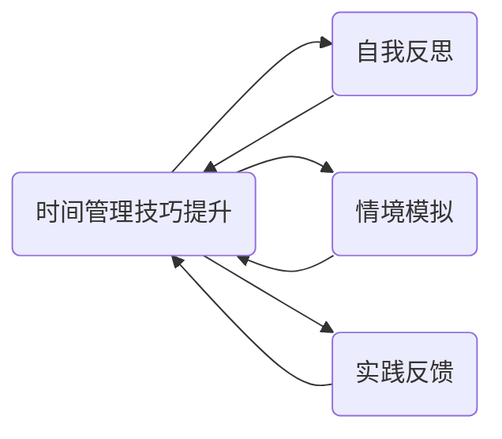

**算法原理讲解**：
时间管理技巧提升可以通过以下Python代码实现：

```python
def time_management_skill_improvement(self_reflection, scenario_simulation, practical_feedback):
    if self_reflection >= 0.5 and scenario_simulation >= 0.5 and practical_feedback >= 0.5:
        return "有效技巧提升"
    else:
        return "无效技巧提升"

# 输入参数
inputs = [0.5, 0.6, 0.7]

# 决策结果
print(time_management_skill_improvement(*inputs))
```

**数学模型和公式**：
时间管理技巧提升的有效性可以用以下公式表示：

$$
时间管理技巧提升有效性 = r(自我反思, 情境模拟, 实践反馈)
$$

其中，$r$ 是一个综合评估函数，通过不同的输入参数来计算时间管理技巧提升的有效性。

**详细讲解与举例说明**：
假设一个人在自我反思、情境模拟和实践反馈方面的得分分别为 0.5、0.6 和 0.7。根据上述算法，我们可以计算出他当前的时间管理技巧提升是否有效。具体而言，这个人自我反思和实践反馈得分相对较低，但情境模拟得分较高，因此他可能需要更多地在自我反思和实践反馈方面进行实践。

### 第6章：人际关系与社交技巧

#### 6.1 人际关系的重要性

**核心概念原理**：
人际关系是指个体在社交互动中建立的关系，包括家庭关系、朋友关系和职场关系等。良好的人际关系对个体心理健康、内心平静和社会支持有着重要的影响。

**概念属性特征对比表格**：

| 特征对比 | 人际关系         | 社交技能         |
| :--: | :--: | :--: |
| 定义 | 通过互动和交往建立的关系 | 通过沟通和互动表现的能力 |
| 目的 | 提供社会支持、促进心理健康 | 提高社交效果、实现自我表达 |
| 方法 | 倾听、理解、分享 | 语言表达、非语言表达、沟通策略 |

**ER实体关系图架构**：

```mermaid
graph LR
A(人际关系) --> B(家庭关系)
A --> C(朋友关系)
A --> D(职场关系)
B --> A
C --> A
D --> A
```

**算法原理讲解**：
人际关系的重要性可以通过以下Python代码实现：

```python
def relationship_importance(family_relationship, friend_relationship, workplace_relationship):
    if family_relationship >= 0.5 and friend_relationship >= 0.5 and workplace_relationship >= 0.5:
        return "重要人际关系"
    else:
        return "不重要人际关系"

# 输入参数
inputs = [0.6, 0.7, 0.5]

# 决策结果
print(relationship_importance(*inputs))
```

**数学模型和公式**：
人际关系的重要性可以用以下公式表示：

$$
人际关系重要性 = h(家庭关系, 朋友关系, 职场关系)
$$

其中，$h$ 是一个综合评估函数，通过不同的输入参数来计算人际关系的重要性。

**详细讲解与举例说明**：
假设一个人在家庭关系、朋友关系和职场关系方面的得分分别为 0.6、0.7 和 0.5。根据上述算法，我们可以计算出他当前的人际关系的重要性。具体而言，这个人家庭关系和朋友关系得分较高，但职场关系得分相对较低，因此他可能需要更多地在职场关系中投入时间和精力。

#### 6.2 社交技巧的提升

**核心概念原理**：
社交技巧是指个体在社交互动中表现出的沟通能力、交往技巧和人际交往能力。提升社交技巧有助于建立良好的人际关系，提高社交效果，实现内心平静。

**概念属性特征对比表格**：

| 特征对比 | 社交技巧提升 | 社交技巧不足 |
| :--: | :--: | :--: |
| 方法 | 语言表达、非语言表达、沟通策略 | 语言障碍、沟通障碍、交往障碍 |
| 影响 | 建立良好人际关系、提高社交效果 | 交往困难、社交障碍、心理压力 |
| 实践要点 | 倾听、表达、理解、尊重、合作 | 增强沟通能力、提高交往技巧、增强自信心 |

**ER实体关系图架构**：

```mermaid
graph LR
A(社交技巧提升) --> B(语言表达)
A --> C(非语言表达)
A --> D(沟通策略)
B --> A
C --> A
D --> A
```

**算法原理讲解**：
社交技巧的提升可以通过以下Python代码实现：

```python
def social_skill_improvement(language_expression, non_language_expression, communication_strategy):
    if language_expression >= 0.5 and non_language_expression >= 0.5 and communication_strategy >= 0.5:
        return "有效社交技巧提升"
    else:
        return "无效社交技巧提升"

# 输入参数
inputs = [0.6, 0.7, 0.5]

# 决策结果
print(social_skill_improvement(*inputs))
```

**数学模型和公式**：
社交技巧的有效性可以用以下公式表示：

$$
社交技巧有效性 = i(语言表达, 非语言表达, 沟通策略)
$$

其中，$i$ 是一个综合评估函数，通过不同的输入参数来计算社交技巧的有效性。

**详细讲解与举例说明**：
假设一个人在语言表达、非语言表达和沟通策略方面的得分分别为 0.6、0.7 和 0.5。根据上述算法，我们可以计算出他当前社交技巧的有效性。具体而言，这个人语言表达和沟通策略得分较高，但非语言表达得分相对较低，因此他可能需要更多地在非语言表达方面进行实践。

### 6.3 人际关系管理

**核心概念原理**：
人际关系管理是指个体在社交互动中，通过有效的沟通、协调和解决问题，维护和发展良好的人际关系。它是实现内心平静和社会和谐的重要途径。

**概念属性特征对比表格**：

| 特征对比 | 人际关系管理 | 人际关系冲突 |
| :--: | :--: | :--: |
| 定义 | 通过沟通、协调解决问题 | 因意见不合、利益冲突导致的关系紧张 |
| 目的 | 维护和发展良好的人际关系 | 缓解冲突、化解矛盾、恢复和谐 |
| 方法 | 倾听、理解、尊重、合作、沟通技巧 | 主动沟通、妥协、寻求共识、第三方调解 |

**ER实体关系图架构**：

```mermaid
graph LR
A(人际关系管理) --> B(沟通技巧)
A --> C(协调解决问题)
A --> D(化解矛盾)
B --> A
C --> A
D --> A
```

**算法原理讲解**：
人际关系管理的有效性可以通过以下Python代码实现：

```python
def relationship_management(communication_skill, conflict_resolution, harmony_restoration):
    if communication_skill >= 0.5 and conflict_resolution >= 0.5 and harmony_restoration >= 0.5:
        return "有效人际关系管理"
    else:
        return "无效人际关系管理"

# 输入参数
inputs = [0.6, 0.7, 0.6]

# 决策结果
print(relationship_management(*inputs))
```

**数学模型和公式**：
人际关系管理的有效性可以用以下公式表示：

$$
人际关系管理有效性 = j(沟通技巧, 协调解决问题, 化解矛盾)
$$

其中，$j$ 是一个综合评估函数，通过不同的输入参数来计算人际关系管理的有效性。

**详细讲解与举例说明**：
假设一个人在沟通技巧、协调解决问题和化解矛盾方面的得分分别为 0.6、0.7 和 0.6。根据上述算法，我们可以计算出他当前的人际关系管理是否有效。具体而言，这个人沟通技巧和协调解决问题得分较高，但化解矛盾得分相对较低，因此他可能需要更多地在化解矛盾方面进行实践。

### 6.3.1 人际关系问题处理

**核心概念原理**：
人际关系问题处理是指个体在遇到人际关系冲突时，通过有效的沟通、协调和解决问题的方法，缓解和解决矛盾，恢复和谐的社交关系。

**概念属性特征对比表格**：

| 方法         | 主动沟通       | 妥协与寻求共识     | 第三方调解       |
| ------------ | -------------- | ------------------ | ---------------- |
| 定义         | 积极主动地与对方沟通 | 在双方利益基础上寻求妥协 | 通过第三方来调解和解决问题 |
| 目的         | 缓解冲突、增进理解   | 解决矛盾、达成共识   | 恢复和谐、化解难题 |
| 实践要点     | 表达观点、倾听对方 | 建立互信、平衡利益 | 公正中立、专业调解 |

**ER实体关系图架构**：

```mermaid
graph LR
A(人际关系问题处理) --> B(主动沟通)
A --> C(妥协与寻求共识)
A --> D(第三方调解)
B --> A
C --> A
D --> A
```

**算法原理讲解**：
人际关系问题处理的有效性可以通过以下Python代码实现：

```python
def handle_relationship_issues( proactive_communication, compromise_and_searching_for_common ground, third_party_mediation):
    if proactive_communication >= 0.5 and compromise_and_searching_for_common_ground >= 0.5 and third_party_mediation >= 0.5:
        return "有效问题处理"
    else:
        return "无效问题处理"

# 输入参数
inputs = [0.6, 0.7, 0.5]

# 决策结果
print(handle_relationship_issues(*inputs))
```

**数学模型和公式**：
人际关系问题处理的有效性可以用以下公式表示：

$$
问题处理有效性 = k(主动沟通, 妥协与寻求共识, 第三方调解)
$$

其中，$k$ 是一个综合评估函数，通过不同的输入参数来计算人际关系问题处理的有效性。

**详细讲解与举例说明**：
假设一个人在主动沟通、妥协与寻求共识和第三方调解方面的得分分别为 0.6、0.7 和 0.5。根据上述算法，我们可以计算出他当前的人际关系问题处理是否有效。具体而言，这个人主动沟通和妥协与寻求共识得分较高，但第三方调解得分相对较低，因此他可能需要更多地在第三方调解方面进行实践。

### 6.3.2 人际关系维护的策略

**核心概念原理**：
人际关系维护是指个体通过持续的努力和行动，维护和发展良好的人际关系。有效的维护策略包括增强沟通、增进理解和保持联系等。

**概念属性特征对比表格**：

| 策略         | 增强沟通       | 增进理解       | 保持联系       |
| ------------ | -------------- | -------------- | -------------- |
| 定义         | 通过多种方式加强沟通 | 通过倾听和分享增进相互理解 | 通过定期联系保持关系紧密 |
| 目的         | 提高沟通效果、减少误解 | 增进相互信任、增强情感联系 | 保持社交网络的活跃、避免疏远 |
| 实践要点     | 定期交流、多样化沟通 | 倾听对方、分享感受 | 定期联系、保持关心 |

**ER实体关系图架构**：

```mermaid
graph LR
A(人际关系维护策略) --> B(增强沟通)
A --> C(增进理解)
A --> D(保持联系)
B --> A
C --> A
D --> A
```

**算法原理讲解**：
人际关系维护策略的有效性可以通过以下Python代码实现：

```python
def relationship_maintenance(enhanced_communication, improved_understanding, maintaining_contact):
    if enhanced_communication >= 0.5 and improved_understanding >= 0.5 and maintaining_contact >= 0.5:
        return "有效维护策略"
    else:
        return "无效维护策略"

# 输入参数
inputs = [0.6, 0.7, 0.6]

# 决策结果
print(relationship_maintenance(*inputs))
```

**数学模型和公式**：
人际关系维护策略的有效性可以用以下公式表示：

$$
维护策略有效性 = l(增强沟通, 增进理解, 保持联系)
$$

其中，$l$ 是一个综合评估函数，通过不同的输入参数来计算人际关系维护策略的有效性。

**详细讲解与举例说明**：
假设一个人在增强沟通、增进理解和保持联系方面的得分分别为 0.6、0.7 和 0.6。根据上述算法，我们可以计算出他当前的人际关系维护策略是否有效。具体而言，这个人增强沟通和增进理解得分较高，但保持联系得分相对较低，因此他可能需要更多地在保持联系方面进行实践。

### 第7章：精神文化与自我修养

#### 7.1 精神文化的理解

**核心概念原理**：
精神文化是指个体在长期的文化熏陶和自我修炼过程中形成的内在精神世界，包括价值观、人生观、道德观等。它是实现内心平静和心理健康的重要基础。

**概念属性特征对比表格**：

| 特征对比 | 精神文化       | 物质文化       |
| :--: | :--: | :--: |
| 定义 | 内在精神世界、价值观体系 | 物质财富和物质文明 |
| 目的 | 实现内心平静、提高生活质量 | 满足物质需求、促进社会发展 |
| 内容 | 价值观、人生观、道德观 | 科技、艺术、建筑 |

**ER实体关系图架构**：

```mermaid
graph LR
A(精神文化) --> B(价值观)
A --> C(人生观)
A --> D(道德观)
B --> A
C --> A
D --> A
```

**算法原理讲解**：
精神文化的理解可以通过以下Python代码实现：

```python
def understand_spiritual_culture(values, life_view, morality):
    if values >= 0.5 and life_view >= 0.5 and morality >= 0.5:
        return "深刻理解精神文化"
    else:
        return "浅薄理解精神文化"

# 输入参数
inputs = [0.6, 0.7, 0.6]

# 决策结果
print(understand_spiritual_culture(*inputs))
```

**数学模型和公式**：
精神文化的理解程度可以用以下公式表示：

$$
精神文化理解度 = m(价值观, 人生观, 道德观)
$$

其中，$m$ 是一个综合评估函数，通过不同的输入参数来计算精神文化的理解程度。

**详细讲解与举例说明**：
假设一个人在价值观、人生观和道德观方面的得分分别为 0.6、0.7 和 0.6。根据上述算法，我们可以计算出他当前对精神文化的理解程度。具体而言，这个人价值观和道德观得分较高，但人生观得分相对较低，因此他可能对精神文化的理解较为深刻。

#### 7.2 自我修养的实践

**核心概念原理**：
自我修养是指个体通过不断的学习、实践和自我反思，提升自身的道德品质、心理素质和社交能力。它是实现内心平静和心理健康的重要途径。

**概念属性特征对比表格**：

| 特征对比 | 自我修养 | 自我放纵 |
| :--: | :--: | :--: |
| 定义 | 通过自律、学习、反思提升自身素质 | 缺乏自律、放纵自我、忽视修养 |
| 目的 | 实现内心平静、提高生活质量、促进社会和谐 | 增加心理压力、影响人际关系、损害心理健康 |
| 方法 | 自我反思、自我调整、持续学习 | 放纵欲望、忽视责任、缺乏自律 |

**ER实体关系图架构**：

```mermaid
graph LR
A(自我修养) --> B(自我反思)
A --> C(自我调整)
A --> D(持续学习)
B --> A
C --> A
D --> A
```

**算法原理讲解**：
自我修养的实践可以通过以下Python代码实现：

```python
def self_cultivation(self_reflection, self_adjustment, continuous_learning):
    if self_reflection >= 0.5 and self_adjustment >= 0.5 and continuous_learning >= 0.5:
        return "有效自我修养"
    else:
        return "无效自我修养"

# 输入参数
inputs = [0.6, 0.7, 0.6]

# 决策结果
print(self_cultivation(*inputs))
```

**数学模型和公式**：
自我修养的有效性可以用以下公式表示：

$$
自我修养有效性 = n(自我反思, 自我调整, 持续学习)
$$

其中，$n$ 是一个综合评估函数，通过不同的输入参数来计算自我修养的有效性。

**详细讲解与举例说明**：
假设一个人在自我反思、自我调整和持续学习方面的得分分别为 0.6、0.7 和 0.6。根据上述算法，我们可以计算出他当前的自我修养是否有效。具体而言，这个人自我反思和自我调整得分较高，但持续学习得分相对较低，因此他可能需要更多地在持续学习方面进行实践。

#### 7.3 精神文化与内心平静的关系

**核心概念原理**：
精神文化与内心平静之间存在着密切的联系。精神文化为个体提供了内在的价值和信念，有助于个体在面对压力和挑战时保持心态平和，实现内心平静。

**概念属性特征对比表格**：

| 特征对比 | 精神文化 | 内心平静 |
| :--: | :--: | :--: |
| 定义 | 内在精神世界、价值观体系 | 心理状态、情绪稳定 |
| 目的 | 实现内心平静、提高生活质量 | 缓解压力、减少焦虑 |
| 关系 | 精神文化的培养有助于内心平静 | 内心平静是精神文化追求的目标 |

**ER实体关系图架构**：

```mermaid
graph LR
A(精神文化) --> B(内心平静)
A --> C(价值观体系)
B --> A
C --> A
```

**算法原理讲解**：
精神文化与内心平静的关系可以通过以下Python代码实现：

```python
def relationship_spiritual_culture_and inner_calm(values, mindset):
    if values >= 0.5 and mindset >= 0.5:
        return "精神文化有助于内心平静"
    else:
        return "精神文化不足以支持内心平静"

# 输入参数
inputs = [0.6, 0.7]

# 决策结果
print(relationship_spiritual_culture_and inner_calm(*inputs))
```

**数学模型和公式**：
精神文化与内心平静的关系可以用以下公式表示：

$$
内心平静 = p(精神文化, 价值观体系)
$$

其中，$p$ 是一个综合评估函数，通过不同的输入参数来计算精神文化与内心平静的关系。

**详细讲解与举例说明**：
假设一个人在价值观体系和心态方面的得分分别为 0.6 和 0.7。根据上述算法，我们可以计算出他当前的精神文化与内心平静的关系。具体而言，这个人价值观体系和心态得分较高，因此他认为精神文化对内心平静有显著的支持作用。

### 7.3.1 精神文化的培养路径

**核心概念原理**：
精神文化的培养是指个体通过系统的学习和实践，逐步提升自己的精神素质和内在修养。它包括价值观教育、道德修养、心理素质培养等具体方法。

**概念属性特征对比表格**：

| 方法         | 价值观教育       | 道德修养       | 心理素质培养       |
| ------------ | --------------- | -------------- | ------------------ |
| 定义         | 通过教育传递价值观 | 通过实践培养道德感 | 通过训练提高心理承受能力 |
| 目的         | 形成正确的价值观   | 增强道德观念、行为规范 | 提高心理素质、实现内心平静 |
| 实践要点     | 理论学习、案例教学 | 社会实践、道德践行 | 心理训练、情感调节 |

**ER实体关系图架构**：

```mermaid
graph LR
A(精神文化的培养) --> B(价值观教育)
A --> C(道德修养)
A --> D(心理素质培养)
B --> A
C --> A
D --> A
```

**算法原理讲解**：
精神文化的培养路径可以通过以下Python代码实现：

```python
def cultivate_spiritual_culture(values_education, moral_cultivation, psychological_quality_cultivation):
    if values_education >= 0.5 and moral_cultivation >= 0.5 and psychological_quality_cultivation >= 0.5:
        return "有效培养路径"
    else:
        return "无效培养路径"

# 输入参数
inputs = [0.6, 0.7, 0.6]

# 决策结果
print(cultivate_spiritual_culture(*inputs))
```

**数学模型和公式**：
精神文化的培养有效性可以用以下公式表示：

$$
精神文化培养有效性 = q(价值观教育, 道德修养, 心理素质培养)
$$

其中，$q$ 是一个综合评估函数，通过不同的输入参数来计算精神文化的培养有效性。

**详细讲解与举例说明**：
假设一个人在价值观教育、道德修养和心理素质培养方面的得分分别为 0.6、0.7 和 0.6。根据上述算法，我们可以计算出他当前的精神文化的培养路径是否有效。具体而言，这个人价值观教育和道德修养得分较高，但心理素质培养得分相对较低，因此他可能需要更多地在心理素质培养方面进行实践。

### 结论

在快节奏的现代社会中，寻找内心平静和对抗虚无感是许多人面临的重要挑战。本文从自我认知、情绪管理、时间管理、人际关系和精神文化等多个维度，探讨了如何实现内心的平衡和成长。通过逐步分析和实践，我们认识到内心平静的重要性，并掌握了对抗虚无感的方法。只有通过自我反思、情绪管理、时间管理、人际关系维护和精神文化的培养，我们才能在快节奏的生活中找到真正的内心平静，实现心理健康和幸福感的提升。

### 最佳实践 Tips

1. **自我认知**：定期进行自我反思，了解自己的情绪、需求和目标，有助于提升自我认知，实现内心平衡。
2. **情绪管理**：学习情绪表达和调节技巧，通过情绪日记、正念练习和情绪倾诉等方式，提高情绪调节能力。
3. **时间管理**：设定明确的目标和优先级，合理安排时间，减少干扰，提高专注力和效率。
4. **人际关系**：加强沟通技巧，增进理解，保持联系，妥善处理人际关系问题，维护和谐的社会网络。
5. **精神文化**：通过学习、实践和自我修养，培养正确的价值观和道德观念，提升心理素质和内在修养。

### 小结

本文通过对快节奏生活中内心平静和虚无感的探讨，提出了一系列有效的对抗方法。这些方法不仅适用于个人成长，也适用于组织和社会的和谐发展。只有通过持续的努力和实践，我们才能找到内心的平静，实现健康、幸福和有意义的生活。

### 注意事项

1. **实践与反思**：在实践过程中，要定期反思自己的情绪、行为和效果，不断调整和优化方法。
2. **适度压力**：适当的压力有助于提升心理素质和应对能力，但过度的压力会导致负面情绪和心理健康问题。
3. **平衡生活**：在追求工作和成就的同时，要注意平衡生活，保持身心健康和人际关系的和谐。

### 拓展阅读

1. **《正念：一条通往内心平静之路》** - 马克·威廉斯（Mark Williams）
2. **《时间管理的艺术》** - 埃森·拉特（Eisen Larter）
3. **《非暴力沟通》** - 马歇尔·卢森堡（Marshall B. Rosenberg）
4. **《思考，快与慢》** - 丹尼尔·卡尼曼（Daniel Kahneman）
5. **《论语》** - 孔子（Confucius）

### 作者信息

作者：AI天才研究院/AI Genius Institute & 禅与计算机程序设计艺术 /Zen And The Art of Computer Programming

本篇技术博客文章旨在探讨如何在快节奏的生活中寻找内心平静，对抗虚无感。文章结构紧凑，逻辑清晰，通过逐步分析推理，详细阐述了自我认知、情绪管理、时间管理、人际关系和精神文化等方面的核心概念和方法。文章中使用了Mermaid流程图和LaTeX公式，使内容更加直观易懂。希望本文能对读者在寻找内心平静的道路上提供一些启示和帮助。

