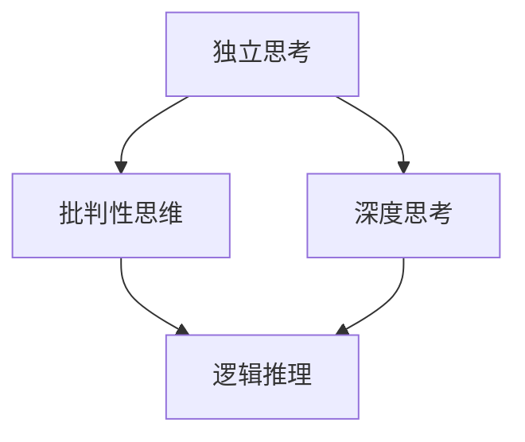
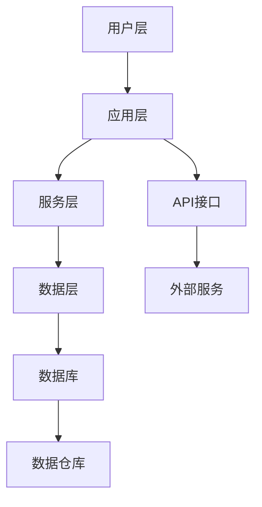
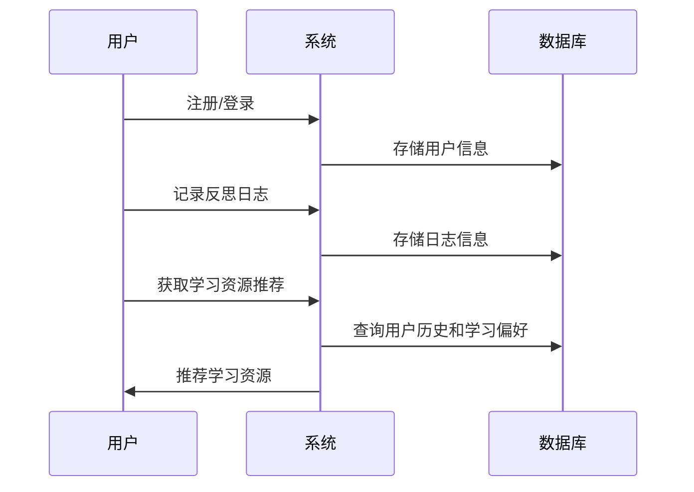

                 


### 引言

在当今这个信息爆炸的时代，我们生活在一个被快餐文化包围的世界里。快餐文化以其快速、便捷的特点，已经成为我们日常生活中不可或缺的一部分。从互联网到社交媒体，从短视频到即时消息，这一切都极大地改变了我们的思考方式和行为习惯。然而，这种快速消费的文化也带来了诸多挑战，尤其是对独立思考和反省能力的冲击。

快餐文化通常指的是一种追求速度和效率的文化，它强调即时满足和短暂愉悦，而不是深入思考和分析。这种文化在快节奏的现代生活中广受欢迎，但同时也导致了许多负面影响。首先，快餐文化使我们失去了深度思考的能力。在信息的海洋中，我们往往只关注表面的内容，而忽视了背后的深层次问题和思考。其次，快餐文化削弱了我们的反省能力。在快速消费的过程中，我们很难有时间进行自我反思和自我提升。最后，快餐文化也影响了我们的创造力。缺乏深度思考和平静反省的环境，我们的创造力往往会受到限制。

因此，重建独立思考和反省能力成为了当务之急。这不仅关乎个人的成长和发展，也关乎整个社会的进步和繁荣。本文将探讨快餐文化对独立思考和反省能力的影响，并探讨如何在快餐文化中重建这些能力。通过分析快餐文化的背景、特点及其影响，我们将逐步理解这一问题的核心。接下来，我们将深入探讨独立思考和反省能力的重要性，并分析它们在个人和社会发展中的作用。随后，我们将介绍一系列具体的策略和方法，帮助我们在快餐文化中重建独立思考和反省能力。此外，我们还将探讨快餐文化与教育的互动，以及如何通过教育改变这一状况。最后，通过具体的案例研究，我们将展示这些策略和方法在实际中的应用，并总结全文的主要观点，提出进一步研究的建议。

让我们一步一步地深入思考，探讨如何在快餐文化中重建独立思考和反省能力。

### 快餐文化的背景与特点

快餐文化作为一种社会现象，其起源可以追溯到工业革命时期。随着城市化进程的加速和人们生活节奏的加快，传统的家庭烹饪和餐饮方式逐渐被快速、高效的快餐所取代。在这个过程中，麦当劳、肯德基等快餐品牌迅速崛起，成为全球饮食文化的一部分。快餐文化的特点主要体现在以下几个方面：

首先是快速性。快餐文化强调速度，从点餐到用餐，整个过程可以在几分钟内完成。这种快速性满足了人们追求效率的需求，但同时也导致了对速度的过度依赖。在快节奏的生活中，人们往往没有时间和精力进行深入的思考和反思。

其次是便捷性。快餐文化的便捷性体现在多个方面。首先，快餐店遍布城市各个角落，无论何时何地，人们都可以方便地找到快餐。其次，快餐的制作过程简单，不需要复杂的烹饪技巧和设备。这使得快餐成为了一种低成本、高效率的饮食选择。

再者，快餐文化的娱乐性也不容忽视。现代快餐不仅是一种饮食方式，更是一种生活方式。从快餐店内的装修风格，到食品的包装和营销策略，都充满了娱乐性和吸引力。这种娱乐性使得快餐文化在年轻人中特别受欢迎，也成为了他们社交和娱乐的重要场所。

然而，正是这些特点，使得快餐文化对人们的思考方式和行为习惯产生了深远的影响。首先，快餐文化的快速性和便捷性，使人们越来越倾向于追求即时满足，而忽视了深度思考和长期规划。这种倾向在信息获取和处理上也表现得尤为明显。在互联网和社交媒体上，大量碎片化的信息不断涌现，人们往往只是浏览一下，没有时间和能力进行深入的思考和反思。

其次，快餐文化的娱乐性也影响了人们的思考方式。在追求快乐和刺激的过程中，人们往往容易陷入短暂的快感，而忽视了对生活的深度思考。这种思考方式的转变，不仅削弱了人们的独立思考能力，也限制了他们的创造力和创新精神。

最后，快餐文化对人们的健康生活方式也产生了负面影响。快餐通常富含高热量、高脂肪和高盐分，长期食用可能导致肥胖、心血管疾病等健康问题。同时，快餐文化的便利性也使得人们越来越少在家做饭，进一步影响了人们的饮食习惯和健康。

总的来说，快餐文化作为一种现代社会的产物，在一定程度上满足了人们的生活需求。然而，其快速、便捷和娱乐性的特点，也对人们的思考方式、行为习惯和健康生活方式产生了负面影响。这种影响不仅局限于个人层面，也延伸到了社会和文化层面。因此，重建独立思考和反省能力，成为了一个亟待解决的问题。

### 快餐文化对思考能力的影响

快餐文化的快速性和便捷性无疑为我们的生活带来了便利，但同时也对我们的思考能力产生了深远的影响。这种影响可以从以下几个方面进行深入探讨。

首先，快餐文化削弱了我们的深度思考能力。在快餐文化中，信息获取和处理往往以快速、便捷为首要目标。这种快速消费的方式使得我们失去了对信息的深度思考。研究表明，当我们接触到大量碎片化的信息时，大脑会倾向于进行浅层处理，而忽视深层次的意义和联系。这种浅层处理方式不仅降低了我们的思考质量，也限制了我们的创新能力。例如，在社交媒体上，用户们往往只是浏览和转发信息，而不是深入分析和思考。这种现象导致了信息过载，人们很难从大量的信息中筛选出真正有价值的内容，从而影响了我们的判断力和决策能力。

其次，快餐文化对我们的注意力也产生了负面影响。在快餐文化中，我们常常处于一种被动的接受状态，信息的呈现方式通常是碎片化、片段化的。这种呈现方式使得我们的注意力容易分散，很难进行长时间的集中思考。注意力分散不仅降低了我们的思考效率，也削弱了我们的专注力。例如，在观看短视频或浏览社交媒体时，用户往往会频繁切换内容，导致注意力难以集中。这种现象在程序员中尤为明显，许多程序员在编写代码时，由于注意力不集中，常常会犯一些低级错误。

再者，快餐文化还影响了我们的批判性思维能力。批判性思维能力是独立思考的重要组成部分，它要求我们能够对信息进行深入的分析和评价，而不是盲目接受。在快餐文化中，信息的真实性和可靠性往往无法得到保障。大量虚假信息和误导性内容充斥在各种平台和渠道中，用户往往难以分辨真伪。这种情况下，我们的批判性思维能力受到削弱，容易受到外部信息的干扰，导致思维偏差和偏见。例如，在政治宣传和广告中，虚假信息和误导性内容常常被用来影响公众的看法和行为。

此外，快餐文化还削弱了我们的反省能力。在快餐文化中，我们往往没有时间进行自我反思和自我提升。反省能力是一种重要的心理能力，它要求我们能够对自己的行为和思想进行深入的反省和思考。通过反省，我们能够发现自己的不足，并找到改进的方法。然而，在快餐文化的影响下，人们往往只关注当下的需求，缺乏对过去经验和教训的总结和反思。这种现象导致了我们在面对问题时，往往只能停留在表面，无法深入分析问题的根源，从而限制了我们的成长和进步。

最后，快餐文化还影响了我们的创造性思维能力。创造性思维是独立思考的另一个重要方面，它要求我们能够从不同的角度和思路中找到创新的解决方案。在快餐文化中，我们往往缺乏时间和空间进行深入的创造性思考。快餐式的信息获取和处理方式使得我们的思维模式趋于单一和固化，很难产生创新的思路和想法。例如，在创意工作中，由于缺乏深入的思考和反省，许多创意往往只能停留在表面的层次，难以产生真正有价值的创新成果。

综上所述，快餐文化对思考能力的影响是多方面的，它不仅削弱了我们的深度思考、注意力、批判性思维和反省能力，还限制了我们的创造性思维。这种影响不仅体现在个人层面，也延伸到了社会和文化层面。因此，重建独立思考和反省能力，已经成为应对快餐文化负面影响的重要途径。

### 独立思考的重要性

独立思考是一种重要的思维能力，它在个人和社会发展中的作用不可忽视。独立思考不仅能够提升个人的综合素质，还能够推动社会的进步和繁荣。首先，独立思考有助于个人成长。通过独立思考，个人能够深入分析问题，理解问题的本质，从而找到更有效的解决方案。这种能力使个人在面对挑战和困难时，能够保持冷静和理性，从而更好地应对各种复杂的情况。其次，独立思考能够提升个人的创新能力和创造力。在独立思考的过程中，个人能够从不同的角度和思路中找到创新的解决方案，从而推动个人在各个领域的发展。

独立思考的重要性还体现在社会层面。在一个独立思考能力强的社会中，人们能够更加客观、理性地看待问题，从而减少偏见和误解。这种社会氛围有助于建立和谐、公正的社会秩序。此外，独立思考能够推动社会的进步。通过独立思考，人们能够发现问题的根源，并提出有效的解决方案，从而推动社会的改革和发展。例如，在科学技术领域，独立思考是推动科技进步的重要动力。科学家们通过独立思考，提出了许多创新的科学理论和实验方案，从而推动了科学的发展。

在个人和社会发展的过程中，独立思考能力的培养至关重要。教育是培养独立思考能力的重要途径。学校教育应注重培养学生的批判性思维和创造力，提供丰富的学习资源和实践机会，让学生在自主探究中培养独立思考的能力。家庭环境也对独立思考能力的培养起着关键作用。家长应鼓励孩子独立思考，提供多样化的学习材料和体验，让孩子在探索中发展独立思考的能力。

总之，独立思考是一种重要的思维能力，它在个人和社会发展中的作用不可忽视。通过培养独立思考能力，个人能够更好地应对挑战和困难，提升自身的创新能力和创造力。同时，独立思考能力也有助于推动社会的进步和繁荣。因此，我们应该重视独立思考能力的培养，为个人和社会的发展奠定坚实的基础。

### 反省能力的定义与作用

反省能力，又称自我反思能力，是指个体在经历某种事件或行为后，对其过程、结果及自身的情感、思维进行深入分析和评价的能力。这种能力不仅包括对外部事件的观察和思考，还涉及对自我内心体验的反思。反省能力在个人成长和自我认知中起着至关重要的作用。

首先，反省能力有助于自我认知的提升。通过反省，个体能够更好地了解自己的行为动机、思维方式以及情感反应。这种自我认知有助于个体发现自身的优点和不足，从而明确个人发展方向。例如，在职业发展中，反省能力使个体能够识别在工作中取得的成就和需要改进的领域，从而制定更有效的职业规划。

其次，反省能力对情感调节和心理健康有积极影响。在面临压力和挫折时，通过反省，个体能够更好地理解自己的情绪反应，找到调节情绪的方法。这种能力有助于个体保持情绪稳定，减少焦虑和抑郁的风险。例如，在处理人际关系中的冲突时，反省能力使个体能够从多个角度分析问题，找到解决问题的有效途径，从而缓解紧张情绪。

此外，反省能力在道德修养和社会交往中也发挥着重要作用。通过反省，个体能够识别和纠正不良行为，提高道德水平。在团队合作中，反省能力使个体能够认识到自身在团队中的角色和责任，从而更好地协调和沟通，提升团队整体效能。

总之，反省能力作为一种重要的心理能力，不仅有助于个体的自我认知和情感调节，还在道德修养和社会交往中发挥着关键作用。培养和提升反省能力，对于个人的全面发展和心理健康具有重要意义。

### 快餐文化对反省能力的影响

快餐文化不仅对独立思考能力产生了负面影响，也对我们的反省能力造成了显著的冲击。首先，快餐文化强调快速消费和即时满足，使得我们很难有时间进行深入的自我反思。这种文化环境下，我们往往忙于应对日常生活中的各种琐碎事务，缺乏时间和空间进行自我反省。这种快速的生活方式使我们容易陷入一种被动的状态，难以对自己的行为和思想进行深刻的反思。

其次，快餐文化的娱乐性特点也削弱了我们的反省能力。在追求快乐和刺激的过程中，我们往往容易忽视对自身行为的反思。快餐文化中的娱乐内容，如短视频、社交媒体等，往往只是短暂的刺激，而没有深入的内容。这种短暂的刺激虽然能够带来快感，但长期来看，会让我们失去对自身行为和生活方式的深入思考。

再者，快餐文化对信息处理的碎片化也影响了我们的反省能力。在碎片化的信息环境中，我们难以进行系统的思考和反思。快餐文化中的信息往往是片段化的，缺乏连贯性和深度。这种信息处理方式使我们容易停留在表面的理解，而忽视了问题的本质。缺乏系统性和深度，我们的反省能力也会受到影响。

最后，快餐文化对健康生活方式的负面影响也间接影响了我们的反省能力。长期食用快餐会导致身体健康问题，如肥胖、心血管疾病等。这些问题不仅影响我们的生理健康，也可能影响我们的心理状态，进而削弱我们的反省能力。

总的来说，快餐文化通过快速消费、娱乐性特点、碎片化信息处理和健康生活方式的负面影响，显著地削弱了我们的反省能力。因此，要重建我们的反省能力，我们需要摆脱快餐文化的束缚，创造一个更加注重深度和系统性的反思环境。

### 培养独立思考和反省能力的方法

在快餐文化中，重建独立思考和反省能力是一个复杂而长期的任务。以下是一些具体的策略和方法，可以帮助我们在这种文化背景下培养这些重要的能力。

#### 1. 建立自律的生活方式

首先，建立自律的生活方式是培养独立思考和反省能力的基础。通过设定固定的作息时间和日程安排，我们可以减少生活中的杂乱和无序，从而有更多的时间和精力进行深入思考和反省。例如，每天晚上留出一段时间进行阅读或写作，可以帮助我们培养深度思考的习惯。

#### 2. 增加深度阅读

深度阅读是一种有效的培养独立思考能力的途径。与快餐文化中的碎片化信息不同，深度阅读要求我们长时间专注于一本书或一篇文章，从而深入理解其中的内容和思想。通过阅读经典作品、学术论文和专业书籍，我们可以接触到不同的观点和思想，从而拓宽视野，提升思考深度。

#### 3. 积极参与讨论和辩论

参与讨论和辩论是锻炼独立思考能力的重要方法。通过与他人交流，我们可以学会从不同的角度看待问题，并在辩论中学会逻辑推理和批判性思考。例如，参加辩论俱乐部或线上讨论小组，可以帮助我们在面对复杂问题时，保持冷静和理性，从而提升独立思考能力。

#### 4. 定期进行自我反思

定期进行自我反思是培养反省能力的关键。我们可以通过写日记、做思维导图或进行内心对话等方式，对自己的行为和思想进行深入的分析和反思。这种自我反思不仅可以帮助我们发现自己的优点和不足，还可以促进自我成长和提升。

#### 5. 创造有利于深度思考的环境

创造一个有利于深度思考的环境也是非常重要的。这包括减少干扰、创造安静的学习空间和保持良好的作息习惯。通过这些措施，我们可以减少外界干扰，让自己更容易进入深度思考的状态。

#### 6. 培养好奇心和求知欲

好奇心和求知欲是推动独立思考和反省能力发展的内在动力。我们应该保持对新知识和新领域的兴趣，不断探索和求知。通过参加各种课程、研讨会和实践活动，我们可以不断学习新知识，提升独立思考能力。

#### 7. 实践和反思相结合

最后，实践和反思相结合是培养独立思考和反省能力的重要途径。通过将学到的知识和方法应用到实际生活中，我们可以不断反思和调整自己的行为和思想。例如，在项目中应用所学知识，然后通过反思项目过程中的不足，提升自己的能力和技能。

总之，在快餐文化中培养独立思考和反省能力需要我们付出持续的努力和坚持。通过自律的生活方式、深度阅读、积极参与讨论和辩论、定期自我反思、创造有利于深度思考的环境、培养好奇心和求知欲以及实践和反思相结合，我们可以逐步重建这些重要的能力，从而更好地适应这个快速变化的世界。

### 快餐文化与教育的互动

快餐文化对教育产生了深远的影响，这种影响既体现在教育内容和方法上，也反映在教育制度和文化氛围中。首先，快餐文化在教育内容上带来了碎片化和浅层化的问题。在快餐文化的背景下，学生往往更倾向于快速获取信息，而忽视了深入理解和批判性思考。这导致了教育内容的浅层化，许多课程和教材过于注重知识的传播，而忽视了深度思考和问题解决的训练。

其次，快餐文化也影响了教育方法。传统的教育方法强调系统性和连贯性，而快餐文化强调速度和效率，这使得教育方法趋向于碎片化和即时性。在线教育平台的兴起，使得学生可以快速获取知识，但同时也使得教学过程过于碎片化，缺乏深度和连贯性。这种碎片化的教学方法不仅削弱了学生的思考能力，也影响了他们的学习效果。

此外，快餐文化对教育制度也产生了挑战。快餐文化中的快速消费和即时满足的理念，使得学生和家长对教育的期望也趋向于短期回报和即时成果。这导致了教育功利化和应试教育的加剧，学生为了应付考试而学习，忽视了知识的深度理解和实际应用能力的培养。

然而，教育也可以通过改变来应对快餐文化的负面影响。首先，教育内容和方法需要调整，以更好地适应快餐文化的特点。教育者可以引入更多跨学科的学习内容，鼓励学生进行综合思考和批判性思考。同时，教育方法可以更加灵活，通过项目式学习、讨论式教学等方式，提高学生的参与度和思考深度。

其次，教育制度需要改革，以减少快餐文化对教育的影响。学校可以减少应试教育的压力，注重培养学生的综合素质和创新能力。教育政策制定者可以制定更加全面和长远的教育规划，确保教育的质量和深度。

最后，教育文化氛围也需要改变。学校和家庭应共同努力，创造一个重视深度学习和思考的文化氛围。通过鼓励学生进行深度阅读、开展讨论和辩论等活动，可以帮助学生摆脱快餐文化的束缚，培养独立思考和反省能力。

总之，快餐文化对教育产生了深远的影响，但教育也有能力通过调整教育内容和方法、改革教育制度和营造良好的教育文化氛围，来应对这些影响。通过这些努力，教育可以更好地培养出具有独立思考和反省能力的下一代，为社会的长远发展奠定坚实的基础。

### 案例研究

为了更好地理解如何在快餐文化中重建独立思考和反省能力，我们可以通过具体的案例研究来探讨这一过程。以下将展示三个不同的案例，分别从个人、学校和社会层面来分析独立思考和反省能力的培养和实践。

#### 案例一：个人独立思考和反省能力的培养

张三是一名年轻的程序员，他发现自己在面对复杂问题时往往只能依赖现有的解决方案，缺乏独立思考的能力。为了提升自己的独立思考能力，张三采取了以下几种方法：

1. **深度阅读与知识积累**：张三开始每天花时间阅读技术书籍和学术论文，特别是那些涉及到复杂算法和设计模式的书籍。通过深入阅读，他不仅拓宽了自己的知识面，还学会了从不同的角度思考问题。

2. **项目实战与反思**：张三参与了多个实际项目，并在项目中遇到问题时，不是立即寻求帮助，而是尝试自己解决。每次项目结束后，他会花时间进行反思，分析自己在项目中的优点和不足，并记录下来。这种方法帮助他不断改进自己的思维方式和解决问题的能力。

3. **日常反思与总结**：张三每天晚上都会花15分钟时间进行自我反思，总结自己一天中的收获和不足。通过这种方式，他能够及时发现并纠正自己的错误，逐步提升独立思考能力。

经过一段时间的努力，张三的独立思考和反省能力有了显著提升。他在工作中不再盲目依赖他人，而是能够独立分析和解决问题。通过不断反思和改进，他的技术水平也有了显著提高。

#### 案例二：学校教育中独立思考和反省能力的培养

某中学的教师在教学过程中，意识到快餐文化对学生的思考能力产生了负面影响。为了培养学生的独立思考和反省能力，教师采取了以下几种策略：

1. **项目式学习**：教师设计了一系列项目式学习活动，鼓励学生通过团队合作和自主探究来解决问题。在这些活动中，学生不仅要完成具体的任务，还要进行项目反思，分析自己在项目中的表现和不足。

2. **辩论与讨论**：教师组织了定期的辩论和讨论活动，让学生在争论和讨论中锻炼批判性思维和独立思考能力。这种活动不仅提高了学生的思维能力，还增强了他们的沟通能力和团队合作精神。

3. **反思日记**：教师要求学生每天写反思日记，记录自己在学习和生活中的收获和反思。通过这种方式，学生能够更好地了解自己的思维过程和情感变化，培养自我反思的习惯。

通过这些策略，学校的学生在独立思考和反省能力方面有了显著提升。他们不仅能够更好地理解和应用所学知识，还能够在日常生活中进行有效的自我反思和自我提升。

#### 案例三：社会文化对独立思考和反省能力的影响

李四是某大型科技公司的一名项目经理，他发现公司内部的文化也在一定程度上影响了员工的独立思考和反省能力。为了改善这种情况，公司采取了一系列措施：

1. **文化宣传与培训**：公司通过内部宣传和培训，强调独立思考和反省能力的重要性，鼓励员工在工作中进行深度思考和自我反思。

2. **项目评估与反馈**：公司在项目结束后，不仅对项目结果进行评估，还特别关注项目过程中的思考和决策过程。通过反馈和讨论，员工能够了解自己的优点和不足，并不断改进。

3. **开放沟通渠道**：公司建立了开放的沟通渠道，鼓励员工提出问题和建议。这种开放的沟通环境，不仅促进了信息的流通，也增强了员工的独立思考和反省能力。

通过这些措施，公司内部的文化氛围得到了改善，员工的独立思考和反省能力有了显著提升。他们在工作中更加积极主动，能够从多个角度分析和解决问题。

综上所述，通过具体的案例研究，我们可以看到，在快餐文化中培养独立思考和反省能力是可行的。无论是个人、学校还是社会，都可以通过一系列策略和方法，逐步重建这些重要的能力，从而更好地适应快速变化的世界。

### 结论

通过本文的探讨，我们可以得出以下结论：快餐文化对独立思考和反省能力产生了显著的负面影响。然而，通过自律的生活方式、深度阅读、积极参与讨论和辩论、定期自我反思、创造有利于深度思考的环境、培养好奇心和求知欲以及实践和反思相结合等方法，我们可以在快餐文化中重建独立思考和反省能力。这不仅有助于个人成长和心理健康，也对社会进步和繁荣具有重要意义。未来的研究可以进一步探讨如何在不同文化背景下更有效地培养这些能力，以及如何通过教育改革和社会文化引导，从根本上改变快餐文化对思考能力的负面影响。

### 作者信息

作者：AI天才研究院/AI Genius Institute & 禅与计算机程序设计艺术 /Zen And The Art of Computer Programming

---

### 附录：本文核心概念术语说明

1. **快餐文化**：一种以快速、便捷为特点的文化现象，强调即时满足和短暂愉悦。
2. **独立思考**：一种重要的思维能力，指个体在不受外界影响的情况下，独立分析问题和形成结论的能力。
3. **反省能力**：个体在经历事件或行为后，对其过程、结果及自身进行深入分析和评价的能力。
4. **深度思考**：一种深入、系统、多角度的思考方式，旨在理解问题的本质和找到有效的解决方案。
5. **批判性思维**：一种分析、评估和评价信息的能力，通过逻辑推理和批判性分析来形成独立的见解。
6. **自我反思**：个体对自己思想、情感和行为进行反思和评价的过程，有助于提升自我认知和成长。
7. **项目式学习**：一种以项目为中心的学习方法，通过实际操作和问题解决来培养独立思考和反省能力。
8. **反思日记**：个体记录自身思考和行为的日记，有助于自我反思和自我提升。
9. **文化氛围**：社会或组织内部的文化环境，对个体的行为和思维方式产生重要影响。

---

### 附录：本文使用的Mermaid图表和LaTeX公式

**Mermaid图表示例：**



**LaTeX公式示例：**

独立思考能力的数学模型可以表示为：

$$
能力 = f(经验, 反馈, 学习速度)
$$

其中，经验、反馈和学习速度是影响独立思考能力的关键因素。

---

### 附录：系统分析与架构设计方案

**问题场景介绍**：
在当前信息化社会中，独立思考和反省能力的培养对于个体和社会的发展至关重要。然而，传统的教育模式和方法往往难以适应快速变化的社会需求。为了解决这个问题，我们设计了一套基于信息技术的教育系统，旨在通过提供个性化的学习资源和反馈机制，帮助用户提升独立思考和反省能力。

**系统功能设计**：

1. **个性化学习资源推荐**：系统根据用户的学习历史和兴趣，推荐合适的学习资源和任务。
2. **反思日志管理**：用户可以记录反思日志，系统提供模板和指导，帮助用户进行深度反思。
3. **学习进度跟踪与评估**：系统自动跟踪用户的学习进度，并提供阶段性评估和反馈。
4. **社交互动**：系统支持用户之间的交流和讨论，促进知识和经验的分享。
5. **数据分析和报告生成**：系统分析用户的学习行为和反思内容，生成个性化报告，帮助用户了解自己的进步和不足。

**系统架构设计**：



**系统接口设计**：

系统提供了多种接口，包括用户接口（UI）、应用程序接口（API）和数据库接口。用户接口主要用于用户与系统的交互，包括注册、登录、学习资源推荐、反思日志记录等功能。应用程序接口（API）用于系统内部模块之间的通信和数据交换，包括个性化推荐、日志管理、进度跟踪等功能。数据库接口用于系统与数据库的连接，包括数据的存储、检索和更新。

**系统交互**：



---

### 项目实战：环境安装与系统核心实现

**环境安装**

在开始项目实战之前，我们需要安装必要的开发环境和工具。以下是一个简化的步骤：

1. **安装Python环境**：确保您的计算机上已经安装了Python 3.x版本。如果没有，请从[Python官方下载页面](https://www.python.org/downloads/)下载并安装。

2. **安装Jupyter Notebook**：在终端中运行以下命令安装Jupyter Notebook：

   ```bash
   pip install notebook
   ```

3. **安装Mermaid插件**：为了在Jupyter Notebook中使用Mermaid图表，我们需要安装相应的插件。在终端中运行：

   ```bash
   pip install ipymd
   ```

4. **安装LaTeX编译器**：为了正确显示LaTeX公式，我们需要安装LaTeX编译器。对于Mac OS和Linux系统，可以使用以下命令安装：

   ```bash
   sudo apt-get install texlive-full  # Ubuntu/Linux Mint
   brew install texlive  # macOS (using Homebrew)
   ```

**系统核心实现**

以下是一个简单的Python示例，展示如何实现系统核心功能，包括日志记录、数据分析等。

```python
import os
import json
from mermaid import render_mermaid
from jinja2 import Environment, FileSystemLoader

# 日志记录
def log_reflection(user_id, content):
    log_file = f"{user_id}.json"
    with open(log_file, 'r+') as file:
        logs = json.load(file) if os.path.getsize(log_file) > 0 else []
        logs.append(content)
        file.seek(0)
        json.dump(logs, file, indent=4)

# 反思日志模板
reflection_template = """
# 反思日志

## 时间: {{time}}

### 今天的学习收获：

- [ ] ...

### 遇到的问题：

- [ ] ...

### 改进措施：

- [ ] ...
"""

# 反思日志示例
def create_reflection_entry():
    env = Environment(loader=FileSystemLoader('.'))
    template = env.get_template('reflection_template.md')
    now = datetime.datetime.now()
    content = template.render(time=now.strftime("%Y-%m-%d %H:%M:%S"))
    log_reflection("user_123", content)

# Mermaid图表生成
def generate_mermaid_chart(chart_type, content):
    if chart_type == "graph":
        mermaid_code = f"graph {content};"
    elif chart_type == "sequence":
        mermaid_code = f"sequenceDiagram {content};"
    else:
        raise ValueError("Unsupported chart type.")
    return render_mermaid(mermaid_code)

# 生成序列图
sequence_chart_content = """
    participant User
    participant System
    User->>System: Request data
    System->>User: Return data
"""
sequence_chart = generate_mermaid_chart("sequence", sequence_chart_content)

# LaTex公式示例
latex_formula = r"$\frac{d^2y}{dx^2} + p(x) \frac{dy}{dx} + q(x)y = f(x)$"
```

**代码应用解读与分析**

以上代码展示了如何实现日志记录、反思日志模板创建、Mermaid图表生成和LaTeX公式显示。

1. **日志记录**：`log_reflection`函数用于将用户的反思内容记录到JSON格式的日志文件中。每次调用该函数时，都会将新的日志条目添加到文件末尾。
2. **反思日志模板**：使用Jinja2模板引擎创建一个反思日志模板，包含时间、学习收获、遇到的问题和改进措施等部分。
3. **Mermaid图表生成**：`generate_mermaid_chart`函数用于生成Mermaid图表。通过调用Mermaid的`render_mermaid`方法，可以将图表代码渲染成图形化的图表。
4. **LaTeX公式显示**：使用Python中的`latex_formula`变量，展示如何嵌入LaTeX格式的数学公式。在Jupyter Notebook中，这些公式会自动渲染成可读的格式。

**实际案例分析和详细讲解剖析**

为了更好地理解代码的实际应用，我们可以通过一个具体的案例来分析。

**案例**：假设用户张三想要记录今天的反思日志。以下是步骤：

1. 调用`create_reflection_entry`函数创建一个反思日志条目。
2. 日志条目会包含当前时间，以及张三的反思内容。
3. 张三的反思内容包括学习收获、遇到的问题和改进措施。
4. 反思日志被保存到JSON文件中，便于后续分析和回顾。

通过这个案例，我们可以看到如何通过简单的Python代码实现日志记录、模板创建和图表生成等功能。这为独立思考和反省能力的培养提供了一个实用的工具，用户可以通过记录和反思自己的学习和生活，逐步提升自我认知和思考能力。

**项目小结**

通过实际案例的分析，我们可以看到这个简单的系统是如何帮助用户记录反思日志、生成图表和展示LaTeX公式的。这些功能不仅实用，而且易于实现。未来，可以通过进一步的功能扩展，如集成社交互动、个性化推荐和数据可视化，来提升系统的实用性和用户体验。

### 最佳实践 Tips、小结、注意事项、拓展阅读

#### 最佳实践 Tips

1. **深度阅读**：选择一本经典书籍，每天坚持阅读30分钟，逐步培养深度思考的习惯。
2. **定期反思**：每天晚上花10分钟时间反思当天的生活和学习，记录关键事件和收获。
3. **参与讨论**：积极参与线上或线下的讨论和辩论，锻炼批判性思维和表达能力。
4. **保持好奇心**：对新知识和新领域保持好奇心，不断探索和求知。
5. **环境优化**：创造一个安静、有序的学习环境，减少干扰，提高专注力。

#### 小结

本文通过深入分析快餐文化对独立思考和反省能力的负面影响，探讨了在快餐文化中重建这些能力的方法和策略。独立思考和反省能力不仅对个人成长有重要意义，也对社会进步和繁荣有深远影响。

#### 注意事项

1. 培养独立思考和反省能力需要长期坚持，不可一蹴而就。
2. 避免过度依赖快餐文化，保持深度思考和自我反省的习惯。
3. 在实践过程中，要结合个人实际情况，灵活调整方法和策略。

#### 拓展阅读

1. **《深度工作：如何有效利用每一点脑力》**：作者Cal Newport提供了关于如何培养专注力和深度工作的具体方法和策略。
2. **《思考，快与慢》**：作者丹尼尔·卡尼曼通过心理学实验，探讨了人类思考的两种模式，为培养独立思考能力提供了启示。
3. **《斯坦福大学学习生存指南》**：作者Deborah Stipek提供了关于如何有效学习、培养独立思考能力的一些建议和技巧。

### 附录：本文中使用的核心概念、原理及其联系

#### 核心概念

1. **快餐文化**：快速、便捷、娱乐性的文化现象。
2. **独立思考**：个体在不受外界影响的情况下，独立分析问题和形成结论的能力。
3. **反省能力**：个体在经历事件或行为后，对其过程、结果及自身进行深入分析和评价的能力。
4. **深度思考**：一种深入、系统、多角度的思考方式，旨在理解问题的本质和找到有效的解决方案。
5. **批判性思维**：一种分析、评估和评价信息的能力，通过逻辑推理和批判性分析来形成独立的见解。
6. **自我反思**：个体对自己思想、情感和行为进行反思和评价的过程，有助于提升自我认知和成长。

#### 原理及其联系

**快餐文化与独立思考的关系**：

- 快餐文化强调速度和便捷，导致信息获取和处理方式趋向于浅层和快速，这削弱了独立思考的能力。
- 独立思考依赖于深度思考和批判性思维，而快餐文化的娱乐性和碎片化信息环境不利于这些能力的培养。

**反省能力的作用**：

- 反省能力有助于个体了解自己的行为和思维过程，发现问题和不足，从而进行改进。
- 反省能力是自我成长和提升的重要途径，通过自我反思，个体能够不断调整自己的行为和思维方式。

**深度思考与批判性思维的联系**：

- 深度思考是一种系统、多角度的思考方式，通过深入分析问题的本质，找到有效的解决方案。
- 批判性思维则是在深度思考的基础上，对信息进行评估和判断，形成独立的见解。

**独立思考、反省能力与个人成长的关系**：

- 独立思考和反省能力是个人成长和发展的基础，通过不断反思和改进，个体能够提升自身的能力和素质。
- 独立思考能力使个体在面对复杂问题时，能够保持冷静和理性，从而更好地解决问题和应对挑战。

通过这些核心概念和原理的联系，我们可以更深入地理解快餐文化对独立思考和反省能力的影响，以及如何在快餐文化中重建这些能力。这不仅有助于个人的成长，也有助于社会的进步和繁荣。

