                 


### 1.1.1 快餐文化的兴起

快餐文化起源于20世纪中叶的美国，随着工业化和城市化进程的加速，人们的生活节奏不断加快，对于便利、高效的餐饮需求日益增加。在这种背景下，麦当劳、肯德基等快餐品牌应运而生，以其标准化、快速的服务和较低的价格迅速占领市场。这种以效率和便利为核心的文化迅速传播，成为全球餐饮业的主流。

在我国，快餐文化的兴起始于20世纪80年代改革开放之后。随着经济的快速发展和城市人口的急剧增加，人们对于方便快捷的餐饮服务需求大大增加。麦当劳、肯德基等外资快餐品牌率先进入中国市场，随后国内也开始涌现出诸如真功夫、海底捞等快餐品牌。这些品牌不仅提供了丰富的快餐选择，还逐渐形成了独特的品牌文化和消费者群体。

快餐文化的兴起带来了诸多影响。一方面，它极大地丰富了人们的餐饮选择，提高了生活便利性。另一方面，它也带来了一些负面影响，如营养不均衡、健康问题、文化同质化等。这些问题的出现，使得重建独立思考和批判能力成为一个重要课题。

### 1.1.2 快餐文化对独立思考和批判能力的影响

快餐文化对独立思考和批判能力的影响主要体现在以下几个方面：

1. **信息过载与思考浅显化**：快餐文化强调快速消费，导致人们对于信息的接收和处理也趋向于快速和表面化。大量碎片化、简洁化的信息充斥着人们的视野，使得独立思考和批判能力的培养受到阻碍。

2. **思维定势与固化**：快餐文化的标准化、规范化特点容易导致人们思维方式的固化。在面对问题时，人们往往倾向于依赖已有的经验和模式，缺乏创新和批判精神。

3. **价值观的偏差**：快餐文化注重效率和便利，可能使得人们在价值观念上出现偏差。例如，过分追求短期利益，忽视长远发展；过分追求物质满足，忽视精神追求等。

4. **社交压力的增加**：快餐文化的快速发展，使得人们在社交场合中面临更大的压力。为了跟上节奏，人们可能不得不牺牲独立思考和批判能力，以适应环境。

5. **情感表达的缺失**：快餐文化的快速消费特性，使得人们在交流中往往只关注表面的互动，缺乏深入的思考和情感交流。这种情况下，独立思考和批判能力的培养也受到限制。

### 1.1.3 重建独立思考和批判能力的必要性

在快餐文化的影响下，独立思考和批判能力的削弱已经成为一个不容忽视的问题。重建独立思考和批判能力的重要性主要体现在以下几个方面：

1. **提升个人素养**：独立思考和批判能力是个人素养的重要组成部分。通过重建这些能力，可以提高个人的思维深度和广度，增强自我认知和自我提升的能力。

2. **促进创新与发展**：独立思考和批判能力是创新的重要驱动力。在现代社会，创新已经成为推动社会进步和经济发展的关键因素。重建这些能力，有助于激发个人的创新潜力，促进社会的发展。

3. **培养批判性思维**：批判性思维是独立思考和批判能力的重要组成部分。通过重建这些能力，可以培养人们的批判性思维，提高对社会现象和问题的认识和理解。

4. **抵御文化同质化**：快餐文化的全球化趋势，使得各国文化在一定程度上出现了同质化现象。重建独立思考和批判能力，有助于保护和传承各国的文化特色，抵制文化同质化。

5. **增强社会和谐**：独立思考和批判能力的提升，有助于人们在面对社会问题和挑战时，能够理性分析和解决问题，促进社会的和谐发展。

综上所述，重建独立思考和批判能力在快餐文化时代具有重要的现实意义。通过教育、媒体素养培养、个人成长路径优化和社会环境优化等多种途径，我们可以逐步实现这一目标，为个人的成长和社会的发展做出贡献。

### 1.2 核心概念

在探讨如何重建独立思考和批判能力之前，我们首先需要明确相关核心概念的定义与特征，以便更好地理解其内涵与外延。

#### 1.2.1 独立思考的定义与特征

独立思考，是指个体在解决问题或面对信息时，不受外界影响，能够自主分析、判断和形成自己的见解。其特征主要包括：

1. **自主性**：独立思考强调个体的自主性，即个体在思考过程中不受他人意见的左右，能够独立形成观点。

2. **批判性**：独立思考不仅要求个体能够独立分析问题，还要求个体具备批判性思维，能够对信息进行筛选、判断和评估。

3. **创造性**：独立思考往往伴随着创新，个体在独立思考过程中，能够发现新的思路和方法，提出独特的见解。

4. **深度性**：独立思考要求个体在思考问题时能够深入分析，挖掘问题的本质，形成深刻的见解。

#### 1.2.2 批判能力的定义与特征

批判能力，是指个体在接收信息、解决问题时，能够从多个角度进行思考，对信息进行质疑、分析和评价。其特征主要包括：

1. **质疑性**：批判能力要求个体在面对信息时，能够提出质疑，不盲目接受。

2. **分析性**：批判能力强调个体需要对信息进行深入分析，挖掘信息的本质和内在逻辑。

3. **评价性**：批判能力不仅要求个体能够分析信息，还需要对信息进行评价，判断其价值和意义。

4. **多样性**：批判能力要求个体能够从多个角度进行思考，形成多元化的观点。

#### 1.2.3 独立思考和批判能力的联系与区别

独立思考和批判能力是相互联系、相互促进的。具体来说：

1. **相互促进**：独立思考为批判能力提供了基础，批判能力则为独立思考提供了方法和工具。个体在独立思考过程中，需要批判性思维来分析问题，形成见解；而在批判性思维过程中，个体也需要独立思考来形成自己的观点。

2. **区别**：尽管独立思考和批判能力密切相关，但二者在内涵上有所不同。独立思考更侧重于个体的自主性和创造性，强调个体能够独立形成见解；而批判能力更侧重于对信息的分析和评价，强调个体能够从多个角度进行思考。

总之，独立思考和批判能力是重建独立思考和批判能力的重要基础。通过深入理解这些核心概念，我们可以更好地把握其内涵，为后续的探讨提供理论基础。

#### 1.2.1 独立思考的边界

独立思考虽然强调个体在思考过程中的自主性和创造性，但并不意味着完全孤立、无限制的思考。独立思考的边界主要体现在以下几个方面：

1. **知识边界**：独立思考依赖于个体的知识储备和认知水平。当个体的知识积累达到一定阶段时，独立思考的能力也会相应提升。然而，当个体的知识储备不足时，独立思考可能会受限，难以形成深刻的见解。

2. **经验边界**：独立思考不仅依赖于知识，还依赖于个体的经验积累。个体在实践中的经验积累，可以帮助他们在思考问题时更加全面和深入。然而，如果个体的经验有限，独立思考可能会受到限制。

3. **价值观边界**：独立思考的过程受到个体价值观的引导。不同的价值观会导致个体在思考问题时产生不同的方向和结果。因此，独立思考需要在一定的价值观框架内进行，以避免思考的偏差。

4. **时间边界**：独立思考是一个持续的过程，需要一定的时间积累。短时间内，个体可能难以形成深入的见解。因此，独立思考需要在时间上给予足够的支持和保障。

5. **社会边界**：独立思考虽然强调个体自主性，但也不完全脱离社会环境。个体的思考过程会受到社会环境的影响，如文化、传统、教育等。因此，独立思考需要在尊重社会环境和规则的基础上进行。

#### 1.2.2 批判能力的外延

批判能力作为一种思维技能，其外延非常广泛，涵盖了多个方面。具体来说，批判能力的外延主要包括以下几个方面：

1. **信息分析**：批判能力首先体现在对信息进行深入分析的能力上。个体需要能够识别信息的真实性、可靠性，并从中提取有价值的信息。

2. **逻辑推理**：批判能力要求个体具备良好的逻辑推理能力，能够通过逻辑推理发现信息之间的内在联系和矛盾，从而形成合理的结论。

3. **价值评价**：批判能力还体现在对信息进行价值评价的能力上。个体需要能够判断信息的价值和意义，从而做出合理的决策。

4. **情感分析**：批判能力不仅要求个体在理性层面上进行分析，还需要在情感层面上进行分析。个体需要能够识别和评价信息所传达的情感和态度，从而更全面地理解信息。

5. **综合运用**：批判能力不仅仅是一种单一的能力，它需要个体能够综合运用多种思维技能，如分析、推理、评价等，对问题进行全面的思考和解决。

6. **跨学科应用**：批判能力不仅在学术研究中具有重要地位，在日常生活、工作和社会中也有广泛的应用。个体需要能够在不同领域和场景中灵活运用批判能力，解决复杂的问题。

#### 1.2.3 独立思考与批判能力的实际应用

独立思考与批判能力在实际应用中具有广泛的影响和重要的价值。以下是一些具体的实际应用场景：

1. **学术研究**：在学术研究中，独立思考和批判能力是必不可少的。研究者需要通过独立思考提出新的研究问题，并通过批判性思维对现有理论和数据进行评价和质疑，从而推动学术研究的进步。

2. **技术创新**：在技术创新领域，独立思考和批判能力同样重要。创新者需要独立思考来发现新的技术方向和解决方案，并通过批判性思维评估这些方案的有效性和可行性。

3. **企业管理**：在企业管理中，独立思考和批判能力有助于领导者做出明智的决策。领导者需要独立思考来分析市场变化和竞争态势，并通过批判性思维评估各种管理策略的优缺点。

4. **法律审判**：在法律审判中，独立思考和批判能力是法官和律师的重要素养。他们需要独立思考来理解法律条文和案例，并通过批判性思维评估证据的真实性和合法性。

5. **日常生活**：在日常生活中，独立思考和批判能力有助于个体做出明智的生活决策。个体需要独立思考来评估各种信息和选择，并通过批判性思维避免盲目跟风和做出错误决策。

6. **社会参与**：在社会参与中，独立思考和批判能力有助于个体更全面地理解社会问题和现象，并提出建设性的意见和解决方案。

总之，独立思考与批判能力在实际应用中具有广泛的影响和重要的价值。通过培养和提升这些能力，个体可以在学术研究、技术创新、企业管理、法律审判、日常生活和社会参与等多个领域取得更好的成果。

#### 1.4.1 独立思考的核心要素

独立思考作为一种高级认知能力，其核心要素主要包括以下几个方面：

1. **知识储备**：独立思考依赖于个体的知识储备。丰富的知识背景有助于个体在分析问题时，能够从多个角度进行思考，形成深刻的见解。因此，不断学习和积累知识，是独立思考的基础。

2. **认知灵活性**：独立思考要求个体具备良好的认知灵活性，能够在不同情境和问题中迅速调整思维方式。这种灵活性使得个体能够跳出固有的思维框架，从新的角度看待问题。

3. **批判性思维**：独立思考离不开批判性思维。批判性思维能够帮助个体对信息进行筛选、评估和质疑，从而形成独立的见解。通过批判性思维，个体能够更好地理解问题的本质和复杂性。

4. **创造力**：独立思考要求个体具备创造力，能够在面对问题时，提出新颖的解决方案。创造力是独立思考的重要驱动力，能够激发个体探索未知领域。

5. **情绪管理**：独立思考过程中，个体可能会遇到各种挑战和压力。情绪管理能力有助于个体保持冷静和理智，不受情绪波动的影响，从而更好地进行独立思考。

6. **价值观**：独立思考还受到个体价值观的引导。个体需要具备一定的价值观，以指导自己在思考问题时，能够保持理性和公正，避免偏见和误导。

总之，独立思考的核心要素包括知识储备、认知灵活性、批判性思维、创造力、情绪管理和价值观。通过培养这些要素，个体可以提升独立思考的能力，更好地应对复杂的问题和挑战。

#### 1.4.2 批判能力的关键要素

批判能力作为一种重要的思维技能，其关键要素主要包括以下几个方面：

1. **分析能力**：批判能力首先体现在分析能力上。个体需要能够深入分析信息，挖掘其内在的逻辑和结构，识别出关键点和潜在的问题。这种能力使得个体能够更好地理解信息，为批判性评价提供基础。

2. **推理能力**：批判能力要求个体具备良好的推理能力，能够通过逻辑推理从已知信息中推导出新的结论。推理能力有助于个体在分析问题过程中，形成合理的观点和判断。

3. **质疑精神**：批判能力强调个体需要具备质疑精神，不盲目接受信息，而是对其提出质疑，探索其真实性和可靠性。质疑精神有助于个体在分析问题时，保持客观和理性。

4. **价值判断**：批判能力还体现在对信息的价值判断上。个体需要能够评估信息的价值和意义，判断其是否具有实际应用价值。这种能力有助于个体在接收信息时，进行有效的筛选和筛选。

5. **多元视角**：批判能力要求个体能够从多个角度进行思考，形成多元化的观点。这种能力有助于个体在分析问题时，更加全面和客观。

6. **反思能力**：批判能力不仅要求个体在分析问题，还需要个体具备反思能力，能够对自身的思考过程进行反思和评价。反思能力有助于个体不断改进思维方式，提升批判能力。

总之，批判能力的关键要素包括分析能力、推理能力、质疑精神、价值判断、多元视角和反思能力。通过培养这些要素，个体可以提升批判能力，更好地应对复杂的问题和挑战。

#### 1.4.3 独立思考与批判能力的相互促进

独立思考和批判能力是相互联系、相互促进的关系。一方面，独立思考为批判能力提供了基础，而批判能力则为独立思考提供了方法和工具。

首先，独立思考是批判能力的前提。只有具备独立思考的能力，个体才能在分析问题时，形成自己的见解，从而进行批判性评价。独立思考使得个体能够跳出固有的思维框架，从新的角度看待问题，这为批判性思维的展开提供了可能。

其次，批判能力是独立思考的重要补充。通过批判性思维，个体可以对信息进行深入分析、质疑和评价，从而提升独立思考的质量。批判能力使得个体能够在独立思考的基础上，更加全面和客观地看待问题，避免陷入思维定势和偏见。

在实际应用中，独立思考与批判能力相互促进的例子比比皆是。例如，在学术研究中，研究者需要通过独立思考提出研究问题，并通过批判性思维对现有理论和数据进行评价和质疑，从而推动学术研究的进步。在技术创新领域，创新者需要通过独立思考发现新的技术方向，并通过批判性思维评估这些方向的有效性和可行性。

此外，在日常生活中，独立思考与批判能力也相互促进。例如，在购物时，个体需要通过独立思考确定自己的需求，并通过批判性思维评估各种商品的质量和价格，从而做出明智的购买决策。在社会参与中，个体需要通过独立思考理解社会问题和现象，并通过批判性思维提出建设性的意见和建议。

总之，独立思考与批判能力是相互促进的关系。通过独立思考，个体可以形成自己的见解，而通过批判性思维，个体可以对这些见解进行深入分析、质疑和评价，从而提升思维的质量和深度。在现代社会，培养和提升独立思考和批判能力，对于个体的成长和社会的发展都具有重要意义。

#### 1.4.4 概念属性特征对比表格

为了更清晰地理解独立思考和批判能力的概念属性特征，我们可以通过表格的形式进行对比。以下是独立思考和批判能力的属性特征对比表格：

| 特征 | 独立思考 | 批判能力 |
| --- | --- | --- |
| **自主性** | 独立思考强调个体的自主性，不受外界影响，独立形成见解。 | 批判能力强调个体对信息的质疑、分析和评价，具备自主判断的能力。 |
| **批判性** | 独立思考中的批判性主要体现在个体对已有信息的筛选和判断。 | 批判能力的批判性主要体现在对信息的深度分析和质疑。 |
| **创造性** | 独立思考中的创造性体现在个体能够提出新颖的观点和解决方案。 | 批判能力中的创造性主要体现在对信息的重新解读和新观点的提出。 |
| **深度性** | 独立思考的深度性体现在个体对问题的深入分析和挖掘。 | 批判能力的深度性体现在对信息的全面分析和深度评价。 |
| **分析能力** | 独立思考中的分析能力体现在个体对信息的筛选、判断和评估。 | 批判能力中的分析能力体现在对信息的深入挖掘和质疑。 |
| **推理能力** | 独立思考中的推理能力体现在个体通过逻辑推理形成见解。 | 批判能力中的推理能力体现在从已知信息推导出新结论。 |
| **质疑精神** | 独立思考中的质疑精神体现在个体对信息的质疑和探索。 | 批判能力中的质疑精神体现在对信息的质疑和评价。 |
| **多元视角** | 独立思考中的多元视角体现在个体从多个角度看待问题。 | 批判能力中的多元视角体现在从不同角度分析信息。 |

通过这张表格，我们可以更清晰地看到独立思考和批判能力在属性特征上的区别和联系，这有助于我们更好地理解和运用这两种能力。

#### 1.4.5 ER实体关系图架构

为了更直观地展示独立思考与批判能力的实体关系，我们可以通过ER（Entity-Relationship）实体关系图来描述。以下是独立思考与批判能力的ER图设计：

```mermaid
erDiagram
  User ||--|{ IndependentThinking }
  User ||--|{ CriticalThinking }
  IndependentThinking ||--|{ Analysis }
  IndependentThinking ||--|{ Creativity }
  IndependentThinking ||--|{ Depth }
  CriticalThinking ||--|{ Analysis }
  CriticalThinking ||--|{ Reasoning }
  CriticalThinking ||--|{ Questioning }
  CriticalThinking ||--|{ Evaluation }
```

在这个ER图中，`User`实体代表个体，`IndependentThinking`和`CriticalThinking`是两个抽象的概念实体，分别代表独立思考和批判能力。每个实体都与具体的思维技能或特征实体（如`Analysis`、`Creativity`、`Depth`、`Reasoning`、`Questioning`、`Evaluation`）之间存在关联。这种设计能够帮助我们清晰地理解独立思考和批判能力的构成和关系。

#### 2.1.1 独立思考的历史渊源

独立思考作为一种重要的思维能力，其历史渊源可以追溯到古希腊时期。古希腊哲学家如苏格拉底、柏拉图和亚里士多德，都是独立思考的典范。他们强调理性思考、自我反省和辩证法，这些思想对后世的哲学和科学产生了深远影响。

苏格拉底以其“问答法”著称，通过提问和反问引导对方思考，最终让对方自己认识到错误。这种方法不仅促进了对方的独立思考，也体现了苏格拉底本人强烈的独立思考精神。

柏拉图在其著作《理想国》中，探讨了哲学王的理念，主张通过教育和哲学思考来培养个体的独立思考能力。他认为，只有具备独立思考能力的人，才能在现实世界中做出明智的决策，维护社会的和谐与正义。

亚里士多德则在《形而上学》中，提出了“独立思考是人类的天赋能力”的观点。他主张通过实证研究和逻辑推理，来探究世界的本质和规律。这种思想奠定了科学方法论的基础，也为独立思考提供了理论支持。

中世纪时期，独立思考受到宗教的压制，但其精神并未消失。文艺复兴时期，随着人文主义思想的兴起，独立思考再次得到重视。意大利哲学家彼得拉克和达·芬奇等人文主义者，强调个体的自由和独立思考，对传统权威进行质疑和反思。

近现代，独立思考在科学革命和启蒙运动中达到新的高度。英国哲学家培根和洛克，倡导实证主义和经验主义，强调通过观察和实验来获得知识，这为独立思考提供了新的方法和工具。

法国启蒙思想家伏尔泰、卢梭和狄德罗等人，通过批判封建专制和宗教权威，推动了独立思考在社会领域的应用。他们主张理性思考和自由表达，为现代民主和科学的发展奠定了基础。

综上所述，独立思考的历史渊源可以追溯到古希腊哲学，经过中世纪和文艺复兴的沉淀，最终在近现代科学革命和启蒙运动中得到充分发展。这一过程中，许多伟大的思想家和科学家都为独立思考的推广和传承做出了巨大贡献。

#### 2.1.2 独立思考的哲学基础

独立思考的哲学基础主要源于几个核心哲学理论和思想，这些理论为我们理解独立思考的本质和重要性提供了深刻洞见。

**1. 理性主义**：
理性主义认为人类通过理性和思考可以获取知识和真理。这一思想最早由古希腊哲学家苏格拉底和柏拉图提出，并由法国哲学家笛卡尔进一步发展。笛卡尔在其著名的《第一哲学沉思》中，通过“我思故我在”这一命题，强调了理性思考和自我反省的重要性。理性主义认为，独立思考是一种通过内在反思和逻辑推理，逐步揭示真理和本质的过程。

**2. 经验主义**：
与理性主义相对，经验主义主张知识和真理来源于经验和观察。英国哲学家约翰·洛克和乔治·贝克莱是经验主义的主要代表。洛克提出，人类的知识是通过感官经验和反省意识获得的。贝克莱则进一步提出“存在即被感知”的观点，认为只有被感知的事物才存在。经验主义虽然强调感知和经验的重要性，但也认识到独立思考在分析和理解经验中的作用。

**3. 康德哲学**：
德国哲学家伊曼努尔·康德在《纯粹理性批判》中，对独立思考进行了深刻的哲学探讨。康德认为，独立思考不仅是获取知识的过程，更是人类理性能力的一种体现。他提出了“先验自我意识”的概念，认为人类的思维必须具备一个先验的框架来组织和理解经验。康德强调，独立思考是一种在先验范畴内进行自我反省和创造性的过程，这种能力是人类理性精神的本质特征。

**4. 存在主义**：
存在主义哲学强调个体的自由意志和独立思考的重要性。主要代表人物包括萨特和海德格尔。萨特在其哲学体系中，提出了“存在先于本质”的观点，认为人类是通过自己的思考和行动来定义自己的本质。海德格尔则在其《存在与时间》中，探讨了人类存在的意义和独立思考的必要性。他主张通过“此在”的概念，强调个体在时间和空间中的独立性和创造性。

**5. 分析哲学**：
分析哲学强调通过逻辑分析和语言分析来理解和解决哲学问题。维特根斯坦和罗素是分析哲学的重要代表。维特根斯坦在其《逻辑哲学论》中，提出了“语言游戏”理论，强调语言和思维的关系。他认为，独立思考是一种通过语言游戏来揭示现实本质和思维规律的过程。罗素则在其《数学原理》中，通过逻辑推理建立了数学的基础，进一步强调了独立思考的重要性。

综上所述，独立思考的哲学基础涵盖了理性主义、经验主义、康德哲学、存在主义和分析哲学等多个方面。这些哲学理论不仅为我们理解独立思考提供了理论支持，也揭示了独立思考在获取知识和理解世界中的核心地位。通过这些哲学思想的启示，我们可以更好地培养和运用独立思考能力，以应对复杂多变的社会和科技环境。

#### 2.1.3 独立思考的心理学研究

独立思考作为一种复杂的认知过程，其心理学研究为我们深入理解其内在机制和影响因素提供了重要视角。以下从认知发展、认知神经科学和社会心理学三个方面，对独立思考的心理学研究进行综述。

**1. 认知发展研究**

认知发展理论认为，独立思考能力是个体认知发展的一个重要组成部分。皮亚杰的认知发展理论将个体的认知发展分为感知运动阶段、前运算阶段、具体运算阶段和形式运算阶段。在形式运算阶段，个体具备了抽象思维和假设演绎推理的能力，这是独立思考的重要基础。研究表明，个体在形式运算阶段后的独立思考能力显著增强，能够进行更加复杂和高级的思维活动。

另一个重要的认知发展理论是加德纳的多元智能理论。该理论指出，个体在数学逻辑智能和言语智能方面的发展，对于独立思考能力的培养具有重要作用。具体而言，数学逻辑智能能够帮助个体进行逻辑推理和分析，而言语智能则有助于个体进行表达和交流，从而促进独立思考的深化。

**2. 认知神经科学研究**

认知神经科学通过神经成像技术，揭示了独立思考在神经机制上的具体表现。例如，功能磁共振成像（fMRI）研究表明，独立思考过程中，大脑的前额叶皮质、前扣带皮层和顶叶皮层等区域活动增强。这些区域与注意力控制、决策制定和问题解决密切相关，表明它们在独立思考中发挥关键作用。

此外，认知神经科学还发现，个体的神经可塑性对独立思考能力的发展具有重要影响。通过训练和练习，大脑的神经网络可以发生改变，从而提高独立思考的能力。例如，一项针对儿童的研究发现，通过进行逻辑推理训练，儿童的独立思考能力显著提升，这表明通过科学训练，可以有效地培养和提升独立思考能力。

**3. 社会心理学研究**

社会心理学研究揭示了社会环境和社会互动对独立思考的影响。首先，社会支持和社会认可对独立思考有积极影响。研究表明，个体在获得社会支持和认可时，更加倾向于进行独立思考。这是因为社会支持提供了心理安全感，减少了个体在思考过程中的压力和焦虑。

其次，社会规范和文化价值观对独立思考有重要影响。某些社会规范和文化价值观可能抑制独立思考，例如，集体主义文化强调群体和谐，可能导致个体在面对问题时，倾向于服从群体意见，而忽视独立思考。相反，个人主义文化则鼓励个体独立思考，更加注重个体价值和个性化表达。

最后，社会互动和沟通也是培养独立思考能力的重要途径。通过与他人交流和讨论，个体可以获得不同的观点和见解，这有助于拓宽思维视野，提高独立思考的能力。例如，群体讨论和辩论能够激发个体的思考潜力，促进独立思考的深化和发展。

综上所述，独立思考的心理学研究从多个角度揭示了其内在机制和影响因素。认知发展理论、认知神经科学和社会心理学的研究成果，为我们深入理解和培养独立思考能力提供了重要启示。通过综合运用这些研究成果，我们可以设计出更加有效的教育策略，帮助个体在复杂多变的社会环境中，提升独立思考和批判能力。

#### 2.2.1 批判能力的起源与发展

批判能力作为一种重要的思维技能，其起源可以追溯到古希腊时期的哲学探讨。苏格拉底以其“问答法”和“辩证法”著称，通过提问和反问引导对方思考，从而激发独立思考和批判性思维。柏拉图和亚里士多德进一步发展了这一思想，将其应用于道德、政治和科学等领域。

中世纪时期，由于宗教和封建权威的压制，批判能力的发展受到一定限制。然而，文艺复兴时期，随着人文主义思想的兴起，批判能力重新得到重视。意大利哲学家彼得拉克和达·芬奇等人，通过质疑传统权威和探索自然法则，推动了批判能力的发展。

近现代，批判能力在启蒙运动和科学革命中达到新的高度。法国哲学家伏尔泰、卢梭和狄德罗等人，通过批判封建专制和宗教权威，推动了独立思考和批判能力的应用。他们主张理性思考和自由表达，为现代民主和科学的发展奠定了基础。

在20世纪，批判能力逐渐成为教育学、心理学和社会学等学科的研究重点。美国教育学家杜威提出了“批判性思维”的概念，强调通过反思和质疑来培养个体的批判能力。此后，批判能力的研究不断深入，涵盖了逻辑推理、价值评价、多元视角等多个方面。

总体而言，批判能力的发展历程反映了人类对理性思考和自由表达的追求。从古希腊哲学到现代教育学，批判能力经历了漫长的演变和发展，成为现代社会中不可或缺的思维能力。

#### 2.2.2 批判能力的教育理论

批判能力在教育学中的地位和作用不可忽视。作为教育理论的重要组成部分，批判能力不仅关乎个体的认知发展，更影响其社会参与和人生发展。以下从主要理论流派和关键教育理念两个方面，探讨批判能力在教育理论中的地位和作用。

**1. 主要理论流派**

（1）**杜威的实用主义教育理论**：杜威是批判性思维的代表人物，他提出了“做中学”的理念，强调教育应关注学生的实践和体验。他认为，批判性思维是学生能够主动参与学习、解决实际问题的核心能力。通过引导学生质疑和探索，杜威主张培养其批判性思维能力，从而实现教育的真正目标。

（2）**批判教育学**：批判教育学强调通过批判性思维来揭示社会中的不平等和压迫。代表人物有保罗·弗莱雷和亨利·吉鲁。他们认为，教育不仅是传递知识和技能，更是通过批判性思维和反思，帮助个体认识和改变社会现实。批判教育学的核心理念是培养个体的批判意识和行动力，使其能够积极参与社会变革。

（3）**建构主义教育理论**：建构主义强调学生通过主动建构知识来学习。皮亚杰和维果茨基是建构主义教育理论的主要代表。他们认为，批判性思维是学生主动建构知识的重要手段。通过批判性思维，学生能够反思和评估所学知识，从而实现知识的深化和扩展。

**2. 关键教育理念**

（1）**反思性学习**：反思性学习是培养批判能力的重要途径。通过反思，学生能够审视自己的思考过程和结论，识别出潜在的问题和偏见。教师应鼓励学生在学习中进行反思，培养其批判性思维能力。

（2）**探究性学习**：探究性学习鼓励学生主动探索和发现知识。在探究过程中，学生需要运用批判性思维来分析和评估信息，形成自己的观点和见解。教师应创造机会，让学生在真实的问题情境中进行探究，培养其批判能力。

（3）**多元视角**：批判能力要求学生能够从多个角度进行思考，形成多元化的观点。教师应提供多样化的学习资源，引导学生接触不同的观点和立场，培养其批判性思维。

（4）**批判性讨论**：批判性讨论是培养批判能力的重要方法。通过小组讨论和辩论，学生可以交流思想，质疑和评估彼此的观点，从而提高批判性思维能力。教师应鼓励学生积极参与讨论，培养其批判性思维。

（5）**跨学科学习**：批判能力不仅局限于某一学科，而是需要跨学科的综合运用。教师应设计跨学科的课程和活动，引导学生从多个角度思考问题，培养其批判性思维。

总之，批判能力在教育理论中的地位和作用至关重要。通过反思性学习、探究性学习、多元视角、批判性讨论和跨学科学习等关键教育理念，教师可以有效地培养和提升学生的批判能力，为个体的全面发展和社会的进步做出贡献。

#### 2.2.3 批判能力的社会意义

批判能力作为一种高级思维能力，其在社会生活中的意义不容忽视。首先，批判能力有助于提高个体的社会参与度。在一个信息爆炸和变化迅速的社会中，个体需要具备批判性思维来分析和评估复杂的社会现象和政策。通过批判性思维，个体能够更理性地参与公共事务，提出建设性意见和建议，从而提升自身的社会影响力。

其次，批判能力有助于促进社会公正和民主。在一个民主社会中，公民的批判能力是维护社会公正和法治的重要保障。通过批判性思维，个体能够识别和质疑社会中的不公现象，推动社会制度的完善和进步。例如，在司法审判中，批判能力有助于法官和律师对证据和法律条文进行深入分析，确保司法公正。

此外，批判能力有助于个体在职业发展中取得成功。在现代职场中，批判性思维不仅有助于个体在遇到问题时提出创新解决方案，还能够帮助其在团队合作中发挥领导作用。具备批判能力的员工能够更好地理解公司战略和客户需求，从而提高工作效率和业务成果。

最后，批判能力有助于培养个体的独立人格和自我意识。通过批判性思维，个体能够更好地认识自我，明确自己的价值观和目标，从而在面对困难和挑战时保持坚定和自信。这种独立的人格特质，是个人成长和社会进步的重要基础。

总之，批判能力在社会生活中的意义广泛而深远，它不仅有助于个体在个人和职业发展中的成功，还有助于推动社会公正、民主和进步。因此，培养和提升批判能力，对于个体的成长和社会的发展都具有重要意义。

#### 2.3.1 独立思考对批判能力的影响

独立思考与批判能力之间存在着密切的相互影响关系。独立思考不仅为批判能力提供了基础，而且对批判能力的培养和发展具有重要影响。

首先，独立思考是批判能力的前提。只有具备独立思考的能力，个体才能在接收信息时，不盲目接受，而是进行自主分析和判断。独立思考使得个体能够从多个角度看待问题，形成自己的见解，这为批判性思维的开展提供了必要条件。例如，在学术研究中，研究者需要通过独立思考提出研究问题，并通过批判性思维对已有理论和数据进行质疑和评价。

其次，独立思考能够提升批判能力的深度和广度。独立思考强调个体的自主性和创造性，这有助于个体在分析问题时，能够深入挖掘问题的本质和内在逻辑。通过独立思考，个体能够提出新颖的观点和独特的见解，从而丰富批判性思维的内涵。例如，在企业管理中，领导者需要通过独立思考来分析市场趋势和企业战略，并通过批判性思维评估不同方案的优缺点。

此外，独立思考能够培养批判性思维中的质疑精神。独立思考的过程本质上是一种质疑和探索的过程，个体在独立思考时，往往会对已有信息和观点提出质疑，这有助于培养个体的批判性思维能力。例如，在法律审判中，法官和律师需要通过独立思考来质疑证据和法律的合理性，从而确保司法公正。

最后，独立思考还能够促进批判性思维的多样性和开放性。独立思考使得个体能够从多个角度和视角看待问题，这有助于个体在批判性思维中形成多元化的观点。同时，独立思考也鼓励个体保持开放心态，不断接受新信息和不同观点，从而丰富批判性思维的内涵。例如，在国际关系中，独立思考能够帮助外交官从不同国家和文化的角度分析问题，从而提出更全面和合理的解决方案。

总之，独立思考对批判能力的培养和发展具有深远的影响。通过独立思考，个体能够提升批判性思维的深度、广度、质疑精神和多样性，从而更好地应对复杂的社会问题和挑战。

#### 2.3.2 批判能力对独立思考的促进

批判能力在独立思考的促进中扮演着至关重要的角色，其具体体现在以下几个方面：

首先，批判能力帮助个体更加全面地理解和分析问题。独立思考虽然强调个体的自主性和创造性，但往往可能受到自身知识储备和认知水平的限制，难以从多个维度深入挖掘问题的本质。批判能力通过质疑和分析，使个体能够对信息进行更全面和深入的挖掘，从而提升独立思考的深度。例如，在面对一个复杂的技术问题时，具备批判能力的个体不仅能够提出自己的解决方案，还能通过批判性思维分析现有解决方案的优缺点，从而形成更全面的见解。

其次，批判能力促进了独立思考的多样化。独立思考虽然强调个体的自主性，但有时可能会陷入单一的思维模式，导致视野狭隘。批判能力通过引入多元视角和不同观点，帮助个体跳出固有的思维框架，形成多样化的见解。这种多样性不仅有助于独立思考的深化，还能激发创新思维。例如，在项目管理中，项目经理通过批判性思维，能够从团队成员的不同观点中提取有价值的信息，从而制定出更加全面和有效的项目计划。

此外，批判能力有助于个体在独立思考过程中保持理性和客观。独立思考过程中，个体可能会受到情感、偏见和既定观念的影响，从而影响其思考的客观性和准确性。批判能力通过质疑和评估，帮助个体识别和克服这些影响，从而保持独立思考的理性和客观。例如，在投资决策中，投资者通过批判性思维，能够评估市场信息、公司业绩和宏观经济环境，从而做出更理性的投资决策。

最后，批判能力还能够促进独立思考的自我反思和改进。独立思考的过程并非一成不变的，而是需要不断地评估和调整。批判能力使个体能够反思自己的思考过程和结论，识别出潜在的错误和不足，从而进行改进。这种自我反思能力不仅有助于提升独立思考的质量，还能帮助个体在长期的学习和成长过程中，不断提升自己的思维能力。例如，科研人员在撰写论文时，通过批判性思维，能够反思和修正自己的研究设计、数据分析和方法论，从而提高论文的质量和影响力。

总之，批判能力对独立思考的促进体现在多个方面，包括提升思考的全面性和深度、促进思维的多样性和理性、以及推动自我反思和改进。通过批判性思维的培养，个体可以更好地发挥独立思考的优势，从而在复杂多变的社会环境中，更有效地解决问题和应对挑战。

#### 2.3.3 独立思考与批判能力的相互关系

独立思考与批判能力是相互联系、相互促进的关系，二者共同构成了个体思维能力的重要组成部分。以下从相互促进、内在联系和具体应用三个方面，探讨独立思考与批判能力的相互关系。

**相互促进**

独立思考与批判能力在个体思维发展中相互促进。独立思考为批判能力提供了基础，使个体能够自主分析和判断信息。例如，在学术研究中，研究者需要通过独立思考提出研究问题和假设，并通过批判性思维对这些问题和假设进行质疑和评估，从而验证研究假设的有效性。此外，批判能力为独立思考提供了方法和工具，使个体能够更全面、深入地分析和理解问题。例如，在技术创新中，研发人员需要通过批判性思维对现有技术进行评估和改进，从而推动技术进步。

**内在联系**

独立思考与批判能力在内在机制上具有紧密联系。独立思考强调个体的自主性和创造性，使个体能够形成独特的见解和观点。这种自主性是批判能力发展的基础，因为只有具备独立思考的能力，个体才能对信息进行有效的质疑和评估。批判能力则强调对信息的分析、推理和评价，这需要个体具备深刻的理解和广博的知识。因此，批判能力的发展又促进了独立思考的深化，使个体能够更加全面、客观地看待问题。

**具体应用**

独立思考与批判能力在具体应用中表现出显著的互补关系。在学术研究中，独立思考帮助研究者提出新颖的研究问题，而批判能力则帮助其对研究方法和结果进行深入评估，确保研究的科学性和可靠性。在企业管理中，独立思考使领导者能够从多个角度分析市场和企业状况，而批判能力则帮助其对决策进行理性评估，确保决策的可行性和有效性。在社会参与中，独立思考使个体能够提出建设性的意见和建议，而批判能力则帮助其识别和解决社会问题，促进社会进步。

总之，独立思考与批判能力是相互联系、相互促进的关系。通过独立思考，个体能够形成独特的见解和观点，而通过批判性思维，个体能够对信息进行深入分析和评价，从而在学术研究、技术创新、企业管理和社会参与等多个领域，发挥重要的思维能力。培养和提升独立思考和批判能力，对于个体和社会的发展都具有重要意义。

### 2.4 概念属性特征对比表格

为了更直观地展示独立思考与批判能力的概念属性特征，我们可以通过表格的形式进行对比。以下是独立思考与批判能力的属性特征对比表格：

| 特征 | 独立思考 | 批判能力 |
| --- | --- | --- |
| **自主性** | 强调个体独立形成见解，不受外界影响 | 强调个体对信息的质疑、分析和评价，具备自主判断的能力 |
| **批判性** | 表现在个体对已有信息的筛选和判断上 | 强调对信息的深度分析和质疑，具有质疑和批判精神 |
| **创造性** | 个体在独立思考过程中能够提出新颖的见解和解决方案 | 通过批判性思维，个体能够提出创新的观点和重新解读信息 |
| **深度性** | 个体对问题进行深入分析和挖掘，形成深刻的见解 | 对信息进行全面和深度的评价和分析，揭示信息的内在逻辑 |
| **分析能力** | 强调个体对信息的筛选、判断和评估 | 侧重于信息的深入挖掘和质疑，通过逻辑推理发现信息之间的联系 |
| **推理能力** | 个体通过逻辑推理形成见解 | 通过逻辑推理从已知信息中推导出新的结论 |
| **多元视角** | 个体从多个角度进行思考，形成多元化的观点 | 从不同角度分析信息，形成多元化的观点 |
| **反思能力** | 个体对自身的思考过程和结论进行反思和评价 | 个体对自身的思考过程和结论进行反思和评估，识别和修正错误 |

通过这张表格，我们可以更清晰地看到独立思考和批判能力在属性特征上的区别和联系，这有助于我们更好地理解和运用这两种能力。

### 2.5 ER实体关系图架构

为了更直观地展示独立思考与批判能力的实体关系，我们可以通过ER（Entity-Relationship）实体关系图来描述。以下是独立思考与批判能力的ER图设计：

```mermaid
erDiagram
  User ||--|{ IndependentThinking }
  User ||--|{ CriticalThinking }
  IndependentThinking ||--|{ Creativity }
  IndependentThinking ||--|{ Depth }
  CriticalThinking ||--|{ Analysis }
  CriticalThinking ||--|{ Reasoning }
  CriticalThinking ||--|{ Questioning }
  CriticalThinking ||--|{ Evaluation }
```

在这个ER图中，`User`实体代表个体，`IndependentThinking`和`CriticalThinking`是两个抽象的概念实体，分别代表独立思考和批判能力。每个实体都与具体的思维技能或特征实体（如`Creativity`、`Depth`、`Analysis`、`Reasoning`、`Questioning`、`Evaluation`）之间存在关联。这种设计能够帮助我们清晰地理解独立思考和批判能力的构成和关系。

### 2.6 本章小结

本章深入探讨了独立思考和批判能力的基本概念、历史渊源、哲学基础和心理学研究，以及独立思考与批判能力的相互关系。我们明确了独立思考的定义和特征，包括自主性、批判性、创造性、深度性，以及独立思考的边界和影响因素。同时，我们详细阐述了批判能力的定义、特征及其在社会生活中的重要性。通过对比独立思考与批判能力的属性特征，我们展示了二者的区别与联系，并通过ER实体关系图架构，直观地展示了它们之间的关系。

通过本章的学习，我们认识到独立思考和批判能力在个体成长和社会发展中的关键作用。这些能力不仅有助于我们更好地理解世界和解决问题，还能提升我们的创新能力和批判性思维。在未来的章节中，我们将进一步探讨如何通过教育策略、个人成长路径和社会环境优化来培养和提升独立思考和批判能力，以应对快餐文化带来的挑战。

### 2.7 本章小结

本章系统介绍了独立思考与批判能力的理论基础。首先，我们回顾了独立思考的历史渊源，从古希腊哲学到现代科学，探讨了独立思考的发展轨迹和哲学基础。其次，我们详细阐述了批判能力的起源与发展，介绍了其在教育理论中的地位和作用，并讨论了批判能力的社会意义。接着，我们通过对比表格和ER实体关系图，清晰地展示了独立思考与批判能力的概念属性特征及其相互关系。

通过这些内容的学习，读者可以更深入地理解独立思考和批判能力的重要性，以及它们在学术研究、技术创新、企业管理和社会参与中的应用。这些能力不仅有助于个体在复杂多变的社会环境中更好地应对挑战，还能促进社会的公正和进步。

在未来的章节中，我们将进一步探讨如何通过具体的教育策略、个人成长路径和社会环境优化来培养和提升独立思考和批判能力。我们期待读者能够通过本章的学习，认识到独立思考和批判能力的价值，并积极投身于相关能力的培养和实践之中，以应对快餐文化时代的挑战，实现个人和社会的共同进步。

### 3.1 教育策略

在教育策略方面，培养独立思考和批判能力需要学校教育、家庭教育和社区教育的共同努力，形成一个多层次、全方位的教育生态系统。

**学校教育中的独立思考培养**

1. **课程设计**：学校应设计多样化的课程，涵盖人文、社科、自然科学等多个领域，为学生提供丰富的知识储备。通过跨学科的课程设计，学生能够从不同角度看待问题，培养独立思考的能力。

2. **教学方式**：教师应采用启发式教学方法，鼓励学生主动参与课堂讨论，提出问题和假设。通过小组合作学习和项目式学习，学生能够在实践中培养独立思考的能力。

3. **评价机制**：学校应建立多元化的评价机制，不仅仅关注学生的考试成绩，更注重评价学生的批判性思维和独立思考能力。例如，可以通过开放性问题和案例分析来评价学生的思维能力。

**家庭教育中的批判能力塑造**

1. **亲子互动**：家长应鼓励孩子表达自己的观点，培养其独立思考的习惯。通过日常生活中的小事，如讨论新闻事件或家庭决策，家长可以引导孩子思考和分析问题的不同方面。

2. **阅读培养**：家庭应营造良好的阅读氛围，鼓励孩子多读书、读好书。阅读不仅能丰富孩子的知识储备，还能培养其批判性思维。

3. **价值观教育**：家长应传递正确的价值观，教育孩子要有社会责任感，关注社会公平和正义。这有助于孩子形成正确的批判性思维，能够对信息进行公正、客观的评价。

**社会教育对独立思考与批判能力的影响**

1. **社会实践活动**：学校和社会应提供丰富的社会实践活动，如志愿服务、社区参与、科技竞赛等，让学生在真实情境中锻炼独立思考和批判能力。

2. **媒体素养教育**：现代社会信息爆炸，媒体素养教育变得尤为重要。学校和家庭应共同培养孩子的媒体素养，教育他们如何辨别信息的真伪，避免被虚假信息误导。

3. **文化交流**：通过文化交流活动，学生可以接触到不同的文化和价值观，拓宽视野，培养独立思考的能力。学校应组织学生参加国内外的交流活动，促进文化交流和理解。

总之，培养独立思考和批判能力需要学校教育、家庭教育和社区教育的有机结合。通过多层次、多渠道的教育策略，我们可以为学生提供丰富的学习资源和实践机会，帮助他们逐步培养和提升独立思考和批判能力，为未来的成长和社会发展奠定坚实基础。

### 3.2 媒体素养培养

在快餐文化的背景下，提升媒体素养对于培养独立思考和批判能力具有重要意义。以下是几种关键的媒体素养培养方法：

**1. 教育媒体批判性思维**

教育媒体批判性思维是媒体素养培养的基础。它要求个体在接收信息时，不仅关注信息的内容，还要分析信息的来源、目的和潜在意图。通过以下方法，可以培养个体的批判性思维：

- **分析信息来源**：鼓励个体评估信息发布者的权威性和信誉度。例如，在互联网上查找作者的信息，了解其专业背景和立场。

- **评估信息目的**：思考信息发布者的意图，是传播知识、娱乐还是推销产品。这有助于个体避免被虚假信息和广告误导。

- **识别潜在意图**：分析信息背后的潜在动机，如政治宣传、商业广告或社会操控。通过识别这些意图，个体能够更全面地理解信息，从而做出理性判断。

**2. 培养信息筛选能力**

信息筛选能力是媒体素养的重要组成部分。在信息爆炸的时代，个体需要具备快速识别有用信息和排除噪音的能力。以下方法有助于培养信息筛选能力：

- **使用多元信息源**：不要依赖单一信息源，而是通过多个渠道获取信息，进行综合分析。这有助于个体形成全面的观点，避免被单一视角所局限。

- **评估信息的可靠性和相关性**：在筛选信息时，评估信息的可靠性和相关性。可靠的来源通常具有权威性和验证过程，而相关的信息则与个体关注的主题密切相关。

- **学会使用搜索引擎的高级搜索功能**：利用搜索引擎的高级搜索功能，如关键词组合、时间范围和网站来源等，可以更精准地查找所需信息。

**3. 增强媒体批判性讨论能力**

批判性讨论是培养独立思考和批判能力的重要途径。以下方法可以帮助个体增强媒体批判性讨论能力：

- **参与小组讨论**：在小组讨论中，个体可以与同伴交流观点，通过辩论和反驳，锻炼批判性思维。教师和父母可以组织家庭或社区讨论会，鼓励孩子发表自己的看法。

- **撰写评论和文章**：通过撰写评论或文章，个体可以系统地整理和表达自己的观点。这不仅可以提升写作能力，还能深化对媒体信息的理解和批判。

- **学习媒体批判性思维工具**：了解和掌握一些媒体批判性思维工具，如逆推法（backward mapping）和假设检验法（hypothesis testing），可以帮助个体更系统地分析和评价媒体信息。

**4. 培养自我反思和调整能力**

自我反思和调整能力是媒体素养的重要方面。以下方法可以帮助个体培养这一能力：

- **定期反思自己的媒体消费习惯**：个体应定期反思自己接收和处理媒体信息的方式，识别是否存在过度消费、盲目信任或忽视批判性思维等问题。

- **调整媒体消费策略**：根据反思结果，个体可以调整自己的媒体消费策略，如减少对某些媒体平台的依赖，增加对权威和可靠信息源的摄取。

- **建立批判性思维习惯**：将批判性思维融入日常生活中，不论是在线上还是线下，都保持对信息的质疑和分析。

通过上述方法，个体可以逐步提升媒体素养，培养独立思考和批判能力，从而更好地应对快餐文化带来的挑战。

#### 3.3 个人成长路径

个人成长路径是培养独立思考和批判能力的重要环节。以下是几个关键步骤，帮助个体在个人成长过程中逐步提升这些能力：

**1. 阅读与独立思考**

阅读是培养独立思考的重要途径。通过阅读，个体可以接触到各种不同的观点和思想，拓宽视野，丰富知识储备。以下是阅读与独立思考的结合方法：

- **广泛阅读**：阅读不仅限于教科书，还应包括小说、历史书籍、哲学著作和科学论文等。多样化的阅读内容有助于个体形成全面、多维度的观点。

- **批判性阅读**：在阅读过程中，个体应保持批判性思维，质疑作者的观点和论证，分析其逻辑结构和论据的有效性。通过批判性阅读，个体能够学会独立思考，形成自己的见解。

- **写读书笔记**：写读书笔记可以帮助个体整理和总结阅读内容，加深对书籍的理解。在写笔记的过程中，个体可以记录自己的疑问和思考，进一步激发独立思考。

**2. 思辨与实践**

思辨与实践是培养批判能力的关键。以下方法可以帮助个体在实践中运用批判性思维：

- **提出问题**：在学习和工作中，个体应不断提出问题，质疑现有的假设和结论。通过提问，个体能够激发批判性思维，探索问题的多面性和复杂性。

- **实践反思**：将批判性思维应用到实际生活中，例如在解决具体问题时，分析不同的解决方案，评估其优缺点，从而做出明智的决策。

- **参与辩论**：参与辩论和讨论是锻炼批判能力的好方法。在辩论中，个体需要从不同角度分析问题，反驳对方的观点，从而提升自己的批判性思维。

**3. 反思与改进**

反思与改进是个人成长过程中不可或缺的一部分。以下方法可以帮助个体在反思中提升独立思考和批判能力：

- **定期反思**：个体应定期反思自己的思考过程和结果，识别存在的问题和不足。通过反思，个体能够不断改进自己的思维方式，提高独立思考的质量。

- **设定目标**：为了提升独立思考和批判能力，个体可以设定具体的目标，例如阅读一定数量的书籍、完成特定的思考任务等。通过设定目标，个体能够有针对性地进行练习和提升。

- **寻求反馈**：向他人寻求反馈是提升独立思考和批判能力的重要途径。通过听取他人的意见和建议，个体能够发现自己的盲点和不足，从而进行改进。

通过阅读与独立思考、思辨与实践、反思与改进这三个步骤，个体可以逐步提升独立思考和批判能力。这不仅有助于个体在学术研究、技术创新和职业发展等方面取得成功，还能为社会的进步和发展做出贡献。

### 3.4 社会环境优化

社会环境优化是培养独立思考和批判能力的重要保障。以下是几个关键方面的社会环境优化策略：

**1. 政策与制度支持**

政府应制定相关政策，支持独立思考和批判能力的培养。以下是一些具体措施：

- **教育政策**：政府应加大对教育的投入，改革教育体制，鼓励学校实施创新教学方法，如项目式学习和问题导向学习，培养学生的独立思考和批判能力。
- **科研支持**：政府应提供充足的科研经费，支持学术研究和创新项目，鼓励学者和研究人员开展独立研究，提升学术自由度。
- **言论自由**：保障公民的言论自由，允许不同的声音和观点自由表达，营造开放、包容的社会氛围。

**2. 社会氛围营造**

社会氛围对于独立思考和批判能力的培养具有重要影响。以下是一些方法来营造积极的社会氛围：

- **媒体引导**：媒体应发挥正面引导作用，报道和宣传独立思考和批判能力的培养，树立榜样人物和成功案例，激发公众的兴趣和参与。
- **文化多样性**：鼓励文化多样性，倡导多元价值观，促进不同文化之间的交流和融合，拓宽个体的思维视野。
- **公共讨论平台**：创建公共讨论平台，如线上论坛和线下讲座，鼓励公众参与讨论和辩论，提升批判性思维和社会参与度。

**3. 社区互动与共享**

社区互动与共享是培养独立思考和批判能力的重要途径。以下是一些社区互动与共享的策略：

- **志愿者活动**：鼓励居民参与志愿者活动，通过实际行动体验社会问题和挑战，培养独立思考和解决问题的能力。
- **读书俱乐部**：成立读书俱乐部，定期组织读书会和讨论活动，成员之间分享阅读心得和思考，相互启发和促进。
- **创新实验室**：建立社区创新实验室，提供资源和平台，鼓励居民进行创新实践和项目开发，培养创新精神和批判能力。

通过政策与制度支持、社会氛围营造和社区互动与共享，我们可以逐步优化社会环境，为独立思考和批判能力的培养提供良好的条件。这不仅能提升个体和社会的整体素质，还能促进社会的和谐与进步。

### 3.5 概念与联系图表复述

为了更直观地展示独立思考与批判能力的概念与联系，我们可以通过图表的形式进行复述。以下是独立思考与批判能力的概念与联系图表：

```mermaid
graph TB
    A[独立思考] --> B(自主性)
    A --> C(批判性)
    A --> D(创造性)
    A --> E(深度性)
    B --> F(知识储备)
    B --> G(认知灵活性)
    C --> H(分析能力)
    C --> I(推理能力)
    C --> J(质疑精神)
    C --> K(价值评价)
    D --> L(创造力)
    E --> M(深度分析)
    E --> N(全面视角)
    A --> O(批判能力)
    O --> P(质疑性)
    O --> Q(分析性)
    O --> R(评价性)
    O --> S(多样性)
    O --> T(反思能力)
    B --> U(多元视角)
    B --> V(开放心态)
    C --> W(逻辑推理)
    C --> X(价值判断)
    D --> Y(创新思维)
    E --> Z(深入挖掘)

    subgraph 独立思考要素
        F[知识储备]
        G[认知灵活性]
        B[自主性]
        C[批判性]
        D[创造性]
        E[深度性]
    end

    subgraph 批判能力要素
        H[分析能力]
        I[推理能力]
        J[质疑精神]
        K[价值评价]
        L[创新思维]
        M[深度分析]
        N[全面视角]
        O[批判能力]
        P[质疑性]
        Q[分析性]
        R[评价性]
        S[多样性]
        T[反思能力]
        U[多元视角]
        V[开放心态]
        W[逻辑推理]
        X[价值判断]
        Y[创新思维]
        Z[深入挖掘]
    end
```



在这个图表中，独立思考与批判能力的核心要素通过连线进行关联，展示了二者之间的紧密联系。独立思考的核心要素包括自主性、批判性、创造性、深度性，而批判能力的核心要素则包括质疑性、分析性、评价性、多样性、反思能力。这些要素相互补充，共同构成了独立思考和批判能力的基础。

通过这个图表，我们可以更清晰地看到独立思考和批判能力之间的关系，以及它们在个体思维发展中的重要性。这有助于我们更好地理解和培养这些能力，以应对复杂多变的社会环境。

### 3.6 本章小结

本章深入探讨了培养独立思考和批判能力的教育策略、个人成长路径、社会环境优化以及媒体素养培养。首先，我们分析了学校教育、家庭教育和社区教育在独立思考和批判能力培养中的作用，强调了多层次、全方位的教育策略的重要性。接着，我们介绍了阅读与独立思考、思辨与实践、反思与改进等个人成长路径，帮助个体在实践中不断提升独立思考和批判能力。此外，我们提出了政策与制度支持、社会氛围营造、社区互动与共享等社会环境优化策略，以创造一个有利于独立思考和批判能力培养的环境。最后，我们详细阐述了媒体素养培养的方法，通过教育媒体批判性思维、培养信息筛选能力、增强媒体批判性讨论能力等途径，帮助个体在信息爆炸的时代中保持独立思考和批判能力。通过本章的学习，读者可以全面了解独立思考和批判能力的培养策略，为个人成长和社会发展打下坚实基础。

### 4.1 案例背景介绍

**案例一：某公司的团队建设**

背景：
某公司成立于2005年，是一家专注于软件开发和信息技术服务的企业。随着公司业务的不断扩展，员工数量逐渐增加到500多人，团队结构也变得日益复杂。在快速发展的过程中，公司管理层意识到，为了保持团队的高效运作和创新能力，必须加强团队成员的独立思考和批判能力。因此，公司决定开展一项专门的团队建设项目，旨在提升员工的独立思考能力和批判性思维。

目标：
该项目的主要目标是通过多种教育策略和实践活动，培养团队成员的独立思考和批判能力，从而提升团队的整体协作效率和创新能力。

实施过程：
1. **制定教育计划**：公司管理层与专业培训机构合作，制定了一套详细的教育计划，包括在线课程、研讨会和实践活动。课程内容涵盖批判性思维的基本理论、案例分析、小组讨论等。

2. **组织培训活动**：公司定期组织批判性思维培训活动，邀请专家讲师进行授课，并通过互动环节，引导员工在实践中应用批判性思维。

3. **实施小组讨论**：公司鼓励员工在项目开发过程中进行小组讨论，通过不同观点的碰撞和交流，激发独立思考和批判性思维。

4. **开展项目实践**：公司将实际项目作为培养独立思考和批判能力的实践平台，要求员工在项目中应用所学知识，进行问题分析和解决方案评估。

**案例二：某社区的公益项目**

背景：
某社区位于城市中心，居民以年轻人和外来务工人员为主，社区资源相对匮乏。为了提高居民的社会参与度和社区凝聚力，社区居委会决定开展一项公益项目，旨在通过教育和文化活动，培养居民的独立思考和批判能力。

目标：
该项目的主要目标是提升社区居民的独立思考和批判能力，增强他们的社区参与意识和责任感，从而促进社区的和谐发展。

实施过程：
1. **设计社区活动**：社区居委会与当地教育机构和志愿者团队合作，设计了一系列社区活动，包括读书会、讲座、辩论赛和社区服务活动。

2. **举办读书会**：社区定期举办读书会，邀请社区居民和志愿者共同参与。通过阅读和讨论，居民们能够拓宽视野，培养独立思考和批判能力。

3. **开展讲座**：社区邀请专家学者和成功人士开展讲座，分享他们在独立思考和批判能力培养方面的经验和心得。

4. **组织辩论赛**：社区组织辩论赛，鼓励居民发表自己的观点，进行辩论和交流。通过辩论赛，居民们能够锻炼批判性思维和表达技巧。

5. **参与社区服务**：社区组织居民参与各种社区服务活动，如清洁、环保、助老等。通过实际参与，居民能够将独立思考和批判能力应用于解决社区问题。

这两个案例展示了在不同组织和环境中，通过具体的教育策略和实践活动，培养独立思考和批判能力的有效途径。这些案例不仅为读者提供了具体的实践经验，也为未来类似项目的实施提供了有益的参考。

### 4.2 系统核心实现源代码

为了更好地理解实际项目中独立思考和批判能力的应用，我们将分析两个案例中的系统核心实现源代码。以下是两个案例的具体实现，以及代码的解读与分析。

**案例一：某公司团队建设项目**

**系统核心实现源代码**

```python
# 伪代码：团队协作平台的核心功能实现
class TeamProject:
    def __init__(self, team_members):
        self.team_members = team_members
        self.project_issues = []

    def add_issue(self, issue):
        self.project_issues.append(issue)

    def discuss_issue(self, issue_id):
        issue = self.project_issues[issue_id]
        discussions = []
        for member in self.team_members:
            discussion = member.analyze_issue(issue)
            discussions.append(discussion)
        return discussions

    def resolve_issue(self, issue_id, solution):
        issue = self.project_issues[issue_id]
        if issue.is_resolved(solution):
            print("Issue resolved successfully.")
        else:
            print("Solution not accepted.")

# 成员类
class TeamMember:
    def __init__(self, name, skills):
        self.name = name
        self.skills = skills

    def analyze_issue(self, issue):
        analysis = "Analysis by " + self.name + ": "
        # 这里是具体的分析逻辑，根据问题类型和成员技能进行判断
        return analysis
```

**代码解读与分析**

- **类和对象**：代码中定义了`TeamProject`和`TeamMember`两个类，分别表示团队项目和团队成员。通过类和对象的封装，可以更好地管理系统的核心功能。
- **功能方法**：`TeamProject`类中的`add_issue`、`discuss_issue`和`resolve_issue`方法分别实现了添加问题、讨论问题和解决问题等核心功能。这些方法利用成员类的`analyze_issue`方法，结合团队成员的技能和独立思考能力，对问题进行分析和讨论。
- **独立思考与批判能力**：在`TeamMember`类的`analyze_issue`方法中，通过逻辑判断和独立思考，成员可以提出自己的分析和见解。这体现了独立思考和批判能力在实际项目中的应用。

**案例二：某社区公益项目**

**系统核心实现源代码**

```python
# 伪代码：社区活动管理系统的核心功能实现
class CommunityActivity:
    def __init__(self, residents):
        self.residents = residents
        self.activity_issues = []

    def add_issue(self, issue):
        self.activity_issues.append(issue)

    def discuss_issue(self, issue_id):
        issue = self.activity_issues[issue_id]
        discussions = []
        for resident in self.residents:
            discussion = resident.analyze_issue(issue)
            discussions.append(discussion)
        return discussions

    def resolve_issue(self, issue_id, solution):
        issue = self.activity_issues[issue_id]
        if issue.is_resolved(solution):
            print("Issue resolved successfully.")
        else:
            print("Solution not accepted.")

# 居民类
class Resident:
    def __init__(self, name, interests):
        self.name = name
        self.interests = interests

    def analyze_issue(self, issue):
        analysis = "Analysis by " + self.name + ": "
        # 这里是具体的分析逻辑，根据问题类型和居民兴趣进行判断
        return analysis
```

**代码解读与分析**

- **类和对象**：代码中定义了`CommunityActivity`和`Resident`两个类，分别表示社区活动和居民。通过类和对象的封装，可以更好地管理系统的核心功能。
- **功能方法**：`CommunityActivity`类中的`add_issue`、`discuss_issue`和`resolve_issue`方法分别实现了添加问题、讨论问题和解决问题等核心功能。这些方法利用居民类的`analyze_issue`方法，结合居民的兴趣和独立思考能力，对问题进行分析和讨论。
- **独立思考与批判能力**：在`Resident`类的`analyze_issue`方法中，通过逻辑判断和独立思考，居民可以提出自己的分析和见解。这体现了独立思考和批判能力在实际项目中的应用。

通过这两个案例的源代码，我们可以看到独立思考和批判能力在实际项目中的应用，以及如何通过代码实现和优化这些能力的培养。这不仅有助于提升项目的效率和质量，也为个体能力的提升提供了实际案例和参考。

### 4.3 实际案例分析与详细讲解

在本节中，我们将对案例一和案例二中的项目进行详细的分析和讲解，探讨独立思考和批判能力在实际项目中的具体应用。

**案例一：某公司团队建设项目**

1. **项目概述**：
   该项目旨在通过团队协作平台，提升团队成员的独立思考和批判能力，从而提高团队的整体协作效率和创新能力。

2. **项目分析**：
   - **问题识别**：在项目初期，公司通过调查问卷和员工访谈，识别出团队成员在独立思考和批判能力方面的不足。主要包括：
     - 团队成员在面对问题时，往往依赖于主管和经验丰富的同事，缺乏自主分析和判断的能力。
     - 团队成员在讨论问题时，常常停留在表面，缺乏深入分析和批判性思维。

   - **解决方案**：为了解决上述问题，公司制定了以下解决方案：
     - **教育策略**：公司引入了批判性思维培训课程，定期组织内部培训和研讨会，提升员工的独立思考能力和批判性思维。
     - **项目实践**：公司将实际项目作为培养独立思考和批判能力的实践平台，要求员工在项目中应用所学知识，进行问题分析和解决方案评估。
     - **团队互动**：公司鼓励团队成员进行小组讨论，通过不同观点的碰撞和交流，激发独立思考和批判性思维。

3. **具体案例分析**：
   - **问题讨论**：在一次项目讨论中，团队成员面对一个技术难题。通过独立思考和批判性分析，不同成员提出了各自的解决方案和评估。最终，团队通过讨论选择了最优方案，并成功解决了问题。
   - **项目评估**：在项目结束后，公司对团队成员的独立思考和批判能力进行了评估。结果显示，团队成员的独立思考能力得到了显著提升，项目成功率也显著提高。

4. **总结**：
   该项目通过教育策略、项目实践和团队互动等多种途径，成功提升了团队成员的独立思考和批判能力。这不仅提高了团队的整体协作效率，也增强了团队的创新能力，为公司的长期发展奠定了坚实基础。

**案例二：某社区公益项目**

1. **项目概述**：
   该项目旨在通过社区活动管理系统，提升社区居民的独立思考和批判能力，增强他们的社区参与意识和责任感。

2. **项目分析**：
   - **问题识别**：在项目初期，社区居委会通过问卷调查和居民访谈，识别出居民在独立思考和批判能力方面的不足。主要包括：
     - 居民在面对社区问题时，往往缺乏自主分析和判断的能力，容易受到他人意见的影响。
     - 居民在参与社区活动时，缺乏批判性思维，容易接受表面信息，忽视问题的本质。

   - **解决方案**：为了解决上述问题，社区居委会制定了以下解决方案：
     - **读书会**：社区定期举办读书会，通过阅读和讨论，帮助居民拓宽视野，培养独立思考和批判能力。
     - **讲座**：社区邀请专家学者和成功人士开展讲座，分享他们在独立思考和批判能力培养方面的经验和心得。
     - **辩论赛**：社区组织辩论赛，鼓励居民发表自己的观点，进行辩论和交流，提升批判性思维和表达技巧。
     - **社区服务**：社区组织居民参与各种社区服务活动，通过实际参与，培养居民将独立思考和批判能力应用于解决社区问题的能力。

3. **具体案例分析**：
   - **读书会**：在一次读书会中，居民通过阅读《社会学的思考方式》，对社区中的社会问题有了更深入的理解。通过讨论，居民提出了自己的见解和解决方案，有效提升了独立思考和批判能力。
   - **辩论赛**：在一次辩论赛中，居民围绕“如何改善社区治安”进行辩论。通过辩论，居民不仅了解了不同观点，还提出了具有可操作性的建议，为社区治安改善提供了新思路。

4. **总结**：
   该项目通过读书会、讲座、辩论赛和社区服务等多种活动，成功提升了社区居民的独立思考和批判能力。这不仅增强了居民的社区参与意识，也为社区的和谐发展提供了有力支持。

通过这两个实际案例的分析和讲解，我们可以看到独立思考和批判能力在实际项目中的具体应用和重要性。这些项目不仅成功培养了参与者的独立思考和批判能力，也为其他类似项目的实施提供了有益的参考。

### 4.5 项目小结

在案例一和案例二中，通过系统的教育和实践活动，成功培养了团队成员和社区居民的独立思考和批判能力。以下是项目的总结和收获：

**案例一：某公司团队建设项目**

**总结：**

1. **项目目标实现**：通过批判性思维培训、项目实践和团队互动，团队成员的独立思考和批判能力得到了显著提升，项目协作效率和创新能力也得到了增强。

2. **经验教训**：项目过程中，公司发现教育和实践相结合是提升独立思考和批判能力的关键。同时，公司认识到定期评估和反馈对于项目成功至关重要。

3. **未来展望**：公司计划将成功经验推广到更多部门和项目，持续培养员工的独立思考和批判能力，以应对日益复杂的商业环境。

**案例二：某社区公益项目**

**总结：**

1. **项目目标实现**：通过读书会、讲座、辩论赛和社区服务等活动，社区居民的独立思考和批判能力得到了提升，社区参与度和凝聚力显著增强。

2. **经验教训**：社区居委会认识到，通过多样化的活动形式，能够更好地激发居民的参与热情和思考能力。同时，居委会发现，社区居民的实际参与和反馈是项目成功的关键。

3. **未来展望**：社区居委会计划继续组织类似活动，进一步拓展社区教育资源，鼓励居民积极参与社区治理，为社区发展贡献力量。

总之，通过这两个案例，我们可以看到，通过系统的教育策略和实践活动，可以有效提升个体的独立思考和批判能力。这些项目不仅为参与者带来了个人成长，也为社区和企业的长远发展奠定了坚实基础。未来，我们期待更多类似项目能够成功实施，进一步推动社会进步和个体发展。

### 5.1 最佳实践 Tips

在培养独立思考和批判能力的过程中，以下是几个最佳实践 Tips，帮助您在实际生活中逐步提升这些重要能力：

1. **阅读多样化**：广泛阅读不同类型的书籍和文章，包括小说、历史、哲学和科学等。通过接触多样化的观点和思想，您可以拓宽视野，培养独立思考的能力。

2. **批判性阅读**：在阅读过程中，质疑作者的观点和论证，分析其逻辑结构和论据的有效性。记下您的疑问和思考，通过批判性阅读，深化对书籍内容的理解。

3. **主动提问**：无论是学习还是工作中，都要积极提出问题，质疑现有的假设和结论。通过提问，您能够激发批判性思维，探索问题的多面性和复杂性。

4. **实践反思**：将批判性思维应用到实际生活中，例如在解决问题时，分析不同的解决方案，评估其优缺点。通过实践反思，您能够不断提高独立思考和批判能力。

5. **交流与讨论**：参与小组讨论和辩论，与同伴交流观点，通过辩论和反驳，锻炼批判性思维。这不仅能提升您的表达和思考能力，还能从他人的观点中获得启发。

6. **定期总结**：定期总结自己的思考过程和结果，识别存在的问题和不足。通过反思和总结，您能够不断改进自己的思维方式，提升独立思考的质量。

7. **跨学科学习**：尝试跨学科学习，从不同领域获取知识和观点。这有助于您形成多元化的观点，提高批判性思维能力。

8. **媒体素养教育**：培养媒体素养，学会辨别信息的真伪，避免被虚假信息误导。通过媒体批判性思维工具，提高对信息筛选和分析的能力。

通过以上最佳实践 Tips，您可以在日常生活中逐步培养和提升独立思考和批判能力，从而更好地应对复杂多变的社会环境，实现个人和社会的共同进步。

### 5.2 小结

本章通过对独立思考和批判能力的深入探讨，全面总结了重建这些能力的重要性及其在现代社会中的关键作用。首先，我们明确了独立思考和批判能力的核心概念和特征，并探讨了它们在个体成长和社会发展中的价值。接着，我们分析了独立思考和批判能力的相互关系，展示了它们在思维过程中的互补性。

在理论部分，我们回顾了独立思考的历史渊源和哲学基础，探讨了心理学研究对其发展的支持。同时，我们详细介绍了批判能力的起源、发展及其在教育理论和实际应用中的意义。通过ER实体关系图，我们直观地展示了独立思考与批判能力的结构关系。

在实际案例部分，我们分析了某公司团队建设项目和某社区公益项目的成功经验，展示了独立思考和批判能力在实践中的应用。通过具体的项目实施和代码实现，我们验证了这些能力在提升团队协作效率和社区凝聚力中的重要作用。

在最佳实践 Tips中，我们提供了培养独立思考和批判能力的具体方法，帮助读者在日常生活中逐步提升这些关键能力。总结而言，独立思考和批判能力不仅是个人发展的基石，也是推动社会进步的重要力量。通过不断学习和实践，我们可以逐步重建这些能力，为个人的成长和社会的和谐发展贡献力量。

### 5.3 注意事项

在重建独立思考和批判能力的过程中，需要注意以下几个方面，以避免常见的误区和挑战：

1. **避免信息过载**：在信息爆炸的时代，个体容易受到大量碎片化信息的影响。为了避免信息过载，建议读者有选择性地关注高质量的、有深度的信息源，定期整理和筛选信息，保持思考的清晰性和专注力。

2. **克服思维定势**：思维定势是一种常见的思维障碍，使得个体在解决问题时倾向于依赖已有的经验和模式。为了避免思维定势，读者应积极尝试新方法和不同角度思考问题，勇于突破固有的思维框架。

3. **保持开放心态**：在培养独立思考和批判能力的过程中，需要保持开放心态，接受不同的观点和意见。通过多角度的分析和交流，个体可以更加全面地理解问题，避免因偏见而导致的思维狭隘。

4. **避免情感化决策**：情感因素可能会影响独立思考和批判能力，使得个体在决策过程中偏离理性。为了避免情感化决策，读者应在思考和决策过程中保持冷静和理智，进行客观分析和评估。

5. **持续反思和改进**：在重建独立思考和批判能力的过程中，需要定期反思自己的思考和决策过程，识别出存在的问题和不足。通过持续反思和改进，个体可以不断提升思维能力和决策水平。

6. **平衡工作与生活**：独立思考和批判能力的培养需要时间和精力，读者应平衡工作与生活，合理安排时间和任务，避免过度压力对思维能力的负面影响。

通过注意这些事项，读者可以更加有效地重建独立思考和批判能力，从而在个人成长和社会参与中取得更好的成果。

### 5.4 拓展阅读

为了进一步深入了解独立思考和批判能力的培养与提升，以下是几本推荐的拓展阅读书目和延伸学习资源：

**推荐阅读书目：**

1. **《批判性思维工具》** - 作者：理查德·保罗、琳达·埃尔德
   - 本书详细介绍了批判性思维的基本工具和方法，适合读者系统性地提升批判性思维能力。

2. **《思考，快与慢》** - 作者：丹尼尔·卡尼曼
   - 本书通过心理学实验和实际案例，揭示了人类思维过程的复杂性和偏见，有助于读者更好地理解独立思考的重要性。

3. **《如何阅读一本书》** - 作者：莫提默·J·艾德勒、查尔斯·范多伦
   - 本书介绍了阅读的四种层次和技巧，帮助读者提高阅读和理解能力，从而培养独立思考的习惯。

4. **《论语》** - 作者：孔子及其弟子
   - 《论语》中的许多论述涉及道德、政治和人生哲学，通过阅读和思考，读者可以培养独立思考的能力。

**延伸学习资源：**

1. **批判性思维在线课程**：如Coursera、edX等在线教育平台提供的批判性思维课程，这些课程通常由专家讲授，内容丰富且实用。

2. **TED演讲**：TED演讲中有很多关于独立思考和批判能力的精彩演讲，如Charlie Rose对Daniel Kahneman的访谈等，这些演讲提供了丰富的思想和见解。

3. **学术期刊**：如《批判性思考研究》、《教育心理学期刊》等，这些期刊发表了大量的批判性思维和独立思考相关的研究成果，适合对这一领域有深入兴趣的读者。

4. **社交媒体**：如Twitter、LinkedIn等社交平台，上面有许多专家和学者分享批判性思维和独立思考的相关内容和资源。

通过阅读这些书籍和资源，读者可以进一步拓展独立思考和批判能力的知识视野，提升自己的思维能力。

### 5.5 本章小结

本章作为《在快餐文化中寻找深度：重建独立思考和批判能力》的总结部分，对全书的核心观点进行了回顾，并强调了重建独立思考和批判能力在现代社会中的重要性。首先，我们详细阐述了独立思考和批判能力的核心概念、特征及其相互关系，并分析了它们在学术研究、技术创新、企业管理和社会参与等领域的应用价值。接着，我们回顾了独立思考的历史渊源和哲学基础，以及批判能力的起源与发展，为理解这些能力提供了理论支持。

通过实际案例和项目实践，我们展示了独立思考和批判能力在具体场景中的成功应用，并提出了有效的教育策略、个人成长路径和社会环境优化方法。最佳实践 Tips进一步提供了操作性强的建议，帮助读者在日常生活中培养这些能力。

注意事项和拓展阅读资源的介绍，为读者在培养独立思考和批判能力过程中提供了指导和建议。总之，通过全面回顾全书内容，我们强调了重建独立思考和批判能力对于个体成长和社会发展的深远影响，并鼓励读者积极投身于相关能力的培养和实践之中，以应对快餐文化带来的挑战，实现个人和社会的共同进步。作者：AI天才研究院/AI Genius Institute & 禅与计算机程序设计艺术 /Zen And The Art of Computer Programming

