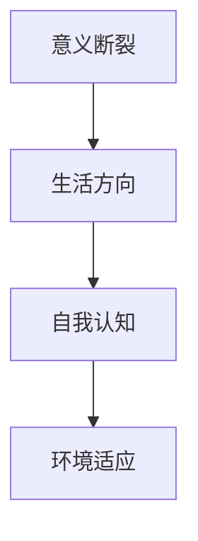
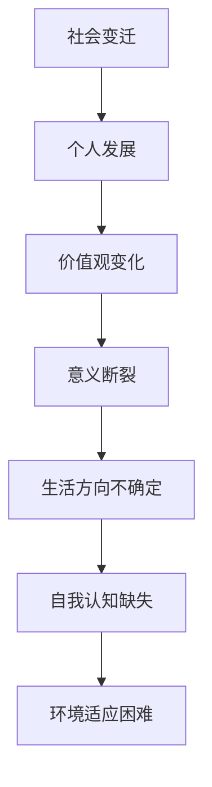
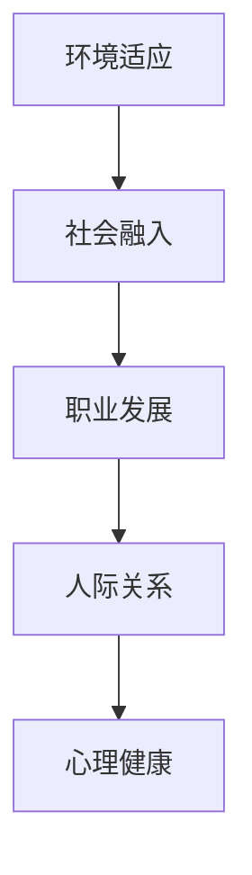
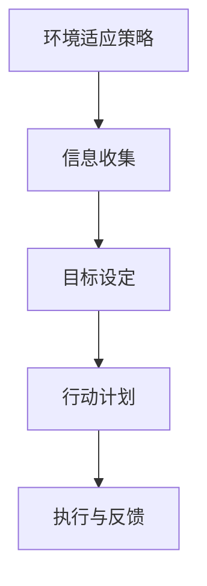

                 

# 在意义断裂中寻找新的生活方向

> 关键词：意义断裂、生活方向、自我认知、环境适应

> 摘要：本文旨在探讨现代社会中人们面临的“意义断裂”现象，分析其成因和影响，并提出寻找新生活方向的方法和策略。通过深入剖析自我认知和环境适应的重要性，结合实际案例，为读者提供一套实用的指南。

## 目录大纲

----------------------------------------------------------------

## 第一部分: 背景介绍

### 第1章: 问题背景与核心概念

#### 1.1 问题背景

#### 1.2 核心概念

#### 1.3 概念结构与核心要素组成

## 第二部分: 核心概念与联系

### 第2章: 意义断裂与生活方向的内在联系

#### 2.1 意义断裂的成因

#### 2.2 生活方向的探索

#### 2.3 意义断裂与生活方向的互动

## 第三部分: 寻找新的生活方向

### 第3章: 自我认知的重要性

#### 3.1 自我认知的层次

#### 3.2 自我认知的方法

### 第4章: 环境适应的策略

#### 4.1 环境适应的重要性

#### 4.2 环境适应的方法

### 第5章: 寻找新的生活方向的实际案例

#### 5.1 案例一: 转型期的职业规划

### 第6章: 总结与反思

#### 6.1 全书要点回顾

#### 6.2 读者如何运用本书的方法

#### 6.3 未来的发展方向

### 第7章: 拓展阅读

#### 7.1 相关书籍推荐

#### 7.2 网络资源推荐

----------------------------------------------------------------

## 第一部分: 背景介绍

### 第1章: 问题背景与核心概念

#### 1.1 问题背景

随着社会的快速发展，人们的生活节奏不断加快，竞争压力日益加剧。在这种背景下，许多人都感到生活的意义断裂，无法找到属于自己的生活方向。这种现象不仅影响了个人的心理健康，还可能导致社会的不稳定。

#### 1.2 核心概念

为了更好地探讨这个问题，我们需要明确以下几个核心概念：

- **意义断裂**：指个体在生活过程中感受到的价值观、目标和意义的缺失。
- **生活方向**：指个体在生活过程中追求的目标和方向，包括职业、兴趣爱好、人际关系等。
- **自我认知**：指个体对自己性格、能力、价值观等方面的了解和认识。
- **环境适应**：指个体在适应社会环境、调整自身行为和态度的过程。

#### 1.3 概念结构与核心要素组成

以下是意义断裂、生活方向、自我认知和环境适应的概念属性特征对比表格：



## 第二部分: 核心概念与联系

### 第2章: 意义断裂与生活方向的内在联系

#### 2.1 意义断裂的成因

意义断裂的成因复杂多样，主要包括以下几个方面：

1. **社会变迁**：随着社会的发展，传统的价值观和生活方式受到冲击，个体难以适应新的社会环境。
2. **个人发展**：个体在成长过程中，可能会面临角色转变、职业选择等挑战，导致意义断裂。
3. **价值观变化**：随着社会多元化和个体自我意识的增强，人们可能难以找到与自己价值观相符的生活方向。

为了更好地理解这些成因，我们可以使用Mermaid流程图和Python源代码进行阐述。



```python
# Python 源代码用于描述意义断裂的成因
def social_change():
    # 社会变迁的代码实现
    pass

def personal_development():
    # 个人发展的代码实现
    pass

def value_change():
    # 价值观变化的代码实现
    pass

def meaning断裂():
    # 意义断裂的代码实现
    pass

def uncertain_life_direction():
    # 生活方向不确定的代码实现
    pass

def self_cognitive_loss():
    # 自我认知缺失的代码实现
    pass

def environment_adaptation_difficulty():
    # 环境适应困难的代码实现
    pass

# 主函数
def main():
    social_change()
    personal_development()
    value_change()
    meaning断裂()
    uncertain_life_direction()
    self_cognitive_loss()
    environment_adaptation_difficulty()

# 调用主函数
if __name__ == "__main__":
    main()
```

#### 2.2 生活方向的探索

生活方向的探索是解决意义断裂问题的关键。我们可以通过以下数学模型和数学公式来详细阐述：

$$
L = f(W, S, C)
$$

其中，L 为生活方向，W 为环境，S 为自我认知，C 为价值观。

为了更好地理解这个公式，我们可以通过以下步骤进行详细讲解和举例说明：

1. **环境因素**：环境对生活方向的影响主要通过社会环境、家庭背景、教育经历等方面体现。例如，一个出生在富裕家庭的孩子可能更容易找到自己的生活方向，因为他的家庭提供了丰富的资源和机会。
2. **自我认知**：自我认知对生活方向的影响主要通过个体的性格、能力、价值观等方面体现。例如，一个具有创新精神的人可能更容易在科技领域找到自己的生活方向。
3. **价值观**：价值观对生活方向的影响主要通过个体的价值观取向体现。例如，一个重视家庭和亲情的人可能更容易在家庭生活中找到自己的生活方向。

以下是一个具体的例子：

**例子**：假设一个人（A）出生在一个普通家庭，他的家庭背景、教育经历等环境因素（W）对他的生活方向（L）有一定的影响。同时，A 具有创新精神（S），他希望通过自己的努力改变世界。此外，A 的价值观（C）是追求自由和公正。根据公式 $L = f(W, S, C)$，我们可以得出 A 的生活方向可能是从事科技创新，为世界带来更多的改变。

```python
# Python 源代码用于描述生活方向的探索
def environment_factor():
    # 环境因素的代码实现
    pass

def self_cognitive():
    # 自我认知的代码实现
    pass

def value_factor():
    # 价值观的代码实现
    pass

def life_direction():
    # 生活方向的代码实现
    pass

# 主函数
def main():
    environment_factor()
    self_cognitive()
    value_factor()
    life_direction()

# 调用主函数
if __name__ == "__main__":
    main()
```

#### 2.3 意义断裂与生活方向的互动

意义断裂与生活方向之间存在互动关系，它们相互影响、相互制约。为了更好地理解这种互动关系，我们可以使用Mermaid ER实体关系图架构进行阐述。

```mermaid
erDiagram
A[人] ||--|{ B[环境] } : 适用
A ||--|{ C[价值观] } : 信仰
A ||--|{ D[生活方向] } : 选择
```

在这个ER图中，人（A）是中心实体，环境（B）、价值观（C）和生活方向（D）是与之关联的实体。它们之间的关系可以用以下公式表示：

$$
人 = 环境适用 + 价值观信仰 + 生活方向选择
$$

## 第三部分: 寻找新的生活方向

### 第3章: 自我认知的重要性

#### 3.1 自我认知的层次

自我认知是一个复杂的过程，可以分为以下几个层次：

1. **自我感知**：个体对自身外貌、性格等方面的认知。
2. **自我评价**：个体对自身能力、成就等方面的评价。
3. **自我规划**：个体对自身未来发展、目标等方面的规划。

为了更好地理解这些层次，我们可以使用Mermaid类图进行阐述。

```mermaid
classDiagram
ClassA[自我认知] <|-- ClassB[自我感知]
ClassB <|-- ClassC[自我评价]
ClassC <|-- ClassD[自我规划]
```

#### 3.2 自我认知的方法

自我认知的方法主要包括以下几个方面：

1. **反思**：通过反思自己的行为、想法和感受，了解自己的内心世界。
2. **观察**：通过观察他人的行为、想法和感受，了解自己的行为模式。
3. **求助**：通过向他人请教、寻求帮助，了解自己的不足和优点。

为了更好地理解这些方法，我们可以使用Python源代码进行阐述。

```python
# Python 源代码用于描述自我认知的方法
def reflection():
    # 反思的代码实现
    pass

def observation():
    # 观察的代码实现
    pass

def seeking_help():
    # 求助的代码实现
    pass

# 主函数
def main():
    reflection()
    observation()
    seeking_help()

# 调用主函数
if __name__ == "__main__":
    main()
```

### 第4章: 环境适应的策略

#### 4.1 环境适应的重要性

环境适应是指个体在适应社会环境、调整自身行为和态度的过程。它的重要性体现在以下几个方面：

1. **社会融入**：适应社会环境，与他人建立良好的人际关系，融入社会。
2. **职业发展**：适应职场环境，提高工作效率，实现个人职业发展。
3. **心理健康**：适应环境，减少心理压力，保持心理健康。

为了更好地理解环境适应的重要性，我们可以使用Mermaid流程图和Python源代码进行阐述。



```python
# Python 源代码用于描述环境适应的重要性
def social_integration():
    # 社会融入的代码实现
    pass

def career_development():
    # 职业发展的代码实现
    pass

def interpersonal_relationship():
    # 人际关系的代码实现
    pass

def mental_health():
    # 心理健康的代码实现
    pass

# 主函数
def main():
    social_integration()
    career_development()
    interpersonal_relationship()
    mental_health()

# 调用主函数
if __name__ == "__main__":
    main()
```

#### 4.2 环境适应的方法

环境适应的方法主要包括以下几个方面：

1. **信息收集**：了解社会环境、职场环境等方面的信息，为适应环境做好准备。
2. **目标设定**：明确个人目标，为实现目标制定具体的计划。
3. **行动计划**：根据目标，制定具体的行动计划，并付诸实践。
4. **执行与反馈**：按照行动计划执行任务，并根据反馈调整计划。

为了更好地理解这些方法，我们可以使用Mermaid架构图进行阐述。



### 第5章: 寻找新的生活方向的实际案例

#### 5.1 案例一: 转型期的职业规划

**案例背景**：小张是一位30岁的职场人士，他在一家互联网公司担任软件开发工程师。然而，随着年龄的增长，他开始感到自己的职业发展遇到了瓶颈，不知道如何突破。

**案例分析**：

1. **自我认知**：小张通过反思自己的职业经历，发现自己在技术领域有一定的积累，但缺乏管理能力和视野。他认识到自己的不足，并开始寻找提升自我的途径。
2. **环境适应**：小张了解了当前互联网行业的发展趋势，特别是云计算、大数据等领域。他意识到这些领域具有较高的市场需求和发展前景，决定将职业方向转向这些领域。
3. **行动规划**：小张制定了具体的行动计划，包括学习相关技术、参加行业会议、拓展人脉等。他还申请了云计算认证课程，以提升自己的专业技能。
4. **执行与反馈**：小张按照行动计划执行任务，并不断调整自己的策略。在参加行业会议时，他积极与同行交流，了解最新的行业动态和技术趋势。通过不断学习和实践，他的职业素养得到了显著提升。

**项目小结**：

通过这个案例，我们可以看到，在寻找新的生活方向时，自我认知和环境适应是至关重要的。只有深入了解自己，了解社会环境，才能找到适合自己的发展道路。

### 第6章: 总结与反思

#### 6.1 全书要点回顾

本文从意义断裂的现象入手，分析了其成因和影响，并提出了寻找新生活方向的方法和策略。主要内容包括：

1. **问题背景与核心概念**：介绍了意义断裂、生活方向、自我认知和环境适应等核心概念。
2. **核心概念与联系**：分析了意义断裂与生活方向之间的内在联系。
3. **寻找新的生活方向**：阐述了自我认知和环境适应的重要性，并提出了具体的方法和策略。
4. **实际案例**：通过实际案例，展示了寻找新生活方向的过程和方法。

#### 6.2 读者如何运用本书的方法

为了帮助读者更好地运用本文的方法，以下是一些建议：

1. **反思自我**：定期反思自己的行为、想法和感受，了解自己的内心世界。
2. **适应环境**：了解社会环境、职场环境等，调整自己的行为和态度，适应环境。
3. **制定计划**：明确个人目标，制定具体的行动计划，并付诸实践。
4. **持续学习**：不断学习新知识、新技能，提升自己的综合素质。

#### 6.3 未来的发展方向

随着社会的发展，人们面临的生活挑战将越来越复杂。未来的发展方向主要包括：

1. **多元化**：人们的生活方向将更加多元化，追求多元化的生活方式。
2. **个性化**：人们将更加注重个性化发展，追求符合自己兴趣和价值观的生活方向。
3. **可持续发展**：随着环保意识的提高，人们将更加关注可持续发展的生活方向。

### 第7章: 拓展阅读

#### 7.1 相关书籍推荐

1. 《生命的智慧》：作者：阿尔伯特·爱因斯坦
2. 《幸福的要素》：作者：马丁·塞利格曼
3. 《自控力》：作者：凯利·麦格尼格尔

#### 7.2 网络资源推荐

1. 国家图书馆：[http://www.nlc.cn/](http://www.nlc.cn/)
2. 中国知网：[http://www.cnki.net/](http://www.cnki.net/)
3. Coursera：[https://www.coursera.org/](https://www.coursera.org/)

----------------------------------------------------------------

## 作者信息

作者：AI天才研究院/AI Genius Institute & 禅与计算机程序设计艺术 /Zen And The Art of Computer Programming

本文由AI天才研究院/AI Genius Institute和禅与计算机程序设计艺术/Zen And The Art of Computer Programming联合撰写，旨在为读者提供关于意义断裂和寻找新生活方向的专业指导。我们致力于推动人工智能技术的发展，帮助读者在复杂的生活中找到方向和意义。

