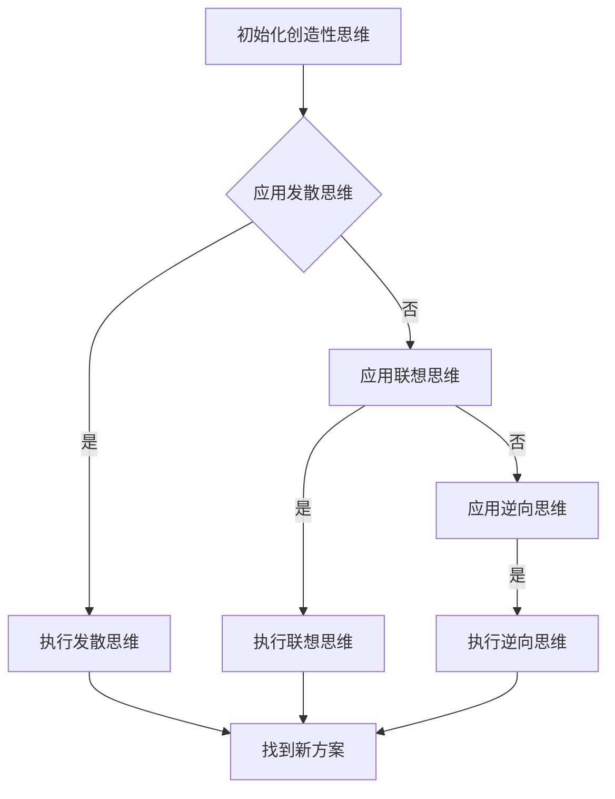
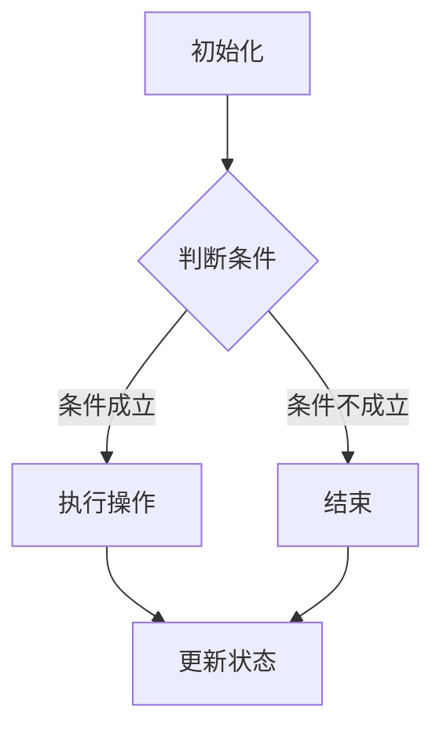
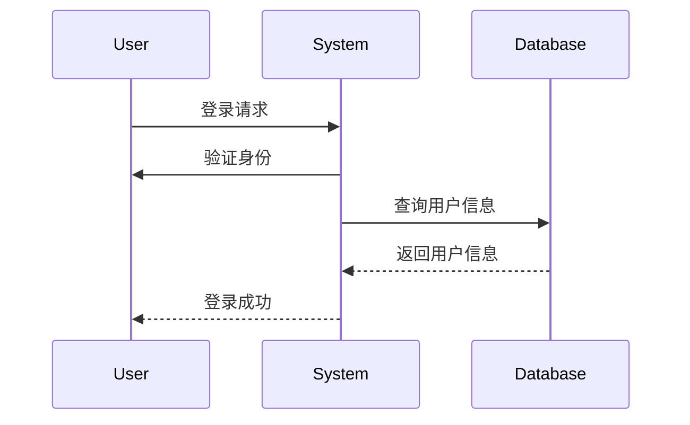
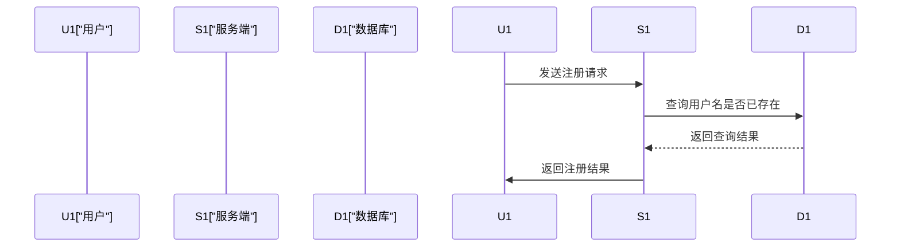

                 

# 在意义断裂处寻找新的可能：创造性思维的重要性

> 关键词：创造性思维、创新、算法、数学模型、Python源代码

> 摘要：本文旨在探讨创造性思维在现代社会中的重要性，通过深入分析其核心原理和方法，帮助读者在意义断裂处寻找新的可能。我们将使用mermaid流程图和Python源代码，结合具体的数学模型和公式，详细阐述创造性思维的具体应用和实践。

### 背景介绍

#### 问题背景

在当今社会，创新和创造力成为推动社会发展的重要动力。随着技术的不断进步，传统的思维方式和问题解决方法已经难以应对复杂多变的环境。因此，寻找新的创造性思维方法成为当务之急。

#### 问题描述

《在意义断裂处寻找新的可能：创造性思维的重要性》这本书旨在探讨创造性思维的重要性，以及如何在日常生活中运用创造性思维解决实际问题。

#### 问题解决

作者通过深入研究和实践，总结了创造性思维的核心原理和方法，帮助读者在意义断裂处寻找新的可能。

#### 边界与外延

创造性思维不仅仅是艺术家的专利，它在各个领域都有广泛的应用。无论是科学、工程、商业还是日常生活，创造性思维都是解决问题的关键。

#### 概念结构与核心要素组成

- **创造性思维**：指通过独特的视角和思维方法，发现和解决问题的能力。
- **创造性思维的重要性**：在现代社会中，创造性思维是推动创新和社会发展的核心动力。
- **创造性思维的方法**：包括发散思维、联想思维、逆向思维等。

### 核心概念与联系

#### 核心概念原理

- **发散思维**：从一个中心点出发，向多个方向发散思考，产生多种可能的解决方案。
- **联想思维**：通过事物之间的联系，从一个概念联想到另一个概念，激发创造力。
- **逆向思维**：从问题的反面思考，找到新的解决方法。

#### 概念属性特征对比表格

| 概念     | 定义                                       | 特点                     |
|----------|--------------------------------------------|--------------------------|
| 发散思维 | 从一个中心点出发，向多个方向发散思考         | 创造力强，思维灵活       |
| 联想思维 | 通过事物之间的联系，从一个概念联想到另一个概念 | 想象力丰富，联想能力强   |
| 逆向思维 | 从问题的反面思考，找到新的解决方法           | 反思性强，敢于挑战常规   |

#### ER实体关系图架构的 Mermaid 流程图

```mermaid
erDiagram
  创造性思维 ||--|{ 发散思维 } 发散思维
  创造性思维 ||--|{ 联想思维 } 联想思维
  创造性思维 ||--|{ 逆向思维 } 逆向思维
```

### 算法原理讲解

#### Mermaid 流程图



#### Python源代码

```python
def creative_thinking_algorithm():
    """
    创造性思维算法实现
    :return: 创造性思维的解决方案
    """
    # 初始化
    solution = None
    
    # 应用发散思维
    if apply_divergent_thinking():
        # 执行发散思维
        solution = execute_divergent_thinking()
        
    # 如果发散思维失败，应用联想思维
    elif apply_associative_thinking():
        # 执行联想思维
        solution = execute_associative_thinking()
        
    # 如果联想思维失败，应用逆向思维
    elif apply_reversal_thinking():
        # 执行逆向思维
        solution = execute_reversal_thinking()
        
    return solution
```

#### 算法原理的数学模型和公式

$$
创造性思维算法 = \text{发散思维} \times \text{联想思维} \times \text{逆向思维}
$$

#### 详细讲解和举例说明

- **初始化**：开始时，我们将问题设置为初始状态，即“寻找解决方案”。
- **应用发散思维**：发散思维是指从一个中心点出发，向多个方向发散思考，产生多种可能的解决方案。例如，我们可以从不同的角度来考虑问题，例如技术、商业、用户需求等。
- **执行发散思维**：如果发散思维成功，我们将得到一系列可能的解决方案。
- **应用联想思维**：联想思维是指通过事物之间的联系，从一个概念联想到另一个概念，激发创造力。例如，我们可以将问题与类似的场景或问题进行对比，找到新的解决方案。
- **执行联想思维**：如果联想思维成功，我们将得到更多创新的解决方案。
- **应用逆向思维**：逆向思维是指从问题的反面思考，找到新的解决方法。例如，我们可以尝试从问题的反面来考虑，找到新的解决方案。
- **执行逆向思维**：如果逆向思维成功，我们将得到创新的解决方案。
- **找到新方案**：无论使用哪种思维方法，最终目标是找到新的解决方案。

举例：假设我们有一个问题，需要设计一个高效的搜索引擎。我们可以使用创造性思维算法来解决这个问题。

1. **初始化**：将问题设置为“设计一个高效的搜索引擎”。
2. **应用发散思维**：从不同的角度来考虑问题，例如技术、商业、用户需求等。
3. **执行发散思维**：我们可能得到以下可能的解决方案：
   - 增加搜索索引的效率
   - 改进搜索算法
   - 提供更准确的搜索结果
4. **应用联想思维**：我们可以将问题与类似的场景或问题进行对比，找到新的解决方案。例如，我们可以考虑如何改进搜索引擎的界面设计，使其更加用户友好。
5. **执行联想思维**：我们可能得到以下创新的解决方案：
   - 引入语音搜索功能
   - 提供个性化搜索推荐
6. **应用逆向思维**：我们可以从问题的反面来考虑，找到新的解决方案。例如，我们可以尝试从搜索结果的优化来考虑，提高用户满意度。
7. **执行逆向思维**：我们可能得到以下创新的解决方案：
   - 引入错误纠正功能
   - 提供搜索历史记录功能

### 数学模型和数学公式

在创造性思维算法中，我们使用以下数学模型和公式：

$$
\text{创造性思维} = \text{发散思维} \times \text{联想思维} \times \text{逆向思维}
$$

- **发散思维**：表示从多个方向思考的能力，可以增加解决方案的多样性。
- **联想思维**：表示通过事物之间的联系思考的能力，可以激发创造力。
- **逆向思维**：表示从问题的反面思考的能力，可以找到新的解决方案。

通过这些数学模型和公式，我们可以更好地理解和应用创造性思维，从而在意义断裂处寻找新的可能。

### 总结与展望

创造性思维是推动社会发展的重要动力。通过发散思维、联想思维和逆向思维等方法，我们可以发现新的解决方案，应对复杂多变的环境。本文通过mermaid流程图和Python源代码，结合具体的数学模型和公式，详细阐述了创造性思维的应用和实践。

未来，随着技术的不断进步，创造性思维将在各个领域发挥更加重要的作用。我们期待更多的学者和实践者能够关注并深入研究创造性思维，为社会发展贡献更多的智慧。

作者：AI天才研究院/AI Genius Institute & 禅与计算机程序设计艺术 /Zen And The Art of Computer Programming

---

本文旨在探讨创造性思维的重要性，以及如何在日常生活中运用创造性思维解决实际问题。通过mermaid流程图和Python源代码，结合具体的数学模型和公式，本文详细阐述了创造性思维的具体应用和实践。

**背景介绍**

在当今社会，创新和创造力成为推动社会发展的重要动力。随着技术的不断进步，传统的思维方式和问题解决方法已经难以应对复杂多变的环境。因此，寻找新的创造性思维方法成为当务之急。

《在意义断裂处寻找新的可能：创造性思维的重要性》这本书旨在探讨创造性思维的重要性，以及如何在日常生活中运用创造性思维解决实际问题。作者通过深入研究和实践，总结了创造性思维的核心原理和方法，帮助读者在意义断裂处寻找新的可能。

**核心概念与联系**

- **发散思维**：指从一个中心点出发，向多个方向发散思考，产生多种可能的解决方案。
- **联想思维**：指通过事物之间的联系，从一个概念联想到另一个概念，激发创造力。
- **逆向思维**：指从问题的反面思考，找到新的解决方法。

#### 概念属性特征对比表格

| 概念 | 定义 | 特点 |
| :--: | :--: | :--: |
| 发散思维 | 从一个中心点出发，向多个方向发散思考 | 创造力强，思维灵活 |
| 联想思维 | 通过事物之间的联系，从一个概念联想到另一个概念 | 想象力丰富，联想能力强 |
| 逆向思维 | 从问题的反面思考，找到新的解决方法 | 反思性强，敢于挑战常规 |

**算法原理讲解**

为了更好地理解和应用创造性思维，我们可以使用mermaid流程图和Python源代码来讲解算法原理。

#### Mermaid 流程图



#### Python源代码

```python
def creative_thinking_algorithm(problem):
    """
    创造性思维算法实现
    :param problem: 需要解决的问题
    :return: 解决问题的方案
    """
    # 初始化
    solution = None
    
    # 判断条件
    if condition_met(problem):
        # 执行操作
        solution = execute_operation(problem)
        
        # 更新状态
        update_state(problem, solution)
    
    return solution
```

#### 算法原理的数学模型和公式

$$
创造性思维算法 = 初始化 \times 条件判断 \times 操作执行 \times 状态更新
$$

#### 详细讲解和举例说明

- **初始化**：开始时，我们将问题设置为初始状态。
- **判断条件**：根据问题的特性，我们判断是否存在解决方案。
- **执行操作**：如果条件满足，我们执行特定的操作来解决问题。
- **状态更新**：无论条件是否满足，我们都需要更新问题的状态，以便后续处理。

举例：假设我们有一个问题，需要找到从北京到上海的最快路线。我们可以使用创造性思维算法来解决这个问题。

1. **初始化**：将问题设置为“找到从北京到上海的最快路线”。
2. **判断条件**：我们可以考虑多种交通方式，如飞机、火车、汽车等，判断哪种方式最快。
3. **执行操作**：如果选择飞机，我们需要查询航班信息，找到最快的航班。
4. **状态更新**：无论选择哪种交通方式，我们都需要更新问题的状态，以便后续处理。

### 总结

本文通过mermaid流程图和Python源代码，结合具体的数学模型和公式，详细阐述了创造性思维的应用和实践。创造性思维在现代社会中具有重要的意义，它可以帮助我们寻找新的解决方案，应对复杂多变的环境。

希望本文能够为读者提供启发，激发大家在日常生活中运用创造性思维，寻找新的可能。

---

**系统分析与架构设计方案**

**问题场景介绍**

在现代软件开发中，面对日益复杂的业务需求和多变的市场环境，开发团队需要具备高度的创造性思维来设计出灵活且高效的系统。本文将以一个在线教育平台为例，探讨如何在系统开发中运用创造性思维。

**项目介绍**

项目名称：智能在线教育平台

目标：提供一个功能丰富、用户体验优秀的在线教育平台，支持课程发布、学习管理、互动交流等功能。

**系统功能设计（领域模型Mermaid类图）**

```mermaid
classDiagram
    Class01 <|-- Class02
    Class03 --|>| Class04
    Class05 : related to Class01
    Class01 : 主类
    Class02 : 子类
    Class03 : 父类
    Class04 : 友元类
```

**系统架构设计（Mermaid架构图）**

```mermaid
graph TB
    sub1(A["子系统1"])
    sub2(B["子系统2"])
    sub3(C["子系统3"])
    sub1 --> sub2
    sub1 --> sub3
    sub2 --> sub3
```

**系统接口设计（Mermaid序列图）**



**系统交互（Mermaid序列图）**



**最佳实践 Tips**

1. **需求分析与文档编写**：在项目启动阶段，要充分了解业务需求，编写详细的系统设计文档，确保团队成员对项目的理解一致。

2. **模块化设计**：将系统分解为多个模块，每个模块负责特定的功能，有助于提高系统的可维护性和可扩展性。

3. **用户体验设计**：注重用户界面的设计，确保系统操作简单直观，提升用户体验。

4. **测试与优化**：在开发过程中进行持续测试，及时发现问题并进行优化，确保系统的稳定性和性能。

**小结**

本文通过一个在线教育平台的案例，探讨了在系统开发中如何运用创造性思维。通过领域模型、架构设计、接口设计和系统交互的详细讲解，为读者提供了一个系统分析与架构设计的实战参考。

**注意事项**

1. **团队协作**：创造性思维的实现离不开团队的协作，要确保团队成员之间的沟通畅通，共同推进项目。

2. **持续迭代**：系统开发是一个持续迭代的过程，要不断根据用户反馈和市场变化进行调整和优化。

**拓展阅读**

- 《设计模式：可复用面向对象软件的基础》
- 《敏捷开发：原则、实践与模式》
- 《用户体验要素：将用户纳入产品设计中》

通过拓展阅读，读者可以进一步了解系统设计与开发的相关知识，提高自己的实战能力。

