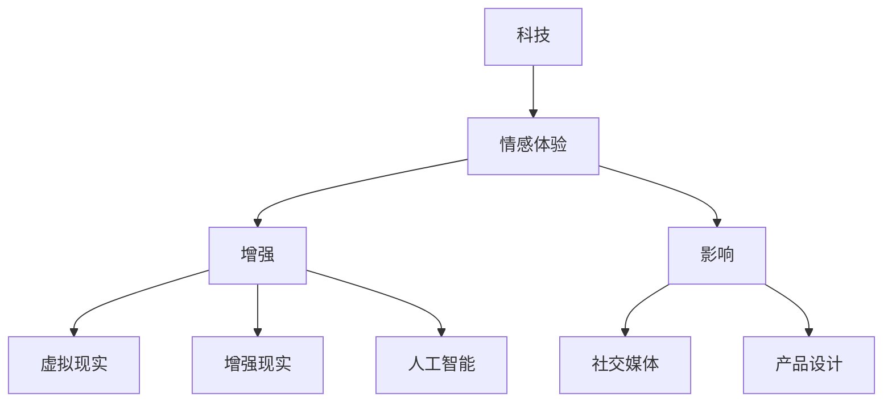
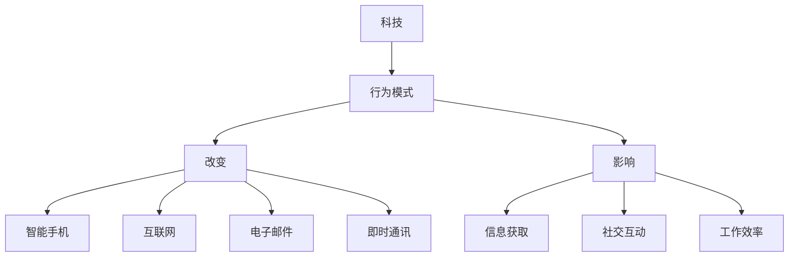
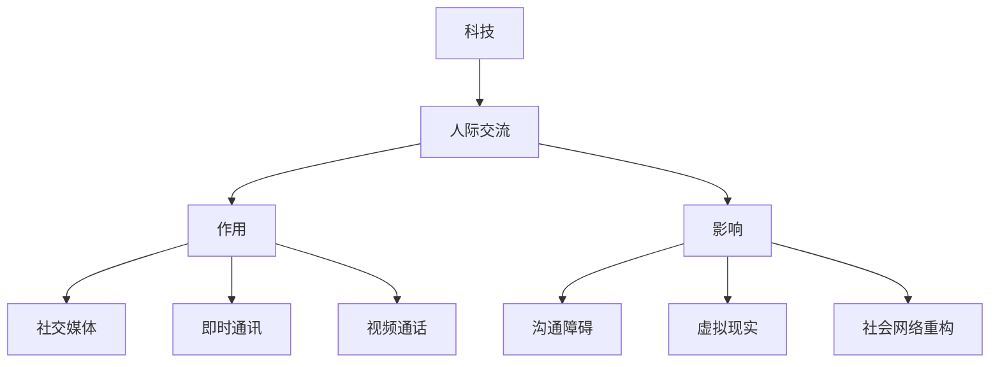
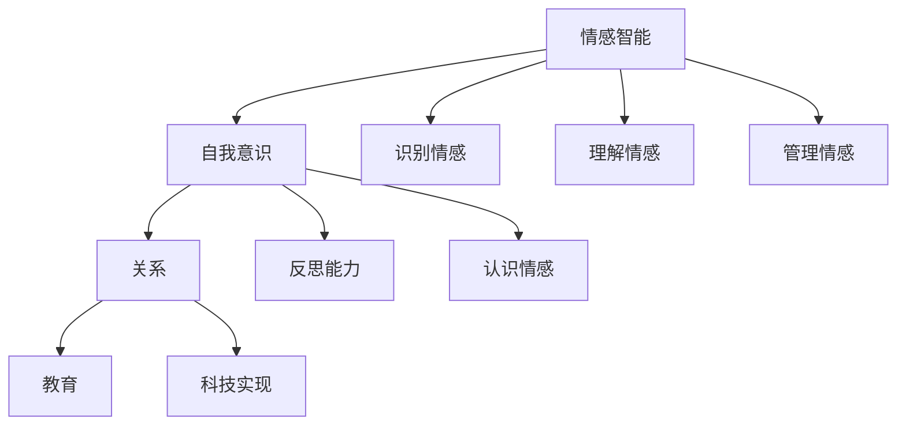
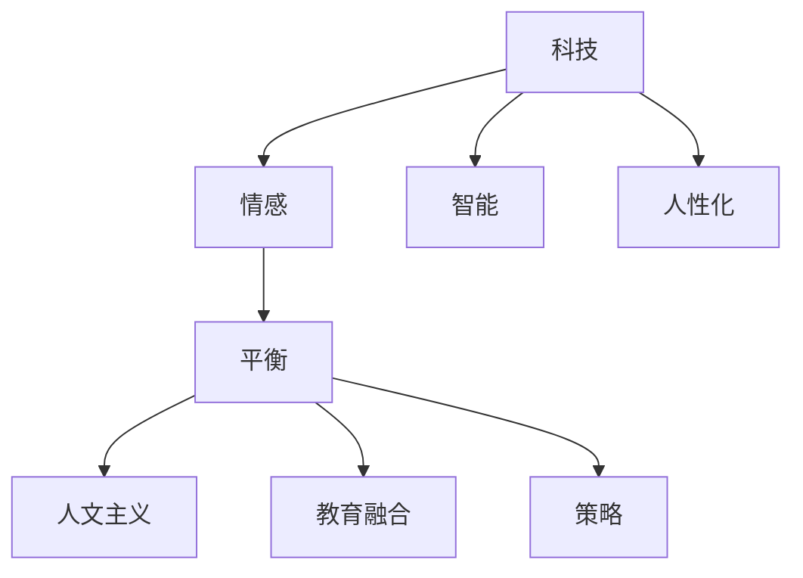

                 

### 文章标题：在数字化时代保持人性温度：科技与情感的平衡

**关键词**：数字化时代、人性温度、科技与情感、伦理道德、情感智能、平衡

**摘要**：本文深入探讨了在数字化时代，如何保持人性温度，即如何在科技的快速发展中维护和提升人类的情感体验和人际关系。文章首先分析了数字化时代的背景与挑战，然后阐述了科技与人性的关系，接着探讨了如何在数字化时代保持人性温度，最后通过案例分析和最佳实践提出了具体建议。

### 目录

1. **数字化时代的背景与挑战**
   - 1.1 数字化时代的到来
   - 1.2 数字化对人类生活的影响
   - 1.3 数字化带来的挑战

2. **科技与人性的关系**
   - 2.1 科技与情感的关系
   - 2.2 科技如何影响人类行为
   - 2.3 科技如何影响人际关系

3. **如何在数字化时代保持人性温度**
   - 3.1 技术伦理与道德责任
   - 3.2 情感智能与自我意识
   - 3.3 平衡科技与情感的方法

4. **案例分析与最佳实践**
   - 4.1 案例分析
   - 4.2 最佳实践
   - 4.3 未来展望与建议

### 1. 数字化时代的背景与挑战

**1.1 数字化时代的到来**

数字化时代，是指人类社会和信息技术的深度融合，从而形成的新的生产方式和生活方式。数字化的核心是信息的数字化，即把一切信息转化为数字形式，通过计算机和网络进行处理和传递。

**1.2 数字化对人类生活的影响**

数字化带来了生活方式的巨大变革，使人们的生活更加便捷、高效。例如，移动支付、在线购物、远程办公等已经成为人们日常生活的常态。然而，数字化也带来了诸多挑战，例如数据隐私和安全问题、数字鸿沟的加剧等。

**1.3 数字化带来的挑战**

数字化带来的挑战主要体现在以下几个方面：

- **数据隐私与安全问题**：随着数字化程度的提高，个人数据泄露的风险也在增加。如何保护用户的数据隐私和安全，成为数字化时代的一个重要问题。
- **数字鸿沟的加剧**：数字化时代的到来，使得数字技术的掌握和应用成为重要的能力。然而，由于经济、教育等原因，数字鸿沟在不断扩大，这可能导致社会不平等现象的加剧。
- **人际关系疏离**：虽然数字化使得人们的交流变得更加方便，但也可能导致人际关系的疏离。例如，社交媒体上的互动虽然频繁，但缺乏面对面的真实交流。

### 2. 科技与人性的关系

**2.1 科技与情感的关系**

科技与情感的关系密不可分。一方面，科技的发展可以增强人类的情感体验，例如虚拟现实技术可以让人们体验到更加真实的情感体验。另一方面，科技的应用也可能对人类的情感产生影响，例如社交媒体的使用可能会影响人们的情绪状态。

**2.2 科技如何影响人类行为**

科技对人类行为的影响是多方面的。例如，智能手机的普及改变了人们的交流方式，使得人们更加依赖屏幕交流，而忽视了面对面的交流。此外，科技的发展也改变了人们的工作方式，例如远程办公技术的普及，使得人们可以在家中完成工作任务。

**2.3 科技如何影响人际关系**

科技对人际关系的影响主要体现在以下几个方面：

- **人际交流的改变**：科技使得人们的交流更加便捷，但也可能导致人际关系的疏离。例如，人们可能更多地依赖社交媒体进行交流，而忽视了现实生活中的互动。
- **亲密关系的重构**：科技的应用，如在线约会、虚拟现实等，改变了人们的亲密关系模式。例如，虚拟现实技术可以让人们体验到更加真实的亲密关系，但也可能导致现实中的亲密关系变得淡漠。
- **社会网络的扩展**：科技的发展使得人们可以轻松地建立和维护社会网络。然而，这也可能导致社会网络的过度扩展，使得人们难以管理和维护。

### 3. 如何在数字化时代保持人性温度

**3.1 技术伦理与道德责任**

在数字化时代，技术伦理和道德责任尤为重要。科技的发展不仅需要满足技术上的可行性，还需要考虑其对社会、人类行为和人际关系的影响。例如，在开发和应用新技术时，需要充分考虑其可能带来的隐私和安全问题。

**3.2 情感智能与自我意识**

情感智能和自我意识是保持人性温度的关键。情感智能指的是人们识别、理解和管理自己和他人的情感的能力。自我意识则是指人们对自身情感和行为的认识和反思能力。通过提高情感智能和自我意识，人们可以更好地理解和管理自己的情感，从而在数字化时代保持人性温度。

**3.3 平衡科技与情感的方法**

为了在数字化时代保持人性温度，我们需要采取一系列方法来平衡科技与情感。例如：

- **技术人文主义**：将人文关怀融入技术发展中，使得技术不仅服务于功能需求，还能满足人类的情感需求。
- **情感教育**：通过情感教育，提高人们的情感智能和自我意识，从而更好地应对数字化时代的挑战。
- **社交互动**：鼓励人们参与面对面的社交互动，以弥补数字化带来的社交疏离。

### 4. 案例分析与最佳实践

**4.1 案例分析**

通过分析具体的案例，我们可以更好地理解如何在数字化时代保持人性温度。例如，分析社交媒体的使用对人际关系的影响，探讨虚拟现实技术在保持人性温度方面的应用等。

**4.2 最佳实践**

最佳实践包括一系列具体的行动和策略，以帮助我们在数字化时代保持人性温度。例如，制定技术伦理规范，推广情感智能教育，鼓励人们参与面对面的社交互动等。

**4.3 未来展望与建议**

未来的数字化时代，我们将面临更多的挑战和机遇。为了保持人性温度，我们需要不断探索和创新，例如开发新的情感智能技术，推广情感教育，构建更加和谐的社会网络等。

### 总结

在数字化时代，保持人性温度至关重要。通过理解科技与人性的关系，采取有效的措施，我们可以更好地应对数字化时代的挑战，维护和提升人类的情感体验和人际关系。让我们共同努力，在数字化时代中保持人性温度，创造一个更加温暖和谐的社会。

### 作者信息

作者：AI天才研究院/AI Genius Institute & 禅与计算机程序设计艺术 /Zen And The Art of Computer Programming

**文章关键词**：数字化时代、人性温度、科技与情感、伦理道德、情感智能、平衡

**文章摘要**：本文深入探讨了在数字化时代，如何保持人性温度，即如何在科技的快速发展中维护和提升人类的情感体验和人际关系。文章首先分析了数字化时代的背景与挑战，然后阐述了科技与人性的关系，接着探讨了如何在数字化时代保持人性温度，最后通过案例分析和最佳实践提出了具体建议。

### 1. 数字化时代的背景与挑战

**1.1 数字化时代的到来**

我们正处在一个前所未有的数字化时代，这是一个以信息技术为核心驱动的时代，它深刻地改变了人类的生产、生活方式，甚至重塑了我们的思维方式。数字化的定义可以理解为将物理世界中的各种信息转化为数字形式，以便于计算机和网络处理和传输。这一过程不仅涉及数据的存储、处理和传输，还包括信息的应用和利用。

**历史背景**：数字化并不是一个全新的概念，它的起源可以追溯到20世纪中期。随着计算机技术的发展，数字技术开始应用于各个领域，从最初的科学计算、数据处理，到后来的互联网、移动通信、云计算等，数字化已经渗透到我们生活的方方面面。

**对人类生活的影响**：数字化的到来，带来了生活方式的巨大变革。例如，互联网的普及使得人们可以随时随地获取信息，电子商务的兴起改变了人们的购物习惯，移动支付技术的应用使得交易变得更加便捷。此外，远程办公、在线教育等新形式的兴起，使得工作方式和教育方式发生了翻天覆地的变化。

**1.2 数字化对人类生活的影响**

数字化对人类生活的影响是全方位的，它不仅改变了我们的生活方式，也对工作模式、人际关系等产生了深远的影响。

**生活方式的改变**：数字化使得我们的生活变得更加便捷。例如，通过智能手机，我们可以随时查看邮件、浏览新闻、进行在线购物等。智能家居设备的普及，使得我们的家庭生活更加智能化，从自动控制灯光到智能安防系统，数字化技术正在深刻地改变我们的生活习惯。

**工作模式的转变**：数字化技术的应用，使得远程办公成为可能。人们不再受限于地理位置，可以在任何时间、任何地点进行工作。这不仅提高了工作效率，也增加了工作的灵活性。同时，数字化工具的普及，如项目管理软件、协作平台等，使得团队合作变得更加高效。

**数字化对人际关系的影响**：数字化对人际关系的影响是双刃剑。一方面，它使得人们的交流变得更加便捷，社交媒体、即时通讯工具等使得人们可以随时随地与他人交流。然而，另一方面，数字化也导致了人际关系的疏离。由于依赖屏幕交流，人们可能会忽视面对面的真实互动，导致人际关系变得表面化。

**1.3 数字化带来的挑战**

尽管数字化带来了许多便利，但同时也带来了许多挑战。

**数据隐私与安全问题**：随着数字化程度的提高，个人数据的收集、存储和处理变得日益普遍。然而，这也带来了数据隐私和安全问题。如何保护用户的数据隐私，防止数据泄露，成为数字化时代的一个重要议题。

**数字鸿沟的加剧**：数字鸿沟是指由于技术、经济、教育等因素，不同群体在数字化进程中所面临的机会不平等。在数字化时代，掌握数字技术和应用能力成为重要的竞争力。然而，由于经济和教育资源的差异，数字鸿沟在不断扩大，这可能导致社会不平等现象的加剧。

**人际关系疏离**：数字化虽然使得人们的交流变得更加便捷，但也可能导致人际关系的疏离。由于依赖屏幕交流，人们可能会忽视面对面的真实互动，导致人际关系变得表面化。此外，社交媒体的普及，也使得人们更多地沉浸在虚拟世界中，忽视了现实生活中的互动。

### 2. 科技与人性的关系

**2.1 科技与情感的关系**

科技与情感之间的关系是复杂而微妙的。一方面，科技的发展可以增强人类的情感体验，使得人们能够以更加丰富和多样的方式表达和感知情感。另一方面，科技的应用也可能对人类的情感产生负面影响，例如过度依赖科技可能导致情感冷漠。

**科技如何增强情感体验**：现代科技提供了许多新的方式来增强情感体验。例如，虚拟现实（VR）技术可以让人们体验到高度沉浸式的情感体验，如模拟旅行、虚拟现实游戏等。此外，增强现实（AR）技术也可以在现实世界中添加情感元素，如情感化广告、互动博物馆等。

**科技如何影响情感体验**：然而，科技的应用也可能对情感体验产生负面影响。例如，社交媒体的过度使用可能导致焦虑和抑郁，因为人们在虚拟世界中的互动可能无法替代现实生活中的真实交流。此外，科技产品设计的缺陷，如过度刺激的设计，也可能影响用户的情感状态。

**2.2 科技如何影响人类行为**

科技的发展不仅改变了人类的情感体验，也对人类的行为模式产生了深远的影响。科技的应用，如智能手机、互联网、社交媒体等，已经深刻地改变了人类的生活方式和社会互动方式。

**科技对行为模式的影响**：科技对人类行为的影响是多方面的。例如，智能手机的普及使得人们可以随时随地获取信息，这改变了人们的阅读习惯和信息消费方式。互联网的普及使得人们可以更加方便地进行远程交流和工作，改变了人们的工作和社交方式。此外，社交媒体的兴起，改变了人们的社交互动模式，使得人际交流变得更加碎片化和表面化。

**科技对认知和行为的影响**：科技不仅改变了人们的行为模式，还对人类的认知和行为产生了影响。例如，互联网的普及使得人们可以更容易地获取大量信息，这可能导致信息过载，影响人们的注意力集中和思考深度。此外，社交媒体的过度使用，可能导致人们的认知和行为模式发生改变，例如依赖即时反馈和即时满足，忽视长期目标和持续努力的重要性。

**2.3 科技如何影响人际关系**

科技对人际关系的影响是双刃剑。一方面，科技的应用可以增强人们的社交互动，例如社交媒体和即时通讯工具使得人们可以随时随地与他人交流。另一方面，科技也可能导致人际关系的疏离，例如过度依赖屏幕交流，忽视面对面的真实互动。

**科技在人际交流中的作用**：科技在人际交流中扮演了重要的角色。例如，社交媒体使得人们可以轻松地建立和维护社交网络，扩大社交圈。即时通讯工具如微信、WhatsApp等，使得人们可以随时与他人进行交流，不受时间和地点的限制。此外，视频通话技术如Zoom、Skype等，使得远程工作和远程教育成为可能，增加了人们的社交互动机会。

**科技对亲密关系的影响**：然而，科技的应用也可能对亲密关系产生负面影响。例如，过度使用社交媒体和智能手机可能导致亲密关系中的沟通障碍，因为人们在屏幕前的交流可能无法替代面对面的真实互动。此外，虚拟现实和在线约会等新技术的应用，虽然提供了新的社交方式，但也可能导致现实中的亲密关系变得淡漠。

**科技如何重构社会网络**：科技的应用也在重构社会网络。例如，社交媒体使得人们可以轻松地加入不同的社交圈子，建立多样化的社会联系。然而，这也可能导致社会网络的过度扩展，使得人们难以管理和维护这些关系。此外，科技的应用也使得社会网络的虚拟化程度提高，人们在现实生活中的互动减少，导致社会网络的浅薄化。

### 3. 如何在数字化时代保持人性温度

**3.1 技术伦理与道德责任**

在数字化时代，技术伦理和道德责任变得尤为重要。科技的发展不仅需要满足技术上的可行性，还需要考虑其对社会、人类行为和人际关系的影响。以下是一些关于技术伦理和道德责任的重要议题：

**技术伦理的基本原则**：技术伦理的基本原则包括尊重隐私、公平性、公正性、透明性等。例如，在数据收集和使用过程中，需要确保用户隐私得到保护，避免数据滥用。此外，科技的应用应该确保公平和公正，避免对特定群体产生不公平的影响。

**道德责任与科技发展**：科技的发展不应该脱离道德责任的框架。科技企业和社会各界都应该承担道德责任，确保科技的发展符合社会伦理和道德标准。例如，在人工智能和大数据领域，需要确保算法的公平性和透明性，避免歧视和偏见。

**伦理困境与解决方案**：在数字化时代，科技发展过程中可能会面临各种伦理困境。例如，在自动驾驶汽车中，如何处理紧急情况下的道德决策就是一个典型的伦理困境。解决这些困境需要综合运用技术、法律、伦理等多方面的手段。

**3.2 情感智能与自我意识**

情感智能和自我意识是保持人性温度的关键。情感智能指的是人们识别、理解和管理自己和他人的情感的能力。自我意识则是指人们对自身情感和行为的认识和反思能力。以下是一些关于情感智能和自我意识的详细讨论：

**情感智能的定义与发展**：情感智能是一个相对较新的概念，它指的是人们识别、理解和管理自己和他人的情感的能力。情感智能的发展需要通过教育、训练和实践来提高。例如，通过情感教育，可以帮助人们更好地理解和管理自己的情感，从而在数字化时代中保持人性温度。

**自我意识的科技实现**：科技的发展为自我意识的提升提供了新的途径。例如，通过使用心理测量技术，如脑电图（EEG）和面部表情识别技术，可以帮助人们更好地了解自己的情感状态。此外，智能设备如智能手环、智能手表等，也可以通过监测生理指标来帮助人们管理自己的情感。

**情感智能在科技中的应用**：情感智能在科技中的应用非常广泛。例如，在智能客服系统中，通过情感智能技术，可以识别用户的情感状态，提供更加个性化的服务。在智能医疗中，情感智能可以帮助医生更好地理解患者的情感需求，提供更加贴心的医疗服务。

**3.3 平衡科技与情感的方法**

为了在数字化时代保持人性温度，我们需要采取一系列方法来平衡科技与情感。以下是一些具体的方法：

**技术人文主义理念**：技术人文主义是一种将人文关怀融入技术发展的理念。它强调科技的发展应该以人为本，关注人类的情感需求和心理健康。例如，在产品设计过程中，需要充分考虑用户的使用体验和情感需求，避免过度依赖技术，忽视人类的情感需求。

**科技与情感教育的融合**：情感教育是提升人类情感智能的重要手段。通过情感教育，可以帮助人们更好地理解和管理自己的情感，从而在数字化时代中保持人性温度。此外，科技与情感教育的融合，可以通过开发情感智能教育软件和平台，提供更加个性化、互动性的情感教育体验。

**实现科技与情感平衡的策略**：为了实现科技与情感的平衡，需要采取一系列策略。例如，在政策层面，可以通过制定相关的法律法规，确保科技的发展符合伦理和道德标准。在技术层面，可以通过技术创新，开发出更加智能、人性化的科技产品，满足人们的情感需求。在社会层面，可以通过宣传和教育，提高公众对情感智能和自我意识的重视，促进科技与情感的结合。

### 4. 案例分析与最佳实践

**4.1 案例分析**

为了更好地理解如何在数字化时代保持人性温度，我们可以通过分析一些具体的案例来探讨科技与情感的关系，以及如何平衡科技与情感。

**案例一：社交媒体对情感的影响**

社交媒体在数字化时代中扮演着重要的角色，它不仅改变了人们的交流方式，也对人们的情感产生了深远的影响。例如，研究表明，社交媒体的使用可能导致焦虑和抑郁，因为人们在虚拟世界中的互动可能无法替代现实生活中的真实交流。此外，社交媒体上的过度关注和比较，可能导致人们的自尊心受到伤害。然而，通过一些实践，如增加面对面交流的机会，提供情感支持，可以帮助人们在社交媒体中保持人性温度。

**案例二：虚拟现实对人际关系的重塑**

虚拟现实技术提供了一个全新的互动平台，它不仅改变了人们的娱乐方式，也对人际关系产生了重要影响。例如，虚拟现实游戏可以提供一种新的社交体验，使得人们在虚拟世界中建立和维持社交关系。然而，虚拟现实技术也可能导致现实中的亲密关系变得淡漠。为了保持人性温度，需要采取一些措施，如定期安排现实中的聚会，确保虚拟世界与现实世界之间的平衡。

**案例三：智能设备在家庭中的应用**

智能设备在家庭中的应用越来越普遍，它们为家庭生活带来了便利，但也可能对家庭成员的情感产生影响。例如，智能助手如Siri、Alexa等可以提供语音交互，但过度依赖这些设备可能导致家庭成员之间的沟通减少。为了保持人性温度，可以通过提高家庭成员之间的互动，例如定期进行家庭聚会，共享家庭时光，来弥补智能设备带来的影响。

**4.2 最佳实践**

为了在数字化时代保持人性温度，我们可以借鉴一些最佳实践，这些实践涵盖了技术、教育和社会层面：

**实践一：提升情感计算技术的伦理标准**

在数字化时代，情感计算技术的应用越来越广泛。为了确保这些技术的应用符合伦理和道德标准，需要制定相关的伦理规范。例如，可以通过建立情感计算伦理委员会，制定情感计算技术使用的基本原则和规范，确保技术在应用过程中不损害用户的情感体验和隐私。

**实践二：培养情感智能的教育实践**

情感教育是提升人类情感智能的重要手段。在教育领域，可以通过开设情感智能课程，提供情感教育资源和实践机会，帮助学生和教师更好地理解和管理自己的情感。此外，可以通过开发情感智能教育软件和平台，提供更加个性化、互动性的情感教育体验。

**实践三：构建和谐科技与情感关系的策略**

在数字化时代，构建和谐科技与情感关系的策略至关重要。例如，可以通过政策引导，鼓励科技企业和开发者关注用户的情感需求，开发出更加人性化、情感化的科技产品。此外，可以通过社会宣传和教育，提高公众对情感智能和自我意识的重视，促进科技与情感的结合。

**4.3 未来展望与建议**

未来的数字化时代，我们将面临更多的挑战和机遇。为了保持人性温度，我们需要不断探索和创新，以下是一些未来展望和建议：

**未来展望**：

- **情感计算技术的进一步发展**：随着人工智能和机器学习技术的进步，情感计算技术将更加智能和精准，能够更好地理解和管理人类的情感。
- **情感智能教育的普及**：情感智能教育将在教育领域发挥越来越重要的作用，帮助学生和教师更好地理解和管理自己的情感，提升整体社会的情感素质。
- **社会网络的和谐发展**：随着社交媒体和在线社交平台的普及，构建和谐的社会网络将成为重要的议题。通过技术手段和政策引导，可以促进社会网络的健康发展。

**建议**：

- **加强情感计算技术的伦理监管**：在情感计算技术的发展过程中，需要加强伦理监管，确保技术的应用符合伦理和道德标准，不损害用户的情感体验和隐私。
- **推动情感智能教育的普及**：通过政策引导和资源投入，推动情感智能教育的普及，提高公众对情感智能和自我意识的重视。
- **构建和谐的社会网络**：通过技术手段和政策引导，促进社会网络的健康发展，确保科技与情感的关系和谐发展。

### 总结

在数字化时代，保持人性温度至关重要。通过理解科技与人性的关系，采取有效的措施，我们可以更好地应对数字化时代的挑战，维护和提升人类的情感体验和人际关系。让我们共同努力，在数字化时代中保持人性温度，创造一个更加温暖和谐的社会。

### 作者信息

作者：AI天才研究院/AI Genius Institute & 禅与计算机程序设计艺术 /Zen And The Art of Computer Programming

本文探讨了数字化时代如何保持人性温度，分析了数字化时代的背景与挑战、科技与人性的关系，并提出了如何在数字化时代保持人性温度的方法。通过案例分析和最佳实践，我们看到了具体实施路径。未来，随着技术的不断发展，保持人性温度将成为更加重要的议题，我们需要不断探索和创新，以实现科技与情感的和谐发展。

### 1. 数字化时代的背景与挑战

**1.1 数字化时代的到来**

随着信息技术的飞速发展，我们正步入一个全新的数字化时代。这个时代的特点是数字技术与各个行业的深度融合，从而推动生产力的提升和社会的进步。数字化时代不仅仅是技术的变革，更是人类生活方式的深刻转型。

**定义与历史背景**：数字化，简单来说，就是将现实世界的各种信息和资源转化为数字形式，以便于存储、处理和传输。这一过程始于20世纪中期，随着计算机技术的兴起，数字化逐渐从实验室走向现实，并在互联网的普及下得到了快速发展。

**数字化对社会的影响**：数字化对社会的各个方面都产生了深远的影响。首先，它极大地改变了我们的生活方式。移动支付、在线购物、智能家居等数字化应用使得生活更加便捷。其次，数字化推动了生产力的发展。自动化、智能化的生产方式提高了生产效率，降低了成本。此外，数字化还改变了我们的工作模式，远程办公、在线协作成为常态。

**数字化带来的挑战**：

- **数据隐私与安全问题**：随着数字化程度的提高，个人数据的收集和使用越来越普遍，数据隐私和安全问题变得日益突出。如何保护用户数据，防止数据泄露和滥用，成为数字化时代面临的重要挑战。
- **数字鸿沟的加剧**：数字鸿沟是指由于技术、经济、教育等因素，不同群体在数字化进程中所面临的机会不平等。在数字化时代，数字鸿沟的加剧可能导致社会不平等现象的加剧，加剧贫富差距。
- **人际关系疏离**：数字化虽然使得人们的交流更加便捷，但也可能导致人际关系的疏离。屏幕前的交流难以替代面对面的真实互动，这可能导致情感疏离和社会隔离。

### 1.2 数字化对人类生活的影响

**生活方式的改变**：数字化极大地改变了人类的生活方式。首先，信息获取变得更加便捷。互联网的普及使得人们可以随时随地获取各种信息，从新闻、娱乐到教育资料，极大地丰富了人们的生活。其次，购物方式也发生了巨大的变化。电子商务的兴起使得人们可以在线购买商品，享受足不出户的购物体验。此外，移动支付的普及使得支付变得更加方便，手机成为人们生活中不可或缺的支付工具。

**工作模式的转变**：数字化对工作模式产生了深远的影响。远程办公成为可能，人们不再受限于地理位置，可以在任何时间、任何地点进行工作。这不仅提高了工作效率，还增加了工作的灵活性。此外，数字化工具的普及，如项目管理软件、协作平台等，使得团队合作变得更加高效。虚拟会议、在线培训等新的工作方式逐渐成为常态。

**数字化对人际关系的影响**：数字化对人际关系的影响是复杂而微妙的。一方面，数字化使得人们的交流更加便捷，社交媒体、即时通讯工具使得人们可以随时随地与他人交流。然而，另一方面，数字化也可能导致人际关系的疏离。屏幕前的交流难以替代面对面的真实互动，可能导致人际关系的淡漠。此外，社交媒体上的过度关注和比较，可能导致人们的心理压力和焦虑。

### 1.3 数字化带来的挑战

**数据隐私与安全问题**：在数字化时代，个人数据的收集、存储和处理变得日益普遍。然而，这也带来了数据隐私和安全问题。如何保护用户的数据隐私，防止数据泄露，成为数字化时代的一个重要议题。例如，社交媒体、在线购物平台等收集了大量的用户数据，如何确保这些数据的安全，防止被恶意利用，是一个亟待解决的问题。

**数字鸿沟的加剧**：数字鸿沟是指由于技术、经济、教育等因素，不同群体在数字化进程中所面临的机会不平等。在数字化时代，数字鸿沟的加剧可能导致社会不平等现象的加剧，加剧贫富差距。例如，经济条件较好的群体更容易获得数字化资源，享受数字化带来的便利，而经济条件较差的群体则可能被边缘化，错失数字化带来的机遇。

**人际关系疏离**：数字化虽然使得人们的交流更加便捷，但也可能导致人际关系的疏离。由于依赖屏幕交流，人们可能会忽视面对面的真实互动，导致人际关系变得表面化。此外，社交媒体的普及，也使得人们更多地沉浸在虚拟世界中，忽视了现实生活中的互动。这种人际关系的疏离，可能导致社会信任感的下降，影响社会的和谐与稳定。

### 2. 科技与人性的关系

**2.1 科技与情感的关系**

科技与情感之间的关系是复杂且微妙的。科技的发展不仅改变了人类的情感体验，也深刻影响了人类的情感表达和管理。

**科技如何增强情感体验**：现代科技提供了许多新的方式来增强情感体验。例如，虚拟现实（VR）技术可以让人沉浸在高度模拟的真实情境中，体验前所未有的情感冲击。增强现实（AR）技术则可以通过在现实世界中叠加虚拟元素，创造出全新的情感体验。此外，人工智能（AI）技术的发展使得智能设备能够更好地理解和响应用户的情感需求，例如智能音箱可以通过语音识别和情感分析来提供个性化的情感支持。

**科技如何影响情感体验**：然而，科技的应用也可能对情感体验产生负面影响。例如，社交媒体的过度使用可能导致焦虑和抑郁，因为人们在虚拟世界中的互动可能无法替代现实生活中的真实交流。此外，科技产品设计的缺陷，如过度刺激的设计，也可能影响用户的情感状态。

**科技与情感的关系图表**：

**2.2 科技如何影响人类行为**

科技的发展不仅改变了人类的情感体验，也对人类的行为模式产生了深远的影响。

**科技对行为模式的影响**：科技的应用改变了人们的行为模式。例如，智能手机的普及改变了人们的日常行为习惯，人们更频繁地使用手机进行信息获取、社交互动等。互联网的兴起使得信息传播速度大大加快，人们可以更快地获取全球各地的信息。此外，数字化工具如电子邮件、即时通讯等，改变了人们的工作方式和交流方式，提高了工作效率。

**科技对人类行为的影响图表**：

**2.3 科技如何影响人际关系**

科技的发展不仅改变了人类的行为模式，也对人际关系产生了重要影响。

**科技在人际交流中的作用**：科技在人际交流中扮演着重要角色。例如，社交媒体使得人们可以轻松地建立和维护社交网络，扩大社交圈。即时通讯工具如微信、WhatsApp等，使得人们可以随时与他人进行交流，不受时间和地点的限制。此外，视频通话技术如Zoom、Skype等，使得远程工作和远程教育成为可能，增加了人们的社交互动机会。

**科技对亲密关系的影响**：然而，科技的应用也可能对亲密关系产生负面影响。例如，过度使用社交媒体和智能手机可能导致亲密关系中的沟通障碍，因为人们在屏幕前的交流可能无法替代面对面的真实互动。此外，虚拟现实和在线约会等新技术的应用，虽然提供了新的社交方式，但也可能导致现实中的亲密关系变得淡漠。

**科技如何重构社会网络**：科技的应用也在重构社会网络。例如，社交媒体使得人们可以轻松地加入不同的社交圈子，建立多样化的社会联系。然而，这也可能导致社会网络的过度扩展，使得人们难以管理和维护这些关系。此外，科技的应用也使得社会网络的虚拟化程度提高，人们在现实生活中的互动减少，导致社会网络的浅薄化。

**科技影响人际关系的图表**：

### 3. 如何在数字化时代保持人性温度

**3.1 技术伦理与道德责任**

在数字化时代，技术伦理和道德责任变得尤为重要。科技的发展不仅需要满足技术上的可行性，还需要考虑其对社会、人类行为和人际关系的影响。

**技术伦理的基本原则**：技术伦理的基本原则包括尊重隐私、公平性、公正性、透明性等。例如，在数据收集和使用过程中，需要确保用户隐私得到保护，避免数据滥用。此外，科技的应用应该确保公平和公正，避免对特定群体产生不公平的影响。

**道德责任与科技发展**：科技的发展不应该脱离道德责任的框架。科技企业和社会各界都应该承担道德责任，确保科技的发展符合社会伦理和道德标准。例如，在人工智能和大数据领域，需要确保算法的公平性和透明性，避免歧视和偏见。

**伦理困境与解决方案**：在数字化时代，科技发展过程中可能会面临各种伦理困境。例如，在自动驾驶汽车中，如何处理紧急情况下的道德决策就是一个典型的伦理困境。解决这些困境需要综合运用技术、法律、伦理等多方面的手段。

**3.2 情感智能与自我意识**

情感智能和自我意识是保持人性温度的关键。情感智能指的是人们识别、理解和管理自己和他人的情感的能力。自我意识则是指人们对自身情感和行为的认识和反思能力。

**情感智能的定义与发展**：情感智能是一个相对较新的概念，它指的是人们识别、理解和管理自己和他人的情感的能力。情感智能的发展需要通过教育、训练和实践来提高。例如，通过情感教育，可以帮助人们更好地理解和管理自己的情感，从而在数字化时代中保持人性温度。

**自我意识的科技实现**：科技的发展为自我意识的提升提供了新的途径。例如，通过使用心理测量技术，如脑电图（EEG）和面部表情识别技术，可以帮助人们更好地了解自己的情感状态。此外，智能设备如智能手环、智能手表等，也可以通过监测生理指标来帮助人们管理自己的情感。

**情感智能与自我意识的关系图表**：

**3.3 平衡科技与情感的方法**

为了在数字化时代保持人性温度，我们需要采取一系列方法来平衡科技与情感。

**技术人文主义理念**：技术人文主义是一种将人文关怀融入技术发展的理念。它强调科技的发展应该以人为本，关注人类的情感需求和心理健康。例如，在产品设计过程中，需要充分考虑用户的使用体验和情感需求，避免过度依赖技术，忽视人类的情感需求。

**科技与情感教育的融合**：情感教育是提升人类情感智能的重要手段。通过情感教育，可以帮助人们更好地理解和管理自己的情感，从而在数字化时代中保持人性温度。此外，科技与情感教育的融合，可以通过开发情感智能教育软件和平台，提供更加个性化、互动性的情感教育体验。

**实现科技与情感平衡的策略**：为了实现科技与情感的平衡，需要采取一系列策略。例如，在政策层面，可以通过制定相关的法律法规，确保科技的发展符合伦理和道德标准。在技术层面，可以通过技术创新，开发出更加智能、人性化的科技产品，满足人们的情感需求。在社会层面，可以通过宣传和教育，提高公众对情感智能和自我意识的重视，促进科技与情感的结合。

**科技与情感平衡的关系图表**：

### 4. 案例分析与最佳实践

**4.1 案例分析**

为了更好地理解如何在数字化时代保持人性温度，我们可以通过分析一些具体的案例来探讨科技与情感的关系，以及如何平衡科技与情感。

**案例一：社交媒体对情感的影响**

社交媒体在数字化时代中扮演着重要的角色，它不仅改变了人们的交流方式，也对人们的情感产生了深远的影响。例如，研究表明，社交媒体的使用可能导致焦虑和抑郁，因为人们在虚拟世界中的互动可能无法替代现实生活中的真实交流。此外，社交媒体上的过度关注和比较，可能导致人们的自尊心受到伤害。

**案例分析步骤**：

1. **问题背景**：随着社交媒体的普及，人们越来越依赖屏幕进行社交互动，这可能导致情感疏离。
2. **问题解决**：为了缓解这一问题，可以通过增加现实生活中的社交活动，如组织线下聚会，来增强人与人之间的情感联系。
3. **边界与外延**：虽然社交媒体有其局限性，但它在某些方面也具有优势，如方便的信息共享和全球化的社交网络。

**案例二：虚拟现实对人际关系的重塑**

虚拟现实技术提供了一个全新的互动平台，它不仅改变了人们的娱乐方式，也对人际关系产生了重要影响。例如，虚拟现实游戏可以提供一种新的社交体验，使得人们在虚拟世界中建立和维持社交关系。然而，虚拟现实技术也可能导致现实中的亲密关系变得淡漠。

**案例分析步骤**：

1. **问题背景**：虚拟现实技术虽然提供了新的社交方式，但也可能导致现实中的社交互动减少。
2. **问题解决**：可以通过定期安排现实生活中的聚会，确保虚拟世界与现实世界之间的平衡，以维持现实中的亲密关系。
3. **边界与外延**：虚拟现实技术的应用场景不仅限于娱乐，还可以在教育、医疗等领域发挥重要作用。

**案例三：智能设备在家庭中的应用**

智能设备在家庭中的应用越来越普遍，它们为家庭生活带来了便利，但也可能对家庭成员的情感产生影响。例如，智能助手如Siri、Alexa等可以提供语音交互，但过度依赖这些设备可能导致家庭成员之间的沟通减少。

**案例分析步骤**：

1. **问题背景**：智能设备的普及使得家庭生活更加便捷，但也可能导致家庭成员之间的情感联系减少。
2. **问题解决**：可以通过提高家庭成员之间的互动，如一起完成家务、共享家庭时光，来弥补智能设备带来的影响。
3. **边界与外延**：智能设备的应用场景不仅限于家庭，还可以在办公、教育等领域发挥重要作用。

**4.2 最佳实践**

为了在数字化时代保持人性温度，我们可以借鉴一些最佳实践，这些实践涵盖了技术、教育和社会层面：

**最佳实践一：提升情感计算技术的伦理标准**

在数字化时代，情感计算技术的应用越来越广泛。为了确保这些技术的应用符合伦理和道德标准，需要制定相关的伦理规范。例如，可以通过建立情感计算伦理委员会，制定情感计算技术使用的基本原则和规范，确保技术在应用过程中不损害用户的情感体验和隐私。

**最佳实践二：培养情感智能的教育实践**

情感教育是提升人类情感智能的重要手段。在教育领域，可以通过开设情感智能课程，提供情感教育资源和实践机会，帮助学生和教师更好地理解和管理自己的情感。此外，可以通过开发情感智能教育软件和平台，提供更加个性化、互动性的情感教育体验。

**最佳实践三：构建和谐科技与情感关系的策略**

在数字化时代，构建和谐科技与情感关系的策略至关重要。例如，可以通过政策引导，鼓励科技企业和开发者关注用户的情感需求，开发出更加人性化、情感化的科技产品。此外，可以通过社会宣传和教育，提高公众对情感智能和自我意识的重视，促进科技与情感的结合。

### 4.3 未来展望与建议

未来的数字化时代，我们将面临更多的挑战和机遇。为了保持人性温度，我们需要不断探索和创新，以下是一些未来展望和建议：

**未来展望**：

- **情感计算技术的进一步发展**：随着人工智能和机器学习技术的进步，情感计算技术将更加智能和精准，能够更好地理解和管理人类的情感。
- **情感智能教育的普及**：情感智能教育将在教育领域发挥越来越重要的作用，帮助学生和教师更好地理解和管理自己的情感，提升整体社会的情感素质。
- **社会网络的和谐发展**：随着社交媒体和在线社交平台的普及，构建和谐的社会网络将成为重要的议题。通过技术手段和政策引导，可以促进社会网络的健康发展。

**建议**：

- **加强情感计算技术的伦理监管**：在情感计算技术的发展过程中，需要加强伦理监管，确保技术的应用符合伦理和道德标准，不损害用户的情感体验和隐私。
- **推动情感智能教育的普及**：通过政策引导和资源投入，推动情感智能教育的普及，提高公众对情感智能和自我意识的重视。
- **构建和谐的社会网络**：通过技术手段和政策引导，促进社会网络的健康发展，确保科技与情感的关系和谐发展。

### 5. 保持人性温度的方法

**5.1 技术伦理与道德责任**

在数字化时代，保持人性温度的一个关键方法是确保技术伦理与道德责任的落实。以下是一些具体的方法和措施：

**1. 制定明确的伦理规范**：科技企业和开发者应制定明确的伦理规范，确保技术的研发和应用过程中遵循伦理原则。例如，可以参考国际通行的伦理标准，如《人工智能伦理指南》等，并结合自身业务特点制定具体的实施细则。

**2. 建立伦理审查机制**：在技术开发和应用过程中，建立伦理审查机制，对技术可能带来的伦理影响进行评估和监控。这包括对算法的公平性、透明性和可解释性进行审查，确保技术不会对特定群体产生不公平的影响。

**3. 增强透明度和可解释性**：提高技术的透明度和可解释性，使公众能够理解技术的运作原理和潜在影响。这有助于增强公众对技术的信任，减少因技术不透明带来的担忧。

**4. 责任归属与问责机制**：明确技术责任归属，建立问责机制，确保在技术出现问题时能够及时采取措施，纠正错误，并承担相应的责任。

**5.2 情感智能与自我意识**

情感智能与自我意识是保持人性温度的核心。以下是一些提高情感智能与自我意识的方法：

**1. 教育与培训**：在学校和职场中，开展情感智能和自我意识的培训，帮助人们识别、理解和管理自己的情感。例如，通过心理教育课程、情感管理工作坊等，提升人们的情感素养。

**2. 情感智能工具**：开发和推广情感智能工具，如情感分析软件、智能音箱等，帮助人们更好地了解和管理自己的情感。这些工具可以提供个性化的情感反馈，辅助人们进行情感调节。

**3. 心理健康服务**：提供便捷的心理健康服务，如在线心理咨询、心理健康应用程序等，帮助人们应对数字化时代带来的情感压力。

**5.3 平衡科技与情感的方法**

为了在数字化时代保持人性温度，我们需要采取一系列方法来平衡科技与情感。以下是一些具体策略：

**1. 技术人文主义**：倡导技术人文主义理念，将人文关怀融入技术发展中。这意味着在设计产品和服务时，要充分考虑用户的使用体验和情感需求，避免过度依赖技术，忽视人类的情感需求。

**2. 情感教育**：通过情感教育，提高公众对情感智能和自我意识的重视。学校、家庭和社会各界应共同努力，推动情感教育的普及，帮助人们更好地理解和管理自己的情感。

**3. 社交互动**：鼓励人们参与面对面的社交互动，以弥补数字化带来的社交疏离。例如，通过组织社区活动、社交聚会等，促进人与人之间的真实互动，增强社会联系。

**4. 科技与自然的融合**：在数字化时代，人们更容易沉浸在虚拟世界中，忽视了与自然的联系。因此，应提倡将科技与自然相结合，通过户外活动、生态旅游等方式，帮助人们重拾对自然的情感连接。

### 6. 案例分析与最佳实践

**6.1 案例分析**

为了深入探讨如何在数字化时代保持人性温度，我们可以通过分析一些实际案例，了解科技与情感的关系以及如何在实际应用中平衡二者。

**案例一：社交媒体的积极影响**

社交媒体在数字化时代中扮演着重要角色，它不仅改变了人们的交流方式，还在某些方面促进了积极的情感体验。例如，通过社交媒体平台，人们可以更容易地与亲朋好友保持联系，分享生活中的喜怒哀乐。此外，社交媒体还提供了互助平台，如公益众筹、志愿者活动等，使得人们能够更便捷地参与到社会公益事业中，从而获得成就感和归属感。

**案例分析步骤**：

1. **背景介绍**：随着社交媒体的普及，人们的生活变得更加紧密，情感交流更加频繁。
2. **问题解决**：通过社交媒体，人们可以即时分享生活动态，获得亲友的支持和鼓励，增强社会联系。
3. **边界与外延**：尽管社交媒体有积极影响，但也需要注意避免沉迷和过度依赖，保持现实生活中的社交互动。

**案例二：科技在心理健康中的应用**

数字化时代带来了心理健康问题的新挑战，但同时也提供了新的解决方案。例如，通过在线心理咨询服务，人们可以更加便捷地获得专业心理辅导，减轻心理压力。此外，智能穿戴设备如智能手环、智能手表等可以监测用户的生理指标，帮助用户更好地管理自己的情绪和健康。

**案例分析步骤**：

1. **背景介绍**：随着生活节奏的加快，心理健康问题日益突出，人们对心理服务的需求日益增长。
2. **问题解决**：通过在线心理咨询服务和智能穿戴设备，人们可以更便捷地管理自己的心理健康，获得专业支持。
3. **边界与外延**：科技在心理健康领域的应用虽然具有优势，但也需要确保隐私保护和数据安全。

**案例三：科技在远程教育中的应用**

远程教育在数字化时代得到了快速发展，它不仅打破了地理限制，也为不同年龄段和学习背景的人提供了更多的教育机会。然而，远程教育也可能带来一些挑战，如师生互动的减少、学习效果的评估等。因此，在远程教育中，如何保持师生之间的情感联系，提高学习效果，成为一个重要议题。

**案例分析步骤**：

1. **背景介绍**：随着互联网技术的发展，远程教育成为可能，提供了更多的教育机会。
2. **问题解决**：通过视频会议、在线讨论区等工具，增强师生之间的互动，提高学习效果。
3. **边界与外延**：远程教育需要平衡科技与教育质量，确保教学效果不受影响。

**6.2 最佳实践**

为了在数字化时代保持人性温度，以下是一些最佳实践：

**最佳实践一：加强情感计算技术的伦理监管**

情感计算技术在数字化时代中具有重要意义，但也需要加强伦理监管。以下是一些具体措施：

- **建立伦理规范**：制定情感计算技术的伦理规范，确保其在应用过程中遵循伦理原则。
- **伦理审查机制**：建立伦理审查机制，对情感计算技术的研发和应用进行评估，确保其不会对用户产生负面影响。
- **公众参与**：鼓励公众参与情感计算技术的伦理讨论，提高公众对技术的理解和信任。

**最佳实践二：推广情感智能教育**

情感智能教育是提升人类情感素质的重要手段，以下是一些推广措施：

- **课程设置**：在学校和职场中设置情感智能课程，帮助人们识别、理解和管理自己的情感。
- **教育资源**：开发和提供丰富的情感智能教育资源，如在线课程、工作坊等，方便人们自主学习。
- **社会宣传**：通过媒体和公共活动，提高公众对情感智能教育的重视和参与度。

**最佳实践三：构建和谐科技与情感关系的策略**

为了构建和谐科技与情感关系，需要从多个层面采取综合措施：

- **政策引导**：政府可以通过政策引导，鼓励科技企业和开发者关注用户的情感需求，开发出更加人性化、情感化的科技产品。
- **技术创新**：通过技术创新，开发出能够更好地理解和管理人类情感的智能系统，提高用户的情感体验。
- **社会参与**：鼓励社会各界共同参与，推动科技与情感的结合，构建一个和谐、温暖的社会环境。

### 7. 未来展望与建议

在未来的数字化时代，保持人性温度将成为一项重要任务。随着科技的不断进步，我们需要前瞻性地思考如何在数字世界中维护和提升人类的情感体验和人际关系。以下是一些未来展望和建议：

**未来展望**：

1. **情感计算技术的突破**：随着人工智能和机器学习技术的进步，情感计算技术将更加智能和精准。未来的情感计算技术可能能够更好地理解人类微妙的情感变化，提供更加个性化的情感支持和互动体验。

2. **情感智能教育的普及**：情感智能教育将在未来得到更广泛的推广，成为教育体系的重要组成部分。通过全面的教育和实践，人们的情感素质将得到显著提升，有助于构建更加和谐的社会。

3. **社会网络的和谐发展**：随着社交媒体和在线社交平台的普及，社会网络将变得更加复杂和多元化。通过技术手段和政策引导，可以促进社会网络的健康发展，减少虚拟世界中的负面情感影响。

**建议**：

1. **加强伦理监管**：在情感计算技术的快速发展过程中，需要加强伦理监管，确保技术的发展符合伦理和道德标准，避免技术滥用对人类情感造成负面影响。

2. **推动情感智能教育**：政府和教育机构应加大对情感智能教育的投入和推广，通过课程设置、教育资源开发和宣传活动，提高公众对情感智能的认识和重视。

3. **构建和谐科技与情感关系**：科技企业和开发者应关注用户的情感需求，开发出更加人性化、情感化的产品和服务。同时，社会各界应共同努力，推动科技与情感的结合，构建一个和谐、温暖的社会环境。

4. **加强心理健康服务**：政府和社会应加大对心理健康服务的投入，提供更多便捷、高效的心理健康服务，帮助人们在数字化时代中更好地管理自己的情感和心理健康。

### 8. 总结

本文探讨了在数字化时代如何保持人性温度，分析了数字化时代的背景与挑战、科技与人性的关系，并提出了保持人性温度的方法。通过案例分析和最佳实践，我们看到了科技与情感关系的复杂性，以及如何在实际应用中平衡科技与情感。未来，随着科技的不断进步，保持人性温度将成为一项长期而重要的任务。我们呼吁社会各界共同努力，推动科技与情感的和谐发展，构建一个温暖、和谐的社会。

### 作者信息

作者：AI天才研究院/AI Genius Institute & 禅与计算机程序设计艺术 /Zen And The Art of Computer Programming

本文通过深入的探讨和细致的分析，旨在为读者提供一个全面的理解框架，以应对数字化时代中科技与情感之间的平衡。希望本文能够引发读者对这一重要议题的思考，并激励大家在数字化时代的浪潮中，始终保持人性温度。感谢您的阅读，期待与您在科技与人文的交汇点上，共同探索未来的可能性。

