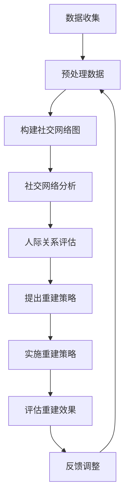

                 

### 文章标题

数字化时代重建人际关系：寻找真实连接的新途径

#### 关键词
- 数字化时代
- 人际关系
- 真实连接
- 重建策略
- 社交网络分析

#### 摘要
本文深入探讨了数字化时代背景下人际关系的挑战与重建策略。首先，我们分析了数字化时代的社会变革以及人际关系所面临的挑战，提出了重建人际关系的必要性。随后，我们详细解析了人际关系的核心概念与真实连接的定义，并通过对比数字化工具与人际关系的互动，揭示了数字化人际关系的局限。在此基础上，我们介绍了人际关系重建的核心要素，包括人际关系的基本类型、多层次结构及其实现途径。本文的核心目标是寻找新途径，通过技术手段重建真实的人际关系，以应对数字化时代的挑战。

## 第一部分：背景介绍

### 第1章：数字化时代人际关系的挑战

### 1.1 问题背景

#### 1.1.1 数字化时代的社会变革

数字化时代带来了前所未有的社会变革。互联网的普及、移动设备的广泛应用以及大数据和人工智能技术的迅猛发展，改变了人们的生活方式、工作方式乃至人际关系。虚拟现实、增强现实、物联网等新兴技术的出现，进一步加速了这一变革进程。人们不再局限于面对面的交流，而是依赖于电子邮件、即时通讯工具、社交媒体等数字平台进行沟通和互动。

#### 1.1.2 人际关系面临的挑战

然而，数字化时代的到来也带来了人际关系的一系列挑战。首先，虚拟沟通的局限性使得人们难以建立深度的人际关系。虽然数字平台提供了便捷的沟通渠道，但缺乏面对面交流时的非语言信息和情感互动，容易导致沟通的表面化和浅薄化。其次，社交媒体的过度使用可能导致人们的现实社交能力下降，增加了孤独感和社交焦虑。此外，信息过载和隐私泄露问题也严重影响了人际关系的稳定性和信任度。

#### 1.1.3 重建人际关系的必要性

面对这些挑战，重建人际关系显得尤为重要。真实连接是人际关系的基础，而数字化时代的人际关系往往缺乏这种真实性和深度。因此，我们需要探索新的途径，利用数字化技术来弥补这一缺陷，重建真实、稳定和有意义的人际关系。这不仅有助于提升个体的心理健康，也有助于构建更加和谐、稳定和可持续的社会环境。

### 1.2 核心概念

#### 1.2.1 人际关系的定义

人际关系是指个体在相互交往过程中形成的心理、情感和行为上的联系。这种联系可以是亲密的，如家庭关系、友谊；也可以是正式的，如同事关系、客户关系。人际关系的特点包括互动性、互惠性和动态性。互动性指的是个体之间的相互影响；互惠性指的是双方在互动过程中获得利益；动态性指的是关系随着时间和情境的变化而不断演变。

#### 1.2.2 真实连接的概念

真实连接是指人与人之间基于真诚、信任和情感的深度互动。它超越了表面化的交流和形式的互动，关注个体的内在需求和情感体验。真实连接需要时间和精力的投入，通过面对面的交流、倾听、理解和共情来实现。真实连接不仅有助于建立深厚的人际关系，还能提升个体的幸福感和满足感。

#### 1.2.3 数字化时代人际关系的特征

在数字化时代，人际关系呈现出一些新的特征。首先，虚拟性是数字化时代人际关系最明显的特征之一。人们通过虚拟平台进行沟通和互动，缺乏面对面的真实体验。其次，广泛性使得人们可以轻松地与全球的个体建立联系，但同时也增加了人际关系的复杂性。最后，即时性使得沟通更加便捷，但也可能导致信息过载和注意力分散。

### 1.3 边界与外延

#### 1.3.1 数字化人际关系的局限性

尽管数字化技术为人际关系带来了便利，但数字化人际关系也存在明显的局限性。首先，虚拟沟通缺乏非语言信息和情感互动，难以建立深度的人际关系。其次，社交媒体的过度使用可能导致现实社交能力的下降，增加孤独感和社交焦虑。此外，信息过载和隐私泄露问题也严重影响了人际关系的稳定性和信任度。

#### 1.3.2 人际关系重建的目标与范围

人际关系重建的目标是克服数字化人际关系的局限性，重建真实、稳定和有意义的人际关系。这需要从多个方面入手，包括提高个体的沟通能力、增强情感互动、建立信任机制等。人际关系重建的范围涵盖了家庭、职场、社区等多个领域。

#### 1.3.3 人际关系重建的边界

在重建人际关系的过程中，需要明确一些边界。首先，重建人际关系不能完全依赖数字化工具，而应结合线下活动和面对面交流。其次，重建过程需要尊重个体的隐私和选择，避免侵犯他人的权益。最后，重建人际关系应注重平衡，避免过度依赖数字化工具而忽视现实生活中的社交互动。

### 1.4 核心要素组成

#### 1.4.1 人际关系的核心要素

人际关系的核心要素包括信任、沟通、理解和支持。信任是人际关系的基础，没有信任，关系就会脆弱。沟通是建立和维护关系的桥梁，有效的沟通能增进相互理解。理解意味着站在对方的角度思考问题，共情对方的情感体验。支持则是在对方需要帮助时提供帮助，共同面对困难和挑战。

#### 1.4.2 数字化工具与人际关系的互动

数字化工具在人际关系中起到了重要的辅助作用。例如，社交媒体平台提供了便捷的沟通渠道，电子邮件和即时通讯工具使得沟通更加高效。然而，数字化工具也存在一些局限，如缺乏情感互动、信息过载等。因此，在使用数字化工具时，需要适度，避免过度依赖。

#### 1.4.3 真实连接的实现途径

实现真实连接的关键在于增加情感互动和时间投入。通过面对面交流、倾听、理解和共情，可以建立深度的人际关系。此外，定期进行线下活动和社交聚会，也有助于增强真实连接。

### 1.5 本章小结

本章从数字化时代的社会变革、人际关系面临的挑战、核心概念、边界与外延以及核心要素组成等方面，全面介绍了数字化时代重建人际关系的背景和必要性。下一章将深入探讨人际关系的核心概念和真实连接的定义，分析数字化工具在人际关系中的作用和影响。

## 第二部分：核心概念与联系

### 第2章：人际关系的核心概念解析

### 2.1 人际关系的概念解析

#### 2.1.1 人际关系的定义与特征

人际关系是指个体在社会交往过程中形成的心理、情感和行为上的联系。这种联系具有以下几个特征：

1. **互动性**：个体之间的相互影响是人际关系的基本特征。每个人都在互动中扮演不同的角色，通过沟通、交流、合作和竞争来维持和发展关系。

2. **互惠性**：在健康的人际关系中，双方都能从互动中获得利益，无论是情感上的满足还是资源上的交换。

3. **动态性**：人际关系不是静态的，而是随着时间和情境的变化而不断演变。它可能从陌生到熟悉，从疏远到亲密，或者从积极到消极。

#### 2.1.2 人际关系的多层次结构

人际关系可以分为多个层次，每个层次都有其独特的特征和功能：

1. **表面层次**：这是最基础的层次，主要涉及表面化的互动，如礼貌性的问候和简单的交流。

2. **社交层次**：这一层次涉及更深入的社交互动，包括共同兴趣、活动和社交网络的建立。

3. **情感层次**：在这一层次，个体之间的关系更加亲密，情感互动更加频繁和深入。

4. **亲密层次**：这是人际关系中最深层次的互动，涉及深刻的情感连接和信任。

#### 2.1.3 人际关系的基本类型

根据关系的性质和特征，人际关系可以分为以下几种基本类型：

1. **家庭关系**：包括父母、子女、配偶等家庭成员之间的关系，通常是人际关系中最重要的一部分。

2. **友谊关系**：基于共同兴趣、价值观和情感支持的关系，通常在社交层次和情感层次之间。

3. **职场关系**：包括同事、上司和下属之间的关系，通常涉及任务合作和职业发展。

4. **社会关系**：包括社区成员、慈善团体和志愿者组织等，通常涉及社会服务和公共事务。

### 2.2 真实连接的概念解析

#### 2.2.1 真实连接的定义

真实连接是指人与人之间基于真诚、信任和情感的深度互动。它超越了表面化的交流和形式的互动，关注个体的内在需求和情感体验。真实连接的特征包括：

1. **真诚性**：个体在互动中能够真实地表达自己的情感和想法，不隐藏或伪装。

2. **信任性**：个体在互动中能够建立相互信任，相信对方会遵守承诺并支持自己的需求。

3. **情感性**：个体在互动中能够体验到深刻的情感共鸣和情感连接。

#### 2.2.2 真实连接的重要性

真实连接在人际关系中具有重要性，主要体现在以下几个方面：

1. **心理健康**：真实连接有助于提升个体的心理健康，减少焦虑和抑郁。

2. **情感满足**：真实连接能够满足个体的情感需求，提升个体的幸福感和满足感。

3. **社会支持**：真实连接提供了强有力的社会支持，有助于个体在面临困难和挑战时获得帮助。

#### 2.2.3 真实连接的表现形式

真实连接可以通过多种形式表现出来，包括：

1. **面对面的交流**：这是最传统但最有效的真实连接形式，通过眼神交流、肢体语言和情感表达来建立深度联系。

2. **倾听和理解**：在沟通中倾听对方的想法和感受，并对其表达理解和支持。

3. **情感共鸣**：在互动中能够感受到对方的情感体验，并产生共鸣。

4. **共同经历**：通过共同的活动和经历来加深情感联系，如旅行、共同工作或参加社交活动。

### 2.3 数字化工具与人际关系的互动

#### 2.3.1 数字化工具在人际关系中的作用

数字化工具在人际关系中起到了重要的辅助作用，包括：

1. **提高沟通效率**：通过电子邮件、即时通讯工具和社交媒体，人们可以随时随地与他人沟通，减少了沟通的时间和成本。

2. **拓宽社交圈**：社交媒体平台使人们能够与全球的个体建立联系，扩大了社交网络。

3. **提供信息支持**：数字化工具可以帮助人们获取各种信息资源，支持学习、工作和生活。

#### 2.3.2 数字化工具的优势与局限

尽管数字化工具在人际关系中具有很多优势，但它们也存在一些局限：

1. **缺乏情感互动**：虚拟沟通无法传递非语言信息和情感互动，容易导致人际关系的浅薄化。

2. **信息过载**：社交媒体和即时通讯工具的广泛使用可能导致信息过载，影响个体的注意力和心理健康。

3. **隐私泄露**：数字化工具的使用可能导致个人隐私的泄露，增加社交风险。

#### 2.3.3 数字化工具对人际关系的影响

数字化工具对人际关系的影响是多方面的，包括：

1. **人际关系的变革**：数字化工具改变了人际关系的形态和模式，使虚拟关系成为人际关系的一部分。

2. **社交能力的挑战**：过度依赖数字化工具可能导致个体的现实社交能力下降，增加孤独感和社交焦虑。

3. **隐私和信任的挑战**：数字化工具的使用增加了隐私泄露和信任危机的风险。

### 2.4 概念属性特征对比表格

为了更好地理解人际关系的核心概念和真实连接的特征，我们可以通过以下表格进行对比：

| 概念       | 定义与特征                   | 重要性                   | 表现形式                          |
|------------|------------------------------|--------------------------|----------------------------------|
| 人际关系   | 个体的心理、情感和行为联系   | 基础联系，影响心理健康 | 互动性、互惠性、动态性              |
| 真实连接   | 真诚、信任和情感的深度互动   | 维系人际关系的核心     | 面对面交流、倾听、理解、情感共鸣      |
| 数字化工具 | 提供沟通和互动的平台         | 辅助作用，提高效率     | 电子邮件、即时通讯、社交媒体等       |

### 2.5 ER实体关系图架构

为了更清晰地展示人际关系的核心概念和真实连接的互动关系，我们可以使用ER（实体关系）图来表示。以下是一个简化的ER图示例：

```mermaid
erDiagram
    User ||--|{ Message } : sends
    User ||--|{ Relationship } : has
    Message ||--|{ Content } : contains
    Relationship ||--|{ Interaction } : involves
```

在这个ER图中，`User`表示个体，`Message`表示沟通内容，`Relationship`表示人际关系，`Content`表示沟通的内容，`Interaction`表示互动。

### 2.6 本章小结

本章详细解析了人际关系的核心概念和真实连接的定义，探讨了数字化工具在人际关系中的作用和影响。通过对比人际关系的多层次结构和基本类型，以及真实连接的重要性和表现形式，我们为进一步探索数字化时代的人际关系重建提供了理论基础。下一章将深入探讨人际关系重建的算法原理和实现策略。

## 第三部分：算法原理与模型设计

### 第3章：人际关系重建算法原理

### 3.1 算法概述

#### 3.1.1 人际关系重建算法的重要性

在数字化时代，人际关系面临着前所未有的挑战。传统的人际关系重建方法已经难以适应这种新的社会环境，因此需要新的算法来有效重建人际关系。人际关系重建算法的核心目标是通过技术手段，克服数字化人际关系的局限性，实现真实、稳定和有意义的人际连接。这不仅在心理健康层面具有重要意义，也有助于构建更加和谐、稳定和可持续的社会环境。

#### 3.1.2 人际关系重建算法的基本框架

人际关系重建算法的基本框架包括以下几个关键步骤：

1. **数据收集**：收集社交网络数据，包括个体的基本信息、互动记录、情感状态等。
2. **预处理数据**：对收集的数据进行清洗、去重和标准化处理，为后续分析提供准确的数据基础。
3. **社交网络分析**：构建社交网络图，分析个体的社交结构和互动模式。
4. **人际关系评估**：评估个体之间的关系质量，识别潜在的问题和不足。
5. **提出重建策略**：根据评估结果，提出有针对性的重建策略。
6. **实施重建策略**：通过社交活动、沟通引导和数字化工具的使用，实施重建策略。
7. **评估重建效果**：对重建效果进行评估，调整策略以实现持续优化。

#### 3.1.3 人际关系重建算法的评估指标

评估人际关系重建算法的效果需要一系列指标，包括：

1. **关系质量**：通过情感指标、互动频率和满意度等来衡量。
2. **社交网络密度**：衡量社交网络的紧密程度和连接强度。
3. **个体心理健康**：通过心理健康问卷、情感状态分析等来评估。
4. **隐私保护**：确保重建过程中个人隐私得到有效保护。
5. **资源消耗**：评估算法的计算资源和能源消耗，优化算法效率。

### 3.2 算法原理讲解

#### 3.2.1 社交网络分析

社交网络分析是人际关系重建算法的基础，它通过构建社交网络图来分析个体的社交结构和互动模式。社交网络图由节点（代表个体）和边（代表互动关系）构成，可以用于识别社交网络中的关键个体、社区结构、中心性等特征。

1. **节点和边的定义**：

   - **节点**：社交网络图中的每个节点代表一个个体，具有属性如年龄、性别、职业等。
   - **边**：节点之间的边表示个体之间的互动关系，可以是单向的或双向的，具有权重，如互动频率、互动强度等。

2. **关键概念**：

   - **度数**：节点拥有的边数，表示节点的直接互动伙伴数量。
   - **中心性**：衡量节点在社交网络中的重要程度，包括度数中心性、介数中心性和紧密中心性。
   - **社区结构**：社交网络中的紧密连接子图，表示具有共同特征和互动模式的个体群体。

#### 3.2.2 人际关系评估模型

人际关系评估模型用于评估个体之间的关系质量，包括情感连接强度、信任度、互动频率等方面。该模型通过以下步骤实现：

1. **数据收集**：收集个体的互动记录、情感表达、共同活动等数据。
2. **特征提取**：从数据中提取反映关系质量的特征，如互动频率、情感表达强度、共同活动频率等。
3. **模型训练**：使用机器学习算法，如回归分析、聚类分析、深度学习等，训练人际关系评估模型。
4. **关系评估**：将个体的互动数据输入模型，得到个体之间的关系质量评分。

#### 3.2.3 真实连接增强算法

真实连接增强算法旨在通过技术手段增强个体之间的真实连接。该算法包括以下几个关键步骤：

1. **识别潜在问题**：通过社交网络分析和人际关系评估，识别社交网络中存在的问题，如孤立节点、关系薄弱等。
2. **提出解决方案**：根据识别的问题，提出有针对性的解决方案，如增加互动机会、促进情感交流、建立信任机制等。
3. **实施策略**：通过社交活动、沟通引导和数字化工具的使用，实施增强策略。
4. **反馈调整**：根据实施效果进行反馈调整，优化策略以实现持续优化。

### 3.3 算法mermaid流程图

为了更好地展示人际关系重建算法的流程，我们使用mermaid绘制了以下流程图：



### 3.4 Python源代码实现

为了展示算法的具体实现，我们提供了一个简化的Python代码示例，用于社交网络数据预处理、社交网络图构建、社交网络分析等步骤。

```python
import networkx as nx
import pandas as pd

# 示例代码：数据收集
data = pd.DataFrame({
    'user_id': [1, 2, 3, 4],
    'friend_id': [2, 3, 4, 1],
    'interaction_count': [10, 15, 20, 10]
})

# 示例代码：预处理数据
data = data.drop_duplicates().reset_index(drop=True)

# 示例代码：构建社交网络图
G = nx.Graph()
for index, row in data.iterrows():
    G.add_edge(row['user_id'], row['friend_id'], weight=row['interaction_count'])

# 示例代码：社交网络分析
degree_distribution = nx.degree_centrality(G)
print(degree_distribution)

# 示例代码：人际关系评估
# 此处可以集成机器学习模型进行评估
# ...

# 示例代码：提出重建策略
# 根据分析结果，提出有针对性的重建策略
# ...

# 示例代码：实施重建策略
# 实施具体的重建策略，如增加互动机会等
# ...

# 示例代码：评估重建效果
# 根据实施效果进行评估，调整策略
# ...
```

通过以上示例代码，我们可以看到人际关系重建算法的实现步骤和数据流程。接下来，我们将进一步探讨算法的数学模型和公式，以及如何通过这些技术手段实现真实连接的增强。

