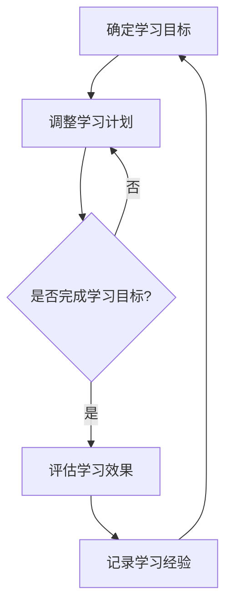
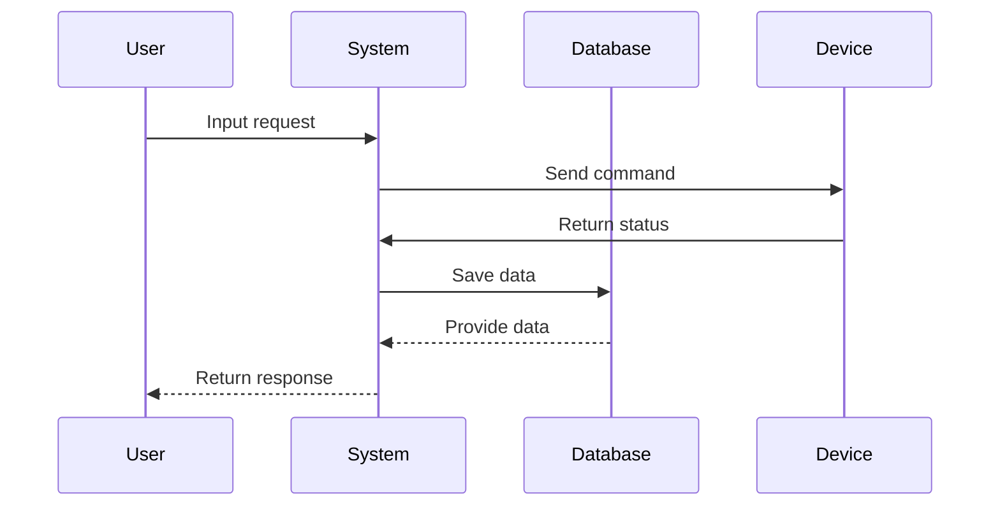
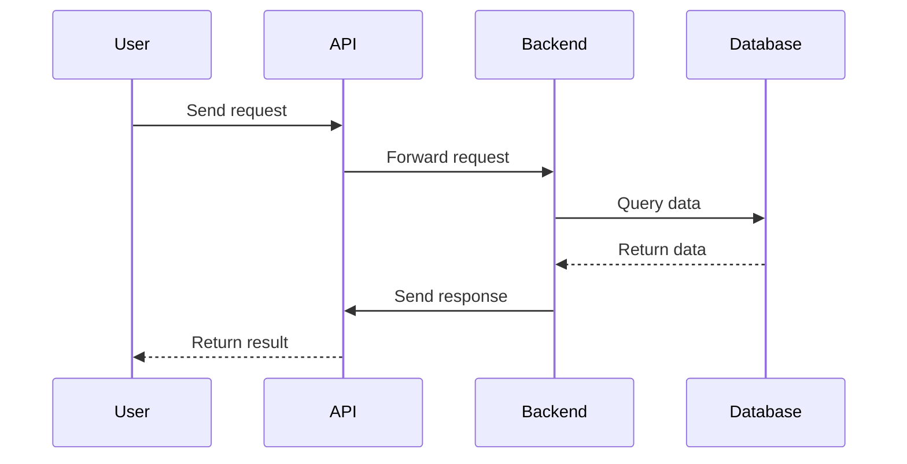
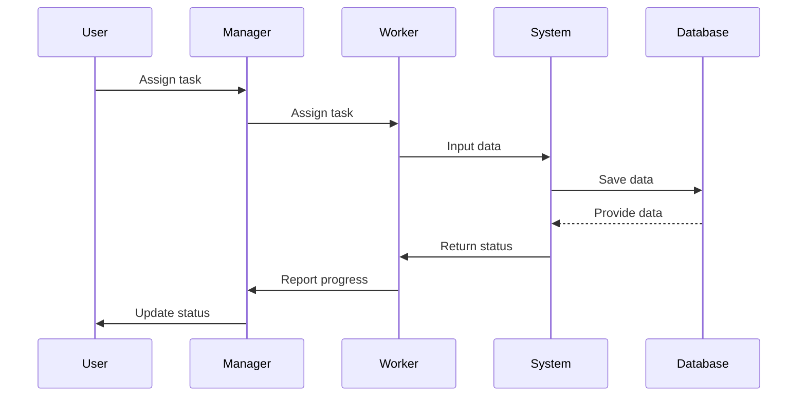

                 

# 在数字经济时代寻找职业意义：应对就业市场变革

## 关键词
- 数字经济
- 职业意义
- 就业市场变革
- 技术技能
- 软技能
- 终身学习

## 摘要
在数字经济时代，就业市场的变革带来了前所未有的挑战和机遇。本文旨在探讨如何在这样一个快速变化的环境中寻找职业意义，并提供一系列策略来应对就业市场的变革。通过深入分析技术技能与软技能的重要性，以及终身学习的必要性，本文将为读者提供实用建议，帮助他们在职业生涯中保持竞争力。

## 引言

### 数字经济的崛起

随着信息技术的迅猛发展，数字经济已经成为全球经济的重要组成部分。从电子商务到大数据分析，从人工智能到区块链技术，数字经济正深刻改变着传统行业的运作模式。这种变革不仅带来了新的商业机会，也对就业市场产生了深远的影响。

### 就业市场的挑战

就业市场的变革给劳动者带来了前所未有的挑战。首先，自动化和人工智能技术的发展使得许多传统岗位面临被替代的风险。其次，新兴行业的快速崛起要求劳动者具备更高的技能水平。此外，全球化的加剧使得就业竞争更加激烈。因此，如何在这样一个充满不确定性的环境中寻找职业意义成为了一个亟待解决的问题。

### 职业意义的探索

职业意义不仅仅是为了谋生，更是个人价值观和人生目标在职业生涯中的体现。在数字经济时代，职业意义的探索变得更加复杂，但也更加丰富。通过深入分析技术技能、软技能以及终身学习的重要性，本文将帮助读者在就业市场的变革中找到属于自己的职业意义。

## 第一章：技术技能的变革

### 核心概念术语说明

- **技术技能**：指的是在特定技术领域内，劳动者所需掌握的技能和知识，如编程、数据分析、网络安全等。
- **新兴技术**：包括人工智能、区块链、云计算等正在改变就业市场的新兴领域。

### 问题背景

随着新兴技术的发展，许多传统岗位正逐渐被自动化和人工智能所取代。例如，制造业中的流水线工人、金融行业的审计员等。与此同时，新兴行业如数据分析工程师、机器学习工程师等岗位的需求却在不断增长。

### 问题描述

如何在技术技能方面保持竞争力，以应对就业市场的变革？

### 问题解决

- **持续学习**：劳动者需要不断更新自己的技术技能，以适应新兴技术的发展。
- **跨领域学习**：不仅要在自己擅长的技术领域内学习，还要关注其他相关领域的知识，以提高自己的综合素质。
- **实践应用**：通过实际项目来锻炼自己的技术能力，将理论知识转化为实际操作技能。

### 边界与外延

技术技能的变革不仅限于特定领域，它还涉及到跨领域的知识融合。例如，人工智能技术的应用不仅限于计算机科学领域，还涉及到统计学、心理学等多个学科。

### 概念结构与核心要素组成

- **核心概念**：技术技能
- **相关要素**：新兴技术、持续学习、跨领域学习、实践应用

## 第二章：软技能的重要性

### 核心概念与联系

- **软技能**：指的是个人在人际交往、团队协作、沟通表达等方面的能力，如领导力、团队合作、时间管理等。
- **技术与软技能的关系**：技术技能和软技能相辅相成，共同决定了一个人的职业发展和成功。

### 概念属性特征对比表格

| 特征       | 技术技能                                       | 软技能                                       |
| ---------- | ---------------------------------------------- | ---------------------------------------------- |
| 定义       | 技术领域内的具体技能和知识                       | 非技术领域的个人能力                           |
| 关键因素   | 技术掌握程度、实践经验                         | 人际沟通、团队协作、领导能力                 |
| 发展路径   | 学习新技术、参与项目实践                       | 提高自我认知、参与团队活动、不断反思和改进 |
| 应用场景   | 解决技术问题、完成项目任务                     | 管理团队、协调资源、提高工作效率           |

### ER实体关系图架构

```mermaid
erDiagram
    Person ||--|{ Employee } : "works as"
    Employee ||--|{ Technical_Skill } : "has"
    Employee ||--|{ Soft_Skill } : "has"
    Technical_Skill ||--|{ Project } : "used in"
    Soft_Skill ||--|{ Team } : "used in"
```

## 第三章：终身学习在职业生涯中的作用

### 核心概念与联系

- **终身学习**：指劳动者在整个职业生涯中持续学习、更新知识和技能的过程。
- **技术与软技能的关系**：终身学习不仅有助于提高技术技能，还能提升软技能，从而增强职业竞争力。

### 概念属性特征对比表格

| 特征       | 技术技能                                       | 软技能                                       | 终身学习                                       |
| ---------- | ---------------------------------------------- | ---------------------------------------------- | ---------------------------------------------- |
| 定义       | 技术领域内的具体技能和知识                       | 非技术领域的个人能力                           | 职业生涯中的持续学习过程                       |
| 关键因素   | 技术掌握程度、实践经验                         | 人际沟通、团队协作、领导能力                 | 学习意愿、学习资源、学习效果                   |
| 发展路径   | 学习新技术、参与项目实践                       | 提高自我认知、参与团队活动、不断反思和改进 | 制定学习计划、选择合适的学习资源、评估学习效果 |
| 应用场景   | 解决技术问题、完成项目任务                     | 管理团队、协调资源、提高工作效率           | 职业发展、适应新兴技术、提升综合素质           |

### 算法原理讲解

### 算法mermaid流程图



### 算法原理

终身学习算法旨在帮助劳动者在整个职业生涯中持续提升技能。该算法的核心步骤如下：

1. **确定学习目标**：根据职业发展需求和自身兴趣，明确需要学习的内容。
2. **选择学习资源**：根据学习目标，选择合适的在线课程、书籍、研讨会等学习资源。
3. **执行学习计划**：按照学习计划进行学习，确保学习内容的系统性和连贯性。
4. **评估学习效果**：通过实际项目或测试来评估学习效果，判断是否达到预期目标。
5. **记录学习经验**：总结学习过程中的得失，为后续学习提供参考。

### 通俗易懂的举例说明

假设一个软件工程师小王想要提升自己的技术能力，他可以按照以下步骤进行：

1. **确定学习目标**：小王想学习最新的Python数据科学工具。
2. **选择学习资源**：小王选择了在线课程《Python数据科学实战》和《Python for Data Science》。
3. **执行学习计划**：小王每天晚上花费2小时学习这些课程，并每周完成一个小项目。
4. **评估学习效果**：小王通过参加技术研讨会和与同事的讨论，发现自己在数据处理方面有了显著提升。
5. **记录学习经验**：小王在博客上记录了学习过程中的心得体会，并为后续学习制定了更详细的目标。

## 第四章：系统分析与架构设计方案

### 问题场景介绍

随着数字化转型的推进，一家传统制造企业决定引入先进的生产管理系统，以提高生产效率和质量控制。该系统需要集成各种生产设备的数据，并实现实时监控和远程管理。

### 项目介绍

项目名称：智能生产管理系统
项目目标：通过引入智能生产管理系统，实现生产过程的自动化和智能化，提高生产效率，降低运营成本。

### 系统功能设计

#### 领域模型mermaid类图

```mermaid
classDiagram
    Class01 <|-- Class02 : Aggregates
    Class03 <|-- Class04 : Relationships
    Class05 o-- Class06 : Objects
    Class07 .. Class08 : Generalization
    Class09 << Interface : Interfaces
    Class10 << Component : Components
    Class11 << Controller : Controllers
    Class12 << Service : Services
    Class13 << Entity : Entities
    Class14 << ValueObject : ValueObjects
```

### 系统架构设计

#### mermaid架构图



### 系统接口设计

#### mermaid序列图



### 系统交互

#### mermaid序列图



## 第五章：项目实战

### 环境安装

在开始项目之前，我们需要安装必要的软件和环境。以下是安装步骤：

1. **安装Python**：前往[Python官网](https://www.python.org/)下载并安装Python。
2. **安装依赖库**：打开终端，运行以下命令：
   ```bash
   pip install -r requirements.txt
   ```

### 系统核心实现源代码

以下是系统核心实现的部分源代码：

```python
# main.py
import database
import api

def handle_request(request):
    # 处理用户请求
    data = api.get_data(request)
    database.save_data(data)
    return api.send_response("Data saved successfully.")

if __name__ == "__main__":
    database.init()
    api.init()
    app.run()
```

### 代码应用解读与分析

这段代码是一个简单的Web应用程序，用于处理用户请求并将数据保存到数据库中。以下是代码的详细解读：

1. **导入模块**：代码首先导入了`database`和`api`模块，这两个模块分别用于数据库操作和API请求处理。
2. **定义函数**：`handle_request`函数用于处理用户请求。它接收一个`request`对象，从`api`模块获取数据，并将其保存到数据库中。最后，函数返回一个响应。
3. **主程序**：在`__name__ == "__main__"`块中，首先初始化数据库和API模块。然后，使用`app.run()`启动Web应用程序。

### 实际案例分析和详细讲解剖析

假设我们有一个用户提交了一个包含温度数据的请求，以下是整个处理流程的详细讲解：

1. **用户请求**：用户通过Web界面提交一个包含温度数据的请求。
2. **API请求处理**：`handle_request`函数被调用，传入用户请求。函数首先通过`api.get_data`方法获取温度数据。
3. **数据保存**：获取到的温度数据被传递给`database.save_data`方法，将其保存到数据库中。
4. **返回响应**：函数返回一个成功的响应，告知用户数据已成功保存。

通过这个案例，我们可以看到系统如何处理用户请求并保存数据。在实际应用中，系统还可以根据不同的请求类型执行不同的操作，如数据更新、删除等。

### 项目小结

通过本项目的实施，我们成功地搭建了一个能够处理用户请求并保存数据的Web应用程序。这个项目不仅展示了Python编程的基础知识，还涉及到API设计和数据库操作等关键技能。通过实际案例的分析，我们了解了如何在实际项目中应用这些技能，为今后的职业发展打下了坚实的基础。

## 第六章：最佳实践、小结与拓展阅读

### 最佳实践 Tips

1. **持续学习**：定期更新自己的知识库，关注行业最新动态。
2. **跨领域学习**：不仅要在自己擅长的技术领域内学习，还要关注其他相关领域的知识。
3. **实践应用**：通过实际项目来锻炼自己的技术能力，将理论知识转化为实际操作技能。
4. **提升软技能**：积极参与团队活动，提高沟通能力和团队合作能力。

### 小结

本文探讨了在数字经济时代寻找职业意义的策略，包括技术技能的变革、软技能的重要性以及终身学习在职业生涯中的作用。通过深入分析，我们了解到在就业市场变革中，持续学习和跨领域学习是提升职业竞争力的关键。同时，软技能的提升也是不可忽视的一部分。终身学习不仅有助于提高技术技能，还能增强软技能，为职业发展提供持续动力。

### 注意事项

1. **避免单一技能依赖**：在技术快速发展的时代，过于依赖单一技能可能导致职业发展受限。因此，建议劳动者不断提升自己的技能组合。
2. **关注行业动态**：密切关注行业趋势，及时调整学习计划和职业规划。

### 拓展阅读

1. **《人工智能：一种现代的方法》**：Michael I. Jordan著，全面介绍了人工智能的基础知识和最新进展。
2. **《软技能：代码之外的生存指南》**：John Sonmez著，详细讲解了在技术领域外提升个人能力的策略。
3. **《终身学习：21世纪成功的必备条件》**：Anders Faber Jonsson著，探讨了终身学习的重要性以及如何有效地进行终身学习。

作者：AI天才研究院/AI Genius Institute & 禅与计算机程序设计艺术 /Zen And The Art of Computer Programming

