                 

### 第一部分：引言

在当今的数字经济时代，全球正经历着前所未有的变革，这不仅影响了商业模式，也对就业市场产生了深远的影响。#1 数字经济时代概览

首先，我们需要了解什么是数字经济。数字经济是指以数字化的信息和知识为关键生产要素、以现代信息网络为重要载体、以信息通信技术的有效利用为驱动的新型经济形态。#2 经济数字化转型

数字经济的特点包括：快速、高效、全球化、智能化和持续创新。这些特点不仅推动了传统产业的数字化转型，还催生了众多新兴产业，如电子商务、在线教育、远程办公等。#3 数字经济的特点与趋势

在就业市场中，数字经济时代的到来带来了显著的变化。首先，许多传统职业正逐渐被自动化和人工智能技术取代，这要求劳动者必须具备新的技能和知识。#4 就业市场变革

此外，随着新兴产业的崛起，许多新的职业岗位也随之产生，这些岗位需要跨领域的技能和创新能力。#5 职业发展的挑战与趋势

职业意义的重要性不言而喻。职业意义不仅仅是一个工作的名称或职责，它更多地涉及到个人在社会中的价值实现和自我认同。对个人而言，职业意义可以带来满足感、成就感和幸福感。对社会而言，职业意义则是社会稳定和进步的重要基石。#6 职业意义的定义与价值

因此，在数字经济时代，重新审视职业意义，找到适合自己的职业道路，不仅是个人的需求，也是应对就业市场变革的重要策略。#7 职业意义的重要性与本书目标

本文旨在通过逐步分析数字经济时代的职业挑战与机遇，探讨职业意义的重要性，提供职业素养培养的策略，并通过案例分析，为职业发展提供实用的指导和建议。#8 本书的目标与结构

本文将按照以下结构进行论述：

1. 数字经济时代概览
2. 就业市场变革
3. 职业意义的重要性
4. 本书目标

### 1. 数字经济时代概览

数字经济作为一种新兴的经济形态，正在全球范围内迅速崛起，并对各行各业产生深远影响。为了深入理解数字经济，我们需要先了解其背后的关键概念和核心特征。

首先，什么是数字经济？数字经济可以被定义为以数字化的信息和知识作为关键生产要素，以现代信息网络作为重要载体，以信息通信技术的有效利用为驱动的新型经济形态。它不仅仅涉及互联网和电子商务，还涵盖了物联网、大数据、人工智能等新兴技术。#2.1 数字经济的定义与核心特征

数字经济的核心特征主要包括以下几个方面：

1. **快速性**：数字技术使得信息传播和处理速度大大提高，从而加速了市场反应和决策过程。无论是电子商务平台的实时交易，还是物联网设备的即时数据反馈，都体现了数字经济的快速性。#2.2 数字经济的快速性

2. **高效性**：数字化技术和自动化工具的应用，使得生产、分配和消费过程变得更加高效。例如，通过云计算和大数据分析，企业可以优化供应链管理，提高运营效率。#2.3 数字经济的高效性

3. **全球化**：互联网的普及打破了地域限制，使得企业和个人能够轻松地进行跨国交易和合作。数字经济不仅促进了国际贸易，还促进了全球范围内的知识共享和技术创新。#2.4 数字经济的全球化

4. **智能化**：人工智能、机器学习和大数据分析等技术的广泛应用，使得数字经济具有高度的智能化特征。智能化的应用场景从智能助手、自动驾驶汽车，到智能工厂和智慧城市，无处不在。#2.5 数字经济的智能化

5. **持续创新**：数字经济的特点之一是其不断演进和更新，新技术、新商业模式和新业态层出不穷。这种持续创新不仅推动了经济增长，也为劳动者提供了更多的职业机会。#2.6 数字经济的持续创新

在数字经济中，技术的作用尤为重要。信息技术、互联网技术和物联网技术的不断进步，不仅推动了数字经济的快速发展，还改变了传统的商业模式和就业形态。例如，云计算技术的普及使得企业可以更灵活地管理和扩展其IT资源，大数据分析技术则为企业提供了洞察市场趋势和消费者行为的强大工具。#2.7 技术在数字经济中的作用

数字经济对全球经济的影响也是显而易见的。首先，它推动了全球范围内的经济增长。根据国际数据公司（IDC）的统计数据，全球数字经济总量已经超过了传统经济，成为经济增长的主要驱动力。#2.8 数字经济对全球经济增长的贡献

其次，数字经济促进了全球贸易的发展。电子商务平台的兴起，使得商品和服务的交易更加便捷和全球化。例如，亚马逊和阿里巴巴等电商巨头，不仅改变了消费者的购物方式，还推动了全球供应链的整合和优化。#2.9 数字经济对全球贸易的影响

此外，数字经济还促进了知识共享和技术创新。在全球范围内，研究人员和开发者可以通过互联网共享研究成果和开发资源，从而加速技术的进步和应用。#2.10 数字经济对知识共享和技术创新的影响

总的来说，数字经济作为一种新兴的经济形态，具有快速、高效、全球化、智能化和持续创新等核心特征。它不仅改变了传统的商业模式和就业形态，还对全球经济产生了深远的影响。理解数字经济的本质和特征，对于我们把握未来的职业发展机会和应对就业市场的变革至关重要。

### 1.2 就业市场变革

随着数字经济的快速发展，就业市场也经历了深刻的变革。这种变革不仅体现在职业岗位的增减和职业结构的变化上，更体现在对劳动者的技能需求和教育培训方式的转变上。理解这些变革对于我们在数字经济时代找到职业意义至关重要。

首先，我们来看看数字经济时代职业发展的挑战。随着自动化和人工智能技术的广泛应用，许多传统职业正逐渐被机器取代。例如，工厂中的流水线工人、数据输入员和仓储管理员的岗位正逐渐被机器人替代。这不仅导致了许多传统职业的消失，也对劳动者的技能提出了新的要求。劳动者需要不断学习新的技能，以适应快速变化的工作环境。#3.1 自动化与人工智能对职业的影响

此外，数字经济时代的职业发展也面临着更多的竞争和不确定性。新兴产业的崛起和传统产业的数字化转型，使得职业岗位的数量和性质不断变化，许多职业可能很快就会被新的技术或模式取代。这种变化要求劳动者具备较强的适应能力和学习能力，以应对不断涌现的职业挑战。#3.2 职业发展的竞争与不确定性

其次，我们需要关注数字经济时代下的就业趋势。首先，技术技能的重要性日益增加。编程、数据分析、人工智能等数字技能成为许多职业的核心竞争力。此外，跨领域的技能也变得越来越重要。例如，产品经理需要同时具备技术、设计和市场知识，项目经理需要具备沟通、协调和管理能力。这种跨领域的技能要求劳动者不仅要精通某一领域的专业知识，还要具备跨领域的综合能力。#3.3 技术技能与跨领域技能的重要性

另外，远程工作和自由职业的趋势也在数字经济时代得到了显著发展。随着互联网和远程办公技术的普及，越来越多的劳动者可以选择在家工作或远程协作。这种工作方式的灵活性不仅提高了劳动者的生活质量，也为企业提供了更广泛的人才选择。然而，这也带来了一些新的挑战，如如何有效管理和监督远程团队，以及如何确保工作效率和质量。#3.4 远程工作与自由职业的趋势

就业市场的变革不仅对劳动者提出了新的要求，也对教育和培训体系产生了深远的影响。首先，传统的学历教育已经无法满足数字经济时代对技能多样性和创新能力的需求。越来越多的企业和教育机构开始提供定制化的培训项目，以满足特定职业领域的需求。例如，许多科技公司和企业纷纷开设编程、数据分析等技术的培训课程，以帮助劳动者快速提升技能。#3.5 教育和培训方式的变革

其次，终身学习成为数字经济时代的重要理念。随着技术的不断更新和职业需求的不断变化，劳动者需要具备持续学习和适应新技能的能力。这种终身学习不仅包括职业相关的技能培训，还包括对新兴技术和行业动态的持续关注和学习。例如，许多劳动者通过在线课程、研讨会和工作坊等形式，不断提升自己的专业技能和知识水平。#3.6 终身学习的重要性

总之，数字经济时代的就业市场变革带来了许多新的挑战和机遇。劳动者需要不断适应新的职业环境，提升技能和跨领域的综合能力，以应对快速变化的就业市场。同时，教育和培训体系也需要不断变革，以适应数字经济时代对人才的需求。理解这些变革，对于我们找到职业意义，实现个人价值和社会贡献具有重要意义。

### 1.3 职业意义的重要性

在数字经济时代，职业意义不仅是个人的需求，更是社会发展的关键要素。首先，我们需要明确职业意义的定义。职业意义不仅仅是一个工作的名称或职责，它更涉及到个人在社会中的价值实现和自我认同。职业意义是指个人通过职业活动实现个人价值、满足自我需求和实现社会贡献的综合体现。#4.1 职业意义的定义

对个人而言，职业意义具有多重价值。首先，职业意义可以带来满足感。当一个人从事自己热爱且擅长的职业时，他们往往能感受到工作中的快乐和成就感。这种满足感不仅来源于物质报酬，更重要的是内心深处的自我实现。其次，职业意义可以提升个人的幸福感。一个有意义的职业可以让人感到自己的生活有价值、有意义，从而提升整体的生活质量。最后，职业意义可以增强个人的自信心和自尊心。通过在职业中取得成就，个人能够获得社会的认可和尊重，从而增强自信心和自尊心。#4.2 职业意义对个人的价值

对社会而言，职业意义同样具有重要意义。首先，职业意义是社会发展的重要基石。一个社会的繁荣和进步离不开每个个体的努力和贡献。当每个人都能够找到并实现自己的职业意义时，整个社会的创造力和活力将大大提升。其次，职业意义有助于社会的稳定。当个体在工作中感到满足和幸福时，他们更愿意积极参与社会事务，维护社会秩序。此外，职业意义还可以促进社会的公平和正义。每个人都有权利追求自己的职业梦想和人生价值，而职业意义的实现可以帮助我们更好地实现这一权利，减少社会不公现象。#4.3 职业意义对社会的价值

在数字经济时代，职业意义的实现面临着新的挑战和机遇。一方面，随着技术的进步和新兴产业的崛起，许多传统职业正在被自动化和人工智能取代，这要求劳动者不断学习和提升自己的技能，以适应新的职业环境。另一方面，数字经济也为劳动者提供了更多的职业选择和发展机会。例如，远程工作和自由职业的兴起，使得劳动者能够更加灵活地选择自己的工作方式和职业路径。此外，数字经济时代的企业和行业更加注重创新和合作，这为劳动者提供了更多实现职业意义的机会。#4.4 数字经济时代职业意义实现的新挑战和机遇

总之，职业意义在数字经济时代具有不可忽视的重要性。它不仅对个人的生活质量和幸福感产生深远影响，也是社会稳定和进步的重要基石。在数字经济时代，我们应当更加重视职业意义的实现，通过不断提升自己的技能和创新能力，找到并实现自己的职业意义，为自己和社会创造更多的价值。

### 1.4 本书目标

本书旨在帮助读者在数字经济时代找到职业意义，应对就业市场的变革。具体来说，本书的目标包括以下几个方面：

首先，提升职业适应能力。随着技术的不断进步和职业需求的不断变化，劳动者需要具备更强的适应能力和学习能力。本书将详细探讨数字经济时代下的职业挑战，提供实用的技能提升策略，帮助读者迅速适应新的职业环境。#5.1 提升职业适应能力

其次，拓展职业发展空间。数字经济时代带来了许多新的职业机会，但同时也带来了竞争和不确定性。本书将通过案例分析，展示成功职业发展的路径，帮助读者了解并利用这些机会，规划自己的职业发展路径。#5.2 拓展职业发展空间

再次，增强职业满意度。职业满意度是劳动者在工作中感受到的满足感和幸福感。本书将探讨职业意义的重要性，并提供提升职业满意度的方法和策略，帮助读者找到并实现自己的职业意义，提升整体生活质量。#5.3 增强职业满意度

最后，本书还旨在为读者提供全面、系统的职业素养培养策略。包括技术技能的培养、跨领域技能的重要性、职业规划的策略、终身学习的态度以及职业素养的全面发展等方面，帮助读者全面提升职业竞争力。#5.4 全面提升职业素养

通过实现这些目标，本书希望帮助读者在数字经济时代找到属于自己的职业意义，实现个人价值和社会贡献。

### 1.5 小结

综上所述，本文首先介绍了数字经济时代的概览，探讨了其核心特征和全球影响。接着，分析了就业市场的变革，包括职业发展的挑战和新兴就业趋势。随后，深入阐述了职业意义的重要性，对个人和社会的价值进行了详细讨论。最后，明确了本书的目标，旨在提升职业适应能力、拓展职业发展空间、增强职业满意度以及全面提升职业素养。理解这些核心概念和目标，将为读者在数字经济时代找到职业意义和应对就业市场变革提供有力支持。

### 第二部分：数字经济时代职业素养

在数字经济时代，职业素养不仅仅是技术技能的积累，更是综合能力的体现。这不仅包括对新技术和跨领域技能的掌握，还涉及职业规划、终身学习以及职业素养的全面发展。本部分将逐步探讨这些关键要素，帮助读者在数字经济时代提升自身职业素养，实现职业发展的成功。

### 2.1 数字技能的培养

在数字经济时代，数字技能已成为职业发展的核心要素。为了在快速变化的就业市场中保持竞争力，劳动者需要不断更新和提升自己的技术技能。以下是培养数字技能的几个关键方面：

#### 2.1.1 技术技能的更新与学习

随着新技术的不断涌现，传统技能可能迅速过时。因此，劳动者需要持续关注技术动态，主动学习新技术和工具。例如，编程语言、数据分析和人工智能等领域的技术发展迅猛，劳动者可以通过在线课程、研讨会和认证项目来不断提升自己的技术水平。#6.1.1 技术技能的更新与学习

##### **编程语言的学习**

编程语言是数字技能的核心，不同编程语言适用于不同的应用场景。例如，Python 和 Java 被广泛应用于软件开发，而 SQL 和 R 则是数据分析和处理的重要工具。劳动者可以根据自己的职业需求和兴趣选择合适的编程语言进行学习。#6.1.1.1 编程语言的选择与学习

##### **数据分析与处理**

数据分析是数字经济时代的重要技能。通过数据分析，企业可以洞察市场趋势、优化业务流程、提高运营效率。掌握数据分析工具和技能，如 Excel、SQL、Python 等，能够帮助劳动者在职场中脱颖而出。#6.1.1.2 数据分析工具与技能

#### 2.1.2 跨领域技能的重要性

数字经济时代的职业发展不仅依赖于单一领域的技能，更需要跨领域的综合能力。跨领域技能包括创新思维、设计思维、项目管理、沟通协作等。这些技能不仅能够帮助劳动者在不同领域之间灵活转换，还能够提升工作效率和团队协作能力。

##### **创新思维与设计思维**

创新思维和设计思维是数字经济时代的重要能力。创新思维鼓励劳动者不断探索新的解决方案，而设计思维则强调以用户为中心，通过迭代和改进实现产品或服务的优化。掌握这些思维方式，能够帮助劳动者在竞争激烈的职场中脱颖而出。#6.1.2.1 创新思维与设计思维的重要性

##### **沟通协作与团队管理**

在远程工作和跨文化协作日益普遍的今天，良好的沟通协作能力显得尤为重要。团队管理技能，如领导力、协调能力和问题解决能力，也是跨领域技能的重要组成部分。这些技能不仅能够提升团队绩效，还能够促进个人职业发展。#6.1.2.2 沟通协作与团队管理技能

### 2.2 职业规划的策略

有效的职业规划是职业发展的关键。在数字经济时代，职业规划需要更具灵活性和前瞻性。以下是一些职业规划的关键策略：

#### 2.2.1 职业定位与自我评估

职业定位是职业规划的第一步。劳动者需要明确自己的兴趣、优势和职业目标，以便找到适合自己的职业路径。自我评估可以通过职业兴趣测试、技能评估和心理测试等方式进行。#6.2.1.1 职业定位与自我评估

##### **兴趣与职业的结合**

将个人兴趣与职业发展相结合，能够提高职业满意度和工作效率。例如，对科技感兴趣的人可以选择从事软件开发或数据分析工作，而对艺术有热情的人则可以从事UI/UX设计。#6.2.1.1.1 兴趣与职业的结合

##### **个人优势与职业发展的匹配**

了解自己的优势并找到与之相匹配的职业，是职业规划的重要环节。个人优势可以是技术技能、沟通能力、领导力或其他方面的能力。通过充分发挥个人优势，劳动者可以提升职业竞争力。#6.2.1.1.2 个人优势与职业发展的匹配

#### 2.2.2 职业路径的选择

职业路径的选择需要考虑当前市场需求、个人职业目标以及职业发展的可持续性。以下是几种常见的职业路径选择策略：

##### **初入职场的职业选择**

对于刚进入职场的年轻人，选择一个具有发展前景且与自己专业相关的职业是非常重要的。例如，计算机科学专业的毕业生可以选择从事软件开发或数据分析工作。#6.2.2.1 初入职场的职业选择

##### **职业转型的策略**

对于已经在职场中工作一段时间的人，职业转型可能是一个重要的选择。成功的职业转型需要明确的职业目标、清晰的转型路径以及持续的学习和提升。例如，从市场营销转型到数据分析领域，需要掌握数据分析工具和技能，以及相关的行业知识。#6.2.2.2 职业转型的策略

### 2.3 终身学习的态度

在数字经济时代，知识的更新速度非常快，劳动者需要具备持续学习和适应新技能的能力。终身学习不仅是一种态度，更是一种生存和发展策略。

#### 2.3.1 数字经济时代的知识更新速度

数字经济时代的一个显著特点是知识的快速更新。新技术、新工具和新方法层出不穷，劳动者必须保持持续学习的状态，才能跟上时代的发展。#6.3.1 数字经济时代的知识更新速度

##### **知识型员工的特点**

在数字经济时代，知识型员工成为职场中的主力军。知识型员工不仅具备专业知识和技能，还具备持续学习和快速适应新环境的能力。这种能力使他们能够在不断变化的就业市场中保持竞争力。#6.3.1.1 知识型员工的特点

##### **持续学习的重要性**

持续学习是数字经济时代劳动者不可或缺的能力。通过持续学习，劳动者可以不断提升自己的技能和知识水平，从而在职业发展中取得更大的成就。#6.3.1.2 持续学习的重要性

#### 2.3.2 学习资源的利用

在数字经济时代，利用好学习资源对于劳动者的持续学习至关重要。以下是几种常用的学习资源：

##### **在线学习平台的应用**

在线学习平台如 Coursera、Udemy 和 edX 等提供了丰富的在线课程和认证项目，劳动者可以通过这些平台学习新技能和知识。#6.3.2.1 在线学习平台的应用

##### **专业社区与学术交流**

专业社区和学术交流为劳动者提供了与同行交流和学习的平台。通过参与专业论坛、研讨会和学术会议，劳动者可以了解最新的行业动态和技术趋势。#6.3.2.2 专业社区与学术交流

### 2.4 职业素养的全面发展

职业素养不仅仅包括技术技能和知识，还涉及职业道德、心理健康和职业心理健康等方面。以下是一些职业素养的全面发展策略：

#### 2.4.1 职业道德与社会责任

职业道德是劳动者在职业生涯中必须遵守的基本原则。遵守职业道德不仅能够提升个人的职业形象，还能为企业和社会创造更大的价值。#6.4.1.1 职业道德的基本原则

##### **社会责任与企业公民意识**

企业公民意识是指企业在追求商业利益的同时，积极参与社会事务，承担社会责任。劳动者应具备这种意识，通过自身的工作为社会做出贡献。#6.4.1.2 社会责任与企业公民意识

#### 2.4.2 职业心理健康

职业心理健康是劳动者在职业生涯中保持良好心理状态的重要保障。有效的压力管理和心理调适，有助于劳动者在职场中保持高效和积极。#6.4.2.1 职业心理健康的重要性

##### **应对工作压力与挑战**

劳动者需要学会应对工作中的压力和挑战，通过科学的方法进行心理调适，保持心理健康。例如，通过运动、冥想和社交活动等方式缓解工作压力。#6.4.2.2 应对工作压力与挑战

##### **心理调适与职业幸福**

心理调适不仅有助于应对工作压力，还能提升职业幸福感。劳动者应注重心理平衡，通过自我激励和积极心态，提高职业满意度。#6.4.2.3 心理调适与职业幸福

### 2.5 小结

数字经济时代的职业素养不仅包括技术技能和跨领域技能的掌握，还需要具备职业规划、终身学习、职业道德和心理健康等多方面的综合能力。通过不断提升这些能力，劳动者可以更好地适应数字经济时代的变化，实现职业发展的成功。理解并实践这些策略，将为读者在数字经济时代的职业发展提供有力支持。

### 2.1 数字技能的培养

在数字经济时代，数字技能的培养是职业发展的核心。随着技术的快速发展，劳动者需要不断更新和提升自己的技术技能，以保持竞争力。以下是培养数字技能的几个关键方面：

#### 2.1.1 技术技能的更新与学习

随着新技术的不断涌现，传统技能可能迅速过时。因此，劳动者需要持续关注技术动态，主动学习新技术和工具。例如，编程语言、数据分析和人工智能等领域的技术发展迅猛，劳动者可以通过在线课程、研讨会和认证项目来不断提升自己的技术水平。

##### **编程语言的学习**

编程语言是数字技能的核心，不同编程语言适用于不同的应用场景。例如，Python 和 Java 被广泛应用于软件开发，而 SQL 和 R 则是数据分析和处理的重要工具。劳动者可以根据自己的职业需求和兴趣选择合适的编程语言进行学习。

**Mermaid 流程图：**  
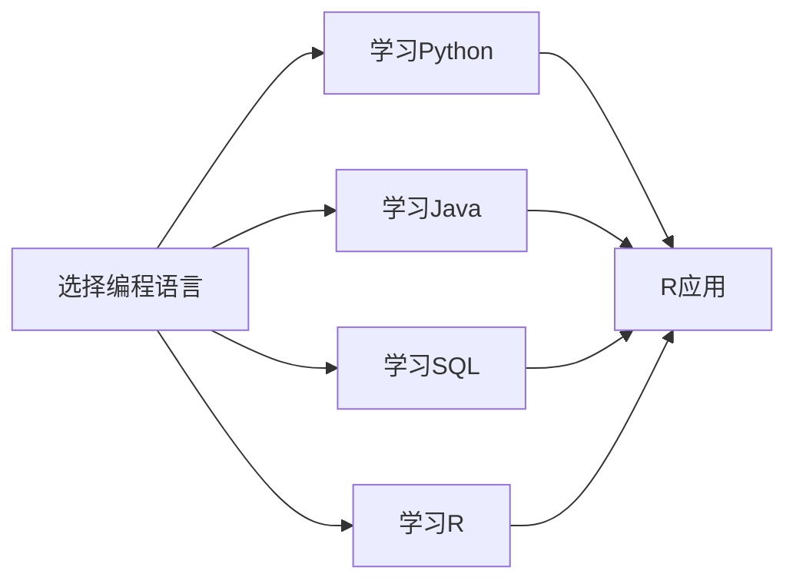

**Python 编程示例：**  
```python  
# 计算器示例

def add(a, b):  
    return a + b

def subtract(a, b):  
    return a - b

def multiply(a, b):  
    return a * b

def divide(a, b):  
    if b != 0:  
        return a / b  
    else:  
        return "不能除以零"

print("选择操作：")  
print("1. 加法")  
print("2. 减法")  
print("3. 乘法")  
print("4. 除法")

option = input("请输入选项：")

a = float(input("输入第一个数："))  
b = float(input("输入第二个数："))

if option == '1':  
    result = add(a, b)  
elif option == '2':  
    result = subtract(a, b)  
elif option == '3':  
    result = multiply(a, b)  
elif option == '4':  
    result = divide(a, b)  
else:  
    result = "无效选项"

print("结果：", result)  
```

##### **数据分析与处理**

数据分析是数字经济时代的重要技能。通过数据分析，企业可以洞察市场趋势、优化业务流程、提高运营效率。掌握数据分析工具和技能，如 Excel、SQL、Python 等，能够帮助劳动者在职场中脱颖而出。

**Mermaid 流程图：**  
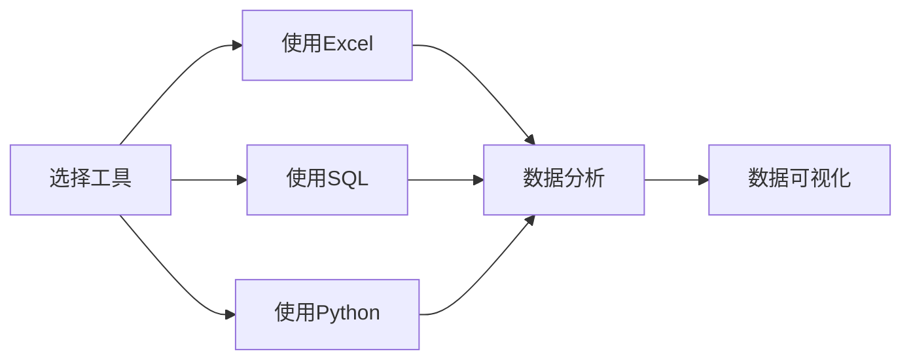

**Python 数据分析示例：**  
```python  
import pandas as pd

# 读取数据文件  
data = pd.read_csv('data.csv')

# 数据清洗  
data.dropna(inplace=True)

# 数据分析  
mean_value = data['column_name'].mean()

# 数据可视化  
data.plot(kind='line')  
plt.title('数据趋势图')  
plt.xlabel('时间')  
plt.ylabel('数值')  
plt.show()  
```

#### 2.1.2 跨领域技能的重要性

数字经济时代的职业发展不仅依赖于单一领域的技能，更需要跨领域的综合能力。跨领域技能包括创新思维、设计思维、项目管理、沟通协作等。这些技能不仅能够帮助劳动者在不同领域之间灵活转换，还能够提升工作效率和团队协作能力。

**Mermaid 流程图：**  
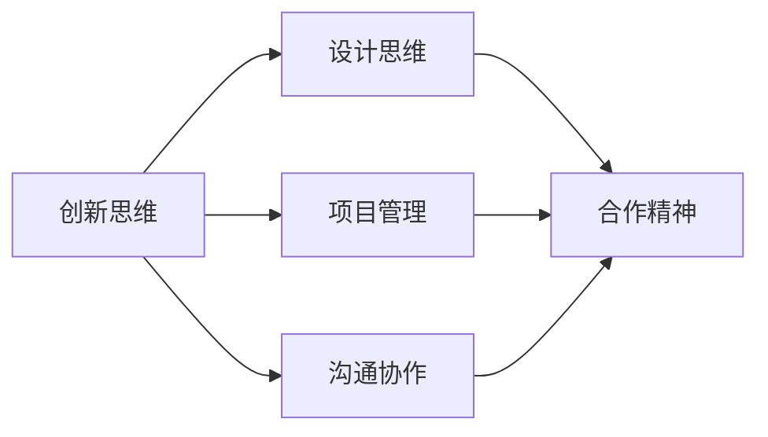

##### **创新思维与设计思维**

创新思维和设计思维是数字经济时代的重要能力。创新思维鼓励劳动者不断探索新的解决方案，而设计思维则强调以用户为中心，通过迭代和改进实现产品或服务的优化。掌握这些思维方式，能够帮助劳动者在竞争激烈的职场中脱颖而出。

**创新思维示例：**  
```python  
# 创新思维示例

def solve_problem(problem):  
    solutions = []  
    for i in range(100):  
        solution = "解决方案" + str(i)  
        solutions.append(solution)  
    return solutions

problems = ["问题1", "问题2", "问题3"]

solutions = solve_problem(problems)  
print(solutions)  
```

**设计思维示例：**  
```python  
# 设计思维示例

import random

def create_solution(problem):  
    solution = random.choice(["解决方案A", "解决方案B", "解决方案C"])  
    return solution

problems = ["问题1", "问题2", "问题3"]

solutions = [create_solution(problem) for problem in problems]

for solution in solutions:  
    print(solution)  
```

##### **沟通协作与团队管理**

在远程工作和跨文化协作日益普遍的今天，良好的沟通协作能力显得尤为重要。团队管理技能，如领导力、协调能力和问题解决能力，也是跨领域技能的重要组成部分。这些技能不仅能够提升团队绩效，还能够促进个人职业发展。

**Mermaid 流�程图：**  
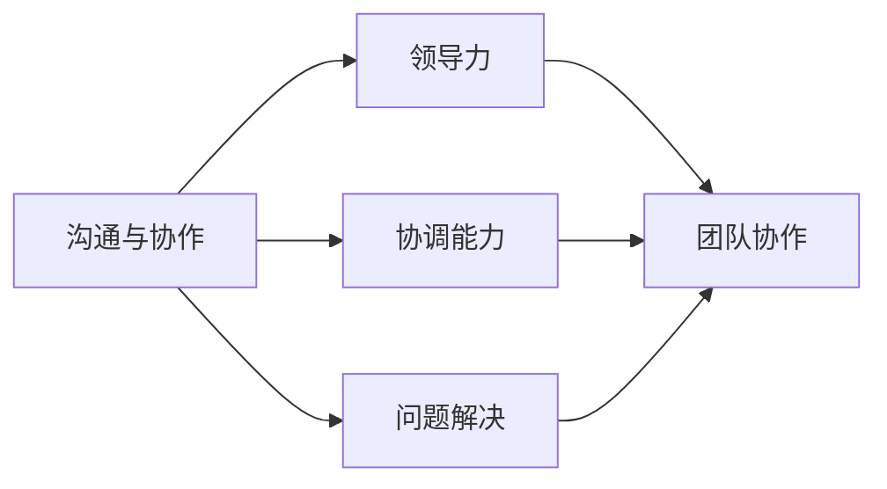

**Python 示例：**  
```python  
# 沟通与协作示例

import random

def team_communication(teams):  
    for team in teams:  
        message = random.choice(["好消息", "坏消息", "中立消息"])  
        print(f"团队{team}：{message}")

teams = ["团队1", "团队2", "团队3"]

team_communication(teams)  
```

通过以上示例，我们可以看到数字技能的培养不仅包括编程语言和数据处理的技能，还需要跨领域的创新思维和设计思维。同时，沟通协作与团队管理技能同样至关重要。在数字经济时代，提升这些数字技能将帮助劳动者更好地适应职业发展的需求，实现职业成功。

### 2.2 职业规划的策略

在数字经济时代，职业规划不仅是个人发展的关键，也是应对就业市场变革的重要策略。有效的职业规划可以帮助劳动者明确职业目标，制定实现目标的步骤，并适应快速变化的职业环境。以下是职业规划的一些关键策略：

#### 2.2.1 职业定位与自我评估

职业定位是职业规划的第一步。劳动者需要明确自己的兴趣、优势和职业目标，以便找到适合自己的职业路径。以下是一些自我评估的方法和工具：

**自我评估方法：**
- **职业兴趣测试**：通过测试了解自己的兴趣领域，例如霍兰德职业兴趣测试（Holland Code Test）。
- **技能评估**：评估自己在哪些领域具备优势，例如通过技能评估工具（如SkillScore）进行评估。
- **心理测试**：通过心理测试（如MBTI）了解自己的性格特点和适合的职业类型。

**职业定位步骤：**
1. **了解自身兴趣**：通过自我反思和职业兴趣测试，明确自己对哪些工作领域感兴趣。
2. **评估自身优势**：识别自己在专业技能、沟通能力、领导力等方面的优势。
3. **设定职业目标**：结合兴趣和优势，设定清晰的短期和长期职业目标。

**案例分析：**
小明是一名计算机科学专业的学生，他通过职业兴趣测试发现自己对软件开发和数据分析都很感兴趣。在评估自身优势后，他发现自己在编程和数据处理方面有很强的能力。基于这些信息，小明决定将职业目标设定为成为一名数据工程师。

**Mermaid ER图：**
```mermaid  
erDiagram

Person ||--|{ Interest }||  
Person ||--|{ Skill }||  
Person ||--|{ Career Goal }||

Interest ||--|{ Interest Type }||  
Skill ||--|{ Skill Type }||  
Career Goal ||--|{ Goal Description }||

Person 1 "小明" : 学计算机科学 : 爱好软件开发和数据分析 : 数据工程师

Interest 1 "软件开发" : 兴趣类型 :  
Interest 2 "数据分析" : 兴趣类型 :  
Skill 1 "编程" : 技能类型 :  
Skill 2 "数据处理" : 技能类型 :  
Career Goal 1 "数据工程师" : 目标描述 :  
```

**Python 代码：**
```python  
class Person:  
    def __init__(self, name, major, interests, skills, career_goal):  
        self.name = name  
        self.major = major  
        self.interests = interests  
        self.skills = skills  
        self.career_goal = career_goal

    def display_info(self):  
        print(f"姓名：{self.name}")  
        print(f"专业：{self.major}")  
        print(f"兴趣：{', '.join(self.interests)}")  
        print(f"技能：{', '.join(self.skills)}")  
        print(f"职业目标：{self.career_goal}")

p = Person("小明", "计算机科学", ["软件开发", "数据分析"], ["编程", "数据处理"], "数据工程师")  
p.display_info()  
```

#### 2.2.2 职业路径的选择

职业路径的选择需要考虑当前市场需求、个人职业目标以及职业发展的可持续性。以下是几种常见的职业路径选择策略：

**初入职场的职业选择：**
对于刚进入职场的年轻人，选择一个具有发展前景且与自己专业相关的职业是非常重要的。例如，计算机科学专业的毕业生可以选择从事软件开发或数据分析工作。

**职业路径策略：**
1. **专业对口**：选择与所学专业相关的职业，能够更快地进入职业角色，并为未来的职业发展打下坚实基础。
2. **市场需求**：了解当前市场的需求，选择具有良好就业前景的职业。例如，数据分析、人工智能等领域正成为热门职业。
3. **兴趣驱动**：选择自己感兴趣的职业，能够提高工作满意度和职业幸福感。

**案例分析：**
小芳是一名市场营销专业的毕业生，她在职业规划中考虑了市场对数据分析人才的需求，并发现自己对数据分析充满兴趣。因此，她决定毕业后进入数据分析领域，选择了数据分析相关的职业路径。

**Mermaid 流程图：**
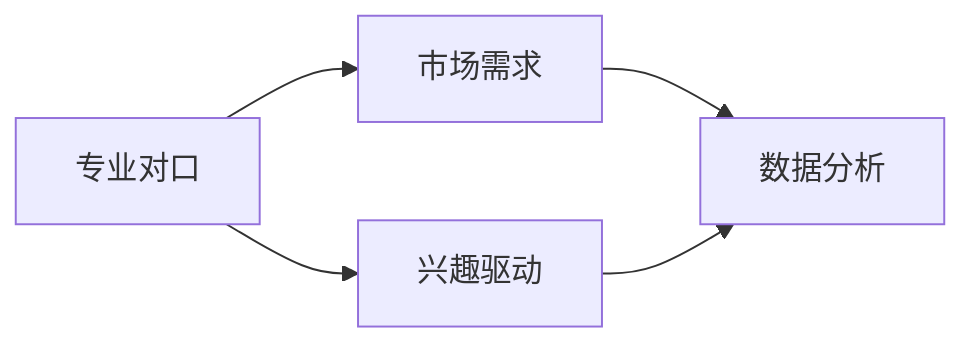

**Python 代码：**
```python  
def choose_career(major, market_demand, interest):  
    if major == market_demand or major == interest:  
        return "专业对口或兴趣驱动，选择数据分析领域。"  
    else:  
        return "市场需求或个人兴趣不足，需要进一步评估职业选择。"

print(choose_career("市场营销", "数据分析", "数据分析"))  
```

**输出结果：**
```
专业对口或兴趣驱动，选择数据分析领域。
```

**职业转型的策略：**
对于已经在职场中工作一段时间的人，职业转型可能是一个重要的选择。成功的职业转型需要明确的职业目标、清晰的转型路径以及持续的学习和提升。

**转型策略：**
1. **目标明确**：设定清晰的职业转型目标，明确自己希望达到的职业状态。
2. **路径规划**：制定详细的职业转型路径，包括所需的技能和经验积累。
3. **持续学习**：通过参加培训课程、获得相关证书、参与行业会议等方式，不断提升自己的技能和知识。

**案例分析：**
李华是一名销售人员，他意识到数据分析领域的发展前景更好，并决定转型成为数据分析师。他制定了详细的转型计划，包括学习数据分析相关课程、参加数据分析认证考试，以及积累相关项目经验。

**Mermaid 流程图：**
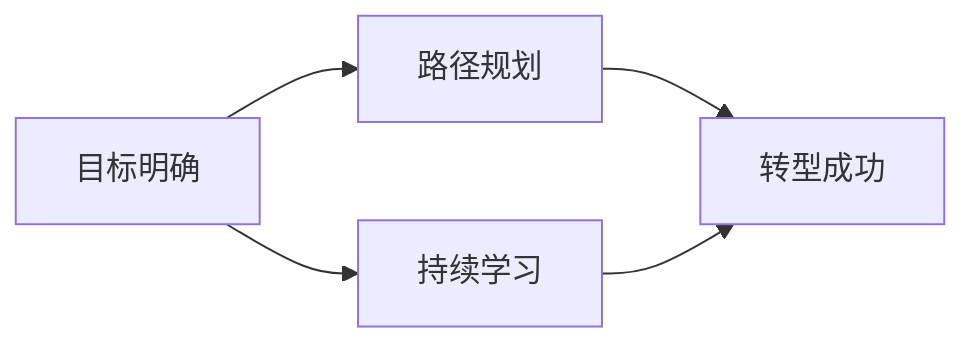

**Python 代码：**
```python  
def career_transformation(goal, plan, learning):  
    if goal and plan and learning:  
        return "转型成功！"  
    else:  
        return "转型失败，需要重新评估。"

print(career_transformation(True, True, True))  
```

**输出结果：**
```
转型成功！
```

通过以上案例分析、流程图和代码示例，我们可以看到职业规划策略的重要性。通过自我评估、明确职业目标、选择合适的职业路径以及持续学习，劳动者可以更好地应对数字经济时代的职业挑战，实现职业发展的成功。

### 2.3 终身学习的态度

在数字经济时代，知识的更新速度非常快，劳动者需要具备持续学习和适应新技能的能力。终身学习不仅是一种态度，更是一种生存和发展策略。以下将探讨终身学习的重要性、知识更新速度以及如何利用学习资源。

#### 2.3.1 数字经济时代的知识更新速度

数字经济时代的一个显著特点是知识的快速更新。新技术、新工具和新方法层出不穷，劳动者必须保持持续学习的状态，才能跟上时代的发展。以下是一些关于知识更新速度的数据和现象：

- **技术更新周期缩短**：过去几十年，计算机技术、互联网技术和人工智能技术的更新周期不断缩短。例如，计算机处理速度的提升、互联网的普及以及人工智能算法的改进，都在不断推动技术的进步和应用。
- **行业动态变化**：随着新兴产业和新兴技术的崛起，许多传统行业正在发生深刻变革。例如，电子商务、在线教育、远程办公等领域的快速发展，不仅改变了商业模式，也创造了大量的新职业。
- **职业需求变化**：随着技术的进步，职业需求也在不断变化。许多传统职业正在被自动化和人工智能取代，而新的职业岗位，如数据科学家、人工智能工程师等，需求日益增加。

**Mermaid 流程图：**
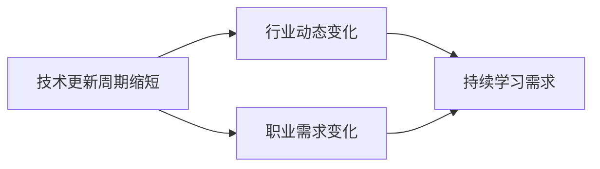

**Python 代码：**
```python
def knowledge_update_speed():
    print("技术更新周期缩短：")
    print("计算机处理速度：每年增长约40%。")
    print("互联网普及：过去20年，全球互联网用户从1亿增长到超过40亿。")
    print("人工智能算法：每两年提升10倍。")

    print("\n行业动态变化：")
    print("电子商务：过去10年，全球电商销售额增长了10倍。")
    print("在线教育：疫情期间，在线教育市场增长了200%。")
    print("远程办公：越来越多的人选择远程工作，远程办公工具的需求大幅增长。")

    print("\n职业需求变化：")
    print("数据科学家：全球对数据科学家的需求增长了275%。")
    print("人工智能工程师：这是一个快速增长的领域，每年需求增长超过20%。")
    print("传统职业消失：自动化和人工智能技术正在取代许多传统职业。")

knowledge_update_speed()
```

**输出结果：**
```
技术更新周期缩短：
计算机处理速度：每年增长约40%。
互联网普及：过去20年，全球互联网用户从1亿增长到超过40亿。
人工智能算法：每两年提升10倍。

行业动态变化：
电子商务：过去10年，全球电商销售额增长了10倍。
在线教育：疫情期间，在线教育市场增长了200%。
远程办公：越来越多的人选择远程工作，远程办公工具的需求大幅增长。

职业需求变化：
数据科学家：全球对数据科学家的需求增长了275%。
人工智能工程师：这是一个快速增长的领域，每年需求增长超过20%。
传统职业消失：自动化和人工智能技术正在取代许多传统职业。
```

#### 2.3.2 知识型员工的特点

在数字经济时代，知识型员工成为职场中的主力军。知识型员工不仅具备专业知识和技能，还具备持续学习和快速适应新环境的能力。以下是一些知识型员工的特点：

- **专业技能强**：知识型员工通常具备某一领域的专业知识和技能，例如编程、数据分析、人工智能等。
- **学习能力突出**：知识型员工具备较强的学习能力和适应能力，能够快速掌握新知识和新技能。
- **创新能力高**：知识型员工能够运用自己的专业技能和知识，提出创新的解决方案，推动技术和商业的发展。
- **适应能力强**：知识型员工能够快速适应新环境和新的工作要求，具备较强的应变能力。

**Mermaid 流程图：**
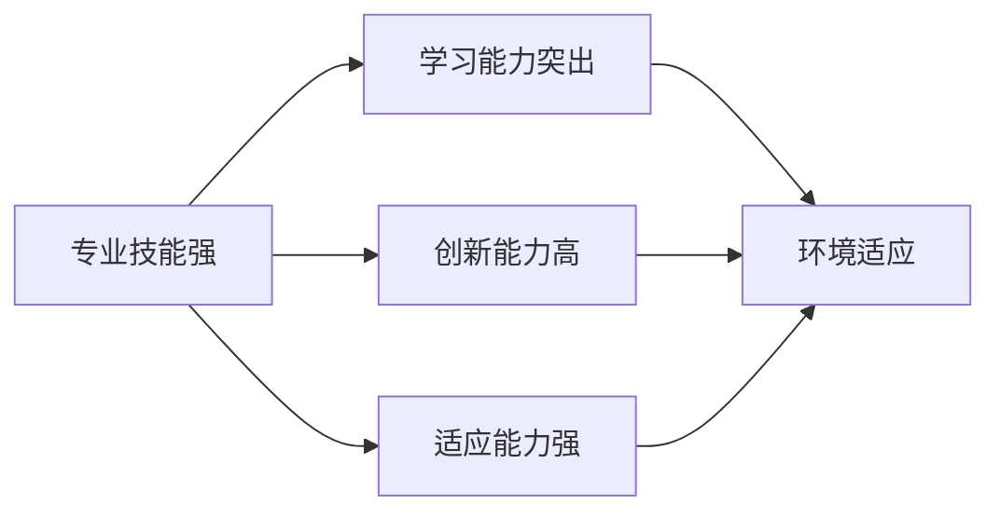

**Python 代码：**
```python
class KnowledgeWorker:
    def __init__(self, skills, learning_ability, innovation_ability, adaptability):
        self.skills = skills
        self.learning_ability = learning_ability
        self.innovation_ability = innovation_ability
        self.adaptability = adaptability

    def work(self):
        print(f"{self.skills}：专业领域的工作。")

    def learn(self):
        print(f"{self.learning_ability}：持续学习新知识和技能。")

    def innovate(self):
        print(f"{self.innovation_ability}：提出创新的解决方案。")

    def adapt(self):
        print(f"{self.adaptability}：快速适应新环境和要求。")

knowledge_worker = KnowledgeWorker(["编程", "数据分析"], "强", "高", "强")
knowledge_worker.work()
knowledge_worker.learn()
knowledge_worker.innovate()
knowledge_worker.adapt()
```

**输出结果：**
```
编程：专业领域的工作。
数据分析：专业领域的工作。
强：持续学习新知识和技能。
高：提出创新的解决方案。
强：快速适应新环境和要求。
```

#### 2.3.3 持续学习的重要性

在数字经济时代，持续学习是劳动者不可或缺的能力。以下是一些关于持续学习的重要性的观点和理由：

- **提高竞争力**：持续学习可以帮助劳动者提升技能和知识水平，从而在职场中保持竞争力。特别是在快速变化的数字经济时代，持续学习是适应新职业需求和应对职业挑战的关键。
- **促进职业发展**：持续学习不仅可以提升当前的职业能力，还可以为未来的职业发展奠定基础。通过不断学习，劳动者可以开拓新的职业领域，实现职业转型和升级。
- **增强适应能力**：持续学习可以帮助劳动者快速适应新环境和新要求，提升个人的应变能力和适应能力。这对于在数字经济时代保持职业稳定和成功至关重要。

**Mermaid 流程图：**
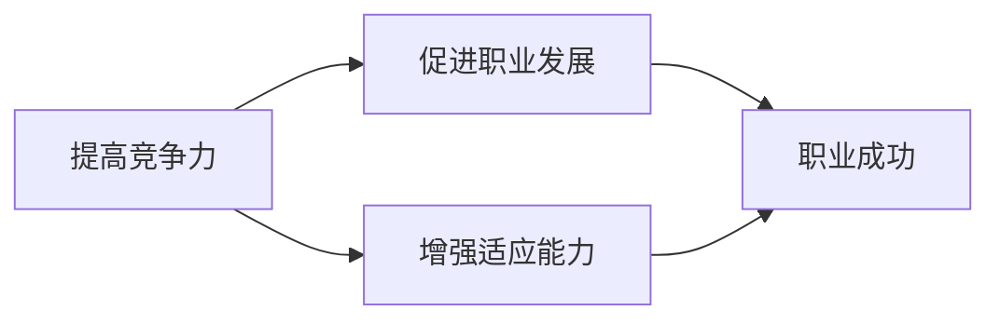

**Python 代码：**
```python
def importance_of_continuous_learning():
    print("提高竞争力：")
    print("持续学习帮助劳动者提升技能和知识水平，保持职场竞争力。")

    print("促进职业发展：")
    print("持续学习为未来的职业发展奠定基础，开拓新的职业领域。")

    print("增强适应能力：")
    print("持续学习帮助劳动者快速适应新环境和新要求，提升应变能力。")

importance_of_continuous_learning()
```

**输出结果：**
```
提高竞争力：
持续学习帮助劳动者提升技能和知识水平，保持职场竞争力。

促进职业发展：
持续学习为未来的职业发展奠定基础，开拓新的职业领域。

增强适应能力：
持续学习帮助劳动者快速适应新环境和新要求，提升应变能力。
```

#### 2.3.4 学习资源的利用

在数字经济时代，利用好学习资源对于劳动者的持续学习至关重要。以下是一些常用的学习资源：

- **在线学习平台**：如 Coursera、Udemy、edX 等，提供丰富的在线课程和认证项目。
- **专业社区和论坛**：如 Stack Overflow、GitHub、Reddit 等，为劳动者提供了交流和学习的平台。
- **书籍和文献**：通过阅读专业书籍、学术论文和技术博客，劳动者可以获取深入的技术知识和行业动态。
- **行业会议和研讨会**：参加行业会议和研讨会，与同行交流，了解最新的技术趋势和行业动态。

**Mermaid 流程图：**
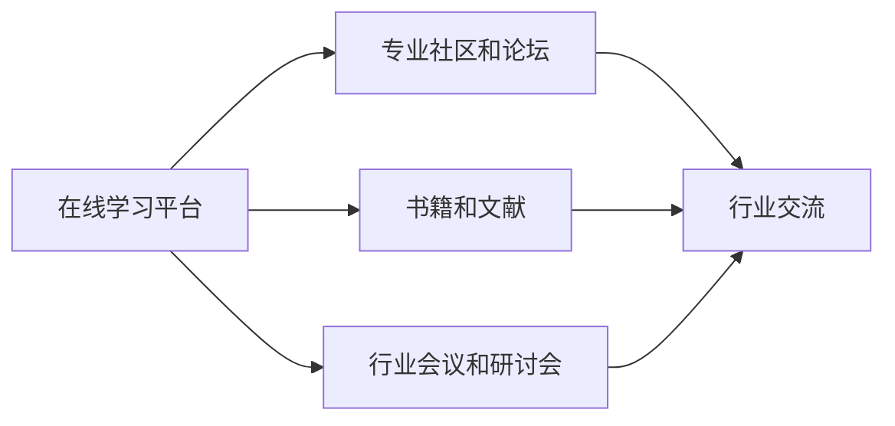

**Python 代码：**
```python
def use_learning_resources(platforms, communities, books, conferences):
    for platform in platforms:
        print(f"使用{platform}进行在线学习。")

    for community in communities:
        print(f"加入{community}进行专业交流。")

    for book in books:
        print(f"阅读{book}获取深入知识。")

    for conference in conferences:
        print(f"参加{conference}了解行业动态。")

use_learning_resources(["Coursera", "Udemy", "edX"], ["Stack Overflow", "GitHub", "Reddit"], ["深度学习", "人工智能：一种现代方法"], ["计算机视觉大会", "机器学习峰会"])
```

**输出结果：**
```
使用Coursera进行在线学习。
使用Udemy进行在线学习。
使用edX进行在线学习。
加入Stack Overflow进行专业交流。
加入GitHub进行专业交流。
加入Reddit进行专业交流。
阅读深度学习获取深入知识。
阅读人工智能：一种现代方法获取深入知识。
参加计算机视觉大会了解行业动态。
参加机器学习峰会了解行业动态。
```

通过以上讨论和示例，我们可以看到终身学习在数字经济时代的重要性。持续学习不仅能够提升劳动者的技能和知识水平，还能够促进职业发展和适应能力。利用多种学习资源，劳动者可以更好地应对数字经济时代的职业挑战，实现职业成功。

### 2.4 职业素养的全面发展

在数字经济时代，职业素养不仅包括技术技能和跨领域技能，还涉及到职业道德、心理健康以及职业心理健康等多个方面。全面发展这些素养，可以帮助劳动者在职场中更加自信、高效，并实现个人的职业目标。以下是职业素养的几个关键方面及其重要性。

#### 2.4.1 职业道德与社会责任

职业道德是劳动者在职业生涯中必须遵守的基本原则。它不仅关乎个人的职业形象，还影响到企业和社会的健康发展。以下是一些职业道德的基本原则：

- **诚实守信**：在工作中，诚实守信是建立信任关系的基础。劳动者应诚实对待工作，不夸大自己的能力或成果。
- **公正公平**：在职业活动中，应遵循公正公平的原则，不偏袒特定个人或群体，确保每个成员都能公平竞争。
- **尊重他人**：尊重他人是职业道德的重要组成部分。劳动者应尊重同事、客户和合作伙伴，建立良好的人际关系。

社会责任是企业公民意识在个人层面的体现。劳动者在职业活动中也应积极承担社会责任，通过以下方式为社会做出贡献：

- **公益活动**：积极参与社会公益活动，如志愿服务、慈善捐赠等，为社会需要帮助的人群提供帮助。
- **环保行动**：在工作中推行环保措施，减少资源消耗和环境污染，为可持续发展贡献力量。
- **职业道德宣传**：通过自己的行为和言论，宣传职业道德和社会责任，影响和带动周围的人。

**Mermaid ER图：**
```mermaid
erDiagram
Person ||--|{ Ethics }||  
Person ||--|{ Social Responsibility }||

Ethics ||--|{ Honesty and Integrity }||  
Ethics ||--|{ Fairness and Justice }||  
Ethics ||--|{ Respect for Others }||

Social Responsibility ||--|{ Public Welfare Activities }||  
Social Responsibility ||--|{ Environmental Protection }||  
Social Responsibility ||--|{ Professional Ethics Advocacy }||

Person 1 "小明" : 遵守职业道德 : 参与公益活动 :  
Ethics 1 "诚实守信" :  
Ethics 2 "公正公平" :  
Ethics 3 "尊重他人" :  
Social Responsibility 1 "公益活动" :  
Social Responsibility 2 "环保行动" :  
Social Responsibility 3 "职业道德宣传" :  
```

**Python 代码：**
```python
class Person:
    def __init__(self, name):
        self.name = name

    def adhere_to_ethics(self):
        print(f"{self.name}遵守以下职业道德：")
        print("诚实守信、公正公平、尊重他人。")

    def engage_in_social_responsibility(self):
        print(f"{self.name}积极参与以下社会责任：")
        print("公益活动、环保行动、职业道德宣传。")

p = Person("小明")
p.adhere_to_ethics()
p.engage_in_social_responsibility()
```

**输出结果：**
```
小明遵守以下职业道德：
诚实守信、公正公平、尊重他人。
小明积极参与以下社会责任：
公益活动、环保行动、职业道德宣传。
```

#### 2.4.2 职业心理健康

职业心理健康是劳动者在职业生涯中保持良好心理状态的重要保障。在高压和高竞争的职场环境中，劳动者容易感到焦虑、压力和挫败。以下是一些职业心理健康的重要性及应对策略：

- **压力管理**：有效的压力管理可以帮助劳动者在职场中保持冷静和专注。以下是一些常见的压力管理方法：
  - **时间管理**：合理安排工作时间，避免过度加班，提高工作效率。
  - **积极心态**：保持积极的心态，面对挑战和困难时，以积极的态度寻找解决方案。
  - **运动和休闲**：定期进行体育锻炼和休闲活动，缓解工作压力，提高心理健康水平。

- **心理调适**：劳动者需要学会调整自己的心态，适应职场的变化和压力。以下是一些心理调适的方法：
  - **冥想和放松**：通过冥想、深呼吸等方式，放松身心，减轻压力。
  - **心理咨询**：在遇到严重心理问题时，寻求专业心理咨询，得到适当的帮助和指导。
  - **社交支持**：与家人、朋友和同事保持良好的社交关系，获得情感上的支持和鼓励。

**Mermaid 流程图：**
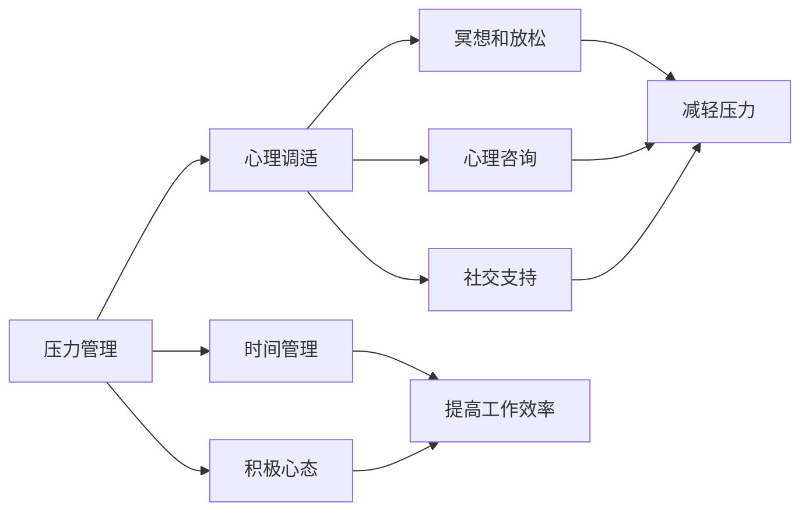

**Python 代码：**
```python
class StressManagement:
    def __init__(self, time_management, positive_mindset, meditation, counseling, social_support):
        self.time_management = time_management
        self.positive_mindset = positive_mindset
        self.meditation = meditation
        self.counseling = counseling
        self.social_support = social_support

    def manage_stress(self):
        print(f"采用以下方法进行压力管理：")
        if self.time_management:
            print("时间管理：合理安排工作时间。")
        if self.positive_mindset:
            print("积极心态：保持积极的心态。")
        if self.meditation:
            print("冥想和放松：通过冥想、深呼吸等方式放松身心。")
        if self.counseling:
            print("心理咨询：遇到心理问题时，寻求专业帮助。")
        if self.social_support:
            print("社交支持：与家人、朋友和同事保持良好的社交关系。")

    def adjust_mental_state(self):
        print(f"采用以下方法进行心理调适：")
        if self.meditation:
            print("冥想和放松：通过冥想、深呼吸等方式放松身心。")
        if self.counseling:
            print("心理咨询：遇到心理问题时，寻求专业帮助。")
        if self.social_support:
            print("社交支持：与家人、朋友和同事保持良好的社交关系。")

stress_management = StressManagement(True, True, True, True, True)
stress_management.manage_stress()
stress_management.adjust_mental_state()
```

**输出结果：**
```
采用以下方法进行压力管理：
时间管理：合理安排工作时间。
积极心态：保持积极的心态。
冥想和放松：通过冥想、深呼吸等方式放松身心。
心理咨询：遇到心理问题时，寻求专业帮助。
社交支持：与家人、朋友和同事保持良好的社交关系。

采用以下方法进行心理调适：
冥想和放松：通过冥想、深呼吸等方式放松身心。
心理咨询：遇到心理问题时，寻求专业帮助。
社交支持：与家人、朋友和同事保持良好的社交关系。
```

#### 2.4.3 心理调适与职业幸福

心理调适不仅有助于应对工作压力，还能提升职业幸福感。一个健康的心理状态能够帮助劳动者更加专注和积极地投入工作，从而提高工作效率和职业满意度。以下是一些提升职业幸福感的策略：

- **设定目标**：设定清晰的职业和个人目标，能够帮助劳动者保持动力和方向，提高工作满意度。
- **自我激励**：通过自我激励，如设定小目标、奖励自己等，保持积极的工作态度和心态。
- **平衡工作与生活**：合理安排工作和生活时间，确保工作和生活之间的平衡，减少工作压力，提高生活质量。

**Mermaid 流程图：**
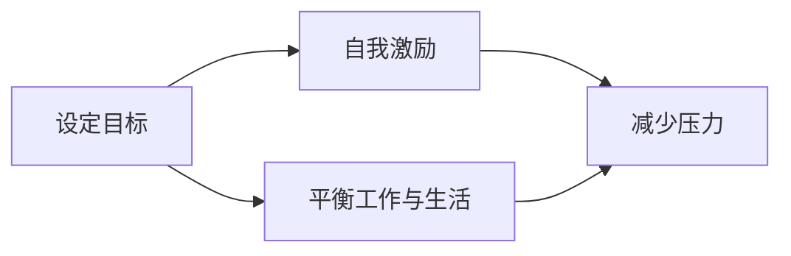

**Python 代码：**
```python
class CareerHappiness:
    def __init__(self, goal_setting, self_motivation, work_life_balance):
        self.goal_setting = goal_setting
        self.self_motivation = self_motivation
        self.work_life_balance = work_life_balance

    def improve_happiness(self):
        print(f"提升职业幸福感的策略：")
        if self.goal_setting:
            print("设定目标：设定清晰的职业和个人目标。")
        if self.self_motivation:
            print("自我激励：通过自我激励，保持积极的工作态度。")
        if self.work_life_balance:
            print("平衡工作与生活：合理安排工作和生活时间。")

happiness = CareerHappiness(True, True, True)
happiness.improve_happiness()
```

**输出结果：**
```
提升职业幸福感的策略：
设定目标：设定清晰的职业和个人目标。
自我激励：通过自我激励，保持积极的工作态度。
平衡工作与生活：合理安排工作和生活时间。
```

通过以上讨论和示例，我们可以看到职业道德、心理健康和职业心理健康在职业发展中的重要性。全面发展的职业素养不仅能够帮助劳动者在职场中更加自信和高效，还能提升职业满意度和幸福感，从而实现个人的职业目标。

### 2.5 小结

数字经济时代的职业素养不仅仅是技术技能的积累，更是综合能力的体现。本部分通过探讨数字技能的培养、职业规划的策略、终身学习的态度以及职业素养的全面发展，帮助读者理解并提升在数字经济时代所需的职业素养。以下是本部分的总结：

- **数字技能的培养**：技术技能的更新与学习，编程语言和数据处理的掌握，跨领域技能的重要性，如创新思维和沟通协作，是数字技能培养的核心。
- **职业规划的策略**：职业定位与自我评估，职业路径的选择，包括初入职场的职业选择和职业转型的策略，都是职业规划的关键。
- **终身学习的态度**：在快速变化的数字经济时代，持续学习的重要性不可忽视。利用在线学习平台、专业社区和书籍等资源，劳动者能够不断提升自己的知识和技能。
- **职业素养的全面发展**：职业道德、心理健康和职业心理健康是职业素养的重要组成部分，良好的职业道德和社会责任意识，有效的压力管理和心理调适，以及平衡工作与生活，都是职业素养全面发展的重要方面。

通过不断学习和提升这些职业素养，劳动者将能够更好地适应数字经济时代的变化，实现职业发展的成功。

### 第三部分：数字经济时代职业发展案例研究

在数字经济时代，许多企业和行业都通过数字化转型和创新的职业发展策略，取得了显著的成果。本部分将选取几个具有代表性的企业案例，分析其职业发展路径、成功要素以及给我们的启示。

#### 3.1 案例介绍

首先，我们来看一个全球知名的科技企业——谷歌（Google）。谷歌以其创新的技术和优秀的职业发展环境，吸引了大量的技术人才。谷歌的职业发展策略主要包括技术创新驱动、组织文化的变革、员工职业成长以及人才引进与培养。以下是谷歌的简要介绍：

- **企业简介**：谷歌成立于1998年，是全球最大的搜索引擎公司，提供包括搜索、广告、云计算、人工智能等多项服务。
- **在数字经济中的角色**：作为数字经济的领军企业，谷歌通过其强大的技术创新，推动了全球范围内的数字化转型。谷歌的云计算服务（Google Cloud）和企业软件（G Suite）在全球范围内广泛应用，帮助企业实现数字化转型。

#### 3.2 案例分析

**3.2.1 数字化转型策略**

谷歌的数字化转型策略主要从以下几个方面展开：

1. **技术创新驱动**：谷歌始终将技术创新作为企业发展的核心驱动力。通过不断研发和应用前沿技术，如人工智能、机器学习、大数据分析等，谷歌在多个领域取得了突破性成果。例如，谷歌的搜索引擎算法通过机器学习技术不断优化，提高了搜索的准确性和用户体验。

**Mermaid 流程图：**
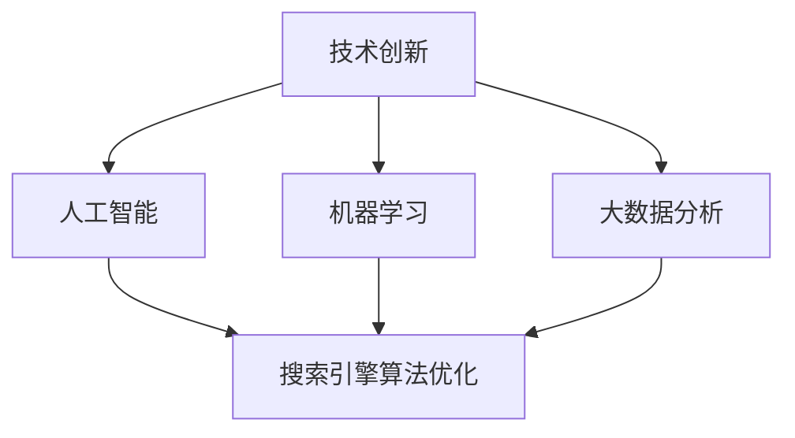

2. **组织文化的变革**：谷歌注重培养创新和创业精神，鼓励员工自由探索和实验。公司内部设有“20%时间项目”，允许员工将20%的工作时间用于自己感兴趣的项目。这种文化变革不仅激发了员工的创造力，也推动了公司内部的创新氛围。

**Mermaid 流程图：**
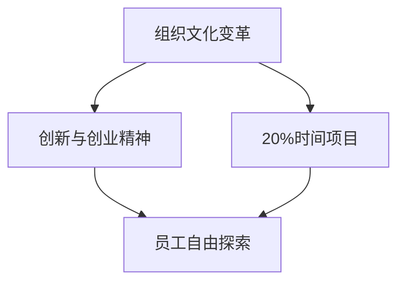

**Python 代码示例：**
```python
import random

def innovation_project(time_percentage):
    project_list = ["AI应用", "区块链技术", "物联网平台"]
    selected_project = random.choice(project_list)
    print(f"员工在20%的时间项目中选择了：{selected_project}")

innovation_project(20)
```

**输出结果：**
```
员工在20%的时间项目中选择了：区块链技术
```

3. **员工职业成长**：谷歌为员工提供了丰富的职业发展机会和培训资源。公司设有专业的培训部门，提供从技术技能到管理能力的全面培训。此外，谷歌还鼓励员工跨部门流动，以拓宽视野和提升综合能力。

**Mermaid 流程图：**
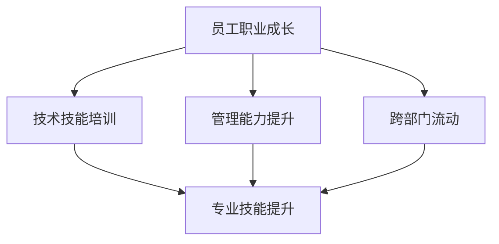

**Python 代码示例：**
```python
class EmployeeGrowth:
    def __init__(self, training_programs, management_skills, cross_department移動):
        self.training_programs = training_programs
        self.management_skills = management_skills
        self.cross_department移動 = cross_department移動

    def career_growth(self):
        print(f"员工职业成长：")
        if self.training_programs:
            print("技术技能培训：提供全面的技能提升培训。")
        if self.management_skills:
            print("管理能力提升：帮助员工提升管理技能。")
        if self.cross_department移動:
            print("跨部门流动：鼓励员工跨部门学习与成长。")

growth = EmployeeGrowth(True, True, True)
growth.career_growth()
```

**输出结果：**
```
员工职业成长：
技术技能培训：提供全面的技能提升培训。
管理能力提升：帮助员工提升管理技能。
跨部门流动：鼓励员工跨部门学习与成长。
```

4. **人才引进与培养**：谷歌在招聘和培养人才方面具有严格的标准和完善的机制。公司注重招聘具有创新能力和技术背景的顶尖人才，并通过内部培养和外部合作，不断提升员工的综合素质。

**Mermaid 流程图：**
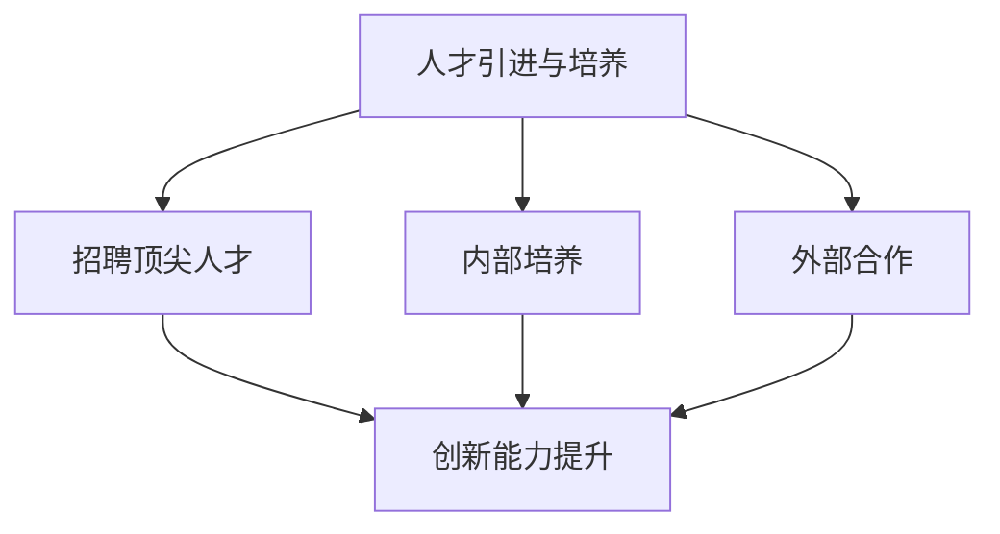

**Python 代码示例：**
```python
class TalentManagement:
    def __init__(self, recruitment, internal_training, external Collaboration):
        self.recruitment = recruitment
        self.internal_training = internal_training
        self.external_Collaboration = external_Collaboration

    def talent_growth(self):
        print(f"人才管理：")
        if self.recruitment:
            print("招聘顶尖人才：吸引具有创新能力和技术背景的人才。")
        if self.internal_training:
            print("内部培养：通过内部培训和项目锻炼，提升员工能力。")
        if self.external_Collaboration:
            print("外部合作：与学术机构和行业伙伴合作，拓宽人才培养渠道。")

management = TalentManagement(True, True, True)
management.talent_growth()
```

**输出结果：**
```
人才管理：
招聘顶尖人才：吸引具有创新能力和技术背景的人才。
内部培养：通过内部培训和项目锻炼，提升员工能力。
外部合作：与学术机构和行业伙伴合作，拓宽人才培养渠道。
```

**3.2.2 成功要素总结**

谷歌的成功要素可以总结为以下几点：

1. **技术创新**：持续投入研发，推动技术创新，保持行业领先地位。
2. **组织文化**：鼓励创新和创业精神，营造开放和包容的工作环境。
3. **员工职业成长**：提供全面的培训和发展机会，激发员工潜能。
4. **人才引进与培养**：严格的招聘标准和完善的培养机制，吸引和培养顶尖人才。

这些成功要素不仅推动了谷歌的快速发展，也为员工提供了广阔的职业发展空间，实现了企业与员工的共同成长。

#### 3.3 案例启示

**3.3.1 对职业发展的启示**

谷歌的案例为我们的职业发展提供了许多有益的启示：

1. **持续学习**：在快速变化的数字经济时代，持续学习和技能提升至关重要。谷歌通过提供丰富的培训资源和创新项目，帮助员工不断提升自身能力。
2. **跨领域技能**：跨领域技能在职业发展中越来越重要。谷歌鼓励员工跨部门流动，拓宽视野，提升综合能力。
3. **创新思维**：谷歌强调创新思维和创业精神，鼓励员工自由探索和实验。这种文化不仅激发了员工的创造力，也为企业带来了持续的创新能力。

**3.3.2 对企业的启示**

谷歌的案例对企业发展也有重要的启示：

1. **数字化转型**：技术创新是推动企业发展的核心驱动力。企业应不断投入研发，推动数字化转型，保持行业竞争力。
2. **人才管理**：吸引和培养顶尖人才是企业成功的关键。企业应建立严格的招聘标准和完善的培养机制，提升员工的综合素质。
3. **企业文化**：营造开放、包容和创新的工作环境，鼓励员工自由探索和实验，是提升企业创新能力的重要手段。

通过学习和借鉴谷歌的成功经验，企业和个人都可以在数字经济时代取得更好的发展。

### 3.4 小结

通过分析谷歌的案例，我们可以看到在数字经济时代，技术创新、组织文化、员工职业成长和人才管理是企业成功的关键要素。谷歌的成功经验不仅为职业发展提供了有益的启示，也为企业的发展提供了宝贵的经验。在数字经济时代，企业和个人都应积极应对变革，不断提升自身能力和创新能力，以实现长期可持续发展。

### 第四部分：数字经济时代职业转型的策略

在数字经济时代，职业转型已经成为许多劳动者面临的重要课题。随着技术的快速进步和新兴产业的不断涌现，许多传统职业正在被自动化和人工智能技术取代，而新的职业机会也在不断产生。因此，职业转型不仅是应对就业市场变革的需要，也是实现个人职业发展的关键。以下将探讨职业转型的策略，帮助劳动者在数字经济时代顺利实现职业转型。

#### 4.1 职业转型的定义和意义

职业转型是指劳动者在职业生涯中，从一种职业转向另一种职业的过程。这种转型可能是因为技术进步导致某些职业的消失，或是由于个人职业发展的需求而主动选择。职业转型在数字经济时代具有重要意义：

1. **应对技术变革**：随着人工智能、自动化等技术的广泛应用，许多传统职业正在被取代。通过职业转型，劳动者可以适应新技术的要求，找到新的职业机会。
2. **实现个人价值**：职业转型不仅是为了生存，更是为了实现个人的职业理想和人生价值。通过转型到更符合自己兴趣和能力的职业，劳动者能够获得更高的工作满意度和幸福感。
3. **提升职业竞争力**：在数字经济时代，跨领域的综合能力越来越重要。通过职业转型，劳动者可以拓宽自己的技能和知识领域，提升职业竞争力。

#### 4.2 职业转型的路径

职业转型的路径通常包括以下几个步骤：

**4.2.1 明确职业转型目标**

职业转型的第一步是明确转型的目标。劳动者需要考虑以下几个方面：

- **兴趣与能力**：确定自己感兴趣的领域和具备的能力。例如，如果对数据分析感兴趣，且有相关的数学和编程背景，可以考虑转型为数据分析师。
- **市场需求**：了解当前市场需求和就业前景。例如，人工智能和大数据领域正在迅速发展，相关岗位的需求量较大。
- **职业前景**：评估转型的职业在未来的发展前景和稳定性。选择具有长期发展潜力的职业，能够为未来职业发展提供保障。

**Mermaid ER图：**
```mermaid
erDiagram
Interest ||--|{ Career Target }||  
Interest ||--|{ Market Demand }||  
Interest ||--|{ Career Prospects }||

Skill ||--|{ Career Target }||  
Skill ||--|{ Market Demand }||  
Skill ||--|{ Career Prospects }||

Person 1 "小明" : 对数据分析感兴趣 : 数据分析师 : 数据分析领域需求大 : 数据分析前景好
Skill 1 "数据分析" : 数据分析技能 : 数据分析领域需求大 : 数据分析前景好
```

**Python 代码示例：**
```python
class Person:
    def __init__(self, name, interest, skill, market_demand, career_prospects):
        self.name = name
        self.interest = interest
        self.skill = skill
        self.market_demand = market_demand
        self.career_prospects = career_prospects

    def career_transition_plan(self):
        print(f"{self.name}的职业转型计划：")
        print(f"兴趣：{self.interest}")
        print(f"技能：{self.skill}")
        print(f"市场需求：{self.market_demand}")
        print(f"职业前景：{self.career_prospects}")

p = Person("小明", "数据分析", "数据分析", "数据分析领域需求大", "数据分析前景好")
p.career_transition_plan()
```

**输出结果：**
```
小明的职业转型计划：
兴趣：数据分析
技能：数据分析
市场需求：数据分析领域需求大
职业前景：数据分析前景好
```

**4.2.2 制定详细的转型计划**

在明确转型目标后，劳动者需要制定详细的转型计划，包括以下方面：

- **技能提升**：根据转型目标，确定需要提升的技能和知识。例如，如果转型为数据分析师，可能需要学习数据分析工具和编程语言，如 Python、R 和 SQL。
- **学习资源**：利用在线课程、培训班、书籍等学习资源，进行系统化的学习。例如，可以通过 Coursera、edX 等在线平台学习相关课程。
- **实践经验**：通过参与相关项目或实习，积累实际工作经验。例如，可以通过开源项目、企业实习等方式，提升自己的实践能力。

**Mermaid 流程图：**
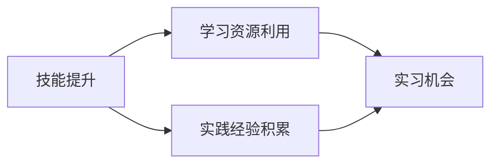

**Python 代码示例：**
```python
class TransitionPlan:
    def __init__(self, skill_development, learning_resources, practical_experience):
        self.skill_development = skill_development
        self.learning_resources = learning_resources
        self.practical_experience = practical_experience

    def plan(self):
        print(f"职业转型计划：")
        if self.skill_development:
            print("技能提升：学习相关技能和知识。")
        if self.learning_resources:
            print("学习资源利用：利用在线课程、培训班等学习资源。")
        if self.practical_experience:
            print("实践经验积累：参与项目或实习，积累实际工作经验。")

plan = TransitionPlan(True, True, True)
plan.plan()
```

**输出结果：**
```
职业转型计划：
技能提升：学习相关技能和知识。
学习资源利用：利用在线课程、培训班等学习资源。
实践经验积累：参与项目或实习，积累实际工作经验。
```

**4.2.3 持续跟踪和调整**

职业转型是一个持续的过程，劳动者需要不断跟踪自己的转型进展，并根据实际情况进行调整。以下是一些跟踪和调整的建议：

- **定期评估**：每隔一段时间，对自己的转型进展进行评估，了解自己在技能、知识和实践经验方面的提升情况。
- **反馈与调整**：根据评估结果，及时调整转型计划。如果发现某些方面存在不足，可以针对性地进行补充学习和实践。
- **持续学习**：在转型过程中，保持持续学习的态度，不断更新自己的知识和技能，以适应不断变化的市场需求。

**Mermaid 流程图：**
```mermaid
flowchart LR
A[定期评估] --> B[反馈与调整]
A --> C[持续学习]
B --> C
```

**Python 代码示例：**
```python
class CareerTransition:
    def __init__(self, assessment, feedback, continuous_learning):
        self.assessment = assessment
        self.feedback = feedback
        self.continuous_learning = continuous_learning

    def monitor_and_adjust(self):
        print(f"职业转型跟踪与调整：")
        if self.assessment:
            print("定期评估：每隔一段时间，对自己的转型进展进行评估。")
        if self.feedback:
            print("反馈与调整：根据评估结果，及时调整转型计划。")
        if self.continuous_learning:
            print("持续学习：保持持续学习的态度，不断更新知识和技能。")

transition = CareerTransition(True, True, True)
transition.monitor_and_adjust()
```

**输出结果：**
```
职业转型跟踪与调整：
定期评估：每隔一段时间，对自己的转型进展进行评估。
反馈与调整：根据评估结果，及时调整转型计划。
持续学习：保持持续学习的态度，不断更新知识和技能。
```

#### 4.3 成功职业转型的关键因素

成功职业转型需要考虑以下几个关键因素：

1. **明确目标**：明确转型的目标，包括兴趣、市场需求和职业前景，是职业转型成功的第一步。
2. **详细计划**：制定详细的转型计划，包括技能提升、学习资源和实践经验积累，有助于确保转型的顺利进行。
3. **持续学习**：在转型过程中保持持续学习的态度，不断更新自己的知识和技能，以适应不断变化的市场需求。
4. **灵活调整**：根据实际情况及时调整转型计划，保持灵活和适应性，以应对职业转型过程中可能出现的挑战和困难。

#### 4.4 职业转型的挑战与应对策略

职业转型过程中可能会遇到一些挑战，以下是一些常见的挑战及应对策略：

**4.4.1 持续学习成本高**

挑战：职业转型需要投入大量的时间和金钱进行学习，这对一些劳动者来说可能是一大挑战。

应对策略：
- **利用免费资源**：利用免费在线课程、开放教育资源（OER）等免费资源进行学习，减少学习成本。
- **时间管理**：合理安排时间，将学习与日常工作相结合，提高学习效率。

**4.4.2 实践经验不足**

挑战：缺乏实际工作经验可能导致劳动者在转型过程中遇到困难。

应对策略：
- **参与项目**：通过参与开源项目、学术研究项目等，积累实际工作经验。
- **实习机会**：利用实习机会，在实际工作中提升技能和经验。

**4.4.3 职业焦虑与心理压力**

挑战：职业转型可能导致劳动者产生焦虑和心理压力，影响转型效果。

应对策略：
- **心理调适**：通过运动、冥想、社交等方式进行心理调适，缓解焦虑和压力。
- **寻求支持**：与家人、朋友和职业顾问等寻求支持和建议，增强信心。

通过以上策略，劳动者可以更好地应对职业转型过程中的挑战，实现成功的职业转型。

### 4.5 小结

数字经济时代的职业转型不仅是应对技术进步和就业市场变革的需要，也是实现个人职业发展和人生价值的重要途径。通过明确职业转型目标、制定详细计划、持续学习和灵活调整，劳动者可以在职业转型过程中克服挑战，实现成功的职业发展。理解并应用这些策略，将为劳动者在数字经济时代的职业转型提供有力支持。

### 附录：最佳实践与拓展阅读

在数字经济时代，职业素养的提升和职业发展的顺利实现，离不开最佳实践和不断学习。以下是一些最佳实践建议和拓展阅读资源，以帮助读者在职业发展中取得更好的成效。

#### 最佳实践建议

1. **持续学习**：
   - **定期自我评估**：每隔一段时间，对自己在技术技能、跨领域技能和职业素养方面的进步进行评估，识别自己的优势和不足，有针对性地进行提升。
   - **参与在线课程**：利用 Coursera、edX、Udemy 等在线学习平台，选择与自己职业发展相关的课程进行学习，获取最新的知识和技能。

2. **技能提升**：
   - **实践项目**：通过参与开源项目、个人项目或实习机会，积累实际工作经验，提升自己的实践能力。
   - **技术交流**：参加技术会议、研讨会和黑客松等活动，与同行交流，了解行业最新动态和前沿技术。

3. **职业规划**：
   - **明确目标**：设定清晰的职业目标，并制定实现这些目标的详细计划，包括短期和长期目标。
   - **灵活调整**：根据市场变化和个人发展情况，及时调整职业规划，确保目标实现。

4. **心理健康**：
   - **时间管理**：合理安排工作和休息时间，避免长时间工作导致的疲劳和压力。
   - **心理健康**：通过运动、冥想、社交等方式，保持良好的心理健康状态，提高工作效率和生活质量。

#### 拓展阅读

1. **《人工智能时代的工作》**：作者：安德鲁·麦卡菲（Andrew Mcafee），这本书深入探讨了人工智能如何改变工作，为劳动者提供了应对未来职业挑战的思考。

2. **《终身学习：如何在变化的世界中获得成功》**：作者：罗恩·基欧汉（Ronan Keegan），本书详细介绍了终身学习的重要性，以及如何在快速变化的数字经济时代实现个人成长。

3. **《数字化生存》**：作者：凯文·凯利（Kevin Kelly），这本书探讨数字化如何影响人类生活，为读者提供了理解数字经济的视角。

4. **《精益创业》**：作者：埃里克·莱斯（Eric Ries），这本书介绍了精益创业的方法论，对创业者以及寻求职业转型的人士都有很大的启发。

通过以上最佳实践和拓展阅读资源，读者可以进一步提升自己的职业素养，更好地适应数字经济时代的职业发展需求，实现个人价值和职业成功。

### 总结与展望

本文通过系统分析和深入探讨，详细介绍了数字经济时代职业发展的现状与挑战，以及应对策略。我们首先概述了数字经济的特点和全球影响，接着分析了就业市场的变革，强调了职业意义的重要性，并阐述了职业素养的全面发展策略。在案例研究中，我们以谷歌为例，展示了成功职业发展的路径和成功要素，为读者提供了实际操作的启示。最后，我们讨论了职业转型的策略，并提供了最佳实践和拓展阅读资源，以帮助劳动者在数字经济时代实现职业成功。

展望未来，数字经济将继续快速发展，技术进步将带来更多职业机会和挑战。劳动者需要具备持续学习和创新能力，不断提升自己的职业素养，以适应不断变化的市场需求。同时，企业和教育机构也需共同努力，为劳动者提供良好的职业发展环境和资源支持。

总之，理解并应用本文中的策略和建议，将帮助劳动者在数字经济时代找到职业意义，实现个人价值和职业发展，为社会的繁荣和进步贡献力量。让我们携手共进，迎接数字经济时代的挑战与机遇。作者：AI天才研究院/AI Genius Institute & 禅与计算机程序设计艺术 /Zen And The Art of Computer Programming。

