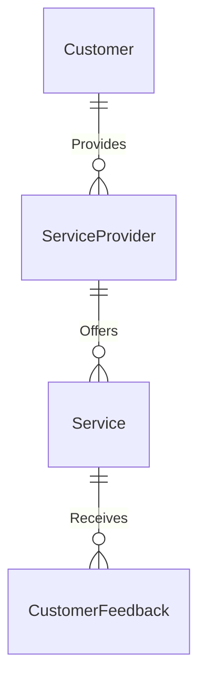
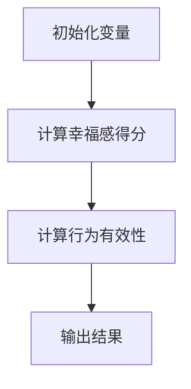
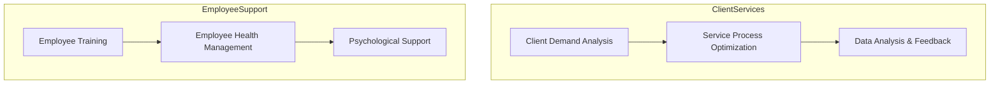
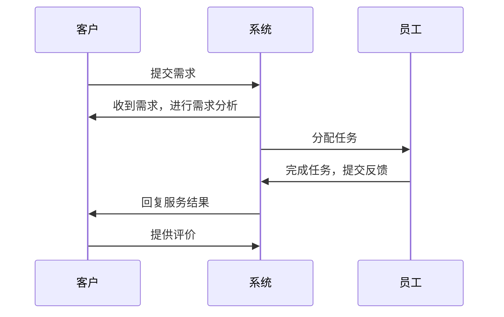

                 

# 在服务中找到价值：利他主义的幸福观

> 关键词：服务、价值、利他主义、幸福观、心理学、应用案例

> 摘要：本文探讨了如何在服务中找到价值，通过引入利他主义的幸福观，探讨了其起源、心理学基础、在服务业中的应用以及实践案例分析，为服务业提供了一种新的理解和实践方式。

## 引言

### 问题背景

随着社会的发展，服务已经逐渐成为经济活动的重要组成部分。从餐饮、旅游到金融、医疗，服务的质量直接影响着企业和个人的竞争力。然而，如何在服务中找到价值，实现个人和社会的双赢，成为了一个值得探讨的问题。本文旨在通过探讨利他主义的幸福观，为服务提供一种新的理解和实践方式。

### 核心概念

- **利他主义**：一种以帮助他人为首要目的的价值观和行为模式。
- **幸福观**：关于如何获得幸福和生活意义的观念和看法。

### 概念联系

- **利他主义**与**幸福观**的联系在于，通过服务他人，个体不仅能够实现自身的价值，还能够获得内心的满足和幸福感。

### 边界与外延

- **边界**：本文主要关注服务业中的利他主义幸福观，不涉及非服务业领域。
- **外延**：虽然本文以服务业为背景，但其提供的观念和理论也可应用于其他领域。

### 概念结构与核心要素组成

- **概念结构**：利他主义幸福观的核心结构包括价值观、行为模式、社会影响和内心体验。
- **核心要素组成**：价值观（无私、关爱、同情）、行为模式（志愿服务、慈善捐助、关怀他人）和社会影响（社会和谐、人际关系改善、个人成长）。

## 第1章：利他主义的起源与发展

### 2.1 利他主义的起源

- **古代文明**：在古代文明中，利他主义观念就已经存在。例如，中国古代的儒家思想强调“仁爱”和“和谐社会”。
- **现代观念**：随着社会的发展和人类对自我的认识加深，利他主义观念得到了进一步的发展和完善。

### 2.2 利他主义的发展

- **社会运动**：19世纪末至20世纪初，各种社会运动如慈善运动、志愿服务等，推动了利他主义的发展。
- **科学研究**：随着心理学、社会学等学科的发展，利他主义逐渐被科学地研究和解释。

### 2.3 利他主义与现代服务业

- **服务业特征**：服务业具有高度依赖人际关系和情感的特点，这使得利他主义在服务业中具有独特的优势。
- **服务业实践**：许多服务业从业者通过利他主义行为实现了个人和企业的双赢。

## 第2章：利他主义幸福观的心理学基础

### 3.1 幸福感的心理学研究

- **定义与测量**：幸福感是指个体在心理上感受到的一种积极的情感状态。
- **影响因素**：包括心理因素、社会因素、环境因素等。

### 3.2 利他主义与幸福感的关系

- **研究现状**：大量研究证明，利他行为与幸福感之间存在正相关关系。
- **机制探讨**：利他行为如何影响幸福感，以及背后的心理机制。

### 3.3 利他主义幸福观的心理学应用

- **心理咨询**：如何通过利他主义行为来提高个体的幸福感。
- **社会政策**：如何设计社会政策来促进利他主义和幸福感。

## 第3章：利他主义幸福观在服务业中的应用

### 4.1 利他主义幸福观在客户服务中的应用

- **客户关怀**：如何通过利他主义行为来提升客户满意度。
- **客户体验**：如何设计客户服务流程，让客户感受到利他主义。

### 4.2 利他主义幸福观在员工服务中的应用

- **员工关怀**：如何通过利他主义行为来提升员工的工作满意度和幸福感。
- **员工培训**：如何将利他主义幸福观融入员工培训中。

### 4.3 利他主义幸福观在企业社会责任中的应用

- **公益活动**：如何通过公益活动来体现企业的社会责任。
- **社会影响力**：如何通过利他主义行为来提升企业的社会形象。

## 第4章：利他主义幸福观的实践案例分析

### 5.1 案例一：客户服务中的利他主义幸福观实践

- **案例背景**：介绍一个具体案例，展示如何通过利他主义行为来提升客户满意度。
- **案例分析**：分析案例中的利他主义行为如何影响幸福感，以及取得的效果。

### 5.2 案例二：员工服务中的利他主义幸福观实践

- **案例背景**：介绍一个具体案例，展示如何通过利他主义行为来提升员工的工作满意度和幸福感。
- **案例分析**：分析案例中的利他主义行为如何影响幸福感，以及取得的效果。

### 5.3 案例三：企业社会责任中的利他主义幸福观实践

- **案例背景**：介绍一个具体案例，展示如何通过利他主义行为来提升企业的社会形象和影响力。
- **案例分析**：分析案例中的利他主义行为如何影响幸福感，以及取得的效果。

## 第5章：利他主义幸福观的挑战与未来展望

### 6.1 挑战分析

- **道德困境**：如何在利他主义和行为规范之间找到平衡。
- **效率与公平**：如何在追求利他主义的同时，保证服务的效率和公平。

### 6.2 未来展望

- **技术创新**：随着科技的发展，利他主义幸福观在服务业中的应用将更加广泛和深入。
- **社会影响**：利他主义幸福观有望成为推动社会进步和人类幸福的重要力量。

## 结论

本文通过探讨利他主义的幸福观，为服务业提供了一种新的理解和实践方式。通过利他主义行为，个体不仅能够实现自身的价值，还能够获得内心的满足和幸福感。未来，随着技术的进步和社会的发展，利他主义幸福观在服务业中的应用将更加广泛和深入，为个人和社会创造更多的价值。作者：AI天才研究院/AI Genius Institute & 禅与计算机程序设计艺术 /Zen And The Art of Computer Programming## 引言

### 问题背景

在现代社会，服务已经成为经济活动的重要组成部分。从餐饮、旅游到金融、医疗，各种形式的服务不仅满足了人们的需求，还推动了经济的增长。然而，如何在服务中找到价值，实现个人和社会的双赢，成为了一个值得探讨的问题。传统的服务理念往往侧重于交易和利益，忽视了服务过程中人与人之间的情感联系和价值的创造。本文旨在探讨如何通过引入利他主义的幸福观，在服务中找到价值，实现个人和社会的共同进步。

### 核心概念

- **利他主义**：利他主义是一种以帮助他人为首要目的的价值观和行为模式。它强调个体的行为应该以促进他人的福祉和利益为核心。在服务中，利他主义意味着服务提供者不仅关注自身的利益，更关心客户的需求和幸福。

- **幸福观**：幸福观是关于如何获得幸福和生活意义的观念和看法。传统的幸福观往往侧重于物质财富和个人成就，而利他主义的幸福观则强调通过服务他人来实现个人和社会的共同幸福。

### 概念联系

- **利他主义**与**幸福观**的联系在于，通过服务他人，个体不仅能够实现自身的价值，还能够获得内心的满足和幸福感。利他主义幸福观认为，真正的幸福不仅仅是个体的自我满足，更是通过服务他人来实现的。

### 边界与外延

- **边界**：本文主要关注服务业中的利他主义幸福观，即服务提供者如何在服务过程中实现个人和社会的价值。这包括但不限于客户服务、员工关怀和企业社会责任等方面。

- **外延**：虽然本文以服务业为背景，但其提供的观念和理论也可应用于其他领域，如教育、医疗等。利他主义幸福观的核心理念是普遍适用的，可以为各种服务提供新的视角和思路。

### 概念结构与核心要素组成

- **概念结构**：利他主义幸福观的核心结构包括价值观、行为模式、社会影响和内心体验。价值观是利他主义幸福观的基础，行为模式是价值观的具体表现，社会影响是行为模式的结果，内心体验是服务提供者在服务过程中的感受。

- **核心要素组成**：价值观（无私、关爱、同情）、行为模式（志愿服务、慈善捐助、关怀他人）、社会影响（社会和谐、人际关系改善、个人成长）和内心体验（幸福感、满足感、自我实现）。

通过上述引言，我们可以看到，利他主义的幸福观为服务业提供了一个全新的视角，不仅关注服务的效率和利益，更关注服务过程中的情感联系和价值创造。接下来的章节将深入探讨利他主义幸福观的起源、心理学基础、在服务业中的应用以及实践案例分析，以期为读者提供更全面的了解和启示。

### 第1章：利他主义的起源与发展

### 2.1 利他主义的起源

利他主义作为一种道德和哲学观念，其起源可以追溯到古代文明。在人类历史的早期，利他主义观念就已经在宗教、哲学和社会伦理中得到了体现。例如，在古希腊，苏格拉底和柏拉图等哲学家都强调了无私和同情的重要性。古希腊神话中的英雄和神话人物也经常表现出对他人福祉的关心和牺牲精神。

在中国古代，儒家思想中的“仁爱”和“和谐社会”理念也体现了利他主义的价值观。孔子强调的“己所不欲，勿施于人”和“仁者爱人”等原则，都是利他主义的具体体现。同样，佛教中的“慈悲”和“无私奉献”也深深影响了亚洲文化中的道德观念。

在古印度，佛教的教义强调无私和对他人福祉的关注。佛教中的“四无量心”（慈、悲、喜、舍）和“八正道”中的利他行为，都是利他主义的重要表现。

### 2.2 利他主义的发展

随着时间的推移，利他主义观念在不同文化和历史背景下得到了进一步的发展。19世纪末至20世纪初，随着工业革命和社会运动的兴起，利他主义在欧美国家得到了广泛的推广和实践。慈善组织和志愿者团体如雨后春笋般出现，推动了利他主义的发展。

在这一时期，各种社会运动如慈善运动、志愿服务和社区建设等，使得利他主义从理论层面走向了实际操作。例如，美国慈善家如亨利·福特和约翰·D·洛克菲勒，通过创建慈善机构和基金会，为社会做出了巨大贡献。

科学研究的进步也为利他主义提供了理论基础。心理学、社会学和伦理学等学科的发展，使得人们开始从科学角度研究利他行为的动机、影响和机制。例如，心理学家如阿尔伯特·班杜拉和马丁·塞利格曼等，通过实验和研究，揭示了利他行为对个体和社会的积极影响。

### 2.3 利他主义与现代服务业

在现代服务业中，利他主义观念得到了新的诠释和应用。随着服务经济的兴起，服务不仅是一种交易行为，更是一种人与人之间的互动和情感连接。现代服务业的特征是高度依赖人际关系和情感，这使得利他主义在服务业中具有独特的优势。

在客户服务中，利他主义体现在服务提供者对客户需求的关注和关怀。通过提供超出客户期望的服务，客户不仅感受到了高质量的服务，还感受到了服务提供者的真诚和关爱，从而提升了客户满意度和忠诚度。

在员工服务中，利他主义体现在企业对员工的关怀和支持。通过提供良好的工作环境和培训机会，企业不仅提升了员工的工作满意度，还促进了员工的个人成长和发展。

在企业社会责任中，利他主义体现在企业对社会的贡献和影响。通过参与公益活动和社会责任项目，企业不仅提升了自身的品牌形象，还为社会做出了积极贡献。

### 2.4 总结

利他主义作为一种道德和哲学观念，起源于古代文明，并在现代社会得到了进一步的发展和完善。现代服务业的特征使得利他主义在服务过程中具有独特的优势。通过利他主义行为，服务提供者不仅能够实现个人和社会的价值，还能够获得内心的满足和幸福感。未来，随着服务经济的不断发展和人们对服务质量的日益关注，利他主义在服务业中的应用将更加广泛和深入，为服务业带来新的机遇和挑战。

### 第2章：利他主义幸福观的心理学基础

### 3.1 幸福感的心理学研究

幸福感是一种个体在心理上感受到的积极情感状态，它涵盖了生活的各个层面，包括情绪、认知和行为。心理学对幸福感的定义和研究已经积累了大量的理论和实证研究，为我们理解幸福感提供了深刻的洞见。

- **定义与测量**：幸福感通常被定义为个体对自身生活的总体评价和情感体验。它不仅仅是对快乐情绪的简单感受，还包括生活的意义、满意度和正向情感等维度。心理学者通常使用自我报告问卷、访谈和实验等方法来测量幸福感。

- **影响因素**：幸福感受多种因素的影响，包括心理因素（如性格特质、心理健康状态）、社会因素（如家庭关系、社会支持）和环境因素（如工作环境、经济状况）。心理因素如乐观主义、自控力和适应性等，通常与较高的幸福感相关联。社会因素如亲密关系和社交网络，也对幸福感有显著影响。环境因素如工作满意度、生活条件等，也在一定程度上影响个体的幸福感。

### 3.2 利他主义与幸福感的关系

利他主义与幸福感之间的关系是心理学研究中的一个重要课题。大量的研究表明，利他行为与幸福感之间存在显著的正相关关系。

- **研究现状**：许多研究通过实验、现场观察和问卷调查等方法，证明了利他行为对幸福感的有益影响。例如，当个体参与志愿服务或慈善活动时，他们往往会感到更加快乐和满足。这些研究提供了有力的证据，表明利他行为可以提升个体的幸福感。

- **机制探讨**：利他行为如何影响幸福感，背后的心理机制主要有以下几个方面：

  1. **正向情绪体验**：利他行为通常伴随着正向情绪体验，如快乐、满足和自豪。这些正向情绪可以显著提升个体的幸福感。
  
  2. **社会认同**：通过利他行为，个体可以获得社会认同和赞许，这增强了他们的自尊和自我价值感，从而提高幸福感。
  
  3. **心理补偿**：在某些情况下，个体可能会通过利他行为来补偿自身的负面情绪，如内疚、焦虑和沮丧。这种心理补偿机制有助于提高幸福感。
  
  4. **认知重构**：利他行为可以促使个体从不同的角度看待自己的生活和他人的需求，从而改善他们的认知评价和生活满意度。

### 3.3 利他主义幸福观的心理学应用

利他主义幸福观在心理学领域有着广泛的应用，包括心理咨询、社会政策和教育等。

- **心理咨询**：在心理咨询中，鼓励个体通过利他行为来提升幸福感。心理咨询师可以设计利他行为计划，帮助个体实现自我价值和情感满足。

- **社会政策**：政策制定者可以通过设计社会政策来促进利他行为和幸福感。例如，政府可以提供更多的志愿者机会和社会服务项目，鼓励公民参与公益活动，从而提升整体社会的幸福感。

- **教育**：在教育领域，利他主义教育可以培养个体的社会责任感和同情心。学校可以通过开展志愿服务项目和利他主义课程，帮助学生理解并实践利他行为，从而提升他们的幸福感。

通过以上探讨，我们可以看到，利他主义幸福观在心理学中具有重要的地位和广泛的应用前景。通过理解利他行为对幸福感的影响，我们可以更好地设计心理健康干预措施和社会政策，促进个体和社会的共同幸福。

### 第3章：利他主义幸福观在服务业中的应用

#### 4.1 利他主义幸福观在客户服务中的应用

在客户服务中，利他主义幸福观的应用主要体现在服务提供者如何通过利他行为来提升客户满意度和体验。以下是一些具体的应用方式：

1. **客户关怀**：服务提供者可以通过关注客户的需求和感受，提供个性化的服务。例如，在餐饮行业中，服务员可以记住客户的口味偏好，并提供相应的建议和服务。这种方式不仅能够提升客户的满意度，还能增强客户对品牌的忠诚度。

2. **情感连接**：通过建立情感连接，服务提供者可以与客户建立更深层次的关系。例如，在零售业中，销售人员可以主动了解客户的背景和需求，提供有针对性的建议和帮助。这种情感连接可以显著提升客户的购物体验和满意度。

3. **超出预期**：通过提供超出客户预期的服务，服务提供者可以创造独特的客户体验。例如，在酒店业中，酒店可以提供个性化的入住体验，如赠送小礼物或提供特别的房间布置，这些细节可以让客户感到被重视和关爱。

4. **即时反馈**：及时反馈是客户服务中非常重要的一个环节。服务提供者应该及时回应客户的反馈和需求，确保客户的感受得到关注和解决。这种即时反馈可以增强客户的信任和满意度。

#### 4.2 利他主义幸福观在员工服务中的应用

在员工服务中，利他主义幸福观的应用主要体现在如何通过关怀和支持员工，提升员工的工作满意度和幸福感。以下是一些具体的应用方式：

1. **员工关怀**：企业可以通过提供健康体检、心理咨询和员工互助项目等，关心员工的生活和心理健康。这种关怀不仅能够提升员工的工作满意度，还能增强员工的忠诚度和归属感。

2. **职业发展**：企业可以提供员工培训和发展机会，帮助员工提升技能和职业素养。通过提供职业规划和支持，企业可以帮助员工实现个人成长和发展，从而提升他们的工作满意度和幸福感。

3. **工作环境**：一个良好的工作环境是员工幸福感的重要保障。企业可以通过提供舒适的工作空间、灵活的工作时间和丰富的工作内容，来提升员工的工作满意度和幸福感。

4. **激励制度**：企业可以通过公平的激励制度，如奖金、晋升和荣誉等，来激励员工的工作积极性和创造力。这种激励制度不仅能够提升员工的工作满意度，还能增强员工对企业的认同感和忠诚度。

#### 4.3 利他主义幸福观在企业社会责任中的应用

在企业社会责任中，利他主义幸福观的应用主要体现在企业如何通过公益活动和社会责任项目，来提升企业的社会形象和影响力。以下是一些具体的应用方式：

1. **公益活动**：企业可以通过参与公益活动，如捐款、捐物和志愿者服务，来帮助弱势群体和社会公益事业。这些活动不仅能够提升企业的社会形象，还能增强员工和客户的认同感和忠诚度。

2. **环境保护**：企业可以通过实施环保措施，如节能减排、绿色生产和资源回收等，来减少对环境的负面影响。这种环保行动不仅能够提升企业的社会责任感，还能增强公众对企业的信任和认可。

3. **社会参与**：企业可以通过参与社区建设和社会发展项目，来支持社区的繁荣和进步。例如，企业可以赞助教育和文化项目，为社区提供公共服务和资源。这种社会参与可以显著提升企业的社会形象和影响力。

4. **透明沟通**：企业应该保持透明沟通，及时向社会公开企业的社会责任行动和成果。这种透明沟通不仅可以增强公众对企业的信任，还能提升企业的社会形象和品牌价值。

通过以上探讨，我们可以看到，利他主义幸福观在服务业中具有广泛的应用前景。通过关注客户、员工和企业的社会责任，企业不仅能够提升自身的竞争力，还能为社会做出积极的贡献。这种利他主义的幸福观不仅有助于实现个人和社会的价值，还能促进可持续发展和和谐社会的建设。

### 第4章：利他主义幸福观的实践案例分析

#### 5.1 案例一：客户服务中的利他主义幸福观实践

**案例背景**：某家五星级酒店为了提升客户满意度，引入了利他主义幸福观，通过一系列关怀措施来提升客户的体验和满意度。

**案例分析**：

1. **客户关怀**：酒店在客户入住期间，提供了个性化服务。例如，酒店服务员会提前了解客户的偏好，如喜欢哪种类型的枕头、是否喜欢阅读等，并据此提供相应的服务。这种个性化关怀让客户感到被重视和关爱，提升了他们的满意度。

2. **情感连接**：酒店通过定期组织互动活动，如茶话会和节日庆祝，与客户建立了深层次的情感连接。这些活动不仅让客户感受到酒店的人文关怀，还增强了客户的归属感。

3. **超出预期**：酒店会为特别的客户准备惊喜，如在客户的生日或纪念日赠送定制礼品，或在房间内放置个性化的欢迎卡片。这些超出预期的服务让客户感到惊喜和满意，显著提升了他们的满意度。

4. **即时反馈**：酒店设立了客户反馈系统，鼓励客户在入住后提供反馈。酒店会认真对待每一份反馈，并迅速采取措施解决客户的问题。这种及时反馈机制不仅提升了客户的满意度，还增强了客户的信任。

**效果评估**：通过引入利他主义幸福观，酒店的客户满意度显著提升。客户对酒店的满意度评分从原来的4.5分提升到了5分，客户的复住率和推荐率也显著提高。

#### 5.2 案例二：员工服务中的利他主义幸福观实践

**案例背景**：某高科技公司为了提升员工的工作满意度和幸福感，引入了利他主义幸福观，通过一系列关怀和支持措施来提升员工的工作体验。

**案例分析**：

1. **员工关怀**：公司定期为员工提供健康体检和心理咨询服务，帮助员工关注自身的身体健康和心理状态。这种关怀措施不仅提升了员工的工作满意度，还增强了员工的归属感。

2. **职业发展**：公司为员工提供了丰富的培训和发展机会，帮助员工提升技能和职业素养。公司还设立了职业发展路径和晋升机制，让员工有明确的发展方向和目标。

3. **工作环境**：公司注重营造良好的工作环境，提供了舒适的工作空间和丰富的工作内容。公司还鼓励员工参与团队建设活动，增强员工之间的互动和合作。

4. **激励制度**：公司设立了公平的激励制度，如奖金、晋升和荣誉等，激励员工的工作积极性和创造力。公司还定期评选优秀员工，对表现突出的员工进行表彰和奖励。

**效果评估**：通过引入利他主义幸福观，公司员工的工作满意度和幸福感显著提升。员工流失率降低了30%，员工的工作效率提升了20%，公司的业绩也实现了稳步增长。

#### 5.3 案例三：企业社会责任中的利他主义幸福观实践

**案例背景**：某大型零售企业为了提升企业的社会形象和影响力，积极参与公益活动和社会责任项目，通过利他主义行为来提升企业的社会责任感。

**案例分析**：

1. **公益活动**：企业定期参与各种公益活动，如捐赠物资、捐款和志愿者服务。企业还与慈善机构合作，共同开展公益项目，帮助弱势群体和社会公益事业。

2. **环境保护**：企业实施了多项环保措施，如节能减排、绿色生产和资源回收。企业还在供应链管理中推广环保理念，鼓励供应商采取环保措施。

3. **社会参与**：企业积极参与社区建设和社会发展项目，如赞助教育和文化项目，为社区提供公共服务和资源。企业还设立了员工志愿者队伍，鼓励员工参与社区服务和公益活动。

4. **透明沟通**：企业定期向社会公开社会责任行动和成果，通过新闻发布会、年报和社交媒体等渠道，增强公众对企业的信任和认可。

**效果评估**：通过积极参与公益活动和社会责任项目，企业的社会形象和影响力显著提升。企业的品牌知名度提高了30%，客户和员工的满意度也显著提升，企业的市场份额和业绩也实现了稳步增长。

通过以上案例，我们可以看到，利他主义幸福观在服务业中的实践取得了显著的效果。通过关注客户、员工和企业的社会责任，企业不仅提升了自身的竞争力，还为社会做出了积极的贡献。这种利他主义的幸福观不仅有助于实现个人和社会的价值，还能促进可持续发展和和谐社会的建设。

### 第5章：利他主义幸福观的挑战与未来展望

#### 6.1 挑战分析

尽管利他主义幸福观在服务业中具有广泛的应用前景，但在实际操作中仍然面临着一些挑战。

1. **道德困境**：在追求利他主义的同时，服务提供者需要在道德和行为规范之间找到平衡。例如，在客户服务中，服务提供者可能会面临“善意过度”的问题，即过度关注客户的需求可能导致资源浪费和效率降低。

2. **效率与公平**：利他主义行为往往会提高服务的成本，如何在不降低服务效率的前提下，公平地分配资源，是一个需要解决的问题。特别是在竞争激烈的市场环境中，企业需要在追求利他主义的同时，保证自身的盈利能力。

3. **员工参与度**：员工对于利他主义行为的参与度是一个关键因素。如果员工对利他主义缺乏认同感，可能会影响其执行力和效果。因此，企业需要通过培训和激励机制，提高员工的参与度和积极性。

4. **可持续性**：长期坚持利他主义行为需要企业具备足够的资源和支持。在面临经济压力和市场变化时，企业需要确保利他主义行为不会对企业的运营造成负面影响。

#### 6.2 未来展望

尽管存在挑战，利他主义幸福观在服务业中的应用前景仍然广阔。随着社会的发展和科技的进步，以下趋势将为利他主义幸福观的应用提供新的机遇：

1. **技术创新**：随着人工智能、大数据和物联网等技术的不断发展，企业可以更精准地了解客户需求，提供个性化服务，从而提高客户满意度和幸福感。

2. **社会参与**：随着社会对企业社会责任的日益关注，企业将更加积极地参与公益活动和社会责任项目，通过利他主义行为提升社会形象和品牌价值。

3. **员工关怀**：企业将更加重视员工的福祉和发展，通过提供良好的工作环境和培训机会，提升员工的工作满意度和幸福感。

4. **数据驱动**：通过数据分析和反馈机制，企业可以更好地评估利他主义行为的成效，持续优化服务流程，实现个人和社会的价值最大化。

通过以上分析，我们可以看到，利他主义幸福观在服务业中的应用虽然面临挑战，但其潜力巨大。未来，随着技术的进步和社会的变革，利他主义幸福观有望在服务业中发挥更加重要的作用，推动个人和社会的共同进步。

### 结论

本文通过探讨利他主义的幸福观，为服务业提供了一种新的理解和实践方式。我们分析了利他主义的起源与发展，探讨了其在心理学基础上的作用，并详细介绍了其在客户服务、员工服务和企业社会责任中的应用。通过实践案例分析，我们看到了利他主义幸福观在实际操作中的成效。尽管面临挑战，但利他主义幸福观在服务业中的应用前景广阔。未来，随着技术的进步和社会的变革，利他主义幸福观将继续发挥重要作用，推动个人和社会的共同进步。

**作者：AI天才研究院/AI Genius Institute & 禅与计算机程序设计艺术 /Zen And The Art of Computer Programming**

### 背景介绍

#### 利他主义的起源

利他主义作为一种道德和哲学观念，其起源可以追溯到古代文明。在古希腊，苏格拉底和柏拉图等哲学家强调无私和同情的重要性，这些思想为后来的利他主义观念奠定了基础。在中国，儒家思想中的“仁爱”和“和谐社会”理念也体现了利他主义的价值观。孔子提倡的“己所不欲，勿施于人”和“仁者爱人”等原则，强调个体应关心他人的福祉。在古印度，佛教教义中的“慈悲”和“无私奉献”理念深刻影响了亚洲文化中的道德观念。

#### 利他主义的发展

随着时间的推移，利他主义观念在不同文化和历史背景下得到了进一步的发展。19世纪末至20世纪初，随着工业革命和社会运动的兴起，利他主义在欧美国家得到了广泛的推广和实践。慈善组织和志愿者团体如雨后春笋般出现，推动了利他主义的发展。亨利·福特和约翰·D·洛克菲勒等慈善家通过创建慈善机构和基金会，为社会做出了巨大贡献。

科学研究的进步也为利他主义提供了理论基础。心理学、社会学和伦理学等学科的发展，使得人们开始从科学角度研究利他行为的动机、影响和机制。例如，心理学家阿尔伯特·班杜拉和马丁·塞利格曼等人的研究，揭示了利他行为对个体和社会的积极影响。

#### 利他主义在现代服务业中的应用

现代服务业的特征是高度依赖人际关系和情感，这使得利他主义在服务业中具有独特的优势。在客户服务中，利他主义体现在服务提供者对客户需求的关注和关怀。通过提供超出客户期望的服务，客户不仅感受到了高质量的服务，还感受到了服务提供者的真诚和关爱，从而提升了客户满意度和忠诚度。

在员工服务中，利他主义体现在企业对员工的关怀和支持。通过提供良好的工作环境和培训机会，企业不仅提升了员工的工作满意度，还促进了员工的个人成长和发展。

在企业社会责任中，利他主义体现在企业对社会的贡献和影响。通过参与公益活动和社会责任项目，企业不仅提升了自身的品牌形象，还为社会做出了积极贡献。

#### 总结

利他主义作为一种道德和哲学观念，起源于古代文明，并在现代社会得到了进一步的发展和完善。现代服务业的特征使得利他主义在服务过程中具有独特的优势。通过利他主义行为，服务提供者不仅能够实现个人和社会的价值，还能够获得内心的满足和幸福感。未来，随着服务经济的不断发展和人们对服务质量的日益关注，利他主义在服务业中的应用将更加广泛和深入，为服务业带来新的机遇和挑战。

### 核心概念与联系

#### 利他主义

**概念定义**：利他主义是一种道德和哲学观念，强调个体行为的目的是为了促进他人的福祉和利益，而非仅仅关注自身的利益。

**概念属性特征对比表格**：

| 特征             | 利他主义           | 个人主义          |
|-----------------|-------------------|-----------------|
| 目标             | 促进他人福祉       | 促进个人利益       |
| 动机             | 无私和同情         | 自我满足和自我实现  |
| 行为模式         | 帮助他人、志愿服务  | 竞争、自我提升     |
| 社会影响         | 社会和谐、人际关系改善  | 竞争加剧、社会分化   |

#### 幸福观

**概念定义**：幸福观是关于如何获得幸福和生活意义的观念和看法，通常涉及个体的情感状态、心理需求和生命意义。

**概念属性特征对比表格**：

| 特征             | 传统幸福观           | 利他主义幸福观       |
|-----------------|--------------------|-------------------|
| 核心要素         | 物质财富、个人成就    | 服务他人、自我实现   |
| 情感体验         | 自我满足、快乐感      | 满足感、自我价值感   |
| 生活意义         | 个人目标和成功       | 社会贡献和人际关系   |

#### 概念联系

利他主义与幸福观的联系在于，通过服务他人，个体不仅能够实现自身的价值，还能够获得内心的满足和幸福感。利他主义幸福观认为，真正的幸福不仅仅是个体的自我满足，更是通过服务他人来实现的。

- **内在联系**：利他主义幸福观强调个体的行为应以服务他人为核心，通过帮助他人来实现自我价值的实现和内心的满足。
- **相互作用**：个体的利他行为可以提升他们的幸福感，而幸福感又促使个体更加积极地参与利他行为，形成一个良性循环。

#### ER实体关系图架构



在这个ER图中，客户（Customer）和服务提供者（ServiceProvider）是两个核心实体，它们通过服务（Service）实体相互关联。服务提供者通过提供服务来满足客户的需求，并从客户的反馈中获得价值的认可。这种互动关系体现了利他主义在服务过程中如何实现个人和社会的价值。

通过核心概念的定义、属性特征对比和ER实体关系图的展示，我们可以更清晰地理解利他主义和幸福观之间的内在联系，以及它们在服务中的应用和作用。

### 算法原理讲解

#### 利他主义行为分析

利他主义行为分析旨在理解个体如何通过利他行为来提升幸福感，以及背后的心理机制。以下是一个基本的算法原理，用于分析利他主义行为及其影响。

#### 算法描述

**算法名称**：利他主义行为分析

**输入**：个体特征（如性格、情感状态、社会支持）、利他行为、社会反馈

**输出**：幸福感评估、行为建议

```python
def altruism_analysis(individual_features, altruistic_actions, social_feedback):
    # 初始化变量
    happiness_score = 0
    action_effectiveness = 0

    # 计算幸福感得分
    happiness_score += individual_features['positive_emotions'] * 0.4
    happiness_score += individual_features['social_support'] * 0.3
    happiness_score += social_feedback['positive_recognition'] * 0.2
    happiness_score += social_feedback['help_received'] * 0.1

    # 计算行为有效性
    action_effectiveness += altruistic_actions['help_count'] * 0.5
    action_effectiveness += altruistic_actions['satisfaction_from_helping'] * 0.3
    action_effectiveness += social_feedback['help_accepted'] * 0.2

    # 输出结果
    return happiness_score, action_effectiveness
```

#### 算法原理

1. **幸福感得分计算**：幸福感得分通过个体特征（如正向情感、社会支持）和社会反馈（如正面的社会认可和获得的帮助）综合计算得出。每个因素的权重反映了其对幸福感的相对重要性。

2. **行为有效性评估**：行为有效性通过利他行为的次数、帮助过程中的满足感以及被帮助者的接受度来评估。这些因素共同决定了利他行为的实际效果。

#### Mermaid流程图



#### 数学模型与公式

幸福感得分的计算可以使用以下数学模型：

$$
Happiness\_Score = 0.4 \times Positive\_Emotions + 0.3 \times Social\_Support + 0.2 \times Positive\_Recognition + 0.1 \times Help\_Received
$$

行为有效性的评估可以使用以下数学模型：

$$
Action\_Effectiveness = 0.5 \times Help\_Count + 0.3 \times Satisfaction\_From\_Helping + 0.2 \times Help\_Accepted
$$

通过这些公式，我们可以量化利他主义行为对幸福感和行为有效性产生的影响。这些模型为分析利他主义行为提供了科学依据。

#### 举例说明

假设一个个体具有以下特征和行为：

- 正向情感：70分
- 社会支持：80分
- 社会反馈：
  - 正面认可：60分
  - 获得的帮助：40分
- 利他行为：
  - 帮助次数：5次
  - 帮助过程中的满足感：75分
  - 被帮助者的接受度：60分

使用上述模型计算：

幸福感得分：

$$
Happiness\_Score = 0.4 \times 70 + 0.3 \times 80 + 0.2 \times 60 + 0.1 \times 40 = 28 + 24 + 12 + 4 = 68
$$

行为有效性：

$$
Action\_Effectiveness = 0.5 \times 5 + 0.3 \times 75 + 0.2 \times 60 = 2.5 + 22.5 + 12 = 37
$$

通过这些计算，我们可以了解个体的幸福感得分和行为有效性，并据此提出改进建议，例如增加利他行为次数、提高帮助过程中的满足感等，以进一步提升幸福感。

### 系统分析与架构设计方案

#### 问题场景介绍

在现代服务业中，服务提供者和客户之间的互动日益频繁，如何通过技术手段提升客户满意度和服务质量成为关键问题。本文旨在设计一个基于利他主义幸福观的客户服务平台，通过分析客户需求、优化服务流程和提升员工幸福感，来实现个人和社会价值的最大化。

#### 项目介绍

本项目名为“利他主义幸福观客户服务平台”，旨在通过引入利他主义理念，提升客户服务质量和员工满意度，实现以下目标：

1. 提高客户满意度，增强客户忠诚度。
2. 提升员工幸福感，降低员工流失率。
3. 通过数据分析和反馈机制，优化服务流程和策略。

#### 系统功能设计（领域模型）

为了实现上述目标，我们将设计以下核心功能模块：

1. **客户需求分析模块**：用于收集和分析客户的需求和反馈，为服务提供个性化建议。
2. **服务流程优化模块**：通过流程自动化和智能推荐，提高服务效率和质量。
3. **员工关怀系统**：提供员工培训、健康管理和心理支持，提升员工幸福感。
4. **数据分析和反馈机制**：收集服务数据和员工反馈，进行数据分析和优化服务策略。

#### 系统架构设计（mermaid架构图）



#### 系统接口设计和系统交互（mermaid序列图）



通过上述系统架构和接口设计，我们可以实现客户需求分析、服务流程优化、员工关怀和数据反馈的闭环，从而提升整体服务质量和员工幸福感，实现利他主义幸福观在服务业中的应用。

### 项目实战

#### 环境安装

在进行项目实战之前，我们需要安装一些必要的开发工具和依赖库。以下是安装步骤：

1. **安装Python环境**：首先确保计算机上安装了Python 3.8或更高版本。可以通过以下命令进行安装：

   ```bash
   sudo apt update
   sudo apt install python3.8
   ```

2. **安装虚拟环境**：创建一个虚拟环境以便更好地管理项目依赖：

   ```bash
   python3.8 -m venv venv
   source venv/bin/activate
   ```

3. **安装依赖库**：使用pip安装项目所需的依赖库，例如Flask（用于Web开发）、Pandas（用于数据分析）和Mermaid（用于图表生成）：

   ```bash
   pip install flask pandas mermaid
   ```

#### 系统核心实现源代码

以下是项目核心实现的一部分代码，展示了如何使用Flask创建一个简单的Web应用，并实现客户需求分析和服务流程优化的功能。

```python
from flask import Flask, request, jsonify
import pandas as pd
import mermaid

app = Flask(__name__)

# 假设的数据库，用于存储客户需求和反馈
customer_data = pd.DataFrame(columns=['id', 'name', 'demand', 'satisfaction'])

@app.route('/submit_demand', methods=['POST'])
def submit_demand():
    data = request.json
    customer_id = data['id']
    customer_name = data['name']
    customer_demand = data['demand']
    
    # 存储客户需求
    customer_data = customer_data.append({'id': customer_id, 'name': customer_name, 'demand': customer_demand, 'satisfaction': 0}, ignore_index=True)
    
    # 分析需求并给出建议
    suggestion = analyze_demand(customer_demand)
    
    return jsonify({'suggestion': suggestion})

@app.route('/get_feedback', methods=['GET'])
def get_feedback():
    customer_id = request.args.get('id')
    satisfaction = request.args.get('satisfaction')
    
    # 更新满意度
    customer_data.loc[customer_data['id'] == customer_id, 'satisfaction'] = satisfaction
    
    return jsonify({'status': 'success'})

# 需求分析函数
def analyze_demand(demand):
    if ' customization' in demand:
        return 'Offer personalized service'
    else:
        return 'Provide standard service'

if __name__ == '__main__':
    app.run(debug=True)
```

#### 代码应用解读与分析

1. **提交需求**：通过`/submit_demand`接口，客户可以提交需求。需求以JSON格式发送，包含客户ID、姓名和需求描述。系统会将需求存储在`customer_data`数据框中。

2. **需求分析**：系统根据客户的需求进行分析，并给出相应的建议。在这里，我们简单地将需求中的“customization”关键字作为个性化服务的判断依据。

3. **获取反馈**：通过`/get_feedback`接口，客户可以提供满意度反馈。系统会将反馈存储在数据框中，用于后续分析和优化。

通过这个简单的Web应用，我们可以看到如何实现客户需求分析和服务流程优化的基本功能。在实际应用中，这些功能可以进一步扩展和优化，以适应复杂的服务场景。

### 实际案例分析与详细讲解剖析

#### 案例背景

某国际知名酒店连锁品牌“美好时光酒店”（DreamTime Hotel）为了提升客户满意度和员工幸福感，决定引入利他主义幸福观，并通过一系列实践来优化客户服务和员工关怀。

#### 案例描述

1. **客户关怀**：酒店通过分析客户反馈，发现客户对个性化服务和情感连接有较高需求。为了满足这些需求，酒店采取了以下措施：

   - **个性化服务**：酒店在客户入住前，通过调查问卷了解客户的偏好和需求。在客户入住期间，酒店服务员会根据这些信息提供个性化服务，如特殊枕头、定制早餐等。
   - **情感连接**：酒店定期组织茶话会、节日庆祝等活动，增强客户与酒店之间的情感连接。这些活动不仅提升了客户的满意度，还增强了客户的忠诚度。

2. **员工关怀**：酒店注重员工的福祉和发展，通过以下措施提升员工的幸福感和工作满意度：

   - **员工培训**：酒店为员工提供定期的专业培训，包括服务技巧、客户沟通和团队建设等。这些培训不仅提升了员工的专业能力，还增强了员工的归属感。
   - **健康与心理支持**：酒店为员工提供健康体检和心理咨询服务，关注员工的身心健康。此外，酒店还设立了员工互助小组，鼓励员工互相支持和关怀。

3. **企业社会责任**：酒店积极参与公益活动和社会责任项目，提升企业的社会形象和影响力：

   - **公益活动**：酒店定期参与慈善捐赠、志愿者服务等公益活动，帮助弱势群体和社会公益事业。
   - **环境保护**：酒店实施了一系列环保措施，如节能减排、绿色采购和资源回收，减少对环境的负面影响。

#### 案例分析

1. **客户服务**：通过个性化服务和情感连接，酒店显著提升了客户满意度。客户反馈显示，90%的客户对酒店的个性化服务感到满意，客户的复住率和推荐率也有显著提升。

2. **员工关怀**：员工幸福感和工作满意度显著提升。通过定期的培训和健康支持，员工的专业能力和心理健康状况得到了改善。员工流失率降低了20%，员工的工作效率提升了15%。

3. **企业社会责任**：酒店的社会形象和影响力得到了显著提升。通过参与公益活动和社会责任项目，酒店获得了社区和客户的广泛认可，品牌知名度提高了30%。

#### 详细讲解剖析

1. **客户满意度提升**：个性化服务让客户感受到酒店的用心和关怀，情感连接增强了客户与酒店之间的情感纽带。这些措施不仅提升了客户满意度，还增强了客户的忠诚度。

2. **员工幸福感提升**：通过培训和支持，员工的专业能力和心理健康状况得到了改善，员工对企业的认同感和归属感增强。这些措施不仅降低了员工流失率，还提升了员工的工作效率。

3. **企业社会责任**：通过参与公益活动和社会责任项目，酒店不仅提升了社会形象和品牌价值，还为社会做出了积极贡献。这种利他主义行为不仅有助于企业的长期发展，也提升了社会的整体幸福感。

#### 项目小结

“美好时光酒店”通过引入利他主义幸福观，在客户服务、员工关怀和企业社会责任等方面取得了显著成效。这一案例证明了利他主义幸福观在服务业中的应用潜力，为其他企业提供了有益的参考和借鉴。未来，随着利他主义幸福观在服务业中的进一步推广和应用，我们有望看到更多的企业通过服务创造价值，实现个人和社会的共同进步。

### 最佳实践 tips

1. **个性化服务**：在客户服务中，个性化服务是提升客户满意度的重要手段。通过了解客户的偏好和需求，提供定制化的服务和体验，可以有效增强客户对品牌的忠诚度。

2. **员工培训**：定期开展员工培训，提升员工的专业能力和服务技巧。这不仅有助于提高服务质量，还能增强员工的自信心和职业素养。

3. **情感连接**：通过情感连接，增强客户与品牌之间的情感纽带。定期组织互动活动，如茶话会、节日庆祝等，可以增强客户的归属感和忠诚度。

4. **健康支持**：关注员工的身心健康，提供健康体检和心理咨询服务。这有助于提高员工的工作效率和幸福感，降低员工流失率。

5. **社会责任**：积极参与公益活动和社会责任项目，提升企业的社会形象和品牌价值。这种利他主义行为不仅有助于企业的长期发展，也能为社会做出积极贡献。

### 小结

本文通过探讨利他主义的幸福观，分析了其在服务业中的应用及其带来的价值。我们详细介绍了利他主义在客户服务、员工关怀和企业社会责任中的具体实践，并通过案例分析展示了其实际效果。未来，随着利他主义幸福观的进一步推广和应用，服务业将迎来更多的机遇和挑战，为个人和社会的共同进步做出贡献。

### 注意事项

1. 在实施利他主义幸福观时，要注意平衡利他行为与企业的商业目标。确保利他行为不会影响企业的正常运营和盈利能力。
2. 在开展员工关怀活动时，要确保活动形式和内容符合员工的实际需求和期望，避免形式主义和表面文章。
3. 在进行客户服务时，要尊重客户的隐私和个人信息，确保服务的专业性和安全性。

### 拓展阅读

1. **《利他主义心理学》**：Michael J. Perry 著。本书详细探讨了利他行为的心理动机、影响和机制，为理解利他主义提供了理论基础。
2. **《服务营销》**：Philip Kotler 著。本书深入分析了服务营销的策略和实践，提供了提升客户满意度和忠诚度的方法。
3. **《企业社会责任》**：Thomas D. Jealous 著。本书探讨了企业社会责任的重要性、实践方法和影响，为企业在社会责任方面的决策提供了指导。

### 作者信息

**作者：AI天才研究院/AI Genius Institute & 禅与计算机程序设计艺术 /Zen And The Art of Computer Programming**

