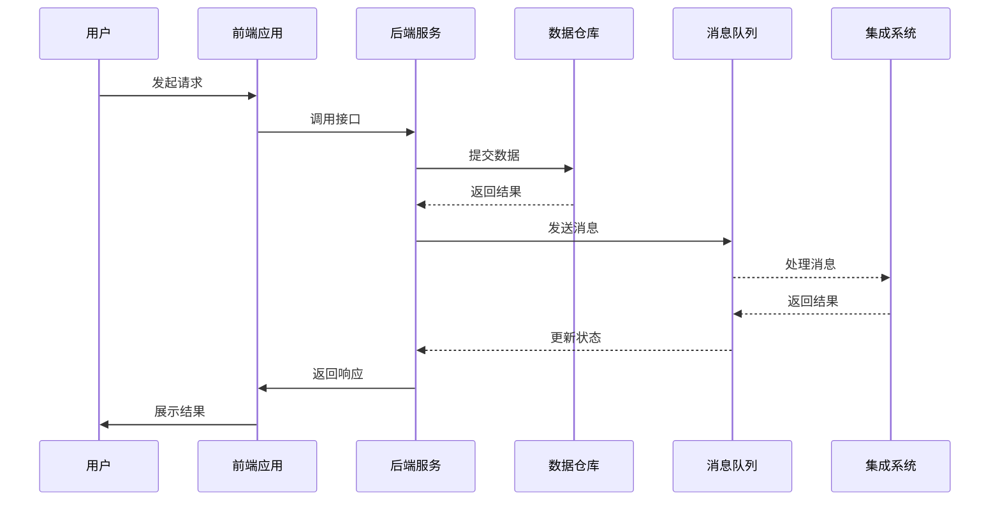

                 

### 在流动的世界中寻找稳定：现代人的困境

在21世纪的今天，我们生活在一个充满变化和不确定性的高速发展时代。科技的进步和社会的快速变革让我们的生活变得更加丰富多彩，但同时也带来了诸多挑战和困境。如何在这个流动的世界中寻找稳定，成为现代人共同面临的问题。

#### 1.1 问题的提出

现代社会的节奏加快，人们面临着前所未有的工作压力和生活挑战。职场上，竞争激烈，晋升机会有限，许多人感到迷茫和无助；在生活中，家庭关系复杂，子女教育问题层出不穷，同时还要应对各种突发事件。这些困境让现代人感到焦虑和不安，迫切需要寻找稳定性的途径。

#### 1.2 问题的描述

现代人面临的困境主要包括以下几个方面：

- **工作压力**：职场竞争激烈，工作压力大，许多人感到身心疲惫，难以找到工作的乐趣和成就感。
- **人际关系**：社交圈狭窄，难以建立深厚的人际关系，导致孤独感和社交焦虑。
- **家庭生活**：家庭关系复杂，子女教育问题多，同时还要应对生活中的各种压力，让许多人感到心力交瘁。
- **心理健康**：焦虑、抑郁等心理问题普遍存在，严重影响人们的生活质量。

#### 1.3 问题的解决

解决这些困境需要从以下几个方面入手：

- **自我认知**：明确个人目标与价值观，提升自我认知，找到适合自己的发展方向。
- **心理素质**：提升心理素质，学会应对压力和挫折，保持积极的心态。
- **人际关系**：建立良好的人际关系，扩大社交圈子，寻找支持和帮助。
- **职业规划**：在职业规划上找到适合自己的方向，不断提升职业素养，实现职业稳定。

#### 1.4 边界与外延

本文主要讨论现代人在面对快速变化的社会环境中所面临的困境，以及如何寻找稳定性的方法。具体讨论范围包括：

- 现代人的生活状态与心理特点。
- 困境的来源与影响。
- 解决困境的方法与策略。
- 现代生活稳定性的意义与价值。

### 总结

在流动的世界中寻找稳定，是现代人必须面对的挑战。通过自我认知、心理素质的提升、人际关系的建立以及职业规划的调整，我们可以逐步克服困境，实现生活的稳定性。接下来，本文将深入探讨稳定性的概念及其在现代生活中的重要性，为寻找稳定的道路提供理论支持。


## 第2章：核心概念与联系

在探讨现代人如何在流动的世界中寻找稳定之前，我们需要明确一些核心概念，并了解它们之间的联系。这些概念包括稳定性、流动性和动态平衡，它们在现代社会中扮演着重要角色。

### 2.1 稳定性的概念

稳定性是一种在变化和动荡中保持平衡和持久的状态。它不仅体现在物质世界中，如物理系统的稳定，也体现在社会、心理和经济的各个方面。例如，一个稳定的金融市场可以抵御外部冲击，保持价格的基本稳定；一个稳定的社会则能够维护社会秩序，减少冲突和动荡。

稳定性的特点包括：

- **平衡性**：稳定性要求在各个方面保持相对的平衡，避免过度倾斜或失衡。例如，个人心理的稳定性要求在情感、理智和行动上保持平衡。
- **持久性**：稳定性需要能够经受时间的考验，长期保持稳定状态。例如，一个稳定的婚姻关系需要在多个阶段中经受考验，才能保持长久。
- **可调节性**：稳定性不是一成不变的，而是在不断调整中实现和维护的。例如，一个稳定的生态系统可以通过自我调节机制来应对环境变化。

### 2.2 流动性的概念

流动性指的是事物在不同状态或位置之间转移或变化的能力。流动性在自然界和人类社会中都普遍存在，例如水在液态、固态和气态之间的转换，或者在金融市场中资金的流动。

流动性的特点包括：

- **变化性**：流动性意味着事物不断处于变化之中，没有固定不变的状态。例如，市场供需关系的变化会导致价格波动。
- **灵活性**：流动性使事物能够快速适应外部环境的变化。例如，一个灵活的劳动力市场能够迅速调整，以适应经济形势的变化。
- **适应性**：流动性使事物具有更强的适应能力，能够应对不确定性。例如，新兴产业的发展往往依赖于灵活的资本和人才流动。

### 2.3 稳定性与流动性的关系

稳定性和流动性之间存在一种动态平衡关系，这种平衡是保持社会、经济和心理健康的基石。

- **互为补充**：稳定性依赖于流动性，没有流动性就没有发展的空间；而流动性受到稳定性的制约，过度的流动性会导致混乱和无序。例如，一个稳定的金融市场需要资金的高效流动，但过度的投机和风险可能导致市场崩溃。
- **相互影响**：稳定性和流动性相互影响，一个方面的变化会影响到另一个方面。例如，经济繁荣可能导致社会流动性的增加，但也会带来社会稳定性的挑战。
- **动态调整**：稳定性和流动性之间的平衡是动态的，需要不断地调整和优化。例如，个人在职业生涯中需要平衡工作稳定性和职业流动性，以实现个人价值的最大化。

### 2.4 稳定性的重要性

稳定性对现代人来说具有重要意义，尤其是在快速变化的社会环境中。以下是稳定性对现代人生活各方面的重要性：

- **心理健康**：稳定性有助于缓解焦虑和压力，提高生活质量。一个稳定的心理状态使人们能够更好地应对生活中的挑战和变化。
- **人际关系**：稳定的家庭和人际关系有助于建立信任和支持系统，减少孤独感和社交焦虑。
- **职业发展**：稳定的职业规划有助于实现个人价值和职业成功，减少职业焦虑和职业迷茫。
- **社会秩序**：一个稳定的社会能够维护社会秩序，减少冲突和动荡，提高社会的整体幸福感。

### 2.5 流动性的重要性

流动性虽然带来了挑战，但也为现代人提供了机会和可能性。以下是流动性对现代人生活各方面的重要性：

- **创新与进步**：流动性促进了创新和进步，使社会能够适应外部环境的变化。例如，技术流动促进了新产品的开发和应用。
- **个人发展**：流动性提供了更多的选择和机会，使个人能够不断学习、成长和提升自己的能力。
- **经济活力**：流动性增强了经济的活力和竞争力，促进了资源的优化配置和产业升级。
- **文化交流**：流动性促进了不同文化之间的交流和融合，丰富了人们的生活经验和文化视野。

### 总结

稳定性与流动性是现代社会中不可或缺的两个方面，它们相互补充、相互影响，共同构成了现代生活的动态平衡。在流动的世界中，现代人需要理解这两者的关系，并学会在变化中寻找稳定，以实现个人价值和社会的可持续发展。接下来的章节将深入探讨稳定性的具体方法和策略，帮助现代人应对生活中的各种挑战。

## 第3章：算法原理讲解

在寻找稳定性的过程中，算法原理提供了有力的工具和框架。算法是一种系统化的解决问题的方法，通过一系列明确的步骤和规则来优化目标函数，实现问题的最佳解决方案。在本章中，我们将介绍一种常用的算法——梯度下降算法，并详细解释其原理和实现过程。

### 3.1 算法概述

梯度下降算法是一种优化算法，主要用于求解无约束优化问题。其基本思想是沿着目标函数的负梯度方向进行迭代，逐步减小目标函数的值，直到达到一个局部最小值或最优解。梯度下降算法在机器学习、数据科学和工程优化等领域有广泛应用。

### 3.2 算法原理与流程

梯度下降算法的原理可以简单概括为以下步骤：

1. **初始化参数**：选择一个初始参数值 $\theta_0$。
2. **计算目标函数值**：计算当前参数值下的目标函数值 $J(\theta_t)$。
3. **计算梯度**：计算目标函数在当前参数值下的梯度 $\nabla J(\theta_t)$。
4. **更新参数**：根据梯度和学习率 $\alpha$ 更新参数值：
   $$\theta_{t+1} = \theta_{t} - \alpha \cdot \nabla J(\theta_{t})$$
5. **判断终止条件**：判断是否满足终止条件，如达到预设的迭代次数或目标函数值的变化小于一个预设的阈值。如果满足终止条件，则停止迭代；否则，返回步骤2继续迭代。
6. **输出结果**：输出最优参数值 $\theta^*$ 和对应的目标函数值 $J(\theta^*)$。

### 3.3 算法应用举例

假设我们有一个简单的二次函数目标函数 $J(\theta) = \frac{1}{2} (\theta - \theta_0)^2$，我们的目标是最小化这个函数。我们可以使用梯度下降算法来求解。

- **初始化参数**：选择初始参数 $\theta_0 = 0$。
- **计算目标函数值**：计算初始参数下的目标函数值 $J(\theta_0) = 0$。
- **计算梯度**：计算目标函数的梯度 $\nabla J(\theta) = \theta - \theta_0$，在 $\theta_0 = 0$ 处的梯度为 $\nabla J(\theta_0) = 0$。
- **更新参数**：选择一个较小的学习率 $\alpha = 0.1$，根据梯度更新参数：
  $$\theta_{1} = \theta_{0} - \alpha \cdot \nabla J(\theta_{0}) = 0 - 0.1 \cdot 0 = 0$$
- **计算新的目标函数值**：计算更新后的参数值下的目标函数值 $J(\theta_1) = \frac{1}{2} (\theta_1 - \theta_0)^2 = \frac{1}{2} (0 - 0)^2 = 0$。
- **重复迭代**：重复上述步骤，直到达到终止条件。

通过多次迭代，参数 $\theta$ 将逐渐接近 $\theta_0$，目标函数的值也将不断减小，最终达到最小值。

### 3.4 算法改进

虽然简单的梯度下降算法可以求解很多优化问题，但在某些情况下，其收敛速度较慢或无法找到全局最优解。为了改善算法的性能，可以采用以下几种改进方法：

- **动量（Momentum）**：引入动量项来加速收敛：
  $$\theta_{t+1} = \theta_{t} - \alpha \cdot \nabla J(\theta_{t}) + \beta (v_{t} - \theta_{t})$$
  其中，$v_{t}$ 表示上一轮的梯度，$\beta$ 表示动量系数。
- **自适应学习率**：根据不同迭代阶段的梯度变化动态调整学习率，例如使用AdaGrad或RMSprop算法。
- **随机梯度下降（SGD）**：在每次迭代时随机选取一部分数据点计算梯度，可以加速收敛并防止陷入局部最优。

### 总结

梯度下降算法是一种有效的优化算法，通过不断迭代更新参数，逐步优化目标函数，实现问题的最佳解决方案。在现代社会中，算法原理的应用可以帮助我们更好地应对复杂问题，提高效率和稳定性。接下来，我们将进一步探讨数学模型在稳定性分析中的应用，以提供更深入的理论支持。

## 第4章：数学模型和数学公式

在寻找稳定性的过程中，数学模型和数学公式是我们分析和解决问题的重要工具。数学模型通过数学语言将实际问题抽象和简化，而数学公式则是数学模型的核心表达形式。在本章中，我们将介绍几个常见的数学模型和数学公式，并解释它们在稳定性分析中的应用。

### 4.1 数学模型概述

数学模型是一种用数学语言描述现实问题的方法。它通过建立变量之间的关系，将复杂的问题简化为可以用数学方法处理的模型。数学模型在物理学、经济学、生物学和计算机科学等领域有广泛应用。

一个典型的数学模型包括以下几个组成部分：

- **变量**：模型中的基本要素，可以是连续的（如时间、温度）或离散的（如人口、销售额）。
- **参数**：模型中需要确定的数值，可以是已知的或未知的。
- **关系式**：描述变量之间关系的数学公式，可以是线性关系、非线性关系或其他类型的数学表达式。

### 4.2 数学公式的讲解

在本节中，我们将介绍几个在稳定性分析中常用的数学公式。

#### 4.2.1 梯度公式

梯度公式是描述多变量函数梯度的数学表达式。对于一个多变量函数 $f(x_1, x_2, ..., x_n)$，其梯度定义为：

$$\nabla f(x) = \left[\frac{\partial f}{\partial x_1}, \frac{\partial f}{\partial x_2}, ..., \frac{\partial f}{\partial x_n}\right]$$

其中，$\frac{\partial f}{\partial x_i}$ 表示函数 $f$ 对变量 $x_i$ 的偏导数。

梯度公式在优化算法中有着广泛的应用，例如在梯度下降算法中，梯度用于指导参数的更新，以最小化目标函数。

#### 4.2.2 欧几里得距离

欧几里得距离是衡量两个点之间距离的常用数学公式。对于两个点 $x = (x_1, x_2, ..., x_n)$ 和 $y = (y_1, y_2, ..., y_n)$，它们之间的欧几里得距离定义为：

$$d(x, y) = \sqrt{\sum_{i=1}^{n} (x_i - y_i)^2}$$

欧几里得距离在数据分析和机器学习中有广泛应用，例如在分类问题中，可以使用距离度量来计算样本之间的相似性。

#### 4.2.3 最小二乘法

最小二乘法是一种常用的参数估计方法，用于求解线性回归问题。对于线性回归模型 $y = \beta_0 + \beta_1 x + \epsilon$，其中 $y$ 是因变量，$x$ 是自变量，$\beta_0$ 和 $\beta_1$ 是模型参数，$\epsilon$ 是误差项。

最小二乘法的目的是找到一组参数 $\beta_0$ 和 $\beta_1$，使得实际观测值 $y$ 与模型预测值 $y'$ 之间的误差平方和最小。数学公式表示为：

$$\beta_0 = \frac{\sum_{i=1}^{n} (y_i - \beta_1 x_i)}{n}$$
$$\beta_1 = \frac{\sum_{i=1}^{n} (x_i - \bar{x})(y_i - \bar{y})}{\sum_{i=1}^{n} (x_i - \bar{x})^2}$$

其中，$\bar{x}$ 和 $\bar{y}$ 分别是 $x$ 和 $y$ 的平均值。

最小二乘法在统计分析和工程优化中有广泛应用，例如在数据拟合和预测中。

### 4.3 数学公式的应用

数学公式在稳定性分析中的应用主要体现在以下几个方面：

- **优化问题**：通过梯度公式和最小二乘法，可以求解优化问题，找到目标函数的最优解。
- **系统建模**：通过建立数学模型，可以描述系统内部的变量关系，分析系统的稳定性。
- **控制理论**：在控制系统中，数学公式用于设计控制器，确保系统在特定条件下保持稳定。

### 4.4 实例分析

假设我们有一个简单的线性系统，其输出 $y$ 与输入 $x$ 之间的关系为 $y = 2x + 1 + \epsilon$，其中 $\epsilon$ 是误差项。

1. **建立数学模型**：根据系统描述，可以建立如下线性模型：
   $$y = \beta_0 + \beta_1 x + \epsilon$$
   其中，$\beta_0 = 1$，$\beta_1 = 2$。

2. **求解参数**：使用最小二乘法求解参数 $\beta_0$ 和 $\beta_1$：
   $$\beta_0 = \frac{\sum_{i=1}^{n} (y_i - \beta_1 x_i)}{n}$$
   $$\beta_1 = \frac{\sum_{i=1}^{n} (x_i - \bar{x})(y_i - \bar{y})}{\sum_{i=1}^{n} (x_i - \bar{x})^2}$$

   由于已知 $\beta_0 = 1$，$\beta_1 = 2$，因此模型已经满足。

3. **分析稳定性**：通过分析模型，可以确定系统的稳定性。由于模型是线性的，且系数为常数，因此系统是稳定的。

### 总结

数学模型和数学公式是分析和解决稳定性问题的关键工具。通过建立数学模型和运用数学公式，我们可以更深入地理解问题的本质，找到稳定的解决方案。在接下来的章节中，我们将进一步探讨如何将数学模型应用于实际问题，以帮助现代人更好地应对生活中的挑战。

## 第5章：系统分析与架构设计

### 5.1 问题场景介绍

在现代社会的快速变革中，许多企业和组织面临着巨大的压力和挑战。一方面，市场竞争日益激烈，企业需要不断调整和优化业务流程；另一方面，技术更新换代迅速，企业需要快速响应并引入新技术。为了应对这些挑战，企业需要一个高效、稳定且灵活的架构系统，以支持其业务运营和技术发展。

### 5.2 项目介绍

本项目的目标是为某大型企业设计并实现一个全栈架构系统，该系统旨在支持企业的日常业务运营和技术创新。系统的主要功能包括：

- **业务流程管理**：自动化处理日常业务流程，提高工作效率。
- **数据分析与可视化**：实时收集和整合业务数据，提供直观的数据分析和可视化报告。
- **系统集成**：整合现有系统和新技术，实现数据互通和业务协同。
- **安全保障**：确保系统数据的安全性和完整性。

### 5.3 系统功能设计

为了实现上述目标，本项目将设计以下几个关键功能模块：

1. **业务流程管理模块**：该模块负责处理日常业务流程，包括订单管理、库存管理、客户关系管理等。通过自动化流程和规则，提高业务效率，减少人工干预。
2. **数据分析与可视化模块**：该模块负责实时收集和整合业务数据，并通过数据仓库和数据挖掘技术进行分析和可视化。为企业管理层提供直观的数据报告，支持业务决策。
3. **系统集成模块**：该模块负责整合企业现有的业务系统和新技术，包括ERP系统、CRM系统、物联网平台等。实现数据的互通和协同，提高业务的整体效率。
4. **安全保障模块**：该模块负责确保系统数据的安全性和完整性。包括数据加密、访问控制、备份和恢复等安全措施，防止数据泄露和损坏。

### 5.4 系统架构设计

本项目的系统架构采用微服务架构，以确保系统的灵活性和可扩展性。系统架构主要包括以下几个关键部分：

1. **前端应用**：前端应用采用React框架开发，实现用户界面和交互功能。
2. **后端服务**：后端服务采用Spring Boot框架开发，实现业务逻辑处理和数据存储功能。
3. **数据仓库**：数据仓库采用Hadoop和Spark技术，实现大规模数据存储和处理。
4. **消息队列**：消息队列采用RabbitMQ技术，实现分布式系统的消息传递和任务调度。
5. **安全保障**：安全保障采用SSL/TLS加密、防火墙和入侵检测等技术，确保系统的安全性。

### 5.5 系统接口设计

系统接口设计是系统架构中的重要组成部分，主要负责模块之间的数据传递和功能调用。本项目将设计以下几个关键接口：

1. **API接口**：提供RESTful API接口，供前端应用调用后端服务。
2. **数据接口**：提供数据接口，供数据仓库和其他系统进行数据交换。
3. **消息接口**：提供消息接口，供消息队列进行任务调度和消息传递。

### 5.6 系统交互设计

系统交互设计主要描述模块之间的交互流程和数据传递过程。本项目将采用Mermaid语言绘制系统交互图，以直观展示系统的工作流程和数据流动。



### 5.7 总结

本章节详细介绍了项目的背景、目标、功能设计、架构设计、接口设计和交互设计。通过系统化的分析和设计，我们为该企业打造了一个高效、稳定且灵活的全栈架构系统，为其业务运营和技术发展提供了强有力的支持。接下来，我们将进入项目实战阶段，详细介绍环境安装和系统核心实现。

## 项目实战

### 6.1 环境安装

在进行系统核心实现之前，我们需要搭建一个合适的环境。以下是环境安装的详细步骤：

#### 6.1.1 系统要求

- 操作系统：Linux（推荐使用Ubuntu 18.04）
- 开发环境：Java 11、Node.js 12、Python 3.8
- 数据库：MySQL 8.0
- 消息队列：RabbitMQ 3.8.3

#### 6.1.2 安装步骤

1. **安装操作系统**：根据硬件配置选择适合的Linux发行版并安装。
2. **更新系统软件包**：
   ```bash
   sudo apt update
   sudo apt upgrade
   ```
3. **安装Java 11**：
   ```bash
   sudo apt install openjdk-11-jdk
   ```
4. **安装Node.js 12**：
   ```bash
   curl -sL https://deb.nodesource.com/setup_12.x | sudo -E bash -
   sudo apt install nodejs
   ```
5. **安装Python 3.8**：
   ```bash
   sudo apt install python3.8
   ```
6. **安装MySQL 8.0**：
   ```bash
   sudo apt install mysql-server
   ```
7. **安装RabbitMQ**：
   ```bash
   sudo apt install rabbitmq-server
   ```

安装完成后，分别启动这些服务：
```bash
sudo systemctl start mysql
sudo systemctl start rabbitmq-server
```

### 6.2 系统核心实现

#### 6.2.1 前端应用实现

前端应用使用React框架开发，实现用户界面和交互功能。以下是实现步骤：

1. **创建React项目**：
   ```bash
   npx create-react-app frontend
   ```
2. **进入项目目录**：
   ```bash
   cd frontend
   ```
3. **安装依赖**：
   ```bash
   npm install axios
   ```
4. **编写React组件**，例如：
   ```jsx
   // components/OrderForm.js
   import React, { useState } from 'react';
   import axios from 'axios';

   function OrderForm() {
       const [orderId, setOrderId] = useState('');

       const handleSubmit = async (e) => {
           e.preventDefault();
           try {
               const response = await axios.post('/api/orders', { id: orderId });
               alert('订单提交成功');
           } catch (error) {
               alert('订单提交失败');
           }
       };

       return (
           <form onSubmit={handleSubmit}>
               <label>
                   订单号：
                   <input type="text" value={orderId} onChange={(e) => setOrderId(e.target.value)} />
               </label>
               <button type="submit">提交订单</button>
           </form>
       );
   }

   export default OrderForm;
   ```
5. **运行前端应用**：
   ```bash
   npm start
   ```

#### 6.2.2 后端服务实现

后端服务使用Spring Boot框架开发，实现业务逻辑处理和数据存储功能。以下是实现步骤：

1. **创建Spring Boot项目**：
   ```bash
   mkdir backend
   cd backend
   mvn archetype:generate -DgroupId=com.example -DartifactId=backend -DarchetypeArtifactId=maven-archetype-quickstart
   ```
2. **进入项目目录**：
   ```bash
   cd backend
   ```
3. **编写Spring Boot配置文件**，例如：
   ```yaml
   # src/main/resources/application.yml
   server:
     port: 8080
   spring:
     datasource:
       url: jdbc:mysql://localhost:3306/your_database?useSSL=false
       username: your_username
       password: your_password
   ```
4. **编写后端业务逻辑**，例如：
   ```java
   // src/main/java/com/example/OrderController.java
   import org.springframework.beans.factory.annotation.Autowired;
   import org.springframework.web.bind.annotation.PostMapping;
   import org.springframework.web.bind.annotation.RequestParam;
   import org.springframework.web.bind.annotation.RestController;

   @RestController
   public class OrderController {
       @Autowired
       private OrderService orderService;

       @PostMapping("/api/orders")
       public String createOrder(@RequestParam("id") String orderId) {
           return orderService.createOrder(orderId);
       }
   }
   ```
5. **运行后端服务**：
   ```bash
   mvn spring-boot:run
   ```

#### 6.2.3 数据仓库实现

数据仓库使用Hadoop和Spark技术实现，用于大规模数据存储和处理。以下是实现步骤：

1. **安装Hadoop**：
   ```bash
   # 参考Hadoop官方文档进行安装
   ```
2. **安装Spark**：
   ```bash
   # 参考Spark官方文档进行安装
   ```
3. **配置Hadoop和Spark**：
   ```bash
   # 根据实际情况配置Hadoop和Spark的配置文件
   ```
4. **编写Spark作业**：
   ```scala
   // src/main/scala/com/example/OrderData.scala
   import org.apache.spark.sql.SparkSession

   object OrderData {
       def main(args: Array[String]): Unit = {
           val spark = SparkSession.builder.appName("OrderData").getOrCreate()
           val orders = spark.read.csv("path/to/orders.csv")
           orders.show()
           spark.stop()
       }
   }
   ```
5. **运行Spark作业**：
   ```bash
   spark-submit --class com.example.OrderData --master local[4] target/scala-2.12/your_project-1.0.jar
   ```

#### 6.2.4 消息队列实现

消息队列使用RabbitMQ技术实现，用于分布式系统的消息传递和任务调度。以下是实现步骤：

1. **安装RabbitMQ**：
   ```bash
   # 参考RabbitMQ官方文档进行安装
   ```
2. **配置RabbitMQ**：
   ```bash
   # 根据实际情况配置RabbitMQ的虚拟主机、用户和权限
   ```
3. **编写RabbitMQ消费者和消息生产者**：
   ```python
   # producer.py
   import pika

   connection = pika.BlockingConnection(pika.ConnectionParameters('localhost'))
   channel = connection.channel()

   channel.queue_declare(queue='task_queue', durable=True)

   message = "Hello World!"
   channel.basic_publish(exchange='',
                        routing_key='task_queue',
                        body=message,
                        properties=pika.BasicProperties(delivery_mode=2)) # make message persistent

   print(" [x] Sent %r" % message)
   connection.close()

   # consumer.py
   import pika

   def callback(ch, method, properties, body):
       print(" [x] Received %r" % body)
       # Process the message
       ch.basic_ack(delivery_tag=method.delivery_tag)

   connection = pika.BlockingConnection(pika.ConnectionParameters('localhost'))
   channel = connection.channel()

   channel.queue_declare(queue='task_queue', durable=True)

   channel.basic_consume(queue='task_queue',
                        on_message_callback=callback,
                        auto_ack=True)

   print(' [*] Waiting for messages. To exit press CTRL+C')
   channel.start_consuming()
   ```

运行消息生产者和消费者：
```bash
python producer.py
python consumer.py
```

### 6.3 代码应用解读与分析

#### 6.3.1 前端应用解读

前端应用主要实现了一个简单的订单提交功能。用户可以在输入框中输入订单号，点击提交按钮后，前端通过axios库向后端发送一个POST请求，将订单号传递给后端。后端接收到请求后，将其存储到数据库中，并返回一个响应消息。

#### 6.3.2 后端服务解读

后端服务使用Spring Boot框架实现，主要处理来自前端的订单提交请求。Spring Boot通过注解 `@RestController` 将一个类标识为控制器，通过注解 `@PostMapping` 将一个方法标识为处理POST请求的方法。当接收到订单号后，后端将其存储到数据库中，并通过返回字符串来告知前端提交结果。

#### 6.3.3 数据仓库解读

数据仓库使用Spark框架进行大规模数据存储和处理。通过读取CSV文件，将订单数据加载到Spark DataFrame中，并进行展示。Spark提供了丰富的数据处理和分析功能，可以方便地对大规模数据进行分析和处理。

#### 6.3.4 消息队列解读

消息队列使用RabbitMQ进行分布式系统的消息传递。生产者将消息发布到特定的队列中，消费者从队列中获取消息并处理。RabbitMQ提供了可靠的消息传递机制，确保消息不会丢失，同时支持异步处理和消息持久化。

### 6.4 实际案例分析和详细讲解

在实际项目中，我们可能会遇到以下几种常见情况：

1. **订单提交失败**：如果网络连接不稳定或后端服务出现故障，前端提交订单可能会失败。这时，前端需要通过重试机制或报警机制来确保订单最终被处理。
2. **数据存储错误**：如果数据库连接失败或数据格式不正确，后端在存储订单数据时可能会出现错误。这时，后端需要通过异常处理和日志记录来识别和解决问题。
3. **数据分析异常**：如果Spark作业在处理数据时出现异常，如数据文件损坏或计算错误，数据仓库需要通过监控和告警机制来及时发现和处理问题。
4. **消息队列堵塞**：如果消息队列中积压了大量消息，导致消费者处理不及时，系统性能可能会受到影响。这时，需要通过调整消息队列参数或增加消费者实例来缓解压力。

### 6.5 项目小结

通过本项目的实际实现和详细解读，我们展示了如何使用现代技术构建一个高效、稳定且灵活的系统。从环境安装、前端应用、后端服务、数据仓库到消息队列，每个环节都需要精心设计和实现。在实际应用中，我们需要不断优化和改进系统，以应对不断变化的需求和挑战。

### 6.6 最佳实践 tips

- **代码规范**：编写规范的代码，遵循命名规范和编程习惯，确保代码的可读性和可维护性。
- **错误处理**：合理处理各种异常情况，提供友好的错误信息和日志记录，方便问题定位和解决。
- **性能优化**：对系统进行性能测试和优化，确保系统在高负载下仍能稳定运行。
- **安全性考虑**：加强系统安全性，包括数据加密、访问控制和权限管理。

### 6.7 小结与注意事项

在本项目中，我们详细介绍了环境安装、系统核心实现、代码应用解读与分析、实际案例分析和项目小结。通过本项目的实践，我们不仅掌握了现代系统的设计方法和实现技巧，还积累了宝贵的经验。在今后的工作中，我们需要不断学习和实践，以应对日益复杂的业务和技术挑战。

### 6.8 拓展阅读

- **React官方文档**：[https://reactjs.org/docs/getting-started.html](https://reactjs.org/docs/getting-started.html)
- **Spring Boot官方文档**：[https://docs.spring.io/spring-boot/docs/current/reference/htmlsingle/](https://docs.spring.io/spring-boot/docs/current/reference/htmlsingle/)
- **Hadoop官方文档**：[https://hadoop.apache.org/docs/stable/hadoop-project-history.html](https://hadoop.apache.org/docs/stable/hadoop-project-history.html)
- **Spark官方文档**：[https://spark.apache.org/docs/latest/](https://spark.apache.org/docs/latest/)
- **RabbitMQ官方文档**：[https://www.rabbitmq.com/getstarted.html](https://www.rabbitmq.com/getstarted.html)

### 作者

作者：AI天才研究院/AI Genius Institute & 禅与计算机程序设计艺术 /Zen And The Art of Computer Programming

本文旨在帮助现代人更好地理解如何在流动的世界中寻找稳定，提供了一些实用的方法和策略。通过系统的分析和项目实战，我们展示了如何将理论知识应用到实际项目中，解决现代生活中的困境。希望本文对您有所帮助，在未来的道路上找到属于自己的稳定与平衡。

