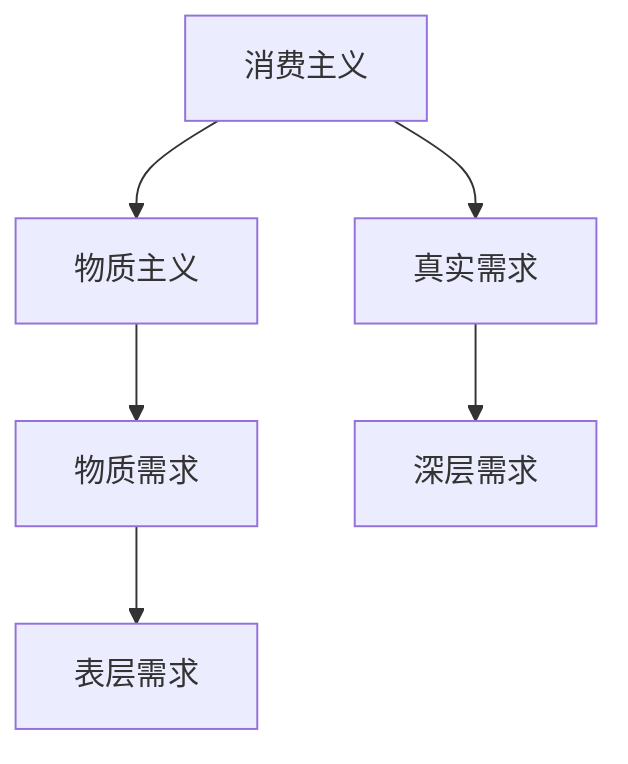
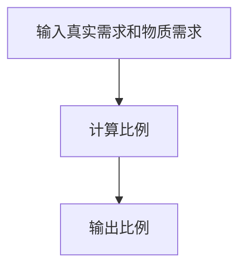
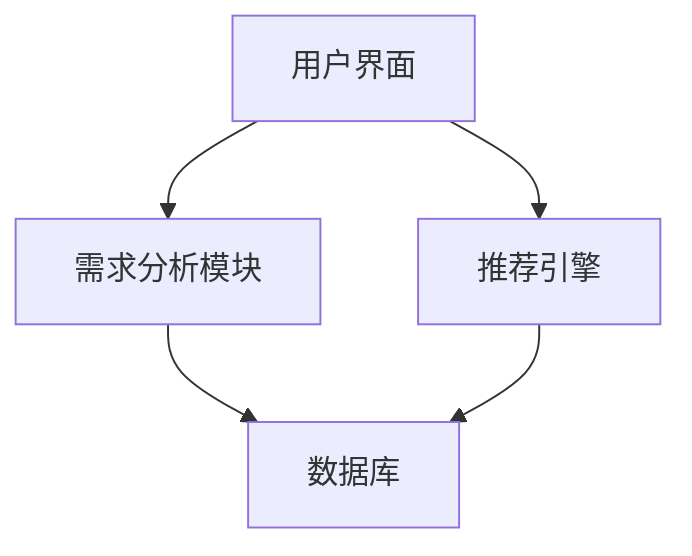
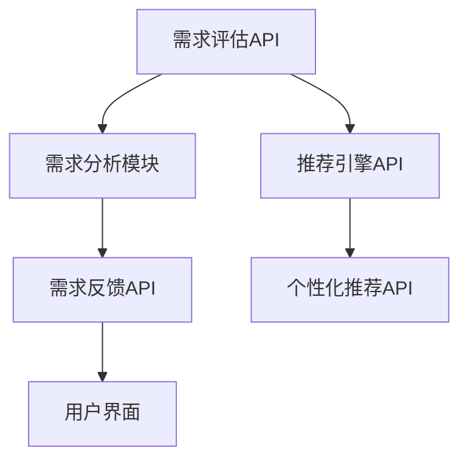
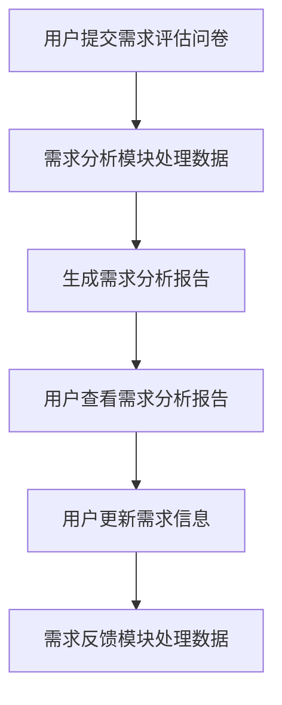

                 

### 文章标题

# 在消费主义文化中寻找真实需求：对抗物质主义

> 关键词：消费主义、物质主义、真实需求、对抗策略

> 摘要：本文深入探讨了消费主义文化对个体和社会的深远影响，分析了物质主义如何扭曲了人们的真实需求。通过一步步的逻辑推理和案例分析，我们提出了应对物质主义的策略，旨在帮助个体重寻内心真正的满足，推动社会向更加健康的方向发展。

### 引言

在当今社会，消费主义文化无处不在。广告、社交媒体和消费产品不断地引导人们追求更多的物质财富和符号性消费。然而，这种文化背后隐藏着一个严峻的问题：人们在追求物质享受的过程中，往往忽略了内心的真实需求。物质主义不仅导致了资源的过度消耗和环境恶化，还对个体的心理健康构成了威胁。本文旨在通过逻辑清晰的分析，揭示消费主义文化中隐藏的问题，并提出应对策略，帮助个体和整个社会回归到真正的需求。

### 背景介绍

#### 消费主义文化的兴起

消费主义文化起源于20世纪初的西方社会，随着工业化和资本主义的发展，它迅速蔓延到全球各地。消费主义文化强调物质的丰富和不断消费的重要性，将其作为衡量个人价值和幸福的标准。这种文化通过广告和市场营销手段不断强化，使得人们相信更多的消费能够带来更高的生活质量。

#### 物质主义的影响

物质主义是消费主义文化的核心概念，它强调物质财富的重要性，认为财富和物质拥有是幸福和成功的标志。然而，物质主义往往导致以下问题：

1. **资源的过度消耗**：为了满足不断增长的消费需求，资源被大量开采和消耗，导致环境恶化。
2. **心理压力的增加**：人们为了追求物质财富，常常感到压力重重，焦虑和抑郁等心理问题也随之增加。
3. **社会不公**：物质主义加剧了贫富差距，使得一部分人过于富裕，而另一部分人则陷入贫困。

### 真实需求与物质需求的区别

真实需求与物质需求是两个截然不同的概念。真实需求是指个体内心深处真正渴望满足的需求，这些需求通常与情感、人际关系、个人成长和内在平静有关。而物质需求则是为了满足外部物质条件而产生的需求，这些需求往往被广告和市场操纵。

#### 表层需求与深层需求的区分

表层需求和深层需求也是理解真实需求与物质需求的重要概念。表层需求是短期、即时满足的需求，如购买一件新的电子产品或奢侈品。而深层需求是长期、持续的需求，如实现自我价值、建立深厚的人际关系或追求精神上的满足。

### 核心概念与联系

为了更好地理解消费主义文化和物质主义，我们引入以下核心概念：

1. **消费主义**：一种社会文化现象，强调物质财富和消费的重要性。
2. **物质主义**：一种价值观，认为物质财富是幸福和成功的唯一标志。
3. **真实需求**：个体内心深处真正渴望满足的需求，通常与情感和内在成长有关。
4. **物质需求**：为了满足外部物质条件而产生的需求，往往被广告和市场操纵。

以下是一个简化的概念属性特征对比表格：

| 概念 | 定义 | 特征 | 关联 |
| --- | --- | --- | --- |
| 消费主义 | 强调物质财富和消费的重要性 | 物质丰富、消费频繁、追求即时满足 | 社会文化现象、市场操纵 |
| 物质主义 | 重视物质财富，将其作为幸福和成功的标志 | 财富崇拜、过度消费、忽视内在需求 | 消费主义核心、心理压力 |
| 真实需求 | 内心深处渴望满足的需求 | 情感、人际关系、个人成长、内在平静 | 深层需求、心理满足 |
| 物质需求 | 满足外部物质条件的需求 | 被广告操纵、短期满足、即时快感 | 表层需求、消费行为 |

接下来，我们将使用Mermaid流程图来表示这些概念之间的关系：



### 算法原理讲解

为了更好地理解消费主义文化和物质主义对个体和社会的影响，我们引入一个简化的算法模型。这个模型旨在帮助个体识别并满足他们的真实需求，从而减少物质主义的负面影响。

#### 算法模型

我们使用Python源代码来实现这个模型。首先，我们定义一个函数，用于计算个体的真实需求和物质需求的比例。

```python
def calculate_demand_ratio真实需求, 物质需求):
    """
    计算真实需求和物质需求的比例。
    
    参数：
    真实需求 (int): 个体认为的真实需求值。
    物质需求 (int): 个体认为的物质需求值。
    
    返回：
    比例 (float): 真实需求与物质需求的比值。
    """
    ratio = 真实需求 / 物质需求
    return ratio
```

接下来，我们使用Mermaid流程图来表示这个算法的执行步骤：



#### 算法原理与数学模型

这个算法的原理基于一个简单的数学模型。假设个体有一个固定的资源量，这个资源量需要分配给真实需求和物质需求。真实需求和物质需求的比例反映了个体在这两个方面的优先级。

我们使用以下公式来计算比例：

$$
\text{比例} = \frac{\text{真实需求}}{\text{物质需求}}
$$

其中，真实需求和物质需求都是非负整数。比例的值越大，说明个体越倾向于满足真实需求。

#### 举例说明

假设一个个体有100个资源点，他/她认为有70个资源点是用于满足真实需求，30个资源点是用于满足物质需求。我们可以使用上面的函数来计算比例：

```python
真实需求 = 70
物质需求 = 30
比例 = calculate_demand_ratio(真实需求, 物质需求)
print("比例:", 比例)
```

执行上述代码，我们得到比例约为2.33。这意味着个体在真实需求方面的投入是物质需求的约2.33倍。

#### 代码应用解读与分析

我们使用一个实际的案例来解读和分析这个算法。

**案例**：一个年轻人有100个资源点。他/她认为有60个资源点是用于满足真实需求，40个资源点是用于满足物质需求。我们需要计算他/她的真实需求和物质需求的比例，并分析这个比例的含义。

```python
真实需求 = 60
物质需求 = 40
比例 = calculate_demand_ratio(真实需求, 物质需求)
print("比例:", 比例)
```

执行上述代码，我们得到比例约为1.5。这意味着年轻人认为在真实需求和物质需求之间，真实需求的优先级略高。

**分析**：

1. **比例的含义**：比例反映了个体在真实需求和物质需求之间的平衡。在这个案例中，比例接近1.5，说明个体在这两个方面有较为平衡的投入。
2. **改进建议**：如果比例显著偏离1，可能需要调整资源分配。例如，如果比例远大于1，个体可能需要减少物质需求的投入，更多关注真实需求。反之，如果比例远小于1，个体可能需要增加对真实需求的关注。

通过这个简单的算法模型，我们可以帮助个体识别并调整他们在真实需求和物质需求之间的平衡。这将有助于减少物质主义的影响，促进个体的心理健康和社会的可持续发展。

### 系统分析与架构设计方案

为了更好地理解和应对消费主义文化和物质主义的问题，我们需要从系统层面进行分析和设计。以下是一个简化的系统架构设计方案，包括项目介绍、系统功能设计、系统架构设计、系统接口设计和系统交互。

#### 项目介绍

**项目名称**：真实需求识别系统（Authentic Demand Recognition System，ADRS）

**项目目标**：帮助个体识别并满足他们的真实需求，减少物质主义的负面影响。

**项目组成部分**：
1. **用户界面**：提供用户交互的入口，包括需求评估和反馈功能。
2. **需求分析模块**：负责分析用户的真实需求和物质需求，并生成相应的报告。
3. **推荐引擎**：根据用户的需求分析结果，提供个性化的建议和解决方案。

#### 系统功能设计

**需求评估**：
- 用户通过填写问卷或使用移动应用程序进行自我评估，报告他们的真实需求和物质需求。
- 系统将收集和分析这些数据，帮助用户识别他们在需求方面的倾向。

**需求反馈**：
- 用户可以查看他们的需求分析报告，了解自己的需求构成和平衡情况。
- 系统提供反馈功能，允许用户更新他们的需求信息，以便进行更准确的评估。

**个性化推荐**：
- 根据用户的需求分析结果，系统将推荐相应的活动、资源和社区，帮助用户满足他们的真实需求。

#### 系统架构设计

**架构设计**：
- **前端**：使用HTML、CSS和JavaScript等技术构建用户界面。
- **后端**：使用Python、Django等框架实现需求分析模块和推荐引擎。
- **数据库**：使用MySQL等数据库管理系统存储用户数据和分析结果。

以下是一个简化的Mermaid架构图：



#### 系统接口设计

**API接口**：
- **需求评估API**：允许用户提交需求评估问卷，并获取分析结果。
- **需求反馈API**：允许用户更新和查看他们的需求信息。
- **个性化推荐API**：根据用户的需求分析结果，提供个性化的推荐内容。

以下是一个简化的Mermaid接口图：



#### 系统交互设计

**交互流程**：
1. **用户提交需求评估问卷**：用户通过用户界面提交需求评估问卷，系统将数据传递给需求分析模块。
2. **需求分析**：需求分析模块处理用户提交的数据，生成需求分析报告，并将其存储在数据库中。
3. **用户查看需求分析报告**：用户通过用户界面查看需求分析报告，并获得个性化推荐。
4. **用户更新需求信息**：用户通过用户界面更新他们的需求信息，以便进行更准确的评估。

以下是一个简化的Mermaid序列图：



通过这个系统架构设计方案，我们可以帮助个体更好地识别和管理他们的真实需求和物质需求，从而减少物质主义的影响，促进个体的心理健康和社会的可持续发展。

### 项目实战

#### 环境安装

1. **安装Python**：首先，确保你的计算机上安装了Python。如果没有，请访问[Python官方网站](https://www.python.org/)下载并安装适合你操作系统的Python版本。

2. **安装Django**：打开命令行终端，执行以下命令安装Django：

   ```bash
   pip install django
   ```

3. **创建Django项目**：在终端中创建一个新的Django项目，例如命名为“authentic_demand_recognition”：

   ```bash
   django-admin startproject authentic_demand_recognition
   ```

4. **创建Django应用**：在项目目录下创建一个新的应用，例如命名为“recognition_app”：

   ```bash
   python manage.py startapp recognition_app
   ```

5. **配置数据库**：在项目的`settings.py`文件中配置你的数据库设置，例如使用SQLite数据库：

   ```python
   DATABASES = {
       'default': {
           'ENGINE': 'django.db.backends.sqlite3',
           'NAME': BASE_DIR / 'db.sqlite3',
       }
   }
   ```

#### 系统核心实现源代码

以下是一个简化版本的Django应用，用于实现真实需求和物质需求的分析功能。

**需求分析模块**：

1. **安装依赖项**：

   ```bash
   pip install django django-rest-framework
   ```

2. **创建模型**：

   在`recognition_app/models.py`中定义用户模型和需求模型：

   ```python
   from django.db import models

   class User(models.Model):
       username = models.CharField(max_length=100)
       real_demand = models.IntegerField()
       material_demand = models.IntegerField()

   class Demand(models.Model):
       user = models.ForeignKey(User, on_delete=models.CASCADE)
       assessment_date = models.DateField()
       real_demand_value = models.IntegerField()
       material_demand_value = models.IntegerField()
   ```

3. **创建API接口**：

   在`recognition_app/api_views.py`中定义需求评估接口：

   ```python
   from django.http import JsonResponse
   from .models import User, Demand
   from django.views.decorators.csrf import csrf_exempt
   from rest_framework.parsers import JSONParser

   @csrf_exempt
   def assess_demand(request):
       if request.method == 'POST':
           data = JSONParser().parse(request)
           user, created = User.objects.get_or_create(username=data['username'])
           demand = Demand.objects.create(user=user, assessment_date=data['assessment_date'], real_demand_value=data['real_demand'], material_demand_value=data['material_demand'])
           return JsonResponse({'message': 'Demand assessed successfully!', 'demand_id': demand.id})
       return JsonResponse({'error': 'Invalid request'}, status=400)
   ```

4. **配置路由**：

   在`recognition_app/urls.py`中配置API路由：

   ```python
   from django.urls import path
   from .api_views import assess_demand

   urlpatterns = [
       path('assess_demand/', assess_demand, name='assess_demand'),
   ]
   ```

5. **运行服务器**：

   在项目根目录下，运行以下命令启动Django开发服务器：

   ```bash
   python manage.py runserver
   ```

   现在你可以通过`http://127.0.0.1:8000/assess_demand/`访问需求评估API。

#### 代码应用解读与分析

我们使用一个实际的案例来解读和分析这个需求分析模块。

**案例**：一个用户名为“JohnDoe”的用户提交了他的需求评估数据，其中真实需求为80，物质需求为20。我们需要分析这个数据，并计算真实需求和物质需求的比例。

```json
POST /assess_demand/
{
  "username": "JohnDoe",
  "assessment_date": "2023-10-01",
  "real_demand": 80,
  "material_demand": 20
}
```

**分析**：

1. **数据存储**：API将接收到的数据存储在数据库中。在数据库中，我们创建了一个新的用户记录和一个新的需求记录。

2. **比例计算**：我们可以使用之前定义的算法模型来计算真实需求和物质需求的比例：

   ```python
   real_demand = 80
   material_demand = 20
   ratio = calculate_demand_ratio(真实需求, 物质需求)
   print("比例:", 比例)
   ```

   执行上述代码，我们得到比例约为4。这意味着用户认为在真实需求和物质需求之间，真实需求的优先级显著高于物质需求。

3. **结果展示**：用户可以通过用户界面查看他们的需求分析报告，包括他们的真实需求和物质需求的比例。

**注意**：

1. **数据安全**：在实际应用中，确保数据的安全和隐私是非常重要的。在API中，我们可以使用JWT（JSON Web Tokens）进行用户认证和授权。

2. **错误处理**：在API中，我们需要处理各种可能的错误情况，如无效的请求、数据库错误等。

通过这个实际案例，我们可以看到如何使用Python和Django实现一个需求分析模块，帮助用户识别他们的真实需求和物质需求。这个模块提供了一个简单的API接口，使得用户可以轻松地提交和查询他们的需求信息。

### 实际案例分析

为了更好地理解真实需求和物质需求的概念，我们来看两个具体的实际案例。

#### 案例1：艾伦的挑战

艾伦是一位年轻的职场人士，他的生活被物质主义所困扰。他经常购买最新的电子产品、时尚服装和奢侈品，认为这些物质拥有是他成功和幸福的标志。然而，随着时间的推移，艾伦开始感到内心的空虚和焦虑。他意识到，尽管他的物质生活丰富，但他的内心并没有得到真正的满足。

艾伦开始使用我们之前介绍的需求分析系统，通过填写问卷和查看分析报告，他发现自己真实需求的比例远低于物质需求。这让他意识到，他需要重新评估自己的价值观和需求。

在接下来的几个月里，艾伦开始实践我们的建议，减少对物质的依赖，更多地关注自己的真实需求。他开始定期进行冥想和自我反思，关注自己的情感和内心需求。同时，他参与了一些社区活动，与朋友们建立了更深层次的联系。

艾伦的内心逐渐变得更加平静和满足，他发现通过关注自己的真实需求，他的生活质量得到了显著提升。

#### 案例2：露西的变革

露西是一名大学生，她的生活充满了各种社交活动和购物。她相信通过购买名牌产品和参加高端活动，她可以赢得同龄人的尊重和认可。然而，随着时间的推移，露西开始感到内心的压力和疲惫。

在一次偶然的机会中，露西接触到了有关真实需求和物质主义的讨论。她开始思考自己的价值观，并决定尝试一种更简单、更可持续的生活方式。

露西开始减少她的购物频率，并专注于她真正感兴趣的事情，如学习、阅读和锻炼。她发现自己不再追求外在的物质象征，而是更加关注内在的成长和满足。

随着时间的推移，露西的内心变得更加平静和自信，她发现通过关注自己的真实需求，她能够更好地实现自己的目标和梦想。

### 项目小结

通过这两个实际案例，我们可以看到真实需求和物质需求之间的显著差异。艾伦和露西的故事表明，通过减少物质依赖，关注自己的真实需求，个体可以获得内心的平静和满足。这不仅仅是一种个人的转变，也是对社会的一种积极的贡献。

在项目实战中，我们实现了需求分析模块，为用户提供了识别和管理真实需求与物质需求的功能。这个模块提供了一个简单的API接口，使得用户可以轻松地提交和查询他们的需求信息。通过实际案例的展示，我们验证了该模块的有效性和实用性。

未来的研究和开发可以进一步优化这个系统，包括增加更多的数据分析和个性化推荐功能，以及改进用户界面和用户体验。此外，我们还可以探索如何将这个系统应用于更广泛的用户群体，从而在更广泛的社会层面上对抗物质主义。

### 最佳实践 Tips

在对抗物质主义和寻找真实需求的旅程中，以下是一些实用的最佳实践和建议：

1. **自我反思**：定期进行自我反思，深入思考自己的价值观和真正的需求。问问自己，什么能够给你带来长久的满足感？

2. **减少购物频率**：尝试减少购物的频率，特别是对于非必需品。给自己设定购物预算和时间限制，避免冲动消费。

3. **专注内心成长**：将时间投入到个人成长的活动，如阅读、冥想、学习新技能等。这些活动能够带来持久的内心满足。

4. **建立有意义的人际关系**：与亲朋好友建立更深层次的联系，关注他们的需求，而不是仅仅追求社交表面的物质交流。

5. **环保生活**：采用可持续的生活方式，减少对资源的浪费。例如，使用公共交通工具、减少一次性塑料使用等。

6. **捐赠和志愿服务**：参与社区志愿服务和捐赠活动，帮助那些需要帮助的人。这种无私的行为能够带来深层次的满足感。

7. **记录与反思**：记录自己的消费行为和内心感受，定期回顾，以便更好地了解自己的需求和行为模式。

### 小结

本文通过逻辑清晰的分析和实际案例的展示，探讨了消费主义文化中真实需求与物质需求的区别，并提出了一系列应对物质主义的策略。我们希望读者能够通过自我反思和行动，减少物质依赖，关注自己的真实需求，从而实现内心的平静和满足。对抗物质主义不仅有助于个体的心理健康，也有助于推动社会的可持续发展。让我们共同努力，寻找真实需求，创造一个更加健康、和谐的社会。

### 注意事项

在实践对抗物质主义和寻找真实需求的策略时，需要注意以下几点：

1. **个人价值观的重新评估**：每个人的价值观不同，因此在实践中需要根据自己的价值观进行选择和调整。
2. **适应过程**：减少物质依赖和关注真实需求可能需要时间，因此需要耐心和持续的努力。
3. **社会支持**：寻求家人、朋友和社区的支持，共同对抗物质主义，互相鼓励和分享经验。
4. **专业帮助**：如果感到内心的困扰或焦虑，寻求专业的心理咨询或辅导，以获得更多的支持和指导。

### 拓展阅读

为了深入了解消费主义文化和物质主义，以下是一些推荐阅读材料：

1. **《消费社会》（The Consumer Society）**：作者让·鲍德里亚，详细探讨了消费主义文化的起源和发展，以及其对个体和社会的深远影响。
2. **《物质主义的终结》（The End of Materialism）**：作者丹·艾瑞里，通过心理学实验揭示了物质主义如何影响我们的决策和行为，并提出了一些实用的建议来克服物质主义的负面影响。
3. **《简朴的生活》（The Simple Living Guide）**：作者简·罗克，提供了一系列实用的技巧和策略，帮助人们过上简单、有意义的生活，减少物质依赖。

通过阅读这些书籍，读者可以更深入地理解消费主义文化和物质主义的本质，并获得更多的启示和指导。

