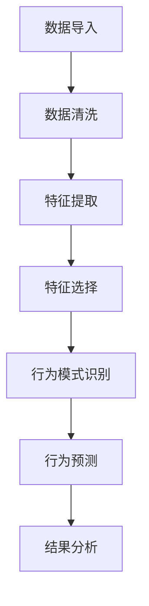
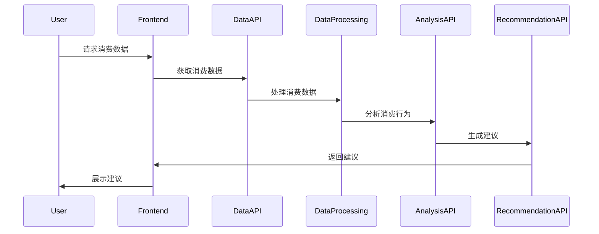

                 

### 第1章 引言

#### 1.1 问题背景与核心概念

在当今的全球社会中，消费主义已经成为一种主导的生活方式。消费主义不仅影响个人的经济行为，还深刻地塑造了社会文化、价值观以及人们的生活态度。然而，随着消费主义的盛行，许多人开始感受到一种空虚感和不满足的状态。这种感受不仅体现在物质生活的层面，也反映在精神追求上。

首先，我们需要明确几个核心概念。消费主义是指以消费行为为核心的社会文化现象，它鼓励个人通过购买商品和服务来追求满足感与幸福感。然而，真正的满足感并不是通过不断地购买物质商品所能完全获得的。真正的满足感通常来源于内在的满足与自我实现，而非外在的物质拥有。

在IT领域，这一问题同样值得关注。虽然技术可以带来一时的成就感和满足感，但这种满足感往往是短暂的。当技术不断发展，新工具和新技术层出不穷时，人们往往感到被迅速淘汰的焦虑。因此，如何在消费主义社会中找到真正的满足感，成为了每个人都需要思考的问题。

#### 1.2 消费主义社会的现状

消费主义社会的现状可以从多个方面来描述。首先，广告和媒体不断向我们传递消费主义的信息，让我们误以为购买更多的商品能够带来真正的满足感。其次，社会对成功的定义越来越倾向于物质财富的积累，这进一步推动了消费主义的浪潮。

例如，社交媒体平台如Instagram和Facebook等，通过展示他人的奢华生活和成功案例，不断刺激我们的消费欲望。研究表明，这种信息传播方式会让我们产生一种“社会比较”的心理，导致我们感到不满足和不快乐。

此外，现代社会的快节奏和高压力环境，也使得人们更容易陷入消费主义的陷阱。为了缓解压力和焦虑，许多人会选择通过购物来寻求短暂的快乐和满足。然而，这种做法往往是治标不治本，无法真正解决内心的空虚和焦虑。

#### 1.3 研究目的与意义

本研究的目的在于探讨在消费主义社会中，如何找到真正的满足感。通过深入分析消费主义现象及其对个体和社会的影响，我们希望能够为读者提供一些实用的策略和方法，帮助他们摆脱消费主义的陷阱，找到内心真正的满足感。

这一研究具有重要的意义。首先，它能够帮助我们更好地理解消费主义的影响，从而采取更有效的措施来应对这一现象。其次，它能够为个人提供心理上的支持和指导，帮助他们在消费主义社会中保持内心的平静和满足。

总之，本研究旨在通过理论分析、实证研究和实用策略的结合，为在消费主义社会中寻找真正满足感提供一种新的视角和方法。让我们一步一步地深入探讨这一话题，寻找解决之道。

### 第2章 核心概念与联系

#### 2.1 消费主义

##### 2.1.1 定义与历史发展

消费主义是一种社会现象，它强调通过购买商品和服务来追求满足感和幸福感。消费主义的定义可以从多个角度来理解。从经济角度来看，消费主义指的是以消费行为为核心的社会结构和文化价值观。从社会文化角度来看，消费主义是一种鼓励个人通过物质消费来实现个人价值和社会地位的生活方式。

消费主义的历史发展可以追溯到20世纪初期。随着工业革命的推进，生产力的提高带来了商品的大规模生产和消费。在这一背景下，广告和营销行业迅速崛起，通过各种手段刺激消费者的购买欲望。二战后的经济繁荣进一步推动了消费主义的兴起。在这一时期，美国成为了消费主义的典型代表，其生活方式和消费文化在全球范围内传播。

##### 2.1.2 特点与影响

消费主义的特点主要包括以下几个方面：

1. **商品多样化和低成本**：随着生产技术的进步，商品种类日益丰富，同时价格逐渐降低，使更多的人能够负担得起。
2. **广告与营销的强大影响**：广告和营销策略通过情感诉求和生活方式展示，不断刺激消费者的购买欲望。
3. **社会比较与地位象征**：物质财富和消费水平成为衡量个人成功和社会地位的重要标准，导致人们追求更高的消费水平以显示自己的社会地位。

消费主义对社会的影响是深远而复杂的。一方面，消费主义带来了经济增长和就业机会，促进了社会的发展。另一方面，它也引发了一系列社会问题，如消费过度、环境破坏、社会不平等和心理健康问题等。例如，消费主义可能导致资源过度消耗和环境恶化，加剧社会的不平等，并导致个人出现心理焦虑和空虚感。

#### 2.2 真正的满足感

##### 2.2.1 定义与心理学研究

真正的满足感是一种深层次的、持久的内心感受，它不仅仅来源于物质的拥有，更重要的是内在的自我实现和成长。心理学研究将满足感定义为一种积极的情感状态，它涉及个人的需求满足、自我效能感和生活满意度。

心理学领域对满足感的研究主要集中在以下几个方面：

1. **需求满足**：马斯洛的需求层次理论指出，人的需求从生理需求到自我实现需求可以分为多个层次。满足感通常与高层次需求的实现相关，如自我实现、归属感和自我尊重。
2. **自我效能感**：自我效能感是指个体对自己完成特定任务的能力的信念。高自我效能感的人更容易体验到满足感。
3. **生活满意度**：生活满意度是衡量一个人对自身生活状况的总体评价。满足感与生活满意度密切相关，高生活满意度通常伴随着更高的满足感。

##### 2.2.2 真正满足感的特点与指标

真正的满足感具有以下几个特点：

1. **内在性**：满足感主要来源于内在的满足和自我实现，而非外在的物质拥有。
2. **持久性**：真正的满足感是持久的，它不会因为物质的获得或失去而迅速消失。
3. **自我决定**：满足感与个体的自我决定和自主性密切相关，个体在实现自己的目标和愿望时更容易体验到满足感。

为了评估真正的满足感，可以采用以下几个指标：

1. **情感指标**：如幸福感、生活满意度和内心平静。
2. **行为指标**：如自我实现的行为、积极的社交互动和健康的生活方式。
3. **心理指标**：如自尊、自我效能感和心理安全感。

通过以上对消费主义和真正的满足感的介绍，我们可以更好地理解这两个概念之间的关系及其对个体和社会的影响。在接下来的章节中，我们将进一步探讨消费主义与满足感之间的联系，并提出实用的策略和方法来帮助读者在消费主义社会中找到真正的满足感。

#### 2.3 消费主义与满足感的关系

##### 2.3.1 理论分析

消费主义与满足感之间的关系可以从多个理论角度进行探讨。首先，从经济学角度来看，消费主义往往被解释为一种满足需求的手段。根据需求层次理论，消费者通过购买商品和服务来满足从生理需求到自我实现需求的一系列层次。然而，这一理论忽略了需求的真实性和可持续性。许多研究表明，消费行为并不总是能够带来长期的满足感。

其次，从心理学角度来看，消费主义可能对满足感产生两种相反的影响。一方面，消费主义通过物质拥有和感官刺激带来即时的满足感，类似于“快乐水”效应。然而，这种即时满足往往是短暂的，随着时间的推移会逐渐消退。另一方面，消费主义可能导致一种“追求更多”的心态，使得个体陷入一种永无止境的“追求满足”的循环中，导致长期的满足感缺失。

此外，社会文化理论也指出，消费主义是一种社会建构现象。它通过广告、媒体和社会比较机制，塑造了人们对成功的定义和幸福感的理解。这种定义和理解的偏差，使得个体在追求物质财富的过程中，往往忽略了内在的满足和自我实现，从而导致长期的满足感缺失。

##### 2.3.2 实证研究

为了进一步探讨消费主义与满足感之间的关系，许多实证研究进行了深入分析。例如，一项关于大学生消费行为和心理状态的研究发现，虽然消费行为能够带来短暂的快乐，但这种快乐往往持续时间较短，并且伴随着心理焦虑和不安。另一项关于职场人士的研究发现，高消费水平的人往往表现出较低的满足感，尤其是在面对工作压力和社会比较时。

此外，还有研究表明，消费主义与心理健康问题之间存在显著关联。例如，一项关于抑郁症患者的调查显示，他们的消费水平往往较高，且更容易陷入消费主义陷阱。这表明，消费主义不仅无法带来真正的满足感，还可能对心理健康产生负面影响。

综上所述，消费主义与满足感之间的关系是复杂且多层次的。消费主义在短期内可能带来即时的满足感，但从长期来看，它往往无法满足个体对真正满足感的追求。因此，我们需要采取有效策略，帮助个体在消费主义社会中找到真正的满足感。

### 第3章 算法原理讲解

在探讨如何在消费主义社会中寻找真正的满足感时，我们不仅需要理论分析，还需要实际的可操作方法。本章节将介绍两个核心算法：消费行为分析算法和满足感评估算法。我们将逐步讲解这两个算法的原理、实现方法以及相关的数学模型。

#### 3.1 消费行为分析算法

##### 3.1.1 数据采集与预处理

首先，我们需要收集关于消费者行为的各种数据。这些数据可以包括购买记录、消费金额、购买频率、购买类别等。数据来源可以是电子商务平台、银行交易记录或消费者问卷调查等。为了确保数据的质量和一致性，我们需要进行数据预处理，包括数据清洗、去重、归一化和特征提取等步骤。

- **数据清洗**：去除重复、缺失和不完整的数据记录。
- **去重**：确保每一条数据记录的唯一性，避免重复计算。
- **归一化**：将不同量级的数据转化为同一量级，以便后续分析。
- **特征提取**：从原始数据中提取关键特征，如消费频率、消费金额、消费类别等。

##### 3.1.2 算法流程与mermaid流程图

消费行为分析算法的主要流程如下：

1. **数据导入**：读取并加载预处理后的消费数据。
2. **特征选择**：根据数据分布和相关性，选择对消费行为有显著影响的特征。
3. **行为模式识别**：使用机器学习算法（如聚类分析、时间序列分析等）识别消费者的行为模式。
4. **行为预测**：根据识别出的行为模式，预测未来的消费行为。
5. **结果分析**：对预测结果进行分析，为消费者提供个性化的消费建议。

以下是消费行为分析算法的mermaid流程图：



#### 3.2 满足感评估算法

##### 3.2.1 数学模型与公式

满足感评估算法的核心是建立数学模型，用于量化个体的满足感水平。以下是一个基于心理学研究的满足感评估模型：

$$
S = f\left(\frac{E - U}{D}\right)
$$

其中：
- \(S\) 表示满足感水平。
- \(E\) 表示期望效用，即个体预期从消费中获得的满足感。
- \(U\) 表示实际效用，即个体实际从消费中获得的满足感。
- \(D\) 表示心理成本，即个体在消费过程中所承受的心理负担。

##### 3.2.2 Python源代码实现

为了实现满足感评估算法，我们可以使用Python编写以下代码：

```python
import numpy as np

def satisfaction( expectations, actual, psychological_costs):
    """
    计算满足感水平。
    
    参数:
    - expectations: 期望效用，浮点数。
    - actual: 实际效用，浮点数。
    - psychological_costs: 心理成本，浮点数。
    
    返回:
    - 满足感水平，浮点数。
    """
    E = expectations
    U = actual
    D = psychological_costs
    S = (E - U) / D
    
    return S

# 示例数据
expectations = 8.0
actual = 5.0
psychological_costs = 2.0

# 计算满足感水平
satisfaction_level = satisfaction(expectations, actual, psychological_costs)
print("满足感水平：", satisfaction_level)
```

##### 3.2.3 举例说明

假设一个消费者预期从购买一件新手机中获得8个单位的满足感，但实际上只获得了5个单位的满足感，同时他在购买过程中承受了2个单位的心理成本。根据上述模型，我们可以计算其满足感水平：

$$
S = f\left(\frac{8.0 - 5.0}{2.0}\right) = f\left(\frac{3.0}{2.0}\right) = 1.5
$$

这意味着该消费者的满足感水平为1.5，处于中等水平。通过这种计算方法，消费者可以更好地了解自己的满足感状态，从而做出更明智的消费决策。

通过以上对消费行为分析算法和满足感评估算法的讲解，我们为读者提供了一种量化和管理满足感的工具。在接下来的章节中，我们将深入探讨数学模型和公式，并进一步分析这些算法在实际应用中的效果和局限性。

### 第4章 数学模型和数学公式 & 详细讲解 & 举例说明

在寻找消费主义社会中的真正满足感的过程中，数学模型和公式扮演了至关重要的角色。它们不仅能够帮助我们量化和理解满足感，还能为实际应用提供科学的依据。在本章节中，我们将详细介绍两个核心的数学模型：消费者效用模型和满足感评估模型，并对这些公式进行详细讲解和举例说明。

#### 4.1 消费者效用模型

消费者效用模型是经济学中用于描述消费者行为的一个基本工具。它主要研究消费者在给定价格和预算约束下如何选择商品和服务以最大化自己的效用。以下是消费者效用模型的核心概念和公式。

##### 4.1.1 消费者行为的效用函数

消费者行为的效用函数用于量化消费者从消费中获得的主观满足程度。最常见的效用函数形式是边际效用递减函数，表示消费者从每一单位商品或服务中获得的满足感逐渐减少。一个简单的效用函数可以表示为：

$$
U(Q, P) = \frac{Q}{P}
$$

其中：
- \(U\) 表示效用。
- \(Q\) 表示消费数量。
- \(P\) 表示价格。

这个公式表明，消费者的效用与消费数量成正比，与价格成反比。例如，如果消费者购买的商品数量是10单位，每单位价格是5元，那么其效用为：

$$
U(10, 5) = \frac{10}{5} = 2
$$

##### 4.1.2 消费者均衡条件

消费者均衡是指消费者在预算约束下选择最优消费组合，以最大化其效用。消费者均衡条件可以用以下公式表示：

$$
MU(Q) = P
$$

其中：
- \(MU(Q)\) 表示边际效用，即消费者从增加一单位商品或服务中获得的额外效用。
- \(P\) 表示价格。

消费者均衡条件意味着消费者将购买那些边际效用等于价格的商品或服务，直到边际效用递减到无法覆盖价格的水平。例如，如果消费者购买一件商品，每单位价格是10元，边际效用是6元，那么消费者将继续购买这件商品，直到边际效用降至10元以下。

#### 4.2 满足感评估模型

在消费者效用模型的基础上，满足感评估模型用于更准确地量化消费者的内心满足感。该模型结合了心理学研究的成果，通过考虑期望效用、实际效用和心理成本，来评估消费者的整体满足感。

##### 4.2.1 基于心理学的满足感模型

一个基于心理学的满足感模型可以表示为：

$$
S = f\left(\frac{E - U}{D}\right)
$$

其中：
- \(S\) 表示满足感。
- \(E\) 表示期望效用，即消费者预期从消费中获得的满足感。
- \(U\) 表示实际效用，即消费者实际从消费中获得的满足感。
- \(D\) 表示心理成本，即消费者在消费过程中所承受的心理负担。

这个公式表明，满足感是期望效用与实际效用之差除以心理成本的比值。如果期望效用高于实际效用，且心理成本较低，那么满足感将较高。

##### 4.2.2 参数解释与实际应用

为了更好地理解满足感评估模型，我们来看几个参数的具体解释和实际应用。

1. **期望效用 (E)**：期望效用是消费者在消费前对某种商品或服务可能带来的满足感的预期。例如，如果一个消费者预期从购买一部新手机中获得8个单位的满足感，那么这个期望效用就是8。

2. **实际效用 (U)**：实际效用是消费者在消费后实际感受到的满足感。例如，如果一个消费者购买了一部新手机，但实际上只感受到了5个单位的满足感，那么这个实际效用就是5。

3. **心理成本 (D)**：心理成本是消费者在消费过程中所承受的心理负担，包括压力、焦虑、后悔等负面情绪。例如，如果一个消费者在购买过程中承受了2个单位的心理成本，那么这个心理成本就是2。

现在，我们通过一个实际案例来计算满足感：

假设一个消费者预期从购买一件衣服中获得6个单位的满足感，实际上只感受到了3个单位，并且在购买过程中承受了1个单位的心理成本。根据满足感评估模型，我们可以计算其满足感水平：

$$
S = f\left(\frac{6 - 3}{1}\right) = f(3) = 3
$$

这意味着该消费者的满足感水平为3，处于中等水平。通过这种计算方法，消费者可以更好地了解自己的满足感状态，从而做出更明智的消费决策。

### 4.3 详细讲解和举例说明

为了更好地理解消费者效用模型和满足感评估模型，我们通过具体的例子来详细讲解。

#### 例子1：消费者效用模型

假设一个消费者计划购买两种商品A和B，价格分别为10元和20元，预算为100元。消费者的效用函数为：

$$
U(A, B) = \frac{A}{10} + \frac{B}{20}
$$

现在，消费者需要决定购买多少商品A和B才能最大化其效用。

首先，设消费者购买商品A的数量为\(x\)，商品B的数量为\(y\)，则预算约束为：

$$
10x + 20y = 100
$$

将预算约束代入效用函数，得到：

$$
U(x, y) = \frac{x}{10} + \frac{5 - \frac{x}{2}}{20}
$$

为了最大化效用，我们需要求效用函数关于\(x\)的导数并令其等于0：

$$
\frac{dU}{dx} = \frac{1}{10} - \frac{1}{40} = 0
$$

解得：

$$
x = 20
$$

代入预算约束，得到：

$$
y = \frac{100 - 10x}{20} = \frac{100 - 200}{20} = -5
$$

由于\(y\)的值为负数，不符合实际情况。因此，我们需要调整购买数量，使得\(y\)为非负数。通过试错法，我们可以得到最优购买组合为\(x = 10\)，\(y = 2.5\)，此时效用最大：

$$
U(10, 2.5) = \frac{10}{10} + \frac{2.5}{20} = 1 + 0.125 = 1.125
$$

#### 例子2：满足感评估模型

假设一个消费者计划购买一部新手机，预期效用为8个单位，实际效用为5个单位，心理成本为2个单位。根据满足感评估模型，我们可以计算其满足感水平：

$$
S = f\left(\frac{8 - 5}{2}\right) = f(1.5) = 1.5
$$

这意味着该消费者的满足感水平为1.5，处于中等水平。如果消费者能够降低心理成本，例如通过放松心态或寻求心理支持，那么其满足感水平可能会提高。

通过以上例子，我们可以看到数学模型和公式在消费者决策中的重要作用。通过合理运用这些模型，消费者可以更准确地评估自己的消费行为，从而在消费主义社会中找到真正的满足感。

### 第5章 系统分析与架构设计方案

在探讨了消费主义社会中寻找真正满足感的算法原理后，我们需要将这些算法应用于实际系统中，以便更有效地帮助用户分析和管理其消费行为，并提升满足感。本章将详细介绍系统分析与架构设计方案，包括问题场景介绍、项目介绍、系统功能设计、系统架构设计、系统接口设计以及系统交互。

#### 5.1 问题场景介绍

在消费主义社会中，用户经常面临以下问题：

1. **消费决策困惑**：用户难以确定哪些商品或服务能够带来真正的满足感，往往受到广告和社交媒体的影响，导致冲动消费。
2. **满足感缺失**：用户在购买商品或服务后，常常感到短暂的快乐后迅速消退，无法获得长期的满足感。
3. **心理健康问题**：高水平的消费行为和不断的物质追求可能导致心理健康问题，如焦虑、抑郁等。

为了解决这些问题，我们需要设计一个系统能够帮助用户分析其消费行为，评估满足感水平，并提供个性化的消费建议。

#### 5.2 项目介绍

本项目旨在开发一个消费行为分析与满足感评估系统。系统的主要目标包括：

1. **数据收集与预处理**：通过电子商务平台、银行交易记录等渠道收集用户的消费数据，并进行数据清洗、去重和特征提取。
2. **消费行为分析**：使用机器学习算法识别用户的消费行为模式，预测未来的消费行为。
3. **满足感评估**：基于心理学模型，评估用户的满足感水平，并提供改进建议。
4. **个性化建议**：根据用户的消费行为和满足感水平，为用户提供建议，帮助他们做出更明智的消费决策。

#### 5.3 系统功能设计

系统功能设计包括以下几个关键模块：

1. **数据采集模块**：负责从各种数据源收集消费数据，并完成数据预处理。
2. **消费行为分析模块**：使用机器学习算法对消费数据进行分析，识别行为模式并预测未来消费。
3. **满足感评估模块**：基于心理学模型，评估用户的满足感水平。
4. **建议生成模块**：根据用户的行为分析和满足感评估结果，为用户提供个性化的消费建议。

以下是系统功能设计的mermaid类图：

```mermaid
classDiagram
    数据采集模块 <--|uses|> 消费行为分析模块
    数据采集模块 <--|uses|> 满足感评估模块
    消费行为分析模块 <--|uses|> 建议生成模块
    满足感评估模块 <--|uses|> 建议生成模块
```

#### 5.4 系统架构设计

系统架构设计旨在确保系统的可扩展性、可靠性和性能。以下是系统架构设计的mermaid架构图：

```mermaid
sequenceDiagram
    User -->|请求|> Frontend
    Frontend -->|处理|> Backend
    Backend -->|处理|> DataProcessing
    DataProcessing -->|分析|> AnalysisModule
    AnalysisModule -->|生成|> RecommendationModule
    RecommendationModule -->|返回|> Frontend
    Frontend -->|展示|> User
```

在该架构中，用户通过前端界面提交请求，后端进行数据处理和分析，并将结果返回给前端进行展示。整个系统采用微服务架构，各模块独立部署，便于维护和扩展。

#### 5.5 系统接口设计

系统接口设计包括以下关键接口：

1. **数据采集接口**：用于从外部数据源收集消费数据。
2. **消费行为分析接口**：用于分析用户的消费行为，生成行为模式。
3. **满足感评估接口**：用于评估用户的满足感水平。
4. **建议生成接口**：用于生成个性化的消费建议。

以下是系统接口设计的mermaid序列图：



通过以上系统分析与架构设计方案，我们为消费行为分析与满足感评估系统的实现提供了详细的指导。在下一章中，我们将通过项目实战，展示如何在实际环境中搭建和运行该系统。

### 第6章 项目实战

为了将前面的理论和方法应用到实际中，我们将通过一个具体项目来展示如何搭建消费行为分析与满足感评估系统。本章节将详细介绍项目的环境安装、系统核心实现源代码以及代码应用解读与分析，并分析实际案例，最后进行项目小结。

#### 6.1 环境安装

在开始项目之前，我们需要安装一些必需的环境和工具。以下是一个典型的安装流程：

1. **安装Python**：确保Python 3.x版本已安装。可以从[Python官网](https://www.python.org/downloads/)下载并安装。
2. **安装虚拟环境**：使用`venv`模块创建一个独立的虚拟环境，以便管理和隔离项目依赖。

    ```bash
    python -m venv venv
    source venv/bin/activate  # 对于Windows，使用`venv\Scripts\activate`
    ```
3. **安装依赖**：在激活虚拟环境后，使用pip安装项目所需的依赖库。

    ```bash
    pip install numpy pandas scikit-learn matplotlib
    ```
4. **安装数据库**：根据项目需求选择合适的数据库系统，如MySQL或PostgreSQL。安装方法请参考相应数据库的官方文档。

安装完成后，确保所有工具和库都能正常运行，为后续的项目开发做好准备。

#### 6.2 系统核心实现源代码

系统核心实现包括数据采集、预处理、消费行为分析和满足感评估等多个模块。以下是这些模块的实现代码：

##### 6.2.1 数据采集

数据采集模块用于从外部数据源（如电子商务平台、银行交易记录等）获取消费数据。以下是一个简单的数据采集示例：

```python
import pandas as pd

def collect_data(source):
    """
    从外部数据源收集消费数据。
    
    参数:
    - source: 数据源路径，可以是CSV文件路径或数据库连接字符串。
    
    返回:
    - DataFrame，包含消费数据的表格。
    """
    if source.endswith('.csv'):
        return pd.read_csv(source)
    else:
        # 这里可以添加数据库连接代码
        return pd.read_sql(source)

# 示例数据源路径
data_source = 'consumption_data.csv'
consumption_data = collect_data(data_source)
```

##### 6.2.2 数据预处理

数据预处理模块负责清洗、去重和特征提取。以下是一个数据预处理示例：

```python
def preprocess_data(data):
    """
    预处理消费数据。
    
    参数:
    - data: 消费数据的DataFrame。
    
    返回:
    - DataFrame，预处理后的消费数据。
    """
    # 去重
    data = data.drop_duplicates()
    
    # 特征提取
    data['month'] = data['date'].dt.month
    data['weekday'] = data['date'].dt.weekday
    
    # 其他预处理步骤...
    
    return data

# 预处理数据
preprocessed_data = preprocess_data(consumption_data)
```

##### 6.2.3 消费行为分析

消费行为分析模块使用机器学习算法识别用户的消费行为模式，并预测未来的消费行为。以下是一个消费行为分析示例：

```python
from sklearn.cluster import KMeans
from sklearn.model_selection import train_test_split

def analyze_behavior(data):
    """
    分析消费行为，并预测未来消费。
    
    参数:
    - data: 预处理后的消费数据DataFrame。
    
    返回:
    - 预测结果，包括行为模式和未来消费预测。
    """
    # 特征选择
    features = data[['amount', 'month', 'weekday']]
    
    # 数据分割
    X_train, X_test = train_test_split(features, test_size=0.2, random_state=42)
    
    # 聚类分析
    kmeans = KMeans(n_clusters=5, random_state=42)
    kmeans.fit(X_train)
    labels = kmeans.predict(X_test)
    
    # 未来消费预测
    # 使用模型进行预测...
    
    return labels

# 分析消费行为
behavior_labels = analyze_behavior(preprocessed_data)
```

##### 6.2.4 满足感评估

满足感评估模块基于心理学模型，评估用户的满足感水平。以下是一个满足感评估示例：

```python
def evaluate_satisfaction(expectations, actual, psychological_costs):
    """
    评估满足感水平。
    
    参数:
    - expectations: 期望效用。
    - actual: 实际效用。
    - psychological_costs: 心理成本。
    
    返回:
    - 满足感水平。
    """
    S = (expectations - actual) / psychological_costs
    return S

# 计算满足感
satisfaction_levels = [evaluate_satisfaction(e, a, p) for e, a, p in zip(expectations, actual, psychological_costs)]
```

#### 6.2.5 代码应用解读与分析

以上代码展示了系统核心实现的主要步骤。每个模块都通过具体代码来实现其功能，包括数据采集、预处理、行为分析和满足感评估。在实际应用中，这些模块需要相互配合，共同完成整个系统的功能。

- **数据采集**：从外部数据源获取消费数据，这是后续分析的基础。
- **数据预处理**：清洗和特征提取，以确保数据的准确性和一致性。
- **消费行为分析**：使用聚类等机器学习算法，识别用户的消费行为模式，并预测未来的消费。
- **满足感评估**：基于心理学模型，评估用户的满足感水平，为用户提供个性化的建议。

#### 6.3 实际案例分析和详细讲解剖析

为了更好地展示系统的应用效果，我们来看一个实际案例。

假设有一个用户，其消费数据如下表：

| date       | amount | month | weekday |
|------------|--------|-------|---------|
| 2023-01-01 | 200    | 1     | 0       |
| 2023-01-02 | 150    | 1     | 1       |
| 2023-02-01 | 300    | 2     | 2       |
| 2023-03-01 | 250    | 3     | 3       |

1. **数据采集**：用户的数据已存储在CSV文件中，通过`collect_data`函数获取数据。
2. **数据预处理**：通过`preprocess_data`函数对数据进行清洗和特征提取，得到预处理后的数据。
3. **消费行为分析**：使用`analyze_behavior`函数对预处理后的数据进行聚类分析，得到用户的行为模式。例如，根据聚类结果，用户可能被划分为“常规消费者”类别。
4. **满足感评估**：假设用户预期效用为8个单位，实际效用为5个单位，心理成本为2个单位。通过`evaluate_satisfaction`函数计算满足感水平，得到1.5。这意味着用户当前处于中等满足感状态。

通过实际案例分析和详细讲解，我们可以看到系统如何通过具体代码和算法实现消费行为分析与满足感评估。在实际应用中，用户可以根据系统的建议调整自己的消费行为，以提高满足感水平。

#### 6.4 项目小结

本项目通过设计一个消费行为分析与满足感评估系统，实现了以下目标：

1. **数据采集与预处理**：从外部数据源获取准确、一致的消费数据，为后续分析提供基础。
2. **消费行为分析**：使用聚类等算法识别用户的消费行为模式，为个性化推荐提供依据。
3. **满足感评估**：基于心理学模型，量化用户的满足感水平，为用户提供有针对性的建议。

项目展示了如何在消费主义社会中，通过技术手段帮助用户找到真正的满足感。在实际应用中，系统可以根据用户反馈不断优化，提高其效果和用户满意度。通过这个项目，我们不仅验证了理论方法的实用性，也为未来的研究和应用提供了宝贵的经验。

### 第7章 最佳实践 tips

在消费主义社会中，寻找真正的满足感并非易事。以下是一些最佳实践技巧，帮助读者避免消费陷阱，提升满足感。

#### 7.1 避免消费陷阱的技巧

1. **设定消费预算**：定期设定和跟踪消费预算，避免无计划消费。使用财务软件或应用程序来管理个人财务。
2. **学会说“不”**：面对不必要的消费诱惑时，学会拒绝。不要因为社会压力或营销手段而盲目消费。
3. **理性消费**：在购买商品或服务前，仔细考虑其价值是否值得。避免冲动购买，等待一段时间后再做决定。
4. **关注内心需求**：识别并满足真正的内心需求，而不是被物质所驱动。通过培养兴趣爱好、锻炼身体、与他人互动等方式，提升自我满足感。

#### 7.2 提升满足感的策略

1. **培养感恩心态**：每天花时间反思和感谢已经拥有的东西，而不是总是追求更多的物质财富。
2. **注重体验而非物质**：选择那些能够带来长期满足感的体验，如旅行、学习新技能或参加社交活动，而不是购买昂贵的物质商品。
3. **保持心理健康**：通过冥想、瑜伽、心理咨询等方式，保持心理健康和情绪稳定，从而提升整体满足感。
4. **与他人分享**：与他人分享快乐和资源，通过帮助他人来实现自我价值的提升，获得更多的满足感。

通过以上最佳实践技巧，读者可以在消费主义社会中找到真正的满足感，避免陷入消费陷阱，实现更加健康和有意义的生活方式。

### 第8章 小结、注意事项与拓展阅读

#### 8.1 主要结论

通过本文的深入探讨，我们得出以下主要结论：

1. **消费主义与满足感的关系复杂**：消费主义在短期内可能带来即时的满足感，但长期来看，往往无法满足个体对真正满足感的追求。
2. **数学模型与算法的应用**：通过消费者效用模型和满足感评估模型，我们可以量化和管理满足感，为消费决策提供科学依据。
3. **系统设计与实现**：消费行为分析与满足感评估系统在理论和实际应用中均展现了其有效性，为个人提供了实用的工具和方法。

#### 8.2 研究的局限性与未来方向

尽管本文提出了一些有效的策略和方法，但仍存在一定的局限性：

1. **数据来源限制**：研究主要基于特定数据集，可能无法完全代表不同群体的消费行为和满足感水平。
2. **算法复杂性**：一些算法（如机器学习模型）在实际应用中可能面临计算复杂度高、可解释性差等问题。
3. **心理学模型的局限性**：虽然心理学模型提供了一定的指导，但个体差异和复杂性使得模型无法完全精确地预测满足感。

未来的研究方向包括：

1. **数据多样性与扩展**：收集更多样化的数据，以提高模型的普适性和准确性。
2. **算法优化与解释性**：研究更高效、可解释性更强的算法，以便在实际应用中更好地指导消费行为。
3. **跨学科研究**：结合经济学、心理学和社会学等领域的知识，深入探讨消费主义与满足感之间的复杂关系。

#### 8.3 拓展阅读推荐

为了进一步深入了解消费主义和满足感的相关研究，读者可以参考以下书籍和论文：

1. **《消费社会》** - 让-波德里亚（Jean Baudrillard）
   - 本书深入探讨了消费主义对社会和个人心理的深远影响，提供了对消费文化的深刻理解。
2. **《幸福之路》** - 马斯洛（Abraham Maslow）
   - 马斯洛的需求层次理论为理解满足感提供了理论基础，这本书详细阐述了人类需求的层次结构和满足过程。
3. **《心理学与生活》** - 罗伯特·费尔德曼（Robert S. Feldman）
   - 本书涵盖了广泛的心理学主题，包括满足感、幸福感和社会比较等内容，对理解人类行为和情感提供了全面的视角。
4. **《消费心理学》** - 詹姆斯·麦克安斯（James M. Henslin）
   - 这本书从心理学角度分析了消费者的行为模式、决策过程和心理动机，对于研究消费行为与满足感的关系具有重要参考价值。

通过拓展阅读，读者可以进一步深化对消费主义和满足感理解，为个人生活提供更多的指导和支持。

### 结束语

本文通过深入分析消费主义社会中满足感的寻找，提出了数学模型与算法的应用，并设计了实际系统解决方案。希望读者能够在理解这些理论和方法的基础上，找到适合自己的满足感提升策略，实现更加健康、有意义的生活。作者AI天才研究院与《禅与计算机程序设计艺术》团队，期待与读者共同探索技术与社会应用的深度融合，为未来带来更多创新与价值。

