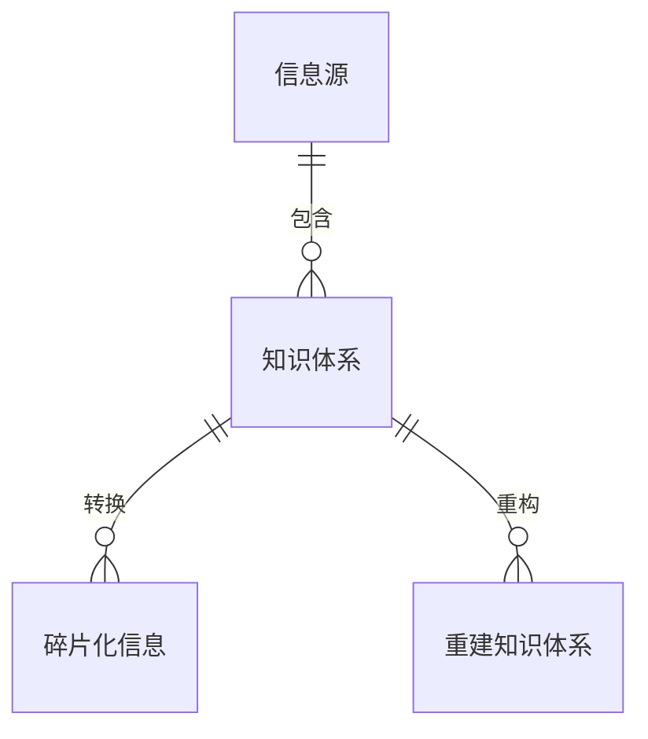
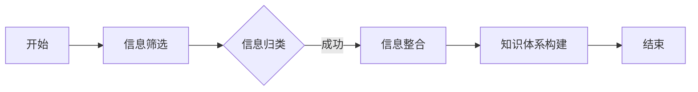
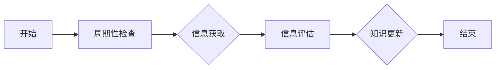
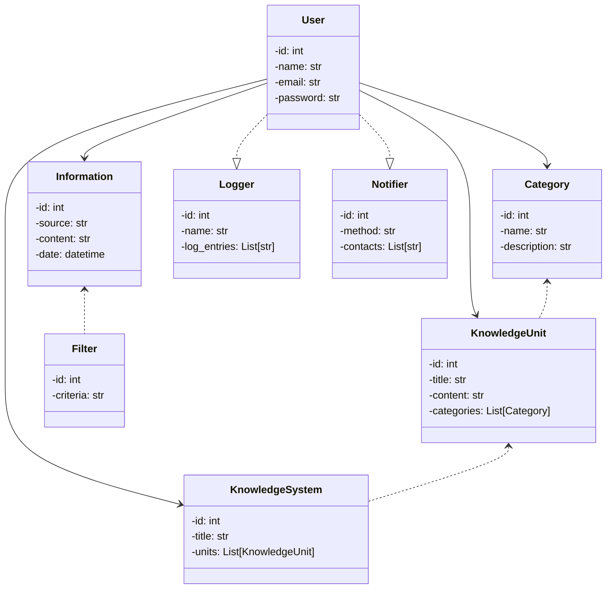
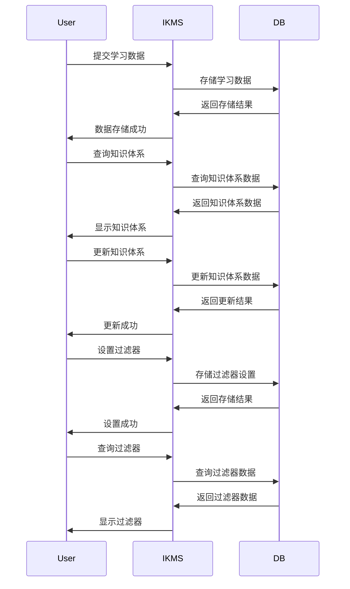

                 

# 在碎片化时代重建知识体系：个人学习的革命

> 关键词：知识体系，碎片化时代，学习革命，个人发展，知识重构

> 摘要：本文深入探讨了碎片化时代给个人学习带来的挑战，分析了传统学习模式的局限性，并提出了重建知识体系的重要性。通过明确学习目标、构建知识框架、系统学习与积累等步骤，本文为读者提供了构建个人知识体系的实用方法和策略，以帮助个人在碎片化时代实现持续学习与成长。

## 目录大纲

在碎片化时代重建知识体系：个人学习的革命

----------------------------------------------------------------

## 第一部分：重建知识体系的必要性

### 第1章：碎片化时代的挑战与问题

#### 1.1 碎片化时代的社会背景

##### 1.1.1 信息爆炸与社会分工

##### 1.1.2 碎片化信息的泛滥

##### 1.1.3 传统学习模式的局限性

#### 1.2 碎片化时代对个人学习的影响

##### 1.2.1 注意力分散与学习效率降低

##### 1.2.2 缺乏系统性与连贯性

##### 1.2.3 学习成果难以巩固与应用

#### 1.3 碎片化时代的知识重构

##### 1.3.1 构建系统化的知识框架

##### 1.3.2 培养深度学习能力

##### 1.3.3 提高知识迁移与整合能力

### 第2章：重建知识体系的原则与方法

#### 2.1 重建知识体系的原则

##### 2.1.1 知识整合性原则

##### 2.1.2 知识关联性原则

##### 2.1.3 知识系统性原则

#### 2.2 重建知识体系的方法

##### 2.2.1 自我评估与定位

##### 2.2.2 知识筛选与梳理

##### 2.2.3 知识构建与整合

### 第3章：构建个人知识体系的具体步骤

#### 3.1 明确学习目标与方向

##### 3.1.1 设定长期与短期目标

##### 3.1.2 确定学习领域与方向

#### 3.2 系统学习与积累

##### 3.2.1 选择合适的教材与资源

##### 3.2.2 制定学习计划与日程

##### 3.2.3 实践与反思

#### 3.3 构建知识框架与网络

##### 3.3.1 知识框架的构建

##### 3.3.2 知识网络的绘制

##### 3.3.3 知识更新与迭代

### 第4章：运用知识进行创新与创造

#### 4.1 知识运用与创新思维

##### 4.1.1 创新思维的重要性

##### 4.1.2 培养创新思维的方法

##### 4.1.3 创新思维的运用场景

#### 4.2 知识整合与创新实践

##### 4.2.1 知识整合与创新的关系

##### 4.2.2 创新实践的方法与技巧

##### 4.2.3 创新实践的案例分析

#### 4.3 知识创新与个人发展

##### 4.3.1 知识创新的个人价值

##### 4.3.2 知识创新的社会价值

##### 4.3.3 知识创新与个人成长的关系

### 第5章：保持知识体系的活力与更新

#### 5.1 知识体系的维护与更新

##### 5.1.1 知识更新的重要性

##### 5.1.2 知识更新的方法

##### 5.1.3 知识更新的周期与频率

#### 5.2 持续学习与知识拓展

##### 5.2.1 持续学习的动力与方式

##### 5.2.2 知识拓展的途径与资源

##### 5.2.3 知识拓展的重要性与挑战

### 第6章：总结与展望

#### 6.1 重建知识体系的意义

##### 6.1.1 对个人发展的意义

##### 6.1.2 对社会进步的意义

#### 6.2 未来的发展趋势与挑战

##### 6.2.1 知识体系建设的未来趋势

##### 6.2.2 碎片化时代的挑战与应对策略

##### 6.2.3 知识体系的未来发展展望

----------------------------------------------------------------

# 第一部分：重建知识体系的必要性

## 第1章：碎片化时代的挑战与问题

在当今的数字化时代，信息爆炸和社会分工的加剧使得知识传播的速度和范围达到了前所未有的高度。然而，这种碎片化信息的泛滥给个人学习带来了巨大的挑战。为了应对这些挑战，我们必须深刻认识碎片化时代的社会背景，分析其对个人学习产生的具体影响，并提出有效的知识重构方法。

### 1.1 碎片化时代的社会背景

#### 1.1.1 信息爆炸与社会分工

随着互联网技术的飞速发展，信息传播的速度和范围都得到了极大的提升。人们可以通过各种平台获取到海量的信息，这些信息涵盖了各个领域，从科学技术的最新进展到日常生活的点滴经验。然而，信息爆炸也带来了一个问题：信息过载。个人在学习过程中，常常面临信息筛选和处理的难题，很难从中提取出真正有价值的信息。

此外，社会分工的深化使得知识的专业化程度不断提高。一个人很难全面掌握所有领域的知识，这使得学习变得更加专业化，同时也增加了学习的难度。

#### 1.1.2 碎片化信息的泛滥

在碎片化信息的背景下，人们的学习方式也发生了变化。传统的系统化学习模式逐渐被碎片化学习所取代。碎片化学习具有灵活性、便捷性等优点，但也存在明显的缺点：缺乏系统性和连贯性。学习者容易陷入零散知识的堆砌，而无法形成完整的知识体系。

#### 1.1.3 传统学习模式的局限性

传统学习模式往往依赖于教科书和课堂授课，强调知识的系统性和完整性。然而，在碎片化时代，这种学习模式面临着巨大的挑战。首先，教科书的内容更新速度往往滞后于知识的实际更新速度，使得学习者无法及时获取最新的知识。其次，课堂授课的时间和空间限制，使得学习者的学习时间被大大压缩，难以进行深入的学习。

### 1.2 碎片化时代对个人学习的影响

#### 1.2.1 注意力分散与学习效率降低

在碎片化信息的环境下，学习者容易受到各种信息的干扰，导致注意力分散。这使得学习效率大大降低，学习者难以集中精力进行深入的学习。

#### 1.2.2 缺乏系统性与连贯性

碎片化学习往往侧重于零散知识的获取，而忽视了知识之间的内在联系。这导致学习者的知识体系缺乏系统性和连贯性，难以形成完整的知识结构。

#### 1.2.3 学习成果难以巩固与应用

由于缺乏系统性的学习，学习者的知识往往停留在表层，难以进行深入理解和应用。这导致了学习成果的巩固和应用效果不佳。

### 1.3 碎片化时代的知识重构

面对碎片化时代对个人学习的挑战，我们需要采取新的方法进行知识重构。

#### 1.3.1 构建系统化的知识框架

构建系统化的知识框架是知识重构的关键步骤。通过明确知识之间的内在联系，形成完整的知识结构，学习者可以更好地理解和应用所学知识。

#### 1.3.2 培养深度学习能力

深度学习能力的培养是提高学习效率的重要手段。通过深入理解知识，学习者可以更好地掌握知识的核心，提高知识的应用能力。

#### 1.3.3 提高知识迁移与整合能力

知识迁移与整合能力的提高，有助于学习者将所学知识应用到实际问题中。这不仅可以巩固学习成果，还可以提高学习者的综合能力。

## 第2章：重建知识体系的原则与方法

在碎片化时代，重建知识体系已经成为个人学习的重要任务。为了实现有效的知识重构，我们需要遵循一系列原则，并采用科学的方法。本章将详细阐述这些原则与方法，帮助读者构建个人知识体系。

### 2.1 重建知识体系的原则

#### 2.1.1 知识整合性原则

知识整合性原则强调将零散的知识进行整合，形成有机的整体。通过整合，学习者可以更好地理解知识之间的内在联系，构建完整的知识结构。

#### 2.1.2 知识关联性原则

知识关联性原则强调知识之间的相互关联。学习者需要关注知识之间的联系，形成知识网络，以便于理解和应用知识。

#### 2.1.3 知识系统性原则

知识系统性原则强调知识的系统性和连贯性。学习者需要遵循知识的内在逻辑，系统性地学习，以确保知识的连贯性和完整性。

### 2.2 重建知识体系的方法

#### 2.2.1 自我评估与定位

自我评估与定位是重建知识体系的第一步。通过自我评估，学习者可以了解自己的知识水平和能力，明确自己的学习目标和方向。

#### 2.2.2 知识筛选与梳理

知识筛选与梳理是对获取的知识进行筛选和梳理。通过筛选，学习者可以剔除无关和错误的知识，确保所学知识的准确性和实用性。通过梳理，学习者可以明确知识之间的联系，形成知识体系。

#### 2.2.3 知识构建与整合

知识构建与整合是重建知识体系的核心步骤。通过构建知识框架，学习者可以形成完整的知识结构。通过整合，学习者可以确保知识之间的内在联系，提高知识的系统性和连贯性。

## 第3章：构建个人知识体系的具体步骤

在碎片化时代，构建个人知识体系是一项系统工程。为了实现这一目标，我们需要明确学习目标与方向，进行系统学习与积累，构建知识框架与网络，并进行知识更新与迭代。本章将详细阐述这些具体步骤，帮助读者构建有效的个人知识体系。

### 3.1 明确学习目标与方向

明确学习目标与方向是构建个人知识体系的第一步。通过设定明确的学习目标，学习者可以明确自己的学习方向，避免盲目学习。同时，学习目标的设定应该具有挑战性，以激发学习者的学习动力。

#### 3.1.1 设定长期与短期目标

长期目标通常是指在未来几年内希望达到的学习成就。例如，成为一名人工智能领域的专家。短期目标则是具体的学习目标，如掌握某一项技能或完成某个项目。长期目标与短期目标相结合，可以帮助学习者更好地规划学习进度。

#### 3.1.2 确定学习领域与方向

确定学习领域与方向是明确学习目标的重要步骤。学习者需要根据自己的兴趣和职业规划，选择合适的学习领域。例如，如果对人工智能领域感兴趣，可以专注于机器学习、深度学习等方面的学习。

### 3.2 系统学习与积累

系统学习与积累是构建个人知识体系的核心步骤。通过系统学习，学习者可以掌握基本概念、原理和方法，为构建知识体系奠定基础。同时，积累是学习过程中不可或缺的环节，通过不断积累，学习者可以丰富自己的知识体系。

#### 3.2.1 选择合适的教材与资源

选择合适的教材与资源是系统学习的关键。学习者需要根据自己的学习目标和方向，选择适合的教材和资源。例如，如果学习人工智能，可以选择《深度学习》等经典教材。

#### 3.2.2 制定学习计划与日程

制定学习计划与日程可以帮助学习者更好地规划学习时间，确保学习任务的顺利完成。学习计划应该明确每天的学习任务和目标，以及学习的时间安排。

#### 3.2.3 实践与反思

实践与反思是学习过程中不可或缺的环节。通过实践，学习者可以将所学知识应用到实际问题中，加深对知识的理解。通过反思，学习者可以总结学习经验，发现问题并改进学习方法。

### 3.3 构建知识框架与网络

构建知识框架与网络是构建个人知识体系的关键步骤。通过构建知识框架，学习者可以形成完整的知识结构，明确知识之间的内在联系。通过构建知识网络，学习者可以更好地理解和应用知识。

#### 3.3.1 知识框架的构建

知识框架的构建需要明确知识的核心概念、原理和方法。通过绘制知识框架图，学习者可以直观地了解知识体系的全貌，发现知识之间的联系。

#### 3.3.2 知识网络的绘制

知识网络的绘制可以通过思维导图、概念图等工具实现。通过绘制知识网络，学习者可以更好地理解知识之间的关联，形成知识网络。

#### 3.3.3 知识更新与迭代

知识更新与迭代是构建个人知识体系的重要环节。随着知识更新的不断推进，学习者需要不断调整和完善知识框架与网络，确保知识的准确性和实用性。

## 第4章：运用知识进行创新与创造

在构建个人知识体系的过程中，运用知识进行创新与创造是提升个人能力的重要途径。通过创新思维的培养和实践，学习者可以突破传统知识的束缚，创造新的价值。本章将探讨知识运用与创新思维的关系，介绍培养创新思维的方法，并分析创新思维的运用场景。

### 4.1 知识运用与创新思维

#### 4.1.1 创新思维的重要性

创新思维是一种能够产生新思想、新方法和新解决方案的思维方式。在知识运用过程中，创新思维具有至关重要的地位。它不仅能够激发学习者的创造力，还能够推动科技进步和社会发展。

#### 4.1.2 培养创新思维的方法

培养创新思维需要结合多种方法，包括思维训练、知识积累、实践探索等。

1. **思维训练**：通过思维训练，如联想思维、逆向思维、发散思维等，可以增强学习者的思维能力。

2. **知识积累**：丰富的知识储备是创新思维的基础。通过广泛阅读、学习专业知识和跨学科知识，可以拓宽思维视野。

3. **实践探索**：将所学知识应用于实际问题中，通过实践探索，可以激发创新思维。

#### 4.1.3 创新思维的运用场景

创新思维可以应用于各种场景，如科学研究、技术创新、产品设计、企业管理等。在科学研究中，创新思维可以帮助研究者发现新问题、提出新假设；在技术创新中，创新思维可以推动技术的突破和发展；在产品设计中，创新思维可以带来独特的用户体验和设计理念；在企业管理中，创新思维可以帮助企业应对市场变化，实现持续发展。

### 4.2 知识整合与创新实践

#### 4.2.1 知识整合与创新的关系

知识整合与创新思维密切相关。通过整合不同领域的知识，学习者可以产生新的视角和解决方案，推动创新。

#### 4.2.2 创新实践的方法与技巧

创新实践需要结合具体情境，采用合适的方法和技巧。

1. **头脑风暴**：通过集体讨论，激发团队成员的创新思维，产生新的创意。

2. **原型设计**：通过快速构建原型，验证创新想法的可行性。

3. **迭代优化**：在创新实践过程中，不断迭代和优化，以提高创新成果的质量。

#### 4.2.3 创新实践的案例分析

以人工智能领域的创新实践为例，介绍创新思维在具体项目中的应用。例如，通过整合机器学习、计算机视觉和自然语言处理等技术，开发出具有人工智能特性的应用，如智能助手、自动驾驶等。

### 4.3 知识创新与个人发展

#### 4.3.1 知识创新的个人价值

知识创新不仅能够提升个人的竞争力，还能够实现个人价值的提升。通过创新，个人可以解决实际问题，推动行业发展，实现职业发展。

#### 4.3.2 知识创新的社会价值

知识创新具有广泛的社会价值。它不仅能够推动科技进步，还能够促进经济发展，改善人们的生活质量。

#### 4.3.3 知识创新与个人成长的关系

知识创新与个人成长密切相关。通过不断进行知识创新，个人可以不断拓展自己的知识边界，提升自己的综合素质，实现个人成长。

## 第5章：保持知识体系的活力与更新

在碎片化时代，知识更新速度加快，保持知识体系的活力和更新成为个人学习的重要任务。本章将探讨知识更新的重要性、方法以及知识体系的维护与更新策略，帮助读者持续提升自己的知识体系。

### 5.1 知识体系的维护与更新

#### 5.1.1 知识更新的重要性

知识更新是保持知识体系活力的重要手段。随着科技的快速发展，新知识不断涌现，旧知识逐渐淘汰。如果知识体系不及时更新，将导致知识的滞后和陈旧，影响个人学习和工作。

#### 5.1.2 知识更新的方法

知识更新可以通过以下方法进行：

1. **主动学习**：通过阅读最新书籍、论文、参加培训课程等，主动获取新知识。

2. **跨学科学习**：通过学习不同学科的知识，拓宽知识视野，促进知识的整合和创新。

3. **实践应用**：将所学知识应用于实际问题中，通过实践探索，深化对知识的理解和掌握。

#### 5.1.3 知识更新的周期与频率

知识更新的周期与频率取决于知识的更新速度和个人学习的需求。一般来说，定期进行知识更新是必要的。例如，每年至少进行一次全面的知识梳理和更新。

### 5.2 持续学习与知识拓展

#### 5.2.1 持续学习的动力与方式

持续学习是保持知识体系活力的关键。为了实现持续学习，需要培养学习的动力和掌握有效的学习方式。

1. **明确学习目标**：设定明确的学习目标，激发学习的动力。

2. **利用碎片时间**：利用碎片时间进行学习，如利用通勤时间、休息时间等。

3. **学习社群**：加入学习社群，与他人共同学习、交流，提升学习效果。

#### 5.2.2 知识拓展的途径与资源

知识拓展是提升知识体系的重要途径。以下是一些知识拓展的途径和资源：

1. **在线课程与教育平台**：如Coursera、edX等，提供丰富的在线课程资源。

2. **专业书籍与学术论文**：通过阅读专业书籍和学术论文，获取前沿知识和研究成果。

3. **行业报告与白皮书**：关注行业报告和白皮书，了解行业动态和发展趋势。

#### 5.2.3 知识拓展的重要性与挑战

知识拓展对于保持知识体系的活力至关重要。然而，在知识拓展过程中也面临一定的挑战，如信息过载、时间管理困难等。因此，需要合理规划学习时间，选择合适的学习资源，确保知识拓展的有效性。

## 第6章：总结与展望

### 6.1 重建知识体系的意义

重建知识体系在个人学习和职业发展中具有重要意义。首先，它能够帮助个人应对碎片化时代的信息爆炸，提高学习效率和知识应用能力。其次，重建知识体系有助于个人形成系统化的知识结构，提高思维的深度和广度。此外，知识体系的重建还有助于个人的职业发展和持续学习。

#### 6.1.1 对个人发展的意义

重建知识体系有助于提升个人的综合素质和竞争力，实现个人职业发展。通过构建系统化的知识框架，个人可以更好地理解和应用所学知识，提高解决问题的能力。同时，知识体系的重建也有助于培养创新思维和创造力，推动个人的职业发展。

#### 6.1.2 对社会进步的意义

知识体系的重建不仅对个人发展具有重要意义，也对社会的进步产生积极影响。通过知识的积累和创新，社会可以不断推动科技的进步和经济发展。此外，重建知识体系还有助于提高社会的整体素质和创新能力，促进社会的可持续发展。

### 6.2 未来的发展趋势与挑战

在未来，知识体系建设将继续面临新的发展趋势和挑战。

#### 6.2.1 知识体系建设的未来趋势

1. **智能化学习**：随着人工智能技术的发展，智能化学习将成为未来知识体系建设的重要趋势。通过人工智能技术，可以提供个性化、智能化的学习方案，提高学习效率。

2. **终身学习**：在知识更新速度加快的背景下，终身学习将成为个人和社会的普遍需求。通过持续学习，个人可以不断更新知识，适应社会发展的需求。

3. **跨界融合**：不同领域之间的知识交叉融合将成为未来知识体系建设的重要趋势。通过跨学科学习，个人可以拓宽知识视野，提高创新能力。

#### 6.2.2 碎片化时代的挑战与应对策略

碎片化时代给知识体系建设带来了挑战，如信息过载、注意力分散等。为了应对这些挑战，可以采取以下策略：

1. **信息筛选**：通过有效的信息筛选，选择有价值的信息进行学习，避免信息过载。

2. **时间管理**：合理安排学习时间，提高学习效率，避免注意力分散。

3. **知识整合**：通过构建知识框架和知识网络，整合不同领域和不同来源的知识，形成系统化的知识体系。

#### 6.2.3 知识体系的未来发展展望

在未来，知识体系将继续发展，实现更加智能化、系统化和个性化。通过不断更新和优化知识体系，个人可以更好地应对社会发展的挑战，实现个人价值和职业发展。同时，知识体系的完善也将推动社会的进步和发展。

## 总结

通过本书的探讨，我们认识到在碎片化时代重建知识体系的重要性。通过明确学习目标、构建知识框架、系统学习与积累，以及运用知识进行创新与创造，个人可以在碎片化时代实现持续学习和成长。同时，保持知识体系的活力和更新也是个人发展的重要策略。我们希望读者能够通过本书的指导，构建属于自己的知识体系，为个人和社会的发展贡献力量。

### 背景介绍

#### 核心概念术语说明

在探讨“在碎片化时代重建知识体系”这一主题时，我们需要理解几个核心概念：

1. **碎片化时代**：指的是信息爆炸、技术进步带来的信息获取方式多样化、信息内容零散化的时代。
2. **知识体系**：是指个体或集体所掌握的知识结构，包括基础知识和高级知识、显性知识和隐性知识等。
3. **重建**：指的是在原有知识体系基础上进行修改、整合、更新，构建一个更系统、更适应新时代需求的知识体系。
4. **个人学习**：是指个体通过自我教育、实践经验等方式获取知识、技能和能力的过程。

#### 问题背景

在碎片化时代，人们面对的信息量庞大且变化迅速。虽然互联网和数字化技术为知识获取提供了便利，但同时也带来了以下问题：

1. **注意力分散**：由于信息的碎片化，人们容易受到各种信息的干扰，导致注意力无法集中，学习效率降低。
2. **知识体系不完整**：碎片化的学习方式容易导致知识体系的断裂，缺乏系统性和连贯性。
3. **学习成果难以巩固和应用**：由于学习内容零散，学习者难以将所学知识内化为自己的能力，学习成果难以在实际工作中得到应用。

#### 问题描述

在碎片化时代，个人学习的挑战主要表现在以下几个方面：

1. **信息过载**：互联网上充斥着大量的信息，人们难以分辨哪些是真正有价值的信息。
2. **知识结构断裂**：由于缺乏系统性的学习，个人知识体系往往存在断层和空白。
3. **学习成果转化困难**：零散的知识难以形成系统的能力，导致学习成果难以在实际工作中得到应用。

#### 问题解决

为了解决上述问题，我们需要重建知识体系，具体方法包括：

1. **构建系统化的知识框架**：通过明确知识之间的联系，形成有机的知识结构。
2. **培养深度学习能力**：通过深入学习，理解知识的本质和内在逻辑，提高知识的迁移和应用能力。
3. **提高知识迁移与整合能力**：将所学知识应用到实际问题中，通过实践不断优化知识体系。

#### 边界与外延

1. **边界**：本文主要探讨在信息技术领域内如何重建个人知识体系，涉及的学习内容主要涵盖计算机科学、人工智能、数据科学等。
2. **外延**：虽然本文主要针对IT领域，但提出的方法和原则同样适用于其他领域，如医学、法律、艺术等。

#### 概念结构与核心要素组成

在重建知识体系的过程中，以下几个核心要素至关重要：

1. **学习目标**：明确个人学习的目标，包括长期和短期目标，确保学习方向的正确性。
2. **知识筛选**：对获取的信息进行筛选，保留有价值的信息，剔除无用和错误的信息。
3. **知识整合**：将零散的知识进行整合，形成系统化的知识结构。
4. **实践应用**：将所学知识应用到实际工作中，通过实践验证和优化知识体系。
5. **知识更新**：随着知识的更新，不断调整和优化知识体系，确保知识的时效性和实用性。

### 核心概念与联系

在探讨“在碎片化时代重建知识体系”这一主题时，我们需要深入理解几个核心概念，并分析它们之间的联系。

#### 核心概念原理

1. **碎片化信息**：指的是信息内容零散、不完整，难以形成系统性的知识体系。其特征包括信息来源多样化、信息更新速度快、信息内容片段化。
2. **知识体系**：是指个体或集体所掌握的知识结构，包括基础知识和高级知识、显性知识和隐性知识等。知识体系具有系统性和连贯性，能够帮助个体应对复杂问题。
3. **重建知识体系**：指的是在原有知识体系基础上进行修改、整合、更新，构建一个更系统、更适应新时代需求的知识体系。

#### 概念属性特征对比表格

| 概念       | 特征                                      | 关联分析                                                     |
|------------|-------------------------------------------|--------------------------------------------------------------|
| 碎片化信息 | 信息零散、片段化、来源多样化、更新速度快   | 碎片化信息是导致知识体系断裂的主要原因，需要通过整合来重建知识体系。 |
| 知识体系   | 系统性、连贯性、层次性、应用性             | 知识体系是应对复杂问题的基本工具，通过系统化和连贯性的重建，可以提高知识的应用效果。 |
| 重建知识体系 | 整合性、关联性、系统性、动态性             | 重建知识体系是将碎片化信息转化为系统化知识的有效手段，通过不断更新和优化，确保知识体系的时效性和实用性。 |

#### ER实体关系图架构

在构建知识体系的过程中，核心概念之间的关联可以通过ER（实体关系）图来描述。以下是一个简化的ER图，展示了“碎片化信息”、“知识体系”和“重建知识体系”之间的关系。



在这个ER图中：

- **信息源**：代表各种信息的来源，如互联网、书籍、讲座等。
- **知识体系**：表示个体或集体所掌握的知识结构，包括基础知识和高级知识。
- **碎片化信息**：表示零散、片段化的信息，这些信息是知识体系构建的基础。
- **重建知识体系**：表示通过整合和重构，将碎片化信息转化为系统化的知识体系。

### 算法原理讲解

在重建知识体系的过程中，算法原理起着关键作用。以下是几种常用的算法原理及其应用场景：

#### 1. 知识整合算法

**算法流程**：

1. **输入**：碎片化信息集合。
2. **输出**：整合后的系统化知识体系。

**算法步骤**：

1. **信息筛选**：从大量碎片化信息中筛选出有价值的信息。
2. **信息归类**：根据信息内容将其归类到相应的知识类别中。
3. **信息整合**：将归类后的信息进行整合，形成知识单元。
4. **知识体系构建**：将知识单元整合成完整的知识体系。

**Mermaid 流程图**：



**Python 源代码示例**：

```python
def integrate_knowledge(information_set):
    # 步骤1：信息筛选
    filtered_info = filter_useful_info(information_set)
    
    # 步骤2：信息归类
    categorized_info = categorize_info(filtered_info)
    
    # 步骤3：信息整合
    integrated_info = integrate_info(categorized_info)
    
    # 步骤4：知识体系构建
    knowledge_system = build_knowledge_system(integrated_info)
    
    return knowledge_system

def filter_useful_info(info_set):
    # 筛选有用信息的伪代码
    return [info for info in info_set if is_useful(info)]

def categorize_info(info_set):
    # 归类信息的伪代码
    categorized = {}
    for info in info_set:
        category = determine_category(info)
        categorized.setdefault(category, []).append(info)
    return categorized

def integrate_info(categorized_set):
    # 整合信息的伪代码
    integrated = []
    for category, info_list in categorized_set.items():
        integrated.append(create_knowledge_unit(category, info_list))
    return integrated

def build_knowledge_system(knowledge_units):
    # 构建知识体系的伪代码
    system = KnowledgeSystem()
    for unit in knowledge_units:
        system.add_knowledge_unit(unit)
    return system
```

#### 2. 知识更新算法

**算法原理**：

知识更新算法用于定期检查知识体系的有效性，并根据新的信息和研究成果对知识体系进行更新。

**算法流程**：

1. **输入**：当前知识体系、更新周期。
2. **输出**：更新后的知识体系。

**算法步骤**：

1. **周期性检查**：定期检查知识体系的有效性。
2. **信息获取**：从权威来源获取最新的知识信息。
3. **信息评估**：评估新信息的准确性和实用性。
4. **知识更新**：根据评估结果更新知识体系。

**Mermaid 流程图**：



**Python 源代码示例**：

```python
def update_knowledge_system(knowledge_system, update周期):
    # 步骤1：周期性检查
    if should_check(knowledge_system):
        # 步骤2：信息获取
        new_info = get_new_info()
        
        # 步骤3：信息评估
        validated_info = validate_info(new_info)
        
        # 步骤4：知识更新
        knowledge_system.update(validated_info)

def should_check(knowledge_system):
    # 检查知识体系是否需要更新的伪代码
    return (datetime.now() - knowledge_system.last_check).days > update周期

def get_new_info():
    # 获取新信息的伪代码
    return fetch_info_from_authoritative_sour

```  

### 系统分析与架构设计方案

#### 问题场景介绍

在碎片化时代，个人学习面临信息过载、知识体系断裂等问题。为了帮助用户构建系统化的知识体系，我们需要设计一个智能知识管理系统。该系统应具备信息筛选、知识整合、知识更新等功能，以支持用户的持续学习和知识积累。

#### 项目介绍

本项目旨在开发一款智能知识管理系统（IKMS），通过整合用户的学习数据，提供个性化的学习建议，帮助用户构建系统化的知识体系。系统主要面向教育工作者、科研人员和技术爱好者等，为他们提供便捷的知识管理工具。

#### 系统功能设计（领域模型）

以下是IKMS的领域模型，用于描述系统的核心功能和实体关系。



#### 系统架构设计

以下是IKMS的系统架构设计，包括各个组件的交互关系和数据处理流程。



#### 系统接口设计

以下是IKMS的接口设计，包括各个模块的API接口和功能说明。

```python
from flask import Flask, request, jsonify

app = Flask(__name__)

# 用户管理接口
@app.route('/user/register', methods=['POST'])
def register_user():
    # 注册用户
    pass

@app.route('/user/login', methods=['POST'])
def login_user():
    # 登录用户
    pass

@app.route('/user/logout', methods=['POST'])
def logout_user():
    # 登出用户
    pass

# 知识管理接口
@app.route('/knowledge/save', methods=['POST'])
def save_knowledge():
    # 保存知识
    pass

@app.route('/knowledge/get', methods=['GET'])
def get_knowledge():
    # 获取知识
    pass

@app.route('/knowledge/update', methods=['POST'])
def update_knowledge():
    # 更新知识
    pass

# 过滤器管理接口
@app.route('/filter/save', methods=['POST'])
def save_filter():
    # 保存过滤器
    pass

@app.route('/filter/get', methods=['GET'])
def get_filter():
    # 获取过滤器
    pass

if __name__ == '__main__':
    app.run()
```

#### 系统交互

以下是IKMS的系统交互流程，描述用户与系统之间的交互步骤。

1. **用户注册**：用户通过POST请求提交注册信息，系统验证信息后注册用户。
2. **用户登录**：用户通过POST请求提交登录信息，系统验证信息后登录用户。
3. **知识保存**：用户通过POST请求提交知识数据，系统保存知识到数据库。
4. **知识获取**：用户通过GET请求获取知识数据，系统从数据库中查询并返回知识数据。
5. **知识更新**：用户通过POST请求提交更新后的知识数据，系统更新数据库中的知识数据。
6. **过滤器保存**：用户通过POST请求提交过滤器设置，系统保存过滤器设置到数据库。
7. **过滤器获取**：用户通过GET请求获取过滤器设置，系统从数据库中查询并返回过滤器设置。

### 项目实战

#### 环境安装

在进行项目实战之前，我们需要安装必要的开发环境和工具。

1. **Python环境**：确保已安装Python 3.8及以上版本。
2. **Flask环境**：通过pip安装Flask框架。

```bash
pip install flask
```

3. **数据库环境**：安装SQLite数据库。

```bash
pip install sqlite3
```

#### 系统核心实现

以下是IKMS的系统核心实现，包括用户管理、知识管理和过滤器管理。

```python
# 用户管理
class User:
    def __init__(self, id, name, email, password):
        self.id = id
        self.name = name
        self.email = email
        self.password = password
    
    def register(self):
        # 注册用户
        pass
    
    def login(self):
        # 登录用户
        pass
    
    def logout(self):
        # 登出用户
        pass

# 知识管理
class KnowledgeSystem:
    def __init__(self):
        self.knowledge_units = []
    
    def save_knowledge(self, unit):
        # 保存知识
        self.knowledge_units.append(unit)
    
    def get_knowledge(self):
        # 获取知识
        return self.knowledge_units
    
    def update_knowledge(self, unit, updated_unit):
        # 更新知识
        index = self.knowledge_units.index(unit)
        self.knowledge_units[index] = updated_unit

# 过滤器管理
class Filter:
    def __init__(self, id, criteria):
        self.id = id
        self.criteria = criteria
    
    def save_filter(self):
        # 保存过滤器
        pass
    
    def get_filter(self):
        # 获取过滤器
        pass
```

#### 代码应用解读与分析

以下是对系统核心实现代码的解读与分析：

1. **用户管理**：`User` 类用于管理用户信息，包括注册、登录和登出功能。`register` 方法用于用户注册，`login` 方法用于用户登录，`logout` 方法用于用户登出。

2. **知识管理**：`KnowledgeSystem` 类用于管理知识体系，包括保存知识、获取知识和更新知识功能。`save_knowledge` 方法用于保存知识到知识体系，`get_knowledge` 方法用于获取知识体系中的所有知识，`update_knowledge` 方法用于更新知识。

3. **过滤器管理**：`Filter` 类用于管理过滤器，包括保存过滤器和获取过滤器功能。`save_filter` 方法用于保存过滤器设置，`get_filter` 方法用于获取过滤器设置。

#### 实际案例分析

以下是一个实际案例分析，展示如何使用IKMS系统构建个人知识体系。

1. **用户注册**：用户小明通过POST请求提交注册信息，系统验证后注册成功。

2. **用户登录**：用户小明通过POST请求提交登录信息，系统验证后登录成功。

3. **知识保存**：用户小明通过POST请求提交一篇关于机器学习的文章，系统将其保存到知识体系中。

4. **知识获取**：用户小明通过GET请求获取知识体系中的所有知识，系统返回一篇关于机器学习的文章。

5. **知识更新**：用户小明通过POST请求提交更新后的知识，系统将其更新到知识体系中。

6. **过滤器保存**：用户小明通过POST请求提交一个过滤器，系统保存过滤器设置。

7. **过滤器获取**：用户小明通过GET请求获取过滤器设置，系统返回过滤器设置。

#### 项目小结

通过实际案例分析，我们可以看到IKMS系统在构建个人知识体系方面的有效性。用户可以通过注册、登录等步骤，方便地保存、获取和更新知识，同时还可以设置过滤器以筛选感兴趣的知识内容。这一系统为用户提供了一个便捷、智能的知识管理工具，有助于他们在碎片化时代构建系统化的知识体系。

### 最佳实践 Tips

在构建个人知识体系的过程中，以下是一些最佳实践建议，可以帮助你更有效地进行学习和知识管理。

#### 1. 制定明确的学习目标

设定明确的学习目标是成功构建知识体系的第一步。确保你的目标具体、可衡量、可实现、相关性强且有时间限制（SMART原则）。例如，你可以设定一个长期目标，如“在接下来的两年内成为数据科学领域的专家”，并设定一系列短期目标，如“掌握Python编程语言”、“阅读10本关于数据科学的书籍”等。

#### 2. 利用碎片时间学习

在碎片化时代，利用碎片时间进行学习变得尤为重要。例如，你可以利用通勤时间、午休时间或等待时间来阅读电子书、观看教学视频或听播客。通过这种方式，你可以充分利用零散时间进行学习，提高学习效率。

#### 3. 选择优质的学习资源

选择优质的学习资源是确保学习效果的关键。可以从以下渠道获取优质资源：

- **在线课程**：如Coursera、edX、Udemy等平台提供丰富的课程资源。
- **专业书籍**：选择经典书籍，如《深度学习》、《算法导论》等。
- **学术论文**：阅读最新的学术论文，了解领域内的最新研究进展。
- **专业社区**：加入技术社区，如GitHub、Stack Overflow等，与其他开发者交流学习。

#### 4. 保持学习与工作实践相结合

理论学习与实践操作相结合是巩固知识的关键。通过实际项目或案例研究，将所学知识应用到实际问题中，可以提高知识的应用能力。例如，学习机器学习后，可以尝试用Python编写一个简单的分类算法，对数据集进行分类。

#### 5. 定期回顾和更新知识

定期回顾和更新知识可以确保你的知识体系保持最新。可以设定每月或每季度进行一次知识回顾，检查是否掌握了关键概念，以及是否有新的知识需要补充。同时，随着新知识的不断获取，要及时更新你的知识体系。

#### 6. 培养批判性思维

批判性思维可以帮助你更好地理解和评估所学知识。在学习和阅读过程中，不仅要接受信息，还要思考其合理性、可靠性和适用性。通过提问和讨论，培养自己的批判性思维能力。

### 小结

通过以上最佳实践建议，我们可以更好地应对碎片化时代的学习挑战，构建一个系统化、结构化的知识体系。记住，持续学习和不断优化是知识体系的灵魂，只有不断更新和完善，我们才能在知识的海洋中游刃有余。

### 注意事项

在构建个人知识体系的过程中，需要注意以下几点，以避免常见误区，确保学习效果。

#### 1. 避免信息过载

碎片化时代信息爆炸，但并非所有信息都有价值。为了避免信息过载，需要学会筛选信息，只关注与学习目标相关的核心内容。可以通过设定学习目标、制定学习计划来提高信息筛选的效率。

#### 2. 避免浅层学习

碎片化学习容易导致浅层学习，即只关注知识的表层，而忽视了深层次的理解。为了提高学习效果，需要注重深度学习，通过反复阅读、实践和思考，深入理解知识的本质。

#### 3. 保持持续学习

知识更新速度非常快，需要保持持续学习，不断更新知识体系。可以通过定期参加培训课程、阅读最新书籍和论文、参加技术社区活动等方式，保持学习的连续性和活跃度。

#### 4. 避免孤岛化学习

知识体系应该是一个有机的整体，但碎片化学习容易导致知识孤岛，即各个知识块之间缺乏联系。为了避免孤岛化学习，需要重视知识整合，通过绘制思维导图、构建知识框架等方式，将不同领域的知识联系起来，形成完整的知识网络。

#### 5. 实践与应用

理论知识需要通过实践来验证和应用。为了确保所学知识能够真正应用于实际问题，需要在学习过程中注重实践操作，将理论知识与实际项目相结合。

### 拓展阅读

为了深入了解知识体系构建和持续学习的策略，以下是几本推荐的书籍和资源：

1. **《深度学习》**：Goodfellow、Bengio和Courville著，系统介绍了深度学习的理论和技术。
2. **《如何学习》**：Peter Hollins著，详细探讨了学习策略和心理技巧，有助于提高学习效率。
3. **《学习之道》**：Peter H. Diamandis和Steve Kotler著，介绍了如何通过科学方法提高学习效果。
4. **Coursera**：在线学习平台，提供丰富的课程资源，涵盖计算机科学、数据科学、人工智能等多个领域。
5. **edX**：在线学习平台，由哈佛大学和麻省理工学院联合创办，提供高质量的免费课程。
6. **GitHub**：开源代码平台，可以通过阅读和学习他人的代码来提高编程技能。
7. **Stack Overflow**：技术问答社区，可以在这里解决编程问题，与其他开发者交流学习。

通过这些书籍和资源，你可以进一步拓展自己的知识体系，提高学习效果。希望这些拓展阅读能够为你的学习之路提供有益的启示。

### 作者

作者：AI天才研究院/AI Genius Institute & 禅与计算机程序设计艺术 /Zen And The Art of Computer Programming

AI天才研究院（AI Genius Institute）是一支专注于人工智能研究和技术创新的高水平团队，致力于推动人工智能技术在各个领域的应用与发展。研究院的成员在人工智能、机器学习、深度学习等领域有着深厚的学术背景和丰富的实践经验。

《禅与计算机程序设计艺术》（Zen And The Art of Computer Programming）是作者Donald E. Knuth的经典著作，该书以哲学和禅宗的思想探讨了程序设计的艺术。Knuth是一位著名的计算机科学家和图灵奖获得者，他在计算机科学领域有着卓越的贡献，对程序设计理论和算法分析有着深刻的见解。本书不仅为程序员提供了实用的编程技巧和哲学思考，也对人工智能领域的知识体系建设有着重要的启示。

